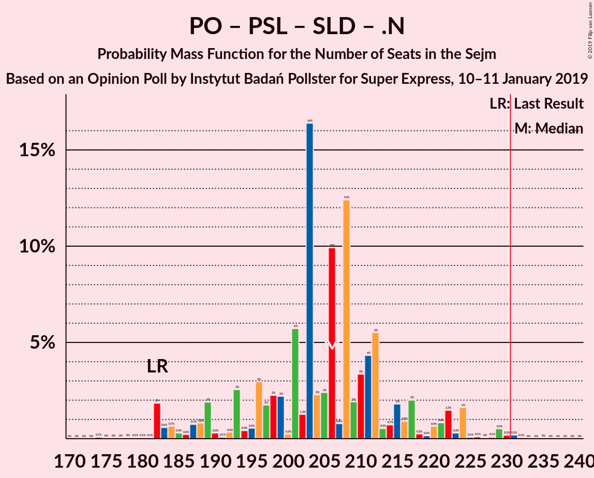
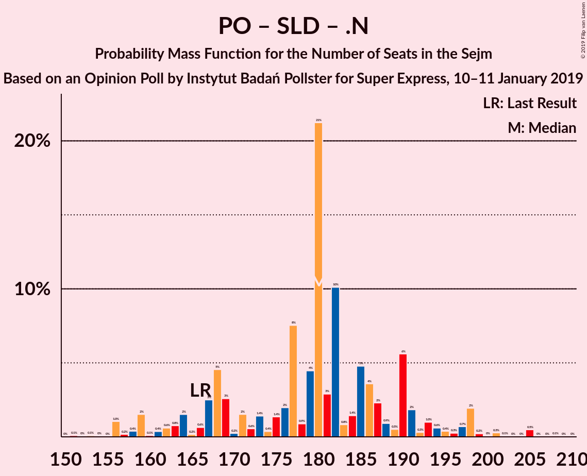

# Opinion Poll by Instytut Badań Pollster for Super Express, 10–11 January 2019

<a href="#voting-intentions">Voting Intentions</a> | <a href="#seats">Seats</a> | <a href="#coalitions">Coalitions</a> | <a href="#technical-information">Technical Information</a>

## Voting Intentions

### Confidence Intervals

| Party | Last Result | Poll Result | 80% Confidence Interval | 90% Confidence Interval | 95% Confidence Interval | 99% Confidence Interval |
|:-----:|:-----------:|:-----------:|:-----------------------:|:-----------------------:|:-----------------------:|:-----------------------:|
| Prawo i Sprawiedliwość | 37.6% | 40.0% | 38.1–41.9% |37.6–42.5% |37.1–43.0% |36.3–43.9% |
| Platforma Obywatelska | 24.1% | 29.0% | 27.3–30.8% |26.8–31.3% |26.4–31.7% |25.6–32.6% |
| Kukiz’15 | 8.8% | 7.0% | 6.1–8.1% |5.9–8.4% |5.7–8.7% |5.2–9.2% |
| Polskie Stronnictwo Ludowe | 5.1% | 7.0% | 6.1–8.1% |5.9–8.4% |5.7–8.7% |5.2–9.2% |
| Sojusz Lewicy Demokratycznej | 7.6% | 6.0% | 5.2–7.0% |5.0–7.3% |4.8–7.6% |4.4–8.1% |
| .Nowoczesna | 7.6% | 3.0% | 2.4–3.8% |2.3–4.0% |2.1–4.2% |1.9–4.6% |
| KORWiN | 4.8% | 3.0% | 2.4–3.8% |2.3–4.0% |2.1–4.2% |1.9–4.6% |
| Lewica Razem | 3.6% | 3.0% | 2.4–3.8% |2.3–4.0% |2.1–4.2% |1.9–4.6% |

*Note:* The poll result column reflects the actual value used in the calculations. Published results may vary slightly, and in addition be rounded to fewer digits.

## Seats

### Confidence Intervals

| Party | Last Result | Median | 80% Confidence Interval | 90% Confidence Interval | 95% Confidence Interval | 99% Confidence Interval |
|:-----:|:-----------:|:------:|:-----------------------:|:-----------------------:|:-----------------------:|:-----------------------:|
| <a href="#prawo-i-sprawiedliwość">Prawo i Sprawiedliwość</a> | 235 | 236 | 227–249 |227–251 |227–251 |214–254 |
| <a href="#platforma-obywatelska">Platforma Obywatelska</a> | 138 | 164 | 153–180 |153–180 |143–181 |143–188 |
| <a href="#kukiz’15">Kukiz’15</a> | 42 | 12 | 4–19 |4–24 |0–28 |0–30 |
| <a href="#polskie-stronnictwo-ludowe">Polskie Stronnictwo Ludowe</a> | 16 | 29 | 22–45 |14–45 |14–45 |14–45 |
| <a href="#sojusz-lewicy-demokratycznej">Sojusz Lewicy Demokratycznej</a> | 0 | 18 | 13–20 |0–20 |0–30 |0–30 |
| <a href="#.nowoczesna">.Nowoczesna</a> | 28 | 0 | 0 |0 |0 |0 |
| <a href="#korwin">KORWiN</a> | 0 | 0 | 0–5 |0–5 |0–5 |0–5 |
| <a href="#lewica-razem">Lewica Razem</a> | 0 | 0 | 0 |0 |0 |0 |

### Prawo i Sprawiedliwość

*For a full overview of the results for this party, see the [Prawo i Sprawiedliwość](party-prawoisprawiedliwość.html) page.*

| Number of Seats | Probability | Accumulated | Special Marks |
|:---------------:|:-----------:|:-----------:|:-------------:|
| 206 | 0% | 100% |  |
| 207 | 0% | 99.9% |  |
| 208 | 0.1% | 99.9% |  |
| 209 | 0.3% | 99.8% |  |
| 210 | 0% | 99.6% |  |
| 211 | 0% | 99.6% |  |
| 212 | 0% | 99.6% |  |
| 213 | 0% | 99.6% |  |
| 214 | 0.1% | 99.6% |  |
| 215 | 0% | 99.5% |  |
| 216 | 0% | 99.5% |  |
| 217 | 0% | 99.5% |  |
| 218 | 0% | 99.5% |  |
| 219 | 0% | 99.5% |  |
| 220 | 0% | 99.5% |  |
| 221 | 0% | 99.5% |  |
| 222 | 0% | 99.5% |  |
| 223 | 0% | 99.5% |  |
| 224 | 0% | 99.5% |  |
| 225 | 0% | 99.5% |  |
| 226 | 0.1% | 99.5% |  |
| 227 | 29% | 99.4% |  |
| 228 | 0% | 70% |  |
| 229 | 0% | 70% |  |
| 230 | 0% | 70% |  |
| 231 | 0% | 70% | Majority |
| 232 | 0% | 70% |  |
| 233 | 4% | 70% |  |
| 234 | 0% | 66% |  |
| 235 | 0% | 66% | Last Result |
| 236 | 34% | 66% | Median |
| 237 | 12% | 33% |  |
| 238 | 0% | 20% |  |
| 239 | 0% | 20% |  |
| 240 | 3% | 20% |  |
| 241 | 0.1% | 17% |  |
| 242 | 0% | 17% |  |
| 243 | 0% | 17% |  |
| 244 | 0% | 17% |  |
| 245 | 2% | 17% |  |
| 246 | 0.2% | 15% |  |
| 247 | 0.1% | 15% |  |
| 248 | 0% | 15% |  |
| 249 | 9% | 15% |  |
| 250 | 0% | 6% |  |
| 251 | 5% | 6% |  |
| 252 | 0% | 1.5% |  |
| 253 | 0.2% | 1.5% |  |
| 254 | 1.2% | 1.3% |  |
| 255 | 0% | 0.1% |  |
| 256 | 0.1% | 0.1% |  |
| 257 | 0% | 0% |  |

### Platforma Obywatelska

*For a full overview of the results for this party, see the [Platforma Obywatelska](party-platformaobywatelska.html) page.*

| Number of Seats | Probability | Accumulated | Special Marks |
|:---------------:|:-----------:|:-----------:|:-------------:|
| 138 | 0% | 100% | Last Result |
| 139 | 0% | 100% |  |
| 140 | 0% | 100% |  |
| 141 | 0% | 100% |  |
| 142 | 0% | 100% |  |
| 143 | 4% | 100% |  |
| 144 | 0% | 96% |  |
| 145 | 0% | 96% |  |
| 146 | 0.1% | 96% |  |
| 147 | 0.1% | 95% |  |
| 148 | 0% | 95% |  |
| 149 | 0% | 95% |  |
| 150 | 0% | 95% |  |
| 151 | 0% | 95% |  |
| 152 | 0% | 95% |  |
| 153 | 12% | 95% |  |
| 154 | 0.2% | 83% |  |
| 155 | 0.1% | 83% |  |
| 156 | 4% | 83% |  |
| 157 | 0% | 79% |  |
| 158 | 0.2% | 79% |  |
| 159 | 0.1% | 78% |  |
| 160 | 0% | 78% |  |
| 161 | 0% | 78% |  |
| 162 | 0% | 78% |  |
| 163 | 2% | 78% |  |
| 164 | 34% | 76% | Median |
| 165 | 3% | 42% |  |
| 166 | 0% | 39% |  |
| 167 | 0% | 39% |  |
| 168 | 0% | 39% |  |
| 169 | 0% | 39% |  |
| 170 | 1.2% | 39% |  |
| 171 | 0% | 38% |  |
| 172 | 0% | 38% |  |
| 173 | 25% | 38% |  |
| 174 | 0% | 13% |  |
| 175 | 0% | 13% |  |
| 176 | 0% | 13% |  |
| 177 | 0% | 13% |  |
| 178 | 0% | 13% |  |
| 179 | 0% | 13% |  |
| 180 | 9% | 13% |  |
| 181 | 3% | 4% |  |
| 182 | 0% | 0.9% |  |
| 183 | 0% | 0.9% |  |
| 184 | 0% | 0.9% |  |
| 185 | 0% | 0.9% |  |
| 186 | 0% | 0.9% |  |
| 187 | 0.2% | 0.9% |  |
| 188 | 0.6% | 0.7% |  |
| 189 | 0% | 0.1% |  |
| 190 | 0% | 0.1% |  |
| 191 | 0% | 0.1% |  |
| 192 | 0% | 0.1% |  |
| 193 | 0% | 0.1% |  |
| 194 | 0% | 0.1% |  |
| 195 | 0% | 0.1% |  |
| 196 | 0% | 0.1% |  |
| 197 | 0% | 0.1% |  |
| 198 | 0% | 0.1% |  |
| 199 | 0% | 0.1% |  |
| 200 | 0.1% | 0.1% |  |
| 201 | 0% | 0% |  |

### Kukiz’15

*For a full overview of the results for this party, see the [Kukiz’15](party-kukiz’15.html) page.*

| Number of Seats | Probability | Accumulated | Special Marks |
|:---------------:|:-----------:|:-----------:|:-------------:|
| 0 | 4% | 100% |  |
| 1 | 0% | 96% |  |
| 2 | 0% | 96% |  |
| 3 | 0% | 96% |  |
| 4 | 9% | 96% |  |
| 5 | 0% | 88% |  |
| 6 | 0% | 88% |  |
| 7 | 0% | 88% |  |
| 8 | 0% | 88% |  |
| 9 | 0% | 88% |  |
| 10 | 0% | 88% |  |
| 11 | 25% | 88% |  |
| 12 | 46% | 63% | Median |
| 13 | 0.1% | 17% |  |
| 14 | 0% | 17% |  |
| 15 | 0% | 17% |  |
| 16 | 0% | 17% |  |
| 17 | 0.6% | 17% |  |
| 18 | 3% | 16% |  |
| 19 | 3% | 13% |  |
| 20 | 0% | 10% |  |
| 21 | 0% | 10% |  |
| 22 | 4% | 10% |  |
| 23 | 0% | 5% |  |
| 24 | 0.2% | 5% |  |
| 25 | 0.1% | 5% |  |
| 26 | 0% | 5% |  |
| 27 | 0% | 5% |  |
| 28 | 4% | 5% |  |
| 29 | 0.1% | 0.6% |  |
| 30 | 0.3% | 0.5% |  |
| 31 | 0.1% | 0.3% |  |
| 32 | 0% | 0.2% |  |
| 33 | 0% | 0.2% |  |
| 34 | 0% | 0.2% |  |
| 35 | 0% | 0.2% |  |
| 36 | 0% | 0.2% |  |
| 37 | 0.1% | 0.2% |  |
| 38 | 0.1% | 0.1% |  |
| 39 | 0% | 0% |  |
| 40 | 0% | 0% |  |
| 41 | 0% | 0% |  |
| 42 | 0% | 0% | Last Result |

### Polskie Stronnictwo Ludowe

*For a full overview of the results for this party, see the [Polskie Stronnictwo Ludowe](party-polskiestronnictwoludowe.html) page.*

| Number of Seats | Probability | Accumulated | Special Marks |
|:---------------:|:-----------:|:-----------:|:-------------:|
| 0 | 0.1% | 100% |  |
| 1 | 0% | 99.9% |  |
| 2 | 0% | 99.9% |  |
| 3 | 0% | 99.9% |  |
| 4 | 0% | 99.9% |  |
| 5 | 0% | 99.9% |  |
| 6 | 0% | 99.9% |  |
| 7 | 0% | 99.9% |  |
| 8 | 0% | 99.9% |  |
| 9 | 0% | 99.9% |  |
| 10 | 0% | 99.9% |  |
| 11 | 0% | 99.9% |  |
| 12 | 0% | 99.9% |  |
| 13 | 0.2% | 99.9% |  |
| 14 | 9% | 99.7% |  |
| 15 | 0% | 91% |  |
| 16 | 0% | 91% | Last Result |
| 17 | 0% | 91% |  |
| 18 | 0% | 91% |  |
| 19 | 0.8% | 91% |  |
| 20 | 0% | 90% |  |
| 21 | 0.2% | 90% |  |
| 22 | 2% | 90% |  |
| 23 | 0% | 88% |  |
| 24 | 30% | 88% |  |
| 25 | 1.2% | 58% |  |
| 26 | 0.1% | 57% |  |
| 27 | 4% | 57% |  |
| 28 | 0% | 53% |  |
| 29 | 4% | 53% | Median |
| 30 | 33% | 49% |  |
| 31 | 0% | 16% |  |
| 32 | 0.5% | 16% |  |
| 33 | 0% | 15% |  |
| 34 | 0% | 15% |  |
| 35 | 0% | 15% |  |
| 36 | 0% | 15% |  |
| 37 | 3% | 15% |  |
| 38 | 0% | 12% |  |
| 39 | 0% | 12% |  |
| 40 | 0% | 12% |  |
| 41 | 0% | 12% |  |
| 42 | 0% | 12% |  |
| 43 | 0.1% | 12% |  |
| 44 | 0% | 12% |  |
| 45 | 12% | 12% |  |
| 46 | 0% | 0% |  |

### Sojusz Lewicy Demokratycznej

*For a full overview of the results for this party, see the [Sojusz Lewicy Demokratycznej](party-sojuszlewicydemokratycznej.html) page.*

| Number of Seats | Probability | Accumulated | Special Marks |
|:---------------:|:-----------:|:-----------:|:-------------:|
| 0 | 7% | 100% | Last Result |
| 1 | 0% | 93% |  |
| 2 | 0% | 93% |  |
| 3 | 0% | 93% |  |
| 4 | 0% | 93% |  |
| 5 | 0% | 93% |  |
| 6 | 0% | 93% |  |
| 7 | 0% | 93% |  |
| 8 | 0% | 93% |  |
| 9 | 0.3% | 93% |  |
| 10 | 0% | 92% |  |
| 11 | 1.2% | 92% |  |
| 12 | 0% | 91% |  |
| 13 | 21% | 91% |  |
| 14 | 0.1% | 71% |  |
| 15 | 0% | 70% |  |
| 16 | 0% | 70% |  |
| 17 | 0% | 70% |  |
| 18 | 33% | 70% | Median |
| 19 | 0.4% | 37% |  |
| 20 | 34% | 37% |  |
| 21 | 0% | 3% |  |
| 22 | 0% | 3% |  |
| 23 | 0% | 3% |  |
| 24 | 0.2% | 3% |  |
| 25 | 0.1% | 3% |  |
| 26 | 0% | 3% |  |
| 27 | 0% | 3% |  |
| 28 | 0% | 3% |  |
| 29 | 0.1% | 3% |  |
| 30 | 2% | 3% |  |
| 31 | 0.1% | 0.2% |  |
| 32 | 0% | 0% |  |

### .Nowoczesna

*For a full overview of the results for this party, see the [.Nowoczesna](party-nowoczesna.html) page.*

| Number of Seats | Probability | Accumulated | Special Marks |
|:---------------:|:-----------:|:-----------:|:-------------:|
| 0 | 100% | 100% | Median |
| 1 | 0% | 0% |  |
| 2 | 0% | 0% |  |
| 3 | 0% | 0% |  |
| 4 | 0% | 0% |  |
| 5 | 0% | 0% |  |
| 6 | 0% | 0% |  |
| 7 | 0% | 0% |  |
| 8 | 0% | 0% |  |
| 9 | 0% | 0% |  |
| 10 | 0% | 0% |  |
| 11 | 0% | 0% |  |
| 12 | 0% | 0% |  |
| 13 | 0% | 0% |  |
| 14 | 0% | 0% |  |
| 15 | 0% | 0% |  |
| 16 | 0% | 0% |  |
| 17 | 0% | 0% |  |
| 18 | 0% | 0% |  |
| 19 | 0% | 0% |  |
| 20 | 0% | 0% |  |
| 21 | 0% | 0% |  |
| 22 | 0% | 0% |  |
| 23 | 0% | 0% |  |
| 24 | 0% | 0% |  |
| 25 | 0% | 0% |  |
| 26 | 0% | 0% |  |
| 27 | 0% | 0% |  |
| 28 | 0% | 0% | Last Result |

### KORWiN

*For a full overview of the results for this party, see the [KORWiN](party-korwin.html) page.*

| Number of Seats | Probability | Accumulated | Special Marks |
|:---------------:|:-----------:|:-----------:|:-------------:|
| 0 | 75% | 100% | Last Result, Median |
| 1 | 0% | 25% |  |
| 2 | 0% | 25% |  |
| 3 | 0% | 25% |  |
| 4 | 0% | 25% |  |
| 5 | 25% | 25% |  |
| 6 | 0% | 0% |  |

### Lewica Razem

*For a full overview of the results for this party, see the [Lewica Razem](party-lewicarazem.html) page.*

| Number of Seats | Probability | Accumulated | Special Marks |
|:---------------:|:-----------:|:-----------:|:-------------:|
| 0 | 100% | 100% | Last Result, Median |

## Coalitions

### Confidence Intervals

| Coalition | Last Result | Median | Majority? | 80% Confidence Interval | 90% Confidence Interval | 95% Confidence Interval | 99% Confidence Interval |
|:---------:|:-----------:|:------:|:---------:|:-----------------------:|:-----------------------:|:-----------------------:|:-----------------------:|
| Prawo i Sprawiedliwość | 235 | 236 | 70% | 227–249 | 227–251 | 227–251 | 214–254 |
| Platforma Obywatelska – Polskie Stronnictwo Ludowe – Sojusz Lewicy Demokratycznej – .Nowoczesna – Lewica Razem | 182 | 212 | 0% | 205–217 | 190–217 | 187–217 | 187–222 |
| Platforma Obywatelska – Polskie Stronnictwo Ludowe – Sojusz Lewicy Demokratycznej – .Nowoczesna | 182 | 212 | 0% | 205–217 | 190–217 | 187–217 | 187–222 |
| Platforma Obywatelska – Polskie Stronnictwo Ludowe – .Nowoczesna | 182 | 194 | 0% | 185–198 | 177–202 | 167–208 | 167–208 |
| Platforma Obywatelska – Sojusz Lewicy Demokratycznej – .Nowoczesna | 166 | 182 | 0% | 166–193 | 165–193 | 163–193 | 163–193 |
| Platforma Obywatelska – .Nowoczesna | 166 | 164 | 0% | 153–180 | 153–180 | 143–181 | 143–188 |
| Platforma Obywatelska | 138 | 164 | 0% | 153–180 | 153–180 | 143–181 | 143–188 |

### Prawo i Sprawiedliwość

| Number of Seats | Probability | Accumulated | Special Marks |
|:---------------:|:-----------:|:-----------:|:-------------:|
| 206 | 0% | 100% |  |
| 207 | 0% | 99.9% |  |
| 208 | 0.1% | 99.9% |  |
| 209 | 0.3% | 99.8% |  |
| 210 | 0% | 99.6% |  |
| 211 | 0% | 99.6% |  |
| 212 | 0% | 99.6% |  |
| 213 | 0% | 99.6% |  |
| 214 | 0.1% | 99.6% |  |
| 215 | 0% | 99.5% |  |
| 216 | 0% | 99.5% |  |
| 217 | 0% | 99.5% |  |
| 218 | 0% | 99.5% |  |
| 219 | 0% | 99.5% |  |
| 220 | 0% | 99.5% |  |
| 221 | 0% | 99.5% |  |
| 222 | 0% | 99.5% |  |
| 223 | 0% | 99.5% |  |
| 224 | 0% | 99.5% |  |
| 225 | 0% | 99.5% |  |
| 226 | 0.1% | 99.5% |  |
| 227 | 29% | 99.4% |  |
| 228 | 0% | 70% |  |
| 229 | 0% | 70% |  |
| 230 | 0% | 70% |  |
| 231 | 0% | 70% | Majority |
| 232 | 0% | 70% |  |
| 233 | 4% | 70% |  |
| 234 | 0% | 66% |  |
| 235 | 0% | 66% | Last Result |
| 236 | 34% | 66% | Median |
| 237 | 12% | 33% |  |
| 238 | 0% | 20% |  |
| 239 | 0% | 20% |  |
| 240 | 3% | 20% |  |
| 241 | 0.1% | 17% |  |
| 242 | 0% | 17% |  |
| 243 | 0% | 17% |  |
| 244 | 0% | 17% |  |
| 245 | 2% | 17% |  |
| 246 | 0.2% | 15% |  |
| 247 | 0.1% | 15% |  |
| 248 | 0% | 15% |  |
| 249 | 9% | 15% |  |
| 250 | 0% | 6% |  |
| 251 | 5% | 6% |  |
| 252 | 0% | 1.5% |  |
| 253 | 0.2% | 1.5% |  |
| 254 | 1.2% | 1.3% |  |
| 255 | 0% | 0.1% |  |
| 256 | 0.1% | 0.1% |  |
| 257 | 0% | 0% |  |

### Platforma Obywatelska – Polskie Stronnictwo Ludowe – Sojusz Lewicy Demokratycznej – .Nowoczesna – Lewica Razem

| Number of Seats | Probability | Accumulated | Special Marks |
|:---------------:|:-----------:|:-----------:|:-------------:|
| 172 | 0.1% | 100% |  |
| 173 | 0% | 99.9% |  |
| 174 | 0% | 99.9% |  |
| 175 | 0% | 99.9% |  |
| 176 | 0% | 99.9% |  |
| 177 | 0.2% | 99.9% |  |
| 178 | 0% | 99.7% |  |
| 179 | 0.1% | 99.7% |  |
| 180 | 0% | 99.7% |  |
| 181 | 0% | 99.7% |  |
| 182 | 0% | 99.7% | Last Result |
| 183 | 0% | 99.7% |  |
| 184 | 0% | 99.7% |  |
| 185 | 0.1% | 99.7% |  |
| 186 | 0% | 99.6% |  |
| 187 | 4% | 99.5% |  |
| 188 | 0% | 95% |  |
| 189 | 0% | 95% |  |
| 190 | 0.2% | 95% |  |
| 191 | 0% | 95% |  |
| 192 | 0% | 95% |  |
| 193 | 0% | 95% |  |
| 194 | 0% | 95% |  |
| 195 | 0% | 95% |  |
| 196 | 0% | 95% |  |
| 197 | 0% | 95% |  |
| 198 | 0% | 95% |  |
| 199 | 0% | 95% |  |
| 200 | 0% | 95% |  |
| 201 | 0% | 95% |  |
| 202 | 3% | 95% |  |
| 203 | 0.1% | 92% |  |
| 204 | 0% | 92% |  |
| 205 | 4% | 92% |  |
| 206 | 1.3% | 88% |  |
| 207 | 9% | 87% |  |
| 208 | 3% | 77% |  |
| 209 | 0% | 74% |  |
| 210 | 0% | 74% |  |
| 211 | 12% | 74% | Median |
| 212 | 33% | 62% |  |
| 213 | 0.1% | 29% |  |
| 214 | 0% | 28% |  |
| 215 | 3% | 28% |  |
| 216 | 0% | 26% |  |
| 217 | 25% | 26% |  |
| 218 | 0% | 0.5% |  |
| 219 | 0% | 0.5% |  |
| 220 | 0% | 0.5% |  |
| 221 | 0% | 0.5% |  |
| 222 | 0.1% | 0.5% |  |
| 223 | 0.2% | 0.5% |  |
| 224 | 0% | 0.2% |  |
| 225 | 0% | 0.2% |  |
| 226 | 0% | 0.2% |  |
| 227 | 0% | 0.2% |  |
| 228 | 0% | 0.2% |  |
| 229 | 0.1% | 0.1% |  |
| 230 | 0.1% | 0.1% |  |
| 231 | 0% | 0% | Majority |

### Platforma Obywatelska – Polskie Stronnictwo Ludowe – Sojusz Lewicy Demokratycznej – .Nowoczesna

| Number of Seats | Probability | Accumulated | Special Marks |
|:---------------:|:-----------:|:-----------:|:-------------:|
| 172 | 0.1% | 100% |  |
| 173 | 0% | 99.9% |  |
| 174 | 0% | 99.9% |  |
| 175 | 0% | 99.9% |  |
| 176 | 0% | 99.9% |  |
| 177 | 0.2% | 99.9% |  |
| 178 | 0% | 99.7% |  |
| 179 | 0.1% | 99.7% |  |
| 180 | 0% | 99.7% |  |
| 181 | 0% | 99.7% |  |
| 182 | 0% | 99.7% | Last Result |
| 183 | 0% | 99.7% |  |
| 184 | 0% | 99.7% |  |
| 185 | 0.1% | 99.7% |  |
| 186 | 0% | 99.6% |  |
| 187 | 4% | 99.5% |  |
| 188 | 0% | 95% |  |
| 189 | 0% | 95% |  |
| 190 | 0.2% | 95% |  |
| 191 | 0% | 95% |  |
| 192 | 0% | 95% |  |
| 193 | 0% | 95% |  |
| 194 | 0% | 95% |  |
| 195 | 0% | 95% |  |
| 196 | 0% | 95% |  |
| 197 | 0% | 95% |  |
| 198 | 0% | 95% |  |
| 199 | 0% | 95% |  |
| 200 | 0% | 95% |  |
| 201 | 0% | 95% |  |
| 202 | 3% | 95% |  |
| 203 | 0.1% | 92% |  |
| 204 | 0% | 92% |  |
| 205 | 4% | 92% |  |
| 206 | 1.3% | 88% |  |
| 207 | 9% | 87% |  |
| 208 | 3% | 77% |  |
| 209 | 0% | 74% |  |
| 210 | 0% | 74% |  |
| 211 | 12% | 74% | Median |
| 212 | 33% | 62% |  |
| 213 | 0.1% | 29% |  |
| 214 | 0% | 28% |  |
| 215 | 3% | 28% |  |
| 216 | 0% | 26% |  |
| 217 | 25% | 26% |  |
| 218 | 0% | 0.5% |  |
| 219 | 0% | 0.5% |  |
| 220 | 0% | 0.5% |  |
| 221 | 0% | 0.5% |  |
| 222 | 0.1% | 0.5% |  |
| 223 | 0.2% | 0.5% |  |
| 224 | 0% | 0.2% |  |
| 225 | 0% | 0.2% |  |
| 226 | 0% | 0.2% |  |
| 227 | 0% | 0.2% |  |
| 228 | 0% | 0.2% |  |
| 229 | 0.1% | 0.1% |  |
| 230 | 0% | 0.1% |  |
| 231 | 0% | 0% | Majority |

### Platforma Obywatelska – Polskie Stronnictwo Ludowe – .Nowoczesna

| Number of Seats | Probability | Accumulated | Special Marks |
|:---------------:|:-----------:|:-----------:|:-------------:|
| 147 | 0.1% | 100% |  |
| 148 | 0% | 99.9% |  |
| 149 | 0% | 99.9% |  |
| 150 | 0% | 99.9% |  |
| 151 | 0% | 99.9% |  |
| 152 | 0% | 99.9% |  |
| 153 | 0% | 99.9% |  |
| 154 | 0% | 99.9% |  |
| 155 | 0.1% | 99.9% |  |
| 156 | 0% | 99.9% |  |
| 157 | 0% | 99.9% |  |
| 158 | 0% | 99.9% |  |
| 159 | 0% | 99.9% |  |
| 160 | 0% | 99.9% |  |
| 161 | 0% | 99.9% |  |
| 162 | 0% | 99.9% |  |
| 163 | 0% | 99.9% |  |
| 164 | 0% | 99.9% |  |
| 165 | 0% | 99.9% |  |
| 166 | 0.2% | 99.9% |  |
| 167 | 4% | 99.7% |  |
| 168 | 0% | 95% |  |
| 169 | 0% | 95% |  |
| 170 | 0% | 95% |  |
| 171 | 0% | 95% |  |
| 172 | 0% | 95% |  |
| 173 | 0% | 95% |  |
| 174 | 0% | 95% |  |
| 175 | 0.1% | 95% |  |
| 176 | 0% | 95% |  |
| 177 | 0.2% | 95% |  |
| 178 | 0% | 95% |  |
| 179 | 0% | 95% |  |
| 180 | 0% | 95% |  |
| 181 | 0% | 95% |  |
| 182 | 0% | 95% | Last Result |
| 183 | 0% | 95% |  |
| 184 | 0.1% | 95% |  |
| 185 | 7% | 95% |  |
| 186 | 0.1% | 88% |  |
| 187 | 0% | 88% |  |
| 188 | 0% | 88% |  |
| 189 | 0.1% | 88% |  |
| 190 | 0% | 88% |  |
| 191 | 0% | 88% |  |
| 192 | 0% | 88% |  |
| 193 | 0% | 88% | Median |
| 194 | 42% | 88% |  |
| 195 | 1.2% | 46% |  |
| 196 | 0.4% | 45% |  |
| 197 | 25% | 45% |  |
| 198 | 12% | 19% |  |
| 199 | 0% | 7% |  |
| 200 | 0% | 7% |  |
| 201 | 0% | 7% |  |
| 202 | 3% | 7% |  |
| 203 | 0% | 4% |  |
| 204 | 0% | 4% |  |
| 205 | 0% | 4% |  |
| 206 | 0% | 4% |  |
| 207 | 0.6% | 4% |  |
| 208 | 3% | 4% |  |
| 209 | 0% | 0.4% |  |
| 210 | 0% | 0.4% |  |
| 211 | 0% | 0.4% |  |
| 212 | 0% | 0.4% |  |
| 213 | 0% | 0.4% |  |
| 214 | 0.3% | 0.4% |  |
| 215 | 0% | 0.1% |  |
| 216 | 0% | 0.1% |  |
| 217 | 0% | 0.1% |  |
| 218 | 0% | 0.1% |  |
| 219 | 0% | 0.1% |  |
| 220 | 0% | 0.1% |  |
| 221 | 0% | 0.1% |  |
| 222 | 0% | 0.1% |  |
| 223 | 0% | 0.1% |  |
| 224 | 0% | 0.1% |  |
| 225 | 0% | 0.1% |  |
| 226 | 0% | 0.1% |  |
| 227 | 0% | 0.1% |  |
| 228 | 0% | 0.1% |  |
| 229 | 0.1% | 0.1% |  |
| 230 | 0% | 0% |  |

### Platforma Obywatelska – Sojusz Lewicy Demokratycznej – .Nowoczesna

| Number of Seats | Probability | Accumulated | Special Marks |
|:---------------:|:-----------:|:-----------:|:-------------:|
| 155 | 0% | 100% |  |
| 156 | 0% | 99.9% |  |
| 157 | 0% | 99.9% |  |
| 158 | 0.2% | 99.9% |  |
| 159 | 0.1% | 99.7% |  |
| 160 | 0.1% | 99.6% |  |
| 161 | 0% | 99.5% |  |
| 162 | 0% | 99.5% |  |
| 163 | 4% | 99.5% |  |
| 164 | 0% | 95% |  |
| 165 | 3% | 95% |  |
| 166 | 12% | 92% | Last Result |
| 167 | 0% | 80% |  |
| 168 | 0% | 80% |  |
| 169 | 0% | 80% |  |
| 170 | 0% | 80% |  |
| 171 | 0% | 80% |  |
| 172 | 0.1% | 80% |  |
| 173 | 0% | 80% |  |
| 174 | 0% | 80% |  |
| 175 | 0% | 80% |  |
| 176 | 4% | 80% |  |
| 177 | 0.2% | 76% |  |
| 178 | 0% | 76% |  |
| 179 | 0.1% | 76% |  |
| 180 | 0% | 76% |  |
| 181 | 5% | 76% |  |
| 182 | 33% | 71% | Median |
| 183 | 0.5% | 38% |  |
| 184 | 0.1% | 37% |  |
| 185 | 0.2% | 37% |  |
| 186 | 0% | 37% |  |
| 187 | 0% | 37% |  |
| 188 | 0.6% | 37% |  |
| 189 | 0% | 37% |  |
| 190 | 0% | 37% |  |
| 191 | 0% | 37% |  |
| 192 | 0% | 37% |  |
| 193 | 36% | 37% |  |
| 194 | 0% | 0.5% |  |
| 195 | 0% | 0.4% |  |
| 196 | 0.2% | 0.4% |  |
| 197 | 0% | 0.2% |  |
| 198 | 0% | 0.2% |  |
| 199 | 0.1% | 0.2% |  |
| 200 | 0.1% | 0.1% |  |
| 201 | 0% | 0.1% |  |
| 202 | 0% | 0.1% |  |
| 203 | 0% | 0.1% |  |
| 204 | 0% | 0.1% |  |
| 205 | 0% | 0% |  |

### Platforma Obywatelska – .Nowoczesna

| Number of Seats | Probability | Accumulated | Special Marks |
|:---------------:|:-----------:|:-----------:|:-------------:|
| 143 | 4% | 100% |  |
| 144 | 0% | 96% |  |
| 145 | 0% | 96% |  |
| 146 | 0.1% | 96% |  |
| 147 | 0.1% | 95% |  |
| 148 | 0% | 95% |  |
| 149 | 0% | 95% |  |
| 150 | 0% | 95% |  |
| 151 | 0% | 95% |  |
| 152 | 0% | 95% |  |
| 153 | 12% | 95% |  |
| 154 | 0.2% | 83% |  |
| 155 | 0.1% | 83% |  |
| 156 | 4% | 83% |  |
| 157 | 0% | 79% |  |
| 158 | 0.2% | 79% |  |
| 159 | 0.1% | 78% |  |
| 160 | 0% | 78% |  |
| 161 | 0% | 78% |  |
| 162 | 0% | 78% |  |
| 163 | 2% | 78% |  |
| 164 | 34% | 76% | Median |
| 165 | 3% | 42% |  |
| 166 | 0% | 39% | Last Result |
| 167 | 0% | 39% |  |
| 168 | 0% | 39% |  |
| 169 | 0% | 39% |  |
| 170 | 1.2% | 39% |  |
| 171 | 0% | 38% |  |
| 172 | 0% | 38% |  |
| 173 | 25% | 38% |  |
| 174 | 0% | 13% |  |
| 175 | 0% | 13% |  |
| 176 | 0% | 13% |  |
| 177 | 0% | 13% |  |
| 178 | 0% | 13% |  |
| 179 | 0% | 13% |  |
| 180 | 9% | 13% |  |
| 181 | 3% | 4% |  |
| 182 | 0% | 0.9% |  |
| 183 | 0% | 0.9% |  |
| 184 | 0% | 0.9% |  |
| 185 | 0% | 0.9% |  |
| 186 | 0% | 0.9% |  |
| 187 | 0.2% | 0.9% |  |
| 188 | 0.6% | 0.7% |  |
| 189 | 0% | 0.1% |  |
| 190 | 0% | 0.1% |  |
| 191 | 0% | 0.1% |  |
| 192 | 0% | 0.1% |  |
| 193 | 0% | 0.1% |  |
| 194 | 0% | 0.1% |  |
| 195 | 0% | 0.1% |  |
| 196 | 0% | 0.1% |  |
| 197 | 0% | 0.1% |  |
| 198 | 0% | 0.1% |  |
| 199 | 0% | 0.1% |  |
| 200 | 0.1% | 0.1% |  |
| 201 | 0% | 0% |  |

### Platforma Obywatelska

| Number of Seats | Probability | Accumulated | Special Marks |
|:---------------:|:-----------:|:-----------:|:-------------:|
| 138 | 0% | 100% | Last Result |
| 139 | 0% | 100% |  |
| 140 | 0% | 100% |  |
| 141 | 0% | 100% |  |
| 142 | 0% | 100% |  |
| 143 | 4% | 100% |  |
| 144 | 0% | 96% |  |
| 145 | 0% | 96% |  |
| 146 | 0.1% | 96% |  |
| 147 | 0.1% | 95% |  |
| 148 | 0% | 95% |  |
| 149 | 0% | 95% |  |
| 150 | 0% | 95% |  |
| 151 | 0% | 95% |  |
| 152 | 0% | 95% |  |
| 153 | 12% | 95% |  |
| 154 | 0.2% | 83% |  |
| 155 | 0.1% | 83% |  |
| 156 | 4% | 83% |  |
| 157 | 0% | 79% |  |
| 158 | 0.2% | 79% |  |
| 159 | 0.1% | 78% |  |
| 160 | 0% | 78% |  |
| 161 | 0% | 78% |  |
| 162 | 0% | 78% |  |
| 163 | 2% | 78% |  |
| 164 | 34% | 76% | Median |
| 165 | 3% | 42% |  |
| 166 | 0% | 39% |  |
| 167 | 0% | 39% |  |
| 168 | 0% | 39% |  |
| 169 | 0% | 39% |  |
| 170 | 1.2% | 39% |  |
| 171 | 0% | 38% |  |
| 172 | 0% | 38% |  |
| 173 | 25% | 38% |  |
| 174 | 0% | 13% |  |
| 175 | 0% | 13% |  |
| 176 | 0% | 13% |  |
| 177 | 0% | 13% |  |
| 178 | 0% | 13% |  |
| 179 | 0% | 13% |  |
| 180 | 9% | 13% |  |
| 181 | 3% | 4% |  |
| 182 | 0% | 0.9% |  |
| 183 | 0% | 0.9% |  |
| 184 | 0% | 0.9% |  |
| 185 | 0% | 0.9% |  |
| 186 | 0% | 0.9% |  |
| 187 | 0.2% | 0.9% |  |
| 188 | 0.6% | 0.7% |  |
| 189 | 0% | 0.1% |  |
| 190 | 0% | 0.1% |  |
| 191 | 0% | 0.1% |  |
| 192 | 0% | 0.1% |  |
| 193 | 0% | 0.1% |  |
| 194 | 0% | 0.1% |  |
| 195 | 0% | 0.1% |  |
| 196 | 0% | 0.1% |  |
| 197 | 0% | 0.1% |  |
| 198 | 0% | 0.1% |  |
| 199 | 0% | 0.1% |  |
| 200 | 0.1% | 0.1% |  |
| 201 | 0% | 0% |  |

## Technical Information

### Opinion Poll

+ **Polling firm:** Instytut Badań Pollster
+ **Commissioner(s):** Super Express
+ **Fieldwork period:** 10–11 January 2019

### Calculations

+ **Sample size:** 1097
+ **Simulations done:** 1,024
+ **Error estimate:** 3.06%

