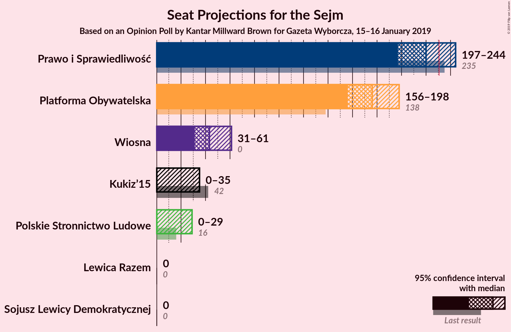
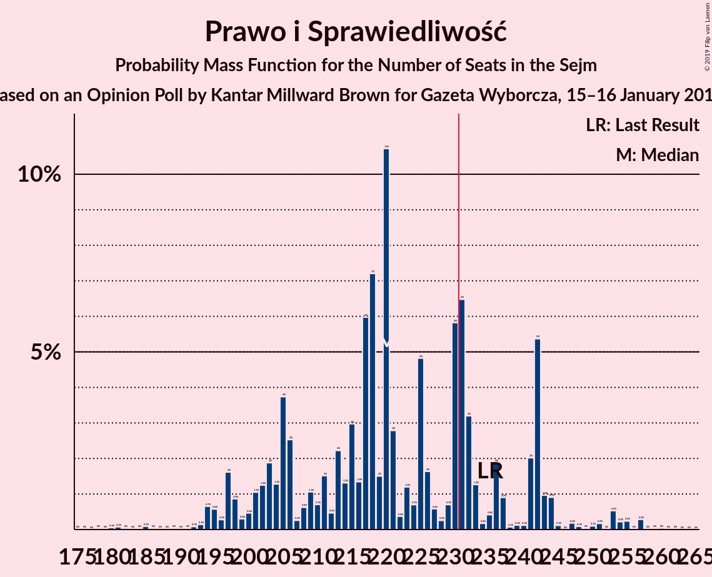
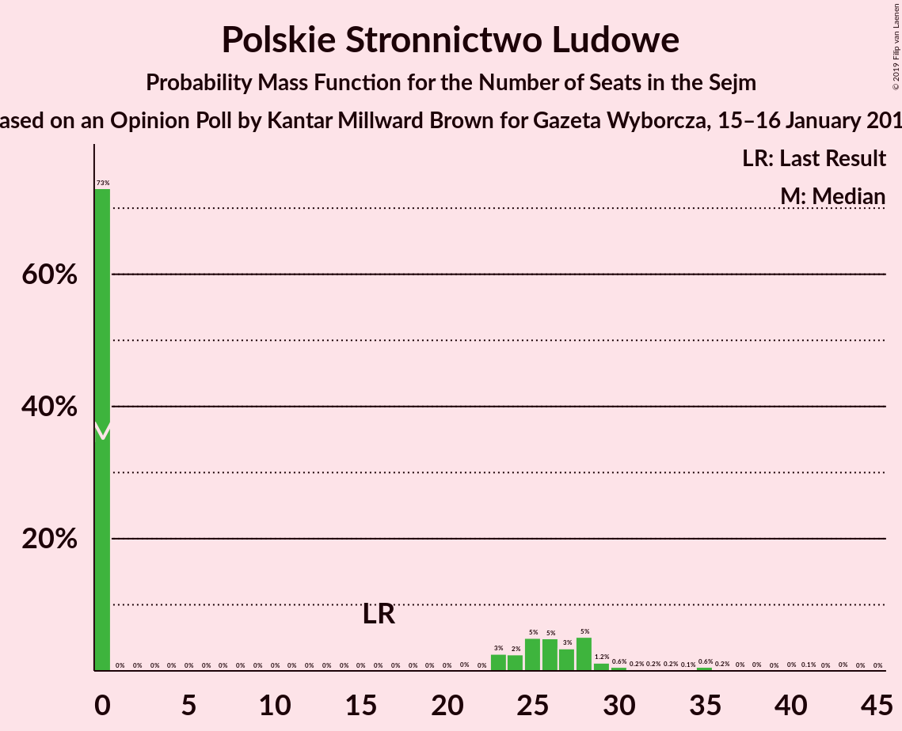

# Opinion Poll by Kantar Millward Brown for Gazeta Wyborcza, 15–16 January 2019

<a href="#voting-intentions">Voting Intentions</a> | <a href="#seats">Seats</a> | <a href="#coalitions">Coalitions</a> | <a href="#technical-information">Technical Information</a>

## Voting Intentions

### Confidence Intervals

| Party | Last Result | Poll Result | 80% Confidence Interval | 90% Confidence Interval | 95% Confidence Interval | 99% Confidence Interval |
|:-----:|:-----------:|:-----------:|:-----------------------:|:-----------------------:|:-----------------------:|:-----------------------:|
| Prawo i Sprawiedliwość | 37.6% | 27.8% | 26.0–29.6% |25.5–30.2% |25.1–30.6% |24.2–31.6% |
| Platforma Obywatelska | 24.1% | 23.2% | 21.5–25.0% |21.1–25.5% |20.7–25.9% |19.9–26.8% |
| Wiosna | 0.0% | 7.4% | 6.4–8.6% |6.2–8.9% |5.9–9.2% |5.5–9.8% |
| Kukiz’15 | 8.8% | 4.6% | 3.8–5.6% |3.6–5.8% |3.5–6.1% |3.1–6.6% |
| Polskie Stronnictwo Ludowe | 5.1% | 4.6% | 3.8–5.6% |3.6–5.8% |3.5–6.1% |3.1–6.6% |
| Sojusz Lewicy Demokratycznej | 7.6% | 2.8% | 2.2–3.6% |2.1–3.8% |1.9–4.0% |1.7–4.4% |
| Lewica Razem | 3.6% | 1.9% | 1.4–2.6% |1.3–2.8% |1.2–3.0% |1.0–3.3% |

*Note:* The poll result column reflects the actual value used in the calculations. Published results may vary slightly, and in addition be rounded to fewer digits.

## Seats

### Confidence Intervals

| Party | Last Result | Median | 80% Confidence Interval | 90% Confidence Interval | 95% Confidence Interval | 99% Confidence Interval |
|:-----:|:-----------:|:------:|:-----------------------:|:-----------------------:|:-----------------------:|:-----------------------:|
| <a href="#prawo-i-sprawiedliwość">Prawo i Sprawiedliwość</a> | 235 | 220 | 204–241 |199–242 |197–244 |191–255 |
| <a href="#platforma-obywatelska">Platforma Obywatelska</a> | 138 | 176 | 162–190 |158–195 |156–198 |151–209 |
| <a href="#wiosna">Wiosna</a> | 0 | 43 | 37–52 |34–56 |31–61 |29–67 |
| <a href="#kukiz’15">Kukiz’15</a> | 42 | 0 | 0–31 |0–34 |0–35 |0–40 |
| <a href="#polskie-stronnictwo-ludowe">Polskie Stronnictwo Ludowe</a> | 16 | 0 | 0–27 |0–28 |0–29 |0–35 |
| <a href="#sojusz-lewicy-demokratycznej">Sojusz Lewicy Demokratycznej</a> | 0 | 0 | 0 |0 |0 |0 |
| <a href="#lewica-razem">Lewica Razem</a> | 0 | 0 | 0 |0 |0 |0 |

### Prawo i Sprawiedliwość

*For a full overview of the results for this party, see the [Prawo i Sprawiedliwość](party-prawoisprawiedliwość.html) page.*

| Number of Seats | Probability | Accumulated | Special Marks |
|:---------------:|:-----------:|:-----------:|:-------------:|
| 178 | 0% | 100% |  |
| 179 | 0% | 99.9% |  |
| 180 | 0.1% | 99.9% |  |
| 181 | 0.1% | 99.9% |  |
| 182 | 0% | 99.8% |  |
| 183 | 0% | 99.8% |  |
| 184 | 0% | 99.7% |  |
| 185 | 0.1% | 99.7% |  |
| 186 | 0% | 99.6% |  |
| 187 | 0% | 99.6% |  |
| 188 | 0% | 99.6% |  |
| 189 | 0% | 99.6% |  |
| 190 | 0% | 99.5% |  |
| 191 | 0% | 99.5% |  |
| 192 | 0.1% | 99.5% |  |
| 193 | 0.1% | 99.4% |  |
| 194 | 0.7% | 99.3% |  |
| 195 | 0.6% | 98.6% |  |
| 196 | 0.3% | 98% |  |
| 197 | 2% | 98% |  |
| 198 | 0.9% | 96% |  |
| 199 | 0.3% | 95% |  |
| 200 | 0.5% | 95% |  |
| 201 | 1.1% | 95% |  |
| 202 | 1.2% | 93% |  |
| 203 | 2% | 92% |  |
| 204 | 1.3% | 90% |  |
| 205 | 4% | 89% |  |
| 206 | 3% | 85% |  |
| 207 | 0.3% | 83% |  |
| 208 | 0.6% | 83% |  |
| 209 | 1.1% | 82% |  |
| 210 | 0.7% | 81% |  |
| 211 | 2% | 80% |  |
| 212 | 0.5% | 79% |  |
| 213 | 2% | 78% |  |
| 214 | 1.3% | 76% |  |
| 215 | 3% | 75% |  |
| 216 | 1.3% | 72% |  |
| 217 | 6% | 70% |  |
| 218 | 7% | 64% |  |
| 219 | 2% | 57% |  |
| 220 | 11% | 56% | Median |
| 221 | 3% | 45% |  |
| 222 | 0.4% | 42% |  |
| 223 | 1.2% | 42% |  |
| 224 | 0.7% | 41% |  |
| 225 | 5% | 40% |  |
| 226 | 2% | 35% |  |
| 227 | 0.6% | 33% |  |
| 228 | 0.3% | 33% |  |
| 229 | 0.7% | 33% |  |
| 230 | 6% | 32% |  |
| 231 | 6% | 26% | Majority |
| 232 | 3% | 20% |  |
| 233 | 1.3% | 16% |  |
| 234 | 0.2% | 15% |  |
| 235 | 0.4% | 15% | Last Result |
| 236 | 2% | 14% |  |
| 237 | 0.9% | 13% |  |
| 238 | 0.1% | 12% |  |
| 239 | 0.1% | 12% |  |
| 240 | 0.1% | 12% |  |
| 241 | 2% | 11% |  |
| 242 | 5% | 9% |  |
| 243 | 1.0% | 4% |  |
| 244 | 0.9% | 3% |  |
| 245 | 0.1% | 2% |  |
| 246 | 0% | 2% |  |
| 247 | 0.2% | 2% |  |
| 248 | 0.1% | 2% |  |
| 249 | 0% | 2% |  |
| 250 | 0.1% | 2% |  |
| 251 | 0.2% | 2% |  |
| 252 | 0% | 1.4% |  |
| 253 | 0.5% | 1.4% |  |
| 254 | 0.2% | 0.9% |  |
| 255 | 0.2% | 0.7% |  |
| 256 | 0% | 0.4% |  |
| 257 | 0.3% | 0.4% |  |
| 258 | 0% | 0.1% |  |
| 259 | 0% | 0.1% |  |
| 260 | 0% | 0.1% |  |
| 261 | 0% | 0.1% |  |
| 262 | 0% | 0% |  |

### Platforma Obywatelska

*For a full overview of the results for this party, see the [Platforma Obywatelska](party-platformaobywatelska.html) page.*

| Number of Seats | Probability | Accumulated | Special Marks |
|:---------------:|:-----------:|:-----------:|:-------------:|
| 138 | 0% | 100% | Last Result |
| 139 | 0% | 100% |  |
| 140 | 0% | 100% |  |
| 141 | 0% | 100% |  |
| 142 | 0% | 99.9% |  |
| 143 | 0% | 99.9% |  |
| 144 | 0.1% | 99.9% |  |
| 145 | 0.1% | 99.9% |  |
| 146 | 0.1% | 99.7% |  |
| 147 | 0% | 99.7% |  |
| 148 | 0% | 99.7% |  |
| 149 | 0% | 99.6% |  |
| 150 | 0% | 99.6% |  |
| 151 | 0.2% | 99.6% |  |
| 152 | 0.1% | 99.4% |  |
| 153 | 0.1% | 99.3% |  |
| 154 | 0.2% | 99.1% |  |
| 155 | 0.5% | 99.0% |  |
| 156 | 1.0% | 98% |  |
| 157 | 2% | 97% |  |
| 158 | 2% | 96% |  |
| 159 | 0.8% | 94% |  |
| 160 | 0.2% | 93% |  |
| 161 | 0.9% | 93% |  |
| 162 | 2% | 92% |  |
| 163 | 0.8% | 90% |  |
| 164 | 2% | 89% |  |
| 165 | 5% | 88% |  |
| 166 | 2% | 82% |  |
| 167 | 4% | 81% |  |
| 168 | 2% | 77% |  |
| 169 | 4% | 75% |  |
| 170 | 2% | 71% |  |
| 171 | 2% | 68% |  |
| 172 | 0.8% | 67% |  |
| 173 | 0.6% | 66% |  |
| 174 | 5% | 65% |  |
| 175 | 5% | 60% |  |
| 176 | 9% | 56% | Median |
| 177 | 4% | 47% |  |
| 178 | 0.8% | 43% |  |
| 179 | 3% | 42% |  |
| 180 | 4% | 39% |  |
| 181 | 3% | 35% |  |
| 182 | 1.1% | 32% |  |
| 183 | 0.8% | 31% |  |
| 184 | 0.6% | 30% |  |
| 185 | 2% | 29% |  |
| 186 | 1.4% | 28% |  |
| 187 | 1.4% | 26% |  |
| 188 | 2% | 25% |  |
| 189 | 6% | 23% |  |
| 190 | 7% | 17% |  |
| 191 | 2% | 9% |  |
| 192 | 0.6% | 7% |  |
| 193 | 0.5% | 7% |  |
| 194 | 1.1% | 6% |  |
| 195 | 1.2% | 5% |  |
| 196 | 0.4% | 4% |  |
| 197 | 0.7% | 3% |  |
| 198 | 0.2% | 3% |  |
| 199 | 0.2% | 2% |  |
| 200 | 0.1% | 2% |  |
| 201 | 0.4% | 2% |  |
| 202 | 0% | 2% |  |
| 203 | 0.7% | 2% |  |
| 204 | 0.1% | 1.0% |  |
| 205 | 0% | 0.9% |  |
| 206 | 0% | 0.9% |  |
| 207 | 0% | 0.8% |  |
| 208 | 0% | 0.8% |  |
| 209 | 0.3% | 0.7% |  |
| 210 | 0.2% | 0.4% |  |
| 211 | 0.1% | 0.3% |  |
| 212 | 0% | 0.2% |  |
| 213 | 0.1% | 0.2% |  |
| 214 | 0% | 0% |  |

### Wiosna

*For a full overview of the results for this party, see the [Wiosna](party-wiosna.html) page.*

| Number of Seats | Probability | Accumulated | Special Marks |
|:---------------:|:-----------:|:-----------:|:-------------:|
| 0 | 0% | 100% | Last Result |
| 1 | 0% | 100% |  |
| 2 | 0% | 100% |  |
| 3 | 0% | 100% |  |
| 4 | 0% | 100% |  |
| 5 | 0% | 100% |  |
| 6 | 0% | 100% |  |
| 7 | 0% | 100% |  |
| 8 | 0% | 100% |  |
| 9 | 0% | 100% |  |
| 10 | 0% | 100% |  |
| 11 | 0% | 100% |  |
| 12 | 0% | 100% |  |
| 13 | 0% | 100% |  |
| 14 | 0% | 100% |  |
| 15 | 0% | 100% |  |
| 16 | 0% | 100% |  |
| 17 | 0% | 100% |  |
| 18 | 0% | 100% |  |
| 19 | 0% | 100% |  |
| 20 | 0% | 100% |  |
| 21 | 0% | 100% |  |
| 22 | 0% | 100% |  |
| 23 | 0% | 100% |  |
| 24 | 0% | 100% |  |
| 25 | 0% | 100% |  |
| 26 | 0% | 100% |  |
| 27 | 0.1% | 99.9% |  |
| 28 | 0.1% | 99.8% |  |
| 29 | 1.0% | 99.8% |  |
| 30 | 0.8% | 98.8% |  |
| 31 | 1.3% | 98% |  |
| 32 | 0.6% | 97% |  |
| 33 | 1.0% | 96% |  |
| 34 | 0.4% | 95% |  |
| 35 | 2% | 95% |  |
| 36 | 2% | 93% |  |
| 37 | 5% | 91% |  |
| 38 | 2% | 86% |  |
| 39 | 5% | 84% |  |
| 40 | 5% | 79% |  |
| 41 | 9% | 74% |  |
| 42 | 12% | 64% |  |
| 43 | 11% | 52% | Median |
| 44 | 2% | 41% |  |
| 45 | 2% | 38% |  |
| 46 | 3% | 36% |  |
| 47 | 5% | 33% |  |
| 48 | 3% | 28% |  |
| 49 | 7% | 25% |  |
| 50 | 5% | 19% |  |
| 51 | 3% | 13% |  |
| 52 | 1.2% | 11% |  |
| 53 | 2% | 9% |  |
| 54 | 2% | 7% |  |
| 55 | 0.3% | 5% |  |
| 56 | 0.4% | 5% |  |
| 57 | 0.5% | 5% |  |
| 58 | 0.6% | 4% |  |
| 59 | 0.3% | 3% |  |
| 60 | 0.6% | 3% |  |
| 61 | 0.2% | 3% |  |
| 62 | 0.5% | 2% |  |
| 63 | 0.1% | 2% |  |
| 64 | 0.3% | 2% |  |
| 65 | 0.5% | 1.4% |  |
| 66 | 0.4% | 0.9% |  |
| 67 | 0% | 0.5% |  |
| 68 | 0.1% | 0.5% |  |
| 69 | 0% | 0.4% |  |
| 70 | 0.2% | 0.3% |  |
| 71 | 0% | 0.2% |  |
| 72 | 0.1% | 0.2% |  |
| 73 | 0% | 0.1% |  |
| 74 | 0% | 0% |  |

### Kukiz’15

*For a full overview of the results for this party, see the [Kukiz’15](party-kukiz’15.html) page.*

| Number of Seats | Probability | Accumulated | Special Marks |
|:---------------:|:-----------:|:-----------:|:-------------:|
| 0 | 62% | 100% | Median |
| 1 | 0% | 38% |  |
| 2 | 0% | 38% |  |
| 3 | 0% | 38% |  |
| 4 | 0% | 38% |  |
| 5 | 0% | 38% |  |
| 6 | 0% | 38% |  |
| 7 | 0% | 38% |  |
| 8 | 0% | 38% |  |
| 9 | 0% | 38% |  |
| 10 | 0% | 38% |  |
| 11 | 0% | 38% |  |
| 12 | 0% | 38% |  |
| 13 | 0% | 38% |  |
| 14 | 0% | 38% |  |
| 15 | 0% | 38% |  |
| 16 | 0% | 38% |  |
| 17 | 0% | 38% |  |
| 18 | 0.1% | 38% |  |
| 19 | 0.1% | 38% |  |
| 20 | 0.5% | 38% |  |
| 21 | 0.3% | 37% |  |
| 22 | 3% | 37% |  |
| 23 | 3% | 34% |  |
| 24 | 0.9% | 31% |  |
| 25 | 6% | 30% |  |
| 26 | 8% | 24% |  |
| 27 | 0.3% | 16% |  |
| 28 | 3% | 16% |  |
| 29 | 2% | 13% |  |
| 30 | 0.8% | 11% |  |
| 31 | 3% | 11% |  |
| 32 | 0.7% | 8% |  |
| 33 | 1.0% | 7% |  |
| 34 | 3% | 6% |  |
| 35 | 2% | 3% |  |
| 36 | 0.2% | 1.4% |  |
| 37 | 0.2% | 1.2% |  |
| 38 | 0.3% | 1.0% |  |
| 39 | 0.1% | 0.7% |  |
| 40 | 0.4% | 0.5% |  |
| 41 | 0.1% | 0.2% |  |
| 42 | 0% | 0.1% | Last Result |
| 43 | 0% | 0.1% |  |
| 44 | 0% | 0% |  |

### Polskie Stronnictwo Ludowe

*For a full overview of the results for this party, see the [Polskie Stronnictwo Ludowe](party-polskiestronnictwoludowe.html) page.*

| Number of Seats | Probability | Accumulated | Special Marks |
|:---------------:|:-----------:|:-----------:|:-------------:|
| 0 | 73% | 100% | Median |
| 1 | 0% | 27% |  |
| 2 | 0% | 27% |  |
| 3 | 0% | 27% |  |
| 4 | 0% | 27% |  |
| 5 | 0% | 27% |  |
| 6 | 0% | 27% |  |
| 7 | 0% | 27% |  |
| 8 | 0% | 27% |  |
| 9 | 0% | 27% |  |
| 10 | 0% | 27% |  |
| 11 | 0% | 27% |  |
| 12 | 0% | 27% |  |
| 13 | 0% | 27% |  |
| 14 | 0% | 27% |  |
| 15 | 0% | 27% |  |
| 16 | 0% | 27% | Last Result |
| 17 | 0% | 27% |  |
| 18 | 0% | 27% |  |
| 19 | 0% | 27% |  |
| 20 | 0% | 27% |  |
| 21 | 0% | 27% |  |
| 22 | 0% | 27% |  |
| 23 | 3% | 27% |  |
| 24 | 2% | 24% |  |
| 25 | 5% | 22% |  |
| 26 | 5% | 17% |  |
| 27 | 3% | 12% |  |
| 28 | 5% | 9% |  |
| 29 | 1.2% | 4% |  |
| 30 | 0.6% | 2% |  |
| 31 | 0.2% | 2% |  |
| 32 | 0.2% | 1.5% |  |
| 33 | 0.2% | 1.3% |  |
| 34 | 0.1% | 1.1% |  |
| 35 | 0.6% | 1.1% |  |
| 36 | 0.2% | 0.5% |  |
| 37 | 0% | 0.3% |  |
| 38 | 0% | 0.3% |  |
| 39 | 0% | 0.2% |  |
| 40 | 0% | 0.2% |  |
| 41 | 0.1% | 0.2% |  |
| 42 | 0% | 0.1% |  |
| 43 | 0% | 0.1% |  |
| 44 | 0% | 0% |  |

### Sojusz Lewicy Demokratycznej

*For a full overview of the results for this party, see the [Sojusz Lewicy Demokratycznej](party-sojuszlewicydemokratycznej.html) page.*

| Number of Seats | Probability | Accumulated | Special Marks |
|:---------------:|:-----------:|:-----------:|:-------------:|
| 0 | 100% | 100% | Last Result, Median |

### Lewica Razem

*For a full overview of the results for this party, see the [Lewica Razem](party-lewicarazem.html) page.*

| Number of Seats | Probability | Accumulated | Special Marks |
|:---------------:|:-----------:|:-----------:|:-------------:|
| 0 | 100% | 100% | Last Result, Median |

## Coalitions

### Confidence Intervals

| Coalition | Last Result | Median | Majority? | 80% Confidence Interval | 90% Confidence Interval | 95% Confidence Interval | 99% Confidence Interval |
|:---------:|:-----------:|:------:|:---------:|:-----------------------:|:-----------------------:|:-----------------------:|:-----------------------:|
| Prawo i Sprawiedliwość | 235 | 220 | 26% | 204–241 | 199–242 | 197–244 | 191–255 |
| Platforma Obywatelska | 138 | 176 | 0% | 162–190 | 158–195 | 156–198 | 151–209 |

### Prawo i Sprawiedliwość

| Number of Seats | Probability | Accumulated | Special Marks |
|:---------------:|:-----------:|:-----------:|:-------------:|
| 178 | 0% | 100% |  |
| 179 | 0% | 99.9% |  |
| 180 | 0.1% | 99.9% |  |
| 181 | 0.1% | 99.9% |  |
| 182 | 0% | 99.8% |  |
| 183 | 0% | 99.8% |  |
| 184 | 0% | 99.7% |  |
| 185 | 0.1% | 99.7% |  |
| 186 | 0% | 99.6% |  |
| 187 | 0% | 99.6% |  |
| 188 | 0% | 99.6% |  |
| 189 | 0% | 99.6% |  |
| 190 | 0% | 99.5% |  |
| 191 | 0% | 99.5% |  |
| 192 | 0.1% | 99.5% |  |
| 193 | 0.1% | 99.4% |  |
| 194 | 0.7% | 99.3% |  |
| 195 | 0.6% | 98.6% |  |
| 196 | 0.3% | 98% |  |
| 197 | 2% | 98% |  |
| 198 | 0.9% | 96% |  |
| 199 | 0.3% | 95% |  |
| 200 | 0.5% | 95% |  |
| 201 | 1.1% | 95% |  |
| 202 | 1.2% | 93% |  |
| 203 | 2% | 92% |  |
| 204 | 1.3% | 90% |  |
| 205 | 4% | 89% |  |
| 206 | 3% | 85% |  |
| 207 | 0.3% | 83% |  |
| 208 | 0.6% | 83% |  |
| 209 | 1.1% | 82% |  |
| 210 | 0.7% | 81% |  |
| 211 | 2% | 80% |  |
| 212 | 0.5% | 79% |  |
| 213 | 2% | 78% |  |
| 214 | 1.3% | 76% |  |
| 215 | 3% | 75% |  |
| 216 | 1.3% | 72% |  |
| 217 | 6% | 70% |  |
| 218 | 7% | 64% |  |
| 219 | 2% | 57% |  |
| 220 | 11% | 56% | Median |
| 221 | 3% | 45% |  |
| 222 | 0.4% | 42% |  |
| 223 | 1.2% | 42% |  |
| 224 | 0.7% | 41% |  |
| 225 | 5% | 40% |  |
| 226 | 2% | 35% |  |
| 227 | 0.6% | 33% |  |
| 228 | 0.3% | 33% |  |
| 229 | 0.7% | 33% |  |
| 230 | 6% | 32% |  |
| 231 | 6% | 26% | Majority |
| 232 | 3% | 20% |  |
| 233 | 1.3% | 16% |  |
| 234 | 0.2% | 15% |  |
| 235 | 0.4% | 15% | Last Result |
| 236 | 2% | 14% |  |
| 237 | 0.9% | 13% |  |
| 238 | 0.1% | 12% |  |
| 239 | 0.1% | 12% |  |
| 240 | 0.1% | 12% |  |
| 241 | 2% | 11% |  |
| 242 | 5% | 9% |  |
| 243 | 1.0% | 4% |  |
| 244 | 0.9% | 3% |  |
| 245 | 0.1% | 2% |  |
| 246 | 0% | 2% |  |
| 247 | 0.2% | 2% |  |
| 248 | 0.1% | 2% |  |
| 249 | 0% | 2% |  |
| 250 | 0.1% | 2% |  |
| 251 | 0.2% | 2% |  |
| 252 | 0% | 1.4% |  |
| 253 | 0.5% | 1.4% |  |
| 254 | 0.2% | 0.9% |  |
| 255 | 0.2% | 0.7% |  |
| 256 | 0% | 0.4% |  |
| 257 | 0.3% | 0.4% |  |
| 258 | 0% | 0.1% |  |
| 259 | 0% | 0.1% |  |
| 260 | 0% | 0.1% |  |
| 261 | 0% | 0.1% |  |
| 262 | 0% | 0% |  |

### Platforma Obywatelska

| Number of Seats | Probability | Accumulated | Special Marks |
|:---------------:|:-----------:|:-----------:|:-------------:|
| 138 | 0% | 100% | Last Result |
| 139 | 0% | 100% |  |
| 140 | 0% | 100% |  |
| 141 | 0% | 100% |  |
| 142 | 0% | 99.9% |  |
| 143 | 0% | 99.9% |  |
| 144 | 0.1% | 99.9% |  |
| 145 | 0.1% | 99.9% |  |
| 146 | 0.1% | 99.7% |  |
| 147 | 0% | 99.7% |  |
| 148 | 0% | 99.7% |  |
| 149 | 0% | 99.6% |  |
| 150 | 0% | 99.6% |  |
| 151 | 0.2% | 99.6% |  |
| 152 | 0.1% | 99.4% |  |
| 153 | 0.1% | 99.3% |  |
| 154 | 0.2% | 99.1% |  |
| 155 | 0.5% | 99.0% |  |
| 156 | 1.0% | 98% |  |
| 157 | 2% | 97% |  |
| 158 | 2% | 96% |  |
| 159 | 0.8% | 94% |  |
| 160 | 0.2% | 93% |  |
| 161 | 0.9% | 93% |  |
| 162 | 2% | 92% |  |
| 163 | 0.8% | 90% |  |
| 164 | 2% | 89% |  |
| 165 | 5% | 88% |  |
| 166 | 2% | 82% |  |
| 167 | 4% | 81% |  |
| 168 | 2% | 77% |  |
| 169 | 4% | 75% |  |
| 170 | 2% | 71% |  |
| 171 | 2% | 68% |  |
| 172 | 0.8% | 67% |  |
| 173 | 0.6% | 66% |  |
| 174 | 5% | 65% |  |
| 175 | 5% | 60% |  |
| 176 | 9% | 56% | Median |
| 177 | 4% | 47% |  |
| 178 | 0.8% | 43% |  |
| 179 | 3% | 42% |  |
| 180 | 4% | 39% |  |
| 181 | 3% | 35% |  |
| 182 | 1.1% | 32% |  |
| 183 | 0.8% | 31% |  |
| 184 | 0.6% | 30% |  |
| 185 | 2% | 29% |  |
| 186 | 1.4% | 28% |  |
| 187 | 1.4% | 26% |  |
| 188 | 2% | 25% |  |
| 189 | 6% | 23% |  |
| 190 | 7% | 17% |  |
| 191 | 2% | 9% |  |
| 192 | 0.6% | 7% |  |
| 193 | 0.5% | 7% |  |
| 194 | 1.1% | 6% |  |
| 195 | 1.2% | 5% |  |
| 196 | 0.4% | 4% |  |
| 197 | 0.7% | 3% |  |
| 198 | 0.2% | 3% |  |
| 199 | 0.2% | 2% |  |
| 200 | 0.1% | 2% |  |
| 201 | 0.4% | 2% |  |
| 202 | 0% | 2% |  |
| 203 | 0.7% | 2% |  |
| 204 | 0.1% | 1.0% |  |
| 205 | 0% | 0.9% |  |
| 206 | 0% | 0.9% |  |
| 207 | 0% | 0.8% |  |
| 208 | 0% | 0.8% |  |
| 209 | 0.3% | 0.7% |  |
| 210 | 0.2% | 0.4% |  |
| 211 | 0.1% | 0.3% |  |
| 212 | 0% | 0.2% |  |
| 213 | 0.1% | 0.2% |  |
| 214 | 0% | 0% |  |

## Technical Information

### Opinion Poll

+ **Polling firm:** Kantar Millward Brown
+ **Commissioner(s):** Gazeta Wyborcza
+ **Fieldwork period:** 15–16 January 2019

### Calculations

+ **Sample size:** 1001
+ **Simulations done:** 131,072
+ **Error estimate:** 2.56%

