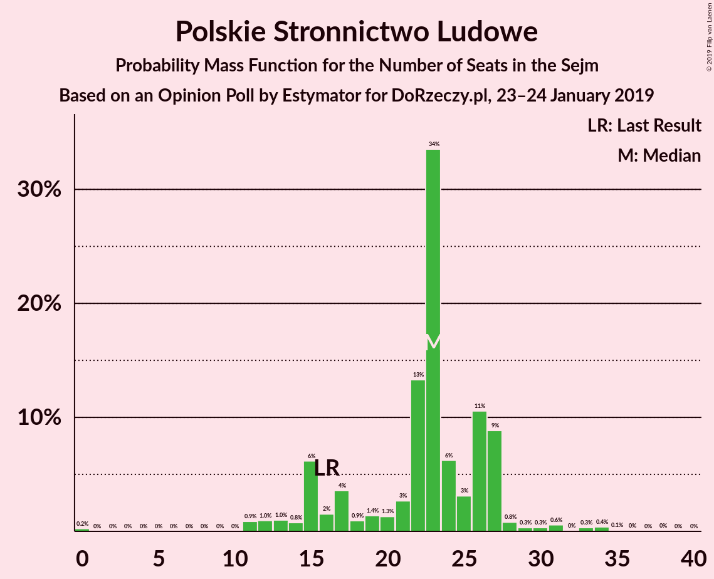

# Opinion Poll by Estymator for DoRzeczy.pl, 23–24 January 2019

<a href="#voting-intentions">Voting Intentions</a> | <a href="#seats">Seats</a> | <a href="#coalitions">Coalitions</a> | <a href="#technical-information">Technical Information</a>

## Voting Intentions

### Confidence Intervals

| Party | Last Result | Poll Result | 80% Confidence Interval | 90% Confidence Interval | 95% Confidence Interval | 99% Confidence Interval |
|:-----:|:-----------:|:-----------:|:-----------------------:|:-----------------------:|:-----------------------:|:-----------------------:|
| Prawo i Sprawiedliwość | 37.6% | 42.4% | 40.4–44.4% |39.9–45.0% |39.4–45.5% |38.4–46.5% |
| Platforma Obywatelska | 24.1% | 31.1% | 29.3–33.1% |28.8–33.6% |28.3–34.1% |27.5–35.0% |
| Kukiz’15 | 8.8% | 8.6% | 7.5–9.8% |7.2–10.2% |7.0–10.5% |6.5–11.1% |
| Polskie Stronnictwo Ludowe | 5.1% | 6.8% | 5.9–7.9% |5.6–8.2% |5.4–8.5% |5.0–9.1% |
| Sojusz Lewicy Demokratycznej | 7.6% | 4.8% | 4.0–5.8% |3.8–6.1% |3.6–6.3% |3.3–6.8% |
| Lewica Razem | 3.6% | 1.6% | 1.2–2.2% |1.1–2.4% |1.0–2.6% |0.8–2.9% |
| .Nowoczesna | 7.6% | 1.4% | 1.0–2.0% |0.9–2.2% |0.8–2.3% |0.7–2.7% |
| KORWiN | 4.8% | 1.4% | 1.0–2.0% |0.9–2.2% |0.8–2.3% |0.7–2.7% |

*Note:* The poll result column reflects the actual value used in the calculations. Published results may vary slightly, and in addition be rounded to fewer digits.

## Seats

### Confidence Intervals

| Party | Last Result | Median | 80% Confidence Interval | 90% Confidence Interval | 95% Confidence Interval | 99% Confidence Interval |
|:-----:|:-----------:|:------:|:-----------------------:|:-----------------------:|:-----------------------:|:-----------------------:|
| <a href="#prawo-i-sprawiedliwość">Prawo i Sprawiedliwość</a> | 235 | 236 | 220–246 |216–250 |215–250 |210–254 |
| <a href="#platforma-obywatelska">Platforma Obywatelska</a> | 138 | 169 | 159–179 |156–181 |153–184 |145–188 |
| <a href="#kukiz’15">Kukiz’15</a> | 42 | 31 | 26–41 |21–43 |20–44 |16–47 |
| <a href="#polskie-stronnictwo-ludowe">Polskie Stronnictwo Ludowe</a> | 16 | 23 | 15–27 |15–27 |13–28 |11–34 |
| <a href="#sojusz-lewicy-demokratycznej">Sojusz Lewicy Demokratycznej</a> | 0 | 0 | 0–9 |0–11 |0–14 |0–21 |
| <a href="#lewica-razem">Lewica Razem</a> | 0 | 0 | 0 |0 |0 |0 |
| <a href="#.nowoczesna">.Nowoczesna</a> | 28 | 0 | 0 |0 |0 |0 |
| <a href="#korwin">KORWiN</a> | 0 | 0 | 0 |0 |0 |0 |

### Prawo i Sprawiedliwość

*For a full overview of the results for this party, see the [Prawo i Sprawiedliwość](party-prawoisprawiedliwość.html) page.*

| Number of Seats | Probability | Accumulated | Special Marks |
|:---------------:|:-----------:|:-----------:|:-------------:|
| 204 | 0% | 100% |  |
| 205 | 0.1% | 99.9% |  |
| 206 | 0.1% | 99.9% |  |
| 207 | 0% | 99.8% |  |
| 208 | 0.1% | 99.7% |  |
| 209 | 0.1% | 99.6% |  |
| 210 | 0.7% | 99.6% |  |
| 211 | 0.1% | 98.9% |  |
| 212 | 0.3% | 98.8% |  |
| 213 | 0.2% | 98.5% |  |
| 214 | 0.4% | 98% |  |
| 215 | 2% | 98% |  |
| 216 | 1.4% | 96% |  |
| 217 | 4% | 95% |  |
| 218 | 0.7% | 91% |  |
| 219 | 0.2% | 91% |  |
| 220 | 4% | 90% |  |
| 221 | 0.3% | 86% |  |
| 222 | 2% | 86% |  |
| 223 | 0.4% | 84% |  |
| 224 | 0.6% | 83% |  |
| 225 | 0.7% | 83% |  |
| 226 | 1.0% | 82% |  |
| 227 | 0.4% | 81% |  |
| 228 | 1.1% | 81% |  |
| 229 | 2% | 79% |  |
| 230 | 5% | 77% |  |
| 231 | 2% | 73% | Majority |
| 232 | 5% | 70% |  |
| 233 | 4% | 65% |  |
| 234 | 3% | 61% |  |
| 235 | 3% | 58% | Last Result |
| 236 | 23% | 56% | Median |
| 237 | 7% | 32% |  |
| 238 | 0.5% | 25% |  |
| 239 | 0.8% | 25% |  |
| 240 | 1.0% | 24% |  |
| 241 | 3% | 23% |  |
| 242 | 7% | 20% |  |
| 243 | 2% | 13% |  |
| 244 | 1.0% | 12% |  |
| 245 | 0.3% | 11% |  |
| 246 | 0.9% | 10% |  |
| 247 | 2% | 9% |  |
| 248 | 0.3% | 7% |  |
| 249 | 1.1% | 7% |  |
| 250 | 4% | 6% |  |
| 251 | 0.8% | 2% |  |
| 252 | 0.1% | 0.8% |  |
| 253 | 0% | 0.7% |  |
| 254 | 0.1% | 0.6% |  |
| 255 | 0.2% | 0.5% |  |
| 256 | 0.1% | 0.3% |  |
| 257 | 0% | 0.2% |  |
| 258 | 0% | 0.2% |  |
| 259 | 0% | 0.2% |  |
| 260 | 0% | 0.2% |  |
| 261 | 0.1% | 0.1% |  |
| 262 | 0% | 0.1% |  |
| 263 | 0% | 0.1% |  |
| 264 | 0% | 0% |  |

### Platforma Obywatelska

*For a full overview of the results for this party, see the [Platforma Obywatelska](party-platformaobywatelska.html) page.*

| Number of Seats | Probability | Accumulated | Special Marks |
|:---------------:|:-----------:|:-----------:|:-------------:|
| 138 | 0% | 100% | Last Result |
| 139 | 0% | 100% |  |
| 140 | 0% | 99.9% |  |
| 141 | 0% | 99.9% |  |
| 142 | 0.3% | 99.9% |  |
| 143 | 0% | 99.7% |  |
| 144 | 0.1% | 99.6% |  |
| 145 | 0.1% | 99.6% |  |
| 146 | 0% | 99.4% |  |
| 147 | 0.1% | 99.4% |  |
| 148 | 0.1% | 99.3% |  |
| 149 | 0.3% | 99.2% |  |
| 150 | 0.4% | 98.9% |  |
| 151 | 0.6% | 98.5% |  |
| 152 | 0.1% | 98% |  |
| 153 | 0.6% | 98% |  |
| 154 | 1.0% | 97% |  |
| 155 | 1.2% | 96% |  |
| 156 | 1.1% | 95% |  |
| 157 | 0.4% | 94% |  |
| 158 | 0.6% | 94% |  |
| 159 | 4% | 93% |  |
| 160 | 4% | 89% |  |
| 161 | 6% | 86% |  |
| 162 | 6% | 79% |  |
| 163 | 1.1% | 74% |  |
| 164 | 4% | 73% |  |
| 165 | 8% | 69% |  |
| 166 | 4% | 60% |  |
| 167 | 1.0% | 57% |  |
| 168 | 6% | 56% |  |
| 169 | 5% | 50% | Median |
| 170 | 1.2% | 45% |  |
| 171 | 22% | 44% |  |
| 172 | 4% | 22% |  |
| 173 | 2% | 18% |  |
| 174 | 3% | 15% |  |
| 175 | 0.2% | 13% |  |
| 176 | 0.4% | 13% |  |
| 177 | 0.1% | 12% |  |
| 178 | 0.5% | 12% |  |
| 179 | 4% | 12% |  |
| 180 | 2% | 7% |  |
| 181 | 2% | 5% |  |
| 182 | 0.1% | 4% |  |
| 183 | 0.3% | 4% |  |
| 184 | 1.1% | 3% |  |
| 185 | 1.3% | 2% |  |
| 186 | 0.1% | 0.8% |  |
| 187 | 0.1% | 0.7% |  |
| 188 | 0.1% | 0.6% |  |
| 189 | 0% | 0.5% |  |
| 190 | 0% | 0.4% |  |
| 191 | 0.2% | 0.4% |  |
| 192 | 0.1% | 0.2% |  |
| 193 | 0.1% | 0.2% |  |
| 194 | 0% | 0% |  |

### Kukiz’15

*For a full overview of the results for this party, see the [Kukiz’15](party-kukiz’15.html) page.*

| Number of Seats | Probability | Accumulated | Special Marks |
|:---------------:|:-----------:|:-----------:|:-------------:|
| 11 | 0% | 100% |  |
| 12 | 0% | 99.9% |  |
| 13 | 0% | 99.9% |  |
| 14 | 0% | 99.9% |  |
| 15 | 0% | 99.9% |  |
| 16 | 0.7% | 99.8% |  |
| 17 | 0% | 99.1% |  |
| 18 | 0% | 99.1% |  |
| 19 | 0.3% | 99.1% |  |
| 20 | 3% | 98.7% |  |
| 21 | 1.5% | 96% |  |
| 22 | 0.7% | 95% |  |
| 23 | 1.3% | 94% |  |
| 24 | 1.5% | 93% |  |
| 25 | 0.8% | 91% |  |
| 26 | 0.5% | 90% |  |
| 27 | 5% | 90% |  |
| 28 | 4% | 85% |  |
| 29 | 0.7% | 81% |  |
| 30 | 23% | 80% |  |
| 31 | 7% | 57% | Median |
| 32 | 0.7% | 50% |  |
| 33 | 2% | 49% |  |
| 34 | 2% | 48% |  |
| 35 | 2% | 46% |  |
| 36 | 8% | 44% |  |
| 37 | 5% | 36% |  |
| 38 | 8% | 31% |  |
| 39 | 1.4% | 23% |  |
| 40 | 6% | 21% |  |
| 41 | 7% | 16% |  |
| 42 | 3% | 9% | Last Result |
| 43 | 3% | 6% |  |
| 44 | 0.9% | 3% |  |
| 45 | 0.7% | 2% |  |
| 46 | 0.8% | 1.3% |  |
| 47 | 0.1% | 0.5% |  |
| 48 | 0.1% | 0.4% |  |
| 49 | 0.2% | 0.3% |  |
| 50 | 0% | 0.1% |  |
| 51 | 0% | 0% |  |

### Polskie Stronnictwo Ludowe

*For a full overview of the results for this party, see the [Polskie Stronnictwo Ludowe](party-polskiestronnictwoludowe.html) page.*

| Number of Seats | Probability | Accumulated | Special Marks |
|:---------------:|:-----------:|:-----------:|:-------------:|
| 0 | 0.2% | 100% |  |
| 1 | 0% | 99.8% |  |
| 2 | 0% | 99.8% |  |
| 3 | 0% | 99.8% |  |
| 4 | 0% | 99.8% |  |
| 5 | 0% | 99.8% |  |
| 6 | 0% | 99.8% |  |
| 7 | 0% | 99.8% |  |
| 8 | 0% | 99.8% |  |
| 9 | 0% | 99.8% |  |
| 10 | 0% | 99.8% |  |
| 11 | 0.9% | 99.8% |  |
| 12 | 1.0% | 98.9% |  |
| 13 | 1.0% | 98% |  |
| 14 | 0.8% | 97% |  |
| 15 | 6% | 96% |  |
| 16 | 2% | 90% | Last Result |
| 17 | 4% | 88% |  |
| 18 | 0.9% | 85% |  |
| 19 | 1.4% | 84% |  |
| 20 | 1.3% | 83% |  |
| 21 | 3% | 81% |  |
| 22 | 13% | 79% |  |
| 23 | 34% | 65% | Median |
| 24 | 6% | 32% |  |
| 25 | 3% | 26% |  |
| 26 | 11% | 22% |  |
| 27 | 9% | 12% |  |
| 28 | 0.8% | 3% |  |
| 29 | 0.3% | 2% |  |
| 30 | 0.3% | 2% |  |
| 31 | 0.6% | 2% |  |
| 32 | 0% | 1.0% |  |
| 33 | 0.3% | 0.9% |  |
| 34 | 0.4% | 0.6% |  |
| 35 | 0.1% | 0.2% |  |
| 36 | 0% | 0.1% |  |
| 37 | 0% | 0.1% |  |
| 38 | 0% | 0.1% |  |
| 39 | 0% | 0% |  |

### Sojusz Lewicy Demokratycznej

*For a full overview of the results for this party, see the [Sojusz Lewicy Demokratycznej](party-sojuszlewicydemokratycznej.html) page.*

| Number of Seats | Probability | Accumulated | Special Marks |
|:---------------:|:-----------:|:-----------:|:-------------:|
| 0 | 74% | 100% | Last Result, Median |
| 1 | 0% | 26% |  |
| 2 | 0% | 26% |  |
| 3 | 0% | 26% |  |
| 4 | 0% | 26% |  |
| 5 | 0% | 26% |  |
| 6 | 0.2% | 26% |  |
| 7 | 6% | 26% |  |
| 8 | 6% | 20% |  |
| 9 | 4% | 14% |  |
| 10 | 1.5% | 10% |  |
| 11 | 3% | 8% |  |
| 12 | 2% | 5% |  |
| 13 | 0.2% | 3% |  |
| 14 | 1.0% | 3% |  |
| 15 | 0.7% | 2% |  |
| 16 | 0% | 1.0% |  |
| 17 | 0.1% | 0.9% |  |
| 18 | 0.2% | 0.8% |  |
| 19 | 0.1% | 0.7% |  |
| 20 | 0% | 0.6% |  |
| 21 | 0.2% | 0.5% |  |
| 22 | 0% | 0.3% |  |
| 23 | 0% | 0.3% |  |
| 24 | 0.1% | 0.2% |  |
| 25 | 0% | 0.2% |  |
| 26 | 0% | 0.1% |  |
| 27 | 0% | 0.1% |  |
| 28 | 0% | 0% |  |

### Lewica Razem

*For a full overview of the results for this party, see the [Lewica Razem](party-lewicarazem.html) page.*

| Number of Seats | Probability | Accumulated | Special Marks |
|:---------------:|:-----------:|:-----------:|:-------------:|
| 0 | 100% | 100% | Last Result, Median |

### .Nowoczesna

*For a full overview of the results for this party, see the [.Nowoczesna](party-nowoczesna.html) page.*

| Number of Seats | Probability | Accumulated | Special Marks |
|:---------------:|:-----------:|:-----------:|:-------------:|
| 0 | 100% | 100% | Median |
| 1 | 0% | 0% |  |
| 2 | 0% | 0% |  |
| 3 | 0% | 0% |  |
| 4 | 0% | 0% |  |
| 5 | 0% | 0% |  |
| 6 | 0% | 0% |  |
| 7 | 0% | 0% |  |
| 8 | 0% | 0% |  |
| 9 | 0% | 0% |  |
| 10 | 0% | 0% |  |
| 11 | 0% | 0% |  |
| 12 | 0% | 0% |  |
| 13 | 0% | 0% |  |
| 14 | 0% | 0% |  |
| 15 | 0% | 0% |  |
| 16 | 0% | 0% |  |
| 17 | 0% | 0% |  |
| 18 | 0% | 0% |  |
| 19 | 0% | 0% |  |
| 20 | 0% | 0% |  |
| 21 | 0% | 0% |  |
| 22 | 0% | 0% |  |
| 23 | 0% | 0% |  |
| 24 | 0% | 0% |  |
| 25 | 0% | 0% |  |
| 26 | 0% | 0% |  |
| 27 | 0% | 0% |  |
| 28 | 0% | 0% | Last Result |

### KORWiN

*For a full overview of the results for this party, see the [KORWiN](party-korwin.html) page.*

| Number of Seats | Probability | Accumulated | Special Marks |
|:---------------:|:-----------:|:-----------:|:-------------:|
| 0 | 100% | 100% | Last Result, Median |

## Coalitions

### Confidence Intervals

| Coalition | Last Result | Median | Majority? | 80% Confidence Interval | 90% Confidence Interval | 95% Confidence Interval | 99% Confidence Interval |
|:---------:|:-----------:|:------:|:---------:|:-----------------------:|:-----------------------:|:-----------------------:|:-----------------------:|
| Prawo i Sprawiedliwość | 235 | 236 | 73% | 220–246 | 216–250 | 215–250 | 210–254 |
| Platforma Obywatelska – Polskie Stronnictwo Ludowe – Sojusz Lewicy Demokratycznej – Lewica Razem – .Nowoczesna | 182 | 194 | 0% | 182–204 | 182–212 | 177–212 | 174–216 |
| Platforma Obywatelska – Polskie Stronnictwo Ludowe – Sojusz Lewicy Demokratycznej – .Nowoczesna | 182 | 194 | 0% | 182–204 | 182–212 | 177–212 | 174–216 |
| Platforma Obywatelska – Polskie Stronnictwo Ludowe – .Nowoczesna | 182 | 191 | 0% | 182–201 | 177–203 | 174–208 | 165–212 |
| Platforma Obywatelska – Sojusz Lewicy Demokratycznej – .Nowoczesna | 166 | 171 | 0% | 160–183 | 159–188 | 157–188 | 151–194 |
| Platforma Obywatelska – .Nowoczesna | 166 | 169 | 0% | 159–179 | 156–181 | 153–184 | 145–188 |
| Platforma Obywatelska | 138 | 169 | 0% | 159–179 | 156–181 | 153–184 | 145–188 |

### Prawo i Sprawiedliwość

| Number of Seats | Probability | Accumulated | Special Marks |
|:---------------:|:-----------:|:-----------:|:-------------:|
| 204 | 0% | 100% |  |
| 205 | 0.1% | 99.9% |  |
| 206 | 0.1% | 99.9% |  |
| 207 | 0% | 99.8% |  |
| 208 | 0.1% | 99.7% |  |
| 209 | 0.1% | 99.6% |  |
| 210 | 0.7% | 99.6% |  |
| 211 | 0.1% | 98.9% |  |
| 212 | 0.3% | 98.8% |  |
| 213 | 0.2% | 98.5% |  |
| 214 | 0.4% | 98% |  |
| 215 | 2% | 98% |  |
| 216 | 1.4% | 96% |  |
| 217 | 4% | 95% |  |
| 218 | 0.7% | 91% |  |
| 219 | 0.2% | 91% |  |
| 220 | 4% | 90% |  |
| 221 | 0.3% | 86% |  |
| 222 | 2% | 86% |  |
| 223 | 0.4% | 84% |  |
| 224 | 0.6% | 83% |  |
| 225 | 0.7% | 83% |  |
| 226 | 1.0% | 82% |  |
| 227 | 0.4% | 81% |  |
| 228 | 1.1% | 81% |  |
| 229 | 2% | 79% |  |
| 230 | 5% | 77% |  |
| 231 | 2% | 73% | Majority |
| 232 | 5% | 70% |  |
| 233 | 4% | 65% |  |
| 234 | 3% | 61% |  |
| 235 | 3% | 58% | Last Result |
| 236 | 23% | 56% | Median |
| 237 | 7% | 32% |  |
| 238 | 0.5% | 25% |  |
| 239 | 0.8% | 25% |  |
| 240 | 1.0% | 24% |  |
| 241 | 3% | 23% |  |
| 242 | 7% | 20% |  |
| 243 | 2% | 13% |  |
| 244 | 1.0% | 12% |  |
| 245 | 0.3% | 11% |  |
| 246 | 0.9% | 10% |  |
| 247 | 2% | 9% |  |
| 248 | 0.3% | 7% |  |
| 249 | 1.1% | 7% |  |
| 250 | 4% | 6% |  |
| 251 | 0.8% | 2% |  |
| 252 | 0.1% | 0.8% |  |
| 253 | 0% | 0.7% |  |
| 254 | 0.1% | 0.6% |  |
| 255 | 0.2% | 0.5% |  |
| 256 | 0.1% | 0.3% |  |
| 257 | 0% | 0.2% |  |
| 258 | 0% | 0.2% |  |
| 259 | 0% | 0.2% |  |
| 260 | 0% | 0.2% |  |
| 261 | 0.1% | 0.1% |  |
| 262 | 0% | 0.1% |  |
| 263 | 0% | 0.1% |  |
| 264 | 0% | 0% |  |

### Platforma Obywatelska – Polskie Stronnictwo Ludowe – Sojusz Lewicy Demokratycznej – Lewica Razem – .Nowoczesna

| Number of Seats | Probability | Accumulated | Special Marks |
|:---------------:|:-----------:|:-----------:|:-------------:|
| 166 | 0% | 100% |  |
| 167 | 0% | 99.9% |  |
| 168 | 0.1% | 99.9% |  |
| 169 | 0% | 99.9% |  |
| 170 | 0% | 99.9% |  |
| 171 | 0% | 99.8% |  |
| 172 | 0% | 99.8% |  |
| 173 | 0% | 99.8% |  |
| 174 | 0.5% | 99.7% |  |
| 175 | 0.2% | 99.2% |  |
| 176 | 0.5% | 99.0% |  |
| 177 | 1.1% | 98% |  |
| 178 | 0.1% | 97% |  |
| 179 | 0.9% | 97% |  |
| 180 | 0.3% | 96% |  |
| 181 | 0.9% | 96% |  |
| 182 | 8% | 95% | Last Result |
| 183 | 10% | 87% |  |
| 184 | 0.7% | 78% |  |
| 185 | 1.1% | 77% |  |
| 186 | 4% | 76% |  |
| 187 | 5% | 72% |  |
| 188 | 3% | 67% |  |
| 189 | 3% | 63% |  |
| 190 | 0.3% | 60% |  |
| 191 | 2% | 60% |  |
| 192 | 0.2% | 58% | Median |
| 193 | 2% | 58% |  |
| 194 | 22% | 56% |  |
| 195 | 5% | 34% |  |
| 196 | 0.9% | 29% |  |
| 197 | 1.2% | 28% |  |
| 198 | 2% | 27% |  |
| 199 | 3% | 25% |  |
| 200 | 0.7% | 22% |  |
| 201 | 1.4% | 21% |  |
| 202 | 8% | 20% |  |
| 203 | 1.0% | 11% |  |
| 204 | 1.2% | 10% |  |
| 205 | 0.2% | 9% |  |
| 206 | 0.7% | 9% |  |
| 207 | 0.3% | 8% |  |
| 208 | 1.3% | 8% |  |
| 209 | 1.0% | 7% |  |
| 210 | 0.3% | 6% |  |
| 211 | 0.1% | 5% |  |
| 212 | 4% | 5% |  |
| 213 | 0.2% | 1.4% |  |
| 214 | 0.1% | 1.2% |  |
| 215 | 0.1% | 1.1% |  |
| 216 | 0.6% | 1.0% |  |
| 217 | 0.1% | 0.4% |  |
| 218 | 0% | 0.3% |  |
| 219 | 0% | 0.2% |  |
| 220 | 0% | 0.2% |  |
| 221 | 0% | 0.2% |  |
| 222 | 0.1% | 0.2% |  |
| 223 | 0% | 0.1% |  |
| 224 | 0% | 0.1% |  |
| 225 | 0% | 0% |  |

### Platforma Obywatelska – Polskie Stronnictwo Ludowe – Sojusz Lewicy Demokratycznej – .Nowoczesna

| Number of Seats | Probability | Accumulated | Special Marks |
|:---------------:|:-----------:|:-----------:|:-------------:|
| 166 | 0% | 100% |  |
| 167 | 0% | 99.9% |  |
| 168 | 0.1% | 99.9% |  |
| 169 | 0% | 99.9% |  |
| 170 | 0% | 99.9% |  |
| 171 | 0% | 99.8% |  |
| 172 | 0% | 99.8% |  |
| 173 | 0% | 99.8% |  |
| 174 | 0.5% | 99.7% |  |
| 175 | 0.2% | 99.2% |  |
| 176 | 0.5% | 99.0% |  |
| 177 | 1.1% | 98% |  |
| 178 | 0.1% | 97% |  |
| 179 | 0.9% | 97% |  |
| 180 | 0.3% | 96% |  |
| 181 | 0.9% | 96% |  |
| 182 | 8% | 95% | Last Result |
| 183 | 10% | 87% |  |
| 184 | 0.7% | 78% |  |
| 185 | 1.1% | 77% |  |
| 186 | 4% | 76% |  |
| 187 | 5% | 72% |  |
| 188 | 3% | 67% |  |
| 189 | 3% | 63% |  |
| 190 | 0.3% | 60% |  |
| 191 | 2% | 60% |  |
| 192 | 0.2% | 58% | Median |
| 193 | 2% | 58% |  |
| 194 | 22% | 56% |  |
| 195 | 5% | 34% |  |
| 196 | 0.9% | 29% |  |
| 197 | 1.2% | 28% |  |
| 198 | 2% | 27% |  |
| 199 | 3% | 25% |  |
| 200 | 0.7% | 22% |  |
| 201 | 1.4% | 21% |  |
| 202 | 8% | 20% |  |
| 203 | 1.0% | 11% |  |
| 204 | 1.2% | 10% |  |
| 205 | 0.2% | 9% |  |
| 206 | 0.7% | 9% |  |
| 207 | 0.3% | 8% |  |
| 208 | 1.3% | 8% |  |
| 209 | 1.0% | 7% |  |
| 210 | 0.3% | 6% |  |
| 211 | 0.1% | 5% |  |
| 212 | 4% | 5% |  |
| 213 | 0.2% | 1.4% |  |
| 214 | 0.1% | 1.2% |  |
| 215 | 0.1% | 1.1% |  |
| 216 | 0.6% | 1.0% |  |
| 217 | 0.1% | 0.4% |  |
| 218 | 0% | 0.3% |  |
| 219 | 0% | 0.2% |  |
| 220 | 0% | 0.2% |  |
| 221 | 0% | 0.2% |  |
| 222 | 0.1% | 0.2% |  |
| 223 | 0% | 0.1% |  |
| 224 | 0% | 0.1% |  |
| 225 | 0% | 0% |  |

### Platforma Obywatelska – Polskie Stronnictwo Ludowe – .Nowoczesna

| Number of Seats | Probability | Accumulated | Special Marks |
|:---------------:|:-----------:|:-----------:|:-------------:|
| 159 | 0.1% | 100% |  |
| 160 | 0% | 99.9% |  |
| 161 | 0% | 99.9% |  |
| 162 | 0% | 99.8% |  |
| 163 | 0% | 99.8% |  |
| 164 | 0.3% | 99.8% |  |
| 165 | 0.2% | 99.5% |  |
| 166 | 0.1% | 99.3% |  |
| 167 | 0.1% | 99.1% |  |
| 168 | 0.2% | 99.1% |  |
| 169 | 0.5% | 98.8% |  |
| 170 | 0.1% | 98% |  |
| 171 | 0.1% | 98% |  |
| 172 | 0.3% | 98% |  |
| 173 | 0.1% | 98% |  |
| 174 | 0.8% | 98% |  |
| 175 | 0.5% | 97% |  |
| 176 | 0.2% | 97% |  |
| 177 | 1.5% | 96% |  |
| 178 | 0.3% | 95% |  |
| 179 | 1.2% | 95% |  |
| 180 | 0.4% | 93% |  |
| 181 | 1.4% | 93% |  |
| 182 | 8% | 92% | Last Result |
| 183 | 10% | 84% |  |
| 184 | 0.9% | 73% |  |
| 185 | 0.9% | 72% |  |
| 186 | 3% | 72% |  |
| 187 | 7% | 68% |  |
| 188 | 4% | 62% |  |
| 189 | 3% | 58% |  |
| 190 | 0.7% | 56% |  |
| 191 | 5% | 55% |  |
| 192 | 1.3% | 50% | Median |
| 193 | 1.3% | 48% |  |
| 194 | 22% | 47% |  |
| 195 | 9% | 25% |  |
| 196 | 0.8% | 15% |  |
| 197 | 0.8% | 14% |  |
| 198 | 2% | 14% |  |
| 199 | 0.3% | 12% |  |
| 200 | 0.7% | 11% |  |
| 201 | 1.0% | 11% |  |
| 202 | 2% | 10% |  |
| 203 | 4% | 8% |  |
| 204 | 0.2% | 4% |  |
| 205 | 0% | 4% |  |
| 206 | 0.5% | 4% |  |
| 207 | 0.2% | 3% |  |
| 208 | 1.3% | 3% |  |
| 209 | 0.8% | 2% |  |
| 210 | 0.3% | 1.2% |  |
| 211 | 0.1% | 0.9% |  |
| 212 | 0.4% | 0.8% |  |
| 213 | 0.2% | 0.4% |  |
| 214 | 0% | 0.2% |  |
| 215 | 0.1% | 0.2% |  |
| 216 | 0% | 0.1% |  |
| 217 | 0% | 0.1% |  |
| 218 | 0% | 0.1% |  |
| 219 | 0% | 0.1% |  |
| 220 | 0% | 0.1% |  |
| 221 | 0% | 0% |  |

### Platforma Obywatelska – Sojusz Lewicy Demokratycznej – .Nowoczesna

| Number of Seats | Probability | Accumulated | Special Marks |
|:---------------:|:-----------:|:-----------:|:-------------:|
| 145 | 0.1% | 100% |  |
| 146 | 0% | 99.8% |  |
| 147 | 0% | 99.8% |  |
| 148 | 0% | 99.8% |  |
| 149 | 0% | 99.8% |  |
| 150 | 0% | 99.8% |  |
| 151 | 0.3% | 99.7% |  |
| 152 | 0% | 99.4% |  |
| 153 | 0.2% | 99.4% |  |
| 154 | 0.6% | 99.2% |  |
| 155 | 0.2% | 98.6% |  |
| 156 | 0.8% | 98% |  |
| 157 | 0.4% | 98% |  |
| 158 | 0.6% | 97% |  |
| 159 | 3% | 97% |  |
| 160 | 4% | 93% |  |
| 161 | 5% | 90% |  |
| 162 | 6% | 84% |  |
| 163 | 0.7% | 78% |  |
| 164 | 0.5% | 77% |  |
| 165 | 8% | 77% |  |
| 166 | 2% | 69% | Last Result |
| 167 | 0.6% | 66% |  |
| 168 | 5% | 66% |  |
| 169 | 2% | 60% | Median |
| 170 | 1.2% | 59% |  |
| 171 | 22% | 57% |  |
| 172 | 5% | 35% |  |
| 173 | 1.0% | 30% |  |
| 174 | 5% | 29% |  |
| 175 | 3% | 24% |  |
| 176 | 5% | 21% |  |
| 177 | 0.5% | 16% |  |
| 178 | 0.5% | 16% |  |
| 179 | 1.1% | 15% |  |
| 180 | 2% | 14% |  |
| 181 | 2% | 13% |  |
| 182 | 0.2% | 11% |  |
| 183 | 0.5% | 10% |  |
| 184 | 2% | 10% |  |
| 185 | 2% | 8% |  |
| 186 | 0.2% | 6% |  |
| 187 | 0.4% | 6% |  |
| 188 | 4% | 5% |  |
| 189 | 0.3% | 2% |  |
| 190 | 0.4% | 1.3% |  |
| 191 | 0.1% | 0.9% |  |
| 192 | 0.1% | 0.8% |  |
| 193 | 0.1% | 0.7% |  |
| 194 | 0.2% | 0.5% |  |
| 195 | 0.1% | 0.3% |  |
| 196 | 0.1% | 0.3% |  |
| 197 | 0% | 0.2% |  |
| 198 | 0.1% | 0.2% |  |
| 199 | 0% | 0.1% |  |
| 200 | 0% | 0.1% |  |
| 201 | 0% | 0% |  |

### Platforma Obywatelska – .Nowoczesna

| Number of Seats | Probability | Accumulated | Special Marks |
|:---------------:|:-----------:|:-----------:|:-------------:|
| 139 | 0% | 100% |  |
| 140 | 0% | 99.9% |  |
| 141 | 0% | 99.9% |  |
| 142 | 0.3% | 99.9% |  |
| 143 | 0% | 99.7% |  |
| 144 | 0.1% | 99.6% |  |
| 145 | 0.1% | 99.6% |  |
| 146 | 0% | 99.4% |  |
| 147 | 0.1% | 99.4% |  |
| 148 | 0.1% | 99.3% |  |
| 149 | 0.3% | 99.2% |  |
| 150 | 0.4% | 98.9% |  |
| 151 | 0.6% | 98.5% |  |
| 152 | 0.1% | 98% |  |
| 153 | 0.6% | 98% |  |
| 154 | 1.0% | 97% |  |
| 155 | 1.2% | 96% |  |
| 156 | 1.1% | 95% |  |
| 157 | 0.4% | 94% |  |
| 158 | 0.6% | 94% |  |
| 159 | 4% | 93% |  |
| 160 | 4% | 89% |  |
| 161 | 6% | 86% |  |
| 162 | 6% | 79% |  |
| 163 | 1.1% | 74% |  |
| 164 | 4% | 73% |  |
| 165 | 8% | 69% |  |
| 166 | 4% | 60% | Last Result |
| 167 | 1.0% | 57% |  |
| 168 | 6% | 56% |  |
| 169 | 5% | 50% | Median |
| 170 | 1.2% | 45% |  |
| 171 | 22% | 44% |  |
| 172 | 4% | 22% |  |
| 173 | 2% | 18% |  |
| 174 | 3% | 15% |  |
| 175 | 0.2% | 13% |  |
| 176 | 0.4% | 13% |  |
| 177 | 0.1% | 12% |  |
| 178 | 0.5% | 12% |  |
| 179 | 4% | 12% |  |
| 180 | 2% | 7% |  |
| 181 | 2% | 5% |  |
| 182 | 0.1% | 4% |  |
| 183 | 0.3% | 4% |  |
| 184 | 1.1% | 3% |  |
| 185 | 1.3% | 2% |  |
| 186 | 0.1% | 0.8% |  |
| 187 | 0.1% | 0.7% |  |
| 188 | 0.1% | 0.6% |  |
| 189 | 0% | 0.5% |  |
| 190 | 0% | 0.4% |  |
| 191 | 0.2% | 0.4% |  |
| 192 | 0.1% | 0.2% |  |
| 193 | 0.1% | 0.2% |  |
| 194 | 0% | 0% |  |

### Platforma Obywatelska

| Number of Seats | Probability | Accumulated | Special Marks |
|:---------------:|:-----------:|:-----------:|:-------------:|
| 138 | 0% | 100% | Last Result |
| 139 | 0% | 100% |  |
| 140 | 0% | 99.9% |  |
| 141 | 0% | 99.9% |  |
| 142 | 0.3% | 99.9% |  |
| 143 | 0% | 99.7% |  |
| 144 | 0.1% | 99.6% |  |
| 145 | 0.1% | 99.6% |  |
| 146 | 0% | 99.4% |  |
| 147 | 0.1% | 99.4% |  |
| 148 | 0.1% | 99.3% |  |
| 149 | 0.3% | 99.2% |  |
| 150 | 0.4% | 98.9% |  |
| 151 | 0.6% | 98.5% |  |
| 152 | 0.1% | 98% |  |
| 153 | 0.6% | 98% |  |
| 154 | 1.0% | 97% |  |
| 155 | 1.2% | 96% |  |
| 156 | 1.1% | 95% |  |
| 157 | 0.4% | 94% |  |
| 158 | 0.6% | 94% |  |
| 159 | 4% | 93% |  |
| 160 | 4% | 89% |  |
| 161 | 6% | 86% |  |
| 162 | 6% | 79% |  |
| 163 | 1.1% | 74% |  |
| 164 | 4% | 73% |  |
| 165 | 8% | 69% |  |
| 166 | 4% | 60% |  |
| 167 | 1.0% | 57% |  |
| 168 | 6% | 56% |  |
| 169 | 5% | 50% | Median |
| 170 | 1.2% | 45% |  |
| 171 | 22% | 44% |  |
| 172 | 4% | 22% |  |
| 173 | 2% | 18% |  |
| 174 | 3% | 15% |  |
| 175 | 0.2% | 13% |  |
| 176 | 0.4% | 13% |  |
| 177 | 0.1% | 12% |  |
| 178 | 0.5% | 12% |  |
| 179 | 4% | 12% |  |
| 180 | 2% | 7% |  |
| 181 | 2% | 5% |  |
| 182 | 0.1% | 4% |  |
| 183 | 0.3% | 4% |  |
| 184 | 1.1% | 3% |  |
| 185 | 1.3% | 2% |  |
| 186 | 0.1% | 0.8% |  |
| 187 | 0.1% | 0.7% |  |
| 188 | 0.1% | 0.6% |  |
| 189 | 0% | 0.5% |  |
| 190 | 0% | 0.4% |  |
| 191 | 0.2% | 0.4% |  |
| 192 | 0.1% | 0.2% |  |
| 193 | 0.1% | 0.2% |  |
| 194 | 0% | 0% |  |

## Technical Information

### Opinion Poll

+ **Polling firm:** Estymator
+ **Commissioner(s):** DoRzeczy.pl
+ **Fieldwork period:** 23–24 January 2019

### Calculations

+ **Sample size:** 1002
+ **Simulations done:** 131,072
+ **Error estimate:** 1.42%

