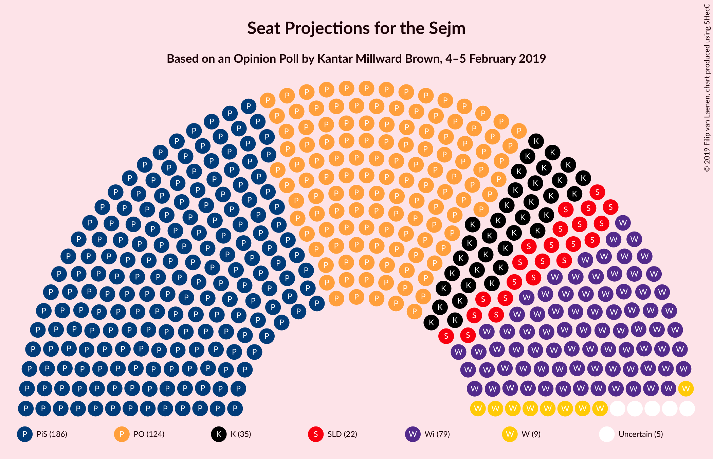

# Opinion Poll by Kantar Millward Brown, 4–5 February 2019

<a href="#voting-intentions">Voting Intentions</a> | <a href="#seats">Seats</a> | <a href="#coalitions">Coalitions</a> | <a href="#technical-information">Technical Information</a>

## Voting Intentions

### Confidence Intervals

| Party | Last Result | Poll Result | 80% Confidence Interval | 90% Confidence Interval | 95% Confidence Interval | 99% Confidence Interval |
|:-----:|:-----------:|:-----------:|:-----------------------:|:-----------------------:|:-----------------------:|:-----------------------:|
| Prawo i Sprawiedliwość | 37.6% | 29.0% | 27.2–30.9% |26.7–31.4% |26.3–31.9% |25.4–32.8% |
| Platforma Obywatelska | 24.1% | 20.0% | 18.5–21.7% |18.0–22.2% |17.6–22.6% |16.9–23.4% |
| Wiosna | 0.0% | 14.0% | 12.7–15.5% |12.3–16.0% |12.0–16.3% |11.4–17.1% |
| Kukiz’15 | 8.8% | 7.0% | 6.0–8.1% |5.8–8.4% |5.5–8.7% |5.1–9.3% |
| Sojusz Lewicy Demokratycznej | 7.6% | 6.0% | 5.1–7.1% |4.9–7.4% |4.7–7.6% |4.3–8.2% |
| Polskie Stronnictwo Ludowe | 5.1% | 5.0% | 4.2–6.0% |4.0–6.3% |3.8–6.5% |3.4–7.0% |
| KORWiN | 4.8% | 5.0% | 4.2–6.0% |4.0–6.3% |3.8–6.5% |3.4–7.0% |
| Lewica Razem | 3.6% | 1.0% | 0.7–1.5% |0.6–1.7% |0.5–1.8% |0.4–2.1% |

*Note:* The poll result column reflects the actual value used in the calculations. Published results may vary slightly, and in addition be rounded to fewer digits.

## Seats

### Confidence Intervals

| Party | Last Result | Median | 80% Confidence Interval | 90% Confidence Interval | 95% Confidence Interval | 99% Confidence Interval |
|:-----:|:-----------:|:------:|:-----------------------:|:-----------------------:|:-----------------------:|:-----------------------:|
| <a href="#prawo-i-sprawiedliwość">Prawo i Sprawiedliwość</a> | 235 | 186 | 177–196 |174–204 |170–213 |160–221 |
| <a href="#platforma-obywatelska">Platforma Obywatelska</a> | 138 | 124 | 108–134 |105–135 |102–137 |97–144 |
| <a href="#wiosna">Wiosna</a> | 0 | 79 | 72–84 |72–91 |69–96 |60–102 |
| <a href="#kukiz’15">Kukiz’15</a> | 42 | 35 | 23–43 |19–43 |16–44 |13–47 |
| <a href="#sojusz-lewicy-demokratycznej">Sojusz Lewicy Demokratycznej</a> | 0 | 22 | 16–31 |12–33 |0–33 |0–36 |
| <a href="#polskie-stronnictwo-ludowe">Polskie Stronnictwo Ludowe</a> | 16 | 0 | 0–24 |0–24 |0–24 |0–27 |
| <a href="#korwin">KORWiN</a> | 0 | 9 | 0–17 |0–19 |0–24 |0–28 |
| <a href="#lewica-razem">Lewica Razem</a> | 0 | 0 | 0 |0 |0 |0 |

### Prawo i Sprawiedliwość

*For a full overview of the results for this party, see the [Prawo i Sprawiedliwość](party-prawoisprawiedliwość.html) page.*

| Number of Seats | Probability | Accumulated | Special Marks |
|:---------------:|:-----------:|:-----------:|:-------------:|
| 156 | 0% | 100% |  |
| 157 | 0% | 99.9% |  |
| 158 | 0.3% | 99.9% |  |
| 159 | 0.1% | 99.6% |  |
| 160 | 0.2% | 99.5% |  |
| 161 | 0% | 99.3% |  |
| 162 | 0% | 99.3% |  |
| 163 | 0.2% | 99.3% |  |
| 164 | 0.3% | 99.1% |  |
| 165 | 0.2% | 98.8% |  |
| 166 | 0.1% | 98.6% |  |
| 167 | 0.2% | 98% |  |
| 168 | 0.2% | 98% |  |
| 169 | 0.1% | 98% |  |
| 170 | 0.4% | 98% |  |
| 171 | 0.2% | 97% |  |
| 172 | 0.2% | 97% |  |
| 173 | 2% | 97% |  |
| 174 | 2% | 95% |  |
| 175 | 0.2% | 94% |  |
| 176 | 2% | 93% |  |
| 177 | 3% | 91% |  |
| 178 | 0.6% | 88% |  |
| 179 | 0.2% | 88% |  |
| 180 | 5% | 87% |  |
| 181 | 14% | 83% |  |
| 182 | 0.4% | 69% |  |
| 183 | 2% | 69% |  |
| 184 | 0.6% | 67% |  |
| 185 | 10% | 66% |  |
| 186 | 22% | 56% | Median |
| 187 | 0.7% | 34% |  |
| 188 | 1.2% | 33% |  |
| 189 | 2% | 32% |  |
| 190 | 2% | 30% |  |
| 191 | 0.2% | 29% |  |
| 192 | 1.2% | 28% |  |
| 193 | 4% | 27% |  |
| 194 | 0.2% | 23% |  |
| 195 | 12% | 23% |  |
| 196 | 1.4% | 11% |  |
| 197 | 1.0% | 9% |  |
| 198 | 0.6% | 8% |  |
| 199 | 0.3% | 8% |  |
| 200 | 1.4% | 8% |  |
| 201 | 0.4% | 6% |  |
| 202 | 0.2% | 6% |  |
| 203 | 0.1% | 6% |  |
| 204 | 1.4% | 5% |  |
| 205 | 0.1% | 4% |  |
| 206 | 0.3% | 4% |  |
| 207 | 0% | 4% |  |
| 208 | 0.1% | 4% |  |
| 209 | 0.6% | 4% |  |
| 210 | 0.2% | 3% |  |
| 211 | 0% | 3% |  |
| 212 | 0.1% | 3% |  |
| 213 | 1.1% | 3% |  |
| 214 | 0.4% | 2% |  |
| 215 | 0% | 1.2% |  |
| 216 | 0% | 1.2% |  |
| 217 | 0.4% | 1.2% |  |
| 218 | 0% | 0.8% |  |
| 219 | 0% | 0.8% |  |
| 220 | 0.1% | 0.8% |  |
| 221 | 0.5% | 0.7% |  |
| 222 | 0% | 0.2% |  |
| 223 | 0% | 0.2% |  |
| 224 | 0% | 0.1% |  |
| 225 | 0.1% | 0.1% |  |
| 226 | 0.1% | 0.1% |  |
| 227 | 0% | 0% |  |
| 228 | 0% | 0% |  |
| 229 | 0% | 0% |  |
| 230 | 0% | 0% |  |
| 231 | 0% | 0% | Majority |
| 232 | 0% | 0% |  |
| 233 | 0% | 0% |  |
| 234 | 0% | 0% |  |
| 235 | 0% | 0% | Last Result |

### Platforma Obywatelska

*For a full overview of the results for this party, see the [Platforma Obywatelska](party-platformaobywatelska.html) page.*

| Number of Seats | Probability | Accumulated | Special Marks |
|:---------------:|:-----------:|:-----------:|:-------------:|
| 93 | 0% | 100% |  |
| 94 | 0% | 99.9% |  |
| 95 | 0% | 99.9% |  |
| 96 | 0.1% | 99.9% |  |
| 97 | 0.3% | 99.7% |  |
| 98 | 0% | 99.5% |  |
| 99 | 0.1% | 99.5% |  |
| 100 | 1.1% | 99.3% |  |
| 101 | 0.2% | 98% |  |
| 102 | 1.1% | 98% |  |
| 103 | 0.2% | 97% |  |
| 104 | 0.9% | 97% |  |
| 105 | 3% | 96% |  |
| 106 | 0.5% | 93% |  |
| 107 | 0.8% | 93% |  |
| 108 | 7% | 92% |  |
| 109 | 3% | 85% |  |
| 110 | 0.1% | 82% |  |
| 111 | 0.2% | 82% |  |
| 112 | 0.2% | 82% |  |
| 113 | 0.8% | 82% |  |
| 114 | 0.3% | 81% |  |
| 115 | 2% | 81% |  |
| 116 | 2% | 78% |  |
| 117 | 5% | 77% |  |
| 118 | 2% | 72% |  |
| 119 | 0.8% | 70% |  |
| 120 | 2% | 69% |  |
| 121 | 0.1% | 66% |  |
| 122 | 1.2% | 66% |  |
| 123 | 13% | 65% |  |
| 124 | 2% | 52% | Median |
| 125 | 1.3% | 50% |  |
| 126 | 3% | 49% |  |
| 127 | 0.6% | 46% |  |
| 128 | 2% | 45% |  |
| 129 | 7% | 44% |  |
| 130 | 21% | 36% |  |
| 131 | 1.1% | 15% |  |
| 132 | 1.2% | 14% |  |
| 133 | 2% | 13% |  |
| 134 | 1.0% | 10% |  |
| 135 | 6% | 9% |  |
| 136 | 0.2% | 3% |  |
| 137 | 1.2% | 3% |  |
| 138 | 0.3% | 2% | Last Result |
| 139 | 0.3% | 2% |  |
| 140 | 0.2% | 1.4% |  |
| 141 | 0.2% | 1.3% |  |
| 142 | 0.1% | 1.0% |  |
| 143 | 0.3% | 1.0% |  |
| 144 | 0.3% | 0.7% |  |
| 145 | 0% | 0.4% |  |
| 146 | 0% | 0.3% |  |
| 147 | 0.1% | 0.3% |  |
| 148 | 0% | 0.2% |  |
| 149 | 0% | 0.2% |  |
| 150 | 0% | 0.2% |  |
| 151 | 0.1% | 0.1% |  |
| 152 | 0% | 0% |  |

### Wiosna

*For a full overview of the results for this party, see the [Wiosna](party-wiosna.html) page.*

| Number of Seats | Probability | Accumulated | Special Marks |
|:---------------:|:-----------:|:-----------:|:-------------:|
| 0 | 0% | 100% | Last Result |
| 1 | 0% | 100% |  |
| 2 | 0% | 100% |  |
| 3 | 0% | 100% |  |
| 4 | 0% | 100% |  |
| 5 | 0% | 100% |  |
| 6 | 0% | 100% |  |
| 7 | 0% | 100% |  |
| 8 | 0% | 100% |  |
| 9 | 0% | 100% |  |
| 10 | 0% | 100% |  |
| 11 | 0% | 100% |  |
| 12 | 0% | 100% |  |
| 13 | 0% | 100% |  |
| 14 | 0% | 100% |  |
| 15 | 0% | 100% |  |
| 16 | 0% | 100% |  |
| 17 | 0% | 100% |  |
| 18 | 0% | 100% |  |
| 19 | 0% | 100% |  |
| 20 | 0% | 100% |  |
| 21 | 0% | 100% |  |
| 22 | 0% | 100% |  |
| 23 | 0% | 100% |  |
| 24 | 0% | 100% |  |
| 25 | 0% | 100% |  |
| 26 | 0% | 100% |  |
| 27 | 0% | 100% |  |
| 28 | 0% | 100% |  |
| 29 | 0% | 100% |  |
| 30 | 0% | 100% |  |
| 31 | 0% | 100% |  |
| 32 | 0% | 100% |  |
| 33 | 0% | 100% |  |
| 34 | 0% | 100% |  |
| 35 | 0% | 100% |  |
| 36 | 0% | 100% |  |
| 37 | 0% | 100% |  |
| 38 | 0% | 100% |  |
| 39 | 0% | 100% |  |
| 40 | 0% | 100% |  |
| 41 | 0% | 100% |  |
| 42 | 0% | 100% |  |
| 43 | 0% | 100% |  |
| 44 | 0% | 100% |  |
| 45 | 0% | 100% |  |
| 46 | 0% | 100% |  |
| 47 | 0% | 100% |  |
| 48 | 0% | 100% |  |
| 49 | 0% | 100% |  |
| 50 | 0% | 100% |  |
| 51 | 0% | 100% |  |
| 52 | 0% | 100% |  |
| 53 | 0.1% | 100% |  |
| 54 | 0% | 99.8% |  |
| 55 | 0% | 99.8% |  |
| 56 | 0% | 99.7% |  |
| 57 | 0.1% | 99.7% |  |
| 58 | 0.1% | 99.7% |  |
| 59 | 0.1% | 99.6% |  |
| 60 | 0.1% | 99.5% |  |
| 61 | 0.1% | 99.4% |  |
| 62 | 0.1% | 99.3% |  |
| 63 | 0.2% | 99.3% |  |
| 64 | 0% | 99.1% |  |
| 65 | 0.1% | 99.1% |  |
| 66 | 0.1% | 99.1% |  |
| 67 | 0.1% | 99.0% |  |
| 68 | 0.9% | 98.9% |  |
| 69 | 0.5% | 98% |  |
| 70 | 0.6% | 97% |  |
| 71 | 2% | 97% |  |
| 72 | 5% | 95% |  |
| 73 | 4% | 90% |  |
| 74 | 11% | 86% |  |
| 75 | 3% | 76% |  |
| 76 | 3% | 73% |  |
| 77 | 6% | 70% |  |
| 78 | 12% | 64% |  |
| 79 | 2% | 51% | Median |
| 80 | 14% | 49% |  |
| 81 | 18% | 35% |  |
| 82 | 5% | 18% |  |
| 83 | 1.4% | 13% |  |
| 84 | 2% | 11% |  |
| 85 | 0.2% | 10% |  |
| 86 | 1.5% | 9% |  |
| 87 | 0.9% | 8% |  |
| 88 | 0.1% | 7% |  |
| 89 | 0.8% | 7% |  |
| 90 | 0.8% | 6% |  |
| 91 | 1.3% | 5% |  |
| 92 | 0.3% | 4% |  |
| 93 | 0.3% | 4% |  |
| 94 | 0.3% | 3% |  |
| 95 | 0.1% | 3% |  |
| 96 | 1.5% | 3% |  |
| 97 | 0% | 1.5% |  |
| 98 | 0.3% | 1.4% |  |
| 99 | 0.2% | 1.1% |  |
| 100 | 0% | 0.9% |  |
| 101 | 0.4% | 0.9% |  |
| 102 | 0.4% | 0.5% |  |
| 103 | 0.1% | 0.2% |  |
| 104 | 0% | 0.1% |  |
| 105 | 0% | 0.1% |  |
| 106 | 0% | 0.1% |  |
| 107 | 0% | 0% |  |

### Kukiz’15

*For a full overview of the results for this party, see the [Kukiz’15](party-kukiz’15.html) page.*

| Number of Seats | Probability | Accumulated | Special Marks |
|:---------------:|:-----------:|:-----------:|:-------------:|
| 0 | 0.1% | 100% |  |
| 1 | 0% | 99.9% |  |
| 2 | 0% | 99.9% |  |
| 3 | 0% | 99.9% |  |
| 4 | 0% | 99.9% |  |
| 5 | 0% | 99.9% |  |
| 6 | 0% | 99.9% |  |
| 7 | 0% | 99.9% |  |
| 8 | 0% | 99.9% |  |
| 9 | 0% | 99.9% |  |
| 10 | 0% | 99.9% |  |
| 11 | 0.3% | 99.9% |  |
| 12 | 0.1% | 99.6% |  |
| 13 | 1.0% | 99.5% |  |
| 14 | 0.1% | 98.5% |  |
| 15 | 0.2% | 98% |  |
| 16 | 0.9% | 98% |  |
| 17 | 0.2% | 97% |  |
| 18 | 2% | 97% |  |
| 19 | 0.5% | 95% |  |
| 20 | 1.1% | 95% |  |
| 21 | 0.4% | 94% |  |
| 22 | 0.8% | 93% |  |
| 23 | 4% | 93% |  |
| 24 | 0.5% | 88% |  |
| 25 | 4% | 88% |  |
| 26 | 1.4% | 84% |  |
| 27 | 0.4% | 83% |  |
| 28 | 7% | 82% |  |
| 29 | 2% | 75% |  |
| 30 | 4% | 73% |  |
| 31 | 1.1% | 69% |  |
| 32 | 2% | 68% |  |
| 33 | 7% | 66% |  |
| 34 | 7% | 59% |  |
| 35 | 21% | 53% | Median |
| 36 | 7% | 32% |  |
| 37 | 2% | 25% |  |
| 38 | 2% | 23% |  |
| 39 | 1.1% | 21% |  |
| 40 | 0.9% | 20% |  |
| 41 | 0.1% | 19% |  |
| 42 | 1.4% | 19% | Last Result |
| 43 | 15% | 18% |  |
| 44 | 0.9% | 3% |  |
| 45 | 1.2% | 2% |  |
| 46 | 0.7% | 1.2% |  |
| 47 | 0.2% | 0.5% |  |
| 48 | 0.1% | 0.3% |  |
| 49 | 0.1% | 0.2% |  |
| 50 | 0.1% | 0.2% |  |
| 51 | 0% | 0.1% |  |
| 52 | 0% | 0% |  |

### Sojusz Lewicy Demokratycznej

*For a full overview of the results for this party, see the [Sojusz Lewicy Demokratycznej](party-sojuszlewicydemokratycznej.html) page.*

| Number of Seats | Probability | Accumulated | Special Marks |
|:---------------:|:-----------:|:-----------:|:-------------:|
| 0 | 5% | 100% | Last Result |
| 1 | 0% | 95% |  |
| 2 | 0% | 95% |  |
| 3 | 0% | 95% |  |
| 4 | 0% | 95% |  |
| 5 | 0% | 95% |  |
| 6 | 0% | 95% |  |
| 7 | 0% | 95% |  |
| 8 | 0% | 95% |  |
| 9 | 0% | 95% |  |
| 10 | 0% | 95% |  |
| 11 | 0.3% | 95% |  |
| 12 | 3% | 95% |  |
| 13 | 0.7% | 92% |  |
| 14 | 1.3% | 91% |  |
| 15 | 0% | 90% |  |
| 16 | 3% | 90% |  |
| 17 | 9% | 87% |  |
| 18 | 1.2% | 79% |  |
| 19 | 4% | 78% |  |
| 20 | 18% | 73% |  |
| 21 | 3% | 55% |  |
| 22 | 2% | 52% | Median |
| 23 | 0.4% | 50% |  |
| 24 | 7% | 50% |  |
| 25 | 0.6% | 42% |  |
| 26 | 1.1% | 42% |  |
| 27 | 2% | 41% |  |
| 28 | 23% | 38% |  |
| 29 | 2% | 16% |  |
| 30 | 2% | 13% |  |
| 31 | 6% | 11% |  |
| 32 | 0.5% | 6% |  |
| 33 | 3% | 5% |  |
| 34 | 1.2% | 2% |  |
| 35 | 0.6% | 1.2% |  |
| 36 | 0.2% | 0.7% |  |
| 37 | 0.3% | 0.5% |  |
| 38 | 0.1% | 0.2% |  |
| 39 | 0% | 0.1% |  |
| 40 | 0% | 0.1% |  |
| 41 | 0% | 0.1% |  |
| 42 | 0% | 0% |  |

### Polskie Stronnictwo Ludowe

*For a full overview of the results for this party, see the [Polskie Stronnictwo Ludowe](party-polskiestronnictwoludowe.html) page.*

| Number of Seats | Probability | Accumulated | Special Marks |
|:---------------:|:-----------:|:-----------:|:-------------:|
| 0 | 66% | 100% | Median |
| 1 | 0% | 34% |  |
| 2 | 0% | 34% |  |
| 3 | 0% | 34% |  |
| 4 | 0% | 34% |  |
| 5 | 0% | 34% |  |
| 6 | 0% | 34% |  |
| 7 | 0% | 34% |  |
| 8 | 0% | 34% |  |
| 9 | 0% | 34% |  |
| 10 | 0% | 34% |  |
| 11 | 0% | 34% |  |
| 12 | 0% | 34% |  |
| 13 | 0% | 34% |  |
| 14 | 0% | 34% |  |
| 15 | 0% | 34% |  |
| 16 | 0% | 34% | Last Result |
| 17 | 1.0% | 34% |  |
| 18 | 3% | 33% |  |
| 19 | 4% | 30% |  |
| 20 | 3% | 26% |  |
| 21 | 2% | 24% |  |
| 22 | 6% | 22% |  |
| 23 | 3% | 16% |  |
| 24 | 11% | 13% |  |
| 25 | 0.7% | 2% |  |
| 26 | 0.9% | 2% |  |
| 27 | 0.2% | 0.6% |  |
| 28 | 0.1% | 0.4% |  |
| 29 | 0.1% | 0.3% |  |
| 30 | 0.1% | 0.2% |  |
| 31 | 0% | 0.1% |  |
| 32 | 0% | 0.1% |  |
| 33 | 0% | 0.1% |  |
| 34 | 0% | 0% |  |

### KORWiN

*For a full overview of the results for this party, see the [KORWiN](party-korwin.html) page.*

| Number of Seats | Probability | Accumulated | Special Marks |
|:---------------:|:-----------:|:-----------:|:-------------:|
| 0 | 44% | 100% | Last Result |
| 1 | 0% | 56% |  |
| 2 | 0% | 56% |  |
| 3 | 0% | 56% |  |
| 4 | 0% | 56% |  |
| 5 | 0% | 56% |  |
| 6 | 0.1% | 56% |  |
| 7 | 0% | 56% |  |
| 8 | 5% | 56% |  |
| 9 | 1.4% | 50% | Median |
| 10 | 1.2% | 49% |  |
| 11 | 1.3% | 48% |  |
| 12 | 10% | 47% |  |
| 13 | 14% | 37% |  |
| 14 | 4% | 23% |  |
| 15 | 2% | 19% |  |
| 16 | 0.5% | 17% |  |
| 17 | 8% | 16% |  |
| 18 | 4% | 9% |  |
| 19 | 0.4% | 5% |  |
| 20 | 0.2% | 5% |  |
| 21 | 1.2% | 5% |  |
| 22 | 0.1% | 3% |  |
| 23 | 0.3% | 3% |  |
| 24 | 0.9% | 3% |  |
| 25 | 0.6% | 2% |  |
| 26 | 0.1% | 1.4% |  |
| 27 | 0.2% | 1.3% |  |
| 28 | 0.7% | 1.2% |  |
| 29 | 0.1% | 0.5% |  |
| 30 | 0.3% | 0.4% |  |
| 31 | 0% | 0.2% |  |
| 32 | 0% | 0.1% |  |
| 33 | 0.1% | 0.1% |  |
| 34 | 0% | 0% |  |

### Lewica Razem

*For a full overview of the results for this party, see the [Lewica Razem](party-lewicarazem.html) page.*

| Number of Seats | Probability | Accumulated | Special Marks |
|:---------------:|:-----------:|:-----------:|:-------------:|
| 0 | 100% | 100% | Last Result, Median |

## Coalitions

### Confidence Intervals

| Coalition | Last Result | Median | Majority? | 80% Confidence Interval | 90% Confidence Interval | 95% Confidence Interval | 99% Confidence Interval |
|:---------:|:-----------:|:------:|:---------:|:-----------------------:|:-----------------------:|:-----------------------:|:-----------------------:|
| Prawo i Sprawiedliwość | 235 | 186 | 0% | 177–196 | 174–204 | 170–213 | 160–221 |
| Platforma Obywatelska | 138 | 124 | 0% | 108–134 | 105–135 | 102–137 | 97–144 |

### Prawo i Sprawiedliwość

| Number of Seats | Probability | Accumulated | Special Marks |
|:---------------:|:-----------:|:-----------:|:-------------:|
| 156 | 0% | 100% |  |
| 157 | 0% | 99.9% |  |
| 158 | 0.3% | 99.9% |  |
| 159 | 0.1% | 99.6% |  |
| 160 | 0.2% | 99.5% |  |
| 161 | 0% | 99.3% |  |
| 162 | 0% | 99.3% |  |
| 163 | 0.2% | 99.3% |  |
| 164 | 0.3% | 99.1% |  |
| 165 | 0.2% | 98.8% |  |
| 166 | 0.1% | 98.6% |  |
| 167 | 0.2% | 98% |  |
| 168 | 0.2% | 98% |  |
| 169 | 0.1% | 98% |  |
| 170 | 0.4% | 98% |  |
| 171 | 0.2% | 97% |  |
| 172 | 0.2% | 97% |  |
| 173 | 2% | 97% |  |
| 174 | 2% | 95% |  |
| 175 | 0.2% | 94% |  |
| 176 | 2% | 93% |  |
| 177 | 3% | 91% |  |
| 178 | 0.6% | 88% |  |
| 179 | 0.2% | 88% |  |
| 180 | 5% | 87% |  |
| 181 | 14% | 83% |  |
| 182 | 0.4% | 69% |  |
| 183 | 2% | 69% |  |
| 184 | 0.6% | 67% |  |
| 185 | 10% | 66% |  |
| 186 | 22% | 56% | Median |
| 187 | 0.7% | 34% |  |
| 188 | 1.2% | 33% |  |
| 189 | 2% | 32% |  |
| 190 | 2% | 30% |  |
| 191 | 0.2% | 29% |  |
| 192 | 1.2% | 28% |  |
| 193 | 4% | 27% |  |
| 194 | 0.2% | 23% |  |
| 195 | 12% | 23% |  |
| 196 | 1.4% | 11% |  |
| 197 | 1.0% | 9% |  |
| 198 | 0.6% | 8% |  |
| 199 | 0.3% | 8% |  |
| 200 | 1.4% | 8% |  |
| 201 | 0.4% | 6% |  |
| 202 | 0.2% | 6% |  |
| 203 | 0.1% | 6% |  |
| 204 | 1.4% | 5% |  |
| 205 | 0.1% | 4% |  |
| 206 | 0.3% | 4% |  |
| 207 | 0% | 4% |  |
| 208 | 0.1% | 4% |  |
| 209 | 0.6% | 4% |  |
| 210 | 0.2% | 3% |  |
| 211 | 0% | 3% |  |
| 212 | 0.1% | 3% |  |
| 213 | 1.1% | 3% |  |
| 214 | 0.4% | 2% |  |
| 215 | 0% | 1.2% |  |
| 216 | 0% | 1.2% |  |
| 217 | 0.4% | 1.2% |  |
| 218 | 0% | 0.8% |  |
| 219 | 0% | 0.8% |  |
| 220 | 0.1% | 0.8% |  |
| 221 | 0.5% | 0.7% |  |
| 222 | 0% | 0.2% |  |
| 223 | 0% | 0.2% |  |
| 224 | 0% | 0.1% |  |
| 225 | 0.1% | 0.1% |  |
| 226 | 0.1% | 0.1% |  |
| 227 | 0% | 0% |  |
| 228 | 0% | 0% |  |
| 229 | 0% | 0% |  |
| 230 | 0% | 0% |  |
| 231 | 0% | 0% | Majority |
| 232 | 0% | 0% |  |
| 233 | 0% | 0% |  |
| 234 | 0% | 0% |  |
| 235 | 0% | 0% | Last Result |

### Platforma Obywatelska

| Number of Seats | Probability | Accumulated | Special Marks |
|:---------------:|:-----------:|:-----------:|:-------------:|
| 93 | 0% | 100% |  |
| 94 | 0% | 99.9% |  |
| 95 | 0% | 99.9% |  |
| 96 | 0.1% | 99.9% |  |
| 97 | 0.3% | 99.7% |  |
| 98 | 0% | 99.5% |  |
| 99 | 0.1% | 99.5% |  |
| 100 | 1.1% | 99.3% |  |
| 101 | 0.2% | 98% |  |
| 102 | 1.1% | 98% |  |
| 103 | 0.2% | 97% |  |
| 104 | 0.9% | 97% |  |
| 105 | 3% | 96% |  |
| 106 | 0.5% | 93% |  |
| 107 | 0.8% | 93% |  |
| 108 | 7% | 92% |  |
| 109 | 3% | 85% |  |
| 110 | 0.1% | 82% |  |
| 111 | 0.2% | 82% |  |
| 112 | 0.2% | 82% |  |
| 113 | 0.8% | 82% |  |
| 114 | 0.3% | 81% |  |
| 115 | 2% | 81% |  |
| 116 | 2% | 78% |  |
| 117 | 5% | 77% |  |
| 118 | 2% | 72% |  |
| 119 | 0.8% | 70% |  |
| 120 | 2% | 69% |  |
| 121 | 0.1% | 66% |  |
| 122 | 1.2% | 66% |  |
| 123 | 13% | 65% |  |
| 124 | 2% | 52% | Median |
| 125 | 1.3% | 50% |  |
| 126 | 3% | 49% |  |
| 127 | 0.6% | 46% |  |
| 128 | 2% | 45% |  |
| 129 | 7% | 44% |  |
| 130 | 21% | 36% |  |
| 131 | 1.1% | 15% |  |
| 132 | 1.2% | 14% |  |
| 133 | 2% | 13% |  |
| 134 | 1.0% | 10% |  |
| 135 | 6% | 9% |  |
| 136 | 0.2% | 3% |  |
| 137 | 1.2% | 3% |  |
| 138 | 0.3% | 2% | Last Result |
| 139 | 0.3% | 2% |  |
| 140 | 0.2% | 1.4% |  |
| 141 | 0.2% | 1.3% |  |
| 142 | 0.1% | 1.0% |  |
| 143 | 0.3% | 1.0% |  |
| 144 | 0.3% | 0.7% |  |
| 145 | 0% | 0.4% |  |
| 146 | 0% | 0.3% |  |
| 147 | 0.1% | 0.3% |  |
| 148 | 0% | 0.2% |  |
| 149 | 0% | 0.2% |  |
| 150 | 0% | 0.2% |  |
| 151 | 0.1% | 0.1% |  |
| 152 | 0% | 0% |  |

## Technical Information

### Opinion Poll

+ **Polling firm:** Kantar Millward Brown
+ **Commissioner(s):** —
+ **Fieldwork period:** 4–5 February 2019

### Calculations

+ **Sample size:** 1004
+ **Simulations done:** 131,072
+ **Error estimate:** 2.48%

