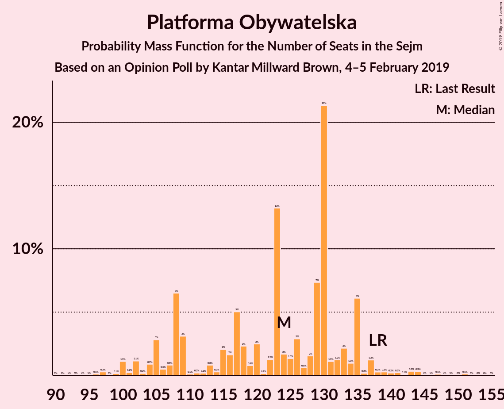
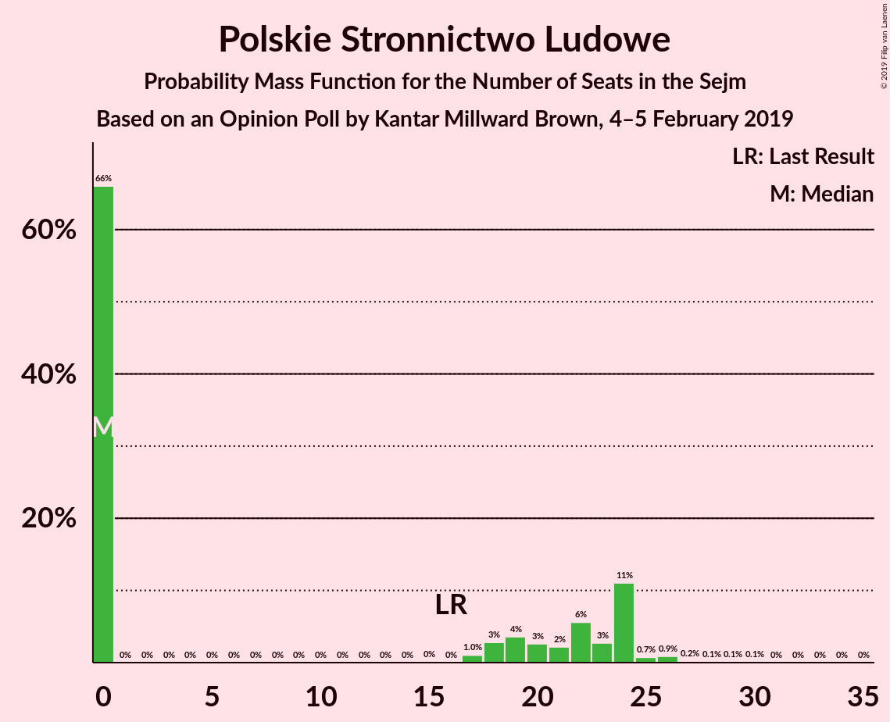

# Opinion Poll by Kantar Millward Brown, 4–5 February 2019

<a href="#voting-intentions">Voting Intentions</a> | <a href="#seats">Seats</a> | <a href="#coalitions">Coalitions</a> | <a href="#technical-information">Technical Information</a>

## Voting Intentions

### Confidence Intervals

| Party | Last Result | Poll Result | 80% Confidence Interval | 90% Confidence Interval | 95% Confidence Interval | 99% Confidence Interval |
|:-----:|:-----------:|:-----------:|:-----------------------:|:-----------------------:|:-----------------------:|:-----------------------:|
| Prawo i Sprawiedliwość | 37.6% | 29.0% | 27.2–30.9% |26.7–31.4% |26.3–31.9% |25.4–32.8% |
| Platforma Obywatelska | 24.1% | 20.0% | 18.5–21.7% |18.0–22.2% |17.6–22.6% |16.9–23.4% |
| Wiosna | 0.0% | 14.0% | 12.7–15.5% |12.3–16.0% |12.0–16.3% |11.4–17.1% |
| Kukiz’15 | 8.8% | 7.0% | 6.0–8.1% |5.8–8.4% |5.5–8.7% |5.1–9.3% |
| Sojusz Lewicy Demokratycznej | 7.6% | 6.0% | 5.1–7.1% |4.9–7.4% |4.7–7.6% |4.3–8.2% |
| Polskie Stronnictwo Ludowe | 5.1% | 5.0% | 4.2–6.0% |4.0–6.3% |3.8–6.5% |3.4–7.0% |
| KORWiN | 4.8% | 5.0% | 4.2–6.0% |4.0–6.3% |3.8–6.5% |3.4–7.0% |
| Lewica Razem | 3.6% | 1.0% | 0.7–1.5% |0.6–1.7% |0.5–1.8% |0.4–2.1% |

*Note:* The poll result column reflects the actual value used in the calculations. Published results may vary slightly, and in addition be rounded to fewer digits.

## Seats

### Confidence Intervals

| Party | Last Result | Median | 80% Confidence Interval | 90% Confidence Interval | 95% Confidence Interval | 99% Confidence Interval |
|:-----:|:-----------:|:------:|:-----------------------:|:-----------------------:|:-----------------------:|:-----------------------:|
| <a href="#prawo-i-sprawiedliwość">Prawo i Sprawiedliwość</a> | 235 | 194 | 192–223 |192–223 |191–223 |176–227 |
| <a href="#platforma-obywatelska">Platforma Obywatelska</a> | 138 | 120 | 97–121 |97–122 |97–122 |96–127 |
| <a href="#wiosna">Wiosna</a> | 0 | 79 | 70–103 |70–103 |70–103 |64–104 |
| <a href="#kukiz’15">Kukiz’15</a> | 42 | 32 | 21–40 |21–40 |20–40 |13–41 |
| <a href="#sojusz-lewicy-demokratycznej">Sojusz Lewicy Demokratycznej</a> | 0 | 22 | 12–29 |0–29 |0–29 |0–30 |
| <a href="#polskie-stronnictwo-ludowe">Polskie Stronnictwo Ludowe</a> | 16 | 0 | 0 |0–23 |0–24 |0–27 |
| <a href="#korwin">KORWiN</a> | 0 | 0 | 0–13 |0–13 |0–15 |0–31 |
| <a href="#lewica-razem">Lewica Razem</a> | 0 | 0 | 0 |0 |0 |0 |

### Prawo i Sprawiedliwość

*For a full overview of the results for this party, see the [Prawo i Sprawiedliwość](party-prawoisprawiedliwość.html) page.*

| Number of Seats | Probability | Accumulated | Special Marks |
|:---------------:|:-----------:|:-----------:|:-------------:|
| 140 | 0.1% | 100% |  |
| 141 | 0% | 99.9% |  |
| 142 | 0% | 99.9% |  |
| 143 | 0% | 99.9% |  |
| 144 | 0% | 99.9% |  |
| 145 | 0% | 99.9% |  |
| 146 | 0% | 99.9% |  |
| 147 | 0% | 99.9% |  |
| 148 | 0% | 99.9% |  |
| 149 | 0% | 99.9% |  |
| 150 | 0% | 99.9% |  |
| 151 | 0% | 99.9% |  |
| 152 | 0% | 99.9% |  |
| 153 | 0% | 99.9% |  |
| 154 | 0% | 99.9% |  |
| 155 | 0% | 99.9% |  |
| 156 | 0% | 99.9% |  |
| 157 | 0% | 99.9% |  |
| 158 | 0% | 99.9% |  |
| 159 | 0% | 99.9% |  |
| 160 | 0% | 99.9% |  |
| 161 | 0% | 99.9% |  |
| 162 | 0% | 99.9% |  |
| 163 | 0% | 99.9% |  |
| 164 | 0% | 99.9% |  |
| 165 | 0% | 99.9% |  |
| 166 | 0% | 99.9% |  |
| 167 | 0% | 99.9% |  |
| 168 | 0% | 99.9% |  |
| 169 | 0% | 99.9% |  |
| 170 | 0% | 99.9% |  |
| 171 | 0% | 99.9% |  |
| 172 | 0% | 99.9% |  |
| 173 | 0% | 99.9% |  |
| 174 | 0.2% | 99.9% |  |
| 175 | 0% | 99.7% |  |
| 176 | 1.5% | 99.7% |  |
| 177 | 0% | 98% |  |
| 178 | 0% | 98% |  |
| 179 | 0% | 98% |  |
| 180 | 0% | 98% |  |
| 181 | 0% | 98% |  |
| 182 | 0% | 98% |  |
| 183 | 0% | 98% |  |
| 184 | 0% | 98% |  |
| 185 | 0% | 98% |  |
| 186 | 0% | 98% |  |
| 187 | 0.3% | 98% |  |
| 188 | 0% | 98% |  |
| 189 | 0% | 98% |  |
| 190 | 0% | 98% |  |
| 191 | 0.5% | 98% |  |
| 192 | 30% | 97% |  |
| 193 | 5% | 68% |  |
| 194 | 20% | 63% | Median |
| 195 | 0% | 42% |  |
| 196 | 5% | 42% |  |
| 197 | 0% | 38% |  |
| 198 | 0% | 38% |  |
| 199 | 0% | 38% |  |
| 200 | 0% | 37% |  |
| 201 | 0.2% | 37% |  |
| 202 | 0% | 37% |  |
| 203 | 0.7% | 37% |  |
| 204 | 0% | 37% |  |
| 205 | 10% | 37% |  |
| 206 | 0.6% | 26% |  |
| 207 | 0% | 26% |  |
| 208 | 5% | 26% |  |
| 209 | 0% | 21% |  |
| 210 | 1.3% | 21% |  |
| 211 | 0% | 20% |  |
| 212 | 0% | 20% |  |
| 213 | 0% | 20% |  |
| 214 | 0% | 20% |  |
| 215 | 0% | 20% |  |
| 216 | 0% | 20% |  |
| 217 | 0% | 20% |  |
| 218 | 0% | 20% |  |
| 219 | 0% | 20% |  |
| 220 | 0% | 20% |  |
| 221 | 0.4% | 20% |  |
| 222 | 0% | 19% |  |
| 223 | 18% | 19% |  |
| 224 | 0% | 2% |  |
| 225 | 0% | 2% |  |
| 226 | 0% | 2% |  |
| 227 | 2% | 2% |  |
| 228 | 0% | 0% |  |
| 229 | 0% | 0% |  |
| 230 | 0% | 0% |  |
| 231 | 0% | 0% | Majority |
| 232 | 0% | 0% |  |
| 233 | 0% | 0% |  |
| 234 | 0% | 0% |  |
| 235 | 0% | 0% | Last Result |

### Platforma Obywatelska

*For a full overview of the results for this party, see the [Platforma Obywatelska](party-platformaobywatelska.html) page.*

| Number of Seats | Probability | Accumulated | Special Marks |
|:---------------:|:-----------:|:-----------:|:-------------:|
| 94 | 0.4% | 100% |  |
| 95 | 0% | 99.6% |  |
| 96 | 0.7% | 99.6% |  |
| 97 | 11% | 98.9% |  |
| 98 | 0% | 88% |  |
| 99 | 0% | 88% |  |
| 100 | 0% | 88% |  |
| 101 | 0% | 88% |  |
| 102 | 0% | 88% |  |
| 103 | 0% | 88% |  |
| 104 | 0% | 88% |  |
| 105 | 0% | 88% |  |
| 106 | 0% | 88% |  |
| 107 | 0% | 88% |  |
| 108 | 0% | 88% |  |
| 109 | 0% | 88% |  |
| 110 | 0% | 88% |  |
| 111 | 0.1% | 88% |  |
| 112 | 0.2% | 88% |  |
| 113 | 0% | 88% |  |
| 114 | 0% | 88% |  |
| 115 | 6% | 88% |  |
| 116 | 0% | 82% |  |
| 117 | 0.2% | 82% |  |
| 118 | 0% | 82% |  |
| 119 | 2% | 82% |  |
| 120 | 50% | 80% | Median |
| 121 | 23% | 30% |  |
| 122 | 5% | 7% |  |
| 123 | 0% | 2% |  |
| 124 | 0% | 2% |  |
| 125 | 0% | 2% |  |
| 126 | 0% | 2% |  |
| 127 | 2% | 2% |  |
| 128 | 0% | 0.4% |  |
| 129 | 0% | 0.4% |  |
| 130 | 0% | 0.4% |  |
| 131 | 0% | 0.4% |  |
| 132 | 0% | 0.4% |  |
| 133 | 0% | 0.3% |  |
| 134 | 0% | 0.3% |  |
| 135 | 0.1% | 0.3% |  |
| 136 | 0% | 0.3% |  |
| 137 | 0.2% | 0.3% |  |
| 138 | 0% | 0% | Last Result |

### Wiosna

*For a full overview of the results for this party, see the [Wiosna](party-wiosna.html) page.*

| Number of Seats | Probability | Accumulated | Special Marks |
|:---------------:|:-----------:|:-----------:|:-------------:|
| 0 | 0% | 100% | Last Result |
| 1 | 0% | 100% |  |
| 2 | 0% | 100% |  |
| 3 | 0% | 100% |  |
| 4 | 0% | 100% |  |
| 5 | 0% | 100% |  |
| 6 | 0% | 100% |  |
| 7 | 0% | 100% |  |
| 8 | 0% | 100% |  |
| 9 | 0% | 100% |  |
| 10 | 0% | 100% |  |
| 11 | 0% | 100% |  |
| 12 | 0% | 100% |  |
| 13 | 0% | 100% |  |
| 14 | 0% | 100% |  |
| 15 | 0% | 100% |  |
| 16 | 0% | 100% |  |
| 17 | 0% | 100% |  |
| 18 | 0% | 100% |  |
| 19 | 0% | 100% |  |
| 20 | 0% | 100% |  |
| 21 | 0% | 100% |  |
| 22 | 0% | 100% |  |
| 23 | 0% | 100% |  |
| 24 | 0% | 100% |  |
| 25 | 0% | 100% |  |
| 26 | 0% | 100% |  |
| 27 | 0% | 100% |  |
| 28 | 0% | 100% |  |
| 29 | 0% | 100% |  |
| 30 | 0% | 100% |  |
| 31 | 0% | 100% |  |
| 32 | 0% | 100% |  |
| 33 | 0% | 100% |  |
| 34 | 0% | 100% |  |
| 35 | 0% | 100% |  |
| 36 | 0% | 100% |  |
| 37 | 0% | 100% |  |
| 38 | 0% | 100% |  |
| 39 | 0% | 100% |  |
| 40 | 0% | 100% |  |
| 41 | 0% | 100% |  |
| 42 | 0% | 100% |  |
| 43 | 0% | 100% |  |
| 44 | 0% | 100% |  |
| 45 | 0% | 100% |  |
| 46 | 0% | 100% |  |
| 47 | 0% | 100% |  |
| 48 | 0% | 100% |  |
| 49 | 0% | 100% |  |
| 50 | 0% | 100% |  |
| 51 | 0% | 100% |  |
| 52 | 0% | 100% |  |
| 53 | 0% | 100% |  |
| 54 | 0% | 100% |  |
| 55 | 0% | 100% |  |
| 56 | 0% | 100% |  |
| 57 | 0% | 100% |  |
| 58 | 0% | 100% |  |
| 59 | 0% | 100% |  |
| 60 | 0% | 100% |  |
| 61 | 0% | 100% |  |
| 62 | 0% | 100% |  |
| 63 | 0% | 100% |  |
| 64 | 2% | 100% |  |
| 65 | 0% | 98% |  |
| 66 | 0.2% | 98% |  |
| 67 | 0% | 98% |  |
| 68 | 0% | 98% |  |
| 69 | 0% | 98% |  |
| 70 | 18% | 98% |  |
| 71 | 2% | 80% |  |
| 72 | 0% | 78% |  |
| 73 | 0% | 78% |  |
| 74 | 0% | 78% |  |
| 75 | 0% | 78% |  |
| 76 | 0% | 78% |  |
| 77 | 0.9% | 78% |  |
| 78 | 0.2% | 78% |  |
| 79 | 30% | 77% | Median |
| 80 | 0.2% | 47% |  |
| 81 | 0% | 47% |  |
| 82 | 0.1% | 47% |  |
| 83 | 30% | 47% |  |
| 84 | 5% | 17% |  |
| 85 | 0% | 12% |  |
| 86 | 0.4% | 12% |  |
| 87 | 0% | 12% |  |
| 88 | 0% | 12% |  |
| 89 | 0% | 12% |  |
| 90 | 0% | 12% |  |
| 91 | 0% | 12% |  |
| 92 | 0% | 12% |  |
| 93 | 0% | 12% |  |
| 94 | 0% | 12% |  |
| 95 | 0% | 12% |  |
| 96 | 0% | 12% |  |
| 97 | 0% | 12% |  |
| 98 | 0% | 12% |  |
| 99 | 0% | 12% |  |
| 100 | 0% | 12% |  |
| 101 | 0.7% | 12% |  |
| 102 | 0% | 11% |  |
| 103 | 10% | 11% |  |
| 104 | 0.6% | 0.6% |  |
| 105 | 0% | 0% |  |

### Kukiz’15

*For a full overview of the results for this party, see the [Kukiz’15](party-kukiz’15.html) page.*

| Number of Seats | Probability | Accumulated | Special Marks |
|:---------------:|:-----------:|:-----------:|:-------------:|
| 11 | 0.4% | 100% |  |
| 12 | 0% | 99.6% |  |
| 13 | 2% | 99.6% |  |
| 14 | 0% | 98% |  |
| 15 | 0.2% | 98% |  |
| 16 | 0% | 98% |  |
| 17 | 0% | 98% |  |
| 18 | 0% | 98% |  |
| 19 | 0% | 98% |  |
| 20 | 2% | 98% |  |
| 21 | 17% | 96% |  |
| 22 | 0.4% | 79% |  |
| 23 | 0% | 78% |  |
| 24 | 0.6% | 78% |  |
| 25 | 0% | 78% |  |
| 26 | 10% | 78% |  |
| 27 | 0% | 67% |  |
| 28 | 0% | 67% |  |
| 29 | 5% | 67% |  |
| 30 | 0.4% | 63% |  |
| 31 | 0.7% | 62% |  |
| 32 | 20% | 61% | Median |
| 33 | 0% | 41% |  |
| 34 | 0.8% | 41% |  |
| 35 | 5% | 40% |  |
| 36 | 0% | 35% |  |
| 37 | 5% | 35% |  |
| 38 | 0.1% | 30% |  |
| 39 | 0% | 30% |  |
| 40 | 30% | 30% |  |
| 41 | 0.5% | 0.7% |  |
| 42 | 0.1% | 0.2% | Last Result |
| 43 | 0% | 0% |  |

### Sojusz Lewicy Demokratycznej

*For a full overview of the results for this party, see the [Sojusz Lewicy Demokratycznej](party-sojuszlewicydemokratycznej.html) page.*

| Number of Seats | Probability | Accumulated | Special Marks |
|:---------------:|:-----------:|:-----------:|:-------------:|
| 0 | 7% | 100% | Last Result |
| 1 | 0% | 93% |  |
| 2 | 0% | 93% |  |
| 3 | 0% | 93% |  |
| 4 | 0% | 93% |  |
| 5 | 0% | 93% |  |
| 6 | 0% | 93% |  |
| 7 | 0% | 93% |  |
| 8 | 0% | 93% |  |
| 9 | 0% | 93% |  |
| 10 | 0% | 93% |  |
| 11 | 0% | 93% |  |
| 12 | 18% | 93% |  |
| 13 | 0.4% | 75% |  |
| 14 | 0% | 74% |  |
| 15 | 0% | 74% |  |
| 16 | 0% | 74% |  |
| 17 | 0% | 74% |  |
| 18 | 0% | 74% |  |
| 19 | 0% | 74% |  |
| 20 | 0% | 74% |  |
| 21 | 0% | 74% |  |
| 22 | 25% | 74% | Median |
| 23 | 0.4% | 49% |  |
| 24 | 5% | 49% |  |
| 25 | 30% | 44% |  |
| 26 | 0.1% | 14% |  |
| 27 | 0% | 14% |  |
| 28 | 0% | 14% |  |
| 29 | 12% | 14% |  |
| 30 | 2% | 2% |  |
| 31 | 0% | 0.3% |  |
| 32 | 0% | 0.3% |  |
| 33 | 0% | 0.3% |  |
| 34 | 0% | 0.3% |  |
| 35 | 0% | 0.3% |  |
| 36 | 0% | 0.3% |  |
| 37 | 0% | 0.3% |  |
| 38 | 0.2% | 0.3% |  |
| 39 | 0% | 0% |  |

### Polskie Stronnictwo Ludowe

*For a full overview of the results for this party, see the [Polskie Stronnictwo Ludowe](party-polskiestronnictwoludowe.html) page.*

| Number of Seats | Probability | Accumulated | Special Marks |
|:---------------:|:-----------:|:-----------:|:-------------:|
| 0 | 92% | 100% | Median |
| 1 | 0% | 8% |  |
| 2 | 0% | 8% |  |
| 3 | 0% | 8% |  |
| 4 | 0% | 8% |  |
| 5 | 0% | 8% |  |
| 6 | 0% | 8% |  |
| 7 | 0% | 8% |  |
| 8 | 0% | 8% |  |
| 9 | 0% | 8% |  |
| 10 | 0% | 8% |  |
| 11 | 0% | 8% |  |
| 12 | 0% | 8% |  |
| 13 | 0% | 8% |  |
| 14 | 0% | 8% |  |
| 15 | 0% | 8% |  |
| 16 | 0.1% | 8% | Last Result |
| 17 | 0% | 8% |  |
| 18 | 0.4% | 8% |  |
| 19 | 0% | 8% |  |
| 20 | 0% | 8% |  |
| 21 | 0% | 8% |  |
| 22 | 0% | 8% |  |
| 23 | 5% | 8% |  |
| 24 | 0.9% | 3% |  |
| 25 | 0% | 2% |  |
| 26 | 0.1% | 2% |  |
| 27 | 2% | 2% |  |
| 28 | 0% | 0% |  |

### KORWiN

*For a full overview of the results for this party, see the [KORWiN](party-korwin.html) page.*

| Number of Seats | Probability | Accumulated | Special Marks |
|:---------------:|:-----------:|:-----------:|:-------------:|
| 0 | 54% | 100% | Last Result, Median |
| 1 | 0% | 46% |  |
| 2 | 0% | 46% |  |
| 3 | 0% | 46% |  |
| 4 | 0% | 46% |  |
| 5 | 0% | 46% |  |
| 6 | 0% | 46% |  |
| 7 | 0% | 46% |  |
| 8 | 0% | 46% |  |
| 9 | 0% | 46% |  |
| 10 | 0% | 46% |  |
| 11 | 0% | 46% |  |
| 12 | 0% | 46% |  |
| 13 | 43% | 46% |  |
| 14 | 0.2% | 4% |  |
| 15 | 2% | 3% |  |
| 16 | 0% | 2% |  |
| 17 | 0% | 2% |  |
| 18 | 0% | 2% |  |
| 19 | 0% | 2% |  |
| 20 | 0% | 2% |  |
| 21 | 0% | 2% |  |
| 22 | 0% | 2% |  |
| 23 | 0.1% | 2% |  |
| 24 | 0% | 2% |  |
| 25 | 0% | 2% |  |
| 26 | 0% | 2% |  |
| 27 | 0% | 2% |  |
| 28 | 0% | 2% |  |
| 29 | 0% | 2% |  |
| 30 | 0% | 2% |  |
| 31 | 2% | 2% |  |
| 32 | 0% | 0% |  |

### Lewica Razem

*For a full overview of the results for this party, see the [Lewica Razem](party-lewicarazem.html) page.*

| Number of Seats | Probability | Accumulated | Special Marks |
|:---------------:|:-----------:|:-----------:|:-------------:|
| 0 | 100% | 100% | Last Result, Median |

## Coalitions

### Confidence Intervals

| Coalition | Last Result | Median | Majority? | 80% Confidence Interval | 90% Confidence Interval | 95% Confidence Interval | 99% Confidence Interval |
|:---------:|:-----------:|:------:|:---------:|:-----------------------:|:-----------------------:|:-----------------------:|:-----------------------:|
| Prawo i Sprawiedliwość | 235 | 194 | 0% | 192–223 | 192–223 | 191–223 | 176–227 |
| Platforma Obywatelska | 138 | 120 | 0% | 97–121 | 97–122 | 97–122 | 96–127 |

### Prawo i Sprawiedliwość

| Number of Seats | Probability | Accumulated | Special Marks |
|:---------------:|:-----------:|:-----------:|:-------------:|
| 140 | 0.1% | 100% |  |
| 141 | 0% | 99.9% |  |
| 142 | 0% | 99.9% |  |
| 143 | 0% | 99.9% |  |
| 144 | 0% | 99.9% |  |
| 145 | 0% | 99.9% |  |
| 146 | 0% | 99.9% |  |
| 147 | 0% | 99.9% |  |
| 148 | 0% | 99.9% |  |
| 149 | 0% | 99.9% |  |
| 150 | 0% | 99.9% |  |
| 151 | 0% | 99.9% |  |
| 152 | 0% | 99.9% |  |
| 153 | 0% | 99.9% |  |
| 154 | 0% | 99.9% |  |
| 155 | 0% | 99.9% |  |
| 156 | 0% | 99.9% |  |
| 157 | 0% | 99.9% |  |
| 158 | 0% | 99.9% |  |
| 159 | 0% | 99.9% |  |
| 160 | 0% | 99.9% |  |
| 161 | 0% | 99.9% |  |
| 162 | 0% | 99.9% |  |
| 163 | 0% | 99.9% |  |
| 164 | 0% | 99.9% |  |
| 165 | 0% | 99.9% |  |
| 166 | 0% | 99.9% |  |
| 167 | 0% | 99.9% |  |
| 168 | 0% | 99.9% |  |
| 169 | 0% | 99.9% |  |
| 170 | 0% | 99.9% |  |
| 171 | 0% | 99.9% |  |
| 172 | 0% | 99.9% |  |
| 173 | 0% | 99.9% |  |
| 174 | 0.2% | 99.9% |  |
| 175 | 0% | 99.7% |  |
| 176 | 1.5% | 99.7% |  |
| 177 | 0% | 98% |  |
| 178 | 0% | 98% |  |
| 179 | 0% | 98% |  |
| 180 | 0% | 98% |  |
| 181 | 0% | 98% |  |
| 182 | 0% | 98% |  |
| 183 | 0% | 98% |  |
| 184 | 0% | 98% |  |
| 185 | 0% | 98% |  |
| 186 | 0% | 98% |  |
| 187 | 0.3% | 98% |  |
| 188 | 0% | 98% |  |
| 189 | 0% | 98% |  |
| 190 | 0% | 98% |  |
| 191 | 0.5% | 98% |  |
| 192 | 30% | 97% |  |
| 193 | 5% | 68% |  |
| 194 | 20% | 63% | Median |
| 195 | 0% | 42% |  |
| 196 | 5% | 42% |  |
| 197 | 0% | 38% |  |
| 198 | 0% | 38% |  |
| 199 | 0% | 38% |  |
| 200 | 0% | 37% |  |
| 201 | 0.2% | 37% |  |
| 202 | 0% | 37% |  |
| 203 | 0.7% | 37% |  |
| 204 | 0% | 37% |  |
| 205 | 10% | 37% |  |
| 206 | 0.6% | 26% |  |
| 207 | 0% | 26% |  |
| 208 | 5% | 26% |  |
| 209 | 0% | 21% |  |
| 210 | 1.3% | 21% |  |
| 211 | 0% | 20% |  |
| 212 | 0% | 20% |  |
| 213 | 0% | 20% |  |
| 214 | 0% | 20% |  |
| 215 | 0% | 20% |  |
| 216 | 0% | 20% |  |
| 217 | 0% | 20% |  |
| 218 | 0% | 20% |  |
| 219 | 0% | 20% |  |
| 220 | 0% | 20% |  |
| 221 | 0.4% | 20% |  |
| 222 | 0% | 19% |  |
| 223 | 18% | 19% |  |
| 224 | 0% | 2% |  |
| 225 | 0% | 2% |  |
| 226 | 0% | 2% |  |
| 227 | 2% | 2% |  |
| 228 | 0% | 0% |  |
| 229 | 0% | 0% |  |
| 230 | 0% | 0% |  |
| 231 | 0% | 0% | Majority |
| 232 | 0% | 0% |  |
| 233 | 0% | 0% |  |
| 234 | 0% | 0% |  |
| 235 | 0% | 0% | Last Result |

### Platforma Obywatelska

| Number of Seats | Probability | Accumulated | Special Marks |
|:---------------:|:-----------:|:-----------:|:-------------:|
| 94 | 0.4% | 100% |  |
| 95 | 0% | 99.6% |  |
| 96 | 0.7% | 99.6% |  |
| 97 | 11% | 98.9% |  |
| 98 | 0% | 88% |  |
| 99 | 0% | 88% |  |
| 100 | 0% | 88% |  |
| 101 | 0% | 88% |  |
| 102 | 0% | 88% |  |
| 103 | 0% | 88% |  |
| 104 | 0% | 88% |  |
| 105 | 0% | 88% |  |
| 106 | 0% | 88% |  |
| 107 | 0% | 88% |  |
| 108 | 0% | 88% |  |
| 109 | 0% | 88% |  |
| 110 | 0% | 88% |  |
| 111 | 0.1% | 88% |  |
| 112 | 0.2% | 88% |  |
| 113 | 0% | 88% |  |
| 114 | 0% | 88% |  |
| 115 | 6% | 88% |  |
| 116 | 0% | 82% |  |
| 117 | 0.2% | 82% |  |
| 118 | 0% | 82% |  |
| 119 | 2% | 82% |  |
| 120 | 50% | 80% | Median |
| 121 | 23% | 30% |  |
| 122 | 5% | 7% |  |
| 123 | 0% | 2% |  |
| 124 | 0% | 2% |  |
| 125 | 0% | 2% |  |
| 126 | 0% | 2% |  |
| 127 | 2% | 2% |  |
| 128 | 0% | 0.4% |  |
| 129 | 0% | 0.4% |  |
| 130 | 0% | 0.4% |  |
| 131 | 0% | 0.4% |  |
| 132 | 0% | 0.4% |  |
| 133 | 0% | 0.3% |  |
| 134 | 0% | 0.3% |  |
| 135 | 0.1% | 0.3% |  |
| 136 | 0% | 0.3% |  |
| 137 | 0.2% | 0.3% |  |
| 138 | 0% | 0% | Last Result |

## Technical Information

### Opinion Poll

+ **Polling firm:** Kantar Millward Brown
+ **Commissioner(s):** —
+ **Fieldwork period:** 4–5 February 2019

### Calculations

+ **Sample size:** 1004
+ **Simulations done:** 1,024
+ **Error estimate:** 3.38%

