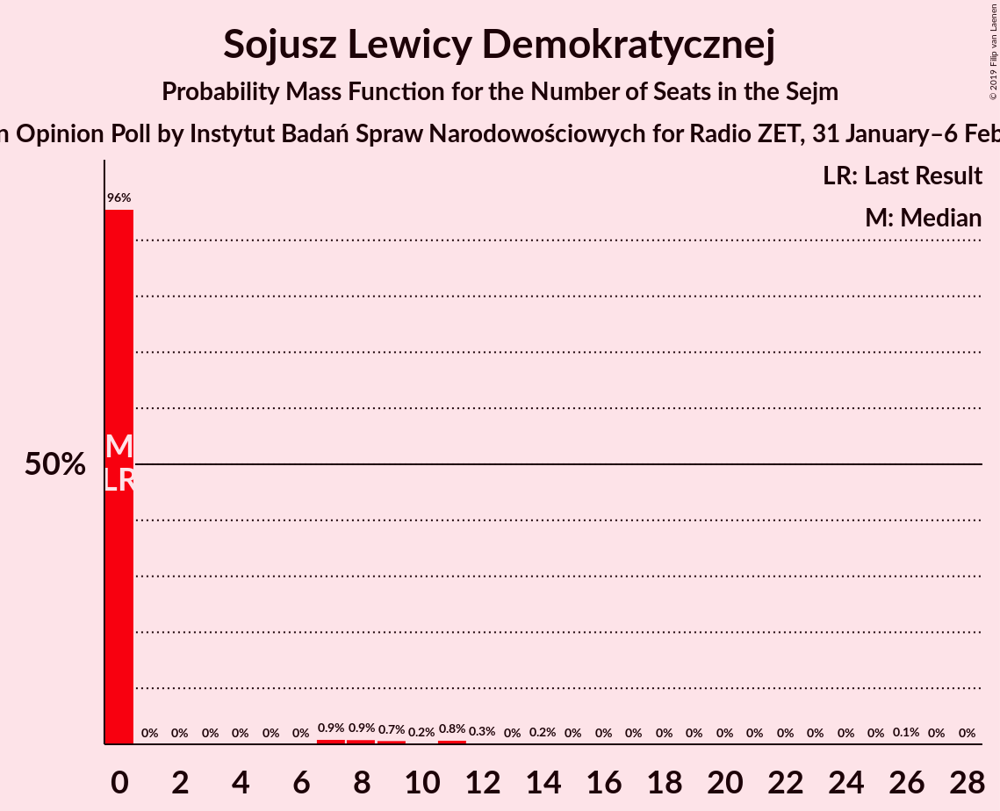
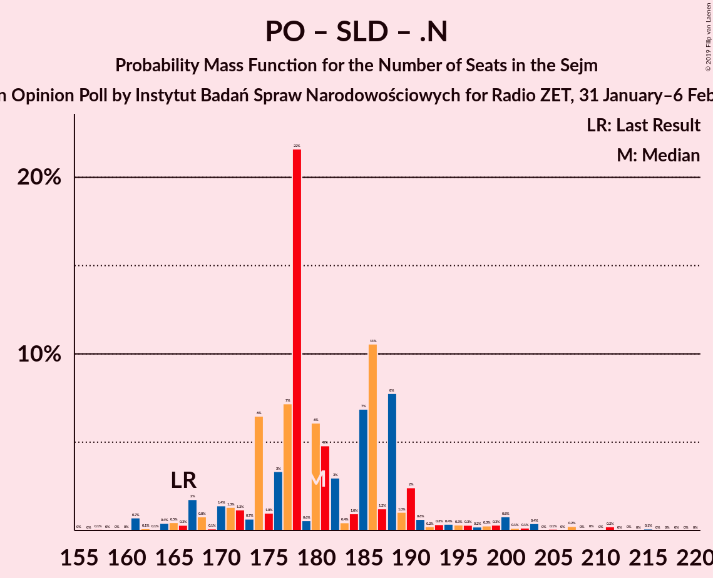

# Opinion Poll by Instytut Badań Spraw Narodowościowych for Radio ZET, 31 January–6 February 2019

<a href="#voting-intentions">Voting Intentions</a> | <a href="#seats">Seats</a> | <a href="#coalitions">Coalitions</a> | <a href="#technical-information">Technical Information</a>

## Voting Intentions

### Confidence Intervals

| Party | Last Result | Poll Result | 80% Confidence Interval | 90% Confidence Interval | 95% Confidence Interval | 99% Confidence Interval |
|:-----:|:-----------:|:-----------:|:-----------------------:|:-----------------------:|:-----------------------:|:-----------------------:|
| Prawo i Sprawiedliwość | 37.6% | 35.1% | 33.2–37.1% |32.7–37.6% |32.2–38.1% |31.3–39.1% |
| Platforma Obywatelska | 24.1% | 32.2% | 30.3–34.1% |29.8–34.7% |29.4–35.2% |28.5–36.1% |
| Wiosna | 0.0% | 12.0% | 10.8–13.4% |10.4–13.8% |10.1–14.2% |9.6–14.9% |
| Kukiz’15 | 8.8% | 5.8% | 5.0–6.9% |4.7–7.2% |4.5–7.4% |4.1–8.0% |
| Sojusz Lewicy Demokratycznej | 7.6% | 4.0% | 3.3–4.9% |3.1–5.2% |2.9–5.4% |2.7–5.9% |
| Polskie Stronnictwo Ludowe | 5.1% | 3.3% | 2.7–4.1% |2.5–4.4% |2.4–4.6% |2.1–5.0% |
| KORWiN | 4.8% | 1.6% | 1.2–2.2% |1.1–2.4% |1.0–2.6% |0.8–2.9% |
| .Nowoczesna | 7.6% | 1.1% | 0.8–1.7% |0.7–1.8% |0.6–2.0% |0.5–2.3% |
| Lewica Razem | 3.6% | 0.2% | 0.1–0.5% |0.1–0.6% |0.1–0.7% |0.0–0.9% |

*Note:* The poll result column reflects the actual value used in the calculations. Published results may vary slightly, and in addition be rounded to fewer digits.

## Seats

### Confidence Intervals

| Party | Last Result | Median | 80% Confidence Interval | 90% Confidence Interval | 95% Confidence Interval | 99% Confidence Interval |
|:-----:|:-----------:|:------:|:-----------------------:|:-----------------------:|:-----------------------:|:-----------------------:|
| <a href="#prawo-i-sprawiedliwość">Prawo i Sprawiedliwość</a> | 235 | 196 | 196–206 |196–206 |196–218 |184–218 |
| <a href="#platforma-obywatelska">Platforma Obywatelska</a> | 138 | 177 | 173–177 |173–177 |168–177 |168–206 |
| <a href="#wiosna">Wiosna</a> | 0 | 57 | 55–63 |55–63 |55–74 |53–74 |
| <a href="#kukiz’15">Kukiz’15</a> | 42 | 21 | 11–22 |11–22 |0–22 |0–43 |
| <a href="#sojusz-lewicy-demokratycznej">Sojusz Lewicy Demokratycznej</a> | 0 | 9 | 0–9 |0–14 |0–14 |0–14 |
| <a href="#polskie-stronnictwo-ludowe">Polskie Stronnictwo Ludowe</a> | 16 | 0 | 0 |0 |0 |0 |
| <a href="#korwin">KORWiN</a> | 0 | 0 | 0 |0 |0 |0 |
| <a href="#.nowoczesna">.Nowoczesna</a> | 28 | 0 | 0 |0 |0 |0 |
| <a href="#lewica-razem">Lewica Razem</a> | 0 | 0 | 0 |0 |0 |0 |

### Prawo i Sprawiedliwość

*For a full overview of the results for this party, see the [Prawo i Sprawiedliwość](party-prawoisprawiedliwość.html) page.*

| Number of Seats | Probability | Accumulated | Special Marks |
|:---------------:|:-----------:|:-----------:|:-------------:|
| 184 | 1.0% | 100% |  |
| 185 | 0% | 99.0% |  |
| 186 | 0% | 99.0% |  |
| 187 | 0% | 99.0% |  |
| 188 | 0% | 99.0% |  |
| 189 | 0% | 99.0% |  |
| 190 | 0% | 99.0% |  |
| 191 | 0% | 99.0% |  |
| 192 | 0% | 99.0% |  |
| 193 | 0% | 99.0% |  |
| 194 | 0% | 99.0% |  |
| 195 | 0% | 99.0% |  |
| 196 | 54% | 99.0% | Median |
| 197 | 0% | 45% |  |
| 198 | 0% | 45% |  |
| 199 | 7% | 45% |  |
| 200 | 0% | 38% |  |
| 201 | 0% | 38% |  |
| 202 | 0% | 38% |  |
| 203 | 0% | 38% |  |
| 204 | 0% | 38% |  |
| 205 | 0% | 38% |  |
| 206 | 35% | 38% |  |
| 207 | 0% | 3% |  |
| 208 | 0% | 3% |  |
| 209 | 0.1% | 3% |  |
| 210 | 0% | 3% |  |
| 211 | 0% | 3% |  |
| 212 | 0% | 3% |  |
| 213 | 0% | 3% |  |
| 214 | 0% | 3% |  |
| 215 | 0% | 3% |  |
| 216 | 0% | 3% |  |
| 217 | 0% | 3% |  |
| 218 | 3% | 3% |  |
| 219 | 0% | 0.1% |  |
| 220 | 0% | 0.1% |  |
| 221 | 0% | 0.1% |  |
| 222 | 0% | 0.1% |  |
| 223 | 0% | 0.1% |  |
| 224 | 0% | 0.1% |  |
| 225 | 0% | 0.1% |  |
| 226 | 0% | 0.1% |  |
| 227 | 0.1% | 0.1% |  |
| 228 | 0% | 0% |  |
| 229 | 0% | 0% |  |
| 230 | 0% | 0% |  |
| 231 | 0% | 0% | Majority |
| 232 | 0% | 0% |  |
| 233 | 0% | 0% |  |
| 234 | 0% | 0% |  |
| 235 | 0% | 0% | Last Result |

### Platforma Obywatelska

*For a full overview of the results for this party, see the [Platforma Obywatelska](party-platformaobywatelska.html) page.*

| Number of Seats | Probability | Accumulated | Special Marks |
|:---------------:|:-----------:|:-----------:|:-------------:|
| 138 | 0% | 100% | Last Result |
| 139 | 0% | 100% |  |
| 140 | 0% | 100% |  |
| 141 | 0% | 100% |  |
| 142 | 0% | 100% |  |
| 143 | 0% | 100% |  |
| 144 | 0% | 100% |  |
| 145 | 0% | 100% |  |
| 146 | 0% | 100% |  |
| 147 | 0% | 100% |  |
| 148 | 0% | 100% |  |
| 149 | 0% | 100% |  |
| 150 | 0% | 100% |  |
| 151 | 0% | 100% |  |
| 152 | 0.1% | 100% |  |
| 153 | 0% | 99.9% |  |
| 154 | 0% | 99.9% |  |
| 155 | 0% | 99.9% |  |
| 156 | 0% | 99.9% |  |
| 157 | 0.1% | 99.9% |  |
| 158 | 0% | 99.8% |  |
| 159 | 0% | 99.8% |  |
| 160 | 0% | 99.8% |  |
| 161 | 0% | 99.8% |  |
| 162 | 0% | 99.8% |  |
| 163 | 0% | 99.8% |  |
| 164 | 0% | 99.8% |  |
| 165 | 0% | 99.8% |  |
| 166 | 0% | 99.8% |  |
| 167 | 0% | 99.8% |  |
| 168 | 4% | 99.8% |  |
| 169 | 0% | 96% |  |
| 170 | 0% | 96% |  |
| 171 | 0% | 96% |  |
| 172 | 0% | 96% |  |
| 173 | 7% | 96% |  |
| 174 | 0% | 89% |  |
| 175 | 0% | 89% |  |
| 176 | 0.1% | 89% |  |
| 177 | 88% | 89% | Median |
| 178 | 0% | 1.1% |  |
| 179 | 0% | 1.1% |  |
| 180 | 0% | 1.1% |  |
| 181 | 0% | 1.1% |  |
| 182 | 0% | 1.1% |  |
| 183 | 0% | 1.1% |  |
| 184 | 0% | 1.1% |  |
| 185 | 0% | 1.1% |  |
| 186 | 0% | 1.1% |  |
| 187 | 0% | 1.1% |  |
| 188 | 0% | 1.1% |  |
| 189 | 0% | 1.1% |  |
| 190 | 0% | 1.1% |  |
| 191 | 0% | 1.1% |  |
| 192 | 0% | 1.0% |  |
| 193 | 0% | 1.0% |  |
| 194 | 0% | 1.0% |  |
| 195 | 0% | 1.0% |  |
| 196 | 0% | 1.0% |  |
| 197 | 0% | 1.0% |  |
| 198 | 0% | 1.0% |  |
| 199 | 0% | 1.0% |  |
| 200 | 0% | 1.0% |  |
| 201 | 0% | 1.0% |  |
| 202 | 0% | 1.0% |  |
| 203 | 0% | 1.0% |  |
| 204 | 0% | 1.0% |  |
| 205 | 0% | 1.0% |  |
| 206 | 1.0% | 1.0% |  |
| 207 | 0% | 0% |  |

### Wiosna

*For a full overview of the results for this party, see the [Wiosna](party-wiosna.html) page.*

| Number of Seats | Probability | Accumulated | Special Marks |
|:---------------:|:-----------:|:-----------:|:-------------:|
| 0 | 0% | 100% | Last Result |
| 1 | 0% | 100% |  |
| 2 | 0% | 100% |  |
| 3 | 0% | 100% |  |
| 4 | 0% | 100% |  |
| 5 | 0% | 100% |  |
| 6 | 0% | 100% |  |
| 7 | 0% | 100% |  |
| 8 | 0% | 100% |  |
| 9 | 0% | 100% |  |
| 10 | 0% | 100% |  |
| 11 | 0% | 100% |  |
| 12 | 0% | 100% |  |
| 13 | 0% | 100% |  |
| 14 | 0% | 100% |  |
| 15 | 0% | 100% |  |
| 16 | 0% | 100% |  |
| 17 | 0% | 100% |  |
| 18 | 0% | 100% |  |
| 19 | 0% | 100% |  |
| 20 | 0% | 100% |  |
| 21 | 0% | 100% |  |
| 22 | 0% | 100% |  |
| 23 | 0% | 100% |  |
| 24 | 0% | 100% |  |
| 25 | 0% | 100% |  |
| 26 | 0% | 100% |  |
| 27 | 0% | 100% |  |
| 28 | 0% | 100% |  |
| 29 | 0% | 100% |  |
| 30 | 0% | 100% |  |
| 31 | 0% | 100% |  |
| 32 | 0% | 100% |  |
| 33 | 0% | 100% |  |
| 34 | 0% | 100% |  |
| 35 | 0% | 100% |  |
| 36 | 0% | 100% |  |
| 37 | 0% | 100% |  |
| 38 | 0% | 100% |  |
| 39 | 0% | 100% |  |
| 40 | 0% | 100% |  |
| 41 | 0% | 100% |  |
| 42 | 0% | 100% |  |
| 43 | 0% | 100% |  |
| 44 | 0% | 100% |  |
| 45 | 0% | 99.9% |  |
| 46 | 0% | 99.9% |  |
| 47 | 0% | 99.9% |  |
| 48 | 0% | 99.9% |  |
| 49 | 0% | 99.9% |  |
| 50 | 0% | 99.9% |  |
| 51 | 0% | 99.9% |  |
| 52 | 0.1% | 99.9% |  |
| 53 | 1.1% | 99.8% |  |
| 54 | 0% | 98.8% |  |
| 55 | 35% | 98.8% |  |
| 56 | 0% | 64% |  |
| 57 | 53% | 64% | Median |
| 58 | 0% | 11% |  |
| 59 | 0.1% | 11% |  |
| 60 | 0% | 11% |  |
| 61 | 1.0% | 11% |  |
| 62 | 0% | 10% |  |
| 63 | 7% | 10% |  |
| 64 | 0.1% | 3% |  |
| 65 | 0% | 3% |  |
| 66 | 0% | 3% |  |
| 67 | 0% | 3% |  |
| 68 | 0% | 3% |  |
| 69 | 0% | 3% |  |
| 70 | 0% | 3% |  |
| 71 | 0% | 3% |  |
| 72 | 0% | 3% |  |
| 73 | 0% | 3% |  |
| 74 | 3% | 3% |  |
| 75 | 0% | 0% |  |

### Kukiz’15

*For a full overview of the results for this party, see the [Kukiz’15](party-kukiz’15.html) page.*

| Number of Seats | Probability | Accumulated | Special Marks |
|:---------------:|:-----------:|:-----------:|:-------------:|
| 0 | 3% | 100% |  |
| 1 | 0% | 97% |  |
| 2 | 0% | 97% |  |
| 3 | 0% | 97% |  |
| 4 | 0% | 97% |  |
| 5 | 0% | 97% |  |
| 6 | 0% | 97% |  |
| 7 | 0% | 97% |  |
| 8 | 0% | 97% |  |
| 9 | 1.0% | 97% |  |
| 10 | 0% | 96% |  |
| 11 | 7% | 96% |  |
| 12 | 0% | 89% |  |
| 13 | 0% | 89% |  |
| 14 | 0% | 89% |  |
| 15 | 0% | 89% |  |
| 16 | 0% | 89% |  |
| 17 | 0% | 89% |  |
| 18 | 0% | 89% |  |
| 19 | 0% | 89% |  |
| 20 | 0% | 89% |  |
| 21 | 53% | 89% | Median |
| 22 | 35% | 36% |  |
| 23 | 0% | 1.2% |  |
| 24 | 0.1% | 1.2% |  |
| 25 | 0.1% | 1.1% |  |
| 26 | 0% | 1.1% |  |
| 27 | 0% | 1.1% |  |
| 28 | 0% | 1.1% |  |
| 29 | 0% | 1.1% |  |
| 30 | 0% | 1.1% |  |
| 31 | 0% | 1.1% |  |
| 32 | 0% | 1.1% |  |
| 33 | 0% | 1.1% |  |
| 34 | 0% | 1.1% |  |
| 35 | 0% | 1.1% |  |
| 36 | 0% | 1.1% |  |
| 37 | 0% | 1.1% |  |
| 38 | 0% | 1.1% |  |
| 39 | 0% | 1.1% |  |
| 40 | 0% | 1.1% |  |
| 41 | 0% | 1.1% |  |
| 42 | 0% | 1.1% | Last Result |
| 43 | 1.1% | 1.1% |  |
| 44 | 0% | 0% |  |

### Sojusz Lewicy Demokratycznej

*For a full overview of the results for this party, see the [Sojusz Lewicy Demokratycznej](party-sojuszlewicydemokratycznej.html) page.*

| Number of Seats | Probability | Accumulated | Special Marks |
|:---------------:|:-----------:|:-----------:|:-------------:|
| 0 | 40% | 100% | Last Result |
| 1 | 0% | 60% |  |
| 2 | 0% | 60% |  |
| 3 | 0% | 60% |  |
| 4 | 0% | 60% |  |
| 5 | 0% | 60% |  |
| 6 | 0% | 60% |  |
| 7 | 0% | 60% |  |
| 8 | 0% | 60% |  |
| 9 | 53% | 60% | Median |
| 10 | 0% | 7% |  |
| 11 | 0.1% | 7% |  |
| 12 | 0% | 7% |  |
| 13 | 0% | 7% |  |
| 14 | 7% | 7% |  |
| 15 | 0% | 0.1% |  |
| 16 | 0% | 0.1% |  |
| 17 | 0% | 0.1% |  |
| 18 | 0% | 0.1% |  |
| 19 | 0% | 0.1% |  |
| 20 | 0% | 0.1% |  |
| 21 | 0% | 0.1% |  |
| 22 | 0% | 0.1% |  |
| 23 | 0% | 0.1% |  |
| 24 | 0% | 0.1% |  |
| 25 | 0% | 0.1% |  |
| 26 | 0% | 0.1% |  |
| 27 | 0% | 0.1% |  |
| 28 | 0.1% | 0.1% |  |
| 29 | 0% | 0% |  |

### Polskie Stronnictwo Ludowe

*For a full overview of the results for this party, see the [Polskie Stronnictwo Ludowe](party-polskiestronnictwoludowe.html) page.*

| Number of Seats | Probability | Accumulated | Special Marks |
|:---------------:|:-----------:|:-----------:|:-------------:|
| 0 | 100% | 100% | Median |
| 1 | 0% | 0% |  |
| 2 | 0% | 0% |  |
| 3 | 0% | 0% |  |
| 4 | 0% | 0% |  |
| 5 | 0% | 0% |  |
| 6 | 0% | 0% |  |
| 7 | 0% | 0% |  |
| 8 | 0% | 0% |  |
| 9 | 0% | 0% |  |
| 10 | 0% | 0% |  |
| 11 | 0% | 0% |  |
| 12 | 0% | 0% |  |
| 13 | 0% | 0% |  |
| 14 | 0% | 0% |  |
| 15 | 0% | 0% |  |
| 16 | 0% | 0% | Last Result |

### KORWiN

*For a full overview of the results for this party, see the [KORWiN](party-korwin.html) page.*

| Number of Seats | Probability | Accumulated | Special Marks |
|:---------------:|:-----------:|:-----------:|:-------------:|
| 0 | 100% | 100% | Last Result, Median |

### .Nowoczesna

*For a full overview of the results for this party, see the [.Nowoczesna](party-nowoczesna.html) page.*

| Number of Seats | Probability | Accumulated | Special Marks |
|:---------------:|:-----------:|:-----------:|:-------------:|
| 0 | 100% | 100% | Median |
| 1 | 0% | 0% |  |
| 2 | 0% | 0% |  |
| 3 | 0% | 0% |  |
| 4 | 0% | 0% |  |
| 5 | 0% | 0% |  |
| 6 | 0% | 0% |  |
| 7 | 0% | 0% |  |
| 8 | 0% | 0% |  |
| 9 | 0% | 0% |  |
| 10 | 0% | 0% |  |
| 11 | 0% | 0% |  |
| 12 | 0% | 0% |  |
| 13 | 0% | 0% |  |
| 14 | 0% | 0% |  |
| 15 | 0% | 0% |  |
| 16 | 0% | 0% |  |
| 17 | 0% | 0% |  |
| 18 | 0% | 0% |  |
| 19 | 0% | 0% |  |
| 20 | 0% | 0% |  |
| 21 | 0% | 0% |  |
| 22 | 0% | 0% |  |
| 23 | 0% | 0% |  |
| 24 | 0% | 0% |  |
| 25 | 0% | 0% |  |
| 26 | 0% | 0% |  |
| 27 | 0% | 0% |  |
| 28 | 0% | 0% | Last Result |

### Lewica Razem

*For a full overview of the results for this party, see the [Lewica Razem](party-lewicarazem.html) page.*

| Number of Seats | Probability | Accumulated | Special Marks |
|:---------------:|:-----------:|:-----------:|:-------------:|
| 0 | 100% | 100% | Last Result, Median |

## Coalitions

### Confidence Intervals

| Coalition | Last Result | Median | Majority? | 80% Confidence Interval | 90% Confidence Interval | 95% Confidence Interval | 99% Confidence Interval |
|:---------:|:-----------:|:------:|:---------:|:-----------------------:|:-----------------------:|:-----------------------:|:-----------------------:|
| Prawo i Sprawiedliwość | 235 | 196 | 0% | 196–206 | 196–206 | 196–218 | 184–218 |
| Platforma Obywatelska – Sojusz Lewicy Demokratycznej – Polskie Stronnictwo Ludowe – .Nowoczesna – Lewica Razem | 182 | 186 | 0% | 177–186 | 177–187 | 168–187 | 168–206 |
| Platforma Obywatelska – Sojusz Lewicy Demokratycznej – Polskie Stronnictwo Ludowe – .Nowoczesna | 182 | 186 | 0% | 177–186 | 177–187 | 168–187 | 168–206 |
| Platforma Obywatelska – Sojusz Lewicy Demokratycznej – .Nowoczesna | 166 | 186 | 0% | 177–186 | 177–187 | 168–187 | 168–206 |
| Platforma Obywatelska – .Nowoczesna | 166 | 177 | 0% | 173–177 | 173–177 | 168–177 | 168–206 |
| Platforma Obywatelska – Polskie Stronnictwo Ludowe – .Nowoczesna | 182 | 177 | 0% | 173–177 | 173–177 | 168–177 | 168–206 |
| Platforma Obywatelska | 138 | 177 | 0% | 173–177 | 173–177 | 168–177 | 168–206 |

### Prawo i Sprawiedliwość

| Number of Seats | Probability | Accumulated | Special Marks |
|:---------------:|:-----------:|:-----------:|:-------------:|
| 184 | 1.0% | 100% |  |
| 185 | 0% | 99.0% |  |
| 186 | 0% | 99.0% |  |
| 187 | 0% | 99.0% |  |
| 188 | 0% | 99.0% |  |
| 189 | 0% | 99.0% |  |
| 190 | 0% | 99.0% |  |
| 191 | 0% | 99.0% |  |
| 192 | 0% | 99.0% |  |
| 193 | 0% | 99.0% |  |
| 194 | 0% | 99.0% |  |
| 195 | 0% | 99.0% |  |
| 196 | 54% | 99.0% | Median |
| 197 | 0% | 45% |  |
| 198 | 0% | 45% |  |
| 199 | 7% | 45% |  |
| 200 | 0% | 38% |  |
| 201 | 0% | 38% |  |
| 202 | 0% | 38% |  |
| 203 | 0% | 38% |  |
| 204 | 0% | 38% |  |
| 205 | 0% | 38% |  |
| 206 | 35% | 38% |  |
| 207 | 0% | 3% |  |
| 208 | 0% | 3% |  |
| 209 | 0.1% | 3% |  |
| 210 | 0% | 3% |  |
| 211 | 0% | 3% |  |
| 212 | 0% | 3% |  |
| 213 | 0% | 3% |  |
| 214 | 0% | 3% |  |
| 215 | 0% | 3% |  |
| 216 | 0% | 3% |  |
| 217 | 0% | 3% |  |
| 218 | 3% | 3% |  |
| 219 | 0% | 0.1% |  |
| 220 | 0% | 0.1% |  |
| 221 | 0% | 0.1% |  |
| 222 | 0% | 0.1% |  |
| 223 | 0% | 0.1% |  |
| 224 | 0% | 0.1% |  |
| 225 | 0% | 0.1% |  |
| 226 | 0% | 0.1% |  |
| 227 | 0.1% | 0.1% |  |
| 228 | 0% | 0% |  |
| 229 | 0% | 0% |  |
| 230 | 0% | 0% |  |
| 231 | 0% | 0% | Majority |
| 232 | 0% | 0% |  |
| 233 | 0% | 0% |  |
| 234 | 0% | 0% |  |
| 235 | 0% | 0% | Last Result |

### Platforma Obywatelska – Sojusz Lewicy Demokratycznej – Polskie Stronnictwo Ludowe – .Nowoczesna – Lewica Razem

| Number of Seats | Probability | Accumulated | Special Marks |
|:---------------:|:-----------:|:-----------:|:-------------:|
| 157 | 0.1% | 100% |  |
| 158 | 0% | 99.9% |  |
| 159 | 0% | 99.9% |  |
| 160 | 0% | 99.9% |  |
| 161 | 0% | 99.9% |  |
| 162 | 0% | 99.9% |  |
| 163 | 0% | 99.9% |  |
| 164 | 0% | 99.9% |  |
| 165 | 0% | 99.9% |  |
| 166 | 0% | 99.9% |  |
| 167 | 0% | 99.9% |  |
| 168 | 4% | 99.9% |  |
| 169 | 0% | 96% |  |
| 170 | 0% | 96% |  |
| 171 | 0% | 96% |  |
| 172 | 0% | 96% |  |
| 173 | 0% | 96% |  |
| 174 | 0% | 96% |  |
| 175 | 0% | 96% |  |
| 176 | 0% | 96% |  |
| 177 | 35% | 96% |  |
| 178 | 0% | 61% |  |
| 179 | 0% | 61% |  |
| 180 | 0.1% | 61% |  |
| 181 | 0% | 61% |  |
| 182 | 0% | 61% | Last Result |
| 183 | 0% | 61% |  |
| 184 | 0% | 61% |  |
| 185 | 0% | 61% |  |
| 186 | 53% | 61% | Median |
| 187 | 7% | 8% |  |
| 188 | 0% | 1.1% |  |
| 189 | 0% | 1.1% |  |
| 190 | 0% | 1.1% |  |
| 191 | 0% | 1.1% |  |
| 192 | 0% | 1.1% |  |
| 193 | 0% | 1.1% |  |
| 194 | 0% | 1.0% |  |
| 195 | 0% | 1.0% |  |
| 196 | 0% | 1.0% |  |
| 197 | 0% | 1.0% |  |
| 198 | 0% | 1.0% |  |
| 199 | 0% | 1.0% |  |
| 200 | 0% | 1.0% |  |
| 201 | 0% | 1.0% |  |
| 202 | 0% | 1.0% |  |
| 203 | 0% | 1.0% |  |
| 204 | 0% | 1.0% |  |
| 205 | 0% | 1.0% |  |
| 206 | 1.0% | 1.0% |  |
| 207 | 0% | 0% |  |

### Platforma Obywatelska – Sojusz Lewicy Demokratycznej – Polskie Stronnictwo Ludowe – .Nowoczesna

| Number of Seats | Probability | Accumulated | Special Marks |
|:---------------:|:-----------:|:-----------:|:-------------:|
| 157 | 0.1% | 100% |  |
| 158 | 0% | 99.9% |  |
| 159 | 0% | 99.9% |  |
| 160 | 0% | 99.9% |  |
| 161 | 0% | 99.9% |  |
| 162 | 0% | 99.9% |  |
| 163 | 0% | 99.9% |  |
| 164 | 0% | 99.9% |  |
| 165 | 0% | 99.9% |  |
| 166 | 0% | 99.9% |  |
| 167 | 0% | 99.9% |  |
| 168 | 4% | 99.9% |  |
| 169 | 0% | 96% |  |
| 170 | 0% | 96% |  |
| 171 | 0% | 96% |  |
| 172 | 0% | 96% |  |
| 173 | 0% | 96% |  |
| 174 | 0% | 96% |  |
| 175 | 0% | 96% |  |
| 176 | 0% | 96% |  |
| 177 | 35% | 96% |  |
| 178 | 0% | 61% |  |
| 179 | 0% | 61% |  |
| 180 | 0.1% | 61% |  |
| 181 | 0% | 61% |  |
| 182 | 0% | 61% | Last Result |
| 183 | 0% | 61% |  |
| 184 | 0% | 61% |  |
| 185 | 0% | 61% |  |
| 186 | 53% | 61% | Median |
| 187 | 7% | 8% |  |
| 188 | 0% | 1.1% |  |
| 189 | 0% | 1.1% |  |
| 190 | 0% | 1.1% |  |
| 191 | 0% | 1.1% |  |
| 192 | 0% | 1.1% |  |
| 193 | 0% | 1.1% |  |
| 194 | 0% | 1.0% |  |
| 195 | 0% | 1.0% |  |
| 196 | 0% | 1.0% |  |
| 197 | 0% | 1.0% |  |
| 198 | 0% | 1.0% |  |
| 199 | 0% | 1.0% |  |
| 200 | 0% | 1.0% |  |
| 201 | 0% | 1.0% |  |
| 202 | 0% | 1.0% |  |
| 203 | 0% | 1.0% |  |
| 204 | 0% | 1.0% |  |
| 205 | 0% | 1.0% |  |
| 206 | 1.0% | 1.0% |  |
| 207 | 0% | 0% |  |

### Platforma Obywatelska – Sojusz Lewicy Demokratycznej – .Nowoczesna

| Number of Seats | Probability | Accumulated | Special Marks |
|:---------------:|:-----------:|:-----------:|:-------------:|
| 157 | 0.1% | 100% |  |
| 158 | 0% | 99.9% |  |
| 159 | 0% | 99.9% |  |
| 160 | 0% | 99.9% |  |
| 161 | 0% | 99.9% |  |
| 162 | 0% | 99.9% |  |
| 163 | 0% | 99.9% |  |
| 164 | 0% | 99.9% |  |
| 165 | 0% | 99.9% |  |
| 166 | 0% | 99.9% | Last Result |
| 167 | 0% | 99.9% |  |
| 168 | 4% | 99.9% |  |
| 169 | 0% | 96% |  |
| 170 | 0% | 96% |  |
| 171 | 0% | 96% |  |
| 172 | 0% | 96% |  |
| 173 | 0% | 96% |  |
| 174 | 0% | 96% |  |
| 175 | 0% | 96% |  |
| 176 | 0% | 96% |  |
| 177 | 35% | 96% |  |
| 178 | 0% | 61% |  |
| 179 | 0% | 61% |  |
| 180 | 0.1% | 61% |  |
| 181 | 0% | 61% |  |
| 182 | 0% | 61% |  |
| 183 | 0% | 61% |  |
| 184 | 0% | 61% |  |
| 185 | 0% | 61% |  |
| 186 | 53% | 61% | Median |
| 187 | 7% | 8% |  |
| 188 | 0% | 1.1% |  |
| 189 | 0% | 1.1% |  |
| 190 | 0% | 1.1% |  |
| 191 | 0% | 1.1% |  |
| 192 | 0% | 1.0% |  |
| 193 | 0% | 1.0% |  |
| 194 | 0% | 1.0% |  |
| 195 | 0% | 1.0% |  |
| 196 | 0% | 1.0% |  |
| 197 | 0% | 1.0% |  |
| 198 | 0% | 1.0% |  |
| 199 | 0% | 1.0% |  |
| 200 | 0% | 1.0% |  |
| 201 | 0% | 1.0% |  |
| 202 | 0% | 1.0% |  |
| 203 | 0% | 1.0% |  |
| 204 | 0% | 1.0% |  |
| 205 | 0% | 1.0% |  |
| 206 | 1.0% | 1.0% |  |
| 207 | 0% | 0% |  |

### Platforma Obywatelska – .Nowoczesna

| Number of Seats | Probability | Accumulated | Special Marks |
|:---------------:|:-----------:|:-----------:|:-------------:|
| 152 | 0.1% | 100% |  |
| 153 | 0% | 99.9% |  |
| 154 | 0% | 99.9% |  |
| 155 | 0% | 99.9% |  |
| 156 | 0% | 99.9% |  |
| 157 | 0.1% | 99.9% |  |
| 158 | 0% | 99.8% |  |
| 159 | 0% | 99.8% |  |
| 160 | 0% | 99.8% |  |
| 161 | 0% | 99.8% |  |
| 162 | 0% | 99.8% |  |
| 163 | 0% | 99.8% |  |
| 164 | 0% | 99.8% |  |
| 165 | 0% | 99.8% |  |
| 166 | 0% | 99.8% | Last Result |
| 167 | 0% | 99.8% |  |
| 168 | 4% | 99.8% |  |
| 169 | 0% | 96% |  |
| 170 | 0% | 96% |  |
| 171 | 0% | 96% |  |
| 172 | 0% | 96% |  |
| 173 | 7% | 96% |  |
| 174 | 0% | 89% |  |
| 175 | 0% | 89% |  |
| 176 | 0.1% | 89% |  |
| 177 | 88% | 89% | Median |
| 178 | 0% | 1.1% |  |
| 179 | 0% | 1.1% |  |
| 180 | 0% | 1.1% |  |
| 181 | 0% | 1.1% |  |
| 182 | 0% | 1.1% |  |
| 183 | 0% | 1.1% |  |
| 184 | 0% | 1.1% |  |
| 185 | 0% | 1.1% |  |
| 186 | 0% | 1.1% |  |
| 187 | 0% | 1.1% |  |
| 188 | 0% | 1.1% |  |
| 189 | 0% | 1.1% |  |
| 190 | 0% | 1.1% |  |
| 191 | 0% | 1.1% |  |
| 192 | 0% | 1.0% |  |
| 193 | 0% | 1.0% |  |
| 194 | 0% | 1.0% |  |
| 195 | 0% | 1.0% |  |
| 196 | 0% | 1.0% |  |
| 197 | 0% | 1.0% |  |
| 198 | 0% | 1.0% |  |
| 199 | 0% | 1.0% |  |
| 200 | 0% | 1.0% |  |
| 201 | 0% | 1.0% |  |
| 202 | 0% | 1.0% |  |
| 203 | 0% | 1.0% |  |
| 204 | 0% | 1.0% |  |
| 205 | 0% | 1.0% |  |
| 206 | 1.0% | 1.0% |  |
| 207 | 0% | 0% |  |

### Platforma Obywatelska – Polskie Stronnictwo Ludowe – .Nowoczesna

| Number of Seats | Probability | Accumulated | Special Marks |
|:---------------:|:-----------:|:-----------:|:-------------:|
| 152 | 0.1% | 100% |  |
| 153 | 0% | 99.9% |  |
| 154 | 0% | 99.9% |  |
| 155 | 0% | 99.9% |  |
| 156 | 0% | 99.9% |  |
| 157 | 0.1% | 99.9% |  |
| 158 | 0% | 99.8% |  |
| 159 | 0% | 99.8% |  |
| 160 | 0% | 99.8% |  |
| 161 | 0% | 99.8% |  |
| 162 | 0% | 99.8% |  |
| 163 | 0% | 99.8% |  |
| 164 | 0% | 99.8% |  |
| 165 | 0% | 99.8% |  |
| 166 | 0% | 99.8% |  |
| 167 | 0% | 99.8% |  |
| 168 | 4% | 99.8% |  |
| 169 | 0% | 96% |  |
| 170 | 0% | 96% |  |
| 171 | 0% | 96% |  |
| 172 | 0% | 96% |  |
| 173 | 7% | 96% |  |
| 174 | 0% | 89% |  |
| 175 | 0% | 89% |  |
| 176 | 0.1% | 89% |  |
| 177 | 88% | 89% | Median |
| 178 | 0% | 1.1% |  |
| 179 | 0% | 1.1% |  |
| 180 | 0% | 1.1% |  |
| 181 | 0% | 1.1% |  |
| 182 | 0% | 1.1% | Last Result |
| 183 | 0% | 1.1% |  |
| 184 | 0% | 1.1% |  |
| 185 | 0% | 1.1% |  |
| 186 | 0% | 1.1% |  |
| 187 | 0% | 1.1% |  |
| 188 | 0% | 1.1% |  |
| 189 | 0% | 1.1% |  |
| 190 | 0% | 1.1% |  |
| 191 | 0% | 1.1% |  |
| 192 | 0% | 1.0% |  |
| 193 | 0% | 1.0% |  |
| 194 | 0% | 1.0% |  |
| 195 | 0% | 1.0% |  |
| 196 | 0% | 1.0% |  |
| 197 | 0% | 1.0% |  |
| 198 | 0% | 1.0% |  |
| 199 | 0% | 1.0% |  |
| 200 | 0% | 1.0% |  |
| 201 | 0% | 1.0% |  |
| 202 | 0% | 1.0% |  |
| 203 | 0% | 1.0% |  |
| 204 | 0% | 1.0% |  |
| 205 | 0% | 1.0% |  |
| 206 | 1.0% | 1.0% |  |
| 207 | 0% | 0% |  |

### Platforma Obywatelska

| Number of Seats | Probability | Accumulated | Special Marks |
|:---------------:|:-----------:|:-----------:|:-------------:|
| 138 | 0% | 100% | Last Result |
| 139 | 0% | 100% |  |
| 140 | 0% | 100% |  |
| 141 | 0% | 100% |  |
| 142 | 0% | 100% |  |
| 143 | 0% | 100% |  |
| 144 | 0% | 100% |  |
| 145 | 0% | 100% |  |
| 146 | 0% | 100% |  |
| 147 | 0% | 100% |  |
| 148 | 0% | 100% |  |
| 149 | 0% | 100% |  |
| 150 | 0% | 100% |  |
| 151 | 0% | 100% |  |
| 152 | 0.1% | 100% |  |
| 153 | 0% | 99.9% |  |
| 154 | 0% | 99.9% |  |
| 155 | 0% | 99.9% |  |
| 156 | 0% | 99.9% |  |
| 157 | 0.1% | 99.9% |  |
| 158 | 0% | 99.8% |  |
| 159 | 0% | 99.8% |  |
| 160 | 0% | 99.8% |  |
| 161 | 0% | 99.8% |  |
| 162 | 0% | 99.8% |  |
| 163 | 0% | 99.8% |  |
| 164 | 0% | 99.8% |  |
| 165 | 0% | 99.8% |  |
| 166 | 0% | 99.8% |  |
| 167 | 0% | 99.8% |  |
| 168 | 4% | 99.8% |  |
| 169 | 0% | 96% |  |
| 170 | 0% | 96% |  |
| 171 | 0% | 96% |  |
| 172 | 0% | 96% |  |
| 173 | 7% | 96% |  |
| 174 | 0% | 89% |  |
| 175 | 0% | 89% |  |
| 176 | 0.1% | 89% |  |
| 177 | 88% | 89% | Median |
| 178 | 0% | 1.1% |  |
| 179 | 0% | 1.1% |  |
| 180 | 0% | 1.1% |  |
| 181 | 0% | 1.1% |  |
| 182 | 0% | 1.1% |  |
| 183 | 0% | 1.1% |  |
| 184 | 0% | 1.1% |  |
| 185 | 0% | 1.1% |  |
| 186 | 0% | 1.1% |  |
| 187 | 0% | 1.1% |  |
| 188 | 0% | 1.1% |  |
| 189 | 0% | 1.1% |  |
| 190 | 0% | 1.1% |  |
| 191 | 0% | 1.1% |  |
| 192 | 0% | 1.0% |  |
| 193 | 0% | 1.0% |  |
| 194 | 0% | 1.0% |  |
| 195 | 0% | 1.0% |  |
| 196 | 0% | 1.0% |  |
| 197 | 0% | 1.0% |  |
| 198 | 0% | 1.0% |  |
| 199 | 0% | 1.0% |  |
| 200 | 0% | 1.0% |  |
| 201 | 0% | 1.0% |  |
| 202 | 0% | 1.0% |  |
| 203 | 0% | 1.0% |  |
| 204 | 0% | 1.0% |  |
| 205 | 0% | 1.0% |  |
| 206 | 1.0% | 1.0% |  |
| 207 | 0% | 0% |  |

## Technical Information

### Opinion Poll

+ **Polling firm:** Instytut Badań Spraw Narodowościowych
+ **Commissioner(s):** Radio ZET
+ **Fieldwork period:** 31 January–6 February 2019

### Calculations

+ **Sample size:** 1000
+ **Simulations done:** 1,024
+ **Error estimate:** 0.84%

