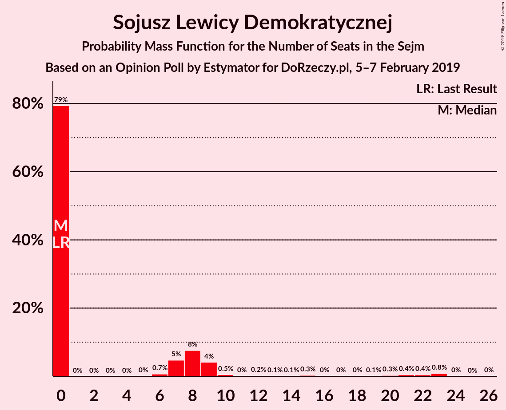
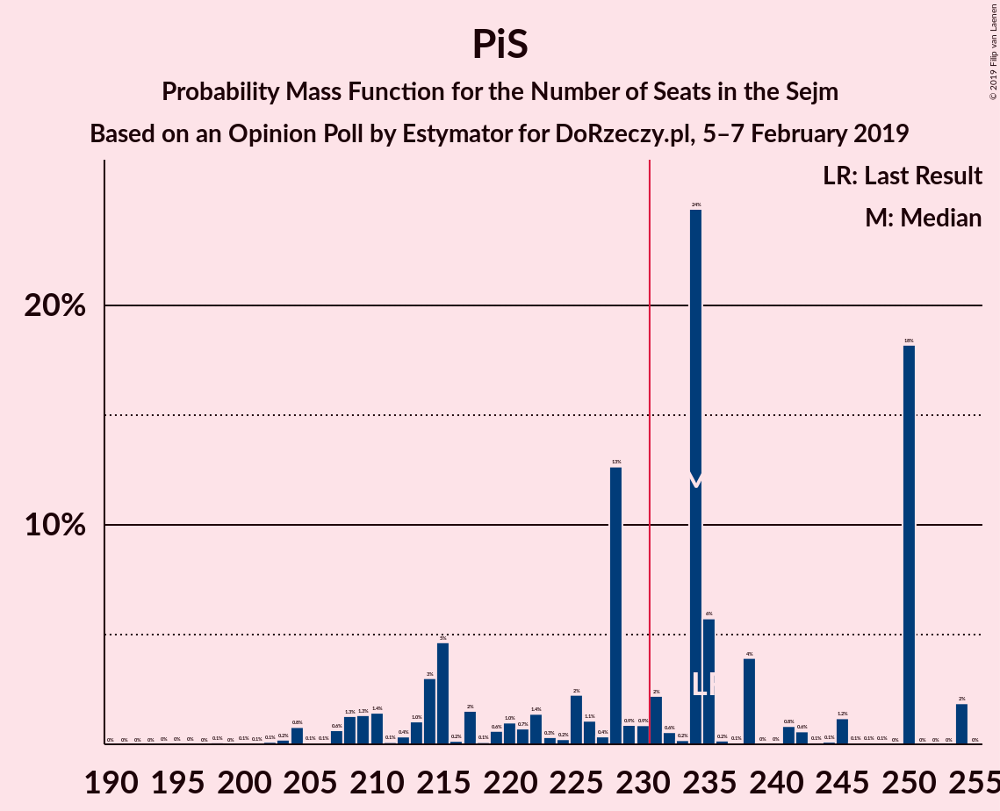

# Opinion Poll by Estymator for DoRzeczy.pl, 5–7 February 2019

<a href="#voting-intentions">Voting Intentions</a> | <a href="#seats">Seats</a> | <a href="#coalitions">Coalitions</a> | <a href="#technical-information">Technical Information</a>

## Voting Intentions

### Confidence Intervals

| Party | Last Result | Poll Result | 80% Confidence Interval | 90% Confidence Interval | 95% Confidence Interval | 99% Confidence Interval |
|:-----:|:-----------:|:-----------:|:-----------------------:|:-----------------------:|:-----------------------:|:-----------------------:|
| Prawo i Sprawiedliwość | 37.6% | 39.7% | 37.7–41.7% |37.2–42.2% |36.7–42.7% |35.8–43.7% |
| Platforma Obywatelska | 24.1% | 28.2% | 26.4–30.1% |25.9–30.6% |25.5–31.0% |24.7–32.0% |
| Wiosna | 0.0% | 8.6% | 7.6–9.8% |7.3–10.2% |7.0–10.5% |6.6–11.1% |
| Kukiz’15 | 8.8% | 7.4% | 6.4–8.6% |6.2–8.9% |6.0–9.2% |5.5–9.8% |
| Polskie Stronnictwo Ludowe | 5.1% | 5.9% | 5.1–7.0% |4.8–7.3% |4.6–7.6% |4.3–8.1% |
| Sojusz Lewicy Demokratycznej | 7.6% | 4.6% | 3.9–5.6% |3.7–5.9% |3.5–6.1% |3.2–6.6% |
| KORWiN | 4.8% | 1.2% | 0.9–1.8% |0.7–1.9% |0.7–2.1% |0.5–2.4% |
| Lewica Razem | 3.6% | 1.0% | 0.7–1.5% |0.6–1.7% |0.5–1.8% |0.4–2.1% |
| .Nowoczesna | 7.6% | 0.9% | 0.6–1.4% |0.5–1.6% |0.5–1.7% |0.4–2.0% |

*Note:* The poll result column reflects the actual value used in the calculations. Published results may vary slightly, and in addition be rounded to fewer digits.

## Seats

### Confidence Intervals

| Party | Last Result | Median | 80% Confidence Interval | 90% Confidence Interval | 95% Confidence Interval | 99% Confidence Interval |
|:-----:|:-----------:|:------:|:-----------------------:|:-----------------------:|:-----------------------:|:-----------------------:|
| <a href="#prawo-i-sprawiedliwość">Prawo i Sprawiedliwość</a> | 235 | 223 | 215–229 |203–229 |202–229 |191–235 |
| <a href="#platforma-obywatelska">Platforma Obywatelska</a> | 138 | 140 | 135–159 |135–165 |135–168 |135–183 |
| <a href="#wiosna">Wiosna</a> | 0 | 42 | 11–48 |11–48 |11–48 |11–48 |
| <a href="#kukiz’15">Kukiz’15</a> | 42 | 37 | 18–41 |17–41 |9–41 |8–41 |
| <a href="#polskie-stronnictwo-ludowe">Polskie Stronnictwo Ludowe</a> | 16 | 21 | 17–24 |16–24 |15–26 |0–26 |
| <a href="#sojusz-lewicy-demokratycznej">Sojusz Lewicy Demokratycznej</a> | 0 | 0 | 0–20 |0–20 |0–20 |0–20 |
| <a href="#korwin">KORWiN</a> | 0 | 0 | 0 |0 |0 |0 |
| <a href="#lewica-razem">Lewica Razem</a> | 0 | 0 | 0 |0 |0 |0 |
| <a href="#.nowoczesna">.Nowoczesna</a> | 28 | 0 | 0 |0 |0 |0 |

### Prawo i Sprawiedliwość

*For a full overview of the results for this party, see the [Prawo i Sprawiedliwość](party-prawoisprawiedliwość.html) page.*

| Number of Seats | Probability | Accumulated | Special Marks |
|:---------------:|:-----------:|:-----------:|:-------------:|
| 191 | 1.4% | 100% |  |
| 192 | 0% | 98.6% |  |
| 193 | 0% | 98.6% |  |
| 194 | 0.1% | 98.6% |  |
| 195 | 0% | 98% |  |
| 196 | 0% | 98% |  |
| 197 | 0% | 98% |  |
| 198 | 0% | 98% |  |
| 199 | 0% | 98% |  |
| 200 | 0% | 98% |  |
| 201 | 0% | 98% |  |
| 202 | 1.3% | 98% |  |
| 203 | 2% | 97% |  |
| 204 | 0% | 95% |  |
| 205 | 0% | 95% |  |
| 206 | 0% | 95% |  |
| 207 | 0% | 95% |  |
| 208 | 0% | 95% |  |
| 209 | 0% | 95% |  |
| 210 | 0% | 95% |  |
| 211 | 0% | 95% |  |
| 212 | 0% | 95% |  |
| 213 | 0% | 95% |  |
| 214 | 0% | 95% |  |
| 215 | 26% | 95% |  |
| 216 | 0.1% | 68% |  |
| 217 | 0% | 68% |  |
| 218 | 0% | 68% |  |
| 219 | 6% | 68% |  |
| 220 | 0% | 62% |  |
| 221 | 0.1% | 62% |  |
| 222 | 0% | 62% |  |
| 223 | 30% | 62% | Median |
| 224 | 0.3% | 32% |  |
| 225 | 0% | 32% |  |
| 226 | 0.5% | 32% |  |
| 227 | 3% | 32% |  |
| 228 | 0% | 28% |  |
| 229 | 27% | 28% |  |
| 230 | 0.1% | 2% |  |
| 231 | 0% | 2% | Majority |
| 232 | 0% | 2% |  |
| 233 | 0% | 2% |  |
| 234 | 0% | 2% |  |
| 235 | 1.2% | 2% | Last Result |
| 236 | 0.1% | 0.3% |  |
| 237 | 0% | 0.3% |  |
| 238 | 0% | 0.3% |  |
| 239 | 0% | 0.3% |  |
| 240 | 0% | 0.3% |  |
| 241 | 0% | 0.2% |  |
| 242 | 0% | 0.2% |  |
| 243 | 0% | 0.2% |  |
| 244 | 0% | 0.2% |  |
| 245 | 0% | 0.2% |  |
| 246 | 0% | 0.2% |  |
| 247 | 0% | 0.2% |  |
| 248 | 0% | 0.2% |  |
| 249 | 0% | 0.2% |  |
| 250 | 0% | 0.2% |  |
| 251 | 0.2% | 0.2% |  |
| 252 | 0% | 0% |  |

### Platforma Obywatelska

*For a full overview of the results for this party, see the [Platforma Obywatelska](party-platformaobywatelska.html) page.*

| Number of Seats | Probability | Accumulated | Special Marks |
|:---------------:|:-----------:|:-----------:|:-------------:|
| 133 | 0% | 100% |  |
| 134 | 0.2% | 99.9% |  |
| 135 | 26% | 99.8% |  |
| 136 | 0% | 73% |  |
| 137 | 0% | 73% |  |
| 138 | 0% | 73% | Last Result |
| 139 | 0% | 73% |  |
| 140 | 30% | 73% | Median |
| 141 | 0% | 43% |  |
| 142 | 0% | 43% |  |
| 143 | 3% | 43% |  |
| 144 | 6% | 40% |  |
| 145 | 0% | 34% |  |
| 146 | 0% | 34% |  |
| 147 | 0% | 34% |  |
| 148 | 0% | 34% |  |
| 149 | 0% | 34% |  |
| 150 | 0% | 34% |  |
| 151 | 0.1% | 34% |  |
| 152 | 0.1% | 34% |  |
| 153 | 0.4% | 34% |  |
| 154 | 0% | 33% |  |
| 155 | 0% | 33% |  |
| 156 | 0% | 33% |  |
| 157 | 0% | 33% |  |
| 158 | 0% | 33% |  |
| 159 | 27% | 33% |  |
| 160 | 0% | 7% |  |
| 161 | 0% | 7% |  |
| 162 | 0% | 7% |  |
| 163 | 1.3% | 7% |  |
| 164 | 0% | 5% |  |
| 165 | 2% | 5% |  |
| 166 | 0% | 3% |  |
| 167 | 0% | 3% |  |
| 168 | 1.4% | 3% |  |
| 169 | 0% | 2% |  |
| 170 | 0% | 2% |  |
| 171 | 0% | 2% |  |
| 172 | 0.3% | 2% |  |
| 173 | 0% | 1.3% |  |
| 174 | 0% | 1.3% |  |
| 175 | 0% | 1.3% |  |
| 176 | 0% | 1.3% |  |
| 177 | 0% | 1.3% |  |
| 178 | 0% | 1.3% |  |
| 179 | 0% | 1.3% |  |
| 180 | 0% | 1.3% |  |
| 181 | 0% | 1.3% |  |
| 182 | 0% | 1.3% |  |
| 183 | 1.3% | 1.3% |  |
| 184 | 0% | 0% |  |

### Wiosna

*For a full overview of the results for this party, see the [Wiosna](party-wiosna.html) page.*

| Number of Seats | Probability | Accumulated | Special Marks |
|:---------------:|:-----------:|:-----------:|:-------------:|
| 0 | 0% | 100% | Last Result |
| 1 | 0% | 100% |  |
| 2 | 0% | 100% |  |
| 3 | 0% | 100% |  |
| 4 | 0% | 100% |  |
| 5 | 0% | 100% |  |
| 6 | 0% | 100% |  |
| 7 | 0% | 100% |  |
| 8 | 0% | 100% |  |
| 9 | 0% | 100% |  |
| 10 | 0% | 100% |  |
| 11 | 27% | 100% |  |
| 12 | 0% | 73% |  |
| 13 | 0% | 73% |  |
| 14 | 0% | 73% |  |
| 15 | 0% | 73% |  |
| 16 | 0% | 73% |  |
| 17 | 0% | 73% |  |
| 18 | 0% | 73% |  |
| 19 | 0% | 73% |  |
| 20 | 0% | 73% |  |
| 21 | 0% | 73% |  |
| 22 | 0% | 73% |  |
| 23 | 0% | 73% |  |
| 24 | 0% | 73% |  |
| 25 | 0% | 73% |  |
| 26 | 0% | 73% |  |
| 27 | 0.3% | 73% |  |
| 28 | 0% | 73% |  |
| 29 | 0.5% | 73% |  |
| 30 | 1.2% | 72% |  |
| 31 | 0% | 71% |  |
| 32 | 0% | 71% |  |
| 33 | 0.2% | 71% |  |
| 34 | 0% | 71% |  |
| 35 | 0% | 71% |  |
| 36 | 1.3% | 71% |  |
| 37 | 0% | 70% |  |
| 38 | 0% | 70% |  |
| 39 | 3% | 70% |  |
| 40 | 0% | 67% |  |
| 41 | 0% | 67% |  |
| 42 | 38% | 67% | Median |
| 43 | 0.1% | 29% |  |
| 44 | 1.5% | 28% |  |
| 45 | 0.1% | 27% |  |
| 46 | 0% | 27% |  |
| 47 | 0.2% | 27% |  |
| 48 | 26% | 27% |  |
| 49 | 0% | 0.4% |  |
| 50 | 0.3% | 0.4% |  |
| 51 | 0% | 0% |  |

### Kukiz’15

*For a full overview of the results for this party, see the [Kukiz’15](party-kukiz’15.html) page.*

| Number of Seats | Probability | Accumulated | Special Marks |
|:---------------:|:-----------:|:-----------:|:-------------:|
| 0 | 0.1% | 100% |  |
| 1 | 0% | 99.9% |  |
| 2 | 0% | 99.9% |  |
| 3 | 0% | 99.9% |  |
| 4 | 0.2% | 99.9% |  |
| 5 | 0% | 99.7% |  |
| 6 | 0% | 99.7% |  |
| 7 | 0% | 99.7% |  |
| 8 | 2% | 99.7% |  |
| 9 | 1.3% | 98% |  |
| 10 | 0% | 97% |  |
| 11 | 0% | 97% |  |
| 12 | 0% | 97% |  |
| 13 | 0% | 97% |  |
| 14 | 0% | 97% |  |
| 15 | 0% | 97% |  |
| 16 | 0.1% | 97% |  |
| 17 | 3% | 97% |  |
| 18 | 30% | 94% |  |
| 19 | 0% | 64% |  |
| 20 | 0% | 64% |  |
| 21 | 0% | 64% |  |
| 22 | 0% | 64% |  |
| 23 | 0% | 64% |  |
| 24 | 3% | 64% |  |
| 25 | 0% | 61% |  |
| 26 | 0.1% | 61% |  |
| 27 | 0% | 61% |  |
| 28 | 0% | 61% |  |
| 29 | 0.1% | 61% |  |
| 30 | 1.4% | 61% |  |
| 31 | 0% | 60% |  |
| 32 | 6% | 60% |  |
| 33 | 0% | 54% |  |
| 34 | 0% | 54% |  |
| 35 | 0% | 54% |  |
| 36 | 0% | 54% |  |
| 37 | 27% | 54% | Median |
| 38 | 0.5% | 27% |  |
| 39 | 0% | 26% |  |
| 40 | 0% | 26% |  |
| 41 | 26% | 26% |  |
| 42 | 0% | 0% | Last Result |

### Polskie Stronnictwo Ludowe

*For a full overview of the results for this party, see the [Polskie Stronnictwo Ludowe](party-polskiestronnictwoludowe.html) page.*

| Number of Seats | Probability | Accumulated | Special Marks |
|:---------------:|:-----------:|:-----------:|:-------------:|
| 0 | 0.6% | 100% |  |
| 1 | 0% | 99.4% |  |
| 2 | 0% | 99.4% |  |
| 3 | 0% | 99.4% |  |
| 4 | 0% | 99.4% |  |
| 5 | 0% | 99.4% |  |
| 6 | 0% | 99.4% |  |
| 7 | 0% | 99.4% |  |
| 8 | 0% | 99.4% |  |
| 9 | 0% | 99.4% |  |
| 10 | 0% | 99.4% |  |
| 11 | 0% | 99.4% |  |
| 12 | 0% | 99.4% |  |
| 13 | 1.4% | 99.4% |  |
| 14 | 0.5% | 98% |  |
| 15 | 1.3% | 98% |  |
| 16 | 3% | 96% | Last Result |
| 17 | 30% | 93% |  |
| 18 | 0% | 64% |  |
| 19 | 0% | 64% |  |
| 20 | 0% | 63% |  |
| 21 | 26% | 63% | Median |
| 22 | 0% | 37% |  |
| 23 | 6% | 37% |  |
| 24 | 29% | 31% |  |
| 25 | 0.1% | 3% |  |
| 26 | 2% | 3% |  |
| 27 | 0.1% | 0.1% |  |
| 28 | 0% | 0% |  |

### Sojusz Lewicy Demokratycznej

*For a full overview of the results for this party, see the [Sojusz Lewicy Demokratycznej](party-sojuszlewicydemokratycznej.html) page.*

| Number of Seats | Probability | Accumulated | Special Marks |
|:---------------:|:-----------:|:-----------:|:-------------:|
| 0 | 64% | 100% | Last Result, Median |
| 1 | 0% | 36% |  |
| 2 | 0% | 36% |  |
| 3 | 0% | 36% |  |
| 4 | 0% | 36% |  |
| 5 | 0% | 36% |  |
| 6 | 0% | 36% |  |
| 7 | 0% | 36% |  |
| 8 | 0.3% | 36% |  |
| 9 | 0% | 36% |  |
| 10 | 0% | 36% |  |
| 11 | 0% | 36% |  |
| 12 | 0% | 36% |  |
| 13 | 0.1% | 36% |  |
| 14 | 1.4% | 36% |  |
| 15 | 1.3% | 34% |  |
| 16 | 0% | 33% |  |
| 17 | 0% | 33% |  |
| 18 | 3% | 33% |  |
| 19 | 0% | 30% |  |
| 20 | 30% | 30% |  |
| 21 | 0% | 0.4% |  |
| 22 | 0% | 0.4% |  |
| 23 | 0% | 0.4% |  |
| 24 | 0.2% | 0.4% |  |
| 25 | 0% | 0.2% |  |
| 26 | 0% | 0.2% |  |
| 27 | 0.1% | 0.2% |  |
| 28 | 0% | 0.1% |  |
| 29 | 0% | 0.1% |  |
| 30 | 0% | 0.1% |  |
| 31 | 0.1% | 0.1% |  |
| 32 | 0% | 0% |  |

### KORWiN

*For a full overview of the results for this party, see the [KORWiN](party-korwin.html) page.*

| Number of Seats | Probability | Accumulated | Special Marks |
|:---------------:|:-----------:|:-----------:|:-------------:|
| 0 | 100% | 100% | Last Result, Median |

### Lewica Razem

*For a full overview of the results for this party, see the [Lewica Razem](party-lewicarazem.html) page.*

| Number of Seats | Probability | Accumulated | Special Marks |
|:---------------:|:-----------:|:-----------:|:-------------:|
| 0 | 100% | 100% | Last Result, Median |

### .Nowoczesna

*For a full overview of the results for this party, see the [.Nowoczesna](party-nowoczesna.html) page.*

| Number of Seats | Probability | Accumulated | Special Marks |
|:---------------:|:-----------:|:-----------:|:-------------:|
| 0 | 100% | 100% | Median |
| 1 | 0% | 0% |  |
| 2 | 0% | 0% |  |
| 3 | 0% | 0% |  |
| 4 | 0% | 0% |  |
| 5 | 0% | 0% |  |
| 6 | 0% | 0% |  |
| 7 | 0% | 0% |  |
| 8 | 0% | 0% |  |
| 9 | 0% | 0% |  |
| 10 | 0% | 0% |  |
| 11 | 0% | 0% |  |
| 12 | 0% | 0% |  |
| 13 | 0% | 0% |  |
| 14 | 0% | 0% |  |
| 15 | 0% | 0% |  |
| 16 | 0% | 0% |  |
| 17 | 0% | 0% |  |
| 18 | 0% | 0% |  |
| 19 | 0% | 0% |  |
| 20 | 0% | 0% |  |
| 21 | 0% | 0% |  |
| 22 | 0% | 0% |  |
| 23 | 0% | 0% |  |
| 24 | 0% | 0% |  |
| 25 | 0% | 0% |  |
| 26 | 0% | 0% |  |
| 27 | 0% | 0% |  |
| 28 | 0% | 0% | Last Result |

## Coalitions

### Confidence Intervals

| Coalition | Last Result | Median | Majority? | 80% Confidence Interval | 90% Confidence Interval | 95% Confidence Interval | 99% Confidence Interval |
|:---------:|:-----------:|:------:|:---------:|:-----------------------:|:-----------------------:|:-----------------------:|:-----------------------:|
| Prawo i Sprawiedliwość | 235 | 223 | 2% | 215–229 | 203–229 | 202–229 | 191–235 |
| Platforma Obywatelska – Polskie Stronnictwo Ludowe – Sojusz Lewicy Demokratycznej – Lewica Razem – .Nowoczesna | 182 | 177 | 0% | 156–183 | 156–191 | 156–195 | 156–213 |
| Platforma Obywatelska – Polskie Stronnictwo Ludowe – Sojusz Lewicy Demokratycznej – .Nowoczesna | 182 | 177 | 0% | 156–183 | 156–191 | 156–195 | 156–213 |
| Platforma Obywatelska – Polskie Stronnictwo Ludowe – .Nowoczesna | 182 | 157 | 0% | 156–183 | 156–186 | 156–191 | 156–198 |
| Platforma Obywatelska – Sojusz Lewicy Demokratycznej – .Nowoczesna | 166 | 159 | 0% | 135–161 | 135–165 | 135–182 | 135–198 |
| Platforma Obywatelska – .Nowoczesna | 166 | 140 | 0% | 135–159 | 135–165 | 135–168 | 135–183 |
| Platforma Obywatelska | 138 | 140 | 0% | 135–159 | 135–165 | 135–168 | 135–183 |

### Prawo i Sprawiedliwość

| Number of Seats | Probability | Accumulated | Special Marks |
|:---------------:|:-----------:|:-----------:|:-------------:|
| 191 | 1.4% | 100% |  |
| 192 | 0% | 98.6% |  |
| 193 | 0% | 98.6% |  |
| 194 | 0.1% | 98.6% |  |
| 195 | 0% | 98% |  |
| 196 | 0% | 98% |  |
| 197 | 0% | 98% |  |
| 198 | 0% | 98% |  |
| 199 | 0% | 98% |  |
| 200 | 0% | 98% |  |
| 201 | 0% | 98% |  |
| 202 | 1.3% | 98% |  |
| 203 | 2% | 97% |  |
| 204 | 0% | 95% |  |
| 205 | 0% | 95% |  |
| 206 | 0% | 95% |  |
| 207 | 0% | 95% |  |
| 208 | 0% | 95% |  |
| 209 | 0% | 95% |  |
| 210 | 0% | 95% |  |
| 211 | 0% | 95% |  |
| 212 | 0% | 95% |  |
| 213 | 0% | 95% |  |
| 214 | 0% | 95% |  |
| 215 | 26% | 95% |  |
| 216 | 0.1% | 68% |  |
| 217 | 0% | 68% |  |
| 218 | 0% | 68% |  |
| 219 | 6% | 68% |  |
| 220 | 0% | 62% |  |
| 221 | 0.1% | 62% |  |
| 222 | 0% | 62% |  |
| 223 | 30% | 62% | Median |
| 224 | 0.3% | 32% |  |
| 225 | 0% | 32% |  |
| 226 | 0.5% | 32% |  |
| 227 | 3% | 32% |  |
| 228 | 0% | 28% |  |
| 229 | 27% | 28% |  |
| 230 | 0.1% | 2% |  |
| 231 | 0% | 2% | Majority |
| 232 | 0% | 2% |  |
| 233 | 0% | 2% |  |
| 234 | 0% | 2% |  |
| 235 | 1.2% | 2% | Last Result |
| 236 | 0.1% | 0.3% |  |
| 237 | 0% | 0.3% |  |
| 238 | 0% | 0.3% |  |
| 239 | 0% | 0.3% |  |
| 240 | 0% | 0.3% |  |
| 241 | 0% | 0.2% |  |
| 242 | 0% | 0.2% |  |
| 243 | 0% | 0.2% |  |
| 244 | 0% | 0.2% |  |
| 245 | 0% | 0.2% |  |
| 246 | 0% | 0.2% |  |
| 247 | 0% | 0.2% |  |
| 248 | 0% | 0.2% |  |
| 249 | 0% | 0.2% |  |
| 250 | 0% | 0.2% |  |
| 251 | 0.2% | 0.2% |  |
| 252 | 0% | 0% |  |

### Platforma Obywatelska – Polskie Stronnictwo Ludowe – Sojusz Lewicy Demokratycznej – Lewica Razem – .Nowoczesna

| Number of Seats | Probability | Accumulated | Special Marks |
|:---------------:|:-----------:|:-----------:|:-------------:|
| 151 | 0% | 100% |  |
| 152 | 0% | 99.9% |  |
| 153 | 0% | 99.9% |  |
| 154 | 0% | 99.9% |  |
| 155 | 0% | 99.9% |  |
| 156 | 26% | 99.9% |  |
| 157 | 0% | 74% |  |
| 158 | 0% | 74% |  |
| 159 | 0% | 74% |  |
| 160 | 0% | 74% |  |
| 161 | 0% | 74% | Median |
| 162 | 0% | 74% |  |
| 163 | 0.1% | 74% |  |
| 164 | 0% | 74% |  |
| 165 | 0.1% | 74% |  |
| 166 | 0% | 73% |  |
| 167 | 6% | 73% |  |
| 168 | 0% | 67% |  |
| 169 | 0% | 67% |  |
| 170 | 0% | 67% |  |
| 171 | 0.1% | 67% |  |
| 172 | 0.4% | 67% |  |
| 173 | 0% | 66% |  |
| 174 | 0% | 66% |  |
| 175 | 0.3% | 66% |  |
| 176 | 0% | 66% |  |
| 177 | 33% | 66% |  |
| 178 | 0% | 33% |  |
| 179 | 0% | 33% |  |
| 180 | 0.1% | 33% |  |
| 181 | 0% | 33% |  |
| 182 | 0% | 33% | Last Result |
| 183 | 27% | 33% |  |
| 184 | 0% | 7% |  |
| 185 | 0% | 7% |  |
| 186 | 0% | 7% |  |
| 187 | 1.2% | 7% |  |
| 188 | 0% | 5% |  |
| 189 | 0% | 5% |  |
| 190 | 0% | 5% |  |
| 191 | 2% | 5% |  |
| 192 | 0% | 3% |  |
| 193 | 0% | 3% |  |
| 194 | 0% | 3% |  |
| 195 | 1.4% | 3% |  |
| 196 | 0% | 1.4% |  |
| 197 | 0% | 1.4% |  |
| 198 | 0% | 1.4% |  |
| 199 | 0% | 1.4% |  |
| 200 | 0% | 1.4% |  |
| 201 | 0% | 1.4% |  |
| 202 | 0% | 1.4% |  |
| 203 | 0.1% | 1.4% |  |
| 204 | 0% | 1.3% |  |
| 205 | 0% | 1.3% |  |
| 206 | 0% | 1.3% |  |
| 207 | 0% | 1.3% |  |
| 208 | 0% | 1.3% |  |
| 209 | 0% | 1.3% |  |
| 210 | 0% | 1.3% |  |
| 211 | 0% | 1.3% |  |
| 212 | 0% | 1.3% |  |
| 213 | 1.3% | 1.3% |  |
| 214 | 0% | 0% |  |

### Platforma Obywatelska – Polskie Stronnictwo Ludowe – Sojusz Lewicy Demokratycznej – .Nowoczesna

| Number of Seats | Probability | Accumulated | Special Marks |
|:---------------:|:-----------:|:-----------:|:-------------:|
| 151 | 0% | 100% |  |
| 152 | 0% | 99.9% |  |
| 153 | 0% | 99.9% |  |
| 154 | 0% | 99.9% |  |
| 155 | 0% | 99.9% |  |
| 156 | 26% | 99.9% |  |
| 157 | 0% | 74% |  |
| 158 | 0% | 74% |  |
| 159 | 0% | 74% |  |
| 160 | 0% | 74% |  |
| 161 | 0% | 74% | Median |
| 162 | 0% | 74% |  |
| 163 | 0.1% | 74% |  |
| 164 | 0% | 74% |  |
| 165 | 0.1% | 74% |  |
| 166 | 0% | 73% |  |
| 167 | 6% | 73% |  |
| 168 | 0% | 67% |  |
| 169 | 0% | 67% |  |
| 170 | 0% | 67% |  |
| 171 | 0.1% | 67% |  |
| 172 | 0.4% | 67% |  |
| 173 | 0% | 66% |  |
| 174 | 0% | 66% |  |
| 175 | 0.3% | 66% |  |
| 176 | 0% | 66% |  |
| 177 | 33% | 66% |  |
| 178 | 0% | 33% |  |
| 179 | 0% | 33% |  |
| 180 | 0.1% | 33% |  |
| 181 | 0% | 33% |  |
| 182 | 0% | 33% | Last Result |
| 183 | 27% | 33% |  |
| 184 | 0% | 7% |  |
| 185 | 0% | 7% |  |
| 186 | 0% | 7% |  |
| 187 | 1.2% | 7% |  |
| 188 | 0% | 5% |  |
| 189 | 0% | 5% |  |
| 190 | 0% | 5% |  |
| 191 | 2% | 5% |  |
| 192 | 0% | 3% |  |
| 193 | 0% | 3% |  |
| 194 | 0% | 3% |  |
| 195 | 1.4% | 3% |  |
| 196 | 0% | 1.4% |  |
| 197 | 0% | 1.4% |  |
| 198 | 0% | 1.4% |  |
| 199 | 0% | 1.4% |  |
| 200 | 0% | 1.4% |  |
| 201 | 0% | 1.4% |  |
| 202 | 0% | 1.4% |  |
| 203 | 0.1% | 1.4% |  |
| 204 | 0% | 1.3% |  |
| 205 | 0% | 1.3% |  |
| 206 | 0% | 1.3% |  |
| 207 | 0% | 1.3% |  |
| 208 | 0% | 1.3% |  |
| 209 | 0% | 1.3% |  |
| 210 | 0% | 1.3% |  |
| 211 | 0% | 1.3% |  |
| 212 | 0% | 1.3% |  |
| 213 | 1.3% | 1.3% |  |
| 214 | 0% | 0% |  |

### Platforma Obywatelska – Polskie Stronnictwo Ludowe – .Nowoczesna

| Number of Seats | Probability | Accumulated | Special Marks |
|:---------------:|:-----------:|:-----------:|:-------------:|
| 140 | 0.1% | 100% |  |
| 141 | 0% | 99.9% |  |
| 142 | 0% | 99.9% |  |
| 143 | 0% | 99.9% |  |
| 144 | 0% | 99.9% |  |
| 145 | 0% | 99.9% |  |
| 146 | 0% | 99.9% |  |
| 147 | 0% | 99.9% |  |
| 148 | 0.2% | 99.9% |  |
| 149 | 0% | 99.7% |  |
| 150 | 0% | 99.7% |  |
| 151 | 0% | 99.7% |  |
| 152 | 0.1% | 99.7% |  |
| 153 | 0% | 99.5% |  |
| 154 | 0% | 99.5% |  |
| 155 | 0% | 99.5% |  |
| 156 | 26% | 99.5% |  |
| 157 | 30% | 73% |  |
| 158 | 0% | 43% |  |
| 159 | 3% | 43% |  |
| 160 | 0% | 41% |  |
| 161 | 0% | 41% | Median |
| 162 | 0% | 41% |  |
| 163 | 0.1% | 40% |  |
| 164 | 0% | 40% |  |
| 165 | 0% | 40% |  |
| 166 | 0% | 40% |  |
| 167 | 7% | 40% |  |
| 168 | 0% | 34% |  |
| 169 | 0% | 34% |  |
| 170 | 0% | 34% |  |
| 171 | 0% | 34% |  |
| 172 | 0.3% | 34% |  |
| 173 | 0% | 33% |  |
| 174 | 0% | 33% |  |
| 175 | 0% | 33% |  |
| 176 | 0.1% | 33% |  |
| 177 | 0% | 33% |  |
| 178 | 0% | 33% |  |
| 179 | 0% | 33% |  |
| 180 | 0.1% | 33% |  |
| 181 | 1.4% | 33% |  |
| 182 | 0% | 32% | Last Result |
| 183 | 27% | 32% |  |
| 184 | 0% | 5% |  |
| 185 | 0% | 5% |  |
| 186 | 0% | 5% |  |
| 187 | 1.2% | 5% |  |
| 188 | 0% | 4% |  |
| 189 | 0% | 4% |  |
| 190 | 0% | 4% |  |
| 191 | 2% | 4% |  |
| 192 | 0% | 1.3% |  |
| 193 | 0% | 1.3% |  |
| 194 | 0% | 1.3% |  |
| 195 | 0% | 1.3% |  |
| 196 | 0% | 1.3% |  |
| 197 | 0% | 1.3% |  |
| 198 | 1.3% | 1.3% |  |
| 199 | 0% | 0% |  |

### Platforma Obywatelska – Sojusz Lewicy Demokratycznej – .Nowoczesna

| Number of Seats | Probability | Accumulated | Special Marks |
|:---------------:|:-----------:|:-----------:|:-------------:|
| 135 | 26% | 100% |  |
| 136 | 0% | 74% |  |
| 137 | 0% | 74% |  |
| 138 | 0% | 74% |  |
| 139 | 0% | 74% |  |
| 140 | 0% | 74% | Median |
| 141 | 0% | 74% |  |
| 142 | 0% | 74% |  |
| 143 | 0.6% | 74% |  |
| 144 | 6% | 73% |  |
| 145 | 0% | 67% |  |
| 146 | 0% | 67% |  |
| 147 | 0% | 67% |  |
| 148 | 0% | 67% |  |
| 149 | 0% | 67% |  |
| 150 | 0% | 67% |  |
| 151 | 0% | 67% |  |
| 152 | 0% | 67% |  |
| 153 | 0.1% | 67% |  |
| 154 | 0% | 67% |  |
| 155 | 0% | 67% |  |
| 156 | 0% | 67% |  |
| 157 | 0% | 67% |  |
| 158 | 0.2% | 67% |  |
| 159 | 27% | 67% |  |
| 160 | 30% | 40% |  |
| 161 | 3% | 10% |  |
| 162 | 0% | 7% |  |
| 163 | 1.3% | 7% |  |
| 164 | 0% | 6% |  |
| 165 | 3% | 6% |  |
| 166 | 0% | 3% | Last Result |
| 167 | 0% | 3% |  |
| 168 | 0% | 3% |  |
| 169 | 0% | 3% |  |
| 170 | 0% | 3% |  |
| 171 | 0.1% | 3% |  |
| 172 | 0.3% | 3% |  |
| 173 | 0% | 3% |  |
| 174 | 0% | 3% |  |
| 175 | 0% | 3% |  |
| 176 | 0% | 3% |  |
| 177 | 0% | 3% |  |
| 178 | 0.1% | 3% |  |
| 179 | 0% | 3% |  |
| 180 | 0% | 3% |  |
| 181 | 0% | 3% |  |
| 182 | 1.4% | 3% |  |
| 183 | 0% | 1.3% |  |
| 184 | 0% | 1.3% |  |
| 185 | 0% | 1.3% |  |
| 186 | 0% | 1.3% |  |
| 187 | 0% | 1.3% |  |
| 188 | 0% | 1.3% |  |
| 189 | 0% | 1.3% |  |
| 190 | 0% | 1.3% |  |
| 191 | 0% | 1.3% |  |
| 192 | 0% | 1.3% |  |
| 193 | 0% | 1.3% |  |
| 194 | 0% | 1.3% |  |
| 195 | 0% | 1.3% |  |
| 196 | 0% | 1.3% |  |
| 197 | 0% | 1.3% |  |
| 198 | 1.3% | 1.3% |  |
| 199 | 0% | 0% |  |

### Platforma Obywatelska – .Nowoczesna

| Number of Seats | Probability | Accumulated | Special Marks |
|:---------------:|:-----------:|:-----------:|:-------------:|
| 133 | 0% | 100% |  |
| 134 | 0.2% | 99.9% |  |
| 135 | 26% | 99.8% |  |
| 136 | 0% | 73% |  |
| 137 | 0% | 73% |  |
| 138 | 0% | 73% |  |
| 139 | 0% | 73% |  |
| 140 | 30% | 73% | Median |
| 141 | 0% | 43% |  |
| 142 | 0% | 43% |  |
| 143 | 3% | 43% |  |
| 144 | 6% | 40% |  |
| 145 | 0% | 34% |  |
| 146 | 0% | 34% |  |
| 147 | 0% | 34% |  |
| 148 | 0% | 34% |  |
| 149 | 0% | 34% |  |
| 150 | 0% | 34% |  |
| 151 | 0.1% | 34% |  |
| 152 | 0.1% | 34% |  |
| 153 | 0.4% | 34% |  |
| 154 | 0% | 33% |  |
| 155 | 0% | 33% |  |
| 156 | 0% | 33% |  |
| 157 | 0% | 33% |  |
| 158 | 0% | 33% |  |
| 159 | 27% | 33% |  |
| 160 | 0% | 7% |  |
| 161 | 0% | 7% |  |
| 162 | 0% | 7% |  |
| 163 | 1.3% | 7% |  |
| 164 | 0% | 5% |  |
| 165 | 2% | 5% |  |
| 166 | 0% | 3% | Last Result |
| 167 | 0% | 3% |  |
| 168 | 1.4% | 3% |  |
| 169 | 0% | 2% |  |
| 170 | 0% | 2% |  |
| 171 | 0% | 2% |  |
| 172 | 0.3% | 2% |  |
| 173 | 0% | 1.3% |  |
| 174 | 0% | 1.3% |  |
| 175 | 0% | 1.3% |  |
| 176 | 0% | 1.3% |  |
| 177 | 0% | 1.3% |  |
| 178 | 0% | 1.3% |  |
| 179 | 0% | 1.3% |  |
| 180 | 0% | 1.3% |  |
| 181 | 0% | 1.3% |  |
| 182 | 0% | 1.3% |  |
| 183 | 1.3% | 1.3% |  |
| 184 | 0% | 0% |  |

### Platforma Obywatelska

| Number of Seats | Probability | Accumulated | Special Marks |
|:---------------:|:-----------:|:-----------:|:-------------:|
| 133 | 0% | 100% |  |
| 134 | 0.2% | 99.9% |  |
| 135 | 26% | 99.8% |  |
| 136 | 0% | 73% |  |
| 137 | 0% | 73% |  |
| 138 | 0% | 73% | Last Result |
| 139 | 0% | 73% |  |
| 140 | 30% | 73% | Median |
| 141 | 0% | 43% |  |
| 142 | 0% | 43% |  |
| 143 | 3% | 43% |  |
| 144 | 6% | 40% |  |
| 145 | 0% | 34% |  |
| 146 | 0% | 34% |  |
| 147 | 0% | 34% |  |
| 148 | 0% | 34% |  |
| 149 | 0% | 34% |  |
| 150 | 0% | 34% |  |
| 151 | 0.1% | 34% |  |
| 152 | 0.1% | 34% |  |
| 153 | 0.4% | 34% |  |
| 154 | 0% | 33% |  |
| 155 | 0% | 33% |  |
| 156 | 0% | 33% |  |
| 157 | 0% | 33% |  |
| 158 | 0% | 33% |  |
| 159 | 27% | 33% |  |
| 160 | 0% | 7% |  |
| 161 | 0% | 7% |  |
| 162 | 0% | 7% |  |
| 163 | 1.3% | 7% |  |
| 164 | 0% | 5% |  |
| 165 | 2% | 5% |  |
| 166 | 0% | 3% |  |
| 167 | 0% | 3% |  |
| 168 | 1.4% | 3% |  |
| 169 | 0% | 2% |  |
| 170 | 0% | 2% |  |
| 171 | 0% | 2% |  |
| 172 | 0.3% | 2% |  |
| 173 | 0% | 1.3% |  |
| 174 | 0% | 1.3% |  |
| 175 | 0% | 1.3% |  |
| 176 | 0% | 1.3% |  |
| 177 | 0% | 1.3% |  |
| 178 | 0% | 1.3% |  |
| 179 | 0% | 1.3% |  |
| 180 | 0% | 1.3% |  |
| 181 | 0% | 1.3% |  |
| 182 | 0% | 1.3% |  |
| 183 | 1.3% | 1.3% |  |
| 184 | 0% | 0% |  |

## Technical Information

### Opinion Poll

+ **Polling firm:** Estymator
+ **Commissioner(s):** DoRzeczy.pl
+ **Fieldwork period:** 5–7 February 2019

### Calculations

+ **Sample size:** 1011
+ **Simulations done:** 1,024
+ **Error estimate:** 4.42%

