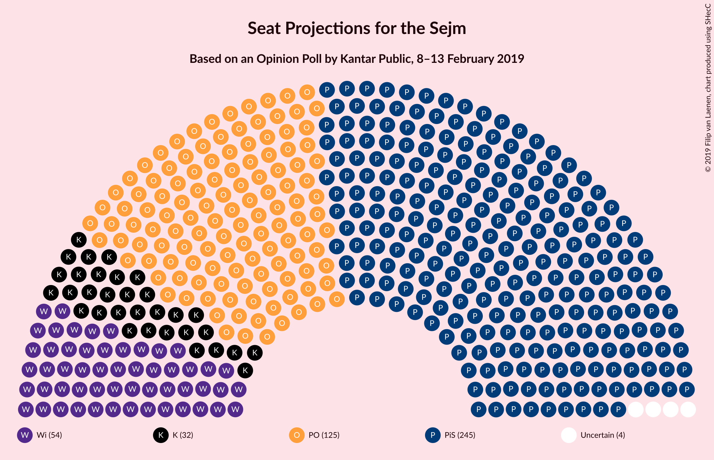
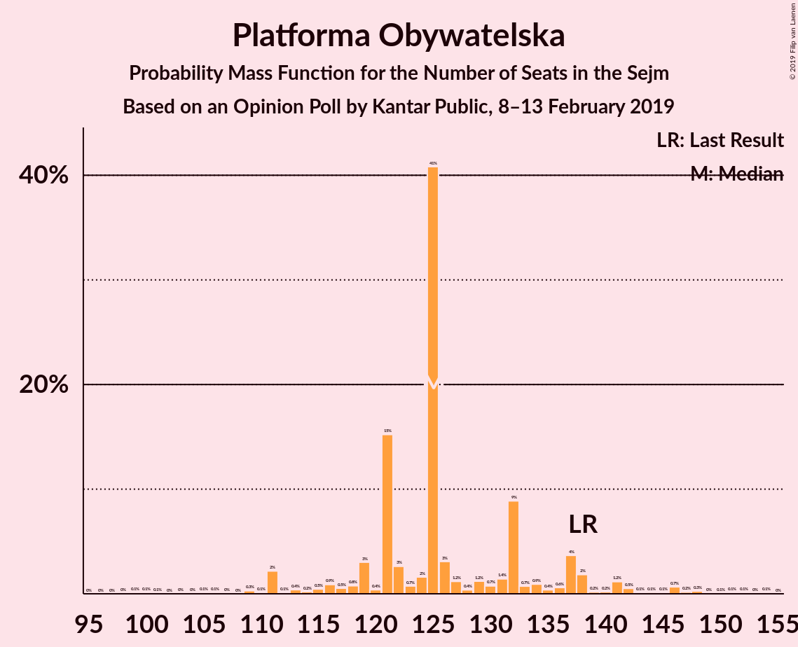
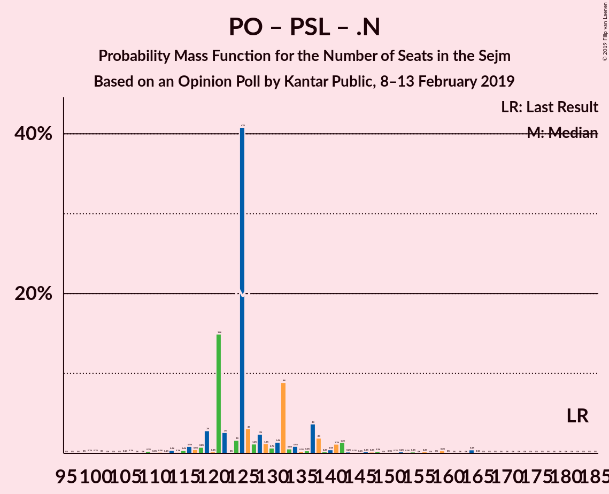

# Opinion Poll by Kantar Public, 8–13 February 2019

<a href="#voting-intentions">Voting Intentions</a> | <a href="#seats">Seats</a> | <a href="#coalitions">Coalitions</a> | <a href="#technical-information">Technical Information</a>

## Voting Intentions

### Confidence Intervals

| Party | Last Result | Poll Result | 80% Confidence Interval | 90% Confidence Interval | 95% Confidence Interval | 99% Confidence Interval |
|:-----:|:-----------:|:-----------:|:-----------------------:|:-----------------------:|:-----------------------:|:-----------------------:|
| Prawo i Sprawiedliwość | 37.6% | 34.0% | 32.1–36.0% |31.6–36.6% |31.1–37.1% |30.2–38.0% |
| Platforma Obywatelska | 24.1% | 20.0% | 18.5–21.8% |18.0–22.3% |17.6–22.7% |16.9–23.5% |
| Wiosna | 0.0% | 11.0% | 9.8–12.4% |9.5–12.8% |9.2–13.1% |8.6–13.8% |
| Kukiz’15 | 8.8% | 6.0% | 5.1–7.1% |4.8–7.4% |4.6–7.6% |4.3–8.2% |
| Sojusz Lewicy Demokratycznej | 7.6% | 5.0% | 4.2–6.1% |4.0–6.3% |3.8–6.6% |3.5–7.1% |
| Polskie Stronnictwo Ludowe | 5.1% | 4.0% | 3.3–4.9% |3.1–5.2% |2.9–5.4% |2.6–5.9% |
| .Nowoczesna | 7.6% | 2.0% | 1.5–2.7% |1.4–2.9% |1.2–3.0% |1.1–3.4% |
| KORWiN | 4.8% | 1.0% | 0.7–1.6% |0.6–1.7% |0.6–1.9% |0.4–2.2% |
| Lewica Razem | 3.6% | 1.0% | 0.7–1.6% |0.6–1.7% |0.6–1.9% |0.4–2.2% |

*Note:* The poll result column reflects the actual value used in the calculations. Published results may vary slightly, and in addition be rounded to fewer digits.

## Seats

### Confidence Intervals

| Party | Last Result | Median | 80% Confidence Interval | 90% Confidence Interval | 95% Confidence Interval | 99% Confidence Interval |
|:-----:|:-----------:|:------:|:-----------------------:|:-----------------------:|:-----------------------:|:-----------------------:|
| <a href="#prawo-i-sprawiedliwość">Prawo i Sprawiedliwość</a> | 235 | 253 | 226–253 |226–253 |226–253 |226–253 |
| <a href="#platforma-obywatelska">Platforma Obywatelska</a> | 138 | 118 | 117–118 |117–118 |117–118 |112–120 |
| <a href="#wiosna">Wiosna</a> | 0 | 66 | 65–68 |65–68 |57–68 |57–70 |
| <a href="#kukiz’15">Kukiz’15</a> | 42 | 23 | 23–35 |23–35 |23–35 |0–35 |
| <a href="#sojusz-lewicy-demokratycznej">Sojusz Lewicy Demokratycznej</a> | 0 | 0 | 0–16 |0–25 |0–25 |0–32 |
| <a href="#polskie-stronnictwo-ludowe">Polskie Stronnictwo Ludowe</a> | 16 | 0 | 0 |0 |0 |0 |
| <a href="#.nowoczesna">.Nowoczesna</a> | 28 | 0 | 0 |0 |0 |0 |
| <a href="#korwin">KORWiN</a> | 0 | 0 | 0 |0 |0 |0 |
| <a href="#lewica-razem">Lewica Razem</a> | 0 | 0 | 0 |0 |0 |0 |

### Prawo i Sprawiedliwość

*For a full overview of the results for this party, see the [Prawo i Sprawiedliwość](party-prawoisprawiedliwość.html) page.*

| Number of Seats | Probability | Accumulated | Special Marks |
|:---------------:|:-----------:|:-----------:|:-------------:|
| 220 | 0% | 100% |  |
| 221 | 0% | 99.9% |  |
| 222 | 0% | 99.9% |  |
| 223 | 0% | 99.9% |  |
| 224 | 0% | 99.9% |  |
| 225 | 0% | 99.9% |  |
| 226 | 36% | 99.9% |  |
| 227 | 0% | 64% |  |
| 228 | 0% | 64% |  |
| 229 | 0% | 64% |  |
| 230 | 0.4% | 64% |  |
| 231 | 0% | 64% | Majority |
| 232 | 0% | 64% |  |
| 233 | 0% | 64% |  |
| 234 | 0% | 64% |  |
| 235 | 0% | 64% | Last Result |
| 236 | 0% | 64% |  |
| 237 | 0% | 64% |  |
| 238 | 0% | 64% |  |
| 239 | 0.1% | 64% |  |
| 240 | 0% | 64% |  |
| 241 | 0% | 64% |  |
| 242 | 0% | 64% |  |
| 243 | 0% | 64% |  |
| 244 | 0% | 64% |  |
| 245 | 0% | 64% |  |
| 246 | 1.4% | 64% |  |
| 247 | 0% | 62% |  |
| 248 | 0% | 62% |  |
| 249 | 9% | 62% |  |
| 250 | 0% | 53% |  |
| 251 | 0% | 53% |  |
| 252 | 0% | 53% |  |
| 253 | 52% | 53% | Median |
| 254 | 0% | 0.3% |  |
| 255 | 0% | 0.3% |  |
| 256 | 0% | 0.3% |  |
| 257 | 0% | 0.3% |  |
| 258 | 0% | 0.3% |  |
| 259 | 0% | 0.3% |  |
| 260 | 0.3% | 0.3% |  |
| 261 | 0% | 0% |  |

### Platforma Obywatelska

*For a full overview of the results for this party, see the [Platforma Obywatelska](party-platformaobywatelska.html) page.*

| Number of Seats | Probability | Accumulated | Special Marks |
|:---------------:|:-----------:|:-----------:|:-------------:|
| 111 | 0.1% | 100% |  |
| 112 | 1.3% | 99.8% |  |
| 113 | 0% | 98% |  |
| 114 | 0% | 98% |  |
| 115 | 0% | 98% |  |
| 116 | 0% | 98% |  |
| 117 | 13% | 98% |  |
| 118 | 84% | 85% | Median |
| 119 | 0% | 0.8% |  |
| 120 | 0.3% | 0.8% |  |
| 121 | 0.4% | 0.5% |  |
| 122 | 0% | 0.1% |  |
| 123 | 0% | 0.1% |  |
| 124 | 0% | 0.1% |  |
| 125 | 0% | 0.1% |  |
| 126 | 0% | 0.1% |  |
| 127 | 0% | 0.1% |  |
| 128 | 0% | 0.1% |  |
| 129 | 0% | 0.1% |  |
| 130 | 0% | 0.1% |  |
| 131 | 0% | 0.1% |  |
| 132 | 0% | 0.1% |  |
| 133 | 0% | 0.1% |  |
| 134 | 0% | 0.1% |  |
| 135 | 0% | 0.1% |  |
| 136 | 0% | 0.1% |  |
| 137 | 0% | 0% |  |
| 138 | 0% | 0% | Last Result |

### Wiosna

*For a full overview of the results for this party, see the [Wiosna](party-wiosna.html) page.*

| Number of Seats | Probability | Accumulated | Special Marks |
|:---------------:|:-----------:|:-----------:|:-------------:|
| 0 | 0% | 100% | Last Result |
| 1 | 0% | 100% |  |
| 2 | 0% | 100% |  |
| 3 | 0% | 100% |  |
| 4 | 0% | 100% |  |
| 5 | 0% | 100% |  |
| 6 | 0% | 100% |  |
| 7 | 0% | 100% |  |
| 8 | 0% | 100% |  |
| 9 | 0% | 100% |  |
| 10 | 0% | 100% |  |
| 11 | 0% | 100% |  |
| 12 | 0% | 100% |  |
| 13 | 0% | 100% |  |
| 14 | 0% | 100% |  |
| 15 | 0% | 100% |  |
| 16 | 0% | 100% |  |
| 17 | 0% | 100% |  |
| 18 | 0% | 100% |  |
| 19 | 0% | 100% |  |
| 20 | 0% | 100% |  |
| 21 | 0% | 100% |  |
| 22 | 0% | 100% |  |
| 23 | 0% | 100% |  |
| 24 | 0% | 100% |  |
| 25 | 0% | 100% |  |
| 26 | 0% | 100% |  |
| 27 | 0% | 100% |  |
| 28 | 0% | 100% |  |
| 29 | 0% | 100% |  |
| 30 | 0% | 100% |  |
| 31 | 0% | 100% |  |
| 32 | 0% | 100% |  |
| 33 | 0% | 100% |  |
| 34 | 0% | 100% |  |
| 35 | 0% | 100% |  |
| 36 | 0% | 100% |  |
| 37 | 0% | 100% |  |
| 38 | 0% | 100% |  |
| 39 | 0% | 100% |  |
| 40 | 0.1% | 100% |  |
| 41 | 0% | 99.9% |  |
| 42 | 0% | 99.9% |  |
| 43 | 0% | 99.9% |  |
| 44 | 0% | 99.9% |  |
| 45 | 0% | 99.9% |  |
| 46 | 0% | 99.9% |  |
| 47 | 0% | 99.9% |  |
| 48 | 0% | 99.9% |  |
| 49 | 0% | 99.9% |  |
| 50 | 0% | 99.9% |  |
| 51 | 0% | 99.9% |  |
| 52 | 0% | 99.9% |  |
| 53 | 0% | 99.9% |  |
| 54 | 0% | 99.9% |  |
| 55 | 0% | 99.9% |  |
| 56 | 0% | 99.9% |  |
| 57 | 4% | 99.9% |  |
| 58 | 0% | 96% |  |
| 59 | 0% | 96% |  |
| 60 | 0% | 96% |  |
| 61 | 0% | 96% |  |
| 62 | 0% | 96% |  |
| 63 | 0.7% | 96% |  |
| 64 | 0% | 95% |  |
| 65 | 32% | 95% |  |
| 66 | 53% | 63% | Median |
| 67 | 0% | 11% |  |
| 68 | 9% | 11% |  |
| 69 | 0% | 1.3% |  |
| 70 | 1.3% | 1.3% |  |
| 71 | 0% | 0% |  |

### Kukiz’15

*For a full overview of the results for this party, see the [Kukiz’15](party-kukiz’15.html) page.*

| Number of Seats | Probability | Accumulated | Special Marks |
|:---------------:|:-----------:|:-----------:|:-------------:|
| 0 | 1.4% | 100% |  |
| 1 | 0% | 98.6% |  |
| 2 | 0% | 98.6% |  |
| 3 | 0% | 98.6% |  |
| 4 | 0% | 98.6% |  |
| 5 | 0% | 98.6% |  |
| 6 | 0% | 98.6% |  |
| 7 | 0% | 98.6% |  |
| 8 | 0% | 98.6% |  |
| 9 | 0% | 98.6% |  |
| 10 | 0% | 98.6% |  |
| 11 | 0% | 98.6% |  |
| 12 | 0% | 98.6% |  |
| 13 | 0.1% | 98.6% |  |
| 14 | 0% | 98% |  |
| 15 | 0% | 98% |  |
| 16 | 0% | 98% |  |
| 17 | 0.3% | 98% |  |
| 18 | 0% | 98% |  |
| 19 | 0% | 98% |  |
| 20 | 0% | 98% |  |
| 21 | 0% | 98% |  |
| 22 | 0% | 98% |  |
| 23 | 52% | 98% | Median |
| 24 | 0% | 46% |  |
| 25 | 0% | 46% |  |
| 26 | 9% | 46% |  |
| 27 | 0% | 36% |  |
| 28 | 0% | 36% |  |
| 29 | 0% | 36% |  |
| 30 | 0% | 36% |  |
| 31 | 0% | 36% |  |
| 32 | 0.4% | 36% |  |
| 33 | 0% | 36% |  |
| 34 | 0% | 36% |  |
| 35 | 36% | 36% |  |
| 36 | 0% | 0.1% |  |
| 37 | 0% | 0.1% |  |
| 38 | 0% | 0.1% |  |
| 39 | 0% | 0.1% |  |
| 40 | 0% | 0.1% |  |
| 41 | 0% | 0.1% |  |
| 42 | 0% | 0.1% | Last Result |
| 43 | 0% | 0.1% |  |
| 44 | 0% | 0.1% |  |
| 45 | 0% | 0.1% |  |
| 46 | 0% | 0.1% |  |
| 47 | 0% | 0.1% |  |
| 48 | 0% | 0.1% |  |
| 49 | 0% | 0% |  |

### Sojusz Lewicy Demokratycznej

*For a full overview of the results for this party, see the [Sojusz Lewicy Demokratycznej](party-sojuszlewicydemokratycznej.html) page.*

| Number of Seats | Probability | Accumulated | Special Marks |
|:---------------:|:-----------:|:-----------:|:-------------:|
| 0 | 62% | 100% | Last Result, Median |
| 1 | 0% | 38% |  |
| 2 | 0% | 38% |  |
| 3 | 0% | 38% |  |
| 4 | 0% | 38% |  |
| 5 | 0% | 38% |  |
| 6 | 0% | 38% |  |
| 7 | 0% | 38% |  |
| 8 | 0% | 38% |  |
| 9 | 0% | 38% |  |
| 10 | 0% | 38% |  |
| 11 | 0% | 38% |  |
| 12 | 0% | 38% |  |
| 13 | 0% | 38% |  |
| 14 | 0.4% | 38% |  |
| 15 | 0% | 37% |  |
| 16 | 32% | 37% |  |
| 17 | 0% | 5% |  |
| 18 | 0% | 5% |  |
| 19 | 0% | 5% |  |
| 20 | 0% | 5% |  |
| 21 | 0% | 5% |  |
| 22 | 0% | 5% |  |
| 23 | 0% | 5% |  |
| 24 | 0% | 5% |  |
| 25 | 4% | 5% |  |
| 26 | 0% | 1.5% |  |
| 27 | 0% | 1.5% |  |
| 28 | 0% | 1.5% |  |
| 29 | 0% | 1.5% |  |
| 30 | 0% | 1.5% |  |
| 31 | 0.1% | 1.5% |  |
| 32 | 1.4% | 1.4% |  |
| 33 | 0% | 0% |  |

### Polskie Stronnictwo Ludowe

*For a full overview of the results for this party, see the [Polskie Stronnictwo Ludowe](party-polskiestronnictwoludowe.html) page.*

| Number of Seats | Probability | Accumulated | Special Marks |
|:---------------:|:-----------:|:-----------:|:-------------:|
| 0 | 99.9% | 100% | Median |
| 1 | 0% | 0.1% |  |
| 2 | 0% | 0.1% |  |
| 3 | 0% | 0.1% |  |
| 4 | 0% | 0.1% |  |
| 5 | 0% | 0.1% |  |
| 6 | 0% | 0.1% |  |
| 7 | 0% | 0.1% |  |
| 8 | 0% | 0.1% |  |
| 9 | 0% | 0.1% |  |
| 10 | 0% | 0.1% |  |
| 11 | 0% | 0.1% |  |
| 12 | 0% | 0.1% |  |
| 13 | 0% | 0.1% |  |
| 14 | 0% | 0.1% |  |
| 15 | 0% | 0.1% |  |
| 16 | 0% | 0.1% | Last Result |
| 17 | 0% | 0.1% |  |
| 18 | 0% | 0.1% |  |
| 19 | 0% | 0.1% |  |
| 20 | 0% | 0.1% |  |
| 21 | 0% | 0% |  |

### .Nowoczesna

*For a full overview of the results for this party, see the [.Nowoczesna](party-nowoczesna.html) page.*

| Number of Seats | Probability | Accumulated | Special Marks |
|:---------------:|:-----------:|:-----------:|:-------------:|
| 0 | 100% | 100% | Median |
| 1 | 0% | 0% |  |
| 2 | 0% | 0% |  |
| 3 | 0% | 0% |  |
| 4 | 0% | 0% |  |
| 5 | 0% | 0% |  |
| 6 | 0% | 0% |  |
| 7 | 0% | 0% |  |
| 8 | 0% | 0% |  |
| 9 | 0% | 0% |  |
| 10 | 0% | 0% |  |
| 11 | 0% | 0% |  |
| 12 | 0% | 0% |  |
| 13 | 0% | 0% |  |
| 14 | 0% | 0% |  |
| 15 | 0% | 0% |  |
| 16 | 0% | 0% |  |
| 17 | 0% | 0% |  |
| 18 | 0% | 0% |  |
| 19 | 0% | 0% |  |
| 20 | 0% | 0% |  |
| 21 | 0% | 0% |  |
| 22 | 0% | 0% |  |
| 23 | 0% | 0% |  |
| 24 | 0% | 0% |  |
| 25 | 0% | 0% |  |
| 26 | 0% | 0% |  |
| 27 | 0% | 0% |  |
| 28 | 0% | 0% | Last Result |

### KORWiN

*For a full overview of the results for this party, see the [KORWiN](party-korwin.html) page.*

| Number of Seats | Probability | Accumulated | Special Marks |
|:---------------:|:-----------:|:-----------:|:-------------:|
| 0 | 100% | 100% | Last Result, Median |

### Lewica Razem

*For a full overview of the results for this party, see the [Lewica Razem](party-lewicarazem.html) page.*

| Number of Seats | Probability | Accumulated | Special Marks |
|:---------------:|:-----------:|:-----------:|:-------------:|
| 0 | 100% | 100% | Last Result, Median |

## Coalitions

### Confidence Intervals

| Coalition | Last Result | Median | Majority? | 80% Confidence Interval | 90% Confidence Interval | 95% Confidence Interval | 99% Confidence Interval |
|:---------:|:-----------:|:------:|:---------:|:-----------------------:|:-----------------------:|:-----------------------:|:-----------------------:|
| Prawo i Sprawiedliwość | 235 | 253 | 64% | 226–253 | 226–253 | 226–253 | 226–253 |
| Platforma Obywatelska – Sojusz Lewicy Demokratycznej – Polskie Stronnictwo Ludowe – .Nowoczesna – Lewica Razem | 182 | 118 | 0% | 118–134 | 117–142 | 117–142 | 117–144 |
| Platforma Obywatelska – Sojusz Lewicy Demokratycznej – Polskie Stronnictwo Ludowe – .Nowoczesna | 182 | 118 | 0% | 118–134 | 117–142 | 117–142 | 117–144 |
| Platforma Obywatelska – Sojusz Lewicy Demokratycznej – .Nowoczesna | 166 | 118 | 0% | 118–134 | 117–142 | 117–142 | 117–144 |
| Platforma Obywatelska – .Nowoczesna | 166 | 118 | 0% | 117–118 | 117–118 | 117–118 | 112–120 |
| Platforma Obywatelska – Polskie Stronnictwo Ludowe – .Nowoczesna | 182 | 118 | 0% | 117–118 | 117–118 | 117–118 | 112–121 |
| Platforma Obywatelska | 138 | 118 | 0% | 117–118 | 117–118 | 117–118 | 112–120 |

### Prawo i Sprawiedliwość

| Number of Seats | Probability | Accumulated | Special Marks |
|:---------------:|:-----------:|:-----------:|:-------------:|
| 220 | 0% | 100% |  |
| 221 | 0% | 99.9% |  |
| 222 | 0% | 99.9% |  |
| 223 | 0% | 99.9% |  |
| 224 | 0% | 99.9% |  |
| 225 | 0% | 99.9% |  |
| 226 | 36% | 99.9% |  |
| 227 | 0% | 64% |  |
| 228 | 0% | 64% |  |
| 229 | 0% | 64% |  |
| 230 | 0.4% | 64% |  |
| 231 | 0% | 64% | Majority |
| 232 | 0% | 64% |  |
| 233 | 0% | 64% |  |
| 234 | 0% | 64% |  |
| 235 | 0% | 64% | Last Result |
| 236 | 0% | 64% |  |
| 237 | 0% | 64% |  |
| 238 | 0% | 64% |  |
| 239 | 0.1% | 64% |  |
| 240 | 0% | 64% |  |
| 241 | 0% | 64% |  |
| 242 | 0% | 64% |  |
| 243 | 0% | 64% |  |
| 244 | 0% | 64% |  |
| 245 | 0% | 64% |  |
| 246 | 1.4% | 64% |  |
| 247 | 0% | 62% |  |
| 248 | 0% | 62% |  |
| 249 | 9% | 62% |  |
| 250 | 0% | 53% |  |
| 251 | 0% | 53% |  |
| 252 | 0% | 53% |  |
| 253 | 52% | 53% | Median |
| 254 | 0% | 0.3% |  |
| 255 | 0% | 0.3% |  |
| 256 | 0% | 0.3% |  |
| 257 | 0% | 0.3% |  |
| 258 | 0% | 0.3% |  |
| 259 | 0% | 0.3% |  |
| 260 | 0.3% | 0.3% |  |
| 261 | 0% | 0% |  |

### Platforma Obywatelska – Sojusz Lewicy Demokratycznej – Polskie Stronnictwo Ludowe – .Nowoczesna – Lewica Razem

| Number of Seats | Probability | Accumulated | Special Marks |
|:---------------:|:-----------:|:-----------:|:-------------:|
| 117 | 9% | 100% |  |
| 118 | 52% | 91% | Median |
| 119 | 0% | 38% |  |
| 120 | 0.3% | 38% |  |
| 121 | 0% | 38% |  |
| 122 | 0% | 38% |  |
| 123 | 0% | 38% |  |
| 124 | 0% | 38% |  |
| 125 | 0% | 38% |  |
| 126 | 0% | 38% |  |
| 127 | 0% | 38% |  |
| 128 | 0% | 38% |  |
| 129 | 0% | 38% |  |
| 130 | 0% | 38% |  |
| 131 | 0% | 38% |  |
| 132 | 0% | 38% |  |
| 133 | 0% | 38% |  |
| 134 | 32% | 38% |  |
| 135 | 0.4% | 6% |  |
| 136 | 0% | 6% |  |
| 137 | 0% | 6% |  |
| 138 | 0% | 6% |  |
| 139 | 0% | 6% |  |
| 140 | 0% | 6% |  |
| 141 | 0% | 6% |  |
| 142 | 4% | 6% |  |
| 143 | 0% | 1.4% |  |
| 144 | 1.3% | 1.4% |  |
| 145 | 0% | 0.1% |  |
| 146 | 0% | 0.1% |  |
| 147 | 0% | 0.1% |  |
| 148 | 0% | 0.1% |  |
| 149 | 0% | 0.1% |  |
| 150 | 0% | 0.1% |  |
| 151 | 0% | 0.1% |  |
| 152 | 0% | 0.1% |  |
| 153 | 0% | 0.1% |  |
| 154 | 0% | 0.1% |  |
| 155 | 0% | 0.1% |  |
| 156 | 0% | 0.1% |  |
| 157 | 0% | 0% |  |
| 158 | 0% | 0% |  |
| 159 | 0% | 0% |  |
| 160 | 0% | 0% |  |
| 161 | 0% | 0% |  |
| 162 | 0% | 0% |  |
| 163 | 0% | 0% |  |
| 164 | 0% | 0% |  |
| 165 | 0% | 0% |  |
| 166 | 0% | 0% |  |
| 167 | 0% | 0% |  |
| 168 | 0% | 0% |  |
| 169 | 0% | 0% |  |
| 170 | 0% | 0% |  |
| 171 | 0% | 0% |  |
| 172 | 0% | 0% |  |
| 173 | 0% | 0% |  |
| 174 | 0% | 0% |  |
| 175 | 0% | 0% |  |
| 176 | 0% | 0% |  |
| 177 | 0% | 0% |  |
| 178 | 0% | 0% |  |
| 179 | 0% | 0% |  |
| 180 | 0% | 0% |  |
| 181 | 0% | 0% |  |
| 182 | 0% | 0% | Last Result |

### Platforma Obywatelska – Sojusz Lewicy Demokratycznej – Polskie Stronnictwo Ludowe – .Nowoczesna

| Number of Seats | Probability | Accumulated | Special Marks |
|:---------------:|:-----------:|:-----------:|:-------------:|
| 117 | 9% | 100% |  |
| 118 | 52% | 91% | Median |
| 119 | 0% | 38% |  |
| 120 | 0.3% | 38% |  |
| 121 | 0% | 38% |  |
| 122 | 0% | 38% |  |
| 123 | 0% | 38% |  |
| 124 | 0% | 38% |  |
| 125 | 0% | 38% |  |
| 126 | 0% | 38% |  |
| 127 | 0% | 38% |  |
| 128 | 0% | 38% |  |
| 129 | 0% | 38% |  |
| 130 | 0% | 38% |  |
| 131 | 0% | 38% |  |
| 132 | 0% | 38% |  |
| 133 | 0% | 38% |  |
| 134 | 32% | 38% |  |
| 135 | 0.4% | 6% |  |
| 136 | 0% | 6% |  |
| 137 | 0% | 6% |  |
| 138 | 0% | 6% |  |
| 139 | 0% | 6% |  |
| 140 | 0% | 6% |  |
| 141 | 0% | 6% |  |
| 142 | 4% | 6% |  |
| 143 | 0% | 1.4% |  |
| 144 | 1.3% | 1.4% |  |
| 145 | 0% | 0.1% |  |
| 146 | 0% | 0.1% |  |
| 147 | 0% | 0.1% |  |
| 148 | 0% | 0.1% |  |
| 149 | 0% | 0.1% |  |
| 150 | 0% | 0.1% |  |
| 151 | 0% | 0.1% |  |
| 152 | 0% | 0.1% |  |
| 153 | 0% | 0.1% |  |
| 154 | 0% | 0.1% |  |
| 155 | 0% | 0.1% |  |
| 156 | 0% | 0.1% |  |
| 157 | 0% | 0% |  |
| 158 | 0% | 0% |  |
| 159 | 0% | 0% |  |
| 160 | 0% | 0% |  |
| 161 | 0% | 0% |  |
| 162 | 0% | 0% |  |
| 163 | 0% | 0% |  |
| 164 | 0% | 0% |  |
| 165 | 0% | 0% |  |
| 166 | 0% | 0% |  |
| 167 | 0% | 0% |  |
| 168 | 0% | 0% |  |
| 169 | 0% | 0% |  |
| 170 | 0% | 0% |  |
| 171 | 0% | 0% |  |
| 172 | 0% | 0% |  |
| 173 | 0% | 0% |  |
| 174 | 0% | 0% |  |
| 175 | 0% | 0% |  |
| 176 | 0% | 0% |  |
| 177 | 0% | 0% |  |
| 178 | 0% | 0% |  |
| 179 | 0% | 0% |  |
| 180 | 0% | 0% |  |
| 181 | 0% | 0% |  |
| 182 | 0% | 0% | Last Result |

### Platforma Obywatelska – Sojusz Lewicy Demokratycznej – .Nowoczesna

| Number of Seats | Probability | Accumulated | Special Marks |
|:---------------:|:-----------:|:-----------:|:-------------:|
| 117 | 9% | 100% |  |
| 118 | 52% | 91% | Median |
| 119 | 0% | 38% |  |
| 120 | 0.3% | 38% |  |
| 121 | 0% | 38% |  |
| 122 | 0% | 38% |  |
| 123 | 0% | 38% |  |
| 124 | 0% | 38% |  |
| 125 | 0% | 38% |  |
| 126 | 0% | 38% |  |
| 127 | 0% | 38% |  |
| 128 | 0% | 38% |  |
| 129 | 0% | 38% |  |
| 130 | 0% | 38% |  |
| 131 | 0% | 38% |  |
| 132 | 0% | 38% |  |
| 133 | 0% | 38% |  |
| 134 | 32% | 38% |  |
| 135 | 0.4% | 6% |  |
| 136 | 0% | 6% |  |
| 137 | 0% | 5% |  |
| 138 | 0% | 5% |  |
| 139 | 0% | 5% |  |
| 140 | 0% | 5% |  |
| 141 | 0% | 5% |  |
| 142 | 4% | 5% |  |
| 143 | 0% | 1.4% |  |
| 144 | 1.3% | 1.4% |  |
| 145 | 0% | 0% |  |
| 146 | 0% | 0% |  |
| 147 | 0% | 0% |  |
| 148 | 0% | 0% |  |
| 149 | 0% | 0% |  |
| 150 | 0% | 0% |  |
| 151 | 0% | 0% |  |
| 152 | 0% | 0% |  |
| 153 | 0% | 0% |  |
| 154 | 0% | 0% |  |
| 155 | 0% | 0% |  |
| 156 | 0% | 0% |  |
| 157 | 0% | 0% |  |
| 158 | 0% | 0% |  |
| 159 | 0% | 0% |  |
| 160 | 0% | 0% |  |
| 161 | 0% | 0% |  |
| 162 | 0% | 0% |  |
| 163 | 0% | 0% |  |
| 164 | 0% | 0% |  |
| 165 | 0% | 0% |  |
| 166 | 0% | 0% | Last Result |

### Platforma Obywatelska – .Nowoczesna

| Number of Seats | Probability | Accumulated | Special Marks |
|:---------------:|:-----------:|:-----------:|:-------------:|
| 111 | 0.1% | 100% |  |
| 112 | 1.3% | 99.8% |  |
| 113 | 0% | 98% |  |
| 114 | 0% | 98% |  |
| 115 | 0% | 98% |  |
| 116 | 0% | 98% |  |
| 117 | 13% | 98% |  |
| 118 | 84% | 85% | Median |
| 119 | 0% | 0.8% |  |
| 120 | 0.3% | 0.8% |  |
| 121 | 0.4% | 0.5% |  |
| 122 | 0% | 0.1% |  |
| 123 | 0% | 0.1% |  |
| 124 | 0% | 0.1% |  |
| 125 | 0% | 0.1% |  |
| 126 | 0% | 0.1% |  |
| 127 | 0% | 0.1% |  |
| 128 | 0% | 0.1% |  |
| 129 | 0% | 0.1% |  |
| 130 | 0% | 0.1% |  |
| 131 | 0% | 0.1% |  |
| 132 | 0% | 0.1% |  |
| 133 | 0% | 0.1% |  |
| 134 | 0% | 0.1% |  |
| 135 | 0% | 0.1% |  |
| 136 | 0% | 0.1% |  |
| 137 | 0% | 0% |  |
| 138 | 0% | 0% |  |
| 139 | 0% | 0% |  |
| 140 | 0% | 0% |  |
| 141 | 0% | 0% |  |
| 142 | 0% | 0% |  |
| 143 | 0% | 0% |  |
| 144 | 0% | 0% |  |
| 145 | 0% | 0% |  |
| 146 | 0% | 0% |  |
| 147 | 0% | 0% |  |
| 148 | 0% | 0% |  |
| 149 | 0% | 0% |  |
| 150 | 0% | 0% |  |
| 151 | 0% | 0% |  |
| 152 | 0% | 0% |  |
| 153 | 0% | 0% |  |
| 154 | 0% | 0% |  |
| 155 | 0% | 0% |  |
| 156 | 0% | 0% |  |
| 157 | 0% | 0% |  |
| 158 | 0% | 0% |  |
| 159 | 0% | 0% |  |
| 160 | 0% | 0% |  |
| 161 | 0% | 0% |  |
| 162 | 0% | 0% |  |
| 163 | 0% | 0% |  |
| 164 | 0% | 0% |  |
| 165 | 0% | 0% |  |
| 166 | 0% | 0% | Last Result |

### Platforma Obywatelska – Polskie Stronnictwo Ludowe – .Nowoczesna

| Number of Seats | Probability | Accumulated | Special Marks |
|:---------------:|:-----------:|:-----------:|:-------------:|
| 111 | 0.1% | 100% |  |
| 112 | 1.3% | 99.9% |  |
| 113 | 0% | 98.5% |  |
| 114 | 0% | 98% |  |
| 115 | 0% | 98% |  |
| 116 | 0% | 98% |  |
| 117 | 13% | 98% |  |
| 118 | 84% | 85% | Median |
| 119 | 0% | 0.8% |  |
| 120 | 0.3% | 0.8% |  |
| 121 | 0.4% | 0.5% |  |
| 122 | 0% | 0.1% |  |
| 123 | 0% | 0.1% |  |
| 124 | 0% | 0.1% |  |
| 125 | 0% | 0.1% |  |
| 126 | 0% | 0.1% |  |
| 127 | 0% | 0.1% |  |
| 128 | 0% | 0.1% |  |
| 129 | 0% | 0.1% |  |
| 130 | 0% | 0.1% |  |
| 131 | 0% | 0.1% |  |
| 132 | 0% | 0.1% |  |
| 133 | 0% | 0.1% |  |
| 134 | 0% | 0.1% |  |
| 135 | 0% | 0.1% |  |
| 136 | 0% | 0.1% |  |
| 137 | 0% | 0.1% |  |
| 138 | 0% | 0.1% |  |
| 139 | 0% | 0.1% |  |
| 140 | 0% | 0.1% |  |
| 141 | 0% | 0.1% |  |
| 142 | 0% | 0.1% |  |
| 143 | 0% | 0.1% |  |
| 144 | 0% | 0% |  |
| 145 | 0% | 0% |  |
| 146 | 0% | 0% |  |
| 147 | 0% | 0% |  |
| 148 | 0% | 0% |  |
| 149 | 0% | 0% |  |
| 150 | 0% | 0% |  |
| 151 | 0% | 0% |  |
| 152 | 0% | 0% |  |
| 153 | 0% | 0% |  |
| 154 | 0% | 0% |  |
| 155 | 0% | 0% |  |
| 156 | 0% | 0% |  |
| 157 | 0% | 0% |  |
| 158 | 0% | 0% |  |
| 159 | 0% | 0% |  |
| 160 | 0% | 0% |  |
| 161 | 0% | 0% |  |
| 162 | 0% | 0% |  |
| 163 | 0% | 0% |  |
| 164 | 0% | 0% |  |
| 165 | 0% | 0% |  |
| 166 | 0% | 0% |  |
| 167 | 0% | 0% |  |
| 168 | 0% | 0% |  |
| 169 | 0% | 0% |  |
| 170 | 0% | 0% |  |
| 171 | 0% | 0% |  |
| 172 | 0% | 0% |  |
| 173 | 0% | 0% |  |
| 174 | 0% | 0% |  |
| 175 | 0% | 0% |  |
| 176 | 0% | 0% |  |
| 177 | 0% | 0% |  |
| 178 | 0% | 0% |  |
| 179 | 0% | 0% |  |
| 180 | 0% | 0% |  |
| 181 | 0% | 0% |  |
| 182 | 0% | 0% | Last Result |

### Platforma Obywatelska

| Number of Seats | Probability | Accumulated | Special Marks |
|:---------------:|:-----------:|:-----------:|:-------------:|
| 111 | 0.1% | 100% |  |
| 112 | 1.3% | 99.8% |  |
| 113 | 0% | 98% |  |
| 114 | 0% | 98% |  |
| 115 | 0% | 98% |  |
| 116 | 0% | 98% |  |
| 117 | 13% | 98% |  |
| 118 | 84% | 85% | Median |
| 119 | 0% | 0.8% |  |
| 120 | 0.3% | 0.8% |  |
| 121 | 0.4% | 0.5% |  |
| 122 | 0% | 0.1% |  |
| 123 | 0% | 0.1% |  |
| 124 | 0% | 0.1% |  |
| 125 | 0% | 0.1% |  |
| 126 | 0% | 0.1% |  |
| 127 | 0% | 0.1% |  |
| 128 | 0% | 0.1% |  |
| 129 | 0% | 0.1% |  |
| 130 | 0% | 0.1% |  |
| 131 | 0% | 0.1% |  |
| 132 | 0% | 0.1% |  |
| 133 | 0% | 0.1% |  |
| 134 | 0% | 0.1% |  |
| 135 | 0% | 0.1% |  |
| 136 | 0% | 0.1% |  |
| 137 | 0% | 0% |  |
| 138 | 0% | 0% | Last Result |

## Technical Information

### Opinion Poll

+ **Polling firm:** Kantar Public
+ **Commissioner(s):** —
+ **Fieldwork period:** 8–13 February 2019

### Calculations

+ **Sample size:** 973
+ **Simulations done:** 1,024
+ **Error estimate:** 2.51%

