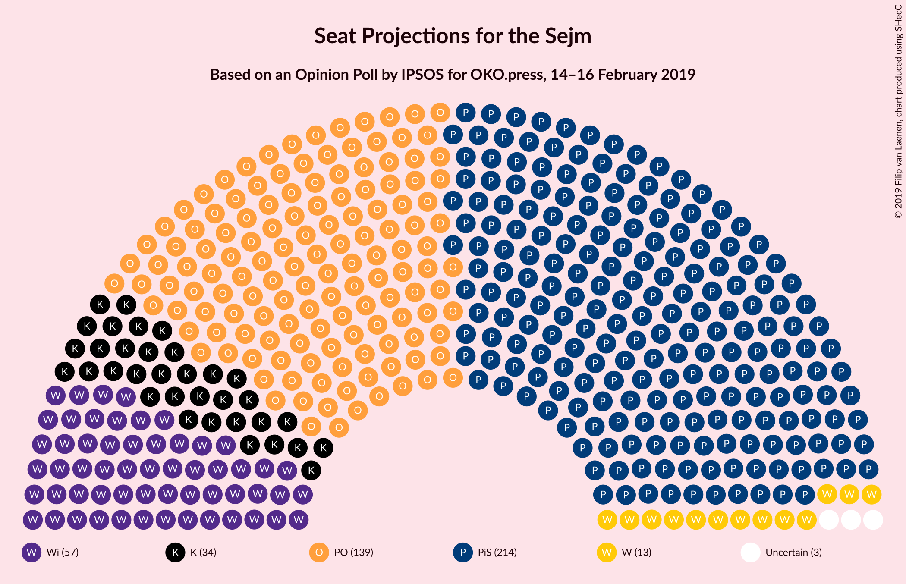
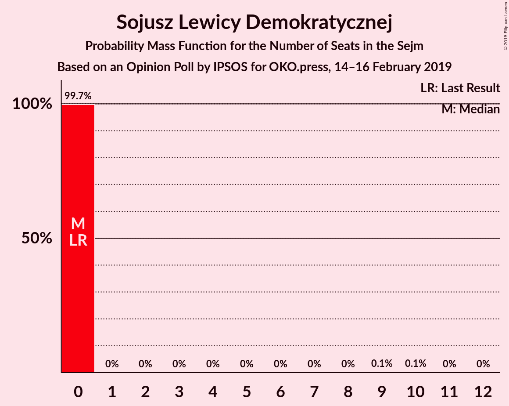
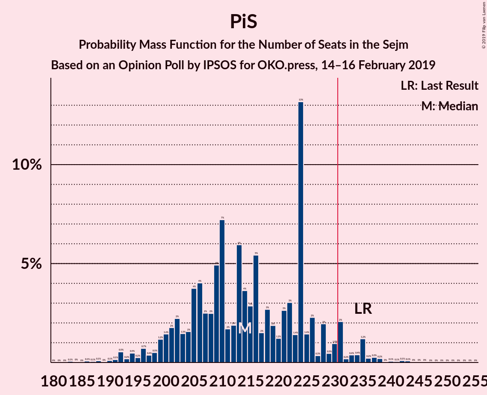

# Opinion Poll by IPSOS for OKO.press, 14–16 February 2019

<a href="#voting-intentions">Voting Intentions</a> | <a href="#seats">Seats</a> | <a href="#coalitions">Coalitions</a> | <a href="#technical-information">Technical Information</a>

## Voting Intentions

### Confidence Intervals

| Party | Last Result | Poll Result | 80% Confidence Interval | 90% Confidence Interval | 95% Confidence Interval | 99% Confidence Interval |
|:-----:|:-----------:|:-----------:|:-----------------------:|:-----------------------:|:-----------------------:|:-----------------------:|
| Prawo i Sprawiedliwość | 37.6% | 35.1% | 33.2–37.0% |32.6–37.6% |32.2–38.1% |31.3–39.0% |
| Platforma Obywatelska | 24.1% | 24.0% | 22.3–25.8% |21.9–26.3% |21.5–26.7% |20.7–27.6% |
| Wiosna | 0.0% | 11.9% | 10.6–13.3% |10.3–13.7% |10.0–14.0% |9.4–14.7% |
| Kukiz’15 | 8.8% | 7.4% | 6.4–8.5% |6.1–8.9% |5.9–9.2% |5.5–9.8% |
| KORWiN | 4.8% | 6.0% | 5.1–7.1% |4.9–7.4% |4.7–7.6% |4.3–8.2% |
| Polskie Stronnictwo Ludowe | 5.1% | 3.6% | 2.9–4.5% |2.7–4.7% |2.6–4.9% |2.3–5.4% |
| Sojusz Lewicy Demokratycznej | 7.6% | 3.2% | 2.6–4.0% |2.4–4.3% |2.3–4.5% |2.0–4.9% |
| .Nowoczesna | 7.6% | 1.3% | 0.9–1.9% |0.8–2.1% |0.8–2.2% |0.6–2.5% |
| Lewica Razem | 3.6% | 0.6% | 0.4–1.1% |0.3–1.2% |0.3–1.3% |0.2–1.6% |

*Note:* The poll result column reflects the actual value used in the calculations. Published results may vary slightly, and in addition be rounded to fewer digits.

## Seats

### Confidence Intervals

| Party | Last Result | Median | 80% Confidence Interval | 90% Confidence Interval | 95% Confidence Interval | 99% Confidence Interval |
|:-----:|:-----------:|:------:|:-----------------------:|:-----------------------:|:-----------------------:|:-----------------------:|
| <a href="#prawo-i-sprawiedliwość">Prawo i Sprawiedliwość</a> | 235 | 216 | 203–225 |199–231 |196–234 |191–238 |
| <a href="#platforma-obywatelska">Platforma Obywatelska</a> | 138 | 137 | 127–149 |124–152 |121–154 |116–159 |
| <a href="#wiosna">Wiosna</a> | 0 | 57 | 50–72 |47–75 |46–76 |44–77 |
| <a href="#kukiz’15">Kukiz’15</a> | 42 | 34 | 25–41 |22–44 |18–44 |12–46 |
| <a href="#korwin">KORWiN</a> | 0 | 13 | 7–25 |0–27 |0–30 |0–33 |
| <a href="#polskie-stronnictwo-ludowe">Polskie Stronnictwo Ludowe</a> | 16 | 0 | 0 |0 |0 |0–19 |
| <a href="#sojusz-lewicy-demokratycznej">Sojusz Lewicy Demokratycznej</a> | 0 | 0 | 0 |0 |0 |0 |
| <a href="#.nowoczesna">.Nowoczesna</a> | 28 | 0 | 0 |0 |0 |0 |
| <a href="#lewica-razem">Lewica Razem</a> | 0 | 0 | 0 |0 |0 |0 |

### Prawo i Sprawiedliwość

*For a full overview of the results for this party, see the [Prawo i Sprawiedliwość](party-prawoisprawiedliwość.html) page.*

| Number of Seats | Probability | Accumulated | Special Marks |
|:---------------:|:-----------:|:-----------:|:-------------:|
| 183 | 0.1% | 100% |  |
| 184 | 0.1% | 99.9% |  |
| 185 | 0% | 99.8% |  |
| 186 | 0% | 99.8% |  |
| 187 | 0% | 99.8% |  |
| 188 | 0% | 99.8% |  |
| 189 | 0% | 99.7% |  |
| 190 | 0.1% | 99.7% |  |
| 191 | 0.2% | 99.6% |  |
| 192 | 0.8% | 99.3% |  |
| 193 | 0.1% | 98.5% |  |
| 194 | 0.6% | 98% |  |
| 195 | 0.2% | 98% |  |
| 196 | 0.9% | 98% |  |
| 197 | 0.2% | 97% |  |
| 198 | 0.4% | 96% |  |
| 199 | 1.4% | 96% |  |
| 200 | 0.5% | 95% |  |
| 201 | 0.8% | 94% |  |
| 202 | 3% | 93% |  |
| 203 | 1.4% | 91% |  |
| 204 | 2% | 89% |  |
| 205 | 0.6% | 87% |  |
| 206 | 2% | 86% |  |
| 207 | 2% | 85% |  |
| 208 | 3% | 83% |  |
| 209 | 6% | 81% |  |
| 210 | 9% | 75% |  |
| 211 | 2% | 66% |  |
| 212 | 2% | 64% |  |
| 213 | 5% | 62% |  |
| 214 | 0.7% | 56% |  |
| 215 | 4% | 56% |  |
| 216 | 7% | 52% | Median |
| 217 | 1.1% | 45% |  |
| 218 | 4% | 44% |  |
| 219 | 1.0% | 40% |  |
| 220 | 0.6% | 39% |  |
| 221 | 3% | 39% |  |
| 222 | 3% | 36% |  |
| 223 | 1.4% | 33% |  |
| 224 | 21% | 31% |  |
| 225 | 1.0% | 10% |  |
| 226 | 1.0% | 9% |  |
| 227 | 0.3% | 8% |  |
| 228 | 1.3% | 8% |  |
| 229 | 0.3% | 7% |  |
| 230 | 1.1% | 6% |  |
| 231 | 2% | 5% | Majority |
| 232 | 0.2% | 3% |  |
| 233 | 0.4% | 3% |  |
| 234 | 0.2% | 3% |  |
| 235 | 1.4% | 2% | Last Result |
| 236 | 0.2% | 1.0% |  |
| 237 | 0.2% | 0.8% |  |
| 238 | 0.3% | 0.7% |  |
| 239 | 0% | 0.4% |  |
| 240 | 0% | 0.4% |  |
| 241 | 0.1% | 0.3% |  |
| 242 | 0% | 0.3% |  |
| 243 | 0.1% | 0.2% |  |
| 244 | 0% | 0.2% |  |
| 245 | 0% | 0.1% |  |
| 246 | 0% | 0.1% |  |
| 247 | 0% | 0.1% |  |
| 248 | 0% | 0.1% |  |
| 249 | 0% | 0.1% |  |
| 250 | 0% | 0.1% |  |
| 251 | 0% | 0% |  |

### Platforma Obywatelska

*For a full overview of the results for this party, see the [Platforma Obywatelska](party-platformaobywatelska.html) page.*

| Number of Seats | Probability | Accumulated | Special Marks |
|:---------------:|:-----------:|:-----------:|:-------------:|
| 108 | 0% | 100% |  |
| 109 | 0% | 99.9% |  |
| 110 | 0% | 99.9% |  |
| 111 | 0% | 99.9% |  |
| 112 | 0.1% | 99.9% |  |
| 113 | 0% | 99.8% |  |
| 114 | 0.1% | 99.8% |  |
| 115 | 0% | 99.7% |  |
| 116 | 0.3% | 99.6% |  |
| 117 | 0.4% | 99.3% |  |
| 118 | 0.2% | 98.9% |  |
| 119 | 0.6% | 98.7% |  |
| 120 | 0.3% | 98% |  |
| 121 | 0.6% | 98% |  |
| 122 | 1.1% | 97% |  |
| 123 | 0.9% | 96% |  |
| 124 | 2% | 95% |  |
| 125 | 0.5% | 94% |  |
| 126 | 1.1% | 93% |  |
| 127 | 2% | 92% |  |
| 128 | 1.3% | 90% |  |
| 129 | 2% | 89% |  |
| 130 | 0.6% | 87% |  |
| 131 | 0.6% | 86% |  |
| 132 | 21% | 85% |  |
| 133 | 2% | 64% |  |
| 134 | 1.2% | 61% |  |
| 135 | 3% | 60% |  |
| 136 | 3% | 57% |  |
| 137 | 5% | 55% | Median |
| 138 | 1.1% | 50% | Last Result |
| 139 | 3% | 49% |  |
| 140 | 2% | 45% |  |
| 141 | 4% | 44% |  |
| 142 | 2% | 40% |  |
| 143 | 1.1% | 38% |  |
| 144 | 3% | 37% |  |
| 145 | 3% | 34% |  |
| 146 | 7% | 32% |  |
| 147 | 6% | 25% |  |
| 148 | 2% | 19% |  |
| 149 | 8% | 17% |  |
| 150 | 1.4% | 9% |  |
| 151 | 0.4% | 7% |  |
| 152 | 2% | 7% |  |
| 153 | 1.5% | 5% |  |
| 154 | 0.8% | 3% |  |
| 155 | 1.0% | 2% |  |
| 156 | 0.1% | 1.5% |  |
| 157 | 0.2% | 1.4% |  |
| 158 | 0.1% | 1.2% |  |
| 159 | 0.7% | 1.1% |  |
| 160 | 0.1% | 0.4% |  |
| 161 | 0.1% | 0.3% |  |
| 162 | 0.1% | 0.2% |  |
| 163 | 0.1% | 0.2% |  |
| 164 | 0.1% | 0.1% |  |
| 165 | 0% | 0% |  |

### Wiosna

*For a full overview of the results for this party, see the [Wiosna](party-wiosna.html) page.*

| Number of Seats | Probability | Accumulated | Special Marks |
|:---------------:|:-----------:|:-----------:|:-------------:|
| 0 | 0% | 100% | Last Result |
| 1 | 0% | 100% |  |
| 2 | 0% | 100% |  |
| 3 | 0% | 100% |  |
| 4 | 0% | 100% |  |
| 5 | 0% | 100% |  |
| 6 | 0% | 100% |  |
| 7 | 0% | 100% |  |
| 8 | 0% | 100% |  |
| 9 | 0% | 100% |  |
| 10 | 0% | 100% |  |
| 11 | 0% | 100% |  |
| 12 | 0% | 100% |  |
| 13 | 0% | 100% |  |
| 14 | 0% | 100% |  |
| 15 | 0% | 100% |  |
| 16 | 0% | 100% |  |
| 17 | 0% | 100% |  |
| 18 | 0% | 100% |  |
| 19 | 0% | 100% |  |
| 20 | 0% | 100% |  |
| 21 | 0% | 100% |  |
| 22 | 0% | 100% |  |
| 23 | 0% | 100% |  |
| 24 | 0% | 100% |  |
| 25 | 0% | 100% |  |
| 26 | 0% | 100% |  |
| 27 | 0% | 100% |  |
| 28 | 0% | 100% |  |
| 29 | 0% | 100% |  |
| 30 | 0% | 100% |  |
| 31 | 0% | 100% |  |
| 32 | 0% | 100% |  |
| 33 | 0% | 100% |  |
| 34 | 0% | 100% |  |
| 35 | 0% | 100% |  |
| 36 | 0% | 100% |  |
| 37 | 0% | 100% |  |
| 38 | 0% | 100% |  |
| 39 | 0% | 100% |  |
| 40 | 0% | 100% |  |
| 41 | 0.1% | 99.9% |  |
| 42 | 0.2% | 99.8% |  |
| 43 | 0.1% | 99.7% |  |
| 44 | 0.4% | 99.5% |  |
| 45 | 0.8% | 99.1% |  |
| 46 | 2% | 98% |  |
| 47 | 2% | 97% |  |
| 48 | 2% | 94% |  |
| 49 | 2% | 92% |  |
| 50 | 3% | 90% |  |
| 51 | 4% | 87% |  |
| 52 | 4% | 83% |  |
| 53 | 4% | 79% |  |
| 54 | 1.3% | 76% |  |
| 55 | 4% | 75% |  |
| 56 | 9% | 70% |  |
| 57 | 21% | 61% | Median |
| 58 | 4% | 41% |  |
| 59 | 7% | 37% |  |
| 60 | 2% | 30% |  |
| 61 | 1.5% | 28% |  |
| 62 | 0.6% | 27% |  |
| 63 | 3% | 26% |  |
| 64 | 2% | 23% |  |
| 65 | 0.7% | 22% |  |
| 66 | 4% | 21% |  |
| 67 | 1.5% | 17% |  |
| 68 | 0.5% | 16% |  |
| 69 | 1.3% | 15% |  |
| 70 | 3% | 14% |  |
| 71 | 0.5% | 11% |  |
| 72 | 2% | 10% |  |
| 73 | 0.2% | 8% |  |
| 74 | 3% | 8% |  |
| 75 | 2% | 5% |  |
| 76 | 2% | 3% |  |
| 77 | 0.7% | 1.2% |  |
| 78 | 0.1% | 0.5% |  |
| 79 | 0.1% | 0.3% |  |
| 80 | 0.1% | 0.3% |  |
| 81 | 0% | 0.2% |  |
| 82 | 0.1% | 0.1% |  |
| 83 | 0% | 0.1% |  |
| 84 | 0% | 0% |  |

### Kukiz’15

*For a full overview of the results for this party, see the [Kukiz’15](party-kukiz’15.html) page.*

| Number of Seats | Probability | Accumulated | Special Marks |
|:---------------:|:-----------:|:-----------:|:-------------:|
| 0 | 0.1% | 100% |  |
| 1 | 0% | 99.9% |  |
| 2 | 0% | 99.9% |  |
| 3 | 0% | 99.9% |  |
| 4 | 0% | 99.9% |  |
| 5 | 0% | 99.9% |  |
| 6 | 0% | 99.9% |  |
| 7 | 0% | 99.9% |  |
| 8 | 0.1% | 99.9% |  |
| 9 | 0.1% | 99.9% |  |
| 10 | 0.1% | 99.8% |  |
| 11 | 0.1% | 99.7% |  |
| 12 | 0.1% | 99.6% |  |
| 13 | 0.2% | 99.4% |  |
| 14 | 0.1% | 99.3% |  |
| 15 | 0.1% | 99.2% |  |
| 16 | 0.4% | 99.1% |  |
| 17 | 0.7% | 98.7% |  |
| 18 | 0.7% | 98% |  |
| 19 | 0.2% | 97% |  |
| 20 | 0.2% | 97% |  |
| 21 | 0.4% | 97% |  |
| 22 | 4% | 97% |  |
| 23 | 1.0% | 93% |  |
| 24 | 1.3% | 92% |  |
| 25 | 2% | 91% |  |
| 26 | 4% | 88% |  |
| 27 | 0.4% | 85% |  |
| 28 | 5% | 85% |  |
| 29 | 6% | 80% |  |
| 30 | 5% | 74% |  |
| 31 | 3% | 69% |  |
| 32 | 1.3% | 65% |  |
| 33 | 1.4% | 64% |  |
| 34 | 24% | 63% | Median |
| 35 | 13% | 38% |  |
| 36 | 4% | 25% |  |
| 37 | 3% | 21% |  |
| 38 | 2% | 18% |  |
| 39 | 4% | 16% |  |
| 40 | 2% | 12% |  |
| 41 | 2% | 10% |  |
| 42 | 3% | 9% | Last Result |
| 43 | 0.8% | 6% |  |
| 44 | 3% | 5% |  |
| 45 | 1.2% | 2% |  |
| 46 | 0.4% | 0.7% |  |
| 47 | 0.1% | 0.2% |  |
| 48 | 0.1% | 0.2% |  |
| 49 | 0% | 0.1% |  |
| 50 | 0% | 0.1% |  |
| 51 | 0% | 0% |  |

### KORWiN

*For a full overview of the results for this party, see the [KORWiN](party-korwin.html) page.*

| Number of Seats | Probability | Accumulated | Special Marks |
|:---------------:|:-----------:|:-----------:|:-------------:|
| 0 | 8% | 100% | Last Result |
| 1 | 0% | 92% |  |
| 2 | 0% | 92% |  |
| 3 | 0% | 92% |  |
| 4 | 0% | 92% |  |
| 5 | 0.1% | 92% |  |
| 6 | 0.2% | 92% |  |
| 7 | 13% | 92% |  |
| 8 | 1.4% | 79% |  |
| 9 | 3% | 77% |  |
| 10 | 3% | 75% |  |
| 11 | 2% | 71% |  |
| 12 | 3% | 69% |  |
| 13 | 23% | 66% | Median |
| 14 | 6% | 43% |  |
| 15 | 6% | 36% |  |
| 16 | 4% | 31% |  |
| 17 | 2% | 27% |  |
| 18 | 2% | 24% |  |
| 19 | 1.2% | 22% |  |
| 20 | 2% | 21% |  |
| 21 | 4% | 19% |  |
| 22 | 2% | 15% |  |
| 23 | 2% | 14% |  |
| 24 | 1.4% | 12% |  |
| 25 | 3% | 11% |  |
| 26 | 1.4% | 8% |  |
| 27 | 3% | 7% |  |
| 28 | 1.2% | 4% |  |
| 29 | 0.3% | 3% |  |
| 30 | 0.7% | 3% |  |
| 31 | 0.2% | 2% |  |
| 32 | 0.7% | 2% |  |
| 33 | 0.4% | 0.9% |  |
| 34 | 0.1% | 0.4% |  |
| 35 | 0.2% | 0.3% |  |
| 36 | 0% | 0.1% |  |
| 37 | 0% | 0.1% |  |
| 38 | 0% | 0.1% |  |
| 39 | 0% | 0.1% |  |
| 40 | 0% | 0.1% |  |
| 41 | 0% | 0% |  |

### Polskie Stronnictwo Ludowe

*For a full overview of the results for this party, see the [Polskie Stronnictwo Ludowe](party-polskiestronnictwoludowe.html) page.*

| Number of Seats | Probability | Accumulated | Special Marks |
|:---------------:|:-----------:|:-----------:|:-------------:|
| 0 | 98.7% | 100% | Median |
| 1 | 0% | 1.3% |  |
| 2 | 0% | 1.3% |  |
| 3 | 0% | 1.3% |  |
| 4 | 0% | 1.3% |  |
| 5 | 0% | 1.3% |  |
| 6 | 0% | 1.3% |  |
| 7 | 0% | 1.3% |  |
| 8 | 0% | 1.3% |  |
| 9 | 0% | 1.3% |  |
| 10 | 0% | 1.3% |  |
| 11 | 0% | 1.3% |  |
| 12 | 0% | 1.3% |  |
| 13 | 0% | 1.3% |  |
| 14 | 0% | 1.3% |  |
| 15 | 0.2% | 1.3% |  |
| 16 | 0.3% | 1.1% | Last Result |
| 17 | 0.2% | 0.8% |  |
| 18 | 0.1% | 0.6% |  |
| 19 | 0.1% | 0.6% |  |
| 20 | 0.2% | 0.4% |  |
| 21 | 0.1% | 0.2% |  |
| 22 | 0.1% | 0.2% |  |
| 23 | 0% | 0% |  |

### Sojusz Lewicy Demokratycznej

*For a full overview of the results for this party, see the [Sojusz Lewicy Demokratycznej](party-sojuszlewicydemokratycznej.html) page.*

| Number of Seats | Probability | Accumulated | Special Marks |
|:---------------:|:-----------:|:-----------:|:-------------:|
| 0 | 99.8% | 100% | Last Result, Median |
| 1 | 0% | 0.2% |  |
| 2 | 0% | 0.2% |  |
| 3 | 0% | 0.2% |  |
| 4 | 0% | 0.2% |  |
| 5 | 0% | 0.2% |  |
| 6 | 0% | 0.2% |  |
| 7 | 0% | 0.2% |  |
| 8 | 0% | 0.2% |  |
| 9 | 0.1% | 0.2% |  |
| 10 | 0% | 0.1% |  |
| 11 | 0% | 0% |  |

### .Nowoczesna

*For a full overview of the results for this party, see the [.Nowoczesna](party-nowoczesna.html) page.*

| Number of Seats | Probability | Accumulated | Special Marks |
|:---------------:|:-----------:|:-----------:|:-------------:|
| 0 | 100% | 100% | Median |
| 1 | 0% | 0% |  |
| 2 | 0% | 0% |  |
| 3 | 0% | 0% |  |
| 4 | 0% | 0% |  |
| 5 | 0% | 0% |  |
| 6 | 0% | 0% |  |
| 7 | 0% | 0% |  |
| 8 | 0% | 0% |  |
| 9 | 0% | 0% |  |
| 10 | 0% | 0% |  |
| 11 | 0% | 0% |  |
| 12 | 0% | 0% |  |
| 13 | 0% | 0% |  |
| 14 | 0% | 0% |  |
| 15 | 0% | 0% |  |
| 16 | 0% | 0% |  |
| 17 | 0% | 0% |  |
| 18 | 0% | 0% |  |
| 19 | 0% | 0% |  |
| 20 | 0% | 0% |  |
| 21 | 0% | 0% |  |
| 22 | 0% | 0% |  |
| 23 | 0% | 0% |  |
| 24 | 0% | 0% |  |
| 25 | 0% | 0% |  |
| 26 | 0% | 0% |  |
| 27 | 0% | 0% |  |
| 28 | 0% | 0% | Last Result |

### Lewica Razem

*For a full overview of the results for this party, see the [Lewica Razem](party-lewicarazem.html) page.*

| Number of Seats | Probability | Accumulated | Special Marks |
|:---------------:|:-----------:|:-----------:|:-------------:|
| 0 | 100% | 100% | Last Result, Median |

## Coalitions

### Confidence Intervals

| Coalition | Last Result | Median | Majority? | 80% Confidence Interval | 90% Confidence Interval | 95% Confidence Interval | 99% Confidence Interval |
|:---------:|:-----------:|:------:|:---------:|:-----------------------:|:-----------------------:|:-----------------------:|:-----------------------:|
| Prawo i Sprawiedliwość | 235 | 216 | 5% | 203–225 | 199–231 | 196–234 | 191–238 |
| Platforma Obywatelska – Polskie Stronnictwo Ludowe – Sojusz Lewicy Demokratycznej – .Nowoczesna – Lewica Razem | 182 | 138 | 0% | 128–149 | 124–153 | 121–155 | 116–163 |
| Platforma Obywatelska – Polskie Stronnictwo Ludowe – .Nowoczesna | 182 | 138 | 0% | 128–149 | 124–153 | 121–155 | 116–163 |
| Platforma Obywatelska – Polskie Stronnictwo Ludowe – Sojusz Lewicy Demokratycznej – .Nowoczesna | 182 | 138 | 0% | 128–149 | 124–153 | 121–155 | 116–163 |
| Platforma Obywatelska – .Nowoczesna | 166 | 137 | 0% | 127–149 | 124–152 | 121–154 | 116–159 |
| Platforma Obywatelska – Sojusz Lewicy Demokratycznej – .Nowoczesna | 166 | 137 | 0% | 127–149 | 124–152 | 121–154 | 116–159 |
| Platforma Obywatelska | 138 | 137 | 0% | 127–149 | 124–152 | 121–154 | 116–159 |

### Prawo i Sprawiedliwość

| Number of Seats | Probability | Accumulated | Special Marks |
|:---------------:|:-----------:|:-----------:|:-------------:|
| 183 | 0.1% | 100% |  |
| 184 | 0.1% | 99.9% |  |
| 185 | 0% | 99.8% |  |
| 186 | 0% | 99.8% |  |
| 187 | 0% | 99.8% |  |
| 188 | 0% | 99.8% |  |
| 189 | 0% | 99.7% |  |
| 190 | 0.1% | 99.7% |  |
| 191 | 0.2% | 99.6% |  |
| 192 | 0.8% | 99.3% |  |
| 193 | 0.1% | 98.5% |  |
| 194 | 0.6% | 98% |  |
| 195 | 0.2% | 98% |  |
| 196 | 0.9% | 98% |  |
| 197 | 0.2% | 97% |  |
| 198 | 0.4% | 96% |  |
| 199 | 1.4% | 96% |  |
| 200 | 0.5% | 95% |  |
| 201 | 0.8% | 94% |  |
| 202 | 3% | 93% |  |
| 203 | 1.4% | 91% |  |
| 204 | 2% | 89% |  |
| 205 | 0.6% | 87% |  |
| 206 | 2% | 86% |  |
| 207 | 2% | 85% |  |
| 208 | 3% | 83% |  |
| 209 | 6% | 81% |  |
| 210 | 9% | 75% |  |
| 211 | 2% | 66% |  |
| 212 | 2% | 64% |  |
| 213 | 5% | 62% |  |
| 214 | 0.7% | 56% |  |
| 215 | 4% | 56% |  |
| 216 | 7% | 52% | Median |
| 217 | 1.1% | 45% |  |
| 218 | 4% | 44% |  |
| 219 | 1.0% | 40% |  |
| 220 | 0.6% | 39% |  |
| 221 | 3% | 39% |  |
| 222 | 3% | 36% |  |
| 223 | 1.4% | 33% |  |
| 224 | 21% | 31% |  |
| 225 | 1.0% | 10% |  |
| 226 | 1.0% | 9% |  |
| 227 | 0.3% | 8% |  |
| 228 | 1.3% | 8% |  |
| 229 | 0.3% | 7% |  |
| 230 | 1.1% | 6% |  |
| 231 | 2% | 5% | Majority |
| 232 | 0.2% | 3% |  |
| 233 | 0.4% | 3% |  |
| 234 | 0.2% | 3% |  |
| 235 | 1.4% | 2% | Last Result |
| 236 | 0.2% | 1.0% |  |
| 237 | 0.2% | 0.8% |  |
| 238 | 0.3% | 0.7% |  |
| 239 | 0% | 0.4% |  |
| 240 | 0% | 0.4% |  |
| 241 | 0.1% | 0.3% |  |
| 242 | 0% | 0.3% |  |
| 243 | 0.1% | 0.2% |  |
| 244 | 0% | 0.2% |  |
| 245 | 0% | 0.1% |  |
| 246 | 0% | 0.1% |  |
| 247 | 0% | 0.1% |  |
| 248 | 0% | 0.1% |  |
| 249 | 0% | 0.1% |  |
| 250 | 0% | 0.1% |  |
| 251 | 0% | 0% |  |

### Platforma Obywatelska – Polskie Stronnictwo Ludowe – Sojusz Lewicy Demokratycznej – .Nowoczesna – Lewica Razem

| Number of Seats | Probability | Accumulated | Special Marks |
|:---------------:|:-----------:|:-----------:|:-------------:|
| 108 | 0% | 100% |  |
| 109 | 0% | 99.9% |  |
| 110 | 0% | 99.9% |  |
| 111 | 0% | 99.9% |  |
| 112 | 0.1% | 99.9% |  |
| 113 | 0% | 99.8% |  |
| 114 | 0.1% | 99.8% |  |
| 115 | 0% | 99.7% |  |
| 116 | 0.3% | 99.7% |  |
| 117 | 0.4% | 99.3% |  |
| 118 | 0.2% | 99.0% |  |
| 119 | 0.6% | 98.8% |  |
| 120 | 0.3% | 98% |  |
| 121 | 0.6% | 98% |  |
| 122 | 1.1% | 97% |  |
| 123 | 0.8% | 96% |  |
| 124 | 2% | 95% |  |
| 125 | 0.5% | 94% |  |
| 126 | 1.0% | 93% |  |
| 127 | 2% | 92% |  |
| 128 | 1.3% | 90% |  |
| 129 | 2% | 89% |  |
| 130 | 0.6% | 87% |  |
| 131 | 0.6% | 86% |  |
| 132 | 21% | 86% |  |
| 133 | 2% | 64% |  |
| 134 | 1.2% | 62% |  |
| 135 | 3% | 61% |  |
| 136 | 3% | 57% |  |
| 137 | 5% | 55% | Median |
| 138 | 1.1% | 50% |  |
| 139 | 3% | 49% |  |
| 140 | 2% | 46% |  |
| 141 | 4% | 44% |  |
| 142 | 1.5% | 40% |  |
| 143 | 1.0% | 39% |  |
| 144 | 3% | 38% |  |
| 145 | 3% | 35% |  |
| 146 | 7% | 32% |  |
| 147 | 6% | 26% |  |
| 148 | 2% | 20% |  |
| 149 | 8% | 18% |  |
| 150 | 1.4% | 10% |  |
| 151 | 0.5% | 8% |  |
| 152 | 2% | 8% |  |
| 153 | 2% | 6% |  |
| 154 | 0.8% | 4% |  |
| 155 | 1.0% | 3% |  |
| 156 | 0.1% | 2% |  |
| 157 | 0.5% | 2% |  |
| 158 | 0.1% | 2% |  |
| 159 | 0.7% | 2% |  |
| 160 | 0.1% | 1.0% |  |
| 161 | 0.1% | 0.9% |  |
| 162 | 0.1% | 0.8% |  |
| 163 | 0.4% | 0.7% |  |
| 164 | 0.1% | 0.3% |  |
| 165 | 0% | 0.2% |  |
| 166 | 0% | 0.2% |  |
| 167 | 0% | 0.2% |  |
| 168 | 0% | 0.2% |  |
| 169 | 0% | 0.1% |  |
| 170 | 0.1% | 0.1% |  |
| 171 | 0% | 0.1% |  |
| 172 | 0% | 0% |  |
| 173 | 0% | 0% |  |
| 174 | 0% | 0% |  |
| 175 | 0% | 0% |  |
| 176 | 0% | 0% |  |
| 177 | 0% | 0% |  |
| 178 | 0% | 0% |  |
| 179 | 0% | 0% |  |
| 180 | 0% | 0% |  |
| 181 | 0% | 0% |  |
| 182 | 0% | 0% | Last Result |

### Platforma Obywatelska – Polskie Stronnictwo Ludowe – .Nowoczesna

| Number of Seats | Probability | Accumulated | Special Marks |
|:---------------:|:-----------:|:-----------:|:-------------:|
| 108 | 0% | 100% |  |
| 109 | 0% | 99.9% |  |
| 110 | 0% | 99.9% |  |
| 111 | 0% | 99.9% |  |
| 112 | 0.1% | 99.9% |  |
| 113 | 0% | 99.8% |  |
| 114 | 0.1% | 99.8% |  |
| 115 | 0% | 99.7% |  |
| 116 | 0.3% | 99.7% |  |
| 117 | 0.4% | 99.3% |  |
| 118 | 0.2% | 99.0% |  |
| 119 | 0.6% | 98.8% |  |
| 120 | 0.3% | 98% |  |
| 121 | 0.6% | 98% |  |
| 122 | 1.1% | 97% |  |
| 123 | 0.8% | 96% |  |
| 124 | 2% | 95% |  |
| 125 | 0.5% | 94% |  |
| 126 | 1.0% | 93% |  |
| 127 | 2% | 92% |  |
| 128 | 1.3% | 90% |  |
| 129 | 2% | 89% |  |
| 130 | 0.6% | 87% |  |
| 131 | 0.6% | 86% |  |
| 132 | 21% | 86% |  |
| 133 | 2% | 64% |  |
| 134 | 1.2% | 62% |  |
| 135 | 3% | 61% |  |
| 136 | 3% | 57% |  |
| 137 | 5% | 55% | Median |
| 138 | 1.1% | 50% |  |
| 139 | 3% | 49% |  |
| 140 | 2% | 46% |  |
| 141 | 4% | 44% |  |
| 142 | 2% | 40% |  |
| 143 | 1.0% | 39% |  |
| 144 | 3% | 38% |  |
| 145 | 3% | 35% |  |
| 146 | 7% | 32% |  |
| 147 | 6% | 26% |  |
| 148 | 2% | 20% |  |
| 149 | 8% | 18% |  |
| 150 | 1.4% | 10% |  |
| 151 | 0.4% | 8% |  |
| 152 | 2% | 8% |  |
| 153 | 2% | 6% |  |
| 154 | 0.8% | 4% |  |
| 155 | 1.0% | 3% |  |
| 156 | 0.1% | 2% |  |
| 157 | 0.5% | 2% |  |
| 158 | 0.1% | 2% |  |
| 159 | 0.7% | 2% |  |
| 160 | 0.1% | 0.9% |  |
| 161 | 0.1% | 0.9% |  |
| 162 | 0.1% | 0.8% |  |
| 163 | 0.4% | 0.7% |  |
| 164 | 0.1% | 0.3% |  |
| 165 | 0% | 0.2% |  |
| 166 | 0% | 0.2% |  |
| 167 | 0% | 0.2% |  |
| 168 | 0% | 0.2% |  |
| 169 | 0% | 0.1% |  |
| 170 | 0.1% | 0.1% |  |
| 171 | 0% | 0% |  |
| 172 | 0% | 0% |  |
| 173 | 0% | 0% |  |
| 174 | 0% | 0% |  |
| 175 | 0% | 0% |  |
| 176 | 0% | 0% |  |
| 177 | 0% | 0% |  |
| 178 | 0% | 0% |  |
| 179 | 0% | 0% |  |
| 180 | 0% | 0% |  |
| 181 | 0% | 0% |  |
| 182 | 0% | 0% | Last Result |

### Platforma Obywatelska – Polskie Stronnictwo Ludowe – Sojusz Lewicy Demokratycznej – .Nowoczesna

| Number of Seats | Probability | Accumulated | Special Marks |
|:---------------:|:-----------:|:-----------:|:-------------:|
| 108 | 0% | 100% |  |
| 109 | 0% | 99.9% |  |
| 110 | 0% | 99.9% |  |
| 111 | 0% | 99.9% |  |
| 112 | 0.1% | 99.9% |  |
| 113 | 0% | 99.8% |  |
| 114 | 0.1% | 99.8% |  |
| 115 | 0% | 99.7% |  |
| 116 | 0.3% | 99.7% |  |
| 117 | 0.4% | 99.3% |  |
| 118 | 0.2% | 99.0% |  |
| 119 | 0.6% | 98.8% |  |
| 120 | 0.3% | 98% |  |
| 121 | 0.6% | 98% |  |
| 122 | 1.1% | 97% |  |
| 123 | 0.8% | 96% |  |
| 124 | 2% | 95% |  |
| 125 | 0.5% | 94% |  |
| 126 | 1.0% | 93% |  |
| 127 | 2% | 92% |  |
| 128 | 1.3% | 90% |  |
| 129 | 2% | 89% |  |
| 130 | 0.6% | 87% |  |
| 131 | 0.6% | 86% |  |
| 132 | 21% | 86% |  |
| 133 | 2% | 64% |  |
| 134 | 1.2% | 62% |  |
| 135 | 3% | 61% |  |
| 136 | 3% | 57% |  |
| 137 | 5% | 55% | Median |
| 138 | 1.1% | 50% |  |
| 139 | 3% | 49% |  |
| 140 | 2% | 46% |  |
| 141 | 4% | 44% |  |
| 142 | 1.5% | 40% |  |
| 143 | 1.0% | 39% |  |
| 144 | 3% | 38% |  |
| 145 | 3% | 35% |  |
| 146 | 7% | 32% |  |
| 147 | 6% | 26% |  |
| 148 | 2% | 20% |  |
| 149 | 8% | 18% |  |
| 150 | 1.4% | 10% |  |
| 151 | 0.5% | 8% |  |
| 152 | 2% | 8% |  |
| 153 | 2% | 6% |  |
| 154 | 0.8% | 4% |  |
| 155 | 1.0% | 3% |  |
| 156 | 0.1% | 2% |  |
| 157 | 0.5% | 2% |  |
| 158 | 0.1% | 2% |  |
| 159 | 0.7% | 2% |  |
| 160 | 0.1% | 1.0% |  |
| 161 | 0.1% | 0.9% |  |
| 162 | 0.1% | 0.8% |  |
| 163 | 0.4% | 0.7% |  |
| 164 | 0.1% | 0.3% |  |
| 165 | 0% | 0.2% |  |
| 166 | 0% | 0.2% |  |
| 167 | 0% | 0.2% |  |
| 168 | 0% | 0.2% |  |
| 169 | 0% | 0.1% |  |
| 170 | 0.1% | 0.1% |  |
| 171 | 0% | 0.1% |  |
| 172 | 0% | 0% |  |
| 173 | 0% | 0% |  |
| 174 | 0% | 0% |  |
| 175 | 0% | 0% |  |
| 176 | 0% | 0% |  |
| 177 | 0% | 0% |  |
| 178 | 0% | 0% |  |
| 179 | 0% | 0% |  |
| 180 | 0% | 0% |  |
| 181 | 0% | 0% |  |
| 182 | 0% | 0% | Last Result |

### Platforma Obywatelska – .Nowoczesna

| Number of Seats | Probability | Accumulated | Special Marks |
|:---------------:|:-----------:|:-----------:|:-------------:|
| 108 | 0% | 100% |  |
| 109 | 0% | 99.9% |  |
| 110 | 0% | 99.9% |  |
| 111 | 0% | 99.9% |  |
| 112 | 0.1% | 99.9% |  |
| 113 | 0% | 99.8% |  |
| 114 | 0.1% | 99.8% |  |
| 115 | 0% | 99.7% |  |
| 116 | 0.3% | 99.6% |  |
| 117 | 0.4% | 99.3% |  |
| 118 | 0.2% | 98.9% |  |
| 119 | 0.6% | 98.7% |  |
| 120 | 0.3% | 98% |  |
| 121 | 0.6% | 98% |  |
| 122 | 1.1% | 97% |  |
| 123 | 0.9% | 96% |  |
| 124 | 2% | 95% |  |
| 125 | 0.5% | 94% |  |
| 126 | 1.1% | 93% |  |
| 127 | 2% | 92% |  |
| 128 | 1.3% | 90% |  |
| 129 | 2% | 89% |  |
| 130 | 0.6% | 87% |  |
| 131 | 0.6% | 86% |  |
| 132 | 21% | 85% |  |
| 133 | 2% | 64% |  |
| 134 | 1.2% | 61% |  |
| 135 | 3% | 60% |  |
| 136 | 3% | 57% |  |
| 137 | 5% | 55% | Median |
| 138 | 1.1% | 50% |  |
| 139 | 3% | 49% |  |
| 140 | 2% | 45% |  |
| 141 | 4% | 44% |  |
| 142 | 2% | 40% |  |
| 143 | 1.1% | 38% |  |
| 144 | 3% | 37% |  |
| 145 | 3% | 34% |  |
| 146 | 7% | 32% |  |
| 147 | 6% | 25% |  |
| 148 | 2% | 19% |  |
| 149 | 8% | 17% |  |
| 150 | 1.4% | 9% |  |
| 151 | 0.4% | 7% |  |
| 152 | 2% | 7% |  |
| 153 | 1.5% | 5% |  |
| 154 | 0.8% | 3% |  |
| 155 | 1.0% | 2% |  |
| 156 | 0.1% | 1.5% |  |
| 157 | 0.2% | 1.4% |  |
| 158 | 0.1% | 1.2% |  |
| 159 | 0.7% | 1.1% |  |
| 160 | 0.1% | 0.4% |  |
| 161 | 0.1% | 0.3% |  |
| 162 | 0.1% | 0.2% |  |
| 163 | 0.1% | 0.2% |  |
| 164 | 0.1% | 0.1% |  |
| 165 | 0% | 0% |  |
| 166 | 0% | 0% | Last Result |

### Platforma Obywatelska – Sojusz Lewicy Demokratycznej – .Nowoczesna

| Number of Seats | Probability | Accumulated | Special Marks |
|:---------------:|:-----------:|:-----------:|:-------------:|
| 108 | 0% | 100% |  |
| 109 | 0% | 99.9% |  |
| 110 | 0% | 99.9% |  |
| 111 | 0% | 99.9% |  |
| 112 | 0.1% | 99.9% |  |
| 113 | 0% | 99.8% |  |
| 114 | 0.1% | 99.8% |  |
| 115 | 0% | 99.7% |  |
| 116 | 0.3% | 99.6% |  |
| 117 | 0.4% | 99.3% |  |
| 118 | 0.2% | 98.9% |  |
| 119 | 0.6% | 98.7% |  |
| 120 | 0.3% | 98% |  |
| 121 | 0.6% | 98% |  |
| 122 | 1.1% | 97% |  |
| 123 | 0.9% | 96% |  |
| 124 | 2% | 95% |  |
| 125 | 0.5% | 94% |  |
| 126 | 1.1% | 93% |  |
| 127 | 2% | 92% |  |
| 128 | 1.3% | 90% |  |
| 129 | 2% | 89% |  |
| 130 | 0.6% | 87% |  |
| 131 | 0.6% | 86% |  |
| 132 | 21% | 85% |  |
| 133 | 2% | 64% |  |
| 134 | 1.2% | 62% |  |
| 135 | 3% | 60% |  |
| 136 | 3% | 57% |  |
| 137 | 5% | 55% | Median |
| 138 | 1.1% | 50% |  |
| 139 | 3% | 49% |  |
| 140 | 2% | 46% |  |
| 141 | 4% | 44% |  |
| 142 | 1.5% | 40% |  |
| 143 | 1.1% | 38% |  |
| 144 | 3% | 37% |  |
| 145 | 3% | 35% |  |
| 146 | 7% | 32% |  |
| 147 | 6% | 25% |  |
| 148 | 2% | 19% |  |
| 149 | 8% | 17% |  |
| 150 | 1.4% | 9% |  |
| 151 | 0.5% | 7% |  |
| 152 | 2% | 7% |  |
| 153 | 1.5% | 5% |  |
| 154 | 0.8% | 3% |  |
| 155 | 1.0% | 2% |  |
| 156 | 0.1% | 1.5% |  |
| 157 | 0.2% | 1.4% |  |
| 158 | 0.1% | 1.2% |  |
| 159 | 0.7% | 1.1% |  |
| 160 | 0.1% | 0.4% |  |
| 161 | 0.1% | 0.3% |  |
| 162 | 0.1% | 0.2% |  |
| 163 | 0.1% | 0.2% |  |
| 164 | 0.1% | 0.1% |  |
| 165 | 0% | 0.1% |  |
| 166 | 0% | 0% | Last Result |

### Platforma Obywatelska

| Number of Seats | Probability | Accumulated | Special Marks |
|:---------------:|:-----------:|:-----------:|:-------------:|
| 108 | 0% | 100% |  |
| 109 | 0% | 99.9% |  |
| 110 | 0% | 99.9% |  |
| 111 | 0% | 99.9% |  |
| 112 | 0.1% | 99.9% |  |
| 113 | 0% | 99.8% |  |
| 114 | 0.1% | 99.8% |  |
| 115 | 0% | 99.7% |  |
| 116 | 0.3% | 99.6% |  |
| 117 | 0.4% | 99.3% |  |
| 118 | 0.2% | 98.9% |  |
| 119 | 0.6% | 98.7% |  |
| 120 | 0.3% | 98% |  |
| 121 | 0.6% | 98% |  |
| 122 | 1.1% | 97% |  |
| 123 | 0.9% | 96% |  |
| 124 | 2% | 95% |  |
| 125 | 0.5% | 94% |  |
| 126 | 1.1% | 93% |  |
| 127 | 2% | 92% |  |
| 128 | 1.3% | 90% |  |
| 129 | 2% | 89% |  |
| 130 | 0.6% | 87% |  |
| 131 | 0.6% | 86% |  |
| 132 | 21% | 85% |  |
| 133 | 2% | 64% |  |
| 134 | 1.2% | 61% |  |
| 135 | 3% | 60% |  |
| 136 | 3% | 57% |  |
| 137 | 5% | 55% | Median |
| 138 | 1.1% | 50% | Last Result |
| 139 | 3% | 49% |  |
| 140 | 2% | 45% |  |
| 141 | 4% | 44% |  |
| 142 | 2% | 40% |  |
| 143 | 1.1% | 38% |  |
| 144 | 3% | 37% |  |
| 145 | 3% | 34% |  |
| 146 | 7% | 32% |  |
| 147 | 6% | 25% |  |
| 148 | 2% | 19% |  |
| 149 | 8% | 17% |  |
| 150 | 1.4% | 9% |  |
| 151 | 0.4% | 7% |  |
| 152 | 2% | 7% |  |
| 153 | 1.5% | 5% |  |
| 154 | 0.8% | 3% |  |
| 155 | 1.0% | 2% |  |
| 156 | 0.1% | 1.5% |  |
| 157 | 0.2% | 1.4% |  |
| 158 | 0.1% | 1.2% |  |
| 159 | 0.7% | 1.1% |  |
| 160 | 0.1% | 0.4% |  |
| 161 | 0.1% | 0.3% |  |
| 162 | 0.1% | 0.2% |  |
| 163 | 0.1% | 0.2% |  |
| 164 | 0.1% | 0.1% |  |
| 165 | 0% | 0% |  |

## Technical Information

### Opinion Poll

+ **Polling firm:** IPSOS
+ **Commissioner(s):** OKO.press
+ **Fieldwork period:** 14–16 February 2019

### Calculations

+ **Sample size:** 1004
+ **Simulations done:** 524,288
+ **Error estimate:** 2.74%

