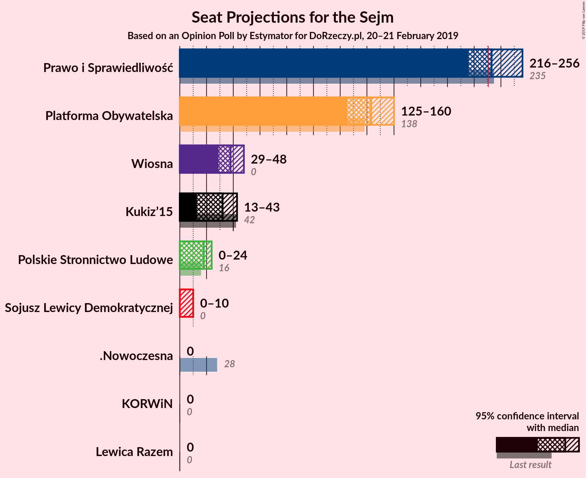
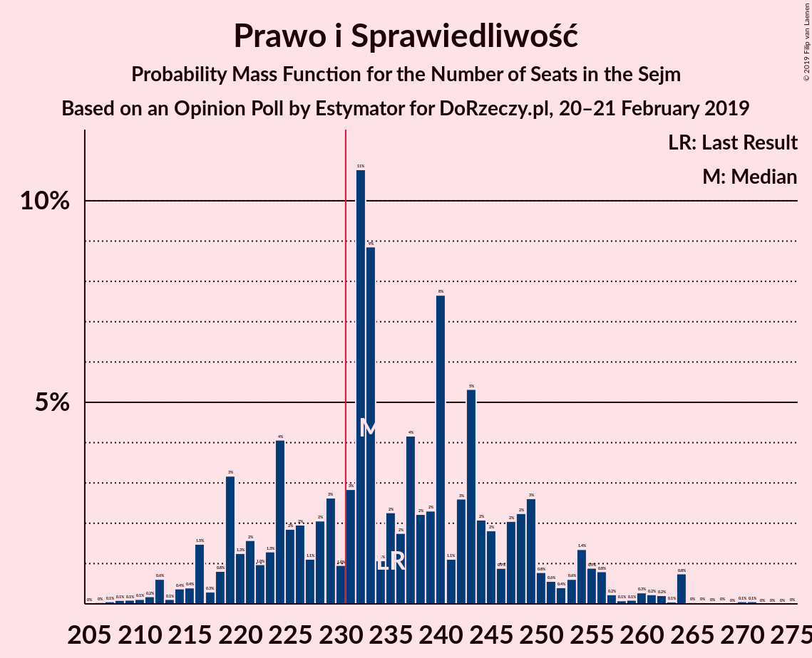
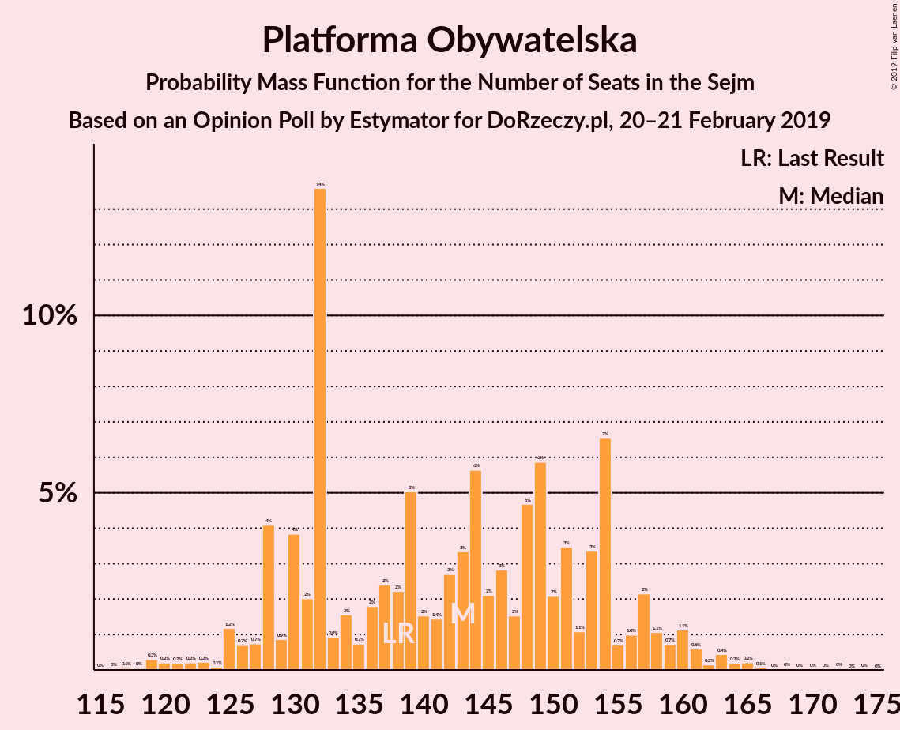
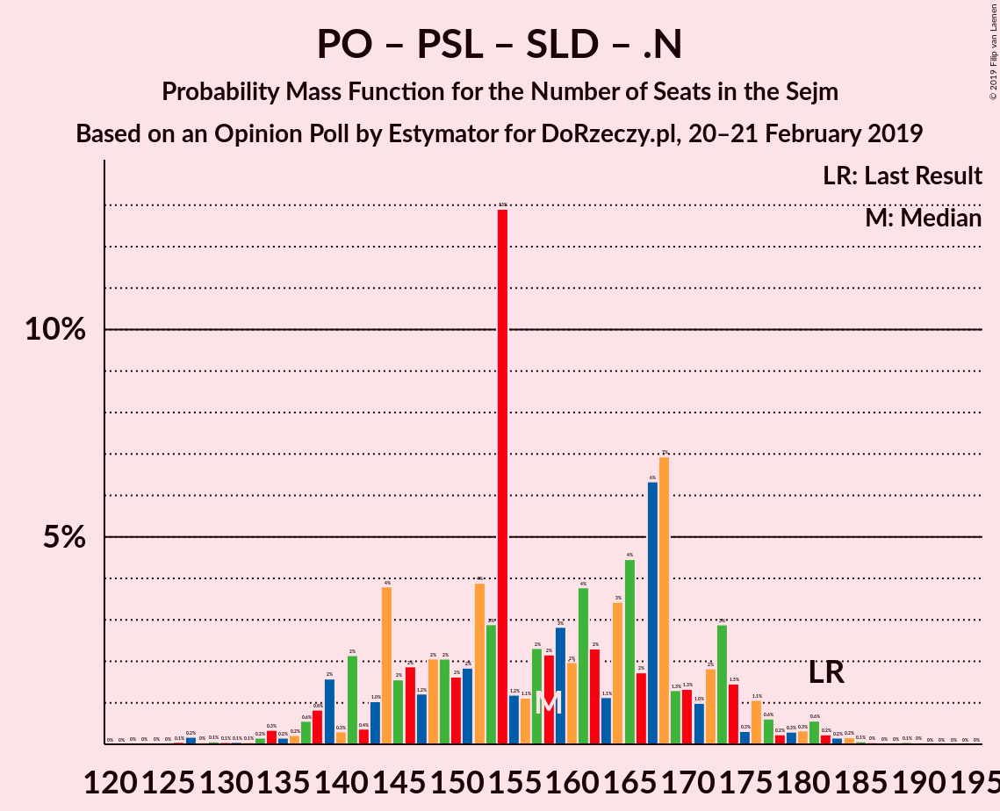

# Opinion Poll by Estymator for DoRzeczy.pl, 20–21 February 2019

<a href="#voting-intentions">Voting Intentions</a> | <a href="#seats">Seats</a> | <a href="#coalitions">Coalitions</a> | <a href="#technical-information">Technical Information</a>

## Voting Intentions

### Confidence Intervals

| Party | Last Result | Poll Result | 80% Confidence Interval | 90% Confidence Interval | 95% Confidence Interval | 99% Confidence Interval |
|:-----:|:-----------:|:-----------:|:-----------------------:|:-----------------------:|:-----------------------:|:-----------------------:|
| Prawo i Sprawiedliwość | 37.6% | 41.1% | 39.1–43.1% |38.5–43.6% |38.1–44.1% |37.1–45.1% |
| Platforma Obywatelska | 24.1% | 26.2% | 24.4–28.0% |24.0–28.5% |23.5–29.0% |22.7–29.9% |
| Wiosna | 0.0% | 9.2% | 8.1–10.5% |7.8–10.8% |7.5–11.1% |7.1–11.8% |
| Kukiz’15 | 8.8% | 7.6% | 6.6–8.8% |6.4–9.1% |6.1–9.4% |5.7–10.0% |
| Polskie Stronnictwo Ludowe | 5.1% | 5.6% | 4.8–6.7% |4.6–7.0% |4.4–7.2% |4.0–7.8% |
| Sojusz Lewicy Demokratycznej | 7.6% | 3.9% | 3.3–4.9% |3.1–5.1% |2.9–5.3% |2.6–5.8% |
| KORWiN | 4.8% | 1.4% | 1.0–2.0% |0.9–2.2% |0.8–2.3% |0.7–2.6% |
| Lewica Razem | 3.6% | 1.4% | 1.0–2.0% |0.9–2.2% |0.8–2.3% |0.7–2.6% |
| .Nowoczesna | 7.6% | 0.7% | 0.5–1.2% |0.4–1.3% |0.3–1.4% |0.2–1.7% |

*Note:* The poll result column reflects the actual value used in the calculations. Published results may vary slightly, and in addition be rounded to fewer digits.

## Seats

### Confidence Intervals

| Party | Last Result | Median | 80% Confidence Interval | 90% Confidence Interval | 95% Confidence Interval | 99% Confidence Interval |
|:-----:|:-----------:|:------:|:-----------------------:|:-----------------------:|:-----------------------:|:-----------------------:|
| <a href="#prawo-i-sprawiedliwość">Prawo i Sprawiedliwość</a> | 235 | 233 | 221–249 |219–254 |216–256 |211–264 |
| <a href="#platforma-obywatelska">Platforma Obywatelska</a> | 138 | 143 | 130–154 |128–157 |125–160 |120–164 |
| <a href="#wiosna">Wiosna</a> | 0 | 38 | 30–44 |29–46 |29–48 |26–51 |
| <a href="#kukiz’15">Kukiz’15</a> | 42 | 32 | 19–39 |16–41 |13–43 |9–45 |
| <a href="#polskie-stronnictwo-ludowe">Polskie Stronnictwo Ludowe</a> | 16 | 18 | 0–23 |0–24 |0–24 |0–27 |
| <a href="#sojusz-lewicy-demokratycznej">Sojusz Lewicy Demokratycznej</a> | 0 | 0 | 0 |0–8 |0–10 |0–12 |
| <a href="#korwin">KORWiN</a> | 0 | 0 | 0 |0 |0 |0 |
| <a href="#lewica-razem">Lewica Razem</a> | 0 | 0 | 0 |0 |0 |0 |
| <a href="#.nowoczesna">.Nowoczesna</a> | 28 | 0 | 0 |0 |0 |0 |

### Prawo i Sprawiedliwość

*For a full overview of the results for this party, see the [Prawo i Sprawiedliwość](party-prawoisprawiedliwość.html) page.*

| Number of Seats | Probability | Accumulated | Special Marks |
|:---------------:|:-----------:|:-----------:|:-------------:|
| 205 | 0% | 100% |  |
| 206 | 0% | 99.9% |  |
| 207 | 0.1% | 99.9% |  |
| 208 | 0.1% | 99.8% |  |
| 209 | 0.1% | 99.8% |  |
| 210 | 0.1% | 99.7% |  |
| 211 | 0.2% | 99.5% |  |
| 212 | 0.6% | 99.4% |  |
| 213 | 0.1% | 98.7% |  |
| 214 | 0.4% | 98.6% |  |
| 215 | 0.4% | 98% |  |
| 216 | 1.5% | 98% |  |
| 217 | 0.3% | 96% |  |
| 218 | 0.8% | 96% |  |
| 219 | 3% | 95% |  |
| 220 | 1.3% | 92% |  |
| 221 | 2% | 91% |  |
| 222 | 1.0% | 89% |  |
| 223 | 1.3% | 88% |  |
| 224 | 4% | 87% |  |
| 225 | 2% | 83% |  |
| 226 | 2% | 81% |  |
| 227 | 1.1% | 79% |  |
| 228 | 2% | 78% |  |
| 229 | 3% | 76% |  |
| 230 | 1.0% | 73% |  |
| 231 | 3% | 72% | Majority |
| 232 | 11% | 69% |  |
| 233 | 9% | 59% | Median |
| 234 | 1.1% | 50% |  |
| 235 | 2% | 49% | Last Result |
| 236 | 2% | 46% |  |
| 237 | 4% | 45% |  |
| 238 | 2% | 41% |  |
| 239 | 2% | 38% |  |
| 240 | 8% | 36% |  |
| 241 | 1.1% | 28% |  |
| 242 | 3% | 27% |  |
| 243 | 5% | 25% |  |
| 244 | 2% | 19% |  |
| 245 | 2% | 17% |  |
| 246 | 0.9% | 15% |  |
| 247 | 2% | 15% |  |
| 248 | 2% | 12% |  |
| 249 | 3% | 10% |  |
| 250 | 0.8% | 8% |  |
| 251 | 0.6% | 7% |  |
| 252 | 0.4% | 6% |  |
| 253 | 0.6% | 6% |  |
| 254 | 1.4% | 5% |  |
| 255 | 0.9% | 4% |  |
| 256 | 0.8% | 3% |  |
| 257 | 0.2% | 2% |  |
| 258 | 0.1% | 2% |  |
| 259 | 0.1% | 2% |  |
| 260 | 0.3% | 2% |  |
| 261 | 0.2% | 2% |  |
| 262 | 0.2% | 1.3% |  |
| 263 | 0.1% | 1.1% |  |
| 264 | 0.8% | 1.0% |  |
| 265 | 0% | 0.3% |  |
| 266 | 0% | 0.2% |  |
| 267 | 0% | 0.2% |  |
| 268 | 0% | 0.2% |  |
| 269 | 0% | 0.2% |  |
| 270 | 0.1% | 0.1% |  |
| 271 | 0.1% | 0.1% |  |
| 272 | 0% | 0% |  |

### Platforma Obywatelska

*For a full overview of the results for this party, see the [Platforma Obywatelska](party-platformaobywatelska.html) page.*

| Number of Seats | Probability | Accumulated | Special Marks |
|:---------------:|:-----------:|:-----------:|:-------------:|
| 115 | 0% | 100% |  |
| 116 | 0% | 99.9% |  |
| 117 | 0.1% | 99.9% |  |
| 118 | 0% | 99.8% |  |
| 119 | 0.3% | 99.8% |  |
| 120 | 0.2% | 99.5% |  |
| 121 | 0.2% | 99.3% |  |
| 122 | 0.2% | 99.1% |  |
| 123 | 0.2% | 98.9% |  |
| 124 | 0.1% | 98.7% |  |
| 125 | 1.2% | 98.6% |  |
| 126 | 0.7% | 97% |  |
| 127 | 0.7% | 97% |  |
| 128 | 4% | 96% |  |
| 129 | 0.9% | 92% |  |
| 130 | 4% | 91% |  |
| 131 | 2% | 87% |  |
| 132 | 14% | 85% |  |
| 133 | 0.9% | 72% |  |
| 134 | 2% | 71% |  |
| 135 | 0.7% | 69% |  |
| 136 | 2% | 68% |  |
| 137 | 2% | 67% |  |
| 138 | 2% | 64% | Last Result |
| 139 | 5% | 62% |  |
| 140 | 2% | 57% |  |
| 141 | 1.4% | 55% |  |
| 142 | 3% | 54% |  |
| 143 | 3% | 51% | Median |
| 144 | 6% | 48% |  |
| 145 | 2% | 42% |  |
| 146 | 3% | 40% |  |
| 147 | 2% | 37% |  |
| 148 | 5% | 36% |  |
| 149 | 6% | 31% |  |
| 150 | 2% | 25% |  |
| 151 | 3% | 23% |  |
| 152 | 1.1% | 20% |  |
| 153 | 3% | 19% |  |
| 154 | 7% | 15% |  |
| 155 | 0.7% | 9% |  |
| 156 | 1.0% | 8% |  |
| 157 | 2% | 7% |  |
| 158 | 1.1% | 5% |  |
| 159 | 0.7% | 4% |  |
| 160 | 1.1% | 3% |  |
| 161 | 0.6% | 2% |  |
| 162 | 0.2% | 1.2% |  |
| 163 | 0.4% | 1.1% |  |
| 164 | 0.2% | 0.6% |  |
| 165 | 0.2% | 0.4% |  |
| 166 | 0.1% | 0.2% |  |
| 167 | 0% | 0.2% |  |
| 168 | 0% | 0.1% |  |
| 169 | 0% | 0.1% |  |
| 170 | 0% | 0.1% |  |
| 171 | 0% | 0.1% |  |
| 172 | 0% | 0.1% |  |
| 173 | 0% | 0% |  |

### Wiosna

*For a full overview of the results for this party, see the [Wiosna](party-wiosna.html) page.*

| Number of Seats | Probability | Accumulated | Special Marks |
|:---------------:|:-----------:|:-----------:|:-------------:|
| 0 | 0% | 100% | Last Result |
| 1 | 0% | 100% |  |
| 2 | 0% | 100% |  |
| 3 | 0% | 100% |  |
| 4 | 0% | 100% |  |
| 5 | 0% | 100% |  |
| 6 | 0% | 100% |  |
| 7 | 0% | 100% |  |
| 8 | 0% | 100% |  |
| 9 | 0% | 100% |  |
| 10 | 0% | 100% |  |
| 11 | 0% | 100% |  |
| 12 | 0% | 100% |  |
| 13 | 0% | 100% |  |
| 14 | 0% | 100% |  |
| 15 | 0% | 100% |  |
| 16 | 0% | 100% |  |
| 17 | 0% | 100% |  |
| 18 | 0% | 100% |  |
| 19 | 0% | 100% |  |
| 20 | 0% | 100% |  |
| 21 | 0% | 100% |  |
| 22 | 0% | 100% |  |
| 23 | 0% | 99.9% |  |
| 24 | 0.1% | 99.9% |  |
| 25 | 0.1% | 99.8% |  |
| 26 | 0.2% | 99.7% |  |
| 27 | 0.3% | 99.4% |  |
| 28 | 1.5% | 99.1% |  |
| 29 | 4% | 98% |  |
| 30 | 5% | 94% |  |
| 31 | 2% | 89% |  |
| 32 | 9% | 87% |  |
| 33 | 4% | 78% |  |
| 34 | 4% | 74% |  |
| 35 | 7% | 70% |  |
| 36 | 6% | 63% |  |
| 37 | 7% | 57% |  |
| 38 | 5% | 51% | Median |
| 39 | 8% | 46% |  |
| 40 | 3% | 38% |  |
| 41 | 10% | 35% |  |
| 42 | 4% | 25% |  |
| 43 | 7% | 22% |  |
| 44 | 6% | 14% |  |
| 45 | 3% | 8% |  |
| 46 | 2% | 5% |  |
| 47 | 0.7% | 3% |  |
| 48 | 0.7% | 3% |  |
| 49 | 0.6% | 2% |  |
| 50 | 0.3% | 1.3% |  |
| 51 | 0.5% | 1.0% |  |
| 52 | 0.2% | 0.4% |  |
| 53 | 0.1% | 0.2% |  |
| 54 | 0.1% | 0.1% |  |
| 55 | 0% | 0.1% |  |
| 56 | 0% | 0.1% |  |
| 57 | 0% | 0.1% |  |
| 58 | 0% | 0% |  |

### Kukiz’15

*For a full overview of the results for this party, see the [Kukiz’15](party-kukiz’15.html) page.*

| Number of Seats | Probability | Accumulated | Special Marks |
|:---------------:|:-----------:|:-----------:|:-------------:|
| 6 | 0% | 100% |  |
| 7 | 0% | 99.9% |  |
| 8 | 0.1% | 99.9% |  |
| 9 | 0.6% | 99.8% |  |
| 10 | 0.1% | 99.2% |  |
| 11 | 0.6% | 99.1% |  |
| 12 | 0.6% | 98.5% |  |
| 13 | 0.5% | 98% |  |
| 14 | 0.8% | 97% |  |
| 15 | 0.4% | 97% |  |
| 16 | 2% | 96% |  |
| 17 | 2% | 94% |  |
| 18 | 3% | 93% |  |
| 19 | 1.2% | 90% |  |
| 20 | 5% | 89% |  |
| 21 | 2% | 84% |  |
| 22 | 9% | 81% |  |
| 23 | 7% | 73% |  |
| 24 | 3% | 66% |  |
| 25 | 3% | 63% |  |
| 26 | 2% | 60% |  |
| 27 | 2% | 59% |  |
| 28 | 1.0% | 57% |  |
| 29 | 2% | 56% |  |
| 30 | 2% | 54% |  |
| 31 | 2% | 52% |  |
| 32 | 8% | 50% | Median |
| 33 | 5% | 42% |  |
| 34 | 11% | 37% |  |
| 35 | 3% | 26% |  |
| 36 | 8% | 23% |  |
| 37 | 3% | 15% |  |
| 38 | 2% | 13% |  |
| 39 | 2% | 11% |  |
| 40 | 2% | 8% |  |
| 41 | 2% | 6% |  |
| 42 | 1.2% | 4% | Last Result |
| 43 | 1.2% | 3% |  |
| 44 | 1.2% | 2% |  |
| 45 | 0.5% | 0.8% |  |
| 46 | 0.1% | 0.2% |  |
| 47 | 0% | 0.1% |  |
| 48 | 0% | 0.1% |  |
| 49 | 0% | 0% |  |

### Polskie Stronnictwo Ludowe

*For a full overview of the results for this party, see the [Polskie Stronnictwo Ludowe](party-polskiestronnictwoludowe.html) page.*

| Number of Seats | Probability | Accumulated | Special Marks |
|:---------------:|:-----------:|:-----------:|:-------------:|
| 0 | 20% | 100% |  |
| 1 | 0% | 80% |  |
| 2 | 0% | 80% |  |
| 3 | 0% | 80% |  |
| 4 | 0% | 80% |  |
| 5 | 0% | 80% |  |
| 6 | 0% | 80% |  |
| 7 | 0% | 80% |  |
| 8 | 0% | 80% |  |
| 9 | 0% | 80% |  |
| 10 | 0% | 80% |  |
| 11 | 0.9% | 80% |  |
| 12 | 2% | 79% |  |
| 13 | 3% | 77% |  |
| 14 | 10% | 74% |  |
| 15 | 4% | 65% |  |
| 16 | 9% | 61% | Last Result |
| 17 | 2% | 52% |  |
| 18 | 3% | 51% | Median |
| 19 | 4% | 48% |  |
| 20 | 2% | 43% |  |
| 21 | 2% | 41% |  |
| 22 | 18% | 38% |  |
| 23 | 11% | 21% |  |
| 24 | 8% | 9% |  |
| 25 | 0.4% | 1.5% |  |
| 26 | 0.2% | 1.1% |  |
| 27 | 0.6% | 0.9% |  |
| 28 | 0.1% | 0.3% |  |
| 29 | 0% | 0.1% |  |
| 30 | 0% | 0.1% |  |
| 31 | 0% | 0.1% |  |
| 32 | 0% | 0% |  |

### Sojusz Lewicy Demokratycznej

*For a full overview of the results for this party, see the [Sojusz Lewicy Demokratycznej](party-sojuszlewicydemokratycznej.html) page.*

| Number of Seats | Probability | Accumulated | Special Marks |
|:---------------:|:-----------:|:-----------:|:-------------:|
| 0 | 93% | 100% | Last Result, Median |
| 1 | 0% | 7% |  |
| 2 | 0% | 7% |  |
| 3 | 0% | 7% |  |
| 4 | 0.1% | 7% |  |
| 5 | 0.1% | 7% |  |
| 6 | 0% | 7% |  |
| 7 | 0.9% | 7% |  |
| 8 | 2% | 6% |  |
| 9 | 0.9% | 4% |  |
| 10 | 2% | 3% |  |
| 11 | 0.4% | 1.4% |  |
| 12 | 0.5% | 1.0% |  |
| 13 | 0.1% | 0.4% |  |
| 14 | 0.2% | 0.4% |  |
| 15 | 0% | 0.2% |  |
| 16 | 0% | 0.1% |  |
| 17 | 0% | 0.1% |  |
| 18 | 0% | 0.1% |  |
| 19 | 0% | 0% |  |

### KORWiN

*For a full overview of the results for this party, see the [KORWiN](party-korwin.html) page.*

| Number of Seats | Probability | Accumulated | Special Marks |
|:---------------:|:-----------:|:-----------:|:-------------:|
| 0 | 100% | 100% | Last Result, Median |

### Lewica Razem

*For a full overview of the results for this party, see the [Lewica Razem](party-lewicarazem.html) page.*

| Number of Seats | Probability | Accumulated | Special Marks |
|:---------------:|:-----------:|:-----------:|:-------------:|
| 0 | 100% | 100% | Last Result, Median |

### .Nowoczesna

*For a full overview of the results for this party, see the [.Nowoczesna](party-nowoczesna.html) page.*

| Number of Seats | Probability | Accumulated | Special Marks |
|:---------------:|:-----------:|:-----------:|:-------------:|
| 0 | 100% | 100% | Median |
| 1 | 0% | 0% |  |
| 2 | 0% | 0% |  |
| 3 | 0% | 0% |  |
| 4 | 0% | 0% |  |
| 5 | 0% | 0% |  |
| 6 | 0% | 0% |  |
| 7 | 0% | 0% |  |
| 8 | 0% | 0% |  |
| 9 | 0% | 0% |  |
| 10 | 0% | 0% |  |
| 11 | 0% | 0% |  |
| 12 | 0% | 0% |  |
| 13 | 0% | 0% |  |
| 14 | 0% | 0% |  |
| 15 | 0% | 0% |  |
| 16 | 0% | 0% |  |
| 17 | 0% | 0% |  |
| 18 | 0% | 0% |  |
| 19 | 0% | 0% |  |
| 20 | 0% | 0% |  |
| 21 | 0% | 0% |  |
| 22 | 0% | 0% |  |
| 23 | 0% | 0% |  |
| 24 | 0% | 0% |  |
| 25 | 0% | 0% |  |
| 26 | 0% | 0% |  |
| 27 | 0% | 0% |  |
| 28 | 0% | 0% | Last Result |

## Coalitions

### Confidence Intervals

| Coalition | Last Result | Median | Majority? | 80% Confidence Interval | 90% Confidence Interval | 95% Confidence Interval | 99% Confidence Interval |
|:---------:|:-----------:|:------:|:---------:|:-----------------------:|:-----------------------:|:-----------------------:|:-----------------------:|
| Prawo i Sprawiedliwość | 235 | 233 | 72% | 221–249 | 219–254 | 216–256 | 211–264 |
| Platforma Obywatelska – Polskie Stronnictwo Ludowe – Sojusz Lewicy Demokratycznej – Lewica Razem – .Nowoczesna | 182 | 158 | 0% | 144–172 | 141–174 | 138–177 | 130–183 |
| Platforma Obywatelska – Polskie Stronnictwo Ludowe – Sojusz Lewicy Demokratycznej – .Nowoczesna | 182 | 158 | 0% | 144–172 | 141–174 | 138–177 | 130–183 |
| Platforma Obywatelska – Polskie Stronnictwo Ludowe – .Nowoczesna | 182 | 157 | 0% | 143–171 | 139–173 | 138–176 | 130–182 |
| Platforma Obywatelska – Sojusz Lewicy Demokratycznej – .Nowoczesna | 166 | 144 | 0% | 130–156 | 128–159 | 126–161 | 120–165 |
| Platforma Obywatelska – .Nowoczesna | 166 | 143 | 0% | 130–154 | 128–157 | 125–160 | 120–164 |
| Platforma Obywatelska | 138 | 143 | 0% | 130–154 | 128–157 | 125–160 | 120–164 |

### Prawo i Sprawiedliwość

| Number of Seats | Probability | Accumulated | Special Marks |
|:---------------:|:-----------:|:-----------:|:-------------:|
| 205 | 0% | 100% |  |
| 206 | 0% | 99.9% |  |
| 207 | 0.1% | 99.9% |  |
| 208 | 0.1% | 99.8% |  |
| 209 | 0.1% | 99.8% |  |
| 210 | 0.1% | 99.7% |  |
| 211 | 0.2% | 99.5% |  |
| 212 | 0.6% | 99.4% |  |
| 213 | 0.1% | 98.7% |  |
| 214 | 0.4% | 98.6% |  |
| 215 | 0.4% | 98% |  |
| 216 | 1.5% | 98% |  |
| 217 | 0.3% | 96% |  |
| 218 | 0.8% | 96% |  |
| 219 | 3% | 95% |  |
| 220 | 1.3% | 92% |  |
| 221 | 2% | 91% |  |
| 222 | 1.0% | 89% |  |
| 223 | 1.3% | 88% |  |
| 224 | 4% | 87% |  |
| 225 | 2% | 83% |  |
| 226 | 2% | 81% |  |
| 227 | 1.1% | 79% |  |
| 228 | 2% | 78% |  |
| 229 | 3% | 76% |  |
| 230 | 1.0% | 73% |  |
| 231 | 3% | 72% | Majority |
| 232 | 11% | 69% |  |
| 233 | 9% | 59% | Median |
| 234 | 1.1% | 50% |  |
| 235 | 2% | 49% | Last Result |
| 236 | 2% | 46% |  |
| 237 | 4% | 45% |  |
| 238 | 2% | 41% |  |
| 239 | 2% | 38% |  |
| 240 | 8% | 36% |  |
| 241 | 1.1% | 28% |  |
| 242 | 3% | 27% |  |
| 243 | 5% | 25% |  |
| 244 | 2% | 19% |  |
| 245 | 2% | 17% |  |
| 246 | 0.9% | 15% |  |
| 247 | 2% | 15% |  |
| 248 | 2% | 12% |  |
| 249 | 3% | 10% |  |
| 250 | 0.8% | 8% |  |
| 251 | 0.6% | 7% |  |
| 252 | 0.4% | 6% |  |
| 253 | 0.6% | 6% |  |
| 254 | 1.4% | 5% |  |
| 255 | 0.9% | 4% |  |
| 256 | 0.8% | 3% |  |
| 257 | 0.2% | 2% |  |
| 258 | 0.1% | 2% |  |
| 259 | 0.1% | 2% |  |
| 260 | 0.3% | 2% |  |
| 261 | 0.2% | 2% |  |
| 262 | 0.2% | 1.3% |  |
| 263 | 0.1% | 1.1% |  |
| 264 | 0.8% | 1.0% |  |
| 265 | 0% | 0.3% |  |
| 266 | 0% | 0.2% |  |
| 267 | 0% | 0.2% |  |
| 268 | 0% | 0.2% |  |
| 269 | 0% | 0.2% |  |
| 270 | 0.1% | 0.1% |  |
| 271 | 0.1% | 0.1% |  |
| 272 | 0% | 0% |  |

### Platforma Obywatelska – Polskie Stronnictwo Ludowe – Sojusz Lewicy Demokratycznej – Lewica Razem – .Nowoczesna

| Number of Seats | Probability | Accumulated | Special Marks |
|:---------------:|:-----------:|:-----------:|:-------------:|
| 123 | 0% | 100% |  |
| 124 | 0% | 99.9% |  |
| 125 | 0% | 99.9% |  |
| 126 | 0.1% | 99.9% |  |
| 127 | 0.2% | 99.8% |  |
| 128 | 0% | 99.7% |  |
| 129 | 0.1% | 99.6% |  |
| 130 | 0.1% | 99.5% |  |
| 131 | 0.1% | 99.5% |  |
| 132 | 0.1% | 99.4% |  |
| 133 | 0.2% | 99.4% |  |
| 134 | 0.3% | 99.2% |  |
| 135 | 0.2% | 98.9% |  |
| 136 | 0.2% | 98.7% |  |
| 137 | 0.6% | 98% |  |
| 138 | 0.8% | 98% |  |
| 139 | 2% | 97% |  |
| 140 | 0.3% | 96% |  |
| 141 | 2% | 95% |  |
| 142 | 0.4% | 93% |  |
| 143 | 1.0% | 93% |  |
| 144 | 4% | 92% |  |
| 145 | 2% | 88% |  |
| 146 | 2% | 86% |  |
| 147 | 1.2% | 84% |  |
| 148 | 2% | 83% |  |
| 149 | 2% | 81% |  |
| 150 | 2% | 79% |  |
| 151 | 2% | 77% |  |
| 152 | 4% | 76% |  |
| 153 | 3% | 72% |  |
| 154 | 13% | 69% |  |
| 155 | 1.2% | 56% |  |
| 156 | 1.1% | 55% |  |
| 157 | 2% | 54% |  |
| 158 | 2% | 51% |  |
| 159 | 3% | 49% |  |
| 160 | 2% | 46% |  |
| 161 | 4% | 44% | Median |
| 162 | 2% | 40% |  |
| 163 | 1.1% | 38% |  |
| 164 | 3% | 37% |  |
| 165 | 4% | 34% |  |
| 166 | 2% | 29% |  |
| 167 | 6% | 27% |  |
| 168 | 7% | 21% |  |
| 169 | 1.3% | 14% |  |
| 170 | 1.3% | 13% |  |
| 171 | 1.0% | 12% |  |
| 172 | 2% | 11% |  |
| 173 | 3% | 9% |  |
| 174 | 1.5% | 6% |  |
| 175 | 0.3% | 4% |  |
| 176 | 1.1% | 4% |  |
| 177 | 0.6% | 3% |  |
| 178 | 0.2% | 2% |  |
| 179 | 0.3% | 2% |  |
| 180 | 0.3% | 2% |  |
| 181 | 0.6% | 1.4% |  |
| 182 | 0.2% | 0.9% | Last Result |
| 183 | 0.2% | 0.6% |  |
| 184 | 0.2% | 0.5% |  |
| 185 | 0.1% | 0.3% |  |
| 186 | 0% | 0.2% |  |
| 187 | 0% | 0.2% |  |
| 188 | 0% | 0.2% |  |
| 189 | 0.1% | 0.1% |  |
| 190 | 0% | 0.1% |  |
| 191 | 0% | 0% |  |

### Platforma Obywatelska – Polskie Stronnictwo Ludowe – Sojusz Lewicy Demokratycznej – .Nowoczesna

| Number of Seats | Probability | Accumulated | Special Marks |
|:---------------:|:-----------:|:-----------:|:-------------:|
| 123 | 0% | 100% |  |
| 124 | 0% | 99.9% |  |
| 125 | 0% | 99.9% |  |
| 126 | 0.1% | 99.9% |  |
| 127 | 0.2% | 99.8% |  |
| 128 | 0% | 99.7% |  |
| 129 | 0.1% | 99.6% |  |
| 130 | 0.1% | 99.5% |  |
| 131 | 0.1% | 99.5% |  |
| 132 | 0.1% | 99.4% |  |
| 133 | 0.2% | 99.4% |  |
| 134 | 0.3% | 99.2% |  |
| 135 | 0.2% | 98.9% |  |
| 136 | 0.2% | 98.7% |  |
| 137 | 0.6% | 98% |  |
| 138 | 0.8% | 98% |  |
| 139 | 2% | 97% |  |
| 140 | 0.3% | 96% |  |
| 141 | 2% | 95% |  |
| 142 | 0.4% | 93% |  |
| 143 | 1.0% | 93% |  |
| 144 | 4% | 92% |  |
| 145 | 2% | 88% |  |
| 146 | 2% | 86% |  |
| 147 | 1.2% | 84% |  |
| 148 | 2% | 83% |  |
| 149 | 2% | 81% |  |
| 150 | 2% | 79% |  |
| 151 | 2% | 77% |  |
| 152 | 4% | 76% |  |
| 153 | 3% | 72% |  |
| 154 | 13% | 69% |  |
| 155 | 1.2% | 56% |  |
| 156 | 1.1% | 55% |  |
| 157 | 2% | 54% |  |
| 158 | 2% | 51% |  |
| 159 | 3% | 49% |  |
| 160 | 2% | 46% |  |
| 161 | 4% | 44% | Median |
| 162 | 2% | 40% |  |
| 163 | 1.1% | 38% |  |
| 164 | 3% | 37% |  |
| 165 | 4% | 34% |  |
| 166 | 2% | 29% |  |
| 167 | 6% | 27% |  |
| 168 | 7% | 21% |  |
| 169 | 1.3% | 14% |  |
| 170 | 1.3% | 13% |  |
| 171 | 1.0% | 12% |  |
| 172 | 2% | 11% |  |
| 173 | 3% | 9% |  |
| 174 | 1.5% | 6% |  |
| 175 | 0.3% | 4% |  |
| 176 | 1.1% | 4% |  |
| 177 | 0.6% | 3% |  |
| 178 | 0.2% | 2% |  |
| 179 | 0.3% | 2% |  |
| 180 | 0.3% | 2% |  |
| 181 | 0.6% | 1.4% |  |
| 182 | 0.2% | 0.9% | Last Result |
| 183 | 0.2% | 0.6% |  |
| 184 | 0.2% | 0.5% |  |
| 185 | 0.1% | 0.3% |  |
| 186 | 0% | 0.2% |  |
| 187 | 0% | 0.2% |  |
| 188 | 0% | 0.2% |  |
| 189 | 0.1% | 0.1% |  |
| 190 | 0% | 0.1% |  |
| 191 | 0% | 0% |  |

### Platforma Obywatelska – Polskie Stronnictwo Ludowe – .Nowoczesna

| Number of Seats | Probability | Accumulated | Special Marks |
|:---------------:|:-----------:|:-----------:|:-------------:|
| 122 | 0% | 100% |  |
| 123 | 0% | 99.9% |  |
| 124 | 0% | 99.9% |  |
| 125 | 0% | 99.9% |  |
| 126 | 0.1% | 99.9% |  |
| 127 | 0.2% | 99.8% |  |
| 128 | 0% | 99.6% |  |
| 129 | 0.1% | 99.6% |  |
| 130 | 0.1% | 99.5% |  |
| 131 | 0.1% | 99.4% |  |
| 132 | 0.1% | 99.3% |  |
| 133 | 0.2% | 99.3% |  |
| 134 | 0.3% | 99.1% |  |
| 135 | 0.3% | 98.7% |  |
| 136 | 0.2% | 98% |  |
| 137 | 0.6% | 98% |  |
| 138 | 1.0% | 98% |  |
| 139 | 2% | 97% |  |
| 140 | 0.6% | 94% |  |
| 141 | 2% | 94% |  |
| 142 | 0.6% | 91% |  |
| 143 | 1.0% | 91% |  |
| 144 | 4% | 90% |  |
| 145 | 2% | 86% |  |
| 146 | 2% | 84% |  |
| 147 | 1.2% | 83% |  |
| 148 | 2% | 81% |  |
| 149 | 2% | 80% |  |
| 150 | 1.4% | 78% |  |
| 151 | 3% | 77% |  |
| 152 | 4% | 73% |  |
| 153 | 3% | 69% |  |
| 154 | 13% | 66% |  |
| 155 | 1.3% | 53% |  |
| 156 | 1.3% | 52% |  |
| 157 | 2% | 51% |  |
| 158 | 2% | 48% |  |
| 159 | 2% | 47% |  |
| 160 | 2% | 45% |  |
| 161 | 4% | 43% | Median |
| 162 | 3% | 39% |  |
| 163 | 1.0% | 36% |  |
| 164 | 3% | 35% |  |
| 165 | 4% | 32% |  |
| 166 | 2% | 27% |  |
| 167 | 6% | 25% |  |
| 168 | 7% | 20% |  |
| 169 | 1.4% | 13% |  |
| 170 | 1.1% | 11% |  |
| 171 | 0.9% | 10% |  |
| 172 | 2% | 9% |  |
| 173 | 3% | 8% |  |
| 174 | 0.9% | 5% |  |
| 175 | 0.4% | 4% |  |
| 176 | 0.9% | 3% |  |
| 177 | 0.6% | 2% |  |
| 178 | 0.2% | 2% |  |
| 179 | 0.2% | 2% |  |
| 180 | 0.3% | 1.4% |  |
| 181 | 0.5% | 1.1% |  |
| 182 | 0.1% | 0.6% | Last Result |
| 183 | 0.2% | 0.4% |  |
| 184 | 0% | 0.3% |  |
| 185 | 0.1% | 0.2% |  |
| 186 | 0% | 0.2% |  |
| 187 | 0% | 0.1% |  |
| 188 | 0% | 0.1% |  |
| 189 | 0.1% | 0.1% |  |
| 190 | 0% | 0% |  |

### Platforma Obywatelska – Sojusz Lewicy Demokratycznej – .Nowoczesna

| Number of Seats | Probability | Accumulated | Special Marks |
|:---------------:|:-----------:|:-----------:|:-------------:|
| 116 | 0% | 100% |  |
| 117 | 0% | 99.9% |  |
| 118 | 0% | 99.9% |  |
| 119 | 0.2% | 99.8% |  |
| 120 | 0.2% | 99.6% |  |
| 121 | 0.2% | 99.4% |  |
| 122 | 0.2% | 99.2% |  |
| 123 | 0.2% | 99.0% |  |
| 124 | 0.1% | 98.8% |  |
| 125 | 1.2% | 98.7% |  |
| 126 | 0.7% | 98% |  |
| 127 | 0.5% | 97% |  |
| 128 | 3% | 96% |  |
| 129 | 0.7% | 93% |  |
| 130 | 4% | 92% |  |
| 131 | 2% | 88% |  |
| 132 | 13% | 86% |  |
| 133 | 0.9% | 73% |  |
| 134 | 2% | 72% |  |
| 135 | 0.9% | 70% |  |
| 136 | 2% | 69% |  |
| 137 | 3% | 68% |  |
| 138 | 2% | 65% |  |
| 139 | 4% | 63% |  |
| 140 | 1.3% | 59% |  |
| 141 | 1.4% | 58% |  |
| 142 | 3% | 56% |  |
| 143 | 3% | 53% | Median |
| 144 | 6% | 50% |  |
| 145 | 2% | 44% |  |
| 146 | 3% | 42% |  |
| 147 | 2% | 39% |  |
| 148 | 5% | 38% |  |
| 149 | 6% | 33% |  |
| 150 | 2% | 27% |  |
| 151 | 2% | 25% |  |
| 152 | 1.0% | 22% |  |
| 153 | 3% | 21% |  |
| 154 | 7% | 18% |  |
| 155 | 0.7% | 12% |  |
| 156 | 1.2% | 11% |  |
| 157 | 2% | 10% |  |
| 158 | 1.1% | 8% |  |
| 159 | 2% | 7% |  |
| 160 | 1.4% | 4% |  |
| 161 | 0.9% | 3% |  |
| 162 | 0.4% | 2% |  |
| 163 | 0.7% | 2% |  |
| 164 | 0.3% | 0.9% |  |
| 165 | 0.2% | 0.6% |  |
| 166 | 0.1% | 0.4% | Last Result |
| 167 | 0.1% | 0.3% |  |
| 168 | 0% | 0.2% |  |
| 169 | 0.1% | 0.2% |  |
| 170 | 0% | 0.1% |  |
| 171 | 0% | 0.1% |  |
| 172 | 0.1% | 0.1% |  |
| 173 | 0% | 0% |  |

### Platforma Obywatelska – .Nowoczesna

| Number of Seats | Probability | Accumulated | Special Marks |
|:---------------:|:-----------:|:-----------:|:-------------:|
| 115 | 0% | 100% |  |
| 116 | 0% | 99.9% |  |
| 117 | 0.1% | 99.9% |  |
| 118 | 0% | 99.8% |  |
| 119 | 0.3% | 99.8% |  |
| 120 | 0.2% | 99.5% |  |
| 121 | 0.2% | 99.3% |  |
| 122 | 0.2% | 99.1% |  |
| 123 | 0.2% | 98.9% |  |
| 124 | 0.1% | 98.7% |  |
| 125 | 1.2% | 98.6% |  |
| 126 | 0.7% | 97% |  |
| 127 | 0.7% | 97% |  |
| 128 | 4% | 96% |  |
| 129 | 0.9% | 92% |  |
| 130 | 4% | 91% |  |
| 131 | 2% | 87% |  |
| 132 | 14% | 85% |  |
| 133 | 0.9% | 72% |  |
| 134 | 2% | 71% |  |
| 135 | 0.7% | 69% |  |
| 136 | 2% | 68% |  |
| 137 | 2% | 67% |  |
| 138 | 2% | 64% |  |
| 139 | 5% | 62% |  |
| 140 | 2% | 57% |  |
| 141 | 1.4% | 55% |  |
| 142 | 3% | 54% |  |
| 143 | 3% | 51% | Median |
| 144 | 6% | 48% |  |
| 145 | 2% | 42% |  |
| 146 | 3% | 40% |  |
| 147 | 2% | 37% |  |
| 148 | 5% | 36% |  |
| 149 | 6% | 31% |  |
| 150 | 2% | 25% |  |
| 151 | 3% | 23% |  |
| 152 | 1.1% | 20% |  |
| 153 | 3% | 19% |  |
| 154 | 7% | 15% |  |
| 155 | 0.7% | 9% |  |
| 156 | 1.0% | 8% |  |
| 157 | 2% | 7% |  |
| 158 | 1.1% | 5% |  |
| 159 | 0.7% | 4% |  |
| 160 | 1.1% | 3% |  |
| 161 | 0.6% | 2% |  |
| 162 | 0.2% | 1.2% |  |
| 163 | 0.4% | 1.1% |  |
| 164 | 0.2% | 0.6% |  |
| 165 | 0.2% | 0.4% |  |
| 166 | 0.1% | 0.2% | Last Result |
| 167 | 0% | 0.2% |  |
| 168 | 0% | 0.1% |  |
| 169 | 0% | 0.1% |  |
| 170 | 0% | 0.1% |  |
| 171 | 0% | 0.1% |  |
| 172 | 0% | 0.1% |  |
| 173 | 0% | 0% |  |

### Platforma Obywatelska

| Number of Seats | Probability | Accumulated | Special Marks |
|:---------------:|:-----------:|:-----------:|:-------------:|
| 115 | 0% | 100% |  |
| 116 | 0% | 99.9% |  |
| 117 | 0.1% | 99.9% |  |
| 118 | 0% | 99.8% |  |
| 119 | 0.3% | 99.8% |  |
| 120 | 0.2% | 99.5% |  |
| 121 | 0.2% | 99.3% |  |
| 122 | 0.2% | 99.1% |  |
| 123 | 0.2% | 98.9% |  |
| 124 | 0.1% | 98.7% |  |
| 125 | 1.2% | 98.6% |  |
| 126 | 0.7% | 97% |  |
| 127 | 0.7% | 97% |  |
| 128 | 4% | 96% |  |
| 129 | 0.9% | 92% |  |
| 130 | 4% | 91% |  |
| 131 | 2% | 87% |  |
| 132 | 14% | 85% |  |
| 133 | 0.9% | 72% |  |
| 134 | 2% | 71% |  |
| 135 | 0.7% | 69% |  |
| 136 | 2% | 68% |  |
| 137 | 2% | 67% |  |
| 138 | 2% | 64% | Last Result |
| 139 | 5% | 62% |  |
| 140 | 2% | 57% |  |
| 141 | 1.4% | 55% |  |
| 142 | 3% | 54% |  |
| 143 | 3% | 51% | Median |
| 144 | 6% | 48% |  |
| 145 | 2% | 42% |  |
| 146 | 3% | 40% |  |
| 147 | 2% | 37% |  |
| 148 | 5% | 36% |  |
| 149 | 6% | 31% |  |
| 150 | 2% | 25% |  |
| 151 | 3% | 23% |  |
| 152 | 1.1% | 20% |  |
| 153 | 3% | 19% |  |
| 154 | 7% | 15% |  |
| 155 | 0.7% | 9% |  |
| 156 | 1.0% | 8% |  |
| 157 | 2% | 7% |  |
| 158 | 1.1% | 5% |  |
| 159 | 0.7% | 4% |  |
| 160 | 1.1% | 3% |  |
| 161 | 0.6% | 2% |  |
| 162 | 0.2% | 1.2% |  |
| 163 | 0.4% | 1.1% |  |
| 164 | 0.2% | 0.6% |  |
| 165 | 0.2% | 0.4% |  |
| 166 | 0.1% | 0.2% |  |
| 167 | 0% | 0.2% |  |
| 168 | 0% | 0.1% |  |
| 169 | 0% | 0.1% |  |
| 170 | 0% | 0.1% |  |
| 171 | 0% | 0.1% |  |
| 172 | 0% | 0.1% |  |
| 173 | 0% | 0% |  |

## Technical Information

### Opinion Poll

+ **Polling firm:** Estymator
+ **Commissioner(s):** DoRzeczy.pl
+ **Fieldwork period:** 20–21 February 2019

### Calculations

+ **Sample size:** 1013
+ **Simulations done:** 1,048,576
+ **Error estimate:** 0.73%

