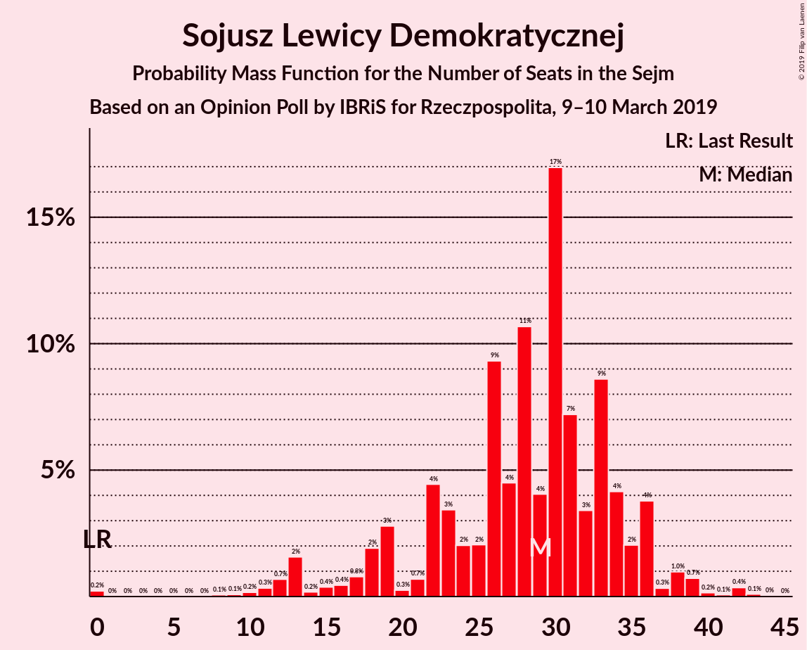
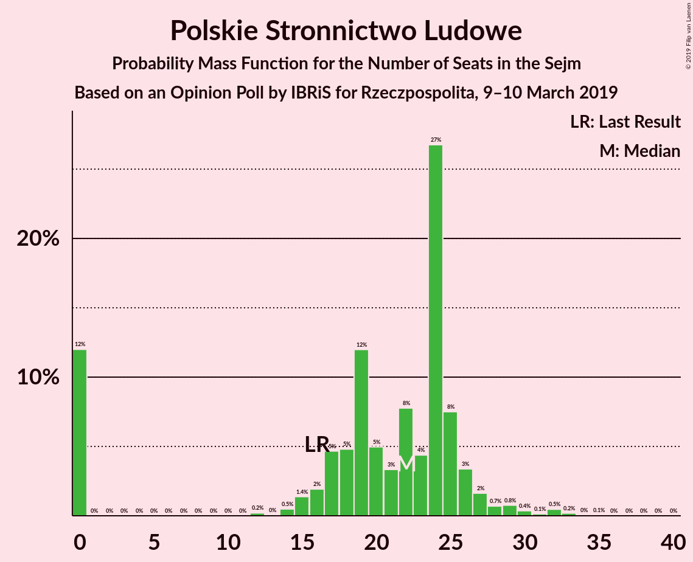
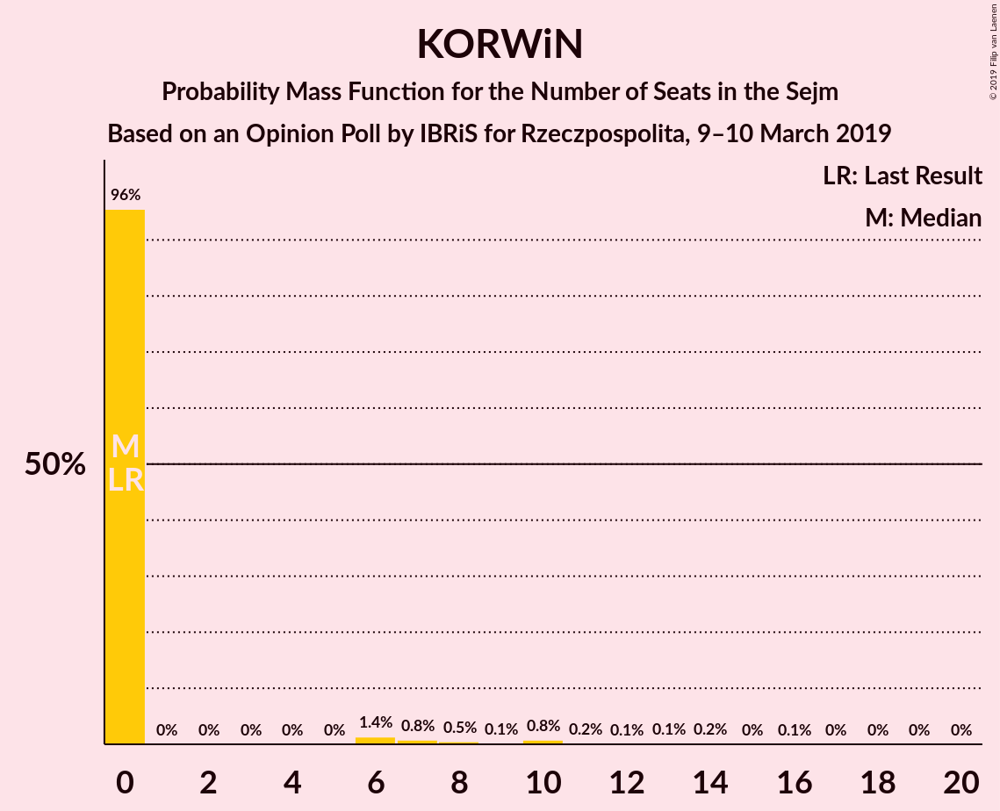

# Opinion Poll by IBRiS for Rzeczpospolita, 9–10 March 2019

<a href="#voting-intentions">Voting Intentions</a> | <a href="#seats">Seats</a> | <a href="#coalitions">Coalitions</a> | <a href="#technical-information">Technical Information</a>

## Voting Intentions

### Confidence Intervals

| Party | Last Result | Poll Result | 80% Confidence Interval | 90% Confidence Interval | 95% Confidence Interval | 99% Confidence Interval |
|:-----:|:-----------:|:-----------:|:-----------------------:|:-----------------------:|:-----------------------:|:-----------------------:|
| Prawo i Sprawiedliwość | 37.6% | 40.0% | 38.1–41.9% |37.6–42.5% |37.1–42.9% |36.2–43.9% |
| Platforma Obywatelska | 24.1% | 21.0% | 19.5–22.6% |19.1–23.1% |18.7–23.5% |18.0–24.3% |
| Kukiz’15 | 8.8% | 7.0% | 6.1–8.1% |5.9–8.4% |5.6–8.7% |5.2–9.2% |
| Sojusz Lewicy Demokratycznej | 7.6% | 7.0% | 6.1–8.1% |5.9–8.4% |5.6–8.7% |5.2–9.2% |
| Wiosna | 0.0% | 7.0% | 6.1–8.1% |5.9–8.4% |5.6–8.7% |5.2–9.2% |
| Polskie Stronnictwo Ludowe | 5.1% | 6.0% | 5.2–7.0% |4.9–7.3% |4.7–7.6% |4.4–8.1% |
| KORWiN | 4.8% | 4.0% | 3.3–4.9% |3.1–5.1% |3.0–5.3% |2.7–5.8% |
| .Nowoczesna | 7.6% | 1.0% | 0.7–1.5% |0.6–1.7% |0.6–1.8% |0.4–2.1% |

*Note:* The poll result column reflects the actual value used in the calculations. Published results may vary slightly, and in addition be rounded to fewer digits.

## Seats

### Confidence Intervals

| Party | Last Result | Median | 80% Confidence Interval | 90% Confidence Interval | 95% Confidence Interval | 99% Confidence Interval |
|:-----:|:-----------:|:------:|:-----------------------:|:-----------------------:|:-----------------------:|:-----------------------:|
| <a href="#prawo-i-sprawiedliwość">Prawo i Sprawiedliwość</a> | 235 | 222 | 221–235 |221–244 |221–244 |221–279 |
| <a href="#platforma-obywatelska">Platforma Obywatelska</a> | 138 | 118 | 118–136 |113–138 |113–138 |97–138 |
| <a href="#kukiz’15">Kukiz’15</a> | 42 | 38 | 25–41 |22–41 |18–41 |12–41 |
| <a href="#sojusz-lewicy-demokratycznej">Sojusz Lewicy Demokratycznej</a> | 0 | 39 | 13–39 |12–39 |12–39 |12–40 |
| <a href="#wiosna">Wiosna</a> | 0 | 29 | 27–31 |25–31 |15–31 |14–31 |
| <a href="#polskie-stronnictwo-ludowe">Polskie Stronnictwo Ludowe</a> | 16 | 18 | 15–28 |15–28 |15–28 |15–28 |
| <a href="#korwin">KORWiN</a> | 0 | 0 | 0 |0 |0–7 |0–12 |
| <a href="#.nowoczesna">.Nowoczesna</a> | 28 | 0 | 0 |0 |0 |0 |

### Prawo i Sprawiedliwość

*For a full overview of the results for this party, see the [Prawo i Sprawiedliwość](party-prawoisprawiedliwość.html) page.*

| Number of Seats | Probability | Accumulated | Special Marks |
|:---------------:|:-----------:|:-----------:|:-------------:|
| 209 | 0.1% | 100% |  |
| 210 | 0% | 99.9% |  |
| 211 | 0% | 99.9% |  |
| 212 | 0% | 99.9% |  |
| 213 | 0% | 99.9% |  |
| 214 | 0% | 99.9% |  |
| 215 | 0% | 99.9% |  |
| 216 | 0% | 99.9% |  |
| 217 | 0% | 99.9% |  |
| 218 | 0% | 99.9% |  |
| 219 | 0% | 99.9% |  |
| 220 | 0% | 99.9% |  |
| 221 | 48% | 99.9% |  |
| 222 | 11% | 52% | Median |
| 223 | 1.3% | 41% |  |
| 224 | 1.3% | 40% |  |
| 225 | 6% | 38% |  |
| 226 | 0% | 32% |  |
| 227 | 0% | 32% |  |
| 228 | 0.1% | 32% |  |
| 229 | 0% | 32% |  |
| 230 | 0% | 32% |  |
| 231 | 0% | 32% | Majority |
| 232 | 0% | 32% |  |
| 233 | 0% | 32% |  |
| 234 | 0% | 32% |  |
| 235 | 24% | 32% | Last Result |
| 236 | 0% | 9% |  |
| 237 | 3% | 9% |  |
| 238 | 0% | 5% |  |
| 239 | 0% | 5% |  |
| 240 | 0% | 5% |  |
| 241 | 0% | 5% |  |
| 242 | 0% | 5% |  |
| 243 | 0% | 5% |  |
| 244 | 3% | 5% |  |
| 245 | 0% | 2% |  |
| 246 | 0% | 2% |  |
| 247 | 0% | 2% |  |
| 248 | 0% | 2% |  |
| 249 | 0% | 2% |  |
| 250 | 0% | 2% |  |
| 251 | 0% | 2% |  |
| 252 | 0% | 2% |  |
| 253 | 0% | 2% |  |
| 254 | 0% | 2% |  |
| 255 | 0% | 2% |  |
| 256 | 0% | 2% |  |
| 257 | 0% | 2% |  |
| 258 | 0% | 2% |  |
| 259 | 0% | 2% |  |
| 260 | 0% | 2% |  |
| 261 | 0% | 2% |  |
| 262 | 0.3% | 2% |  |
| 263 | 0% | 2% |  |
| 264 | 0% | 2% |  |
| 265 | 0% | 2% |  |
| 266 | 0% | 2% |  |
| 267 | 0.4% | 2% |  |
| 268 | 0% | 1.4% |  |
| 269 | 0% | 1.4% |  |
| 270 | 0% | 1.4% |  |
| 271 | 0% | 1.4% |  |
| 272 | 0% | 1.4% |  |
| 273 | 0% | 1.4% |  |
| 274 | 0% | 1.4% |  |
| 275 | 0% | 1.4% |  |
| 276 | 0% | 1.4% |  |
| 277 | 0% | 1.4% |  |
| 278 | 0% | 1.4% |  |
| 279 | 1.3% | 1.3% |  |
| 280 | 0% | 0% |  |

### Platforma Obywatelska

*For a full overview of the results for this party, see the [Platforma Obywatelska](party-platformaobywatelska.html) page.*

| Number of Seats | Probability | Accumulated | Special Marks |
|:---------------:|:-----------:|:-----------:|:-------------:|
| 97 | 0.7% | 100% |  |
| 98 | 0% | 99.3% |  |
| 99 | 0% | 99.3% |  |
| 100 | 0% | 99.3% |  |
| 101 | 0% | 99.3% |  |
| 102 | 0% | 99.3% |  |
| 103 | 0% | 99.3% |  |
| 104 | 0% | 99.3% |  |
| 105 | 0% | 99.3% |  |
| 106 | 0% | 99.3% |  |
| 107 | 1.3% | 99.3% |  |
| 108 | 0.1% | 98% |  |
| 109 | 0% | 98% |  |
| 110 | 0% | 98% |  |
| 111 | 0% | 98% |  |
| 112 | 0% | 98% |  |
| 113 | 3% | 98% |  |
| 114 | 0% | 95% |  |
| 115 | 0% | 95% |  |
| 116 | 0% | 95% |  |
| 117 | 0% | 95% |  |
| 118 | 48% | 95% | Median |
| 119 | 1.3% | 47% |  |
| 120 | 0% | 45% |  |
| 121 | 0% | 45% |  |
| 122 | 0% | 45% |  |
| 123 | 0% | 45% |  |
| 124 | 0% | 45% |  |
| 125 | 0% | 45% |  |
| 126 | 0% | 45% |  |
| 127 | 3% | 45% |  |
| 128 | 24% | 42% |  |
| 129 | 0% | 19% |  |
| 130 | 0.1% | 18% |  |
| 131 | 0% | 18% |  |
| 132 | 0% | 18% |  |
| 133 | 0% | 18% |  |
| 134 | 0% | 18% |  |
| 135 | 1.3% | 18% |  |
| 136 | 11% | 17% |  |
| 137 | 0% | 6% |  |
| 138 | 6% | 6% | Last Result |
| 139 | 0% | 0% |  |

### Kukiz’15

*For a full overview of the results for this party, see the [Kukiz’15](party-kukiz’15.html) page.*

| Number of Seats | Probability | Accumulated | Special Marks |
|:---------------:|:-----------:|:-----------:|:-------------:|
| 12 | 1.3% | 100% |  |
| 13 | 0% | 98.7% |  |
| 14 | 0% | 98.7% |  |
| 15 | 0% | 98.6% |  |
| 16 | 0.4% | 98.6% |  |
| 17 | 0.1% | 98% |  |
| 18 | 2% | 98% |  |
| 19 | 0% | 97% |  |
| 20 | 0% | 97% |  |
| 21 | 0% | 97% |  |
| 22 | 3% | 97% |  |
| 23 | 0.1% | 93% |  |
| 24 | 0% | 93% |  |
| 25 | 24% | 93% |  |
| 26 | 3% | 70% |  |
| 27 | 0% | 66% |  |
| 28 | 0% | 66% |  |
| 29 | 0% | 66% |  |
| 30 | 0% | 66% |  |
| 31 | 0% | 66% |  |
| 32 | 0% | 66% |  |
| 33 | 0% | 66% |  |
| 34 | 0% | 66% |  |
| 35 | 0% | 66% |  |
| 36 | 0% | 66% |  |
| 37 | 1.3% | 66% |  |
| 38 | 48% | 65% | Median |
| 39 | 0% | 17% |  |
| 40 | 0% | 17% |  |
| 41 | 17% | 17% |  |
| 42 | 0% | 0% | Last Result |

### Sojusz Lewicy Demokratycznej

*For a full overview of the results for this party, see the [Sojusz Lewicy Demokratycznej](party-sojuszlewicydemokratycznej.html) page.*

| Number of Seats | Probability | Accumulated | Special Marks |
|:---------------:|:-----------:|:-----------:|:-------------:|
| 0 | 0% | 100% | Last Result |
| 1 | 0% | 100% |  |
| 2 | 0% | 100% |  |
| 3 | 0% | 100% |  |
| 4 | 0% | 100% |  |
| 5 | 0% | 100% |  |
| 6 | 0% | 100% |  |
| 7 | 0% | 100% |  |
| 8 | 0% | 100% |  |
| 9 | 0% | 100% |  |
| 10 | 0% | 100% |  |
| 11 | 0% | 100% |  |
| 12 | 9% | 100% |  |
| 13 | 24% | 91% |  |
| 14 | 0% | 67% |  |
| 15 | 11% | 67% |  |
| 16 | 0% | 56% |  |
| 17 | 0.1% | 56% |  |
| 18 | 0% | 56% |  |
| 19 | 0% | 56% |  |
| 20 | 0.4% | 56% |  |
| 21 | 0% | 56% |  |
| 22 | 0% | 56% |  |
| 23 | 0.3% | 56% |  |
| 24 | 0% | 55% |  |
| 25 | 3% | 55% |  |
| 26 | 0% | 52% |  |
| 27 | 0% | 52% |  |
| 28 | 0.1% | 52% |  |
| 29 | 0% | 52% |  |
| 30 | 1.3% | 52% |  |
| 31 | 0% | 51% |  |
| 32 | 0% | 51% |  |
| 33 | 0% | 51% |  |
| 34 | 0% | 51% |  |
| 35 | 0% | 51% |  |
| 36 | 0% | 51% |  |
| 37 | 0.1% | 51% |  |
| 38 | 0% | 51% |  |
| 39 | 49% | 51% | Median |
| 40 | 1.3% | 1.3% |  |
| 41 | 0.1% | 0.1% |  |
| 42 | 0% | 0% |  |

### Wiosna

*For a full overview of the results for this party, see the [Wiosna](party-wiosna.html) page.*

| Number of Seats | Probability | Accumulated | Special Marks |
|:---------------:|:-----------:|:-----------:|:-------------:|
| 0 | 0% | 100% | Last Result |
| 1 | 0% | 100% |  |
| 2 | 0% | 100% |  |
| 3 | 0% | 100% |  |
| 4 | 0% | 100% |  |
| 5 | 0% | 100% |  |
| 6 | 0% | 100% |  |
| 7 | 0% | 100% |  |
| 8 | 0% | 100% |  |
| 9 | 0% | 100% |  |
| 10 | 0% | 100% |  |
| 11 | 0% | 100% |  |
| 12 | 0.1% | 100% |  |
| 13 | 0% | 99.9% |  |
| 14 | 1.3% | 99.9% |  |
| 15 | 1.3% | 98.6% |  |
| 16 | 0% | 97% |  |
| 17 | 0% | 97% |  |
| 18 | 0% | 97% |  |
| 19 | 0% | 97% |  |
| 20 | 0% | 97% |  |
| 21 | 0% | 97% |  |
| 22 | 0% | 97% |  |
| 23 | 0% | 97% |  |
| 24 | 0% | 97% |  |
| 25 | 6% | 97% |  |
| 26 | 0% | 91% |  |
| 27 | 2% | 91% |  |
| 28 | 11% | 89% |  |
| 29 | 48% | 78% | Median |
| 30 | 7% | 30% |  |
| 31 | 24% | 24% |  |
| 32 | 0.1% | 0.2% |  |
| 33 | 0% | 0.1% |  |
| 34 | 0% | 0.1% |  |
| 35 | 0% | 0.1% |  |
| 36 | 0% | 0.1% |  |
| 37 | 0% | 0% |  |

### Polskie Stronnictwo Ludowe

*For a full overview of the results for this party, see the [Polskie Stronnictwo Ludowe](party-polskiestronnictwoludowe.html) page.*

| Number of Seats | Probability | Accumulated | Special Marks |
|:---------------:|:-----------:|:-----------:|:-------------:|
| 0 | 0.1% | 100% |  |
| 1 | 0% | 99.9% |  |
| 2 | 0% | 99.9% |  |
| 3 | 0% | 99.9% |  |
| 4 | 0% | 99.9% |  |
| 5 | 0% | 99.9% |  |
| 6 | 0% | 99.9% |  |
| 7 | 0% | 99.9% |  |
| 8 | 0% | 99.9% |  |
| 9 | 0% | 99.9% |  |
| 10 | 0% | 99.9% |  |
| 11 | 0% | 99.9% |  |
| 12 | 0% | 99.9% |  |
| 13 | 0% | 99.9% |  |
| 14 | 0% | 99.9% |  |
| 15 | 49% | 99.9% |  |
| 16 | 0% | 51% | Last Result |
| 17 | 0% | 51% |  |
| 18 | 12% | 51% | Median |
| 19 | 9% | 38% |  |
| 20 | 0% | 29% |  |
| 21 | 0.7% | 29% |  |
| 22 | 0% | 28% |  |
| 23 | 0% | 28% |  |
| 24 | 0% | 28% |  |
| 25 | 0.1% | 28% |  |
| 26 | 0% | 28% |  |
| 27 | 0% | 28% |  |
| 28 | 28% | 28% |  |
| 29 | 0% | 0% |  |

### KORWiN

*For a full overview of the results for this party, see the [KORWiN](party-korwin.html) page.*

| Number of Seats | Probability | Accumulated | Special Marks |
|:---------------:|:-----------:|:-----------:|:-------------:|
| 0 | 96% | 100% | Last Result, Median |
| 1 | 0% | 4% |  |
| 2 | 0% | 4% |  |
| 3 | 0% | 4% |  |
| 4 | 0% | 4% |  |
| 5 | 0% | 4% |  |
| 6 | 0.1% | 4% |  |
| 7 | 3% | 4% |  |
| 8 | 0% | 0.7% |  |
| 9 | 0% | 0.7% |  |
| 10 | 0% | 0.7% |  |
| 11 | 0% | 0.7% |  |
| 12 | 0.7% | 0.7% |  |
| 13 | 0% | 0% |  |

### .Nowoczesna

*For a full overview of the results for this party, see the [.Nowoczesna](party-nowoczesna.html) page.*

| Number of Seats | Probability | Accumulated | Special Marks |
|:---------------:|:-----------:|:-----------:|:-------------:|
| 0 | 100% | 100% | Median |
| 1 | 0% | 0% |  |
| 2 | 0% | 0% |  |
| 3 | 0% | 0% |  |
| 4 | 0% | 0% |  |
| 5 | 0% | 0% |  |
| 6 | 0% | 0% |  |
| 7 | 0% | 0% |  |
| 8 | 0% | 0% |  |
| 9 | 0% | 0% |  |
| 10 | 0% | 0% |  |
| 11 | 0% | 0% |  |
| 12 | 0% | 0% |  |
| 13 | 0% | 0% |  |
| 14 | 0% | 0% |  |
| 15 | 0% | 0% |  |
| 16 | 0% | 0% |  |
| 17 | 0% | 0% |  |
| 18 | 0% | 0% |  |
| 19 | 0% | 0% |  |
| 20 | 0% | 0% |  |
| 21 | 0% | 0% |  |
| 22 | 0% | 0% |  |
| 23 | 0% | 0% |  |
| 24 | 0% | 0% |  |
| 25 | 0% | 0% |  |
| 26 | 0% | 0% |  |
| 27 | 0% | 0% |  |
| 28 | 0% | 0% | Last Result |

## Coalitions

### Confidence Intervals

| Coalition | Last Result | Median | Majority? | 80% Confidence Interval | 90% Confidence Interval | 95% Confidence Interval | 99% Confidence Interval |
|:---------:|:-----------:|:------:|:---------:|:-----------------------:|:-----------------------:|:-----------------------:|:-----------------------:|
| Prawo i Sprawiedliwość | 235 | 222 | 32% | 221–235 | 221–244 | 221–244 | 221–279 |
| Platforma Obywatelska – Sojusz Lewicy Demokratycznej – Polskie Stronnictwo Ludowe – .Nowoczesna | 182 | 172 | 0% | 169–172 | 157–172 | 157–173 | 139–203 |
| Platforma Obywatelska – Sojusz Lewicy Demokratycznej – .Nowoczesna | 166 | 157 | 0% | 141–157 | 138–157 | 138–158 | 120–175 |
| Platforma Obywatelska – Polskie Stronnictwo Ludowe – .Nowoczesna | 182 | 133 | 0% | 133–156 | 132–157 | 132–157 | 118–163 |
| Platforma Obywatelska – .Nowoczesna | 166 | 118 | 0% | 118–136 | 113–138 | 113–138 | 97–138 |
| Platforma Obywatelska | 138 | 118 | 0% | 118–136 | 113–138 | 113–138 | 97–138 |

### Prawo i Sprawiedliwość

| Number of Seats | Probability | Accumulated | Special Marks |
|:---------------:|:-----------:|:-----------:|:-------------:|
| 209 | 0.1% | 100% |  |
| 210 | 0% | 99.9% |  |
| 211 | 0% | 99.9% |  |
| 212 | 0% | 99.9% |  |
| 213 | 0% | 99.9% |  |
| 214 | 0% | 99.9% |  |
| 215 | 0% | 99.9% |  |
| 216 | 0% | 99.9% |  |
| 217 | 0% | 99.9% |  |
| 218 | 0% | 99.9% |  |
| 219 | 0% | 99.9% |  |
| 220 | 0% | 99.9% |  |
| 221 | 48% | 99.9% |  |
| 222 | 11% | 52% | Median |
| 223 | 1.3% | 41% |  |
| 224 | 1.3% | 40% |  |
| 225 | 6% | 38% |  |
| 226 | 0% | 32% |  |
| 227 | 0% | 32% |  |
| 228 | 0.1% | 32% |  |
| 229 | 0% | 32% |  |
| 230 | 0% | 32% |  |
| 231 | 0% | 32% | Majority |
| 232 | 0% | 32% |  |
| 233 | 0% | 32% |  |
| 234 | 0% | 32% |  |
| 235 | 24% | 32% | Last Result |
| 236 | 0% | 9% |  |
| 237 | 3% | 9% |  |
| 238 | 0% | 5% |  |
| 239 | 0% | 5% |  |
| 240 | 0% | 5% |  |
| 241 | 0% | 5% |  |
| 242 | 0% | 5% |  |
| 243 | 0% | 5% |  |
| 244 | 3% | 5% |  |
| 245 | 0% | 2% |  |
| 246 | 0% | 2% |  |
| 247 | 0% | 2% |  |
| 248 | 0% | 2% |  |
| 249 | 0% | 2% |  |
| 250 | 0% | 2% |  |
| 251 | 0% | 2% |  |
| 252 | 0% | 2% |  |
| 253 | 0% | 2% |  |
| 254 | 0% | 2% |  |
| 255 | 0% | 2% |  |
| 256 | 0% | 2% |  |
| 257 | 0% | 2% |  |
| 258 | 0% | 2% |  |
| 259 | 0% | 2% |  |
| 260 | 0% | 2% |  |
| 261 | 0% | 2% |  |
| 262 | 0.3% | 2% |  |
| 263 | 0% | 2% |  |
| 264 | 0% | 2% |  |
| 265 | 0% | 2% |  |
| 266 | 0% | 2% |  |
| 267 | 0.4% | 2% |  |
| 268 | 0% | 1.4% |  |
| 269 | 0% | 1.4% |  |
| 270 | 0% | 1.4% |  |
| 271 | 0% | 1.4% |  |
| 272 | 0% | 1.4% |  |
| 273 | 0% | 1.4% |  |
| 274 | 0% | 1.4% |  |
| 275 | 0% | 1.4% |  |
| 276 | 0% | 1.4% |  |
| 277 | 0% | 1.4% |  |
| 278 | 0% | 1.4% |  |
| 279 | 1.3% | 1.3% |  |
| 280 | 0% | 0% |  |

### Platforma Obywatelska – Sojusz Lewicy Demokratycznej – Polskie Stronnictwo Ludowe – .Nowoczesna

| Number of Seats | Probability | Accumulated | Special Marks |
|:---------------:|:-----------:|:-----------:|:-------------:|
| 136 | 0% | 100% |  |
| 137 | 0% | 99.9% |  |
| 138 | 0.4% | 99.9% |  |
| 139 | 0% | 99.5% |  |
| 140 | 0% | 99.5% |  |
| 141 | 0.3% | 99.5% |  |
| 142 | 0% | 99.2% |  |
| 143 | 0% | 99.2% |  |
| 144 | 0% | 99.2% |  |
| 145 | 0% | 99.2% |  |
| 146 | 0% | 99.2% |  |
| 147 | 0% | 99.2% |  |
| 148 | 0% | 99.2% |  |
| 149 | 0% | 99.2% |  |
| 150 | 0% | 99.2% |  |
| 151 | 0% | 99.2% |  |
| 152 | 0% | 99.2% |  |
| 153 | 0% | 99.2% |  |
| 154 | 0% | 99.2% |  |
| 155 | 1.3% | 99.2% |  |
| 156 | 0% | 98% |  |
| 157 | 3% | 98% |  |
| 158 | 0% | 95% |  |
| 159 | 0% | 95% |  |
| 160 | 0% | 95% |  |
| 161 | 0% | 95% |  |
| 162 | 0% | 95% |  |
| 163 | 0% | 95% |  |
| 164 | 0% | 95% |  |
| 165 | 0% | 95% |  |
| 166 | 0% | 95% |  |
| 167 | 3% | 95% |  |
| 168 | 0% | 91% |  |
| 169 | 41% | 91% |  |
| 170 | 0% | 51% |  |
| 171 | 0% | 51% |  |
| 172 | 48% | 51% |  |
| 173 | 1.3% | 3% |  |
| 174 | 0% | 2% |  |
| 175 | 0% | 2% | Median |
| 176 | 0% | 2% |  |
| 177 | 0% | 2% |  |
| 178 | 0% | 2% |  |
| 179 | 0% | 2% |  |
| 180 | 0% | 2% |  |
| 181 | 0% | 2% |  |
| 182 | 0% | 2% | Last Result |
| 183 | 0% | 2% |  |
| 184 | 0% | 2% |  |
| 185 | 0% | 2% |  |
| 186 | 0% | 1.5% |  |
| 187 | 0% | 1.5% |  |
| 188 | 0% | 1.5% |  |
| 189 | 0% | 1.5% |  |
| 190 | 0% | 1.4% |  |
| 191 | 0% | 1.4% |  |
| 192 | 0% | 1.4% |  |
| 193 | 0% | 1.4% |  |
| 194 | 0% | 1.4% |  |
| 195 | 0% | 1.4% |  |
| 196 | 0.1% | 1.4% |  |
| 197 | 0% | 1.4% |  |
| 198 | 0% | 1.4% |  |
| 199 | 0% | 1.4% |  |
| 200 | 0% | 1.4% |  |
| 201 | 0% | 1.4% |  |
| 202 | 0% | 1.4% |  |
| 203 | 1.4% | 1.4% |  |
| 204 | 0% | 0% |  |

### Platforma Obywatelska – Sojusz Lewicy Demokratycznej – .Nowoczesna

| Number of Seats | Probability | Accumulated | Special Marks |
|:---------------:|:-----------:|:-----------:|:-------------:|
| 117 | 0.4% | 100% |  |
| 118 | 0% | 99.6% |  |
| 119 | 0% | 99.6% |  |
| 120 | 0.3% | 99.6% |  |
| 121 | 0% | 99.3% |  |
| 122 | 0% | 99.3% |  |
| 123 | 0% | 99.3% |  |
| 124 | 0% | 99.3% |  |
| 125 | 0% | 99.3% |  |
| 126 | 0% | 99.3% |  |
| 127 | 0% | 99.3% |  |
| 128 | 0% | 99.3% |  |
| 129 | 0% | 99.3% |  |
| 130 | 0% | 99.3% |  |
| 131 | 0% | 99.2% |  |
| 132 | 0% | 99.2% |  |
| 133 | 0% | 99.2% |  |
| 134 | 0% | 99.2% |  |
| 135 | 0% | 99.2% |  |
| 136 | 0% | 99.2% |  |
| 137 | 1.3% | 99.2% |  |
| 138 | 3% | 98% |  |
| 139 | 3% | 95% |  |
| 140 | 0% | 91% |  |
| 141 | 24% | 91% |  |
| 142 | 0% | 68% |  |
| 143 | 0% | 68% |  |
| 144 | 0% | 68% |  |
| 145 | 0% | 68% |  |
| 146 | 0% | 68% |  |
| 147 | 0% | 68% |  |
| 148 | 0% | 68% |  |
| 149 | 0% | 68% |  |
| 150 | 6% | 68% |  |
| 151 | 11% | 62% |  |
| 152 | 0% | 51% |  |
| 153 | 0% | 51% |  |
| 154 | 0% | 51% |  |
| 155 | 0% | 51% |  |
| 156 | 0% | 51% |  |
| 157 | 48% | 51% | Median |
| 158 | 1.3% | 3% |  |
| 159 | 0% | 2% |  |
| 160 | 0% | 2% |  |
| 161 | 0% | 2% |  |
| 162 | 0% | 2% |  |
| 163 | 0% | 2% |  |
| 164 | 0% | 1.5% |  |
| 165 | 0% | 1.5% |  |
| 166 | 0% | 1.5% | Last Result |
| 167 | 0% | 1.5% |  |
| 168 | 0% | 1.5% |  |
| 169 | 0% | 1.4% |  |
| 170 | 0% | 1.4% |  |
| 171 | 0.1% | 1.4% |  |
| 172 | 0% | 1.4% |  |
| 173 | 0% | 1.4% |  |
| 174 | 0% | 1.4% |  |
| 175 | 1.3% | 1.4% |  |
| 176 | 0% | 0% |  |

### Platforma Obywatelska – Polskie Stronnictwo Ludowe – .Nowoczesna

| Number of Seats | Probability | Accumulated | Special Marks |
|:---------------:|:-----------:|:-----------:|:-------------:|
| 108 | 0.1% | 100% |  |
| 109 | 0% | 99.9% |  |
| 110 | 0% | 99.9% |  |
| 111 | 0% | 99.9% |  |
| 112 | 0% | 99.9% |  |
| 113 | 0% | 99.9% |  |
| 114 | 0% | 99.9% |  |
| 115 | 0% | 99.9% |  |
| 116 | 0% | 99.9% |  |
| 117 | 0% | 99.9% |  |
| 118 | 0.7% | 99.9% |  |
| 119 | 0% | 99.2% |  |
| 120 | 0% | 99.2% |  |
| 121 | 0% | 99.2% |  |
| 122 | 0% | 99.2% |  |
| 123 | 0% | 99.2% |  |
| 124 | 0% | 99.2% |  |
| 125 | 1.3% | 99.2% |  |
| 126 | 0% | 98% |  |
| 127 | 0% | 98% |  |
| 128 | 0% | 98% |  |
| 129 | 0% | 98% |  |
| 130 | 0% | 98% |  |
| 131 | 0% | 98% |  |
| 132 | 3% | 98% |  |
| 133 | 48% | 95% |  |
| 134 | 1.3% | 47% |  |
| 135 | 0% | 45% |  |
| 136 | 0% | 45% | Median |
| 137 | 0% | 45% |  |
| 138 | 0% | 45% |  |
| 139 | 0% | 45% |  |
| 140 | 0% | 45% |  |
| 141 | 0% | 45% |  |
| 142 | 0% | 45% |  |
| 143 | 0% | 45% |  |
| 144 | 0% | 45% |  |
| 145 | 0% | 45% |  |
| 146 | 0% | 45% |  |
| 147 | 0% | 45% |  |
| 148 | 0% | 45% |  |
| 149 | 0% | 45% |  |
| 150 | 0% | 45% |  |
| 151 | 0% | 45% |  |
| 152 | 0% | 45% |  |
| 153 | 0% | 45% |  |
| 154 | 11% | 45% |  |
| 155 | 3% | 34% |  |
| 156 | 24% | 31% |  |
| 157 | 6% | 7% |  |
| 158 | 0% | 1.4% |  |
| 159 | 0% | 1.4% |  |
| 160 | 0% | 1.4% |  |
| 161 | 0% | 1.4% |  |
| 162 | 0% | 1.4% |  |
| 163 | 1.3% | 1.4% |  |
| 164 | 0% | 0.1% |  |
| 165 | 0% | 0.1% |  |
| 166 | 0.1% | 0.1% |  |
| 167 | 0% | 0% |  |
| 168 | 0% | 0% |  |
| 169 | 0% | 0% |  |
| 170 | 0% | 0% |  |
| 171 | 0% | 0% |  |
| 172 | 0% | 0% |  |
| 173 | 0% | 0% |  |
| 174 | 0% | 0% |  |
| 175 | 0% | 0% |  |
| 176 | 0% | 0% |  |
| 177 | 0% | 0% |  |
| 178 | 0% | 0% |  |
| 179 | 0% | 0% |  |
| 180 | 0% | 0% |  |
| 181 | 0% | 0% |  |
| 182 | 0% | 0% | Last Result |

### Platforma Obywatelska – .Nowoczesna

| Number of Seats | Probability | Accumulated | Special Marks |
|:---------------:|:-----------:|:-----------:|:-------------:|
| 97 | 0.7% | 100% |  |
| 98 | 0% | 99.3% |  |
| 99 | 0% | 99.3% |  |
| 100 | 0% | 99.3% |  |
| 101 | 0% | 99.3% |  |
| 102 | 0% | 99.3% |  |
| 103 | 0% | 99.3% |  |
| 104 | 0% | 99.3% |  |
| 105 | 0% | 99.3% |  |
| 106 | 0% | 99.3% |  |
| 107 | 1.3% | 99.3% |  |
| 108 | 0.1% | 98% |  |
| 109 | 0% | 98% |  |
| 110 | 0% | 98% |  |
| 111 | 0% | 98% |  |
| 112 | 0% | 98% |  |
| 113 | 3% | 98% |  |
| 114 | 0% | 95% |  |
| 115 | 0% | 95% |  |
| 116 | 0% | 95% |  |
| 117 | 0% | 95% |  |
| 118 | 48% | 95% | Median |
| 119 | 1.3% | 47% |  |
| 120 | 0% | 45% |  |
| 121 | 0% | 45% |  |
| 122 | 0% | 45% |  |
| 123 | 0% | 45% |  |
| 124 | 0% | 45% |  |
| 125 | 0% | 45% |  |
| 126 | 0% | 45% |  |
| 127 | 3% | 45% |  |
| 128 | 24% | 42% |  |
| 129 | 0% | 19% |  |
| 130 | 0.1% | 18% |  |
| 131 | 0% | 18% |  |
| 132 | 0% | 18% |  |
| 133 | 0% | 18% |  |
| 134 | 0% | 18% |  |
| 135 | 1.3% | 18% |  |
| 136 | 11% | 17% |  |
| 137 | 0% | 6% |  |
| 138 | 6% | 6% |  |
| 139 | 0% | 0% |  |
| 140 | 0% | 0% |  |
| 141 | 0% | 0% |  |
| 142 | 0% | 0% |  |
| 143 | 0% | 0% |  |
| 144 | 0% | 0% |  |
| 145 | 0% | 0% |  |
| 146 | 0% | 0% |  |
| 147 | 0% | 0% |  |
| 148 | 0% | 0% |  |
| 149 | 0% | 0% |  |
| 150 | 0% | 0% |  |
| 151 | 0% | 0% |  |
| 152 | 0% | 0% |  |
| 153 | 0% | 0% |  |
| 154 | 0% | 0% |  |
| 155 | 0% | 0% |  |
| 156 | 0% | 0% |  |
| 157 | 0% | 0% |  |
| 158 | 0% | 0% |  |
| 159 | 0% | 0% |  |
| 160 | 0% | 0% |  |
| 161 | 0% | 0% |  |
| 162 | 0% | 0% |  |
| 163 | 0% | 0% |  |
| 164 | 0% | 0% |  |
| 165 | 0% | 0% |  |
| 166 | 0% | 0% | Last Result |

### Platforma Obywatelska

| Number of Seats | Probability | Accumulated | Special Marks |
|:---------------:|:-----------:|:-----------:|:-------------:|
| 97 | 0.7% | 100% |  |
| 98 | 0% | 99.3% |  |
| 99 | 0% | 99.3% |  |
| 100 | 0% | 99.3% |  |
| 101 | 0% | 99.3% |  |
| 102 | 0% | 99.3% |  |
| 103 | 0% | 99.3% |  |
| 104 | 0% | 99.3% |  |
| 105 | 0% | 99.3% |  |
| 106 | 0% | 99.3% |  |
| 107 | 1.3% | 99.3% |  |
| 108 | 0.1% | 98% |  |
| 109 | 0% | 98% |  |
| 110 | 0% | 98% |  |
| 111 | 0% | 98% |  |
| 112 | 0% | 98% |  |
| 113 | 3% | 98% |  |
| 114 | 0% | 95% |  |
| 115 | 0% | 95% |  |
| 116 | 0% | 95% |  |
| 117 | 0% | 95% |  |
| 118 | 48% | 95% | Median |
| 119 | 1.3% | 47% |  |
| 120 | 0% | 45% |  |
| 121 | 0% | 45% |  |
| 122 | 0% | 45% |  |
| 123 | 0% | 45% |  |
| 124 | 0% | 45% |  |
| 125 | 0% | 45% |  |
| 126 | 0% | 45% |  |
| 127 | 3% | 45% |  |
| 128 | 24% | 42% |  |
| 129 | 0% | 19% |  |
| 130 | 0.1% | 18% |  |
| 131 | 0% | 18% |  |
| 132 | 0% | 18% |  |
| 133 | 0% | 18% |  |
| 134 | 0% | 18% |  |
| 135 | 1.3% | 18% |  |
| 136 | 11% | 17% |  |
| 137 | 0% | 6% |  |
| 138 | 6% | 6% | Last Result |
| 139 | 0% | 0% |  |

## Technical Information

### Opinion Poll

+ **Polling firm:** IBRiS
+ **Commissioner(s):** Rzeczpospolita
+ **Fieldwork period:** 9–10 March 2019

### Calculations

+ **Sample size:** 1100
+ **Simulations done:** 1,024
+ **Error estimate:** 2.44%

