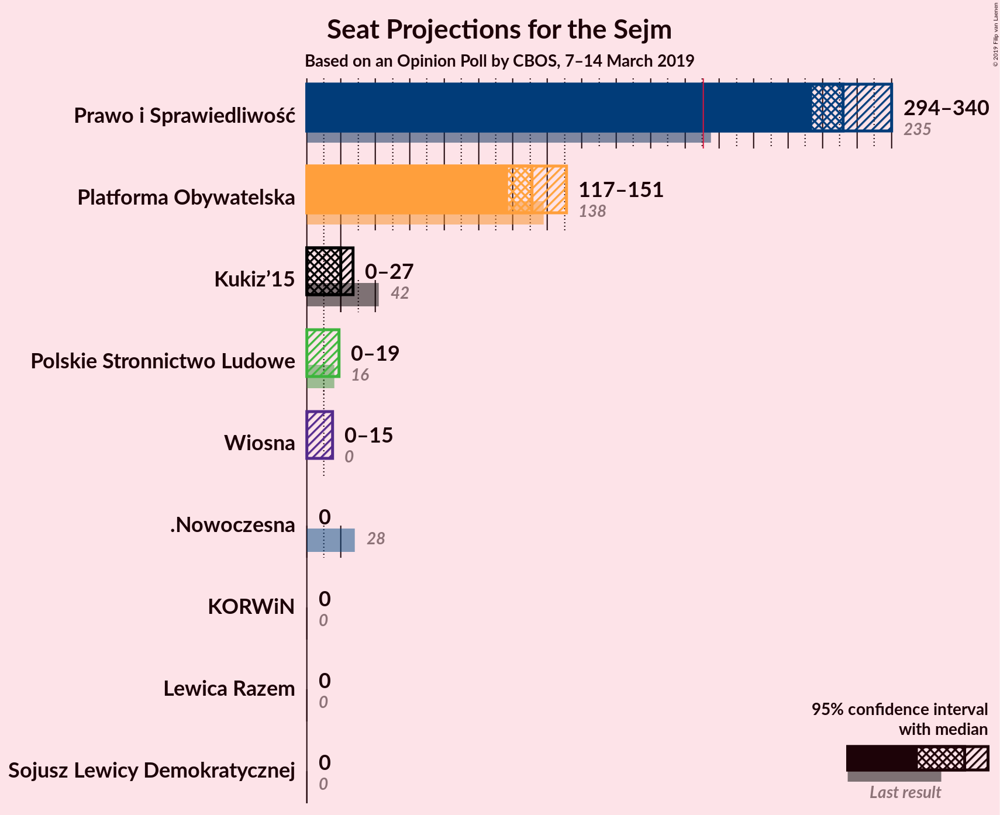
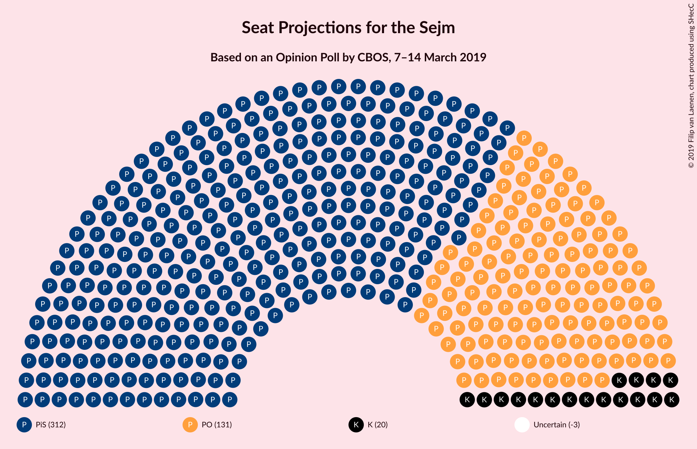
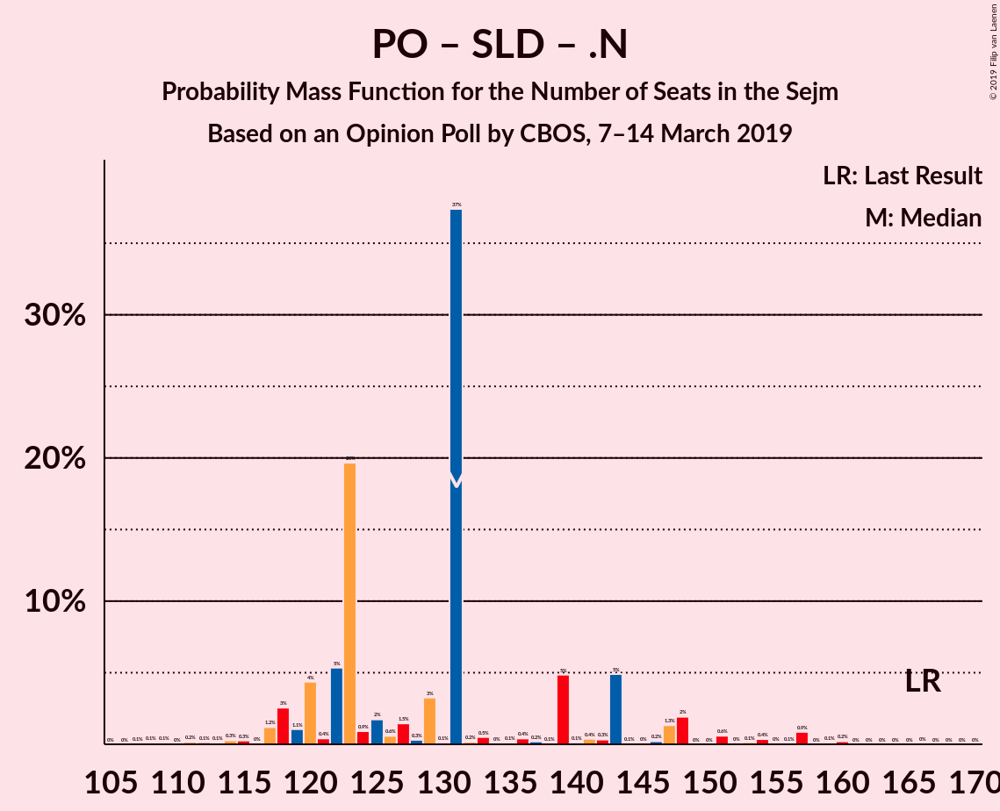

# Opinion Poll by CBOS, 7–14 March 2019

<a href="#voting-intentions">Voting Intentions</a> | <a href="#seats">Seats</a> | <a href="#coalitions">Coalitions</a> | <a href="#technical-information">Technical Information</a>

## Voting Intentions

### Confidence Intervals

| Party | Last Result | Poll Result | 80% Confidence Interval | 90% Confidence Interval | 95% Confidence Interval | 99% Confidence Interval |
|:-----:|:-----------:|:-----------:|:-----------------------:|:-----------------------:|:-----------------------:|:-----------------------:|
| Prawo i Sprawiedliwość | 37.6% | 44.0% | 42.0–46.0% |41.5–46.5% |41.0–47.0% |40.1–48.0% |
| Platforma Obywatelska | 24.1% | 20.0% | 18.5–21.6% |18.0–22.1% |17.7–22.5% |17.0–23.3% |
| Kukiz’15 | 8.8% | 5.0% | 4.2–5.9% |4.0–6.2% |3.8–6.5% |3.5–7.0% |
| Polskie Stronnictwo Ludowe | 5.1% | 4.0% | 3.3–4.9% |3.1–5.2% |3.0–5.4% |2.7–5.9% |
| Wiosna | 0.0% | 4.0% | 3.3–4.9% |3.1–5.2% |3.0–5.4% |2.7–5.9% |
| Sojusz Lewicy Demokratycznej | 7.6% | 3.0% | 2.4–3.8% |2.2–4.0% |2.1–4.2% |1.8–4.6% |
| .Nowoczesna | 7.6% | 2.0% | 1.6–2.7% |1.4–2.9% |1.3–3.1% |1.1–3.4% |
| KORWiN | 4.8% | 1.0% | 0.7–1.5% |0.6–1.6% |0.5–1.8% |0.4–2.0% |
| Lewica Razem | 3.6% | 1.0% | 0.7–1.5% |0.6–1.6% |0.5–1.8% |0.4–2.0% |

*Note:* The poll result column reflects the actual value used in the calculations. Published results may vary slightly, and in addition be rounded to fewer digits.

## Seats

### Confidence Intervals

| Party | Last Result | Median | 80% Confidence Interval | 90% Confidence Interval | 95% Confidence Interval | 99% Confidence Interval |
|:-----:|:-----------:|:------:|:-----------------------:|:-----------------------:|:-----------------------:|:-----------------------:|
| <a href="#prawo-i-sprawiedliwość">Prawo i Sprawiedliwość</a> | 235 | 312 | 303–324 |295–338 |294–340 |285–340 |
| <a href="#platforma-obywatelska">Platforma Obywatelska</a> | 138 | 131 | 120–143 |118–147 |117–151 |111–157 |
| <a href="#kukiz’15">Kukiz’15</a> | 42 | 20 | 0–26 |0–26 |0–27 |0–37 |
| <a href="#polskie-stronnictwo-ludowe">Polskie Stronnictwo Ludowe</a> | 16 | 0 | 0 |0 |0–19 |0–23 |
| <a href="#wiosna">Wiosna</a> | 0 | 0 | 0 |0 |0–15 |0–23 |
| <a href="#sojusz-lewicy-demokratycznej">Sojusz Lewicy Demokratycznej</a> | 0 | 0 | 0 |0 |0 |0 |
| <a href="#.nowoczesna">.Nowoczesna</a> | 28 | 0 | 0 |0 |0 |0 |
| <a href="#korwin">KORWiN</a> | 0 | 0 | 0 |0 |0 |0 |
| <a href="#lewica-razem">Lewica Razem</a> | 0 | 0 | 0 |0 |0 |0 |

### Prawo i Sprawiedliwość

*For a full overview of the results for this party, see the [Prawo i Sprawiedliwość](party-prawoisprawiedliwość.html) page.*

| Number of Seats | Probability | Accumulated | Special Marks |
|:---------------:|:-----------:|:-----------:|:-------------:|
| 235 | 0% | 100% | Last Result |
| 236 | 0% | 100% |  |
| 237 | 0% | 100% |  |
| 238 | 0% | 100% |  |
| 239 | 0% | 100% |  |
| 240 | 0% | 100% |  |
| 241 | 0% | 100% |  |
| 242 | 0% | 100% |  |
| 243 | 0% | 100% |  |
| 244 | 0% | 100% |  |
| 245 | 0% | 100% |  |
| 246 | 0% | 100% |  |
| 247 | 0% | 100% |  |
| 248 | 0% | 100% |  |
| 249 | 0% | 100% |  |
| 250 | 0% | 100% |  |
| 251 | 0% | 100% |  |
| 252 | 0% | 100% |  |
| 253 | 0% | 100% |  |
| 254 | 0% | 100% |  |
| 255 | 0% | 100% |  |
| 256 | 0% | 100% |  |
| 257 | 0% | 100% |  |
| 258 | 0% | 100% |  |
| 259 | 0% | 100% |  |
| 260 | 0% | 100% |  |
| 261 | 0% | 100% |  |
| 262 | 0% | 100% |  |
| 263 | 0% | 100% |  |
| 264 | 0% | 100% |  |
| 265 | 0% | 100% |  |
| 266 | 0% | 100% |  |
| 267 | 0% | 100% |  |
| 268 | 0% | 100% |  |
| 269 | 0% | 100% |  |
| 270 | 0% | 100% |  |
| 271 | 0% | 100% |  |
| 272 | 0% | 100% |  |
| 273 | 0% | 100% |  |
| 274 | 0% | 100% |  |
| 275 | 0.1% | 99.9% |  |
| 276 | 0% | 99.8% |  |
| 277 | 0% | 99.8% |  |
| 278 | 0% | 99.8% |  |
| 279 | 0% | 99.8% |  |
| 280 | 0% | 99.8% |  |
| 281 | 0% | 99.8% |  |
| 282 | 0% | 99.8% |  |
| 283 | 0.2% | 99.8% |  |
| 284 | 0.1% | 99.6% |  |
| 285 | 0% | 99.5% |  |
| 286 | 0.3% | 99.5% |  |
| 287 | 0.1% | 99.2% |  |
| 288 | 0.1% | 99.1% |  |
| 289 | 0.5% | 99.1% |  |
| 290 | 0.2% | 98.6% |  |
| 291 | 0.1% | 98% |  |
| 292 | 0.2% | 98% |  |
| 293 | 0.1% | 98% |  |
| 294 | 3% | 98% |  |
| 295 | 4% | 95% |  |
| 296 | 0.1% | 92% |  |
| 297 | 0.4% | 92% |  |
| 298 | 0.2% | 91% |  |
| 299 | 0.2% | 91% |  |
| 300 | 0.4% | 91% |  |
| 301 | 0.2% | 91% |  |
| 302 | 0.1% | 90% |  |
| 303 | 38% | 90% |  |
| 304 | 0.3% | 52% |  |
| 305 | 0.1% | 52% |  |
| 306 | 0.1% | 51% |  |
| 307 | 0.4% | 51% |  |
| 308 | 0.2% | 51% |  |
| 309 | 0.6% | 51% |  |
| 310 | 0.1% | 50% |  |
| 311 | 0.1% | 50% |  |
| 312 | 3% | 50% | Median |
| 313 | 2% | 47% |  |
| 314 | 0.8% | 45% |  |
| 315 | 3% | 44% |  |
| 316 | 0.2% | 41% |  |
| 317 | 3% | 41% |  |
| 318 | 0% | 38% |  |
| 319 | 0.3% | 38% |  |
| 320 | 0.4% | 38% |  |
| 321 | 5% | 37% |  |
| 322 | 22% | 33% |  |
| 323 | 0.1% | 11% |  |
| 324 | 1.1% | 11% |  |
| 325 | 0% | 9% |  |
| 326 | 0% | 9% |  |
| 327 | 0.5% | 9% |  |
| 328 | 0% | 9% |  |
| 329 | 0% | 9% |  |
| 330 | 0.1% | 9% |  |
| 331 | 0.9% | 9% |  |
| 332 | 0% | 8% |  |
| 333 | 0.7% | 8% |  |
| 334 | 0.3% | 7% |  |
| 335 | 2% | 7% |  |
| 336 | 0.2% | 5% |  |
| 337 | 0.1% | 5% |  |
| 338 | 0.2% | 5% |  |
| 339 | 0.2% | 5% |  |
| 340 | 4% | 5% |  |
| 341 | 0.3% | 0.3% |  |
| 342 | 0% | 0.1% |  |
| 343 | 0% | 0.1% |  |
| 344 | 0% | 0.1% |  |
| 345 | 0% | 0.1% |  |
| 346 | 0% | 0% |  |

### Platforma Obywatelska

*For a full overview of the results for this party, see the [Platforma Obywatelska](party-platformaobywatelska.html) page.*

| Number of Seats | Probability | Accumulated | Special Marks |
|:---------------:|:-----------:|:-----------:|:-------------:|
| 104 | 0% | 100% |  |
| 105 | 0% | 99.9% |  |
| 106 | 0% | 99.9% |  |
| 107 | 0.1% | 99.9% |  |
| 108 | 0.1% | 99.9% |  |
| 109 | 0.1% | 99.8% |  |
| 110 | 0% | 99.6% |  |
| 111 | 0.2% | 99.6% |  |
| 112 | 0.1% | 99.5% |  |
| 113 | 0.1% | 99.3% |  |
| 114 | 0.3% | 99.2% |  |
| 115 | 0.3% | 99.0% |  |
| 116 | 0% | 98.7% |  |
| 117 | 1.2% | 98.6% |  |
| 118 | 3% | 97% |  |
| 119 | 1.1% | 95% |  |
| 120 | 4% | 94% |  |
| 121 | 0.4% | 89% |  |
| 122 | 5% | 89% |  |
| 123 | 20% | 84% |  |
| 124 | 0.9% | 64% |  |
| 125 | 2% | 63% |  |
| 126 | 0.6% | 61% |  |
| 127 | 1.5% | 61% |  |
| 128 | 0.3% | 59% |  |
| 129 | 3% | 59% |  |
| 130 | 0.1% | 56% |  |
| 131 | 37% | 56% | Median |
| 132 | 0.2% | 18% |  |
| 133 | 0.5% | 18% |  |
| 134 | 0% | 18% |  |
| 135 | 0.1% | 17% |  |
| 136 | 0.4% | 17% |  |
| 137 | 0.2% | 17% |  |
| 138 | 0.1% | 17% | Last Result |
| 139 | 5% | 17% |  |
| 140 | 0.1% | 12% |  |
| 141 | 0.4% | 12% |  |
| 142 | 0.3% | 11% |  |
| 143 | 5% | 11% |  |
| 144 | 0.1% | 6% |  |
| 145 | 0% | 6% |  |
| 146 | 0.2% | 6% |  |
| 147 | 1.3% | 6% |  |
| 148 | 2% | 4% |  |
| 149 | 0% | 3% |  |
| 150 | 0% | 3% |  |
| 151 | 0.6% | 3% |  |
| 152 | 0% | 2% |  |
| 153 | 0.1% | 2% |  |
| 154 | 0.4% | 2% |  |
| 155 | 0% | 1.4% |  |
| 156 | 0.1% | 1.3% |  |
| 157 | 0.9% | 1.3% |  |
| 158 | 0% | 0.4% |  |
| 159 | 0.1% | 0.4% |  |
| 160 | 0.2% | 0.3% |  |
| 161 | 0% | 0.1% |  |
| 162 | 0% | 0.1% |  |
| 163 | 0% | 0.1% |  |
| 164 | 0% | 0.1% |  |
| 165 | 0% | 0.1% |  |
| 166 | 0% | 0.1% |  |
| 167 | 0% | 0% |  |

### Kukiz’15

*For a full overview of the results for this party, see the [Kukiz’15](party-kukiz’15.html) page.*

| Number of Seats | Probability | Accumulated | Special Marks |
|:---------------:|:-----------:|:-----------:|:-------------:|
| 0 | 22% | 100% |  |
| 1 | 0% | 78% |  |
| 2 | 0% | 78% |  |
| 3 | 0% | 78% |  |
| 4 | 0% | 78% |  |
| 5 | 0% | 78% |  |
| 6 | 0% | 78% |  |
| 7 | 0% | 78% |  |
| 8 | 0% | 78% |  |
| 9 | 0% | 78% |  |
| 10 | 0% | 78% |  |
| 11 | 0% | 78% |  |
| 12 | 0.1% | 78% |  |
| 13 | 0% | 78% |  |
| 14 | 0.3% | 78% |  |
| 15 | 20% | 77% |  |
| 16 | 0.5% | 58% |  |
| 17 | 0.5% | 57% |  |
| 18 | 2% | 57% |  |
| 19 | 3% | 55% |  |
| 20 | 2% | 52% | Median |
| 21 | 1.4% | 49% |  |
| 22 | 4% | 48% |  |
| 23 | 3% | 44% |  |
| 24 | 0.2% | 41% |  |
| 25 | 0.7% | 41% |  |
| 26 | 37% | 40% |  |
| 27 | 0.2% | 3% |  |
| 28 | 0.7% | 2% |  |
| 29 | 0.1% | 2% |  |
| 30 | 0% | 2% |  |
| 31 | 0.2% | 2% |  |
| 32 | 0.2% | 1.4% |  |
| 33 | 0% | 1.3% |  |
| 34 | 0.3% | 1.3% |  |
| 35 | 0.3% | 0.9% |  |
| 36 | 0.1% | 0.6% |  |
| 37 | 0.4% | 0.5% |  |
| 38 | 0% | 0.2% |  |
| 39 | 0.1% | 0.1% |  |
| 40 | 0% | 0.1% |  |
| 41 | 0% | 0% |  |
| 42 | 0% | 0% | Last Result |

### Polskie Stronnictwo Ludowe

*For a full overview of the results for this party, see the [Polskie Stronnictwo Ludowe](party-polskiestronnictwoludowe.html) page.*

| Number of Seats | Probability | Accumulated | Special Marks |
|:---------------:|:-----------:|:-----------:|:-------------:|
| 0 | 97% | 100% | Median |
| 1 | 0% | 3% |  |
| 2 | 0% | 3% |  |
| 3 | 0% | 3% |  |
| 4 | 0% | 3% |  |
| 5 | 0% | 3% |  |
| 6 | 0% | 3% |  |
| 7 | 0% | 3% |  |
| 8 | 0% | 3% |  |
| 9 | 0% | 3% |  |
| 10 | 0% | 3% |  |
| 11 | 0% | 3% |  |
| 12 | 0% | 3% |  |
| 13 | 0% | 3% |  |
| 14 | 0% | 3% |  |
| 15 | 0% | 3% |  |
| 16 | 0% | 3% | Last Result |
| 17 | 0% | 3% |  |
| 18 | 0% | 3% |  |
| 19 | 0.7% | 3% |  |
| 20 | 0.9% | 2% |  |
| 21 | 0.4% | 1.2% |  |
| 22 | 0.2% | 0.7% |  |
| 23 | 0.3% | 0.5% |  |
| 24 | 0.1% | 0.2% |  |
| 25 | 0.1% | 0.2% |  |
| 26 | 0% | 0.1% |  |
| 27 | 0% | 0.1% |  |
| 28 | 0% | 0% |  |

### Wiosna

*For a full overview of the results for this party, see the [Wiosna](party-wiosna.html) page.*

| Number of Seats | Probability | Accumulated | Special Marks |
|:---------------:|:-----------:|:-----------:|:-------------:|
| 0 | 97% | 100% | Last Result, Median |
| 1 | 0% | 3% |  |
| 2 | 0% | 3% |  |
| 3 | 0% | 3% |  |
| 4 | 0% | 3% |  |
| 5 | 0% | 3% |  |
| 6 | 0% | 3% |  |
| 7 | 0% | 3% |  |
| 8 | 0% | 3% |  |
| 9 | 0% | 3% |  |
| 10 | 0% | 3% |  |
| 11 | 0% | 3% |  |
| 12 | 0% | 3% |  |
| 13 | 0% | 3% |  |
| 14 | 0.3% | 3% |  |
| 15 | 0% | 3% |  |
| 16 | 0.1% | 2% |  |
| 17 | 0% | 2% |  |
| 18 | 0% | 2% |  |
| 19 | 2% | 2% |  |
| 20 | 0.1% | 0.7% |  |
| 21 | 0% | 0.6% |  |
| 22 | 0.1% | 0.6% |  |
| 23 | 0.1% | 0.5% |  |
| 24 | 0.1% | 0.4% |  |
| 25 | 0.1% | 0.3% |  |
| 26 | 0% | 0.2% |  |
| 27 | 0% | 0.2% |  |
| 28 | 0.1% | 0.1% |  |
| 29 | 0% | 0.1% |  |
| 30 | 0% | 0% |  |

### Sojusz Lewicy Demokratycznej

*For a full overview of the results for this party, see the [Sojusz Lewicy Demokratycznej](party-sojuszlewicydemokratycznej.html) page.*

| Number of Seats | Probability | Accumulated | Special Marks |
|:---------------:|:-----------:|:-----------:|:-------------:|
| 0 | 100% | 100% | Last Result, Median |

### .Nowoczesna

*For a full overview of the results for this party, see the [.Nowoczesna](party-nowoczesna.html) page.*

| Number of Seats | Probability | Accumulated | Special Marks |
|:---------------:|:-----------:|:-----------:|:-------------:|
| 0 | 100% | 100% | Median |
| 1 | 0% | 0% |  |
| 2 | 0% | 0% |  |
| 3 | 0% | 0% |  |
| 4 | 0% | 0% |  |
| 5 | 0% | 0% |  |
| 6 | 0% | 0% |  |
| 7 | 0% | 0% |  |
| 8 | 0% | 0% |  |
| 9 | 0% | 0% |  |
| 10 | 0% | 0% |  |
| 11 | 0% | 0% |  |
| 12 | 0% | 0% |  |
| 13 | 0% | 0% |  |
| 14 | 0% | 0% |  |
| 15 | 0% | 0% |  |
| 16 | 0% | 0% |  |
| 17 | 0% | 0% |  |
| 18 | 0% | 0% |  |
| 19 | 0% | 0% |  |
| 20 | 0% | 0% |  |
| 21 | 0% | 0% |  |
| 22 | 0% | 0% |  |
| 23 | 0% | 0% |  |
| 24 | 0% | 0% |  |
| 25 | 0% | 0% |  |
| 26 | 0% | 0% |  |
| 27 | 0% | 0% |  |
| 28 | 0% | 0% | Last Result |

### KORWiN

*For a full overview of the results for this party, see the [KORWiN](party-korwin.html) page.*

| Number of Seats | Probability | Accumulated | Special Marks |
|:---------------:|:-----------:|:-----------:|:-------------:|
| 0 | 100% | 100% | Last Result, Median |

### Lewica Razem

*For a full overview of the results for this party, see the [Lewica Razem](party-lewicarazem.html) page.*

| Number of Seats | Probability | Accumulated | Special Marks |
|:---------------:|:-----------:|:-----------:|:-------------:|
| 0 | 100% | 100% | Last Result, Median |

## Coalitions

### Confidence Intervals

| Coalition | Last Result | Median | Majority? | 80% Confidence Interval | 90% Confidence Interval | 95% Confidence Interval | 99% Confidence Interval |
|:---------:|:-----------:|:------:|:---------:|:-----------------------:|:-----------------------:|:-----------------------:|:-----------------------:|
| Prawo i Sprawiedliwość | 235 | 312 | 100% | 303–324 | 295–338 | 294–340 | 285–340 |
| Platforma Obywatelska – Polskie Stronnictwo Ludowe – Sojusz Lewicy Demokratycznej – .Nowoczesna – Lewica Razem | 182 | 131 | 0% | 121–143 | 119–148 | 118–151 | 112–163 |
| Platforma Obywatelska – Polskie Stronnictwo Ludowe – .Nowoczesna | 182 | 131 | 0% | 121–143 | 119–148 | 118–151 | 112–163 |
| Platforma Obywatelska – Polskie Stronnictwo Ludowe – Sojusz Lewicy Demokratycznej – .Nowoczesna | 182 | 131 | 0% | 121–143 | 119–148 | 118–151 | 112–163 |
| Platforma Obywatelska – .Nowoczesna | 166 | 131 | 0% | 120–143 | 118–147 | 117–151 | 111–157 |
| Platforma Obywatelska – Sojusz Lewicy Demokratycznej – .Nowoczesna | 166 | 131 | 0% | 120–143 | 118–147 | 117–151 | 111–157 |
| Platforma Obywatelska | 138 | 131 | 0% | 120–143 | 118–147 | 117–151 | 111–157 |

### Prawo i Sprawiedliwość

| Number of Seats | Probability | Accumulated | Special Marks |
|:---------------:|:-----------:|:-----------:|:-------------:|
| 235 | 0% | 100% | Last Result |
| 236 | 0% | 100% |  |
| 237 | 0% | 100% |  |
| 238 | 0% | 100% |  |
| 239 | 0% | 100% |  |
| 240 | 0% | 100% |  |
| 241 | 0% | 100% |  |
| 242 | 0% | 100% |  |
| 243 | 0% | 100% |  |
| 244 | 0% | 100% |  |
| 245 | 0% | 100% |  |
| 246 | 0% | 100% |  |
| 247 | 0% | 100% |  |
| 248 | 0% | 100% |  |
| 249 | 0% | 100% |  |
| 250 | 0% | 100% |  |
| 251 | 0% | 100% |  |
| 252 | 0% | 100% |  |
| 253 | 0% | 100% |  |
| 254 | 0% | 100% |  |
| 255 | 0% | 100% |  |
| 256 | 0% | 100% |  |
| 257 | 0% | 100% |  |
| 258 | 0% | 100% |  |
| 259 | 0% | 100% |  |
| 260 | 0% | 100% |  |
| 261 | 0% | 100% |  |
| 262 | 0% | 100% |  |
| 263 | 0% | 100% |  |
| 264 | 0% | 100% |  |
| 265 | 0% | 100% |  |
| 266 | 0% | 100% |  |
| 267 | 0% | 100% |  |
| 268 | 0% | 100% |  |
| 269 | 0% | 100% |  |
| 270 | 0% | 100% |  |
| 271 | 0% | 100% |  |
| 272 | 0% | 100% |  |
| 273 | 0% | 100% |  |
| 274 | 0% | 100% |  |
| 275 | 0.1% | 99.9% |  |
| 276 | 0% | 99.8% |  |
| 277 | 0% | 99.8% |  |
| 278 | 0% | 99.8% |  |
| 279 | 0% | 99.8% |  |
| 280 | 0% | 99.8% |  |
| 281 | 0% | 99.8% |  |
| 282 | 0% | 99.8% |  |
| 283 | 0.2% | 99.8% |  |
| 284 | 0.1% | 99.6% |  |
| 285 | 0% | 99.5% |  |
| 286 | 0.3% | 99.5% |  |
| 287 | 0.1% | 99.2% |  |
| 288 | 0.1% | 99.1% |  |
| 289 | 0.5% | 99.1% |  |
| 290 | 0.2% | 98.6% |  |
| 291 | 0.1% | 98% |  |
| 292 | 0.2% | 98% |  |
| 293 | 0.1% | 98% |  |
| 294 | 3% | 98% |  |
| 295 | 4% | 95% |  |
| 296 | 0.1% | 92% |  |
| 297 | 0.4% | 92% |  |
| 298 | 0.2% | 91% |  |
| 299 | 0.2% | 91% |  |
| 300 | 0.4% | 91% |  |
| 301 | 0.2% | 91% |  |
| 302 | 0.1% | 90% |  |
| 303 | 38% | 90% |  |
| 304 | 0.3% | 52% |  |
| 305 | 0.1% | 52% |  |
| 306 | 0.1% | 51% |  |
| 307 | 0.4% | 51% |  |
| 308 | 0.2% | 51% |  |
| 309 | 0.6% | 51% |  |
| 310 | 0.1% | 50% |  |
| 311 | 0.1% | 50% |  |
| 312 | 3% | 50% | Median |
| 313 | 2% | 47% |  |
| 314 | 0.8% | 45% |  |
| 315 | 3% | 44% |  |
| 316 | 0.2% | 41% |  |
| 317 | 3% | 41% |  |
| 318 | 0% | 38% |  |
| 319 | 0.3% | 38% |  |
| 320 | 0.4% | 38% |  |
| 321 | 5% | 37% |  |
| 322 | 22% | 33% |  |
| 323 | 0.1% | 11% |  |
| 324 | 1.1% | 11% |  |
| 325 | 0% | 9% |  |
| 326 | 0% | 9% |  |
| 327 | 0.5% | 9% |  |
| 328 | 0% | 9% |  |
| 329 | 0% | 9% |  |
| 330 | 0.1% | 9% |  |
| 331 | 0.9% | 9% |  |
| 332 | 0% | 8% |  |
| 333 | 0.7% | 8% |  |
| 334 | 0.3% | 7% |  |
| 335 | 2% | 7% |  |
| 336 | 0.2% | 5% |  |
| 337 | 0.1% | 5% |  |
| 338 | 0.2% | 5% |  |
| 339 | 0.2% | 5% |  |
| 340 | 4% | 5% |  |
| 341 | 0.3% | 0.3% |  |
| 342 | 0% | 0.1% |  |
| 343 | 0% | 0.1% |  |
| 344 | 0% | 0.1% |  |
| 345 | 0% | 0.1% |  |
| 346 | 0% | 0% |  |

### Platforma Obywatelska – Polskie Stronnictwo Ludowe – Sojusz Lewicy Demokratycznej – .Nowoczesna – Lewica Razem

| Number of Seats | Probability | Accumulated | Special Marks |
|:---------------:|:-----------:|:-----------:|:-------------:|
| 105 | 0% | 100% |  |
| 106 | 0% | 99.9% |  |
| 107 | 0% | 99.9% |  |
| 108 | 0.1% | 99.9% |  |
| 109 | 0.1% | 99.8% |  |
| 110 | 0% | 99.7% |  |
| 111 | 0.2% | 99.7% |  |
| 112 | 0.1% | 99.5% |  |
| 113 | 0.1% | 99.4% |  |
| 114 | 0.2% | 99.4% |  |
| 115 | 0.1% | 99.1% |  |
| 116 | 0% | 99.0% |  |
| 117 | 0.9% | 99.0% |  |
| 118 | 3% | 98% |  |
| 119 | 1.0% | 96% |  |
| 120 | 4% | 95% |  |
| 121 | 0.4% | 90% |  |
| 122 | 5% | 90% |  |
| 123 | 20% | 85% |  |
| 124 | 0.8% | 65% |  |
| 125 | 2% | 64% |  |
| 126 | 0.6% | 62% |  |
| 127 | 0.8% | 62% |  |
| 128 | 0.2% | 61% |  |
| 129 | 3% | 61% |  |
| 130 | 0.1% | 58% |  |
| 131 | 37% | 58% | Median |
| 132 | 0.1% | 20% |  |
| 133 | 0.5% | 20% |  |
| 134 | 0.1% | 20% |  |
| 135 | 0.1% | 20% |  |
| 136 | 0.4% | 20% |  |
| 137 | 0.5% | 19% |  |
| 138 | 0.3% | 19% |  |
| 139 | 5% | 18% |  |
| 140 | 0.1% | 13% |  |
| 141 | 0.4% | 13% |  |
| 142 | 0% | 13% |  |
| 143 | 5% | 13% |  |
| 144 | 0.2% | 8% |  |
| 145 | 0.1% | 8% |  |
| 146 | 0.8% | 8% |  |
| 147 | 1.3% | 7% |  |
| 148 | 2% | 6% |  |
| 149 | 0.1% | 3% |  |
| 150 | 0.1% | 3% |  |
| 151 | 0.8% | 3% |  |
| 152 | 0.1% | 2% |  |
| 153 | 0.1% | 2% |  |
| 154 | 0.4% | 2% |  |
| 155 | 0% | 2% |  |
| 156 | 0.1% | 2% |  |
| 157 | 0.9% | 2% |  |
| 158 | 0% | 0.9% |  |
| 159 | 0.1% | 0.9% |  |
| 160 | 0.2% | 0.7% |  |
| 161 | 0% | 0.5% |  |
| 162 | 0% | 0.5% |  |
| 163 | 0.3% | 0.5% |  |
| 164 | 0% | 0.2% |  |
| 165 | 0% | 0.2% |  |
| 166 | 0% | 0.2% |  |
| 167 | 0% | 0.1% |  |
| 168 | 0% | 0.1% |  |
| 169 | 0% | 0.1% |  |
| 170 | 0% | 0.1% |  |
| 171 | 0% | 0.1% |  |
| 172 | 0% | 0% |  |
| 173 | 0% | 0% |  |
| 174 | 0% | 0% |  |
| 175 | 0% | 0% |  |
| 176 | 0% | 0% |  |
| 177 | 0% | 0% |  |
| 178 | 0% | 0% |  |
| 179 | 0% | 0% |  |
| 180 | 0% | 0% |  |
| 181 | 0% | 0% |  |
| 182 | 0% | 0% | Last Result |

### Platforma Obywatelska – Polskie Stronnictwo Ludowe – .Nowoczesna

| Number of Seats | Probability | Accumulated | Special Marks |
|:---------------:|:-----------:|:-----------:|:-------------:|
| 105 | 0% | 100% |  |
| 106 | 0% | 99.9% |  |
| 107 | 0% | 99.9% |  |
| 108 | 0.1% | 99.9% |  |
| 109 | 0.1% | 99.8% |  |
| 110 | 0% | 99.7% |  |
| 111 | 0.2% | 99.7% |  |
| 112 | 0.1% | 99.5% |  |
| 113 | 0.1% | 99.4% |  |
| 114 | 0.2% | 99.3% |  |
| 115 | 0.1% | 99.1% |  |
| 116 | 0% | 99.0% |  |
| 117 | 0.9% | 99.0% |  |
| 118 | 3% | 98% |  |
| 119 | 1.0% | 96% |  |
| 120 | 4% | 95% |  |
| 121 | 0.4% | 90% |  |
| 122 | 5% | 90% |  |
| 123 | 20% | 85% |  |
| 124 | 0.8% | 65% |  |
| 125 | 2% | 64% |  |
| 126 | 0.6% | 62% |  |
| 127 | 0.8% | 62% |  |
| 128 | 0.2% | 61% |  |
| 129 | 3% | 61% |  |
| 130 | 0.1% | 58% |  |
| 131 | 37% | 58% | Median |
| 132 | 0.1% | 20% |  |
| 133 | 0.5% | 20% |  |
| 134 | 0.1% | 20% |  |
| 135 | 0.1% | 20% |  |
| 136 | 0.4% | 20% |  |
| 137 | 0.5% | 19% |  |
| 138 | 0.3% | 19% |  |
| 139 | 5% | 18% |  |
| 140 | 0.1% | 13% |  |
| 141 | 0.4% | 13% |  |
| 142 | 0% | 13% |  |
| 143 | 5% | 13% |  |
| 144 | 0.2% | 8% |  |
| 145 | 0.1% | 8% |  |
| 146 | 0.8% | 8% |  |
| 147 | 1.3% | 7% |  |
| 148 | 2% | 5% |  |
| 149 | 0.1% | 3% |  |
| 150 | 0.1% | 3% |  |
| 151 | 0.8% | 3% |  |
| 152 | 0.1% | 2% |  |
| 153 | 0.1% | 2% |  |
| 154 | 0.4% | 2% |  |
| 155 | 0% | 2% |  |
| 156 | 0.1% | 2% |  |
| 157 | 0.9% | 2% |  |
| 158 | 0% | 0.9% |  |
| 159 | 0.1% | 0.9% |  |
| 160 | 0.2% | 0.7% |  |
| 161 | 0% | 0.5% |  |
| 162 | 0% | 0.5% |  |
| 163 | 0.3% | 0.5% |  |
| 164 | 0% | 0.2% |  |
| 165 | 0% | 0.2% |  |
| 166 | 0% | 0.2% |  |
| 167 | 0% | 0.1% |  |
| 168 | 0% | 0.1% |  |
| 169 | 0% | 0.1% |  |
| 170 | 0% | 0.1% |  |
| 171 | 0% | 0.1% |  |
| 172 | 0% | 0% |  |
| 173 | 0% | 0% |  |
| 174 | 0% | 0% |  |
| 175 | 0% | 0% |  |
| 176 | 0% | 0% |  |
| 177 | 0% | 0% |  |
| 178 | 0% | 0% |  |
| 179 | 0% | 0% |  |
| 180 | 0% | 0% |  |
| 181 | 0% | 0% |  |
| 182 | 0% | 0% | Last Result |

### Platforma Obywatelska – Polskie Stronnictwo Ludowe – Sojusz Lewicy Demokratycznej – .Nowoczesna

| Number of Seats | Probability | Accumulated | Special Marks |
|:---------------:|:-----------:|:-----------:|:-------------:|
| 105 | 0% | 100% |  |
| 106 | 0% | 99.9% |  |
| 107 | 0% | 99.9% |  |
| 108 | 0.1% | 99.9% |  |
| 109 | 0.1% | 99.8% |  |
| 110 | 0% | 99.7% |  |
| 111 | 0.2% | 99.7% |  |
| 112 | 0.1% | 99.5% |  |
| 113 | 0.1% | 99.4% |  |
| 114 | 0.2% | 99.4% |  |
| 115 | 0.1% | 99.1% |  |
| 116 | 0% | 99.0% |  |
| 117 | 0.9% | 99.0% |  |
| 118 | 3% | 98% |  |
| 119 | 1.0% | 96% |  |
| 120 | 4% | 95% |  |
| 121 | 0.4% | 90% |  |
| 122 | 5% | 90% |  |
| 123 | 20% | 85% |  |
| 124 | 0.8% | 65% |  |
| 125 | 2% | 64% |  |
| 126 | 0.6% | 62% |  |
| 127 | 0.8% | 62% |  |
| 128 | 0.2% | 61% |  |
| 129 | 3% | 61% |  |
| 130 | 0.1% | 58% |  |
| 131 | 37% | 58% | Median |
| 132 | 0.1% | 20% |  |
| 133 | 0.5% | 20% |  |
| 134 | 0.1% | 20% |  |
| 135 | 0.1% | 20% |  |
| 136 | 0.4% | 20% |  |
| 137 | 0.5% | 19% |  |
| 138 | 0.3% | 19% |  |
| 139 | 5% | 18% |  |
| 140 | 0.1% | 13% |  |
| 141 | 0.4% | 13% |  |
| 142 | 0% | 13% |  |
| 143 | 5% | 13% |  |
| 144 | 0.2% | 8% |  |
| 145 | 0.1% | 8% |  |
| 146 | 0.8% | 8% |  |
| 147 | 1.3% | 7% |  |
| 148 | 2% | 6% |  |
| 149 | 0.1% | 3% |  |
| 150 | 0.1% | 3% |  |
| 151 | 0.8% | 3% |  |
| 152 | 0.1% | 2% |  |
| 153 | 0.1% | 2% |  |
| 154 | 0.4% | 2% |  |
| 155 | 0% | 2% |  |
| 156 | 0.1% | 2% |  |
| 157 | 0.9% | 2% |  |
| 158 | 0% | 0.9% |  |
| 159 | 0.1% | 0.9% |  |
| 160 | 0.2% | 0.7% |  |
| 161 | 0% | 0.5% |  |
| 162 | 0% | 0.5% |  |
| 163 | 0.3% | 0.5% |  |
| 164 | 0% | 0.2% |  |
| 165 | 0% | 0.2% |  |
| 166 | 0% | 0.2% |  |
| 167 | 0% | 0.1% |  |
| 168 | 0% | 0.1% |  |
| 169 | 0% | 0.1% |  |
| 170 | 0% | 0.1% |  |
| 171 | 0% | 0.1% |  |
| 172 | 0% | 0% |  |
| 173 | 0% | 0% |  |
| 174 | 0% | 0% |  |
| 175 | 0% | 0% |  |
| 176 | 0% | 0% |  |
| 177 | 0% | 0% |  |
| 178 | 0% | 0% |  |
| 179 | 0% | 0% |  |
| 180 | 0% | 0% |  |
| 181 | 0% | 0% |  |
| 182 | 0% | 0% | Last Result |

### Platforma Obywatelska – .Nowoczesna

| Number of Seats | Probability | Accumulated | Special Marks |
|:---------------:|:-----------:|:-----------:|:-------------:|
| 104 | 0% | 100% |  |
| 105 | 0% | 99.9% |  |
| 106 | 0% | 99.9% |  |
| 107 | 0.1% | 99.9% |  |
| 108 | 0.1% | 99.9% |  |
| 109 | 0.1% | 99.8% |  |
| 110 | 0% | 99.6% |  |
| 111 | 0.2% | 99.6% |  |
| 112 | 0.1% | 99.5% |  |
| 113 | 0.1% | 99.3% |  |
| 114 | 0.3% | 99.2% |  |
| 115 | 0.3% | 99.0% |  |
| 116 | 0% | 98.7% |  |
| 117 | 1.2% | 98.6% |  |
| 118 | 3% | 97% |  |
| 119 | 1.1% | 95% |  |
| 120 | 4% | 94% |  |
| 121 | 0.4% | 89% |  |
| 122 | 5% | 89% |  |
| 123 | 20% | 84% |  |
| 124 | 0.9% | 64% |  |
| 125 | 2% | 63% |  |
| 126 | 0.6% | 61% |  |
| 127 | 1.5% | 61% |  |
| 128 | 0.3% | 59% |  |
| 129 | 3% | 59% |  |
| 130 | 0.1% | 56% |  |
| 131 | 37% | 56% | Median |
| 132 | 0.2% | 18% |  |
| 133 | 0.5% | 18% |  |
| 134 | 0% | 18% |  |
| 135 | 0.1% | 17% |  |
| 136 | 0.4% | 17% |  |
| 137 | 0.2% | 17% |  |
| 138 | 0.1% | 17% |  |
| 139 | 5% | 17% |  |
| 140 | 0.1% | 12% |  |
| 141 | 0.4% | 12% |  |
| 142 | 0.3% | 11% |  |
| 143 | 5% | 11% |  |
| 144 | 0.1% | 6% |  |
| 145 | 0% | 6% |  |
| 146 | 0.2% | 6% |  |
| 147 | 1.3% | 6% |  |
| 148 | 2% | 4% |  |
| 149 | 0% | 3% |  |
| 150 | 0% | 3% |  |
| 151 | 0.6% | 3% |  |
| 152 | 0% | 2% |  |
| 153 | 0.1% | 2% |  |
| 154 | 0.4% | 2% |  |
| 155 | 0% | 1.4% |  |
| 156 | 0.1% | 1.3% |  |
| 157 | 0.9% | 1.3% |  |
| 158 | 0% | 0.4% |  |
| 159 | 0.1% | 0.4% |  |
| 160 | 0.2% | 0.3% |  |
| 161 | 0% | 0.1% |  |
| 162 | 0% | 0.1% |  |
| 163 | 0% | 0.1% |  |
| 164 | 0% | 0.1% |  |
| 165 | 0% | 0.1% |  |
| 166 | 0% | 0.1% | Last Result |
| 167 | 0% | 0% |  |

### Platforma Obywatelska – Sojusz Lewicy Demokratycznej – .Nowoczesna

| Number of Seats | Probability | Accumulated | Special Marks |
|:---------------:|:-----------:|:-----------:|:-------------:|
| 105 | 0% | 100% |  |
| 106 | 0% | 99.9% |  |
| 107 | 0.1% | 99.9% |  |
| 108 | 0.1% | 99.9% |  |
| 109 | 0.1% | 99.8% |  |
| 110 | 0% | 99.7% |  |
| 111 | 0.2% | 99.6% |  |
| 112 | 0.1% | 99.5% |  |
| 113 | 0.1% | 99.3% |  |
| 114 | 0.3% | 99.2% |  |
| 115 | 0.3% | 99.0% |  |
| 116 | 0% | 98.7% |  |
| 117 | 1.2% | 98.7% |  |
| 118 | 3% | 97% |  |
| 119 | 1.1% | 95% |  |
| 120 | 4% | 94% |  |
| 121 | 0.4% | 89% |  |
| 122 | 5% | 89% |  |
| 123 | 20% | 84% |  |
| 124 | 0.9% | 64% |  |
| 125 | 2% | 63% |  |
| 126 | 0.6% | 61% |  |
| 127 | 1.5% | 61% |  |
| 128 | 0.3% | 59% |  |
| 129 | 3% | 59% |  |
| 130 | 0.1% | 56% |  |
| 131 | 37% | 56% | Median |
| 132 | 0.2% | 18% |  |
| 133 | 0.5% | 18% |  |
| 134 | 0% | 18% |  |
| 135 | 0.1% | 18% |  |
| 136 | 0.4% | 17% |  |
| 137 | 0.2% | 17% |  |
| 138 | 0.1% | 17% |  |
| 139 | 5% | 17% |  |
| 140 | 0.1% | 12% |  |
| 141 | 0.4% | 12% |  |
| 142 | 0.3% | 11% |  |
| 143 | 5% | 11% |  |
| 144 | 0.1% | 6% |  |
| 145 | 0% | 6% |  |
| 146 | 0.2% | 6% |  |
| 147 | 1.3% | 6% |  |
| 148 | 2% | 4% |  |
| 149 | 0% | 3% |  |
| 150 | 0% | 3% |  |
| 151 | 0.6% | 3% |  |
| 152 | 0% | 2% |  |
| 153 | 0.1% | 2% |  |
| 154 | 0.4% | 2% |  |
| 155 | 0% | 1.4% |  |
| 156 | 0.1% | 1.3% |  |
| 157 | 0.9% | 1.3% |  |
| 158 | 0% | 0.4% |  |
| 159 | 0.1% | 0.4% |  |
| 160 | 0.2% | 0.3% |  |
| 161 | 0% | 0.1% |  |
| 162 | 0% | 0.1% |  |
| 163 | 0% | 0.1% |  |
| 164 | 0% | 0.1% |  |
| 165 | 0% | 0.1% |  |
| 166 | 0% | 0.1% | Last Result |
| 167 | 0% | 0% |  |

### Platforma Obywatelska

| Number of Seats | Probability | Accumulated | Special Marks |
|:---------------:|:-----------:|:-----------:|:-------------:|
| 104 | 0% | 100% |  |
| 105 | 0% | 99.9% |  |
| 106 | 0% | 99.9% |  |
| 107 | 0.1% | 99.9% |  |
| 108 | 0.1% | 99.9% |  |
| 109 | 0.1% | 99.8% |  |
| 110 | 0% | 99.6% |  |
| 111 | 0.2% | 99.6% |  |
| 112 | 0.1% | 99.5% |  |
| 113 | 0.1% | 99.3% |  |
| 114 | 0.3% | 99.2% |  |
| 115 | 0.3% | 99.0% |  |
| 116 | 0% | 98.7% |  |
| 117 | 1.2% | 98.6% |  |
| 118 | 3% | 97% |  |
| 119 | 1.1% | 95% |  |
| 120 | 4% | 94% |  |
| 121 | 0.4% | 89% |  |
| 122 | 5% | 89% |  |
| 123 | 20% | 84% |  |
| 124 | 0.9% | 64% |  |
| 125 | 2% | 63% |  |
| 126 | 0.6% | 61% |  |
| 127 | 1.5% | 61% |  |
| 128 | 0.3% | 59% |  |
| 129 | 3% | 59% |  |
| 130 | 0.1% | 56% |  |
| 131 | 37% | 56% | Median |
| 132 | 0.2% | 18% |  |
| 133 | 0.5% | 18% |  |
| 134 | 0% | 18% |  |
| 135 | 0.1% | 17% |  |
| 136 | 0.4% | 17% |  |
| 137 | 0.2% | 17% |  |
| 138 | 0.1% | 17% | Last Result |
| 139 | 5% | 17% |  |
| 140 | 0.1% | 12% |  |
| 141 | 0.4% | 12% |  |
| 142 | 0.3% | 11% |  |
| 143 | 5% | 11% |  |
| 144 | 0.1% | 6% |  |
| 145 | 0% | 6% |  |
| 146 | 0.2% | 6% |  |
| 147 | 1.3% | 6% |  |
| 148 | 2% | 4% |  |
| 149 | 0% | 3% |  |
| 150 | 0% | 3% |  |
| 151 | 0.6% | 3% |  |
| 152 | 0% | 2% |  |
| 153 | 0.1% | 2% |  |
| 154 | 0.4% | 2% |  |
| 155 | 0% | 1.4% |  |
| 156 | 0.1% | 1.3% |  |
| 157 | 0.9% | 1.3% |  |
| 158 | 0% | 0.4% |  |
| 159 | 0.1% | 0.4% |  |
| 160 | 0.2% | 0.3% |  |
| 161 | 0% | 0.1% |  |
| 162 | 0% | 0.1% |  |
| 163 | 0% | 0.1% |  |
| 164 | 0% | 0.1% |  |
| 165 | 0% | 0.1% |  |
| 166 | 0% | 0.1% |  |
| 167 | 0% | 0% |  |

## Technical Information

### Opinion Poll

+ **Polling firm:** CBOS
+ **Commissioner(s):** —
+ **Fieldwork period:** 7–14 March 2019

### Calculations

+ **Sample size:** 1046
+ **Simulations done:** 131,072
+ **Error estimate:** 2.07%

