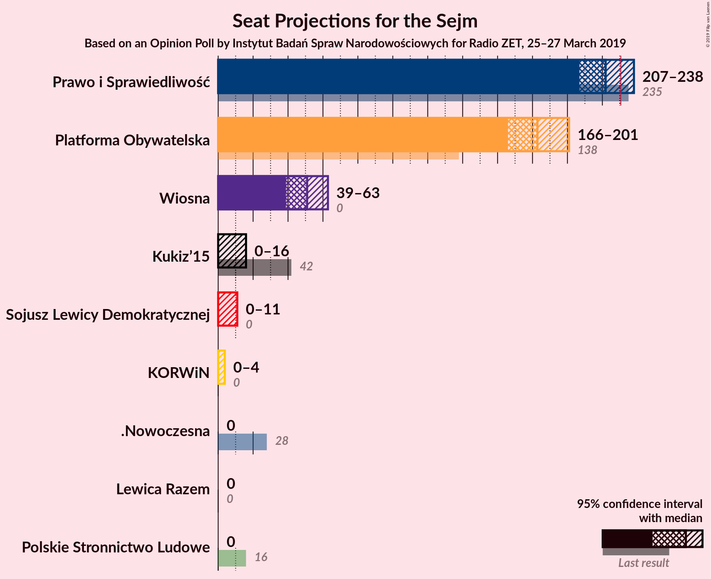
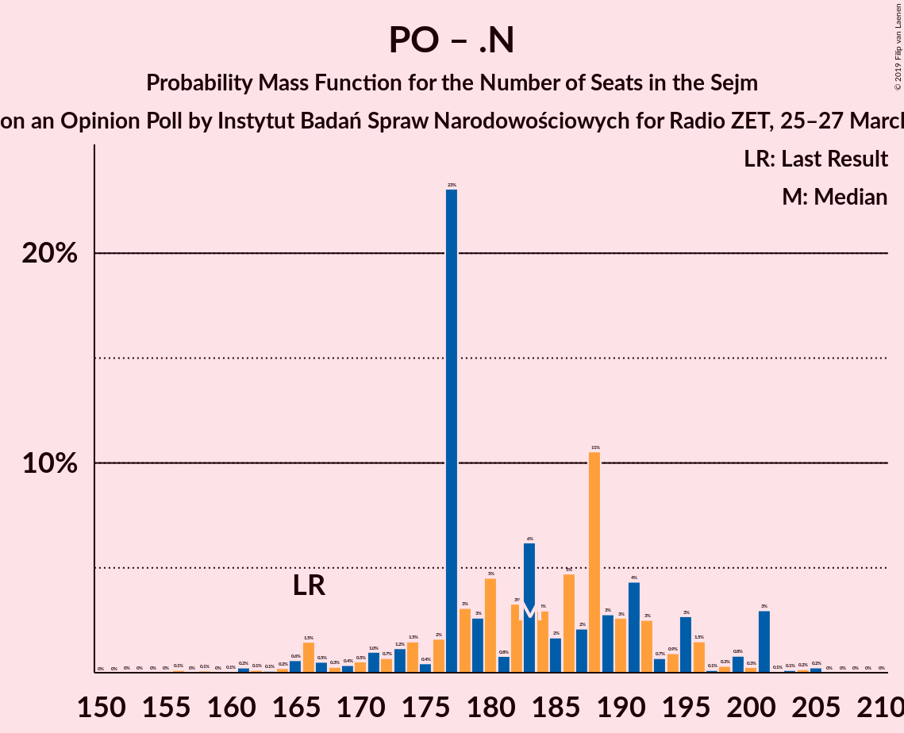
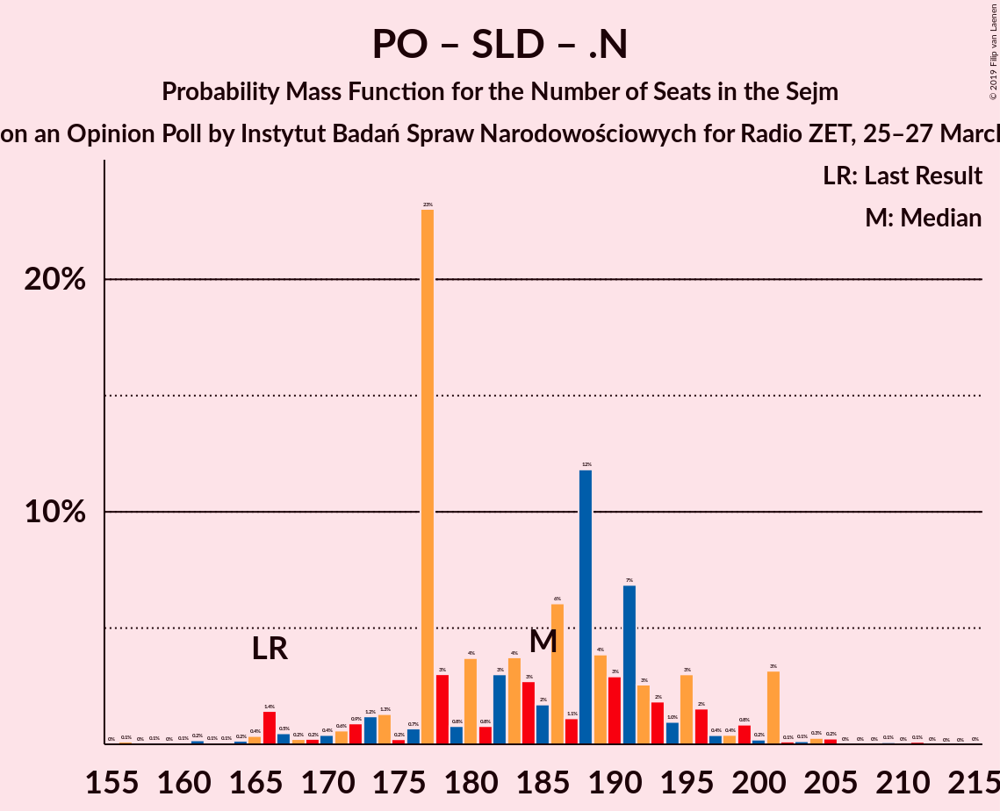

# Opinion Poll by Instytut Badań Spraw Narodowościowych for Radio ZET, 25–27 March 2019

<a href="#voting-intentions">Voting Intentions</a> | <a href="#seats">Seats</a> | <a href="#coalitions">Coalitions</a> | <a href="#technical-information">Technical Information</a>

## Voting Intentions

### Confidence Intervals

| Party | Last Result | Poll Result | 80% Confidence Interval | 90% Confidence Interval | 95% Confidence Interval | 99% Confidence Interval |
|:-----:|:-----------:|:-----------:|:-----------------------:|:-----------------------:|:-----------------------:|:-----------------------:|
| Prawo i Sprawiedliwość | 37.6% | 37.7% | 35.7–39.7% |35.2–40.2% |34.7–40.7% |33.8–41.7% |
| Platforma Obywatelska | 24.1% | 32.6% | 30.7–34.6% |30.2–35.1% |29.8–35.6% |28.9–36.5% |
| Wiosna | 0.0% | 10.9% | 9.8–12.3% |9.4–12.7% |9.1–13.0% |8.6–13.7% |
| Kukiz’15 | 8.8% | 4.8% | 4.0–5.7% |3.8–6.0% |3.6–6.3% |3.3–6.8% |
| Sojusz Lewicy Demokratycznej | 7.6% | 4.2% | 3.5–5.1% |3.3–5.4% |3.1–5.6% |2.8–6.1% |
| KORWiN | 4.8% | 3.7% | 3.0–4.6% |2.8–4.8% |2.7–5.0% |2.4–5.5% |
| Polskie Stronnictwo Ludowe | 5.1% | 3.5% | 2.8–4.3% |2.7–4.6% |2.5–4.8% |2.2–5.3% |
| .Nowoczesna | 7.6% | 1.7% | 1.3–2.3% |1.2–2.5% |1.1–2.7% |0.9–3.0% |
| Lewica Razem | 3.6% | 0.4% | 0.2–0.8% |0.2–0.9% |0.2–1.0% |0.1–1.2% |

*Note:* The poll result column reflects the actual value used in the calculations. Published results may vary slightly, and in addition be rounded to fewer digits.

## Seats

### Confidence Intervals

| Party | Last Result | Median | 80% Confidence Interval | 90% Confidence Interval | 95% Confidence Interval | 99% Confidence Interval |
|:-----:|:-----------:|:------:|:-----------------------:|:-----------------------:|:-----------------------:|:-----------------------:|
| <a href="#prawo-i-sprawiedliwość">Prawo i Sprawiedliwość</a> | 235 | 222 | 212–232 |208–235 |207–238 |201–245 |
| <a href="#platforma-obywatelska">Platforma Obywatelska</a> | 138 | 183 | 176–194 |171–198 |166–201 |161–204 |
| <a href="#wiosna">Wiosna</a> | 0 | 51 | 43–53 |40–60 |39–63 |34–68 |
| <a href="#kukiz’15">Kukiz’15</a> | 42 | 0 | 0–9 |0–11 |0–16 |0–21 |
| <a href="#sojusz-lewicy-demokratycznej">Sojusz Lewicy Demokratycznej</a> | 0 | 0 | 0–7 |0–8 |0–11 |0–14 |
| <a href="#korwin">KORWiN</a> | 0 | 0 | 0 |0 |0–4 |0–7 |
| <a href="#polskie-stronnictwo-ludowe">Polskie Stronnictwo Ludowe</a> | 16 | 0 | 0 |0 |0 |0–16 |
| <a href="#.nowoczesna">.Nowoczesna</a> | 28 | 0 | 0 |0 |0 |0 |
| <a href="#lewica-razem">Lewica Razem</a> | 0 | 0 | 0 |0 |0 |0 |

### Prawo i Sprawiedliwość

*For a full overview of the results for this party, see the [Prawo i Sprawiedliwość](party-prawoisprawiedliwość.html) page.*

| Number of Seats | Probability | Accumulated | Special Marks |
|:---------------:|:-----------:|:-----------:|:-------------:|
| 192 | 0% | 100% |  |
| 193 | 0% | 99.9% |  |
| 194 | 0% | 99.9% |  |
| 195 | 0% | 99.9% |  |
| 196 | 0% | 99.9% |  |
| 197 | 0% | 99.8% |  |
| 198 | 0% | 99.8% |  |
| 199 | 0.2% | 99.8% |  |
| 200 | 0.1% | 99.6% |  |
| 201 | 0.2% | 99.5% |  |
| 202 | 0.1% | 99.3% |  |
| 203 | 0% | 99.2% |  |
| 204 | 0.2% | 99.1% |  |
| 205 | 0.3% | 99.0% |  |
| 206 | 0.5% | 98.7% |  |
| 207 | 1.4% | 98% |  |
| 208 | 3% | 97% |  |
| 209 | 3% | 94% |  |
| 210 | 0.6% | 91% |  |
| 211 | 0.3% | 91% |  |
| 212 | 0.4% | 90% |  |
| 213 | 6% | 90% |  |
| 214 | 3% | 84% |  |
| 215 | 1.3% | 81% |  |
| 216 | 3% | 79% |  |
| 217 | 1.4% | 76% |  |
| 218 | 4% | 75% |  |
| 219 | 11% | 71% |  |
| 220 | 5% | 60% |  |
| 221 | 5% | 55% |  |
| 222 | 3% | 51% | Median |
| 223 | 3% | 48% |  |
| 224 | 3% | 45% |  |
| 225 | 0.5% | 42% |  |
| 226 | 3% | 42% |  |
| 227 | 3% | 39% |  |
| 228 | 0.7% | 36% |  |
| 229 | 0.2% | 36% |  |
| 230 | 4% | 35% |  |
| 231 | 2% | 31% | Majority |
| 232 | 22% | 30% |  |
| 233 | 1.0% | 8% |  |
| 234 | 0.5% | 7% |  |
| 235 | 1.3% | 6% | Last Result |
| 236 | 0.9% | 5% |  |
| 237 | 1.3% | 4% |  |
| 238 | 1.0% | 3% |  |
| 239 | 0.1% | 2% |  |
| 240 | 0.6% | 2% |  |
| 241 | 0.1% | 1.0% |  |
| 242 | 0.2% | 0.9% |  |
| 243 | 0.1% | 0.7% |  |
| 244 | 0% | 0.7% |  |
| 245 | 0.1% | 0.6% |  |
| 246 | 0% | 0.5% |  |
| 247 | 0% | 0.5% |  |
| 248 | 0.1% | 0.4% |  |
| 249 | 0.2% | 0.3% |  |
| 250 | 0% | 0.1% |  |
| 251 | 0% | 0.1% |  |
| 252 | 0% | 0.1% |  |
| 253 | 0% | 0.1% |  |
| 254 | 0% | 0% |  |

### Platforma Obywatelska

*For a full overview of the results for this party, see the [Platforma Obywatelska](party-platformaobywatelska.html) page.*

| Number of Seats | Probability | Accumulated | Special Marks |
|:---------------:|:-----------:|:-----------:|:-------------:|
| 138 | 0% | 100% | Last Result |
| 139 | 0% | 100% |  |
| 140 | 0% | 100% |  |
| 141 | 0% | 100% |  |
| 142 | 0% | 100% |  |
| 143 | 0% | 100% |  |
| 144 | 0% | 100% |  |
| 145 | 0% | 100% |  |
| 146 | 0% | 100% |  |
| 147 | 0% | 100% |  |
| 148 | 0% | 100% |  |
| 149 | 0% | 100% |  |
| 150 | 0% | 100% |  |
| 151 | 0% | 100% |  |
| 152 | 0% | 100% |  |
| 153 | 0% | 100% |  |
| 154 | 0% | 100% |  |
| 155 | 0% | 99.9% |  |
| 156 | 0.1% | 99.9% |  |
| 157 | 0% | 99.8% |  |
| 158 | 0.1% | 99.8% |  |
| 159 | 0% | 99.7% |  |
| 160 | 0.1% | 99.6% |  |
| 161 | 0.2% | 99.6% |  |
| 162 | 0.1% | 99.3% |  |
| 163 | 0.1% | 99.2% |  |
| 164 | 0.2% | 99.1% |  |
| 165 | 0.6% | 98.9% |  |
| 166 | 1.5% | 98% |  |
| 167 | 0.5% | 97% |  |
| 168 | 0.3% | 96% |  |
| 169 | 0.4% | 96% |  |
| 170 | 0.5% | 96% |  |
| 171 | 1.0% | 95% |  |
| 172 | 0.7% | 94% |  |
| 173 | 1.2% | 93% |  |
| 174 | 1.5% | 92% |  |
| 175 | 0.4% | 91% |  |
| 176 | 2% | 90% |  |
| 177 | 23% | 89% |  |
| 178 | 3% | 66% |  |
| 179 | 3% | 63% |  |
| 180 | 5% | 60% |  |
| 181 | 0.8% | 56% |  |
| 182 | 3% | 55% |  |
| 183 | 6% | 51% | Median |
| 184 | 3% | 45% |  |
| 185 | 2% | 42% |  |
| 186 | 5% | 41% |  |
| 187 | 2% | 36% |  |
| 188 | 11% | 34% |  |
| 189 | 3% | 23% |  |
| 190 | 3% | 20% |  |
| 191 | 4% | 18% |  |
| 192 | 3% | 14% |  |
| 193 | 0.7% | 11% |  |
| 194 | 0.9% | 10% |  |
| 195 | 3% | 9% |  |
| 196 | 1.5% | 7% |  |
| 197 | 0.1% | 5% |  |
| 198 | 0.3% | 5% |  |
| 199 | 0.8% | 5% |  |
| 200 | 0.3% | 4% |  |
| 201 | 3% | 4% |  |
| 202 | 0.1% | 0.7% |  |
| 203 | 0.1% | 0.7% |  |
| 204 | 0.2% | 0.5% |  |
| 205 | 0.2% | 0.4% |  |
| 206 | 0% | 0.1% |  |
| 207 | 0% | 0.1% |  |
| 208 | 0% | 0.1% |  |
| 209 | 0% | 0.1% |  |
| 210 | 0% | 0% |  |

### Wiosna

*For a full overview of the results for this party, see the [Wiosna](party-wiosna.html) page.*

| Number of Seats | Probability | Accumulated | Special Marks |
|:---------------:|:-----------:|:-----------:|:-------------:|
| 0 | 0% | 100% | Last Result |
| 1 | 0% | 100% |  |
| 2 | 0% | 100% |  |
| 3 | 0% | 100% |  |
| 4 | 0% | 100% |  |
| 5 | 0% | 100% |  |
| 6 | 0% | 100% |  |
| 7 | 0% | 100% |  |
| 8 | 0% | 100% |  |
| 9 | 0% | 100% |  |
| 10 | 0% | 100% |  |
| 11 | 0% | 100% |  |
| 12 | 0% | 100% |  |
| 13 | 0% | 100% |  |
| 14 | 0% | 100% |  |
| 15 | 0% | 100% |  |
| 16 | 0% | 100% |  |
| 17 | 0% | 100% |  |
| 18 | 0% | 100% |  |
| 19 | 0% | 100% |  |
| 20 | 0% | 100% |  |
| 21 | 0% | 100% |  |
| 22 | 0% | 100% |  |
| 23 | 0% | 100% |  |
| 24 | 0% | 100% |  |
| 25 | 0% | 100% |  |
| 26 | 0% | 100% |  |
| 27 | 0% | 100% |  |
| 28 | 0% | 100% |  |
| 29 | 0% | 100% |  |
| 30 | 0% | 100% |  |
| 31 | 0.1% | 100% |  |
| 32 | 0.1% | 99.9% |  |
| 33 | 0.3% | 99.8% |  |
| 34 | 0.1% | 99.5% |  |
| 35 | 0.9% | 99.5% |  |
| 36 | 0.3% | 98.5% |  |
| 37 | 0.3% | 98% |  |
| 38 | 0.3% | 98% |  |
| 39 | 1.4% | 98% |  |
| 40 | 1.4% | 96% |  |
| 41 | 0.7% | 95% |  |
| 42 | 4% | 94% |  |
| 43 | 4% | 90% |  |
| 44 | 2% | 86% |  |
| 45 | 4% | 84% |  |
| 46 | 4% | 80% |  |
| 47 | 5% | 76% |  |
| 48 | 2% | 71% |  |
| 49 | 3% | 69% |  |
| 50 | 9% | 66% |  |
| 51 | 32% | 56% | Median |
| 52 | 4% | 24% |  |
| 53 | 10% | 20% |  |
| 54 | 0.3% | 10% |  |
| 55 | 0.5% | 10% |  |
| 56 | 1.0% | 9% |  |
| 57 | 2% | 8% |  |
| 58 | 0.1% | 7% |  |
| 59 | 0.9% | 6% |  |
| 60 | 0.9% | 6% |  |
| 61 | 0.8% | 5% |  |
| 62 | 1.0% | 4% |  |
| 63 | 2% | 3% |  |
| 64 | 0.3% | 1.1% |  |
| 65 | 0.1% | 0.8% |  |
| 66 | 0.2% | 0.8% |  |
| 67 | 0% | 0.5% |  |
| 68 | 0.1% | 0.5% |  |
| 69 | 0% | 0.4% |  |
| 70 | 0.3% | 0.4% |  |
| 71 | 0% | 0.1% |  |
| 72 | 0% | 0.1% |  |
| 73 | 0.1% | 0.1% |  |
| 74 | 0% | 0% |  |

### Kukiz’15

*For a full overview of the results for this party, see the [Kukiz’15](party-kukiz’15.html) page.*

| Number of Seats | Probability | Accumulated | Special Marks |
|:---------------:|:-----------:|:-----------:|:-------------:|
| 0 | 71% | 100% | Median |
| 1 | 0% | 29% |  |
| 2 | 0% | 29% |  |
| 3 | 0% | 29% |  |
| 4 | 0% | 29% |  |
| 5 | 0% | 29% |  |
| 6 | 2% | 29% |  |
| 7 | 8% | 27% |  |
| 8 | 4% | 20% |  |
| 9 | 7% | 15% |  |
| 10 | 2% | 9% |  |
| 11 | 3% | 7% |  |
| 12 | 0.1% | 4% |  |
| 13 | 0.2% | 4% |  |
| 14 | 0.6% | 4% |  |
| 15 | 0.1% | 3% |  |
| 16 | 1.1% | 3% |  |
| 17 | 0.2% | 2% |  |
| 18 | 0.1% | 2% |  |
| 19 | 0.9% | 2% |  |
| 20 | 0.1% | 0.7% |  |
| 21 | 0.2% | 0.5% |  |
| 22 | 0.2% | 0.3% |  |
| 23 | 0% | 0.2% |  |
| 24 | 0% | 0.1% |  |
| 25 | 0% | 0.1% |  |
| 26 | 0% | 0.1% |  |
| 27 | 0% | 0.1% |  |
| 28 | 0% | 0% |  |
| 29 | 0% | 0% |  |
| 30 | 0% | 0% |  |
| 31 | 0% | 0% |  |
| 32 | 0% | 0% |  |
| 33 | 0% | 0% |  |
| 34 | 0% | 0% |  |
| 35 | 0% | 0% |  |
| 36 | 0% | 0% |  |
| 37 | 0% | 0% |  |
| 38 | 0% | 0% |  |
| 39 | 0% | 0% |  |
| 40 | 0% | 0% |  |
| 41 | 0% | 0% |  |
| 42 | 0% | 0% | Last Result |

### Sojusz Lewicy Demokratycznej

*For a full overview of the results for this party, see the [Sojusz Lewicy Demokratycznej](party-sojuszlewicydemokratycznej.html) page.*

| Number of Seats | Probability | Accumulated | Special Marks |
|:---------------:|:-----------:|:-----------:|:-------------:|
| 0 | 88% | 100% | Last Result, Median |
| 1 | 0% | 12% |  |
| 2 | 0% | 12% |  |
| 3 | 0% | 12% |  |
| 4 | 0.1% | 12% |  |
| 5 | 0% | 12% |  |
| 6 | 1.1% | 12% |  |
| 7 | 2% | 11% |  |
| 8 | 4% | 9% |  |
| 9 | 1.5% | 5% |  |
| 10 | 0.3% | 3% |  |
| 11 | 0.8% | 3% |  |
| 12 | 0.1% | 2% |  |
| 13 | 2% | 2% |  |
| 14 | 0.1% | 0.6% |  |
| 15 | 0.1% | 0.5% |  |
| 16 | 0% | 0.4% |  |
| 17 | 0.1% | 0.3% |  |
| 18 | 0% | 0.2% |  |
| 19 | 0% | 0.2% |  |
| 20 | 0% | 0.2% |  |
| 21 | 0% | 0.1% |  |
| 22 | 0% | 0.1% |  |
| 23 | 0% | 0.1% |  |
| 24 | 0% | 0% |  |

### KORWiN

*For a full overview of the results for this party, see the [KORWiN](party-korwin.html) page.*

| Number of Seats | Probability | Accumulated | Special Marks |
|:---------------:|:-----------:|:-----------:|:-------------:|
| 0 | 97% | 100% | Last Result, Median |
| 1 | 0% | 3% |  |
| 2 | 0% | 3% |  |
| 3 | 0% | 3% |  |
| 4 | 0.7% | 3% |  |
| 5 | 1.2% | 2% |  |
| 6 | 0.1% | 1.0% |  |
| 7 | 0.4% | 0.9% |  |
| 8 | 0.1% | 0.4% |  |
| 9 | 0.1% | 0.3% |  |
| 10 | 0% | 0.2% |  |
| 11 | 0% | 0.2% |  |
| 12 | 0.2% | 0.2% |  |
| 13 | 0% | 0% |  |

### Polskie Stronnictwo Ludowe

*For a full overview of the results for this party, see the [Polskie Stronnictwo Ludowe](party-polskiestronnictwoludowe.html) page.*

| Number of Seats | Probability | Accumulated | Special Marks |
|:---------------:|:-----------:|:-----------:|:-------------:|
| 0 | 99.1% | 100% | Median |
| 1 | 0% | 0.9% |  |
| 2 | 0% | 0.9% |  |
| 3 | 0% | 0.9% |  |
| 4 | 0% | 0.9% |  |
| 5 | 0% | 0.9% |  |
| 6 | 0% | 0.9% |  |
| 7 | 0% | 0.9% |  |
| 8 | 0% | 0.9% |  |
| 9 | 0% | 0.9% |  |
| 10 | 0% | 0.9% |  |
| 11 | 0% | 0.9% |  |
| 12 | 0% | 0.9% |  |
| 13 | 0% | 0.9% |  |
| 14 | 0.3% | 0.9% |  |
| 15 | 0% | 0.5% |  |
| 16 | 0.1% | 0.5% | Last Result |
| 17 | 0.2% | 0.4% |  |
| 18 | 0% | 0.2% |  |
| 19 | 0.2% | 0.2% |  |
| 20 | 0% | 0% |  |

### .Nowoczesna

*For a full overview of the results for this party, see the [.Nowoczesna](party-nowoczesna.html) page.*

| Number of Seats | Probability | Accumulated | Special Marks |
|:---------------:|:-----------:|:-----------:|:-------------:|
| 0 | 100% | 100% | Median |
| 1 | 0% | 0% |  |
| 2 | 0% | 0% |  |
| 3 | 0% | 0% |  |
| 4 | 0% | 0% |  |
| 5 | 0% | 0% |  |
| 6 | 0% | 0% |  |
| 7 | 0% | 0% |  |
| 8 | 0% | 0% |  |
| 9 | 0% | 0% |  |
| 10 | 0% | 0% |  |
| 11 | 0% | 0% |  |
| 12 | 0% | 0% |  |
| 13 | 0% | 0% |  |
| 14 | 0% | 0% |  |
| 15 | 0% | 0% |  |
| 16 | 0% | 0% |  |
| 17 | 0% | 0% |  |
| 18 | 0% | 0% |  |
| 19 | 0% | 0% |  |
| 20 | 0% | 0% |  |
| 21 | 0% | 0% |  |
| 22 | 0% | 0% |  |
| 23 | 0% | 0% |  |
| 24 | 0% | 0% |  |
| 25 | 0% | 0% |  |
| 26 | 0% | 0% |  |
| 27 | 0% | 0% |  |
| 28 | 0% | 0% | Last Result |

### Lewica Razem

*For a full overview of the results for this party, see the [Lewica Razem](party-lewicarazem.html) page.*

| Number of Seats | Probability | Accumulated | Special Marks |
|:---------------:|:-----------:|:-----------:|:-------------:|
| 0 | 100% | 100% | Last Result, Median |

## Coalitions

### Confidence Intervals

| Coalition | Last Result | Median | Majority? | 80% Confidence Interval | 90% Confidence Interval | 95% Confidence Interval | 99% Confidence Interval |
|:---------:|:-----------:|:------:|:---------:|:-----------------------:|:-----------------------:|:-----------------------:|:-----------------------:|
| Prawo i Sprawiedliwość | 235 | 222 | 31% | 212–232 | 208–235 | 207–238 | 201–245 |
| Platforma Obywatelska – Sojusz Lewicy Demokratycznej – Polskie Stronnictwo Ludowe – .Nowoczesna – Lewica Razem | 182 | 185 | 0% | 177–195 | 172–199 | 166–201 | 162–205 |
| Platforma Obywatelska – .Nowoczesna | 166 | 183 | 0% | 176–194 | 171–198 | 166–201 | 161–204 |
| Platforma Obywatelska – Polskie Stronnictwo Ludowe – .Nowoczesna | 182 | 183 | 0% | 176–194 | 171–199 | 166–201 | 161–204 |
| Platforma Obywatelska – Sojusz Lewicy Demokratycznej – Polskie Stronnictwo Ludowe – .Nowoczesna | 182 | 185 | 0% | 177–195 | 172–199 | 166–201 | 162–205 |
| Platforma Obywatelska – Sojusz Lewicy Demokratycznej – .Nowoczesna | 166 | 185 | 0% | 177–195 | 172–199 | 166–201 | 161–205 |
| Platforma Obywatelska | 138 | 183 | 0% | 176–194 | 171–198 | 166–201 | 161–204 |

### Prawo i Sprawiedliwość

| Number of Seats | Probability | Accumulated | Special Marks |
|:---------------:|:-----------:|:-----------:|:-------------:|
| 192 | 0% | 100% |  |
| 193 | 0% | 99.9% |  |
| 194 | 0% | 99.9% |  |
| 195 | 0% | 99.9% |  |
| 196 | 0% | 99.9% |  |
| 197 | 0% | 99.8% |  |
| 198 | 0% | 99.8% |  |
| 199 | 0.2% | 99.8% |  |
| 200 | 0.1% | 99.6% |  |
| 201 | 0.2% | 99.5% |  |
| 202 | 0.1% | 99.3% |  |
| 203 | 0% | 99.2% |  |
| 204 | 0.2% | 99.1% |  |
| 205 | 0.3% | 99.0% |  |
| 206 | 0.5% | 98.7% |  |
| 207 | 1.4% | 98% |  |
| 208 | 3% | 97% |  |
| 209 | 3% | 94% |  |
| 210 | 0.6% | 91% |  |
| 211 | 0.3% | 91% |  |
| 212 | 0.4% | 90% |  |
| 213 | 6% | 90% |  |
| 214 | 3% | 84% |  |
| 215 | 1.3% | 81% |  |
| 216 | 3% | 79% |  |
| 217 | 1.4% | 76% |  |
| 218 | 4% | 75% |  |
| 219 | 11% | 71% |  |
| 220 | 5% | 60% |  |
| 221 | 5% | 55% |  |
| 222 | 3% | 51% | Median |
| 223 | 3% | 48% |  |
| 224 | 3% | 45% |  |
| 225 | 0.5% | 42% |  |
| 226 | 3% | 42% |  |
| 227 | 3% | 39% |  |
| 228 | 0.7% | 36% |  |
| 229 | 0.2% | 36% |  |
| 230 | 4% | 35% |  |
| 231 | 2% | 31% | Majority |
| 232 | 22% | 30% |  |
| 233 | 1.0% | 8% |  |
| 234 | 0.5% | 7% |  |
| 235 | 1.3% | 6% | Last Result |
| 236 | 0.9% | 5% |  |
| 237 | 1.3% | 4% |  |
| 238 | 1.0% | 3% |  |
| 239 | 0.1% | 2% |  |
| 240 | 0.6% | 2% |  |
| 241 | 0.1% | 1.0% |  |
| 242 | 0.2% | 0.9% |  |
| 243 | 0.1% | 0.7% |  |
| 244 | 0% | 0.7% |  |
| 245 | 0.1% | 0.6% |  |
| 246 | 0% | 0.5% |  |
| 247 | 0% | 0.5% |  |
| 248 | 0.1% | 0.4% |  |
| 249 | 0.2% | 0.3% |  |
| 250 | 0% | 0.1% |  |
| 251 | 0% | 0.1% |  |
| 252 | 0% | 0.1% |  |
| 253 | 0% | 0.1% |  |
| 254 | 0% | 0% |  |

### Platforma Obywatelska – Sojusz Lewicy Demokratycznej – Polskie Stronnictwo Ludowe – .Nowoczesna – Lewica Razem

| Number of Seats | Probability | Accumulated | Special Marks |
|:---------------:|:-----------:|:-----------:|:-------------:|
| 156 | 0.1% | 100% |  |
| 157 | 0% | 99.8% |  |
| 158 | 0.1% | 99.8% |  |
| 159 | 0% | 99.7% |  |
| 160 | 0% | 99.7% |  |
| 161 | 0.2% | 99.7% |  |
| 162 | 0.1% | 99.5% |  |
| 163 | 0% | 99.4% |  |
| 164 | 0.2% | 99.4% |  |
| 165 | 0.4% | 99.2% |  |
| 166 | 1.4% | 98.9% |  |
| 167 | 0.5% | 97% |  |
| 168 | 0.2% | 97% |  |
| 169 | 0.2% | 97% |  |
| 170 | 0.4% | 97% |  |
| 171 | 0.6% | 96% |  |
| 172 | 0.9% | 96% |  |
| 173 | 1.2% | 95% |  |
| 174 | 1.3% | 93% |  |
| 175 | 0.2% | 92% |  |
| 176 | 0.5% | 92% |  |
| 177 | 23% | 91% |  |
| 178 | 3% | 69% |  |
| 179 | 0.8% | 66% |  |
| 180 | 4% | 65% |  |
| 181 | 0.8% | 61% |  |
| 182 | 3% | 60% | Last Result |
| 183 | 4% | 57% | Median |
| 184 | 3% | 54% |  |
| 185 | 2% | 51% |  |
| 186 | 6% | 49% |  |
| 187 | 1.0% | 43% |  |
| 188 | 12% | 42% |  |
| 189 | 4% | 30% |  |
| 190 | 3% | 27% |  |
| 191 | 7% | 24% |  |
| 192 | 3% | 17% |  |
| 193 | 2% | 14% |  |
| 194 | 1.0% | 12% |  |
| 195 | 3% | 11% |  |
| 196 | 2% | 8% |  |
| 197 | 0.4% | 7% |  |
| 198 | 0.5% | 6% |  |
| 199 | 0.9% | 6% |  |
| 200 | 0.2% | 5% |  |
| 201 | 3% | 5% |  |
| 202 | 0.2% | 1.5% |  |
| 203 | 0.2% | 1.2% |  |
| 204 | 0.4% | 1.1% |  |
| 205 | 0.2% | 0.6% |  |
| 206 | 0% | 0.4% |  |
| 207 | 0% | 0.4% |  |
| 208 | 0% | 0.3% |  |
| 209 | 0.1% | 0.3% |  |
| 210 | 0% | 0.2% |  |
| 211 | 0.1% | 0.2% |  |
| 212 | 0% | 0.1% |  |
| 213 | 0% | 0.1% |  |
| 214 | 0% | 0.1% |  |
| 215 | 0% | 0% |  |

### Platforma Obywatelska – .Nowoczesna

| Number of Seats | Probability | Accumulated | Special Marks |
|:---------------:|:-----------:|:-----------:|:-------------:|
| 154 | 0% | 100% |  |
| 155 | 0% | 99.9% |  |
| 156 | 0.1% | 99.9% |  |
| 157 | 0% | 99.8% |  |
| 158 | 0.1% | 99.8% |  |
| 159 | 0% | 99.7% |  |
| 160 | 0.1% | 99.6% |  |
| 161 | 0.2% | 99.6% |  |
| 162 | 0.1% | 99.3% |  |
| 163 | 0.1% | 99.2% |  |
| 164 | 0.2% | 99.1% |  |
| 165 | 0.6% | 98.9% |  |
| 166 | 1.5% | 98% | Last Result |
| 167 | 0.5% | 97% |  |
| 168 | 0.3% | 96% |  |
| 169 | 0.4% | 96% |  |
| 170 | 0.5% | 96% |  |
| 171 | 1.0% | 95% |  |
| 172 | 0.7% | 94% |  |
| 173 | 1.2% | 93% |  |
| 174 | 1.5% | 92% |  |
| 175 | 0.4% | 91% |  |
| 176 | 2% | 90% |  |
| 177 | 23% | 89% |  |
| 178 | 3% | 66% |  |
| 179 | 3% | 63% |  |
| 180 | 5% | 60% |  |
| 181 | 0.8% | 56% |  |
| 182 | 3% | 55% |  |
| 183 | 6% | 51% | Median |
| 184 | 3% | 45% |  |
| 185 | 2% | 42% |  |
| 186 | 5% | 41% |  |
| 187 | 2% | 36% |  |
| 188 | 11% | 34% |  |
| 189 | 3% | 23% |  |
| 190 | 3% | 20% |  |
| 191 | 4% | 18% |  |
| 192 | 3% | 14% |  |
| 193 | 0.7% | 11% |  |
| 194 | 0.9% | 10% |  |
| 195 | 3% | 9% |  |
| 196 | 1.5% | 7% |  |
| 197 | 0.1% | 5% |  |
| 198 | 0.3% | 5% |  |
| 199 | 0.8% | 5% |  |
| 200 | 0.3% | 4% |  |
| 201 | 3% | 4% |  |
| 202 | 0.1% | 0.7% |  |
| 203 | 0.1% | 0.7% |  |
| 204 | 0.2% | 0.5% |  |
| 205 | 0.2% | 0.4% |  |
| 206 | 0% | 0.1% |  |
| 207 | 0% | 0.1% |  |
| 208 | 0% | 0.1% |  |
| 209 | 0% | 0.1% |  |
| 210 | 0% | 0% |  |

### Platforma Obywatelska – Polskie Stronnictwo Ludowe – .Nowoczesna

| Number of Seats | Probability | Accumulated | Special Marks |
|:---------------:|:-----------:|:-----------:|:-------------:|
| 155 | 0% | 100% |  |
| 156 | 0.1% | 99.9% |  |
| 157 | 0% | 99.8% |  |
| 158 | 0.1% | 99.8% |  |
| 159 | 0% | 99.7% |  |
| 160 | 0% | 99.7% |  |
| 161 | 0.2% | 99.6% |  |
| 162 | 0.1% | 99.4% |  |
| 163 | 0.1% | 99.3% |  |
| 164 | 0.2% | 99.2% |  |
| 165 | 0.6% | 99.0% |  |
| 166 | 1.5% | 98% |  |
| 167 | 0.5% | 97% |  |
| 168 | 0.3% | 96% |  |
| 169 | 0.3% | 96% |  |
| 170 | 0.5% | 96% |  |
| 171 | 1.0% | 95% |  |
| 172 | 0.7% | 94% |  |
| 173 | 1.2% | 94% |  |
| 174 | 1.5% | 92% |  |
| 175 | 0.4% | 91% |  |
| 176 | 1.5% | 91% |  |
| 177 | 23% | 89% |  |
| 178 | 3% | 66% |  |
| 179 | 3% | 63% |  |
| 180 | 5% | 60% |  |
| 181 | 0.8% | 56% |  |
| 182 | 3% | 55% | Last Result |
| 183 | 6% | 52% | Median |
| 184 | 3% | 46% |  |
| 185 | 2% | 43% |  |
| 186 | 5% | 41% |  |
| 187 | 2% | 36% |  |
| 188 | 11% | 35% |  |
| 189 | 3% | 24% |  |
| 190 | 3% | 21% |  |
| 191 | 4% | 18% |  |
| 192 | 3% | 14% |  |
| 193 | 0.7% | 12% |  |
| 194 | 0.9% | 11% |  |
| 195 | 3% | 10% |  |
| 196 | 2% | 7% |  |
| 197 | 0.1% | 6% |  |
| 198 | 0.4% | 5% |  |
| 199 | 0.8% | 5% |  |
| 200 | 0.3% | 4% |  |
| 201 | 3% | 4% |  |
| 202 | 0.2% | 1.0% |  |
| 203 | 0.2% | 0.9% |  |
| 204 | 0.3% | 0.7% |  |
| 205 | 0.2% | 0.4% |  |
| 206 | 0% | 0.1% |  |
| 207 | 0% | 0.1% |  |
| 208 | 0% | 0.1% |  |
| 209 | 0% | 0.1% |  |
| 210 | 0% | 0% |  |

### Platforma Obywatelska – Sojusz Lewicy Demokratycznej – Polskie Stronnictwo Ludowe – .Nowoczesna

| Number of Seats | Probability | Accumulated | Special Marks |
|:---------------:|:-----------:|:-----------:|:-------------:|
| 156 | 0.1% | 100% |  |
| 157 | 0% | 99.8% |  |
| 158 | 0.1% | 99.8% |  |
| 159 | 0% | 99.7% |  |
| 160 | 0% | 99.7% |  |
| 161 | 0.2% | 99.7% |  |
| 162 | 0.1% | 99.5% |  |
| 163 | 0% | 99.4% |  |
| 164 | 0.2% | 99.4% |  |
| 165 | 0.4% | 99.2% |  |
| 166 | 1.4% | 98.9% |  |
| 167 | 0.5% | 97% |  |
| 168 | 0.2% | 97% |  |
| 169 | 0.2% | 97% |  |
| 170 | 0.4% | 97% |  |
| 171 | 0.6% | 96% |  |
| 172 | 0.9% | 96% |  |
| 173 | 1.2% | 95% |  |
| 174 | 1.3% | 93% |  |
| 175 | 0.2% | 92% |  |
| 176 | 0.5% | 92% |  |
| 177 | 23% | 91% |  |
| 178 | 3% | 69% |  |
| 179 | 0.8% | 66% |  |
| 180 | 4% | 65% |  |
| 181 | 0.8% | 61% |  |
| 182 | 3% | 60% | Last Result |
| 183 | 4% | 57% | Median |
| 184 | 3% | 54% |  |
| 185 | 2% | 51% |  |
| 186 | 6% | 49% |  |
| 187 | 1.0% | 43% |  |
| 188 | 12% | 42% |  |
| 189 | 4% | 30% |  |
| 190 | 3% | 27% |  |
| 191 | 7% | 24% |  |
| 192 | 3% | 17% |  |
| 193 | 2% | 14% |  |
| 194 | 1.0% | 12% |  |
| 195 | 3% | 11% |  |
| 196 | 2% | 8% |  |
| 197 | 0.4% | 7% |  |
| 198 | 0.5% | 6% |  |
| 199 | 0.9% | 6% |  |
| 200 | 0.2% | 5% |  |
| 201 | 3% | 5% |  |
| 202 | 0.2% | 1.5% |  |
| 203 | 0.2% | 1.2% |  |
| 204 | 0.4% | 1.1% |  |
| 205 | 0.2% | 0.6% |  |
| 206 | 0% | 0.4% |  |
| 207 | 0% | 0.4% |  |
| 208 | 0% | 0.3% |  |
| 209 | 0.1% | 0.3% |  |
| 210 | 0% | 0.2% |  |
| 211 | 0.1% | 0.2% |  |
| 212 | 0% | 0.1% |  |
| 213 | 0% | 0.1% |  |
| 214 | 0% | 0.1% |  |
| 215 | 0% | 0% |  |

### Platforma Obywatelska – Sojusz Lewicy Demokratycznej – .Nowoczesna

| Number of Seats | Probability | Accumulated | Special Marks |
|:---------------:|:-----------:|:-----------:|:-------------:|
| 156 | 0.1% | 100% |  |
| 157 | 0% | 99.8% |  |
| 158 | 0.1% | 99.8% |  |
| 159 | 0% | 99.7% |  |
| 160 | 0.1% | 99.7% |  |
| 161 | 0.2% | 99.6% |  |
| 162 | 0.1% | 99.5% |  |
| 163 | 0.1% | 99.4% |  |
| 164 | 0.2% | 99.3% |  |
| 165 | 0.4% | 99.2% |  |
| 166 | 1.4% | 98.8% | Last Result |
| 167 | 0.5% | 97% |  |
| 168 | 0.2% | 97% |  |
| 169 | 0.2% | 97% |  |
| 170 | 0.4% | 96% |  |
| 171 | 0.6% | 96% |  |
| 172 | 0.9% | 95% |  |
| 173 | 1.2% | 95% |  |
| 174 | 1.3% | 93% |  |
| 175 | 0.2% | 92% |  |
| 176 | 0.7% | 92% |  |
| 177 | 23% | 91% |  |
| 178 | 3% | 68% |  |
| 179 | 0.8% | 65% |  |
| 180 | 4% | 64% |  |
| 181 | 0.8% | 61% |  |
| 182 | 3% | 60% |  |
| 183 | 4% | 57% | Median |
| 184 | 3% | 53% |  |
| 185 | 2% | 50% |  |
| 186 | 6% | 49% |  |
| 187 | 1.1% | 43% |  |
| 188 | 12% | 42% |  |
| 189 | 4% | 30% |  |
| 190 | 3% | 26% |  |
| 191 | 7% | 23% |  |
| 192 | 3% | 16% |  |
| 193 | 2% | 13% |  |
| 194 | 1.0% | 12% |  |
| 195 | 3% | 11% |  |
| 196 | 2% | 8% |  |
| 197 | 0.4% | 6% |  |
| 198 | 0.4% | 6% |  |
| 199 | 0.8% | 5% |  |
| 200 | 0.2% | 5% |  |
| 201 | 3% | 4% |  |
| 202 | 0.1% | 1.1% |  |
| 203 | 0.1% | 1.0% |  |
| 204 | 0.3% | 0.9% |  |
| 205 | 0.2% | 0.6% |  |
| 206 | 0% | 0.4% |  |
| 207 | 0% | 0.3% |  |
| 208 | 0% | 0.3% |  |
| 209 | 0.1% | 0.3% |  |
| 210 | 0% | 0.2% |  |
| 211 | 0.1% | 0.2% |  |
| 212 | 0% | 0.1% |  |
| 213 | 0% | 0.1% |  |
| 214 | 0% | 0% |  |

### Platforma Obywatelska

| Number of Seats | Probability | Accumulated | Special Marks |
|:---------------:|:-----------:|:-----------:|:-------------:|
| 138 | 0% | 100% | Last Result |
| 139 | 0% | 100% |  |
| 140 | 0% | 100% |  |
| 141 | 0% | 100% |  |
| 142 | 0% | 100% |  |
| 143 | 0% | 100% |  |
| 144 | 0% | 100% |  |
| 145 | 0% | 100% |  |
| 146 | 0% | 100% |  |
| 147 | 0% | 100% |  |
| 148 | 0% | 100% |  |
| 149 | 0% | 100% |  |
| 150 | 0% | 100% |  |
| 151 | 0% | 100% |  |
| 152 | 0% | 100% |  |
| 153 | 0% | 100% |  |
| 154 | 0% | 100% |  |
| 155 | 0% | 99.9% |  |
| 156 | 0.1% | 99.9% |  |
| 157 | 0% | 99.8% |  |
| 158 | 0.1% | 99.8% |  |
| 159 | 0% | 99.7% |  |
| 160 | 0.1% | 99.6% |  |
| 161 | 0.2% | 99.6% |  |
| 162 | 0.1% | 99.3% |  |
| 163 | 0.1% | 99.2% |  |
| 164 | 0.2% | 99.1% |  |
| 165 | 0.6% | 98.9% |  |
| 166 | 1.5% | 98% |  |
| 167 | 0.5% | 97% |  |
| 168 | 0.3% | 96% |  |
| 169 | 0.4% | 96% |  |
| 170 | 0.5% | 96% |  |
| 171 | 1.0% | 95% |  |
| 172 | 0.7% | 94% |  |
| 173 | 1.2% | 93% |  |
| 174 | 1.5% | 92% |  |
| 175 | 0.4% | 91% |  |
| 176 | 2% | 90% |  |
| 177 | 23% | 89% |  |
| 178 | 3% | 66% |  |
| 179 | 3% | 63% |  |
| 180 | 5% | 60% |  |
| 181 | 0.8% | 56% |  |
| 182 | 3% | 55% |  |
| 183 | 6% | 51% | Median |
| 184 | 3% | 45% |  |
| 185 | 2% | 42% |  |
| 186 | 5% | 41% |  |
| 187 | 2% | 36% |  |
| 188 | 11% | 34% |  |
| 189 | 3% | 23% |  |
| 190 | 3% | 20% |  |
| 191 | 4% | 18% |  |
| 192 | 3% | 14% |  |
| 193 | 0.7% | 11% |  |
| 194 | 0.9% | 10% |  |
| 195 | 3% | 9% |  |
| 196 | 1.5% | 7% |  |
| 197 | 0.1% | 5% |  |
| 198 | 0.3% | 5% |  |
| 199 | 0.8% | 5% |  |
| 200 | 0.3% | 4% |  |
| 201 | 3% | 4% |  |
| 202 | 0.1% | 0.7% |  |
| 203 | 0.1% | 0.7% |  |
| 204 | 0.2% | 0.5% |  |
| 205 | 0.2% | 0.4% |  |
| 206 | 0% | 0.1% |  |
| 207 | 0% | 0.1% |  |
| 208 | 0% | 0.1% |  |
| 209 | 0% | 0.1% |  |
| 210 | 0% | 0% |  |

## Technical Information

### Opinion Poll

+ **Polling firm:** Instytut Badań Spraw Narodowościowych
+ **Commissioner(s):** Radio ZET
+ **Fieldwork period:** 25–27 March 2019

### Calculations

+ **Sample size:** 1006
+ **Simulations done:** 524,288
+ **Error estimate:** 1.91%

