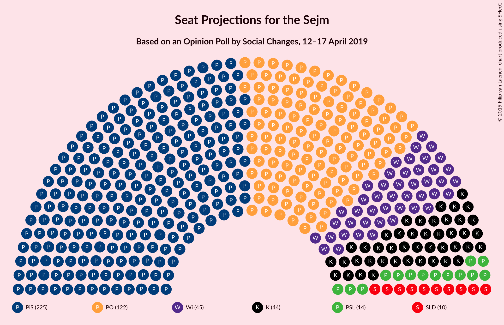
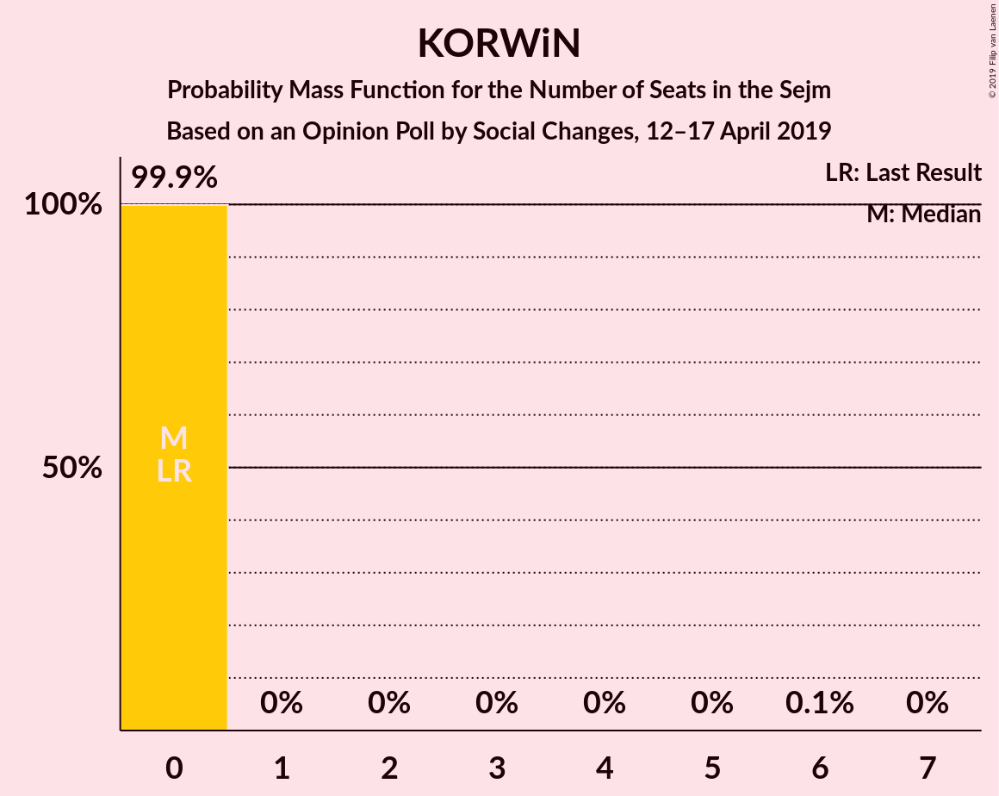
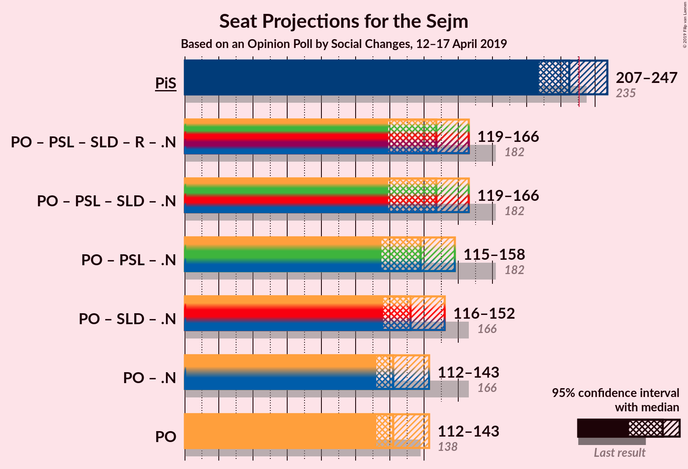

# Opinion Poll by Social Changes, 12–17 April 2019

<a href="#voting-intentions">Voting Intentions</a> | <a href="#seats">Seats</a> | <a href="#coalitions">Coalitions</a> | <a href="#technical-information">Technical Information</a>

## Voting Intentions

### Confidence Intervals

| Party | Last Result | Poll Result | 80% Confidence Interval | 90% Confidence Interval | 95% Confidence Interval | 99% Confidence Interval |
|:-----:|:-----------:|:-----------:|:-----------------------:|:-----------------------:|:-----------------------:|:-----------------------:|
| Prawo i Sprawiedliwość | 37.6% | 37.0% | 35.2–38.9% |34.6–39.4% |34.2–39.9% |33.3–40.8% |
| Platforma Obywatelska | 24.1% | 22.0% | 20.4–23.6% |20.0–24.1% |19.6–24.5% |18.9–25.3% |
| Wiosna | 0.0% | 10.0% | 8.9–11.2% |8.6–11.6% |8.4–11.9% |7.9–12.5% |
| Kukiz’15 | 8.8% | 9.0% | 8.0–10.2% |7.7–10.5% |7.5–10.8% |7.0–11.4% |
| Polskie Stronnictwo Ludowe | 5.1% | 5.0% | 4.3–6.0% |4.1–6.3% |3.9–6.5% |3.6–7.0% |
| Sojusz Lewicy Demokratycznej | 7.6% | 5.0% | 4.3–6.0% |4.1–6.3% |3.9–6.5% |3.6–7.0% |
| KORWiN | 4.8% | 3.0% | 2.4–3.7% |2.3–4.0% |2.1–4.1% |1.9–4.5% |
| Lewica Razem | 3.6% | 3.0% | 2.4–3.7% |2.3–4.0% |2.1–4.1% |1.9–4.5% |

*Note:* The poll result column reflects the actual value used in the calculations. Published results may vary slightly, and in addition be rounded to fewer digits.

## Seats

### Confidence Intervals

| Party | Last Result | Median | 80% Confidence Interval | 90% Confidence Interval | 95% Confidence Interval | 99% Confidence Interval |
|:-----:|:-----------:|:------:|:-----------------------:|:-----------------------:|:-----------------------:|:-----------------------:|
| <a href="#prawo-i-sprawiedliwość">Prawo i Sprawiedliwość</a> | 235 | 252 | 243–252 |219–252 |199–252 |199–252 |
| <a href="#platforma-obywatelska">Platforma Obywatelska</a> | 138 | 112 | 111–112 |111–112 |109–130 |109–130 |
| <a href="#wiosna">Wiosna</a> | 0 | 51 | 37–51 |37–51 |37–62 |37–62 |
| <a href="#kukiz’15">Kukiz’15</a> | 42 | 45 | 35–45 |35–45 |35–52 |35–52 |
| <a href="#polskie-stronnictwo-ludowe">Polskie Stronnictwo Ludowe</a> | 16 | 0 | 0–16 |0–19 |0–20 |0–20 |
| <a href="#sojusz-lewicy-demokratycznej">Sojusz Lewicy Demokratycznej</a> | 0 | 0 | 0–18 |0–18 |0–18 |0–18 |
| <a href="#korwin">KORWiN</a> | 0 | 0 | 0 |0 |0 |0 |
| <a href="#lewica-razem">Lewica Razem</a> | 0 | 0 | 0 |0 |0 |0 |

### Prawo i Sprawiedliwość

*For a full overview of the results for this party, see the [Prawo i Sprawiedliwość](party-prawoisprawiedliwość.html) page.*

| Number of Seats | Probability | Accumulated | Special Marks |
|:---------------:|:-----------:|:-----------:|:-------------:|
| 198 | 0.2% | 100% |  |
| 199 | 3% | 99.8% |  |
| 200 | 0% | 97% |  |
| 201 | 0% | 97% |  |
| 202 | 0% | 97% |  |
| 203 | 0% | 97% |  |
| 204 | 0% | 97% |  |
| 205 | 0% | 97% |  |
| 206 | 0% | 97% |  |
| 207 | 0% | 97% |  |
| 208 | 0% | 97% |  |
| 209 | 0% | 97% |  |
| 210 | 0% | 97% |  |
| 211 | 0% | 97% |  |
| 212 | 0% | 97% |  |
| 213 | 0% | 97% |  |
| 214 | 0% | 97% |  |
| 215 | 0% | 97% |  |
| 216 | 0% | 97% |  |
| 217 | 0% | 97% |  |
| 218 | 0% | 97% |  |
| 219 | 3% | 97% |  |
| 220 | 0% | 94% |  |
| 221 | 0% | 94% |  |
| 222 | 0% | 94% |  |
| 223 | 0.1% | 94% |  |
| 224 | 0% | 94% |  |
| 225 | 0% | 94% |  |
| 226 | 0% | 94% |  |
| 227 | 0% | 94% |  |
| 228 | 0% | 94% |  |
| 229 | 0% | 94% |  |
| 230 | 0% | 94% |  |
| 231 | 0% | 94% | Majority |
| 232 | 0% | 94% |  |
| 233 | 0.2% | 94% |  |
| 234 | 0% | 93% |  |
| 235 | 0% | 93% | Last Result |
| 236 | 0% | 93% |  |
| 237 | 0% | 93% |  |
| 238 | 0% | 93% |  |
| 239 | 0% | 93% |  |
| 240 | 0% | 93% |  |
| 241 | 1.4% | 93% |  |
| 242 | 0% | 92% |  |
| 243 | 30% | 92% |  |
| 244 | 0% | 62% |  |
| 245 | 0% | 62% |  |
| 246 | 0% | 62% |  |
| 247 | 0% | 62% |  |
| 248 | 0% | 62% |  |
| 249 | 0.1% | 62% |  |
| 250 | 0% | 62% |  |
| 251 | 0% | 62% |  |
| 252 | 61% | 62% | Median |
| 253 | 0% | 0.4% |  |
| 254 | 0.4% | 0.4% |  |
| 255 | 0% | 0% |  |

### Platforma Obywatelska

*For a full overview of the results for this party, see the [Platforma Obywatelska](party-platformaobywatelska.html) page.*

| Number of Seats | Probability | Accumulated | Special Marks |
|:---------------:|:-----------:|:-----------:|:-------------:|
| 104 | 0.1% | 100% |  |
| 105 | 0% | 99.8% |  |
| 106 | 0% | 99.8% |  |
| 107 | 0% | 99.8% |  |
| 108 | 0% | 99.8% |  |
| 109 | 5% | 99.8% |  |
| 110 | 0% | 95% |  |
| 111 | 30% | 95% |  |
| 112 | 62% | 65% | Median |
| 113 | 0% | 3% |  |
| 114 | 0% | 3% |  |
| 115 | 0% | 3% |  |
| 116 | 0% | 3% |  |
| 117 | 0% | 3% |  |
| 118 | 0% | 3% |  |
| 119 | 0% | 3% |  |
| 120 | 0% | 3% |  |
| 121 | 0% | 3% |  |
| 122 | 0% | 3% |  |
| 123 | 0% | 3% |  |
| 124 | 0% | 3% |  |
| 125 | 0% | 3% |  |
| 126 | 0% | 3% |  |
| 127 | 0% | 3% |  |
| 128 | 0% | 3% |  |
| 129 | 0.2% | 3% |  |
| 130 | 3% | 3% |  |
| 131 | 0% | 0.1% |  |
| 132 | 0% | 0.1% |  |
| 133 | 0% | 0.1% |  |
| 134 | 0% | 0.1% |  |
| 135 | 0% | 0.1% |  |
| 136 | 0% | 0.1% |  |
| 137 | 0% | 0.1% |  |
| 138 | 0% | 0.1% | Last Result |
| 139 | 0% | 0.1% |  |
| 140 | 0% | 0.1% |  |
| 141 | 0% | 0.1% |  |
| 142 | 0% | 0.1% |  |
| 143 | 0% | 0.1% |  |
| 144 | 0% | 0% |  |

### Wiosna

*For a full overview of the results for this party, see the [Wiosna](party-wiosna.html) page.*

| Number of Seats | Probability | Accumulated | Special Marks |
|:---------------:|:-----------:|:-----------:|:-------------:|
| 0 | 0% | 100% | Last Result |
| 1 | 0% | 100% |  |
| 2 | 0% | 100% |  |
| 3 | 0% | 100% |  |
| 4 | 0% | 100% |  |
| 5 | 0% | 100% |  |
| 6 | 0% | 100% |  |
| 7 | 0% | 100% |  |
| 8 | 0% | 100% |  |
| 9 | 0% | 100% |  |
| 10 | 0% | 100% |  |
| 11 | 0% | 100% |  |
| 12 | 0% | 100% |  |
| 13 | 0% | 100% |  |
| 14 | 0% | 100% |  |
| 15 | 0% | 100% |  |
| 16 | 0% | 100% |  |
| 17 | 0% | 100% |  |
| 18 | 0% | 100% |  |
| 19 | 0% | 100% |  |
| 20 | 0% | 100% |  |
| 21 | 0% | 100% |  |
| 22 | 0% | 100% |  |
| 23 | 0% | 100% |  |
| 24 | 0% | 100% |  |
| 25 | 0% | 100% |  |
| 26 | 0% | 100% |  |
| 27 | 0% | 100% |  |
| 28 | 0% | 100% |  |
| 29 | 0% | 100% |  |
| 30 | 0% | 100% |  |
| 31 | 0% | 100% |  |
| 32 | 0% | 100% |  |
| 33 | 0% | 100% |  |
| 34 | 0% | 100% |  |
| 35 | 0% | 100% |  |
| 36 | 0% | 99.9% |  |
| 37 | 30% | 99.9% |  |
| 38 | 0% | 70% |  |
| 39 | 1.4% | 70% |  |
| 40 | 0% | 69% |  |
| 41 | 0% | 69% |  |
| 42 | 0% | 69% |  |
| 43 | 3% | 69% |  |
| 44 | 0% | 66% |  |
| 45 | 0% | 66% |  |
| 46 | 0% | 66% |  |
| 47 | 0% | 66% |  |
| 48 | 0% | 66% |  |
| 49 | 0.4% | 65% |  |
| 50 | 0.1% | 65% |  |
| 51 | 61% | 65% | Median |
| 52 | 0% | 4% |  |
| 53 | 0.1% | 4% |  |
| 54 | 0% | 3% |  |
| 55 | 0.2% | 3% |  |
| 56 | 0% | 3% |  |
| 57 | 0% | 3% |  |
| 58 | 0% | 3% |  |
| 59 | 0% | 3% |  |
| 60 | 0% | 3% |  |
| 61 | 0% | 3% |  |
| 62 | 3% | 3% |  |
| 63 | 0% | 0% |  |

### Kukiz’15

*For a full overview of the results for this party, see the [Kukiz’15](party-kukiz’15.html) page.*

| Number of Seats | Probability | Accumulated | Special Marks |
|:---------------:|:-----------:|:-----------:|:-------------:|
| 35 | 30% | 100% |  |
| 36 | 0% | 70% |  |
| 37 | 1.4% | 70% |  |
| 38 | 3% | 69% |  |
| 39 | 0% | 65% |  |
| 40 | 0% | 65% |  |
| 41 | 0.1% | 65% |  |
| 42 | 0.1% | 65% | Last Result |
| 43 | 0.2% | 65% |  |
| 44 | 0% | 65% |  |
| 45 | 62% | 65% | Median |
| 46 | 0.1% | 3% |  |
| 47 | 0.2% | 3% |  |
| 48 | 0% | 3% |  |
| 49 | 0% | 3% |  |
| 50 | 0% | 3% |  |
| 51 | 0% | 3% |  |
| 52 | 3% | 3% |  |
| 53 | 0% | 0.1% |  |
| 54 | 0% | 0.1% |  |
| 55 | 0% | 0.1% |  |
| 56 | 0% | 0.1% |  |
| 57 | 0% | 0.1% |  |
| 58 | 0% | 0.1% |  |
| 59 | 0% | 0.1% |  |
| 60 | 0% | 0.1% |  |
| 61 | 0% | 0% |  |

### Polskie Stronnictwo Ludowe

*For a full overview of the results for this party, see the [Polskie Stronnictwo Ludowe](party-polskiestronnictwoludowe.html) page.*

| Number of Seats | Probability | Accumulated | Special Marks |
|:---------------:|:-----------:|:-----------:|:-------------:|
| 0 | 62% | 100% | Median |
| 1 | 0% | 38% |  |
| 2 | 0% | 38% |  |
| 3 | 0% | 38% |  |
| 4 | 0% | 38% |  |
| 5 | 0% | 38% |  |
| 6 | 0% | 38% |  |
| 7 | 0% | 38% |  |
| 8 | 0% | 38% |  |
| 9 | 0% | 38% |  |
| 10 | 0% | 38% |  |
| 11 | 0% | 38% |  |
| 12 | 0% | 38% |  |
| 13 | 0% | 38% |  |
| 14 | 0% | 38% |  |
| 15 | 0% | 38% |  |
| 16 | 31% | 38% | Last Result |
| 17 | 0% | 6% |  |
| 18 | 0% | 6% |  |
| 19 | 3% | 6% |  |
| 20 | 3% | 3% |  |
| 21 | 0% | 0% |  |

### Sojusz Lewicy Demokratycznej

*For a full overview of the results for this party, see the [Sojusz Lewicy Demokratycznej](party-sojuszlewicydemokratycznej.html) page.*

| Number of Seats | Probability | Accumulated | Special Marks |
|:---------------:|:-----------:|:-----------:|:-------------:|
| 0 | 62% | 100% | Last Result, Median |
| 1 | 0% | 38% |  |
| 2 | 0% | 38% |  |
| 3 | 0% | 38% |  |
| 4 | 0% | 38% |  |
| 5 | 0% | 38% |  |
| 6 | 0% | 38% |  |
| 7 | 0% | 38% |  |
| 8 | 0% | 38% |  |
| 9 | 0% | 38% |  |
| 10 | 0% | 38% |  |
| 11 | 0% | 38% |  |
| 12 | 0% | 38% |  |
| 13 | 3% | 38% |  |
| 14 | 0.1% | 35% |  |
| 15 | 0% | 35% |  |
| 16 | 3% | 35% |  |
| 17 | 0.2% | 32% |  |
| 18 | 31% | 32% |  |
| 19 | 0% | 0.2% |  |
| 20 | 0% | 0.2% |  |
| 21 | 0% | 0.2% |  |
| 22 | 0% | 0.2% |  |
| 23 | 0% | 0.2% |  |
| 24 | 0% | 0.2% |  |
| 25 | 0% | 0.2% |  |
| 26 | 0.1% | 0.2% |  |
| 27 | 0% | 0% |  |

### KORWiN

*For a full overview of the results for this party, see the [KORWiN](party-korwin.html) page.*

| Number of Seats | Probability | Accumulated | Special Marks |
|:---------------:|:-----------:|:-----------:|:-------------:|
| 0 | 100% | 100% | Last Result, Median |

### Lewica Razem

*For a full overview of the results for this party, see the [Lewica Razem](party-lewicarazem.html) page.*

| Number of Seats | Probability | Accumulated | Special Marks |
|:---------------:|:-----------:|:-----------:|:-------------:|
| 0 | 100% | 100% | Last Result, Median |

## Coalitions

### Confidence Intervals

| Coalition | Last Result | Median | Majority? | 80% Confidence Interval | 90% Confidence Interval | 95% Confidence Interval | 99% Confidence Interval |
|:---------:|:-----------:|:------:|:---------:|:-----------------------:|:-----------------------:|:-----------------------:|:-----------------------:|
| Prawo i Sprawiedliwość | 235 | 252 | 94% | 243–252 | 219–252 | 199–252 | 199–252 |
| Platforma Obywatelska | 138 | 112 | 0% | 111–112 | 111–112 | 109–130 | 109–130 |

### Prawo i Sprawiedliwość

| Number of Seats | Probability | Accumulated | Special Marks |
|:---------------:|:-----------:|:-----------:|:-------------:|
| 198 | 0.2% | 100% |  |
| 199 | 3% | 99.8% |  |
| 200 | 0% | 97% |  |
| 201 | 0% | 97% |  |
| 202 | 0% | 97% |  |
| 203 | 0% | 97% |  |
| 204 | 0% | 97% |  |
| 205 | 0% | 97% |  |
| 206 | 0% | 97% |  |
| 207 | 0% | 97% |  |
| 208 | 0% | 97% |  |
| 209 | 0% | 97% |  |
| 210 | 0% | 97% |  |
| 211 | 0% | 97% |  |
| 212 | 0% | 97% |  |
| 213 | 0% | 97% |  |
| 214 | 0% | 97% |  |
| 215 | 0% | 97% |  |
| 216 | 0% | 97% |  |
| 217 | 0% | 97% |  |
| 218 | 0% | 97% |  |
| 219 | 3% | 97% |  |
| 220 | 0% | 94% |  |
| 221 | 0% | 94% |  |
| 222 | 0% | 94% |  |
| 223 | 0.1% | 94% |  |
| 224 | 0% | 94% |  |
| 225 | 0% | 94% |  |
| 226 | 0% | 94% |  |
| 227 | 0% | 94% |  |
| 228 | 0% | 94% |  |
| 229 | 0% | 94% |  |
| 230 | 0% | 94% |  |
| 231 | 0% | 94% | Majority |
| 232 | 0% | 94% |  |
| 233 | 0.2% | 94% |  |
| 234 | 0% | 93% |  |
| 235 | 0% | 93% | Last Result |
| 236 | 0% | 93% |  |
| 237 | 0% | 93% |  |
| 238 | 0% | 93% |  |
| 239 | 0% | 93% |  |
| 240 | 0% | 93% |  |
| 241 | 1.4% | 93% |  |
| 242 | 0% | 92% |  |
| 243 | 30% | 92% |  |
| 244 | 0% | 62% |  |
| 245 | 0% | 62% |  |
| 246 | 0% | 62% |  |
| 247 | 0% | 62% |  |
| 248 | 0% | 62% |  |
| 249 | 0.1% | 62% |  |
| 250 | 0% | 62% |  |
| 251 | 0% | 62% |  |
| 252 | 61% | 62% | Median |
| 253 | 0% | 0.4% |  |
| 254 | 0.4% | 0.4% |  |
| 255 | 0% | 0% |  |

### Platforma Obywatelska

| Number of Seats | Probability | Accumulated | Special Marks |
|:---------------:|:-----------:|:-----------:|:-------------:|
| 104 | 0.1% | 100% |  |
| 105 | 0% | 99.8% |  |
| 106 | 0% | 99.8% |  |
| 107 | 0% | 99.8% |  |
| 108 | 0% | 99.8% |  |
| 109 | 5% | 99.8% |  |
| 110 | 0% | 95% |  |
| 111 | 30% | 95% |  |
| 112 | 62% | 65% | Median |
| 113 | 0% | 3% |  |
| 114 | 0% | 3% |  |
| 115 | 0% | 3% |  |
| 116 | 0% | 3% |  |
| 117 | 0% | 3% |  |
| 118 | 0% | 3% |  |
| 119 | 0% | 3% |  |
| 120 | 0% | 3% |  |
| 121 | 0% | 3% |  |
| 122 | 0% | 3% |  |
| 123 | 0% | 3% |  |
| 124 | 0% | 3% |  |
| 125 | 0% | 3% |  |
| 126 | 0% | 3% |  |
| 127 | 0% | 3% |  |
| 128 | 0% | 3% |  |
| 129 | 0.2% | 3% |  |
| 130 | 3% | 3% |  |
| 131 | 0% | 0.1% |  |
| 132 | 0% | 0.1% |  |
| 133 | 0% | 0.1% |  |
| 134 | 0% | 0.1% |  |
| 135 | 0% | 0.1% |  |
| 136 | 0% | 0.1% |  |
| 137 | 0% | 0.1% |  |
| 138 | 0% | 0.1% | Last Result |
| 139 | 0% | 0.1% |  |
| 140 | 0% | 0.1% |  |
| 141 | 0% | 0.1% |  |
| 142 | 0% | 0.1% |  |
| 143 | 0% | 0.1% |  |
| 144 | 0% | 0% |  |

## Technical Information

### Opinion Poll

+ **Polling firm:** Social Changes
+ **Commissioner(s):** —
+ **Fieldwork period:** 12–17 April 2019

### Calculations

+ **Sample size:** 1111
+ **Simulations done:** 1,024
+ **Error estimate:** 6.36%

