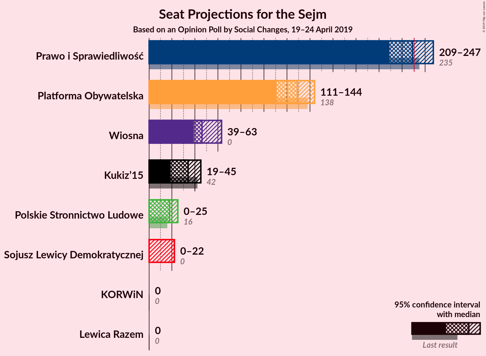
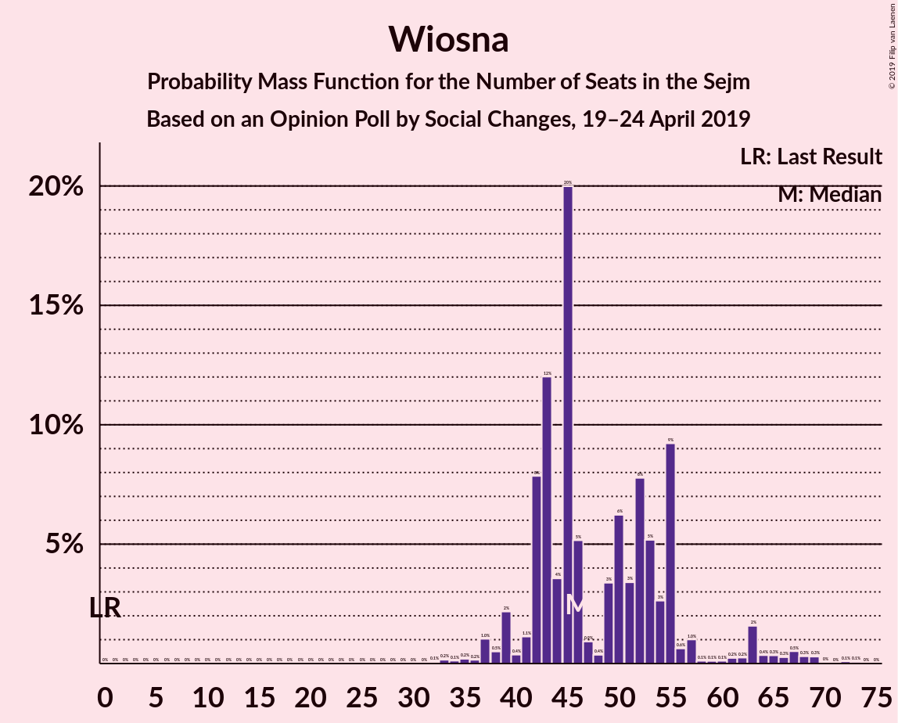
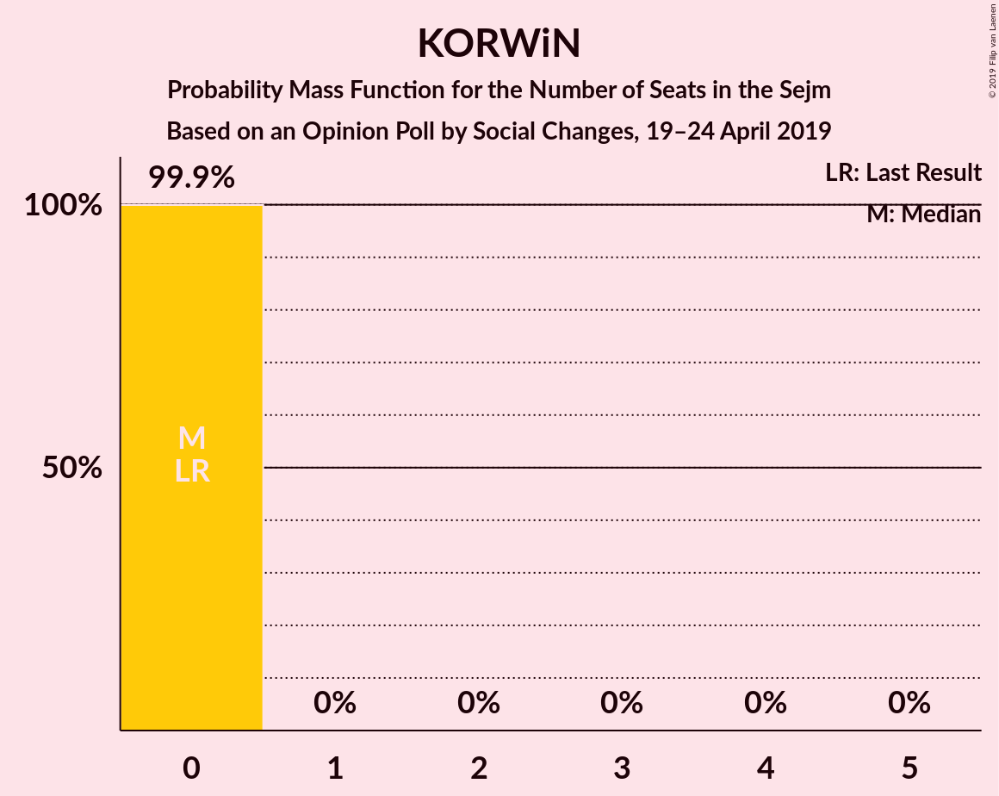

# Opinion Poll by Social Changes, 19–24 April 2019

<a href="#voting-intentions">Voting Intentions</a> | <a href="#seats">Seats</a> | <a href="#coalitions">Coalitions</a> | <a href="#technical-information">Technical Information</a>

## Voting Intentions

### Confidence Intervals

| Party | Last Result | Poll Result | 80% Confidence Interval | 90% Confidence Interval | 95% Confidence Interval | 99% Confidence Interval |
|:-----:|:-----------:|:-----------:|:-----------------------:|:-----------------------:|:-----------------------:|:-----------------------:|
| Prawo i Sprawiedliwość | 37.6% | 38.6% | 36.7–40.5% |36.1–41.1% |35.7–41.6% |34.8–42.5% |
| Platforma Obywatelska | 24.1% | 22.8% | 21.2–24.5% |20.7–25.0% |20.3–25.4% |19.6–26.2% |
| Wiosna | 0.0% | 10.9% | 9.7–12.2% |9.4–12.6% |9.1–12.9% |8.6–13.5% |
| Kukiz’15 | 8.8% | 7.9% | 6.9–9.1% |6.6–9.4% |6.4–9.7% |6.0–10.3% |
| Polskie Stronnictwo Ludowe | 5.1% | 5.9% | 5.1–7.0% |4.8–7.2% |4.6–7.5% |4.3–8.0% |
| Sojusz Lewicy Demokratycznej | 7.6% | 5.0% | 4.2–5.9% |4.0–6.2% |3.8–6.4% |3.5–6.9% |
| KORWiN | 4.8% | 3.0% | 2.4–3.7% |2.2–4.0% |2.1–4.2% |1.8–4.6% |
| Lewica Razem | 3.6% | 2.0% | 1.5–2.7% |1.4–2.9% |1.3–3.0% |1.1–3.4% |

*Note:* The poll result column reflects the actual value used in the calculations. Published results may vary slightly, and in addition be rounded to fewer digits.

## Seats

### Confidence Intervals

| Party | Last Result | Median | 80% Confidence Interval | 90% Confidence Interval | 95% Confidence Interval | 99% Confidence Interval |
|:-----:|:-----------:|:------:|:-----------------------:|:-----------------------:|:-----------------------:|:-----------------------:|
| <a href="#prawo-i-sprawiedliwość">Prawo i Sprawiedliwość</a> | 235 | 229 | 215–236 |212–243 |209–247 |201–255 |
| <a href="#platforma-obywatelska">Platforma Obywatelska</a> | 138 | 129 | 116–135 |115–140 |111–144 |106–148 |
| <a href="#wiosna">Wiosna</a> | 0 | 46 | 42–55 |41–57 |39–63 |35–69 |
| <a href="#kukiz’15">Kukiz’15</a> | 42 | 34 | 26–42 |23–42 |19–45 |13–48 |
| <a href="#polskie-stronnictwo-ludowe">Polskie Stronnictwo Ludowe</a> | 16 | 18 | 14–25 |13–25 |0–25 |0–30 |
| <a href="#sojusz-lewicy-demokratycznej">Sojusz Lewicy Demokratycznej</a> | 0 | 0 | 0–12 |0–18 |0–22 |0–27 |
| <a href="#korwin">KORWiN</a> | 0 | 0 | 0 |0 |0 |0 |
| <a href="#lewica-razem">Lewica Razem</a> | 0 | 0 | 0 |0 |0 |0 |

### Prawo i Sprawiedliwość

*For a full overview of the results for this party, see the [Prawo i Sprawiedliwość](party-prawoisprawiedliwość.html) page.*

| Number of Seats | Probability | Accumulated | Special Marks |
|:---------------:|:-----------:|:-----------:|:-------------:|
| 197 | 0% | 100% |  |
| 198 | 0% | 99.9% |  |
| 199 | 0.2% | 99.9% |  |
| 200 | 0% | 99.7% |  |
| 201 | 0.2% | 99.7% |  |
| 202 | 0.2% | 99.5% |  |
| 203 | 0% | 99.3% |  |
| 204 | 0.2% | 99.3% |  |
| 205 | 0.3% | 99.1% |  |
| 206 | 0.2% | 98.8% |  |
| 207 | 0.5% | 98.6% |  |
| 208 | 0.3% | 98% |  |
| 209 | 0.9% | 98% |  |
| 210 | 0.7% | 97% |  |
| 211 | 0.6% | 96% |  |
| 212 | 2% | 96% |  |
| 213 | 0.2% | 94% |  |
| 214 | 1.4% | 94% |  |
| 215 | 5% | 92% |  |
| 216 | 0.6% | 87% |  |
| 217 | 7% | 87% |  |
| 218 | 2% | 80% |  |
| 219 | 2% | 78% |  |
| 220 | 0.7% | 76% |  |
| 221 | 3% | 76% |  |
| 222 | 3% | 73% |  |
| 223 | 1.2% | 70% |  |
| 224 | 1.2% | 69% |  |
| 225 | 8% | 68% |  |
| 226 | 4% | 60% |  |
| 227 | 2% | 56% |  |
| 228 | 0.2% | 54% |  |
| 229 | 10% | 54% | Median |
| 230 | 10% | 44% |  |
| 231 | 0.7% | 34% | Majority |
| 232 | 6% | 33% |  |
| 233 | 0.5% | 27% |  |
| 234 | 0.3% | 27% |  |
| 235 | 17% | 27% | Last Result |
| 236 | 2% | 10% |  |
| 237 | 0.4% | 9% |  |
| 238 | 2% | 8% |  |
| 239 | 0.1% | 6% |  |
| 240 | 0.4% | 6% |  |
| 241 | 0.1% | 6% |  |
| 242 | 0.1% | 6% |  |
| 243 | 0.7% | 6% |  |
| 244 | 0.1% | 5% |  |
| 245 | 0% | 5% |  |
| 246 | 0.1% | 5% |  |
| 247 | 3% | 5% |  |
| 248 | 0% | 2% |  |
| 249 | 0.2% | 2% |  |
| 250 | 0% | 1.5% |  |
| 251 | 0.3% | 1.4% |  |
| 252 | 0.1% | 1.1% |  |
| 253 | 0.3% | 1.0% |  |
| 254 | 0% | 0.8% |  |
| 255 | 0.5% | 0.8% |  |
| 256 | 0% | 0.3% |  |
| 257 | 0.1% | 0.2% |  |
| 258 | 0% | 0.2% |  |
| 259 | 0% | 0.1% |  |
| 260 | 0.1% | 0.1% |  |
| 261 | 0% | 0% |  |

### Platforma Obywatelska

*For a full overview of the results for this party, see the [Platforma Obywatelska](party-platformaobywatelska.html) page.*

| Number of Seats | Probability | Accumulated | Special Marks |
|:---------------:|:-----------:|:-----------:|:-------------:|
| 99 | 0% | 100% |  |
| 100 | 0% | 99.9% |  |
| 101 | 0.1% | 99.9% |  |
| 102 | 0% | 99.9% |  |
| 103 | 0.1% | 99.8% |  |
| 104 | 0% | 99.8% |  |
| 105 | 0.2% | 99.8% |  |
| 106 | 0.6% | 99.5% |  |
| 107 | 0.3% | 98.9% |  |
| 108 | 0.2% | 98.6% |  |
| 109 | 0.4% | 98% |  |
| 110 | 0.2% | 98% |  |
| 111 | 0.6% | 98% |  |
| 112 | 0.5% | 97% |  |
| 113 | 0.4% | 97% |  |
| 114 | 1.1% | 96% |  |
| 115 | 1.0% | 95% |  |
| 116 | 6% | 94% |  |
| 117 | 0.8% | 89% |  |
| 118 | 2% | 88% |  |
| 119 | 9% | 86% |  |
| 120 | 0.5% | 78% |  |
| 121 | 0.5% | 77% |  |
| 122 | 1.1% | 77% |  |
| 123 | 5% | 76% |  |
| 124 | 2% | 71% |  |
| 125 | 1.1% | 69% |  |
| 126 | 3% | 67% |  |
| 127 | 4% | 64% |  |
| 128 | 2% | 60% |  |
| 129 | 14% | 58% | Median |
| 130 | 21% | 45% |  |
| 131 | 0.6% | 23% |  |
| 132 | 6% | 23% |  |
| 133 | 2% | 17% |  |
| 134 | 4% | 15% |  |
| 135 | 0.3% | 10% |  |
| 136 | 2% | 10% |  |
| 137 | 0.6% | 8% |  |
| 138 | 0.6% | 7% | Last Result |
| 139 | 1.4% | 6% |  |
| 140 | 0.4% | 5% |  |
| 141 | 0.8% | 5% |  |
| 142 | 1.0% | 4% |  |
| 143 | 0.2% | 3% |  |
| 144 | 0.7% | 3% |  |
| 145 | 0.5% | 2% |  |
| 146 | 0.3% | 1.4% |  |
| 147 | 0.4% | 1.1% |  |
| 148 | 0.3% | 0.6% |  |
| 149 | 0.1% | 0.4% |  |
| 150 | 0% | 0.2% |  |
| 151 | 0.1% | 0.2% |  |
| 152 | 0% | 0.1% |  |
| 153 | 0% | 0.1% |  |
| 154 | 0% | 0.1% |  |
| 155 | 0% | 0% |  |

### Wiosna

*For a full overview of the results for this party, see the [Wiosna](party-wiosna.html) page.*

| Number of Seats | Probability | Accumulated | Special Marks |
|:---------------:|:-----------:|:-----------:|:-------------:|
| 0 | 0% | 100% | Last Result |
| 1 | 0% | 100% |  |
| 2 | 0% | 100% |  |
| 3 | 0% | 100% |  |
| 4 | 0% | 100% |  |
| 5 | 0% | 100% |  |
| 6 | 0% | 100% |  |
| 7 | 0% | 100% |  |
| 8 | 0% | 100% |  |
| 9 | 0% | 100% |  |
| 10 | 0% | 100% |  |
| 11 | 0% | 100% |  |
| 12 | 0% | 100% |  |
| 13 | 0% | 100% |  |
| 14 | 0% | 100% |  |
| 15 | 0% | 100% |  |
| 16 | 0% | 100% |  |
| 17 | 0% | 100% |  |
| 18 | 0% | 100% |  |
| 19 | 0% | 100% |  |
| 20 | 0% | 100% |  |
| 21 | 0% | 100% |  |
| 22 | 0% | 100% |  |
| 23 | 0% | 100% |  |
| 24 | 0% | 100% |  |
| 25 | 0% | 100% |  |
| 26 | 0% | 100% |  |
| 27 | 0% | 100% |  |
| 28 | 0% | 100% |  |
| 29 | 0% | 100% |  |
| 30 | 0% | 100% |  |
| 31 | 0% | 100% |  |
| 32 | 0.1% | 100% |  |
| 33 | 0.2% | 99.9% |  |
| 34 | 0.1% | 99.8% |  |
| 35 | 0.2% | 99.6% |  |
| 36 | 0.2% | 99.4% |  |
| 37 | 1.0% | 99.3% |  |
| 38 | 0.5% | 98% |  |
| 39 | 2% | 98% |  |
| 40 | 0.4% | 96% |  |
| 41 | 1.1% | 95% |  |
| 42 | 8% | 94% |  |
| 43 | 12% | 86% |  |
| 44 | 4% | 74% |  |
| 45 | 20% | 71% |  |
| 46 | 5% | 51% | Median |
| 47 | 0.9% | 45% |  |
| 48 | 0.4% | 45% |  |
| 49 | 3% | 44% |  |
| 50 | 6% | 41% |  |
| 51 | 3% | 35% |  |
| 52 | 8% | 31% |  |
| 53 | 5% | 23% |  |
| 54 | 3% | 18% |  |
| 55 | 9% | 16% |  |
| 56 | 0.6% | 6% |  |
| 57 | 1.0% | 6% |  |
| 58 | 0.1% | 5% |  |
| 59 | 0.1% | 5% |  |
| 60 | 0.1% | 4% |  |
| 61 | 0.2% | 4% |  |
| 62 | 0.2% | 4% |  |
| 63 | 2% | 4% |  |
| 64 | 0.4% | 2% |  |
| 65 | 0.3% | 2% |  |
| 66 | 0.3% | 2% |  |
| 67 | 0.5% | 1.4% |  |
| 68 | 0.3% | 0.8% |  |
| 69 | 0.3% | 0.5% |  |
| 70 | 0% | 0.3% |  |
| 71 | 0% | 0.2% |  |
| 72 | 0.1% | 0.2% |  |
| 73 | 0.1% | 0.1% |  |
| 74 | 0% | 0% |  |

### Kukiz’15

*For a full overview of the results for this party, see the [Kukiz’15](party-kukiz’15.html) page.*

| Number of Seats | Probability | Accumulated | Special Marks |
|:---------------:|:-----------:|:-----------:|:-------------:|
| 11 | 0.1% | 100% |  |
| 12 | 0.1% | 99.9% |  |
| 13 | 0.7% | 99.8% |  |
| 14 | 0.1% | 99.1% |  |
| 15 | 0.4% | 99.1% |  |
| 16 | 0.7% | 98.7% |  |
| 17 | 0.2% | 98% |  |
| 18 | 0.2% | 98% |  |
| 19 | 0.6% | 98% |  |
| 20 | 0.5% | 97% |  |
| 21 | 0.5% | 96% |  |
| 22 | 0.4% | 96% |  |
| 23 | 1.0% | 96% |  |
| 24 | 0.4% | 95% |  |
| 25 | 4% | 94% |  |
| 26 | 0.5% | 90% |  |
| 27 | 0.3% | 90% |  |
| 28 | 2% | 90% |  |
| 29 | 1.1% | 88% |  |
| 30 | 0.8% | 87% |  |
| 31 | 6% | 86% |  |
| 32 | 6% | 80% |  |
| 33 | 10% | 74% |  |
| 34 | 19% | 64% | Median |
| 35 | 8% | 45% |  |
| 36 | 2% | 36% |  |
| 37 | 8% | 34% |  |
| 38 | 3% | 26% |  |
| 39 | 7% | 24% |  |
| 40 | 2% | 17% |  |
| 41 | 3% | 14% |  |
| 42 | 8% | 12% | Last Result |
| 43 | 1.2% | 4% |  |
| 44 | 0.4% | 3% |  |
| 45 | 0.5% | 3% |  |
| 46 | 0.5% | 2% |  |
| 47 | 0.7% | 2% |  |
| 48 | 0.5% | 0.8% |  |
| 49 | 0.2% | 0.3% |  |
| 50 | 0.1% | 0.1% |  |
| 51 | 0% | 0.1% |  |
| 52 | 0% | 0% |  |

### Polskie Stronnictwo Ludowe

*For a full overview of the results for this party, see the [Polskie Stronnictwo Ludowe](party-polskiestronnictwoludowe.html) page.*

| Number of Seats | Probability | Accumulated | Special Marks |
|:---------------:|:-----------:|:-----------:|:-------------:|
| 0 | 4% | 100% |  |
| 1 | 0% | 96% |  |
| 2 | 0% | 96% |  |
| 3 | 0% | 96% |  |
| 4 | 0% | 96% |  |
| 5 | 0% | 96% |  |
| 6 | 0% | 96% |  |
| 7 | 0% | 96% |  |
| 8 | 0% | 96% |  |
| 9 | 0% | 96% |  |
| 10 | 0% | 96% |  |
| 11 | 0% | 96% |  |
| 12 | 0% | 96% |  |
| 13 | 2% | 96% |  |
| 14 | 16% | 94% |  |
| 15 | 4% | 78% |  |
| 16 | 21% | 74% | Last Result |
| 17 | 3% | 53% |  |
| 18 | 6% | 50% | Median |
| 19 | 2% | 44% |  |
| 20 | 0.8% | 42% |  |
| 21 | 1.5% | 41% |  |
| 22 | 2% | 40% |  |
| 23 | 5% | 38% |  |
| 24 | 6% | 33% |  |
| 25 | 25% | 27% |  |
| 26 | 0.6% | 2% |  |
| 27 | 0.3% | 1.3% |  |
| 28 | 0.2% | 1.0% |  |
| 29 | 0.3% | 0.8% |  |
| 30 | 0.1% | 0.6% |  |
| 31 | 0.1% | 0.5% |  |
| 32 | 0.1% | 0.4% |  |
| 33 | 0.1% | 0.3% |  |
| 34 | 0% | 0.2% |  |
| 35 | 0.2% | 0.2% |  |
| 36 | 0% | 0% |  |

### Sojusz Lewicy Demokratycznej

*For a full overview of the results for this party, see the [Sojusz Lewicy Demokratycznej](party-sojuszlewicydemokratycznej.html) page.*

| Number of Seats | Probability | Accumulated | Special Marks |
|:---------------:|:-----------:|:-----------:|:-------------:|
| 0 | 64% | 100% | Last Result, Median |
| 1 | 0% | 36% |  |
| 2 | 0% | 36% |  |
| 3 | 0% | 36% |  |
| 4 | 0% | 36% |  |
| 5 | 0% | 36% |  |
| 6 | 0.1% | 36% |  |
| 7 | 0.6% | 36% |  |
| 8 | 5% | 36% |  |
| 9 | 9% | 30% |  |
| 10 | 1.1% | 21% |  |
| 11 | 2% | 20% |  |
| 12 | 8% | 18% |  |
| 13 | 0.3% | 10% |  |
| 14 | 2% | 9% |  |
| 15 | 0.4% | 7% |  |
| 16 | 0.5% | 7% |  |
| 17 | 0.3% | 6% |  |
| 18 | 2% | 6% |  |
| 19 | 0.5% | 4% |  |
| 20 | 0.2% | 3% |  |
| 21 | 0.4% | 3% |  |
| 22 | 0.2% | 3% |  |
| 23 | 0.3% | 2% |  |
| 24 | 1.1% | 2% |  |
| 25 | 0.3% | 1.0% |  |
| 26 | 0.2% | 0.7% |  |
| 27 | 0.2% | 0.5% |  |
| 28 | 0.1% | 0.3% |  |
| 29 | 0.1% | 0.2% |  |
| 30 | 0% | 0% |  |

### KORWiN

*For a full overview of the results for this party, see the [KORWiN](party-korwin.html) page.*

| Number of Seats | Probability | Accumulated | Special Marks |
|:---------------:|:-----------:|:-----------:|:-------------:|
| 0 | 99.9% | 100% | Last Result, Median |
| 1 | 0% | 0.1% |  |
| 2 | 0% | 0.1% |  |
| 3 | 0% | 0.1% |  |
| 4 | 0% | 0.1% |  |
| 5 | 0% | 0% |  |

### Lewica Razem

*For a full overview of the results for this party, see the [Lewica Razem](party-lewicarazem.html) page.*

| Number of Seats | Probability | Accumulated | Special Marks |
|:---------------:|:-----------:|:-----------:|:-------------:|
| 0 | 100% | 100% | Last Result, Median |

## Coalitions

### Confidence Intervals

| Coalition | Last Result | Median | Majority? | 80% Confidence Interval | 90% Confidence Interval | 95% Confidence Interval | 99% Confidence Interval |
|:---------:|:-----------:|:------:|:---------:|:-----------------------:|:-----------------------:|:-----------------------:|:-----------------------:|
| Prawo i Sprawiedliwość | 235 | 229 | 34% | 215–236 | 212–243 | 209–247 | 201–255 |
| Platforma Obywatelska | 138 | 129 | 0% | 116–135 | 115–140 | 111–144 | 106–148 |

### Prawo i Sprawiedliwość

| Number of Seats | Probability | Accumulated | Special Marks |
|:---------------:|:-----------:|:-----------:|:-------------:|
| 197 | 0% | 100% |  |
| 198 | 0% | 99.9% |  |
| 199 | 0.2% | 99.9% |  |
| 200 | 0% | 99.7% |  |
| 201 | 0.2% | 99.7% |  |
| 202 | 0.2% | 99.5% |  |
| 203 | 0% | 99.3% |  |
| 204 | 0.2% | 99.3% |  |
| 205 | 0.3% | 99.1% |  |
| 206 | 0.2% | 98.8% |  |
| 207 | 0.5% | 98.6% |  |
| 208 | 0.3% | 98% |  |
| 209 | 0.9% | 98% |  |
| 210 | 0.7% | 97% |  |
| 211 | 0.6% | 96% |  |
| 212 | 2% | 96% |  |
| 213 | 0.2% | 94% |  |
| 214 | 1.4% | 94% |  |
| 215 | 5% | 92% |  |
| 216 | 0.6% | 87% |  |
| 217 | 7% | 87% |  |
| 218 | 2% | 80% |  |
| 219 | 2% | 78% |  |
| 220 | 0.7% | 76% |  |
| 221 | 3% | 76% |  |
| 222 | 3% | 73% |  |
| 223 | 1.2% | 70% |  |
| 224 | 1.2% | 69% |  |
| 225 | 8% | 68% |  |
| 226 | 4% | 60% |  |
| 227 | 2% | 56% |  |
| 228 | 0.2% | 54% |  |
| 229 | 10% | 54% | Median |
| 230 | 10% | 44% |  |
| 231 | 0.7% | 34% | Majority |
| 232 | 6% | 33% |  |
| 233 | 0.5% | 27% |  |
| 234 | 0.3% | 27% |  |
| 235 | 17% | 27% | Last Result |
| 236 | 2% | 10% |  |
| 237 | 0.4% | 9% |  |
| 238 | 2% | 8% |  |
| 239 | 0.1% | 6% |  |
| 240 | 0.4% | 6% |  |
| 241 | 0.1% | 6% |  |
| 242 | 0.1% | 6% |  |
| 243 | 0.7% | 6% |  |
| 244 | 0.1% | 5% |  |
| 245 | 0% | 5% |  |
| 246 | 0.1% | 5% |  |
| 247 | 3% | 5% |  |
| 248 | 0% | 2% |  |
| 249 | 0.2% | 2% |  |
| 250 | 0% | 1.5% |  |
| 251 | 0.3% | 1.4% |  |
| 252 | 0.1% | 1.1% |  |
| 253 | 0.3% | 1.0% |  |
| 254 | 0% | 0.8% |  |
| 255 | 0.5% | 0.8% |  |
| 256 | 0% | 0.3% |  |
| 257 | 0.1% | 0.2% |  |
| 258 | 0% | 0.2% |  |
| 259 | 0% | 0.1% |  |
| 260 | 0.1% | 0.1% |  |
| 261 | 0% | 0% |  |

### Platforma Obywatelska

| Number of Seats | Probability | Accumulated | Special Marks |
|:---------------:|:-----------:|:-----------:|:-------------:|
| 99 | 0% | 100% |  |
| 100 | 0% | 99.9% |  |
| 101 | 0.1% | 99.9% |  |
| 102 | 0% | 99.9% |  |
| 103 | 0.1% | 99.8% |  |
| 104 | 0% | 99.8% |  |
| 105 | 0.2% | 99.8% |  |
| 106 | 0.6% | 99.5% |  |
| 107 | 0.3% | 98.9% |  |
| 108 | 0.2% | 98.6% |  |
| 109 | 0.4% | 98% |  |
| 110 | 0.2% | 98% |  |
| 111 | 0.6% | 98% |  |
| 112 | 0.5% | 97% |  |
| 113 | 0.4% | 97% |  |
| 114 | 1.1% | 96% |  |
| 115 | 1.0% | 95% |  |
| 116 | 6% | 94% |  |
| 117 | 0.8% | 89% |  |
| 118 | 2% | 88% |  |
| 119 | 9% | 86% |  |
| 120 | 0.5% | 78% |  |
| 121 | 0.5% | 77% |  |
| 122 | 1.1% | 77% |  |
| 123 | 5% | 76% |  |
| 124 | 2% | 71% |  |
| 125 | 1.1% | 69% |  |
| 126 | 3% | 67% |  |
| 127 | 4% | 64% |  |
| 128 | 2% | 60% |  |
| 129 | 14% | 58% | Median |
| 130 | 21% | 45% |  |
| 131 | 0.6% | 23% |  |
| 132 | 6% | 23% |  |
| 133 | 2% | 17% |  |
| 134 | 4% | 15% |  |
| 135 | 0.3% | 10% |  |
| 136 | 2% | 10% |  |
| 137 | 0.6% | 8% |  |
| 138 | 0.6% | 7% | Last Result |
| 139 | 1.4% | 6% |  |
| 140 | 0.4% | 5% |  |
| 141 | 0.8% | 5% |  |
| 142 | 1.0% | 4% |  |
| 143 | 0.2% | 3% |  |
| 144 | 0.7% | 3% |  |
| 145 | 0.5% | 2% |  |
| 146 | 0.3% | 1.4% |  |
| 147 | 0.4% | 1.1% |  |
| 148 | 0.3% | 0.6% |  |
| 149 | 0.1% | 0.4% |  |
| 150 | 0% | 0.2% |  |
| 151 | 0.1% | 0.2% |  |
| 152 | 0% | 0.1% |  |
| 153 | 0% | 0.1% |  |
| 154 | 0% | 0.1% |  |
| 155 | 0% | 0% |  |

## Technical Information

### Opinion Poll

+ **Polling firm:** Social Changes
+ **Commissioner(s):** —
+ **Fieldwork period:** 19–24 April 2019

### Calculations

+ **Sample size:** 1050
+ **Simulations done:** 131,072
+ **Error estimate:** 2.32%

