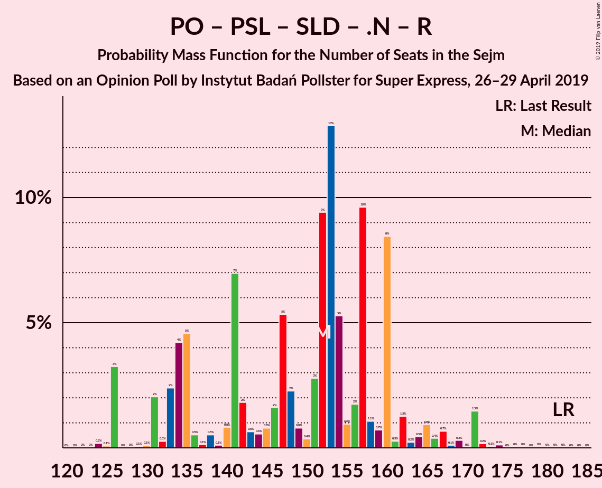

# Opinion Poll by Instytut Badań Pollster for Super Express, 26–29 April 2019

<a href="#voting-intentions">Voting Intentions</a> | <a href="#seats">Seats</a> | <a href="#coalitions">Coalitions</a> | <a href="#technical-information">Technical Information</a>

## Voting Intentions

### Confidence Intervals

| Party | Last Result | Poll Result | 80% Confidence Interval | 90% Confidence Interval | 95% Confidence Interval | 99% Confidence Interval |
|:-----:|:-----------:|:-----------:|:-----------------------:|:-----------------------:|:-----------------------:|:-----------------------:|
| Prawo i Sprawiedliwość | 37.6% | 39.0% | 37.1–41.0% |36.5–41.5% |36.0–42.0% |35.1–43.0% |
| Platforma Obywatelska | 24.1% | 26.0% | 24.3–27.8% |23.8–28.3% |23.4–28.8% |22.6–29.6% |
| Wiosna | 0.0% | 11.0% | 9.8–12.3% |9.5–12.7% |9.2–13.0% |8.7–13.7% |
| Kukiz’15 | 8.8% | 7.0% | 6.1–8.1% |5.8–8.4% |5.6–8.7% |5.2–9.3% |
| Polskie Stronnictwo Ludowe | 5.1% | 4.0% | 3.3–4.9% |3.1–5.1% |2.9–5.4% |2.7–5.8% |
| Sojusz Lewicy Demokratycznej | 7.6% | 4.0% | 3.3–4.9% |3.1–5.1% |2.9–5.4% |2.7–5.8% |
| KORWiN | 4.8% | 4.0% | 3.3–4.9% |3.1–5.1% |2.9–5.4% |2.7–5.8% |
| .Nowoczesna | 7.6% | 2.0% | 1.6–2.7% |1.4–2.9% |1.3–3.1% |1.1–3.5% |
| Lewica Razem | 3.6% | 1.0% | 0.7–1.5% |0.6–1.6% |0.5–1.8% |0.4–2.1% |

*Note:* The poll result column reflects the actual value used in the calculations. Published results may vary slightly, and in addition be rounded to fewer digits.

## Seats

### Confidence Intervals

| Party | Last Result | Median | 80% Confidence Interval | 90% Confidence Interval | 95% Confidence Interval | 99% Confidence Interval |
|:-----:|:-----------:|:------:|:-----------------------:|:-----------------------:|:-----------------------:|:-----------------------:|
| <a href="#prawo-i-sprawiedliwość">Prawo i Sprawiedliwość</a> | 235 | 230 | 217–246 |217–247 |213–254 |208–257 |
| <a href="#platforma-obywatelska">Platforma Obywatelska</a> | 138 | 152 | 134–159 |131–160 |126–160 |124–167 |
| <a href="#wiosna">Wiosna</a> | 0 | 46 | 42–58 |40–63 |38–65 |34–71 |
| <a href="#kukiz’15">Kukiz’15</a> | 42 | 34 | 21–39 |11–39 |9–42 |0–43 |
| <a href="#polskie-stronnictwo-ludowe">Polskie Stronnictwo Ludowe</a> | 16 | 0 | 0 |0 |0–15 |0–19 |
| <a href="#sojusz-lewicy-demokratycznej">Sojusz Lewicy Demokratycznej</a> | 0 | 0 | 0 |0 |0–11 |0–17 |
| <a href="#korwin">KORWiN</a> | 0 | 0 | 0 |0–5 |0–7 |0–12 |
| <a href="#.nowoczesna">.Nowoczesna</a> | 28 | 0 | 0 |0 |0 |0 |
| <a href="#lewica-razem">Lewica Razem</a> | 0 | 0 | 0 |0 |0 |0 |

### Prawo i Sprawiedliwość

*For a full overview of the results for this party, see the [Prawo i Sprawiedliwość](party-prawoisprawiedliwość.html) page.*

| Number of Seats | Probability | Accumulated | Special Marks |
|:---------------:|:-----------:|:-----------:|:-------------:|
| 201 | 0% | 100% |  |
| 202 | 0% | 99.9% |  |
| 203 | 0% | 99.9% |  |
| 204 | 0% | 99.9% |  |
| 205 | 0.1% | 99.9% |  |
| 206 | 0% | 99.8% |  |
| 207 | 0% | 99.8% |  |
| 208 | 0.6% | 99.7% |  |
| 209 | 0% | 99.1% |  |
| 210 | 0.1% | 99.1% |  |
| 211 | 0.4% | 99.0% |  |
| 212 | 0.3% | 98.6% |  |
| 213 | 1.5% | 98% |  |
| 214 | 0.2% | 97% |  |
| 215 | 0.3% | 97% |  |
| 216 | 0.8% | 96% |  |
| 217 | 6% | 96% |  |
| 218 | 5% | 90% |  |
| 219 | 1.0% | 85% |  |
| 220 | 0.8% | 84% |  |
| 221 | 7% | 83% |  |
| 222 | 3% | 76% |  |
| 223 | 0.7% | 73% |  |
| 224 | 1.4% | 72% |  |
| 225 | 8% | 71% |  |
| 226 | 8% | 63% |  |
| 227 | 0.9% | 54% |  |
| 228 | 0.6% | 53% |  |
| 229 | 2% | 53% |  |
| 230 | 9% | 50% | Median |
| 231 | 3% | 42% | Majority |
| 232 | 1.0% | 39% |  |
| 233 | 5% | 38% |  |
| 234 | 3% | 33% |  |
| 235 | 0.7% | 30% | Last Result |
| 236 | 0.1% | 29% |  |
| 237 | 0.1% | 29% |  |
| 238 | 0.2% | 29% |  |
| 239 | 0.5% | 29% |  |
| 240 | 3% | 28% |  |
| 241 | 0.8% | 25% |  |
| 242 | 0.6% | 24% |  |
| 243 | 7% | 24% |  |
| 244 | 0.9% | 17% |  |
| 245 | 3% | 16% |  |
| 246 | 5% | 13% |  |
| 247 | 4% | 8% |  |
| 248 | 0.2% | 4% |  |
| 249 | 0.4% | 4% |  |
| 250 | 0.4% | 4% |  |
| 251 | 0.2% | 3% |  |
| 252 | 0.5% | 3% |  |
| 253 | 0% | 3% |  |
| 254 | 1.5% | 3% |  |
| 255 | 0.1% | 1.0% |  |
| 256 | 0.1% | 0.9% |  |
| 257 | 0.4% | 0.8% |  |
| 258 | 0.1% | 0.4% |  |
| 259 | 0.1% | 0.3% |  |
| 260 | 0% | 0.2% |  |
| 261 | 0% | 0.2% |  |
| 262 | 0.2% | 0.2% |  |
| 263 | 0% | 0% |  |

### Platforma Obywatelska

*For a full overview of the results for this party, see the [Platforma Obywatelska](party-platformaobywatelska.html) page.*

| Number of Seats | Probability | Accumulated | Special Marks |
|:---------------:|:-----------:|:-----------:|:-------------:|
| 119 | 0% | 100% |  |
| 120 | 0% | 99.9% |  |
| 121 | 0% | 99.9% |  |
| 122 | 0.2% | 99.9% |  |
| 123 | 0.1% | 99.7% |  |
| 124 | 0.2% | 99.6% |  |
| 125 | 0.1% | 99.4% |  |
| 126 | 3% | 99.3% |  |
| 127 | 0% | 96% |  |
| 128 | 0.1% | 96% |  |
| 129 | 0.1% | 96% |  |
| 130 | 0.1% | 96% |  |
| 131 | 2% | 96% |  |
| 132 | 0.3% | 94% |  |
| 133 | 3% | 93% |  |
| 134 | 4% | 91% |  |
| 135 | 5% | 87% |  |
| 136 | 0.6% | 82% |  |
| 137 | 0.3% | 81% |  |
| 138 | 0.6% | 81% | Last Result |
| 139 | 0.2% | 81% |  |
| 140 | 0.9% | 80% |  |
| 141 | 7% | 79% |  |
| 142 | 2% | 72% |  |
| 143 | 0.9% | 70% |  |
| 144 | 1.4% | 69% |  |
| 145 | 0.7% | 68% |  |
| 146 | 2% | 67% |  |
| 147 | 7% | 65% |  |
| 148 | 2% | 58% |  |
| 149 | 0.8% | 56% |  |
| 150 | 1.2% | 55% |  |
| 151 | 3% | 54% |  |
| 152 | 9% | 52% | Median |
| 153 | 13% | 42% |  |
| 154 | 5% | 29% |  |
| 155 | 0.5% | 24% |  |
| 156 | 3% | 23% |  |
| 157 | 10% | 21% |  |
| 158 | 0.9% | 11% |  |
| 159 | 0.7% | 10% |  |
| 160 | 7% | 9% |  |
| 161 | 0.2% | 2% |  |
| 162 | 1.0% | 2% |  |
| 163 | 0.1% | 1.2% |  |
| 164 | 0% | 1.1% |  |
| 165 | 0.5% | 1.1% |  |
| 166 | 0.1% | 0.6% |  |
| 167 | 0.1% | 0.6% |  |
| 168 | 0.1% | 0.4% |  |
| 169 | 0.2% | 0.4% |  |
| 170 | 0% | 0.1% |  |
| 171 | 0% | 0.1% |  |
| 172 | 0% | 0.1% |  |
| 173 | 0% | 0.1% |  |
| 174 | 0% | 0% |  |

### Wiosna

*For a full overview of the results for this party, see the [Wiosna](party-wiosna.html) page.*

| Number of Seats | Probability | Accumulated | Special Marks |
|:---------------:|:-----------:|:-----------:|:-------------:|
| 0 | 0% | 100% | Last Result |
| 1 | 0% | 100% |  |
| 2 | 0% | 100% |  |
| 3 | 0% | 100% |  |
| 4 | 0% | 100% |  |
| 5 | 0% | 100% |  |
| 6 | 0% | 100% |  |
| 7 | 0% | 100% |  |
| 8 | 0% | 100% |  |
| 9 | 0% | 100% |  |
| 10 | 0% | 100% |  |
| 11 | 0% | 100% |  |
| 12 | 0% | 100% |  |
| 13 | 0% | 100% |  |
| 14 | 0% | 100% |  |
| 15 | 0% | 100% |  |
| 16 | 0% | 100% |  |
| 17 | 0% | 100% |  |
| 18 | 0% | 100% |  |
| 19 | 0% | 100% |  |
| 20 | 0% | 100% |  |
| 21 | 0% | 100% |  |
| 22 | 0% | 100% |  |
| 23 | 0% | 100% |  |
| 24 | 0% | 100% |  |
| 25 | 0% | 100% |  |
| 26 | 0% | 100% |  |
| 27 | 0% | 100% |  |
| 28 | 0% | 100% |  |
| 29 | 0% | 100% |  |
| 30 | 0% | 100% |  |
| 31 | 0.1% | 99.9% |  |
| 32 | 0% | 99.8% |  |
| 33 | 0.2% | 99.8% |  |
| 34 | 0.3% | 99.6% |  |
| 35 | 0.1% | 99.3% |  |
| 36 | 0.5% | 99.1% |  |
| 37 | 0.8% | 98.7% |  |
| 38 | 0.7% | 98% |  |
| 39 | 0.3% | 97% |  |
| 40 | 2% | 97% |  |
| 41 | 4% | 95% |  |
| 42 | 0.6% | 90% |  |
| 43 | 12% | 90% |  |
| 44 | 11% | 78% |  |
| 45 | 6% | 67% |  |
| 46 | 11% | 61% | Median |
| 47 | 3% | 50% |  |
| 48 | 7% | 47% |  |
| 49 | 2% | 40% |  |
| 50 | 1.3% | 37% |  |
| 51 | 7% | 36% |  |
| 52 | 10% | 29% |  |
| 53 | 6% | 19% |  |
| 54 | 0.9% | 14% |  |
| 55 | 2% | 13% |  |
| 56 | 0.6% | 11% |  |
| 57 | 0.4% | 11% |  |
| 58 | 4% | 10% |  |
| 59 | 0.4% | 6% |  |
| 60 | 0.3% | 6% |  |
| 61 | 0.1% | 6% |  |
| 62 | 0.1% | 6% |  |
| 63 | 2% | 6% |  |
| 64 | 0.3% | 4% |  |
| 65 | 1.2% | 3% |  |
| 66 | 0.3% | 2% |  |
| 67 | 0.1% | 2% |  |
| 68 | 0.1% | 2% |  |
| 69 | 0.1% | 2% |  |
| 70 | 0% | 2% |  |
| 71 | 1.1% | 2% |  |
| 72 | 0.2% | 0.4% |  |
| 73 | 0% | 0.2% |  |
| 74 | 0.1% | 0.2% |  |
| 75 | 0.1% | 0.2% |  |
| 76 | 0.1% | 0.1% |  |
| 77 | 0% | 0% |  |

### Kukiz’15

*For a full overview of the results for this party, see the [Kukiz’15](party-kukiz’15.html) page.*

| Number of Seats | Probability | Accumulated | Special Marks |
|:---------------:|:-----------:|:-----------:|:-------------:|
| 0 | 0.7% | 100% |  |
| 1 | 0% | 99.3% |  |
| 2 | 0% | 99.3% |  |
| 3 | 0% | 99.3% |  |
| 4 | 0% | 99.3% |  |
| 5 | 0% | 99.3% |  |
| 6 | 0% | 99.3% |  |
| 7 | 1.1% | 99.3% |  |
| 8 | 0.4% | 98% |  |
| 9 | 0.9% | 98% |  |
| 10 | 2% | 97% |  |
| 11 | 1.1% | 95% |  |
| 12 | 0.6% | 94% |  |
| 13 | 1.5% | 94% |  |
| 14 | 0% | 92% |  |
| 15 | 0.2% | 92% |  |
| 16 | 0.4% | 92% |  |
| 17 | 0.3% | 91% |  |
| 18 | 0.1% | 91% |  |
| 19 | 0.3% | 91% |  |
| 20 | 0.1% | 91% |  |
| 21 | 0.6% | 91% |  |
| 22 | 2% | 90% |  |
| 23 | 0.5% | 88% |  |
| 24 | 0.3% | 88% |  |
| 25 | 0.5% | 87% |  |
| 26 | 0.2% | 87% |  |
| 27 | 0.5% | 87% |  |
| 28 | 8% | 86% |  |
| 29 | 9% | 78% |  |
| 30 | 2% | 69% |  |
| 31 | 0.7% | 67% |  |
| 32 | 11% | 66% |  |
| 33 | 2% | 55% |  |
| 34 | 12% | 54% | Median |
| 35 | 9% | 42% |  |
| 36 | 13% | 33% |  |
| 37 | 6% | 20% |  |
| 38 | 2% | 14% |  |
| 39 | 9% | 13% |  |
| 40 | 0.3% | 4% |  |
| 41 | 1.1% | 4% |  |
| 42 | 1.4% | 3% | Last Result |
| 43 | 1.0% | 1.2% |  |
| 44 | 0.1% | 0.2% |  |
| 45 | 0.1% | 0.1% |  |
| 46 | 0% | 0% |  |

### Polskie Stronnictwo Ludowe

*For a full overview of the results for this party, see the [Polskie Stronnictwo Ludowe](party-polskiestronnictwoludowe.html) page.*

| Number of Seats | Probability | Accumulated | Special Marks |
|:---------------:|:-----------:|:-----------:|:-------------:|
| 0 | 95% | 100% | Median |
| 1 | 0% | 5% |  |
| 2 | 0% | 5% |  |
| 3 | 0% | 5% |  |
| 4 | 0% | 5% |  |
| 5 | 0% | 5% |  |
| 6 | 0% | 5% |  |
| 7 | 0% | 5% |  |
| 8 | 0% | 5% |  |
| 9 | 0% | 5% |  |
| 10 | 0% | 5% |  |
| 11 | 0% | 5% |  |
| 12 | 0% | 5% |  |
| 13 | 0.8% | 5% |  |
| 14 | 0.2% | 4% |  |
| 15 | 2% | 4% |  |
| 16 | 1.0% | 2% | Last Result |
| 17 | 0.5% | 1.5% |  |
| 18 | 0.2% | 0.9% |  |
| 19 | 0.4% | 0.8% |  |
| 20 | 0% | 0.4% |  |
| 21 | 0.1% | 0.4% |  |
| 22 | 0.2% | 0.3% |  |
| 23 | 0% | 0.1% |  |
| 24 | 0% | 0% |  |

### Sojusz Lewicy Demokratycznej

*For a full overview of the results for this party, see the [Sojusz Lewicy Demokratycznej](party-sojuszlewicydemokratycznej.html) page.*

| Number of Seats | Probability | Accumulated | Special Marks |
|:---------------:|:-----------:|:-----------:|:-------------:|
| 0 | 96% | 100% | Last Result, Median |
| 1 | 0% | 4% |  |
| 2 | 0% | 4% |  |
| 3 | 0% | 4% |  |
| 4 | 0% | 4% |  |
| 5 | 0% | 4% |  |
| 6 | 0% | 4% |  |
| 7 | 0.2% | 4% |  |
| 8 | 0% | 3% |  |
| 9 | 0.5% | 3% |  |
| 10 | 0.1% | 3% |  |
| 11 | 0.3% | 3% |  |
| 12 | 0.2% | 2% |  |
| 13 | 0.8% | 2% |  |
| 14 | 0% | 1.4% |  |
| 15 | 0.7% | 1.4% |  |
| 16 | 0% | 0.7% |  |
| 17 | 0.5% | 0.7% |  |
| 18 | 0% | 0.2% |  |
| 19 | 0% | 0.2% |  |
| 20 | 0.1% | 0.1% |  |
| 21 | 0% | 0.1% |  |
| 22 | 0% | 0.1% |  |
| 23 | 0% | 0% |  |

### KORWiN

*For a full overview of the results for this party, see the [KORWiN](party-korwin.html) page.*

| Number of Seats | Probability | Accumulated | Special Marks |
|:---------------:|:-----------:|:-----------:|:-------------:|
| 0 | 94% | 100% | Last Result, Median |
| 1 | 0% | 6% |  |
| 2 | 0% | 6% |  |
| 3 | 0% | 6% |  |
| 4 | 0% | 6% |  |
| 5 | 3% | 6% |  |
| 6 | 0.4% | 3% |  |
| 7 | 0.4% | 3% |  |
| 8 | 0.9% | 2% |  |
| 9 | 0.3% | 2% |  |
| 10 | 0.7% | 1.3% |  |
| 11 | 0% | 0.6% |  |
| 12 | 0.3% | 0.6% |  |
| 13 | 0% | 0.2% |  |
| 14 | 0.1% | 0.2% |  |
| 15 | 0% | 0.1% |  |
| 16 | 0.1% | 0.1% |  |
| 17 | 0% | 0% |  |

### .Nowoczesna

*For a full overview of the results for this party, see the [.Nowoczesna](party-nowoczesna.html) page.*

| Number of Seats | Probability | Accumulated | Special Marks |
|:---------------:|:-----------:|:-----------:|:-------------:|
| 0 | 100% | 100% | Median |
| 1 | 0% | 0% |  |
| 2 | 0% | 0% |  |
| 3 | 0% | 0% |  |
| 4 | 0% | 0% |  |
| 5 | 0% | 0% |  |
| 6 | 0% | 0% |  |
| 7 | 0% | 0% |  |
| 8 | 0% | 0% |  |
| 9 | 0% | 0% |  |
| 10 | 0% | 0% |  |
| 11 | 0% | 0% |  |
| 12 | 0% | 0% |  |
| 13 | 0% | 0% |  |
| 14 | 0% | 0% |  |
| 15 | 0% | 0% |  |
| 16 | 0% | 0% |  |
| 17 | 0% | 0% |  |
| 18 | 0% | 0% |  |
| 19 | 0% | 0% |  |
| 20 | 0% | 0% |  |
| 21 | 0% | 0% |  |
| 22 | 0% | 0% |  |
| 23 | 0% | 0% |  |
| 24 | 0% | 0% |  |
| 25 | 0% | 0% |  |
| 26 | 0% | 0% |  |
| 27 | 0% | 0% |  |
| 28 | 0% | 0% | Last Result |

### Lewica Razem

*For a full overview of the results for this party, see the [Lewica Razem](party-lewicarazem.html) page.*

| Number of Seats | Probability | Accumulated | Special Marks |
|:---------------:|:-----------:|:-----------:|:-------------:|
| 0 | 100% | 100% | Last Result, Median |

## Coalitions

### Confidence Intervals

| Coalition | Last Result | Median | Majority? | 80% Confidence Interval | 90% Confidence Interval | 95% Confidence Interval | 99% Confidence Interval |
|:---------:|:-----------:|:------:|:---------:|:-----------------------:|:-----------------------:|:-----------------------:|:-----------------------:|
| Prawo i Sprawiedliwość | 235 | 230 | 42% | 217–246 | 217–247 | 213–254 | 208–257 |
| Platforma Obywatelska – Polskie Stronnictwo Ludowe – Sojusz Lewicy Demokratycznej – .Nowoczesna – Lewica Razem | 182 | 152 | 0% | 134–160 | 131–163 | 126–167 | 126–172 |
| Platforma Obywatelska – Polskie Stronnictwo Ludowe – Sojusz Lewicy Demokratycznej – .Nowoczesna | 182 | 152 | 0% | 134–160 | 131–163 | 126–167 | 126–172 |
| Platforma Obywatelska – Polskie Stronnictwo Ludowe – .Nowoczesna | 182 | 152 | 0% | 134–160 | 131–160 | 126–166 | 126–171 |
| Platforma Obywatelska – Sojusz Lewicy Demokratycznej – .Nowoczesna | 166 | 152 | 0% | 134–160 | 131–160 | 126–162 | 125–168 |
| Platforma Obywatelska – .Nowoczesna | 166 | 152 | 0% | 134–159 | 131–160 | 126–160 | 124–167 |
| Platforma Obywatelska | 138 | 152 | 0% | 134–159 | 131–160 | 126–160 | 124–167 |

### Prawo i Sprawiedliwość

| Number of Seats | Probability | Accumulated | Special Marks |
|:---------------:|:-----------:|:-----------:|:-------------:|
| 201 | 0% | 100% |  |
| 202 | 0% | 99.9% |  |
| 203 | 0% | 99.9% |  |
| 204 | 0% | 99.9% |  |
| 205 | 0.1% | 99.9% |  |
| 206 | 0% | 99.8% |  |
| 207 | 0% | 99.8% |  |
| 208 | 0.6% | 99.7% |  |
| 209 | 0% | 99.1% |  |
| 210 | 0.1% | 99.1% |  |
| 211 | 0.4% | 99.0% |  |
| 212 | 0.3% | 98.6% |  |
| 213 | 1.5% | 98% |  |
| 214 | 0.2% | 97% |  |
| 215 | 0.3% | 97% |  |
| 216 | 0.8% | 96% |  |
| 217 | 6% | 96% |  |
| 218 | 5% | 90% |  |
| 219 | 1.0% | 85% |  |
| 220 | 0.8% | 84% |  |
| 221 | 7% | 83% |  |
| 222 | 3% | 76% |  |
| 223 | 0.7% | 73% |  |
| 224 | 1.4% | 72% |  |
| 225 | 8% | 71% |  |
| 226 | 8% | 63% |  |
| 227 | 0.9% | 54% |  |
| 228 | 0.6% | 53% |  |
| 229 | 2% | 53% |  |
| 230 | 9% | 50% | Median |
| 231 | 3% | 42% | Majority |
| 232 | 1.0% | 39% |  |
| 233 | 5% | 38% |  |
| 234 | 3% | 33% |  |
| 235 | 0.7% | 30% | Last Result |
| 236 | 0.1% | 29% |  |
| 237 | 0.1% | 29% |  |
| 238 | 0.2% | 29% |  |
| 239 | 0.5% | 29% |  |
| 240 | 3% | 28% |  |
| 241 | 0.8% | 25% |  |
| 242 | 0.6% | 24% |  |
| 243 | 7% | 24% |  |
| 244 | 0.9% | 17% |  |
| 245 | 3% | 16% |  |
| 246 | 5% | 13% |  |
| 247 | 4% | 8% |  |
| 248 | 0.2% | 4% |  |
| 249 | 0.4% | 4% |  |
| 250 | 0.4% | 4% |  |
| 251 | 0.2% | 3% |  |
| 252 | 0.5% | 3% |  |
| 253 | 0% | 3% |  |
| 254 | 1.5% | 3% |  |
| 255 | 0.1% | 1.0% |  |
| 256 | 0.1% | 0.9% |  |
| 257 | 0.4% | 0.8% |  |
| 258 | 0.1% | 0.4% |  |
| 259 | 0.1% | 0.3% |  |
| 260 | 0% | 0.2% |  |
| 261 | 0% | 0.2% |  |
| 262 | 0.2% | 0.2% |  |
| 263 | 0% | 0% |  |

### Platforma Obywatelska – Polskie Stronnictwo Ludowe – Sojusz Lewicy Demokratycznej – .Nowoczesna – Lewica Razem

| Number of Seats | Probability | Accumulated | Special Marks |
|:---------------:|:-----------:|:-----------:|:-------------:|
| 120 | 0% | 100% |  |
| 121 | 0% | 99.9% |  |
| 122 | 0% | 99.9% |  |
| 123 | 0% | 99.9% |  |
| 124 | 0.2% | 99.9% |  |
| 125 | 0.1% | 99.7% |  |
| 126 | 3% | 99.7% |  |
| 127 | 0% | 96% |  |
| 128 | 0% | 96% |  |
| 129 | 0.1% | 96% |  |
| 130 | 0.1% | 96% |  |
| 131 | 2% | 96% |  |
| 132 | 0.3% | 94% |  |
| 133 | 2% | 94% |  |
| 134 | 4% | 92% |  |
| 135 | 5% | 87% |  |
| 136 | 0.5% | 83% |  |
| 137 | 0.1% | 82% |  |
| 138 | 0.5% | 82% |  |
| 139 | 0.1% | 82% |  |
| 140 | 0.8% | 81% |  |
| 141 | 7% | 81% |  |
| 142 | 2% | 74% |  |
| 143 | 0.6% | 72% |  |
| 144 | 0.6% | 71% |  |
| 145 | 0.8% | 71% |  |
| 146 | 2% | 70% |  |
| 147 | 5% | 68% |  |
| 148 | 2% | 63% |  |
| 149 | 0.8% | 61% |  |
| 150 | 0.4% | 60% |  |
| 151 | 3% | 59% |  |
| 152 | 9% | 57% | Median |
| 153 | 13% | 47% |  |
| 154 | 5% | 34% |  |
| 155 | 0.9% | 29% |  |
| 156 | 2% | 28% |  |
| 157 | 10% | 26% |  |
| 158 | 1.1% | 17% |  |
| 159 | 0.7% | 16% |  |
| 160 | 8% | 15% |  |
| 161 | 0.3% | 7% |  |
| 162 | 1.3% | 6% |  |
| 163 | 0.2% | 5% |  |
| 164 | 0.5% | 5% |  |
| 165 | 0.9% | 4% |  |
| 166 | 0.4% | 3% |  |
| 167 | 0.7% | 3% |  |
| 168 | 0.1% | 2% |  |
| 169 | 0.3% | 2% |  |
| 170 | 0% | 2% |  |
| 171 | 1.5% | 2% |  |
| 172 | 0.2% | 0.5% |  |
| 173 | 0.1% | 0.3% |  |
| 174 | 0.1% | 0.3% |  |
| 175 | 0% | 0.2% |  |
| 176 | 0% | 0.2% |  |
| 177 | 0% | 0.1% |  |
| 178 | 0% | 0.1% |  |
| 179 | 0% | 0.1% |  |
| 180 | 0% | 0.1% |  |
| 181 | 0% | 0.1% |  |
| 182 | 0% | 0% | Last Result |

### Platforma Obywatelska – Polskie Stronnictwo Ludowe – Sojusz Lewicy Demokratycznej – .Nowoczesna

| Number of Seats | Probability | Accumulated | Special Marks |
|:---------------:|:-----------:|:-----------:|:-------------:|
| 120 | 0% | 100% |  |
| 121 | 0% | 99.9% |  |
| 122 | 0% | 99.9% |  |
| 123 | 0% | 99.9% |  |
| 124 | 0.2% | 99.9% |  |
| 125 | 0.1% | 99.7% |  |
| 126 | 3% | 99.7% |  |
| 127 | 0% | 96% |  |
| 128 | 0% | 96% |  |
| 129 | 0.1% | 96% |  |
| 130 | 0.1% | 96% |  |
| 131 | 2% | 96% |  |
| 132 | 0.3% | 94% |  |
| 133 | 2% | 94% |  |
| 134 | 4% | 92% |  |
| 135 | 5% | 87% |  |
| 136 | 0.5% | 83% |  |
| 137 | 0.1% | 82% |  |
| 138 | 0.5% | 82% |  |
| 139 | 0.1% | 82% |  |
| 140 | 0.8% | 81% |  |
| 141 | 7% | 81% |  |
| 142 | 2% | 74% |  |
| 143 | 0.6% | 72% |  |
| 144 | 0.6% | 71% |  |
| 145 | 0.8% | 71% |  |
| 146 | 2% | 70% |  |
| 147 | 5% | 68% |  |
| 148 | 2% | 63% |  |
| 149 | 0.8% | 61% |  |
| 150 | 0.4% | 60% |  |
| 151 | 3% | 59% |  |
| 152 | 9% | 57% | Median |
| 153 | 13% | 47% |  |
| 154 | 5% | 34% |  |
| 155 | 0.9% | 29% |  |
| 156 | 2% | 28% |  |
| 157 | 10% | 26% |  |
| 158 | 1.1% | 17% |  |
| 159 | 0.7% | 16% |  |
| 160 | 8% | 15% |  |
| 161 | 0.3% | 7% |  |
| 162 | 1.3% | 6% |  |
| 163 | 0.2% | 5% |  |
| 164 | 0.5% | 5% |  |
| 165 | 0.9% | 4% |  |
| 166 | 0.4% | 3% |  |
| 167 | 0.7% | 3% |  |
| 168 | 0.1% | 2% |  |
| 169 | 0.3% | 2% |  |
| 170 | 0% | 2% |  |
| 171 | 1.5% | 2% |  |
| 172 | 0.2% | 0.5% |  |
| 173 | 0.1% | 0.3% |  |
| 174 | 0.1% | 0.3% |  |
| 175 | 0% | 0.2% |  |
| 176 | 0% | 0.2% |  |
| 177 | 0% | 0.1% |  |
| 178 | 0% | 0.1% |  |
| 179 | 0% | 0.1% |  |
| 180 | 0% | 0.1% |  |
| 181 | 0% | 0.1% |  |
| 182 | 0% | 0% | Last Result |

### Platforma Obywatelska – Polskie Stronnictwo Ludowe – .Nowoczesna

| Number of Seats | Probability | Accumulated | Special Marks |
|:---------------:|:-----------:|:-----------:|:-------------:|
| 119 | 0% | 100% |  |
| 120 | 0% | 99.9% |  |
| 121 | 0% | 99.9% |  |
| 122 | 0.1% | 99.9% |  |
| 123 | 0% | 99.9% |  |
| 124 | 0.2% | 99.8% |  |
| 125 | 0.1% | 99.7% |  |
| 126 | 3% | 99.6% |  |
| 127 | 0% | 96% |  |
| 128 | 0% | 96% |  |
| 129 | 0.1% | 96% |  |
| 130 | 0.1% | 96% |  |
| 131 | 2% | 96% |  |
| 132 | 0.3% | 94% |  |
| 133 | 2% | 94% |  |
| 134 | 4% | 91% |  |
| 135 | 5% | 87% |  |
| 136 | 0.5% | 82% |  |
| 137 | 0.1% | 82% |  |
| 138 | 0.6% | 82% |  |
| 139 | 0.2% | 81% |  |
| 140 | 0.9% | 81% |  |
| 141 | 7% | 80% |  |
| 142 | 2% | 73% |  |
| 143 | 0.8% | 71% |  |
| 144 | 0.6% | 70% |  |
| 145 | 0.7% | 69% |  |
| 146 | 2% | 69% |  |
| 147 | 6% | 67% |  |
| 148 | 2% | 61% |  |
| 149 | 0.8% | 59% |  |
| 150 | 1.2% | 58% |  |
| 151 | 3% | 57% |  |
| 152 | 9% | 54% | Median |
| 153 | 13% | 45% |  |
| 154 | 5% | 32% |  |
| 155 | 0.5% | 27% |  |
| 156 | 2% | 26% |  |
| 157 | 10% | 25% |  |
| 158 | 1.1% | 15% |  |
| 159 | 0.6% | 14% |  |
| 160 | 8% | 13% |  |
| 161 | 0.2% | 5% |  |
| 162 | 1.0% | 5% |  |
| 163 | 0.2% | 4% |  |
| 164 | 0.3% | 4% |  |
| 165 | 0.5% | 3% |  |
| 166 | 0.4% | 3% |  |
| 167 | 0.2% | 2% |  |
| 168 | 0.1% | 2% |  |
| 169 | 0.3% | 2% |  |
| 170 | 0% | 2% |  |
| 171 | 1.4% | 2% |  |
| 172 | 0.2% | 0.4% |  |
| 173 | 0% | 0.3% |  |
| 174 | 0.1% | 0.2% |  |
| 175 | 0% | 0.1% |  |
| 176 | 0% | 0.1% |  |
| 177 | 0% | 0.1% |  |
| 178 | 0% | 0.1% |  |
| 179 | 0% | 0.1% |  |
| 180 | 0% | 0% |  |
| 181 | 0% | 0% |  |
| 182 | 0% | 0% | Last Result |

### Platforma Obywatelska – Sojusz Lewicy Demokratycznej – .Nowoczesna

| Number of Seats | Probability | Accumulated | Special Marks |
|:---------------:|:-----------:|:-----------:|:-------------:|
| 119 | 0% | 100% |  |
| 120 | 0% | 99.9% |  |
| 121 | 0% | 99.9% |  |
| 122 | 0.1% | 99.9% |  |
| 123 | 0.1% | 99.8% |  |
| 124 | 0.2% | 99.7% |  |
| 125 | 0.1% | 99.5% |  |
| 126 | 3% | 99.4% |  |
| 127 | 0% | 96% |  |
| 128 | 0.1% | 96% |  |
| 129 | 0.1% | 96% |  |
| 130 | 0.1% | 96% |  |
| 131 | 2% | 96% |  |
| 132 | 0.3% | 94% |  |
| 133 | 2% | 94% |  |
| 134 | 4% | 91% |  |
| 135 | 5% | 87% |  |
| 136 | 0.6% | 82% |  |
| 137 | 0.2% | 82% |  |
| 138 | 0.5% | 82% |  |
| 139 | 0.2% | 81% |  |
| 140 | 0.9% | 81% |  |
| 141 | 7% | 80% |  |
| 142 | 2% | 73% |  |
| 143 | 0.7% | 71% |  |
| 144 | 1.3% | 70% |  |
| 145 | 0.8% | 69% |  |
| 146 | 2% | 68% |  |
| 147 | 6% | 67% |  |
| 148 | 2% | 60% |  |
| 149 | 0.8% | 58% |  |
| 150 | 0.4% | 57% |  |
| 151 | 3% | 57% |  |
| 152 | 9% | 54% | Median |
| 153 | 13% | 45% |  |
| 154 | 5% | 32% |  |
| 155 | 0.9% | 26% |  |
| 156 | 3% | 25% |  |
| 157 | 10% | 23% |  |
| 158 | 0.9% | 13% |  |
| 159 | 0.8% | 12% |  |
| 160 | 7% | 11% |  |
| 161 | 0.3% | 4% |  |
| 162 | 1.3% | 4% |  |
| 163 | 0.1% | 2% |  |
| 164 | 0.2% | 2% |  |
| 165 | 0.9% | 2% |  |
| 166 | 0.1% | 1.3% | Last Result |
| 167 | 0.6% | 1.2% |  |
| 168 | 0.1% | 0.6% |  |
| 169 | 0.2% | 0.5% |  |
| 170 | 0% | 0.3% |  |
| 171 | 0.1% | 0.3% |  |
| 172 | 0% | 0.2% |  |
| 173 | 0% | 0.1% |  |
| 174 | 0% | 0.1% |  |
| 175 | 0% | 0.1% |  |
| 176 | 0% | 0.1% |  |
| 177 | 0% | 0.1% |  |
| 178 | 0% | 0.1% |  |
| 179 | 0% | 0.1% |  |
| 180 | 0% | 0% |  |

### Platforma Obywatelska – .Nowoczesna

| Number of Seats | Probability | Accumulated | Special Marks |
|:---------------:|:-----------:|:-----------:|:-------------:|
| 119 | 0% | 100% |  |
| 120 | 0% | 99.9% |  |
| 121 | 0% | 99.9% |  |
| 122 | 0.2% | 99.9% |  |
| 123 | 0.1% | 99.7% |  |
| 124 | 0.2% | 99.6% |  |
| 125 | 0.1% | 99.4% |  |
| 126 | 3% | 99.3% |  |
| 127 | 0% | 96% |  |
| 128 | 0.1% | 96% |  |
| 129 | 0.1% | 96% |  |
| 130 | 0.1% | 96% |  |
| 131 | 2% | 96% |  |
| 132 | 0.3% | 94% |  |
| 133 | 3% | 93% |  |
| 134 | 4% | 91% |  |
| 135 | 5% | 87% |  |
| 136 | 0.6% | 82% |  |
| 137 | 0.3% | 81% |  |
| 138 | 0.6% | 81% |  |
| 139 | 0.2% | 81% |  |
| 140 | 0.9% | 80% |  |
| 141 | 7% | 79% |  |
| 142 | 2% | 72% |  |
| 143 | 0.9% | 70% |  |
| 144 | 1.4% | 69% |  |
| 145 | 0.7% | 68% |  |
| 146 | 2% | 67% |  |
| 147 | 7% | 65% |  |
| 148 | 2% | 58% |  |
| 149 | 0.8% | 56% |  |
| 150 | 1.2% | 55% |  |
| 151 | 3% | 54% |  |
| 152 | 9% | 52% | Median |
| 153 | 13% | 42% |  |
| 154 | 5% | 29% |  |
| 155 | 0.5% | 24% |  |
| 156 | 3% | 23% |  |
| 157 | 10% | 21% |  |
| 158 | 0.9% | 11% |  |
| 159 | 0.7% | 10% |  |
| 160 | 7% | 9% |  |
| 161 | 0.2% | 2% |  |
| 162 | 1.0% | 2% |  |
| 163 | 0.1% | 1.2% |  |
| 164 | 0% | 1.1% |  |
| 165 | 0.5% | 1.1% |  |
| 166 | 0.1% | 0.6% | Last Result |
| 167 | 0.1% | 0.6% |  |
| 168 | 0.1% | 0.4% |  |
| 169 | 0.2% | 0.4% |  |
| 170 | 0% | 0.1% |  |
| 171 | 0% | 0.1% |  |
| 172 | 0% | 0.1% |  |
| 173 | 0% | 0.1% |  |
| 174 | 0% | 0% |  |

### Platforma Obywatelska

| Number of Seats | Probability | Accumulated | Special Marks |
|:---------------:|:-----------:|:-----------:|:-------------:|
| 119 | 0% | 100% |  |
| 120 | 0% | 99.9% |  |
| 121 | 0% | 99.9% |  |
| 122 | 0.2% | 99.9% |  |
| 123 | 0.1% | 99.7% |  |
| 124 | 0.2% | 99.6% |  |
| 125 | 0.1% | 99.4% |  |
| 126 | 3% | 99.3% |  |
| 127 | 0% | 96% |  |
| 128 | 0.1% | 96% |  |
| 129 | 0.1% | 96% |  |
| 130 | 0.1% | 96% |  |
| 131 | 2% | 96% |  |
| 132 | 0.3% | 94% |  |
| 133 | 3% | 93% |  |
| 134 | 4% | 91% |  |
| 135 | 5% | 87% |  |
| 136 | 0.6% | 82% |  |
| 137 | 0.3% | 81% |  |
| 138 | 0.6% | 81% | Last Result |
| 139 | 0.2% | 81% |  |
| 140 | 0.9% | 80% |  |
| 141 | 7% | 79% |  |
| 142 | 2% | 72% |  |
| 143 | 0.9% | 70% |  |
| 144 | 1.4% | 69% |  |
| 145 | 0.7% | 68% |  |
| 146 | 2% | 67% |  |
| 147 | 7% | 65% |  |
| 148 | 2% | 58% |  |
| 149 | 0.8% | 56% |  |
| 150 | 1.2% | 55% |  |
| 151 | 3% | 54% |  |
| 152 | 9% | 52% | Median |
| 153 | 13% | 42% |  |
| 154 | 5% | 29% |  |
| 155 | 0.5% | 24% |  |
| 156 | 3% | 23% |  |
| 157 | 10% | 21% |  |
| 158 | 0.9% | 11% |  |
| 159 | 0.7% | 10% |  |
| 160 | 7% | 9% |  |
| 161 | 0.2% | 2% |  |
| 162 | 1.0% | 2% |  |
| 163 | 0.1% | 1.2% |  |
| 164 | 0% | 1.1% |  |
| 165 | 0.5% | 1.1% |  |
| 166 | 0.1% | 0.6% |  |
| 167 | 0.1% | 0.6% |  |
| 168 | 0.1% | 0.4% |  |
| 169 | 0.2% | 0.4% |  |
| 170 | 0% | 0.1% |  |
| 171 | 0% | 0.1% |  |
| 172 | 0% | 0.1% |  |
| 173 | 0% | 0.1% |  |
| 174 | 0% | 0% |  |

## Technical Information

### Opinion Poll

+ **Polling firm:** Instytut Badań Pollster
+ **Commissioner(s):** Super Express
+ **Fieldwork period:** 26–29 April 2019

### Calculations

+ **Sample size:** 1031
+ **Simulations done:** 131,072
+ **Error estimate:** 0.90%

