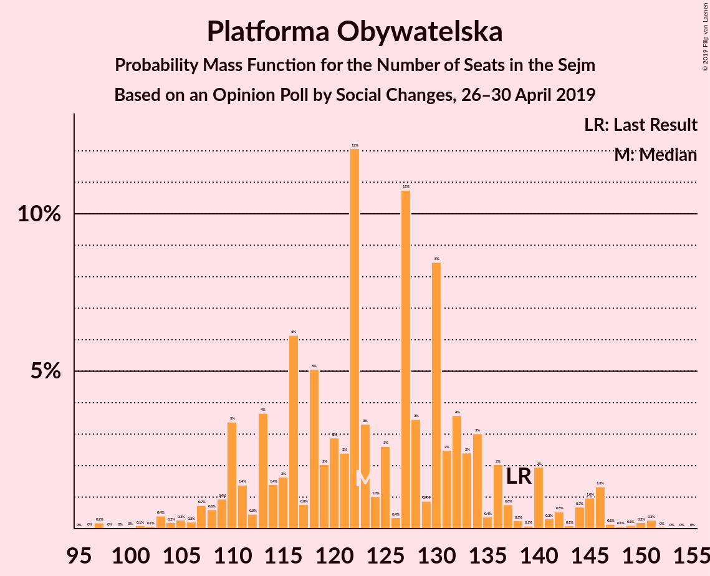
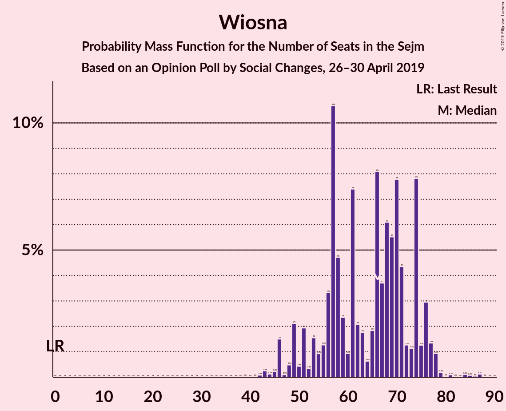

# Opinion Poll by Social Changes, 26–30 April 2019

<a href="#voting-intentions">Voting Intentions</a> | <a href="#seats">Seats</a> | <a href="#coalitions">Coalitions</a> | <a href="#technical-information">Technical Information</a>

## Voting Intentions

### Confidence Intervals

| Party | Last Result | Poll Result | 80% Confidence Interval | 90% Confidence Interval | 95% Confidence Interval | 99% Confidence Interval |
|:-----:|:-----------:|:-----------:|:-----------------------:|:-----------------------:|:-----------------------:|:-----------------------:|
| Prawo i Sprawiedliwość | 37.6% | 35.1% | 33.3–37.1% |32.8–37.6% |32.3–38.1% |31.4–39.0% |
| Platforma Obywatelska | 24.1% | 22.2% | 20.6–23.9% |20.2–24.4% |19.8–24.8% |19.0–25.7% |
| Wiosna | 0.0% | 12.7% | 11.4–14.1% |11.1–14.5% |10.8–14.8% |10.2–15.5% |
| Kukiz’15 | 8.8% | 8.1% | 7.1–9.3% |6.8–9.6% |6.6–9.9% |6.1–10.5% |
| Polskie Stronnictwo Ludowe | 5.1% | 5.5% | 4.7–6.5% |4.5–6.8% |4.3–7.1% |3.9–7.6% |
| Sojusz Lewicy Demokratycznej | 7.6% | 5.1% | 4.4–6.1% |4.1–6.4% |4.0–6.7% |3.6–7.2% |
| KORWiN | 4.8% | 3.2% | 2.6–4.1% |2.5–4.3% |2.3–4.5% |2.1–4.9% |
| Lewica Razem | 3.6% | 3.0% | 2.5–3.9% |2.3–4.1% |2.2–4.3% |1.9–4.7% |

*Note:* The poll result column reflects the actual value used in the calculations. Published results may vary slightly, and in addition be rounded to fewer digits.

## Seats

### Confidence Intervals

| Party | Last Result | Median | 80% Confidence Interval | 90% Confidence Interval | 95% Confidence Interval | 99% Confidence Interval |
|:-----:|:-----------:|:------:|:-----------------------:|:-----------------------:|:-----------------------:|:-----------------------:|
| <a href="#prawo-i-sprawiedliwość">Prawo i Sprawiedliwość</a> | 235 | 214 | 203–227 |192–227 |192–230 |183–235 |
| <a href="#platforma-obywatelska">Platforma Obywatelska</a> | 138 | 113 | 110–136 |110–145 |107–150 |106–151 |
| <a href="#wiosna">Wiosna</a> | 0 | 68 | 54–70 |51–73 |48–75 |43–77 |
| <a href="#kukiz’15">Kukiz’15</a> | 42 | 39 | 24–43 |24–44 |24–47 |14–50 |
| <a href="#polskie-stronnictwo-ludowe">Polskie Stronnictwo Ludowe</a> | 16 | 24 | 13–26 |0–26 |0–26 |0–29 |
| <a href="#sojusz-lewicy-demokratycznej">Sojusz Lewicy Demokratycznej</a> | 0 | 0 | 0–17 |0–23 |0–23 |0–29 |
| <a href="#korwin">KORWiN</a> | 0 | 0 | 0 |0 |0 |0 |
| <a href="#lewica-razem">Lewica Razem</a> | 0 | 0 | 0 |0 |0 |0 |

### Prawo i Sprawiedliwość

*For a full overview of the results for this party, see the [Prawo i Sprawiedliwość](party-prawoisprawiedliwość.html) page.*

| Number of Seats | Probability | Accumulated | Special Marks |
|:---------------:|:-----------:|:-----------:|:-------------:|
| 181 | 0.1% | 100% |  |
| 182 | 0% | 99.8% |  |
| 183 | 1.1% | 99.8% |  |
| 184 | 0% | 98.7% |  |
| 185 | 0% | 98.7% |  |
| 186 | 0% | 98.7% |  |
| 187 | 0% | 98.7% |  |
| 188 | 0.3% | 98.7% |  |
| 189 | 0% | 98% |  |
| 190 | 0.1% | 98% |  |
| 191 | 0% | 98% |  |
| 192 | 3% | 98% |  |
| 193 | 0.1% | 95% |  |
| 194 | 0.2% | 95% |  |
| 195 | 0.4% | 95% |  |
| 196 | 0% | 94% |  |
| 197 | 1.1% | 94% |  |
| 198 | 0.6% | 93% |  |
| 199 | 0.1% | 92% |  |
| 200 | 1.2% | 92% |  |
| 201 | 0.4% | 91% |  |
| 202 | 0.5% | 91% |  |
| 203 | 0.4% | 90% |  |
| 204 | 2% | 90% |  |
| 205 | 0.3% | 88% |  |
| 206 | 3% | 88% |  |
| 207 | 0.1% | 85% |  |
| 208 | 0.5% | 85% |  |
| 209 | 1.1% | 84% |  |
| 210 | 4% | 83% |  |
| 211 | 0.5% | 79% |  |
| 212 | 20% | 79% |  |
| 213 | 1.1% | 58% |  |
| 214 | 8% | 57% | Median |
| 215 | 0.1% | 50% |  |
| 216 | 35% | 49% |  |
| 217 | 1.1% | 14% |  |
| 218 | 0.7% | 13% |  |
| 219 | 0.5% | 12% |  |
| 220 | 0% | 12% |  |
| 221 | 0% | 12% |  |
| 222 | 0.3% | 12% |  |
| 223 | 0.4% | 11% |  |
| 224 | 0.6% | 11% |  |
| 225 | 0.1% | 10% |  |
| 226 | 0.1% | 10% |  |
| 227 | 6% | 10% |  |
| 228 | 0.9% | 4% |  |
| 229 | 0% | 3% |  |
| 230 | 1.4% | 3% |  |
| 231 | 0.7% | 2% | Majority |
| 232 | 0.1% | 1.2% |  |
| 233 | 0% | 1.1% |  |
| 234 | 0% | 1.1% |  |
| 235 | 0.7% | 1.1% | Last Result |
| 236 | 0% | 0.4% |  |
| 237 | 0.1% | 0.4% |  |
| 238 | 0.3% | 0.3% |  |
| 239 | 0% | 0.1% |  |
| 240 | 0% | 0% |  |

### Platforma Obywatelska

*For a full overview of the results for this party, see the [Platforma Obywatelska](party-platformaobywatelska.html) page.*

| Number of Seats | Probability | Accumulated | Special Marks |
|:---------------:|:-----------:|:-----------:|:-------------:|
| 96 | 0.2% | 100% |  |
| 97 | 0% | 99.8% |  |
| 98 | 0% | 99.8% |  |
| 99 | 0% | 99.8% |  |
| 100 | 0.1% | 99.8% |  |
| 101 | 0% | 99.7% |  |
| 102 | 0% | 99.7% |  |
| 103 | 0% | 99.7% |  |
| 104 | 0% | 99.6% |  |
| 105 | 0% | 99.6% |  |
| 106 | 0.1% | 99.6% |  |
| 107 | 3% | 99.5% |  |
| 108 | 0.2% | 96% |  |
| 109 | 0.2% | 96% |  |
| 110 | 35% | 96% |  |
| 111 | 8% | 61% |  |
| 112 | 1.1% | 52% |  |
| 113 | 6% | 51% | Median |
| 114 | 0% | 45% |  |
| 115 | 0% | 45% |  |
| 116 | 0.1% | 45% |  |
| 117 | 0.2% | 45% |  |
| 118 | 0.1% | 45% |  |
| 119 | 1.0% | 45% |  |
| 120 | 0.4% | 44% |  |
| 121 | 0.3% | 43% |  |
| 122 | 1.2% | 43% |  |
| 123 | 21% | 42% |  |
| 124 | 2% | 21% |  |
| 125 | 1.4% | 19% |  |
| 126 | 1.2% | 17% |  |
| 127 | 0.2% | 16% |  |
| 128 | 0.7% | 16% |  |
| 129 | 1.4% | 15% |  |
| 130 | 0.1% | 14% |  |
| 131 | 0.5% | 14% |  |
| 132 | 0% | 13% |  |
| 133 | 0.2% | 13% |  |
| 134 | 0.2% | 13% |  |
| 135 | 0.8% | 13% |  |
| 136 | 3% | 12% |  |
| 137 | 3% | 9% |  |
| 138 | 0.3% | 6% | Last Result |
| 139 | 0.4% | 6% |  |
| 140 | 0.1% | 5% |  |
| 141 | 0.1% | 5% |  |
| 142 | 0.1% | 5% |  |
| 143 | 0% | 5% |  |
| 144 | 0% | 5% |  |
| 145 | 0.2% | 5% |  |
| 146 | 1.1% | 5% |  |
| 147 | 0.7% | 4% |  |
| 148 | 0.3% | 3% |  |
| 149 | 0.1% | 3% |  |
| 150 | 2% | 3% |  |
| 151 | 0.6% | 0.6% |  |
| 152 | 0% | 0% |  |

### Wiosna

*For a full overview of the results for this party, see the [Wiosna](party-wiosna.html) page.*

| Number of Seats | Probability | Accumulated | Special Marks |
|:---------------:|:-----------:|:-----------:|:-------------:|
| 0 | 0% | 100% | Last Result |
| 1 | 0% | 100% |  |
| 2 | 0% | 100% |  |
| 3 | 0% | 100% |  |
| 4 | 0% | 100% |  |
| 5 | 0% | 100% |  |
| 6 | 0% | 100% |  |
| 7 | 0% | 100% |  |
| 8 | 0% | 100% |  |
| 9 | 0% | 100% |  |
| 10 | 0% | 100% |  |
| 11 | 0% | 100% |  |
| 12 | 0% | 100% |  |
| 13 | 0% | 100% |  |
| 14 | 0% | 100% |  |
| 15 | 0% | 100% |  |
| 16 | 0% | 100% |  |
| 17 | 0% | 100% |  |
| 18 | 0% | 100% |  |
| 19 | 0% | 100% |  |
| 20 | 0% | 100% |  |
| 21 | 0% | 100% |  |
| 22 | 0% | 100% |  |
| 23 | 0% | 100% |  |
| 24 | 0% | 100% |  |
| 25 | 0% | 100% |  |
| 26 | 0% | 100% |  |
| 27 | 0% | 100% |  |
| 28 | 0% | 100% |  |
| 29 | 0% | 100% |  |
| 30 | 0% | 100% |  |
| 31 | 0% | 100% |  |
| 32 | 0% | 100% |  |
| 33 | 0% | 100% |  |
| 34 | 0% | 100% |  |
| 35 | 0% | 100% |  |
| 36 | 0% | 100% |  |
| 37 | 0% | 100% |  |
| 38 | 0% | 100% |  |
| 39 | 0.1% | 100% |  |
| 40 | 0% | 99.9% |  |
| 41 | 0% | 99.9% |  |
| 42 | 0% | 99.9% |  |
| 43 | 2% | 99.9% |  |
| 44 | 0% | 98% |  |
| 45 | 0.2% | 98% |  |
| 46 | 0.1% | 98% |  |
| 47 | 0.1% | 98% |  |
| 48 | 0.5% | 98% |  |
| 49 | 0.7% | 97% |  |
| 50 | 0.7% | 96% |  |
| 51 | 3% | 96% |  |
| 52 | 0.9% | 92% |  |
| 53 | 0.6% | 91% |  |
| 54 | 0.9% | 91% |  |
| 55 | 0.2% | 90% |  |
| 56 | 0% | 90% |  |
| 57 | 0% | 90% |  |
| 58 | 0.3% | 90% |  |
| 59 | 0% | 89% |  |
| 60 | 0.7% | 89% |  |
| 61 | 0.3% | 89% |  |
| 62 | 1.5% | 88% |  |
| 63 | 0.7% | 87% |  |
| 64 | 0.2% | 86% |  |
| 65 | 0.3% | 86% |  |
| 66 | 26% | 86% |  |
| 67 | 7% | 60% |  |
| 68 | 8% | 53% | Median |
| 69 | 0.3% | 44% |  |
| 70 | 36% | 44% |  |
| 71 | 1.0% | 8% |  |
| 72 | 0% | 7% |  |
| 73 | 2% | 7% |  |
| 74 | 2% | 5% |  |
| 75 | 0.6% | 3% |  |
| 76 | 0.1% | 2% |  |
| 77 | 2% | 2% |  |
| 78 | 0% | 0.4% |  |
| 79 | 0% | 0.4% |  |
| 80 | 0% | 0.4% |  |
| 81 | 0.3% | 0.4% |  |
| 82 | 0% | 0.1% |  |
| 83 | 0% | 0.1% |  |
| 84 | 0% | 0.1% |  |
| 85 | 0% | 0.1% |  |
| 86 | 0% | 0.1% |  |
| 87 | 0% | 0.1% |  |
| 88 | 0% | 0% |  |

### Kukiz’15

*For a full overview of the results for this party, see the [Kukiz’15](party-kukiz’15.html) page.*

| Number of Seats | Probability | Accumulated | Special Marks |
|:---------------:|:-----------:|:-----------:|:-------------:|
| 10 | 0.1% | 100% |  |
| 11 | 0% | 99.9% |  |
| 12 | 0% | 99.8% |  |
| 13 | 0.2% | 99.8% |  |
| 14 | 0.6% | 99.7% |  |
| 15 | 0% | 99.1% |  |
| 16 | 0% | 99.1% |  |
| 17 | 0% | 99.0% |  |
| 18 | 0% | 99.0% |  |
| 19 | 0.9% | 99.0% |  |
| 20 | 0.1% | 98% |  |
| 21 | 0% | 98% |  |
| 22 | 0.1% | 98% |  |
| 23 | 0% | 98% |  |
| 24 | 9% | 98% |  |
| 25 | 0% | 89% |  |
| 26 | 0% | 89% |  |
| 27 | 0.1% | 89% |  |
| 28 | 2% | 89% |  |
| 29 | 1.0% | 86% |  |
| 30 | 6% | 85% |  |
| 31 | 0% | 79% |  |
| 32 | 0.5% | 79% |  |
| 33 | 1.3% | 79% |  |
| 34 | 4% | 77% |  |
| 35 | 21% | 73% |  |
| 36 | 0.1% | 52% |  |
| 37 | 1.4% | 52% |  |
| 38 | 0.1% | 50% |  |
| 39 | 0.9% | 50% | Median |
| 40 | 38% | 49% |  |
| 41 | 0.5% | 12% |  |
| 42 | 0.9% | 11% | Last Result |
| 43 | 5% | 10% |  |
| 44 | 1.4% | 5% |  |
| 45 | 1.2% | 4% |  |
| 46 | 0.1% | 3% |  |
| 47 | 0.2% | 3% |  |
| 48 | 0.3% | 2% |  |
| 49 | 0% | 2% |  |
| 50 | 2% | 2% |  |
| 51 | 0.1% | 0.2% |  |
| 52 | 0.1% | 0.1% |  |
| 53 | 0% | 0% |  |

### Polskie Stronnictwo Ludowe

*For a full overview of the results for this party, see the [Polskie Stronnictwo Ludowe](party-polskiestronnictwoludowe.html) page.*

| Number of Seats | Probability | Accumulated | Special Marks |
|:---------------:|:-----------:|:-----------:|:-------------:|
| 0 | 9% | 100% |  |
| 1 | 0% | 91% |  |
| 2 | 0% | 91% |  |
| 3 | 0% | 91% |  |
| 4 | 0% | 91% |  |
| 5 | 0% | 91% |  |
| 6 | 0% | 91% |  |
| 7 | 0% | 91% |  |
| 8 | 0% | 91% |  |
| 9 | 0% | 91% |  |
| 10 | 0% | 91% |  |
| 11 | 0% | 91% |  |
| 12 | 0% | 91% |  |
| 13 | 7% | 91% |  |
| 14 | 0.3% | 83% |  |
| 15 | 1.4% | 83% |  |
| 16 | 1.0% | 82% | Last Result |
| 17 | 4% | 81% |  |
| 18 | 0.2% | 77% |  |
| 19 | 2% | 77% |  |
| 20 | 0.6% | 75% |  |
| 21 | 0.9% | 74% |  |
| 22 | 2% | 73% |  |
| 23 | 0.9% | 71% |  |
| 24 | 55% | 70% | Median |
| 25 | 1.4% | 15% |  |
| 26 | 12% | 14% |  |
| 27 | 0.3% | 1.4% |  |
| 28 | 0.6% | 1.1% |  |
| 29 | 0.1% | 0.5% |  |
| 30 | 0.1% | 0.4% |  |
| 31 | 0.1% | 0.3% |  |
| 32 | 0% | 0.3% |  |
| 33 | 0.2% | 0.3% |  |
| 34 | 0.1% | 0.1% |  |
| 35 | 0% | 0% |  |

### Sojusz Lewicy Demokratycznej

*For a full overview of the results for this party, see the [Sojusz Lewicy Demokratycznej](party-sojuszlewicydemokratycznej.html) page.*

| Number of Seats | Probability | Accumulated | Special Marks |
|:---------------:|:-----------:|:-----------:|:-------------:|
| 0 | 67% | 100% | Last Result, Median |
| 1 | 0% | 33% |  |
| 2 | 0% | 33% |  |
| 3 | 0% | 33% |  |
| 4 | 0% | 33% |  |
| 5 | 0% | 33% |  |
| 6 | 0.1% | 33% |  |
| 7 | 0% | 33% |  |
| 8 | 0.2% | 33% |  |
| 9 | 0.2% | 32% |  |
| 10 | 11% | 32% |  |
| 11 | 1.4% | 21% |  |
| 12 | 0.1% | 19% |  |
| 13 | 0% | 19% |  |
| 14 | 4% | 19% |  |
| 15 | 0.1% | 16% |  |
| 16 | 0.6% | 15% |  |
| 17 | 8% | 15% |  |
| 18 | 0.7% | 7% |  |
| 19 | 0.2% | 6% |  |
| 20 | 0.1% | 6% |  |
| 21 | 0.1% | 6% |  |
| 22 | 0.3% | 6% |  |
| 23 | 3% | 5% |  |
| 24 | 0% | 2% |  |
| 25 | 1.0% | 2% |  |
| 26 | 0% | 1.3% |  |
| 27 | 0.2% | 1.2% |  |
| 28 | 0.4% | 1.1% |  |
| 29 | 0.3% | 0.7% |  |
| 30 | 0.1% | 0.3% |  |
| 31 | 0.2% | 0.3% |  |
| 32 | 0.1% | 0.1% |  |
| 33 | 0% | 0% |  |

### KORWiN

*For a full overview of the results for this party, see the [KORWiN](party-korwin.html) page.*

| Number of Seats | Probability | Accumulated | Special Marks |
|:---------------:|:-----------:|:-----------:|:-------------:|
| 0 | 99.8% | 100% | Last Result, Median |
| 1 | 0% | 0.2% |  |
| 2 | 0% | 0.2% |  |
| 3 | 0% | 0.2% |  |
| 4 | 0% | 0.2% |  |
| 5 | 0% | 0.2% |  |
| 6 | 0% | 0.2% |  |
| 7 | 0% | 0.2% |  |
| 8 | 0.1% | 0.2% |  |
| 9 | 0% | 0% |  |

### Lewica Razem

*For a full overview of the results for this party, see the [Lewica Razem](party-lewicarazem.html) page.*

| Number of Seats | Probability | Accumulated | Special Marks |
|:---------------:|:-----------:|:-----------:|:-------------:|
| 0 | 99.9% | 100% | Last Result, Median |
| 1 | 0% | 0.1% |  |
| 2 | 0% | 0.1% |  |
| 3 | 0% | 0.1% |  |
| 4 | 0% | 0.1% |  |
| 5 | 0% | 0.1% |  |
| 6 | 0% | 0.1% |  |
| 7 | 0% | 0.1% |  |
| 8 | 0% | 0.1% |  |
| 9 | 0% | 0.1% |  |
| 10 | 0% | 0.1% |  |
| 11 | 0% | 0% |  |

## Coalitions

### Confidence Intervals

| Coalition | Last Result | Median | Majority? | 80% Confidence Interval | 90% Confidence Interval | 95% Confidence Interval | 99% Confidence Interval |
|:---------:|:-----------:|:------:|:---------:|:-----------------------:|:-----------------------:|:-----------------------:|:-----------------------:|
| Prawo i Sprawiedliwość | 235 | 214 | 2% | 203–227 | 192–227 | 192–230 | 183–235 |
| Platforma Obywatelska | 138 | 113 | 0% | 110–136 | 110–145 | 107–150 | 106–151 |

### Prawo i Sprawiedliwość

| Number of Seats | Probability | Accumulated | Special Marks |
|:---------------:|:-----------:|:-----------:|:-------------:|
| 181 | 0.1% | 100% |  |
| 182 | 0% | 99.8% |  |
| 183 | 1.1% | 99.8% |  |
| 184 | 0% | 98.7% |  |
| 185 | 0% | 98.7% |  |
| 186 | 0% | 98.7% |  |
| 187 | 0% | 98.7% |  |
| 188 | 0.3% | 98.7% |  |
| 189 | 0% | 98% |  |
| 190 | 0.1% | 98% |  |
| 191 | 0% | 98% |  |
| 192 | 3% | 98% |  |
| 193 | 0.1% | 95% |  |
| 194 | 0.2% | 95% |  |
| 195 | 0.4% | 95% |  |
| 196 | 0% | 94% |  |
| 197 | 1.1% | 94% |  |
| 198 | 0.6% | 93% |  |
| 199 | 0.1% | 92% |  |
| 200 | 1.2% | 92% |  |
| 201 | 0.4% | 91% |  |
| 202 | 0.5% | 91% |  |
| 203 | 0.4% | 90% |  |
| 204 | 2% | 90% |  |
| 205 | 0.3% | 88% |  |
| 206 | 3% | 88% |  |
| 207 | 0.1% | 85% |  |
| 208 | 0.5% | 85% |  |
| 209 | 1.1% | 84% |  |
| 210 | 4% | 83% |  |
| 211 | 0.5% | 79% |  |
| 212 | 20% | 79% |  |
| 213 | 1.1% | 58% |  |
| 214 | 8% | 57% | Median |
| 215 | 0.1% | 50% |  |
| 216 | 35% | 49% |  |
| 217 | 1.1% | 14% |  |
| 218 | 0.7% | 13% |  |
| 219 | 0.5% | 12% |  |
| 220 | 0% | 12% |  |
| 221 | 0% | 12% |  |
| 222 | 0.3% | 12% |  |
| 223 | 0.4% | 11% |  |
| 224 | 0.6% | 11% |  |
| 225 | 0.1% | 10% |  |
| 226 | 0.1% | 10% |  |
| 227 | 6% | 10% |  |
| 228 | 0.9% | 4% |  |
| 229 | 0% | 3% |  |
| 230 | 1.4% | 3% |  |
| 231 | 0.7% | 2% | Majority |
| 232 | 0.1% | 1.2% |  |
| 233 | 0% | 1.1% |  |
| 234 | 0% | 1.1% |  |
| 235 | 0.7% | 1.1% | Last Result |
| 236 | 0% | 0.4% |  |
| 237 | 0.1% | 0.4% |  |
| 238 | 0.3% | 0.3% |  |
| 239 | 0% | 0.1% |  |
| 240 | 0% | 0% |  |

### Platforma Obywatelska

| Number of Seats | Probability | Accumulated | Special Marks |
|:---------------:|:-----------:|:-----------:|:-------------:|
| 96 | 0.2% | 100% |  |
| 97 | 0% | 99.8% |  |
| 98 | 0% | 99.8% |  |
| 99 | 0% | 99.8% |  |
| 100 | 0.1% | 99.8% |  |
| 101 | 0% | 99.7% |  |
| 102 | 0% | 99.7% |  |
| 103 | 0% | 99.7% |  |
| 104 | 0% | 99.6% |  |
| 105 | 0% | 99.6% |  |
| 106 | 0.1% | 99.6% |  |
| 107 | 3% | 99.5% |  |
| 108 | 0.2% | 96% |  |
| 109 | 0.2% | 96% |  |
| 110 | 35% | 96% |  |
| 111 | 8% | 61% |  |
| 112 | 1.1% | 52% |  |
| 113 | 6% | 51% | Median |
| 114 | 0% | 45% |  |
| 115 | 0% | 45% |  |
| 116 | 0.1% | 45% |  |
| 117 | 0.2% | 45% |  |
| 118 | 0.1% | 45% |  |
| 119 | 1.0% | 45% |  |
| 120 | 0.4% | 44% |  |
| 121 | 0.3% | 43% |  |
| 122 | 1.2% | 43% |  |
| 123 | 21% | 42% |  |
| 124 | 2% | 21% |  |
| 125 | 1.4% | 19% |  |
| 126 | 1.2% | 17% |  |
| 127 | 0.2% | 16% |  |
| 128 | 0.7% | 16% |  |
| 129 | 1.4% | 15% |  |
| 130 | 0.1% | 14% |  |
| 131 | 0.5% | 14% |  |
| 132 | 0% | 13% |  |
| 133 | 0.2% | 13% |  |
| 134 | 0.2% | 13% |  |
| 135 | 0.8% | 13% |  |
| 136 | 3% | 12% |  |
| 137 | 3% | 9% |  |
| 138 | 0.3% | 6% | Last Result |
| 139 | 0.4% | 6% |  |
| 140 | 0.1% | 5% |  |
| 141 | 0.1% | 5% |  |
| 142 | 0.1% | 5% |  |
| 143 | 0% | 5% |  |
| 144 | 0% | 5% |  |
| 145 | 0.2% | 5% |  |
| 146 | 1.1% | 5% |  |
| 147 | 0.7% | 4% |  |
| 148 | 0.3% | 3% |  |
| 149 | 0.1% | 3% |  |
| 150 | 2% | 3% |  |
| 151 | 0.6% | 0.6% |  |
| 152 | 0% | 0% |  |

## Technical Information

### Opinion Poll

+ **Polling firm:** Social Changes
+ **Commissioner(s):** —
+ **Fieldwork period:** 26–30 April 2019

### Calculations

+ **Sample size:** 1050
+ **Simulations done:** 16,384
+ **Error estimate:** 1.89%

