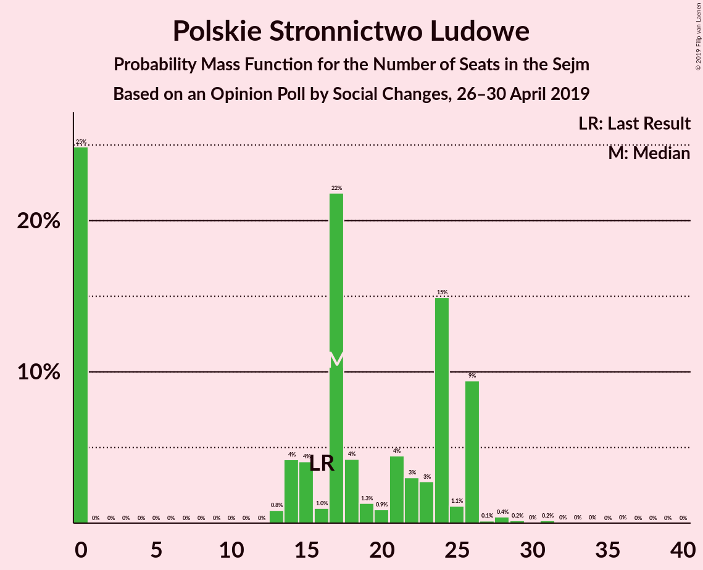

# Opinion Poll by Social Changes, 26–30 April 2019

<a href="#voting-intentions">Voting Intentions</a> | <a href="#seats">Seats</a> | <a href="#coalitions">Coalitions</a> | <a href="#technical-information">Technical Information</a>

## Voting Intentions

### Confidence Intervals

| Party | Last Result | Poll Result | 80% Confidence Interval | 90% Confidence Interval | 95% Confidence Interval | 99% Confidence Interval |
|:-----:|:-----------:|:-----------:|:-----------------------:|:-----------------------:|:-----------------------:|:-----------------------:|
| Prawo i Sprawiedliwość | 37.6% | 35.1% | 33.3–37.1% |32.8–37.6% |32.3–38.1% |31.4–39.0% |
| Platforma Obywatelska | 24.1% | 22.2% | 20.6–23.9% |20.2–24.4% |19.8–24.8% |19.0–25.7% |
| Wiosna | 0.0% | 12.7% | 11.4–14.1% |11.1–14.5% |10.8–14.8% |10.2–15.5% |
| Kukiz’15 | 8.8% | 8.1% | 7.1–9.3% |6.8–9.6% |6.6–9.9% |6.1–10.5% |
| Polskie Stronnictwo Ludowe | 5.1% | 5.5% | 4.7–6.5% |4.5–6.8% |4.3–7.1% |3.9–7.6% |
| Sojusz Lewicy Demokratycznej | 7.6% | 5.1% | 4.4–6.1% |4.1–6.4% |4.0–6.7% |3.6–7.2% |
| KORWiN | 4.8% | 3.2% | 2.6–4.1% |2.5–4.3% |2.3–4.5% |2.1–4.9% |
| Lewica Razem | 3.6% | 3.0% | 2.5–3.9% |2.3–4.1% |2.2–4.3% |1.9–4.7% |

*Note:* The poll result column reflects the actual value used in the calculations. Published results may vary slightly, and in addition be rounded to fewer digits.

## Seats

### Confidence Intervals

| Party | Last Result | Median | 80% Confidence Interval | 90% Confidence Interval | 95% Confidence Interval | 99% Confidence Interval |
|:-----:|:-----------:|:------:|:-----------------------:|:-----------------------:|:-----------------------:|:-----------------------:|
| <a href="#prawo-i-sprawiedliwość">Prawo i Sprawiedliwość</a> | 235 | 214 | 214–227 |213–227 |198–227 |198–227 |
| <a href="#platforma-obywatelska">Platforma Obywatelska</a> | 138 | 111 | 111–113 |111–131 |111–151 |109–151 |
| <a href="#wiosna">Wiosna</a> | 0 | 68 | 67–68 |54–68 |52–68 |52–68 |
| <a href="#kukiz’15">Kukiz’15</a> | 42 | 24 | 24–30 |24–40 |24–40 |22–44 |
| <a href="#polskie-stronnictwo-ludowe">Polskie Stronnictwo Ludowe</a> | 16 | 26 | 13–26 |13–26 |13–26 |0–26 |
| <a href="#sojusz-lewicy-demokratycznej">Sojusz Lewicy Demokratycznej</a> | 0 | 17 | 10–17 |6–17 |0–17 |0–28 |
| <a href="#korwin">KORWiN</a> | 0 | 0 | 0 |0 |0 |0 |
| <a href="#lewica-razem">Lewica Razem</a> | 0 | 0 | 0 |0 |0 |0 |

### Prawo i Sprawiedliwość

*For a full overview of the results for this party, see the [Prawo i Sprawiedliwość](party-prawoisprawiedliwość.html) page.*

| Number of Seats | Probability | Accumulated | Special Marks |
|:---------------:|:-----------:|:-----------:|:-------------:|
| 197 | 0.2% | 100% |  |
| 198 | 4% | 99.8% |  |
| 199 | 0% | 96% |  |
| 200 | 0.1% | 96% |  |
| 201 | 0% | 96% |  |
| 202 | 0% | 96% |  |
| 203 | 0.1% | 96% |  |
| 204 | 0% | 96% |  |
| 205 | 0% | 96% |  |
| 206 | 0% | 96% |  |
| 207 | 0.5% | 96% |  |
| 208 | 0% | 95% |  |
| 209 | 0% | 95% |  |
| 210 | 0.1% | 95% |  |
| 211 | 0% | 95% |  |
| 212 | 0% | 95% |  |
| 213 | 0.5% | 95% |  |
| 214 | 53% | 94% | Median |
| 215 | 0% | 41% |  |
| 216 | 0% | 41% |  |
| 217 | 0% | 41% |  |
| 218 | 0% | 41% |  |
| 219 | 0% | 41% |  |
| 220 | 0% | 41% |  |
| 221 | 0% | 41% |  |
| 222 | 0% | 41% |  |
| 223 | 0% | 41% |  |
| 224 | 0.7% | 41% |  |
| 225 | 0% | 41% |  |
| 226 | 0% | 41% |  |
| 227 | 41% | 41% |  |
| 228 | 0% | 0.1% |  |
| 229 | 0% | 0.1% |  |
| 230 | 0% | 0.1% |  |
| 231 | 0% | 0% | Majority |
| 232 | 0% | 0% |  |
| 233 | 0% | 0% |  |
| 234 | 0% | 0% |  |
| 235 | 0% | 0% | Last Result |

### Platforma Obywatelska

*For a full overview of the results for this party, see the [Platforma Obywatelska](party-platformaobywatelska.html) page.*

| Number of Seats | Probability | Accumulated | Special Marks |
|:---------------:|:-----------:|:-----------:|:-------------:|
| 108 | 0.2% | 100% |  |
| 109 | 0.5% | 99.8% |  |
| 110 | 0% | 99.2% |  |
| 111 | 53% | 99.2% | Median |
| 112 | 0% | 46% |  |
| 113 | 41% | 46% |  |
| 114 | 0% | 6% |  |
| 115 | 0% | 6% |  |
| 116 | 0% | 6% |  |
| 117 | 0% | 6% |  |
| 118 | 0% | 6% |  |
| 119 | 0% | 6% |  |
| 120 | 0% | 6% |  |
| 121 | 0.5% | 6% |  |
| 122 | 0% | 5% |  |
| 123 | 0% | 5% |  |
| 124 | 0% | 5% |  |
| 125 | 0.1% | 5% |  |
| 126 | 0% | 5% |  |
| 127 | 0% | 5% |  |
| 128 | 0% | 5% |  |
| 129 | 0% | 5% |  |
| 130 | 0% | 5% |  |
| 131 | 0% | 5% |  |
| 132 | 0% | 5% |  |
| 133 | 0.2% | 5% |  |
| 134 | 0% | 5% |  |
| 135 | 0% | 5% |  |
| 136 | 0% | 5% |  |
| 137 | 0% | 5% |  |
| 138 | 0% | 5% | Last Result |
| 139 | 0% | 5% |  |
| 140 | 0% | 5% |  |
| 141 | 0% | 5% |  |
| 142 | 0% | 5% |  |
| 143 | 0% | 5% |  |
| 144 | 0% | 5% |  |
| 145 | 0% | 5% |  |
| 146 | 0% | 5% |  |
| 147 | 0% | 5% |  |
| 148 | 0.2% | 5% |  |
| 149 | 0.5% | 5% |  |
| 150 | 0% | 4% |  |
| 151 | 4% | 4% |  |
| 152 | 0% | 0% |  |

### Wiosna

*For a full overview of the results for this party, see the [Wiosna](party-wiosna.html) page.*

| Number of Seats | Probability | Accumulated | Special Marks |
|:---------------:|:-----------:|:-----------:|:-------------:|
| 0 | 0% | 100% | Last Result |
| 1 | 0% | 100% |  |
| 2 | 0% | 100% |  |
| 3 | 0% | 100% |  |
| 4 | 0% | 100% |  |
| 5 | 0% | 100% |  |
| 6 | 0% | 100% |  |
| 7 | 0% | 100% |  |
| 8 | 0% | 100% |  |
| 9 | 0% | 100% |  |
| 10 | 0% | 100% |  |
| 11 | 0% | 100% |  |
| 12 | 0% | 100% |  |
| 13 | 0% | 100% |  |
| 14 | 0% | 100% |  |
| 15 | 0% | 100% |  |
| 16 | 0% | 100% |  |
| 17 | 0% | 100% |  |
| 18 | 0% | 100% |  |
| 19 | 0% | 100% |  |
| 20 | 0% | 100% |  |
| 21 | 0% | 100% |  |
| 22 | 0% | 100% |  |
| 23 | 0% | 100% |  |
| 24 | 0% | 100% |  |
| 25 | 0% | 100% |  |
| 26 | 0% | 100% |  |
| 27 | 0% | 100% |  |
| 28 | 0% | 100% |  |
| 29 | 0% | 100% |  |
| 30 | 0% | 100% |  |
| 31 | 0% | 100% |  |
| 32 | 0% | 100% |  |
| 33 | 0% | 100% |  |
| 34 | 0% | 100% |  |
| 35 | 0% | 100% |  |
| 36 | 0% | 100% |  |
| 37 | 0% | 100% |  |
| 38 | 0% | 100% |  |
| 39 | 0% | 100% |  |
| 40 | 0% | 100% |  |
| 41 | 0% | 100% |  |
| 42 | 0% | 100% |  |
| 43 | 0.2% | 100% |  |
| 44 | 0% | 99.8% |  |
| 45 | 0% | 99.8% |  |
| 46 | 0% | 99.8% |  |
| 47 | 0% | 99.8% |  |
| 48 | 0% | 99.8% |  |
| 49 | 0.2% | 99.8% |  |
| 50 | 0% | 99.6% |  |
| 51 | 0% | 99.6% |  |
| 52 | 4% | 99.6% |  |
| 53 | 0% | 95% |  |
| 54 | 0.6% | 95% |  |
| 55 | 0% | 95% |  |
| 56 | 0% | 95% |  |
| 57 | 0% | 95% |  |
| 58 | 0% | 95% |  |
| 59 | 0% | 95% |  |
| 60 | 0.5% | 95% |  |
| 61 | 0% | 94% |  |
| 62 | 0% | 94% |  |
| 63 | 0% | 94% |  |
| 64 | 0% | 94% |  |
| 65 | 0.2% | 94% |  |
| 66 | 0% | 94% |  |
| 67 | 41% | 94% |  |
| 68 | 53% | 53% | Median |
| 69 | 0% | 0.2% |  |
| 70 | 0% | 0.2% |  |
| 71 | 0% | 0.2% |  |
| 72 | 0% | 0.2% |  |
| 73 | 0.2% | 0.2% |  |
| 74 | 0% | 0% |  |

### Kukiz’15

*For a full overview of the results for this party, see the [Kukiz’15](party-kukiz’15.html) page.*

| Number of Seats | Probability | Accumulated | Special Marks |
|:---------------:|:-----------:|:-----------:|:-------------:|
| 22 | 0.5% | 100% |  |
| 23 | 0% | 99.4% |  |
| 24 | 53% | 99.4% | Median |
| 25 | 0% | 46% |  |
| 26 | 0% | 46% |  |
| 27 | 0% | 46% |  |
| 28 | 0% | 46% |  |
| 29 | 0% | 46% |  |
| 30 | 41% | 46% |  |
| 31 | 0% | 6% |  |
| 32 | 0% | 6% |  |
| 33 | 0% | 6% |  |
| 34 | 0.3% | 6% |  |
| 35 | 0% | 5% |  |
| 36 | 0% | 5% |  |
| 37 | 0% | 5% |  |
| 38 | 0% | 5% |  |
| 39 | 0% | 5% |  |
| 40 | 4% | 5% |  |
| 41 | 0.2% | 1.4% |  |
| 42 | 0% | 1.2% | Last Result |
| 43 | 0.2% | 1.2% |  |
| 44 | 0.5% | 0.9% |  |
| 45 | 0% | 0.4% |  |
| 46 | 0% | 0.4% |  |
| 47 | 0% | 0.4% |  |
| 48 | 0% | 0.4% |  |
| 49 | 0% | 0.3% |  |
| 50 | 0% | 0.3% |  |
| 51 | 0% | 0.3% |  |
| 52 | 0.3% | 0.3% |  |
| 53 | 0% | 0% |  |

### Polskie Stronnictwo Ludowe

*For a full overview of the results for this party, see the [Polskie Stronnictwo Ludowe](party-polskiestronnictwoludowe.html) page.*

| Number of Seats | Probability | Accumulated | Special Marks |
|:---------------:|:-----------:|:-----------:|:-------------:|
| 0 | 1.0% | 100% |  |
| 1 | 0% | 99.0% |  |
| 2 | 0% | 99.0% |  |
| 3 | 0% | 99.0% |  |
| 4 | 0% | 99.0% |  |
| 5 | 0% | 99.0% |  |
| 6 | 0% | 99.0% |  |
| 7 | 0% | 99.0% |  |
| 8 | 0% | 99.0% |  |
| 9 | 0% | 99.0% |  |
| 10 | 0% | 99.0% |  |
| 11 | 0% | 99.0% |  |
| 12 | 0% | 99.0% |  |
| 13 | 41% | 99.0% |  |
| 14 | 0% | 58% |  |
| 15 | 0% | 58% |  |
| 16 | 0% | 58% | Last Result |
| 17 | 0.6% | 58% |  |
| 18 | 0% | 58% |  |
| 19 | 4% | 58% |  |
| 20 | 0.2% | 54% |  |
| 21 | 0.4% | 54% |  |
| 22 | 0% | 53% |  |
| 23 | 0% | 53% |  |
| 24 | 0% | 53% |  |
| 25 | 0% | 53% |  |
| 26 | 53% | 53% | Median |
| 27 | 0% | 0.1% |  |
| 28 | 0% | 0.1% |  |
| 29 | 0% | 0.1% |  |
| 30 | 0.1% | 0.1% |  |
| 31 | 0% | 0% |  |

### Sojusz Lewicy Demokratycznej

*For a full overview of the results for this party, see the [Sojusz Lewicy Demokratycznej](party-sojuszlewicydemokratycznej.html) page.*

| Number of Seats | Probability | Accumulated | Special Marks |
|:---------------:|:-----------:|:-----------:|:-------------:|
| 0 | 5% | 100% | Last Result |
| 1 | 0% | 95% |  |
| 2 | 0% | 95% |  |
| 3 | 0% | 95% |  |
| 4 | 0% | 95% |  |
| 5 | 0% | 95% |  |
| 6 | 0.2% | 95% |  |
| 7 | 0% | 95% |  |
| 8 | 0% | 95% |  |
| 9 | 0% | 95% |  |
| 10 | 41% | 95% |  |
| 11 | 0% | 54% |  |
| 12 | 0% | 54% |  |
| 13 | 0% | 54% |  |
| 14 | 0% | 54% |  |
| 15 | 0% | 54% |  |
| 16 | 0% | 54% |  |
| 17 | 53% | 54% | Median |
| 18 | 0% | 1.2% |  |
| 19 | 0% | 1.2% |  |
| 20 | 0% | 1.2% |  |
| 21 | 0% | 1.2% |  |
| 22 | 0% | 1.2% |  |
| 23 | 0.2% | 1.2% |  |
| 24 | 0% | 1.0% |  |
| 25 | 0% | 1.0% |  |
| 26 | 0.1% | 1.0% |  |
| 27 | 0% | 0.9% |  |
| 28 | 0.9% | 0.9% |  |
| 29 | 0% | 0% |  |

### KORWiN

*For a full overview of the results for this party, see the [KORWiN](party-korwin.html) page.*

| Number of Seats | Probability | Accumulated | Special Marks |
|:---------------:|:-----------:|:-----------:|:-------------:|
| 0 | 100% | 100% | Last Result, Median |

### Lewica Razem

*For a full overview of the results for this party, see the [Lewica Razem](party-lewicarazem.html) page.*

| Number of Seats | Probability | Accumulated | Special Marks |
|:---------------:|:-----------:|:-----------:|:-------------:|
| 0 | 100% | 100% | Last Result, Median |

## Coalitions

### Confidence Intervals

| Coalition | Last Result | Median | Majority? | 80% Confidence Interval | 90% Confidence Interval | 95% Confidence Interval | 99% Confidence Interval |
|:---------:|:-----------:|:------:|:---------:|:-----------------------:|:-----------------------:|:-----------------------:|:-----------------------:|
| Prawo i Sprawiedliwość | 235 | 214 | 0% | 214–227 | 213–227 | 198–227 | 198–227 |
| Platforma Obywatelska | 138 | 111 | 0% | 111–113 | 111–131 | 111–151 | 109–151 |

### Prawo i Sprawiedliwość

| Number of Seats | Probability | Accumulated | Special Marks |
|:---------------:|:-----------:|:-----------:|:-------------:|
| 197 | 0.2% | 100% |  |
| 198 | 4% | 99.8% |  |
| 199 | 0% | 96% |  |
| 200 | 0.1% | 96% |  |
| 201 | 0% | 96% |  |
| 202 | 0% | 96% |  |
| 203 | 0.1% | 96% |  |
| 204 | 0% | 96% |  |
| 205 | 0% | 96% |  |
| 206 | 0% | 96% |  |
| 207 | 0.5% | 96% |  |
| 208 | 0% | 95% |  |
| 209 | 0% | 95% |  |
| 210 | 0.1% | 95% |  |
| 211 | 0% | 95% |  |
| 212 | 0% | 95% |  |
| 213 | 0.5% | 95% |  |
| 214 | 53% | 94% | Median |
| 215 | 0% | 41% |  |
| 216 | 0% | 41% |  |
| 217 | 0% | 41% |  |
| 218 | 0% | 41% |  |
| 219 | 0% | 41% |  |
| 220 | 0% | 41% |  |
| 221 | 0% | 41% |  |
| 222 | 0% | 41% |  |
| 223 | 0% | 41% |  |
| 224 | 0.7% | 41% |  |
| 225 | 0% | 41% |  |
| 226 | 0% | 41% |  |
| 227 | 41% | 41% |  |
| 228 | 0% | 0.1% |  |
| 229 | 0% | 0.1% |  |
| 230 | 0% | 0.1% |  |
| 231 | 0% | 0% | Majority |
| 232 | 0% | 0% |  |
| 233 | 0% | 0% |  |
| 234 | 0% | 0% |  |
| 235 | 0% | 0% | Last Result |

### Platforma Obywatelska

| Number of Seats | Probability | Accumulated | Special Marks |
|:---------------:|:-----------:|:-----------:|:-------------:|
| 108 | 0.2% | 100% |  |
| 109 | 0.5% | 99.8% |  |
| 110 | 0% | 99.2% |  |
| 111 | 53% | 99.2% | Median |
| 112 | 0% | 46% |  |
| 113 | 41% | 46% |  |
| 114 | 0% | 6% |  |
| 115 | 0% | 6% |  |
| 116 | 0% | 6% |  |
| 117 | 0% | 6% |  |
| 118 | 0% | 6% |  |
| 119 | 0% | 6% |  |
| 120 | 0% | 6% |  |
| 121 | 0.5% | 6% |  |
| 122 | 0% | 5% |  |
| 123 | 0% | 5% |  |
| 124 | 0% | 5% |  |
| 125 | 0.1% | 5% |  |
| 126 | 0% | 5% |  |
| 127 | 0% | 5% |  |
| 128 | 0% | 5% |  |
| 129 | 0% | 5% |  |
| 130 | 0% | 5% |  |
| 131 | 0% | 5% |  |
| 132 | 0% | 5% |  |
| 133 | 0.2% | 5% |  |
| 134 | 0% | 5% |  |
| 135 | 0% | 5% |  |
| 136 | 0% | 5% |  |
| 137 | 0% | 5% |  |
| 138 | 0% | 5% | Last Result |
| 139 | 0% | 5% |  |
| 140 | 0% | 5% |  |
| 141 | 0% | 5% |  |
| 142 | 0% | 5% |  |
| 143 | 0% | 5% |  |
| 144 | 0% | 5% |  |
| 145 | 0% | 5% |  |
| 146 | 0% | 5% |  |
| 147 | 0% | 5% |  |
| 148 | 0.2% | 5% |  |
| 149 | 0.5% | 5% |  |
| 150 | 0% | 4% |  |
| 151 | 4% | 4% |  |
| 152 | 0% | 0% |  |

## Technical Information

### Opinion Poll

+ **Polling firm:** Social Changes
+ **Commissioner(s):** —
+ **Fieldwork period:** 26–30 April 2019

### Calculations

+ **Sample size:** 1050
+ **Simulations done:** 1,024
+ **Error estimate:** 2.19%

