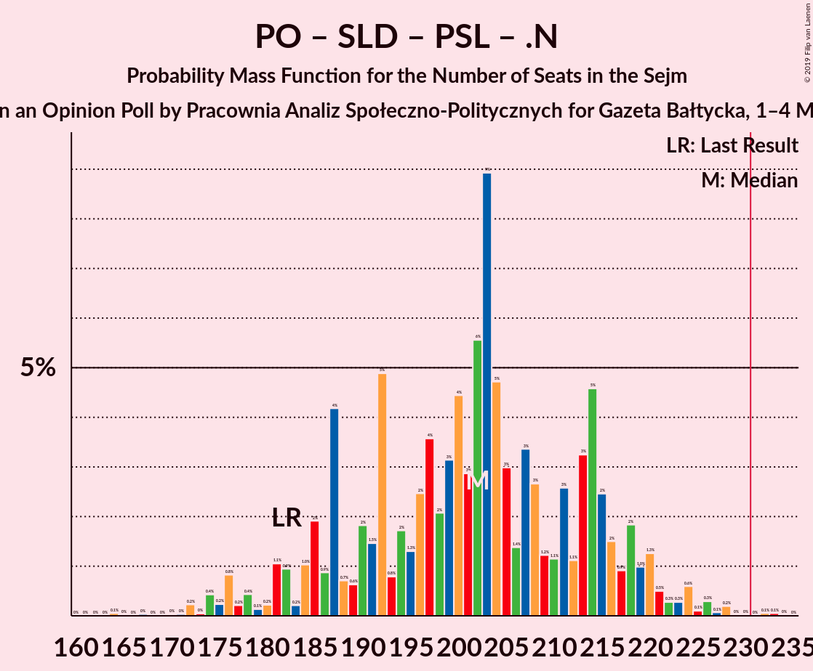
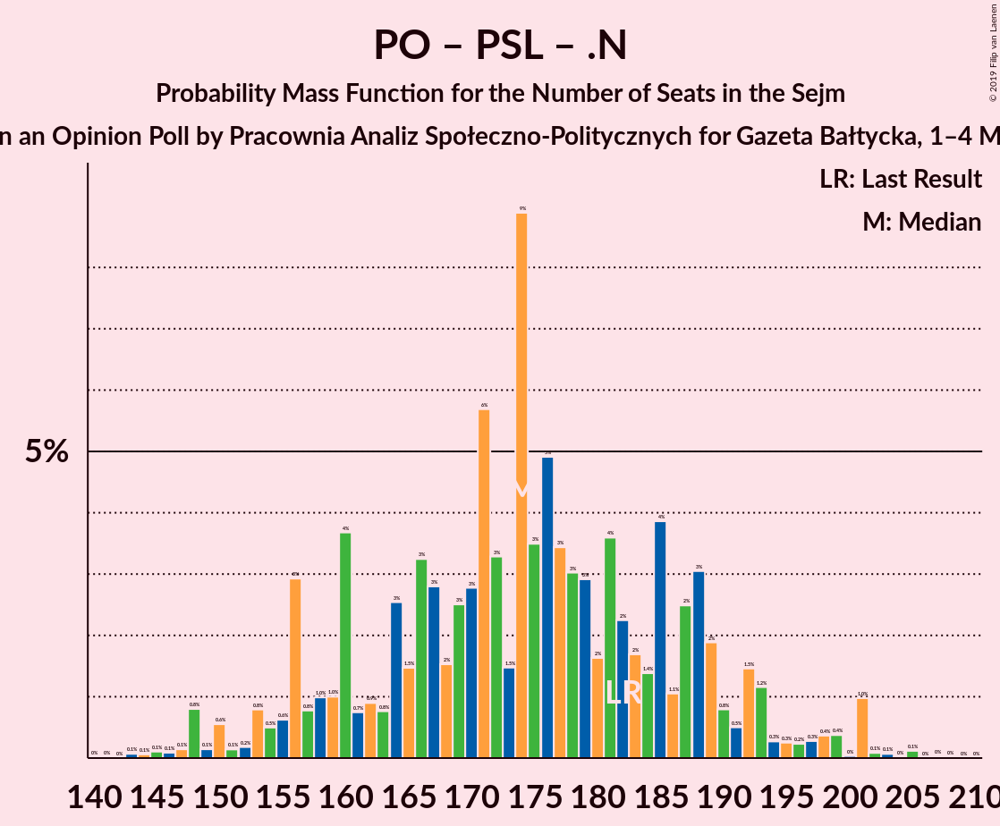

# Opinion Poll by Pracownia Analiz Społeczno-Politycznych for Gazeta Bałtycka, 1–4 May 2019

<a href="#voting-intentions">Voting Intentions</a> | <a href="#seats">Seats</a> | <a href="#coalitions">Coalitions</a> | <a href="#technical-information">Technical Information</a>

## Voting Intentions

### Confidence Intervals

| Party | Last Result | Poll Result | 80% Confidence Interval | 90% Confidence Interval | 95% Confidence Interval | 99% Confidence Interval |
|:-----:|:-----------:|:-----------:|:-----------------------:|:-----------------------:|:-----------------------:|:-----------------------:|
| Prawo i Sprawiedliwość | 37.6% | 36.0% | 34.1–37.9% |33.6–38.4% |33.1–38.9% |32.2–39.8% |
| Platforma Obywatelska | 24.1% | 28.0% | 26.3–29.8% |25.8–30.3% |25.4–30.8% |24.5–31.7% |
| Kukiz’15 | 8.8% | 9.0% | 8.0–10.2% |7.7–10.6% |7.4–10.9% |7.0–11.5% |
| Sojusz Lewicy Demokratycznej | 7.6% | 7.0% | 6.1–8.1% |5.8–8.5% |5.6–8.7% |5.2–9.3% |
| Polskie Stronnictwo Ludowe | 5.1% | 5.5% | 4.7–6.5% |4.5–6.8% |4.3–7.1% |3.9–7.6% |
| Wiosna | 0.0% | 4.5% | 3.7–5.4% |3.5–5.7% |3.4–5.9% |3.0–6.4% |
| KORWiN | 4.8% | 4.0% | 3.3–4.9% |3.1–5.1% |3.0–5.3% |2.7–5.8% |
| .Nowoczesna | 7.6% | 2.5% | 2.0–3.2% |1.8–3.4% |1.7–3.6% |1.5–4.0% |
| Lewica Razem | 3.6% | 2.0% | 1.5–2.7% |1.4–2.9% |1.3–3.0% |1.1–3.4% |

*Note:* The poll result column reflects the actual value used in the calculations. Published results may vary slightly, and in addition be rounded to fewer digits.

## Seats

### Confidence Intervals

| Party | Last Result | Median | 80% Confidence Interval | 90% Confidence Interval | 95% Confidence Interval | 99% Confidence Interval |
|:-----:|:-----------:|:------:|:-----------------------:|:-----------------------:|:-----------------------:|:-----------------------:|
| <a href="#prawo-i-sprawiedliwość">Prawo i Sprawiedliwość</a> | 235 | 208 | 200–216 |197–221 |195–223 |192–230 |
| <a href="#platforma-obywatelska">Platforma Obywatelska</a> | 138 | 158 | 149–170 |147–182 |144–182 |138–182 |
| <a href="#kukiz’15">Kukiz’15</a> | 42 | 42 | 38–48 |31–49 |28–49 |28–53 |
| <a href="#sojusz-lewicy-demokratycznej">Sojusz Lewicy Demokratycznej</a> | 0 | 31 | 17–35 |14–38 |14–38 |9–40 |
| <a href="#polskie-stronnictwo-ludowe">Polskie Stronnictwo Ludowe</a> | 16 | 22 | 15–23 |13–24 |0–25 |0–26 |
| <a href="#wiosna">Wiosna</a> | 0 | 0 | 0–10 |0–13 |0–14 |0–17 |
| <a href="#korwin">KORWiN</a> | 0 | 0 | 0 |0 |0–6 |0–8 |
| <a href="#.nowoczesna">.Nowoczesna</a> | 28 | 0 | 0 |0 |0 |0 |
| <a href="#lewica-razem">Lewica Razem</a> | 0 | 0 | 0 |0 |0 |0 |

### Prawo i Sprawiedliwość

*For a full overview of the results for this party, see the [Prawo i Sprawiedliwość](party-prawoisprawiedliwość.html) page.*

| Number of Seats | Probability | Accumulated | Special Marks |
|:---------------:|:-----------:|:-----------:|:-------------:|
| 189 | 0% | 100% |  |
| 190 | 0.3% | 99.9% |  |
| 191 | 0.1% | 99.6% |  |
| 192 | 0.4% | 99.5% |  |
| 193 | 0.4% | 99.2% |  |
| 194 | 0.5% | 98.8% |  |
| 195 | 1.1% | 98% |  |
| 196 | 2% | 97% |  |
| 197 | 0.2% | 95% |  |
| 198 | 0.3% | 95% |  |
| 199 | 3% | 95% |  |
| 200 | 2% | 91% |  |
| 201 | 1.2% | 89% |  |
| 202 | 1.0% | 88% |  |
| 203 | 14% | 87% |  |
| 204 | 5% | 72% |  |
| 205 | 10% | 68% |  |
| 206 | 2% | 58% |  |
| 207 | 3% | 55% |  |
| 208 | 18% | 52% | Median |
| 209 | 5% | 34% |  |
| 210 | 2% | 29% |  |
| 211 | 3% | 27% |  |
| 212 | 5% | 24% |  |
| 213 | 2% | 19% |  |
| 214 | 4% | 16% |  |
| 215 | 2% | 13% |  |
| 216 | 4% | 11% |  |
| 217 | 1.0% | 7% |  |
| 218 | 0.6% | 6% |  |
| 219 | 0.3% | 6% |  |
| 220 | 0% | 5% |  |
| 221 | 2% | 5% |  |
| 222 | 0.3% | 3% |  |
| 223 | 0.1% | 3% |  |
| 224 | 0% | 2% |  |
| 225 | 2% | 2% |  |
| 226 | 0% | 0.7% |  |
| 227 | 0.1% | 0.6% |  |
| 228 | 0% | 0.6% |  |
| 229 | 0% | 0.6% |  |
| 230 | 0.1% | 0.6% |  |
| 231 | 0.1% | 0.5% | Majority |
| 232 | 0% | 0.4% |  |
| 233 | 0% | 0.4% |  |
| 234 | 0.1% | 0.4% |  |
| 235 | 0% | 0.3% | Last Result |
| 236 | 0% | 0.3% |  |
| 237 | 0% | 0.3% |  |
| 238 | 0% | 0.3% |  |
| 239 | 0% | 0.3% |  |
| 240 | 0% | 0.3% |  |
| 241 | 0% | 0.3% |  |
| 242 | 0.2% | 0.3% |  |
| 243 | 0% | 0.1% |  |
| 244 | 0.1% | 0.1% |  |
| 245 | 0% | 0% |  |

### Platforma Obywatelska

*For a full overview of the results for this party, see the [Platforma Obywatelska](party-platformaobywatelska.html) page.*

| Number of Seats | Probability | Accumulated | Special Marks |
|:---------------:|:-----------:|:-----------:|:-------------:|
| 133 | 0.1% | 100% |  |
| 134 | 0% | 99.9% |  |
| 135 | 0% | 99.9% |  |
| 136 | 0% | 99.8% |  |
| 137 | 0.1% | 99.8% |  |
| 138 | 0.3% | 99.7% | Last Result |
| 139 | 0.3% | 99.4% |  |
| 140 | 1.1% | 99.0% |  |
| 141 | 0.1% | 98% |  |
| 142 | 0% | 98% |  |
| 143 | 0.3% | 98% |  |
| 144 | 0.4% | 98% |  |
| 145 | 0% | 97% |  |
| 146 | 1.4% | 97% |  |
| 147 | 2% | 96% |  |
| 148 | 4% | 94% |  |
| 149 | 5% | 90% |  |
| 150 | 1.3% | 85% |  |
| 151 | 6% | 83% |  |
| 152 | 3% | 77% |  |
| 153 | 0.1% | 74% |  |
| 154 | 3% | 74% |  |
| 155 | 0.8% | 71% |  |
| 156 | 3% | 71% |  |
| 157 | 0.1% | 68% |  |
| 158 | 20% | 68% | Median |
| 159 | 1.3% | 48% |  |
| 160 | 4% | 46% |  |
| 161 | 0.4% | 43% |  |
| 162 | 16% | 42% |  |
| 163 | 2% | 26% |  |
| 164 | 0.4% | 24% |  |
| 165 | 3% | 24% |  |
| 166 | 3% | 21% |  |
| 167 | 1.3% | 18% |  |
| 168 | 3% | 17% |  |
| 169 | 3% | 13% |  |
| 170 | 0.3% | 10% |  |
| 171 | 1.1% | 10% |  |
| 172 | 0.3% | 9% |  |
| 173 | 0.3% | 9% |  |
| 174 | 0.1% | 8% |  |
| 175 | 0.5% | 8% |  |
| 176 | 0.3% | 8% |  |
| 177 | 0.1% | 7% |  |
| 178 | 0.1% | 7% |  |
| 179 | 0.3% | 7% |  |
| 180 | 0.6% | 7% |  |
| 181 | 0.1% | 6% |  |
| 182 | 6% | 6% |  |
| 183 | 0.1% | 0.4% |  |
| 184 | 0% | 0.2% |  |
| 185 | 0% | 0.2% |  |
| 186 | 0.1% | 0.2% |  |
| 187 | 0% | 0.1% |  |
| 188 | 0% | 0.1% |  |
| 189 | 0% | 0.1% |  |
| 190 | 0% | 0.1% |  |
| 191 | 0% | 0.1% |  |
| 192 | 0% | 0.1% |  |
| 193 | 0% | 0.1% |  |
| 194 | 0% | 0% |  |

### Kukiz’15

*For a full overview of the results for this party, see the [Kukiz’15](party-kukiz’15.html) page.*

| Number of Seats | Probability | Accumulated | Special Marks |
|:---------------:|:-----------:|:-----------:|:-------------:|
| 23 | 0% | 100% |  |
| 24 | 0.1% | 99.9% |  |
| 25 | 0% | 99.8% |  |
| 26 | 0% | 99.8% |  |
| 27 | 0.1% | 99.8% |  |
| 28 | 3% | 99.7% |  |
| 29 | 0.1% | 97% |  |
| 30 | 2% | 97% |  |
| 31 | 0.3% | 95% |  |
| 32 | 0.5% | 95% |  |
| 33 | 0.4% | 94% |  |
| 34 | 0.3% | 94% |  |
| 35 | 0.3% | 93% |  |
| 36 | 0.1% | 93% |  |
| 37 | 3% | 93% |  |
| 38 | 20% | 90% |  |
| 39 | 6% | 70% |  |
| 40 | 11% | 64% |  |
| 41 | 2% | 53% |  |
| 42 | 3% | 51% | Last Result, Median |
| 43 | 5% | 48% |  |
| 44 | 19% | 43% |  |
| 45 | 2% | 24% |  |
| 46 | 9% | 22% |  |
| 47 | 2% | 13% |  |
| 48 | 1.4% | 10% |  |
| 49 | 7% | 9% |  |
| 50 | 0.4% | 2% |  |
| 51 | 0.7% | 2% |  |
| 52 | 0.1% | 0.9% |  |
| 53 | 0.3% | 0.7% |  |
| 54 | 0% | 0.4% |  |
| 55 | 0.2% | 0.4% |  |
| 56 | 0% | 0.2% |  |
| 57 | 0.1% | 0.2% |  |
| 58 | 0.1% | 0.1% |  |
| 59 | 0% | 0% |  |

### Sojusz Lewicy Demokratycznej

*For a full overview of the results for this party, see the [Sojusz Lewicy Demokratycznej](party-sojuszlewicydemokratycznej.html) page.*

| Number of Seats | Probability | Accumulated | Special Marks |
|:---------------:|:-----------:|:-----------:|:-------------:|
| 0 | 0.1% | 100% | Last Result |
| 1 | 0% | 99.9% |  |
| 2 | 0% | 99.9% |  |
| 3 | 0% | 99.9% |  |
| 4 | 0% | 99.9% |  |
| 5 | 0% | 99.9% |  |
| 6 | 0% | 99.9% |  |
| 7 | 0% | 99.9% |  |
| 8 | 0.2% | 99.9% |  |
| 9 | 0.2% | 99.6% |  |
| 10 | 0.5% | 99.4% |  |
| 11 | 0.7% | 98.9% |  |
| 12 | 0.3% | 98% |  |
| 13 | 0.2% | 98% |  |
| 14 | 7% | 98% |  |
| 15 | 0.1% | 91% |  |
| 16 | 0.4% | 91% |  |
| 17 | 0.7% | 90% |  |
| 18 | 5% | 90% |  |
| 19 | 0.1% | 85% |  |
| 20 | 0% | 85% |  |
| 21 | 0% | 85% |  |
| 22 | 0% | 85% |  |
| 23 | 0.1% | 85% |  |
| 24 | 0.1% | 85% |  |
| 25 | 0% | 85% |  |
| 26 | 1.4% | 85% |  |
| 27 | 3% | 83% |  |
| 28 | 18% | 81% |  |
| 29 | 7% | 62% |  |
| 30 | 3% | 55% |  |
| 31 | 4% | 52% | Median |
| 32 | 12% | 47% |  |
| 33 | 21% | 36% |  |
| 34 | 2% | 14% |  |
| 35 | 4% | 13% |  |
| 36 | 2% | 9% |  |
| 37 | 1.0% | 7% |  |
| 38 | 5% | 6% |  |
| 39 | 0.2% | 1.0% |  |
| 40 | 0.6% | 0.8% |  |
| 41 | 0.1% | 0.1% |  |
| 42 | 0% | 0% |  |

### Polskie Stronnictwo Ludowe

*For a full overview of the results for this party, see the [Polskie Stronnictwo Ludowe](party-polskiestronnictwoludowe.html) page.*

| Number of Seats | Probability | Accumulated | Special Marks |
|:---------------:|:-----------:|:-----------:|:-------------:|
| 0 | 3% | 100% |  |
| 1 | 0% | 97% |  |
| 2 | 0% | 97% |  |
| 3 | 0% | 97% |  |
| 4 | 0% | 97% |  |
| 5 | 0% | 97% |  |
| 6 | 0% | 97% |  |
| 7 | 0% | 97% |  |
| 8 | 0% | 97% |  |
| 9 | 0% | 97% |  |
| 10 | 0% | 97% |  |
| 11 | 0% | 97% |  |
| 12 | 0.4% | 97% |  |
| 13 | 6% | 97% |  |
| 14 | 0.5% | 91% |  |
| 15 | 4% | 90% |  |
| 16 | 2% | 86% | Last Result |
| 17 | 1.5% | 85% |  |
| 18 | 3% | 83% |  |
| 19 | 11% | 80% |  |
| 20 | 3% | 69% |  |
| 21 | 11% | 66% |  |
| 22 | 6% | 55% | Median |
| 23 | 42% | 50% |  |
| 24 | 5% | 8% |  |
| 25 | 2% | 3% |  |
| 26 | 1.4% | 2% |  |
| 27 | 0.2% | 0.3% |  |
| 28 | 0% | 0.1% |  |
| 29 | 0% | 0% |  |

### Wiosna

*For a full overview of the results for this party, see the [Wiosna](party-wiosna.html) page.*

| Number of Seats | Probability | Accumulated | Special Marks |
|:---------------:|:-----------:|:-----------:|:-------------:|
| 0 | 85% | 100% | Last Result, Median |
| 1 | 0% | 15% |  |
| 2 | 0% | 15% |  |
| 3 | 0% | 15% |  |
| 4 | 0% | 15% |  |
| 5 | 0% | 15% |  |
| 6 | 0% | 15% |  |
| 7 | 0.3% | 15% |  |
| 8 | 2% | 15% |  |
| 9 | 3% | 13% |  |
| 10 | 0.6% | 10% |  |
| 11 | 3% | 10% |  |
| 12 | 1.2% | 7% |  |
| 13 | 1.0% | 5% |  |
| 14 | 3% | 4% |  |
| 15 | 0.3% | 1.2% |  |
| 16 | 0.2% | 0.9% |  |
| 17 | 0.2% | 0.7% |  |
| 18 | 0% | 0.4% |  |
| 19 | 0.1% | 0.4% |  |
| 20 | 0% | 0.3% |  |
| 21 | 0% | 0.3% |  |
| 22 | 0% | 0.2% |  |
| 23 | 0.1% | 0.2% |  |
| 24 | 0% | 0.1% |  |
| 25 | 0% | 0.1% |  |
| 26 | 0% | 0.1% |  |
| 27 | 0% | 0.1% |  |
| 28 | 0.1% | 0.1% |  |
| 29 | 0% | 0% |  |

### KORWiN

*For a full overview of the results for this party, see the [KORWiN](party-korwin.html) page.*

| Number of Seats | Probability | Accumulated | Special Marks |
|:---------------:|:-----------:|:-----------:|:-------------:|
| 0 | 96% | 100% | Last Result, Median |
| 1 | 0% | 4% |  |
| 2 | 0% | 4% |  |
| 3 | 0% | 4% |  |
| 4 | 0% | 4% |  |
| 5 | 0.4% | 4% |  |
| 6 | 1.2% | 3% |  |
| 7 | 0.7% | 2% |  |
| 8 | 1.0% | 1.5% |  |
| 9 | 0.1% | 0.5% |  |
| 10 | 0% | 0.3% |  |
| 11 | 0% | 0.3% |  |
| 12 | 0% | 0.3% |  |
| 13 | 0.1% | 0.2% |  |
| 14 | 0.1% | 0.1% |  |
| 15 | 0% | 0% |  |

### .Nowoczesna

*For a full overview of the results for this party, see the [.Nowoczesna](party-nowoczesna.html) page.*

| Number of Seats | Probability | Accumulated | Special Marks |
|:---------------:|:-----------:|:-----------:|:-------------:|
| 0 | 100% | 100% | Median |
| 1 | 0% | 0% |  |
| 2 | 0% | 0% |  |
| 3 | 0% | 0% |  |
| 4 | 0% | 0% |  |
| 5 | 0% | 0% |  |
| 6 | 0% | 0% |  |
| 7 | 0% | 0% |  |
| 8 | 0% | 0% |  |
| 9 | 0% | 0% |  |
| 10 | 0% | 0% |  |
| 11 | 0% | 0% |  |
| 12 | 0% | 0% |  |
| 13 | 0% | 0% |  |
| 14 | 0% | 0% |  |
| 15 | 0% | 0% |  |
| 16 | 0% | 0% |  |
| 17 | 0% | 0% |  |
| 18 | 0% | 0% |  |
| 19 | 0% | 0% |  |
| 20 | 0% | 0% |  |
| 21 | 0% | 0% |  |
| 22 | 0% | 0% |  |
| 23 | 0% | 0% |  |
| 24 | 0% | 0% |  |
| 25 | 0% | 0% |  |
| 26 | 0% | 0% |  |
| 27 | 0% | 0% |  |
| 28 | 0% | 0% | Last Result |

### Lewica Razem

*For a full overview of the results for this party, see the [Lewica Razem](party-lewicarazem.html) page.*

| Number of Seats | Probability | Accumulated | Special Marks |
|:---------------:|:-----------:|:-----------:|:-------------:|
| 0 | 100% | 100% | Last Result, Median |

## Coalitions

### Confidence Intervals

| Coalition | Last Result | Median | Majority? | 80% Confidence Interval | 90% Confidence Interval | 95% Confidence Interval | 99% Confidence Interval |
|:---------:|:-----------:|:------:|:---------:|:-----------------------:|:-----------------------:|:-----------------------:|:-----------------------:|
| Prawo i Sprawiedliwość | 235 | 208 | 0.5% | 200–216 | 197–221 | 195–223 | 192–230 |
| Platforma Obywatelska – Sojusz Lewicy Demokratycznej – Polskie Stronnictwo Ludowe – .Nowoczesna – Lewica Razem | 182 | 213 | 0.2% | 199–217 | 195–219 | 193–220 | 179–224 |
| Platforma Obywatelska – Sojusz Lewicy Demokratycznej – Polskie Stronnictwo Ludowe – .Nowoczesna | 182 | 213 | 0.2% | 199–217 | 195–219 | 193–220 | 179–224 |
| Platforma Obywatelska – Sojusz Lewicy Demokratycznej – .Nowoczesna | 166 | 190 | 0% | 178–196 | 176–199 | 174–201 | 165–208 |
| Platforma Obywatelska – Polskie Stronnictwo Ludowe – .Nowoczesna | 182 | 181 | 0% | 164–189 | 163–201 | 159–201 | 151–201 |
| Platforma Obywatelska – .Nowoczesna | 166 | 158 | 0% | 149–170 | 147–182 | 144–182 | 138–182 |
| Platforma Obywatelska | 138 | 158 | 0% | 149–170 | 147–182 | 144–182 | 138–182 |

### Prawo i Sprawiedliwość

| Number of Seats | Probability | Accumulated | Special Marks |
|:---------------:|:-----------:|:-----------:|:-------------:|
| 189 | 0% | 100% |  |
| 190 | 0.3% | 99.9% |  |
| 191 | 0.1% | 99.6% |  |
| 192 | 0.4% | 99.5% |  |
| 193 | 0.4% | 99.2% |  |
| 194 | 0.5% | 98.8% |  |
| 195 | 1.1% | 98% |  |
| 196 | 2% | 97% |  |
| 197 | 0.2% | 95% |  |
| 198 | 0.3% | 95% |  |
| 199 | 3% | 95% |  |
| 200 | 2% | 91% |  |
| 201 | 1.2% | 89% |  |
| 202 | 1.0% | 88% |  |
| 203 | 14% | 87% |  |
| 204 | 5% | 72% |  |
| 205 | 10% | 68% |  |
| 206 | 2% | 58% |  |
| 207 | 3% | 55% |  |
| 208 | 18% | 52% | Median |
| 209 | 5% | 34% |  |
| 210 | 2% | 29% |  |
| 211 | 3% | 27% |  |
| 212 | 5% | 24% |  |
| 213 | 2% | 19% |  |
| 214 | 4% | 16% |  |
| 215 | 2% | 13% |  |
| 216 | 4% | 11% |  |
| 217 | 1.0% | 7% |  |
| 218 | 0.6% | 6% |  |
| 219 | 0.3% | 6% |  |
| 220 | 0% | 5% |  |
| 221 | 2% | 5% |  |
| 222 | 0.3% | 3% |  |
| 223 | 0.1% | 3% |  |
| 224 | 0% | 2% |  |
| 225 | 2% | 2% |  |
| 226 | 0% | 0.7% |  |
| 227 | 0.1% | 0.6% |  |
| 228 | 0% | 0.6% |  |
| 229 | 0% | 0.6% |  |
| 230 | 0.1% | 0.6% |  |
| 231 | 0.1% | 0.5% | Majority |
| 232 | 0% | 0.4% |  |
| 233 | 0% | 0.4% |  |
| 234 | 0.1% | 0.4% |  |
| 235 | 0% | 0.3% | Last Result |
| 236 | 0% | 0.3% |  |
| 237 | 0% | 0.3% |  |
| 238 | 0% | 0.3% |  |
| 239 | 0% | 0.3% |  |
| 240 | 0% | 0.3% |  |
| 241 | 0% | 0.3% |  |
| 242 | 0.2% | 0.3% |  |
| 243 | 0% | 0.1% |  |
| 244 | 0.1% | 0.1% |  |
| 245 | 0% | 0% |  |

### Platforma Obywatelska – Sojusz Lewicy Demokratycznej – Polskie Stronnictwo Ludowe – .Nowoczesna – Lewica Razem

| Number of Seats | Probability | Accumulated | Special Marks |
|:---------------:|:-----------:|:-----------:|:-------------:|
| 172 | 0% | 100% |  |
| 173 | 0% | 99.9% |  |
| 174 | 0% | 99.9% |  |
| 175 | 0% | 99.9% |  |
| 176 | 0% | 99.9% |  |
| 177 | 0.1% | 99.9% |  |
| 178 | 0.3% | 99.8% |  |
| 179 | 0% | 99.5% |  |
| 180 | 0.1% | 99.5% |  |
| 181 | 0% | 99.4% |  |
| 182 | 0.1% | 99.3% | Last Result |
| 183 | 0% | 99.3% |  |
| 184 | 0.2% | 99.2% |  |
| 185 | 0.1% | 99.0% |  |
| 186 | 0.1% | 98.9% |  |
| 187 | 0.2% | 98.8% |  |
| 188 | 0.1% | 98.6% |  |
| 189 | 0.1% | 98.5% |  |
| 190 | 0.1% | 98% |  |
| 191 | 0.4% | 98% |  |
| 192 | 0.4% | 98% |  |
| 193 | 0.7% | 98% |  |
| 194 | 0.5% | 97% |  |
| 195 | 2% | 96% |  |
| 196 | 2% | 94% |  |
| 197 | 0.2% | 92% |  |
| 198 | 0.5% | 92% |  |
| 199 | 2% | 91% |  |
| 200 | 3% | 89% |  |
| 201 | 0.9% | 86% |  |
| 202 | 12% | 85% |  |
| 203 | 5% | 73% |  |
| 204 | 0.1% | 68% |  |
| 205 | 4% | 68% |  |
| 206 | 1.4% | 64% |  |
| 207 | 2% | 62% |  |
| 208 | 1.1% | 61% |  |
| 209 | 1.0% | 60% |  |
| 210 | 1.0% | 59% |  |
| 211 | 5% | 58% | Median |
| 212 | 0.3% | 52% |  |
| 213 | 14% | 52% |  |
| 214 | 20% | 38% |  |
| 215 | 6% | 18% |  |
| 216 | 2% | 13% |  |
| 217 | 1.0% | 11% |  |
| 218 | 4% | 10% |  |
| 219 | 2% | 6% |  |
| 220 | 2% | 4% |  |
| 221 | 1.0% | 2% |  |
| 222 | 0.4% | 1.0% |  |
| 223 | 0% | 0.6% |  |
| 224 | 0.2% | 0.5% |  |
| 225 | 0.1% | 0.4% |  |
| 226 | 0% | 0.3% |  |
| 227 | 0% | 0.3% |  |
| 228 | 0% | 0.3% |  |
| 229 | 0% | 0.2% |  |
| 230 | 0% | 0.2% |  |
| 231 | 0% | 0.2% | Majority |
| 232 | 0.2% | 0.2% |  |
| 233 | 0.1% | 0.1% |  |
| 234 | 0% | 0% |  |

### Platforma Obywatelska – Sojusz Lewicy Demokratycznej – Polskie Stronnictwo Ludowe – .Nowoczesna

| Number of Seats | Probability | Accumulated | Special Marks |
|:---------------:|:-----------:|:-----------:|:-------------:|
| 172 | 0% | 100% |  |
| 173 | 0% | 99.9% |  |
| 174 | 0% | 99.9% |  |
| 175 | 0% | 99.9% |  |
| 176 | 0% | 99.9% |  |
| 177 | 0.1% | 99.9% |  |
| 178 | 0.3% | 99.8% |  |
| 179 | 0% | 99.5% |  |
| 180 | 0.1% | 99.5% |  |
| 181 | 0% | 99.4% |  |
| 182 | 0.1% | 99.3% | Last Result |
| 183 | 0% | 99.3% |  |
| 184 | 0.2% | 99.2% |  |
| 185 | 0.1% | 99.0% |  |
| 186 | 0.1% | 98.9% |  |
| 187 | 0.2% | 98.8% |  |
| 188 | 0.1% | 98.6% |  |
| 189 | 0.1% | 98.5% |  |
| 190 | 0.1% | 98% |  |
| 191 | 0.4% | 98% |  |
| 192 | 0.4% | 98% |  |
| 193 | 0.7% | 98% |  |
| 194 | 0.5% | 97% |  |
| 195 | 2% | 96% |  |
| 196 | 2% | 94% |  |
| 197 | 0.2% | 92% |  |
| 198 | 0.5% | 92% |  |
| 199 | 2% | 91% |  |
| 200 | 3% | 89% |  |
| 201 | 0.9% | 86% |  |
| 202 | 12% | 85% |  |
| 203 | 5% | 73% |  |
| 204 | 0.1% | 68% |  |
| 205 | 4% | 68% |  |
| 206 | 1.4% | 64% |  |
| 207 | 2% | 62% |  |
| 208 | 1.1% | 61% |  |
| 209 | 1.0% | 60% |  |
| 210 | 1.0% | 59% |  |
| 211 | 5% | 58% | Median |
| 212 | 0.3% | 52% |  |
| 213 | 14% | 52% |  |
| 214 | 20% | 38% |  |
| 215 | 6% | 18% |  |
| 216 | 2% | 13% |  |
| 217 | 1.0% | 11% |  |
| 218 | 4% | 10% |  |
| 219 | 2% | 6% |  |
| 220 | 2% | 4% |  |
| 221 | 1.0% | 2% |  |
| 222 | 0.4% | 1.0% |  |
| 223 | 0% | 0.6% |  |
| 224 | 0.2% | 0.5% |  |
| 225 | 0.1% | 0.4% |  |
| 226 | 0% | 0.3% |  |
| 227 | 0% | 0.3% |  |
| 228 | 0% | 0.3% |  |
| 229 | 0% | 0.2% |  |
| 230 | 0% | 0.2% |  |
| 231 | 0% | 0.2% | Majority |
| 232 | 0.2% | 0.2% |  |
| 233 | 0.1% | 0.1% |  |
| 234 | 0% | 0% |  |

### Platforma Obywatelska – Sojusz Lewicy Demokratycznej – .Nowoczesna

| Number of Seats | Probability | Accumulated | Special Marks |
|:---------------:|:-----------:|:-----------:|:-------------:|
| 161 | 0.3% | 100% |  |
| 162 | 0% | 99.7% |  |
| 163 | 0.1% | 99.7% |  |
| 164 | 0% | 99.5% |  |
| 165 | 0% | 99.5% |  |
| 166 | 0% | 99.5% | Last Result |
| 167 | 0.1% | 99.5% |  |
| 168 | 0.1% | 99.4% |  |
| 169 | 0.3% | 99.3% |  |
| 170 | 0% | 99.0% |  |
| 171 | 0.1% | 99.0% |  |
| 172 | 0.2% | 98.9% |  |
| 173 | 0.3% | 98.8% |  |
| 174 | 2% | 98% |  |
| 175 | 0.9% | 96% |  |
| 176 | 3% | 95% |  |
| 177 | 2% | 93% |  |
| 178 | 1.2% | 90% |  |
| 179 | 0.9% | 89% |  |
| 180 | 0.3% | 88% |  |
| 181 | 5% | 88% |  |
| 182 | 5% | 83% |  |
| 183 | 3% | 78% |  |
| 184 | 1.3% | 75% |  |
| 185 | 0.7% | 73% |  |
| 186 | 3% | 73% |  |
| 187 | 2% | 70% |  |
| 188 | 4% | 67% |  |
| 189 | 5% | 64% | Median |
| 190 | 15% | 58% |  |
| 191 | 18% | 44% |  |
| 192 | 1.2% | 25% |  |
| 193 | 4% | 24% |  |
| 194 | 1.2% | 20% |  |
| 195 | 5% | 19% |  |
| 196 | 6% | 14% |  |
| 197 | 2% | 8% |  |
| 198 | 0.1% | 6% |  |
| 199 | 2% | 6% |  |
| 200 | 0.4% | 5% |  |
| 201 | 2% | 4% |  |
| 202 | 0.5% | 2% |  |
| 203 | 0.1% | 2% |  |
| 204 | 0.1% | 1.5% |  |
| 205 | 0.1% | 1.4% |  |
| 206 | 0% | 1.3% |  |
| 207 | 0.7% | 1.3% |  |
| 208 | 0.2% | 0.6% |  |
| 209 | 0% | 0.4% |  |
| 210 | 0% | 0.4% |  |
| 211 | 0.1% | 0.3% |  |
| 212 | 0.1% | 0.3% |  |
| 213 | 0.1% | 0.2% |  |
| 214 | 0% | 0.1% |  |
| 215 | 0% | 0.1% |  |
| 216 | 0% | 0.1% |  |
| 217 | 0% | 0% |  |

### Platforma Obywatelska – Polskie Stronnictwo Ludowe – .Nowoczesna

| Number of Seats | Probability | Accumulated | Special Marks |
|:---------------:|:-----------:|:-----------:|:-------------:|
| 144 | 0.2% | 100% |  |
| 145 | 0% | 99.8% |  |
| 146 | 0% | 99.8% |  |
| 147 | 0% | 99.8% |  |
| 148 | 0% | 99.8% |  |
| 149 | 0.1% | 99.8% |  |
| 150 | 0% | 99.7% |  |
| 151 | 0.2% | 99.7% |  |
| 152 | 0% | 99.5% |  |
| 153 | 0.1% | 99.5% |  |
| 154 | 0.1% | 99.4% |  |
| 155 | 0.2% | 99.3% |  |
| 156 | 0.1% | 99.1% |  |
| 157 | 0.1% | 99.0% |  |
| 158 | 0.1% | 98.9% |  |
| 159 | 1.4% | 98.8% |  |
| 160 | 0.3% | 97% |  |
| 161 | 0.3% | 97% |  |
| 162 | 0.6% | 97% |  |
| 163 | 1.4% | 96% |  |
| 164 | 5% | 95% |  |
| 165 | 0.4% | 90% |  |
| 166 | 0.5% | 89% |  |
| 167 | 0.5% | 89% |  |
| 168 | 3% | 88% |  |
| 169 | 2% | 85% |  |
| 170 | 5% | 83% |  |
| 171 | 3% | 78% |  |
| 172 | 1.5% | 75% |  |
| 173 | 2% | 74% |  |
| 174 | 0.8% | 71% |  |
| 175 | 3% | 71% |  |
| 176 | 0.1% | 68% |  |
| 177 | 0.1% | 68% |  |
| 178 | 2% | 68% |  |
| 179 | 0.2% | 66% |  |
| 180 | 1.4% | 65% | Median |
| 181 | 19% | 64% |  |
| 182 | 1.0% | 45% | Last Result |
| 183 | 6% | 44% |  |
| 184 | 2% | 38% |  |
| 185 | 15% | 36% |  |
| 186 | 0.5% | 21% |  |
| 187 | 5% | 20% |  |
| 188 | 2% | 15% |  |
| 189 | 3% | 13% |  |
| 190 | 0.8% | 10% |  |
| 191 | 0.6% | 9% |  |
| 192 | 0.2% | 9% |  |
| 193 | 1.1% | 8% |  |
| 194 | 0.2% | 7% |  |
| 195 | 0% | 7% |  |
| 196 | 0.1% | 7% |  |
| 197 | 0% | 7% |  |
| 198 | 0.1% | 7% |  |
| 199 | 0.8% | 7% |  |
| 200 | 0% | 6% |  |
| 201 | 6% | 6% |  |
| 202 | 0% | 0.3% |  |
| 203 | 0.2% | 0.2% |  |
| 204 | 0% | 0.1% |  |
| 205 | 0% | 0.1% |  |
| 206 | 0% | 0% |  |

### Platforma Obywatelska – .Nowoczesna

| Number of Seats | Probability | Accumulated | Special Marks |
|:---------------:|:-----------:|:-----------:|:-------------:|
| 133 | 0.1% | 100% |  |
| 134 | 0% | 99.9% |  |
| 135 | 0% | 99.9% |  |
| 136 | 0% | 99.8% |  |
| 137 | 0.1% | 99.8% |  |
| 138 | 0.3% | 99.7% |  |
| 139 | 0.3% | 99.4% |  |
| 140 | 1.1% | 99.0% |  |
| 141 | 0.1% | 98% |  |
| 142 | 0% | 98% |  |
| 143 | 0.3% | 98% |  |
| 144 | 0.4% | 98% |  |
| 145 | 0% | 97% |  |
| 146 | 1.4% | 97% |  |
| 147 | 2% | 96% |  |
| 148 | 4% | 94% |  |
| 149 | 5% | 90% |  |
| 150 | 1.3% | 85% |  |
| 151 | 6% | 83% |  |
| 152 | 3% | 77% |  |
| 153 | 0.1% | 74% |  |
| 154 | 3% | 74% |  |
| 155 | 0.8% | 71% |  |
| 156 | 3% | 71% |  |
| 157 | 0.1% | 68% |  |
| 158 | 20% | 68% | Median |
| 159 | 1.3% | 48% |  |
| 160 | 4% | 46% |  |
| 161 | 0.4% | 43% |  |
| 162 | 16% | 42% |  |
| 163 | 2% | 26% |  |
| 164 | 0.4% | 24% |  |
| 165 | 3% | 24% |  |
| 166 | 3% | 21% | Last Result |
| 167 | 1.3% | 18% |  |
| 168 | 3% | 17% |  |
| 169 | 3% | 13% |  |
| 170 | 0.3% | 10% |  |
| 171 | 1.1% | 10% |  |
| 172 | 0.3% | 9% |  |
| 173 | 0.3% | 9% |  |
| 174 | 0.1% | 8% |  |
| 175 | 0.5% | 8% |  |
| 176 | 0.3% | 8% |  |
| 177 | 0.1% | 7% |  |
| 178 | 0.1% | 7% |  |
| 179 | 0.3% | 7% |  |
| 180 | 0.6% | 7% |  |
| 181 | 0.1% | 6% |  |
| 182 | 6% | 6% |  |
| 183 | 0.1% | 0.4% |  |
| 184 | 0% | 0.2% |  |
| 185 | 0% | 0.2% |  |
| 186 | 0.1% | 0.2% |  |
| 187 | 0% | 0.1% |  |
| 188 | 0% | 0.1% |  |
| 189 | 0% | 0.1% |  |
| 190 | 0% | 0.1% |  |
| 191 | 0% | 0.1% |  |
| 192 | 0% | 0.1% |  |
| 193 | 0% | 0.1% |  |
| 194 | 0% | 0% |  |

### Platforma Obywatelska

| Number of Seats | Probability | Accumulated | Special Marks |
|:---------------:|:-----------:|:-----------:|:-------------:|
| 133 | 0.1% | 100% |  |
| 134 | 0% | 99.9% |  |
| 135 | 0% | 99.9% |  |
| 136 | 0% | 99.8% |  |
| 137 | 0.1% | 99.8% |  |
| 138 | 0.3% | 99.7% | Last Result |
| 139 | 0.3% | 99.4% |  |
| 140 | 1.1% | 99.0% |  |
| 141 | 0.1% | 98% |  |
| 142 | 0% | 98% |  |
| 143 | 0.3% | 98% |  |
| 144 | 0.4% | 98% |  |
| 145 | 0% | 97% |  |
| 146 | 1.4% | 97% |  |
| 147 | 2% | 96% |  |
| 148 | 4% | 94% |  |
| 149 | 5% | 90% |  |
| 150 | 1.3% | 85% |  |
| 151 | 6% | 83% |  |
| 152 | 3% | 77% |  |
| 153 | 0.1% | 74% |  |
| 154 | 3% | 74% |  |
| 155 | 0.8% | 71% |  |
| 156 | 3% | 71% |  |
| 157 | 0.1% | 68% |  |
| 158 | 20% | 68% | Median |
| 159 | 1.3% | 48% |  |
| 160 | 4% | 46% |  |
| 161 | 0.4% | 43% |  |
| 162 | 16% | 42% |  |
| 163 | 2% | 26% |  |
| 164 | 0.4% | 24% |  |
| 165 | 3% | 24% |  |
| 166 | 3% | 21% |  |
| 167 | 1.3% | 18% |  |
| 168 | 3% | 17% |  |
| 169 | 3% | 13% |  |
| 170 | 0.3% | 10% |  |
| 171 | 1.1% | 10% |  |
| 172 | 0.3% | 9% |  |
| 173 | 0.3% | 9% |  |
| 174 | 0.1% | 8% |  |
| 175 | 0.5% | 8% |  |
| 176 | 0.3% | 8% |  |
| 177 | 0.1% | 7% |  |
| 178 | 0.1% | 7% |  |
| 179 | 0.3% | 7% |  |
| 180 | 0.6% | 7% |  |
| 181 | 0.1% | 6% |  |
| 182 | 6% | 6% |  |
| 183 | 0.1% | 0.4% |  |
| 184 | 0% | 0.2% |  |
| 185 | 0% | 0.2% |  |
| 186 | 0.1% | 0.2% |  |
| 187 | 0% | 0.1% |  |
| 188 | 0% | 0.1% |  |
| 189 | 0% | 0.1% |  |
| 190 | 0% | 0.1% |  |
| 191 | 0% | 0.1% |  |
| 192 | 0% | 0.1% |  |
| 193 | 0% | 0.1% |  |
| 194 | 0% | 0% |  |

## Technical Information

### Opinion Poll

+ **Polling firm:** Pracownia Analiz Społeczno-Politycznych
+ **Commissioner(s):** Gazeta Bałtycka
+ **Fieldwork period:** 1–4 May 2019

### Calculations

+ **Sample size:** 1054
+ **Simulations done:** 131,072
+ **Error estimate:** 3.32%

