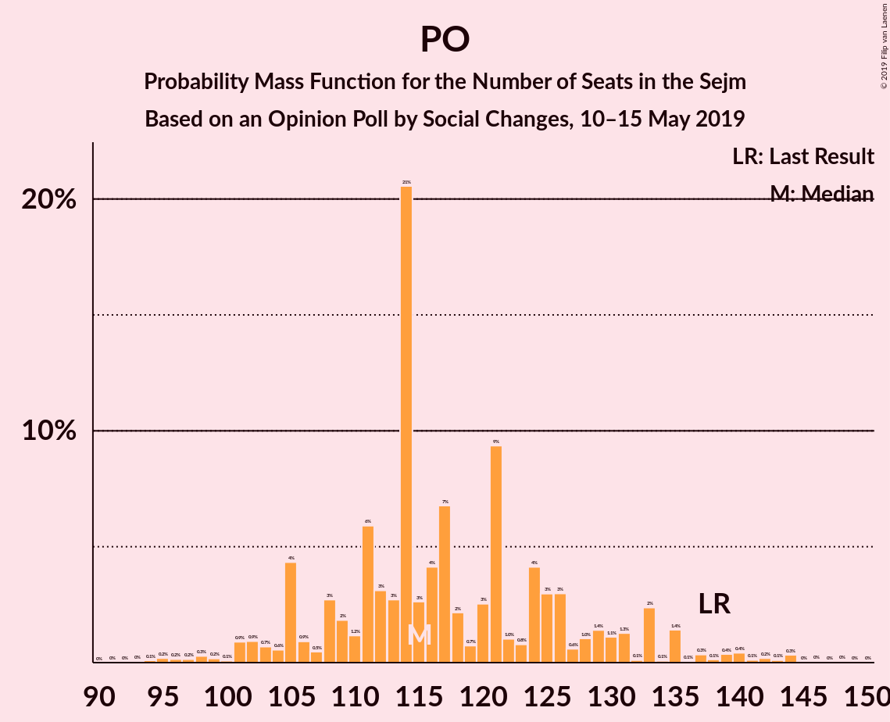

# Opinion Poll by Social Changes, 10–15 May 2019

<a href="#voting-intentions">Voting Intentions</a> | <a href="#seats">Seats</a> | <a href="#coalitions">Coalitions</a> | <a href="#technical-information">Technical Information</a>

## Voting Intentions

### Confidence Intervals

| Party | Last Result | Poll Result | 80% Confidence Interval | 90% Confidence Interval | 95% Confidence Interval | 99% Confidence Interval |
|:-----:|:-----------:|:-----------:|:-----------------------:|:-----------------------:|:-----------------------:|:-----------------------:|
| Prawo i Sprawiedliwość | 37.6% | 35.9% | 34.1–37.8% |33.6–38.4% |33.2–38.8% |32.3–39.7% |
| Platforma Obywatelska | 24.1% | 21.6% | 20.1–23.3% |19.6–23.7% |19.3–24.1% |18.5–24.9% |
| Wiosna | 0.0% | 14.2% | 12.9–15.6% |12.5–16.0% |12.2–16.4% |11.6–17.1% |
| Kukiz’15 | 8.8% | 8.1% | 7.1–9.2% |6.8–9.6% |6.6–9.8% |6.2–10.4% |
| Sojusz Lewicy Demokratycznej | 7.6% | 5.7% | 4.9–6.7% |4.7–7.0% |4.5–7.3% |4.1–7.8% |
| Polskie Stronnictwo Ludowe | 5.1% | 4.5% | 3.8–5.5% |3.6–5.7% |3.5–5.9% |3.1–6.4% |
| KORWiN | 4.8% | 2.8% | 2.3–3.6% |2.1–3.8% |2.0–4.0% |1.8–4.4% |
| Lewica Razem | 3.6% | 2.8% | 2.3–3.6% |2.1–3.8% |2.0–4.0% |1.8–4.4% |

*Note:* The poll result column reflects the actual value used in the calculations. Published results may vary slightly, and in addition be rounded to fewer digits.

## Seats

### Confidence Intervals

| Party | Last Result | Median | 80% Confidence Interval | 90% Confidence Interval | 95% Confidence Interval | 99% Confidence Interval |
|:-----:|:-----------:|:------:|:-----------------------:|:-----------------------:|:-----------------------:|:-----------------------:|
| <a href="#prawo-i-sprawiedliwość">Prawo i Sprawiedliwość</a> | 235 | 225 | 220–225 |214–228 |202–228 |194–228 |
| <a href="#platforma-obywatelska">Platforma Obywatelska</a> | 138 | 129 | 126–129 |120–131 |114–131 |105–131 |
| <a href="#wiosna">Wiosna</a> | 0 | 65 | 64–78 |64–79 |64–83 |61–99 |
| <a href="#kukiz’15">Kukiz’15</a> | 42 | 41 | 33–42 |22–42 |22–42 |22–47 |
| <a href="#sojusz-lewicy-demokratycznej">Sojusz Lewicy Demokratycznej</a> | 0 | 0 | 0–8 |0–15 |0–18 |0–23 |
| <a href="#polskie-stronnictwo-ludowe">Polskie Stronnictwo Ludowe</a> | 16 | 0 | 0 |0 |0 |0–24 |
| <a href="#korwin">KORWiN</a> | 0 | 0 | 0 |0 |0 |0 |
| <a href="#lewica-razem">Lewica Razem</a> | 0 | 0 | 0 |0 |0 |0 |

### Prawo i Sprawiedliwość

*For a full overview of the results for this party, see the [Prawo i Sprawiedliwość](party-prawoisprawiedliwość.html) page.*

| Number of Seats | Probability | Accumulated | Special Marks |
|:---------------:|:-----------:|:-----------:|:-------------:|
| 194 | 1.1% | 100% |  |
| 195 | 0% | 98.9% |  |
| 196 | 0% | 98.9% |  |
| 197 | 0% | 98.9% |  |
| 198 | 0.1% | 98.9% |  |
| 199 | 0% | 98.8% |  |
| 200 | 0% | 98.8% |  |
| 201 | 0% | 98.8% |  |
| 202 | 2% | 98.8% |  |
| 203 | 0% | 97% |  |
| 204 | 0% | 97% |  |
| 205 | 2% | 97% |  |
| 206 | 0% | 96% |  |
| 207 | 0% | 96% |  |
| 208 | 0% | 96% |  |
| 209 | 0.1% | 96% |  |
| 210 | 0.2% | 96% |  |
| 211 | 0% | 95% |  |
| 212 | 0% | 95% |  |
| 213 | 0% | 95% |  |
| 214 | 1.3% | 95% |  |
| 215 | 1.3% | 94% |  |
| 216 | 0% | 93% |  |
| 217 | 0.2% | 93% |  |
| 218 | 0% | 93% |  |
| 219 | 0% | 93% |  |
| 220 | 36% | 93% |  |
| 221 | 5% | 57% |  |
| 222 | 0% | 52% |  |
| 223 | 0% | 52% |  |
| 224 | 0.4% | 52% |  |
| 225 | 46% | 51% | Median |
| 226 | 0% | 5% |  |
| 227 | 0% | 5% |  |
| 228 | 5% | 5% |  |
| 229 | 0% | 0% |  |
| 230 | 0% | 0% |  |
| 231 | 0% | 0% | Majority |
| 232 | 0% | 0% |  |
| 233 | 0% | 0% |  |
| 234 | 0% | 0% |  |
| 235 | 0% | 0% | Last Result |

### Platforma Obywatelska

*For a full overview of the results for this party, see the [Platforma Obywatelska](party-platformaobywatelska.html) page.*

| Number of Seats | Probability | Accumulated | Special Marks |
|:---------------:|:-----------:|:-----------:|:-------------:|
| 105 | 1.0% | 100% |  |
| 106 | 0% | 99.0% |  |
| 107 | 0.1% | 99.0% |  |
| 108 | 0% | 98.9% |  |
| 109 | 0% | 98.9% |  |
| 110 | 0% | 98.9% |  |
| 111 | 0% | 98.9% |  |
| 112 | 0% | 98.8% |  |
| 113 | 0.1% | 98.8% |  |
| 114 | 2% | 98.8% |  |
| 115 | 0.1% | 97% |  |
| 116 | 2% | 97% |  |
| 117 | 0.2% | 96% |  |
| 118 | 0% | 95% |  |
| 119 | 0.1% | 95% |  |
| 120 | 5% | 95% |  |
| 121 | 0% | 90% |  |
| 122 | 0% | 90% |  |
| 123 | 0% | 90% |  |
| 124 | 0% | 90% |  |
| 125 | 0% | 90% |  |
| 126 | 36% | 90% |  |
| 127 | 0% | 54% |  |
| 128 | 0% | 54% |  |
| 129 | 46% | 54% | Median |
| 130 | 1.3% | 8% |  |
| 131 | 6% | 7% |  |
| 132 | 0% | 0.3% |  |
| 133 | 0.3% | 0.3% |  |
| 134 | 0% | 0% |  |
| 135 | 0% | 0% |  |
| 136 | 0% | 0% |  |
| 137 | 0% | 0% |  |
| 138 | 0% | 0% | Last Result |

### Wiosna

*For a full overview of the results for this party, see the [Wiosna](party-wiosna.html) page.*

| Number of Seats | Probability | Accumulated | Special Marks |
|:---------------:|:-----------:|:-----------:|:-------------:|
| 0 | 0% | 100% | Last Result |
| 1 | 0% | 100% |  |
| 2 | 0% | 100% |  |
| 3 | 0% | 100% |  |
| 4 | 0% | 100% |  |
| 5 | 0% | 100% |  |
| 6 | 0% | 100% |  |
| 7 | 0% | 100% |  |
| 8 | 0% | 100% |  |
| 9 | 0% | 100% |  |
| 10 | 0% | 100% |  |
| 11 | 0% | 100% |  |
| 12 | 0% | 100% |  |
| 13 | 0% | 100% |  |
| 14 | 0% | 100% |  |
| 15 | 0% | 100% |  |
| 16 | 0% | 100% |  |
| 17 | 0% | 100% |  |
| 18 | 0% | 100% |  |
| 19 | 0% | 100% |  |
| 20 | 0% | 100% |  |
| 21 | 0% | 100% |  |
| 22 | 0% | 100% |  |
| 23 | 0% | 100% |  |
| 24 | 0% | 100% |  |
| 25 | 0% | 100% |  |
| 26 | 0% | 100% |  |
| 27 | 0% | 100% |  |
| 28 | 0% | 100% |  |
| 29 | 0% | 100% |  |
| 30 | 0% | 100% |  |
| 31 | 0% | 100% |  |
| 32 | 0% | 100% |  |
| 33 | 0% | 100% |  |
| 34 | 0% | 100% |  |
| 35 | 0% | 100% |  |
| 36 | 0% | 100% |  |
| 37 | 0% | 100% |  |
| 38 | 0% | 100% |  |
| 39 | 0% | 100% |  |
| 40 | 0% | 100% |  |
| 41 | 0% | 100% |  |
| 42 | 0% | 100% |  |
| 43 | 0% | 100% |  |
| 44 | 0% | 100% |  |
| 45 | 0% | 100% |  |
| 46 | 0% | 100% |  |
| 47 | 0% | 100% |  |
| 48 | 0% | 100% |  |
| 49 | 0% | 100% |  |
| 50 | 0% | 100% |  |
| 51 | 0% | 100% |  |
| 52 | 0% | 100% |  |
| 53 | 0.1% | 100% |  |
| 54 | 0% | 99.8% |  |
| 55 | 0% | 99.8% |  |
| 56 | 0% | 99.8% |  |
| 57 | 0% | 99.8% |  |
| 58 | 0% | 99.8% |  |
| 59 | 0.3% | 99.8% |  |
| 60 | 0% | 99.5% |  |
| 61 | 0% | 99.5% |  |
| 62 | 0% | 99.5% |  |
| 63 | 0.1% | 99.5% |  |
| 64 | 36% | 99.4% |  |
| 65 | 46% | 64% | Median |
| 66 | 0% | 17% |  |
| 67 | 0% | 17% |  |
| 68 | 0% | 17% |  |
| 69 | 0% | 17% |  |
| 70 | 0% | 17% |  |
| 71 | 5% | 17% |  |
| 72 | 0% | 12% |  |
| 73 | 0% | 12% |  |
| 74 | 1.2% | 12% |  |
| 75 | 0% | 11% |  |
| 76 | 0.1% | 11% |  |
| 77 | 0% | 11% |  |
| 78 | 1.1% | 11% |  |
| 79 | 7% | 10% |  |
| 80 | 0% | 3% |  |
| 81 | 0% | 3% |  |
| 82 | 0% | 3% |  |
| 83 | 1.3% | 3% |  |
| 84 | 0.2% | 2% |  |
| 85 | 0% | 2% |  |
| 86 | 0% | 2% |  |
| 87 | 0% | 2% |  |
| 88 | 0% | 2% |  |
| 89 | 0% | 2% |  |
| 90 | 0% | 2% |  |
| 91 | 0% | 2% |  |
| 92 | 0% | 2% |  |
| 93 | 0% | 2% |  |
| 94 | 0% | 2% |  |
| 95 | 0% | 2% |  |
| 96 | 0% | 2% |  |
| 97 | 0% | 2% |  |
| 98 | 0% | 2% |  |
| 99 | 2% | 2% |  |
| 100 | 0% | 0% |  |

### Kukiz’15

*For a full overview of the results for this party, see the [Kukiz’15](party-kukiz’15.html) page.*

| Number of Seats | Probability | Accumulated | Special Marks |
|:---------------:|:-----------:|:-----------:|:-------------:|
| 16 | 0.1% | 100% |  |
| 17 | 0% | 99.9% |  |
| 18 | 0% | 99.9% |  |
| 19 | 0% | 99.9% |  |
| 20 | 0% | 99.8% |  |
| 21 | 0% | 99.8% |  |
| 22 | 5% | 99.8% |  |
| 23 | 0% | 95% |  |
| 24 | 0% | 95% |  |
| 25 | 0% | 95% |  |
| 26 | 0% | 95% |  |
| 27 | 0% | 95% |  |
| 28 | 0.2% | 95% |  |
| 29 | 0% | 95% |  |
| 30 | 2% | 95% |  |
| 31 | 0% | 93% |  |
| 32 | 1.3% | 93% |  |
| 33 | 5% | 92% |  |
| 34 | 0.5% | 87% |  |
| 35 | 0.1% | 86% |  |
| 36 | 1.0% | 86% |  |
| 37 | 0% | 85% |  |
| 38 | 0% | 85% |  |
| 39 | 0% | 85% |  |
| 40 | 0% | 85% |  |
| 41 | 48% | 85% | Median |
| 42 | 36% | 38% | Last Result |
| 43 | 0% | 2% |  |
| 44 | 0% | 2% |  |
| 45 | 0% | 2% |  |
| 46 | 0% | 2% |  |
| 47 | 2% | 2% |  |
| 48 | 0% | 0.2% |  |
| 49 | 0% | 0.2% |  |
| 50 | 0% | 0.2% |  |
| 51 | 0% | 0.2% |  |
| 52 | 0% | 0.2% |  |
| 53 | 0.1% | 0.1% |  |
| 54 | 0% | 0% |  |

### Sojusz Lewicy Demokratycznej

*For a full overview of the results for this party, see the [Sojusz Lewicy Demokratycznej](party-sojuszlewicydemokratycznej.html) page.*

| Number of Seats | Probability | Accumulated | Special Marks |
|:---------------:|:-----------:|:-----------:|:-------------:|
| 0 | 54% | 100% | Last Result, Median |
| 1 | 0% | 46% |  |
| 2 | 0% | 46% |  |
| 3 | 0% | 46% |  |
| 4 | 0% | 46% |  |
| 5 | 0% | 46% |  |
| 6 | 0% | 46% |  |
| 7 | 0% | 46% |  |
| 8 | 36% | 46% |  |
| 9 | 0% | 10% |  |
| 10 | 2% | 10% |  |
| 11 | 0% | 8% |  |
| 12 | 0% | 8% |  |
| 13 | 0% | 8% |  |
| 14 | 0% | 8% |  |
| 15 | 5% | 8% |  |
| 16 | 0% | 3% |  |
| 17 | 0% | 3% |  |
| 18 | 2% | 3% |  |
| 19 | 0% | 2% |  |
| 20 | 0% | 2% |  |
| 21 | 0% | 2% |  |
| 22 | 0.1% | 2% |  |
| 23 | 1.0% | 1.4% |  |
| 24 | 0% | 0.5% |  |
| 25 | 0.1% | 0.5% |  |
| 26 | 0% | 0.3% |  |
| 27 | 0.2% | 0.3% |  |
| 28 | 0% | 0.1% |  |
| 29 | 0% | 0.1% |  |
| 30 | 0% | 0.1% |  |
| 31 | 0% | 0.1% |  |
| 32 | 0% | 0.1% |  |
| 33 | 0.1% | 0.1% |  |
| 34 | 0% | 0% |  |

### Polskie Stronnictwo Ludowe

*For a full overview of the results for this party, see the [Polskie Stronnictwo Ludowe](party-polskiestronnictwoludowe.html) page.*

| Number of Seats | Probability | Accumulated | Special Marks |
|:---------------:|:-----------:|:-----------:|:-------------:|
| 0 | 98.6% | 100% | Median |
| 1 | 0% | 1.4% |  |
| 2 | 0% | 1.4% |  |
| 3 | 0% | 1.4% |  |
| 4 | 0% | 1.4% |  |
| 5 | 0% | 1.4% |  |
| 6 | 0% | 1.4% |  |
| 7 | 0% | 1.4% |  |
| 8 | 0% | 1.4% |  |
| 9 | 0% | 1.4% |  |
| 10 | 0% | 1.4% |  |
| 11 | 0% | 1.4% |  |
| 12 | 0% | 1.4% |  |
| 13 | 0% | 1.4% |  |
| 14 | 0% | 1.4% |  |
| 15 | 0.1% | 1.3% |  |
| 16 | 0% | 1.2% | Last Result |
| 17 | 0% | 1.2% |  |
| 18 | 0% | 1.2% |  |
| 19 | 0% | 1.2% |  |
| 20 | 0% | 1.2% |  |
| 21 | 0% | 1.2% |  |
| 22 | 0.1% | 1.2% |  |
| 23 | 0% | 1.1% |  |
| 24 | 1.1% | 1.1% |  |
| 25 | 0% | 0% |  |

### KORWiN

*For a full overview of the results for this party, see the [KORWiN](party-korwin.html) page.*

| Number of Seats | Probability | Accumulated | Special Marks |
|:---------------:|:-----------:|:-----------:|:-------------:|
| 0 | 100% | 100% | Last Result, Median |

### Lewica Razem

*For a full overview of the results for this party, see the [Lewica Razem](party-lewicarazem.html) page.*

| Number of Seats | Probability | Accumulated | Special Marks |
|:---------------:|:-----------:|:-----------:|:-------------:|
| 0 | 100% | 100% | Last Result, Median |

## Coalitions

### Confidence Intervals

| Coalition | Last Result | Median | Majority? | 80% Confidence Interval | 90% Confidence Interval | 95% Confidence Interval | 99% Confidence Interval |
|:---------:|:-----------:|:------:|:---------:|:-----------------------:|:-----------------------:|:-----------------------:|:-----------------------:|
| Prawo i Sprawiedliwość | 235 | 225 | 0% | 220–225 | 214–228 | 202–228 | 194–228 |
| Platforma Obywatelska | 138 | 129 | 0% | 126–129 | 120–131 | 114–131 | 105–131 |

### Prawo i Sprawiedliwość

| Number of Seats | Probability | Accumulated | Special Marks |
|:---------------:|:-----------:|:-----------:|:-------------:|
| 194 | 1.1% | 100% |  |
| 195 | 0% | 98.9% |  |
| 196 | 0% | 98.9% |  |
| 197 | 0% | 98.9% |  |
| 198 | 0.1% | 98.9% |  |
| 199 | 0% | 98.8% |  |
| 200 | 0% | 98.8% |  |
| 201 | 0% | 98.8% |  |
| 202 | 2% | 98.8% |  |
| 203 | 0% | 97% |  |
| 204 | 0% | 97% |  |
| 205 | 2% | 97% |  |
| 206 | 0% | 96% |  |
| 207 | 0% | 96% |  |
| 208 | 0% | 96% |  |
| 209 | 0.1% | 96% |  |
| 210 | 0.2% | 96% |  |
| 211 | 0% | 95% |  |
| 212 | 0% | 95% |  |
| 213 | 0% | 95% |  |
| 214 | 1.3% | 95% |  |
| 215 | 1.3% | 94% |  |
| 216 | 0% | 93% |  |
| 217 | 0.2% | 93% |  |
| 218 | 0% | 93% |  |
| 219 | 0% | 93% |  |
| 220 | 36% | 93% |  |
| 221 | 5% | 57% |  |
| 222 | 0% | 52% |  |
| 223 | 0% | 52% |  |
| 224 | 0.4% | 52% |  |
| 225 | 46% | 51% | Median |
| 226 | 0% | 5% |  |
| 227 | 0% | 5% |  |
| 228 | 5% | 5% |  |
| 229 | 0% | 0% |  |
| 230 | 0% | 0% |  |
| 231 | 0% | 0% | Majority |
| 232 | 0% | 0% |  |
| 233 | 0% | 0% |  |
| 234 | 0% | 0% |  |
| 235 | 0% | 0% | Last Result |

### Platforma Obywatelska

| Number of Seats | Probability | Accumulated | Special Marks |
|:---------------:|:-----------:|:-----------:|:-------------:|
| 105 | 1.0% | 100% |  |
| 106 | 0% | 99.0% |  |
| 107 | 0.1% | 99.0% |  |
| 108 | 0% | 98.9% |  |
| 109 | 0% | 98.9% |  |
| 110 | 0% | 98.9% |  |
| 111 | 0% | 98.9% |  |
| 112 | 0% | 98.8% |  |
| 113 | 0.1% | 98.8% |  |
| 114 | 2% | 98.8% |  |
| 115 | 0.1% | 97% |  |
| 116 | 2% | 97% |  |
| 117 | 0.2% | 96% |  |
| 118 | 0% | 95% |  |
| 119 | 0.1% | 95% |  |
| 120 | 5% | 95% |  |
| 121 | 0% | 90% |  |
| 122 | 0% | 90% |  |
| 123 | 0% | 90% |  |
| 124 | 0% | 90% |  |
| 125 | 0% | 90% |  |
| 126 | 36% | 90% |  |
| 127 | 0% | 54% |  |
| 128 | 0% | 54% |  |
| 129 | 46% | 54% | Median |
| 130 | 1.3% | 8% |  |
| 131 | 6% | 7% |  |
| 132 | 0% | 0.3% |  |
| 133 | 0.3% | 0.3% |  |
| 134 | 0% | 0% |  |
| 135 | 0% | 0% |  |
| 136 | 0% | 0% |  |
| 137 | 0% | 0% |  |
| 138 | 0% | 0% | Last Result |

## Technical Information

### Opinion Poll

+ **Polling firm:** Social Changes
+ **Commissioner(s):** —
+ **Fieldwork period:** 10–15 May 2019

### Calculations

+ **Sample size:** 1102
+ **Simulations done:** 1,024
+ **Error estimate:** 3.25%

