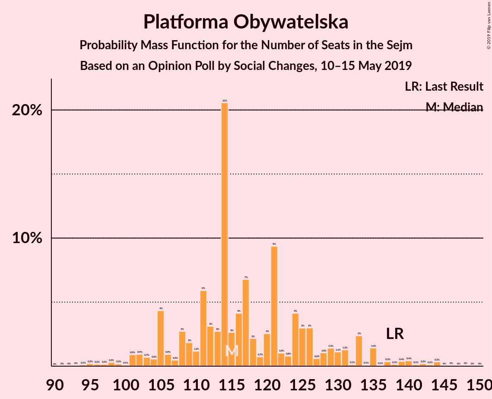

# Opinion Poll by Social Changes, 10–15 May 2019

<a href="#voting-intentions">Voting Intentions</a> | <a href="#seats">Seats</a> | <a href="#coalitions">Coalitions</a> | <a href="#technical-information">Technical Information</a>

## Voting Intentions

### Confidence Intervals

| Party | Last Result | Poll Result | 80% Confidence Interval | 90% Confidence Interval | 95% Confidence Interval | 99% Confidence Interval |
|:-----:|:-----------:|:-----------:|:-----------------------:|:-----------------------:|:-----------------------:|:-----------------------:|
| Prawo i Sprawiedliwość | 37.6% | 35.9% | 34.1–37.8% |33.6–38.4% |33.2–38.8% |32.3–39.7% |
| Platforma Obywatelska | 24.1% | 21.6% | 20.1–23.3% |19.6–23.7% |19.3–24.1% |18.5–24.9% |
| Wiosna | 0.0% | 14.2% | 12.9–15.6% |12.5–16.0% |12.2–16.4% |11.6–17.1% |
| Kukiz’15 | 8.8% | 8.1% | 7.1–9.2% |6.8–9.6% |6.6–9.8% |6.2–10.4% |
| Sojusz Lewicy Demokratycznej | 7.6% | 5.7% | 4.9–6.7% |4.7–7.0% |4.5–7.3% |4.1–7.8% |
| Polskie Stronnictwo Ludowe | 5.1% | 4.5% | 3.8–5.5% |3.6–5.7% |3.5–5.9% |3.1–6.4% |
| KORWiN | 4.8% | 2.8% | 2.3–3.6% |2.1–3.8% |2.0–4.0% |1.8–4.4% |
| Lewica Razem | 3.6% | 2.8% | 2.3–3.6% |2.1–3.8% |2.0–4.0% |1.8–4.4% |

*Note:* The poll result column reflects the actual value used in the calculations. Published results may vary slightly, and in addition be rounded to fewer digits.

## Seats

### Confidence Intervals

| Party | Last Result | Median | 80% Confidence Interval | 90% Confidence Interval | 95% Confidence Interval | 99% Confidence Interval |
|:-----:|:-----------:|:------:|:-----------------------:|:-----------------------:|:-----------------------:|:-----------------------:|
| <a href="#prawo-i-sprawiedliwość">Prawo i Sprawiedliwość</a> | 235 | 218 | 204–229 |199–230 |196–233 |186–243 |
| <a href="#platforma-obywatelska">Platforma Obywatelska</a> | 138 | 115 | 107–129 |105–133 |102–135 |96–144 |
| <a href="#wiosna">Wiosna</a> | 0 | 72 | 66–79 |64–84 |62–87 |52–88 |
| <a href="#kukiz’15">Kukiz’15</a> | 42 | 34 | 26–44 |26–47 |23–47 |18–49 |
| <a href="#sojusz-lewicy-demokratycznej">Sojusz Lewicy Demokratycznej</a> | 0 | 14 | 0–27 |0–28 |0–29 |0–33 |
| <a href="#polskie-stronnictwo-ludowe">Polskie Stronnictwo Ludowe</a> | 16 | 0 | 0–16 |0–18 |0–20 |0–23 |
| <a href="#korwin">KORWiN</a> | 0 | 0 | 0 |0 |0 |0 |
| <a href="#lewica-razem">Lewica Razem</a> | 0 | 0 | 0 |0 |0 |0 |

### Prawo i Sprawiedliwość

*For a full overview of the results for this party, see the [Prawo i Sprawiedliwość](party-prawoisprawiedliwość.html) page.*

| Number of Seats | Probability | Accumulated | Special Marks |
|:---------------:|:-----------:|:-----------:|:-------------:|
| 184 | 0% | 100% |  |
| 185 | 0.1% | 99.9% |  |
| 186 | 0.3% | 99.8% |  |
| 187 | 0% | 99.5% |  |
| 188 | 0% | 99.5% |  |
| 189 | 0.1% | 99.4% |  |
| 190 | 0% | 99.4% |  |
| 191 | 0% | 99.3% |  |
| 192 | 0.5% | 99.3% |  |
| 193 | 0.3% | 98.8% |  |
| 194 | 0.6% | 98.6% |  |
| 195 | 0.2% | 98% |  |
| 196 | 0.5% | 98% |  |
| 197 | 0.3% | 97% |  |
| 198 | 0.8% | 97% |  |
| 199 | 1.2% | 96% |  |
| 200 | 2% | 95% |  |
| 201 | 0.2% | 93% |  |
| 202 | 3% | 93% |  |
| 203 | 0.3% | 90% |  |
| 204 | 1.0% | 90% |  |
| 205 | 2% | 89% |  |
| 206 | 1.0% | 87% |  |
| 207 | 1.1% | 86% |  |
| 208 | 1.4% | 85% |  |
| 209 | 3% | 84% |  |
| 210 | 5% | 81% |  |
| 211 | 4% | 76% |  |
| 212 | 7% | 72% |  |
| 213 | 1.1% | 66% |  |
| 214 | 7% | 64% |  |
| 215 | 3% | 57% |  |
| 216 | 3% | 54% |  |
| 217 | 0.6% | 51% |  |
| 218 | 3% | 50% | Median |
| 219 | 1.3% | 48% |  |
| 220 | 0.9% | 46% |  |
| 221 | 2% | 46% |  |
| 222 | 18% | 43% |  |
| 223 | 6% | 25% |  |
| 224 | 1.0% | 20% |  |
| 225 | 2% | 19% |  |
| 226 | 2% | 16% |  |
| 227 | 0.5% | 15% |  |
| 228 | 3% | 14% |  |
| 229 | 2% | 11% |  |
| 230 | 7% | 10% |  |
| 231 | 0.2% | 3% | Majority |
| 232 | 0.3% | 3% |  |
| 233 | 0.8% | 3% |  |
| 234 | 0.1% | 2% |  |
| 235 | 0.1% | 2% | Last Result |
| 236 | 0.4% | 2% |  |
| 237 | 0.1% | 1.3% |  |
| 238 | 0.5% | 1.2% |  |
| 239 | 0.1% | 0.7% |  |
| 240 | 0% | 0.6% |  |
| 241 | 0% | 0.6% |  |
| 242 | 0% | 0.6% |  |
| 243 | 0.4% | 0.5% |  |
| 244 | 0% | 0.1% |  |
| 245 | 0.1% | 0.1% |  |
| 246 | 0% | 0.1% |  |
| 247 | 0% | 0.1% |  |
| 248 | 0% | 0.1% |  |
| 249 | 0% | 0.1% |  |
| 250 | 0% | 0% |  |

### Platforma Obywatelska

*For a full overview of the results for this party, see the [Platforma Obywatelska](party-platformaobywatelska.html) page.*

| Number of Seats | Probability | Accumulated | Special Marks |
|:---------------:|:-----------:|:-----------:|:-------------:|
| 92 | 0% | 100% |  |
| 93 | 0% | 99.9% |  |
| 94 | 0.1% | 99.9% |  |
| 95 | 0.2% | 99.8% |  |
| 96 | 0.2% | 99.6% |  |
| 97 | 0.2% | 99.5% |  |
| 98 | 0.3% | 99.3% |  |
| 99 | 0.2% | 99.0% |  |
| 100 | 0.1% | 98.8% |  |
| 101 | 0.9% | 98.8% |  |
| 102 | 0.9% | 98% |  |
| 103 | 0.7% | 97% |  |
| 104 | 0.6% | 96% |  |
| 105 | 4% | 96% |  |
| 106 | 0.9% | 91% |  |
| 107 | 0.5% | 90% |  |
| 108 | 3% | 90% |  |
| 109 | 2% | 87% |  |
| 110 | 1.2% | 85% |  |
| 111 | 6% | 84% |  |
| 112 | 3% | 78% |  |
| 113 | 3% | 75% |  |
| 114 | 21% | 72% |  |
| 115 | 3% | 52% | Median |
| 116 | 4% | 49% |  |
| 117 | 7% | 45% |  |
| 118 | 2% | 38% |  |
| 119 | 0.7% | 36% |  |
| 120 | 3% | 35% |  |
| 121 | 9% | 33% |  |
| 122 | 1.0% | 24% |  |
| 123 | 0.8% | 23% |  |
| 124 | 4% | 22% |  |
| 125 | 3% | 18% |  |
| 126 | 3% | 15% |  |
| 127 | 0.6% | 12% |  |
| 128 | 1.0% | 11% |  |
| 129 | 1.4% | 10% |  |
| 130 | 1.1% | 9% |  |
| 131 | 1.3% | 8% |  |
| 132 | 0.1% | 6% |  |
| 133 | 2% | 6% |  |
| 134 | 0.1% | 4% |  |
| 135 | 1.4% | 4% |  |
| 136 | 0.1% | 2% |  |
| 137 | 0.3% | 2% |  |
| 138 | 0.1% | 2% | Last Result |
| 139 | 0.4% | 2% |  |
| 140 | 0.4% | 1.3% |  |
| 141 | 0.1% | 0.9% |  |
| 142 | 0.2% | 0.8% |  |
| 143 | 0.1% | 0.6% |  |
| 144 | 0.3% | 0.5% |  |
| 145 | 0% | 0.2% |  |
| 146 | 0% | 0.1% |  |
| 147 | 0% | 0.1% |  |
| 148 | 0% | 0.1% |  |
| 149 | 0% | 0% |  |

### Wiosna

*For a full overview of the results for this party, see the [Wiosna](party-wiosna.html) page.*

| Number of Seats | Probability | Accumulated | Special Marks |
|:---------------:|:-----------:|:-----------:|:-------------:|
| 0 | 0% | 100% | Last Result |
| 1 | 0% | 100% |  |
| 2 | 0% | 100% |  |
| 3 | 0% | 100% |  |
| 4 | 0% | 100% |  |
| 5 | 0% | 100% |  |
| 6 | 0% | 100% |  |
| 7 | 0% | 100% |  |
| 8 | 0% | 100% |  |
| 9 | 0% | 100% |  |
| 10 | 0% | 100% |  |
| 11 | 0% | 100% |  |
| 12 | 0% | 100% |  |
| 13 | 0% | 100% |  |
| 14 | 0% | 100% |  |
| 15 | 0% | 100% |  |
| 16 | 0% | 100% |  |
| 17 | 0% | 100% |  |
| 18 | 0% | 100% |  |
| 19 | 0% | 100% |  |
| 20 | 0% | 100% |  |
| 21 | 0% | 100% |  |
| 22 | 0% | 100% |  |
| 23 | 0% | 100% |  |
| 24 | 0% | 100% |  |
| 25 | 0% | 100% |  |
| 26 | 0% | 100% |  |
| 27 | 0% | 100% |  |
| 28 | 0% | 100% |  |
| 29 | 0% | 100% |  |
| 30 | 0% | 100% |  |
| 31 | 0% | 100% |  |
| 32 | 0% | 100% |  |
| 33 | 0% | 100% |  |
| 34 | 0% | 100% |  |
| 35 | 0% | 100% |  |
| 36 | 0% | 100% |  |
| 37 | 0% | 100% |  |
| 38 | 0% | 100% |  |
| 39 | 0% | 100% |  |
| 40 | 0% | 100% |  |
| 41 | 0% | 100% |  |
| 42 | 0% | 100% |  |
| 43 | 0% | 100% |  |
| 44 | 0% | 100% |  |
| 45 | 0% | 100% |  |
| 46 | 0% | 100% |  |
| 47 | 0% | 100% |  |
| 48 | 0% | 100% |  |
| 49 | 0.1% | 99.9% |  |
| 50 | 0.2% | 99.9% |  |
| 51 | 0.2% | 99.7% |  |
| 52 | 0.1% | 99.5% |  |
| 53 | 0.3% | 99.4% |  |
| 54 | 0.6% | 99.1% |  |
| 55 | 0% | 98.5% |  |
| 56 | 0.1% | 98.5% |  |
| 57 | 0.4% | 98% |  |
| 58 | 0% | 98% |  |
| 59 | 0.3% | 98% |  |
| 60 | 0.1% | 98% |  |
| 61 | 0.2% | 98% |  |
| 62 | 0.3% | 98% |  |
| 63 | 1.4% | 97% |  |
| 64 | 2% | 96% |  |
| 65 | 3% | 94% |  |
| 66 | 2% | 91% |  |
| 67 | 5% | 89% |  |
| 68 | 4% | 83% |  |
| 69 | 2% | 79% |  |
| 70 | 3% | 78% |  |
| 71 | 5% | 75% |  |
| 72 | 23% | 71% | Median |
| 73 | 1.3% | 48% |  |
| 74 | 6% | 46% |  |
| 75 | 14% | 40% |  |
| 76 | 2% | 26% |  |
| 77 | 6% | 24% |  |
| 78 | 3% | 18% |  |
| 79 | 5% | 15% |  |
| 80 | 1.3% | 9% |  |
| 81 | 0.4% | 8% |  |
| 82 | 2% | 8% |  |
| 83 | 0.1% | 5% |  |
| 84 | 0.1% | 5% |  |
| 85 | 0.2% | 5% |  |
| 86 | 1.5% | 5% |  |
| 87 | 3% | 3% |  |
| 88 | 0.5% | 0.7% |  |
| 89 | 0% | 0.2% |  |
| 90 | 0% | 0.2% |  |
| 91 | 0% | 0.2% |  |
| 92 | 0.1% | 0.1% |  |
| 93 | 0% | 0.1% |  |
| 94 | 0% | 0.1% |  |
| 95 | 0% | 0.1% |  |
| 96 | 0% | 0.1% |  |
| 97 | 0% | 0% |  |

### Kukiz’15

*For a full overview of the results for this party, see the [Kukiz’15](party-kukiz’15.html) page.*

| Number of Seats | Probability | Accumulated | Special Marks |
|:---------------:|:-----------:|:-----------:|:-------------:|
| 10 | 0.1% | 100% |  |
| 11 | 0.1% | 99.9% |  |
| 12 | 0.1% | 99.9% |  |
| 13 | 0% | 99.7% |  |
| 14 | 0% | 99.7% |  |
| 15 | 0.1% | 99.7% |  |
| 16 | 0% | 99.6% |  |
| 17 | 0% | 99.6% |  |
| 18 | 0.1% | 99.5% |  |
| 19 | 0.2% | 99.4% |  |
| 20 | 0.2% | 99.2% |  |
| 21 | 0.2% | 99.0% |  |
| 22 | 0.6% | 98.8% |  |
| 23 | 2% | 98% |  |
| 24 | 0.3% | 96% |  |
| 25 | 0.2% | 95% |  |
| 26 | 5% | 95% |  |
| 27 | 2% | 90% |  |
| 28 | 6% | 88% |  |
| 29 | 0.8% | 82% |  |
| 30 | 2% | 81% |  |
| 31 | 1.2% | 79% |  |
| 32 | 4% | 78% |  |
| 33 | 2% | 73% |  |
| 34 | 26% | 72% | Median |
| 35 | 6% | 46% |  |
| 36 | 4% | 39% |  |
| 37 | 3% | 35% |  |
| 38 | 4% | 32% |  |
| 39 | 1.2% | 29% |  |
| 40 | 0.3% | 27% |  |
| 41 | 10% | 27% |  |
| 42 | 3% | 17% | Last Result |
| 43 | 4% | 14% |  |
| 44 | 2% | 11% |  |
| 45 | 1.4% | 9% |  |
| 46 | 1.0% | 7% |  |
| 47 | 5% | 6% |  |
| 48 | 0.5% | 2% |  |
| 49 | 0.8% | 1.1% |  |
| 50 | 0.1% | 0.3% |  |
| 51 | 0.1% | 0.1% |  |
| 52 | 0% | 0% |  |

### Sojusz Lewicy Demokratycznej

*For a full overview of the results for this party, see the [Sojusz Lewicy Demokratycznej](party-sojuszlewicydemokratycznej.html) page.*

| Number of Seats | Probability | Accumulated | Special Marks |
|:---------------:|:-----------:|:-----------:|:-------------:|
| 0 | 17% | 100% | Last Result |
| 1 | 0% | 83% |  |
| 2 | 0% | 83% |  |
| 3 | 0% | 83% |  |
| 4 | 0% | 83% |  |
| 5 | 0% | 83% |  |
| 6 | 0% | 83% |  |
| 7 | 0.1% | 83% |  |
| 8 | 3% | 82% |  |
| 9 | 3% | 80% |  |
| 10 | 4% | 77% |  |
| 11 | 11% | 73% |  |
| 12 | 9% | 62% |  |
| 13 | 2% | 53% |  |
| 14 | 2% | 51% | Median |
| 15 | 6% | 49% |  |
| 16 | 3% | 43% |  |
| 17 | 1.1% | 40% |  |
| 18 | 16% | 39% |  |
| 19 | 2% | 23% |  |
| 20 | 0.4% | 21% |  |
| 21 | 2% | 20% |  |
| 22 | 0.5% | 19% |  |
| 23 | 4% | 18% |  |
| 24 | 0.4% | 14% |  |
| 25 | 3% | 14% |  |
| 26 | 0.4% | 11% |  |
| 27 | 0.9% | 11% |  |
| 28 | 7% | 10% |  |
| 29 | 1.3% | 3% |  |
| 30 | 0.5% | 2% |  |
| 31 | 0.2% | 1.2% |  |
| 32 | 0.1% | 1.0% |  |
| 33 | 0.8% | 0.9% |  |
| 34 | 0.1% | 0.2% |  |
| 35 | 0% | 0% |  |

### Polskie Stronnictwo Ludowe

*For a full overview of the results for this party, see the [Polskie Stronnictwo Ludowe](party-polskiestronnictwoludowe.html) page.*

| Number of Seats | Probability | Accumulated | Special Marks |
|:---------------:|:-----------:|:-----------:|:-------------:|
| 0 | 76% | 100% | Median |
| 1 | 0% | 24% |  |
| 2 | 0% | 24% |  |
| 3 | 0% | 24% |  |
| 4 | 0% | 24% |  |
| 5 | 0% | 24% |  |
| 6 | 0% | 24% |  |
| 7 | 0% | 24% |  |
| 8 | 0% | 24% |  |
| 9 | 0% | 24% |  |
| 10 | 0% | 24% |  |
| 11 | 0% | 24% |  |
| 12 | 0% | 24% |  |
| 13 | 2% | 24% |  |
| 14 | 4% | 23% |  |
| 15 | 8% | 19% |  |
| 16 | 1.2% | 11% | Last Result |
| 17 | 2% | 10% |  |
| 18 | 2% | 7% |  |
| 19 | 2% | 5% |  |
| 20 | 0.7% | 3% |  |
| 21 | 1.2% | 2% |  |
| 22 | 0.4% | 1.0% |  |
| 23 | 0.1% | 0.6% |  |
| 24 | 0.3% | 0.5% |  |
| 25 | 0.1% | 0.1% |  |
| 26 | 0% | 0.1% |  |
| 27 | 0% | 0% |  |

### KORWiN

*For a full overview of the results for this party, see the [KORWiN](party-korwin.html) page.*

| Number of Seats | Probability | Accumulated | Special Marks |
|:---------------:|:-----------:|:-----------:|:-------------:|
| 0 | 100% | 100% | Last Result, Median |

### Lewica Razem

*For a full overview of the results for this party, see the [Lewica Razem](party-lewicarazem.html) page.*

| Number of Seats | Probability | Accumulated | Special Marks |
|:---------------:|:-----------:|:-----------:|:-------------:|
| 0 | 100% | 100% | Last Result, Median |

## Coalitions

### Confidence Intervals

| Coalition | Last Result | Median | Majority? | 80% Confidence Interval | 90% Confidence Interval | 95% Confidence Interval | 99% Confidence Interval |
|:---------:|:-----------:|:------:|:---------:|:-----------------------:|:-----------------------:|:-----------------------:|:-----------------------:|
| Prawo i Sprawiedliwość | 235 | 218 | 3% | 204–229 | 199–230 | 196–233 | 186–243 |
| Platforma Obywatelska | 138 | 115 | 0% | 107–129 | 105–133 | 102–135 | 96–144 |

### Prawo i Sprawiedliwość

| Number of Seats | Probability | Accumulated | Special Marks |
|:---------------:|:-----------:|:-----------:|:-------------:|
| 184 | 0% | 100% |  |
| 185 | 0.1% | 99.9% |  |
| 186 | 0.3% | 99.8% |  |
| 187 | 0% | 99.5% |  |
| 188 | 0% | 99.5% |  |
| 189 | 0.1% | 99.4% |  |
| 190 | 0% | 99.4% |  |
| 191 | 0% | 99.3% |  |
| 192 | 0.5% | 99.3% |  |
| 193 | 0.3% | 98.8% |  |
| 194 | 0.6% | 98.6% |  |
| 195 | 0.2% | 98% |  |
| 196 | 0.5% | 98% |  |
| 197 | 0.3% | 97% |  |
| 198 | 0.8% | 97% |  |
| 199 | 1.2% | 96% |  |
| 200 | 2% | 95% |  |
| 201 | 0.2% | 93% |  |
| 202 | 3% | 93% |  |
| 203 | 0.3% | 90% |  |
| 204 | 1.0% | 90% |  |
| 205 | 2% | 89% |  |
| 206 | 1.0% | 87% |  |
| 207 | 1.1% | 86% |  |
| 208 | 1.4% | 85% |  |
| 209 | 3% | 84% |  |
| 210 | 5% | 81% |  |
| 211 | 4% | 76% |  |
| 212 | 7% | 72% |  |
| 213 | 1.1% | 66% |  |
| 214 | 7% | 64% |  |
| 215 | 3% | 57% |  |
| 216 | 3% | 54% |  |
| 217 | 0.6% | 51% |  |
| 218 | 3% | 50% | Median |
| 219 | 1.3% | 48% |  |
| 220 | 0.9% | 46% |  |
| 221 | 2% | 46% |  |
| 222 | 18% | 43% |  |
| 223 | 6% | 25% |  |
| 224 | 1.0% | 20% |  |
| 225 | 2% | 19% |  |
| 226 | 2% | 16% |  |
| 227 | 0.5% | 15% |  |
| 228 | 3% | 14% |  |
| 229 | 2% | 11% |  |
| 230 | 7% | 10% |  |
| 231 | 0.2% | 3% | Majority |
| 232 | 0.3% | 3% |  |
| 233 | 0.8% | 3% |  |
| 234 | 0.1% | 2% |  |
| 235 | 0.1% | 2% | Last Result |
| 236 | 0.4% | 2% |  |
| 237 | 0.1% | 1.3% |  |
| 238 | 0.5% | 1.2% |  |
| 239 | 0.1% | 0.7% |  |
| 240 | 0% | 0.6% |  |
| 241 | 0% | 0.6% |  |
| 242 | 0% | 0.6% |  |
| 243 | 0.4% | 0.5% |  |
| 244 | 0% | 0.1% |  |
| 245 | 0.1% | 0.1% |  |
| 246 | 0% | 0.1% |  |
| 247 | 0% | 0.1% |  |
| 248 | 0% | 0.1% |  |
| 249 | 0% | 0.1% |  |
| 250 | 0% | 0% |  |

### Platforma Obywatelska

| Number of Seats | Probability | Accumulated | Special Marks |
|:---------------:|:-----------:|:-----------:|:-------------:|
| 92 | 0% | 100% |  |
| 93 | 0% | 99.9% |  |
| 94 | 0.1% | 99.9% |  |
| 95 | 0.2% | 99.8% |  |
| 96 | 0.2% | 99.6% |  |
| 97 | 0.2% | 99.5% |  |
| 98 | 0.3% | 99.3% |  |
| 99 | 0.2% | 99.0% |  |
| 100 | 0.1% | 98.8% |  |
| 101 | 0.9% | 98.8% |  |
| 102 | 0.9% | 98% |  |
| 103 | 0.7% | 97% |  |
| 104 | 0.6% | 96% |  |
| 105 | 4% | 96% |  |
| 106 | 0.9% | 91% |  |
| 107 | 0.5% | 90% |  |
| 108 | 3% | 90% |  |
| 109 | 2% | 87% |  |
| 110 | 1.2% | 85% |  |
| 111 | 6% | 84% |  |
| 112 | 3% | 78% |  |
| 113 | 3% | 75% |  |
| 114 | 21% | 72% |  |
| 115 | 3% | 52% | Median |
| 116 | 4% | 49% |  |
| 117 | 7% | 45% |  |
| 118 | 2% | 38% |  |
| 119 | 0.7% | 36% |  |
| 120 | 3% | 35% |  |
| 121 | 9% | 33% |  |
| 122 | 1.0% | 24% |  |
| 123 | 0.8% | 23% |  |
| 124 | 4% | 22% |  |
| 125 | 3% | 18% |  |
| 126 | 3% | 15% |  |
| 127 | 0.6% | 12% |  |
| 128 | 1.0% | 11% |  |
| 129 | 1.4% | 10% |  |
| 130 | 1.1% | 9% |  |
| 131 | 1.3% | 8% |  |
| 132 | 0.1% | 6% |  |
| 133 | 2% | 6% |  |
| 134 | 0.1% | 4% |  |
| 135 | 1.4% | 4% |  |
| 136 | 0.1% | 2% |  |
| 137 | 0.3% | 2% |  |
| 138 | 0.1% | 2% | Last Result |
| 139 | 0.4% | 2% |  |
| 140 | 0.4% | 1.3% |  |
| 141 | 0.1% | 0.9% |  |
| 142 | 0.2% | 0.8% |  |
| 143 | 0.1% | 0.6% |  |
| 144 | 0.3% | 0.5% |  |
| 145 | 0% | 0.2% |  |
| 146 | 0% | 0.1% |  |
| 147 | 0% | 0.1% |  |
| 148 | 0% | 0.1% |  |
| 149 | 0% | 0% |  |

## Technical Information

### Opinion Poll

+ **Polling firm:** Social Changes
+ **Commissioner(s):** —
+ **Fieldwork period:** 10–15 May 2019

### Calculations

+ **Sample size:** 1102
+ **Simulations done:** 131,072
+ **Error estimate:** 1.57%

