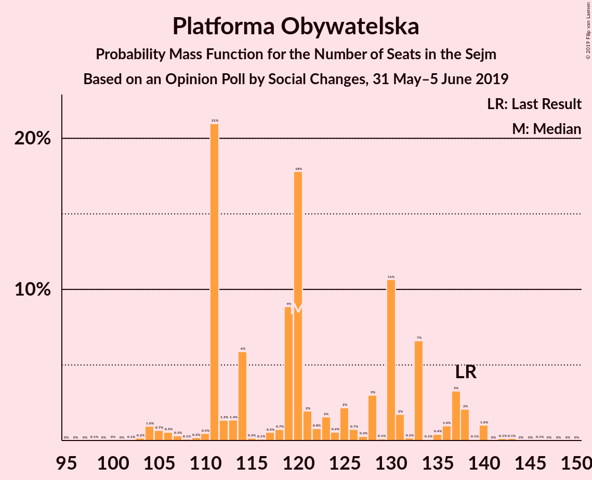
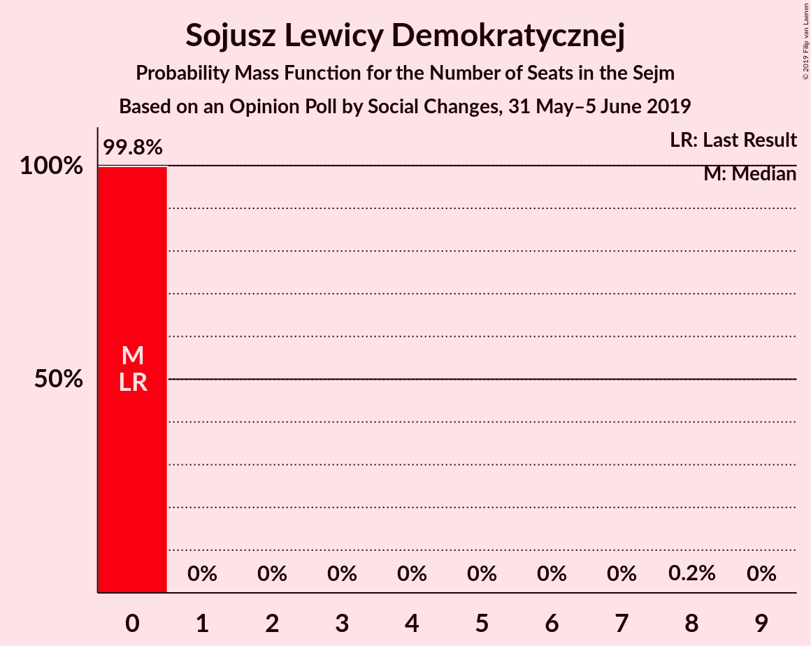
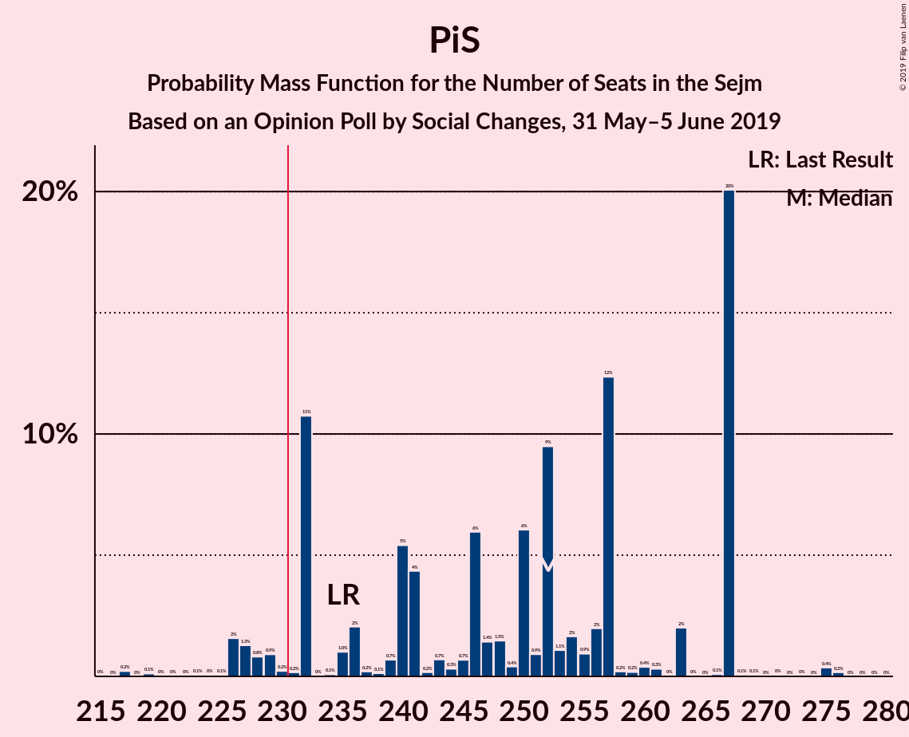
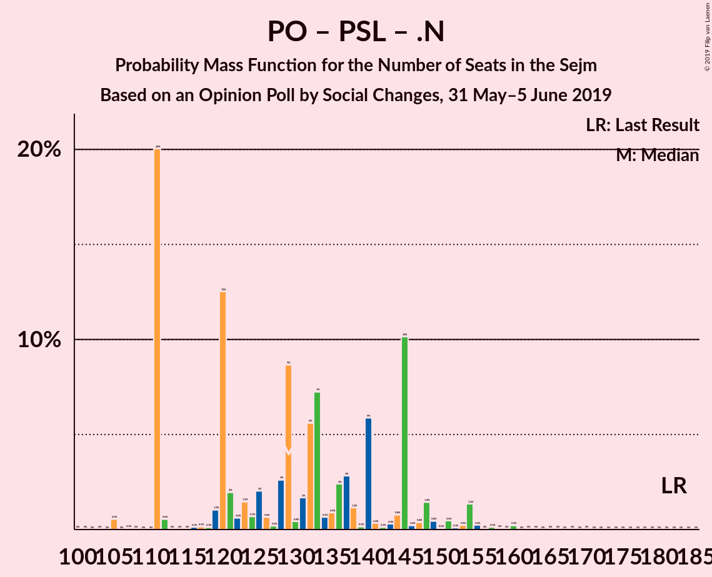
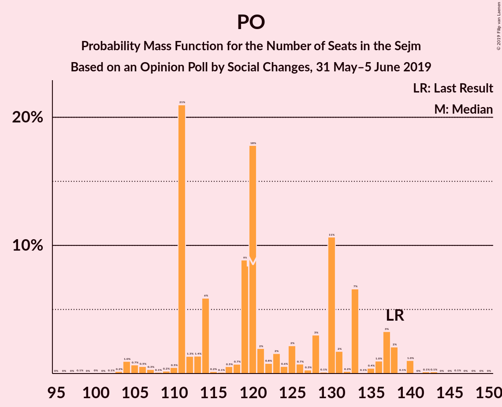

# Opinion Poll by Social Changes, 31 May–5 June 2019

<a href="#voting-intentions">Voting Intentions</a> | <a href="#seats">Seats</a> | <a href="#coalitions">Coalitions</a> | <a href="#technical-information">Technical Information</a>

## Voting Intentions

### Confidence Intervals

| Party | Last Result | Poll Result | 80% Confidence Interval | 90% Confidence Interval | 95% Confidence Interval | 99% Confidence Interval |
|:-----:|:-----------:|:-----------:|:-----------------------:|:-----------------------:|:-----------------------:|:-----------------------:|
| Prawo i Sprawiedliwość | 37.6% | 41.5% | 39.5–43.5% |39.0–44.0% |38.5–44.5% |37.6–45.5% |
| Platforma Obywatelska | 24.1% | 22.4% | 20.8–24.2% |20.4–24.7% |20.0–25.1% |19.3–25.9% |
| Kukiz’15 | 8.8% | 9.3% | 8.2–10.5% |7.9–10.9% |7.7–11.2% |7.2–11.8% |
| Wiosna | 0.0% | 8.9% | 7.8–10.1% |7.6–10.5% |7.3–10.8% |6.8–11.4% |
| Polskie Stronnictwo Ludowe | 5.1% | 5.0% | 4.3–6.0% |4.0–6.3% |3.9–6.5% |3.5–7.0% |
| .Nowoczesna | 7.6% | 4.1% | 3.4–5.0% |3.2–5.2% |3.0–5.5% |2.7–5.9% |
| Sojusz Lewicy Demokratycznej | 7.6% | 3.0% | 2.4–3.8% |2.3–4.0% |2.1–4.2% |1.9–4.6% |
| Lewica Razem | 3.6% | 2.2% | 1.7–2.9% |1.6–3.1% |1.5–3.3% |1.3–3.7% |
| KORWiN | 4.8% | 1.9% | 1.5–2.6% |1.4–2.8% |1.2–3.0% |1.1–3.3% |

*Note:* The poll result column reflects the actual value used in the calculations. Published results may vary slightly, and in addition be rounded to fewer digits.

## Seats

### Confidence Intervals

| Party | Last Result | Median | 80% Confidence Interval | 90% Confidence Interval | 95% Confidence Interval | 99% Confidence Interval |
|:-----:|:-----------:|:------:|:-----------------------:|:-----------------------:|:-----------------------:|:-----------------------:|
| <a href="#prawo-i-sprawiedliwość">Prawo i Sprawiedliwość</a> | 235 | 252 | 232–267 |229–267 |227–267 |223–275 |
| <a href="#platforma-obywatelska">Platforma Obywatelska</a> | 138 | 120 | 111–133 |111–137 |106–138 |104–140 |
| <a href="#kukiz’15">Kukiz’15</a> | 42 | 44 | 39–48 |39–48 |37–50 |27–50 |
| <a href="#wiosna">Wiosna</a> | 0 | 38 | 33–43 |31–44 |31–46 |28–48 |
| <a href="#polskie-stronnictwo-ludowe">Polskie Stronnictwo Ludowe</a> | 16 | 0 | 0–18 |0–20 |0–22 |0–24 |
| <a href="#.nowoczesna">.Nowoczesna</a> | 28 | 0 | 0–10 |0–10 |0–10 |0–11 |
| <a href="#sojusz-lewicy-demokratycznej">Sojusz Lewicy Demokratycznej</a> | 0 | 0 | 0 |0 |0 |0 |
| <a href="#lewica-razem">Lewica Razem</a> | 0 | 0 | 0 |0 |0 |0 |
| <a href="#korwin">KORWiN</a> | 0 | 0 | 0 |0 |0 |0 |

### Prawo i Sprawiedliwość

*For a full overview of the results for this party, see the [Prawo i Sprawiedliwość](party-prawoisprawiedliwość.html) page.*

| Number of Seats | Probability | Accumulated | Special Marks |
|:---------------:|:-----------:|:-----------:|:-------------:|
| 216 | 0% | 100% |  |
| 217 | 0.2% | 99.9% |  |
| 218 | 0% | 99.7% |  |
| 219 | 0.1% | 99.7% |  |
| 220 | 0% | 99.6% |  |
| 221 | 0% | 99.6% |  |
| 222 | 0% | 99.6% |  |
| 223 | 0.1% | 99.5% |  |
| 224 | 0% | 99.5% |  |
| 225 | 0.1% | 99.4% |  |
| 226 | 2% | 99.4% |  |
| 227 | 1.3% | 98% |  |
| 228 | 0.8% | 97% |  |
| 229 | 0.9% | 96% |  |
| 230 | 0.2% | 95% |  |
| 231 | 0.2% | 95% | Majority |
| 232 | 11% | 94% |  |
| 233 | 0% | 84% |  |
| 234 | 0.1% | 84% |  |
| 235 | 1.0% | 84% | Last Result |
| 236 | 2% | 83% |  |
| 237 | 0.2% | 80% |  |
| 238 | 0.1% | 80% |  |
| 239 | 0.7% | 80% |  |
| 240 | 5% | 79% |  |
| 241 | 4% | 74% |  |
| 242 | 0.2% | 70% |  |
| 243 | 0.7% | 70% |  |
| 244 | 0.3% | 69% |  |
| 245 | 0.7% | 68% |  |
| 246 | 6% | 68% |  |
| 247 | 1.4% | 62% |  |
| 248 | 1.5% | 60% |  |
| 249 | 0.4% | 59% |  |
| 250 | 6% | 59% |  |
| 251 | 0.9% | 52% |  |
| 252 | 9% | 52% | Median |
| 253 | 1.1% | 42% |  |
| 254 | 2% | 41% |  |
| 255 | 0.9% | 39% |  |
| 256 | 2% | 38% |  |
| 257 | 12% | 36% |  |
| 258 | 0.2% | 24% |  |
| 259 | 0.2% | 24% |  |
| 260 | 0.4% | 24% |  |
| 261 | 0.3% | 23% |  |
| 262 | 0% | 23% |  |
| 263 | 2% | 23% |  |
| 264 | 0% | 21% |  |
| 265 | 0% | 21% |  |
| 266 | 0.1% | 21% |  |
| 267 | 20% | 21% |  |
| 268 | 0.1% | 0.8% |  |
| 269 | 0.1% | 0.7% |  |
| 270 | 0% | 0.7% |  |
| 271 | 0% | 0.6% |  |
| 272 | 0% | 0.6% |  |
| 273 | 0% | 0.6% |  |
| 274 | 0% | 0.6% |  |
| 275 | 0.4% | 0.6% |  |
| 276 | 0.2% | 0.2% |  |
| 277 | 0% | 0% |  |

### Platforma Obywatelska

*For a full overview of the results for this party, see the [Platforma Obywatelska](party-platformaobywatelska.html) page.*

| Number of Seats | Probability | Accumulated | Special Marks |
|:---------------:|:-----------:|:-----------:|:-------------:|
| 98 | 0.1% | 100% |  |
| 99 | 0% | 99.9% |  |
| 100 | 0% | 99.9% |  |
| 101 | 0% | 99.9% |  |
| 102 | 0.1% | 99.9% |  |
| 103 | 0.2% | 99.8% |  |
| 104 | 1.0% | 99.7% |  |
| 105 | 0.7% | 98.7% |  |
| 106 | 0.5% | 98% |  |
| 107 | 0.3% | 97% |  |
| 108 | 0.1% | 97% |  |
| 109 | 0.2% | 97% |  |
| 110 | 0.5% | 97% |  |
| 111 | 21% | 96% |  |
| 112 | 1.3% | 75% |  |
| 113 | 1.4% | 74% |  |
| 114 | 6% | 73% |  |
| 115 | 0.2% | 67% |  |
| 116 | 0.1% | 67% |  |
| 117 | 0.5% | 67% |  |
| 118 | 0.7% | 66% |  |
| 119 | 9% | 65% |  |
| 120 | 18% | 56% | Median |
| 121 | 2% | 39% |  |
| 122 | 0.8% | 37% |  |
| 123 | 2% | 36% |  |
| 124 | 0.6% | 34% |  |
| 125 | 2% | 34% |  |
| 126 | 0.7% | 32% |  |
| 127 | 0.3% | 31% |  |
| 128 | 3% | 31% |  |
| 129 | 0.1% | 28% |  |
| 130 | 11% | 27% |  |
| 131 | 2% | 17% |  |
| 132 | 0.2% | 15% |  |
| 133 | 7% | 15% |  |
| 134 | 0.1% | 8% |  |
| 135 | 0.4% | 8% |  |
| 136 | 1.0% | 8% |  |
| 137 | 3% | 7% |  |
| 138 | 2% | 4% | Last Result |
| 139 | 0.1% | 2% |  |
| 140 | 1.0% | 1.4% |  |
| 141 | 0% | 0.4% |  |
| 142 | 0.1% | 0.4% |  |
| 143 | 0.1% | 0.3% |  |
| 144 | 0% | 0.1% |  |
| 145 | 0% | 0.1% |  |
| 146 | 0.1% | 0.1% |  |
| 147 | 0% | 0.1% |  |
| 148 | 0% | 0.1% |  |
| 149 | 0% | 0% |  |

### Kukiz’15

*For a full overview of the results for this party, see the [Kukiz’15](party-kukiz’15.html) page.*

| Number of Seats | Probability | Accumulated | Special Marks |
|:---------------:|:-----------:|:-----------:|:-------------:|
| 23 | 0% | 100% |  |
| 24 | 0% | 99.9% |  |
| 25 | 0% | 99.9% |  |
| 26 | 0% | 99.9% |  |
| 27 | 0.9% | 99.9% |  |
| 28 | 0% | 98.9% |  |
| 29 | 0.1% | 98.9% |  |
| 30 | 0% | 98.8% |  |
| 31 | 0.1% | 98.8% |  |
| 32 | 0.2% | 98.7% |  |
| 33 | 0.1% | 98% |  |
| 34 | 0.2% | 98% |  |
| 35 | 0.1% | 98% |  |
| 36 | 0.5% | 98% |  |
| 37 | 0.9% | 98% |  |
| 38 | 0.4% | 97% |  |
| 39 | 10% | 96% |  |
| 40 | 1.0% | 87% |  |
| 41 | 0.6% | 86% |  |
| 42 | 8% | 85% | Last Result |
| 43 | 7% | 77% |  |
| 44 | 44% | 70% | Median |
| 45 | 6% | 26% |  |
| 46 | 5% | 20% |  |
| 47 | 3% | 15% |  |
| 48 | 7% | 12% |  |
| 49 | 2% | 5% |  |
| 50 | 3% | 3% |  |
| 51 | 0.1% | 0.3% |  |
| 52 | 0% | 0.2% |  |
| 53 | 0% | 0.2% |  |
| 54 | 0% | 0.2% |  |
| 55 | 0% | 0.1% |  |
| 56 | 0% | 0.1% |  |
| 57 | 0% | 0.1% |  |
| 58 | 0% | 0.1% |  |
| 59 | 0% | 0.1% |  |
| 60 | 0% | 0.1% |  |
| 61 | 0% | 0.1% |  |
| 62 | 0% | 0.1% |  |
| 63 | 0% | 0.1% |  |
| 64 | 0% | 0% |  |

### Wiosna

*For a full overview of the results for this party, see the [Wiosna](party-wiosna.html) page.*

| Number of Seats | Probability | Accumulated | Special Marks |
|:---------------:|:-----------:|:-----------:|:-------------:|
| 0 | 0% | 100% | Last Result |
| 1 | 0% | 100% |  |
| 2 | 0% | 100% |  |
| 3 | 0% | 100% |  |
| 4 | 0% | 100% |  |
| 5 | 0% | 100% |  |
| 6 | 0% | 100% |  |
| 7 | 0% | 100% |  |
| 8 | 0% | 100% |  |
| 9 | 0% | 100% |  |
| 10 | 0% | 100% |  |
| 11 | 0% | 100% |  |
| 12 | 0% | 100% |  |
| 13 | 0% | 100% |  |
| 14 | 0% | 100% |  |
| 15 | 0% | 100% |  |
| 16 | 0% | 100% |  |
| 17 | 0% | 100% |  |
| 18 | 0% | 100% |  |
| 19 | 0% | 100% |  |
| 20 | 0% | 100% |  |
| 21 | 0% | 100% |  |
| 22 | 0% | 100% |  |
| 23 | 0% | 100% |  |
| 24 | 0% | 99.9% |  |
| 25 | 0.2% | 99.9% |  |
| 26 | 0% | 99.7% |  |
| 27 | 0.1% | 99.7% |  |
| 28 | 0.3% | 99.6% |  |
| 29 | 1.2% | 99.3% |  |
| 30 | 0.3% | 98% |  |
| 31 | 3% | 98% |  |
| 32 | 0.1% | 95% |  |
| 33 | 7% | 95% |  |
| 34 | 4% | 88% |  |
| 35 | 8% | 84% |  |
| 36 | 3% | 76% |  |
| 37 | 0.6% | 73% |  |
| 38 | 25% | 72% | Median |
| 39 | 23% | 47% |  |
| 40 | 11% | 24% |  |
| 41 | 0.8% | 13% |  |
| 42 | 1.4% | 12% |  |
| 43 | 2% | 11% |  |
| 44 | 4% | 9% |  |
| 45 | 2% | 5% |  |
| 46 | 2% | 3% |  |
| 47 | 0.2% | 1.1% |  |
| 48 | 0.6% | 0.9% |  |
| 49 | 0.1% | 0.3% |  |
| 50 | 0.1% | 0.2% |  |
| 51 | 0.1% | 0.2% |  |
| 52 | 0% | 0.1% |  |
| 53 | 0% | 0% |  |

### Polskie Stronnictwo Ludowe

*For a full overview of the results for this party, see the [Polskie Stronnictwo Ludowe](party-polskiestronnictwoludowe.html) page.*

| Number of Seats | Probability | Accumulated | Special Marks |
|:---------------:|:-----------:|:-----------:|:-------------:|
| 0 | 65% | 100% | Median |
| 1 | 0% | 35% |  |
| 2 | 0% | 35% |  |
| 3 | 0% | 35% |  |
| 4 | 0% | 35% |  |
| 5 | 0% | 35% |  |
| 6 | 0% | 35% |  |
| 7 | 0% | 35% |  |
| 8 | 0% | 35% |  |
| 9 | 0% | 35% |  |
| 10 | 0% | 35% |  |
| 11 | 0% | 35% |  |
| 12 | 0.5% | 35% |  |
| 13 | 0.9% | 34% |  |
| 14 | 1.5% | 33% |  |
| 15 | 11% | 32% |  |
| 16 | 3% | 20% | Last Result |
| 17 | 1.0% | 17% |  |
| 18 | 6% | 16% |  |
| 19 | 1.1% | 10% |  |
| 20 | 5% | 9% |  |
| 21 | 0.5% | 4% |  |
| 22 | 1.0% | 3% |  |
| 23 | 1.4% | 2% |  |
| 24 | 0.6% | 0.8% |  |
| 25 | 0.1% | 0.2% |  |
| 26 | 0.1% | 0.1% |  |
| 27 | 0% | 0.1% |  |
| 28 | 0% | 0% |  |

### .Nowoczesna

*For a full overview of the results for this party, see the [.Nowoczesna](party-nowoczesna.html) page.*

| Number of Seats | Probability | Accumulated | Special Marks |
|:---------------:|:-----------:|:-----------:|:-------------:|
| 0 | 89% | 100% | Median |
| 1 | 0% | 11% |  |
| 2 | 0% | 11% |  |
| 3 | 0% | 11% |  |
| 4 | 0% | 11% |  |
| 5 | 0% | 11% |  |
| 6 | 0% | 11% |  |
| 7 | 0% | 11% |  |
| 8 | 0.3% | 11% |  |
| 9 | 0% | 11% |  |
| 10 | 9% | 11% |  |
| 11 | 2% | 2% |  |
| 12 | 0.2% | 0.3% |  |
| 13 | 0.1% | 0.2% |  |
| 14 | 0.1% | 0.1% |  |
| 15 | 0% | 0% |  |
| 16 | 0% | 0% |  |
| 17 | 0% | 0% |  |
| 18 | 0% | 0% |  |
| 19 | 0% | 0% |  |
| 20 | 0% | 0% |  |
| 21 | 0% | 0% |  |
| 22 | 0% | 0% |  |
| 23 | 0% | 0% |  |
| 24 | 0% | 0% |  |
| 25 | 0% | 0% |  |
| 26 | 0% | 0% |  |
| 27 | 0% | 0% |  |
| 28 | 0% | 0% | Last Result |

### Sojusz Lewicy Demokratycznej

*For a full overview of the results for this party, see the [Sojusz Lewicy Demokratycznej](party-sojuszlewicydemokratycznej.html) page.*

| Number of Seats | Probability | Accumulated | Special Marks |
|:---------------:|:-----------:|:-----------:|:-------------:|
| 0 | 99.8% | 100% | Last Result, Median |
| 1 | 0% | 0.2% |  |
| 2 | 0% | 0.2% |  |
| 3 | 0% | 0.2% |  |
| 4 | 0% | 0.2% |  |
| 5 | 0% | 0.2% |  |
| 6 | 0% | 0.2% |  |
| 7 | 0% | 0.2% |  |
| 8 | 0.2% | 0.2% |  |
| 9 | 0% | 0% |  |

### Lewica Razem

*For a full overview of the results for this party, see the [Lewica Razem](party-lewicarazem.html) page.*

| Number of Seats | Probability | Accumulated | Special Marks |
|:---------------:|:-----------:|:-----------:|:-------------:|
| 0 | 100% | 100% | Last Result, Median |

### KORWiN

*For a full overview of the results for this party, see the [KORWiN](party-korwin.html) page.*

| Number of Seats | Probability | Accumulated | Special Marks |
|:---------------:|:-----------:|:-----------:|:-------------:|
| 0 | 100% | 100% | Last Result, Median |

## Coalitions

### Confidence Intervals

| Coalition | Last Result | Median | Majority? | 80% Confidence Interval | 90% Confidence Interval | 95% Confidence Interval | 99% Confidence Interval |
|:---------:|:-----------:|:------:|:---------:|:-----------------------:|:-----------------------:|:-----------------------:|:-----------------------:|
| Prawo i Sprawiedliwość | 235 | 252 | 95% | 232–267 | 229–267 | 227–267 | 223–275 |
| Platforma Obywatelska – Polskie Stronnictwo Ludowe – .Nowoczesna – Sojusz Lewicy Demokratycznej – Lewica Razem | 182 | 129 | 0% | 111–145 | 111–147 | 111–151 | 105–155 |
| Platforma Obywatelska – Polskie Stronnictwo Ludowe – .Nowoczesna | 182 | 129 | 0% | 111–145 | 111–147 | 111–151 | 105–155 |
| Platforma Obywatelska – Polskie Stronnictwo Ludowe – .Nowoczesna – Sojusz Lewicy Demokratycznej | 182 | 129 | 0% | 111–145 | 111–147 | 111–151 | 105–155 |
| Platforma Obywatelska – .Nowoczesna | 166 | 120 | 0% | 111–133 | 111–137 | 107–138 | 104–142 |
| Platforma Obywatelska – .Nowoczesna – Sojusz Lewicy Demokratycznej | 166 | 120 | 0% | 111–133 | 111–137 | 107–138 | 104–142 |
| Platforma Obywatelska | 138 | 120 | 0% | 111–133 | 111–137 | 106–138 | 104–140 |

### Prawo i Sprawiedliwość

| Number of Seats | Probability | Accumulated | Special Marks |
|:---------------:|:-----------:|:-----------:|:-------------:|
| 216 | 0% | 100% |  |
| 217 | 0.2% | 99.9% |  |
| 218 | 0% | 99.7% |  |
| 219 | 0.1% | 99.7% |  |
| 220 | 0% | 99.6% |  |
| 221 | 0% | 99.6% |  |
| 222 | 0% | 99.6% |  |
| 223 | 0.1% | 99.5% |  |
| 224 | 0% | 99.5% |  |
| 225 | 0.1% | 99.4% |  |
| 226 | 2% | 99.4% |  |
| 227 | 1.3% | 98% |  |
| 228 | 0.8% | 97% |  |
| 229 | 0.9% | 96% |  |
| 230 | 0.2% | 95% |  |
| 231 | 0.2% | 95% | Majority |
| 232 | 11% | 94% |  |
| 233 | 0% | 84% |  |
| 234 | 0.1% | 84% |  |
| 235 | 1.0% | 84% | Last Result |
| 236 | 2% | 83% |  |
| 237 | 0.2% | 80% |  |
| 238 | 0.1% | 80% |  |
| 239 | 0.7% | 80% |  |
| 240 | 5% | 79% |  |
| 241 | 4% | 74% |  |
| 242 | 0.2% | 70% |  |
| 243 | 0.7% | 70% |  |
| 244 | 0.3% | 69% |  |
| 245 | 0.7% | 68% |  |
| 246 | 6% | 68% |  |
| 247 | 1.4% | 62% |  |
| 248 | 1.5% | 60% |  |
| 249 | 0.4% | 59% |  |
| 250 | 6% | 59% |  |
| 251 | 0.9% | 52% |  |
| 252 | 9% | 52% | Median |
| 253 | 1.1% | 42% |  |
| 254 | 2% | 41% |  |
| 255 | 0.9% | 39% |  |
| 256 | 2% | 38% |  |
| 257 | 12% | 36% |  |
| 258 | 0.2% | 24% |  |
| 259 | 0.2% | 24% |  |
| 260 | 0.4% | 24% |  |
| 261 | 0.3% | 23% |  |
| 262 | 0% | 23% |  |
| 263 | 2% | 23% |  |
| 264 | 0% | 21% |  |
| 265 | 0% | 21% |  |
| 266 | 0.1% | 21% |  |
| 267 | 20% | 21% |  |
| 268 | 0.1% | 0.8% |  |
| 269 | 0.1% | 0.7% |  |
| 270 | 0% | 0.7% |  |
| 271 | 0% | 0.6% |  |
| 272 | 0% | 0.6% |  |
| 273 | 0% | 0.6% |  |
| 274 | 0% | 0.6% |  |
| 275 | 0.4% | 0.6% |  |
| 276 | 0.2% | 0.2% |  |
| 277 | 0% | 0% |  |

### Platforma Obywatelska – Polskie Stronnictwo Ludowe – .Nowoczesna – Sojusz Lewicy Demokratycznej – Lewica Razem

| Number of Seats | Probability | Accumulated | Special Marks |
|:---------------:|:-----------:|:-----------:|:-------------:|
| 105 | 0.5% | 100% |  |
| 106 | 0% | 99.4% |  |
| 107 | 0.1% | 99.4% |  |
| 108 | 0% | 99.4% |  |
| 109 | 0% | 99.3% |  |
| 110 | 0% | 99.3% |  |
| 111 | 20% | 99.3% |  |
| 112 | 0.5% | 79% |  |
| 113 | 0% | 79% |  |
| 114 | 0% | 79% |  |
| 115 | 0% | 79% |  |
| 116 | 0.1% | 79% |  |
| 117 | 0.1% | 79% |  |
| 118 | 0.1% | 78% |  |
| 119 | 1.0% | 78% |  |
| 120 | 13% | 77% | Median |
| 121 | 2% | 65% |  |
| 122 | 0.6% | 63% |  |
| 123 | 1.5% | 62% |  |
| 124 | 0.7% | 61% |  |
| 125 | 2% | 60% |  |
| 126 | 0.6% | 58% |  |
| 127 | 0.2% | 58% |  |
| 128 | 3% | 57% |  |
| 129 | 9% | 55% |  |
| 130 | 0.4% | 46% |  |
| 131 | 2% | 46% |  |
| 132 | 6% | 44% |  |
| 133 | 7% | 38% |  |
| 134 | 0.7% | 31% |  |
| 135 | 0.9% | 30% |  |
| 136 | 2% | 29% |  |
| 137 | 3% | 27% |  |
| 138 | 1.2% | 24% |  |
| 139 | 0.2% | 23% |  |
| 140 | 6% | 23% |  |
| 141 | 0.3% | 17% |  |
| 142 | 0.1% | 17% |  |
| 143 | 0.3% | 17% |  |
| 144 | 0.8% | 16% |  |
| 145 | 10% | 16% |  |
| 146 | 0.2% | 5% |  |
| 147 | 0.4% | 5% |  |
| 148 | 1.4% | 5% |  |
| 149 | 0.4% | 3% |  |
| 150 | 0.1% | 3% |  |
| 151 | 0.5% | 3% |  |
| 152 | 0.1% | 2% |  |
| 153 | 0.2% | 2% |  |
| 154 | 1.3% | 2% |  |
| 155 | 0.2% | 0.7% |  |
| 156 | 0% | 0.5% |  |
| 157 | 0.1% | 0.5% |  |
| 158 | 0% | 0.4% |  |
| 159 | 0% | 0.3% |  |
| 160 | 0.2% | 0.3% |  |
| 161 | 0% | 0.1% |  |
| 162 | 0% | 0.1% |  |
| 163 | 0% | 0.1% |  |
| 164 | 0% | 0.1% |  |
| 165 | 0% | 0.1% |  |
| 166 | 0% | 0% |  |
| 167 | 0% | 0% |  |
| 168 | 0% | 0% |  |
| 169 | 0% | 0% |  |
| 170 | 0% | 0% |  |
| 171 | 0% | 0% |  |
| 172 | 0% | 0% |  |
| 173 | 0% | 0% |  |
| 174 | 0% | 0% |  |
| 175 | 0% | 0% |  |
| 176 | 0% | 0% |  |
| 177 | 0% | 0% |  |
| 178 | 0% | 0% |  |
| 179 | 0% | 0% |  |
| 180 | 0% | 0% |  |
| 181 | 0% | 0% |  |
| 182 | 0% | 0% | Last Result |

### Platforma Obywatelska – Polskie Stronnictwo Ludowe – .Nowoczesna

| Number of Seats | Probability | Accumulated | Special Marks |
|:---------------:|:-----------:|:-----------:|:-------------:|
| 105 | 0.5% | 100% |  |
| 106 | 0% | 99.4% |  |
| 107 | 0.1% | 99.4% |  |
| 108 | 0% | 99.4% |  |
| 109 | 0% | 99.3% |  |
| 110 | 0% | 99.3% |  |
| 111 | 20% | 99.3% |  |
| 112 | 0.5% | 79% |  |
| 113 | 0% | 79% |  |
| 114 | 0% | 79% |  |
| 115 | 0% | 79% |  |
| 116 | 0.1% | 79% |  |
| 117 | 0.1% | 79% |  |
| 118 | 0.1% | 78% |  |
| 119 | 1.0% | 78% |  |
| 120 | 13% | 77% | Median |
| 121 | 2% | 65% |  |
| 122 | 0.6% | 63% |  |
| 123 | 1.5% | 62% |  |
| 124 | 0.7% | 61% |  |
| 125 | 2% | 60% |  |
| 126 | 0.6% | 58% |  |
| 127 | 0.2% | 57% |  |
| 128 | 3% | 57% |  |
| 129 | 9% | 55% |  |
| 130 | 0.4% | 46% |  |
| 131 | 2% | 45% |  |
| 132 | 6% | 44% |  |
| 133 | 7% | 38% |  |
| 134 | 0.7% | 31% |  |
| 135 | 0.9% | 30% |  |
| 136 | 2% | 29% |  |
| 137 | 3% | 27% |  |
| 138 | 1.2% | 24% |  |
| 139 | 0.1% | 23% |  |
| 140 | 6% | 23% |  |
| 141 | 0.3% | 17% |  |
| 142 | 0.1% | 17% |  |
| 143 | 0.3% | 17% |  |
| 144 | 0.8% | 16% |  |
| 145 | 10% | 16% |  |
| 146 | 0.2% | 5% |  |
| 147 | 0.4% | 5% |  |
| 148 | 1.4% | 5% |  |
| 149 | 0.4% | 3% |  |
| 150 | 0.1% | 3% |  |
| 151 | 0.5% | 3% |  |
| 152 | 0.1% | 2% |  |
| 153 | 0.2% | 2% |  |
| 154 | 1.3% | 2% |  |
| 155 | 0.2% | 0.7% |  |
| 156 | 0% | 0.5% |  |
| 157 | 0.1% | 0.5% |  |
| 158 | 0% | 0.3% |  |
| 159 | 0% | 0.3% |  |
| 160 | 0.2% | 0.3% |  |
| 161 | 0% | 0.1% |  |
| 162 | 0% | 0.1% |  |
| 163 | 0% | 0.1% |  |
| 164 | 0% | 0.1% |  |
| 165 | 0% | 0.1% |  |
| 166 | 0% | 0% |  |
| 167 | 0% | 0% |  |
| 168 | 0% | 0% |  |
| 169 | 0% | 0% |  |
| 170 | 0% | 0% |  |
| 171 | 0% | 0% |  |
| 172 | 0% | 0% |  |
| 173 | 0% | 0% |  |
| 174 | 0% | 0% |  |
| 175 | 0% | 0% |  |
| 176 | 0% | 0% |  |
| 177 | 0% | 0% |  |
| 178 | 0% | 0% |  |
| 179 | 0% | 0% |  |
| 180 | 0% | 0% |  |
| 181 | 0% | 0% |  |
| 182 | 0% | 0% | Last Result |

### Platforma Obywatelska – Polskie Stronnictwo Ludowe – .Nowoczesna – Sojusz Lewicy Demokratycznej

| Number of Seats | Probability | Accumulated | Special Marks |
|:---------------:|:-----------:|:-----------:|:-------------:|
| 105 | 0.5% | 100% |  |
| 106 | 0% | 99.4% |  |
| 107 | 0.1% | 99.4% |  |
| 108 | 0% | 99.4% |  |
| 109 | 0% | 99.3% |  |
| 110 | 0% | 99.3% |  |
| 111 | 20% | 99.3% |  |
| 112 | 0.5% | 79% |  |
| 113 | 0% | 79% |  |
| 114 | 0% | 79% |  |
| 115 | 0% | 79% |  |
| 116 | 0.1% | 79% |  |
| 117 | 0.1% | 79% |  |
| 118 | 0.1% | 78% |  |
| 119 | 1.0% | 78% |  |
| 120 | 13% | 77% | Median |
| 121 | 2% | 65% |  |
| 122 | 0.6% | 63% |  |
| 123 | 1.5% | 62% |  |
| 124 | 0.7% | 61% |  |
| 125 | 2% | 60% |  |
| 126 | 0.6% | 58% |  |
| 127 | 0.2% | 58% |  |
| 128 | 3% | 57% |  |
| 129 | 9% | 55% |  |
| 130 | 0.4% | 46% |  |
| 131 | 2% | 46% |  |
| 132 | 6% | 44% |  |
| 133 | 7% | 38% |  |
| 134 | 0.7% | 31% |  |
| 135 | 0.9% | 30% |  |
| 136 | 2% | 29% |  |
| 137 | 3% | 27% |  |
| 138 | 1.2% | 24% |  |
| 139 | 0.2% | 23% |  |
| 140 | 6% | 23% |  |
| 141 | 0.3% | 17% |  |
| 142 | 0.1% | 17% |  |
| 143 | 0.3% | 17% |  |
| 144 | 0.8% | 16% |  |
| 145 | 10% | 16% |  |
| 146 | 0.2% | 5% |  |
| 147 | 0.4% | 5% |  |
| 148 | 1.4% | 5% |  |
| 149 | 0.4% | 3% |  |
| 150 | 0.1% | 3% |  |
| 151 | 0.5% | 3% |  |
| 152 | 0.1% | 2% |  |
| 153 | 0.2% | 2% |  |
| 154 | 1.3% | 2% |  |
| 155 | 0.2% | 0.7% |  |
| 156 | 0% | 0.5% |  |
| 157 | 0.1% | 0.5% |  |
| 158 | 0% | 0.4% |  |
| 159 | 0% | 0.3% |  |
| 160 | 0.2% | 0.3% |  |
| 161 | 0% | 0.1% |  |
| 162 | 0% | 0.1% |  |
| 163 | 0% | 0.1% |  |
| 164 | 0% | 0.1% |  |
| 165 | 0% | 0.1% |  |
| 166 | 0% | 0% |  |
| 167 | 0% | 0% |  |
| 168 | 0% | 0% |  |
| 169 | 0% | 0% |  |
| 170 | 0% | 0% |  |
| 171 | 0% | 0% |  |
| 172 | 0% | 0% |  |
| 173 | 0% | 0% |  |
| 174 | 0% | 0% |  |
| 175 | 0% | 0% |  |
| 176 | 0% | 0% |  |
| 177 | 0% | 0% |  |
| 178 | 0% | 0% |  |
| 179 | 0% | 0% |  |
| 180 | 0% | 0% |  |
| 181 | 0% | 0% |  |
| 182 | 0% | 0% | Last Result |

### Platforma Obywatelska – .Nowoczesna

| Number of Seats | Probability | Accumulated | Special Marks |
|:---------------:|:-----------:|:-----------:|:-------------:|
| 98 | 0% | 100% |  |
| 99 | 0% | 99.9% |  |
| 100 | 0% | 99.9% |  |
| 101 | 0% | 99.9% |  |
| 102 | 0% | 99.9% |  |
| 103 | 0.1% | 99.8% |  |
| 104 | 0.9% | 99.7% |  |
| 105 | 0.7% | 98.8% |  |
| 106 | 0.5% | 98% |  |
| 107 | 0.1% | 98% |  |
| 108 | 0.1% | 97% |  |
| 109 | 0.2% | 97% |  |
| 110 | 0.3% | 97% |  |
| 111 | 21% | 97% |  |
| 112 | 0.6% | 76% |  |
| 113 | 1.3% | 75% |  |
| 114 | 6% | 74% |  |
| 115 | 0.1% | 68% |  |
| 116 | 0.1% | 68% |  |
| 117 | 0.5% | 68% |  |
| 118 | 0.2% | 67% |  |
| 119 | 0.7% | 67% |  |
| 120 | 18% | 67% | Median |
| 121 | 2% | 49% |  |
| 122 | 1.4% | 47% |  |
| 123 | 2% | 45% |  |
| 124 | 0.5% | 44% |  |
| 125 | 2% | 43% |  |
| 126 | 0.7% | 41% |  |
| 127 | 0.3% | 40% |  |
| 128 | 3% | 40% |  |
| 129 | 9% | 37% |  |
| 130 | 11% | 28% |  |
| 131 | 2% | 18% |  |
| 132 | 0.1% | 16% |  |
| 133 | 7% | 16% |  |
| 134 | 0.2% | 9% |  |
| 135 | 0.4% | 9% |  |
| 136 | 1.0% | 8% |  |
| 137 | 3% | 7% |  |
| 138 | 2% | 4% |  |
| 139 | 0.3% | 2% |  |
| 140 | 1.0% | 2% |  |
| 141 | 0% | 0.6% |  |
| 142 | 0.2% | 0.6% |  |
| 143 | 0.1% | 0.4% |  |
| 144 | 0% | 0.3% |  |
| 145 | 0.1% | 0.2% |  |
| 146 | 0.1% | 0.2% |  |
| 147 | 0% | 0.1% |  |
| 148 | 0% | 0.1% |  |
| 149 | 0.1% | 0.1% |  |
| 150 | 0% | 0% |  |
| 151 | 0% | 0% |  |
| 152 | 0% | 0% |  |
| 153 | 0% | 0% |  |
| 154 | 0% | 0% |  |
| 155 | 0% | 0% |  |
| 156 | 0% | 0% |  |
| 157 | 0% | 0% |  |
| 158 | 0% | 0% |  |
| 159 | 0% | 0% |  |
| 160 | 0% | 0% |  |
| 161 | 0% | 0% |  |
| 162 | 0% | 0% |  |
| 163 | 0% | 0% |  |
| 164 | 0% | 0% |  |
| 165 | 0% | 0% |  |
| 166 | 0% | 0% | Last Result |

### Platforma Obywatelska – .Nowoczesna – Sojusz Lewicy Demokratycznej

| Number of Seats | Probability | Accumulated | Special Marks |
|:---------------:|:-----------:|:-----------:|:-------------:|
| 98 | 0% | 100% |  |
| 99 | 0% | 99.9% |  |
| 100 | 0% | 99.9% |  |
| 101 | 0% | 99.9% |  |
| 102 | 0% | 99.9% |  |
| 103 | 0.1% | 99.8% |  |
| 104 | 0.9% | 99.7% |  |
| 105 | 0.7% | 98.8% |  |
| 106 | 0.5% | 98% |  |
| 107 | 0.1% | 98% |  |
| 108 | 0.1% | 97% |  |
| 109 | 0.2% | 97% |  |
| 110 | 0.3% | 97% |  |
| 111 | 21% | 97% |  |
| 112 | 0.6% | 76% |  |
| 113 | 1.3% | 75% |  |
| 114 | 6% | 74% |  |
| 115 | 0.1% | 68% |  |
| 116 | 0.1% | 68% |  |
| 117 | 0.5% | 68% |  |
| 118 | 0.2% | 67% |  |
| 119 | 0.7% | 67% |  |
| 120 | 18% | 67% | Median |
| 121 | 2% | 49% |  |
| 122 | 1.4% | 47% |  |
| 123 | 2% | 45% |  |
| 124 | 0.5% | 44% |  |
| 125 | 2% | 43% |  |
| 126 | 0.7% | 41% |  |
| 127 | 0.3% | 41% |  |
| 128 | 3% | 40% |  |
| 129 | 9% | 37% |  |
| 130 | 11% | 28% |  |
| 131 | 2% | 18% |  |
| 132 | 0.1% | 16% |  |
| 133 | 7% | 16% |  |
| 134 | 0.2% | 9% |  |
| 135 | 0.4% | 9% |  |
| 136 | 1.0% | 8% |  |
| 137 | 3% | 7% |  |
| 138 | 2% | 4% |  |
| 139 | 0.3% | 2% |  |
| 140 | 1.0% | 2% |  |
| 141 | 0% | 0.6% |  |
| 142 | 0.2% | 0.6% |  |
| 143 | 0.1% | 0.4% |  |
| 144 | 0% | 0.3% |  |
| 145 | 0.1% | 0.3% |  |
| 146 | 0.1% | 0.2% |  |
| 147 | 0% | 0.1% |  |
| 148 | 0% | 0.1% |  |
| 149 | 0.1% | 0.1% |  |
| 150 | 0% | 0% |  |
| 151 | 0% | 0% |  |
| 152 | 0% | 0% |  |
| 153 | 0% | 0% |  |
| 154 | 0% | 0% |  |
| 155 | 0% | 0% |  |
| 156 | 0% | 0% |  |
| 157 | 0% | 0% |  |
| 158 | 0% | 0% |  |
| 159 | 0% | 0% |  |
| 160 | 0% | 0% |  |
| 161 | 0% | 0% |  |
| 162 | 0% | 0% |  |
| 163 | 0% | 0% |  |
| 164 | 0% | 0% |  |
| 165 | 0% | 0% |  |
| 166 | 0% | 0% | Last Result |

### Platforma Obywatelska

| Number of Seats | Probability | Accumulated | Special Marks |
|:---------------:|:-----------:|:-----------:|:-------------:|
| 98 | 0.1% | 100% |  |
| 99 | 0% | 99.9% |  |
| 100 | 0% | 99.9% |  |
| 101 | 0% | 99.9% |  |
| 102 | 0.1% | 99.9% |  |
| 103 | 0.2% | 99.8% |  |
| 104 | 1.0% | 99.7% |  |
| 105 | 0.7% | 98.7% |  |
| 106 | 0.5% | 98% |  |
| 107 | 0.3% | 97% |  |
| 108 | 0.1% | 97% |  |
| 109 | 0.2% | 97% |  |
| 110 | 0.5% | 97% |  |
| 111 | 21% | 96% |  |
| 112 | 1.3% | 75% |  |
| 113 | 1.4% | 74% |  |
| 114 | 6% | 73% |  |
| 115 | 0.2% | 67% |  |
| 116 | 0.1% | 67% |  |
| 117 | 0.5% | 67% |  |
| 118 | 0.7% | 66% |  |
| 119 | 9% | 65% |  |
| 120 | 18% | 56% | Median |
| 121 | 2% | 39% |  |
| 122 | 0.8% | 37% |  |
| 123 | 2% | 36% |  |
| 124 | 0.6% | 34% |  |
| 125 | 2% | 34% |  |
| 126 | 0.7% | 32% |  |
| 127 | 0.3% | 31% |  |
| 128 | 3% | 31% |  |
| 129 | 0.1% | 28% |  |
| 130 | 11% | 27% |  |
| 131 | 2% | 17% |  |
| 132 | 0.2% | 15% |  |
| 133 | 7% | 15% |  |
| 134 | 0.1% | 8% |  |
| 135 | 0.4% | 8% |  |
| 136 | 1.0% | 8% |  |
| 137 | 3% | 7% |  |
| 138 | 2% | 4% | Last Result |
| 139 | 0.1% | 2% |  |
| 140 | 1.0% | 1.4% |  |
| 141 | 0% | 0.4% |  |
| 142 | 0.1% | 0.4% |  |
| 143 | 0.1% | 0.3% |  |
| 144 | 0% | 0.1% |  |
| 145 | 0% | 0.1% |  |
| 146 | 0.1% | 0.1% |  |
| 147 | 0% | 0.1% |  |
| 148 | 0% | 0.1% |  |
| 149 | 0% | 0% |  |

## Technical Information

### Opinion Poll

+ **Polling firm:** Social Changes
+ **Commissioner(s):** —
+ **Fieldwork period:** 31 May–5 June 2019

### Calculations

+ **Sample size:** 1034
+ **Simulations done:** 131,072
+ **Error estimate:** 1.01%

