# Opinion Poll by CBOS, 6–13 June 2019

<a href="#voting-intentions">Voting Intentions</a> | <a href="#seats">Seats</a> | <a href="#coalitions">Coalitions</a> | <a href="#technical-information">Technical Information</a>

## Voting Intentions

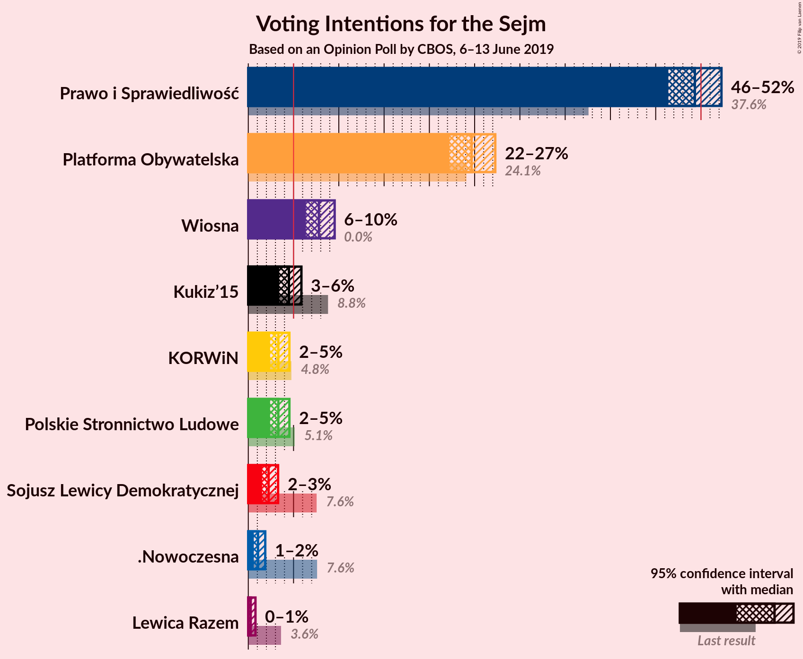

### Confidence Intervals

| Party | Last Result | Poll Result | 80% Confidence Interval | 90% Confidence Interval | 95% Confidence Interval | 99% Confidence Interval |
|:-----:|:-----------:|:-----------:|:-----------------------:|:-----------------------:|:-----------------------:|:-----------------------:|
| Prawo i Sprawiedliwość | 37.6% | 49.3% | 47.4–51.3% |46.9–51.8% |46.4–52.3% |45.5–53.2% |
| Platforma Obywatelska | 24.1% | 24.7% | 23.1–26.4% |22.6–26.9% |22.2–27.3% |21.5–28.1% |
| Wiosna | 0.0% | 7.8% | 6.9–8.9% |6.6–9.3% |6.4–9.5% |5.9–10.1% |
| Kukiz’15 | 8.8% | 4.5% | 3.8–5.4% |3.6–5.6% |3.4–5.9% |3.1–6.3% |
| Polskie Stronnictwo Ludowe | 5.1% | 3.3% | 2.7–4.1% |2.5–4.3% |2.4–4.5% |2.1–5.0% |
| KORWiN | 4.8% | 3.3% | 2.7–4.1% |2.5–4.3% |2.4–4.5% |2.1–5.0% |
| Sojusz Lewicy Demokratycznej | 7.6% | 2.2% | 1.8–2.9% |1.6–3.1% |1.5–3.3% |1.3–3.7% |
| .Nowoczesna | 7.6% | 1.1% | 0.8–1.6% |0.7–1.7% |0.6–1.9% |0.5–2.2% |
| Lewica Razem | 3.6% | 0.3% | 0.2–0.6% |0.1–0.7% |0.1–0.8% |0.0–1.0% |

*Note:* The poll result column reflects the actual value used in the calculations. Published results may vary slightly, and in addition be rounded to fewer digits.

## Seats

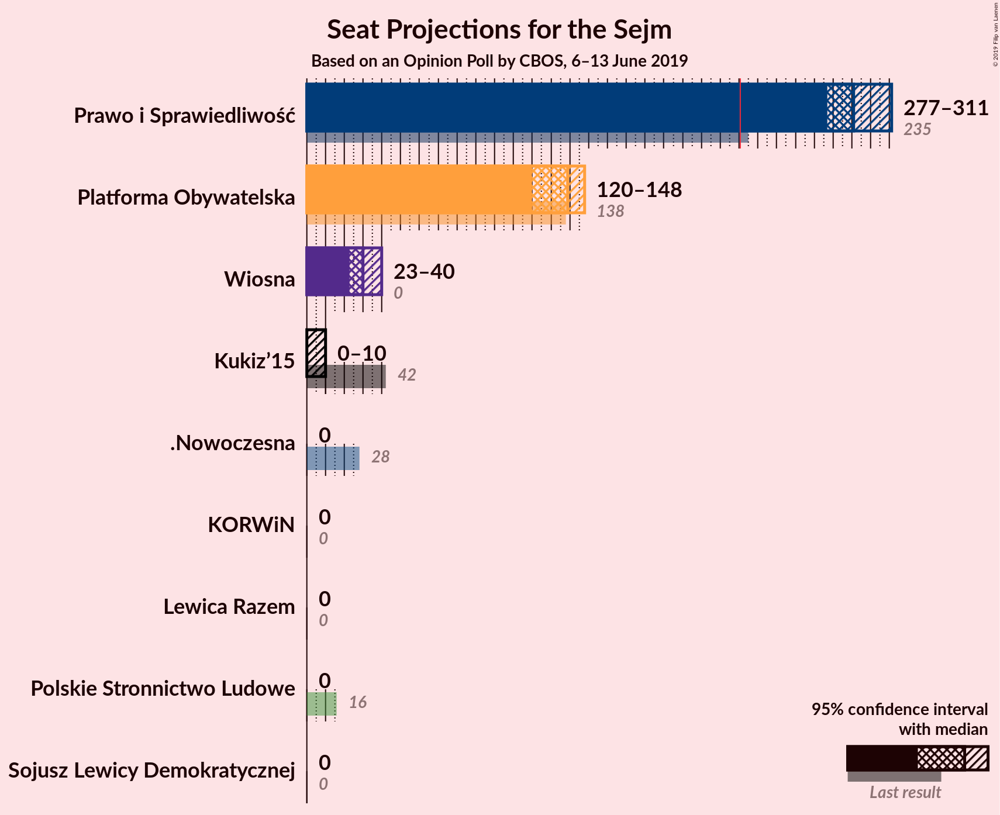

### Confidence Intervals

| Party | Last Result | Median | 80% Confidence Interval | 90% Confidence Interval | 95% Confidence Interval | 99% Confidence Interval |
|:-----:|:-----------:|:------:|:-----------------------:|:-----------------------:|:-----------------------:|:-----------------------:|
| <a href="#prawo-i-sprawiedliwość">Prawo i Sprawiedliwość</a> | 235 | 291 | 283–300 |280–304 |277–311 |269–314 |
| <a href="#platforma-obywatelska">Platforma Obywatelska</a> | 138 | 139 | 127–143 |122–145 |120–148 |114–153 |
| <a href="#wiosna">Wiosna</a> | 0 | 30 | 28–39 |26–39 |23–40 |19–44 |
| <a href="#kukiz’15">Kukiz’15</a> | 42 | 0 | 0–8 |0–9 |0–10 |0–14 |
| <a href="#polskie-stronnictwo-ludowe">Polskie Stronnictwo Ludowe</a> | 16 | 0 | 0 |0 |0 |0–11 |
| <a href="#korwin">KORWiN</a> | 0 | 0 | 0 |0 |0 |0 |
| <a href="#sojusz-lewicy-demokratycznej">Sojusz Lewicy Demokratycznej</a> | 0 | 0 | 0 |0 |0 |0 |
| <a href="#.nowoczesna">.Nowoczesna</a> | 28 | 0 | 0 |0 |0 |0 |
| <a href="#lewica-razem">Lewica Razem</a> | 0 | 0 | 0 |0 |0 |0 |

### Prawo i Sprawiedliwość

*For a full overview of the results for this party, see the [Prawo i Sprawiedliwość](party-prawoisprawiedliwość.html) page.*

| Number of Seats | Probability | Accumulated | Special Marks |
|:---------------:|:-----------:|:-----------:|:-------------:|
| 235 | 0% | 100% | Last Result |
| 236 | 0% | 100% |  |
| 237 | 0% | 100% |  |
| 238 | 0% | 100% |  |
| 239 | 0% | 100% |  |
| 240 | 0% | 100% |  |
| 241 | 0% | 100% |  |
| 242 | 0% | 100% |  |
| 243 | 0% | 100% |  |
| 244 | 0% | 100% |  |
| 245 | 0% | 100% |  |
| 246 | 0% | 100% |  |
| 247 | 0% | 100% |  |
| 248 | 0% | 100% |  |
| 249 | 0% | 100% |  |
| 250 | 0% | 100% |  |
| 251 | 0% | 100% |  |
| 252 | 0% | 100% |  |
| 253 | 0% | 100% |  |
| 254 | 0% | 100% |  |
| 255 | 0% | 100% |  |
| 256 | 0% | 100% |  |
| 257 | 0% | 100% |  |
| 258 | 0% | 100% |  |
| 259 | 0% | 100% |  |
| 260 | 0% | 100% |  |
| 261 | 0% | 100% |  |
| 262 | 0% | 100% |  |
| 263 | 0% | 99.9% |  |
| 264 | 0.1% | 99.9% |  |
| 265 | 0% | 99.8% |  |
| 266 | 0% | 99.8% |  |
| 267 | 0.1% | 99.8% |  |
| 268 | 0% | 99.7% |  |
| 269 | 0.2% | 99.7% |  |
| 270 | 0.1% | 99.4% |  |
| 271 | 0.1% | 99.4% |  |
| 272 | 0% | 99.3% |  |
| 273 | 0.3% | 99.2% |  |
| 274 | 0.3% | 98.9% |  |
| 275 | 0.5% | 98.6% |  |
| 276 | 0.4% | 98% |  |
| 277 | 1.0% | 98% |  |
| 278 | 0.3% | 97% |  |
| 279 | 1.0% | 96% |  |
| 280 | 0.8% | 95% |  |
| 281 | 2% | 95% |  |
| 282 | 1.1% | 92% |  |
| 283 | 3% | 91% |  |
| 284 | 7% | 88% |  |
| 285 | 3% | 82% |  |
| 286 | 3% | 78% |  |
| 287 | 2% | 75% |  |
| 288 | 13% | 73% |  |
| 289 | 2% | 60% |  |
| 290 | 3% | 58% |  |
| 291 | 7% | 55% | Median |
| 292 | 11% | 48% |  |
| 293 | 17% | 37% |  |
| 294 | 3% | 21% |  |
| 295 | 0.7% | 18% |  |
| 296 | 3% | 18% |  |
| 297 | 1.1% | 15% |  |
| 298 | 1.0% | 14% |  |
| 299 | 3% | 13% |  |
| 300 | 1.3% | 10% |  |
| 301 | 0.8% | 9% |  |
| 302 | 2% | 8% |  |
| 303 | 0.3% | 5% |  |
| 304 | 0.5% | 5% |  |
| 305 | 0.6% | 5% |  |
| 306 | 0% | 4% |  |
| 307 | 0.6% | 4% |  |
| 308 | 0.1% | 3% |  |
| 309 | 0% | 3% |  |
| 310 | 0.1% | 3% |  |
| 311 | 1.4% | 3% |  |
| 312 | 0.3% | 2% |  |
| 313 | 0.7% | 1.4% |  |
| 314 | 0.3% | 0.7% |  |
| 315 | 0.2% | 0.4% |  |
| 316 | 0% | 0.3% |  |
| 317 | 0.1% | 0.2% |  |
| 318 | 0% | 0.1% |  |
| 319 | 0% | 0.1% |  |
| 320 | 0% | 0.1% |  |
| 321 | 0% | 0.1% |  |
| 322 | 0.1% | 0.1% |  |
| 323 | 0% | 0% |  |

### Platforma Obywatelska

*For a full overview of the results for this party, see the [Platforma Obywatelska](party-platformaobywatelska.html) page.*

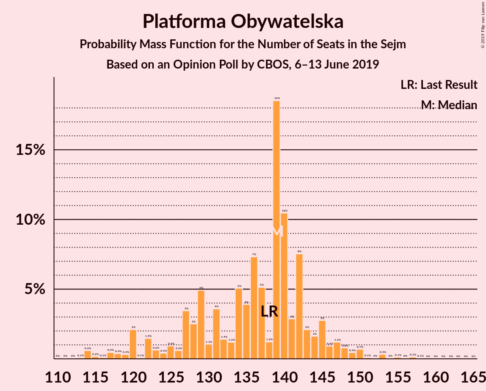

| Number of Seats | Probability | Accumulated | Special Marks |
|:---------------:|:-----------:|:-----------:|:-------------:|
| 110 | 0% | 100% |  |
| 111 | 0% | 99.9% |  |
| 112 | 0% | 99.9% |  |
| 113 | 0.1% | 99.8% |  |
| 114 | 0.6% | 99.7% |  |
| 115 | 0.2% | 99.2% |  |
| 116 | 0.1% | 99.0% |  |
| 117 | 0.5% | 98.9% |  |
| 118 | 0.4% | 98% |  |
| 119 | 0.3% | 98% |  |
| 120 | 2% | 98% |  |
| 121 | 0.1% | 96% |  |
| 122 | 1.5% | 96% |  |
| 123 | 0.6% | 94% |  |
| 124 | 0.4% | 93% |  |
| 125 | 0.9% | 93% |  |
| 126 | 0.6% | 92% |  |
| 127 | 3% | 92% |  |
| 128 | 3% | 88% |  |
| 129 | 5% | 86% |  |
| 130 | 1.1% | 81% |  |
| 131 | 4% | 80% |  |
| 132 | 1.4% | 76% |  |
| 133 | 1.2% | 75% |  |
| 134 | 5% | 73% |  |
| 135 | 4% | 68% |  |
| 136 | 7% | 64% |  |
| 137 | 5% | 57% |  |
| 138 | 1.2% | 52% | Last Result |
| 139 | 19% | 51% | Median |
| 140 | 10% | 32% |  |
| 141 | 3% | 22% |  |
| 142 | 8% | 19% |  |
| 143 | 2% | 11% |  |
| 144 | 2% | 9% |  |
| 145 | 3% | 8% |  |
| 146 | 0.9% | 5% |  |
| 147 | 1.2% | 4% |  |
| 148 | 0.8% | 3% |  |
| 149 | 0.4% | 2% |  |
| 150 | 0.7% | 2% |  |
| 151 | 0.1% | 0.9% |  |
| 152 | 0% | 0.8% |  |
| 153 | 0.3% | 0.8% |  |
| 154 | 0% | 0.4% |  |
| 155 | 0.1% | 0.4% |  |
| 156 | 0% | 0.3% |  |
| 157 | 0.1% | 0.2% |  |
| 158 | 0.1% | 0.1% |  |
| 159 | 0% | 0.1% |  |
| 160 | 0% | 0.1% |  |
| 161 | 0% | 0% |  |

### Wiosna

*For a full overview of the results for this party, see the [Wiosna](party-wiosna.html) page.*

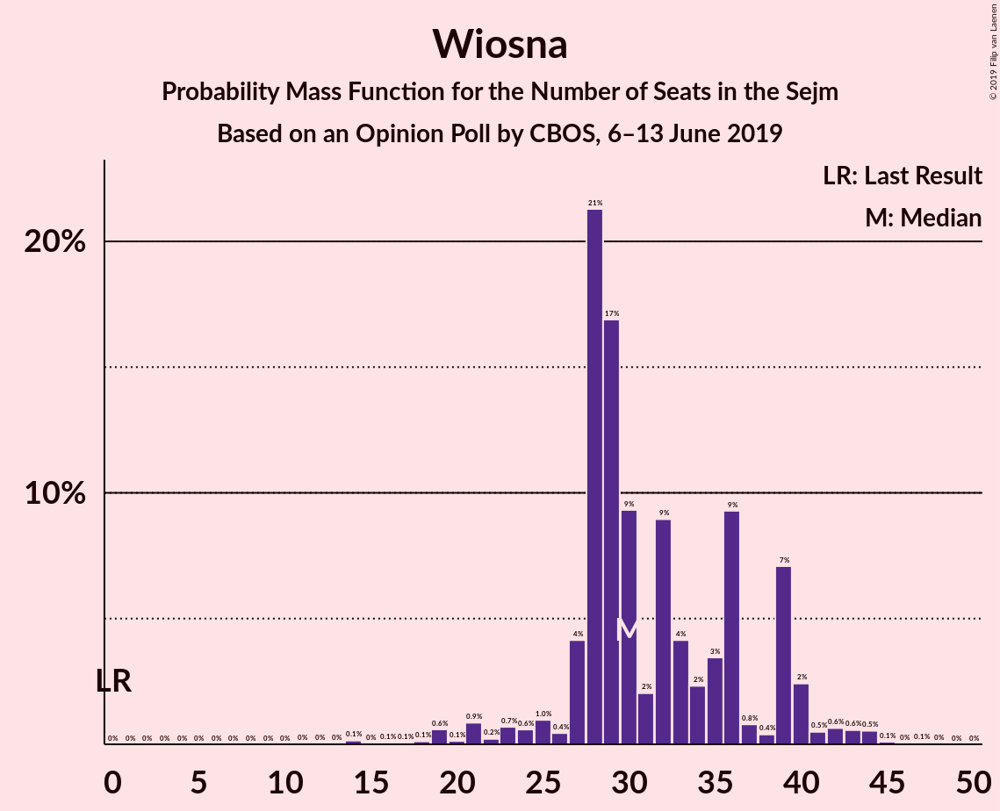

| Number of Seats | Probability | Accumulated | Special Marks |
|:---------------:|:-----------:|:-----------:|:-------------:|
| 0 | 0% | 100% | Last Result |
| 1 | 0% | 100% |  |
| 2 | 0% | 100% |  |
| 3 | 0% | 100% |  |
| 4 | 0% | 100% |  |
| 5 | 0% | 100% |  |
| 6 | 0% | 100% |  |
| 7 | 0% | 100% |  |
| 8 | 0% | 100% |  |
| 9 | 0% | 100% |  |
| 10 | 0% | 100% |  |
| 11 | 0% | 100% |  |
| 12 | 0% | 100% |  |
| 13 | 0% | 100% |  |
| 14 | 0.1% | 99.9% |  |
| 15 | 0% | 99.8% |  |
| 16 | 0.1% | 99.7% |  |
| 17 | 0.1% | 99.7% |  |
| 18 | 0.1% | 99.6% |  |
| 19 | 0.6% | 99.5% |  |
| 20 | 0.1% | 98.9% |  |
| 21 | 0.9% | 98.8% |  |
| 22 | 0.2% | 98% |  |
| 23 | 0.7% | 98% |  |
| 24 | 0.6% | 97% |  |
| 25 | 1.0% | 96% |  |
| 26 | 0.4% | 95% |  |
| 27 | 4% | 95% |  |
| 28 | 21% | 91% |  |
| 29 | 17% | 70% |  |
| 30 | 9% | 53% | Median |
| 31 | 2% | 43% |  |
| 32 | 9% | 41% |  |
| 33 | 4% | 32% |  |
| 34 | 2% | 28% |  |
| 35 | 3% | 26% |  |
| 36 | 9% | 22% |  |
| 37 | 0.8% | 13% |  |
| 38 | 0.4% | 12% |  |
| 39 | 7% | 12% |  |
| 40 | 2% | 5% |  |
| 41 | 0.5% | 2% |  |
| 42 | 0.6% | 2% |  |
| 43 | 0.6% | 1.3% |  |
| 44 | 0.5% | 0.7% |  |
| 45 | 0.1% | 0.2% |  |
| 46 | 0% | 0.1% |  |
| 47 | 0.1% | 0.1% |  |
| 48 | 0% | 0% |  |

### Kukiz’15

*For a full overview of the results for this party, see the [Kukiz’15](party-kukiz’15.html) page.*

| Number of Seats | Probability | Accumulated | Special Marks |
|:---------------:|:-----------:|:-----------:|:-------------:|
| 0 | 75% | 100% | Median |
| 1 | 0% | 25% |  |
| 2 | 0% | 25% |  |
| 3 | 8% | 25% |  |
| 4 | 1.0% | 17% |  |
| 5 | 2% | 16% |  |
| 6 | 2% | 14% |  |
| 7 | 2% | 12% |  |
| 8 | 2% | 10% |  |
| 9 | 4% | 9% |  |
| 10 | 3% | 5% |  |
| 11 | 0.4% | 2% |  |
| 12 | 1.1% | 2% |  |
| 13 | 0.2% | 0.7% |  |
| 14 | 0.1% | 0.6% |  |
| 15 | 0.2% | 0.4% |  |
| 16 | 0% | 0.2% |  |
| 17 | 0.1% | 0.2% |  |
| 18 | 0% | 0.1% |  |
| 19 | 0% | 0.1% |  |
| 20 | 0% | 0.1% |  |
| 21 | 0% | 0.1% |  |
| 22 | 0% | 0% |  |
| 23 | 0% | 0% |  |
| 24 | 0% | 0% |  |
| 25 | 0% | 0% |  |
| 26 | 0% | 0% |  |
| 27 | 0% | 0% |  |
| 28 | 0% | 0% |  |
| 29 | 0% | 0% |  |
| 30 | 0% | 0% |  |
| 31 | 0% | 0% |  |
| 32 | 0% | 0% |  |
| 33 | 0% | 0% |  |
| 34 | 0% | 0% |  |
| 35 | 0% | 0% |  |
| 36 | 0% | 0% |  |
| 37 | 0% | 0% |  |
| 38 | 0% | 0% |  |
| 39 | 0% | 0% |  |
| 40 | 0% | 0% |  |
| 41 | 0% | 0% |  |
| 42 | 0% | 0% | Last Result |

### Polskie Stronnictwo Ludowe

*For a full overview of the results for this party, see the [Polskie Stronnictwo Ludowe](party-polskiestronnictwoludowe.html) page.*

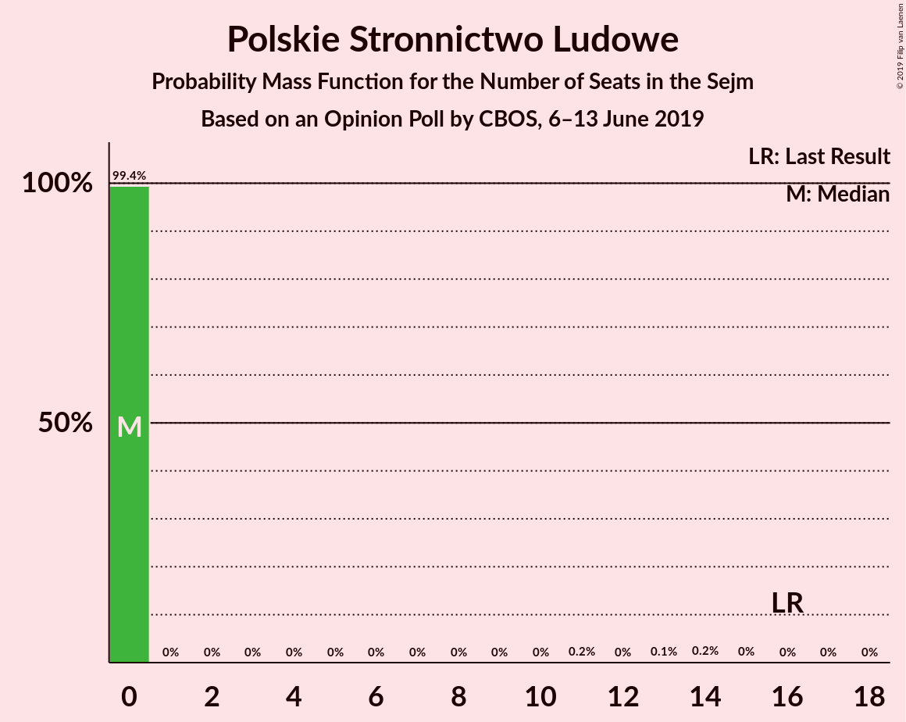

| Number of Seats | Probability | Accumulated | Special Marks |
|:---------------:|:-----------:|:-----------:|:-------------:|
| 0 | 99.4% | 100% | Median |
| 1 | 0% | 0.6% |  |
| 2 | 0% | 0.6% |  |
| 3 | 0% | 0.6% |  |
| 4 | 0% | 0.6% |  |
| 5 | 0% | 0.6% |  |
| 6 | 0% | 0.6% |  |
| 7 | 0% | 0.6% |  |
| 8 | 0% | 0.6% |  |
| 9 | 0% | 0.6% |  |
| 10 | 0% | 0.6% |  |
| 11 | 0.2% | 0.6% |  |
| 12 | 0% | 0.4% |  |
| 13 | 0.1% | 0.4% |  |
| 14 | 0.2% | 0.3% |  |
| 15 | 0% | 0.1% |  |
| 16 | 0% | 0.1% | Last Result |
| 17 | 0% | 0% |  |

### KORWiN

*For a full overview of the results for this party, see the [KORWiN](party-korwin.html) page.*

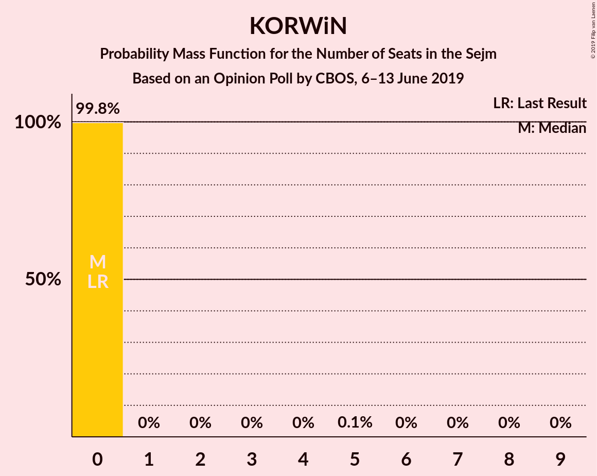

| Number of Seats | Probability | Accumulated | Special Marks |
|:---------------:|:-----------:|:-----------:|:-------------:|
| 0 | 99.8% | 100% | Last Result, Median |
| 1 | 0% | 0.2% |  |
| 2 | 0% | 0.2% |  |
| 3 | 0% | 0.2% |  |
| 4 | 0% | 0.2% |  |
| 5 | 0.1% | 0.2% |  |
| 6 | 0% | 0.1% |  |
| 7 | 0% | 0.1% |  |
| 8 | 0% | 0.1% |  |
| 9 | 0% | 0% |  |

### Sojusz Lewicy Demokratycznej

*For a full overview of the results for this party, see the [Sojusz Lewicy Demokratycznej](party-sojuszlewicydemokratycznej.html) page.*

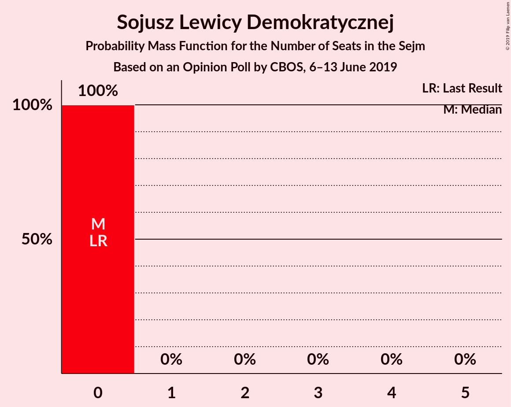

| Number of Seats | Probability | Accumulated | Special Marks |
|:---------------:|:-----------:|:-----------:|:-------------:|
| 0 | 100% | 100% | Last Result, Median |

### .Nowoczesna

*For a full overview of the results for this party, see the [.Nowoczesna](party-nowoczesna.html) page.*

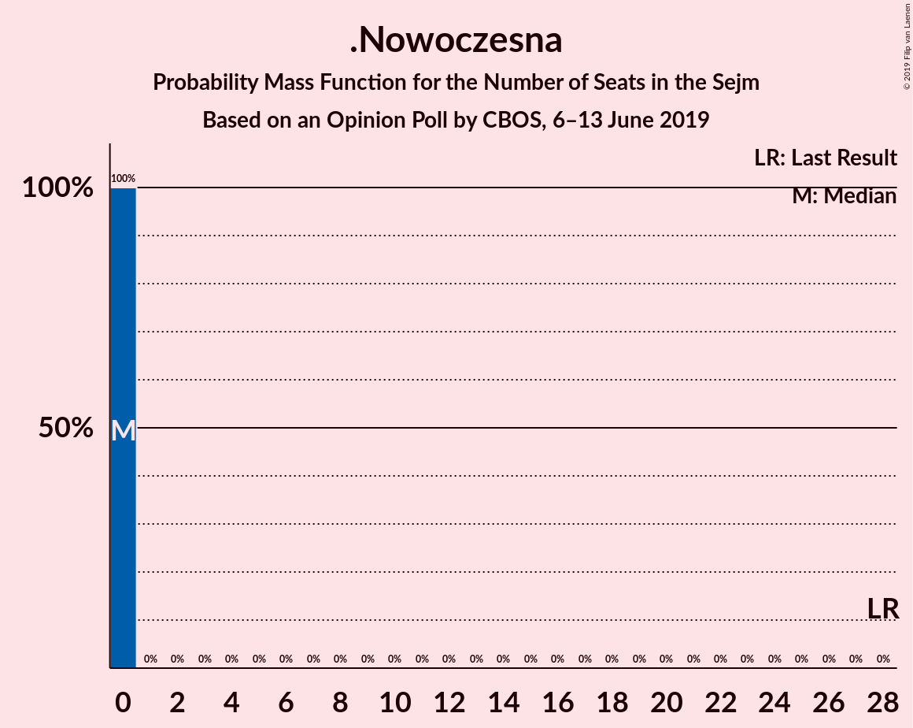

| Number of Seats | Probability | Accumulated | Special Marks |
|:---------------:|:-----------:|:-----------:|:-------------:|
| 0 | 100% | 100% | Median |
| 1 | 0% | 0% |  |
| 2 | 0% | 0% |  |
| 3 | 0% | 0% |  |
| 4 | 0% | 0% |  |
| 5 | 0% | 0% |  |
| 6 | 0% | 0% |  |
| 7 | 0% | 0% |  |
| 8 | 0% | 0% |  |
| 9 | 0% | 0% |  |
| 10 | 0% | 0% |  |
| 11 | 0% | 0% |  |
| 12 | 0% | 0% |  |
| 13 | 0% | 0% |  |
| 14 | 0% | 0% |  |
| 15 | 0% | 0% |  |
| 16 | 0% | 0% |  |
| 17 | 0% | 0% |  |
| 18 | 0% | 0% |  |
| 19 | 0% | 0% |  |
| 20 | 0% | 0% |  |
| 21 | 0% | 0% |  |
| 22 | 0% | 0% |  |
| 23 | 0% | 0% |  |
| 24 | 0% | 0% |  |
| 25 | 0% | 0% |  |
| 26 | 0% | 0% |  |
| 27 | 0% | 0% |  |
| 28 | 0% | 0% | Last Result |

### Lewica Razem

*For a full overview of the results for this party, see the [Lewica Razem](party-lewicarazem.html) page.*

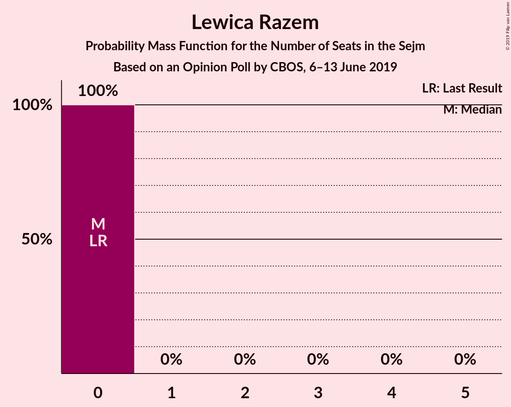

| Number of Seats | Probability | Accumulated | Special Marks |
|:---------------:|:-----------:|:-----------:|:-------------:|
| 0 | 100% | 100% | Last Result, Median |

## Coalitions

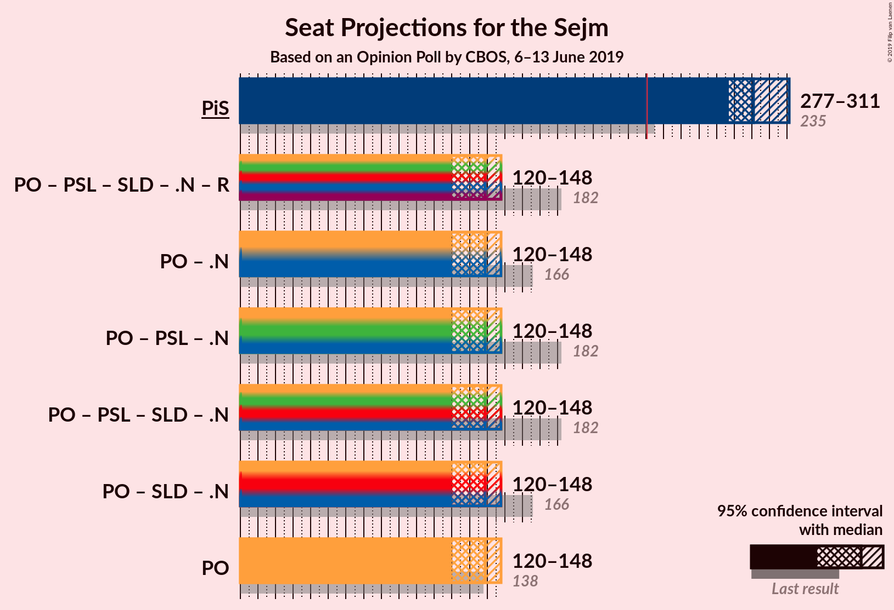

### Confidence Intervals

| Coalition | Last Result | Median | Majority? | 80% Confidence Interval | 90% Confidence Interval | 95% Confidence Interval | 99% Confidence Interval |
|:---------:|:-----------:|:------:|:---------:|:-----------------------:|:-----------------------:|:-----------------------:|:-----------------------:|
| Prawo i Sprawiedliwość | 235 | 291 | 100% | 283–300 | 280–304 | 277–311 | 269–314 |
| Platforma Obywatelska – Polskie Stronnictwo Ludowe – Sojusz Lewicy Demokratycznej – .Nowoczesna – Lewica Razem | 182 | 139 | 0% | 127–143 | 122–146 | 120–148 | 114–155 |
| Platforma Obywatelska – .Nowoczesna | 166 | 139 | 0% | 127–143 | 122–145 | 120–148 | 114–153 |
| Platforma Obywatelska – Polskie Stronnictwo Ludowe – .Nowoczesna | 182 | 139 | 0% | 127–143 | 122–146 | 120–148 | 114–155 |
| Platforma Obywatelska – Polskie Stronnictwo Ludowe – Sojusz Lewicy Demokratycznej – .Nowoczesna | 182 | 139 | 0% | 127–143 | 122–146 | 120–148 | 114–155 |
| Platforma Obywatelska – Sojusz Lewicy Demokratycznej – .Nowoczesna | 166 | 139 | 0% | 127–143 | 122–145 | 120–148 | 114–153 |
| Platforma Obywatelska | 138 | 139 | 0% | 127–143 | 122–145 | 120–148 | 114–153 |

### Prawo i Sprawiedliwość

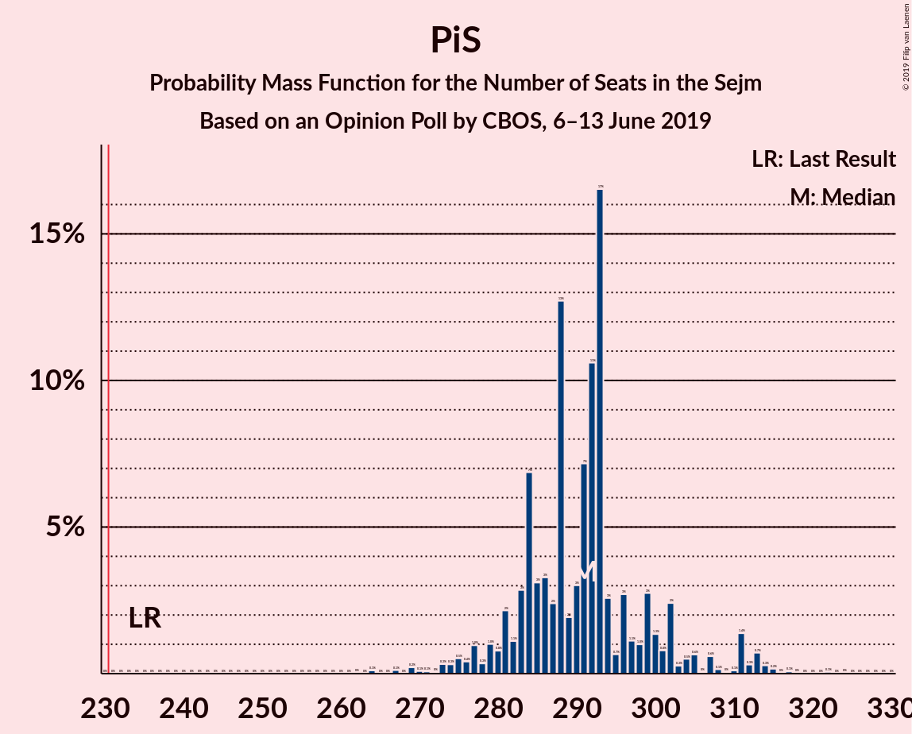

| Number of Seats | Probability | Accumulated | Special Marks |
|:---------------:|:-----------:|:-----------:|:-------------:|
| 235 | 0% | 100% | Last Result |
| 236 | 0% | 100% |  |
| 237 | 0% | 100% |  |
| 238 | 0% | 100% |  |
| 239 | 0% | 100% |  |
| 240 | 0% | 100% |  |
| 241 | 0% | 100% |  |
| 242 | 0% | 100% |  |
| 243 | 0% | 100% |  |
| 244 | 0% | 100% |  |
| 245 | 0% | 100% |  |
| 246 | 0% | 100% |  |
| 247 | 0% | 100% |  |
| 248 | 0% | 100% |  |
| 249 | 0% | 100% |  |
| 250 | 0% | 100% |  |
| 251 | 0% | 100% |  |
| 252 | 0% | 100% |  |
| 253 | 0% | 100% |  |
| 254 | 0% | 100% |  |
| 255 | 0% | 100% |  |
| 256 | 0% | 100% |  |
| 257 | 0% | 100% |  |
| 258 | 0% | 100% |  |
| 259 | 0% | 100% |  |
| 260 | 0% | 100% |  |
| 261 | 0% | 100% |  |
| 262 | 0% | 100% |  |
| 263 | 0% | 99.9% |  |
| 264 | 0.1% | 99.9% |  |
| 265 | 0% | 99.8% |  |
| 266 | 0% | 99.8% |  |
| 267 | 0.1% | 99.8% |  |
| 268 | 0% | 99.7% |  |
| 269 | 0.2% | 99.7% |  |
| 270 | 0.1% | 99.4% |  |
| 271 | 0.1% | 99.4% |  |
| 272 | 0% | 99.3% |  |
| 273 | 0.3% | 99.2% |  |
| 274 | 0.3% | 98.9% |  |
| 275 | 0.5% | 98.6% |  |
| 276 | 0.4% | 98% |  |
| 277 | 1.0% | 98% |  |
| 278 | 0.3% | 97% |  |
| 279 | 1.0% | 96% |  |
| 280 | 0.8% | 95% |  |
| 281 | 2% | 95% |  |
| 282 | 1.1% | 92% |  |
| 283 | 3% | 91% |  |
| 284 | 7% | 88% |  |
| 285 | 3% | 82% |  |
| 286 | 3% | 78% |  |
| 287 | 2% | 75% |  |
| 288 | 13% | 73% |  |
| 289 | 2% | 60% |  |
| 290 | 3% | 58% |  |
| 291 | 7% | 55% | Median |
| 292 | 11% | 48% |  |
| 293 | 17% | 37% |  |
| 294 | 3% | 21% |  |
| 295 | 0.7% | 18% |  |
| 296 | 3% | 18% |  |
| 297 | 1.1% | 15% |  |
| 298 | 1.0% | 14% |  |
| 299 | 3% | 13% |  |
| 300 | 1.3% | 10% |  |
| 301 | 0.8% | 9% |  |
| 302 | 2% | 8% |  |
| 303 | 0.3% | 5% |  |
| 304 | 0.5% | 5% |  |
| 305 | 0.6% | 5% |  |
| 306 | 0% | 4% |  |
| 307 | 0.6% | 4% |  |
| 308 | 0.1% | 3% |  |
| 309 | 0% | 3% |  |
| 310 | 0.1% | 3% |  |
| 311 | 1.4% | 3% |  |
| 312 | 0.3% | 2% |  |
| 313 | 0.7% | 1.4% |  |
| 314 | 0.3% | 0.7% |  |
| 315 | 0.2% | 0.4% |  |
| 316 | 0% | 0.3% |  |
| 317 | 0.1% | 0.2% |  |
| 318 | 0% | 0.1% |  |
| 319 | 0% | 0.1% |  |
| 320 | 0% | 0.1% |  |
| 321 | 0% | 0.1% |  |
| 322 | 0.1% | 0.1% |  |
| 323 | 0% | 0% |  |

### Platforma Obywatelska – Polskie Stronnictwo Ludowe – Sojusz Lewicy Demokratycznej – .Nowoczesna – Lewica Razem

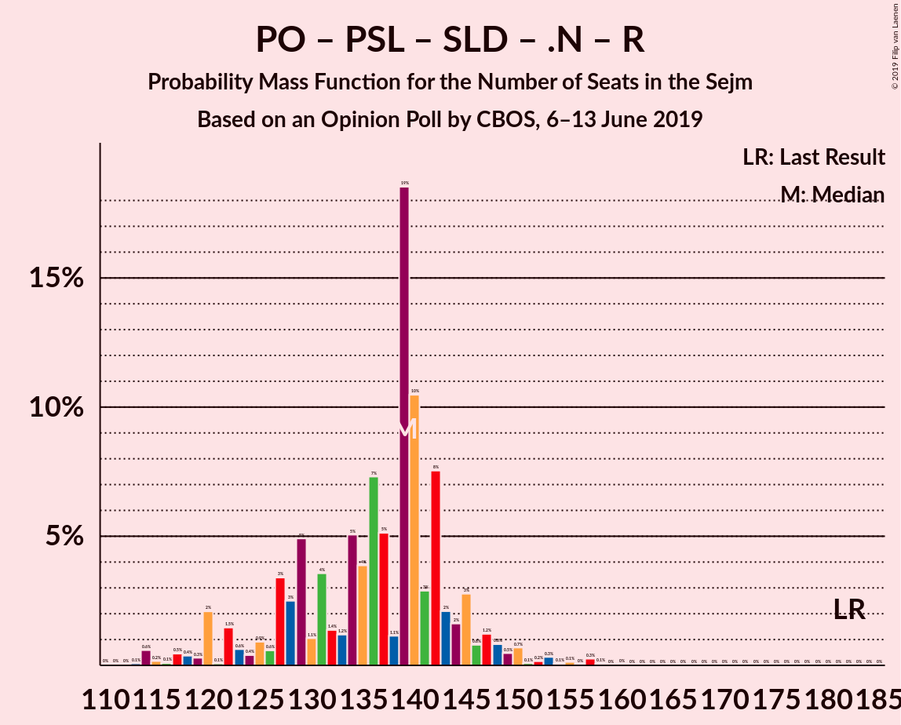

| Number of Seats | Probability | Accumulated | Special Marks |
|:---------------:|:-----------:|:-----------:|:-------------:|
| 110 | 0% | 100% |  |
| 111 | 0% | 99.9% |  |
| 112 | 0% | 99.9% |  |
| 113 | 0.1% | 99.8% |  |
| 114 | 0.6% | 99.7% |  |
| 115 | 0.2% | 99.2% |  |
| 116 | 0.1% | 99.0% |  |
| 117 | 0.5% | 98.9% |  |
| 118 | 0.4% | 98% |  |
| 119 | 0.3% | 98% |  |
| 120 | 2% | 98% |  |
| 121 | 0.1% | 96% |  |
| 122 | 1.5% | 96% |  |
| 123 | 0.6% | 94% |  |
| 124 | 0.4% | 94% |  |
| 125 | 0.9% | 93% |  |
| 126 | 0.6% | 92% |  |
| 127 | 3% | 92% |  |
| 128 | 3% | 88% |  |
| 129 | 5% | 86% |  |
| 130 | 1.1% | 81% |  |
| 131 | 4% | 80% |  |
| 132 | 1.4% | 76% |  |
| 133 | 1.2% | 75% |  |
| 134 | 5% | 74% |  |
| 135 | 4% | 69% |  |
| 136 | 7% | 65% |  |
| 137 | 5% | 57% |  |
| 138 | 1.1% | 52% |  |
| 139 | 19% | 51% | Median |
| 140 | 10% | 33% |  |
| 141 | 3% | 22% |  |
| 142 | 8% | 19% |  |
| 143 | 2% | 12% |  |
| 144 | 2% | 10% |  |
| 145 | 3% | 8% |  |
| 146 | 0.8% | 5% |  |
| 147 | 1.2% | 4% |  |
| 148 | 0.8% | 3% |  |
| 149 | 0.5% | 2% |  |
| 150 | 0.7% | 2% |  |
| 151 | 0.1% | 1.2% |  |
| 152 | 0.2% | 1.1% |  |
| 153 | 0.3% | 0.9% |  |
| 154 | 0.1% | 0.6% |  |
| 155 | 0.1% | 0.6% |  |
| 156 | 0% | 0.4% |  |
| 157 | 0.3% | 0.4% |  |
| 158 | 0.1% | 0.1% |  |
| 159 | 0% | 0.1% |  |
| 160 | 0% | 0.1% |  |
| 161 | 0% | 0% |  |
| 162 | 0% | 0% |  |
| 163 | 0% | 0% |  |
| 164 | 0% | 0% |  |
| 165 | 0% | 0% |  |
| 166 | 0% | 0% |  |
| 167 | 0% | 0% |  |
| 168 | 0% | 0% |  |
| 169 | 0% | 0% |  |
| 170 | 0% | 0% |  |
| 171 | 0% | 0% |  |
| 172 | 0% | 0% |  |
| 173 | 0% | 0% |  |
| 174 | 0% | 0% |  |
| 175 | 0% | 0% |  |
| 176 | 0% | 0% |  |
| 177 | 0% | 0% |  |
| 178 | 0% | 0% |  |
| 179 | 0% | 0% |  |
| 180 | 0% | 0% |  |
| 181 | 0% | 0% |  |
| 182 | 0% | 0% | Last Result |

### Platforma Obywatelska – .Nowoczesna

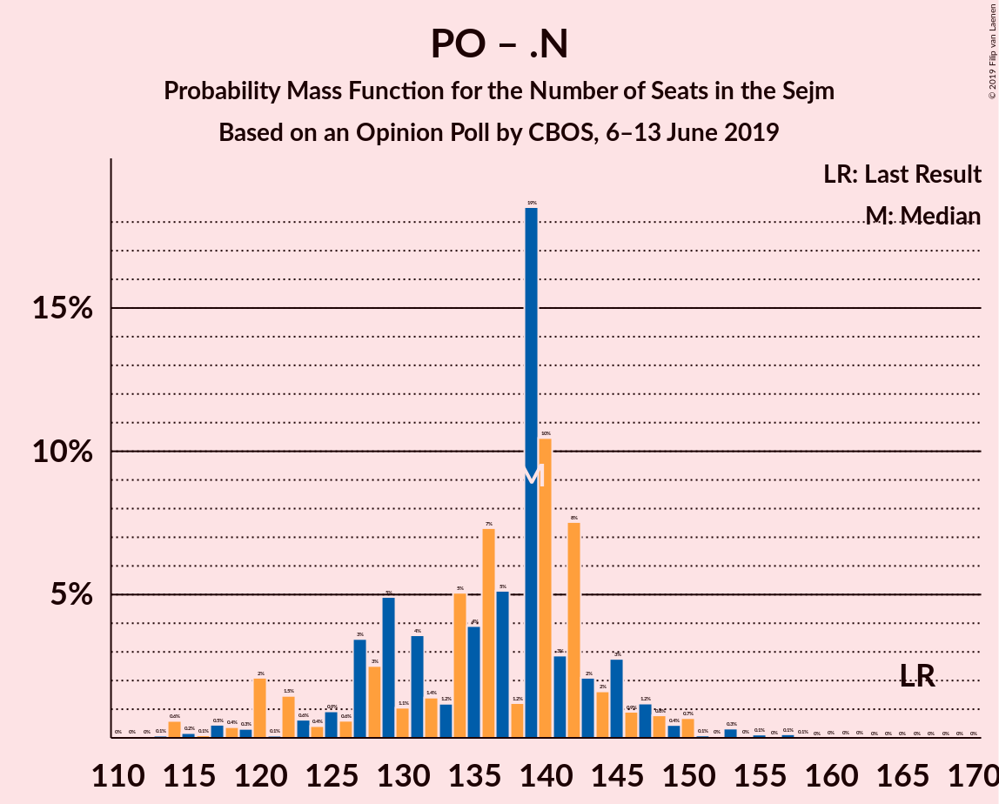

| Number of Seats | Probability | Accumulated | Special Marks |
|:---------------:|:-----------:|:-----------:|:-------------:|
| 110 | 0% | 100% |  |
| 111 | 0% | 99.9% |  |
| 112 | 0% | 99.9% |  |
| 113 | 0.1% | 99.8% |  |
| 114 | 0.6% | 99.7% |  |
| 115 | 0.2% | 99.2% |  |
| 116 | 0.1% | 99.0% |  |
| 117 | 0.5% | 98.9% |  |
| 118 | 0.4% | 98% |  |
| 119 | 0.3% | 98% |  |
| 120 | 2% | 98% |  |
| 121 | 0.1% | 96% |  |
| 122 | 1.5% | 96% |  |
| 123 | 0.6% | 94% |  |
| 124 | 0.4% | 93% |  |
| 125 | 0.9% | 93% |  |
| 126 | 0.6% | 92% |  |
| 127 | 3% | 92% |  |
| 128 | 3% | 88% |  |
| 129 | 5% | 86% |  |
| 130 | 1.1% | 81% |  |
| 131 | 4% | 80% |  |
| 132 | 1.4% | 76% |  |
| 133 | 1.2% | 75% |  |
| 134 | 5% | 73% |  |
| 135 | 4% | 68% |  |
| 136 | 7% | 64% |  |
| 137 | 5% | 57% |  |
| 138 | 1.2% | 52% |  |
| 139 | 19% | 51% | Median |
| 140 | 10% | 32% |  |
| 141 | 3% | 22% |  |
| 142 | 8% | 19% |  |
| 143 | 2% | 11% |  |
| 144 | 2% | 9% |  |
| 145 | 3% | 8% |  |
| 146 | 0.9% | 5% |  |
| 147 | 1.2% | 4% |  |
| 148 | 0.8% | 3% |  |
| 149 | 0.4% | 2% |  |
| 150 | 0.7% | 2% |  |
| 151 | 0.1% | 0.9% |  |
| 152 | 0% | 0.8% |  |
| 153 | 0.3% | 0.8% |  |
| 154 | 0% | 0.4% |  |
| 155 | 0.1% | 0.4% |  |
| 156 | 0% | 0.3% |  |
| 157 | 0.1% | 0.2% |  |
| 158 | 0.1% | 0.1% |  |
| 159 | 0% | 0.1% |  |
| 160 | 0% | 0.1% |  |
| 161 | 0% | 0% |  |
| 162 | 0% | 0% |  |
| 163 | 0% | 0% |  |
| 164 | 0% | 0% |  |
| 165 | 0% | 0% |  |
| 166 | 0% | 0% | Last Result |

### Platforma Obywatelska – Polskie Stronnictwo Ludowe – .Nowoczesna

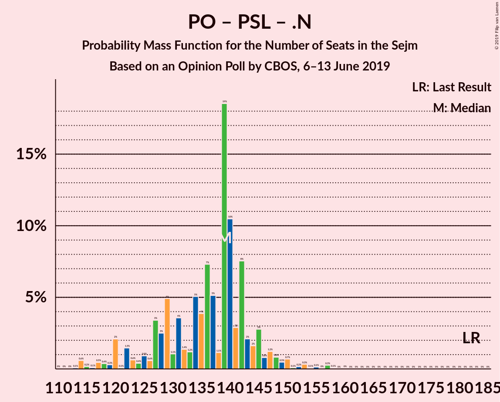

| Number of Seats | Probability | Accumulated | Special Marks |
|:---------------:|:-----------:|:-----------:|:-------------:|
| 110 | 0% | 100% |  |
| 111 | 0% | 99.9% |  |
| 112 | 0% | 99.9% |  |
| 113 | 0.1% | 99.8% |  |
| 114 | 0.6% | 99.7% |  |
| 115 | 0.2% | 99.2% |  |
| 116 | 0.1% | 99.0% |  |
| 117 | 0.5% | 98.9% |  |
| 118 | 0.4% | 98% |  |
| 119 | 0.3% | 98% |  |
| 120 | 2% | 98% |  |
| 121 | 0.1% | 96% |  |
| 122 | 1.5% | 96% |  |
| 123 | 0.6% | 94% |  |
| 124 | 0.4% | 94% |  |
| 125 | 0.9% | 93% |  |
| 126 | 0.6% | 92% |  |
| 127 | 3% | 92% |  |
| 128 | 3% | 88% |  |
| 129 | 5% | 86% |  |
| 130 | 1.1% | 81% |  |
| 131 | 4% | 80% |  |
| 132 | 1.4% | 76% |  |
| 133 | 1.2% | 75% |  |
| 134 | 5% | 74% |  |
| 135 | 4% | 69% |  |
| 136 | 7% | 65% |  |
| 137 | 5% | 57% |  |
| 138 | 1.1% | 52% |  |
| 139 | 19% | 51% | Median |
| 140 | 10% | 33% |  |
| 141 | 3% | 22% |  |
| 142 | 8% | 19% |  |
| 143 | 2% | 12% |  |
| 144 | 2% | 10% |  |
| 145 | 3% | 8% |  |
| 146 | 0.8% | 5% |  |
| 147 | 1.2% | 4% |  |
| 148 | 0.8% | 3% |  |
| 149 | 0.5% | 2% |  |
| 150 | 0.7% | 2% |  |
| 151 | 0.1% | 1.2% |  |
| 152 | 0.2% | 1.1% |  |
| 153 | 0.3% | 0.9% |  |
| 154 | 0.1% | 0.6% |  |
| 155 | 0.1% | 0.6% |  |
| 156 | 0% | 0.4% |  |
| 157 | 0.3% | 0.4% |  |
| 158 | 0.1% | 0.1% |  |
| 159 | 0% | 0.1% |  |
| 160 | 0% | 0.1% |  |
| 161 | 0% | 0% |  |
| 162 | 0% | 0% |  |
| 163 | 0% | 0% |  |
| 164 | 0% | 0% |  |
| 165 | 0% | 0% |  |
| 166 | 0% | 0% |  |
| 167 | 0% | 0% |  |
| 168 | 0% | 0% |  |
| 169 | 0% | 0% |  |
| 170 | 0% | 0% |  |
| 171 | 0% | 0% |  |
| 172 | 0% | 0% |  |
| 173 | 0% | 0% |  |
| 174 | 0% | 0% |  |
| 175 | 0% | 0% |  |
| 176 | 0% | 0% |  |
| 177 | 0% | 0% |  |
| 178 | 0% | 0% |  |
| 179 | 0% | 0% |  |
| 180 | 0% | 0% |  |
| 181 | 0% | 0% |  |
| 182 | 0% | 0% | Last Result |

### Platforma Obywatelska – Polskie Stronnictwo Ludowe – Sojusz Lewicy Demokratycznej – .Nowoczesna

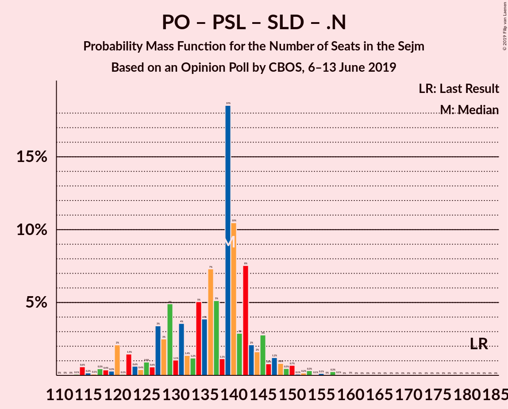

| Number of Seats | Probability | Accumulated | Special Marks |
|:---------------:|:-----------:|:-----------:|:-------------:|
| 110 | 0% | 100% |  |
| 111 | 0% | 99.9% |  |
| 112 | 0% | 99.9% |  |
| 113 | 0.1% | 99.8% |  |
| 114 | 0.6% | 99.7% |  |
| 115 | 0.2% | 99.2% |  |
| 116 | 0.1% | 99.0% |  |
| 117 | 0.5% | 98.9% |  |
| 118 | 0.4% | 98% |  |
| 119 | 0.3% | 98% |  |
| 120 | 2% | 98% |  |
| 121 | 0.1% | 96% |  |
| 122 | 1.5% | 96% |  |
| 123 | 0.6% | 94% |  |
| 124 | 0.4% | 94% |  |
| 125 | 0.9% | 93% |  |
| 126 | 0.6% | 92% |  |
| 127 | 3% | 92% |  |
| 128 | 3% | 88% |  |
| 129 | 5% | 86% |  |
| 130 | 1.1% | 81% |  |
| 131 | 4% | 80% |  |
| 132 | 1.4% | 76% |  |
| 133 | 1.2% | 75% |  |
| 134 | 5% | 74% |  |
| 135 | 4% | 69% |  |
| 136 | 7% | 65% |  |
| 137 | 5% | 57% |  |
| 138 | 1.1% | 52% |  |
| 139 | 19% | 51% | Median |
| 140 | 10% | 33% |  |
| 141 | 3% | 22% |  |
| 142 | 8% | 19% |  |
| 143 | 2% | 12% |  |
| 144 | 2% | 10% |  |
| 145 | 3% | 8% |  |
| 146 | 0.8% | 5% |  |
| 147 | 1.2% | 4% |  |
| 148 | 0.8% | 3% |  |
| 149 | 0.5% | 2% |  |
| 150 | 0.7% | 2% |  |
| 151 | 0.1% | 1.2% |  |
| 152 | 0.2% | 1.1% |  |
| 153 | 0.3% | 0.9% |  |
| 154 | 0.1% | 0.6% |  |
| 155 | 0.1% | 0.6% |  |
| 156 | 0% | 0.4% |  |
| 157 | 0.3% | 0.4% |  |
| 158 | 0.1% | 0.1% |  |
| 159 | 0% | 0.1% |  |
| 160 | 0% | 0.1% |  |
| 161 | 0% | 0% |  |
| 162 | 0% | 0% |  |
| 163 | 0% | 0% |  |
| 164 | 0% | 0% |  |
| 165 | 0% | 0% |  |
| 166 | 0% | 0% |  |
| 167 | 0% | 0% |  |
| 168 | 0% | 0% |  |
| 169 | 0% | 0% |  |
| 170 | 0% | 0% |  |
| 171 | 0% | 0% |  |
| 172 | 0% | 0% |  |
| 173 | 0% | 0% |  |
| 174 | 0% | 0% |  |
| 175 | 0% | 0% |  |
| 176 | 0% | 0% |  |
| 177 | 0% | 0% |  |
| 178 | 0% | 0% |  |
| 179 | 0% | 0% |  |
| 180 | 0% | 0% |  |
| 181 | 0% | 0% |  |
| 182 | 0% | 0% | Last Result |

### Platforma Obywatelska – Sojusz Lewicy Demokratycznej – .Nowoczesna

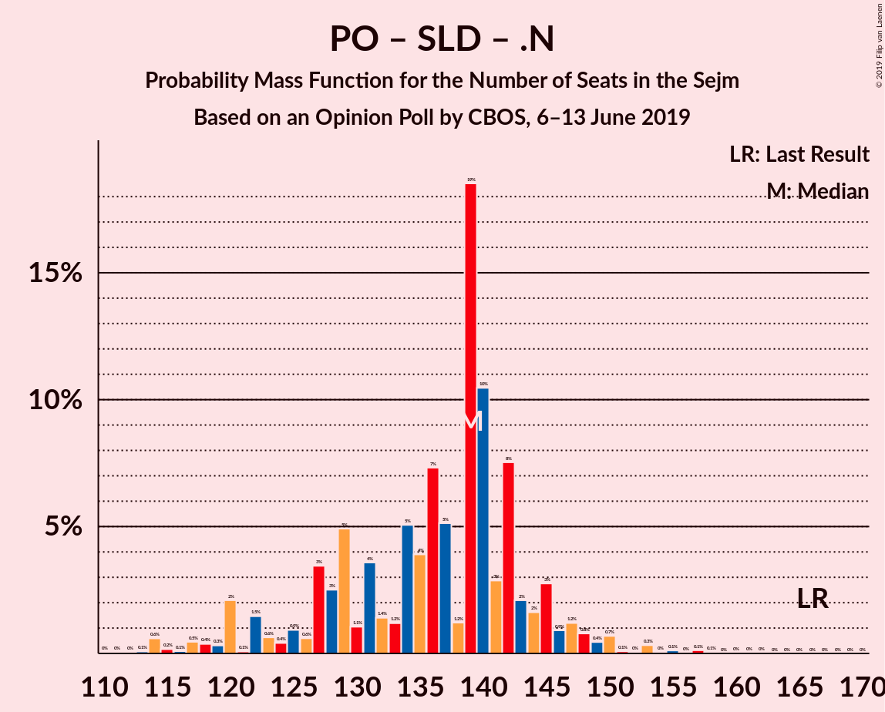

| Number of Seats | Probability | Accumulated | Special Marks |
|:---------------:|:-----------:|:-----------:|:-------------:|
| 110 | 0% | 100% |  |
| 111 | 0% | 99.9% |  |
| 112 | 0% | 99.9% |  |
| 113 | 0.1% | 99.8% |  |
| 114 | 0.6% | 99.7% |  |
| 115 | 0.2% | 99.2% |  |
| 116 | 0.1% | 99.0% |  |
| 117 | 0.5% | 98.9% |  |
| 118 | 0.4% | 98% |  |
| 119 | 0.3% | 98% |  |
| 120 | 2% | 98% |  |
| 121 | 0.1% | 96% |  |
| 122 | 1.5% | 96% |  |
| 123 | 0.6% | 94% |  |
| 124 | 0.4% | 93% |  |
| 125 | 0.9% | 93% |  |
| 126 | 0.6% | 92% |  |
| 127 | 3% | 92% |  |
| 128 | 3% | 88% |  |
| 129 | 5% | 86% |  |
| 130 | 1.1% | 81% |  |
| 131 | 4% | 80% |  |
| 132 | 1.4% | 76% |  |
| 133 | 1.2% | 75% |  |
| 134 | 5% | 73% |  |
| 135 | 4% | 68% |  |
| 136 | 7% | 64% |  |
| 137 | 5% | 57% |  |
| 138 | 1.2% | 52% |  |
| 139 | 19% | 51% | Median |
| 140 | 10% | 32% |  |
| 141 | 3% | 22% |  |
| 142 | 8% | 19% |  |
| 143 | 2% | 11% |  |
| 144 | 2% | 9% |  |
| 145 | 3% | 8% |  |
| 146 | 0.9% | 5% |  |
| 147 | 1.2% | 4% |  |
| 148 | 0.8% | 3% |  |
| 149 | 0.4% | 2% |  |
| 150 | 0.7% | 2% |  |
| 151 | 0.1% | 0.9% |  |
| 152 | 0% | 0.8% |  |
| 153 | 0.3% | 0.8% |  |
| 154 | 0% | 0.4% |  |
| 155 | 0.1% | 0.4% |  |
| 156 | 0% | 0.3% |  |
| 157 | 0.1% | 0.2% |  |
| 158 | 0.1% | 0.1% |  |
| 159 | 0% | 0.1% |  |
| 160 | 0% | 0.1% |  |
| 161 | 0% | 0% |  |
| 162 | 0% | 0% |  |
| 163 | 0% | 0% |  |
| 164 | 0% | 0% |  |
| 165 | 0% | 0% |  |
| 166 | 0% | 0% | Last Result |

### Platforma Obywatelska

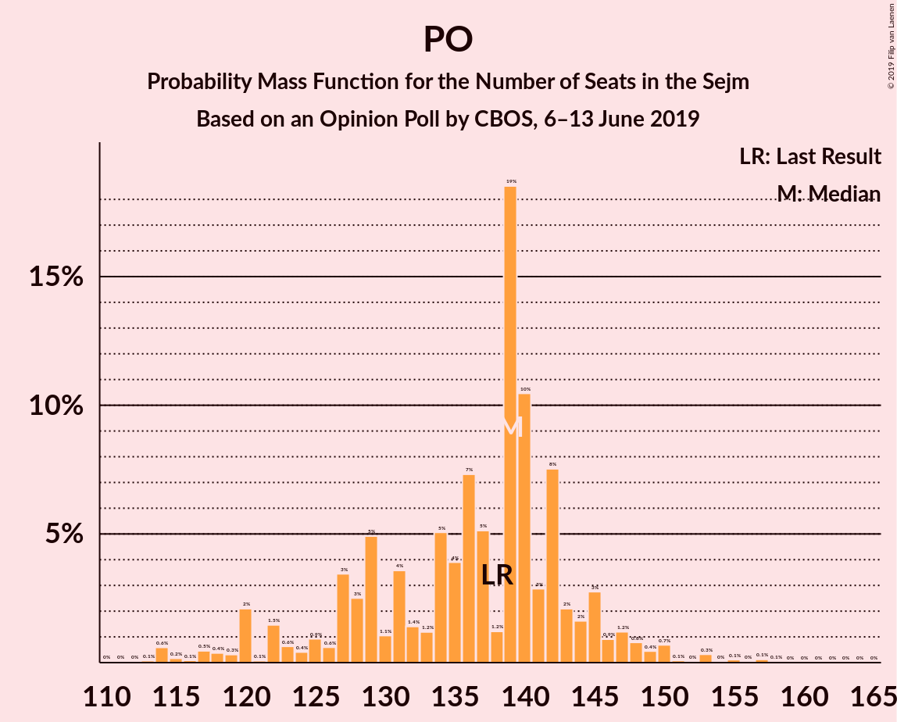

| Number of Seats | Probability | Accumulated | Special Marks |
|:---------------:|:-----------:|:-----------:|:-------------:|
| 110 | 0% | 100% |  |
| 111 | 0% | 99.9% |  |
| 112 | 0% | 99.9% |  |
| 113 | 0.1% | 99.8% |  |
| 114 | 0.6% | 99.7% |  |
| 115 | 0.2% | 99.2% |  |
| 116 | 0.1% | 99.0% |  |
| 117 | 0.5% | 98.9% |  |
| 118 | 0.4% | 98% |  |
| 119 | 0.3% | 98% |  |
| 120 | 2% | 98% |  |
| 121 | 0.1% | 96% |  |
| 122 | 1.5% | 96% |  |
| 123 | 0.6% | 94% |  |
| 124 | 0.4% | 93% |  |
| 125 | 0.9% | 93% |  |
| 126 | 0.6% | 92% |  |
| 127 | 3% | 92% |  |
| 128 | 3% | 88% |  |
| 129 | 5% | 86% |  |
| 130 | 1.1% | 81% |  |
| 131 | 4% | 80% |  |
| 132 | 1.4% | 76% |  |
| 133 | 1.2% | 75% |  |
| 134 | 5% | 73% |  |
| 135 | 4% | 68% |  |
| 136 | 7% | 64% |  |
| 137 | 5% | 57% |  |
| 138 | 1.2% | 52% | Last Result |
| 139 | 19% | 51% | Median |
| 140 | 10% | 32% |  |
| 141 | 3% | 22% |  |
| 142 | 8% | 19% |  |
| 143 | 2% | 11% |  |
| 144 | 2% | 9% |  |
| 145 | 3% | 8% |  |
| 146 | 0.9% | 5% |  |
| 147 | 1.2% | 4% |  |
| 148 | 0.8% | 3% |  |
| 149 | 0.4% | 2% |  |
| 150 | 0.7% | 2% |  |
| 151 | 0.1% | 0.9% |  |
| 152 | 0% | 0.8% |  |
| 153 | 0.3% | 0.8% |  |
| 154 | 0% | 0.4% |  |
| 155 | 0.1% | 0.4% |  |
| 156 | 0% | 0.3% |  |
| 157 | 0.1% | 0.2% |  |
| 158 | 0.1% | 0.1% |  |
| 159 | 0% | 0.1% |  |
| 160 | 0% | 0.1% |  |
| 161 | 0% | 0% |  |

## Technical Information

### Opinion Poll

+ **Polling firm:** CBOS
+ **Commissioner(s):** —
+ **Fieldwork period:** 6–13 June 2019

### Calculations

+ **Sample size:** 1115
+ **Simulations done:** 524,288
+ **Error estimate:** 2.21%

