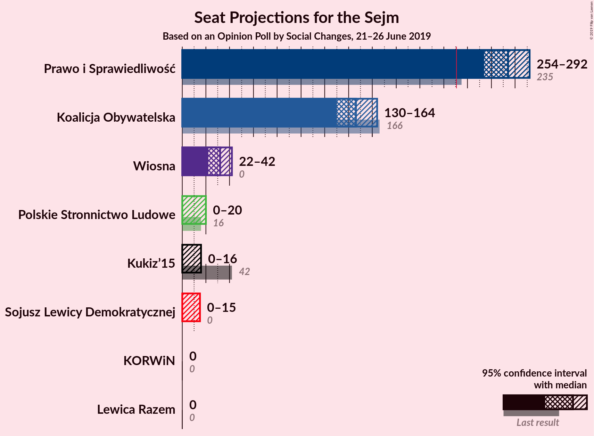
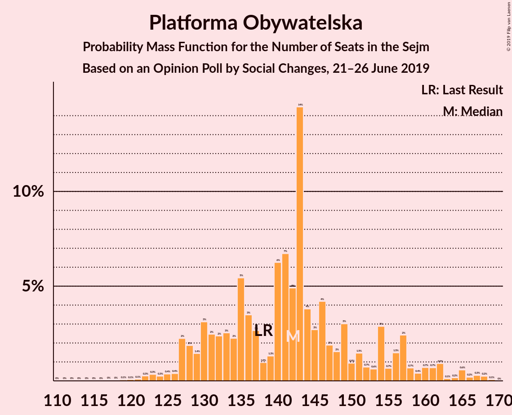
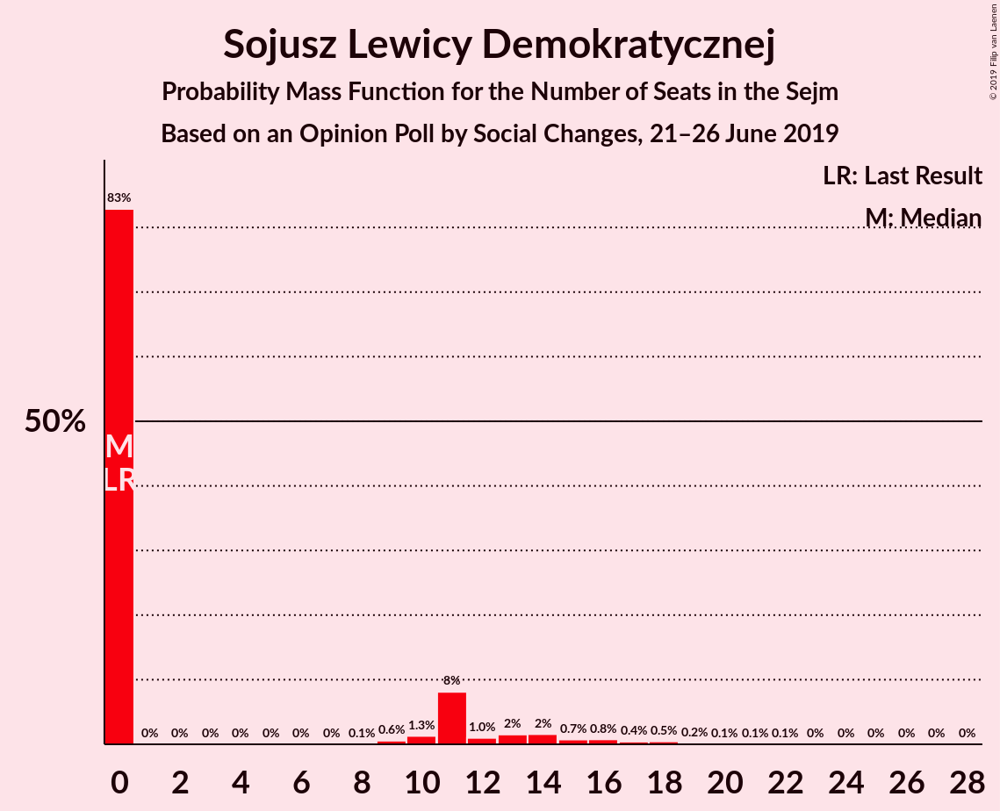
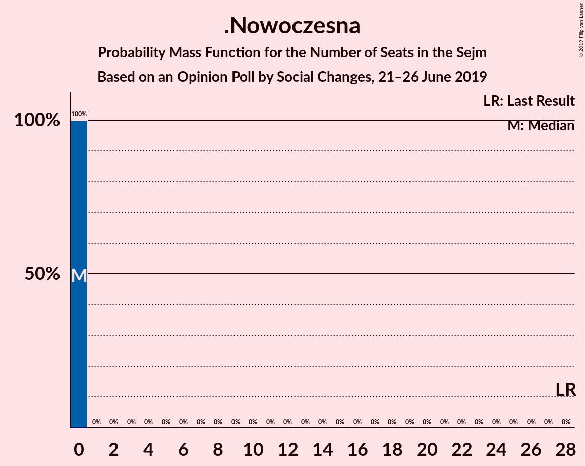
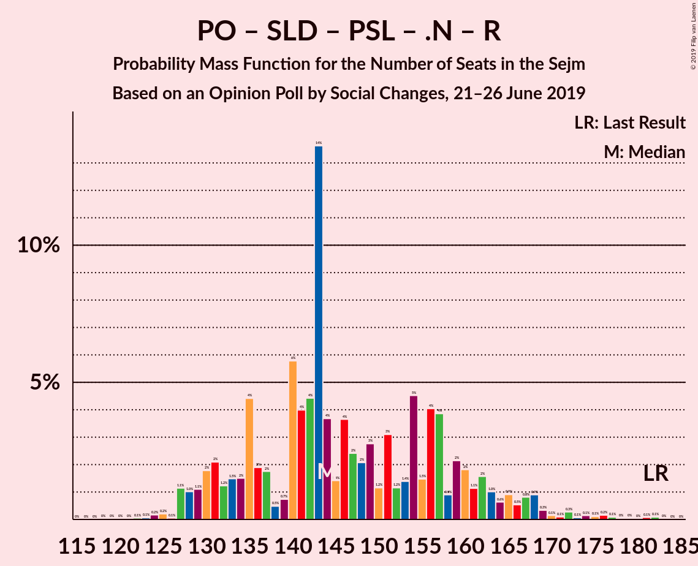
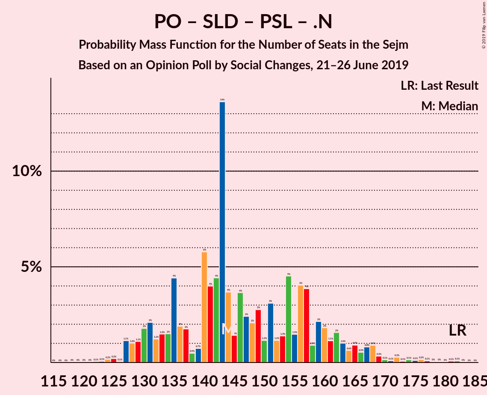
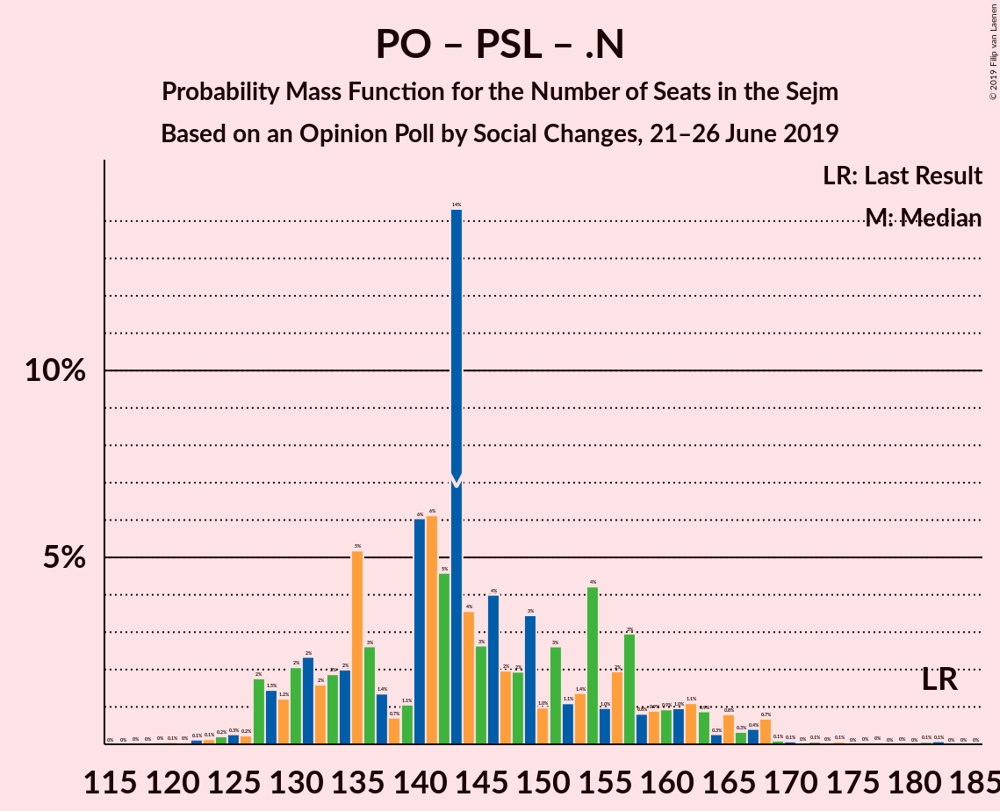

# Opinion Poll by Social Changes, 21–26 June 2019

<a href="#voting-intentions">Voting Intentions</a> | <a href="#seats">Seats</a> | <a href="#coalitions">Coalitions</a> | <a href="#technical-information">Technical Information</a>

## Voting Intentions

### Confidence Intervals

| Party | Last Result | Poll Result | 80% Confidence Interval | 90% Confidence Interval | 95% Confidence Interval | 99% Confidence Interval |
|:-----:|:-----------:|:-----------:|:-----------------------:|:-----------------------:|:-----------------------:|:-----------------------:|
| Prawo i Sprawiedliwość | 37.6% | 44.0% | 42.0–46.0% |41.5–46.5% |41.0–47.0% |40.0–48.0% |
| Platforma Obywatelska | 24.1% | 23.9% | 22.3–25.7% |21.8–26.2% |21.4–26.6% |20.7–27.5% |
| Wiosna | 0.0% | 7.7% | 6.7–8.8% |6.4–9.2% |6.2–9.4% |5.8–10.0% |
| Kukiz’15 | 8.8% | 4.5% | 3.8–5.4% |3.6–5.7% |3.4–5.9% |3.1–6.4% |
| Sojusz Lewicy Demokratycznej | 7.6% | 4.3% | 3.6–5.2% |3.4–5.5% |3.2–5.7% |2.9–6.2% |
| Polskie Stronnictwo Ludowe | 5.1% | 4.2% | 3.5–5.1% |3.3–5.4% |3.2–5.6% |2.9–6.1% |
| KORWiN | 4.8% | 3.1% | 2.5–3.9% |2.3–4.1% |2.2–4.3% |1.9–4.7% |
| .Nowoczesna | 7.6% | 1.2% | 0.9–1.8% |0.8–2.0% |0.7–2.1% |0.6–2.4% |
| Lewica Razem | 3.6% | 1.2% | 0.9–1.8% |0.8–2.0% |0.7–2.1% |0.6–2.4% |

*Note:* The poll result column reflects the actual value used in the calculations. Published results may vary slightly, and in addition be rounded to fewer digits.

## Seats

### Confidence Intervals

| Party | Last Result | Median | 80% Confidence Interval | 90% Confidence Interval | 95% Confidence Interval | 99% Confidence Interval |
|:-----:|:-----------:|:------:|:-----------------------:|:-----------------------:|:-----------------------:|:-----------------------:|
| <a href="#prawo-i-sprawiedliwość">Prawo i Sprawiedliwość</a> | 235 | 281 | 262–289 |259–292 |255–294 |248–300 |
| <a href="#platforma-obywatelska">Platforma Obywatelska</a> | 138 | 142 | 130–154 |128–158 |127–162 |122–167 |
| <a href="#wiosna">Wiosna</a> | 0 | 32 | 28–41 |27–42 |24–44 |17–47 |
| <a href="#kukiz’15">Kukiz’15</a> | 42 | 0 | 0–11 |0–13 |0–17 |0–23 |
| <a href="#sojusz-lewicy-demokratycznej">Sojusz Lewicy Demokratycznej</a> | 0 | 0 | 0–12 |0–15 |0–16 |0–25 |
| <a href="#polskie-stronnictwo-ludowe">Polskie Stronnictwo Ludowe</a> | 16 | 0 | 0–15 |0–20 |0–22 |0–23 |
| <a href="#korwin">KORWiN</a> | 0 | 0 | 0 |0 |0 |0 |
| <a href="#.nowoczesna">.Nowoczesna</a> | 28 | 0 | 0 |0 |0 |0 |
| <a href="#lewica-razem">Lewica Razem</a> | 0 | 0 | 0 |0 |0 |0 |

### Prawo i Sprawiedliwość

*For a full overview of the results for this party, see the [Prawo i Sprawiedliwość](party-prawoisprawiedliwość.html) page.*

| Number of Seats | Probability | Accumulated | Special Marks |
|:---------------:|:-----------:|:-----------:|:-------------:|
| 235 | 0% | 100% | Last Result |
| 236 | 0% | 100% |  |
| 237 | 0% | 100% |  |
| 238 | 0% | 100% |  |
| 239 | 0% | 100% |  |
| 240 | 0% | 100% |  |
| 241 | 0% | 100% |  |
| 242 | 0% | 99.9% |  |
| 243 | 0% | 99.9% |  |
| 244 | 0% | 99.9% |  |
| 245 | 0% | 99.9% |  |
| 246 | 0.1% | 99.8% |  |
| 247 | 0.2% | 99.8% |  |
| 248 | 0.1% | 99.6% |  |
| 249 | 0.1% | 99.5% |  |
| 250 | 0.2% | 99.4% |  |
| 251 | 0.5% | 99.2% |  |
| 252 | 0.1% | 98.7% |  |
| 253 | 0.4% | 98.6% |  |
| 254 | 0.2% | 98% |  |
| 255 | 0.7% | 98% |  |
| 256 | 0.3% | 97% |  |
| 257 | 0.5% | 97% |  |
| 258 | 1.2% | 97% |  |
| 259 | 0.6% | 95% |  |
| 260 | 1.3% | 95% |  |
| 261 | 2% | 93% |  |
| 262 | 2% | 92% |  |
| 263 | 0.8% | 90% |  |
| 264 | 2% | 89% |  |
| 265 | 1.3% | 87% |  |
| 266 | 3% | 86% |  |
| 267 | 2% | 83% |  |
| 268 | 3% | 80% |  |
| 269 | 1.3% | 78% |  |
| 270 | 2% | 76% |  |
| 271 | 1.1% | 74% |  |
| 272 | 2% | 73% |  |
| 273 | 2% | 71% |  |
| 274 | 2% | 69% |  |
| 275 | 6% | 67% |  |
| 276 | 2% | 61% |  |
| 277 | 1.2% | 60% |  |
| 278 | 2% | 59% |  |
| 279 | 2% | 57% |  |
| 280 | 2% | 55% |  |
| 281 | 3% | 52% | Median |
| 282 | 3% | 49% |  |
| 283 | 4% | 46% |  |
| 284 | 3% | 42% |  |
| 285 | 16% | 39% |  |
| 286 | 2% | 23% |  |
| 287 | 3% | 21% |  |
| 288 | 3% | 18% |  |
| 289 | 7% | 14% |  |
| 290 | 2% | 8% |  |
| 291 | 0.6% | 6% |  |
| 292 | 2% | 5% |  |
| 293 | 0.6% | 4% |  |
| 294 | 1.2% | 3% |  |
| 295 | 0.4% | 2% |  |
| 296 | 0.3% | 1.4% |  |
| 297 | 0.1% | 1.1% |  |
| 298 | 0.2% | 1.1% |  |
| 299 | 0.3% | 0.9% |  |
| 300 | 0.1% | 0.6% |  |
| 301 | 0.2% | 0.5% |  |
| 302 | 0.1% | 0.3% |  |
| 303 | 0% | 0.2% |  |
| 304 | 0% | 0.2% |  |
| 305 | 0.1% | 0.1% |  |
| 306 | 0% | 0.1% |  |
| 307 | 0% | 0.1% |  |
| 308 | 0% | 0.1% |  |
| 309 | 0% | 0% |  |

### Platforma Obywatelska

*For a full overview of the results for this party, see the [Platforma Obywatelska](party-platformaobywatelska.html) page.*

| Number of Seats | Probability | Accumulated | Special Marks |
|:---------------:|:-----------:|:-----------:|:-------------:|
| 113 | 0% | 100% |  |
| 114 | 0% | 99.9% |  |
| 115 | 0% | 99.9% |  |
| 116 | 0% | 99.9% |  |
| 117 | 0% | 99.9% |  |
| 118 | 0% | 99.9% |  |
| 119 | 0.1% | 99.8% |  |
| 120 | 0.1% | 99.8% |  |
| 121 | 0.1% | 99.7% |  |
| 122 | 0.3% | 99.6% |  |
| 123 | 0.3% | 99.3% |  |
| 124 | 0.3% | 99.0% |  |
| 125 | 0.4% | 98.7% |  |
| 126 | 0.4% | 98% |  |
| 127 | 2% | 98% |  |
| 128 | 2% | 96% |  |
| 129 | 1.4% | 94% |  |
| 130 | 3% | 92% |  |
| 131 | 2% | 89% |  |
| 132 | 2% | 87% |  |
| 133 | 3% | 84% |  |
| 134 | 2% | 82% |  |
| 135 | 5% | 80% |  |
| 136 | 3% | 74% |  |
| 137 | 3% | 71% |  |
| 138 | 1.0% | 68% | Last Result |
| 139 | 1.3% | 67% |  |
| 140 | 6% | 66% |  |
| 141 | 7% | 60% |  |
| 142 | 5% | 53% | Median |
| 143 | 14% | 48% |  |
| 144 | 4% | 33% |  |
| 145 | 3% | 30% |  |
| 146 | 4% | 27% |  |
| 147 | 2% | 23% |  |
| 148 | 2% | 21% |  |
| 149 | 3% | 19% |  |
| 150 | 0.9% | 16% |  |
| 151 | 1.5% | 15% |  |
| 152 | 0.7% | 14% |  |
| 153 | 0.6% | 13% |  |
| 154 | 3% | 13% |  |
| 155 | 0.7% | 10% |  |
| 156 | 1.5% | 9% |  |
| 157 | 2% | 8% |  |
| 158 | 0.7% | 5% |  |
| 159 | 0.4% | 4% |  |
| 160 | 0.7% | 4% |  |
| 161 | 0.7% | 3% |  |
| 162 | 0.9% | 3% |  |
| 163 | 0.1% | 2% |  |
| 164 | 0.2% | 2% |  |
| 165 | 0.6% | 1.4% |  |
| 166 | 0.2% | 0.9% |  |
| 167 | 0.3% | 0.7% |  |
| 168 | 0.2% | 0.4% |  |
| 169 | 0.1% | 0.1% |  |
| 170 | 0% | 0% |  |

### Wiosna

*For a full overview of the results for this party, see the [Wiosna](party-wiosna.html) page.*

| Number of Seats | Probability | Accumulated | Special Marks |
|:---------------:|:-----------:|:-----------:|:-------------:|
| 0 | 0% | 100% | Last Result |
| 1 | 0% | 100% |  |
| 2 | 0% | 100% |  |
| 3 | 0% | 100% |  |
| 4 | 0% | 100% |  |
| 5 | 0% | 100% |  |
| 6 | 0% | 100% |  |
| 7 | 0% | 100% |  |
| 8 | 0% | 100% |  |
| 9 | 0% | 100% |  |
| 10 | 0% | 100% |  |
| 11 | 0% | 100% |  |
| 12 | 0% | 100% |  |
| 13 | 0% | 99.9% |  |
| 14 | 0% | 99.9% |  |
| 15 | 0.1% | 99.9% |  |
| 16 | 0.1% | 99.8% |  |
| 17 | 0.2% | 99.7% |  |
| 18 | 0.2% | 99.5% |  |
| 19 | 0.3% | 99.3% |  |
| 20 | 0.2% | 99.0% |  |
| 21 | 0.2% | 98.8% |  |
| 22 | 0.3% | 98.6% |  |
| 23 | 0.7% | 98% |  |
| 24 | 0.6% | 98% |  |
| 25 | 0.7% | 97% |  |
| 26 | 0.8% | 96% |  |
| 27 | 3% | 96% |  |
| 28 | 10% | 92% |  |
| 29 | 11% | 83% |  |
| 30 | 5% | 72% |  |
| 31 | 6% | 67% |  |
| 32 | 14% | 61% | Median |
| 33 | 5% | 47% |  |
| 34 | 4% | 42% |  |
| 35 | 12% | 38% |  |
| 36 | 5% | 26% |  |
| 37 | 2% | 21% |  |
| 38 | 2% | 19% |  |
| 39 | 4% | 17% |  |
| 40 | 3% | 13% |  |
| 41 | 2% | 11% |  |
| 42 | 4% | 8% |  |
| 43 | 1.0% | 4% |  |
| 44 | 1.5% | 3% |  |
| 45 | 0.6% | 2% |  |
| 46 | 0.2% | 1.0% |  |
| 47 | 0.5% | 0.8% |  |
| 48 | 0.2% | 0.3% |  |
| 49 | 0% | 0.1% |  |
| 50 | 0% | 0.1% |  |
| 51 | 0% | 0.1% |  |
| 52 | 0% | 0% |  |

### Kukiz’15

*For a full overview of the results for this party, see the [Kukiz’15](party-kukiz’15.html) page.*

| Number of Seats | Probability | Accumulated | Special Marks |
|:---------------:|:-----------:|:-----------:|:-------------:|
| 0 | 77% | 100% | Median |
| 1 | 0% | 23% |  |
| 2 | 0% | 23% |  |
| 3 | 0% | 23% |  |
| 4 | 0% | 23% |  |
| 5 | 1.2% | 23% |  |
| 6 | 1.4% | 21% |  |
| 7 | 0.5% | 20% |  |
| 8 | 2% | 20% |  |
| 9 | 3% | 17% |  |
| 10 | 4% | 15% |  |
| 11 | 2% | 11% |  |
| 12 | 4% | 9% |  |
| 13 | 1.4% | 5% |  |
| 14 | 0.8% | 4% |  |
| 15 | 0.4% | 3% |  |
| 16 | 0.3% | 3% |  |
| 17 | 0.3% | 3% |  |
| 18 | 0.4% | 2% |  |
| 19 | 0.8% | 2% |  |
| 20 | 0.3% | 1.1% |  |
| 21 | 0.2% | 0.8% |  |
| 22 | 0.1% | 0.6% |  |
| 23 | 0.2% | 0.5% |  |
| 24 | 0.2% | 0.4% |  |
| 25 | 0.1% | 0.2% |  |
| 26 | 0% | 0.1% |  |
| 27 | 0% | 0.1% |  |
| 28 | 0% | 0.1% |  |
| 29 | 0% | 0.1% |  |
| 30 | 0% | 0% |  |
| 31 | 0% | 0% |  |
| 32 | 0% | 0% |  |
| 33 | 0% | 0% |  |
| 34 | 0% | 0% |  |
| 35 | 0% | 0% |  |
| 36 | 0% | 0% |  |
| 37 | 0% | 0% |  |
| 38 | 0% | 0% |  |
| 39 | 0% | 0% |  |
| 40 | 0% | 0% |  |
| 41 | 0% | 0% |  |
| 42 | 0% | 0% | Last Result |

### Sojusz Lewicy Demokratycznej

*For a full overview of the results for this party, see the [Sojusz Lewicy Demokratycznej](party-sojuszlewicydemokratycznej.html) page.*

| Number of Seats | Probability | Accumulated | Special Marks |
|:---------------:|:-----------:|:-----------:|:-------------:|
| 0 | 83% | 100% | Last Result, Median |
| 1 | 0% | 17% |  |
| 2 | 0% | 17% |  |
| 3 | 0% | 17% |  |
| 4 | 0% | 17% |  |
| 5 | 0% | 17% |  |
| 6 | 0% | 17% |  |
| 7 | 0% | 17% |  |
| 8 | 0% | 17% |  |
| 9 | 0.3% | 17% |  |
| 10 | 1.2% | 17% |  |
| 11 | 5% | 15% |  |
| 12 | 1.1% | 11% |  |
| 13 | 1.0% | 10% |  |
| 14 | 3% | 9% |  |
| 15 | 3% | 5% |  |
| 16 | 1.3% | 3% |  |
| 17 | 0.1% | 1.4% |  |
| 18 | 0.3% | 1.3% |  |
| 19 | 0.1% | 1.1% |  |
| 20 | 0.1% | 0.9% |  |
| 21 | 0.1% | 0.8% |  |
| 22 | 0.1% | 0.7% |  |
| 23 | 0.1% | 0.6% |  |
| 24 | 0.1% | 0.6% |  |
| 25 | 0.1% | 0.5% |  |
| 26 | 0.2% | 0.4% |  |
| 27 | 0.2% | 0.2% |  |
| 28 | 0% | 0.1% |  |
| 29 | 0% | 0% |  |

### Polskie Stronnictwo Ludowe

*For a full overview of the results for this party, see the [Polskie Stronnictwo Ludowe](party-polskiestronnictwoludowe.html) page.*

| Number of Seats | Probability | Accumulated | Special Marks |
|:---------------:|:-----------:|:-----------:|:-------------:|
| 0 | 88% | 100% | Median |
| 1 | 0% | 12% |  |
| 2 | 0% | 12% |  |
| 3 | 0% | 12% |  |
| 4 | 0% | 12% |  |
| 5 | 0% | 12% |  |
| 6 | 0% | 12% |  |
| 7 | 0% | 12% |  |
| 8 | 0% | 12% |  |
| 9 | 0% | 12% |  |
| 10 | 0% | 12% |  |
| 11 | 0% | 12% |  |
| 12 | 0% | 12% |  |
| 13 | 0% | 12% |  |
| 14 | 0.1% | 12% |  |
| 15 | 2% | 12% |  |
| 16 | 1.3% | 10% | Last Result |
| 17 | 2% | 9% |  |
| 18 | 0.6% | 6% |  |
| 19 | 0.5% | 6% |  |
| 20 | 1.1% | 5% |  |
| 21 | 1.5% | 4% |  |
| 22 | 2% | 3% |  |
| 23 | 0.7% | 0.8% |  |
| 24 | 0.1% | 0.1% |  |
| 25 | 0% | 0% |  |

### KORWiN

*For a full overview of the results for this party, see the [KORWiN](party-korwin.html) page.*

| Number of Seats | Probability | Accumulated | Special Marks |
|:---------------:|:-----------:|:-----------:|:-------------:|
| 0 | 99.8% | 100% | Last Result, Median |
| 1 | 0% | 0.2% |  |
| 2 | 0% | 0.2% |  |
| 3 | 0% | 0.2% |  |
| 4 | 0% | 0.2% |  |
| 5 | 0% | 0.2% |  |
| 6 | 0% | 0.2% |  |
| 7 | 0% | 0.2% |  |
| 8 | 0.1% | 0.2% |  |
| 9 | 0% | 0.1% |  |
| 10 | 0% | 0% |  |

### .Nowoczesna

*For a full overview of the results for this party, see the [.Nowoczesna](party-nowoczesna.html) page.*

| Number of Seats | Probability | Accumulated | Special Marks |
|:---------------:|:-----------:|:-----------:|:-------------:|
| 0 | 100% | 100% | Median |
| 1 | 0% | 0% |  |
| 2 | 0% | 0% |  |
| 3 | 0% | 0% |  |
| 4 | 0% | 0% |  |
| 5 | 0% | 0% |  |
| 6 | 0% | 0% |  |
| 7 | 0% | 0% |  |
| 8 | 0% | 0% |  |
| 9 | 0% | 0% |  |
| 10 | 0% | 0% |  |
| 11 | 0% | 0% |  |
| 12 | 0% | 0% |  |
| 13 | 0% | 0% |  |
| 14 | 0% | 0% |  |
| 15 | 0% | 0% |  |
| 16 | 0% | 0% |  |
| 17 | 0% | 0% |  |
| 18 | 0% | 0% |  |
| 19 | 0% | 0% |  |
| 20 | 0% | 0% |  |
| 21 | 0% | 0% |  |
| 22 | 0% | 0% |  |
| 23 | 0% | 0% |  |
| 24 | 0% | 0% |  |
| 25 | 0% | 0% |  |
| 26 | 0% | 0% |  |
| 27 | 0% | 0% |  |
| 28 | 0% | 0% | Last Result |

### Lewica Razem

*For a full overview of the results for this party, see the [Lewica Razem](party-lewicarazem.html) page.*

| Number of Seats | Probability | Accumulated | Special Marks |
|:---------------:|:-----------:|:-----------:|:-------------:|
| 0 | 100% | 100% | Last Result, Median |

## Coalitions

### Confidence Intervals

| Coalition | Last Result | Median | Majority? | 80% Confidence Interval | 90% Confidence Interval | 95% Confidence Interval | 99% Confidence Interval |
|:---------:|:-----------:|:------:|:---------:|:-----------------------:|:-----------------------:|:-----------------------:|:-----------------------:|
| Prawo i Sprawiedliwość | 235 | 281 | 100% | 262–289 | 259–292 | 255–294 | 248–300 |
| Platforma Obywatelska – Sojusz Lewicy Demokratycznej – Polskie Stronnictwo Ludowe – .Nowoczesna – Lewica Razem | 182 | 144 | 0% | 133–160 | 130–164 | 128–168 | 125–176 |
| Platforma Obywatelska – Sojusz Lewicy Demokratycznej – Polskie Stronnictwo Ludowe – .Nowoczesna | 182 | 144 | 0% | 133–160 | 130–164 | 128–168 | 125–176 |
| Platforma Obywatelska – Polskie Stronnictwo Ludowe – .Nowoczesna | 182 | 143 | 0% | 131–157 | 129–162 | 127–165 | 123–170 |
| Platforma Obywatelska – Sojusz Lewicy Demokratycznej – .Nowoczesna | 166 | 143 | 0% | 131–157 | 129–161 | 127–165 | 123–169 |
| Platforma Obywatelska – .Nowoczesna | 166 | 142 | 0% | 130–154 | 128–158 | 127–162 | 122–167 |
| Platforma Obywatelska | 138 | 142 | 0% | 130–154 | 128–158 | 127–162 | 122–167 |

### Prawo i Sprawiedliwość

| Number of Seats | Probability | Accumulated | Special Marks |
|:---------------:|:-----------:|:-----------:|:-------------:|
| 235 | 0% | 100% | Last Result |
| 236 | 0% | 100% |  |
| 237 | 0% | 100% |  |
| 238 | 0% | 100% |  |
| 239 | 0% | 100% |  |
| 240 | 0% | 100% |  |
| 241 | 0% | 100% |  |
| 242 | 0% | 99.9% |  |
| 243 | 0% | 99.9% |  |
| 244 | 0% | 99.9% |  |
| 245 | 0% | 99.9% |  |
| 246 | 0.1% | 99.8% |  |
| 247 | 0.2% | 99.8% |  |
| 248 | 0.1% | 99.6% |  |
| 249 | 0.1% | 99.5% |  |
| 250 | 0.2% | 99.4% |  |
| 251 | 0.5% | 99.2% |  |
| 252 | 0.1% | 98.7% |  |
| 253 | 0.4% | 98.6% |  |
| 254 | 0.2% | 98% |  |
| 255 | 0.7% | 98% |  |
| 256 | 0.3% | 97% |  |
| 257 | 0.5% | 97% |  |
| 258 | 1.2% | 97% |  |
| 259 | 0.6% | 95% |  |
| 260 | 1.3% | 95% |  |
| 261 | 2% | 93% |  |
| 262 | 2% | 92% |  |
| 263 | 0.8% | 90% |  |
| 264 | 2% | 89% |  |
| 265 | 1.3% | 87% |  |
| 266 | 3% | 86% |  |
| 267 | 2% | 83% |  |
| 268 | 3% | 80% |  |
| 269 | 1.3% | 78% |  |
| 270 | 2% | 76% |  |
| 271 | 1.1% | 74% |  |
| 272 | 2% | 73% |  |
| 273 | 2% | 71% |  |
| 274 | 2% | 69% |  |
| 275 | 6% | 67% |  |
| 276 | 2% | 61% |  |
| 277 | 1.2% | 60% |  |
| 278 | 2% | 59% |  |
| 279 | 2% | 57% |  |
| 280 | 2% | 55% |  |
| 281 | 3% | 52% | Median |
| 282 | 3% | 49% |  |
| 283 | 4% | 46% |  |
| 284 | 3% | 42% |  |
| 285 | 16% | 39% |  |
| 286 | 2% | 23% |  |
| 287 | 3% | 21% |  |
| 288 | 3% | 18% |  |
| 289 | 7% | 14% |  |
| 290 | 2% | 8% |  |
| 291 | 0.6% | 6% |  |
| 292 | 2% | 5% |  |
| 293 | 0.6% | 4% |  |
| 294 | 1.2% | 3% |  |
| 295 | 0.4% | 2% |  |
| 296 | 0.3% | 1.4% |  |
| 297 | 0.1% | 1.1% |  |
| 298 | 0.2% | 1.1% |  |
| 299 | 0.3% | 0.9% |  |
| 300 | 0.1% | 0.6% |  |
| 301 | 0.2% | 0.5% |  |
| 302 | 0.1% | 0.3% |  |
| 303 | 0% | 0.2% |  |
| 304 | 0% | 0.2% |  |
| 305 | 0.1% | 0.1% |  |
| 306 | 0% | 0.1% |  |
| 307 | 0% | 0.1% |  |
| 308 | 0% | 0.1% |  |
| 309 | 0% | 0% |  |

### Platforma Obywatelska – Sojusz Lewicy Demokratycznej – Polskie Stronnictwo Ludowe – .Nowoczesna – Lewica Razem

| Number of Seats | Probability | Accumulated | Special Marks |
|:---------------:|:-----------:|:-----------:|:-------------:|
| 118 | 0% | 100% |  |
| 119 | 0% | 99.9% |  |
| 120 | 0% | 99.9% |  |
| 121 | 0% | 99.9% |  |
| 122 | 0.1% | 99.9% |  |
| 123 | 0.1% | 99.8% |  |
| 124 | 0.2% | 99.7% |  |
| 125 | 0.2% | 99.6% |  |
| 126 | 0.1% | 99.4% |  |
| 127 | 1.1% | 99.3% |  |
| 128 | 1.0% | 98% |  |
| 129 | 1.1% | 97% |  |
| 130 | 2% | 96% |  |
| 131 | 2% | 94% |  |
| 132 | 1.2% | 92% |  |
| 133 | 1.5% | 91% |  |
| 134 | 2% | 89% |  |
| 135 | 4% | 88% |  |
| 136 | 2% | 84% |  |
| 137 | 2% | 82% |  |
| 138 | 0.5% | 80% |  |
| 139 | 0.7% | 79% |  |
| 140 | 6% | 79% |  |
| 141 | 4% | 73% |  |
| 142 | 4% | 69% | Median |
| 143 | 14% | 64% |  |
| 144 | 4% | 51% |  |
| 145 | 1.4% | 47% |  |
| 146 | 4% | 46% |  |
| 147 | 2% | 42% |  |
| 148 | 2% | 40% |  |
| 149 | 3% | 38% |  |
| 150 | 1.2% | 35% |  |
| 151 | 3% | 34% |  |
| 152 | 1.2% | 31% |  |
| 153 | 1.4% | 29% |  |
| 154 | 5% | 28% |  |
| 155 | 1.5% | 24% |  |
| 156 | 4% | 22% |  |
| 157 | 4% | 18% |  |
| 158 | 0.9% | 14% |  |
| 159 | 2% | 13% |  |
| 160 | 2% | 11% |  |
| 161 | 1.1% | 9% |  |
| 162 | 2% | 8% |  |
| 163 | 1.0% | 7% |  |
| 164 | 0.6% | 6% |  |
| 165 | 0.9% | 5% |  |
| 166 | 0.5% | 4% |  |
| 167 | 0.8% | 3% |  |
| 168 | 0.9% | 3% |  |
| 169 | 0.3% | 2% |  |
| 170 | 0.1% | 1.4% |  |
| 171 | 0.1% | 1.3% |  |
| 172 | 0.3% | 1.2% |  |
| 173 | 0.1% | 0.9% |  |
| 174 | 0.1% | 0.8% |  |
| 175 | 0.1% | 0.7% |  |
| 176 | 0.2% | 0.6% |  |
| 177 | 0.1% | 0.4% |  |
| 178 | 0% | 0.3% |  |
| 179 | 0% | 0.3% |  |
| 180 | 0% | 0.3% |  |
| 181 | 0.1% | 0.2% |  |
| 182 | 0.1% | 0.1% | Last Result |
| 183 | 0% | 0.1% |  |
| 184 | 0% | 0% |  |

### Platforma Obywatelska – Sojusz Lewicy Demokratycznej – Polskie Stronnictwo Ludowe – .Nowoczesna

| Number of Seats | Probability | Accumulated | Special Marks |
|:---------------:|:-----------:|:-----------:|:-------------:|
| 118 | 0% | 100% |  |
| 119 | 0% | 99.9% |  |
| 120 | 0% | 99.9% |  |
| 121 | 0% | 99.9% |  |
| 122 | 0.1% | 99.9% |  |
| 123 | 0.1% | 99.8% |  |
| 124 | 0.2% | 99.7% |  |
| 125 | 0.2% | 99.6% |  |
| 126 | 0.1% | 99.4% |  |
| 127 | 1.1% | 99.3% |  |
| 128 | 1.0% | 98% |  |
| 129 | 1.1% | 97% |  |
| 130 | 2% | 96% |  |
| 131 | 2% | 94% |  |
| 132 | 1.2% | 92% |  |
| 133 | 1.5% | 91% |  |
| 134 | 2% | 89% |  |
| 135 | 4% | 88% |  |
| 136 | 2% | 84% |  |
| 137 | 2% | 82% |  |
| 138 | 0.5% | 80% |  |
| 139 | 0.7% | 79% |  |
| 140 | 6% | 79% |  |
| 141 | 4% | 73% |  |
| 142 | 4% | 69% | Median |
| 143 | 14% | 64% |  |
| 144 | 4% | 51% |  |
| 145 | 1.4% | 47% |  |
| 146 | 4% | 46% |  |
| 147 | 2% | 42% |  |
| 148 | 2% | 40% |  |
| 149 | 3% | 38% |  |
| 150 | 1.2% | 35% |  |
| 151 | 3% | 34% |  |
| 152 | 1.2% | 31% |  |
| 153 | 1.4% | 29% |  |
| 154 | 5% | 28% |  |
| 155 | 1.5% | 24% |  |
| 156 | 4% | 22% |  |
| 157 | 4% | 18% |  |
| 158 | 0.9% | 14% |  |
| 159 | 2% | 13% |  |
| 160 | 2% | 11% |  |
| 161 | 1.1% | 9% |  |
| 162 | 2% | 8% |  |
| 163 | 1.0% | 7% |  |
| 164 | 0.6% | 6% |  |
| 165 | 0.9% | 5% |  |
| 166 | 0.5% | 4% |  |
| 167 | 0.8% | 3% |  |
| 168 | 0.9% | 3% |  |
| 169 | 0.3% | 2% |  |
| 170 | 0.1% | 1.4% |  |
| 171 | 0.1% | 1.3% |  |
| 172 | 0.3% | 1.2% |  |
| 173 | 0.1% | 0.9% |  |
| 174 | 0.1% | 0.8% |  |
| 175 | 0.1% | 0.7% |  |
| 176 | 0.2% | 0.6% |  |
| 177 | 0.1% | 0.4% |  |
| 178 | 0% | 0.3% |  |
| 179 | 0% | 0.3% |  |
| 180 | 0% | 0.3% |  |
| 181 | 0.1% | 0.2% |  |
| 182 | 0.1% | 0.1% | Last Result |
| 183 | 0% | 0.1% |  |
| 184 | 0% | 0% |  |

### Platforma Obywatelska – Polskie Stronnictwo Ludowe – .Nowoczesna

| Number of Seats | Probability | Accumulated | Special Marks |
|:---------------:|:-----------:|:-----------:|:-------------:|
| 115 | 0% | 100% |  |
| 116 | 0% | 99.9% |  |
| 117 | 0% | 99.9% |  |
| 118 | 0% | 99.9% |  |
| 119 | 0% | 99.9% |  |
| 120 | 0.1% | 99.8% |  |
| 121 | 0% | 99.8% |  |
| 122 | 0.1% | 99.7% |  |
| 123 | 0.1% | 99.6% |  |
| 124 | 0.2% | 99.5% |  |
| 125 | 0.3% | 99.3% |  |
| 126 | 0.2% | 99.0% |  |
| 127 | 2% | 98.8% |  |
| 128 | 1.5% | 97% |  |
| 129 | 1.2% | 96% |  |
| 130 | 2% | 94% |  |
| 131 | 2% | 92% |  |
| 132 | 2% | 90% |  |
| 133 | 2% | 88% |  |
| 134 | 2% | 86% |  |
| 135 | 5% | 84% |  |
| 136 | 3% | 79% |  |
| 137 | 1.4% | 77% |  |
| 138 | 0.7% | 75% |  |
| 139 | 1.1% | 75% |  |
| 140 | 6% | 74% |  |
| 141 | 6% | 67% |  |
| 142 | 5% | 61% | Median |
| 143 | 14% | 57% |  |
| 144 | 4% | 42% |  |
| 145 | 3% | 39% |  |
| 146 | 4% | 36% |  |
| 147 | 2% | 32% |  |
| 148 | 2% | 30% |  |
| 149 | 3% | 28% |  |
| 150 | 1.0% | 25% |  |
| 151 | 3% | 24% |  |
| 152 | 1.1% | 21% |  |
| 153 | 1.4% | 20% |  |
| 154 | 4% | 19% |  |
| 155 | 1.0% | 15% |  |
| 156 | 2% | 14% |  |
| 157 | 3% | 12% |  |
| 158 | 0.8% | 9% |  |
| 159 | 0.9% | 8% |  |
| 160 | 0.9% | 7% |  |
| 161 | 1.0% | 6% |  |
| 162 | 1.1% | 5% |  |
| 163 | 0.9% | 4% |  |
| 164 | 0.3% | 3% |  |
| 165 | 0.8% | 3% |  |
| 166 | 0.3% | 2% |  |
| 167 | 0.4% | 2% |  |
| 168 | 0.7% | 1.3% |  |
| 169 | 0.1% | 0.6% |  |
| 170 | 0.1% | 0.5% |  |
| 171 | 0% | 0.5% |  |
| 172 | 0.1% | 0.4% |  |
| 173 | 0% | 0.4% |  |
| 174 | 0.1% | 0.4% |  |
| 175 | 0% | 0.3% |  |
| 176 | 0% | 0.3% |  |
| 177 | 0% | 0.3% |  |
| 178 | 0% | 0.2% |  |
| 179 | 0% | 0.2% |  |
| 180 | 0% | 0.2% |  |
| 181 | 0.1% | 0.2% |  |
| 182 | 0.1% | 0.1% | Last Result |
| 183 | 0% | 0% |  |

### Platforma Obywatelska – Sojusz Lewicy Demokratycznej – .Nowoczesna

| Number of Seats | Probability | Accumulated | Special Marks |
|:---------------:|:-----------:|:-----------:|:-------------:|
| 116 | 0% | 100% |  |
| 117 | 0% | 99.9% |  |
| 118 | 0% | 99.9% |  |
| 119 | 0% | 99.9% |  |
| 120 | 0% | 99.9% |  |
| 121 | 0.1% | 99.8% |  |
| 122 | 0.2% | 99.8% |  |
| 123 | 0.3% | 99.6% |  |
| 124 | 0.2% | 99.3% |  |
| 125 | 0.3% | 99.1% |  |
| 126 | 0.2% | 98.8% |  |
| 127 | 2% | 98.7% |  |
| 128 | 1.4% | 97% |  |
| 129 | 1.3% | 96% |  |
| 130 | 3% | 94% |  |
| 131 | 2% | 92% |  |
| 132 | 2% | 89% |  |
| 133 | 2% | 87% |  |
| 134 | 2% | 85% |  |
| 135 | 5% | 84% |  |
| 136 | 2% | 79% |  |
| 137 | 3% | 77% |  |
| 138 | 0.8% | 74% |  |
| 139 | 1.0% | 73% |  |
| 140 | 6% | 72% |  |
| 141 | 5% | 66% |  |
| 142 | 5% | 61% | Median |
| 143 | 14% | 57% |  |
| 144 | 4% | 43% |  |
| 145 | 1.5% | 39% |  |
| 146 | 4% | 37% |  |
| 147 | 2% | 34% |  |
| 148 | 2% | 31% |  |
| 149 | 2% | 29% |  |
| 150 | 1.2% | 27% |  |
| 151 | 2% | 26% |  |
| 152 | 1.4% | 24% |  |
| 153 | 0.9% | 22% |  |
| 154 | 3% | 21% |  |
| 155 | 1.3% | 18% |  |
| 156 | 4% | 17% |  |
| 157 | 3% | 13% |  |
| 158 | 0.8% | 10% |  |
| 159 | 2% | 9% |  |
| 160 | 2% | 7% |  |
| 161 | 0.9% | 6% |  |
| 162 | 1.4% | 5% |  |
| 163 | 0.2% | 3% |  |
| 164 | 0.5% | 3% |  |
| 165 | 0.8% | 3% |  |
| 166 | 0.4% | 2% | Last Result |
| 167 | 0.4% | 1.3% |  |
| 168 | 0.3% | 1.0% |  |
| 169 | 0.3% | 0.7% |  |
| 170 | 0.1% | 0.4% |  |
| 171 | 0% | 0.3% |  |
| 172 | 0.2% | 0.3% |  |
| 173 | 0% | 0.1% |  |
| 174 | 0% | 0.1% |  |
| 175 | 0% | 0.1% |  |
| 176 | 0% | 0.1% |  |
| 177 | 0% | 0% |  |

### Platforma Obywatelska – .Nowoczesna

| Number of Seats | Probability | Accumulated | Special Marks |
|:---------------:|:-----------:|:-----------:|:-------------:|
| 113 | 0% | 100% |  |
| 114 | 0% | 99.9% |  |
| 115 | 0% | 99.9% |  |
| 116 | 0% | 99.9% |  |
| 117 | 0% | 99.9% |  |
| 118 | 0% | 99.9% |  |
| 119 | 0.1% | 99.8% |  |
| 120 | 0.1% | 99.8% |  |
| 121 | 0.1% | 99.7% |  |
| 122 | 0.3% | 99.6% |  |
| 123 | 0.3% | 99.3% |  |
| 124 | 0.3% | 99.0% |  |
| 125 | 0.4% | 98.7% |  |
| 126 | 0.4% | 98% |  |
| 127 | 2% | 98% |  |
| 128 | 2% | 96% |  |
| 129 | 1.4% | 94% |  |
| 130 | 3% | 92% |  |
| 131 | 2% | 89% |  |
| 132 | 2% | 87% |  |
| 133 | 3% | 84% |  |
| 134 | 2% | 82% |  |
| 135 | 5% | 80% |  |
| 136 | 3% | 74% |  |
| 137 | 3% | 71% |  |
| 138 | 1.0% | 68% |  |
| 139 | 1.3% | 67% |  |
| 140 | 6% | 66% |  |
| 141 | 7% | 60% |  |
| 142 | 5% | 53% | Median |
| 143 | 14% | 48% |  |
| 144 | 4% | 33% |  |
| 145 | 3% | 30% |  |
| 146 | 4% | 27% |  |
| 147 | 2% | 23% |  |
| 148 | 2% | 21% |  |
| 149 | 3% | 19% |  |
| 150 | 0.9% | 16% |  |
| 151 | 1.5% | 15% |  |
| 152 | 0.7% | 14% |  |
| 153 | 0.6% | 13% |  |
| 154 | 3% | 13% |  |
| 155 | 0.7% | 10% |  |
| 156 | 1.5% | 9% |  |
| 157 | 2% | 8% |  |
| 158 | 0.7% | 5% |  |
| 159 | 0.4% | 4% |  |
| 160 | 0.7% | 4% |  |
| 161 | 0.7% | 3% |  |
| 162 | 0.9% | 3% |  |
| 163 | 0.1% | 2% |  |
| 164 | 0.2% | 2% |  |
| 165 | 0.6% | 1.4% |  |
| 166 | 0.2% | 0.9% | Last Result |
| 167 | 0.3% | 0.7% |  |
| 168 | 0.2% | 0.4% |  |
| 169 | 0.1% | 0.1% |  |
| 170 | 0% | 0% |  |

### Platforma Obywatelska

| Number of Seats | Probability | Accumulated | Special Marks |
|:---------------:|:-----------:|:-----------:|:-------------:|
| 113 | 0% | 100% |  |
| 114 | 0% | 99.9% |  |
| 115 | 0% | 99.9% |  |
| 116 | 0% | 99.9% |  |
| 117 | 0% | 99.9% |  |
| 118 | 0% | 99.9% |  |
| 119 | 0.1% | 99.8% |  |
| 120 | 0.1% | 99.8% |  |
| 121 | 0.1% | 99.7% |  |
| 122 | 0.3% | 99.6% |  |
| 123 | 0.3% | 99.3% |  |
| 124 | 0.3% | 99.0% |  |
| 125 | 0.4% | 98.7% |  |
| 126 | 0.4% | 98% |  |
| 127 | 2% | 98% |  |
| 128 | 2% | 96% |  |
| 129 | 1.4% | 94% |  |
| 130 | 3% | 92% |  |
| 131 | 2% | 89% |  |
| 132 | 2% | 87% |  |
| 133 | 3% | 84% |  |
| 134 | 2% | 82% |  |
| 135 | 5% | 80% |  |
| 136 | 3% | 74% |  |
| 137 | 3% | 71% |  |
| 138 | 1.0% | 68% | Last Result |
| 139 | 1.3% | 67% |  |
| 140 | 6% | 66% |  |
| 141 | 7% | 60% |  |
| 142 | 5% | 53% | Median |
| 143 | 14% | 48% |  |
| 144 | 4% | 33% |  |
| 145 | 3% | 30% |  |
| 146 | 4% | 27% |  |
| 147 | 2% | 23% |  |
| 148 | 2% | 21% |  |
| 149 | 3% | 19% |  |
| 150 | 0.9% | 16% |  |
| 151 | 1.5% | 15% |  |
| 152 | 0.7% | 14% |  |
| 153 | 0.6% | 13% |  |
| 154 | 3% | 13% |  |
| 155 | 0.7% | 10% |  |
| 156 | 1.5% | 9% |  |
| 157 | 2% | 8% |  |
| 158 | 0.7% | 5% |  |
| 159 | 0.4% | 4% |  |
| 160 | 0.7% | 4% |  |
| 161 | 0.7% | 3% |  |
| 162 | 0.9% | 3% |  |
| 163 | 0.1% | 2% |  |
| 164 | 0.2% | 2% |  |
| 165 | 0.6% | 1.4% |  |
| 166 | 0.2% | 0.9% |  |
| 167 | 0.3% | 0.7% |  |
| 168 | 0.2% | 0.4% |  |
| 169 | 0.1% | 0.1% |  |
| 170 | 0% | 0% |  |

## Technical Information

### Opinion Poll

+ **Polling firm:** Social Changes
+ **Commissioner(s):** —
+ **Fieldwork period:** 21–26 June 2019

### Calculations

+ **Sample size:** 1044
+ **Simulations done:** 1,048,576
+ **Error estimate:** 1.16%

