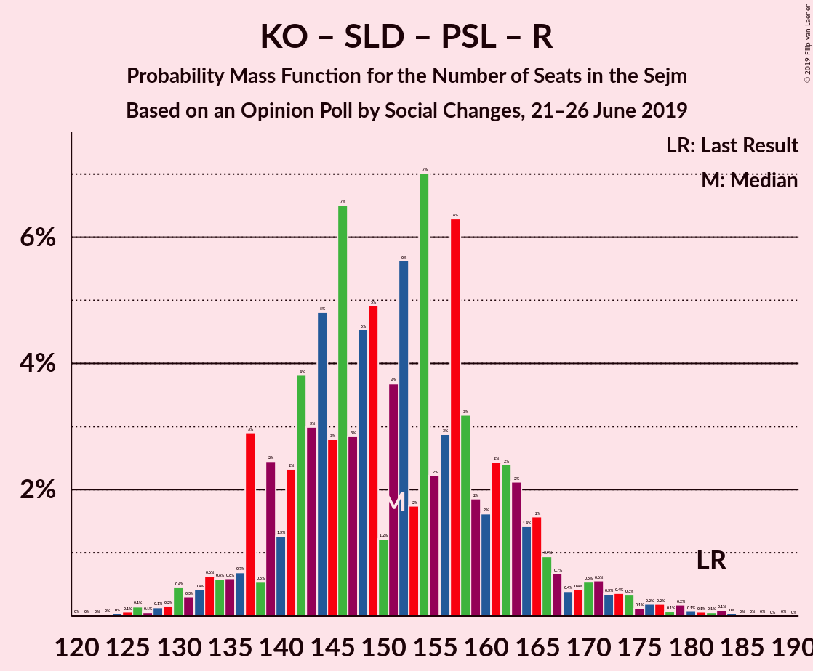
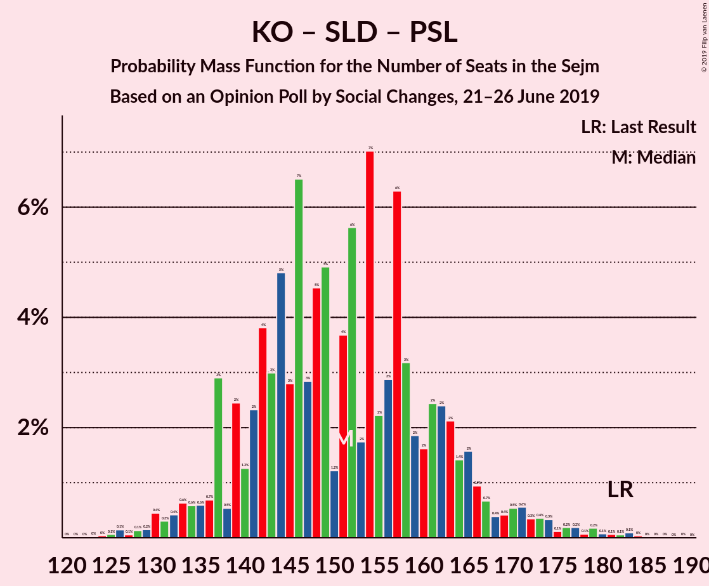

# Opinion Poll by Social Changes, 21–26 June 2019

<a href="#voting-intentions">Voting Intentions</a> | <a href="#seats">Seats</a> | <a href="#coalitions">Coalitions</a> | <a href="#technical-information">Technical Information</a>

## Voting Intentions

### Confidence Intervals

| Party | Last Result | Poll Result | 80% Confidence Interval | 90% Confidence Interval | 95% Confidence Interval | 99% Confidence Interval |
|:-----:|:-----------:|:-----------:|:-----------------------:|:-----------------------:|:-----------------------:|:-----------------------:|
| Prawo i Sprawiedliwość | 37.6% | 44.0% | 42.0–46.0% |41.5–46.5% |41.0–47.0% |40.0–48.0% |
| Koalicja Obywatelska | 31.7% | 25.2% | 23.5–27.0% |23.0–27.5% |22.6–27.9% |21.9–28.8% |
| Wiosna | 0.0% | 7.7% | 6.7–8.8% |6.4–9.2% |6.2–9.4% |5.8–10.0% |
| Kukiz’15 | 8.8% | 4.5% | 3.8–5.4% |3.6–5.7% |3.4–5.9% |3.1–6.4% |
| Sojusz Lewicy Demokratycznej | 7.6% | 4.3% | 3.6–5.2% |3.4–5.5% |3.2–5.7% |2.9–6.2% |
| Polskie Stronnictwo Ludowe | 5.1% | 4.2% | 3.5–5.1% |3.3–5.4% |3.2–5.6% |2.9–6.1% |
| KORWiN | 4.8% | 3.1% | 2.5–3.9% |2.3–4.1% |2.2–4.3% |1.9–4.7% |
| Lewica Razem | 3.6% | 1.2% | 0.9–1.8% |0.8–2.0% |0.7–2.1% |0.6–2.4% |

*Note:* The poll result column reflects the actual value used in the calculations. Published results may vary slightly, and in addition be rounded to fewer digits.

## Seats

### Confidence Intervals

| Party | Last Result | Median | 80% Confidence Interval | 90% Confidence Interval | 95% Confidence Interval | 99% Confidence Interval |
|:-----:|:-----------:|:------:|:-----------------------:|:-----------------------:|:-----------------------:|:-----------------------:|
| <a href="#prawo-i-sprawiedliwość">Prawo i Sprawiedliwość</a> | 235 | 276 | 263–287 |258–290 |255–292 |249–295 |
| <a href="#koalicja-obywatelska">Koalicja Obywatelska</a> | 166 | 146 | 137–157 |134–161 |131–165 |125–167 |
| <a href="#wiosna">Wiosna</a> | 0 | 32 | 28–36 |25–39 |21–41 |18–46 |
| <a href="#kukiz’15">Kukiz’15</a> | 42 | 0 | 0–9 |0–11 |0–15 |0–19 |
| <a href="#sojusz-lewicy-demokratycznej">Sojusz Lewicy Demokratycznej</a> | 0 | 0 | 0–11 |0–12 |0–14 |0–18 |
| <a href="#polskie-stronnictwo-ludowe">Polskie Stronnictwo Ludowe</a> | 16 | 0 | 0–16 |0–17 |0–21 |0–22 |
| <a href="#korwin">KORWiN</a> | 0 | 0 | 0 |0 |0 |0 |
| <a href="#lewica-razem">Lewica Razem</a> | 0 | 0 | 0 |0 |0 |0 |

### Prawo i Sprawiedliwość

*For a full overview of the results for this party, see the [Prawo i Sprawiedliwość](party-prawoisprawiedliwość.html) page.*

| Number of Seats | Probability | Accumulated | Special Marks |
|:---------------:|:-----------:|:-----------:|:-------------:|
| 235 | 0% | 100% | Last Result |
| 236 | 0% | 100% |  |
| 237 | 0% | 100% |  |
| 238 | 0% | 100% |  |
| 239 | 0% | 100% |  |
| 240 | 0% | 100% |  |
| 241 | 0% | 100% |  |
| 242 | 0% | 99.9% |  |
| 243 | 0% | 99.9% |  |
| 244 | 0% | 99.9% |  |
| 245 | 0% | 99.9% |  |
| 246 | 0% | 99.8% |  |
| 247 | 0.1% | 99.8% |  |
| 248 | 0.2% | 99.7% |  |
| 249 | 0.4% | 99.5% |  |
| 250 | 0.2% | 99.2% |  |
| 251 | 0.1% | 99.0% |  |
| 252 | 0.1% | 98.8% |  |
| 253 | 0.6% | 98.7% |  |
| 254 | 0.2% | 98% |  |
| 255 | 0.8% | 98% |  |
| 256 | 0.8% | 97% |  |
| 257 | 0.5% | 96% |  |
| 258 | 1.5% | 96% |  |
| 259 | 0.9% | 94% |  |
| 260 | 1.2% | 93% |  |
| 261 | 0.8% | 92% |  |
| 262 | 0.8% | 91% |  |
| 263 | 1.0% | 90% |  |
| 264 | 0.9% | 89% |  |
| 265 | 1.2% | 89% |  |
| 266 | 1.2% | 87% |  |
| 267 | 2% | 86% |  |
| 268 | 2% | 84% |  |
| 269 | 3% | 82% |  |
| 270 | 4% | 80% |  |
| 271 | 6% | 76% |  |
| 272 | 5% | 70% |  |
| 273 | 4% | 65% |  |
| 274 | 3% | 60% |  |
| 275 | 5% | 57% |  |
| 276 | 6% | 52% | Median |
| 277 | 4% | 46% |  |
| 278 | 3% | 42% |  |
| 279 | 3% | 39% |  |
| 280 | 3% | 36% |  |
| 281 | 4% | 33% |  |
| 282 | 3% | 29% |  |
| 283 | 2% | 27% |  |
| 284 | 7% | 25% |  |
| 285 | 4% | 18% |  |
| 286 | 2% | 14% |  |
| 287 | 2% | 12% |  |
| 288 | 3% | 10% |  |
| 289 | 1.1% | 6% |  |
| 290 | 0.5% | 5% |  |
| 291 | 0.7% | 5% |  |
| 292 | 3% | 4% |  |
| 293 | 0.3% | 1.3% |  |
| 294 | 0.1% | 1.1% |  |
| 295 | 0.7% | 1.0% |  |
| 296 | 0.1% | 0.3% |  |
| 297 | 0% | 0.2% |  |
| 298 | 0.1% | 0.2% |  |
| 299 | 0% | 0.2% |  |
| 300 | 0% | 0.1% |  |
| 301 | 0% | 0.1% |  |
| 302 | 0% | 0.1% |  |
| 303 | 0% | 0.1% |  |
| 304 | 0% | 0.1% |  |
| 305 | 0% | 0% |  |

### Koalicja Obywatelska

*For a full overview of the results for this party, see the [Koalicja Obywatelska](party-koalicjaobywatelska.html) page.*

| Number of Seats | Probability | Accumulated | Special Marks |
|:---------------:|:-----------:|:-----------:|:-------------:|
| 118 | 0% | 100% |  |
| 119 | 0% | 99.9% |  |
| 120 | 0.1% | 99.9% |  |
| 121 | 0% | 99.8% |  |
| 122 | 0% | 99.8% |  |
| 123 | 0.1% | 99.8% |  |
| 124 | 0.1% | 99.7% |  |
| 125 | 0.1% | 99.6% |  |
| 126 | 0.2% | 99.4% |  |
| 127 | 0.4% | 99.3% |  |
| 128 | 0.4% | 98.8% |  |
| 129 | 0.2% | 98% |  |
| 130 | 0.7% | 98% |  |
| 131 | 0.4% | 98% |  |
| 132 | 1.3% | 97% |  |
| 133 | 0.9% | 96% |  |
| 134 | 0.6% | 95% |  |
| 135 | 0.7% | 94% |  |
| 136 | 1.3% | 94% |  |
| 137 | 4% | 92% |  |
| 138 | 2% | 88% |  |
| 139 | 2% | 87% |  |
| 140 | 6% | 85% |  |
| 141 | 4% | 79% |  |
| 142 | 5% | 74% |  |
| 143 | 7% | 69% |  |
| 144 | 6% | 63% |  |
| 145 | 4% | 57% |  |
| 146 | 15% | 53% | Median |
| 147 | 4% | 39% |  |
| 148 | 3% | 35% |  |
| 149 | 5% | 32% |  |
| 150 | 2% | 27% |  |
| 151 | 1.2% | 25% |  |
| 152 | 7% | 23% |  |
| 153 | 1.1% | 17% |  |
| 154 | 2% | 16% |  |
| 155 | 0.3% | 13% |  |
| 156 | 0.8% | 13% |  |
| 157 | 3% | 12% |  |
| 158 | 2% | 9% |  |
| 159 | 1.2% | 7% |  |
| 160 | 0.6% | 6% |  |
| 161 | 0.2% | 5% |  |
| 162 | 1.3% | 5% |  |
| 163 | 0.7% | 4% |  |
| 164 | 0.3% | 3% |  |
| 165 | 1.3% | 3% |  |
| 166 | 0.8% | 1.3% | Last Result |
| 167 | 0.1% | 0.5% |  |
| 168 | 0.1% | 0.4% |  |
| 169 | 0% | 0.3% |  |
| 170 | 0% | 0.3% |  |
| 171 | 0.1% | 0.2% |  |
| 172 | 0.1% | 0.2% |  |
| 173 | 0% | 0.1% |  |
| 174 | 0% | 0.1% |  |
| 175 | 0% | 0.1% |  |
| 176 | 0% | 0.1% |  |
| 177 | 0% | 0% |  |

### Wiosna

*For a full overview of the results for this party, see the [Wiosna](party-wiosna.html) page.*

| Number of Seats | Probability | Accumulated | Special Marks |
|:---------------:|:-----------:|:-----------:|:-------------:|
| 0 | 0% | 100% | Last Result |
| 1 | 0% | 100% |  |
| 2 | 0% | 100% |  |
| 3 | 0% | 100% |  |
| 4 | 0% | 100% |  |
| 5 | 0% | 100% |  |
| 6 | 0% | 100% |  |
| 7 | 0% | 100% |  |
| 8 | 0% | 100% |  |
| 9 | 0% | 100% |  |
| 10 | 0% | 100% |  |
| 11 | 0% | 100% |  |
| 12 | 0% | 100% |  |
| 13 | 0% | 100% |  |
| 14 | 0% | 99.9% |  |
| 15 | 0.1% | 99.9% |  |
| 16 | 0.1% | 99.8% |  |
| 17 | 0.1% | 99.8% |  |
| 18 | 0.5% | 99.6% |  |
| 19 | 0.2% | 99.1% |  |
| 20 | 0.3% | 98.9% |  |
| 21 | 2% | 98.7% |  |
| 22 | 0.5% | 97% |  |
| 23 | 0.4% | 97% |  |
| 24 | 0.5% | 96% |  |
| 25 | 1.5% | 96% |  |
| 26 | 1.4% | 94% |  |
| 27 | 1.0% | 93% |  |
| 28 | 10% | 92% |  |
| 29 | 11% | 82% |  |
| 30 | 10% | 71% |  |
| 31 | 8% | 61% |  |
| 32 | 11% | 53% | Median |
| 33 | 5% | 41% |  |
| 34 | 7% | 37% |  |
| 35 | 12% | 30% |  |
| 36 | 8% | 18% |  |
| 37 | 2% | 10% |  |
| 38 | 2% | 7% |  |
| 39 | 1.0% | 5% |  |
| 40 | 1.3% | 4% |  |
| 41 | 1.2% | 3% |  |
| 42 | 0.7% | 2% |  |
| 43 | 0.2% | 1.2% |  |
| 44 | 0.2% | 1.0% |  |
| 45 | 0.3% | 0.9% |  |
| 46 | 0.1% | 0.5% |  |
| 47 | 0.1% | 0.5% |  |
| 48 | 0.1% | 0.4% |  |
| 49 | 0.1% | 0.2% |  |
| 50 | 0.1% | 0.2% |  |
| 51 | 0.1% | 0.1% |  |
| 52 | 0% | 0% |  |

### Kukiz’15

*For a full overview of the results for this party, see the [Kukiz’15](party-kukiz’15.html) page.*

| Number of Seats | Probability | Accumulated | Special Marks |
|:---------------:|:-----------:|:-----------:|:-------------:|
| 0 | 83% | 100% | Median |
| 1 | 0% | 17% |  |
| 2 | 0% | 17% |  |
| 3 | 0% | 17% |  |
| 4 | 0% | 16% |  |
| 5 | 1.0% | 16% |  |
| 6 | 3% | 16% |  |
| 7 | 1.5% | 13% |  |
| 8 | 1.1% | 11% |  |
| 9 | 2% | 10% |  |
| 10 | 2% | 8% |  |
| 11 | 1.3% | 6% |  |
| 12 | 0.5% | 4% |  |
| 13 | 0.6% | 4% |  |
| 14 | 0.4% | 3% |  |
| 15 | 0.6% | 3% |  |
| 16 | 0.5% | 2% |  |
| 17 | 0.2% | 2% |  |
| 18 | 0.7% | 1.5% |  |
| 19 | 0.3% | 0.7% |  |
| 20 | 0.1% | 0.5% |  |
| 21 | 0% | 0.4% |  |
| 22 | 0.1% | 0.3% |  |
| 23 | 0% | 0.3% |  |
| 24 | 0.1% | 0.2% |  |
| 25 | 0% | 0.1% |  |
| 26 | 0% | 0.1% |  |
| 27 | 0% | 0% |  |
| 28 | 0% | 0% |  |
| 29 | 0% | 0% |  |
| 30 | 0% | 0% |  |
| 31 | 0% | 0% |  |
| 32 | 0% | 0% |  |
| 33 | 0% | 0% |  |
| 34 | 0% | 0% |  |
| 35 | 0% | 0% |  |
| 36 | 0% | 0% |  |
| 37 | 0% | 0% |  |
| 38 | 0% | 0% |  |
| 39 | 0% | 0% |  |
| 40 | 0% | 0% |  |
| 41 | 0% | 0% |  |
| 42 | 0% | 0% | Last Result |

### Sojusz Lewicy Demokratycznej

*For a full overview of the results for this party, see the [Sojusz Lewicy Demokratycznej](party-sojuszlewicydemokratycznej.html) page.*

| Number of Seats | Probability | Accumulated | Special Marks |
|:---------------:|:-----------:|:-----------:|:-------------:|
| 0 | 82% | 100% | Last Result, Median |
| 1 | 0% | 18% |  |
| 2 | 0% | 18% |  |
| 3 | 0% | 18% |  |
| 4 | 0% | 18% |  |
| 5 | 0% | 18% |  |
| 6 | 0% | 18% |  |
| 7 | 0% | 18% |  |
| 8 | 0.1% | 18% |  |
| 9 | 0.7% | 18% |  |
| 10 | 2% | 17% |  |
| 11 | 10% | 16% |  |
| 12 | 0.8% | 6% |  |
| 13 | 0.9% | 5% |  |
| 14 | 2% | 4% |  |
| 15 | 0.6% | 2% |  |
| 16 | 0.3% | 2% |  |
| 17 | 0.3% | 1.3% |  |
| 18 | 0.5% | 1.0% |  |
| 19 | 0.1% | 0.5% |  |
| 20 | 0.1% | 0.3% |  |
| 21 | 0% | 0.3% |  |
| 22 | 0.1% | 0.2% |  |
| 23 | 0% | 0.2% |  |
| 24 | 0% | 0.1% |  |
| 25 | 0% | 0.1% |  |
| 26 | 0% | 0.1% |  |
| 27 | 0% | 0.1% |  |
| 28 | 0% | 0% |  |

### Polskie Stronnictwo Ludowe

*For a full overview of the results for this party, see the [Polskie Stronnictwo Ludowe](party-polskiestronnictwoludowe.html) page.*

| Number of Seats | Probability | Accumulated | Special Marks |
|:---------------:|:-----------:|:-----------:|:-------------:|
| 0 | 86% | 100% | Median |
| 1 | 0% | 14% |  |
| 2 | 0% | 14% |  |
| 3 | 0% | 14% |  |
| 4 | 0% | 14% |  |
| 5 | 0% | 14% |  |
| 6 | 0% | 14% |  |
| 7 | 0% | 14% |  |
| 8 | 0% | 14% |  |
| 9 | 0% | 14% |  |
| 10 | 0% | 14% |  |
| 11 | 0% | 14% |  |
| 12 | 0% | 14% |  |
| 13 | 0.1% | 14% |  |
| 14 | 0.3% | 14% |  |
| 15 | 0.7% | 14% |  |
| 16 | 7% | 13% | Last Result |
| 17 | 2% | 6% |  |
| 18 | 0.8% | 4% |  |
| 19 | 0.2% | 3% |  |
| 20 | 0.6% | 3% |  |
| 21 | 1.4% | 3% |  |
| 22 | 0.6% | 1.1% |  |
| 23 | 0.3% | 0.5% |  |
| 24 | 0.1% | 0.2% |  |
| 25 | 0% | 0% |  |

### KORWiN

*For a full overview of the results for this party, see the [KORWiN](party-korwin.html) page.*

| Number of Seats | Probability | Accumulated | Special Marks |
|:---------------:|:-----------:|:-----------:|:-------------:|
| 0 | 99.9% | 100% | Last Result, Median |
| 1 | 0% | 0.1% |  |
| 2 | 0% | 0.1% |  |
| 3 | 0% | 0.1% |  |
| 4 | 0% | 0.1% |  |
| 5 | 0% | 0.1% |  |
| 6 | 0% | 0.1% |  |
| 7 | 0% | 0.1% |  |
| 8 | 0% | 0.1% |  |
| 9 | 0% | 0.1% |  |
| 10 | 0% | 0% |  |

### Lewica Razem

*For a full overview of the results for this party, see the [Lewica Razem](party-lewicarazem.html) page.*

| Number of Seats | Probability | Accumulated | Special Marks |
|:---------------:|:-----------:|:-----------:|:-------------:|
| 0 | 100% | 100% | Last Result, Median |

## Coalitions

### Confidence Intervals

| Coalition | Last Result | Median | Majority? | 80% Confidence Interval | 90% Confidence Interval | 95% Confidence Interval | 99% Confidence Interval |
|:---------:|:-----------:|:------:|:---------:|:-----------------------:|:-----------------------:|:-----------------------:|:-----------------------:|
| Prawo i Sprawiedliwość | 235 | 276 | 100% | 263–287 | 258–290 | 255–292 | 249–295 |
| Koalicja Obywatelska – Sojusz Lewicy Demokratycznej – Polskie Stronnictwo Ludowe – Lewica Razem | 182 | 149 | 0% | 140–163 | 137–167 | 134–172 | 129–180 |
| Koalicja Obywatelska – Sojusz Lewicy Demokratycznej – Polskie Stronnictwo Ludowe | 182 | 149 | 0% | 140–163 | 137–167 | 134–172 | 129–180 |
| Koalicja Obywatelska – Polskie Stronnictwo Ludowe | 182 | 146 | 0% | 138–160 | 136–165 | 132–171 | 127–179 |
| Koalicja Obywatelska – Sojusz Lewicy Demokratycznej | 166 | 147 | 0% | 138–159 | 136–163 | 132–165 | 127–171 |
| Koalicja Obywatelska | 166 | 146 | 0% | 137–157 | 134–161 | 131–165 | 125–167 |

### Prawo i Sprawiedliwość

| Number of Seats | Probability | Accumulated | Special Marks |
|:---------------:|:-----------:|:-----------:|:-------------:|
| 235 | 0% | 100% | Last Result |
| 236 | 0% | 100% |  |
| 237 | 0% | 100% |  |
| 238 | 0% | 100% |  |
| 239 | 0% | 100% |  |
| 240 | 0% | 100% |  |
| 241 | 0% | 100% |  |
| 242 | 0% | 99.9% |  |
| 243 | 0% | 99.9% |  |
| 244 | 0% | 99.9% |  |
| 245 | 0% | 99.9% |  |
| 246 | 0% | 99.8% |  |
| 247 | 0.1% | 99.8% |  |
| 248 | 0.2% | 99.7% |  |
| 249 | 0.4% | 99.5% |  |
| 250 | 0.2% | 99.2% |  |
| 251 | 0.1% | 99.0% |  |
| 252 | 0.1% | 98.8% |  |
| 253 | 0.6% | 98.7% |  |
| 254 | 0.2% | 98% |  |
| 255 | 0.8% | 98% |  |
| 256 | 0.8% | 97% |  |
| 257 | 0.5% | 96% |  |
| 258 | 1.5% | 96% |  |
| 259 | 0.9% | 94% |  |
| 260 | 1.2% | 93% |  |
| 261 | 0.8% | 92% |  |
| 262 | 0.8% | 91% |  |
| 263 | 1.0% | 90% |  |
| 264 | 0.9% | 89% |  |
| 265 | 1.2% | 89% |  |
| 266 | 1.2% | 87% |  |
| 267 | 2% | 86% |  |
| 268 | 2% | 84% |  |
| 269 | 3% | 82% |  |
| 270 | 4% | 80% |  |
| 271 | 6% | 76% |  |
| 272 | 5% | 70% |  |
| 273 | 4% | 65% |  |
| 274 | 3% | 60% |  |
| 275 | 5% | 57% |  |
| 276 | 6% | 52% | Median |
| 277 | 4% | 46% |  |
| 278 | 3% | 42% |  |
| 279 | 3% | 39% |  |
| 280 | 3% | 36% |  |
| 281 | 4% | 33% |  |
| 282 | 3% | 29% |  |
| 283 | 2% | 27% |  |
| 284 | 7% | 25% |  |
| 285 | 4% | 18% |  |
| 286 | 2% | 14% |  |
| 287 | 2% | 12% |  |
| 288 | 3% | 10% |  |
| 289 | 1.1% | 6% |  |
| 290 | 0.5% | 5% |  |
| 291 | 0.7% | 5% |  |
| 292 | 3% | 4% |  |
| 293 | 0.3% | 1.3% |  |
| 294 | 0.1% | 1.1% |  |
| 295 | 0.7% | 1.0% |  |
| 296 | 0.1% | 0.3% |  |
| 297 | 0% | 0.2% |  |
| 298 | 0.1% | 0.2% |  |
| 299 | 0% | 0.2% |  |
| 300 | 0% | 0.1% |  |
| 301 | 0% | 0.1% |  |
| 302 | 0% | 0.1% |  |
| 303 | 0% | 0.1% |  |
| 304 | 0% | 0.1% |  |
| 305 | 0% | 0% |  |

### Koalicja Obywatelska – Sojusz Lewicy Demokratycznej – Polskie Stronnictwo Ludowe – Lewica Razem

| Number of Seats | Probability | Accumulated | Special Marks |
|:---------------:|:-----------:|:-----------:|:-------------:|
| 123 | 0% | 100% |  |
| 124 | 0% | 99.9% |  |
| 125 | 0.1% | 99.9% |  |
| 126 | 0.1% | 99.9% |  |
| 127 | 0% | 99.8% |  |
| 128 | 0.1% | 99.7% |  |
| 129 | 0.1% | 99.6% |  |
| 130 | 0.3% | 99.5% |  |
| 131 | 0.3% | 99.2% |  |
| 132 | 0.5% | 98.9% |  |
| 133 | 0.6% | 98% |  |
| 134 | 0.3% | 98% |  |
| 135 | 0.6% | 97% |  |
| 136 | 0.8% | 97% |  |
| 137 | 4% | 96% |  |
| 138 | 0.5% | 92% |  |
| 139 | 1.3% | 92% |  |
| 140 | 2% | 91% |  |
| 141 | 4% | 89% |  |
| 142 | 5% | 85% |  |
| 143 | 3% | 80% |  |
| 144 | 5% | 77% |  |
| 145 | 3% | 72% |  |
| 146 | 9% | 69% | Median |
| 147 | 3% | 60% |  |
| 148 | 2% | 57% |  |
| 149 | 5% | 55% |  |
| 150 | 1.4% | 50% |  |
| 151 | 2% | 48% |  |
| 152 | 7% | 47% |  |
| 153 | 0.6% | 40% |  |
| 154 | 5% | 39% |  |
| 155 | 1.3% | 34% |  |
| 156 | 4% | 33% |  |
| 157 | 9% | 29% |  |
| 158 | 3% | 19% |  |
| 159 | 2% | 17% |  |
| 160 | 1.4% | 15% |  |
| 161 | 2% | 14% |  |
| 162 | 2% | 12% |  |
| 163 | 2% | 11% |  |
| 164 | 0.5% | 9% |  |
| 165 | 2% | 8% |  |
| 166 | 1.2% | 6% |  |
| 167 | 0.6% | 5% |  |
| 168 | 0.3% | 5% |  |
| 169 | 0.2% | 4% |  |
| 170 | 0.5% | 4% |  |
| 171 | 0.9% | 4% |  |
| 172 | 0.5% | 3% |  |
| 173 | 0.2% | 2% |  |
| 174 | 0.5% | 2% |  |
| 175 | 0.1% | 2% |  |
| 176 | 0.2% | 1.4% |  |
| 177 | 0.3% | 1.2% |  |
| 178 | 0.1% | 0.9% |  |
| 179 | 0.3% | 0.8% |  |
| 180 | 0.1% | 0.5% |  |
| 181 | 0.1% | 0.4% |  |
| 182 | 0.1% | 0.3% | Last Result |
| 183 | 0.2% | 0.2% |  |
| 184 | 0% | 0.1% |  |
| 185 | 0% | 0.1% |  |
| 186 | 0% | 0% |  |

### Koalicja Obywatelska – Sojusz Lewicy Demokratycznej – Polskie Stronnictwo Ludowe

| Number of Seats | Probability | Accumulated | Special Marks |
|:---------------:|:-----------:|:-----------:|:-------------:|
| 123 | 0% | 100% |  |
| 124 | 0% | 99.9% |  |
| 125 | 0.1% | 99.9% |  |
| 126 | 0.1% | 99.9% |  |
| 127 | 0% | 99.8% |  |
| 128 | 0.1% | 99.7% |  |
| 129 | 0.1% | 99.6% |  |
| 130 | 0.3% | 99.5% |  |
| 131 | 0.3% | 99.2% |  |
| 132 | 0.5% | 98.9% |  |
| 133 | 0.6% | 98% |  |
| 134 | 0.3% | 98% |  |
| 135 | 0.6% | 97% |  |
| 136 | 0.8% | 97% |  |
| 137 | 4% | 96% |  |
| 138 | 0.5% | 92% |  |
| 139 | 1.3% | 92% |  |
| 140 | 2% | 91% |  |
| 141 | 4% | 89% |  |
| 142 | 5% | 85% |  |
| 143 | 3% | 80% |  |
| 144 | 5% | 77% |  |
| 145 | 3% | 72% |  |
| 146 | 9% | 69% | Median |
| 147 | 3% | 60% |  |
| 148 | 2% | 57% |  |
| 149 | 5% | 55% |  |
| 150 | 1.4% | 50% |  |
| 151 | 2% | 48% |  |
| 152 | 7% | 47% |  |
| 153 | 0.6% | 40% |  |
| 154 | 5% | 39% |  |
| 155 | 1.3% | 34% |  |
| 156 | 4% | 33% |  |
| 157 | 9% | 29% |  |
| 158 | 3% | 19% |  |
| 159 | 2% | 17% |  |
| 160 | 1.4% | 15% |  |
| 161 | 2% | 14% |  |
| 162 | 2% | 12% |  |
| 163 | 2% | 11% |  |
| 164 | 0.5% | 9% |  |
| 165 | 2% | 8% |  |
| 166 | 1.2% | 6% |  |
| 167 | 0.6% | 5% |  |
| 168 | 0.3% | 5% |  |
| 169 | 0.2% | 4% |  |
| 170 | 0.5% | 4% |  |
| 171 | 0.9% | 4% |  |
| 172 | 0.5% | 3% |  |
| 173 | 0.2% | 2% |  |
| 174 | 0.5% | 2% |  |
| 175 | 0.1% | 2% |  |
| 176 | 0.2% | 1.4% |  |
| 177 | 0.3% | 1.2% |  |
| 178 | 0.1% | 0.9% |  |
| 179 | 0.3% | 0.8% |  |
| 180 | 0.1% | 0.5% |  |
| 181 | 0.1% | 0.4% |  |
| 182 | 0.1% | 0.3% | Last Result |
| 183 | 0.2% | 0.2% |  |
| 184 | 0% | 0.1% |  |
| 185 | 0% | 0.1% |  |
| 186 | 0% | 0% |  |

### Koalicja Obywatelska – Polskie Stronnictwo Ludowe

| Number of Seats | Probability | Accumulated | Special Marks |
|:---------------:|:-----------:|:-----------:|:-------------:|
| 120 | 0% | 100% |  |
| 121 | 0% | 99.9% |  |
| 122 | 0% | 99.9% |  |
| 123 | 0% | 99.9% |  |
| 124 | 0% | 99.9% |  |
| 125 | 0.1% | 99.8% |  |
| 126 | 0.1% | 99.7% |  |
| 127 | 0.1% | 99.6% |  |
| 128 | 0.1% | 99.5% |  |
| 129 | 0.2% | 99.3% |  |
| 130 | 0.4% | 99.2% |  |
| 131 | 0.3% | 98.8% |  |
| 132 | 1.1% | 98% |  |
| 133 | 0.8% | 97% |  |
| 134 | 0.5% | 97% |  |
| 135 | 0.6% | 96% |  |
| 136 | 0.8% | 95% |  |
| 137 | 4% | 95% |  |
| 138 | 0.7% | 91% |  |
| 139 | 2% | 90% |  |
| 140 | 2% | 88% |  |
| 141 | 4% | 86% |  |
| 142 | 5% | 82% |  |
| 143 | 6% | 77% |  |
| 144 | 6% | 71% |  |
| 145 | 4% | 66% |  |
| 146 | 15% | 62% | Median |
| 147 | 4% | 48% |  |
| 148 | 2% | 44% |  |
| 149 | 5% | 42% |  |
| 150 | 2% | 37% |  |
| 151 | 1.2% | 35% |  |
| 152 | 7% | 34% |  |
| 153 | 0.7% | 27% |  |
| 154 | 3% | 26% |  |
| 155 | 0.5% | 23% |  |
| 156 | 4% | 23% |  |
| 157 | 4% | 18% |  |
| 158 | 3% | 15% |  |
| 159 | 1.4% | 12% |  |
| 160 | 1.1% | 11% |  |
| 161 | 0.5% | 10% |  |
| 162 | 1.4% | 9% |  |
| 163 | 1.1% | 8% |  |
| 164 | 0.4% | 7% |  |
| 165 | 2% | 6% |  |
| 166 | 0.9% | 4% |  |
| 167 | 0.2% | 3% |  |
| 168 | 0.3% | 3% |  |
| 169 | 0.1% | 3% |  |
| 170 | 0.2% | 3% |  |
| 171 | 0.7% | 3% |  |
| 172 | 0.3% | 2% |  |
| 173 | 0.1% | 2% |  |
| 174 | 0.4% | 2% |  |
| 175 | 0.1% | 1.1% |  |
| 176 | 0.2% | 1.1% |  |
| 177 | 0.2% | 0.9% |  |
| 178 | 0% | 0.6% |  |
| 179 | 0.3% | 0.6% |  |
| 180 | 0.1% | 0.3% |  |
| 181 | 0.1% | 0.3% |  |
| 182 | 0% | 0.2% | Last Result |
| 183 | 0.1% | 0.2% |  |
| 184 | 0% | 0.1% |  |
| 185 | 0% | 0% |  |

### Koalicja Obywatelska – Sojusz Lewicy Demokratycznej

| Number of Seats | Probability | Accumulated | Special Marks |
|:---------------:|:-----------:|:-----------:|:-------------:|
| 120 | 0.1% | 100% |  |
| 121 | 0% | 99.9% |  |
| 122 | 0% | 99.9% |  |
| 123 | 0.1% | 99.9% |  |
| 124 | 0% | 99.8% |  |
| 125 | 0.1% | 99.7% |  |
| 126 | 0.1% | 99.7% |  |
| 127 | 0.4% | 99.5% |  |
| 128 | 0.3% | 99.2% |  |
| 129 | 0.2% | 98.9% |  |
| 130 | 0.4% | 98.7% |  |
| 131 | 0.4% | 98% |  |
| 132 | 0.6% | 98% |  |
| 133 | 0.7% | 97% |  |
| 134 | 0.4% | 96% |  |
| 135 | 0.6% | 96% |  |
| 136 | 1.3% | 95% |  |
| 137 | 4% | 94% |  |
| 138 | 1.2% | 90% |  |
| 139 | 1.5% | 89% |  |
| 140 | 5% | 88% |  |
| 141 | 4% | 82% |  |
| 142 | 5% | 79% |  |
| 143 | 4% | 73% |  |
| 144 | 6% | 70% |  |
| 145 | 4% | 64% |  |
| 146 | 9% | 60% | Median |
| 147 | 3% | 52% |  |
| 148 | 2% | 48% |  |
| 149 | 6% | 46% |  |
| 150 | 2% | 40% |  |
| 151 | 2% | 38% |  |
| 152 | 6% | 36% |  |
| 153 | 1.2% | 30% |  |
| 154 | 5% | 29% |  |
| 155 | 1.1% | 24% |  |
| 156 | 0.9% | 23% |  |
| 157 | 9% | 22% |  |
| 158 | 2% | 13% |  |
| 159 | 1.3% | 11% |  |
| 160 | 1.0% | 10% |  |
| 161 | 1.4% | 9% |  |
| 162 | 1.5% | 7% |  |
| 163 | 2% | 6% |  |
| 164 | 0.3% | 4% |  |
| 165 | 1.4% | 4% |  |
| 166 | 1.0% | 2% | Last Result |
| 167 | 0.3% | 1.4% |  |
| 168 | 0.1% | 1.2% |  |
| 169 | 0.1% | 1.1% |  |
| 170 | 0.3% | 1.0% |  |
| 171 | 0.2% | 0.7% |  |
| 172 | 0.2% | 0.5% |  |
| 173 | 0% | 0.3% |  |
| 174 | 0% | 0.2% |  |
| 175 | 0% | 0.2% |  |
| 176 | 0.1% | 0.2% |  |
| 177 | 0.1% | 0.1% |  |
| 178 | 0% | 0% |  |

### Koalicja Obywatelska

| Number of Seats | Probability | Accumulated | Special Marks |
|:---------------:|:-----------:|:-----------:|:-------------:|
| 118 | 0% | 100% |  |
| 119 | 0% | 99.9% |  |
| 120 | 0.1% | 99.9% |  |
| 121 | 0% | 99.8% |  |
| 122 | 0% | 99.8% |  |
| 123 | 0.1% | 99.8% |  |
| 124 | 0.1% | 99.7% |  |
| 125 | 0.1% | 99.6% |  |
| 126 | 0.2% | 99.4% |  |
| 127 | 0.4% | 99.3% |  |
| 128 | 0.4% | 98.8% |  |
| 129 | 0.2% | 98% |  |
| 130 | 0.7% | 98% |  |
| 131 | 0.4% | 98% |  |
| 132 | 1.3% | 97% |  |
| 133 | 0.9% | 96% |  |
| 134 | 0.6% | 95% |  |
| 135 | 0.7% | 94% |  |
| 136 | 1.3% | 94% |  |
| 137 | 4% | 92% |  |
| 138 | 2% | 88% |  |
| 139 | 2% | 87% |  |
| 140 | 6% | 85% |  |
| 141 | 4% | 79% |  |
| 142 | 5% | 74% |  |
| 143 | 7% | 69% |  |
| 144 | 6% | 63% |  |
| 145 | 4% | 57% |  |
| 146 | 15% | 53% | Median |
| 147 | 4% | 39% |  |
| 148 | 3% | 35% |  |
| 149 | 5% | 32% |  |
| 150 | 2% | 27% |  |
| 151 | 1.2% | 25% |  |
| 152 | 7% | 23% |  |
| 153 | 1.1% | 17% |  |
| 154 | 2% | 16% |  |
| 155 | 0.3% | 13% |  |
| 156 | 0.8% | 13% |  |
| 157 | 3% | 12% |  |
| 158 | 2% | 9% |  |
| 159 | 1.2% | 7% |  |
| 160 | 0.6% | 6% |  |
| 161 | 0.2% | 5% |  |
| 162 | 1.3% | 5% |  |
| 163 | 0.7% | 4% |  |
| 164 | 0.3% | 3% |  |
| 165 | 1.3% | 3% |  |
| 166 | 0.8% | 1.3% | Last Result |
| 167 | 0.1% | 0.5% |  |
| 168 | 0.1% | 0.4% |  |
| 169 | 0% | 0.3% |  |
| 170 | 0% | 0.3% |  |
| 171 | 0.1% | 0.2% |  |
| 172 | 0.1% | 0.2% |  |
| 173 | 0% | 0.1% |  |
| 174 | 0% | 0.1% |  |
| 175 | 0% | 0.1% |  |
| 176 | 0% | 0.1% |  |
| 177 | 0% | 0% |  |

## Technical Information

### Opinion Poll

+ **Polling firm:** Social Changes
+ **Commissioner(s):** —
+ **Fieldwork period:** 21–26 June 2019

### Calculations

+ **Sample size:** 1044
+ **Simulations done:** 524,288
+ **Error estimate:** 2.88%

