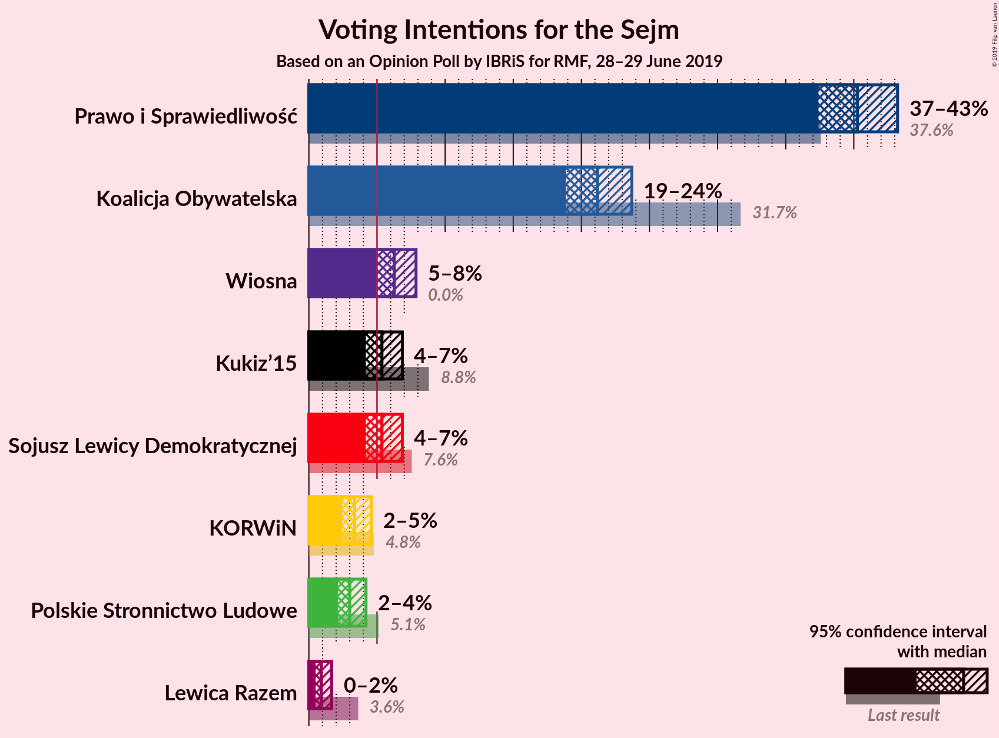
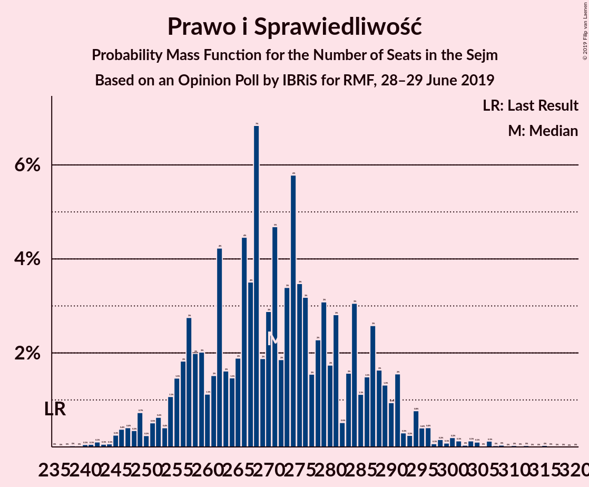

# Opinion Poll by IBRiS for RMF, 28–29 June 2019

<a href="#voting-intentions">Voting Intentions</a> | <a href="#seats">Seats</a> | <a href="#coalitions">Coalitions</a> | <a href="#technical-information">Technical Information</a>

## Voting Intentions

### Confidence Intervals

| Party | Last Result | Poll Result | 80% Confidence Interval | 90% Confidence Interval | 95% Confidence Interval | 99% Confidence Interval |
|:-----:|:-----------:|:-----------:|:-----------------------:|:-----------------------:|:-----------------------:|:-----------------------:|
| Prawo i Sprawiedliwość | 37.6% | 40.3% | 38.4–42.2% |37.9–42.7% |37.4–43.2% |36.5–44.1% |
| Koalicja Obywatelska | 31.7% | 21.2% | 19.7–22.8% |19.2–23.3% |18.9–23.7% |18.2–24.5% |
| Wiosna | 0.0% | 6.3% | 5.4–7.3% |5.2–7.6% |5.0–7.9% |4.6–8.4% |
| Kukiz’15 | 8.8% | 5.4% | 4.6–6.3% |4.4–6.6% |4.2–6.9% |3.8–7.4% |
| Sojusz Lewicy Demokratycznej | 7.6% | 5.4% | 4.6–6.3% |4.4–6.6% |4.2–6.9% |3.8–7.4% |
| KORWiN | 4.8% | 3.4% | 2.8–4.2% |2.6–4.4% |2.4–4.6% |2.2–5.0% |
| Polskie Stronnictwo Ludowe | 5.1% | 3.0% | 2.4–3.8% |2.3–4.0% |2.1–4.2% |1.9–4.6% |
| Lewica Razem | 3.6% | 0.9% | 0.6–1.4% |0.5–1.5% |0.5–1.7% |0.4–1.9% |

*Note:* The poll result column reflects the actual value used in the calculations. Published results may vary slightly, and in addition be rounded to fewer digits.

## Seats

### Confidence Intervals

| Party | Last Result | Median | 80% Confidence Interval | 90% Confidence Interval | 95% Confidence Interval | 99% Confidence Interval |
|:-----:|:-----------:|:------:|:-----------------------:|:-----------------------:|:-----------------------:|:-----------------------:|
| <a href="#prawo-i-sprawiedliwość">Prawo i Sprawiedliwość</a> | 235 | 271 | 257–287 |254–290 |249–294 |245–304 |
| <a href="#koalicja-obywatelska">Koalicja Obywatelska</a> | 166 | 131 | 121–145 |118–150 |114–152 |104–156 |
| <a href="#wiosna">Wiosna</a> | 0 | 29 | 17–34 |14–35 |0–37 |0–41 |
| <a href="#kukiz’15">Kukiz’15</a> | 42 | 15 | 0–27 |0–31 |0–32 |0–36 |
| <a href="#sojusz-lewicy-demokratycznej">Sojusz Lewicy Demokratycznej</a> | 0 | 17 | 0–29 |0–29 |0–31 |0–34 |
| <a href="#korwin">KORWiN</a> | 0 | 0 | 0 |0 |0 |0 |
| <a href="#polskie-stronnictwo-ludowe">Polskie Stronnictwo Ludowe</a> | 16 | 0 | 0 |0 |0 |0 |
| <a href="#lewica-razem">Lewica Razem</a> | 0 | 0 | 0 |0 |0 |0 |

### Prawo i Sprawiedliwość

*For a full overview of the results for this party, see the [Prawo i Sprawiedliwość](party-prawoisprawiedliwość.html) page.*

| Number of Seats | Probability | Accumulated | Special Marks |
|:---------------:|:-----------:|:-----------:|:-------------:|
| 235 | 0% | 100% | Last Result |
| 236 | 0% | 100% |  |
| 237 | 0% | 100% |  |
| 238 | 0% | 99.9% |  |
| 239 | 0% | 99.9% |  |
| 240 | 0.1% | 99.9% |  |
| 241 | 0.1% | 99.8% |  |
| 242 | 0.1% | 99.8% |  |
| 243 | 0.1% | 99.7% |  |
| 244 | 0.1% | 99.6% |  |
| 245 | 0.3% | 99.5% |  |
| 246 | 0.4% | 99.3% |  |
| 247 | 0.4% | 98.9% |  |
| 248 | 0.3% | 98.5% |  |
| 249 | 0.7% | 98% |  |
| 250 | 0.2% | 97% |  |
| 251 | 0.5% | 97% |  |
| 252 | 0.6% | 97% |  |
| 253 | 0.4% | 96% |  |
| 254 | 1.1% | 96% |  |
| 255 | 1.5% | 95% |  |
| 256 | 2% | 93% |  |
| 257 | 3% | 91% |  |
| 258 | 2% | 89% |  |
| 259 | 2% | 87% |  |
| 260 | 1.1% | 85% |  |
| 261 | 2% | 83% |  |
| 262 | 4% | 82% |  |
| 263 | 2% | 78% |  |
| 264 | 1.5% | 76% |  |
| 265 | 2% | 75% |  |
| 266 | 4% | 73% |  |
| 267 | 4% | 68% |  |
| 268 | 7% | 65% |  |
| 269 | 2% | 58% |  |
| 270 | 3% | 56% |  |
| 271 | 5% | 53% | Median |
| 272 | 2% | 48% |  |
| 273 | 3% | 47% |  |
| 274 | 6% | 43% |  |
| 275 | 3% | 37% |  |
| 276 | 3% | 34% |  |
| 277 | 2% | 31% |  |
| 278 | 2% | 29% |  |
| 279 | 3% | 27% |  |
| 280 | 2% | 24% |  |
| 281 | 3% | 22% |  |
| 282 | 0.5% | 19% |  |
| 283 | 2% | 19% |  |
| 284 | 3% | 17% |  |
| 285 | 1.1% | 14% |  |
| 286 | 1.5% | 13% |  |
| 287 | 3% | 11% |  |
| 288 | 2% | 9% |  |
| 289 | 1.3% | 7% |  |
| 290 | 0.9% | 6% |  |
| 291 | 2% | 5% |  |
| 292 | 0.3% | 3% |  |
| 293 | 0.2% | 3% |  |
| 294 | 0.8% | 3% |  |
| 295 | 0.4% | 2% |  |
| 296 | 0.4% | 2% |  |
| 297 | 0.1% | 1.3% |  |
| 298 | 0.2% | 1.2% |  |
| 299 | 0.1% | 1.1% |  |
| 300 | 0.2% | 1.0% |  |
| 301 | 0.1% | 0.8% |  |
| 302 | 0% | 0.7% |  |
| 303 | 0.1% | 0.6% |  |
| 304 | 0.1% | 0.5% |  |
| 305 | 0% | 0.4% |  |
| 306 | 0.1% | 0.4% |  |
| 307 | 0% | 0.3% |  |
| 308 | 0% | 0.2% |  |
| 309 | 0% | 0.2% |  |
| 310 | 0% | 0.2% |  |
| 311 | 0% | 0.1% |  |
| 312 | 0% | 0.1% |  |
| 313 | 0% | 0.1% |  |
| 314 | 0% | 0.1% |  |
| 315 | 0% | 0.1% |  |
| 316 | 0% | 0% |  |

### Koalicja Obywatelska

*For a full overview of the results for this party, see the [Koalicja Obywatelska](party-koalicjaobywatelska.html) page.*

| Number of Seats | Probability | Accumulated | Special Marks |
|:---------------:|:-----------:|:-----------:|:-------------:|
| 99 | 0% | 100% |  |
| 100 | 0% | 99.9% |  |
| 101 | 0% | 99.9% |  |
| 102 | 0% | 99.9% |  |
| 103 | 0.2% | 99.9% |  |
| 104 | 0.3% | 99.7% |  |
| 105 | 0.1% | 99.4% |  |
| 106 | 0% | 99.4% |  |
| 107 | 0.1% | 99.3% |  |
| 108 | 0.1% | 99.3% |  |
| 109 | 0.1% | 99.2% |  |
| 110 | 0.1% | 99.1% |  |
| 111 | 0.2% | 98.9% |  |
| 112 | 0.2% | 98.7% |  |
| 113 | 0.7% | 98.5% |  |
| 114 | 0.6% | 98% |  |
| 115 | 0.5% | 97% |  |
| 116 | 0.4% | 97% |  |
| 117 | 0.8% | 96% |  |
| 118 | 1.2% | 96% |  |
| 119 | 1.3% | 94% |  |
| 120 | 2% | 93% |  |
| 121 | 3% | 91% |  |
| 122 | 5% | 88% |  |
| 123 | 4% | 83% |  |
| 124 | 4% | 80% |  |
| 125 | 4% | 76% |  |
| 126 | 3% | 72% |  |
| 127 | 6% | 69% |  |
| 128 | 3% | 64% |  |
| 129 | 4% | 61% |  |
| 130 | 4% | 57% |  |
| 131 | 5% | 53% | Median |
| 132 | 2% | 47% |  |
| 133 | 4% | 45% |  |
| 134 | 5% | 41% |  |
| 135 | 2% | 37% |  |
| 136 | 2% | 35% |  |
| 137 | 3% | 33% |  |
| 138 | 4% | 30% |  |
| 139 | 2% | 26% |  |
| 140 | 1.0% | 24% |  |
| 141 | 3% | 23% |  |
| 142 | 2% | 20% |  |
| 143 | 2% | 17% |  |
| 144 | 2% | 15% |  |
| 145 | 4% | 13% |  |
| 146 | 2% | 10% |  |
| 147 | 1.0% | 8% |  |
| 148 | 2% | 7% |  |
| 149 | 0.4% | 6% |  |
| 150 | 1.0% | 5% |  |
| 151 | 0.8% | 4% |  |
| 152 | 2% | 3% |  |
| 153 | 0.7% | 2% |  |
| 154 | 0.3% | 1.2% |  |
| 155 | 0.2% | 0.9% |  |
| 156 | 0.3% | 0.6% |  |
| 157 | 0.1% | 0.3% |  |
| 158 | 0.1% | 0.2% |  |
| 159 | 0% | 0.1% |  |
| 160 | 0% | 0.1% |  |
| 161 | 0% | 0.1% |  |
| 162 | 0% | 0.1% |  |
| 163 | 0% | 0.1% |  |
| 164 | 0% | 0.1% |  |
| 165 | 0% | 0% |  |
| 166 | 0% | 0% | Last Result |

### Wiosna

*For a full overview of the results for this party, see the [Wiosna](party-wiosna.html) page.*

| Number of Seats | Probability | Accumulated | Special Marks |
|:---------------:|:-----------:|:-----------:|:-------------:|
| 0 | 3% | 100% | Last Result |
| 1 | 0% | 97% |  |
| 2 | 0% | 97% |  |
| 3 | 0% | 97% |  |
| 4 | 0% | 97% |  |
| 5 | 0% | 97% |  |
| 6 | 0% | 97% |  |
| 7 | 0% | 97% |  |
| 8 | 0% | 97% |  |
| 9 | 0% | 97% |  |
| 10 | 0% | 97% |  |
| 11 | 0.5% | 97% |  |
| 12 | 0.5% | 97% |  |
| 13 | 0.5% | 96% |  |
| 14 | 0.8% | 96% |  |
| 15 | 0.7% | 95% |  |
| 16 | 2% | 94% |  |
| 17 | 3% | 92% |  |
| 18 | 3% | 89% |  |
| 19 | 3% | 86% |  |
| 20 | 1.1% | 83% |  |
| 21 | 2% | 82% |  |
| 22 | 0.7% | 80% |  |
| 23 | 1.1% | 79% |  |
| 24 | 2% | 78% |  |
| 25 | 2% | 76% |  |
| 26 | 4% | 74% |  |
| 27 | 2% | 70% |  |
| 28 | 5% | 68% |  |
| 29 | 26% | 63% | Median |
| 30 | 9% | 37% |  |
| 31 | 4% | 28% |  |
| 32 | 5% | 23% |  |
| 33 | 3% | 18% |  |
| 34 | 9% | 15% |  |
| 35 | 1.5% | 6% |  |
| 36 | 1.2% | 4% |  |
| 37 | 0.9% | 3% |  |
| 38 | 0.6% | 2% |  |
| 39 | 0.5% | 1.3% |  |
| 40 | 0.3% | 0.8% |  |
| 41 | 0.1% | 0.5% |  |
| 42 | 0.2% | 0.4% |  |
| 43 | 0.1% | 0.2% |  |
| 44 | 0.1% | 0.1% |  |
| 45 | 0.1% | 0.1% |  |
| 46 | 0% | 0% |  |

### Kukiz’15

*For a full overview of the results for this party, see the [Kukiz’15](party-kukiz’15.html) page.*

| Number of Seats | Probability | Accumulated | Special Marks |
|:---------------:|:-----------:|:-----------:|:-------------:|
| 0 | 29% | 100% |  |
| 1 | 0% | 71% |  |
| 2 | 0% | 71% |  |
| 3 | 0% | 71% |  |
| 4 | 0% | 71% |  |
| 5 | 0% | 71% |  |
| 6 | 0% | 71% |  |
| 7 | 0% | 71% |  |
| 8 | 0% | 71% |  |
| 9 | 0.1% | 71% |  |
| 10 | 4% | 71% |  |
| 11 | 3% | 67% |  |
| 12 | 2% | 64% |  |
| 13 | 3% | 62% |  |
| 14 | 5% | 58% |  |
| 15 | 7% | 53% | Median |
| 16 | 6% | 46% |  |
| 17 | 3% | 40% |  |
| 18 | 5% | 38% |  |
| 19 | 2% | 32% |  |
| 20 | 2% | 30% |  |
| 21 | 2% | 28% |  |
| 22 | 4% | 26% |  |
| 23 | 3% | 22% |  |
| 24 | 5% | 19% |  |
| 25 | 2% | 14% |  |
| 26 | 2% | 12% |  |
| 27 | 2% | 10% |  |
| 28 | 0.9% | 8% |  |
| 29 | 2% | 7% |  |
| 30 | 0.7% | 6% |  |
| 31 | 0.9% | 5% |  |
| 32 | 2% | 4% |  |
| 33 | 1.0% | 2% |  |
| 34 | 0.4% | 1.2% |  |
| 35 | 0.3% | 0.8% |  |
| 36 | 0.1% | 0.5% |  |
| 37 | 0.1% | 0.4% |  |
| 38 | 0.1% | 0.3% |  |
| 39 | 0.1% | 0.2% |  |
| 40 | 0% | 0.1% |  |
| 41 | 0% | 0.1% |  |
| 42 | 0% | 0% | Last Result |

### Sojusz Lewicy Demokratycznej

*For a full overview of the results for this party, see the [Sojusz Lewicy Demokratycznej](party-sojuszlewicydemokratycznej.html) page.*

| Number of Seats | Probability | Accumulated | Special Marks |
|:---------------:|:-----------:|:-----------:|:-------------:|
| 0 | 25% | 100% | Last Result |
| 1 | 0% | 75% |  |
| 2 | 0% | 75% |  |
| 3 | 0% | 75% |  |
| 4 | 0% | 75% |  |
| 5 | 0% | 75% |  |
| 6 | 0% | 75% |  |
| 7 | 0% | 75% |  |
| 8 | 0% | 75% |  |
| 9 | 0% | 75% |  |
| 10 | 0.3% | 75% |  |
| 11 | 1.4% | 75% |  |
| 12 | 3% | 73% |  |
| 13 | 2% | 71% |  |
| 14 | 6% | 69% |  |
| 15 | 2% | 63% |  |
| 16 | 8% | 61% |  |
| 17 | 3% | 53% | Median |
| 18 | 6% | 50% |  |
| 19 | 11% | 44% |  |
| 20 | 3% | 33% |  |
| 21 | 4% | 30% |  |
| 22 | 2% | 27% |  |
| 23 | 3% | 25% |  |
| 24 | 1.1% | 22% |  |
| 25 | 2% | 21% |  |
| 26 | 1.3% | 19% |  |
| 27 | 3% | 18% |  |
| 28 | 4% | 15% |  |
| 29 | 6% | 11% |  |
| 30 | 1.4% | 5% |  |
| 31 | 0.8% | 3% |  |
| 32 | 0.5% | 2% |  |
| 33 | 0.7% | 2% |  |
| 34 | 1.0% | 1.2% |  |
| 35 | 0.1% | 0.3% |  |
| 36 | 0.1% | 0.2% |  |
| 37 | 0% | 0.1% |  |
| 38 | 0% | 0% |  |

### KORWiN

*For a full overview of the results for this party, see the [KORWiN](party-korwin.html) page.*

| Number of Seats | Probability | Accumulated | Special Marks |
|:---------------:|:-----------:|:-----------:|:-------------:|
| 0 | 99.6% | 100% | Last Result, Median |
| 1 | 0% | 0.4% |  |
| 2 | 0% | 0.4% |  |
| 3 | 0% | 0.4% |  |
| 4 | 0% | 0.4% |  |
| 5 | 0% | 0.4% |  |
| 6 | 0% | 0.4% |  |
| 7 | 0% | 0.4% |  |
| 8 | 0% | 0.4% |  |
| 9 | 0% | 0.4% |  |
| 10 | 0% | 0.3% |  |
| 11 | 0.1% | 0.3% |  |
| 12 | 0% | 0.3% |  |
| 13 | 0.1% | 0.2% |  |
| 14 | 0% | 0.1% |  |
| 15 | 0% | 0.1% |  |
| 16 | 0% | 0.1% |  |
| 17 | 0% | 0% |  |

### Polskie Stronnictwo Ludowe

*For a full overview of the results for this party, see the [Polskie Stronnictwo Ludowe](party-polskiestronnictwoludowe.html) page.*

| Number of Seats | Probability | Accumulated | Special Marks |
|:---------------:|:-----------:|:-----------:|:-------------:|
| 0 | 99.9% | 100% | Median |
| 1 | 0% | 0.1% |  |
| 2 | 0% | 0.1% |  |
| 3 | 0% | 0.1% |  |
| 4 | 0% | 0.1% |  |
| 5 | 0% | 0.1% |  |
| 6 | 0% | 0.1% |  |
| 7 | 0% | 0.1% |  |
| 8 | 0% | 0.1% |  |
| 9 | 0% | 0.1% |  |
| 10 | 0% | 0.1% |  |
| 11 | 0% | 0.1% |  |
| 12 | 0% | 0.1% |  |
| 13 | 0% | 0.1% |  |
| 14 | 0% | 0.1% |  |
| 15 | 0% | 0.1% |  |
| 16 | 0% | 0.1% | Last Result |
| 17 | 0% | 0.1% |  |
| 18 | 0% | 0% |  |

### Lewica Razem

*For a full overview of the results for this party, see the [Lewica Razem](party-lewicarazem.html) page.*

| Number of Seats | Probability | Accumulated | Special Marks |
|:---------------:|:-----------:|:-----------:|:-------------:|
| 0 | 100% | 100% | Last Result, Median |

## Coalitions

### Confidence Intervals

| Coalition | Last Result | Median | Majority? | 80% Confidence Interval | 90% Confidence Interval | 95% Confidence Interval | 99% Confidence Interval |
|:---------:|:-----------:|:------:|:---------:|:-----------------------:|:-----------------------:|:-----------------------:|:-----------------------:|
| Prawo i Sprawiedliwość | 235 | 271 | 100% | 257–287 | 254–290 | 249–294 | 245–304 |
| Koalicja Obywatelska – Sojusz Lewicy Demokratycznej – Polskie Stronnictwo Ludowe – Lewica Razem | 182 | 148 | 0% | 133–164 | 127–167 | 124–170 | 118–177 |
| Koalicja Obywatelska – Sojusz Lewicy Demokratycznej – Polskie Stronnictwo Ludowe | 182 | 148 | 0% | 133–164 | 127–167 | 124–170 | 118–177 |
| Koalicja Obywatelska – Sojusz Lewicy Demokratycznej | 166 | 148 | 0% | 133–164 | 127–167 | 124–170 | 118–177 |
| Koalicja Obywatelska | 166 | 131 | 0% | 121–145 | 118–150 | 114–152 | 104–156 |
| Koalicja Obywatelska – Polskie Stronnictwo Ludowe | 182 | 131 | 0% | 121–145 | 118–150 | 114–152 | 104–156 |

### Prawo i Sprawiedliwość

| Number of Seats | Probability | Accumulated | Special Marks |
|:---------------:|:-----------:|:-----------:|:-------------:|
| 235 | 0% | 100% | Last Result |
| 236 | 0% | 100% |  |
| 237 | 0% | 100% |  |
| 238 | 0% | 99.9% |  |
| 239 | 0% | 99.9% |  |
| 240 | 0.1% | 99.9% |  |
| 241 | 0.1% | 99.8% |  |
| 242 | 0.1% | 99.8% |  |
| 243 | 0.1% | 99.7% |  |
| 244 | 0.1% | 99.6% |  |
| 245 | 0.3% | 99.5% |  |
| 246 | 0.4% | 99.3% |  |
| 247 | 0.4% | 98.9% |  |
| 248 | 0.3% | 98.5% |  |
| 249 | 0.7% | 98% |  |
| 250 | 0.2% | 97% |  |
| 251 | 0.5% | 97% |  |
| 252 | 0.6% | 97% |  |
| 253 | 0.4% | 96% |  |
| 254 | 1.1% | 96% |  |
| 255 | 1.5% | 95% |  |
| 256 | 2% | 93% |  |
| 257 | 3% | 91% |  |
| 258 | 2% | 89% |  |
| 259 | 2% | 87% |  |
| 260 | 1.1% | 85% |  |
| 261 | 2% | 83% |  |
| 262 | 4% | 82% |  |
| 263 | 2% | 78% |  |
| 264 | 1.5% | 76% |  |
| 265 | 2% | 75% |  |
| 266 | 4% | 73% |  |
| 267 | 4% | 68% |  |
| 268 | 7% | 65% |  |
| 269 | 2% | 58% |  |
| 270 | 3% | 56% |  |
| 271 | 5% | 53% | Median |
| 272 | 2% | 48% |  |
| 273 | 3% | 47% |  |
| 274 | 6% | 43% |  |
| 275 | 3% | 37% |  |
| 276 | 3% | 34% |  |
| 277 | 2% | 31% |  |
| 278 | 2% | 29% |  |
| 279 | 3% | 27% |  |
| 280 | 2% | 24% |  |
| 281 | 3% | 22% |  |
| 282 | 0.5% | 19% |  |
| 283 | 2% | 19% |  |
| 284 | 3% | 17% |  |
| 285 | 1.1% | 14% |  |
| 286 | 1.5% | 13% |  |
| 287 | 3% | 11% |  |
| 288 | 2% | 9% |  |
| 289 | 1.3% | 7% |  |
| 290 | 0.9% | 6% |  |
| 291 | 2% | 5% |  |
| 292 | 0.3% | 3% |  |
| 293 | 0.2% | 3% |  |
| 294 | 0.8% | 3% |  |
| 295 | 0.4% | 2% |  |
| 296 | 0.4% | 2% |  |
| 297 | 0.1% | 1.3% |  |
| 298 | 0.2% | 1.2% |  |
| 299 | 0.1% | 1.1% |  |
| 300 | 0.2% | 1.0% |  |
| 301 | 0.1% | 0.8% |  |
| 302 | 0% | 0.7% |  |
| 303 | 0.1% | 0.6% |  |
| 304 | 0.1% | 0.5% |  |
| 305 | 0% | 0.4% |  |
| 306 | 0.1% | 0.4% |  |
| 307 | 0% | 0.3% |  |
| 308 | 0% | 0.2% |  |
| 309 | 0% | 0.2% |  |
| 310 | 0% | 0.2% |  |
| 311 | 0% | 0.1% |  |
| 312 | 0% | 0.1% |  |
| 313 | 0% | 0.1% |  |
| 314 | 0% | 0.1% |  |
| 315 | 0% | 0.1% |  |
| 316 | 0% | 0% |  |

### Koalicja Obywatelska – Sojusz Lewicy Demokratycznej – Polskie Stronnictwo Ludowe – Lewica Razem

| Number of Seats | Probability | Accumulated | Special Marks |
|:---------------:|:-----------:|:-----------:|:-------------:|
| 112 | 0.1% | 100% |  |
| 113 | 0% | 99.9% |  |
| 114 | 0% | 99.8% |  |
| 115 | 0.1% | 99.8% |  |
| 116 | 0.1% | 99.8% |  |
| 117 | 0.1% | 99.7% |  |
| 118 | 0.2% | 99.6% |  |
| 119 | 0.1% | 99.4% |  |
| 120 | 0.2% | 99.3% |  |
| 121 | 0.3% | 99.2% |  |
| 122 | 0.7% | 98.9% |  |
| 123 | 0.3% | 98% |  |
| 124 | 0.6% | 98% |  |
| 125 | 0.6% | 97% |  |
| 126 | 0.7% | 97% |  |
| 127 | 1.1% | 96% |  |
| 128 | 1.1% | 95% |  |
| 129 | 0.7% | 94% |  |
| 130 | 1.1% | 93% |  |
| 131 | 0.8% | 92% |  |
| 132 | 1.0% | 91% |  |
| 133 | 2% | 90% |  |
| 134 | 1.0% | 88% |  |
| 135 | 0.8% | 87% |  |
| 136 | 2% | 86% |  |
| 137 | 1.3% | 84% |  |
| 138 | 5% | 83% |  |
| 139 | 5% | 78% |  |
| 140 | 2% | 74% |  |
| 141 | 3% | 72% |  |
| 142 | 3% | 68% |  |
| 143 | 2% | 65% |  |
| 144 | 2% | 63% |  |
| 145 | 5% | 60% |  |
| 146 | 3% | 55% |  |
| 147 | 2% | 52% |  |
| 148 | 4% | 50% | Median |
| 149 | 3% | 47% |  |
| 150 | 3% | 44% |  |
| 151 | 2% | 41% |  |
| 152 | 4% | 38% |  |
| 153 | 5% | 34% |  |
| 154 | 2% | 29% |  |
| 155 | 3% | 27% |  |
| 156 | 2% | 24% |  |
| 157 | 3% | 22% |  |
| 158 | 2% | 19% |  |
| 159 | 2% | 17% |  |
| 160 | 2% | 15% |  |
| 161 | 1.1% | 14% |  |
| 162 | 1.0% | 13% |  |
| 163 | 0.8% | 12% |  |
| 164 | 1.4% | 11% |  |
| 165 | 1.2% | 9% |  |
| 166 | 2% | 8% |  |
| 167 | 2% | 6% |  |
| 168 | 1.1% | 4% |  |
| 169 | 0.6% | 3% |  |
| 170 | 0.5% | 3% |  |
| 171 | 0.7% | 2% |  |
| 172 | 0.2% | 1.4% |  |
| 173 | 0.1% | 1.2% |  |
| 174 | 0.2% | 1.1% |  |
| 175 | 0.1% | 0.9% |  |
| 176 | 0.1% | 0.8% |  |
| 177 | 0.3% | 0.7% |  |
| 178 | 0.2% | 0.4% |  |
| 179 | 0.1% | 0.2% |  |
| 180 | 0% | 0.1% |  |
| 181 | 0% | 0.1% |  |
| 182 | 0% | 0.1% | Last Result |
| 183 | 0% | 0.1% |  |
| 184 | 0% | 0% |  |

### Koalicja Obywatelska – Sojusz Lewicy Demokratycznej – Polskie Stronnictwo Ludowe

| Number of Seats | Probability | Accumulated | Special Marks |
|:---------------:|:-----------:|:-----------:|:-------------:|
| 112 | 0.1% | 100% |  |
| 113 | 0% | 99.9% |  |
| 114 | 0% | 99.8% |  |
| 115 | 0.1% | 99.8% |  |
| 116 | 0.1% | 99.8% |  |
| 117 | 0.1% | 99.7% |  |
| 118 | 0.2% | 99.6% |  |
| 119 | 0.1% | 99.4% |  |
| 120 | 0.2% | 99.3% |  |
| 121 | 0.3% | 99.2% |  |
| 122 | 0.7% | 98.9% |  |
| 123 | 0.3% | 98% |  |
| 124 | 0.6% | 98% |  |
| 125 | 0.6% | 97% |  |
| 126 | 0.7% | 97% |  |
| 127 | 1.1% | 96% |  |
| 128 | 1.1% | 95% |  |
| 129 | 0.7% | 94% |  |
| 130 | 1.1% | 93% |  |
| 131 | 0.8% | 92% |  |
| 132 | 1.0% | 91% |  |
| 133 | 2% | 90% |  |
| 134 | 1.0% | 88% |  |
| 135 | 0.8% | 87% |  |
| 136 | 2% | 86% |  |
| 137 | 1.3% | 84% |  |
| 138 | 5% | 83% |  |
| 139 | 5% | 78% |  |
| 140 | 2% | 74% |  |
| 141 | 3% | 72% |  |
| 142 | 3% | 68% |  |
| 143 | 2% | 65% |  |
| 144 | 2% | 63% |  |
| 145 | 5% | 60% |  |
| 146 | 3% | 55% |  |
| 147 | 2% | 52% |  |
| 148 | 4% | 50% | Median |
| 149 | 3% | 47% |  |
| 150 | 3% | 44% |  |
| 151 | 2% | 41% |  |
| 152 | 4% | 38% |  |
| 153 | 5% | 34% |  |
| 154 | 2% | 29% |  |
| 155 | 3% | 27% |  |
| 156 | 2% | 24% |  |
| 157 | 3% | 22% |  |
| 158 | 2% | 19% |  |
| 159 | 2% | 17% |  |
| 160 | 2% | 15% |  |
| 161 | 1.1% | 14% |  |
| 162 | 1.0% | 13% |  |
| 163 | 0.8% | 12% |  |
| 164 | 1.4% | 11% |  |
| 165 | 1.2% | 9% |  |
| 166 | 2% | 8% |  |
| 167 | 2% | 6% |  |
| 168 | 1.1% | 4% |  |
| 169 | 0.6% | 3% |  |
| 170 | 0.5% | 3% |  |
| 171 | 0.7% | 2% |  |
| 172 | 0.2% | 1.4% |  |
| 173 | 0.1% | 1.2% |  |
| 174 | 0.2% | 1.1% |  |
| 175 | 0.1% | 0.9% |  |
| 176 | 0.1% | 0.8% |  |
| 177 | 0.3% | 0.7% |  |
| 178 | 0.2% | 0.4% |  |
| 179 | 0.1% | 0.2% |  |
| 180 | 0% | 0.1% |  |
| 181 | 0% | 0.1% |  |
| 182 | 0% | 0.1% | Last Result |
| 183 | 0% | 0.1% |  |
| 184 | 0% | 0% |  |

### Koalicja Obywatelska – Sojusz Lewicy Demokratycznej

| Number of Seats | Probability | Accumulated | Special Marks |
|:---------------:|:-----------:|:-----------:|:-------------:|
| 112 | 0.1% | 100% |  |
| 113 | 0% | 99.9% |  |
| 114 | 0% | 99.8% |  |
| 115 | 0.1% | 99.8% |  |
| 116 | 0.1% | 99.8% |  |
| 117 | 0.1% | 99.7% |  |
| 118 | 0.2% | 99.6% |  |
| 119 | 0.1% | 99.4% |  |
| 120 | 0.2% | 99.3% |  |
| 121 | 0.3% | 99.1% |  |
| 122 | 0.7% | 98.9% |  |
| 123 | 0.3% | 98% |  |
| 124 | 0.6% | 98% |  |
| 125 | 0.6% | 97% |  |
| 126 | 0.7% | 97% |  |
| 127 | 1.1% | 96% |  |
| 128 | 1.1% | 95% |  |
| 129 | 0.7% | 94% |  |
| 130 | 1.1% | 93% |  |
| 131 | 0.8% | 92% |  |
| 132 | 1.0% | 91% |  |
| 133 | 2% | 90% |  |
| 134 | 1.0% | 88% |  |
| 135 | 0.8% | 87% |  |
| 136 | 2% | 86% |  |
| 137 | 1.3% | 84% |  |
| 138 | 5% | 83% |  |
| 139 | 5% | 78% |  |
| 140 | 2% | 74% |  |
| 141 | 3% | 72% |  |
| 142 | 3% | 68% |  |
| 143 | 2% | 65% |  |
| 144 | 2% | 63% |  |
| 145 | 5% | 60% |  |
| 146 | 3% | 55% |  |
| 147 | 2% | 52% |  |
| 148 | 4% | 50% | Median |
| 149 | 3% | 47% |  |
| 150 | 3% | 44% |  |
| 151 | 2% | 40% |  |
| 152 | 4% | 38% |  |
| 153 | 5% | 34% |  |
| 154 | 2% | 29% |  |
| 155 | 3% | 27% |  |
| 156 | 2% | 24% |  |
| 157 | 3% | 22% |  |
| 158 | 2% | 19% |  |
| 159 | 2% | 17% |  |
| 160 | 2% | 15% |  |
| 161 | 1.1% | 14% |  |
| 162 | 1.0% | 13% |  |
| 163 | 0.8% | 11% |  |
| 164 | 1.4% | 11% |  |
| 165 | 1.2% | 9% |  |
| 166 | 2% | 8% | Last Result |
| 167 | 2% | 6% |  |
| 168 | 1.1% | 4% |  |
| 169 | 0.6% | 3% |  |
| 170 | 0.5% | 3% |  |
| 171 | 0.7% | 2% |  |
| 172 | 0.2% | 1.4% |  |
| 173 | 0.1% | 1.2% |  |
| 174 | 0.2% | 1.1% |  |
| 175 | 0.1% | 0.9% |  |
| 176 | 0.1% | 0.8% |  |
| 177 | 0.3% | 0.7% |  |
| 178 | 0.2% | 0.4% |  |
| 179 | 0.1% | 0.2% |  |
| 180 | 0% | 0.1% |  |
| 181 | 0% | 0.1% |  |
| 182 | 0% | 0.1% |  |
| 183 | 0% | 0.1% |  |
| 184 | 0% | 0% |  |

### Koalicja Obywatelska

| Number of Seats | Probability | Accumulated | Special Marks |
|:---------------:|:-----------:|:-----------:|:-------------:|
| 99 | 0% | 100% |  |
| 100 | 0% | 99.9% |  |
| 101 | 0% | 99.9% |  |
| 102 | 0% | 99.9% |  |
| 103 | 0.2% | 99.9% |  |
| 104 | 0.3% | 99.7% |  |
| 105 | 0.1% | 99.4% |  |
| 106 | 0% | 99.4% |  |
| 107 | 0.1% | 99.3% |  |
| 108 | 0.1% | 99.3% |  |
| 109 | 0.1% | 99.2% |  |
| 110 | 0.1% | 99.1% |  |
| 111 | 0.2% | 98.9% |  |
| 112 | 0.2% | 98.7% |  |
| 113 | 0.7% | 98.5% |  |
| 114 | 0.6% | 98% |  |
| 115 | 0.5% | 97% |  |
| 116 | 0.4% | 97% |  |
| 117 | 0.8% | 96% |  |
| 118 | 1.2% | 96% |  |
| 119 | 1.3% | 94% |  |
| 120 | 2% | 93% |  |
| 121 | 3% | 91% |  |
| 122 | 5% | 88% |  |
| 123 | 4% | 83% |  |
| 124 | 4% | 80% |  |
| 125 | 4% | 76% |  |
| 126 | 3% | 72% |  |
| 127 | 6% | 69% |  |
| 128 | 3% | 64% |  |
| 129 | 4% | 61% |  |
| 130 | 4% | 57% |  |
| 131 | 5% | 53% | Median |
| 132 | 2% | 47% |  |
| 133 | 4% | 45% |  |
| 134 | 5% | 41% |  |
| 135 | 2% | 37% |  |
| 136 | 2% | 35% |  |
| 137 | 3% | 33% |  |
| 138 | 4% | 30% |  |
| 139 | 2% | 26% |  |
| 140 | 1.0% | 24% |  |
| 141 | 3% | 23% |  |
| 142 | 2% | 20% |  |
| 143 | 2% | 17% |  |
| 144 | 2% | 15% |  |
| 145 | 4% | 13% |  |
| 146 | 2% | 10% |  |
| 147 | 1.0% | 8% |  |
| 148 | 2% | 7% |  |
| 149 | 0.4% | 6% |  |
| 150 | 1.0% | 5% |  |
| 151 | 0.8% | 4% |  |
| 152 | 2% | 3% |  |
| 153 | 0.7% | 2% |  |
| 154 | 0.3% | 1.2% |  |
| 155 | 0.2% | 0.9% |  |
| 156 | 0.3% | 0.6% |  |
| 157 | 0.1% | 0.3% |  |
| 158 | 0.1% | 0.2% |  |
| 159 | 0% | 0.1% |  |
| 160 | 0% | 0.1% |  |
| 161 | 0% | 0.1% |  |
| 162 | 0% | 0.1% |  |
| 163 | 0% | 0.1% |  |
| 164 | 0% | 0.1% |  |
| 165 | 0% | 0% |  |
| 166 | 0% | 0% | Last Result |

### Koalicja Obywatelska – Polskie Stronnictwo Ludowe

| Number of Seats | Probability | Accumulated | Special Marks |
|:---------------:|:-----------:|:-----------:|:-------------:|
| 99 | 0% | 100% |  |
| 100 | 0% | 99.9% |  |
| 101 | 0% | 99.9% |  |
| 102 | 0% | 99.9% |  |
| 103 | 0.2% | 99.9% |  |
| 104 | 0.3% | 99.7% |  |
| 105 | 0.1% | 99.4% |  |
| 106 | 0% | 99.4% |  |
| 107 | 0.1% | 99.3% |  |
| 108 | 0.1% | 99.3% |  |
| 109 | 0.1% | 99.2% |  |
| 110 | 0.1% | 99.1% |  |
| 111 | 0.2% | 98.9% |  |
| 112 | 0.2% | 98.7% |  |
| 113 | 0.7% | 98.5% |  |
| 114 | 0.6% | 98% |  |
| 115 | 0.5% | 97% |  |
| 116 | 0.4% | 97% |  |
| 117 | 0.8% | 96% |  |
| 118 | 1.2% | 96% |  |
| 119 | 1.3% | 94% |  |
| 120 | 2% | 93% |  |
| 121 | 3% | 91% |  |
| 122 | 5% | 88% |  |
| 123 | 4% | 83% |  |
| 124 | 4% | 80% |  |
| 125 | 4% | 76% |  |
| 126 | 3% | 72% |  |
| 127 | 6% | 69% |  |
| 128 | 3% | 64% |  |
| 129 | 4% | 61% |  |
| 130 | 4% | 57% |  |
| 131 | 5% | 53% | Median |
| 132 | 2% | 47% |  |
| 133 | 4% | 45% |  |
| 134 | 5% | 41% |  |
| 135 | 2% | 37% |  |
| 136 | 2% | 35% |  |
| 137 | 3% | 33% |  |
| 138 | 4% | 30% |  |
| 139 | 2% | 26% |  |
| 140 | 1.0% | 24% |  |
| 141 | 3% | 23% |  |
| 142 | 2% | 20% |  |
| 143 | 2% | 17% |  |
| 144 | 2% | 15% |  |
| 145 | 4% | 13% |  |
| 146 | 2% | 10% |  |
| 147 | 1.0% | 8% |  |
| 148 | 2% | 7% |  |
| 149 | 0.4% | 6% |  |
| 150 | 1.0% | 5% |  |
| 151 | 0.9% | 4% |  |
| 152 | 2% | 3% |  |
| 153 | 0.7% | 2% |  |
| 154 | 0.3% | 1.2% |  |
| 155 | 0.2% | 0.9% |  |
| 156 | 0.3% | 0.6% |  |
| 157 | 0.1% | 0.3% |  |
| 158 | 0.1% | 0.2% |  |
| 159 | 0% | 0.1% |  |
| 160 | 0% | 0.1% |  |
| 161 | 0% | 0.1% |  |
| 162 | 0% | 0.1% |  |
| 163 | 0% | 0.1% |  |
| 164 | 0% | 0.1% |  |
| 165 | 0% | 0% |  |
| 166 | 0% | 0% |  |
| 167 | 0% | 0% |  |
| 168 | 0% | 0% |  |
| 169 | 0% | 0% |  |
| 170 | 0% | 0% |  |
| 171 | 0% | 0% |  |
| 172 | 0% | 0% |  |
| 173 | 0% | 0% |  |
| 174 | 0% | 0% |  |
| 175 | 0% | 0% |  |
| 176 | 0% | 0% |  |
| 177 | 0% | 0% |  |
| 178 | 0% | 0% |  |
| 179 | 0% | 0% |  |
| 180 | 0% | 0% |  |
| 181 | 0% | 0% |  |
| 182 | 0% | 0% | Last Result |

## Technical Information

### Opinion Poll

+ **Polling firm:** IBRiS
+ **Commissioner(s):** RMF
+ **Fieldwork period:** 28–29 June 2019

### Calculations

+ **Sample size:** 1100
+ **Simulations done:** 1,048,576
+ **Error estimate:** 1.68%

