# Opinion Poll by Social Changes, 5–10 July 2019

<a href="#voting-intentions">Voting Intentions</a> | <a href="#seats">Seats</a> | <a href="#coalitions">Coalitions</a> | <a href="#technical-information">Technical Information</a>

## Voting Intentions

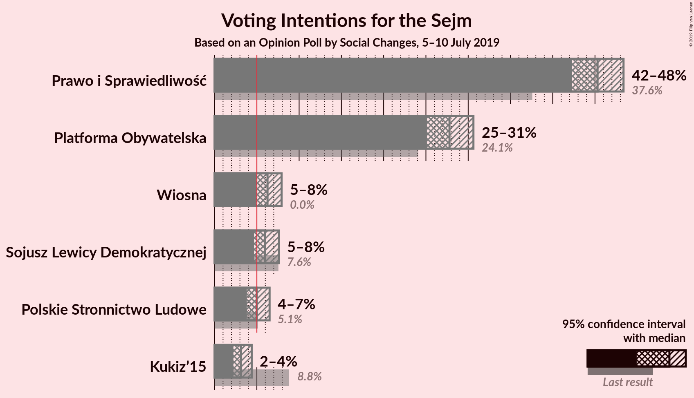

### Confidence Intervals

| Party | Last Result | Poll Result | 80% Confidence Interval | 90% Confidence Interval | 95% Confidence Interval | 99% Confidence Interval |
|:-----:|:-----------:|:-----------:|:-----------------------:|:-----------------------:|:-----------------------:|:-----------------------:|
| Prawo i Sprawiedliwość | 37.6% | 45.3% | 43.3–47.3% |42.8–47.9% |42.3–48.4% |41.3–49.3% |
| Koalicja Obywatelska | 31.7% | 27.8% | 26.0–29.6% |25.5–30.2% |25.1–30.6% |24.3–31.5% |
| Wiosna | 0.0% | 6.3% | 5.4–7.3% |5.1–7.7% |4.9–7.9% |4.5–8.5% |
| Sojusz Lewicy Demokratycznej | 7.6% | 6.0% | 5.1–7.0% |4.9–7.3% |4.7–7.6% |4.3–8.1% |
| Polskie Stronnictwo Ludowe | 5.1% | 5.0% | 4.2–6.0% |4.0–6.3% |3.8–6.5% |3.5–7.0% |
| Kukiz’15 | 8.8% | 3.1% | 2.5–3.9% |2.4–4.2% |2.2–4.4% |2.0–4.8% |

*Note:* The poll result column reflects the actual value used in the calculations. Published results may vary slightly, and in addition be rounded to fewer digits.

## Seats

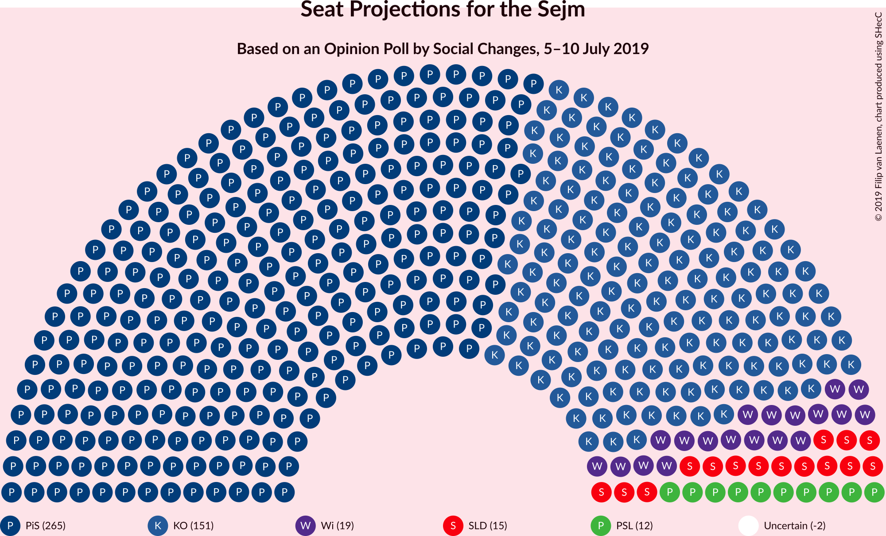

### Confidence Intervals

| Party | Last Result | Median | 80% Confidence Interval | 90% Confidence Interval | 95% Confidence Interval | 99% Confidence Interval |
|:-----:|:-----------:|:------:|:-----------------------:|:-----------------------:|:-----------------------:|:-----------------------:|
| <a href="#prawo-i-sprawiedliwość">Prawo i Sprawiedliwość</a> | 235 | 265 | 251–278 |248–282 |245–285 |239–292 |
| <a href="#koalicja-obywatelska">Koalicja Obywatelska</a> | 166 | 151 | 143–162 |139–167 |137–170 |130–177 |
| <a href="#wiosna">Wiosna</a> | 0 | 19 | 10–29 |8–30 |0–31 |0–34 |
| <a href="#sojusz-lewicy-demokratycznej">Sojusz Lewicy Demokratycznej</a> | 0 | 15 | 8–28 |0–29 |0–30 |0–32 |
| <a href="#polskie-stronnictwo-ludowe">Polskie Stronnictwo Ludowe</a> | 16 | 12 | 0–19 |0–21 |0–23 |0–25 |
| <a href="#kukiz’15">Kukiz’15</a> | 42 | 0 | 0 |0 |0 |0 |

### Prawo i Sprawiedliwość

*For a full overview of the results for this party, see the [Prawo i Sprawiedliwość](party-prawoisprawiedliwość.html) page.*

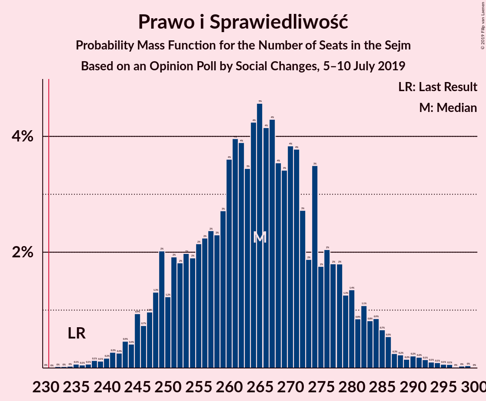

| Number of Seats | Probability | Accumulated | Special Marks |
|:---------------:|:-----------:|:-----------:|:-------------:|
| 231 | 0% | 100% | Majority |
| 232 | 0% | 99.9% |  |
| 233 | 0% | 99.9% |  |
| 234 | 0% | 99.9% |  |
| 235 | 0.1% | 99.9% | Last Result |
| 236 | 0.1% | 99.8% |  |
| 237 | 0.1% | 99.7% |  |
| 238 | 0.1% | 99.7% |  |
| 239 | 0.1% | 99.5% |  |
| 240 | 0.2% | 99.4% |  |
| 241 | 0.3% | 99.3% |  |
| 242 | 0.3% | 99.0% |  |
| 243 | 0.5% | 98.7% |  |
| 244 | 0.4% | 98% |  |
| 245 | 0.9% | 98% |  |
| 246 | 0.7% | 97% |  |
| 247 | 1.0% | 96% |  |
| 248 | 1.3% | 95% |  |
| 249 | 2% | 94% |  |
| 250 | 1.2% | 92% |  |
| 251 | 2% | 91% |  |
| 252 | 2% | 89% |  |
| 253 | 2% | 87% |  |
| 254 | 2% | 85% |  |
| 255 | 2% | 83% |  |
| 256 | 2% | 81% |  |
| 257 | 2% | 79% |  |
| 258 | 2% | 76% |  |
| 259 | 3% | 74% |  |
| 260 | 4% | 71% |  |
| 261 | 4% | 68% |  |
| 262 | 4% | 64% |  |
| 263 | 3% | 60% |  |
| 264 | 4% | 56% |  |
| 265 | 5% | 52% | Median |
| 266 | 4% | 48% |  |
| 267 | 4% | 43% |  |
| 268 | 4% | 39% |  |
| 269 | 3% | 36% |  |
| 270 | 4% | 32% |  |
| 271 | 4% | 28% |  |
| 272 | 3% | 25% |  |
| 273 | 2% | 22% |  |
| 274 | 3% | 20% |  |
| 275 | 2% | 16% |  |
| 276 | 2% | 15% |  |
| 277 | 2% | 13% |  |
| 278 | 2% | 11% |  |
| 279 | 1.3% | 9% |  |
| 280 | 1.4% | 8% |  |
| 281 | 0.8% | 6% |  |
| 282 | 1.1% | 6% |  |
| 283 | 0.8% | 4% |  |
| 284 | 0.9% | 4% |  |
| 285 | 0.7% | 3% |  |
| 286 | 0.5% | 2% |  |
| 287 | 0.3% | 2% |  |
| 288 | 0.2% | 1.4% |  |
| 289 | 0.2% | 1.1% |  |
| 290 | 0.2% | 1.0% |  |
| 291 | 0.2% | 0.8% |  |
| 292 | 0.1% | 0.6% |  |
| 293 | 0.1% | 0.5% |  |
| 294 | 0.1% | 0.4% |  |
| 295 | 0.1% | 0.3% |  |
| 296 | 0.1% | 0.2% |  |
| 297 | 0% | 0.1% |  |
| 298 | 0% | 0.1% |  |
| 299 | 0% | 0.1% |  |
| 300 | 0% | 0% |  |

### Koalicja Obywatelska

*For a full overview of the results for this party, see the [Koalicja Obywatelska](party-koalicjaobywatelska.html) page.*

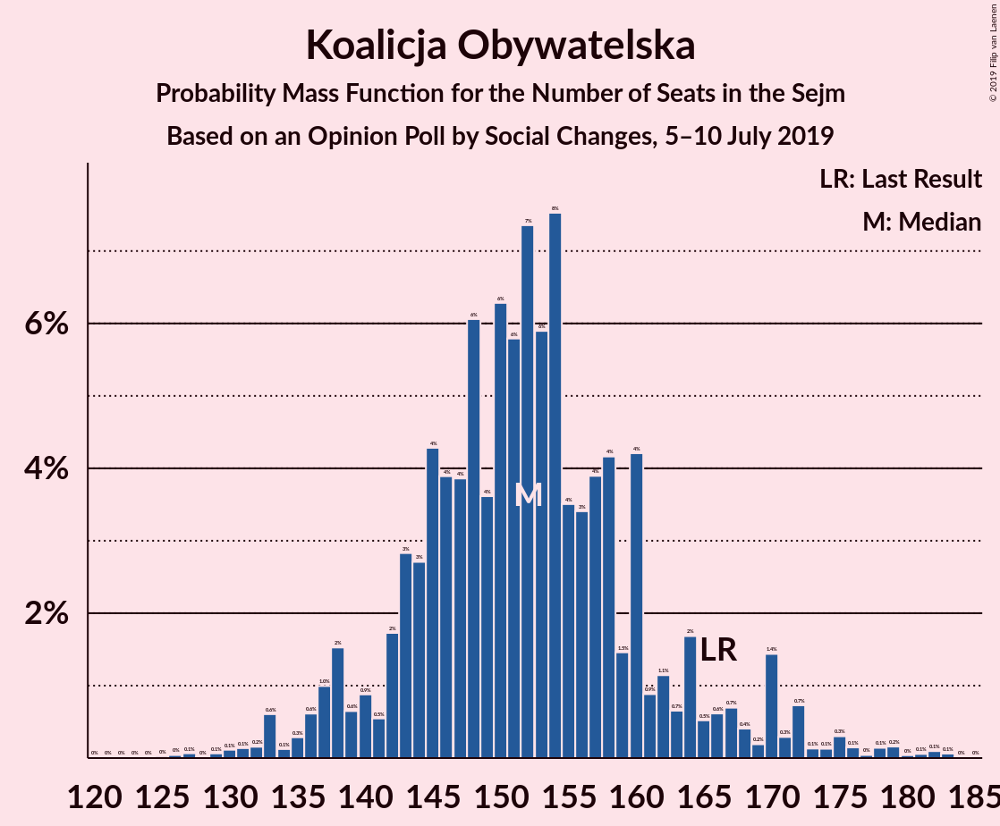

| Number of Seats | Probability | Accumulated | Special Marks |
|:---------------:|:-----------:|:-----------:|:-------------:|
| 123 | 0% | 100% |  |
| 124 | 0% | 99.9% |  |
| 125 | 0% | 99.9% |  |
| 126 | 0% | 99.9% |  |
| 127 | 0.1% | 99.9% |  |
| 128 | 0.1% | 99.8% |  |
| 129 | 0.1% | 99.7% |  |
| 130 | 0.1% | 99.6% |  |
| 131 | 0.1% | 99.5% |  |
| 132 | 0.2% | 99.4% |  |
| 133 | 0.3% | 99.2% |  |
| 134 | 0.3% | 98.9% |  |
| 135 | 0.4% | 98.6% |  |
| 136 | 0.5% | 98% |  |
| 137 | 0.7% | 98% |  |
| 138 | 1.0% | 97% |  |
| 139 | 1.4% | 96% |  |
| 140 | 1.4% | 95% |  |
| 141 | 1.3% | 93% |  |
| 142 | 2% | 92% |  |
| 143 | 4% | 90% |  |
| 144 | 2% | 87% |  |
| 145 | 4% | 85% |  |
| 146 | 4% | 81% |  |
| 147 | 4% | 77% |  |
| 148 | 5% | 73% |  |
| 149 | 5% | 68% |  |
| 150 | 7% | 63% |  |
| 151 | 6% | 56% | Median |
| 152 | 7% | 50% |  |
| 153 | 7% | 43% |  |
| 154 | 4% | 36% |  |
| 155 | 4% | 31% |  |
| 156 | 4% | 27% |  |
| 157 | 4% | 24% |  |
| 158 | 3% | 20% |  |
| 159 | 2% | 17% |  |
| 160 | 2% | 15% |  |
| 161 | 1.3% | 13% |  |
| 162 | 2% | 11% |  |
| 163 | 1.1% | 10% |  |
| 164 | 1.5% | 8% |  |
| 165 | 0.9% | 7% |  |
| 166 | 1.0% | 6% | Last Result |
| 167 | 1.0% | 5% |  |
| 168 | 0.5% | 4% |  |
| 169 | 0.6% | 4% |  |
| 170 | 0.6% | 3% |  |
| 171 | 0.4% | 2% |  |
| 172 | 0.4% | 2% |  |
| 173 | 0.3% | 2% |  |
| 174 | 0.2% | 1.2% |  |
| 175 | 0.2% | 1.0% |  |
| 176 | 0.1% | 0.8% |  |
| 177 | 0.2% | 0.6% |  |
| 178 | 0.1% | 0.5% |  |
| 179 | 0.1% | 0.4% |  |
| 180 | 0.1% | 0.3% |  |
| 181 | 0.1% | 0.2% |  |
| 182 | 0.1% | 0.1% |  |
| 183 | 0% | 0.1% |  |
| 184 | 0% | 0.1% |  |
| 185 | 0% | 0% |  |

### Wiosna

*For a full overview of the results for this party, see the [Wiosna](party-wiosna.html) page.*

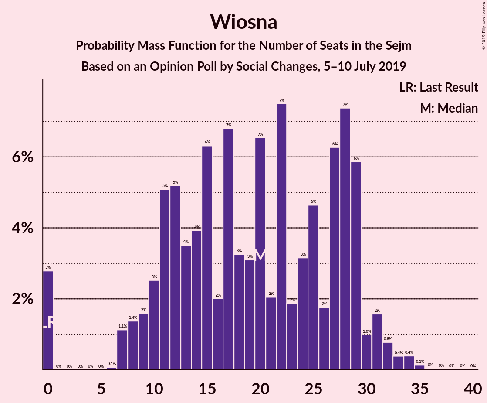

| Number of Seats | Probability | Accumulated | Special Marks |
|:---------------:|:-----------:|:-----------:|:-------------:|
| 0 | 3% | 100% | Last Result |
| 1 | 0% | 97% |  |
| 2 | 0% | 97% |  |
| 3 | 0% | 97% |  |
| 4 | 0% | 97% |  |
| 5 | 0% | 97% |  |
| 6 | 0.1% | 97% |  |
| 7 | 1.4% | 97% |  |
| 8 | 2% | 95% |  |
| 9 | 2% | 93% |  |
| 10 | 3% | 91% |  |
| 11 | 6% | 88% |  |
| 12 | 6% | 82% |  |
| 13 | 3% | 76% |  |
| 14 | 5% | 73% |  |
| 15 | 4% | 68% |  |
| 16 | 3% | 64% |  |
| 17 | 5% | 61% |  |
| 18 | 5% | 56% |  |
| 19 | 3% | 51% | Median |
| 20 | 4% | 48% |  |
| 21 | 2% | 44% |  |
| 22 | 3% | 42% |  |
| 23 | 3% | 39% |  |
| 24 | 3% | 35% |  |
| 25 | 4% | 32% |  |
| 26 | 3% | 28% |  |
| 27 | 5% | 25% |  |
| 28 | 9% | 20% |  |
| 29 | 5% | 11% |  |
| 30 | 2% | 6% |  |
| 31 | 2% | 4% |  |
| 32 | 0.9% | 2% |  |
| 33 | 0.5% | 1.2% |  |
| 34 | 0.4% | 0.7% |  |
| 35 | 0.1% | 0.2% |  |
| 36 | 0% | 0.1% |  |
| 37 | 0% | 0.1% |  |
| 38 | 0% | 0% |  |

### Sojusz Lewicy Demokratycznej

*For a full overview of the results for this party, see the [Sojusz Lewicy Demokratycznej](party-sojuszlewicydemokratycznej.html) page.*

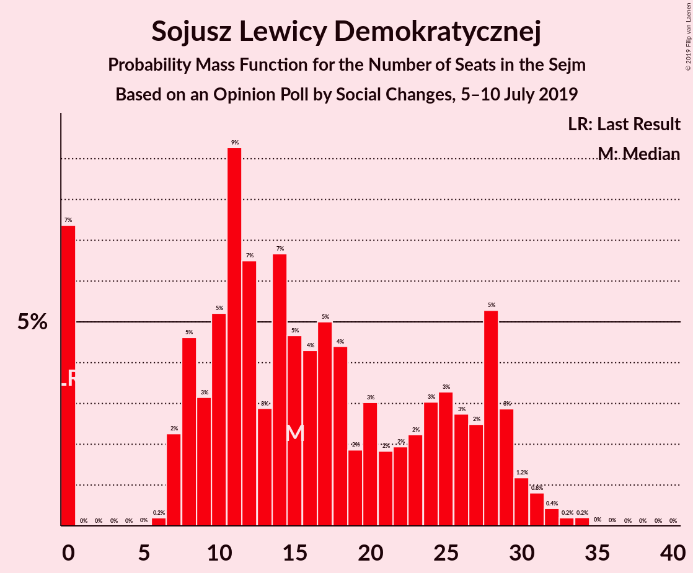

| Number of Seats | Probability | Accumulated | Special Marks |
|:---------------:|:-----------:|:-----------:|:-------------:|
| 0 | 7% | 100% | Last Result |
| 1 | 0% | 93% |  |
| 2 | 0% | 93% |  |
| 3 | 0% | 93% |  |
| 4 | 0% | 93% |  |
| 5 | 0% | 93% |  |
| 6 | 0.2% | 93% |  |
| 7 | 2% | 92% |  |
| 8 | 5% | 90% |  |
| 9 | 3% | 86% |  |
| 10 | 5% | 82% |  |
| 11 | 9% | 77% |  |
| 12 | 7% | 68% |  |
| 13 | 3% | 61% |  |
| 14 | 7% | 59% |  |
| 15 | 5% | 52% | Median |
| 16 | 4% | 47% |  |
| 17 | 5% | 43% |  |
| 18 | 4% | 38% |  |
| 19 | 2% | 33% |  |
| 20 | 3% | 32% |  |
| 21 | 2% | 29% |  |
| 22 | 2% | 27% |  |
| 23 | 2% | 25% |  |
| 24 | 3% | 23% |  |
| 25 | 3% | 20% |  |
| 26 | 3% | 16% |  |
| 27 | 2% | 14% |  |
| 28 | 5% | 11% |  |
| 29 | 3% | 6% |  |
| 30 | 1.2% | 3% |  |
| 31 | 0.8% | 2% |  |
| 32 | 0.4% | 0.9% |  |
| 33 | 0.2% | 0.5% |  |
| 34 | 0.2% | 0.3% |  |
| 35 | 0% | 0.1% |  |
| 36 | 0% | 0% |  |

### Polskie Stronnictwo Ludowe

*For a full overview of the results for this party, see the [Polskie Stronnictwo Ludowe](party-polskiestronnictwoludowe.html) page.*

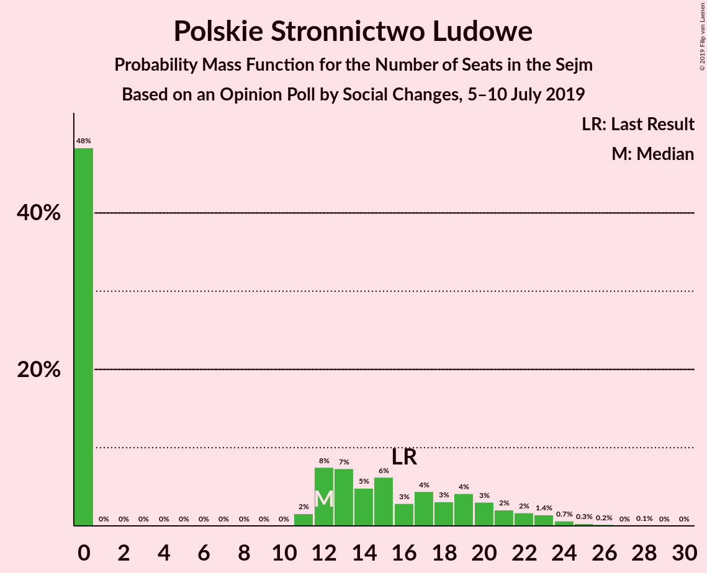

| Number of Seats | Probability | Accumulated | Special Marks |
|:---------------:|:-----------:|:-----------:|:-------------:|
| 0 | 48% | 100% |  |
| 1 | 0% | 52% |  |
| 2 | 0% | 52% |  |
| 3 | 0% | 52% |  |
| 4 | 0% | 52% |  |
| 5 | 0% | 52% |  |
| 6 | 0% | 52% |  |
| 7 | 0% | 52% |  |
| 8 | 0% | 52% |  |
| 9 | 0% | 52% |  |
| 10 | 0% | 52% |  |
| 11 | 2% | 52% |  |
| 12 | 8% | 50% | Median |
| 13 | 7% | 43% |  |
| 14 | 5% | 35% |  |
| 15 | 6% | 30% |  |
| 16 | 3% | 24% | Last Result |
| 17 | 4% | 21% |  |
| 18 | 3% | 17% |  |
| 19 | 4% | 14% |  |
| 20 | 3% | 10% |  |
| 21 | 2% | 6% |  |
| 22 | 2% | 4% |  |
| 23 | 1.4% | 3% |  |
| 24 | 0.7% | 1.3% |  |
| 25 | 0.3% | 0.7% |  |
| 26 | 0.2% | 0.3% |  |
| 27 | 0% | 0.1% |  |
| 28 | 0.1% | 0.1% |  |
| 29 | 0% | 0% |  |

### Kukiz’15

*For a full overview of the results for this party, see the [Kukiz’15](party-kukiz’15.html) page.*

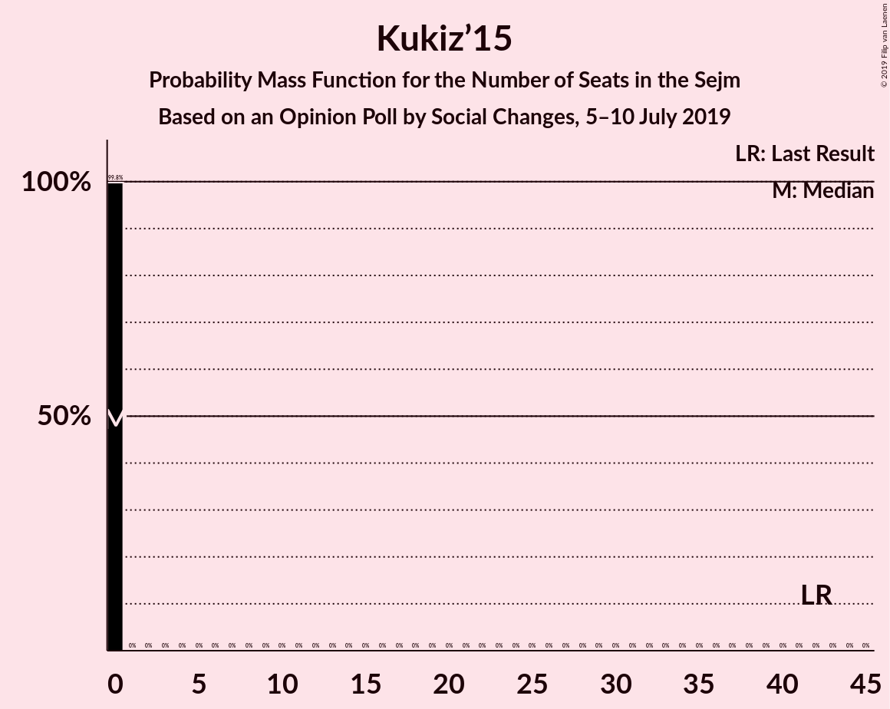

| Number of Seats | Probability | Accumulated | Special Marks |
|:---------------:|:-----------:|:-----------:|:-------------:|
| 0 | 99.8% | 100% | Median |
| 1 | 0% | 0.2% |  |
| 2 | 0% | 0.2% |  |
| 3 | 0% | 0.2% |  |
| 4 | 0% | 0.2% |  |
| 5 | 0% | 0.2% |  |
| 6 | 0% | 0.2% |  |
| 7 | 0% | 0.1% |  |
| 8 | 0% | 0.1% |  |
| 9 | 0% | 0.1% |  |
| 10 | 0% | 0% |  |
| 11 | 0% | 0% |  |
| 12 | 0% | 0% |  |
| 13 | 0% | 0% |  |
| 14 | 0% | 0% |  |
| 15 | 0% | 0% |  |
| 16 | 0% | 0% |  |
| 17 | 0% | 0% |  |
| 18 | 0% | 0% |  |
| 19 | 0% | 0% |  |
| 20 | 0% | 0% |  |
| 21 | 0% | 0% |  |
| 22 | 0% | 0% |  |
| 23 | 0% | 0% |  |
| 24 | 0% | 0% |  |
| 25 | 0% | 0% |  |
| 26 | 0% | 0% |  |
| 27 | 0% | 0% |  |
| 28 | 0% | 0% |  |
| 29 | 0% | 0% |  |
| 30 | 0% | 0% |  |
| 31 | 0% | 0% |  |
| 32 | 0% | 0% |  |
| 33 | 0% | 0% |  |
| 34 | 0% | 0% |  |
| 35 | 0% | 0% |  |
| 36 | 0% | 0% |  |
| 37 | 0% | 0% |  |
| 38 | 0% | 0% |  |
| 39 | 0% | 0% |  |
| 40 | 0% | 0% |  |
| 41 | 0% | 0% |  |
| 42 | 0% | 0% | Last Result |

## Coalitions

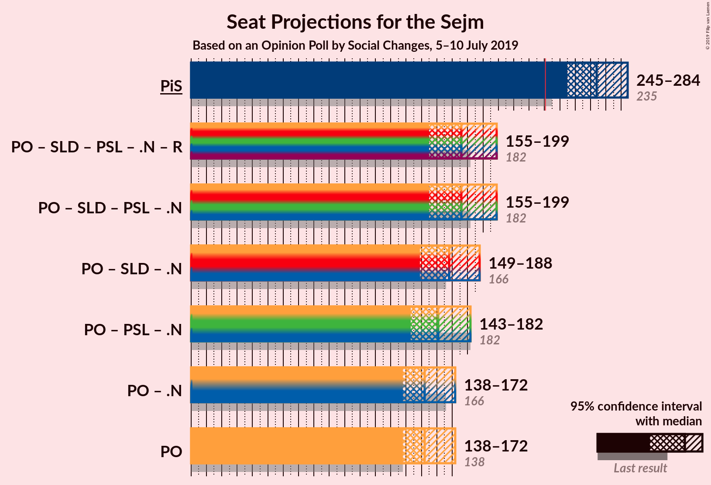

### Confidence Intervals

| Coalition | Last Result | Median | Majority? | 80% Confidence Interval | 90% Confidence Interval | 95% Confidence Interval | 99% Confidence Interval |
|:---------:|:-----------:|:------:|:---------:|:-----------------------:|:-----------------------:|:-----------------------:|:-----------------------:|
| Prawo i Sprawiedliwość | 235 | 265 | 100% | 251–278 | 248–282 | 245–285 | 239–292 |
| Koalicja Obywatelska – Sojusz Lewicy Demokratycznej – Polskie Stronnictwo Ludowe | 182 | 176 | 0% | 161–190 | 158–195 | 155–199 | 148–206 |
| Koalicja Obywatelska – Sojusz Lewicy Demokratycznej | 166 | 168 | 0% | 155–181 | 152–184 | 149–187 | 143–194 |
| Koalicja Obywatelska – Polskie Stronnictwo Ludowe | 182 | 160 | 0% | 147–173 | 144–177 | 142–182 | 137–189 |
| Koalicja Obywatelska | 166 | 151 | 0% | 143–162 | 139–167 | 137–170 | 130–177 |

### Prawo i Sprawiedliwość

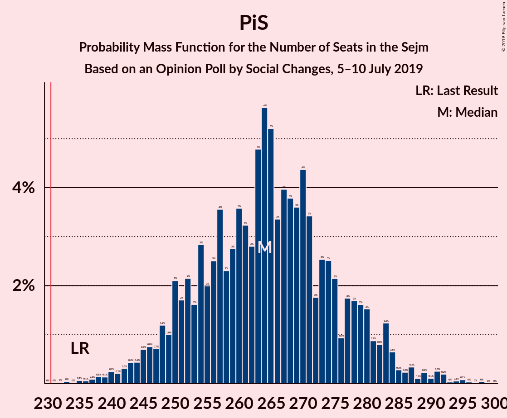

| Number of Seats | Probability | Accumulated | Special Marks |
|:---------------:|:-----------:|:-----------:|:-------------:|
| 231 | 0% | 100% | Majority |
| 232 | 0% | 99.9% |  |
| 233 | 0% | 99.9% |  |
| 234 | 0% | 99.9% |  |
| 235 | 0.1% | 99.9% | Last Result |
| 236 | 0.1% | 99.8% |  |
| 237 | 0.1% | 99.7% |  |
| 238 | 0.1% | 99.7% |  |
| 239 | 0.1% | 99.5% |  |
| 240 | 0.2% | 99.4% |  |
| 241 | 0.3% | 99.3% |  |
| 242 | 0.3% | 99.0% |  |
| 243 | 0.5% | 98.7% |  |
| 244 | 0.4% | 98% |  |
| 245 | 0.9% | 98% |  |
| 246 | 0.7% | 97% |  |
| 247 | 1.0% | 96% |  |
| 248 | 1.3% | 95% |  |
| 249 | 2% | 94% |  |
| 250 | 1.2% | 92% |  |
| 251 | 2% | 91% |  |
| 252 | 2% | 89% |  |
| 253 | 2% | 87% |  |
| 254 | 2% | 85% |  |
| 255 | 2% | 83% |  |
| 256 | 2% | 81% |  |
| 257 | 2% | 79% |  |
| 258 | 2% | 76% |  |
| 259 | 3% | 74% |  |
| 260 | 4% | 71% |  |
| 261 | 4% | 68% |  |
| 262 | 4% | 64% |  |
| 263 | 3% | 60% |  |
| 264 | 4% | 56% |  |
| 265 | 5% | 52% | Median |
| 266 | 4% | 48% |  |
| 267 | 4% | 43% |  |
| 268 | 4% | 39% |  |
| 269 | 3% | 36% |  |
| 270 | 4% | 32% |  |
| 271 | 4% | 28% |  |
| 272 | 3% | 25% |  |
| 273 | 2% | 22% |  |
| 274 | 3% | 20% |  |
| 275 | 2% | 16% |  |
| 276 | 2% | 15% |  |
| 277 | 2% | 13% |  |
| 278 | 2% | 11% |  |
| 279 | 1.3% | 9% |  |
| 280 | 1.4% | 8% |  |
| 281 | 0.8% | 6% |  |
| 282 | 1.1% | 6% |  |
| 283 | 0.8% | 4% |  |
| 284 | 0.9% | 4% |  |
| 285 | 0.7% | 3% |  |
| 286 | 0.5% | 2% |  |
| 287 | 0.3% | 2% |  |
| 288 | 0.2% | 1.4% |  |
| 289 | 0.2% | 1.1% |  |
| 290 | 0.2% | 1.0% |  |
| 291 | 0.2% | 0.8% |  |
| 292 | 0.1% | 0.6% |  |
| 293 | 0.1% | 0.5% |  |
| 294 | 0.1% | 0.4% |  |
| 295 | 0.1% | 0.3% |  |
| 296 | 0.1% | 0.2% |  |
| 297 | 0% | 0.1% |  |
| 298 | 0% | 0.1% |  |
| 299 | 0% | 0.1% |  |
| 300 | 0% | 0% |  |

### Koalicja Obywatelska – Sojusz Lewicy Demokratycznej – Polskie Stronnictwo Ludowe

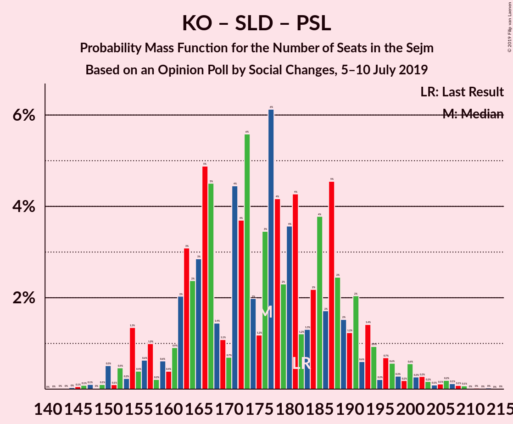

| Number of Seats | Probability | Accumulated | Special Marks |
|:---------------:|:-----------:|:-----------:|:-------------:|
| 143 | 0% | 100% |  |
| 144 | 0% | 99.9% |  |
| 145 | 0.1% | 99.9% |  |
| 146 | 0.1% | 99.8% |  |
| 147 | 0.2% | 99.8% |  |
| 148 | 0.1% | 99.6% |  |
| 149 | 0.1% | 99.5% |  |
| 150 | 0.3% | 99.4% |  |
| 151 | 0.2% | 99.1% |  |
| 152 | 0.3% | 98.9% |  |
| 153 | 0.3% | 98.6% |  |
| 154 | 0.7% | 98% |  |
| 155 | 0.5% | 98% |  |
| 156 | 0.7% | 97% |  |
| 157 | 0.9% | 96% |  |
| 158 | 0.9% | 95% |  |
| 159 | 1.4% | 94% |  |
| 160 | 2% | 93% |  |
| 161 | 1.5% | 91% |  |
| 162 | 1.2% | 90% |  |
| 163 | 2% | 89% |  |
| 164 | 2% | 87% |  |
| 165 | 2% | 84% |  |
| 166 | 2% | 82% |  |
| 167 | 3% | 80% |  |
| 168 | 2% | 77% |  |
| 169 | 2% | 74% |  |
| 170 | 3% | 72% |  |
| 171 | 4% | 69% |  |
| 172 | 3% | 65% |  |
| 173 | 4% | 62% |  |
| 174 | 3% | 58% |  |
| 175 | 2% | 55% |  |
| 176 | 3% | 53% |  |
| 177 | 4% | 50% |  |
| 178 | 4% | 45% | Median |
| 179 | 3% | 42% |  |
| 180 | 4% | 38% |  |
| 181 | 4% | 35% |  |
| 182 | 4% | 31% | Last Result |
| 183 | 3% | 28% |  |
| 184 | 2% | 25% |  |
| 185 | 3% | 23% |  |
| 186 | 3% | 20% |  |
| 187 | 2% | 17% |  |
| 188 | 2% | 15% |  |
| 189 | 2% | 13% |  |
| 190 | 1.4% | 11% |  |
| 191 | 1.5% | 10% |  |
| 192 | 1.2% | 8% |  |
| 193 | 0.9% | 7% |  |
| 194 | 0.9% | 6% |  |
| 195 | 0.8% | 5% |  |
| 196 | 0.7% | 4% |  |
| 197 | 0.5% | 4% |  |
| 198 | 0.5% | 3% |  |
| 199 | 0.6% | 3% |  |
| 200 | 0.4% | 2% |  |
| 201 | 0.3% | 2% |  |
| 202 | 0.2% | 1.2% |  |
| 203 | 0.2% | 1.0% |  |
| 204 | 0.2% | 0.8% |  |
| 205 | 0.1% | 0.6% |  |
| 206 | 0.1% | 0.5% |  |
| 207 | 0.1% | 0.4% |  |
| 208 | 0.1% | 0.3% |  |
| 209 | 0.1% | 0.3% |  |
| 210 | 0% | 0.2% |  |
| 211 | 0% | 0.2% |  |
| 212 | 0% | 0.1% |  |
| 213 | 0% | 0.1% |  |
| 214 | 0% | 0.1% |  |
| 215 | 0% | 0% |  |

### Koalicja Obywatelska – Sojusz Lewicy Demokratycznej

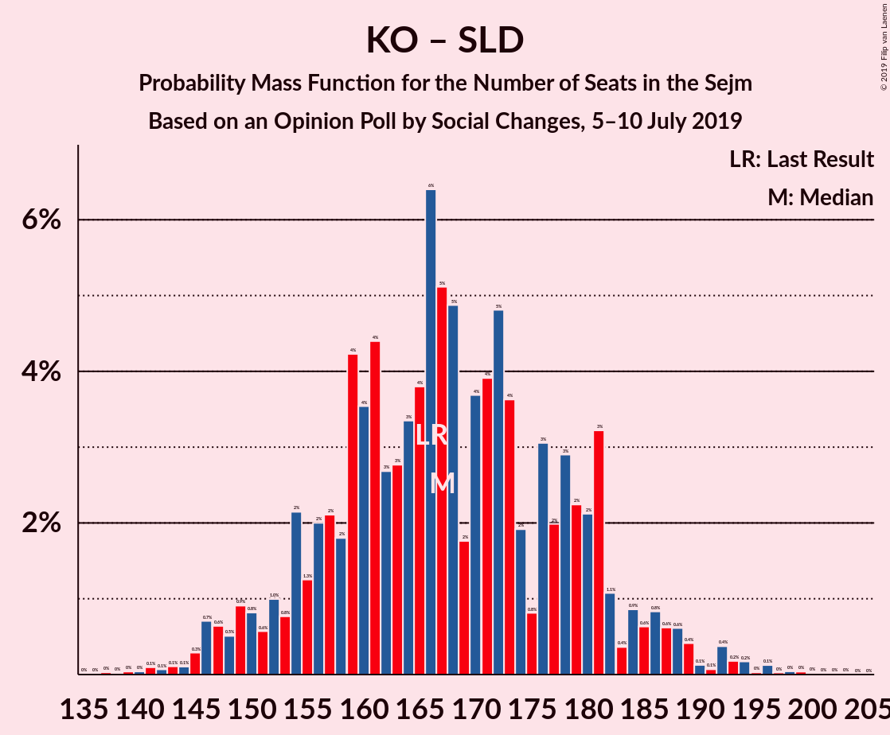

| Number of Seats | Probability | Accumulated | Special Marks |
|:---------------:|:-----------:|:-----------:|:-------------:|
| 136 | 0% | 100% |  |
| 137 | 0% | 99.9% |  |
| 138 | 0.1% | 99.9% |  |
| 139 | 0.1% | 99.9% |  |
| 140 | 0.1% | 99.8% |  |
| 141 | 0.1% | 99.7% |  |
| 142 | 0.1% | 99.7% |  |
| 143 | 0.2% | 99.5% |  |
| 144 | 0.2% | 99.4% |  |
| 145 | 0.3% | 99.2% |  |
| 146 | 0.4% | 98.9% |  |
| 147 | 0.5% | 98.6% |  |
| 148 | 0.4% | 98% |  |
| 149 | 0.6% | 98% |  |
| 150 | 0.8% | 97% |  |
| 151 | 0.9% | 96% |  |
| 152 | 1.0% | 95% |  |
| 153 | 1.3% | 94% |  |
| 154 | 2% | 93% |  |
| 155 | 2% | 91% |  |
| 156 | 2% | 90% |  |
| 157 | 2% | 88% |  |
| 158 | 2% | 86% |  |
| 159 | 3% | 83% |  |
| 160 | 3% | 80% |  |
| 161 | 4% | 77% |  |
| 162 | 2% | 72% |  |
| 163 | 3% | 70% |  |
| 164 | 4% | 67% |  |
| 165 | 4% | 63% |  |
| 166 | 4% | 59% | Last Result, Median |
| 167 | 4% | 54% |  |
| 168 | 5% | 50% |  |
| 169 | 3% | 45% |  |
| 170 | 4% | 42% |  |
| 171 | 4% | 38% |  |
| 172 | 4% | 34% |  |
| 173 | 3% | 30% |  |
| 174 | 3% | 27% |  |
| 175 | 2% | 24% |  |
| 176 | 3% | 22% |  |
| 177 | 3% | 19% |  |
| 178 | 2% | 17% |  |
| 179 | 2% | 14% |  |
| 180 | 2% | 12% |  |
| 181 | 2% | 10% |  |
| 182 | 1.1% | 9% |  |
| 183 | 2% | 8% |  |
| 184 | 1.2% | 6% |  |
| 185 | 0.9% | 5% |  |
| 186 | 0.9% | 4% |  |
| 187 | 0.5% | 3% |  |
| 188 | 0.6% | 2% |  |
| 189 | 0.4% | 2% |  |
| 190 | 0.2% | 1.5% |  |
| 191 | 0.2% | 1.3% |  |
| 192 | 0.3% | 1.0% |  |
| 193 | 0.2% | 0.7% |  |
| 194 | 0.1% | 0.6% |  |
| 195 | 0.1% | 0.5% |  |
| 196 | 0.1% | 0.4% |  |
| 197 | 0.1% | 0.3% |  |
| 198 | 0.1% | 0.2% |  |
| 199 | 0% | 0.2% |  |
| 200 | 0% | 0.1% |  |
| 201 | 0% | 0.1% |  |
| 202 | 0% | 0.1% |  |
| 203 | 0% | 0% |  |

### Koalicja Obywatelska – Polskie Stronnictwo Ludowe

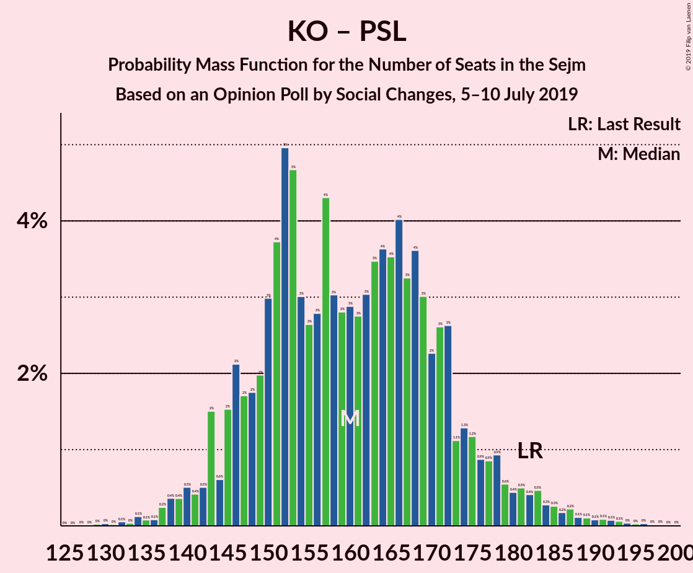

| Number of Seats | Probability | Accumulated | Special Marks |
|:---------------:|:-----------:|:-----------:|:-------------:|
| 129 | 0% | 100% |  |
| 130 | 0% | 99.9% |  |
| 131 | 0% | 99.9% |  |
| 132 | 0.1% | 99.9% |  |
| 133 | 0% | 99.8% |  |
| 134 | 0.1% | 99.8% |  |
| 135 | 0.1% | 99.7% |  |
| 136 | 0.1% | 99.6% |  |
| 137 | 0.2% | 99.5% |  |
| 138 | 0.4% | 99.3% |  |
| 139 | 0.4% | 98.9% |  |
| 140 | 0.5% | 98.5% |  |
| 141 | 0.4% | 98% |  |
| 142 | 0.5% | 98% |  |
| 143 | 2% | 97% |  |
| 144 | 0.6% | 96% |  |
| 145 | 2% | 95% |  |
| 146 | 2% | 93% |  |
| 147 | 2% | 91% |  |
| 148 | 2% | 90% |  |
| 149 | 2% | 88% |  |
| 150 | 3% | 86% |  |
| 151 | 4% | 83% |  |
| 152 | 5% | 79% |  |
| 153 | 5% | 74% |  |
| 154 | 3% | 70% |  |
| 155 | 3% | 67% |  |
| 156 | 3% | 64% |  |
| 157 | 4% | 61% |  |
| 158 | 3% | 57% |  |
| 159 | 3% | 54% |  |
| 160 | 3% | 51% |  |
| 161 | 3% | 48% |  |
| 162 | 3% | 45% |  |
| 163 | 3% | 42% | Median |
| 164 | 4% | 39% |  |
| 165 | 4% | 35% |  |
| 166 | 4% | 32% |  |
| 167 | 3% | 28% |  |
| 168 | 4% | 24% |  |
| 169 | 3% | 21% |  |
| 170 | 2% | 18% |  |
| 171 | 3% | 15% |  |
| 172 | 3% | 13% |  |
| 173 | 1.1% | 10% |  |
| 174 | 1.3% | 9% |  |
| 175 | 1.2% | 8% |  |
| 176 | 0.9% | 7% |  |
| 177 | 0.9% | 6% |  |
| 178 | 0.9% | 5% |  |
| 179 | 0.6% | 4% |  |
| 180 | 0.4% | 3% |  |
| 181 | 0.5% | 3% |  |
| 182 | 0.4% | 3% | Last Result |
| 183 | 0.5% | 2% |  |
| 184 | 0.3% | 2% |  |
| 185 | 0.3% | 1.3% |  |
| 186 | 0.2% | 1.1% |  |
| 187 | 0.2% | 0.9% |  |
| 188 | 0.1% | 0.7% |  |
| 189 | 0.1% | 0.6% |  |
| 190 | 0.1% | 0.5% |  |
| 191 | 0.1% | 0.4% |  |
| 192 | 0.1% | 0.3% |  |
| 193 | 0.1% | 0.2% |  |
| 194 | 0% | 0.2% |  |
| 195 | 0% | 0.1% |  |
| 196 | 0% | 0.1% |  |
| 197 | 0% | 0.1% |  |
| 198 | 0% | 0.1% |  |
| 199 | 0% | 0% |  |

### Koalicja Obywatelska

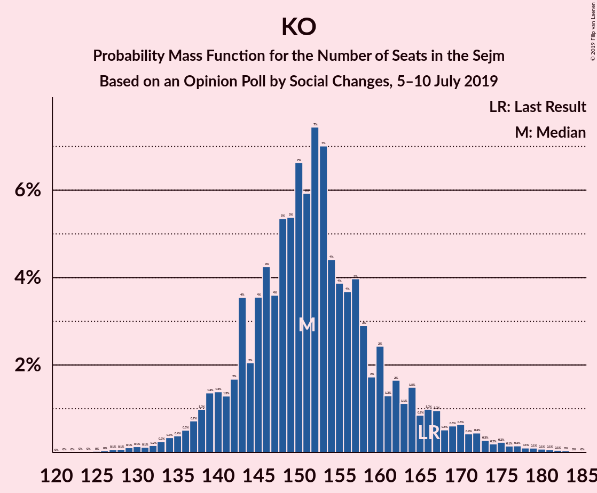

| Number of Seats | Probability | Accumulated | Special Marks |
|:---------------:|:-----------:|:-----------:|:-------------:|
| 123 | 0% | 100% |  |
| 124 | 0% | 99.9% |  |
| 125 | 0% | 99.9% |  |
| 126 | 0% | 99.9% |  |
| 127 | 0.1% | 99.9% |  |
| 128 | 0.1% | 99.8% |  |
| 129 | 0.1% | 99.7% |  |
| 130 | 0.1% | 99.6% |  |
| 131 | 0.1% | 99.5% |  |
| 132 | 0.2% | 99.4% |  |
| 133 | 0.3% | 99.2% |  |
| 134 | 0.3% | 98.9% |  |
| 135 | 0.4% | 98.6% |  |
| 136 | 0.5% | 98% |  |
| 137 | 0.7% | 98% |  |
| 138 | 1.0% | 97% |  |
| 139 | 1.4% | 96% |  |
| 140 | 1.4% | 95% |  |
| 141 | 1.3% | 93% |  |
| 142 | 2% | 92% |  |
| 143 | 4% | 90% |  |
| 144 | 2% | 87% |  |
| 145 | 4% | 85% |  |
| 146 | 4% | 81% |  |
| 147 | 4% | 77% |  |
| 148 | 5% | 73% |  |
| 149 | 5% | 68% |  |
| 150 | 7% | 63% |  |
| 151 | 6% | 56% | Median |
| 152 | 7% | 50% |  |
| 153 | 7% | 43% |  |
| 154 | 4% | 36% |  |
| 155 | 4% | 31% |  |
| 156 | 4% | 27% |  |
| 157 | 4% | 24% |  |
| 158 | 3% | 20% |  |
| 159 | 2% | 17% |  |
| 160 | 2% | 15% |  |
| 161 | 1.3% | 13% |  |
| 162 | 2% | 11% |  |
| 163 | 1.1% | 10% |  |
| 164 | 1.5% | 8% |  |
| 165 | 0.9% | 7% |  |
| 166 | 1.0% | 6% | Last Result |
| 167 | 1.0% | 5% |  |
| 168 | 0.5% | 4% |  |
| 169 | 0.6% | 4% |  |
| 170 | 0.6% | 3% |  |
| 171 | 0.4% | 2% |  |
| 172 | 0.4% | 2% |  |
| 173 | 0.3% | 2% |  |
| 174 | 0.2% | 1.2% |  |
| 175 | 0.2% | 1.0% |  |
| 176 | 0.1% | 0.8% |  |
| 177 | 0.2% | 0.6% |  |
| 178 | 0.1% | 0.5% |  |
| 179 | 0.1% | 0.4% |  |
| 180 | 0.1% | 0.3% |  |
| 181 | 0.1% | 0.2% |  |
| 182 | 0.1% | 0.1% |  |
| 183 | 0% | 0.1% |  |
| 184 | 0% | 0.1% |  |
| 185 | 0% | 0% |  |

## Technical Information

### Opinion Poll

+ **Polling firm:** Social Changes
+ **Commissioner(s):** —
+ **Fieldwork period:** 5–10 July 2019

### Calculations

+ **Sample size:** 1022
+ **Simulations done:** 1,048,576
+ **Error estimate:** 0.73%

