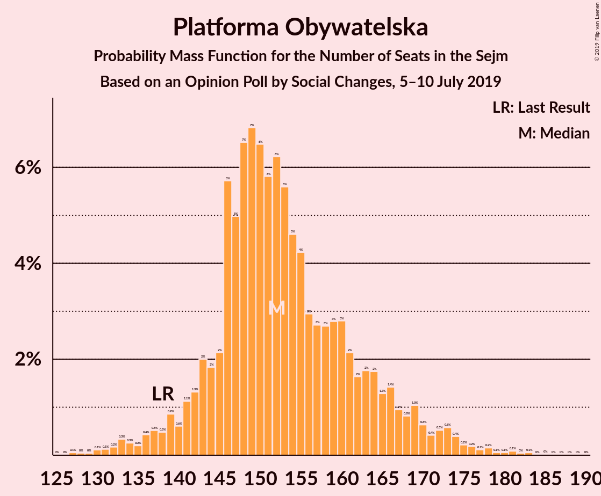
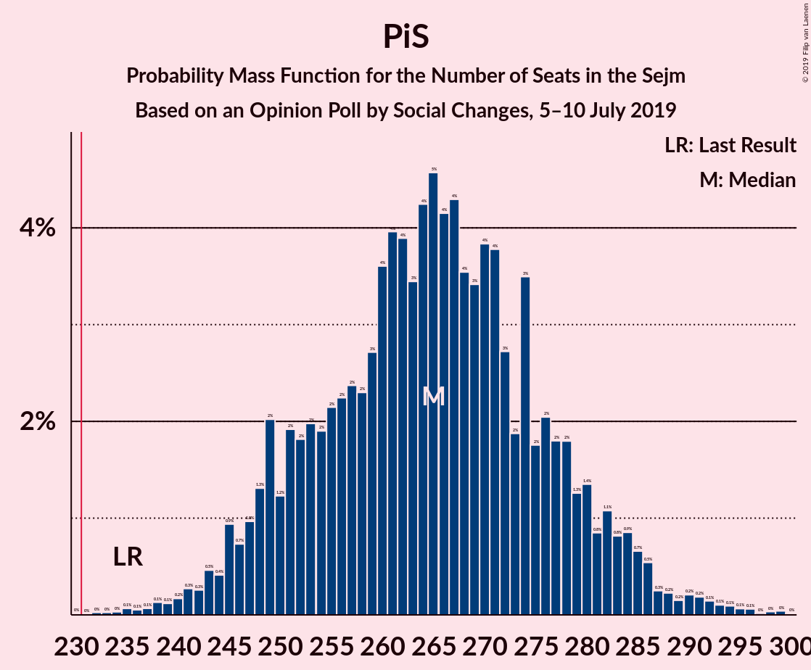

# Opinion Poll by Social Changes, 5–10 July 2019

<a href="#voting-intentions">Voting Intentions</a> | <a href="#seats">Seats</a> | <a href="#coalitions">Coalitions</a> | <a href="#technical-information">Technical Information</a>

## Voting Intentions

### Confidence Intervals

| Party | Last Result | Poll Result | 80% Confidence Interval | 90% Confidence Interval | 95% Confidence Interval | 99% Confidence Interval |
|:-----:|:-----------:|:-----------:|:-----------------------:|:-----------------------:|:-----------------------:|:-----------------------:|
| Prawo i Sprawiedliwość | 37.6% | 45.3% | 43.3–47.3% |42.8–47.9% |42.3–48.4% |41.3–49.3% |
| Platforma Obywatelska | 24.1% | 27.8% | 26.0–29.6% |25.5–30.2% |25.1–30.6% |24.3–31.5% |
| Wiosna | 0.0% | 6.3% | 5.4–7.3% |5.1–7.7% |4.9–7.9% |4.5–8.5% |
| Sojusz Lewicy Demokratycznej | 7.6% | 6.0% | 5.1–7.0% |4.9–7.3% |4.7–7.6% |4.3–8.1% |
| Polskie Stronnictwo Ludowe | 5.1% | 5.0% | 4.2–6.0% |4.0–6.3% |3.8–6.5% |3.5–7.0% |
| Kukiz’15 | 8.8% | 3.1% | 2.5–3.9% |2.4–4.2% |2.2–4.4% |2.0–4.8% |

*Note:* The poll result column reflects the actual value used in the calculations. Published results may vary slightly, and in addition be rounded to fewer digits.

## Seats

### Confidence Intervals

| Party | Last Result | Median | 80% Confidence Interval | 90% Confidence Interval | 95% Confidence Interval | 99% Confidence Interval |
|:-----:|:-----------:|:------:|:-----------------------:|:-----------------------:|:-----------------------:|:-----------------------:|
| <a href="#prawo-i-sprawiedliwość">Prawo i Sprawiedliwość</a> | 235 | 271 | 245–277 |245–277 |245–277 |238–277 |
| <a href="#platforma-obywatelska">Platforma Obywatelska</a> | 138 | 154 | 151–156 |151–156 |151–163 |151–164 |
| <a href="#wiosna">Wiosna</a> | 0 | 22 | 16–28 |16–28 |16–28 |8–28 |
| <a href="#sojusz-lewicy-demokratycznej">Sojusz Lewicy Demokratycznej</a> | 0 | 13 | 11–20 |11–20 |11–20 |11–20 |
| <a href="#polskie-stronnictwo-ludowe">Polskie Stronnictwo Ludowe</a> | 16 | 0 | 0–16 |0–16 |0–16 |0–16 |
| <a href="#kukiz’15">Kukiz’15</a> | 42 | 0 | 0 |0 |0 |0 |

### Prawo i Sprawiedliwość

*For a full overview of the results for this party, see the [Prawo i Sprawiedliwość](party-prawoisprawiedliwość.html) page.*

| Number of Seats | Probability | Accumulated | Special Marks |
|:---------------:|:-----------:|:-----------:|:-------------:|
| 235 | 0% | 100% | Last Result |
| 236 | 0.1% | 100% |  |
| 237 | 0% | 99.9% |  |
| 238 | 2% | 99.9% |  |
| 239 | 0% | 98% |  |
| 240 | 0% | 98% |  |
| 241 | 0.3% | 98% |  |
| 242 | 0% | 98% |  |
| 243 | 0% | 98% |  |
| 244 | 0% | 98% |  |
| 245 | 11% | 98% |  |
| 246 | 0% | 86% |  |
| 247 | 0% | 86% |  |
| 248 | 7% | 86% |  |
| 249 | 0% | 79% |  |
| 250 | 0.1% | 79% |  |
| 251 | 0% | 79% |  |
| 252 | 0% | 79% |  |
| 253 | 0% | 79% |  |
| 254 | 0% | 79% |  |
| 255 | 0% | 79% |  |
| 256 | 0% | 79% |  |
| 257 | 0% | 79% |  |
| 258 | 0% | 79% |  |
| 259 | 0% | 79% |  |
| 260 | 0% | 79% |  |
| 261 | 0% | 79% |  |
| 262 | 0% | 79% |  |
| 263 | 0% | 79% |  |
| 264 | 0.5% | 79% |  |
| 265 | 0% | 78% |  |
| 266 | 0% | 78% |  |
| 267 | 0% | 78% |  |
| 268 | 1.0% | 78% |  |
| 269 | 0% | 78% |  |
| 270 | 0% | 77% |  |
| 271 | 64% | 77% | Median |
| 272 | 0% | 14% |  |
| 273 | 0% | 14% |  |
| 274 | 0% | 14% |  |
| 275 | 0% | 14% |  |
| 276 | 0% | 14% |  |
| 277 | 13% | 14% |  |
| 278 | 0.1% | 0.5% |  |
| 279 | 0% | 0.4% |  |
| 280 | 0% | 0.4% |  |
| 281 | 0% | 0.4% |  |
| 282 | 0% | 0.4% |  |
| 283 | 0% | 0.4% |  |
| 284 | 0% | 0.4% |  |
| 285 | 0% | 0.4% |  |
| 286 | 0% | 0.4% |  |
| 287 | 0% | 0.4% |  |
| 288 | 0% | 0.4% |  |
| 289 | 0% | 0.4% |  |
| 290 | 0% | 0.4% |  |
| 291 | 0% | 0.4% |  |
| 292 | 0.2% | 0.4% |  |
| 293 | 0% | 0.1% |  |
| 294 | 0% | 0.1% |  |
| 295 | 0% | 0.1% |  |
| 296 | 0% | 0.1% |  |
| 297 | 0% | 0.1% |  |
| 298 | 0% | 0.1% |  |
| 299 | 0% | 0.1% |  |
| 300 | 0% | 0.1% |  |
| 301 | 0.1% | 0.1% |  |
| 302 | 0% | 0% |  |

### Platforma Obywatelska

*For a full overview of the results for this party, see the [Platforma Obywatelska](party-platformaobywatelska.html) page.*

| Number of Seats | Probability | Accumulated | Special Marks |
|:---------------:|:-----------:|:-----------:|:-------------:|
| 131 | 0% | 100% |  |
| 132 | 0% | 99.9% |  |
| 133 | 0% | 99.9% |  |
| 134 | 0% | 99.9% |  |
| 135 | 0% | 99.9% |  |
| 136 | 0% | 99.9% |  |
| 137 | 0% | 99.9% |  |
| 138 | 0% | 99.9% | Last Result |
| 139 | 0% | 99.9% |  |
| 140 | 0% | 99.9% |  |
| 141 | 0% | 99.9% |  |
| 142 | 0% | 99.9% |  |
| 143 | 0% | 99.9% |  |
| 144 | 0% | 99.9% |  |
| 145 | 0% | 99.9% |  |
| 146 | 0% | 99.9% |  |
| 147 | 0% | 99.9% |  |
| 148 | 0% | 99.9% |  |
| 149 | 0% | 99.9% |  |
| 150 | 0% | 99.9% |  |
| 151 | 11% | 99.9% |  |
| 152 | 8% | 88% |  |
| 153 | 0% | 81% |  |
| 154 | 64% | 80% | Median |
| 155 | 0% | 17% |  |
| 156 | 13% | 17% |  |
| 157 | 0% | 3% |  |
| 158 | 0.1% | 3% |  |
| 159 | 0.3% | 3% |  |
| 160 | 0% | 3% |  |
| 161 | 0% | 3% |  |
| 162 | 0% | 3% |  |
| 163 | 0.6% | 3% |  |
| 164 | 2% | 2% |  |
| 165 | 0% | 0.5% |  |
| 166 | 0% | 0.4% |  |
| 167 | 0.2% | 0.4% |  |
| 168 | 0% | 0.3% |  |
| 169 | 0% | 0.3% |  |
| 170 | 0.3% | 0.3% |  |
| 171 | 0% | 0% |  |

### Wiosna

*For a full overview of the results for this party, see the [Wiosna](party-wiosna.html) page.*

| Number of Seats | Probability | Accumulated | Special Marks |
|:---------------:|:-----------:|:-----------:|:-------------:|
| 0 | 0.3% | 100% | Last Result |
| 1 | 0% | 99.7% |  |
| 2 | 0% | 99.7% |  |
| 3 | 0% | 99.7% |  |
| 4 | 0% | 99.7% |  |
| 5 | 0% | 99.7% |  |
| 6 | 0% | 99.7% |  |
| 7 | 0% | 99.7% |  |
| 8 | 0.5% | 99.7% |  |
| 9 | 0.2% | 99.1% |  |
| 10 | 0% | 98.9% |  |
| 11 | 0% | 98.9% |  |
| 12 | 0% | 98.9% |  |
| 13 | 0% | 98.9% |  |
| 14 | 0.1% | 98.9% |  |
| 15 | 0% | 98.8% |  |
| 16 | 13% | 98.8% |  |
| 17 | 0% | 85% |  |
| 18 | 0% | 85% |  |
| 19 | 0% | 85% |  |
| 20 | 0% | 85% |  |
| 21 | 0% | 85% |  |
| 22 | 64% | 85% | Median |
| 23 | 0% | 21% |  |
| 24 | 0% | 21% |  |
| 25 | 0% | 21% |  |
| 26 | 0.8% | 21% |  |
| 27 | 2% | 21% |  |
| 28 | 19% | 19% |  |
| 29 | 0% | 0.1% |  |
| 30 | 0% | 0% |  |

### Sojusz Lewicy Demokratycznej

*For a full overview of the results for this party, see the [Sojusz Lewicy Demokratycznej](party-sojuszlewicydemokratycznej.html) page.*

| Number of Seats | Probability | Accumulated | Special Marks |
|:---------------:|:-----------:|:-----------:|:-------------:|
| 0 | 0.3% | 100% | Last Result |
| 1 | 0% | 99.7% |  |
| 2 | 0% | 99.7% |  |
| 3 | 0% | 99.7% |  |
| 4 | 0% | 99.7% |  |
| 5 | 0% | 99.7% |  |
| 6 | 0% | 99.7% |  |
| 7 | 0% | 99.7% |  |
| 8 | 0% | 99.7% |  |
| 9 | 0% | 99.6% |  |
| 10 | 0.1% | 99.6% |  |
| 11 | 14% | 99.6% |  |
| 12 | 0.3% | 86% |  |
| 13 | 64% | 85% | Median |
| 14 | 0.8% | 22% |  |
| 15 | 0.1% | 21% |  |
| 16 | 2% | 21% |  |
| 17 | 0.1% | 19% |  |
| 18 | 7% | 19% |  |
| 19 | 0% | 12% |  |
| 20 | 11% | 12% |  |
| 21 | 0% | 0.1% |  |
| 22 | 0% | 0.1% |  |
| 23 | 0% | 0.1% |  |
| 24 | 0% | 0.1% |  |
| 25 | 0% | 0.1% |  |
| 26 | 0% | 0.1% |  |
| 27 | 0% | 0.1% |  |
| 28 | 0% | 0.1% |  |
| 29 | 0% | 0.1% |  |
| 30 | 0% | 0.1% |  |
| 31 | 0% | 0% |  |

### Polskie Stronnictwo Ludowe

*For a full overview of the results for this party, see the [Polskie Stronnictwo Ludowe](party-polskiestronnictwoludowe.html) page.*

| Number of Seats | Probability | Accumulated | Special Marks |
|:---------------:|:-----------:|:-----------:|:-------------:|
| 0 | 78% | 100% | Median |
| 1 | 0% | 22% |  |
| 2 | 0% | 22% |  |
| 3 | 0% | 22% |  |
| 4 | 0% | 22% |  |
| 5 | 0% | 22% |  |
| 6 | 0% | 22% |  |
| 7 | 0% | 22% |  |
| 8 | 0% | 22% |  |
| 9 | 0% | 22% |  |
| 10 | 0% | 22% |  |
| 11 | 0% | 22% |  |
| 12 | 0% | 22% |  |
| 13 | 0.1% | 22% |  |
| 14 | 8% | 22% |  |
| 15 | 2% | 14% |  |
| 16 | 11% | 12% | Last Result |
| 17 | 0% | 0.1% |  |
| 18 | 0% | 0.1% |  |
| 19 | 0% | 0.1% |  |
| 20 | 0% | 0% |  |

### Kukiz’15

*For a full overview of the results for this party, see the [Kukiz’15](party-kukiz’15.html) page.*

| Number of Seats | Probability | Accumulated | Special Marks |
|:---------------:|:-----------:|:-----------:|:-------------:|
| 0 | 100% | 100% | Median |
| 1 | 0% | 0% |  |
| 2 | 0% | 0% |  |
| 3 | 0% | 0% |  |
| 4 | 0% | 0% |  |
| 5 | 0% | 0% |  |
| 6 | 0% | 0% |  |
| 7 | 0% | 0% |  |
| 8 | 0% | 0% |  |
| 9 | 0% | 0% |  |
| 10 | 0% | 0% |  |
| 11 | 0% | 0% |  |
| 12 | 0% | 0% |  |
| 13 | 0% | 0% |  |
| 14 | 0% | 0% |  |
| 15 | 0% | 0% |  |
| 16 | 0% | 0% |  |
| 17 | 0% | 0% |  |
| 18 | 0% | 0% |  |
| 19 | 0% | 0% |  |
| 20 | 0% | 0% |  |
| 21 | 0% | 0% |  |
| 22 | 0% | 0% |  |
| 23 | 0% | 0% |  |
| 24 | 0% | 0% |  |
| 25 | 0% | 0% |  |
| 26 | 0% | 0% |  |
| 27 | 0% | 0% |  |
| 28 | 0% | 0% |  |
| 29 | 0% | 0% |  |
| 30 | 0% | 0% |  |
| 31 | 0% | 0% |  |
| 32 | 0% | 0% |  |
| 33 | 0% | 0% |  |
| 34 | 0% | 0% |  |
| 35 | 0% | 0% |  |
| 36 | 0% | 0% |  |
| 37 | 0% | 0% |  |
| 38 | 0% | 0% |  |
| 39 | 0% | 0% |  |
| 40 | 0% | 0% |  |
| 41 | 0% | 0% |  |
| 42 | 0% | 0% | Last Result |

## Coalitions

### Confidence Intervals

| Coalition | Last Result | Median | Majority? | 80% Confidence Interval | 90% Confidence Interval | 95% Confidence Interval | 99% Confidence Interval |
|:---------:|:-----------:|:------:|:---------:|:-----------------------:|:-----------------------:|:-----------------------:|:-----------------------:|
| Prawo i Sprawiedliwość | 235 | 271 | 100% | 245–277 | 245–277 | 245–277 | 238–277 |
| Platforma Obywatelska | 138 | 154 | 0% | 151–156 | 151–156 | 151–163 | 151–164 |

### Prawo i Sprawiedliwość

| Number of Seats | Probability | Accumulated | Special Marks |
|:---------------:|:-----------:|:-----------:|:-------------:|
| 235 | 0% | 100% | Last Result |
| 236 | 0.1% | 100% |  |
| 237 | 0% | 99.9% |  |
| 238 | 2% | 99.9% |  |
| 239 | 0% | 98% |  |
| 240 | 0% | 98% |  |
| 241 | 0.3% | 98% |  |
| 242 | 0% | 98% |  |
| 243 | 0% | 98% |  |
| 244 | 0% | 98% |  |
| 245 | 11% | 98% |  |
| 246 | 0% | 86% |  |
| 247 | 0% | 86% |  |
| 248 | 7% | 86% |  |
| 249 | 0% | 79% |  |
| 250 | 0.1% | 79% |  |
| 251 | 0% | 79% |  |
| 252 | 0% | 79% |  |
| 253 | 0% | 79% |  |
| 254 | 0% | 79% |  |
| 255 | 0% | 79% |  |
| 256 | 0% | 79% |  |
| 257 | 0% | 79% |  |
| 258 | 0% | 79% |  |
| 259 | 0% | 79% |  |
| 260 | 0% | 79% |  |
| 261 | 0% | 79% |  |
| 262 | 0% | 79% |  |
| 263 | 0% | 79% |  |
| 264 | 0.5% | 79% |  |
| 265 | 0% | 78% |  |
| 266 | 0% | 78% |  |
| 267 | 0% | 78% |  |
| 268 | 1.0% | 78% |  |
| 269 | 0% | 78% |  |
| 270 | 0% | 77% |  |
| 271 | 64% | 77% | Median |
| 272 | 0% | 14% |  |
| 273 | 0% | 14% |  |
| 274 | 0% | 14% |  |
| 275 | 0% | 14% |  |
| 276 | 0% | 14% |  |
| 277 | 13% | 14% |  |
| 278 | 0.1% | 0.5% |  |
| 279 | 0% | 0.4% |  |
| 280 | 0% | 0.4% |  |
| 281 | 0% | 0.4% |  |
| 282 | 0% | 0.4% |  |
| 283 | 0% | 0.4% |  |
| 284 | 0% | 0.4% |  |
| 285 | 0% | 0.4% |  |
| 286 | 0% | 0.4% |  |
| 287 | 0% | 0.4% |  |
| 288 | 0% | 0.4% |  |
| 289 | 0% | 0.4% |  |
| 290 | 0% | 0.4% |  |
| 291 | 0% | 0.4% |  |
| 292 | 0.2% | 0.4% |  |
| 293 | 0% | 0.1% |  |
| 294 | 0% | 0.1% |  |
| 295 | 0% | 0.1% |  |
| 296 | 0% | 0.1% |  |
| 297 | 0% | 0.1% |  |
| 298 | 0% | 0.1% |  |
| 299 | 0% | 0.1% |  |
| 300 | 0% | 0.1% |  |
| 301 | 0.1% | 0.1% |  |
| 302 | 0% | 0% |  |

### Platforma Obywatelska

| Number of Seats | Probability | Accumulated | Special Marks |
|:---------------:|:-----------:|:-----------:|:-------------:|
| 131 | 0% | 100% |  |
| 132 | 0% | 99.9% |  |
| 133 | 0% | 99.9% |  |
| 134 | 0% | 99.9% |  |
| 135 | 0% | 99.9% |  |
| 136 | 0% | 99.9% |  |
| 137 | 0% | 99.9% |  |
| 138 | 0% | 99.9% | Last Result |
| 139 | 0% | 99.9% |  |
| 140 | 0% | 99.9% |  |
| 141 | 0% | 99.9% |  |
| 142 | 0% | 99.9% |  |
| 143 | 0% | 99.9% |  |
| 144 | 0% | 99.9% |  |
| 145 | 0% | 99.9% |  |
| 146 | 0% | 99.9% |  |
| 147 | 0% | 99.9% |  |
| 148 | 0% | 99.9% |  |
| 149 | 0% | 99.9% |  |
| 150 | 0% | 99.9% |  |
| 151 | 11% | 99.9% |  |
| 152 | 8% | 88% |  |
| 153 | 0% | 81% |  |
| 154 | 64% | 80% | Median |
| 155 | 0% | 17% |  |
| 156 | 13% | 17% |  |
| 157 | 0% | 3% |  |
| 158 | 0.1% | 3% |  |
| 159 | 0.3% | 3% |  |
| 160 | 0% | 3% |  |
| 161 | 0% | 3% |  |
| 162 | 0% | 3% |  |
| 163 | 0.6% | 3% |  |
| 164 | 2% | 2% |  |
| 165 | 0% | 0.5% |  |
| 166 | 0% | 0.4% |  |
| 167 | 0.2% | 0.4% |  |
| 168 | 0% | 0.3% |  |
| 169 | 0% | 0.3% |  |
| 170 | 0.3% | 0.3% |  |
| 171 | 0% | 0% |  |

## Technical Information

### Opinion Poll

+ **Polling firm:** Social Changes
+ **Commissioner(s):** —
+ **Fieldwork period:** 5–10 July 2019

### Calculations

+ **Sample size:** 1022
+ **Simulations done:** 1,024
+ **Error estimate:** 2.99%

