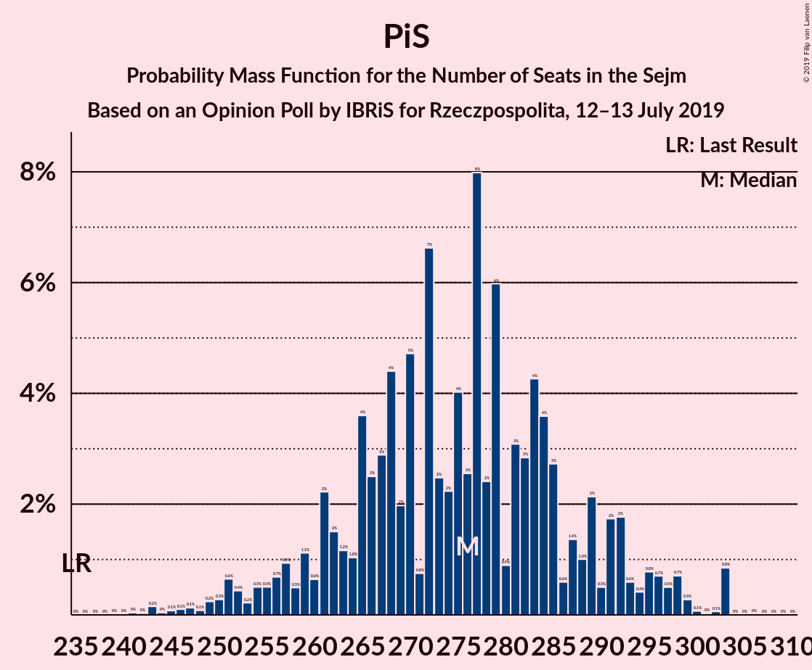
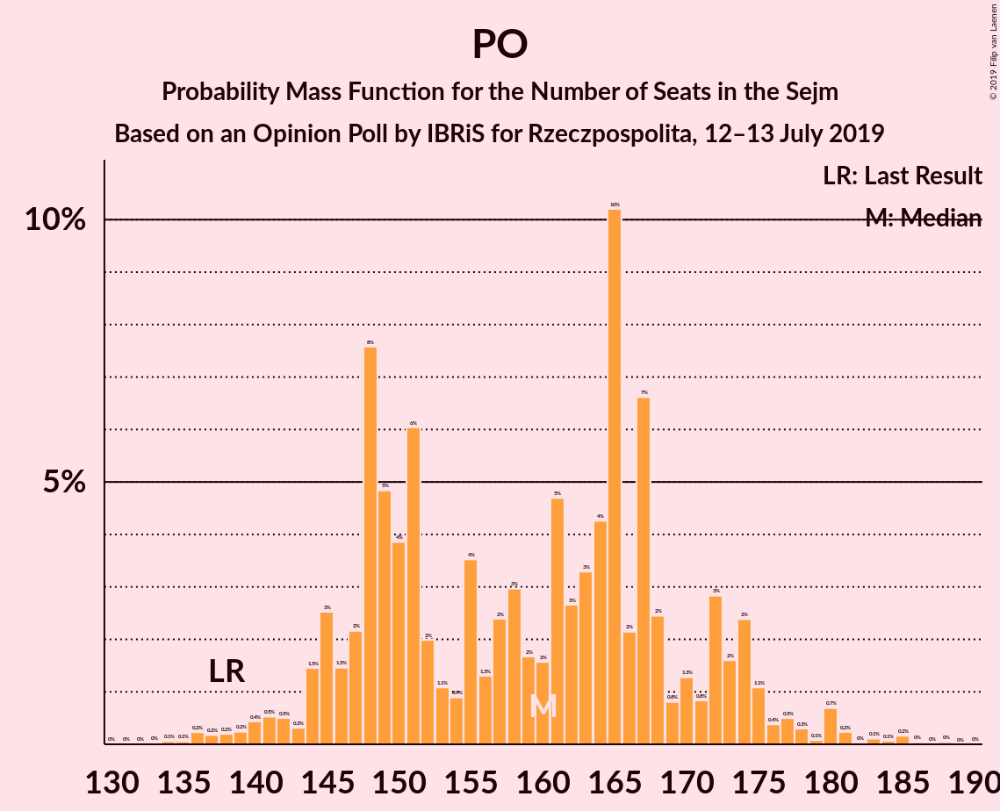

# Opinion Poll by IBRiS for Rzeczpospolita, 12–13 July 2019

<a href="#voting-intentions">Voting Intentions</a> | <a href="#seats">Seats</a> | <a href="#coalitions">Coalitions</a> | <a href="#technical-information">Technical Information</a>

## Voting Intentions

### Confidence Intervals

| Party | Last Result | Poll Result | 80% Confidence Interval | 90% Confidence Interval | 95% Confidence Interval | 99% Confidence Interval |
|:-----:|:-----------:|:-----------:|:-----------------------:|:-----------------------:|:-----------------------:|:-----------------------:|
| Prawo i Sprawiedliwość | 37.6% | 43.0% | 41.1–44.9% |40.6–45.5% |40.1–46.0% |39.2–46.9% |
| Platforma Obywatelska | 24.1% | 26.1% | 24.4–27.8% |24.0–28.3% |23.6–28.8% |22.8–29.6% |
| Sojusz Lewicy Demokratycznej | 7.6% | 5.9% | 5.1–6.9% |4.8–7.2% |4.7–7.5% |4.3–8.0% |
| Polskie Stronnictwo Ludowe | 5.1% | 4.4% | 3.7–5.3% |3.5–5.5% |3.3–5.7% |3.0–6.2% |
| Wiosna | 0.0% | 4.2% | 3.5–5.1% |3.3–5.3% |3.1–5.5% |2.9–6.0% |
| KORWiN | 4.8% | 3.7% | 3.1–4.6% |2.9–4.8% |2.8–5.0% |2.5–5.5% |
| Kukiz’15 | 8.8% | 3.1% | 2.5–3.9% |2.3–4.1% |2.2–4.3% |2.0–4.7% |
| Lewica Razem | 3.6% | 1.4% | 1.0–1.9% |0.9–2.1% |0.8–2.2% |0.7–2.5% |
| .Nowoczesna | 7.6% | 0.5% | 0.3–0.9% |0.2–1.0% |0.2–1.1% |0.1–1.3% |

*Note:* The poll result column reflects the actual value used in the calculations. Published results may vary slightly, and in addition be rounded to fewer digits.

## Seats

### Confidence Intervals

| Party | Last Result | Median | 80% Confidence Interval | 90% Confidence Interval | 95% Confidence Interval | 99% Confidence Interval |
|:-----:|:-----------:|:------:|:-----------------------:|:-----------------------:|:-----------------------:|:-----------------------:|
| <a href="#prawo-i-sprawiedliwość">Prawo i Sprawiedliwość</a> | 235 | 275 | 261–292 |257–293 |256–295 |248–301 |
| <a href="#platforma-obywatelska">Platforma Obywatelska</a> | 138 | 160 | 147–172 |145–174 |142–176 |137–181 |
| <a href="#sojusz-lewicy-demokratycznej">Sojusz Lewicy Demokratycznej</a> | 0 | 22 | 10–28 |0–29 |0–31 |0–35 |
| <a href="#polskie-stronnictwo-ludowe">Polskie Stronnictwo Ludowe</a> | 16 | 0 | 0–17 |0–21 |0–22 |0–23 |
| <a href="#wiosna">Wiosna</a> | 0 | 0 | 0–11 |0–12 |0–14 |0–27 |
| <a href="#korwin">KORWiN</a> | 0 | 0 | 0 |0 |0 |0–13 |
| <a href="#kukiz’15">Kukiz’15</a> | 42 | 0 | 0 |0 |0 |0 |
| <a href="#lewica-razem">Lewica Razem</a> | 0 | 0 | 0 |0 |0 |0 |
| <a href="#.nowoczesna">.Nowoczesna</a> | 28 | 0 | 0 |0 |0 |0 |

### Prawo i Sprawiedliwość

*For a full overview of the results for this party, see the [Prawo i Sprawiedliwość](party-prawoisprawiedliwość.html) page.*

| Number of Seats | Probability | Accumulated | Special Marks |
|:---------------:|:-----------:|:-----------:|:-------------:|
| 235 | 0% | 100% | Last Result |
| 236 | 0% | 100% |  |
| 237 | 0% | 100% |  |
| 238 | 0% | 100% |  |
| 239 | 0% | 100% |  |
| 240 | 0% | 100% |  |
| 241 | 0% | 100% |  |
| 242 | 0% | 99.9% |  |
| 243 | 0% | 99.9% |  |
| 244 | 0% | 99.9% |  |
| 245 | 0.1% | 99.9% |  |
| 246 | 0% | 99.8% |  |
| 247 | 0.1% | 99.7% |  |
| 248 | 0.3% | 99.7% |  |
| 249 | 0.1% | 99.4% |  |
| 250 | 0.3% | 99.3% |  |
| 251 | 0.3% | 99.1% |  |
| 252 | 0.3% | 98.8% |  |
| 253 | 0.2% | 98.6% |  |
| 254 | 0.3% | 98% |  |
| 255 | 0.4% | 98% |  |
| 256 | 0.3% | 98% |  |
| 257 | 5% | 97% |  |
| 258 | 0.6% | 93% |  |
| 259 | 0.7% | 92% |  |
| 260 | 0.4% | 91% |  |
| 261 | 2% | 91% |  |
| 262 | 2% | 89% |  |
| 263 | 2% | 88% |  |
| 264 | 2% | 85% |  |
| 265 | 1.3% | 84% |  |
| 266 | 2% | 83% |  |
| 267 | 5% | 81% |  |
| 268 | 4% | 76% |  |
| 269 | 1.2% | 72% |  |
| 270 | 3% | 71% |  |
| 271 | 4% | 68% |  |
| 272 | 3% | 64% |  |
| 273 | 4% | 61% |  |
| 274 | 2% | 57% |  |
| 275 | 6% | 55% | Median |
| 276 | 2% | 49% |  |
| 277 | 2% | 47% |  |
| 278 | 7% | 45% |  |
| 279 | 1.2% | 38% |  |
| 280 | 2% | 37% |  |
| 281 | 6% | 35% |  |
| 282 | 3% | 30% |  |
| 283 | 3% | 27% |  |
| 284 | 4% | 23% |  |
| 285 | 1.5% | 20% |  |
| 286 | 2% | 18% |  |
| 287 | 1.1% | 16% |  |
| 288 | 2% | 15% |  |
| 289 | 2% | 13% |  |
| 290 | 0.4% | 11% |  |
| 291 | 0.3% | 10% |  |
| 292 | 4% | 10% |  |
| 293 | 2% | 6% |  |
| 294 | 0.9% | 5% |  |
| 295 | 1.4% | 4% |  |
| 296 | 0.5% | 2% |  |
| 297 | 0% | 2% |  |
| 298 | 0.5% | 2% |  |
| 299 | 0.1% | 1.2% |  |
| 300 | 0.1% | 1.1% |  |
| 301 | 0.6% | 0.9% |  |
| 302 | 0% | 0.3% |  |
| 303 | 0.2% | 0.3% |  |
| 304 | 0% | 0.1% |  |
| 305 | 0% | 0.1% |  |
| 306 | 0% | 0.1% |  |
| 307 | 0% | 0.1% |  |
| 308 | 0% | 0.1% |  |
| 309 | 0% | 0.1% |  |
| 310 | 0% | 0.1% |  |
| 311 | 0% | 0.1% |  |
| 312 | 0% | 0.1% |  |
| 313 | 0% | 0% |  |

### Platforma Obywatelska

*For a full overview of the results for this party, see the [Platforma Obywatelska](party-platformaobywatelska.html) page.*

| Number of Seats | Probability | Accumulated | Special Marks |
|:---------------:|:-----------:|:-----------:|:-------------:|
| 132 | 0% | 100% |  |
| 133 | 0% | 99.9% |  |
| 134 | 0.1% | 99.9% |  |
| 135 | 0.1% | 99.9% |  |
| 136 | 0.2% | 99.8% |  |
| 137 | 0.2% | 99.6% |  |
| 138 | 0.2% | 99.4% | Last Result |
| 139 | 0.2% | 99.2% |  |
| 140 | 0.4% | 99.0% |  |
| 141 | 0.5% | 98.5% |  |
| 142 | 0.5% | 98% |  |
| 143 | 0.3% | 97% |  |
| 144 | 1.5% | 97% |  |
| 145 | 3% | 96% |  |
| 146 | 1.5% | 93% |  |
| 147 | 2% | 92% |  |
| 148 | 8% | 90% |  |
| 149 | 5% | 82% |  |
| 150 | 4% | 77% |  |
| 151 | 6% | 73% |  |
| 152 | 2% | 67% |  |
| 153 | 1.1% | 65% |  |
| 154 | 0.9% | 64% |  |
| 155 | 4% | 63% |  |
| 156 | 1.3% | 60% |  |
| 157 | 2% | 58% |  |
| 158 | 3% | 56% |  |
| 159 | 2% | 53% |  |
| 160 | 2% | 51% | Median |
| 161 | 5% | 50% |  |
| 162 | 3% | 45% |  |
| 163 | 3% | 42% |  |
| 164 | 4% | 39% |  |
| 165 | 10% | 35% |  |
| 166 | 2% | 25% |  |
| 167 | 7% | 23% |  |
| 168 | 2% | 16% |  |
| 169 | 0.8% | 14% |  |
| 170 | 1.3% | 13% |  |
| 171 | 0.8% | 11% |  |
| 172 | 3% | 11% |  |
| 173 | 2% | 8% |  |
| 174 | 2% | 6% |  |
| 175 | 1.1% | 4% |  |
| 176 | 0.4% | 3% |  |
| 177 | 0.5% | 2% |  |
| 178 | 0.3% | 2% |  |
| 179 | 0.1% | 2% |  |
| 180 | 0.7% | 1.4% |  |
| 181 | 0.2% | 0.7% |  |
| 182 | 0% | 0.5% |  |
| 183 | 0.1% | 0.5% |  |
| 184 | 0.1% | 0.4% |  |
| 185 | 0.2% | 0.3% |  |
| 186 | 0% | 0.1% |  |
| 187 | 0% | 0.1% |  |
| 188 | 0% | 0.1% |  |
| 189 | 0% | 0% |  |

### Sojusz Lewicy Demokratycznej

*For a full overview of the results for this party, see the [Sojusz Lewicy Demokratycznej](party-sojuszlewicydemokratycznej.html) page.*

| Number of Seats | Probability | Accumulated | Special Marks |
|:---------------:|:-----------:|:-----------:|:-------------:|
| 0 | 9% | 100% | Last Result |
| 1 | 0% | 91% |  |
| 2 | 0% | 91% |  |
| 3 | 0% | 91% |  |
| 4 | 0% | 91% |  |
| 5 | 0% | 91% |  |
| 6 | 0% | 91% |  |
| 7 | 0% | 91% |  |
| 8 | 0.1% | 91% |  |
| 9 | 0.1% | 91% |  |
| 10 | 1.1% | 91% |  |
| 11 | 0.5% | 90% |  |
| 12 | 4% | 89% |  |
| 13 | 2% | 86% |  |
| 14 | 2% | 84% |  |
| 15 | 4% | 82% |  |
| 16 | 5% | 79% |  |
| 17 | 7% | 73% |  |
| 18 | 4% | 66% |  |
| 19 | 2% | 62% |  |
| 20 | 4% | 61% |  |
| 21 | 2% | 56% |  |
| 22 | 9% | 55% | Median |
| 23 | 5% | 45% |  |
| 24 | 0.7% | 41% |  |
| 25 | 3% | 40% |  |
| 26 | 6% | 38% |  |
| 27 | 8% | 31% |  |
| 28 | 14% | 23% |  |
| 29 | 6% | 9% |  |
| 30 | 0.6% | 3% |  |
| 31 | 0.8% | 3% |  |
| 32 | 0.8% | 2% |  |
| 33 | 0.2% | 1.2% |  |
| 34 | 0.2% | 1.0% |  |
| 35 | 0.3% | 0.7% |  |
| 36 | 0.2% | 0.4% |  |
| 37 | 0.1% | 0.2% |  |
| 38 | 0% | 0.2% |  |
| 39 | 0% | 0.1% |  |
| 40 | 0.1% | 0.1% |  |
| 41 | 0% | 0% |  |

### Polskie Stronnictwo Ludowe

*For a full overview of the results for this party, see the [Polskie Stronnictwo Ludowe](party-polskiestronnictwoludowe.html) page.*

| Number of Seats | Probability | Accumulated | Special Marks |
|:---------------:|:-----------:|:-----------:|:-------------:|
| 0 | 82% | 100% | Median |
| 1 | 0% | 18% |  |
| 2 | 0% | 18% |  |
| 3 | 0% | 18% |  |
| 4 | 0% | 18% |  |
| 5 | 0% | 18% |  |
| 6 | 0% | 18% |  |
| 7 | 0% | 18% |  |
| 8 | 0% | 18% |  |
| 9 | 0% | 18% |  |
| 10 | 0% | 18% |  |
| 11 | 0% | 18% |  |
| 12 | 0% | 18% |  |
| 13 | 0.2% | 18% |  |
| 14 | 0.2% | 18% |  |
| 15 | 0.5% | 18% |  |
| 16 | 6% | 17% | Last Result |
| 17 | 3% | 11% |  |
| 18 | 2% | 8% |  |
| 19 | 0.5% | 7% |  |
| 20 | 0.7% | 6% |  |
| 21 | 3% | 5% |  |
| 22 | 2% | 3% |  |
| 23 | 0.8% | 1.0% |  |
| 24 | 0.1% | 0.2% |  |
| 25 | 0.1% | 0.1% |  |
| 26 | 0% | 0.1% |  |
| 27 | 0% | 0% |  |

### Wiosna

*For a full overview of the results for this party, see the [Wiosna](party-wiosna.html) page.*

| Number of Seats | Probability | Accumulated | Special Marks |
|:---------------:|:-----------:|:-----------:|:-------------:|
| 0 | 87% | 100% | Last Result, Median |
| 1 | 0% | 13% |  |
| 2 | 0% | 13% |  |
| 3 | 0% | 13% |  |
| 4 | 0% | 13% |  |
| 5 | 0% | 13% |  |
| 6 | 0% | 13% |  |
| 7 | 0% | 13% |  |
| 8 | 0.1% | 13% |  |
| 9 | 0.7% | 13% |  |
| 10 | 0.5% | 13% |  |
| 11 | 7% | 12% |  |
| 12 | 0.8% | 5% |  |
| 13 | 0.6% | 5% |  |
| 14 | 2% | 4% |  |
| 15 | 0.2% | 2% |  |
| 16 | 0.2% | 2% |  |
| 17 | 0.1% | 1.4% |  |
| 18 | 0% | 1.2% |  |
| 19 | 0.1% | 1.2% |  |
| 20 | 0% | 1.1% |  |
| 21 | 0% | 1.0% |  |
| 22 | 0.3% | 1.0% |  |
| 23 | 0% | 0.7% |  |
| 24 | 0% | 0.7% |  |
| 25 | 0.1% | 0.7% |  |
| 26 | 0% | 0.6% |  |
| 27 | 0.5% | 0.6% |  |
| 28 | 0.1% | 0.1% |  |
| 29 | 0% | 0% |  |

### KORWiN

*For a full overview of the results for this party, see the [KORWiN](party-korwin.html) page.*

| Number of Seats | Probability | Accumulated | Special Marks |
|:---------------:|:-----------:|:-----------:|:-------------:|
| 0 | 98% | 100% | Last Result, Median |
| 1 | 0% | 2% |  |
| 2 | 0% | 2% |  |
| 3 | 0% | 2% |  |
| 4 | 0% | 2% |  |
| 5 | 0% | 2% |  |
| 6 | 0.4% | 2% |  |
| 7 | 0.3% | 2% |  |
| 8 | 0.2% | 2% |  |
| 9 | 0.4% | 1.4% |  |
| 10 | 0.2% | 1.0% |  |
| 11 | 0.2% | 0.8% |  |
| 12 | 0.1% | 0.6% |  |
| 13 | 0.1% | 0.5% |  |
| 14 | 0.2% | 0.4% |  |
| 15 | 0% | 0.1% |  |
| 16 | 0.1% | 0.1% |  |
| 17 | 0% | 0.1% |  |
| 18 | 0% | 0% |  |

### Kukiz’15

*For a full overview of the results for this party, see the [Kukiz’15](party-kukiz’15.html) page.*

| Number of Seats | Probability | Accumulated | Special Marks |
|:---------------:|:-----------:|:-----------:|:-------------:|
| 0 | 99.9% | 100% | Median |
| 1 | 0% | 0.1% |  |
| 2 | 0% | 0.1% |  |
| 3 | 0% | 0.1% |  |
| 4 | 0% | 0.1% |  |
| 5 | 0% | 0.1% |  |
| 6 | 0% | 0.1% |  |
| 7 | 0% | 0.1% |  |
| 8 | 0% | 0.1% |  |
| 9 | 0% | 0.1% |  |
| 10 | 0.1% | 0.1% |  |
| 11 | 0% | 0% |  |
| 12 | 0% | 0% |  |
| 13 | 0% | 0% |  |
| 14 | 0% | 0% |  |
| 15 | 0% | 0% |  |
| 16 | 0% | 0% |  |
| 17 | 0% | 0% |  |
| 18 | 0% | 0% |  |
| 19 | 0% | 0% |  |
| 20 | 0% | 0% |  |
| 21 | 0% | 0% |  |
| 22 | 0% | 0% |  |
| 23 | 0% | 0% |  |
| 24 | 0% | 0% |  |
| 25 | 0% | 0% |  |
| 26 | 0% | 0% |  |
| 27 | 0% | 0% |  |
| 28 | 0% | 0% |  |
| 29 | 0% | 0% |  |
| 30 | 0% | 0% |  |
| 31 | 0% | 0% |  |
| 32 | 0% | 0% |  |
| 33 | 0% | 0% |  |
| 34 | 0% | 0% |  |
| 35 | 0% | 0% |  |
| 36 | 0% | 0% |  |
| 37 | 0% | 0% |  |
| 38 | 0% | 0% |  |
| 39 | 0% | 0% |  |
| 40 | 0% | 0% |  |
| 41 | 0% | 0% |  |
| 42 | 0% | 0% | Last Result |

### Lewica Razem

*For a full overview of the results for this party, see the [Lewica Razem](party-lewicarazem.html) page.*

| Number of Seats | Probability | Accumulated | Special Marks |
|:---------------:|:-----------:|:-----------:|:-------------:|
| 0 | 100% | 100% | Last Result, Median |

### .Nowoczesna

*For a full overview of the results for this party, see the [.Nowoczesna](party-nowoczesna.html) page.*

| Number of Seats | Probability | Accumulated | Special Marks |
|:---------------:|:-----------:|:-----------:|:-------------:|
| 0 | 100% | 100% | Median |
| 1 | 0% | 0% |  |
| 2 | 0% | 0% |  |
| 3 | 0% | 0% |  |
| 4 | 0% | 0% |  |
| 5 | 0% | 0% |  |
| 6 | 0% | 0% |  |
| 7 | 0% | 0% |  |
| 8 | 0% | 0% |  |
| 9 | 0% | 0% |  |
| 10 | 0% | 0% |  |
| 11 | 0% | 0% |  |
| 12 | 0% | 0% |  |
| 13 | 0% | 0% |  |
| 14 | 0% | 0% |  |
| 15 | 0% | 0% |  |
| 16 | 0% | 0% |  |
| 17 | 0% | 0% |  |
| 18 | 0% | 0% |  |
| 19 | 0% | 0% |  |
| 20 | 0% | 0% |  |
| 21 | 0% | 0% |  |
| 22 | 0% | 0% |  |
| 23 | 0% | 0% |  |
| 24 | 0% | 0% |  |
| 25 | 0% | 0% |  |
| 26 | 0% | 0% |  |
| 27 | 0% | 0% |  |
| 28 | 0% | 0% | Last Result |

## Coalitions

### Confidence Intervals

| Coalition | Last Result | Median | Majority? | 80% Confidence Interval | 90% Confidence Interval | 95% Confidence Interval | 99% Confidence Interval |
|:---------:|:-----------:|:------:|:---------:|:-----------------------:|:-----------------------:|:-----------------------:|:-----------------------:|
| Prawo i Sprawiedliwość | 235 | 275 | 100% | 261–292 | 257–293 | 256–295 | 248–301 |
| Platforma Obywatelska – Sojusz Lewicy Demokratycznej – Polskie Stronnictwo Ludowe – Lewica Razem – .Nowoczesna | 182 | 182 | 0% | 168–198 | 166–203 | 162–203 | 156–210 |
| Platforma Obywatelska – Sojusz Lewicy Demokratycznej – Polskie Stronnictwo Ludowe – .Nowoczesna | 182 | 182 | 0% | 168–198 | 166–203 | 162–203 | 156–210 |
| Platforma Obywatelska – Sojusz Lewicy Demokratycznej – .Nowoczesna | 166 | 179 | 0% | 167–193 | 164–195 | 160–198 | 152–201 |
| Platforma Obywatelska – Polskie Stronnictwo Ludowe – .Nowoczesna | 182 | 163 | 0% | 148–178 | 146–181 | 145–182 | 141–188 |
| Platforma Obywatelska – .Nowoczesna | 166 | 160 | 0% | 147–172 | 145–174 | 142–176 | 137–181 |
| Platforma Obywatelska | 138 | 160 | 0% | 147–172 | 145–174 | 142–176 | 137–181 |

### Prawo i Sprawiedliwość

| Number of Seats | Probability | Accumulated | Special Marks |
|:---------------:|:-----------:|:-----------:|:-------------:|
| 235 | 0% | 100% | Last Result |
| 236 | 0% | 100% |  |
| 237 | 0% | 100% |  |
| 238 | 0% | 100% |  |
| 239 | 0% | 100% |  |
| 240 | 0% | 100% |  |
| 241 | 0% | 100% |  |
| 242 | 0% | 99.9% |  |
| 243 | 0% | 99.9% |  |
| 244 | 0% | 99.9% |  |
| 245 | 0.1% | 99.9% |  |
| 246 | 0% | 99.8% |  |
| 247 | 0.1% | 99.7% |  |
| 248 | 0.3% | 99.7% |  |
| 249 | 0.1% | 99.4% |  |
| 250 | 0.3% | 99.3% |  |
| 251 | 0.3% | 99.1% |  |
| 252 | 0.3% | 98.8% |  |
| 253 | 0.2% | 98.6% |  |
| 254 | 0.3% | 98% |  |
| 255 | 0.4% | 98% |  |
| 256 | 0.3% | 98% |  |
| 257 | 5% | 97% |  |
| 258 | 0.6% | 93% |  |
| 259 | 0.7% | 92% |  |
| 260 | 0.4% | 91% |  |
| 261 | 2% | 91% |  |
| 262 | 2% | 89% |  |
| 263 | 2% | 88% |  |
| 264 | 2% | 85% |  |
| 265 | 1.3% | 84% |  |
| 266 | 2% | 83% |  |
| 267 | 5% | 81% |  |
| 268 | 4% | 76% |  |
| 269 | 1.2% | 72% |  |
| 270 | 3% | 71% |  |
| 271 | 4% | 68% |  |
| 272 | 3% | 64% |  |
| 273 | 4% | 61% |  |
| 274 | 2% | 57% |  |
| 275 | 6% | 55% | Median |
| 276 | 2% | 49% |  |
| 277 | 2% | 47% |  |
| 278 | 7% | 45% |  |
| 279 | 1.2% | 38% |  |
| 280 | 2% | 37% |  |
| 281 | 6% | 35% |  |
| 282 | 3% | 30% |  |
| 283 | 3% | 27% |  |
| 284 | 4% | 23% |  |
| 285 | 1.5% | 20% |  |
| 286 | 2% | 18% |  |
| 287 | 1.1% | 16% |  |
| 288 | 2% | 15% |  |
| 289 | 2% | 13% |  |
| 290 | 0.4% | 11% |  |
| 291 | 0.3% | 10% |  |
| 292 | 4% | 10% |  |
| 293 | 2% | 6% |  |
| 294 | 0.9% | 5% |  |
| 295 | 1.4% | 4% |  |
| 296 | 0.5% | 2% |  |
| 297 | 0% | 2% |  |
| 298 | 0.5% | 2% |  |
| 299 | 0.1% | 1.2% |  |
| 300 | 0.1% | 1.1% |  |
| 301 | 0.6% | 0.9% |  |
| 302 | 0% | 0.3% |  |
| 303 | 0.2% | 0.3% |  |
| 304 | 0% | 0.1% |  |
| 305 | 0% | 0.1% |  |
| 306 | 0% | 0.1% |  |
| 307 | 0% | 0.1% |  |
| 308 | 0% | 0.1% |  |
| 309 | 0% | 0.1% |  |
| 310 | 0% | 0.1% |  |
| 311 | 0% | 0.1% |  |
| 312 | 0% | 0.1% |  |
| 313 | 0% | 0% |  |

### Platforma Obywatelska – Sojusz Lewicy Demokratycznej – Polskie Stronnictwo Ludowe – Lewica Razem – .Nowoczesna

| Number of Seats | Probability | Accumulated | Special Marks |
|:---------------:|:-----------:|:-----------:|:-------------:|
| 148 | 0.1% | 100% |  |
| 149 | 0% | 99.9% |  |
| 150 | 0% | 99.9% |  |
| 151 | 0.1% | 99.9% |  |
| 152 | 0.1% | 99.7% |  |
| 153 | 0% | 99.7% |  |
| 154 | 0.1% | 99.6% |  |
| 155 | 0% | 99.6% |  |
| 156 | 0% | 99.5% |  |
| 157 | 0.2% | 99.5% |  |
| 158 | 0.1% | 99.2% |  |
| 159 | 0.6% | 99.2% |  |
| 160 | 0.2% | 98.5% |  |
| 161 | 0.1% | 98% |  |
| 162 | 0.8% | 98% |  |
| 163 | 0.2% | 97% |  |
| 164 | 0.7% | 97% |  |
| 165 | 1.3% | 97% |  |
| 166 | 1.1% | 95% |  |
| 167 | 2% | 94% |  |
| 168 | 5% | 92% |  |
| 169 | 0.4% | 87% |  |
| 170 | 0.5% | 87% |  |
| 171 | 4% | 86% |  |
| 172 | 2% | 82% |  |
| 173 | 1.0% | 80% |  |
| 174 | 6% | 79% |  |
| 175 | 2% | 72% |  |
| 176 | 4% | 71% |  |
| 177 | 4% | 67% |  |
| 178 | 3% | 63% |  |
| 179 | 5% | 60% |  |
| 180 | 2% | 55% |  |
| 181 | 1.1% | 53% |  |
| 182 | 6% | 52% | Last Result, Median |
| 183 | 2% | 46% |  |
| 184 | 1.3% | 44% |  |
| 185 | 3% | 43% |  |
| 186 | 2% | 40% |  |
| 187 | 4% | 38% |  |
| 188 | 2% | 34% |  |
| 189 | 4% | 32% |  |
| 190 | 3% | 28% |  |
| 191 | 0.7% | 25% |  |
| 192 | 4% | 25% |  |
| 193 | 5% | 21% |  |
| 194 | 1.3% | 16% |  |
| 195 | 1.2% | 15% |  |
| 196 | 1.5% | 14% |  |
| 197 | 2% | 12% |  |
| 198 | 2% | 11% |  |
| 199 | 1.4% | 9% |  |
| 200 | 0.3% | 8% |  |
| 201 | 0.3% | 7% |  |
| 202 | 0.5% | 7% |  |
| 203 | 4% | 6% |  |
| 204 | 0.2% | 2% |  |
| 205 | 0.2% | 2% |  |
| 206 | 0.2% | 1.5% |  |
| 207 | 0.1% | 1.2% |  |
| 208 | 0.2% | 1.1% |  |
| 209 | 0.2% | 0.9% |  |
| 210 | 0.2% | 0.7% |  |
| 211 | 0.1% | 0.5% |  |
| 212 | 0.2% | 0.4% |  |
| 213 | 0.1% | 0.2% |  |
| 214 | 0% | 0.1% |  |
| 215 | 0% | 0.1% |  |
| 216 | 0% | 0.1% |  |
| 217 | 0% | 0% |  |

### Platforma Obywatelska – Sojusz Lewicy Demokratycznej – Polskie Stronnictwo Ludowe – .Nowoczesna

| Number of Seats | Probability | Accumulated | Special Marks |
|:---------------:|:-----------:|:-----------:|:-------------:|
| 148 | 0.1% | 100% |  |
| 149 | 0% | 99.9% |  |
| 150 | 0% | 99.9% |  |
| 151 | 0.1% | 99.9% |  |
| 152 | 0.1% | 99.7% |  |
| 153 | 0% | 99.7% |  |
| 154 | 0.1% | 99.6% |  |
| 155 | 0% | 99.6% |  |
| 156 | 0% | 99.5% |  |
| 157 | 0.2% | 99.5% |  |
| 158 | 0.1% | 99.2% |  |
| 159 | 0.6% | 99.2% |  |
| 160 | 0.2% | 98.5% |  |
| 161 | 0.1% | 98% |  |
| 162 | 0.8% | 98% |  |
| 163 | 0.2% | 97% |  |
| 164 | 0.7% | 97% |  |
| 165 | 1.3% | 97% |  |
| 166 | 1.1% | 95% |  |
| 167 | 2% | 94% |  |
| 168 | 5% | 92% |  |
| 169 | 0.4% | 87% |  |
| 170 | 0.5% | 87% |  |
| 171 | 4% | 86% |  |
| 172 | 2% | 82% |  |
| 173 | 1.0% | 80% |  |
| 174 | 6% | 79% |  |
| 175 | 2% | 72% |  |
| 176 | 4% | 71% |  |
| 177 | 4% | 67% |  |
| 178 | 3% | 63% |  |
| 179 | 5% | 60% |  |
| 180 | 2% | 55% |  |
| 181 | 1.1% | 53% |  |
| 182 | 6% | 52% | Last Result, Median |
| 183 | 2% | 46% |  |
| 184 | 1.3% | 44% |  |
| 185 | 3% | 43% |  |
| 186 | 2% | 40% |  |
| 187 | 4% | 38% |  |
| 188 | 2% | 34% |  |
| 189 | 4% | 32% |  |
| 190 | 3% | 28% |  |
| 191 | 0.7% | 25% |  |
| 192 | 4% | 25% |  |
| 193 | 5% | 21% |  |
| 194 | 1.3% | 16% |  |
| 195 | 1.2% | 15% |  |
| 196 | 1.5% | 14% |  |
| 197 | 2% | 12% |  |
| 198 | 2% | 11% |  |
| 199 | 1.4% | 9% |  |
| 200 | 0.3% | 8% |  |
| 201 | 0.3% | 7% |  |
| 202 | 0.5% | 7% |  |
| 203 | 4% | 6% |  |
| 204 | 0.2% | 2% |  |
| 205 | 0.2% | 2% |  |
| 206 | 0.2% | 1.5% |  |
| 207 | 0.1% | 1.2% |  |
| 208 | 0.2% | 1.1% |  |
| 209 | 0.2% | 0.9% |  |
| 210 | 0.2% | 0.7% |  |
| 211 | 0.1% | 0.5% |  |
| 212 | 0.2% | 0.4% |  |
| 213 | 0.1% | 0.2% |  |
| 214 | 0% | 0.1% |  |
| 215 | 0% | 0.1% |  |
| 216 | 0% | 0.1% |  |
| 217 | 0% | 0% |  |

### Platforma Obywatelska – Sojusz Lewicy Demokratycznej – .Nowoczesna

| Number of Seats | Probability | Accumulated | Special Marks |
|:---------------:|:-----------:|:-----------:|:-------------:|
| 144 | 0% | 100% |  |
| 145 | 0% | 99.9% |  |
| 146 | 0% | 99.9% |  |
| 147 | 0% | 99.9% |  |
| 148 | 0.1% | 99.9% |  |
| 149 | 0% | 99.8% |  |
| 150 | 0% | 99.8% |  |
| 151 | 0.2% | 99.8% |  |
| 152 | 0.2% | 99.6% |  |
| 153 | 0.1% | 99.4% |  |
| 154 | 0.1% | 99.4% |  |
| 155 | 0.1% | 99.3% |  |
| 156 | 0.1% | 99.1% |  |
| 157 | 0.3% | 99.0% |  |
| 158 | 0.1% | 98.7% |  |
| 159 | 0.7% | 98.6% |  |
| 160 | 0.4% | 98% |  |
| 161 | 0.4% | 97% |  |
| 162 | 0.9% | 97% |  |
| 163 | 0.8% | 96% |  |
| 164 | 1.1% | 95% |  |
| 165 | 2% | 94% |  |
| 166 | 1.4% | 93% | Last Result |
| 167 | 3% | 91% |  |
| 168 | 6% | 88% |  |
| 169 | 0.6% | 82% |  |
| 170 | 1.0% | 81% |  |
| 171 | 5% | 80% |  |
| 172 | 2% | 75% |  |
| 173 | 1.4% | 73% |  |
| 174 | 7% | 71% |  |
| 175 | 2% | 65% |  |
| 176 | 4% | 63% |  |
| 177 | 4% | 59% |  |
| 178 | 4% | 55% |  |
| 179 | 5% | 51% |  |
| 180 | 2% | 46% |  |
| 181 | 2% | 44% |  |
| 182 | 6% | 42% | Median |
| 183 | 2% | 36% |  |
| 184 | 0.5% | 34% |  |
| 185 | 3% | 34% |  |
| 186 | 2% | 31% |  |
| 187 | 7% | 29% |  |
| 188 | 2% | 22% |  |
| 189 | 3% | 20% |  |
| 190 | 2% | 17% |  |
| 191 | 0.4% | 15% |  |
| 192 | 3% | 14% |  |
| 193 | 4% | 11% |  |
| 194 | 0.8% | 7% |  |
| 195 | 1.2% | 6% |  |
| 196 | 1.1% | 5% |  |
| 197 | 1.4% | 4% |  |
| 198 | 1.5% | 3% |  |
| 199 | 0.2% | 1.1% |  |
| 200 | 0.2% | 0.9% |  |
| 201 | 0.2% | 0.7% |  |
| 202 | 0.1% | 0.5% |  |
| 203 | 0.1% | 0.4% |  |
| 204 | 0.1% | 0.3% |  |
| 205 | 0% | 0.2% |  |
| 206 | 0% | 0.2% |  |
| 207 | 0% | 0.1% |  |
| 208 | 0% | 0.1% |  |
| 209 | 0% | 0.1% |  |
| 210 | 0% | 0.1% |  |
| 211 | 0% | 0.1% |  |
| 212 | 0% | 0% |  |

### Platforma Obywatelska – Polskie Stronnictwo Ludowe – .Nowoczesna

| Number of Seats | Probability | Accumulated | Special Marks |
|:---------------:|:-----------:|:-----------:|:-------------:|
| 135 | 0% | 100% |  |
| 136 | 0% | 99.9% |  |
| 137 | 0.1% | 99.9% |  |
| 138 | 0% | 99.9% |  |
| 139 | 0% | 99.8% |  |
| 140 | 0.1% | 99.8% |  |
| 141 | 0.4% | 99.7% |  |
| 142 | 0.3% | 99.3% |  |
| 143 | 0.2% | 99.0% |  |
| 144 | 0.9% | 98.8% |  |
| 145 | 2% | 98% |  |
| 146 | 0.9% | 96% |  |
| 147 | 1.3% | 95% |  |
| 148 | 6% | 93% |  |
| 149 | 5% | 87% |  |
| 150 | 4% | 82% |  |
| 151 | 6% | 79% |  |
| 152 | 0.6% | 73% |  |
| 153 | 1.2% | 72% |  |
| 154 | 0.8% | 71% |  |
| 155 | 3% | 70% |  |
| 156 | 2% | 68% |  |
| 157 | 2% | 66% |  |
| 158 | 3% | 64% |  |
| 159 | 1.3% | 61% |  |
| 160 | 2% | 60% | Median |
| 161 | 4% | 58% |  |
| 162 | 2% | 54% |  |
| 163 | 2% | 52% |  |
| 164 | 4% | 49% |  |
| 165 | 7% | 45% |  |
| 166 | 2% | 39% |  |
| 167 | 7% | 37% |  |
| 168 | 4% | 30% |  |
| 169 | 2% | 26% |  |
| 170 | 2% | 24% |  |
| 171 | 1.4% | 23% |  |
| 172 | 3% | 21% |  |
| 173 | 2% | 18% |  |
| 174 | 3% | 16% |  |
| 175 | 1.4% | 14% |  |
| 176 | 1.0% | 12% |  |
| 177 | 0.9% | 11% |  |
| 178 | 1.3% | 10% |  |
| 179 | 0.5% | 9% |  |
| 180 | 0.8% | 9% |  |
| 181 | 5% | 8% |  |
| 182 | 0.1% | 3% | Last Result |
| 183 | 0.6% | 2% |  |
| 184 | 0.4% | 2% |  |
| 185 | 0.5% | 2% |  |
| 186 | 0.1% | 1.0% |  |
| 187 | 0.2% | 0.9% |  |
| 188 | 0.3% | 0.7% |  |
| 189 | 0.1% | 0.4% |  |
| 190 | 0.1% | 0.4% |  |
| 191 | 0.1% | 0.2% |  |
| 192 | 0.1% | 0.2% |  |
| 193 | 0% | 0.1% |  |
| 194 | 0% | 0.1% |  |
| 195 | 0% | 0.1% |  |
| 196 | 0% | 0.1% |  |
| 197 | 0% | 0.1% |  |
| 198 | 0% | 0.1% |  |
| 199 | 0% | 0% |  |

### Platforma Obywatelska – .Nowoczesna

| Number of Seats | Probability | Accumulated | Special Marks |
|:---------------:|:-----------:|:-----------:|:-------------:|
| 132 | 0% | 100% |  |
| 133 | 0% | 99.9% |  |
| 134 | 0.1% | 99.9% |  |
| 135 | 0.1% | 99.9% |  |
| 136 | 0.2% | 99.8% |  |
| 137 | 0.2% | 99.6% |  |
| 138 | 0.2% | 99.4% |  |
| 139 | 0.2% | 99.2% |  |
| 140 | 0.4% | 99.0% |  |
| 141 | 0.5% | 98.5% |  |
| 142 | 0.5% | 98% |  |
| 143 | 0.3% | 97% |  |
| 144 | 1.5% | 97% |  |
| 145 | 3% | 96% |  |
| 146 | 1.5% | 93% |  |
| 147 | 2% | 92% |  |
| 148 | 8% | 90% |  |
| 149 | 5% | 82% |  |
| 150 | 4% | 77% |  |
| 151 | 6% | 73% |  |
| 152 | 2% | 67% |  |
| 153 | 1.1% | 65% |  |
| 154 | 0.9% | 64% |  |
| 155 | 4% | 63% |  |
| 156 | 1.3% | 60% |  |
| 157 | 2% | 58% |  |
| 158 | 3% | 56% |  |
| 159 | 2% | 53% |  |
| 160 | 2% | 51% | Median |
| 161 | 5% | 50% |  |
| 162 | 3% | 45% |  |
| 163 | 3% | 42% |  |
| 164 | 4% | 39% |  |
| 165 | 10% | 35% |  |
| 166 | 2% | 25% | Last Result |
| 167 | 7% | 23% |  |
| 168 | 2% | 16% |  |
| 169 | 0.8% | 14% |  |
| 170 | 1.3% | 13% |  |
| 171 | 0.8% | 11% |  |
| 172 | 3% | 11% |  |
| 173 | 2% | 8% |  |
| 174 | 2% | 6% |  |
| 175 | 1.1% | 4% |  |
| 176 | 0.4% | 3% |  |
| 177 | 0.5% | 2% |  |
| 178 | 0.3% | 2% |  |
| 179 | 0.1% | 2% |  |
| 180 | 0.7% | 1.4% |  |
| 181 | 0.2% | 0.7% |  |
| 182 | 0% | 0.5% |  |
| 183 | 0.1% | 0.5% |  |
| 184 | 0.1% | 0.4% |  |
| 185 | 0.2% | 0.3% |  |
| 186 | 0% | 0.1% |  |
| 187 | 0% | 0.1% |  |
| 188 | 0% | 0.1% |  |
| 189 | 0% | 0% |  |

### Platforma Obywatelska

| Number of Seats | Probability | Accumulated | Special Marks |
|:---------------:|:-----------:|:-----------:|:-------------:|
| 132 | 0% | 100% |  |
| 133 | 0% | 99.9% |  |
| 134 | 0.1% | 99.9% |  |
| 135 | 0.1% | 99.9% |  |
| 136 | 0.2% | 99.8% |  |
| 137 | 0.2% | 99.6% |  |
| 138 | 0.2% | 99.4% | Last Result |
| 139 | 0.2% | 99.2% |  |
| 140 | 0.4% | 99.0% |  |
| 141 | 0.5% | 98.5% |  |
| 142 | 0.5% | 98% |  |
| 143 | 0.3% | 97% |  |
| 144 | 1.5% | 97% |  |
| 145 | 3% | 96% |  |
| 146 | 1.5% | 93% |  |
| 147 | 2% | 92% |  |
| 148 | 8% | 90% |  |
| 149 | 5% | 82% |  |
| 150 | 4% | 77% |  |
| 151 | 6% | 73% |  |
| 152 | 2% | 67% |  |
| 153 | 1.1% | 65% |  |
| 154 | 0.9% | 64% |  |
| 155 | 4% | 63% |  |
| 156 | 1.3% | 60% |  |
| 157 | 2% | 58% |  |
| 158 | 3% | 56% |  |
| 159 | 2% | 53% |  |
| 160 | 2% | 51% | Median |
| 161 | 5% | 50% |  |
| 162 | 3% | 45% |  |
| 163 | 3% | 42% |  |
| 164 | 4% | 39% |  |
| 165 | 10% | 35% |  |
| 166 | 2% | 25% |  |
| 167 | 7% | 23% |  |
| 168 | 2% | 16% |  |
| 169 | 0.8% | 14% |  |
| 170 | 1.3% | 13% |  |
| 171 | 0.8% | 11% |  |
| 172 | 3% | 11% |  |
| 173 | 2% | 8% |  |
| 174 | 2% | 6% |  |
| 175 | 1.1% | 4% |  |
| 176 | 0.4% | 3% |  |
| 177 | 0.5% | 2% |  |
| 178 | 0.3% | 2% |  |
| 179 | 0.1% | 2% |  |
| 180 | 0.7% | 1.4% |  |
| 181 | 0.2% | 0.7% |  |
| 182 | 0% | 0.5% |  |
| 183 | 0.1% | 0.5% |  |
| 184 | 0.1% | 0.4% |  |
| 185 | 0.2% | 0.3% |  |
| 186 | 0% | 0.1% |  |
| 187 | 0% | 0.1% |  |
| 188 | 0% | 0.1% |  |
| 189 | 0% | 0% |  |

## Technical Information

### Opinion Poll

+ **Polling firm:** IBRiS
+ **Commissioner(s):** Rzeczpospolita
+ **Fieldwork period:** 12–13 July 2019

### Calculations

+ **Sample size:** 1100
+ **Simulations done:** 1,048,576
+ **Error estimate:** 1.74%

