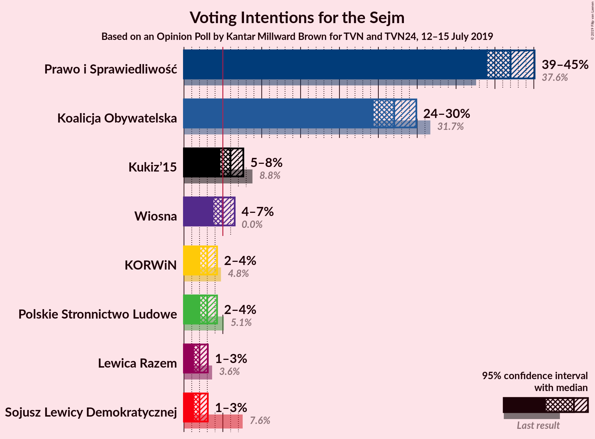
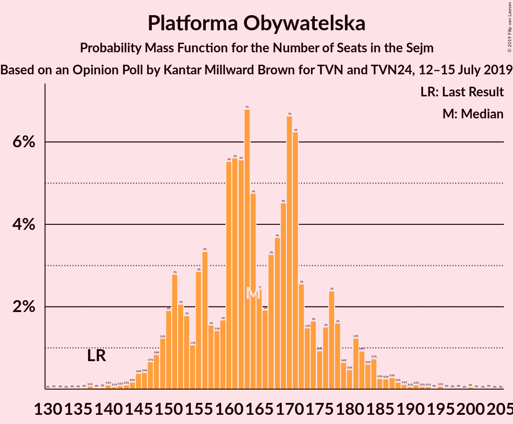

# Opinion Poll by Kantar Millward Brown for TVN and TVN24, 12–15 July 2019

<a href="#voting-intentions">Voting Intentions</a> | <a href="#seats">Seats</a> | <a href="#coalitions">Coalitions</a> | <a href="#technical-information">Technical Information</a>

## Voting Intentions

### Confidence Intervals

| Party | Last Result | Poll Result | 80% Confidence Interval | 90% Confidence Interval | 95% Confidence Interval | 99% Confidence Interval |
|:-----:|:-----------:|:-----------:|:-----------------------:|:-----------------------:|:-----------------------:|:-----------------------:|
| Prawo i Sprawiedliwość | 37.6% | 42.0% | 40.0–44.0% |39.5–44.6% |39.0–45.1% |38.0–46.1% |
| Platforma Obywatelska | 24.1% | 27.0% | 25.3–28.9% |24.8–29.4% |24.4–29.9% |23.6–30.8% |
| Kukiz’15 | 8.8% | 6.0% | 5.1–7.1% |4.9–7.4% |4.7–7.6% |4.3–8.2% |
| Wiosna | 0.0% | 5.0% | 4.2–6.0% |4.0–6.3% |3.8–6.5% |3.5–7.0% |
| Polskie Stronnictwo Ludowe | 5.1% | 3.0% | 2.4–3.8% |2.2–4.0% |2.1–4.3% |1.8–4.7% |
| KORWiN | 4.8% | 3.0% | 2.4–3.8% |2.2–4.0% |2.1–4.3% |1.8–4.7% |
| Sojusz Lewicy Demokratycznej | 7.6% | 2.0% | 1.5–2.7% |1.4–2.9% |1.3–3.1% |1.1–3.4% |
| Lewica Razem | 3.6% | 2.0% | 1.5–2.7% |1.4–2.9% |1.3–3.1% |1.1–3.4% |

*Note:* The poll result column reflects the actual value used in the calculations. Published results may vary slightly, and in addition be rounded to fewer digits.

## Seats

### Confidence Intervals

| Party | Last Result | Median | 80% Confidence Interval | 90% Confidence Interval | 95% Confidence Interval | 99% Confidence Interval |
|:-----:|:-----------:|:------:|:-----------------------:|:-----------------------:|:-----------------------:|:-----------------------:|
| <a href="#prawo-i-sprawiedliwość">Prawo i Sprawiedliwość</a> | 235 | 265 | 256–284 |255–285 |250–290 |239–296 |
| <a href="#platforma-obywatelska">Platforma Obywatelska</a> | 138 | 163 | 154–175 |149–179 |148–183 |142–193 |
| <a href="#kukiz’15">Kukiz’15</a> | 42 | 20 | 11–31 |0–33 |0–34 |0–40 |
| <a href="#wiosna">Wiosna</a> | 0 | 0 | 0–21 |0–26 |0–27 |0–28 |
| <a href="#polskie-stronnictwo-ludowe">Polskie Stronnictwo Ludowe</a> | 16 | 0 | 0 |0 |0 |0 |
| <a href="#korwin">KORWiN</a> | 0 | 0 | 0 |0 |0 |0 |
| <a href="#sojusz-lewicy-demokratycznej">Sojusz Lewicy Demokratycznej</a> | 0 | 0 | 0 |0 |0 |0 |
| <a href="#lewica-razem">Lewica Razem</a> | 0 | 0 | 0 |0 |0 |0 |

### Prawo i Sprawiedliwość

*For a full overview of the results for this party, see the [Prawo i Sprawiedliwość](party-prawoisprawiedliwość.html) page.*

| Number of Seats | Probability | Accumulated | Special Marks |
|:---------------:|:-----------:|:-----------:|:-------------:|
| 232 | 0% | 100% |  |
| 233 | 0% | 99.9% |  |
| 234 | 0% | 99.9% |  |
| 235 | 0% | 99.9% | Last Result |
| 236 | 0.1% | 99.9% |  |
| 237 | 0% | 99.8% |  |
| 238 | 0% | 99.8% |  |
| 239 | 0.5% | 99.8% |  |
| 240 | 0% | 99.2% |  |
| 241 | 0% | 99.2% |  |
| 242 | 0% | 99.2% |  |
| 243 | 0.2% | 99.2% |  |
| 244 | 0% | 99.0% |  |
| 245 | 0.1% | 99.0% |  |
| 246 | 0.1% | 98.8% |  |
| 247 | 0.7% | 98.8% |  |
| 248 | 0.1% | 98% |  |
| 249 | 0.4% | 98% |  |
| 250 | 0.3% | 98% |  |
| 251 | 0.4% | 97% |  |
| 252 | 0.2% | 97% |  |
| 253 | 1.1% | 97% |  |
| 254 | 0.4% | 96% |  |
| 255 | 2% | 95% |  |
| 256 | 3% | 93% |  |
| 257 | 8% | 90% |  |
| 258 | 12% | 82% |  |
| 259 | 3% | 70% |  |
| 260 | 0.6% | 66% |  |
| 261 | 3% | 66% |  |
| 262 | 0.6% | 62% |  |
| 263 | 2% | 62% |  |
| 264 | 4% | 60% |  |
| 265 | 11% | 56% | Median |
| 266 | 1.4% | 46% |  |
| 267 | 0.9% | 44% |  |
| 268 | 1.0% | 43% |  |
| 269 | 4% | 42% |  |
| 270 | 0.6% | 39% |  |
| 271 | 0.6% | 38% |  |
| 272 | 1.0% | 38% |  |
| 273 | 4% | 37% |  |
| 274 | 1.0% | 32% |  |
| 275 | 2% | 31% |  |
| 276 | 0.8% | 29% |  |
| 277 | 2% | 29% |  |
| 278 | 2% | 27% |  |
| 279 | 0.3% | 25% |  |
| 280 | 0.7% | 24% |  |
| 281 | 0.2% | 24% |  |
| 282 | 3% | 23% |  |
| 283 | 0.9% | 20% |  |
| 284 | 11% | 19% |  |
| 285 | 4% | 8% |  |
| 286 | 0.6% | 5% |  |
| 287 | 0.3% | 4% |  |
| 288 | 0.9% | 4% |  |
| 289 | 0.1% | 3% |  |
| 290 | 0.3% | 3% |  |
| 291 | 0.2% | 2% |  |
| 292 | 0.2% | 2% |  |
| 293 | 1.0% | 2% |  |
| 294 | 0.2% | 0.9% |  |
| 295 | 0.1% | 0.7% |  |
| 296 | 0.5% | 0.6% |  |
| 297 | 0% | 0.1% |  |
| 298 | 0% | 0.1% |  |
| 299 | 0% | 0.1% |  |
| 300 | 0% | 0.1% |  |
| 301 | 0% | 0% |  |

### Platforma Obywatelska

*For a full overview of the results for this party, see the [Platforma Obywatelska](party-platformaobywatelska.html) page.*

| Number of Seats | Probability | Accumulated | Special Marks |
|:---------------:|:-----------:|:-----------:|:-------------:|
| 133 | 0% | 100% |  |
| 134 | 0% | 99.9% |  |
| 135 | 0% | 99.9% |  |
| 136 | 0% | 99.9% |  |
| 137 | 0% | 99.9% |  |
| 138 | 0.1% | 99.9% | Last Result |
| 139 | 0% | 99.8% |  |
| 140 | 0.1% | 99.8% |  |
| 141 | 0% | 99.7% |  |
| 142 | 0.2% | 99.7% |  |
| 143 | 0% | 99.5% |  |
| 144 | 0.2% | 99.4% |  |
| 145 | 0.1% | 99.2% |  |
| 146 | 0.6% | 99.1% |  |
| 147 | 0.7% | 98.5% |  |
| 148 | 2% | 98% |  |
| 149 | 2% | 96% |  |
| 150 | 2% | 94% |  |
| 151 | 1.3% | 93% |  |
| 152 | 0.4% | 91% |  |
| 153 | 0.5% | 91% |  |
| 154 | 0.9% | 90% |  |
| 155 | 2% | 89% |  |
| 156 | 0.2% | 87% |  |
| 157 | 7% | 87% |  |
| 158 | 3% | 81% |  |
| 159 | 2% | 78% |  |
| 160 | 8% | 76% |  |
| 161 | 3% | 69% |  |
| 162 | 2% | 65% |  |
| 163 | 14% | 64% | Median |
| 164 | 8% | 50% |  |
| 165 | 3% | 42% |  |
| 166 | 0.7% | 38% |  |
| 167 | 1.4% | 38% |  |
| 168 | 0.7% | 36% |  |
| 169 | 6% | 36% |  |
| 170 | 11% | 30% |  |
| 171 | 1.0% | 19% |  |
| 172 | 5% | 18% |  |
| 173 | 3% | 13% |  |
| 174 | 0.1% | 10% |  |
| 175 | 0.3% | 10% |  |
| 176 | 0.4% | 10% |  |
| 177 | 0.2% | 9% |  |
| 178 | 2% | 9% |  |
| 179 | 3% | 7% |  |
| 180 | 1.0% | 4% |  |
| 181 | 0.4% | 3% |  |
| 182 | 0.2% | 3% |  |
| 183 | 0.8% | 3% |  |
| 184 | 0.2% | 2% |  |
| 185 | 0.1% | 2% |  |
| 186 | 0.1% | 2% |  |
| 187 | 0% | 2% |  |
| 188 | 0.3% | 2% |  |
| 189 | 0% | 1.3% |  |
| 190 | 0% | 1.3% |  |
| 191 | 0% | 1.2% |  |
| 192 | 0.5% | 1.2% |  |
| 193 | 0.3% | 0.7% |  |
| 194 | 0% | 0.5% |  |
| 195 | 0.3% | 0.4% |  |
| 196 | 0% | 0.1% |  |
| 197 | 0.1% | 0.1% |  |
| 198 | 0% | 0.1% |  |
| 199 | 0% | 0.1% |  |
| 200 | 0% | 0% |  |

### Kukiz’15

*For a full overview of the results for this party, see the [Kukiz’15](party-kukiz’15.html) page.*

| Number of Seats | Probability | Accumulated | Special Marks |
|:---------------:|:-----------:|:-----------:|:-------------:|
| 0 | 8% | 100% |  |
| 1 | 0% | 92% |  |
| 2 | 0% | 92% |  |
| 3 | 0% | 92% |  |
| 4 | 0% | 92% |  |
| 5 | 0% | 92% |  |
| 6 | 0% | 92% |  |
| 7 | 0% | 92% |  |
| 8 | 0% | 92% |  |
| 9 | 0.6% | 92% |  |
| 10 | 0.9% | 91% |  |
| 11 | 0.9% | 90% |  |
| 12 | 3% | 89% |  |
| 13 | 16% | 87% |  |
| 14 | 3% | 70% |  |
| 15 | 7% | 67% |  |
| 16 | 3% | 61% |  |
| 17 | 0.9% | 58% |  |
| 18 | 4% | 57% |  |
| 19 | 0.6% | 53% |  |
| 20 | 4% | 52% | Median |
| 21 | 3% | 48% |  |
| 22 | 1.5% | 46% |  |
| 23 | 1.1% | 44% |  |
| 24 | 3% | 43% |  |
| 25 | 11% | 39% |  |
| 26 | 0.9% | 29% |  |
| 27 | 5% | 28% |  |
| 28 | 3% | 23% |  |
| 29 | 2% | 20% |  |
| 30 | 3% | 18% |  |
| 31 | 6% | 15% |  |
| 32 | 4% | 9% |  |
| 33 | 1.2% | 6% |  |
| 34 | 2% | 4% |  |
| 35 | 0.2% | 2% |  |
| 36 | 0.7% | 2% |  |
| 37 | 0.4% | 1.1% |  |
| 38 | 0% | 0.7% |  |
| 39 | 0.1% | 0.6% |  |
| 40 | 0.2% | 0.5% |  |
| 41 | 0.1% | 0.3% |  |
| 42 | 0.1% | 0.2% | Last Result |
| 43 | 0% | 0.1% |  |
| 44 | 0.1% | 0.1% |  |
| 45 | 0% | 0% |  |

### Wiosna

*For a full overview of the results for this party, see the [Wiosna](party-wiosna.html) page.*

| Number of Seats | Probability | Accumulated | Special Marks |
|:---------------:|:-----------:|:-----------:|:-------------:|
| 0 | 56% | 100% | Last Result, Median |
| 1 | 0% | 44% |  |
| 2 | 0% | 44% |  |
| 3 | 0% | 44% |  |
| 4 | 0% | 44% |  |
| 5 | 0% | 44% |  |
| 6 | 0% | 44% |  |
| 7 | 0% | 44% |  |
| 8 | 0% | 44% |  |
| 9 | 0% | 44% |  |
| 10 | 0.7% | 44% |  |
| 11 | 5% | 43% |  |
| 12 | 3% | 38% |  |
| 13 | 4% | 35% |  |
| 14 | 7% | 31% |  |
| 15 | 0.9% | 24% |  |
| 16 | 4% | 23% |  |
| 17 | 2% | 19% |  |
| 18 | 4% | 16% |  |
| 19 | 0.4% | 12% |  |
| 20 | 0.5% | 12% |  |
| 21 | 2% | 11% |  |
| 22 | 0.5% | 9% |  |
| 23 | 1.4% | 9% |  |
| 24 | 0.3% | 7% |  |
| 25 | 0.6% | 7% |  |
| 26 | 2% | 7% |  |
| 27 | 4% | 5% |  |
| 28 | 1.1% | 1.3% |  |
| 29 | 0.1% | 0.3% |  |
| 30 | 0.1% | 0.2% |  |
| 31 | 0% | 0.1% |  |
| 32 | 0% | 0.1% |  |
| 33 | 0% | 0% |  |

### Polskie Stronnictwo Ludowe

*For a full overview of the results for this party, see the [Polskie Stronnictwo Ludowe](party-polskiestronnictwoludowe.html) page.*

| Number of Seats | Probability | Accumulated | Special Marks |
|:---------------:|:-----------:|:-----------:|:-------------:|
| 0 | 99.8% | 100% | Median |
| 1 | 0% | 0.2% |  |
| 2 | 0% | 0.2% |  |
| 3 | 0% | 0.2% |  |
| 4 | 0% | 0.2% |  |
| 5 | 0% | 0.2% |  |
| 6 | 0% | 0.2% |  |
| 7 | 0% | 0.2% |  |
| 8 | 0% | 0.2% |  |
| 9 | 0% | 0.2% |  |
| 10 | 0% | 0.2% |  |
| 11 | 0% | 0.2% |  |
| 12 | 0% | 0.2% |  |
| 13 | 0% | 0.2% |  |
| 14 | 0% | 0.2% |  |
| 15 | 0% | 0.2% |  |
| 16 | 0.1% | 0.2% | Last Result |
| 17 | 0% | 0.1% |  |
| 18 | 0% | 0% |  |

### KORWiN

*For a full overview of the results for this party, see the [KORWiN](party-korwin.html) page.*

| Number of Seats | Probability | Accumulated | Special Marks |
|:---------------:|:-----------:|:-----------:|:-------------:|
| 0 | 99.9% | 100% | Last Result, Median |
| 1 | 0% | 0.1% |  |
| 2 | 0% | 0.1% |  |
| 3 | 0% | 0.1% |  |
| 4 | 0% | 0.1% |  |
| 5 | 0% | 0.1% |  |
| 6 | 0% | 0.1% |  |
| 7 | 0% | 0.1% |  |
| 8 | 0% | 0.1% |  |
| 9 | 0% | 0.1% |  |
| 10 | 0% | 0% |  |

### Sojusz Lewicy Demokratycznej

*For a full overview of the results for this party, see the [Sojusz Lewicy Demokratycznej](party-sojuszlewicydemokratycznej.html) page.*

| Number of Seats | Probability | Accumulated | Special Marks |
|:---------------:|:-----------:|:-----------:|:-------------:|
| 0 | 100% | 100% | Last Result, Median |

### Lewica Razem

*For a full overview of the results for this party, see the [Lewica Razem](party-lewicarazem.html) page.*

| Number of Seats | Probability | Accumulated | Special Marks |
|:---------------:|:-----------:|:-----------:|:-------------:|
| 0 | 100% | 100% | Last Result, Median |

## Coalitions

### Confidence Intervals

| Coalition | Last Result | Median | Majority? | 80% Confidence Interval | 90% Confidence Interval | 95% Confidence Interval | 99% Confidence Interval |
|:---------:|:-----------:|:------:|:---------:|:-----------------------:|:-----------------------:|:-----------------------:|:-----------------------:|
| Prawo i Sprawiedliwość | 235 | 265 | 100% | 256–284 | 255–285 | 250–290 | 239–296 |
| Platforma Obywatelska | 138 | 163 | 0% | 154–175 | 149–179 | 148–183 | 142–193 |

### Prawo i Sprawiedliwość

| Number of Seats | Probability | Accumulated | Special Marks |
|:---------------:|:-----------:|:-----------:|:-------------:|
| 232 | 0% | 100% |  |
| 233 | 0% | 99.9% |  |
| 234 | 0% | 99.9% |  |
| 235 | 0% | 99.9% | Last Result |
| 236 | 0.1% | 99.9% |  |
| 237 | 0% | 99.8% |  |
| 238 | 0% | 99.8% |  |
| 239 | 0.5% | 99.8% |  |
| 240 | 0% | 99.2% |  |
| 241 | 0% | 99.2% |  |
| 242 | 0% | 99.2% |  |
| 243 | 0.2% | 99.2% |  |
| 244 | 0% | 99.0% |  |
| 245 | 0.1% | 99.0% |  |
| 246 | 0.1% | 98.8% |  |
| 247 | 0.7% | 98.8% |  |
| 248 | 0.1% | 98% |  |
| 249 | 0.4% | 98% |  |
| 250 | 0.3% | 98% |  |
| 251 | 0.4% | 97% |  |
| 252 | 0.2% | 97% |  |
| 253 | 1.1% | 97% |  |
| 254 | 0.4% | 96% |  |
| 255 | 2% | 95% |  |
| 256 | 3% | 93% |  |
| 257 | 8% | 90% |  |
| 258 | 12% | 82% |  |
| 259 | 3% | 70% |  |
| 260 | 0.6% | 66% |  |
| 261 | 3% | 66% |  |
| 262 | 0.6% | 62% |  |
| 263 | 2% | 62% |  |
| 264 | 4% | 60% |  |
| 265 | 11% | 56% | Median |
| 266 | 1.4% | 46% |  |
| 267 | 0.9% | 44% |  |
| 268 | 1.0% | 43% |  |
| 269 | 4% | 42% |  |
| 270 | 0.6% | 39% |  |
| 271 | 0.6% | 38% |  |
| 272 | 1.0% | 38% |  |
| 273 | 4% | 37% |  |
| 274 | 1.0% | 32% |  |
| 275 | 2% | 31% |  |
| 276 | 0.8% | 29% |  |
| 277 | 2% | 29% |  |
| 278 | 2% | 27% |  |
| 279 | 0.3% | 25% |  |
| 280 | 0.7% | 24% |  |
| 281 | 0.2% | 24% |  |
| 282 | 3% | 23% |  |
| 283 | 0.9% | 20% |  |
| 284 | 11% | 19% |  |
| 285 | 4% | 8% |  |
| 286 | 0.6% | 5% |  |
| 287 | 0.3% | 4% |  |
| 288 | 0.9% | 4% |  |
| 289 | 0.1% | 3% |  |
| 290 | 0.3% | 3% |  |
| 291 | 0.2% | 2% |  |
| 292 | 0.2% | 2% |  |
| 293 | 1.0% | 2% |  |
| 294 | 0.2% | 0.9% |  |
| 295 | 0.1% | 0.7% |  |
| 296 | 0.5% | 0.6% |  |
| 297 | 0% | 0.1% |  |
| 298 | 0% | 0.1% |  |
| 299 | 0% | 0.1% |  |
| 300 | 0% | 0.1% |  |
| 301 | 0% | 0% |  |

### Platforma Obywatelska

| Number of Seats | Probability | Accumulated | Special Marks |
|:---------------:|:-----------:|:-----------:|:-------------:|
| 133 | 0% | 100% |  |
| 134 | 0% | 99.9% |  |
| 135 | 0% | 99.9% |  |
| 136 | 0% | 99.9% |  |
| 137 | 0% | 99.9% |  |
| 138 | 0.1% | 99.9% | Last Result |
| 139 | 0% | 99.8% |  |
| 140 | 0.1% | 99.8% |  |
| 141 | 0% | 99.7% |  |
| 142 | 0.2% | 99.7% |  |
| 143 | 0% | 99.5% |  |
| 144 | 0.2% | 99.4% |  |
| 145 | 0.1% | 99.2% |  |
| 146 | 0.6% | 99.1% |  |
| 147 | 0.7% | 98.5% |  |
| 148 | 2% | 98% |  |
| 149 | 2% | 96% |  |
| 150 | 2% | 94% |  |
| 151 | 1.3% | 93% |  |
| 152 | 0.4% | 91% |  |
| 153 | 0.5% | 91% |  |
| 154 | 0.9% | 90% |  |
| 155 | 2% | 89% |  |
| 156 | 0.2% | 87% |  |
| 157 | 7% | 87% |  |
| 158 | 3% | 81% |  |
| 159 | 2% | 78% |  |
| 160 | 8% | 76% |  |
| 161 | 3% | 69% |  |
| 162 | 2% | 65% |  |
| 163 | 14% | 64% | Median |
| 164 | 8% | 50% |  |
| 165 | 3% | 42% |  |
| 166 | 0.7% | 38% |  |
| 167 | 1.4% | 38% |  |
| 168 | 0.7% | 36% |  |
| 169 | 6% | 36% |  |
| 170 | 11% | 30% |  |
| 171 | 1.0% | 19% |  |
| 172 | 5% | 18% |  |
| 173 | 3% | 13% |  |
| 174 | 0.1% | 10% |  |
| 175 | 0.3% | 10% |  |
| 176 | 0.4% | 10% |  |
| 177 | 0.2% | 9% |  |
| 178 | 2% | 9% |  |
| 179 | 3% | 7% |  |
| 180 | 1.0% | 4% |  |
| 181 | 0.4% | 3% |  |
| 182 | 0.2% | 3% |  |
| 183 | 0.8% | 3% |  |
| 184 | 0.2% | 2% |  |
| 185 | 0.1% | 2% |  |
| 186 | 0.1% | 2% |  |
| 187 | 0% | 2% |  |
| 188 | 0.3% | 2% |  |
| 189 | 0% | 1.3% |  |
| 190 | 0% | 1.3% |  |
| 191 | 0% | 1.2% |  |
| 192 | 0.5% | 1.2% |  |
| 193 | 0.3% | 0.7% |  |
| 194 | 0% | 0.5% |  |
| 195 | 0.3% | 0.4% |  |
| 196 | 0% | 0.1% |  |
| 197 | 0.1% | 0.1% |  |
| 198 | 0% | 0.1% |  |
| 199 | 0% | 0.1% |  |
| 200 | 0% | 0% |  |

## Technical Information

### Opinion Poll

+ **Polling firm:** Kantar Millward Brown
+ **Commissioner(s):** TVN and TVN24
+ **Fieldwork period:** 12–15 July 2019

### Calculations

+ **Sample size:** 1002
+ **Simulations done:** 131,072
+ **Error estimate:** 2.39%

