# Opinion Poll by Kantar Public for Radio ZET, 12–17 July 2019

<a href="#voting-intentions">Voting Intentions</a> | <a href="#seats">Seats</a> | <a href="#coalitions">Coalitions</a> | <a href="#technical-information">Technical Information</a>

## Voting Intentions

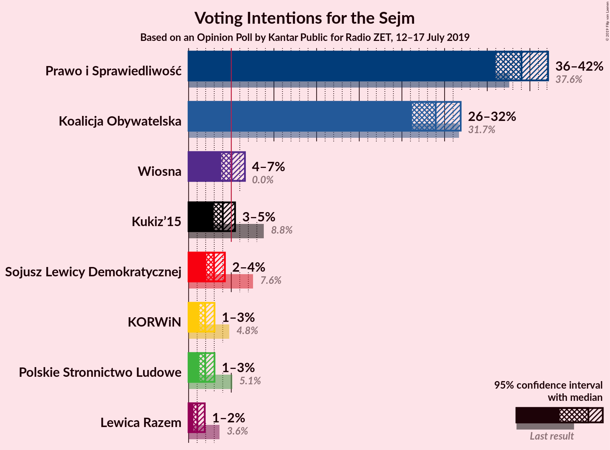

### Confidence Intervals

| Party | Last Result | Poll Result | 80% Confidence Interval | 90% Confidence Interval | 95% Confidence Interval | 99% Confidence Interval |
|:-----:|:-----------:|:-----------:|:-----------------------:|:-----------------------:|:-----------------------:|:-----------------------:|
| Prawo i Sprawiedliwość | 37.6% | 39.0% | 37.0–41.0% |36.5–41.6% |36.0–42.1% |35.1–43.1% |
| Koalicja Obywatelska | 31.7% | 29.0% | 27.1–30.9% |26.6–31.4% |26.2–31.9% |25.3–32.8% |
| Wiosna | 0.0% | 5.0% | 4.2–6.1% |4.0–6.3% |3.8–6.6% |3.5–7.1% |
| Kukiz’15 | 8.8% | 4.0% | 3.3–4.9% |3.1–5.2% |2.9–5.4% |2.6–5.9% |
| Sojusz Lewicy Demokratycznej | 7.6% | 3.0% | 2.4–3.8% |2.2–4.0% |2.1–4.3% |1.8–4.7% |
| Polskie Stronnictwo Ludowe | 5.1% | 2.0% | 1.5–2.7% |1.4–2.9% |1.2–3.0% |1.1–3.4% |
| KORWiN | 4.8% | 2.0% | 1.5–2.7% |1.4–2.9% |1.2–3.0% |1.1–3.4% |
| Lewica Razem | 3.6% | 1.0% | 0.7–1.6% |0.6–1.7% |0.6–1.9% |0.4–2.2% |

*Note:* The poll result column reflects the actual value used in the calculations. Published results may vary slightly, and in addition be rounded to fewer digits.

## Seats

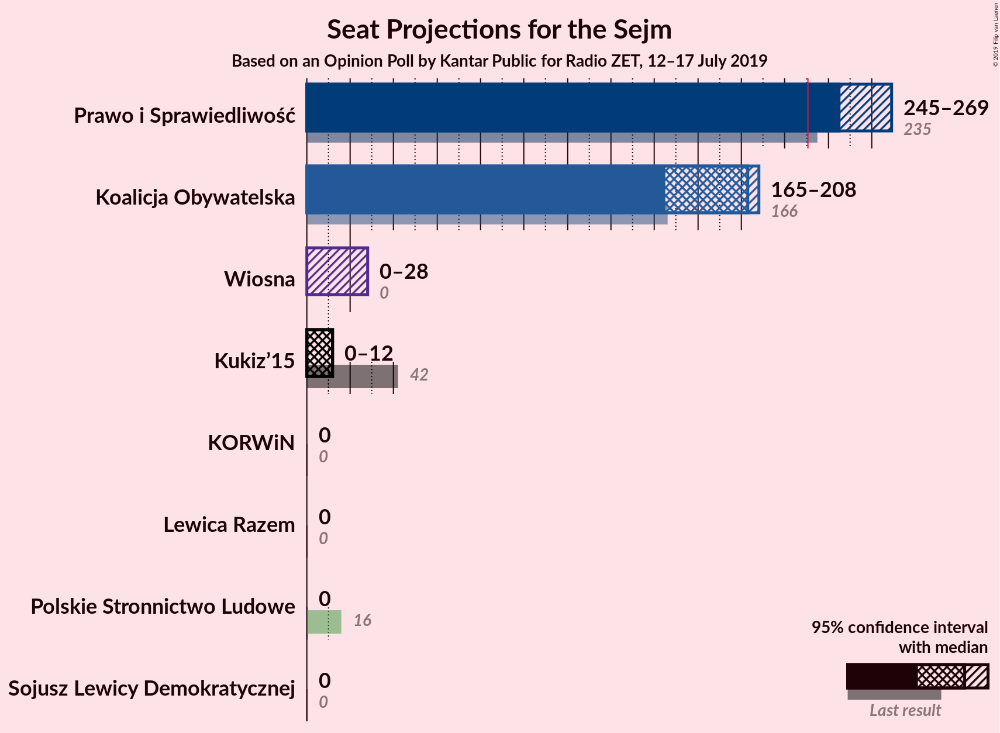

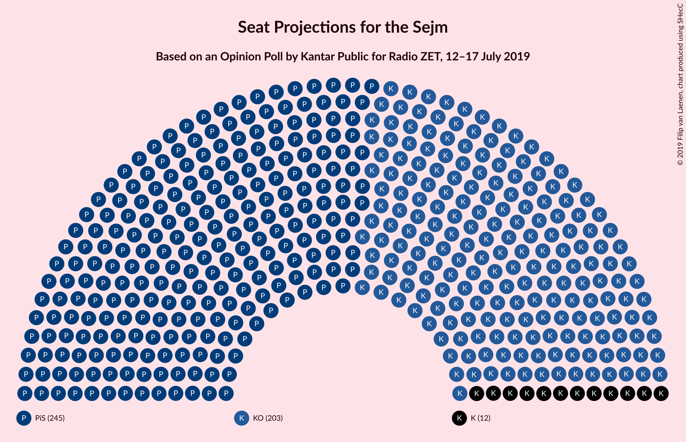

### Confidence Intervals

| Party | Last Result | Median | 80% Confidence Interval | 90% Confidence Interval | 95% Confidence Interval | 99% Confidence Interval |
|:-----:|:-----------:|:------:|:-----------------------:|:-----------------------:|:-----------------------:|:-----------------------:|
| <a href="#prawo-i-sprawiedliwość">Prawo i Sprawiedliwość</a> | 235 | 245 | 245–267 |245–267 |245–269 |245–269 |
| <a href="#koalicja-obywatelska">Koalicja Obywatelska</a> | 166 | 203 | 166–203 |165–208 |165–208 |165–208 |
| <a href="#wiosna">Wiosna</a> | 0 | 0 | 0–25 |0–28 |0–28 |0–28 |
| <a href="#kukiz’15">Kukiz’15</a> | 42 | 12 | 0–12 |0–12 |0–12 |0–12 |
| <a href="#sojusz-lewicy-demokratycznej">Sojusz Lewicy Demokratycznej</a> | 0 | 0 | 0 |0 |0 |0 |
| <a href="#polskie-stronnictwo-ludowe">Polskie Stronnictwo Ludowe</a> | 16 | 0 | 0 |0 |0 |0 |
| <a href="#korwin">KORWiN</a> | 0 | 0 | 0 |0 |0 |0 |
| <a href="#lewica-razem">Lewica Razem</a> | 0 | 0 | 0 |0 |0 |0 |

### Prawo i Sprawiedliwość

*For a full overview of the results for this party, see the [Prawo i Sprawiedliwość](party-prawoisprawiedliwość.html) page.*

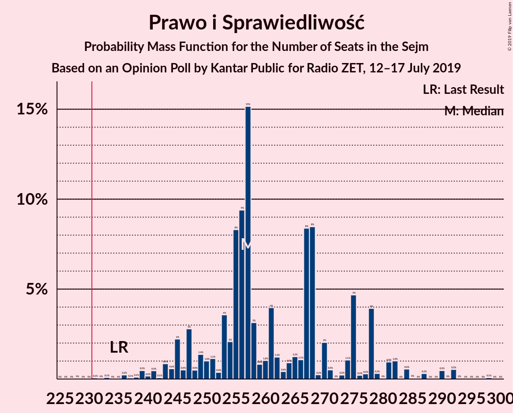

| Number of Seats | Probability | Accumulated | Special Marks |
|:---------------:|:-----------:|:-----------:|:-------------:|
| 235 | 0% | 100% | Last Result |
| 236 | 0% | 100% |  |
| 237 | 0% | 100% |  |
| 238 | 0% | 100% |  |
| 239 | 0% | 100% |  |
| 240 | 0% | 99.9% |  |
| 241 | 0.1% | 99.9% |  |
| 242 | 0% | 99.9% |  |
| 243 | 0% | 99.8% |  |
| 244 | 0% | 99.8% |  |
| 245 | 79% | 99.8% | Median |
| 246 | 0% | 21% |  |
| 247 | 0% | 21% |  |
| 248 | 0% | 21% |  |
| 249 | 0.3% | 21% |  |
| 250 | 1.1% | 20% |  |
| 251 | 0.2% | 19% |  |
| 252 | 5% | 19% |  |
| 253 | 0.3% | 14% |  |
| 254 | 0% | 14% |  |
| 255 | 0% | 14% |  |
| 256 | 0% | 14% |  |
| 257 | 0% | 14% |  |
| 258 | 0% | 14% |  |
| 259 | 0% | 14% |  |
| 260 | 0% | 14% |  |
| 261 | 0% | 14% |  |
| 262 | 0% | 14% |  |
| 263 | 0% | 14% |  |
| 264 | 0% | 14% |  |
| 265 | 0% | 14% |  |
| 266 | 1.2% | 14% |  |
| 267 | 8% | 13% |  |
| 268 | 0% | 4% |  |
| 269 | 4% | 4% |  |
| 270 | 0% | 0.1% |  |
| 271 | 0% | 0.1% |  |
| 272 | 0% | 0.1% |  |
| 273 | 0% | 0.1% |  |
| 274 | 0% | 0.1% |  |
| 275 | 0.1% | 0.1% |  |
| 276 | 0% | 0% |  |

### Koalicja Obywatelska

*For a full overview of the results for this party, see the [Koalicja Obywatelska](party-koalicjaobywatelska.html) page.*

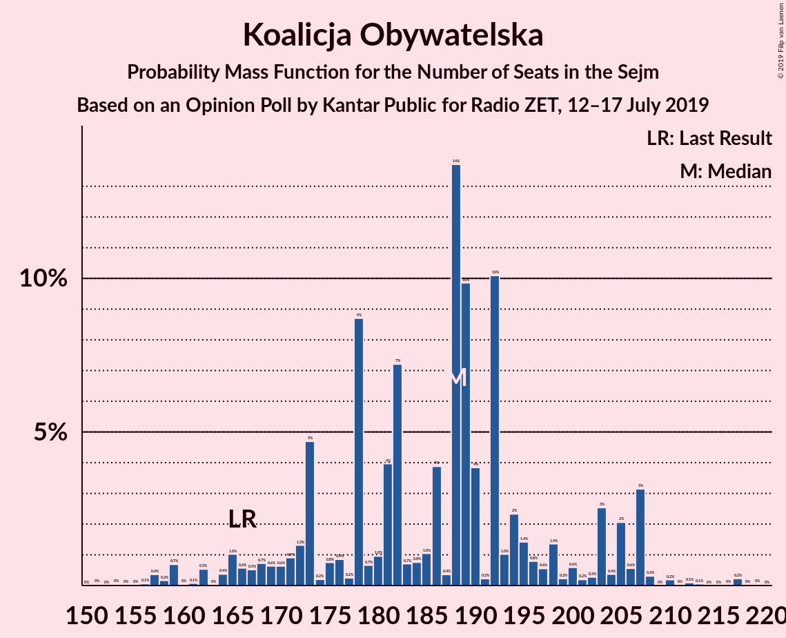

| Number of Seats | Probability | Accumulated | Special Marks |
|:---------------:|:-----------:|:-----------:|:-------------:|
| 157 | 0.1% | 100% |  |
| 158 | 0% | 99.9% |  |
| 159 | 0% | 99.9% |  |
| 160 | 0% | 99.9% |  |
| 161 | 0% | 99.9% |  |
| 162 | 0% | 99.9% |  |
| 163 | 0% | 99.9% |  |
| 164 | 0% | 99.9% |  |
| 165 | 8% | 99.9% |  |
| 166 | 4% | 92% | Last Result |
| 167 | 0% | 87% |  |
| 168 | 0% | 87% |  |
| 169 | 0.1% | 87% |  |
| 170 | 0% | 87% |  |
| 171 | 0% | 87% |  |
| 172 | 0% | 87% |  |
| 173 | 0% | 87% |  |
| 174 | 0% | 87% |  |
| 175 | 0% | 87% |  |
| 176 | 0% | 87% |  |
| 177 | 0% | 87% |  |
| 178 | 0% | 87% |  |
| 179 | 0% | 87% |  |
| 180 | 0% | 87% |  |
| 181 | 0% | 87% |  |
| 182 | 0% | 87% |  |
| 183 | 1.0% | 87% |  |
| 184 | 0.3% | 86% |  |
| 185 | 0% | 86% |  |
| 186 | 0.3% | 86% |  |
| 187 | 0% | 86% |  |
| 188 | 0.2% | 86% |  |
| 189 | 0% | 86% |  |
| 190 | 0% | 86% |  |
| 191 | 0% | 86% |  |
| 192 | 0% | 86% |  |
| 193 | 0% | 86% |  |
| 194 | 1.2% | 86% |  |
| 195 | 0% | 84% |  |
| 196 | 0% | 84% |  |
| 197 | 0% | 84% |  |
| 198 | 0% | 84% |  |
| 199 | 0% | 84% |  |
| 200 | 0% | 84% |  |
| 201 | 0% | 84% |  |
| 202 | 0% | 84% |  |
| 203 | 79% | 84% | Median |
| 204 | 0% | 5% |  |
| 205 | 0% | 5% |  |
| 206 | 0% | 5% |  |
| 207 | 0% | 5% |  |
| 208 | 5% | 5% |  |
| 209 | 0% | 0% |  |

### Wiosna

*For a full overview of the results for this party, see the [Wiosna](party-wiosna.html) page.*

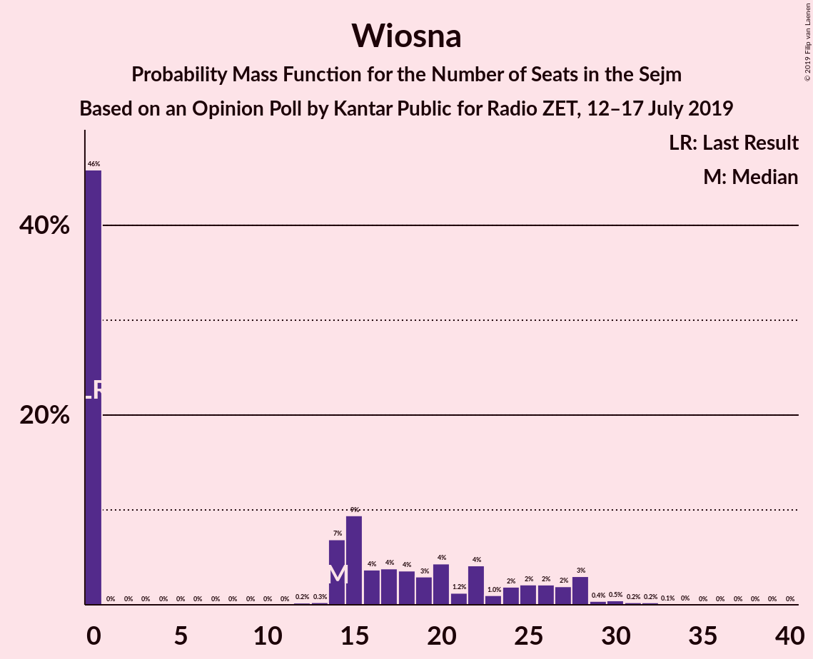

| Number of Seats | Probability | Accumulated | Special Marks |
|:---------------:|:-----------:|:-----------:|:-------------:|
| 0 | 86% | 100% | Last Result, Median |
| 1 | 0% | 14% |  |
| 2 | 0% | 14% |  |
| 3 | 0% | 14% |  |
| 4 | 0% | 14% |  |
| 5 | 0% | 14% |  |
| 6 | 0% | 14% |  |
| 7 | 0% | 14% |  |
| 8 | 0% | 14% |  |
| 9 | 0% | 14% |  |
| 10 | 0% | 14% |  |
| 11 | 0% | 14% |  |
| 12 | 0% | 14% |  |
| 13 | 0% | 14% |  |
| 14 | 0% | 14% |  |
| 15 | 0% | 14% |  |
| 16 | 0% | 14% |  |
| 17 | 0% | 14% |  |
| 18 | 0% | 14% |  |
| 19 | 0% | 14% |  |
| 20 | 0% | 14% |  |
| 21 | 0.4% | 14% |  |
| 22 | 0% | 14% |  |
| 23 | 0% | 14% |  |
| 24 | 0% | 14% |  |
| 25 | 4% | 14% |  |
| 26 | 0% | 10% |  |
| 27 | 1.4% | 10% |  |
| 28 | 8% | 8% |  |
| 29 | 0% | 0% |  |

### Kukiz’15

*For a full overview of the results for this party, see the [Kukiz’15](party-kukiz’15.html) page.*

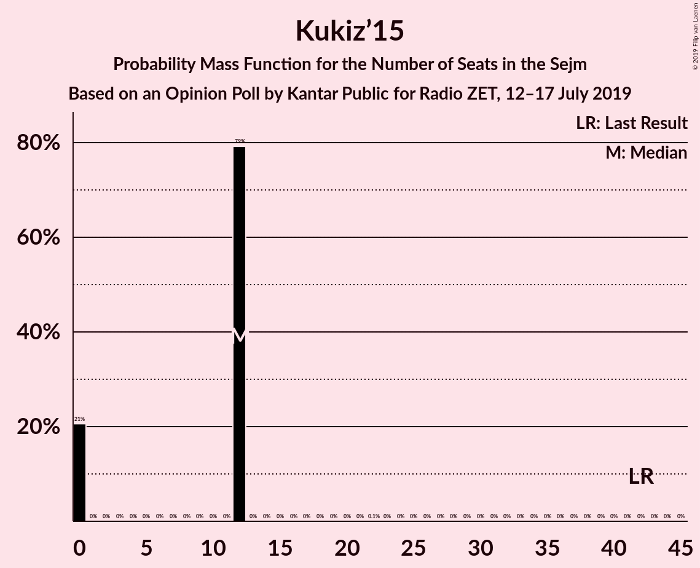

| Number of Seats | Probability | Accumulated | Special Marks |
|:---------------:|:-----------:|:-----------:|:-------------:|
| 0 | 21% | 100% |  |
| 1 | 0% | 79% |  |
| 2 | 0% | 79% |  |
| 3 | 0% | 79% |  |
| 4 | 0% | 79% |  |
| 5 | 0% | 79% |  |
| 6 | 0% | 79% |  |
| 7 | 0% | 79% |  |
| 8 | 0% | 79% |  |
| 9 | 0% | 79% |  |
| 10 | 0% | 79% |  |
| 11 | 0% | 79% |  |
| 12 | 79% | 79% | Median |
| 13 | 0% | 0.2% |  |
| 14 | 0% | 0.2% |  |
| 15 | 0% | 0.2% |  |
| 16 | 0% | 0.2% |  |
| 17 | 0% | 0.1% |  |
| 18 | 0% | 0.1% |  |
| 19 | 0% | 0.1% |  |
| 20 | 0% | 0.1% |  |
| 21 | 0% | 0.1% |  |
| 22 | 0.1% | 0.1% |  |
| 23 | 0% | 0.1% |  |
| 24 | 0% | 0.1% |  |
| 25 | 0% | 0.1% |  |
| 26 | 0% | 0% |  |
| 27 | 0% | 0% |  |
| 28 | 0% | 0% |  |
| 29 | 0% | 0% |  |
| 30 | 0% | 0% |  |
| 31 | 0% | 0% |  |
| 32 | 0% | 0% |  |
| 33 | 0% | 0% |  |
| 34 | 0% | 0% |  |
| 35 | 0% | 0% |  |
| 36 | 0% | 0% |  |
| 37 | 0% | 0% |  |
| 38 | 0% | 0% |  |
| 39 | 0% | 0% |  |
| 40 | 0% | 0% |  |
| 41 | 0% | 0% |  |
| 42 | 0% | 0% | Last Result |

### Sojusz Lewicy Demokratycznej

*For a full overview of the results for this party, see the [Sojusz Lewicy Demokratycznej](party-sojuszlewicydemokratycznej.html) page.*

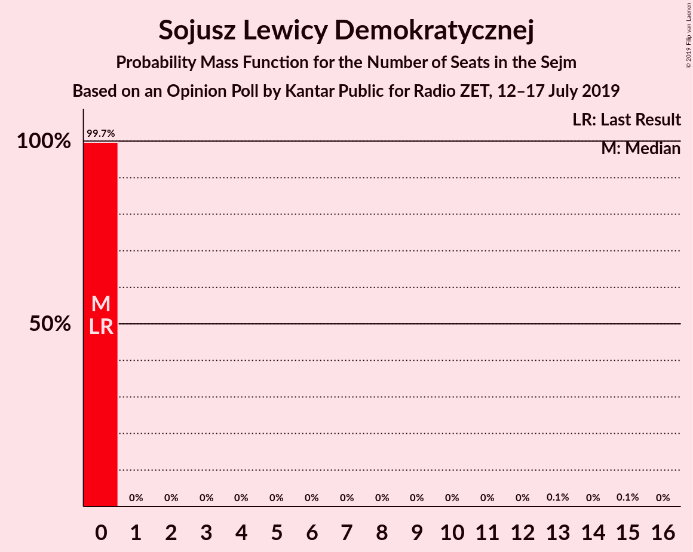

| Number of Seats | Probability | Accumulated | Special Marks |
|:---------------:|:-----------:|:-----------:|:-------------:|
| 0 | 100% | 100% | Last Result, Median |

### Polskie Stronnictwo Ludowe

*For a full overview of the results for this party, see the [Polskie Stronnictwo Ludowe](party-polskiestronnictwoludowe.html) page.*

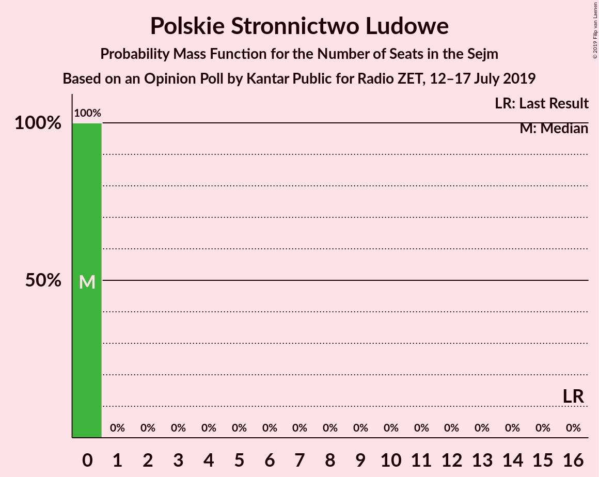

| Number of Seats | Probability | Accumulated | Special Marks |
|:---------------:|:-----------:|:-----------:|:-------------:|
| 0 | 100% | 100% | Median |
| 1 | 0% | 0% |  |
| 2 | 0% | 0% |  |
| 3 | 0% | 0% |  |
| 4 | 0% | 0% |  |
| 5 | 0% | 0% |  |
| 6 | 0% | 0% |  |
| 7 | 0% | 0% |  |
| 8 | 0% | 0% |  |
| 9 | 0% | 0% |  |
| 10 | 0% | 0% |  |
| 11 | 0% | 0% |  |
| 12 | 0% | 0% |  |
| 13 | 0% | 0% |  |
| 14 | 0% | 0% |  |
| 15 | 0% | 0% |  |
| 16 | 0% | 0% | Last Result |

### KORWiN

*For a full overview of the results for this party, see the [KORWiN](party-korwin.html) page.*

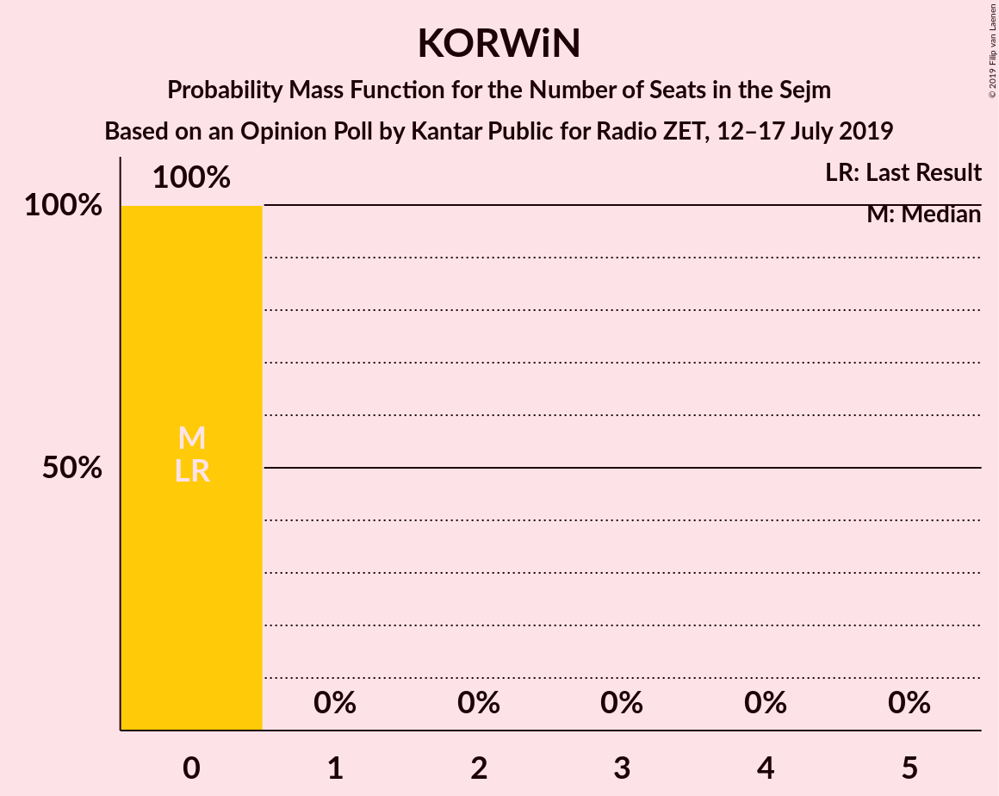

| Number of Seats | Probability | Accumulated | Special Marks |
|:---------------:|:-----------:|:-----------:|:-------------:|
| 0 | 100% | 100% | Last Result, Median |

### Lewica Razem

*For a full overview of the results for this party, see the [Lewica Razem](party-lewicarazem.html) page.*

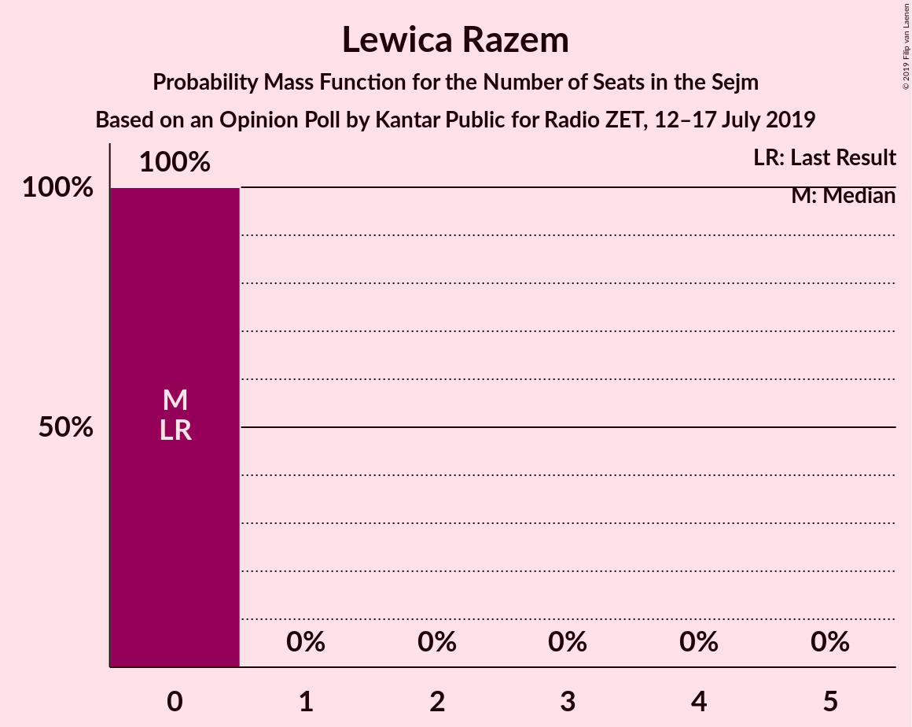

| Number of Seats | Probability | Accumulated | Special Marks |
|:---------------:|:-----------:|:-----------:|:-------------:|
| 0 | 100% | 100% | Last Result, Median |

## Coalitions

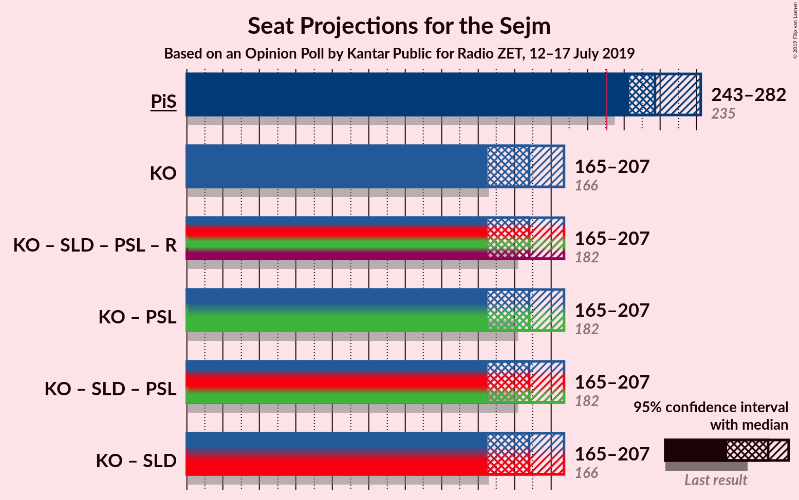

### Confidence Intervals

| Coalition | Last Result | Median | Majority? | 80% Confidence Interval | 90% Confidence Interval | 95% Confidence Interval | 99% Confidence Interval |
|:---------:|:-----------:|:------:|:---------:|:-----------------------:|:-----------------------:|:-----------------------:|:-----------------------:|
| Prawo i Sprawiedliwość | 235 | 245 | 100% | 245–267 | 245–267 | 245–269 | 245–269 |
| Koalicja Obywatelska | 166 | 203 | 0% | 166–203 | 165–208 | 165–208 | 165–208 |
| Koalicja Obywatelska – Sojusz Lewicy Demokratycznej – Polskie Stronnictwo Ludowe – Lewica Razem | 182 | 203 | 0% | 166–203 | 165–208 | 165–208 | 165–208 |
| Koalicja Obywatelska – Polskie Stronnictwo Ludowe | 182 | 203 | 0% | 166–203 | 165–208 | 165–208 | 165–208 |
| Koalicja Obywatelska – Sojusz Lewicy Demokratycznej – Polskie Stronnictwo Ludowe | 182 | 203 | 0% | 166–203 | 165–208 | 165–208 | 165–208 |
| Koalicja Obywatelska – Sojusz Lewicy Demokratycznej | 166 | 203 | 0% | 166–203 | 165–208 | 165–208 | 165–208 |

### Prawo i Sprawiedliwość

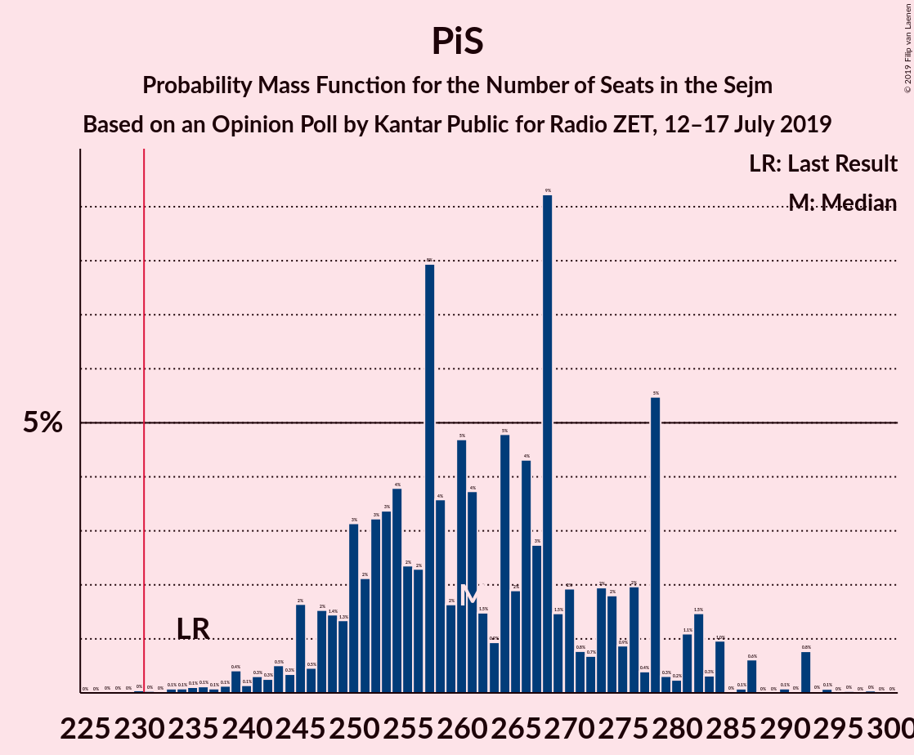

| Number of Seats | Probability | Accumulated | Special Marks |
|:---------------:|:-----------:|:-----------:|:-------------:|
| 235 | 0% | 100% | Last Result |
| 236 | 0% | 100% |  |
| 237 | 0% | 100% |  |
| 238 | 0% | 100% |  |
| 239 | 0% | 100% |  |
| 240 | 0% | 99.9% |  |
| 241 | 0.1% | 99.9% |  |
| 242 | 0% | 99.9% |  |
| 243 | 0% | 99.8% |  |
| 244 | 0% | 99.8% |  |
| 245 | 79% | 99.8% | Median |
| 246 | 0% | 21% |  |
| 247 | 0% | 21% |  |
| 248 | 0% | 21% |  |
| 249 | 0.3% | 21% |  |
| 250 | 1.1% | 20% |  |
| 251 | 0.2% | 19% |  |
| 252 | 5% | 19% |  |
| 253 | 0.3% | 14% |  |
| 254 | 0% | 14% |  |
| 255 | 0% | 14% |  |
| 256 | 0% | 14% |  |
| 257 | 0% | 14% |  |
| 258 | 0% | 14% |  |
| 259 | 0% | 14% |  |
| 260 | 0% | 14% |  |
| 261 | 0% | 14% |  |
| 262 | 0% | 14% |  |
| 263 | 0% | 14% |  |
| 264 | 0% | 14% |  |
| 265 | 0% | 14% |  |
| 266 | 1.2% | 14% |  |
| 267 | 8% | 13% |  |
| 268 | 0% | 4% |  |
| 269 | 4% | 4% |  |
| 270 | 0% | 0.1% |  |
| 271 | 0% | 0.1% |  |
| 272 | 0% | 0.1% |  |
| 273 | 0% | 0.1% |  |
| 274 | 0% | 0.1% |  |
| 275 | 0.1% | 0.1% |  |
| 276 | 0% | 0% |  |

### Koalicja Obywatelska

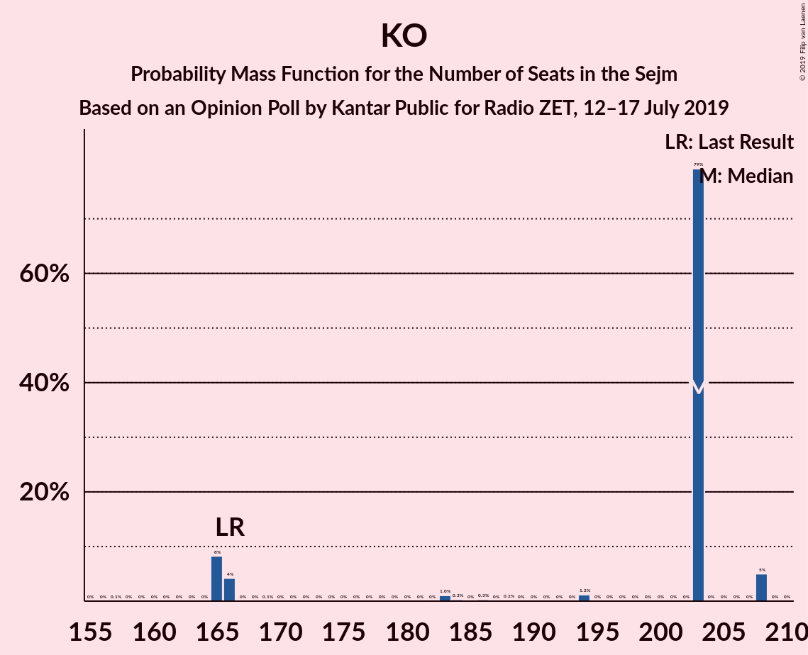

| Number of Seats | Probability | Accumulated | Special Marks |
|:---------------:|:-----------:|:-----------:|:-------------:|
| 157 | 0.1% | 100% |  |
| 158 | 0% | 99.9% |  |
| 159 | 0% | 99.9% |  |
| 160 | 0% | 99.9% |  |
| 161 | 0% | 99.9% |  |
| 162 | 0% | 99.9% |  |
| 163 | 0% | 99.9% |  |
| 164 | 0% | 99.9% |  |
| 165 | 8% | 99.9% |  |
| 166 | 4% | 92% | Last Result |
| 167 | 0% | 87% |  |
| 168 | 0% | 87% |  |
| 169 | 0.1% | 87% |  |
| 170 | 0% | 87% |  |
| 171 | 0% | 87% |  |
| 172 | 0% | 87% |  |
| 173 | 0% | 87% |  |
| 174 | 0% | 87% |  |
| 175 | 0% | 87% |  |
| 176 | 0% | 87% |  |
| 177 | 0% | 87% |  |
| 178 | 0% | 87% |  |
| 179 | 0% | 87% |  |
| 180 | 0% | 87% |  |
| 181 | 0% | 87% |  |
| 182 | 0% | 87% |  |
| 183 | 1.0% | 87% |  |
| 184 | 0.3% | 86% |  |
| 185 | 0% | 86% |  |
| 186 | 0.3% | 86% |  |
| 187 | 0% | 86% |  |
| 188 | 0.2% | 86% |  |
| 189 | 0% | 86% |  |
| 190 | 0% | 86% |  |
| 191 | 0% | 86% |  |
| 192 | 0% | 86% |  |
| 193 | 0% | 86% |  |
| 194 | 1.2% | 86% |  |
| 195 | 0% | 84% |  |
| 196 | 0% | 84% |  |
| 197 | 0% | 84% |  |
| 198 | 0% | 84% |  |
| 199 | 0% | 84% |  |
| 200 | 0% | 84% |  |
| 201 | 0% | 84% |  |
| 202 | 0% | 84% |  |
| 203 | 79% | 84% | Median |
| 204 | 0% | 5% |  |
| 205 | 0% | 5% |  |
| 206 | 0% | 5% |  |
| 207 | 0% | 5% |  |
| 208 | 5% | 5% |  |
| 209 | 0% | 0% |  |

### Koalicja Obywatelska – Sojusz Lewicy Demokratycznej – Polskie Stronnictwo Ludowe – Lewica Razem

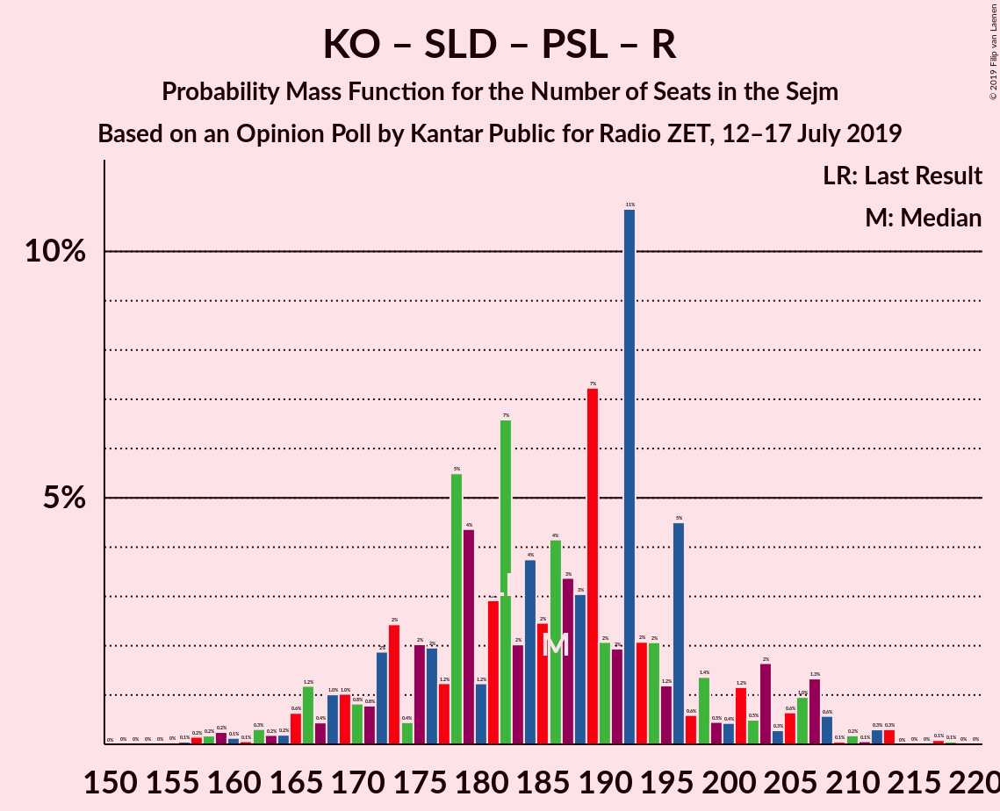

| Number of Seats | Probability | Accumulated | Special Marks |
|:---------------:|:-----------:|:-----------:|:-------------:|
| 157 | 0.1% | 100% |  |
| 158 | 0% | 99.9% |  |
| 159 | 0% | 99.9% |  |
| 160 | 0% | 99.9% |  |
| 161 | 0% | 99.9% |  |
| 162 | 0% | 99.9% |  |
| 163 | 0% | 99.9% |  |
| 164 | 0% | 99.9% |  |
| 165 | 8% | 99.9% |  |
| 166 | 4% | 92% |  |
| 167 | 0% | 87% |  |
| 168 | 0% | 87% |  |
| 169 | 0.1% | 87% |  |
| 170 | 0% | 87% |  |
| 171 | 0% | 87% |  |
| 172 | 0% | 87% |  |
| 173 | 0% | 87% |  |
| 174 | 0% | 87% |  |
| 175 | 0% | 87% |  |
| 176 | 0% | 87% |  |
| 177 | 0% | 87% |  |
| 178 | 0% | 87% |  |
| 179 | 0% | 87% |  |
| 180 | 0% | 87% |  |
| 181 | 0% | 87% |  |
| 182 | 0% | 87% | Last Result |
| 183 | 1.0% | 87% |  |
| 184 | 0.3% | 86% |  |
| 185 | 0% | 86% |  |
| 186 | 0.3% | 86% |  |
| 187 | 0% | 86% |  |
| 188 | 0.2% | 86% |  |
| 189 | 0% | 86% |  |
| 190 | 0% | 86% |  |
| 191 | 0% | 86% |  |
| 192 | 0% | 86% |  |
| 193 | 0% | 86% |  |
| 194 | 1.2% | 86% |  |
| 195 | 0% | 84% |  |
| 196 | 0% | 84% |  |
| 197 | 0% | 84% |  |
| 198 | 0% | 84% |  |
| 199 | 0% | 84% |  |
| 200 | 0% | 84% |  |
| 201 | 0% | 84% |  |
| 202 | 0% | 84% |  |
| 203 | 79% | 84% | Median |
| 204 | 0% | 5% |  |
| 205 | 0% | 5% |  |
| 206 | 0% | 5% |  |
| 207 | 0% | 5% |  |
| 208 | 5% | 5% |  |
| 209 | 0% | 0% |  |

### Koalicja Obywatelska – Polskie Stronnictwo Ludowe

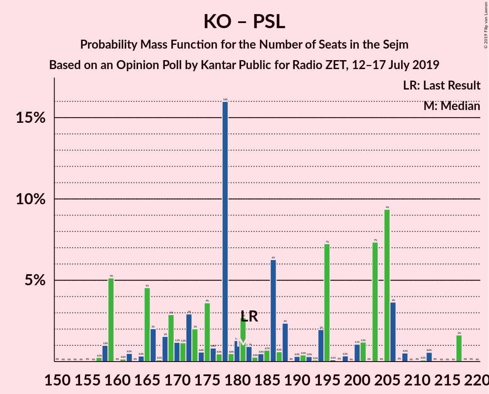

| Number of Seats | Probability | Accumulated | Special Marks |
|:---------------:|:-----------:|:-----------:|:-------------:|
| 157 | 0.1% | 100% |  |
| 158 | 0% | 99.9% |  |
| 159 | 0% | 99.9% |  |
| 160 | 0% | 99.9% |  |
| 161 | 0% | 99.9% |  |
| 162 | 0% | 99.9% |  |
| 163 | 0% | 99.9% |  |
| 164 | 0% | 99.9% |  |
| 165 | 8% | 99.9% |  |
| 166 | 4% | 92% |  |
| 167 | 0% | 87% |  |
| 168 | 0% | 87% |  |
| 169 | 0.1% | 87% |  |
| 170 | 0% | 87% |  |
| 171 | 0% | 87% |  |
| 172 | 0% | 87% |  |
| 173 | 0% | 87% |  |
| 174 | 0% | 87% |  |
| 175 | 0% | 87% |  |
| 176 | 0% | 87% |  |
| 177 | 0% | 87% |  |
| 178 | 0% | 87% |  |
| 179 | 0% | 87% |  |
| 180 | 0% | 87% |  |
| 181 | 0% | 87% |  |
| 182 | 0% | 87% | Last Result |
| 183 | 1.0% | 87% |  |
| 184 | 0.3% | 86% |  |
| 185 | 0% | 86% |  |
| 186 | 0.3% | 86% |  |
| 187 | 0% | 86% |  |
| 188 | 0.2% | 86% |  |
| 189 | 0% | 86% |  |
| 190 | 0% | 86% |  |
| 191 | 0% | 86% |  |
| 192 | 0% | 86% |  |
| 193 | 0% | 86% |  |
| 194 | 1.2% | 86% |  |
| 195 | 0% | 84% |  |
| 196 | 0% | 84% |  |
| 197 | 0% | 84% |  |
| 198 | 0% | 84% |  |
| 199 | 0% | 84% |  |
| 200 | 0% | 84% |  |
| 201 | 0% | 84% |  |
| 202 | 0% | 84% |  |
| 203 | 79% | 84% | Median |
| 204 | 0% | 5% |  |
| 205 | 0% | 5% |  |
| 206 | 0% | 5% |  |
| 207 | 0% | 5% |  |
| 208 | 5% | 5% |  |
| 209 | 0% | 0% |  |

### Koalicja Obywatelska – Sojusz Lewicy Demokratycznej – Polskie Stronnictwo Ludowe

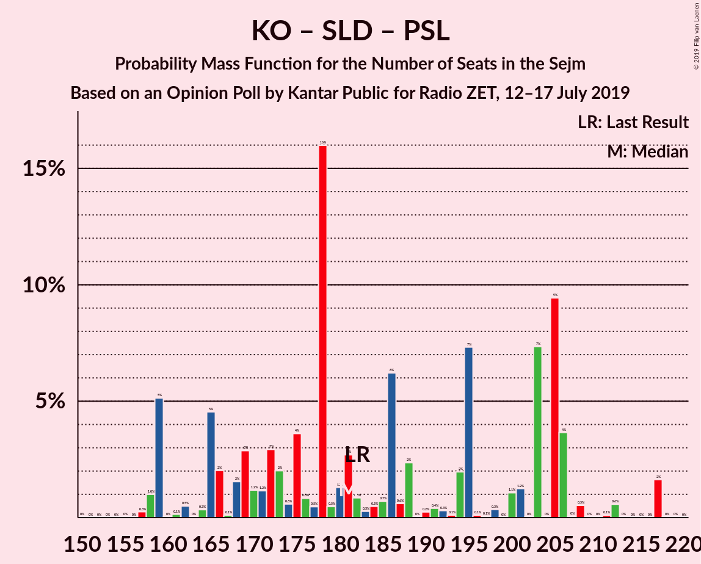

| Number of Seats | Probability | Accumulated | Special Marks |
|:---------------:|:-----------:|:-----------:|:-------------:|
| 157 | 0.1% | 100% |  |
| 158 | 0% | 99.9% |  |
| 159 | 0% | 99.9% |  |
| 160 | 0% | 99.9% |  |
| 161 | 0% | 99.9% |  |
| 162 | 0% | 99.9% |  |
| 163 | 0% | 99.9% |  |
| 164 | 0% | 99.9% |  |
| 165 | 8% | 99.9% |  |
| 166 | 4% | 92% |  |
| 167 | 0% | 87% |  |
| 168 | 0% | 87% |  |
| 169 | 0.1% | 87% |  |
| 170 | 0% | 87% |  |
| 171 | 0% | 87% |  |
| 172 | 0% | 87% |  |
| 173 | 0% | 87% |  |
| 174 | 0% | 87% |  |
| 175 | 0% | 87% |  |
| 176 | 0% | 87% |  |
| 177 | 0% | 87% |  |
| 178 | 0% | 87% |  |
| 179 | 0% | 87% |  |
| 180 | 0% | 87% |  |
| 181 | 0% | 87% |  |
| 182 | 0% | 87% | Last Result |
| 183 | 1.0% | 87% |  |
| 184 | 0.3% | 86% |  |
| 185 | 0% | 86% |  |
| 186 | 0.3% | 86% |  |
| 187 | 0% | 86% |  |
| 188 | 0.2% | 86% |  |
| 189 | 0% | 86% |  |
| 190 | 0% | 86% |  |
| 191 | 0% | 86% |  |
| 192 | 0% | 86% |  |
| 193 | 0% | 86% |  |
| 194 | 1.2% | 86% |  |
| 195 | 0% | 84% |  |
| 196 | 0% | 84% |  |
| 197 | 0% | 84% |  |
| 198 | 0% | 84% |  |
| 199 | 0% | 84% |  |
| 200 | 0% | 84% |  |
| 201 | 0% | 84% |  |
| 202 | 0% | 84% |  |
| 203 | 79% | 84% | Median |
| 204 | 0% | 5% |  |
| 205 | 0% | 5% |  |
| 206 | 0% | 5% |  |
| 207 | 0% | 5% |  |
| 208 | 5% | 5% |  |
| 209 | 0% | 0% |  |

### Koalicja Obywatelska – Sojusz Lewicy Demokratycznej

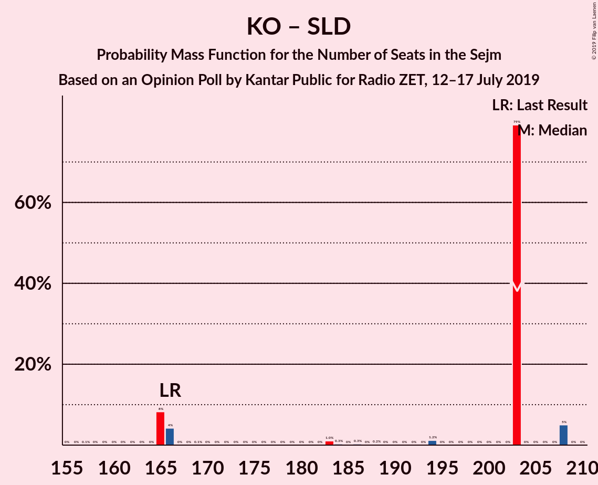

| Number of Seats | Probability | Accumulated | Special Marks |
|:---------------:|:-----------:|:-----------:|:-------------:|
| 157 | 0.1% | 100% |  |
| 158 | 0% | 99.9% |  |
| 159 | 0% | 99.9% |  |
| 160 | 0% | 99.9% |  |
| 161 | 0% | 99.9% |  |
| 162 | 0% | 99.9% |  |
| 163 | 0% | 99.9% |  |
| 164 | 0% | 99.9% |  |
| 165 | 8% | 99.9% |  |
| 166 | 4% | 92% | Last Result |
| 167 | 0% | 87% |  |
| 168 | 0% | 87% |  |
| 169 | 0.1% | 87% |  |
| 170 | 0% | 87% |  |
| 171 | 0% | 87% |  |
| 172 | 0% | 87% |  |
| 173 | 0% | 87% |  |
| 174 | 0% | 87% |  |
| 175 | 0% | 87% |  |
| 176 | 0% | 87% |  |
| 177 | 0% | 87% |  |
| 178 | 0% | 87% |  |
| 179 | 0% | 87% |  |
| 180 | 0% | 87% |  |
| 181 | 0% | 87% |  |
| 182 | 0% | 87% |  |
| 183 | 1.0% | 87% |  |
| 184 | 0.3% | 86% |  |
| 185 | 0% | 86% |  |
| 186 | 0.3% | 86% |  |
| 187 | 0% | 86% |  |
| 188 | 0.2% | 86% |  |
| 189 | 0% | 86% |  |
| 190 | 0% | 86% |  |
| 191 | 0% | 86% |  |
| 192 | 0% | 86% |  |
| 193 | 0% | 86% |  |
| 194 | 1.2% | 86% |  |
| 195 | 0% | 84% |  |
| 196 | 0% | 84% |  |
| 197 | 0% | 84% |  |
| 198 | 0% | 84% |  |
| 199 | 0% | 84% |  |
| 200 | 0% | 84% |  |
| 201 | 0% | 84% |  |
| 202 | 0% | 84% |  |
| 203 | 79% | 84% | Median |
| 204 | 0% | 5% |  |
| 205 | 0% | 5% |  |
| 206 | 0% | 5% |  |
| 207 | 0% | 5% |  |
| 208 | 5% | 5% |  |
| 209 | 0% | 0% |  |

## Technical Information

### Opinion Poll

+ **Polling firm:** Kantar Public
+ **Commissioner(s):** Radio ZET
+ **Fieldwork period:** 12–17 July 2019

### Calculations

+ **Sample size:** 974
+ **Simulations done:** 1,024
+ **Error estimate:** 5.03%

