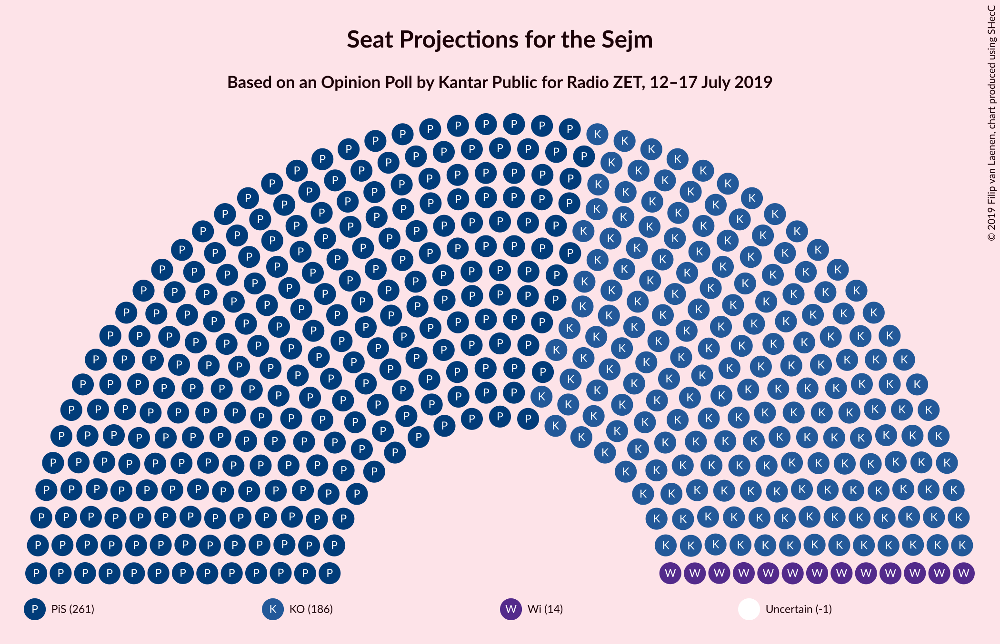
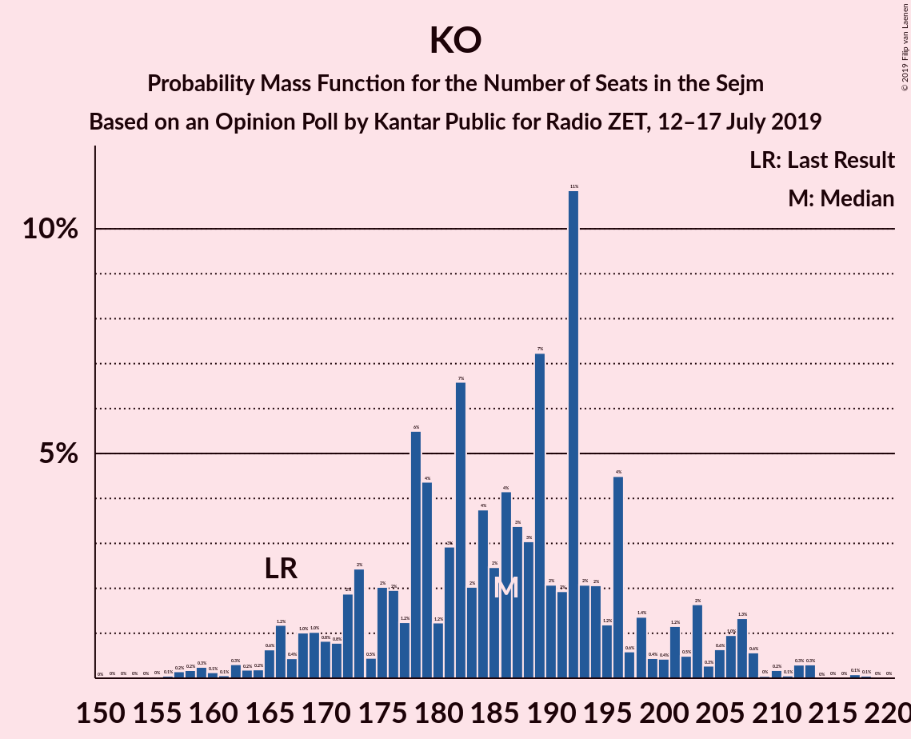

# Opinion Poll by Kantar Public for Radio ZET, 12–17 July 2019

<a href="#voting-intentions">Voting Intentions</a> | <a href="#seats">Seats</a> | <a href="#coalitions">Coalitions</a> | <a href="#technical-information">Technical Information</a>

## Voting Intentions

### Confidence Intervals

| Party | Last Result | Poll Result | 80% Confidence Interval | 90% Confidence Interval | 95% Confidence Interval | 99% Confidence Interval |
|:-----:|:-----------:|:-----------:|:-----------------------:|:-----------------------:|:-----------------------:|:-----------------------:|
| Prawo i Sprawiedliwość | 37.6% | 39.0% | 37.0–41.0% |36.5–41.6% |36.0–42.1% |35.1–43.1% |
| Koalicja Obywatelska | 31.7% | 29.0% | 27.1–30.9% |26.6–31.4% |26.2–31.9% |25.3–32.8% |
| Wiosna | 0.0% | 5.0% | 4.2–6.1% |4.0–6.3% |3.8–6.6% |3.5–7.1% |
| Kukiz’15 | 8.8% | 4.0% | 3.3–4.9% |3.1–5.2% |2.9–5.4% |2.6–5.9% |
| Sojusz Lewicy Demokratycznej | 7.6% | 3.0% | 2.4–3.8% |2.2–4.0% |2.1–4.3% |1.8–4.7% |
| Polskie Stronnictwo Ludowe | 5.1% | 2.0% | 1.5–2.7% |1.4–2.9% |1.2–3.0% |1.1–3.4% |
| KORWiN | 4.8% | 2.0% | 1.5–2.7% |1.4–2.9% |1.2–3.0% |1.1–3.4% |
| Lewica Razem | 3.6% | 1.0% | 0.7–1.6% |0.6–1.7% |0.6–1.9% |0.4–2.2% |

*Note:* The poll result column reflects the actual value used in the calculations. Published results may vary slightly, and in addition be rounded to fewer digits.

## Seats

### Confidence Intervals

| Party | Last Result | Median | 80% Confidence Interval | 90% Confidence Interval | 95% Confidence Interval | 99% Confidence Interval |
|:-----:|:-----------:|:------:|:-----------------------:|:-----------------------:|:-----------------------:|:-----------------------:|
| <a href="#prawo-i-sprawiedliwość">Prawo i Sprawiedliwość</a> | 235 | 265 | 245–276 |245–281 |243–287 |239–296 |
| <a href="#koalicja-obywatelska">Koalicja Obywatelska</a> | 166 | 181 | 165–205 |159–206 |159–208 |158–217 |
| <a href="#wiosna">Wiosna</a> | 0 | 15 | 0–27 |0–28 |0–29 |0–32 |
| <a href="#kukiz’15">Kukiz’15</a> | 42 | 0 | 0–12 |0–12 |0–13 |0–24 |
| <a href="#sojusz-lewicy-demokratycznej">Sojusz Lewicy Demokratycznej</a> | 0 | 0 | 0 |0 |0 |0 |
| <a href="#polskie-stronnictwo-ludowe">Polskie Stronnictwo Ludowe</a> | 16 | 0 | 0 |0 |0 |0 |
| <a href="#korwin">KORWiN</a> | 0 | 0 | 0 |0 |0 |0 |
| <a href="#lewica-razem">Lewica Razem</a> | 0 | 0 | 0 |0 |0 |0 |

### Prawo i Sprawiedliwość

*For a full overview of the results for this party, see the [Prawo i Sprawiedliwość](party-prawoisprawiedliwość.html) page.*

| Number of Seats | Probability | Accumulated | Special Marks |
|:---------------:|:-----------:|:-----------:|:-------------:|
| 225 | 0.1% | 100% |  |
| 226 | 0% | 99.9% |  |
| 227 | 0% | 99.9% |  |
| 228 | 0% | 99.9% |  |
| 229 | 0% | 99.9% |  |
| 230 | 0.1% | 99.9% |  |
| 231 | 0% | 99.8% | Majority |
| 232 | 0% | 99.8% |  |
| 233 | 0% | 99.8% |  |
| 234 | 0% | 99.8% |  |
| 235 | 0% | 99.8% | Last Result |
| 236 | 0% | 99.7% |  |
| 237 | 0.1% | 99.7% |  |
| 238 | 0% | 99.6% |  |
| 239 | 1.1% | 99.6% |  |
| 240 | 0.1% | 98.5% |  |
| 241 | 0.8% | 98% |  |
| 242 | 0% | 98% |  |
| 243 | 2% | 98% |  |
| 244 | 0% | 96% |  |
| 245 | 8% | 96% |  |
| 246 | 0.3% | 88% |  |
| 247 | 0.7% | 88% |  |
| 248 | 1.5% | 87% |  |
| 249 | 0.3% | 86% |  |
| 250 | 0.6% | 85% |  |
| 251 | 4% | 85% |  |
| 252 | 0.6% | 81% |  |
| 253 | 0.7% | 80% |  |
| 254 | 4% | 79% |  |
| 255 | 11% | 76% |  |
| 256 | 3% | 65% |  |
| 257 | 3% | 62% |  |
| 258 | 0.2% | 59% |  |
| 259 | 1.3% | 59% |  |
| 260 | 0% | 57% |  |
| 261 | 2% | 57% |  |
| 262 | 1.1% | 56% |  |
| 263 | 0.1% | 54% |  |
| 264 | 0.4% | 54% |  |
| 265 | 5% | 54% | Median |
| 266 | 2% | 49% |  |
| 267 | 17% | 46% |  |
| 268 | 7% | 29% |  |
| 269 | 0.5% | 23% |  |
| 270 | 4% | 22% |  |
| 271 | 0.9% | 19% |  |
| 272 | 0% | 18% |  |
| 273 | 0.7% | 18% |  |
| 274 | 6% | 17% |  |
| 275 | 0.2% | 11% |  |
| 276 | 1.4% | 11% |  |
| 277 | 0% | 9% |  |
| 278 | 0.4% | 9% |  |
| 279 | 0% | 9% |  |
| 280 | 0% | 9% |  |
| 281 | 5% | 9% |  |
| 282 | 0% | 3% |  |
| 283 | 0% | 3% |  |
| 284 | 0.1% | 3% |  |
| 285 | 0% | 3% |  |
| 286 | 0% | 3% |  |
| 287 | 1.2% | 3% |  |
| 288 | 0% | 2% |  |
| 289 | 0% | 2% |  |
| 290 | 0% | 2% |  |
| 291 | 0% | 2% |  |
| 292 | 1.5% | 2% |  |
| 293 | 0% | 0.5% |  |
| 294 | 0% | 0.5% |  |
| 295 | 0% | 0.5% |  |
| 296 | 0.1% | 0.5% |  |
| 297 | 0% | 0.4% |  |
| 298 | 0.4% | 0.4% |  |
| 299 | 0% | 0% |  |

### Koalicja Obywatelska

*For a full overview of the results for this party, see the [Koalicja Obywatelska](party-koalicjaobywatelska.html) page.*

| Number of Seats | Probability | Accumulated | Special Marks |
|:---------------:|:-----------:|:-----------:|:-------------:|
| 154 | 0% | 100% |  |
| 155 | 0% | 99.9% |  |
| 156 | 0% | 99.9% |  |
| 157 | 0.3% | 99.9% |  |
| 158 | 1.0% | 99.6% |  |
| 159 | 5% | 98.7% |  |
| 160 | 0% | 94% |  |
| 161 | 0.2% | 93% |  |
| 162 | 0.5% | 93% |  |
| 163 | 0% | 93% |  |
| 164 | 0.3% | 93% |  |
| 165 | 5% | 92% |  |
| 166 | 2% | 88% | Last Result |
| 167 | 0.1% | 86% |  |
| 168 | 2% | 86% |  |
| 169 | 3% | 84% |  |
| 170 | 1.2% | 81% |  |
| 171 | 1.2% | 80% |  |
| 172 | 3% | 79% |  |
| 173 | 2% | 76% |  |
| 174 | 0.6% | 74% |  |
| 175 | 4% | 74% |  |
| 176 | 0.8% | 70% |  |
| 177 | 0.5% | 69% |  |
| 178 | 16% | 69% |  |
| 179 | 0.5% | 53% |  |
| 180 | 1.3% | 52% |  |
| 181 | 3% | 51% | Median |
| 182 | 0.9% | 48% |  |
| 183 | 0.3% | 47% |  |
| 184 | 0.5% | 47% |  |
| 185 | 0.7% | 46% |  |
| 186 | 6% | 46% |  |
| 187 | 0.6% | 40% |  |
| 188 | 2% | 39% |  |
| 189 | 0% | 37% |  |
| 190 | 0.3% | 37% |  |
| 191 | 0.4% | 36% |  |
| 192 | 0.3% | 36% |  |
| 193 | 0.1% | 35% |  |
| 194 | 2% | 35% |  |
| 195 | 7% | 33% |  |
| 196 | 0.1% | 26% |  |
| 197 | 0% | 26% |  |
| 198 | 0.3% | 26% |  |
| 199 | 0% | 26% |  |
| 200 | 1.1% | 26% |  |
| 201 | 1.2% | 25% |  |
| 202 | 0% | 23% |  |
| 203 | 7% | 23% |  |
| 204 | 0% | 16% |  |
| 205 | 9% | 16% |  |
| 206 | 4% | 7% |  |
| 207 | 0% | 3% |  |
| 208 | 0.5% | 3% |  |
| 209 | 0% | 2% |  |
| 210 | 0% | 2% |  |
| 211 | 0.1% | 2% |  |
| 212 | 0.6% | 2% |  |
| 213 | 0% | 2% |  |
| 214 | 0% | 2% |  |
| 215 | 0% | 2% |  |
| 216 | 0% | 2% |  |
| 217 | 2% | 2% |  |
| 218 | 0% | 0.1% |  |
| 219 | 0% | 0.1% |  |
| 220 | 0% | 0% |  |

### Wiosna

*For a full overview of the results for this party, see the [Wiosna](party-wiosna.html) page.*

| Number of Seats | Probability | Accumulated | Special Marks |
|:---------------:|:-----------:|:-----------:|:-------------:|
| 0 | 43% | 100% | Last Result |
| 1 | 0% | 57% |  |
| 2 | 0% | 57% |  |
| 3 | 0% | 57% |  |
| 4 | 0% | 57% |  |
| 5 | 0% | 57% |  |
| 6 | 0% | 57% |  |
| 7 | 0% | 57% |  |
| 8 | 0% | 57% |  |
| 9 | 0.1% | 57% |  |
| 10 | 0% | 57% |  |
| 11 | 0% | 57% |  |
| 12 | 0% | 57% |  |
| 13 | 0% | 57% |  |
| 14 | 4% | 57% |  |
| 15 | 17% | 53% | Median |
| 16 | 6% | 36% |  |
| 17 | 0.4% | 30% |  |
| 18 | 4% | 30% |  |
| 19 | 1.0% | 26% |  |
| 20 | 5% | 25% |  |
| 21 | 1.2% | 19% |  |
| 22 | 0.5% | 18% |  |
| 23 | 3% | 18% |  |
| 24 | 2% | 14% |  |
| 25 | 0.4% | 12% |  |
| 26 | 1.5% | 12% |  |
| 27 | 1.5% | 10% |  |
| 28 | 5% | 9% |  |
| 29 | 2% | 4% |  |
| 30 | 0.9% | 2% |  |
| 31 | 0.6% | 1.4% |  |
| 32 | 0.3% | 0.8% |  |
| 33 | 0.4% | 0.5% |  |
| 34 | 0% | 0.1% |  |
| 35 | 0% | 0.1% |  |
| 36 | 0.1% | 0.1% |  |
| 37 | 0% | 0% |  |

### Kukiz’15

*For a full overview of the results for this party, see the [Kukiz’15](party-kukiz’15.html) page.*

| Number of Seats | Probability | Accumulated | Special Marks |
|:---------------:|:-----------:|:-----------:|:-------------:|
| 0 | 85% | 100% | Median |
| 1 | 0% | 15% |  |
| 2 | 0% | 15% |  |
| 3 | 0% | 15% |  |
| 4 | 0% | 15% |  |
| 5 | 0% | 15% |  |
| 6 | 0% | 15% |  |
| 7 | 0% | 15% |  |
| 8 | 0% | 15% |  |
| 9 | 0.7% | 15% |  |
| 10 | 0% | 14% |  |
| 11 | 4% | 14% |  |
| 12 | 7% | 10% |  |
| 13 | 0.6% | 3% |  |
| 14 | 0.1% | 2% |  |
| 15 | 0.2% | 2% |  |
| 16 | 0.2% | 2% |  |
| 17 | 0.1% | 2% |  |
| 18 | 0.1% | 1.5% |  |
| 19 | 0.1% | 1.4% |  |
| 20 | 0.1% | 1.4% |  |
| 21 | 0.1% | 1.3% |  |
| 22 | 0.1% | 1.2% |  |
| 23 | 0% | 1.1% |  |
| 24 | 0.7% | 1.1% |  |
| 25 | 0.3% | 0.4% |  |
| 26 | 0% | 0.1% |  |
| 27 | 0% | 0.1% |  |
| 28 | 0% | 0.1% |  |
| 29 | 0% | 0.1% |  |
| 30 | 0% | 0.1% |  |
| 31 | 0% | 0.1% |  |
| 32 | 0% | 0.1% |  |
| 33 | 0% | 0.1% |  |
| 34 | 0% | 0% |  |
| 35 | 0% | 0% |  |
| 36 | 0% | 0% |  |
| 37 | 0% | 0% |  |
| 38 | 0% | 0% |  |
| 39 | 0% | 0% |  |
| 40 | 0% | 0% |  |
| 41 | 0% | 0% |  |
| 42 | 0% | 0% | Last Result |

### Sojusz Lewicy Demokratycznej

*For a full overview of the results for this party, see the [Sojusz Lewicy Demokratycznej](party-sojuszlewicydemokratycznej.html) page.*

| Number of Seats | Probability | Accumulated | Special Marks |
|:---------------:|:-----------:|:-----------:|:-------------:|
| 0 | 99.7% | 100% | Last Result, Median |
| 1 | 0% | 0.3% |  |
| 2 | 0% | 0.3% |  |
| 3 | 0% | 0.3% |  |
| 4 | 0% | 0.3% |  |
| 5 | 0% | 0.3% |  |
| 6 | 0% | 0.3% |  |
| 7 | 0% | 0.3% |  |
| 8 | 0% | 0.3% |  |
| 9 | 0% | 0.3% |  |
| 10 | 0% | 0.3% |  |
| 11 | 0% | 0.3% |  |
| 12 | 0% | 0.3% |  |
| 13 | 0.1% | 0.3% |  |
| 14 | 0% | 0.2% |  |
| 15 | 0.1% | 0.2% |  |
| 16 | 0% | 0% |  |

### Polskie Stronnictwo Ludowe

*For a full overview of the results for this party, see the [Polskie Stronnictwo Ludowe](party-polskiestronnictwoludowe.html) page.*

| Number of Seats | Probability | Accumulated | Special Marks |
|:---------------:|:-----------:|:-----------:|:-------------:|
| 0 | 100% | 100% | Median |
| 1 | 0% | 0% |  |
| 2 | 0% | 0% |  |
| 3 | 0% | 0% |  |
| 4 | 0% | 0% |  |
| 5 | 0% | 0% |  |
| 6 | 0% | 0% |  |
| 7 | 0% | 0% |  |
| 8 | 0% | 0% |  |
| 9 | 0% | 0% |  |
| 10 | 0% | 0% |  |
| 11 | 0% | 0% |  |
| 12 | 0% | 0% |  |
| 13 | 0% | 0% |  |
| 14 | 0% | 0% |  |
| 15 | 0% | 0% |  |
| 16 | 0% | 0% | Last Result |

### KORWiN

*For a full overview of the results for this party, see the [KORWiN](party-korwin.html) page.*

| Number of Seats | Probability | Accumulated | Special Marks |
|:---------------:|:-----------:|:-----------:|:-------------:|
| 0 | 100% | 100% | Last Result, Median |

### Lewica Razem

*For a full overview of the results for this party, see the [Lewica Razem](party-lewicarazem.html) page.*

| Number of Seats | Probability | Accumulated | Special Marks |
|:---------------:|:-----------:|:-----------:|:-------------:|
| 0 | 100% | 100% | Last Result, Median |

## Coalitions

### Confidence Intervals

| Coalition | Last Result | Median | Majority? | 80% Confidence Interval | 90% Confidence Interval | 95% Confidence Interval | 99% Confidence Interval |
|:---------:|:-----------:|:------:|:---------:|:-----------------------:|:-----------------------:|:-----------------------:|:-----------------------:|
| Prawo i Sprawiedliwość | 235 | 265 | 99.8% | 245–276 | 245–281 | 243–287 | 239–296 |
| Koalicja Obywatelska | 166 | 181 | 0% | 165–205 | 159–206 | 159–208 | 158–217 |
| Koalicja Obywatelska – Sojusz Lewicy Demokratycznej – Polskie Stronnictwo Ludowe – Lewica Razem | 182 | 181 | 0% | 165–205 | 159–206 | 159–208 | 158–217 |
| Koalicja Obywatelska – Polskie Stronnictwo Ludowe | 182 | 181 | 0% | 165–205 | 159–206 | 159–208 | 158–217 |
| Koalicja Obywatelska – Sojusz Lewicy Demokratycznej – Polskie Stronnictwo Ludowe | 182 | 181 | 0% | 165–205 | 159–206 | 159–208 | 158–217 |
| Koalicja Obywatelska – Sojusz Lewicy Demokratycznej | 166 | 181 | 0% | 165–205 | 159–206 | 159–208 | 158–217 |

### Prawo i Sprawiedliwość

| Number of Seats | Probability | Accumulated | Special Marks |
|:---------------:|:-----------:|:-----------:|:-------------:|
| 225 | 0.1% | 100% |  |
| 226 | 0% | 99.9% |  |
| 227 | 0% | 99.9% |  |
| 228 | 0% | 99.9% |  |
| 229 | 0% | 99.9% |  |
| 230 | 0.1% | 99.9% |  |
| 231 | 0% | 99.8% | Majority |
| 232 | 0% | 99.8% |  |
| 233 | 0% | 99.8% |  |
| 234 | 0% | 99.8% |  |
| 235 | 0% | 99.8% | Last Result |
| 236 | 0% | 99.7% |  |
| 237 | 0.1% | 99.7% |  |
| 238 | 0% | 99.6% |  |
| 239 | 1.1% | 99.6% |  |
| 240 | 0.1% | 98.5% |  |
| 241 | 0.8% | 98% |  |
| 242 | 0% | 98% |  |
| 243 | 2% | 98% |  |
| 244 | 0% | 96% |  |
| 245 | 8% | 96% |  |
| 246 | 0.3% | 88% |  |
| 247 | 0.7% | 88% |  |
| 248 | 1.5% | 87% |  |
| 249 | 0.3% | 86% |  |
| 250 | 0.6% | 85% |  |
| 251 | 4% | 85% |  |
| 252 | 0.6% | 81% |  |
| 253 | 0.7% | 80% |  |
| 254 | 4% | 79% |  |
| 255 | 11% | 76% |  |
| 256 | 3% | 65% |  |
| 257 | 3% | 62% |  |
| 258 | 0.2% | 59% |  |
| 259 | 1.3% | 59% |  |
| 260 | 0% | 57% |  |
| 261 | 2% | 57% |  |
| 262 | 1.1% | 56% |  |
| 263 | 0.1% | 54% |  |
| 264 | 0.4% | 54% |  |
| 265 | 5% | 54% | Median |
| 266 | 2% | 49% |  |
| 267 | 17% | 46% |  |
| 268 | 7% | 29% |  |
| 269 | 0.5% | 23% |  |
| 270 | 4% | 22% |  |
| 271 | 0.9% | 19% |  |
| 272 | 0% | 18% |  |
| 273 | 0.7% | 18% |  |
| 274 | 6% | 17% |  |
| 275 | 0.2% | 11% |  |
| 276 | 1.4% | 11% |  |
| 277 | 0% | 9% |  |
| 278 | 0.4% | 9% |  |
| 279 | 0% | 9% |  |
| 280 | 0% | 9% |  |
| 281 | 5% | 9% |  |
| 282 | 0% | 3% |  |
| 283 | 0% | 3% |  |
| 284 | 0.1% | 3% |  |
| 285 | 0% | 3% |  |
| 286 | 0% | 3% |  |
| 287 | 1.2% | 3% |  |
| 288 | 0% | 2% |  |
| 289 | 0% | 2% |  |
| 290 | 0% | 2% |  |
| 291 | 0% | 2% |  |
| 292 | 1.5% | 2% |  |
| 293 | 0% | 0.5% |  |
| 294 | 0% | 0.5% |  |
| 295 | 0% | 0.5% |  |
| 296 | 0.1% | 0.5% |  |
| 297 | 0% | 0.4% |  |
| 298 | 0.4% | 0.4% |  |
| 299 | 0% | 0% |  |

### Koalicja Obywatelska

| Number of Seats | Probability | Accumulated | Special Marks |
|:---------------:|:-----------:|:-----------:|:-------------:|
| 154 | 0% | 100% |  |
| 155 | 0% | 99.9% |  |
| 156 | 0% | 99.9% |  |
| 157 | 0.3% | 99.9% |  |
| 158 | 1.0% | 99.6% |  |
| 159 | 5% | 98.7% |  |
| 160 | 0% | 94% |  |
| 161 | 0.2% | 93% |  |
| 162 | 0.5% | 93% |  |
| 163 | 0% | 93% |  |
| 164 | 0.3% | 93% |  |
| 165 | 5% | 92% |  |
| 166 | 2% | 88% | Last Result |
| 167 | 0.1% | 86% |  |
| 168 | 2% | 86% |  |
| 169 | 3% | 84% |  |
| 170 | 1.2% | 81% |  |
| 171 | 1.2% | 80% |  |
| 172 | 3% | 79% |  |
| 173 | 2% | 76% |  |
| 174 | 0.6% | 74% |  |
| 175 | 4% | 74% |  |
| 176 | 0.8% | 70% |  |
| 177 | 0.5% | 69% |  |
| 178 | 16% | 69% |  |
| 179 | 0.5% | 53% |  |
| 180 | 1.3% | 52% |  |
| 181 | 3% | 51% | Median |
| 182 | 0.9% | 48% |  |
| 183 | 0.3% | 47% |  |
| 184 | 0.5% | 47% |  |
| 185 | 0.7% | 46% |  |
| 186 | 6% | 46% |  |
| 187 | 0.6% | 40% |  |
| 188 | 2% | 39% |  |
| 189 | 0% | 37% |  |
| 190 | 0.3% | 37% |  |
| 191 | 0.4% | 36% |  |
| 192 | 0.3% | 36% |  |
| 193 | 0.1% | 35% |  |
| 194 | 2% | 35% |  |
| 195 | 7% | 33% |  |
| 196 | 0.1% | 26% |  |
| 197 | 0% | 26% |  |
| 198 | 0.3% | 26% |  |
| 199 | 0% | 26% |  |
| 200 | 1.1% | 26% |  |
| 201 | 1.2% | 25% |  |
| 202 | 0% | 23% |  |
| 203 | 7% | 23% |  |
| 204 | 0% | 16% |  |
| 205 | 9% | 16% |  |
| 206 | 4% | 7% |  |
| 207 | 0% | 3% |  |
| 208 | 0.5% | 3% |  |
| 209 | 0% | 2% |  |
| 210 | 0% | 2% |  |
| 211 | 0.1% | 2% |  |
| 212 | 0.6% | 2% |  |
| 213 | 0% | 2% |  |
| 214 | 0% | 2% |  |
| 215 | 0% | 2% |  |
| 216 | 0% | 2% |  |
| 217 | 2% | 2% |  |
| 218 | 0% | 0.1% |  |
| 219 | 0% | 0.1% |  |
| 220 | 0% | 0% |  |

### Koalicja Obywatelska – Sojusz Lewicy Demokratycznej – Polskie Stronnictwo Ludowe – Lewica Razem

| Number of Seats | Probability | Accumulated | Special Marks |
|:---------------:|:-----------:|:-----------:|:-------------:|
| 154 | 0% | 100% |  |
| 155 | 0% | 99.9% |  |
| 156 | 0% | 99.9% |  |
| 157 | 0.3% | 99.9% |  |
| 158 | 1.0% | 99.7% |  |
| 159 | 5% | 98.7% |  |
| 160 | 0% | 94% |  |
| 161 | 0.1% | 93% |  |
| 162 | 0.5% | 93% |  |
| 163 | 0% | 93% |  |
| 164 | 0.3% | 93% |  |
| 165 | 5% | 92% |  |
| 166 | 2% | 88% |  |
| 167 | 0.1% | 86% |  |
| 168 | 2% | 86% |  |
| 169 | 3% | 84% |  |
| 170 | 1.2% | 81% |  |
| 171 | 1.2% | 80% |  |
| 172 | 3% | 79% |  |
| 173 | 2% | 76% |  |
| 174 | 0.6% | 74% |  |
| 175 | 4% | 74% |  |
| 176 | 0.8% | 70% |  |
| 177 | 0.5% | 69% |  |
| 178 | 16% | 69% |  |
| 179 | 0.5% | 53% |  |
| 180 | 1.3% | 52% |  |
| 181 | 3% | 51% | Median |
| 182 | 0.8% | 48% | Last Result |
| 183 | 0.3% | 47% |  |
| 184 | 0.5% | 47% |  |
| 185 | 0.7% | 47% |  |
| 186 | 6% | 46% |  |
| 187 | 0.6% | 40% |  |
| 188 | 2% | 39% |  |
| 189 | 0% | 37% |  |
| 190 | 0.2% | 37% |  |
| 191 | 0.4% | 36% |  |
| 192 | 0.3% | 36% |  |
| 193 | 0.1% | 36% |  |
| 194 | 2% | 36% |  |
| 195 | 7% | 34% |  |
| 196 | 0.1% | 26% |  |
| 197 | 0.1% | 26% |  |
| 198 | 0.3% | 26% |  |
| 199 | 0% | 26% |  |
| 200 | 1.1% | 26% |  |
| 201 | 1.2% | 25% |  |
| 202 | 0% | 24% |  |
| 203 | 7% | 24% |  |
| 204 | 0% | 16% |  |
| 205 | 9% | 16% |  |
| 206 | 4% | 7% |  |
| 207 | 0% | 3% |  |
| 208 | 0.5% | 3% |  |
| 209 | 0% | 2% |  |
| 210 | 0% | 2% |  |
| 211 | 0.1% | 2% |  |
| 212 | 0.6% | 2% |  |
| 213 | 0% | 2% |  |
| 214 | 0% | 2% |  |
| 215 | 0% | 2% |  |
| 216 | 0% | 2% |  |
| 217 | 2% | 2% |  |
| 218 | 0% | 0.1% |  |
| 219 | 0% | 0.1% |  |
| 220 | 0% | 0% |  |

### Koalicja Obywatelska – Polskie Stronnictwo Ludowe

| Number of Seats | Probability | Accumulated | Special Marks |
|:---------------:|:-----------:|:-----------:|:-------------:|
| 154 | 0% | 100% |  |
| 155 | 0% | 99.9% |  |
| 156 | 0% | 99.9% |  |
| 157 | 0.3% | 99.9% |  |
| 158 | 1.0% | 99.6% |  |
| 159 | 5% | 98.7% |  |
| 160 | 0% | 94% |  |
| 161 | 0.2% | 93% |  |
| 162 | 0.5% | 93% |  |
| 163 | 0% | 93% |  |
| 164 | 0.3% | 93% |  |
| 165 | 5% | 92% |  |
| 166 | 2% | 88% |  |
| 167 | 0.1% | 86% |  |
| 168 | 2% | 86% |  |
| 169 | 3% | 84% |  |
| 170 | 1.2% | 81% |  |
| 171 | 1.2% | 80% |  |
| 172 | 3% | 79% |  |
| 173 | 2% | 76% |  |
| 174 | 0.6% | 74% |  |
| 175 | 4% | 74% |  |
| 176 | 0.8% | 70% |  |
| 177 | 0.5% | 69% |  |
| 178 | 16% | 69% |  |
| 179 | 0.5% | 53% |  |
| 180 | 1.3% | 52% |  |
| 181 | 3% | 51% | Median |
| 182 | 0.9% | 48% | Last Result |
| 183 | 0.3% | 47% |  |
| 184 | 0.5% | 47% |  |
| 185 | 0.7% | 46% |  |
| 186 | 6% | 46% |  |
| 187 | 0.6% | 40% |  |
| 188 | 2% | 39% |  |
| 189 | 0% | 37% |  |
| 190 | 0.3% | 37% |  |
| 191 | 0.4% | 36% |  |
| 192 | 0.3% | 36% |  |
| 193 | 0.1% | 35% |  |
| 194 | 2% | 35% |  |
| 195 | 7% | 33% |  |
| 196 | 0.1% | 26% |  |
| 197 | 0% | 26% |  |
| 198 | 0.3% | 26% |  |
| 199 | 0% | 26% |  |
| 200 | 1.1% | 26% |  |
| 201 | 1.2% | 25% |  |
| 202 | 0% | 23% |  |
| 203 | 7% | 23% |  |
| 204 | 0% | 16% |  |
| 205 | 9% | 16% |  |
| 206 | 4% | 7% |  |
| 207 | 0% | 3% |  |
| 208 | 0.5% | 3% |  |
| 209 | 0% | 2% |  |
| 210 | 0% | 2% |  |
| 211 | 0.1% | 2% |  |
| 212 | 0.6% | 2% |  |
| 213 | 0% | 2% |  |
| 214 | 0% | 2% |  |
| 215 | 0% | 2% |  |
| 216 | 0% | 2% |  |
| 217 | 2% | 2% |  |
| 218 | 0% | 0.1% |  |
| 219 | 0% | 0.1% |  |
| 220 | 0% | 0% |  |

### Koalicja Obywatelska – Sojusz Lewicy Demokratycznej – Polskie Stronnictwo Ludowe

| Number of Seats | Probability | Accumulated | Special Marks |
|:---------------:|:-----------:|:-----------:|:-------------:|
| 154 | 0% | 100% |  |
| 155 | 0% | 99.9% |  |
| 156 | 0% | 99.9% |  |
| 157 | 0.3% | 99.9% |  |
| 158 | 1.0% | 99.7% |  |
| 159 | 5% | 98.7% |  |
| 160 | 0% | 94% |  |
| 161 | 0.1% | 93% |  |
| 162 | 0.5% | 93% |  |
| 163 | 0% | 93% |  |
| 164 | 0.3% | 93% |  |
| 165 | 5% | 92% |  |
| 166 | 2% | 88% |  |
| 167 | 0.1% | 86% |  |
| 168 | 2% | 86% |  |
| 169 | 3% | 84% |  |
| 170 | 1.2% | 81% |  |
| 171 | 1.2% | 80% |  |
| 172 | 3% | 79% |  |
| 173 | 2% | 76% |  |
| 174 | 0.6% | 74% |  |
| 175 | 4% | 74% |  |
| 176 | 0.8% | 70% |  |
| 177 | 0.5% | 69% |  |
| 178 | 16% | 69% |  |
| 179 | 0.5% | 53% |  |
| 180 | 1.3% | 52% |  |
| 181 | 3% | 51% | Median |
| 182 | 0.8% | 48% | Last Result |
| 183 | 0.3% | 47% |  |
| 184 | 0.5% | 47% |  |
| 185 | 0.7% | 47% |  |
| 186 | 6% | 46% |  |
| 187 | 0.6% | 40% |  |
| 188 | 2% | 39% |  |
| 189 | 0% | 37% |  |
| 190 | 0.2% | 37% |  |
| 191 | 0.4% | 36% |  |
| 192 | 0.3% | 36% |  |
| 193 | 0.1% | 36% |  |
| 194 | 2% | 36% |  |
| 195 | 7% | 34% |  |
| 196 | 0.1% | 26% |  |
| 197 | 0.1% | 26% |  |
| 198 | 0.3% | 26% |  |
| 199 | 0% | 26% |  |
| 200 | 1.1% | 26% |  |
| 201 | 1.2% | 25% |  |
| 202 | 0% | 24% |  |
| 203 | 7% | 24% |  |
| 204 | 0% | 16% |  |
| 205 | 9% | 16% |  |
| 206 | 4% | 7% |  |
| 207 | 0% | 3% |  |
| 208 | 0.5% | 3% |  |
| 209 | 0% | 2% |  |
| 210 | 0% | 2% |  |
| 211 | 0.1% | 2% |  |
| 212 | 0.6% | 2% |  |
| 213 | 0% | 2% |  |
| 214 | 0% | 2% |  |
| 215 | 0% | 2% |  |
| 216 | 0% | 2% |  |
| 217 | 2% | 2% |  |
| 218 | 0% | 0.1% |  |
| 219 | 0% | 0.1% |  |
| 220 | 0% | 0% |  |

### Koalicja Obywatelska – Sojusz Lewicy Demokratycznej

| Number of Seats | Probability | Accumulated | Special Marks |
|:---------------:|:-----------:|:-----------:|:-------------:|
| 154 | 0% | 100% |  |
| 155 | 0% | 99.9% |  |
| 156 | 0% | 99.9% |  |
| 157 | 0.3% | 99.9% |  |
| 158 | 1.0% | 99.7% |  |
| 159 | 5% | 98.7% |  |
| 160 | 0% | 94% |  |
| 161 | 0.1% | 93% |  |
| 162 | 0.5% | 93% |  |
| 163 | 0% | 93% |  |
| 164 | 0.3% | 93% |  |
| 165 | 5% | 92% |  |
| 166 | 2% | 88% | Last Result |
| 167 | 0.1% | 86% |  |
| 168 | 2% | 86% |  |
| 169 | 3% | 84% |  |
| 170 | 1.2% | 81% |  |
| 171 | 1.2% | 80% |  |
| 172 | 3% | 79% |  |
| 173 | 2% | 76% |  |
| 174 | 0.6% | 74% |  |
| 175 | 4% | 74% |  |
| 176 | 0.8% | 70% |  |
| 177 | 0.5% | 69% |  |
| 178 | 16% | 69% |  |
| 179 | 0.5% | 53% |  |
| 180 | 1.3% | 52% |  |
| 181 | 3% | 51% | Median |
| 182 | 0.8% | 48% |  |
| 183 | 0.3% | 47% |  |
| 184 | 0.5% | 47% |  |
| 185 | 0.7% | 47% |  |
| 186 | 6% | 46% |  |
| 187 | 0.6% | 40% |  |
| 188 | 2% | 39% |  |
| 189 | 0% | 37% |  |
| 190 | 0.2% | 37% |  |
| 191 | 0.4% | 36% |  |
| 192 | 0.3% | 36% |  |
| 193 | 0.1% | 36% |  |
| 194 | 2% | 36% |  |
| 195 | 7% | 34% |  |
| 196 | 0.1% | 26% |  |
| 197 | 0.1% | 26% |  |
| 198 | 0.3% | 26% |  |
| 199 | 0% | 26% |  |
| 200 | 1.1% | 26% |  |
| 201 | 1.2% | 25% |  |
| 202 | 0% | 24% |  |
| 203 | 7% | 24% |  |
| 204 | 0% | 16% |  |
| 205 | 9% | 16% |  |
| 206 | 4% | 7% |  |
| 207 | 0% | 3% |  |
| 208 | 0.5% | 3% |  |
| 209 | 0% | 2% |  |
| 210 | 0% | 2% |  |
| 211 | 0.1% | 2% |  |
| 212 | 0.6% | 2% |  |
| 213 | 0% | 2% |  |
| 214 | 0% | 2% |  |
| 215 | 0% | 2% |  |
| 216 | 0% | 2% |  |
| 217 | 2% | 2% |  |
| 218 | 0% | 0.1% |  |
| 219 | 0% | 0.1% |  |
| 220 | 0% | 0% |  |

## Technical Information

### Opinion Poll

+ **Polling firm:** Kantar Public
+ **Commissioner(s):** Radio ZET
+ **Fieldwork period:** 12–17 July 2019

### Calculations

+ **Sample size:** 974
+ **Simulations done:** 32,768
+ **Error estimate:** 3.72%

