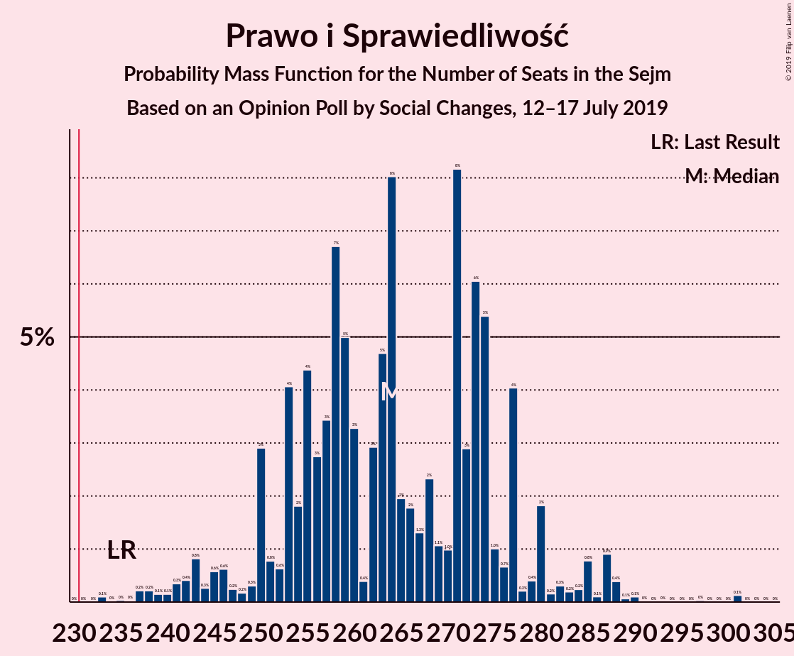
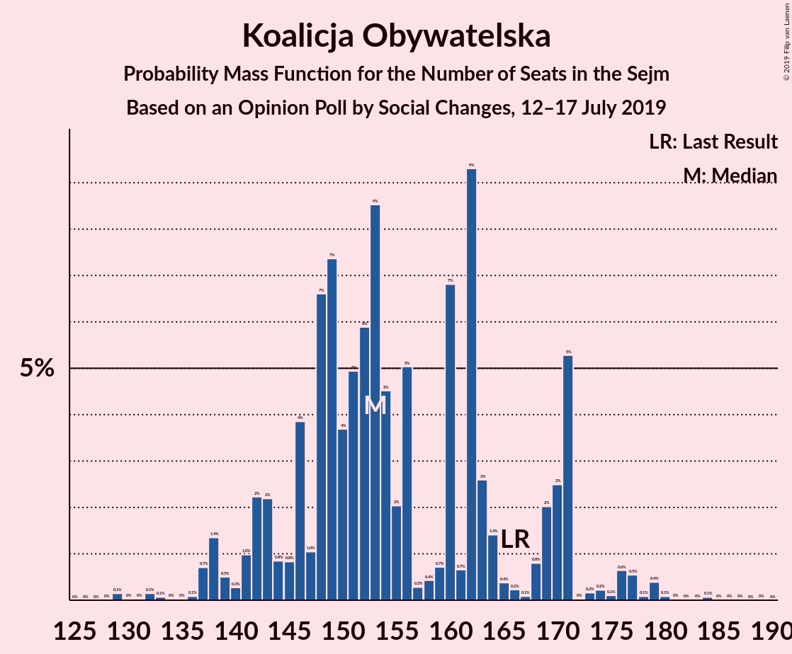
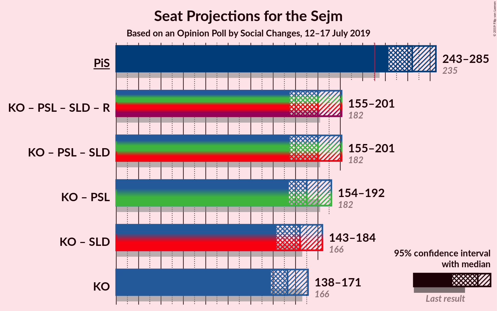
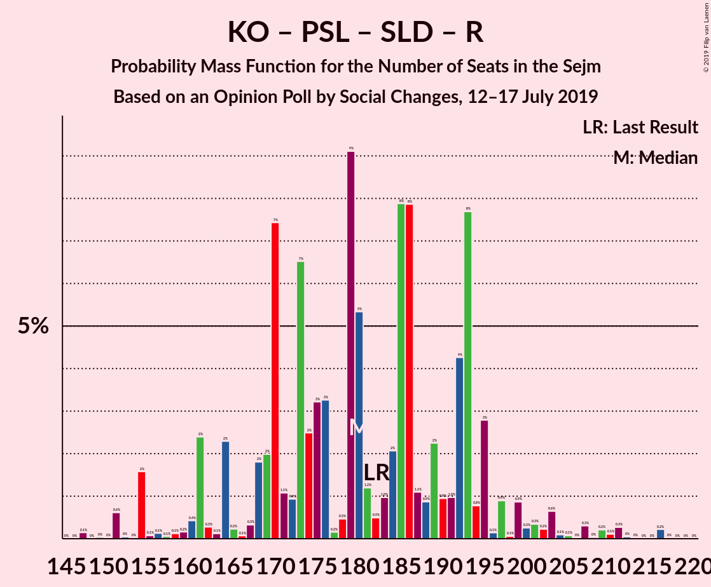
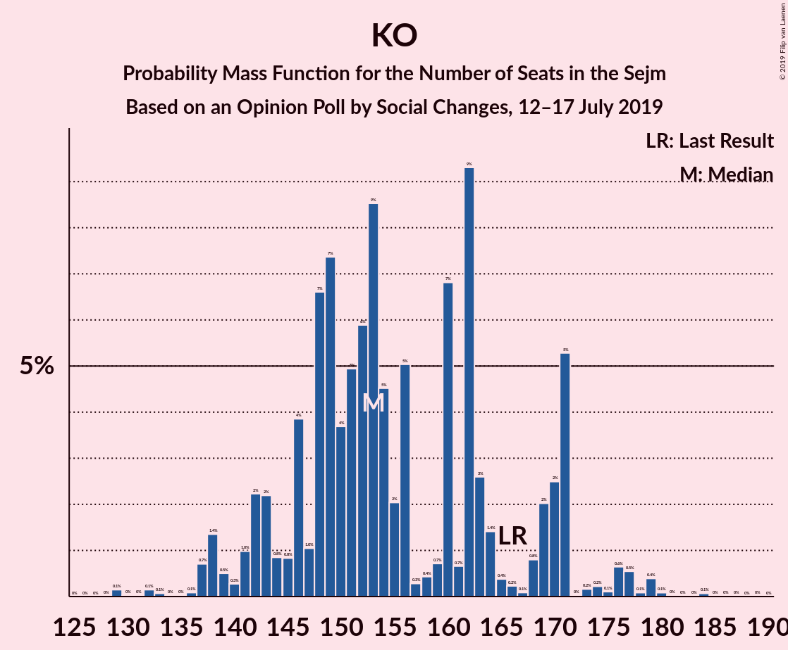

# Opinion Poll by Social Changes, 12–17 July 2019

<a href="#voting-intentions">Voting Intentions</a> | <a href="#seats">Seats</a> | <a href="#coalitions">Coalitions</a> | <a href="#technical-information">Technical Information</a>

## Voting Intentions

### Confidence Intervals

| Party | Last Result | Poll Result | 80% Confidence Interval | 90% Confidence Interval | 95% Confidence Interval | 99% Confidence Interval |
|:-----:|:-----------:|:-----------:|:-----------------------:|:-----------------------:|:-----------------------:|:-----------------------:|
| Prawo i Sprawiedliwość | 37.6% | 45.4% | 43.4–47.4% |42.8–48.0% |42.4–48.5% |41.4–49.5% |
| Koalicja Obywatelska | 31.7% | 28.3% | 26.5–30.2% |26.0–30.7% |25.6–31.2% |24.8–32.1% |
| Polskie Stronnictwo Ludowe | 5.1% | 5.8% | 4.9–6.8% |4.7–7.1% |4.5–7.4% |4.1–7.9% |
| Wiosna | 0.0% | 5.8% | 4.9–6.8% |4.7–7.1% |4.5–7.4% |4.1–7.9% |
| Sojusz Lewicy Demokratycznej | 7.6% | 5.3% | 4.5–6.3% |4.2–6.6% |4.1–6.8% |3.7–7.4% |
| KORWiN | 4.8% | 3.8% | 3.1–4.7% |2.9–4.9% |2.8–5.2% |2.5–5.6% |
| Kukiz’15 | 8.8% | 3.1% | 2.5–3.9% |2.3–4.1% |2.2–4.4% |1.9–4.8% |
| Lewica Razem | 3.6% | 1.2% | 0.9–1.8% |0.8–1.9% |0.7–2.1% |0.5–2.4% |

*Note:* The poll result column reflects the actual value used in the calculations. Published results may vary slightly, and in addition be rounded to fewer digits.

## Seats

### Confidence Intervals

| Party | Last Result | Median | 80% Confidence Interval | 90% Confidence Interval | 95% Confidence Interval | 99% Confidence Interval |
|:-----:|:-----------:|:------:|:-----------------------:|:-----------------------:|:-----------------------:|:-----------------------:|
| <a href="#prawo-i-sprawiedliwość">Prawo i Sprawiedliwość</a> | 235 | 252 | 252–253 |241–294 |241–294 |240–297 |
| <a href="#koalicja-obywatelska">Koalicja Obywatelska</a> | 166 | 144 | 144–165 |144–167 |144–167 |144–168 |
| <a href="#polskie-stronnictwo-ludowe">Polskie Stronnictwo Ludowe</a> | 16 | 23 | 23–25 |0–26 |0–26 |0–33 |
| <a href="#wiosna">Wiosna</a> | 0 | 30 | 0–31 |0–31 |0–31 |0–31 |
| <a href="#sojusz-lewicy-demokratycznej">Sojusz Lewicy Demokratycznej</a> | 0 | 11 | 9–11 |0–21 |0–21 |0–21 |
| <a href="#korwin">KORWiN</a> | 0 | 0 | 0–4 |0–5 |0–5 |0–5 |
| <a href="#kukiz’15">Kukiz’15</a> | 42 | 0 | 0 |0 |0 |0 |
| <a href="#lewica-razem">Lewica Razem</a> | 0 | 0 | 0 |0 |0 |0 |

### Prawo i Sprawiedliwość

*For a full overview of the results for this party, see the [Prawo i Sprawiedliwość](party-prawoisprawiedliwość.html) page.*

| Number of Seats | Probability | Accumulated | Special Marks |
|:---------------:|:-----------:|:-----------:|:-------------:|
| 228 | 0.1% | 100% |  |
| 229 | 0% | 99.8% |  |
| 230 | 0% | 99.8% |  |
| 231 | 0% | 99.8% | Majority |
| 232 | 0% | 99.8% |  |
| 233 | 0% | 99.8% |  |
| 234 | 0% | 99.8% |  |
| 235 | 0% | 99.8% | Last Result |
| 236 | 0% | 99.8% |  |
| 237 | 0% | 99.8% |  |
| 238 | 0.1% | 99.8% |  |
| 239 | 0% | 99.7% |  |
| 240 | 0.8% | 99.7% |  |
| 241 | 7% | 99.0% |  |
| 242 | 0.3% | 92% |  |
| 243 | 0% | 92% |  |
| 244 | 0% | 92% |  |
| 245 | 0% | 92% |  |
| 246 | 0% | 92% |  |
| 247 | 0% | 92% |  |
| 248 | 0% | 92% |  |
| 249 | 0% | 92% |  |
| 250 | 0% | 92% |  |
| 251 | 0% | 92% |  |
| 252 | 80% | 92% | Median |
| 253 | 3% | 12% |  |
| 254 | 3% | 9% |  |
| 255 | 0% | 6% |  |
| 256 | 0% | 6% |  |
| 257 | 0% | 6% |  |
| 258 | 0% | 6% |  |
| 259 | 0% | 6% |  |
| 260 | 0% | 6% |  |
| 261 | 0% | 6% |  |
| 262 | 0% | 6% |  |
| 263 | 0% | 6% |  |
| 264 | 0% | 6% |  |
| 265 | 0% | 6% |  |
| 266 | 0% | 6% |  |
| 267 | 0% | 6% |  |
| 268 | 0% | 6% |  |
| 269 | 0% | 6% |  |
| 270 | 0% | 6% |  |
| 271 | 0% | 6% |  |
| 272 | 0% | 6% |  |
| 273 | 0% | 6% |  |
| 274 | 0% | 6% |  |
| 275 | 0% | 6% |  |
| 276 | 0% | 6% |  |
| 277 | 0% | 6% |  |
| 278 | 0% | 6% |  |
| 279 | 0% | 6% |  |
| 280 | 0% | 6% |  |
| 281 | 0% | 6% |  |
| 282 | 0% | 6% |  |
| 283 | 0% | 6% |  |
| 284 | 0% | 6% |  |
| 285 | 0% | 6% |  |
| 286 | 0% | 6% |  |
| 287 | 0% | 6% |  |
| 288 | 0% | 6% |  |
| 289 | 0% | 6% |  |
| 290 | 0% | 6% |  |
| 291 | 0% | 6% |  |
| 292 | 0% | 6% |  |
| 293 | 0% | 6% |  |
| 294 | 4% | 6% |  |
| 295 | 0.5% | 1.2% |  |
| 296 | 0% | 0.7% |  |
| 297 | 0.5% | 0.7% |  |
| 298 | 0% | 0.2% |  |
| 299 | 0.2% | 0.2% |  |
| 300 | 0% | 0% |  |

### Koalicja Obywatelska

*For a full overview of the results for this party, see the [Koalicja Obywatelska](party-koalicjaobywatelska.html) page.*

| Number of Seats | Probability | Accumulated | Special Marks |
|:---------------:|:-----------:|:-----------:|:-------------:|
| 129 | 0% | 100% |  |
| 130 | 0% | 99.9% |  |
| 131 | 0% | 99.9% |  |
| 132 | 0% | 99.9% |  |
| 133 | 0% | 99.9% |  |
| 134 | 0% | 99.9% |  |
| 135 | 0% | 99.9% |  |
| 136 | 0% | 99.9% |  |
| 137 | 0% | 99.9% |  |
| 138 | 0% | 99.9% |  |
| 139 | 0% | 99.9% |  |
| 140 | 0% | 99.9% |  |
| 141 | 0% | 99.9% |  |
| 142 | 0% | 99.8% |  |
| 143 | 0% | 99.8% |  |
| 144 | 78% | 99.8% | Median |
| 145 | 4% | 21% |  |
| 146 | 0% | 17% |  |
| 147 | 0% | 17% |  |
| 148 | 0% | 17% |  |
| 149 | 0% | 17% |  |
| 150 | 0.2% | 17% |  |
| 151 | 0.1% | 17% |  |
| 152 | 0% | 17% |  |
| 153 | 0.1% | 17% |  |
| 154 | 0% | 17% |  |
| 155 | 0% | 17% |  |
| 156 | 0% | 17% |  |
| 157 | 0% | 17% |  |
| 158 | 0% | 17% |  |
| 159 | 1.0% | 17% |  |
| 160 | 0% | 16% |  |
| 161 | 0% | 16% |  |
| 162 | 4% | 16% |  |
| 163 | 0.5% | 12% |  |
| 164 | 0% | 11% |  |
| 165 | 3% | 11% |  |
| 166 | 0.2% | 8% | Last Result |
| 167 | 8% | 8% |  |
| 168 | 0.1% | 0.6% |  |
| 169 | 0.1% | 0.4% |  |
| 170 | 0% | 0.3% |  |
| 171 | 0% | 0.3% |  |
| 172 | 0% | 0.3% |  |
| 173 | 0.3% | 0.3% |  |
| 174 | 0% | 0% |  |

### Polskie Stronnictwo Ludowe

*For a full overview of the results for this party, see the [Polskie Stronnictwo Ludowe](party-polskiestronnictwoludowe.html) page.*

| Number of Seats | Probability | Accumulated | Special Marks |
|:---------------:|:-----------:|:-----------:|:-------------:|
| 0 | 6% | 100% |  |
| 1 | 0% | 94% |  |
| 2 | 0% | 94% |  |
| 3 | 0% | 94% |  |
| 4 | 0% | 94% |  |
| 5 | 0% | 94% |  |
| 6 | 0% | 94% |  |
| 7 | 0% | 94% |  |
| 8 | 0% | 94% |  |
| 9 | 0% | 94% |  |
| 10 | 0% | 94% |  |
| 11 | 0% | 94% |  |
| 12 | 0% | 94% |  |
| 13 | 0% | 94% |  |
| 14 | 0% | 94% |  |
| 15 | 0% | 94% |  |
| 16 | 0% | 94% | Last Result |
| 17 | 0% | 94% |  |
| 18 | 0% | 94% |  |
| 19 | 0% | 94% |  |
| 20 | 0% | 94% |  |
| 21 | 2% | 94% |  |
| 22 | 0% | 93% |  |
| 23 | 64% | 93% | Median |
| 24 | 17% | 28% |  |
| 25 | 3% | 12% |  |
| 26 | 7% | 9% |  |
| 27 | 1.0% | 2% |  |
| 28 | 0% | 1.2% |  |
| 29 | 0.1% | 1.2% |  |
| 30 | 0% | 1.1% |  |
| 31 | 0.1% | 1.1% |  |
| 32 | 0% | 1.0% |  |
| 33 | 0.8% | 1.0% |  |
| 34 | 0% | 0.2% |  |
| 35 | 0% | 0.2% |  |
| 36 | 0.1% | 0.2% |  |
| 37 | 0.1% | 0.1% |  |
| 38 | 0% | 0% |  |

### Wiosna

*For a full overview of the results for this party, see the [Wiosna](party-wiosna.html) page.*

| Number of Seats | Probability | Accumulated | Special Marks |
|:---------------:|:-----------:|:-----------:|:-------------:|
| 0 | 13% | 100% | Last Result |
| 1 | 0% | 87% |  |
| 2 | 0% | 87% |  |
| 3 | 0% | 87% |  |
| 4 | 0% | 87% |  |
| 5 | 0% | 87% |  |
| 6 | 0% | 87% |  |
| 7 | 0% | 87% |  |
| 8 | 0% | 87% |  |
| 9 | 0% | 87% |  |
| 10 | 0.8% | 87% |  |
| 11 | 0.2% | 86% |  |
| 12 | 0.9% | 86% |  |
| 13 | 0.1% | 85% |  |
| 14 | 0.1% | 85% |  |
| 15 | 0% | 85% |  |
| 16 | 0.1% | 85% |  |
| 17 | 2% | 85% |  |
| 18 | 0% | 82% |  |
| 19 | 0% | 82% |  |
| 20 | 0% | 82% |  |
| 21 | 0.1% | 82% |  |
| 22 | 0% | 82% |  |
| 23 | 0% | 82% |  |
| 24 | 0% | 82% |  |
| 25 | 0% | 82% |  |
| 26 | 0% | 82% |  |
| 27 | 0% | 82% |  |
| 28 | 0% | 82% |  |
| 29 | 0% | 82% |  |
| 30 | 67% | 82% | Median |
| 31 | 15% | 15% |  |
| 32 | 0% | 0.1% |  |
| 33 | 0% | 0.1% |  |
| 34 | 0% | 0.1% |  |
| 35 | 0% | 0.1% |  |
| 36 | 0% | 0.1% |  |
| 37 | 0% | 0.1% |  |
| 38 | 0% | 0.1% |  |
| 39 | 0% | 0.1% |  |
| 40 | 0.1% | 0.1% |  |
| 41 | 0% | 0% |  |

### Sojusz Lewicy Demokratycznej

*For a full overview of the results for this party, see the [Sojusz Lewicy Demokratycznej](party-sojuszlewicydemokratycznej.html) page.*

| Number of Seats | Probability | Accumulated | Special Marks |
|:---------------:|:-----------:|:-----------:|:-------------:|
| 0 | 8% | 100% | Last Result |
| 1 | 0% | 92% |  |
| 2 | 0% | 92% |  |
| 3 | 0% | 92% |  |
| 4 | 0% | 92% |  |
| 5 | 0% | 92% |  |
| 6 | 0% | 92% |  |
| 7 | 0.9% | 92% |  |
| 8 | 0% | 91% |  |
| 9 | 17% | 91% |  |
| 10 | 2% | 74% |  |
| 11 | 63% | 72% | Median |
| 12 | 0.1% | 9% |  |
| 13 | 0% | 9% |  |
| 14 | 0% | 9% |  |
| 15 | 0% | 9% |  |
| 16 | 0% | 9% |  |
| 17 | 0% | 9% |  |
| 18 | 1.1% | 9% |  |
| 19 | 0% | 8% |  |
| 20 | 0% | 8% |  |
| 21 | 8% | 8% |  |
| 22 | 0% | 0% |  |

### KORWiN

*For a full overview of the results for this party, see the [KORWiN](party-korwin.html) page.*

| Number of Seats | Probability | Accumulated | Special Marks |
|:---------------:|:-----------:|:-----------:|:-------------:|
| 0 | 87% | 100% | Last Result, Median |
| 1 | 0% | 13% |  |
| 2 | 0% | 13% |  |
| 3 | 0% | 13% |  |
| 4 | 4% | 13% |  |
| 5 | 8% | 9% |  |
| 6 | 0% | 0.1% |  |
| 7 | 0% | 0.1% |  |
| 8 | 0% | 0.1% |  |
| 9 | 0% | 0.1% |  |
| 10 | 0% | 0.1% |  |
| 11 | 0% | 0% |  |

### Kukiz’15

*For a full overview of the results for this party, see the [Kukiz’15](party-kukiz’15.html) page.*

| Number of Seats | Probability | Accumulated | Special Marks |
|:---------------:|:-----------:|:-----------:|:-------------:|
| 0 | 100% | 100% | Median |
| 1 | 0% | 0% |  |
| 2 | 0% | 0% |  |
| 3 | 0% | 0% |  |
| 4 | 0% | 0% |  |
| 5 | 0% | 0% |  |
| 6 | 0% | 0% |  |
| 7 | 0% | 0% |  |
| 8 | 0% | 0% |  |
| 9 | 0% | 0% |  |
| 10 | 0% | 0% |  |
| 11 | 0% | 0% |  |
| 12 | 0% | 0% |  |
| 13 | 0% | 0% |  |
| 14 | 0% | 0% |  |
| 15 | 0% | 0% |  |
| 16 | 0% | 0% |  |
| 17 | 0% | 0% |  |
| 18 | 0% | 0% |  |
| 19 | 0% | 0% |  |
| 20 | 0% | 0% |  |
| 21 | 0% | 0% |  |
| 22 | 0% | 0% |  |
| 23 | 0% | 0% |  |
| 24 | 0% | 0% |  |
| 25 | 0% | 0% |  |
| 26 | 0% | 0% |  |
| 27 | 0% | 0% |  |
| 28 | 0% | 0% |  |
| 29 | 0% | 0% |  |
| 30 | 0% | 0% |  |
| 31 | 0% | 0% |  |
| 32 | 0% | 0% |  |
| 33 | 0% | 0% |  |
| 34 | 0% | 0% |  |
| 35 | 0% | 0% |  |
| 36 | 0% | 0% |  |
| 37 | 0% | 0% |  |
| 38 | 0% | 0% |  |
| 39 | 0% | 0% |  |
| 40 | 0% | 0% |  |
| 41 | 0% | 0% |  |
| 42 | 0% | 0% | Last Result |

### Lewica Razem

*For a full overview of the results for this party, see the [Lewica Razem](party-lewicarazem.html) page.*

| Number of Seats | Probability | Accumulated | Special Marks |
|:---------------:|:-----------:|:-----------:|:-------------:|
| 0 | 100% | 100% | Last Result, Median |

## Coalitions

### Confidence Intervals

| Coalition | Last Result | Median | Majority? | 80% Confidence Interval | 90% Confidence Interval | 95% Confidence Interval | 99% Confidence Interval |
|:---------:|:-----------:|:------:|:---------:|:-----------------------:|:-----------------------:|:-----------------------:|:-----------------------:|
| Prawo i Sprawiedliwość | 235 | 252 | 99.8% | 252–253 | 241–294 | 241–294 | 240–297 |
| Koalicja Obywatelska – Polskie Stronnictwo Ludowe – Sojusz Lewicy Demokratycznej – Lewica Razem | 182 | 178 | 0% | 177–190 | 163–214 | 162–214 | 162–215 |
| Koalicja Obywatelska – Polskie Stronnictwo Ludowe – Sojusz Lewicy Demokratycznej | 182 | 178 | 0% | 177–190 | 163–214 | 162–214 | 162–215 |
| Koalicja Obywatelska – Polskie Stronnictwo Ludowe | 182 | 167 | 0% | 167–190 | 163–193 | 162–193 | 162–195 |
| Koalicja Obywatelska – Sojusz Lewicy Demokratycznej | 166 | 155 | 0% | 153–165 | 153–188 | 153–188 | 153–188 |
| Koalicja Obywatelska | 166 | 144 | 0% | 144–165 | 144–167 | 144–167 | 144–168 |

### Prawo i Sprawiedliwość

| Number of Seats | Probability | Accumulated | Special Marks |
|:---------------:|:-----------:|:-----------:|:-------------:|
| 228 | 0.1% | 100% |  |
| 229 | 0% | 99.8% |  |
| 230 | 0% | 99.8% |  |
| 231 | 0% | 99.8% | Majority |
| 232 | 0% | 99.8% |  |
| 233 | 0% | 99.8% |  |
| 234 | 0% | 99.8% |  |
| 235 | 0% | 99.8% | Last Result |
| 236 | 0% | 99.8% |  |
| 237 | 0% | 99.8% |  |
| 238 | 0.1% | 99.8% |  |
| 239 | 0% | 99.7% |  |
| 240 | 0.8% | 99.7% |  |
| 241 | 7% | 99.0% |  |
| 242 | 0.3% | 92% |  |
| 243 | 0% | 92% |  |
| 244 | 0% | 92% |  |
| 245 | 0% | 92% |  |
| 246 | 0% | 92% |  |
| 247 | 0% | 92% |  |
| 248 | 0% | 92% |  |
| 249 | 0% | 92% |  |
| 250 | 0% | 92% |  |
| 251 | 0% | 92% |  |
| 252 | 80% | 92% | Median |
| 253 | 3% | 12% |  |
| 254 | 3% | 9% |  |
| 255 | 0% | 6% |  |
| 256 | 0% | 6% |  |
| 257 | 0% | 6% |  |
| 258 | 0% | 6% |  |
| 259 | 0% | 6% |  |
| 260 | 0% | 6% |  |
| 261 | 0% | 6% |  |
| 262 | 0% | 6% |  |
| 263 | 0% | 6% |  |
| 264 | 0% | 6% |  |
| 265 | 0% | 6% |  |
| 266 | 0% | 6% |  |
| 267 | 0% | 6% |  |
| 268 | 0% | 6% |  |
| 269 | 0% | 6% |  |
| 270 | 0% | 6% |  |
| 271 | 0% | 6% |  |
| 272 | 0% | 6% |  |
| 273 | 0% | 6% |  |
| 274 | 0% | 6% |  |
| 275 | 0% | 6% |  |
| 276 | 0% | 6% |  |
| 277 | 0% | 6% |  |
| 278 | 0% | 6% |  |
| 279 | 0% | 6% |  |
| 280 | 0% | 6% |  |
| 281 | 0% | 6% |  |
| 282 | 0% | 6% |  |
| 283 | 0% | 6% |  |
| 284 | 0% | 6% |  |
| 285 | 0% | 6% |  |
| 286 | 0% | 6% |  |
| 287 | 0% | 6% |  |
| 288 | 0% | 6% |  |
| 289 | 0% | 6% |  |
| 290 | 0% | 6% |  |
| 291 | 0% | 6% |  |
| 292 | 0% | 6% |  |
| 293 | 0% | 6% |  |
| 294 | 4% | 6% |  |
| 295 | 0.5% | 1.2% |  |
| 296 | 0% | 0.7% |  |
| 297 | 0.5% | 0.7% |  |
| 298 | 0% | 0.2% |  |
| 299 | 0.2% | 0.2% |  |
| 300 | 0% | 0% |  |

### Koalicja Obywatelska – Polskie Stronnictwo Ludowe – Sojusz Lewicy Demokratycznej – Lewica Razem

| Number of Seats | Probability | Accumulated | Special Marks |
|:---------------:|:-----------:|:-----------:|:-------------:|
| 143 | 0% | 100% |  |
| 144 | 0% | 99.9% |  |
| 145 | 0% | 99.9% |  |
| 146 | 0% | 99.9% |  |
| 147 | 0% | 99.9% |  |
| 148 | 0% | 99.9% |  |
| 149 | 0% | 99.9% |  |
| 150 | 0.2% | 99.9% |  |
| 151 | 0.1% | 99.7% |  |
| 152 | 0% | 99.6% |  |
| 153 | 0% | 99.6% |  |
| 154 | 0% | 99.6% |  |
| 155 | 0% | 99.6% |  |
| 156 | 0% | 99.6% |  |
| 157 | 0% | 99.6% |  |
| 158 | 0% | 99.6% |  |
| 159 | 0% | 99.6% |  |
| 160 | 0% | 99.6% |  |
| 161 | 0% | 99.6% |  |
| 162 | 4% | 99.6% |  |
| 163 | 0.5% | 95% |  |
| 164 | 0% | 95% |  |
| 165 | 0.4% | 95% |  |
| 166 | 0.2% | 94% |  |
| 167 | 0% | 94% |  |
| 168 | 0% | 94% |  |
| 169 | 0% | 94% |  |
| 170 | 0% | 94% |  |
| 171 | 0% | 94% |  |
| 172 | 0% | 94% |  |
| 173 | 0% | 94% |  |
| 174 | 0% | 94% |  |
| 175 | 0% | 94% |  |
| 176 | 2% | 94% |  |
| 177 | 15% | 93% |  |
| 178 | 65% | 78% | Median |
| 179 | 0% | 13% |  |
| 180 | 0% | 13% |  |
| 181 | 0% | 13% |  |
| 182 | 0.1% | 13% | Last Result |
| 183 | 0% | 12% |  |
| 184 | 0% | 12% |  |
| 185 | 0% | 12% |  |
| 186 | 0% | 12% |  |
| 187 | 0% | 12% |  |
| 188 | 0% | 12% |  |
| 189 | 0.9% | 12% |  |
| 190 | 2% | 12% |  |
| 191 | 0% | 9% |  |
| 192 | 0.1% | 9% |  |
| 193 | 0.1% | 9% |  |
| 194 | 0% | 9% |  |
| 195 | 0% | 9% |  |
| 196 | 0.8% | 9% |  |
| 197 | 0% | 8% |  |
| 198 | 0% | 8% |  |
| 199 | 0% | 8% |  |
| 200 | 0% | 8% |  |
| 201 | 0% | 8% |  |
| 202 | 0% | 8% |  |
| 203 | 0% | 8% |  |
| 204 | 0% | 8% |  |
| 205 | 0% | 8% |  |
| 206 | 0% | 8% |  |
| 207 | 0.1% | 8% |  |
| 208 | 0% | 8% |  |
| 209 | 0% | 8% |  |
| 210 | 0% | 8% |  |
| 211 | 0.1% | 8% |  |
| 212 | 0% | 8% |  |
| 213 | 0% | 8% |  |
| 214 | 7% | 8% |  |
| 215 | 0.8% | 1.0% |  |
| 216 | 0% | 0.3% |  |
| 217 | 0% | 0.3% |  |
| 218 | 0.3% | 0.3% |  |
| 219 | 0% | 0% |  |

### Koalicja Obywatelska – Polskie Stronnictwo Ludowe – Sojusz Lewicy Demokratycznej

| Number of Seats | Probability | Accumulated | Special Marks |
|:---------------:|:-----------:|:-----------:|:-------------:|
| 143 | 0% | 100% |  |
| 144 | 0% | 99.9% |  |
| 145 | 0% | 99.9% |  |
| 146 | 0% | 99.9% |  |
| 147 | 0% | 99.9% |  |
| 148 | 0% | 99.9% |  |
| 149 | 0% | 99.9% |  |
| 150 | 0.2% | 99.9% |  |
| 151 | 0.1% | 99.7% |  |
| 152 | 0% | 99.6% |  |
| 153 | 0% | 99.6% |  |
| 154 | 0% | 99.6% |  |
| 155 | 0% | 99.6% |  |
| 156 | 0% | 99.6% |  |
| 157 | 0% | 99.6% |  |
| 158 | 0% | 99.6% |  |
| 159 | 0% | 99.6% |  |
| 160 | 0% | 99.6% |  |
| 161 | 0% | 99.6% |  |
| 162 | 4% | 99.6% |  |
| 163 | 0.5% | 95% |  |
| 164 | 0% | 95% |  |
| 165 | 0.4% | 95% |  |
| 166 | 0.2% | 94% |  |
| 167 | 0% | 94% |  |
| 168 | 0% | 94% |  |
| 169 | 0% | 94% |  |
| 170 | 0% | 94% |  |
| 171 | 0% | 94% |  |
| 172 | 0% | 94% |  |
| 173 | 0% | 94% |  |
| 174 | 0% | 94% |  |
| 175 | 0% | 94% |  |
| 176 | 2% | 94% |  |
| 177 | 15% | 93% |  |
| 178 | 65% | 78% | Median |
| 179 | 0% | 13% |  |
| 180 | 0% | 13% |  |
| 181 | 0% | 13% |  |
| 182 | 0.1% | 13% | Last Result |
| 183 | 0% | 12% |  |
| 184 | 0% | 12% |  |
| 185 | 0% | 12% |  |
| 186 | 0% | 12% |  |
| 187 | 0% | 12% |  |
| 188 | 0% | 12% |  |
| 189 | 0.9% | 12% |  |
| 190 | 2% | 12% |  |
| 191 | 0% | 9% |  |
| 192 | 0.1% | 9% |  |
| 193 | 0.1% | 9% |  |
| 194 | 0% | 9% |  |
| 195 | 0% | 9% |  |
| 196 | 0.8% | 9% |  |
| 197 | 0% | 8% |  |
| 198 | 0% | 8% |  |
| 199 | 0% | 8% |  |
| 200 | 0% | 8% |  |
| 201 | 0% | 8% |  |
| 202 | 0% | 8% |  |
| 203 | 0% | 8% |  |
| 204 | 0% | 8% |  |
| 205 | 0% | 8% |  |
| 206 | 0% | 8% |  |
| 207 | 0.1% | 8% |  |
| 208 | 0% | 8% |  |
| 209 | 0% | 8% |  |
| 210 | 0% | 8% |  |
| 211 | 0.1% | 8% |  |
| 212 | 0% | 8% |  |
| 213 | 0% | 8% |  |
| 214 | 7% | 8% |  |
| 215 | 0.8% | 1.0% |  |
| 216 | 0% | 0.3% |  |
| 217 | 0% | 0.3% |  |
| 218 | 0.3% | 0.3% |  |
| 219 | 0% | 0% |  |

### Koalicja Obywatelska – Polskie Stronnictwo Ludowe

| Number of Seats | Probability | Accumulated | Special Marks |
|:---------------:|:-----------:|:-----------:|:-------------:|
| 129 | 0% | 100% |  |
| 130 | 0% | 99.9% |  |
| 131 | 0% | 99.9% |  |
| 132 | 0% | 99.9% |  |
| 133 | 0% | 99.9% |  |
| 134 | 0% | 99.9% |  |
| 135 | 0% | 99.9% |  |
| 136 | 0% | 99.9% |  |
| 137 | 0% | 99.9% |  |
| 138 | 0% | 99.9% |  |
| 139 | 0% | 99.9% |  |
| 140 | 0% | 99.9% |  |
| 141 | 0% | 99.9% |  |
| 142 | 0% | 99.9% |  |
| 143 | 0% | 99.9% |  |
| 144 | 0% | 99.9% |  |
| 145 | 0% | 99.9% |  |
| 146 | 0% | 99.9% |  |
| 147 | 0% | 99.9% |  |
| 148 | 0% | 99.9% |  |
| 149 | 0% | 99.9% |  |
| 150 | 0.2% | 99.9% |  |
| 151 | 0.1% | 99.7% |  |
| 152 | 0% | 99.6% |  |
| 153 | 0% | 99.6% |  |
| 154 | 0% | 99.6% |  |
| 155 | 0% | 99.6% |  |
| 156 | 0% | 99.6% |  |
| 157 | 0% | 99.6% |  |
| 158 | 0% | 99.6% |  |
| 159 | 0% | 99.6% |  |
| 160 | 0% | 99.6% |  |
| 161 | 0% | 99.6% |  |
| 162 | 4% | 99.6% |  |
| 163 | 0.5% | 95% |  |
| 164 | 0% | 95% |  |
| 165 | 0.4% | 95% |  |
| 166 | 2% | 94% |  |
| 167 | 63% | 93% | Median |
| 168 | 15% | 29% |  |
| 169 | 2% | 14% |  |
| 170 | 0% | 13% |  |
| 171 | 0% | 13% |  |
| 172 | 0% | 13% |  |
| 173 | 0% | 13% |  |
| 174 | 0% | 13% |  |
| 175 | 0% | 13% |  |
| 176 | 0% | 12% |  |
| 177 | 0% | 12% |  |
| 178 | 0.8% | 12% |  |
| 179 | 0% | 12% |  |
| 180 | 0% | 12% |  |
| 181 | 0.1% | 12% |  |
| 182 | 1.0% | 12% | Last Result |
| 183 | 0% | 11% |  |
| 184 | 0% | 11% |  |
| 185 | 0% | 11% |  |
| 186 | 0% | 11% |  |
| 187 | 0% | 11% |  |
| 188 | 0% | 11% |  |
| 189 | 0% | 11% |  |
| 190 | 2% | 11% |  |
| 191 | 0% | 8% |  |
| 192 | 0% | 8% |  |
| 193 | 7% | 8% |  |
| 194 | 0.8% | 1.3% |  |
| 195 | 0.1% | 0.5% |  |
| 196 | 0% | 0.4% |  |
| 197 | 0% | 0.4% |  |
| 198 | 0% | 0.4% |  |
| 199 | 0% | 0.4% |  |
| 200 | 0.4% | 0.4% |  |
| 201 | 0% | 0% |  |

### Koalicja Obywatelska – Sojusz Lewicy Demokratycznej

| Number of Seats | Probability | Accumulated | Special Marks |
|:---------------:|:-----------:|:-----------:|:-------------:|
| 138 | 0% | 100% |  |
| 139 | 0% | 99.9% |  |
| 140 | 0% | 99.9% |  |
| 141 | 0% | 99.9% |  |
| 142 | 0% | 99.9% |  |
| 143 | 0% | 99.9% |  |
| 144 | 0% | 99.9% |  |
| 145 | 0% | 99.8% |  |
| 146 | 0% | 99.8% |  |
| 147 | 0% | 99.8% |  |
| 148 | 0% | 99.8% |  |
| 149 | 0% | 99.8% |  |
| 150 | 0.2% | 99.8% |  |
| 151 | 0.1% | 99.7% |  |
| 152 | 0% | 99.6% |  |
| 153 | 15% | 99.6% |  |
| 154 | 2% | 84% |  |
| 155 | 65% | 83% | Median |
| 156 | 0% | 18% |  |
| 157 | 0% | 18% |  |
| 158 | 0% | 18% |  |
| 159 | 0% | 18% |  |
| 160 | 0% | 18% |  |
| 161 | 0% | 18% |  |
| 162 | 4% | 18% |  |
| 163 | 1.3% | 13% |  |
| 164 | 0% | 12% |  |
| 165 | 3% | 12% |  |
| 166 | 1.1% | 9% | Last Result |
| 167 | 0% | 8% |  |
| 168 | 0.1% | 8% |  |
| 169 | 0% | 8% |  |
| 170 | 0% | 8% |  |
| 171 | 0.1% | 8% |  |
| 172 | 0% | 8% |  |
| 173 | 0% | 8% |  |
| 174 | 0% | 8% |  |
| 175 | 0% | 8% |  |
| 176 | 0% | 8% |  |
| 177 | 0% | 8% |  |
| 178 | 0% | 8% |  |
| 179 | 0% | 8% |  |
| 180 | 0.1% | 8% |  |
| 181 | 0% | 8% |  |
| 182 | 0% | 8% |  |
| 183 | 0% | 8% |  |
| 184 | 0% | 8% |  |
| 185 | 0% | 8% |  |
| 186 | 0% | 8% |  |
| 187 | 0% | 8% |  |
| 188 | 8% | 8% |  |
| 189 | 0% | 0.3% |  |
| 190 | 0% | 0.3% |  |
| 191 | 0.3% | 0.3% |  |
| 192 | 0% | 0% |  |

### Koalicja Obywatelska

| Number of Seats | Probability | Accumulated | Special Marks |
|:---------------:|:-----------:|:-----------:|:-------------:|
| 129 | 0% | 100% |  |
| 130 | 0% | 99.9% |  |
| 131 | 0% | 99.9% |  |
| 132 | 0% | 99.9% |  |
| 133 | 0% | 99.9% |  |
| 134 | 0% | 99.9% |  |
| 135 | 0% | 99.9% |  |
| 136 | 0% | 99.9% |  |
| 137 | 0% | 99.9% |  |
| 138 | 0% | 99.9% |  |
| 139 | 0% | 99.9% |  |
| 140 | 0% | 99.9% |  |
| 141 | 0% | 99.9% |  |
| 142 | 0% | 99.8% |  |
| 143 | 0% | 99.8% |  |
| 144 | 78% | 99.8% | Median |
| 145 | 4% | 21% |  |
| 146 | 0% | 17% |  |
| 147 | 0% | 17% |  |
| 148 | 0% | 17% |  |
| 149 | 0% | 17% |  |
| 150 | 0.2% | 17% |  |
| 151 | 0.1% | 17% |  |
| 152 | 0% | 17% |  |
| 153 | 0.1% | 17% |  |
| 154 | 0% | 17% |  |
| 155 | 0% | 17% |  |
| 156 | 0% | 17% |  |
| 157 | 0% | 17% |  |
| 158 | 0% | 17% |  |
| 159 | 1.0% | 17% |  |
| 160 | 0% | 16% |  |
| 161 | 0% | 16% |  |
| 162 | 4% | 16% |  |
| 163 | 0.5% | 12% |  |
| 164 | 0% | 11% |  |
| 165 | 3% | 11% |  |
| 166 | 0.2% | 8% | Last Result |
| 167 | 8% | 8% |  |
| 168 | 0.1% | 0.6% |  |
| 169 | 0.1% | 0.4% |  |
| 170 | 0% | 0.3% |  |
| 171 | 0% | 0.3% |  |
| 172 | 0% | 0.3% |  |
| 173 | 0.3% | 0.3% |  |
| 174 | 0% | 0% |  |

## Technical Information

### Opinion Poll

+ **Polling firm:** Social Changes
+ **Commissioner(s):** —
+ **Fieldwork period:** 12–17 July 2019

### Calculations

+ **Sample size:** 1004
+ **Simulations done:** 1,024
+ **Error estimate:** 2.06%

