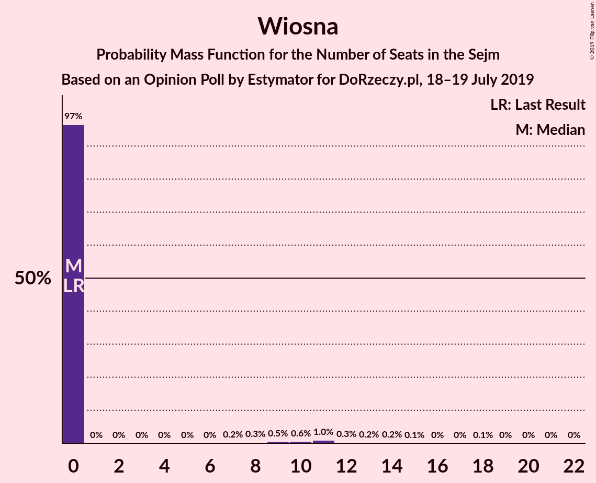
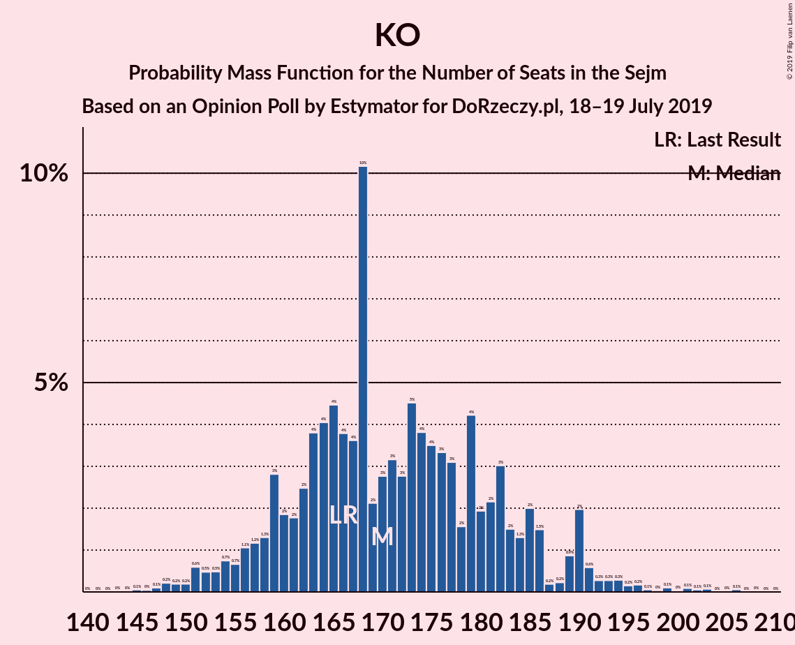

# Opinion Poll by Estymator for DoRzeczy.pl, 18–19 July 2019

<a href="#voting-intentions">Voting Intentions</a> | <a href="#seats">Seats</a> | <a href="#coalitions">Coalitions</a> | <a href="#technical-information">Technical Information</a>

## Voting Intentions

### Confidence Intervals

| Party | Last Result | Poll Result | 80% Confidence Interval | 90% Confidence Interval | 95% Confidence Interval | 99% Confidence Interval |
|:-----:|:-----------:|:-----------:|:-----------------------:|:-----------------------:|:-----------------------:|:-----------------------:|
| Prawo i Sprawiedliwość | 37.6% | 45.3% | 43.3–47.3% |42.7–47.9% |42.2–48.4% |41.3–49.4% |
| Koalicja Obywatelska | 31.7% | 30.1% | 28.3–32.0% |27.8–32.6% |27.4–33.0% |26.5–34.0% |
| Polskie Stronnictwo Ludowe | 5.1% | 5.2% | 4.4–6.2% |4.1–6.4% |3.9–6.7% |3.6–7.2% |
| Kukiz’15 | 8.8% | 4.8% | 4.0–5.7% |3.8–6.0% |3.6–6.3% |3.3–6.8% |
| Sojusz Lewicy Demokratycznej | 7.6% | 4.5% | 3.7–5.4% |3.5–5.7% |3.4–5.9% |3.0–6.4% |
| Wiosna | 0.0% | 3.8% | 3.1–4.7% |2.9–4.9% |2.8–5.1% |2.5–5.6% |
| KORWiN | 4.8% | 2.9% | 2.3–3.7% |2.1–3.9% |2.0–4.1% |1.8–4.5% |
| Lewica Razem | 3.6% | 1.5% | 1.1–2.1% |1.0–2.3% |0.9–2.4% |0.7–2.8% |

*Note:* The poll result column reflects the actual value used in the calculations. Published results may vary slightly, and in addition be rounded to fewer digits.

## Seats

### Confidence Intervals

| Party | Last Result | Median | 80% Confidence Interval | 90% Confidence Interval | 95% Confidence Interval | 99% Confidence Interval |
|:-----:|:-----------:|:------:|:-----------------------:|:-----------------------:|:-----------------------:|:-----------------------:|
| <a href="#prawo-i-sprawiedliwość">Prawo i Sprawiedliwość</a> | 235 | 277 | 254–285 |251–287 |249–292 |244–294 |
| <a href="#koalicja-obywatelska">Koalicja Obywatelska</a> | 166 | 172 | 161–183 |159–186 |155–190 |148–202 |
| <a href="#polskie-stronnictwo-ludowe">Polskie Stronnictwo Ludowe</a> | 16 | 13 | 0–22 |0–22 |0–23 |0–27 |
| <a href="#kukiz’15">Kukiz’15</a> | 42 | 0 | 0–10 |0–13 |0–16 |0–24 |
| <a href="#sojusz-lewicy-demokratycznej">Sojusz Lewicy Demokratycznej</a> | 0 | 0 | 0–10 |0–12 |0–15 |0–20 |
| <a href="#wiosna">Wiosna</a> | 0 | 0 | 0 |0 |0 |0–13 |
| <a href="#korwin">KORWiN</a> | 0 | 0 | 0 |0 |0 |0 |
| <a href="#lewica-razem">Lewica Razem</a> | 0 | 0 | 0 |0 |0 |0 |

### Prawo i Sprawiedliwość

*For a full overview of the results for this party, see the [Prawo i Sprawiedliwość](party-prawoisprawiedliwość.html) page.*

| Number of Seats | Probability | Accumulated | Special Marks |
|:---------------:|:-----------:|:-----------:|:-------------:|
| 235 | 0% | 100% | Last Result |
| 236 | 0% | 100% |  |
| 237 | 0.1% | 100% |  |
| 238 | 0% | 99.9% |  |
| 239 | 0% | 99.9% |  |
| 240 | 0.1% | 99.9% |  |
| 241 | 0.1% | 99.8% |  |
| 242 | 0.1% | 99.6% |  |
| 243 | 0% | 99.6% |  |
| 244 | 0.1% | 99.6% |  |
| 245 | 0.1% | 99.4% |  |
| 246 | 0.2% | 99.3% |  |
| 247 | 0.4% | 99.1% |  |
| 248 | 0.2% | 98.8% |  |
| 249 | 1.3% | 98.6% |  |
| 250 | 1.0% | 97% |  |
| 251 | 1.4% | 96% |  |
| 252 | 3% | 95% |  |
| 253 | 0.6% | 92% |  |
| 254 | 1.3% | 91% |  |
| 255 | 0.8% | 90% |  |
| 256 | 3% | 89% |  |
| 257 | 1.2% | 86% |  |
| 258 | 0.4% | 85% |  |
| 259 | 0.9% | 85% |  |
| 260 | 0.9% | 84% |  |
| 261 | 1.0% | 83% |  |
| 262 | 3% | 82% |  |
| 263 | 0.3% | 79% |  |
| 264 | 0.9% | 79% |  |
| 265 | 0.5% | 78% |  |
| 266 | 0.3% | 77% |  |
| 267 | 2% | 77% |  |
| 268 | 1.2% | 75% |  |
| 269 | 1.0% | 74% |  |
| 270 | 0.9% | 73% |  |
| 271 | 1.4% | 72% |  |
| 272 | 2% | 70% |  |
| 273 | 1.0% | 68% |  |
| 274 | 6% | 67% |  |
| 275 | 1.5% | 61% |  |
| 276 | 5% | 60% |  |
| 277 | 7% | 55% | Median |
| 278 | 5% | 47% |  |
| 279 | 7% | 42% |  |
| 280 | 0.7% | 35% |  |
| 281 | 7% | 35% |  |
| 282 | 2% | 28% |  |
| 283 | 0.6% | 26% |  |
| 284 | 6% | 25% |  |
| 285 | 11% | 19% |  |
| 286 | 0.3% | 9% |  |
| 287 | 5% | 8% |  |
| 288 | 0.2% | 3% |  |
| 289 | 0% | 3% |  |
| 290 | 0% | 3% |  |
| 291 | 0.2% | 3% |  |
| 292 | 2% | 3% |  |
| 293 | 0% | 0.8% |  |
| 294 | 0.5% | 0.8% |  |
| 295 | 0.1% | 0.3% |  |
| 296 | 0% | 0.2% |  |
| 297 | 0% | 0.2% |  |
| 298 | 0.1% | 0.2% |  |
| 299 | 0% | 0.1% |  |
| 300 | 0% | 0.1% |  |
| 301 | 0% | 0.1% |  |
| 302 | 0% | 0.1% |  |
| 303 | 0.1% | 0.1% |  |
| 304 | 0% | 0% |  |

### Koalicja Obywatelska

*For a full overview of the results for this party, see the [Koalicja Obywatelska](party-koalicjaobywatelska.html) page.*

| Number of Seats | Probability | Accumulated | Special Marks |
|:---------------:|:-----------:|:-----------:|:-------------:|
| 143 | 0% | 100% |  |
| 144 | 0% | 99.9% |  |
| 145 | 0% | 99.9% |  |
| 146 | 0% | 99.9% |  |
| 147 | 0.1% | 99.9% |  |
| 148 | 0.6% | 99.8% |  |
| 149 | 0.4% | 99.2% |  |
| 150 | 0.1% | 98.8% |  |
| 151 | 0.1% | 98.7% |  |
| 152 | 0.2% | 98.5% |  |
| 153 | 0.2% | 98% |  |
| 154 | 0.2% | 98% |  |
| 155 | 1.0% | 98% |  |
| 156 | 0.4% | 97% |  |
| 157 | 1.1% | 97% |  |
| 158 | 0.4% | 96% |  |
| 159 | 3% | 95% |  |
| 160 | 1.3% | 92% |  |
| 161 | 6% | 91% |  |
| 162 | 5% | 85% |  |
| 163 | 3% | 80% |  |
| 164 | 1.3% | 76% |  |
| 165 | 1.2% | 75% |  |
| 166 | 2% | 74% | Last Result |
| 167 | 8% | 71% |  |
| 168 | 8% | 64% |  |
| 169 | 1.0% | 56% |  |
| 170 | 1.3% | 55% |  |
| 171 | 0.5% | 54% |  |
| 172 | 6% | 53% | Median |
| 173 | 7% | 47% |  |
| 174 | 2% | 40% |  |
| 175 | 9% | 38% |  |
| 176 | 4% | 28% |  |
| 177 | 0.3% | 24% |  |
| 178 | 1.4% | 24% |  |
| 179 | 7% | 22% |  |
| 180 | 0.5% | 16% |  |
| 181 | 4% | 15% |  |
| 182 | 0.8% | 11% |  |
| 183 | 1.4% | 10% |  |
| 184 | 1.2% | 9% |  |
| 185 | 0.8% | 8% |  |
| 186 | 3% | 7% |  |
| 187 | 0% | 4% |  |
| 188 | 0.1% | 4% |  |
| 189 | 1.1% | 4% |  |
| 190 | 0.5% | 3% |  |
| 191 | 0.3% | 2% |  |
| 192 | 0.1% | 2% |  |
| 193 | 0.1% | 2% |  |
| 194 | 0.7% | 2% |  |
| 195 | 0.1% | 1.0% |  |
| 196 | 0.3% | 1.0% |  |
| 197 | 0% | 0.6% |  |
| 198 | 0.1% | 0.6% |  |
| 199 | 0.1% | 0.6% |  |
| 200 | 0% | 0.5% |  |
| 201 | 0% | 0.5% |  |
| 202 | 0.1% | 0.5% |  |
| 203 | 0% | 0.4% |  |
| 204 | 0% | 0.4% |  |
| 205 | 0% | 0.4% |  |
| 206 | 0.4% | 0.4% |  |
| 207 | 0% | 0% |  |

### Polskie Stronnictwo Ludowe

*For a full overview of the results for this party, see the [Polskie Stronnictwo Ludowe](party-polskiestronnictwoludowe.html) page.*

| Number of Seats | Probability | Accumulated | Special Marks |
|:---------------:|:-----------:|:-----------:|:-------------:|
| 0 | 45% | 100% |  |
| 1 | 0% | 55% |  |
| 2 | 0% | 55% |  |
| 3 | 0% | 55% |  |
| 4 | 0% | 55% |  |
| 5 | 0% | 55% |  |
| 6 | 0% | 55% |  |
| 7 | 0% | 55% |  |
| 8 | 0% | 55% |  |
| 9 | 0% | 55% |  |
| 10 | 0% | 55% |  |
| 11 | 0.2% | 55% |  |
| 12 | 3% | 55% |  |
| 13 | 4% | 52% | Median |
| 14 | 5% | 48% |  |
| 15 | 8% | 43% |  |
| 16 | 8% | 35% | Last Result |
| 17 | 2% | 27% |  |
| 18 | 2% | 25% |  |
| 19 | 4% | 23% |  |
| 20 | 2% | 19% |  |
| 21 | 1.0% | 18% |  |
| 22 | 12% | 17% |  |
| 23 | 2% | 4% |  |
| 24 | 1.1% | 2% |  |
| 25 | 0.1% | 0.9% |  |
| 26 | 0.3% | 0.9% |  |
| 27 | 0.4% | 0.6% |  |
| 28 | 0% | 0.2% |  |
| 29 | 0.1% | 0.1% |  |
| 30 | 0% | 0% |  |

### Kukiz’15

*For a full overview of the results for this party, see the [Kukiz’15](party-kukiz’15.html) page.*

| Number of Seats | Probability | Accumulated | Special Marks |
|:---------------:|:-----------:|:-----------:|:-------------:|
| 0 | 69% | 100% | Median |
| 1 | 0% | 31% |  |
| 2 | 0% | 31% |  |
| 3 | 0.4% | 31% |  |
| 4 | 0.6% | 31% |  |
| 5 | 1.0% | 30% |  |
| 6 | 6% | 29% |  |
| 7 | 2% | 23% |  |
| 8 | 7% | 22% |  |
| 9 | 2% | 14% |  |
| 10 | 2% | 12% |  |
| 11 | 2% | 10% |  |
| 12 | 2% | 8% |  |
| 13 | 1.2% | 6% |  |
| 14 | 0.9% | 5% |  |
| 15 | 0.7% | 4% |  |
| 16 | 0.8% | 3% |  |
| 17 | 0.1% | 2% |  |
| 18 | 0.5% | 2% |  |
| 19 | 0.6% | 2% |  |
| 20 | 0.4% | 1.4% |  |
| 21 | 0.3% | 0.9% |  |
| 22 | 0.1% | 0.7% |  |
| 23 | 0% | 0.6% |  |
| 24 | 0.1% | 0.6% |  |
| 25 | 0% | 0.5% |  |
| 26 | 0.3% | 0.4% |  |
| 27 | 0% | 0.1% |  |
| 28 | 0% | 0.1% |  |
| 29 | 0% | 0.1% |  |
| 30 | 0% | 0% |  |
| 31 | 0% | 0% |  |
| 32 | 0% | 0% |  |
| 33 | 0% | 0% |  |
| 34 | 0% | 0% |  |
| 35 | 0% | 0% |  |
| 36 | 0% | 0% |  |
| 37 | 0% | 0% |  |
| 38 | 0% | 0% |  |
| 39 | 0% | 0% |  |
| 40 | 0% | 0% |  |
| 41 | 0% | 0% |  |
| 42 | 0% | 0% | Last Result |

### Sojusz Lewicy Demokratycznej

*For a full overview of the results for this party, see the [Sojusz Lewicy Demokratycznej](party-sojuszlewicydemokratycznej.html) page.*

| Number of Seats | Probability | Accumulated | Special Marks |
|:---------------:|:-----------:|:-----------:|:-------------:|
| 0 | 86% | 100% | Last Result, Median |
| 1 | 0% | 14% |  |
| 2 | 0% | 14% |  |
| 3 | 0% | 14% |  |
| 4 | 0% | 14% |  |
| 5 | 0% | 14% |  |
| 6 | 0.1% | 14% |  |
| 7 | 0.2% | 14% |  |
| 8 | 0.3% | 14% |  |
| 9 | 1.2% | 13% |  |
| 10 | 4% | 12% |  |
| 11 | 2% | 8% |  |
| 12 | 2% | 6% |  |
| 13 | 0.6% | 4% |  |
| 14 | 0.4% | 3% |  |
| 15 | 1.0% | 3% |  |
| 16 | 0.5% | 2% |  |
| 17 | 0.4% | 1.1% |  |
| 18 | 0.1% | 0.8% |  |
| 19 | 0.1% | 0.6% |  |
| 20 | 0.2% | 0.6% |  |
| 21 | 0% | 0.4% |  |
| 22 | 0.1% | 0.4% |  |
| 23 | 0% | 0.3% |  |
| 24 | 0.1% | 0.3% |  |
| 25 | 0% | 0.2% |  |
| 26 | 0.1% | 0.2% |  |
| 27 | 0% | 0.1% |  |
| 28 | 0.1% | 0.1% |  |
| 29 | 0% | 0% |  |

### Wiosna

*For a full overview of the results for this party, see the [Wiosna](party-wiosna.html) page.*

| Number of Seats | Probability | Accumulated | Special Marks |
|:---------------:|:-----------:|:-----------:|:-------------:|
| 0 | 98% | 100% | Last Result, Median |
| 1 | 0% | 2% |  |
| 2 | 0% | 2% |  |
| 3 | 0% | 2% |  |
| 4 | 0% | 2% |  |
| 5 | 0% | 2% |  |
| 6 | 0% | 2% |  |
| 7 | 0.1% | 2% |  |
| 8 | 0.1% | 2% |  |
| 9 | 0.3% | 2% |  |
| 10 | 0.2% | 2% |  |
| 11 | 0.6% | 2% |  |
| 12 | 0.1% | 1.0% |  |
| 13 | 0.6% | 0.8% |  |
| 14 | 0% | 0.3% |  |
| 15 | 0.1% | 0.2% |  |
| 16 | 0% | 0.2% |  |
| 17 | 0% | 0.1% |  |
| 18 | 0.1% | 0.1% |  |
| 19 | 0% | 0% |  |

### KORWiN

*For a full overview of the results for this party, see the [KORWiN](party-korwin.html) page.*

| Number of Seats | Probability | Accumulated | Special Marks |
|:---------------:|:-----------:|:-----------:|:-------------:|
| 0 | 100% | 100% | Last Result, Median |

### Lewica Razem

*For a full overview of the results for this party, see the [Lewica Razem](party-lewicarazem.html) page.*

| Number of Seats | Probability | Accumulated | Special Marks |
|:---------------:|:-----------:|:-----------:|:-------------:|
| 0 | 100% | 100% | Last Result, Median |

## Coalitions

### Confidence Intervals

| Coalition | Last Result | Median | Majority? | 80% Confidence Interval | 90% Confidence Interval | 95% Confidence Interval | 99% Confidence Interval |
|:---------:|:-----------:|:------:|:---------:|:-----------------------:|:-----------------------:|:-----------------------:|:-----------------------:|
| Prawo i Sprawiedliwość | 235 | 277 | 100% | 254–285 | 251–287 | 249–292 | 244–294 |
| Koalicja Obywatelska – Polskie Stronnictwo Ludowe – Sojusz Lewicy Demokratycznej – Lewica Razem | 182 | 181 | 0% | 170–198 | 168–206 | 166–208 | 158–213 |
| Koalicja Obywatelska – Polskie Stronnictwo Ludowe – Sojusz Lewicy Demokratycznej | 182 | 181 | 0% | 170–198 | 168–206 | 166–208 | 158–213 |
| Koalicja Obywatelska – Polskie Stronnictwo Ludowe | 182 | 179 | 0% | 168–198 | 164–205 | 163–208 | 156–211 |
| Koalicja Obywatelska – Sojusz Lewicy Demokratycznej | 166 | 173 | 0% | 161–185 | 161–189 | 157–193 | 154–206 |
| Koalicja Obywatelska | 166 | 172 | 0% | 161–183 | 159–186 | 155–190 | 148–202 |

### Prawo i Sprawiedliwość

| Number of Seats | Probability | Accumulated | Special Marks |
|:---------------:|:-----------:|:-----------:|:-------------:|
| 235 | 0% | 100% | Last Result |
| 236 | 0% | 100% |  |
| 237 | 0.1% | 100% |  |
| 238 | 0% | 99.9% |  |
| 239 | 0% | 99.9% |  |
| 240 | 0.1% | 99.9% |  |
| 241 | 0.1% | 99.8% |  |
| 242 | 0.1% | 99.6% |  |
| 243 | 0% | 99.6% |  |
| 244 | 0.1% | 99.6% |  |
| 245 | 0.1% | 99.4% |  |
| 246 | 0.2% | 99.3% |  |
| 247 | 0.4% | 99.1% |  |
| 248 | 0.2% | 98.8% |  |
| 249 | 1.3% | 98.6% |  |
| 250 | 1.0% | 97% |  |
| 251 | 1.4% | 96% |  |
| 252 | 3% | 95% |  |
| 253 | 0.6% | 92% |  |
| 254 | 1.3% | 91% |  |
| 255 | 0.8% | 90% |  |
| 256 | 3% | 89% |  |
| 257 | 1.2% | 86% |  |
| 258 | 0.4% | 85% |  |
| 259 | 0.9% | 85% |  |
| 260 | 0.9% | 84% |  |
| 261 | 1.0% | 83% |  |
| 262 | 3% | 82% |  |
| 263 | 0.3% | 79% |  |
| 264 | 0.9% | 79% |  |
| 265 | 0.5% | 78% |  |
| 266 | 0.3% | 77% |  |
| 267 | 2% | 77% |  |
| 268 | 1.2% | 75% |  |
| 269 | 1.0% | 74% |  |
| 270 | 0.9% | 73% |  |
| 271 | 1.4% | 72% |  |
| 272 | 2% | 70% |  |
| 273 | 1.0% | 68% |  |
| 274 | 6% | 67% |  |
| 275 | 1.5% | 61% |  |
| 276 | 5% | 60% |  |
| 277 | 7% | 55% | Median |
| 278 | 5% | 47% |  |
| 279 | 7% | 42% |  |
| 280 | 0.7% | 35% |  |
| 281 | 7% | 35% |  |
| 282 | 2% | 28% |  |
| 283 | 0.6% | 26% |  |
| 284 | 6% | 25% |  |
| 285 | 11% | 19% |  |
| 286 | 0.3% | 9% |  |
| 287 | 5% | 8% |  |
| 288 | 0.2% | 3% |  |
| 289 | 0% | 3% |  |
| 290 | 0% | 3% |  |
| 291 | 0.2% | 3% |  |
| 292 | 2% | 3% |  |
| 293 | 0% | 0.8% |  |
| 294 | 0.5% | 0.8% |  |
| 295 | 0.1% | 0.3% |  |
| 296 | 0% | 0.2% |  |
| 297 | 0% | 0.2% |  |
| 298 | 0.1% | 0.2% |  |
| 299 | 0% | 0.1% |  |
| 300 | 0% | 0.1% |  |
| 301 | 0% | 0.1% |  |
| 302 | 0% | 0.1% |  |
| 303 | 0.1% | 0.1% |  |
| 304 | 0% | 0% |  |

### Koalicja Obywatelska – Polskie Stronnictwo Ludowe – Sojusz Lewicy Demokratycznej – Lewica Razem

| Number of Seats | Probability | Accumulated | Special Marks |
|:---------------:|:-----------:|:-----------:|:-------------:|
| 151 | 0% | 100% |  |
| 152 | 0% | 99.9% |  |
| 153 | 0% | 99.9% |  |
| 154 | 0% | 99.9% |  |
| 155 | 0% | 99.9% |  |
| 156 | 0% | 99.9% |  |
| 157 | 0.3% | 99.8% |  |
| 158 | 0.2% | 99.6% |  |
| 159 | 0% | 99.4% |  |
| 160 | 0.4% | 99.4% |  |
| 161 | 0.1% | 99.1% |  |
| 162 | 0.2% | 99.0% |  |
| 163 | 0% | 98.8% |  |
| 164 | 1.0% | 98.8% |  |
| 165 | 0.1% | 98% |  |
| 166 | 0.7% | 98% |  |
| 167 | 0.1% | 97% |  |
| 168 | 6% | 97% |  |
| 169 | 0.5% | 91% |  |
| 170 | 0.4% | 90% |  |
| 171 | 0.1% | 90% |  |
| 172 | 0.9% | 90% |  |
| 173 | 5% | 89% |  |
| 174 | 0.5% | 83% |  |
| 175 | 10% | 83% |  |
| 176 | 1.4% | 72% |  |
| 177 | 7% | 71% |  |
| 178 | 3% | 64% |  |
| 179 | 7% | 61% |  |
| 180 | 2% | 54% |  |
| 181 | 7% | 52% |  |
| 182 | 6% | 45% | Last Result |
| 183 | 0.8% | 40% |  |
| 184 | 6% | 39% |  |
| 185 | 2% | 33% | Median |
| 186 | 7% | 31% |  |
| 187 | 0.4% | 25% |  |
| 188 | 0.9% | 24% |  |
| 189 | 0.9% | 23% |  |
| 190 | 0.9% | 23% |  |
| 191 | 1.4% | 22% |  |
| 192 | 0.9% | 20% |  |
| 193 | 2% | 19% |  |
| 194 | 1.4% | 17% |  |
| 195 | 2% | 16% |  |
| 196 | 0.6% | 14% |  |
| 197 | 0.6% | 13% |  |
| 198 | 3% | 13% |  |
| 199 | 0.4% | 10% |  |
| 200 | 0.8% | 9% |  |
| 201 | 1.2% | 9% |  |
| 202 | 0.2% | 7% |  |
| 203 | 0.9% | 7% |  |
| 204 | 0.2% | 6% |  |
| 205 | 1.0% | 6% |  |
| 206 | 0.9% | 5% |  |
| 207 | 0.5% | 4% |  |
| 208 | 2% | 4% |  |
| 209 | 0.3% | 2% |  |
| 210 | 0% | 2% |  |
| 211 | 1.0% | 2% |  |
| 212 | 0% | 0.7% |  |
| 213 | 0.3% | 0.6% |  |
| 214 | 0.1% | 0.4% |  |
| 215 | 0.1% | 0.3% |  |
| 216 | 0.1% | 0.2% |  |
| 217 | 0% | 0.1% |  |
| 218 | 0% | 0.1% |  |
| 219 | 0% | 0.1% |  |
| 220 | 0% | 0% |  |

### Koalicja Obywatelska – Polskie Stronnictwo Ludowe – Sojusz Lewicy Demokratycznej

| Number of Seats | Probability | Accumulated | Special Marks |
|:---------------:|:-----------:|:-----------:|:-------------:|
| 151 | 0% | 100% |  |
| 152 | 0% | 99.9% |  |
| 153 | 0% | 99.9% |  |
| 154 | 0% | 99.9% |  |
| 155 | 0% | 99.9% |  |
| 156 | 0% | 99.9% |  |
| 157 | 0.3% | 99.8% |  |
| 158 | 0.2% | 99.6% |  |
| 159 | 0% | 99.4% |  |
| 160 | 0.4% | 99.4% |  |
| 161 | 0.1% | 99.1% |  |
| 162 | 0.2% | 99.0% |  |
| 163 | 0% | 98.8% |  |
| 164 | 1.0% | 98.8% |  |
| 165 | 0.1% | 98% |  |
| 166 | 0.7% | 98% |  |
| 167 | 0.1% | 97% |  |
| 168 | 6% | 97% |  |
| 169 | 0.5% | 91% |  |
| 170 | 0.4% | 90% |  |
| 171 | 0.1% | 90% |  |
| 172 | 0.9% | 90% |  |
| 173 | 5% | 89% |  |
| 174 | 0.5% | 83% |  |
| 175 | 10% | 83% |  |
| 176 | 1.4% | 72% |  |
| 177 | 7% | 71% |  |
| 178 | 3% | 64% |  |
| 179 | 7% | 61% |  |
| 180 | 2% | 54% |  |
| 181 | 7% | 52% |  |
| 182 | 6% | 45% | Last Result |
| 183 | 0.8% | 40% |  |
| 184 | 6% | 39% |  |
| 185 | 2% | 33% | Median |
| 186 | 7% | 31% |  |
| 187 | 0.4% | 25% |  |
| 188 | 0.9% | 24% |  |
| 189 | 0.9% | 23% |  |
| 190 | 0.9% | 23% |  |
| 191 | 1.4% | 22% |  |
| 192 | 0.9% | 20% |  |
| 193 | 2% | 19% |  |
| 194 | 1.4% | 17% |  |
| 195 | 2% | 16% |  |
| 196 | 0.6% | 14% |  |
| 197 | 0.6% | 13% |  |
| 198 | 3% | 13% |  |
| 199 | 0.4% | 10% |  |
| 200 | 0.8% | 9% |  |
| 201 | 1.2% | 9% |  |
| 202 | 0.2% | 7% |  |
| 203 | 0.9% | 7% |  |
| 204 | 0.2% | 6% |  |
| 205 | 1.0% | 6% |  |
| 206 | 0.9% | 5% |  |
| 207 | 0.5% | 4% |  |
| 208 | 2% | 4% |  |
| 209 | 0.3% | 2% |  |
| 210 | 0% | 2% |  |
| 211 | 1.0% | 2% |  |
| 212 | 0% | 0.7% |  |
| 213 | 0.3% | 0.6% |  |
| 214 | 0.1% | 0.4% |  |
| 215 | 0.1% | 0.3% |  |
| 216 | 0.1% | 0.2% |  |
| 217 | 0% | 0.1% |  |
| 218 | 0% | 0.1% |  |
| 219 | 0% | 0.1% |  |
| 220 | 0% | 0% |  |

### Koalicja Obywatelska – Polskie Stronnictwo Ludowe

| Number of Seats | Probability | Accumulated | Special Marks |
|:---------------:|:-----------:|:-----------:|:-------------:|
| 148 | 0.1% | 100% |  |
| 149 | 0.1% | 99.9% |  |
| 150 | 0.1% | 99.8% |  |
| 151 | 0.1% | 99.7% |  |
| 152 | 0% | 99.7% |  |
| 153 | 0% | 99.6% |  |
| 154 | 0% | 99.6% |  |
| 155 | 0.1% | 99.6% |  |
| 156 | 0% | 99.5% |  |
| 157 | 0.4% | 99.5% |  |
| 158 | 0.2% | 99.1% |  |
| 159 | 0.2% | 98.8% |  |
| 160 | 0.5% | 98.7% |  |
| 161 | 0% | 98% |  |
| 162 | 0.4% | 98% |  |
| 163 | 2% | 98% |  |
| 164 | 1.2% | 96% |  |
| 165 | 0.2% | 95% |  |
| 166 | 0.7% | 95% |  |
| 167 | 0.3% | 94% |  |
| 168 | 7% | 94% |  |
| 169 | 0.3% | 87% |  |
| 170 | 0.2% | 86% |  |
| 171 | 3% | 86% |  |
| 172 | 1.3% | 83% |  |
| 173 | 6% | 82% |  |
| 174 | 0.1% | 77% |  |
| 175 | 9% | 76% |  |
| 176 | 2% | 67% |  |
| 177 | 7% | 65% |  |
| 178 | 3% | 59% |  |
| 179 | 7% | 56% |  |
| 180 | 2% | 48% |  |
| 181 | 4% | 46% |  |
| 182 | 6% | 42% | Last Result |
| 183 | 0.8% | 36% |  |
| 184 | 6% | 36% |  |
| 185 | 2% | 30% | Median |
| 186 | 7% | 27% |  |
| 187 | 0.4% | 21% |  |
| 188 | 0.6% | 20% |  |
| 189 | 0.6% | 20% |  |
| 190 | 1.0% | 19% |  |
| 191 | 2% | 18% |  |
| 192 | 0.9% | 16% |  |
| 193 | 2% | 15% |  |
| 194 | 0.8% | 13% |  |
| 195 | 2% | 13% |  |
| 196 | 0.6% | 11% |  |
| 197 | 0.4% | 10% |  |
| 198 | 3% | 10% |  |
| 199 | 0.2% | 7% |  |
| 200 | 0.2% | 7% |  |
| 201 | 0.7% | 7% |  |
| 202 | 0.2% | 6% |  |
| 203 | 0.9% | 6% |  |
| 204 | 0.1% | 5% |  |
| 205 | 0.9% | 5% |  |
| 206 | 0.6% | 4% |  |
| 207 | 0.5% | 4% |  |
| 208 | 2% | 3% |  |
| 209 | 0.2% | 2% |  |
| 210 | 0% | 1.3% |  |
| 211 | 1.0% | 1.3% |  |
| 212 | 0% | 0.4% |  |
| 213 | 0.2% | 0.3% |  |
| 214 | 0.1% | 0.2% |  |
| 215 | 0% | 0.1% |  |
| 216 | 0% | 0.1% |  |
| 217 | 0% | 0% |  |

### Koalicja Obywatelska – Sojusz Lewicy Demokratycznej

| Number of Seats | Probability | Accumulated | Special Marks |
|:---------------:|:-----------:|:-----------:|:-------------:|
| 148 | 0% | 100% |  |
| 149 | 0% | 99.9% |  |
| 150 | 0% | 99.9% |  |
| 151 | 0% | 99.9% |  |
| 152 | 0.1% | 99.9% |  |
| 153 | 0.1% | 99.7% |  |
| 154 | 0.2% | 99.6% |  |
| 155 | 0.9% | 99.4% |  |
| 156 | 0.3% | 98.5% |  |
| 157 | 0.8% | 98% |  |
| 158 | 0.2% | 97% |  |
| 159 | 0.9% | 97% |  |
| 160 | 1.1% | 96% |  |
| 161 | 6% | 95% |  |
| 162 | 5% | 90% |  |
| 163 | 2% | 85% |  |
| 164 | 1.1% | 83% |  |
| 165 | 1.3% | 82% |  |
| 166 | 2% | 80% | Last Result |
| 167 | 7% | 78% |  |
| 168 | 7% | 71% |  |
| 169 | 4% | 64% |  |
| 170 | 2% | 60% |  |
| 171 | 0.3% | 58% |  |
| 172 | 6% | 58% | Median |
| 173 | 7% | 53% |  |
| 174 | 2% | 45% |  |
| 175 | 10% | 43% |  |
| 176 | 5% | 33% |  |
| 177 | 0.6% | 28% |  |
| 178 | 0.8% | 28% |  |
| 179 | 7% | 27% |  |
| 180 | 0.5% | 20% |  |
| 181 | 4% | 19% |  |
| 182 | 1.0% | 15% |  |
| 183 | 1.5% | 14% |  |
| 184 | 1.4% | 12% |  |
| 185 | 1.0% | 11% |  |
| 186 | 3% | 10% |  |
| 187 | 0.9% | 7% |  |
| 188 | 0.4% | 6% |  |
| 189 | 2% | 5% |  |
| 190 | 0.6% | 4% |  |
| 191 | 0.4% | 3% |  |
| 192 | 0.2% | 3% |  |
| 193 | 0.1% | 3% |  |
| 194 | 0.8% | 2% |  |
| 195 | 0.2% | 2% |  |
| 196 | 0.4% | 2% |  |
| 197 | 0.1% | 1.1% |  |
| 198 | 0.1% | 1.0% |  |
| 199 | 0.1% | 0.9% |  |
| 200 | 0% | 0.8% |  |
| 201 | 0.1% | 0.8% |  |
| 202 | 0.1% | 0.7% |  |
| 203 | 0% | 0.6% |  |
| 204 | 0% | 0.6% |  |
| 205 | 0% | 0.6% |  |
| 206 | 0.5% | 0.6% |  |
| 207 | 0% | 0.1% |  |
| 208 | 0% | 0.1% |  |
| 209 | 0% | 0% |  |

### Koalicja Obywatelska

| Number of Seats | Probability | Accumulated | Special Marks |
|:---------------:|:-----------:|:-----------:|:-------------:|
| 143 | 0% | 100% |  |
| 144 | 0% | 99.9% |  |
| 145 | 0% | 99.9% |  |
| 146 | 0% | 99.9% |  |
| 147 | 0.1% | 99.9% |  |
| 148 | 0.6% | 99.8% |  |
| 149 | 0.4% | 99.2% |  |
| 150 | 0.1% | 98.8% |  |
| 151 | 0.1% | 98.7% |  |
| 152 | 0.2% | 98.5% |  |
| 153 | 0.2% | 98% |  |
| 154 | 0.2% | 98% |  |
| 155 | 1.0% | 98% |  |
| 156 | 0.4% | 97% |  |
| 157 | 1.1% | 97% |  |
| 158 | 0.4% | 96% |  |
| 159 | 3% | 95% |  |
| 160 | 1.3% | 92% |  |
| 161 | 6% | 91% |  |
| 162 | 5% | 85% |  |
| 163 | 3% | 80% |  |
| 164 | 1.3% | 76% |  |
| 165 | 1.2% | 75% |  |
| 166 | 2% | 74% | Last Result |
| 167 | 8% | 71% |  |
| 168 | 8% | 64% |  |
| 169 | 1.0% | 56% |  |
| 170 | 1.3% | 55% |  |
| 171 | 0.5% | 54% |  |
| 172 | 6% | 53% | Median |
| 173 | 7% | 47% |  |
| 174 | 2% | 40% |  |
| 175 | 9% | 38% |  |
| 176 | 4% | 28% |  |
| 177 | 0.3% | 24% |  |
| 178 | 1.4% | 24% |  |
| 179 | 7% | 22% |  |
| 180 | 0.5% | 16% |  |
| 181 | 4% | 15% |  |
| 182 | 0.8% | 11% |  |
| 183 | 1.4% | 10% |  |
| 184 | 1.2% | 9% |  |
| 185 | 0.8% | 8% |  |
| 186 | 3% | 7% |  |
| 187 | 0% | 4% |  |
| 188 | 0.1% | 4% |  |
| 189 | 1.1% | 4% |  |
| 190 | 0.5% | 3% |  |
| 191 | 0.3% | 2% |  |
| 192 | 0.1% | 2% |  |
| 193 | 0.1% | 2% |  |
| 194 | 0.7% | 2% |  |
| 195 | 0.1% | 1.0% |  |
| 196 | 0.3% | 1.0% |  |
| 197 | 0% | 0.6% |  |
| 198 | 0.1% | 0.6% |  |
| 199 | 0.1% | 0.6% |  |
| 200 | 0% | 0.5% |  |
| 201 | 0% | 0.5% |  |
| 202 | 0.1% | 0.5% |  |
| 203 | 0% | 0.4% |  |
| 204 | 0% | 0.4% |  |
| 205 | 0% | 0.4% |  |
| 206 | 0.4% | 0.4% |  |
| 207 | 0% | 0% |  |

## Technical Information

### Opinion Poll

+ **Polling firm:** Estymator
+ **Commissioner(s):** DoRzeczy.pl
+ **Fieldwork period:** 18–19 July 2019

### Calculations

+ **Sample size:** 1009
+ **Simulations done:** 131,072
+ **Error estimate:** 1.49%

