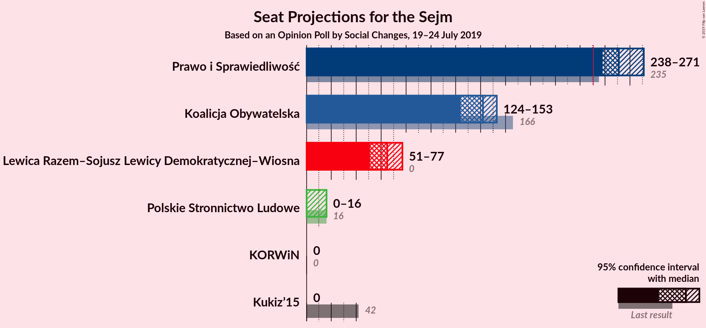
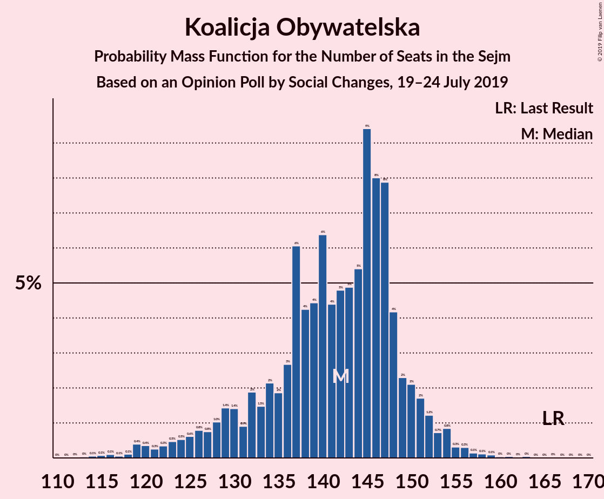
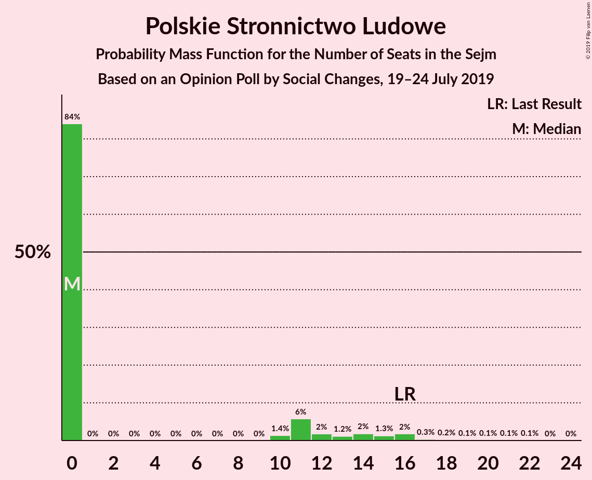
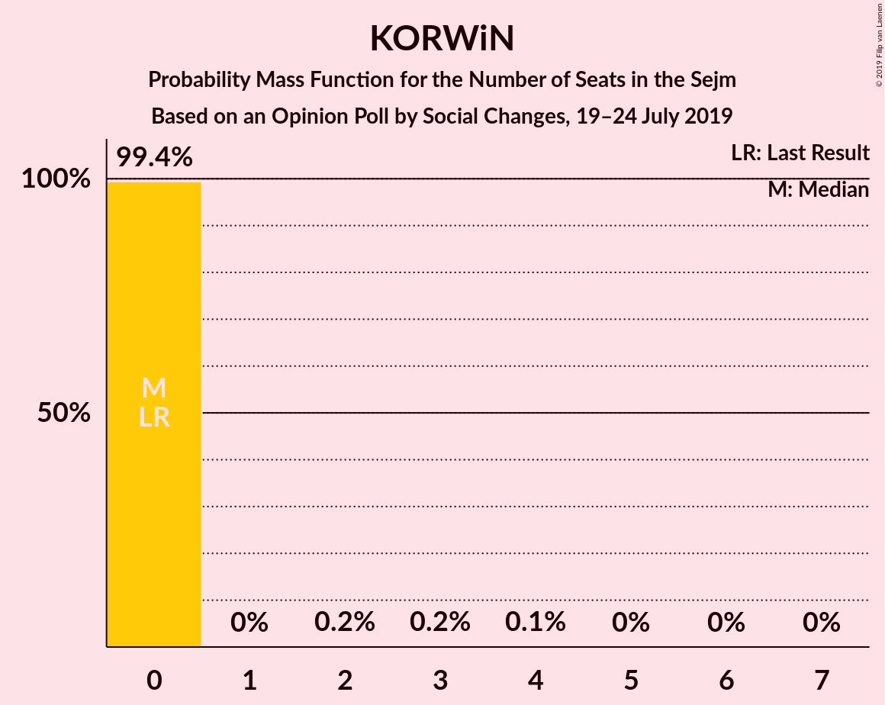
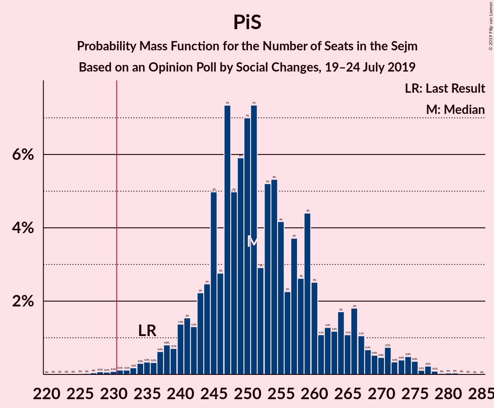

# Opinion Poll by Social Changes, 19–24 July 2019

<a href="#voting-intentions">Voting Intentions</a> | <a href="#seats">Seats</a> | <a href="#coalitions">Coalitions</a> | <a href="#technical-information">Technical Information</a>

## Voting Intentions

### Confidence Intervals

| Party | Last Result | Poll Result | 80% Confidence Interval | 90% Confidence Interval | 95% Confidence Interval | 99% Confidence Interval |
|:-----:|:-----------:|:-----------:|:-----------------------:|:-----------------------:|:-----------------------:|:-----------------------:|
| Prawo i Sprawiedliwość | 37.6% | 46.3% | 44.4–48.3% |43.8–48.9% |43.3–49.4% |42.4–50.3% |
| Koalicja Obywatelska | 31.7% | 27.5% | 25.8–29.4% |25.3–29.9% |24.9–30.3% |24.1–31.2% |
| Lewica Razem–Sojusz Lewicy Demokratycznej–Wiosna | 11.7% | 14.3% | 13.0–15.7% |12.6–16.2% |12.3–16.5% |11.7–17.3% |
| Polskie Stronnictwo Ludowe | 5.1% | 4.3% | 3.6–5.2% |3.4–5.5% |3.2–5.7% |2.9–6.2% |
| KORWiN | 4.8% | 3.4% | 2.8–4.2% |2.6–4.5% |2.5–4.7% |2.2–5.1% |
| Kukiz’15 | 8.8% | 3.0% | 2.4–3.8% |2.3–4.0% |2.1–4.2% |1.9–4.6% |

*Note:* The poll result column reflects the actual value used in the calculations. Published results may vary slightly, and in addition be rounded to fewer digits.

## Seats

### Confidence Intervals

| Party | Last Result | Median | 80% Confidence Interval | 90% Confidence Interval | 95% Confidence Interval | 99% Confidence Interval |
|:-----:|:-----------:|:------:|:-----------------------:|:-----------------------:|:-----------------------:|:-----------------------:|
| <a href="#prawo-i-sprawiedliwość">Prawo i Sprawiedliwość</a> | 235 | 251 | 243–263 |240–267 |238–271 |232–276 |
| <a href="#koalicja-obywatelska">Koalicja Obywatelska</a> | 166 | 143 | 132–148 |128–151 |124–152 |118–157 |
| <a href="#lewica-razem–sojusz-lewicy-demokratycznej–wiosna">Lewica Razem–Sojusz Lewicy Demokratycznej–Wiosna</a> | 0 | 65 | 56–71 |52–74 |51–76 |48–79 |
| <a href="#polskie-stronnictwo-ludowe">Polskie Stronnictwo Ludowe</a> | 16 | 0 | 0–11 |0–14 |0–15 |0–18 |
| <a href="#korwin">KORWiN</a> | 0 | 0 | 0 |0 |0 |0–2 |
| <a href="#kukiz’15">Kukiz’15</a> | 42 | 0 | 0 |0 |0 |0 |

### Prawo i Sprawiedliwość

*For a full overview of the results for this party, see the [Prawo i Sprawiedliwość](party-prawoisprawiedliwość.html) page.*

| Number of Seats | Probability | Accumulated | Special Marks |
|:---------------:|:-----------:|:-----------:|:-------------:|
| 224 | 0% | 100% |  |
| 225 | 0% | 99.9% |  |
| 226 | 0% | 99.9% |  |
| 227 | 0.1% | 99.9% |  |
| 228 | 0.1% | 99.9% |  |
| 229 | 0.1% | 99.8% |  |
| 230 | 0.1% | 99.7% |  |
| 231 | 0.1% | 99.6% | Majority |
| 232 | 0.1% | 99.5% |  |
| 233 | 0.1% | 99.4% |  |
| 234 | 0.4% | 99.3% |  |
| 235 | 0.5% | 98.9% | Last Result |
| 236 | 0.2% | 98% |  |
| 237 | 0.4% | 98% |  |
| 238 | 0.7% | 98% |  |
| 239 | 0.9% | 97% |  |
| 240 | 1.2% | 96% |  |
| 241 | 1.3% | 95% |  |
| 242 | 2% | 94% |  |
| 243 | 2% | 92% |  |
| 244 | 2% | 90% |  |
| 245 | 5% | 88% |  |
| 246 | 3% | 82% |  |
| 247 | 8% | 80% |  |
| 248 | 5% | 72% |  |
| 249 | 5% | 67% |  |
| 250 | 8% | 62% |  |
| 251 | 10% | 54% | Median |
| 252 | 2% | 44% |  |
| 253 | 5% | 43% |  |
| 254 | 4% | 38% |  |
| 255 | 3% | 34% |  |
| 256 | 4% | 30% |  |
| 257 | 3% | 26% |  |
| 258 | 2% | 23% |  |
| 259 | 6% | 22% |  |
| 260 | 3% | 15% |  |
| 261 | 0.7% | 13% |  |
| 262 | 1.0% | 12% |  |
| 263 | 0.8% | 11% |  |
| 264 | 2% | 10% |  |
| 265 | 0.7% | 8% |  |
| 266 | 2% | 7% |  |
| 267 | 0.8% | 5% |  |
| 268 | 0.6% | 4% |  |
| 269 | 0.6% | 4% |  |
| 270 | 0.3% | 3% |  |
| 271 | 0.5% | 3% |  |
| 272 | 0.4% | 2% |  |
| 273 | 0.7% | 2% |  |
| 274 | 0.4% | 1.3% |  |
| 275 | 0.4% | 0.9% |  |
| 276 | 0.1% | 0.5% |  |
| 277 | 0.3% | 0.5% |  |
| 278 | 0.1% | 0.2% |  |
| 279 | 0% | 0.2% |  |
| 280 | 0% | 0.1% |  |
| 281 | 0% | 0.1% |  |
| 282 | 0% | 0.1% |  |
| 283 | 0% | 0% |  |

### Koalicja Obywatelska

*For a full overview of the results for this party, see the [Koalicja Obywatelska](party-koalicjaobywatelska.html) page.*

| Number of Seats | Probability | Accumulated | Special Marks |
|:---------------:|:-----------:|:-----------:|:-------------:|
| 112 | 0% | 100% |  |
| 113 | 0% | 99.9% |  |
| 114 | 0.1% | 99.9% |  |
| 115 | 0.1% | 99.9% |  |
| 116 | 0.1% | 99.8% |  |
| 117 | 0.1% | 99.7% |  |
| 118 | 0.1% | 99.6% |  |
| 119 | 0.4% | 99.5% |  |
| 120 | 0.3% | 99.1% |  |
| 121 | 0.1% | 98.8% |  |
| 122 | 0.3% | 98.7% |  |
| 123 | 0.4% | 98% |  |
| 124 | 0.7% | 98% |  |
| 125 | 0.5% | 97% |  |
| 126 | 0.7% | 97% |  |
| 127 | 1.1% | 96% |  |
| 128 | 0.9% | 95% |  |
| 129 | 1.2% | 94% |  |
| 130 | 1.4% | 93% |  |
| 131 | 1.3% | 92% |  |
| 132 | 2% | 90% |  |
| 133 | 1.4% | 89% |  |
| 134 | 2% | 87% |  |
| 135 | 2% | 86% |  |
| 136 | 2% | 84% |  |
| 137 | 6% | 82% |  |
| 138 | 6% | 77% |  |
| 139 | 4% | 71% |  |
| 140 | 6% | 67% |  |
| 141 | 6% | 61% |  |
| 142 | 5% | 56% |  |
| 143 | 5% | 51% | Median |
| 144 | 6% | 46% |  |
| 145 | 8% | 39% |  |
| 146 | 10% | 31% |  |
| 147 | 8% | 21% |  |
| 148 | 5% | 13% |  |
| 149 | 2% | 8% |  |
| 150 | 1.2% | 6% |  |
| 151 | 1.5% | 5% |  |
| 152 | 1.3% | 4% |  |
| 153 | 0.6% | 2% |  |
| 154 | 0.6% | 2% |  |
| 155 | 0.4% | 1.2% |  |
| 156 | 0.2% | 0.8% |  |
| 157 | 0.2% | 0.6% |  |
| 158 | 0.1% | 0.4% |  |
| 159 | 0.1% | 0.3% |  |
| 160 | 0% | 0.2% |  |
| 161 | 0% | 0.2% |  |
| 162 | 0% | 0.1% |  |
| 163 | 0% | 0.1% |  |
| 164 | 0% | 0.1% |  |
| 165 | 0% | 0.1% |  |
| 166 | 0% | 0.1% | Last Result |
| 167 | 0% | 0% |  |

### Lewica Razem–Sojusz Lewicy Demokratycznej–Wiosna

*For a full overview of the results for this party, see the [Lewica Razem–Sojusz Lewicy Demokratycznej–Wiosna](party-lewicarazem–sojuszlewicydemokratycznej–wiosna.html) page.*

| Number of Seats | Probability | Accumulated | Special Marks |
|:---------------:|:-----------:|:-----------:|:-------------:|
| 0 | 0% | 100% | Last Result |
| 1 | 0% | 100% |  |
| 2 | 0% | 100% |  |
| 3 | 0% | 100% |  |
| 4 | 0% | 100% |  |
| 5 | 0% | 100% |  |
| 6 | 0% | 100% |  |
| 7 | 0% | 100% |  |
| 8 | 0% | 100% |  |
| 9 | 0% | 100% |  |
| 10 | 0% | 100% |  |
| 11 | 0% | 100% |  |
| 12 | 0% | 100% |  |
| 13 | 0% | 100% |  |
| 14 | 0% | 100% |  |
| 15 | 0% | 100% |  |
| 16 | 0% | 100% |  |
| 17 | 0% | 100% |  |
| 18 | 0% | 100% |  |
| 19 | 0% | 100% |  |
| 20 | 0% | 100% |  |
| 21 | 0% | 100% |  |
| 22 | 0% | 100% |  |
| 23 | 0% | 100% |  |
| 24 | 0% | 100% |  |
| 25 | 0% | 100% |  |
| 26 | 0% | 100% |  |
| 27 | 0% | 100% |  |
| 28 | 0% | 100% |  |
| 29 | 0% | 100% |  |
| 30 | 0% | 100% |  |
| 31 | 0% | 100% |  |
| 32 | 0% | 100% |  |
| 33 | 0% | 100% |  |
| 34 | 0% | 100% |  |
| 35 | 0% | 100% |  |
| 36 | 0% | 100% |  |
| 37 | 0% | 100% |  |
| 38 | 0% | 100% |  |
| 39 | 0% | 100% |  |
| 40 | 0% | 100% |  |
| 41 | 0% | 100% |  |
| 42 | 0% | 100% |  |
| 43 | 0% | 100% |  |
| 44 | 0.1% | 100% |  |
| 45 | 0% | 99.9% |  |
| 46 | 0.1% | 99.9% |  |
| 47 | 0.2% | 99.7% |  |
| 48 | 0.7% | 99.6% |  |
| 49 | 0.5% | 98.9% |  |
| 50 | 0.7% | 98% |  |
| 51 | 0.9% | 98% |  |
| 52 | 3% | 97% |  |
| 53 | 0.6% | 94% |  |
| 54 | 2% | 94% |  |
| 55 | 1.1% | 92% |  |
| 56 | 3% | 90% |  |
| 57 | 0.5% | 88% |  |
| 58 | 3% | 87% |  |
| 59 | 2% | 84% |  |
| 60 | 2% | 82% |  |
| 61 | 4% | 81% |  |
| 62 | 4% | 77% |  |
| 63 | 10% | 73% |  |
| 64 | 6% | 63% |  |
| 65 | 9% | 58% | Median |
| 66 | 18% | 49% |  |
| 67 | 8% | 31% |  |
| 68 | 6% | 23% |  |
| 69 | 3% | 17% |  |
| 70 | 3% | 14% |  |
| 71 | 1.0% | 11% |  |
| 72 | 1.3% | 10% |  |
| 73 | 3% | 8% |  |
| 74 | 2% | 6% |  |
| 75 | 0.7% | 4% |  |
| 76 | 0.6% | 3% |  |
| 77 | 1.0% | 2% |  |
| 78 | 0.6% | 1.4% |  |
| 79 | 0.4% | 0.8% |  |
| 80 | 0.2% | 0.4% |  |
| 81 | 0.1% | 0.2% |  |
| 82 | 0.1% | 0.2% |  |
| 83 | 0% | 0.1% |  |
| 84 | 0% | 0.1% |  |
| 85 | 0% | 0.1% |  |
| 86 | 0% | 0% |  |

### Polskie Stronnictwo Ludowe

*For a full overview of the results for this party, see the [Polskie Stronnictwo Ludowe](party-polskiestronnictwoludowe.html) page.*

| Number of Seats | Probability | Accumulated | Special Marks |
|:---------------:|:-----------:|:-----------:|:-------------:|
| 0 | 84% | 100% | Median |
| 1 | 0% | 16% |  |
| 2 | 0% | 16% |  |
| 3 | 0% | 16% |  |
| 4 | 0% | 16% |  |
| 5 | 0% | 16% |  |
| 6 | 0% | 16% |  |
| 7 | 0% | 16% |  |
| 8 | 0% | 16% |  |
| 9 | 0.1% | 16% |  |
| 10 | 0.8% | 16% |  |
| 11 | 6% | 15% |  |
| 12 | 2% | 9% |  |
| 13 | 1.4% | 7% |  |
| 14 | 1.4% | 6% |  |
| 15 | 2% | 4% |  |
| 16 | 2% | 2% | Last Result |
| 17 | 0.3% | 0.9% |  |
| 18 | 0.1% | 0.5% |  |
| 19 | 0.2% | 0.4% |  |
| 20 | 0.1% | 0.3% |  |
| 21 | 0.1% | 0.1% |  |
| 22 | 0% | 0% |  |

### KORWiN

*For a full overview of the results for this party, see the [KORWiN](party-korwin.html) page.*

| Number of Seats | Probability | Accumulated | Special Marks |
|:---------------:|:-----------:|:-----------:|:-------------:|
| 0 | 99.5% | 100% | Last Result, Median |
| 1 | 0% | 0.5% |  |
| 2 | 0.2% | 0.5% |  |
| 3 | 0.1% | 0.3% |  |
| 4 | 0.1% | 0.2% |  |
| 5 | 0% | 0.1% |  |
| 6 | 0% | 0.1% |  |
| 7 | 0% | 0% |  |

### Kukiz’15

*For a full overview of the results for this party, see the [Kukiz’15](party-kukiz’15.html) page.*

| Number of Seats | Probability | Accumulated | Special Marks |
|:---------------:|:-----------:|:-----------:|:-------------:|
| 0 | 99.9% | 100% | Median |
| 1 | 0% | 0.1% |  |
| 2 | 0% | 0.1% |  |
| 3 | 0% | 0.1% |  |
| 4 | 0% | 0% |  |
| 5 | 0% | 0% |  |
| 6 | 0% | 0% |  |
| 7 | 0% | 0% |  |
| 8 | 0% | 0% |  |
| 9 | 0% | 0% |  |
| 10 | 0% | 0% |  |
| 11 | 0% | 0% |  |
| 12 | 0% | 0% |  |
| 13 | 0% | 0% |  |
| 14 | 0% | 0% |  |
| 15 | 0% | 0% |  |
| 16 | 0% | 0% |  |
| 17 | 0% | 0% |  |
| 18 | 0% | 0% |  |
| 19 | 0% | 0% |  |
| 20 | 0% | 0% |  |
| 21 | 0% | 0% |  |
| 22 | 0% | 0% |  |
| 23 | 0% | 0% |  |
| 24 | 0% | 0% |  |
| 25 | 0% | 0% |  |
| 26 | 0% | 0% |  |
| 27 | 0% | 0% |  |
| 28 | 0% | 0% |  |
| 29 | 0% | 0% |  |
| 30 | 0% | 0% |  |
| 31 | 0% | 0% |  |
| 32 | 0% | 0% |  |
| 33 | 0% | 0% |  |
| 34 | 0% | 0% |  |
| 35 | 0% | 0% |  |
| 36 | 0% | 0% |  |
| 37 | 0% | 0% |  |
| 38 | 0% | 0% |  |
| 39 | 0% | 0% |  |
| 40 | 0% | 0% |  |
| 41 | 0% | 0% |  |
| 42 | 0% | 0% | Last Result |

## Coalitions

### Confidence Intervals

| Coalition | Last Result | Median | Majority? | 80% Confidence Interval | 90% Confidence Interval | 95% Confidence Interval | 99% Confidence Interval |
|:---------:|:-----------:|:------:|:---------:|:-----------------------:|:-----------------------:|:-----------------------:|:-----------------------:|
| Prawo i Sprawiedliwość | 235 | 251 | 99.6% | 243–263 | 240–267 | 238–271 | 232–276 |
| Koalicja Obywatelska – Lewica Razem–Sojusz Lewicy Demokratycznej–Wiosna – Polskie Stronnictwo Ludowe | 182 | 209 | 0.3% | 197–217 | 193–219 | 189–222 | 184–228 |
| Koalicja Obywatelska – Lewica Razem–Sojusz Lewicy Demokratycznej–Wiosna | 166 | 207 | 0.1% | 195–214 | 191–216 | 187–219 | 182–225 |
| Koalicja Obywatelska – Polskie Stronnictwo Ludowe | 182 | 144 | 0% | 134–154 | 129–156 | 126–158 | 119–164 |
| Koalicja Obywatelska | 166 | 143 | 0% | 132–148 | 128–151 | 124–152 | 118–157 |

### Prawo i Sprawiedliwość

| Number of Seats | Probability | Accumulated | Special Marks |
|:---------------:|:-----------:|:-----------:|:-------------:|
| 224 | 0% | 100% |  |
| 225 | 0% | 99.9% |  |
| 226 | 0% | 99.9% |  |
| 227 | 0.1% | 99.9% |  |
| 228 | 0.1% | 99.9% |  |
| 229 | 0.1% | 99.8% |  |
| 230 | 0.1% | 99.7% |  |
| 231 | 0.1% | 99.6% | Majority |
| 232 | 0.1% | 99.5% |  |
| 233 | 0.1% | 99.4% |  |
| 234 | 0.4% | 99.3% |  |
| 235 | 0.5% | 98.9% | Last Result |
| 236 | 0.2% | 98% |  |
| 237 | 0.4% | 98% |  |
| 238 | 0.7% | 98% |  |
| 239 | 0.9% | 97% |  |
| 240 | 1.2% | 96% |  |
| 241 | 1.3% | 95% |  |
| 242 | 2% | 94% |  |
| 243 | 2% | 92% |  |
| 244 | 2% | 90% |  |
| 245 | 5% | 88% |  |
| 246 | 3% | 82% |  |
| 247 | 8% | 80% |  |
| 248 | 5% | 72% |  |
| 249 | 5% | 67% |  |
| 250 | 8% | 62% |  |
| 251 | 10% | 54% | Median |
| 252 | 2% | 44% |  |
| 253 | 5% | 43% |  |
| 254 | 4% | 38% |  |
| 255 | 3% | 34% |  |
| 256 | 4% | 30% |  |
| 257 | 3% | 26% |  |
| 258 | 2% | 23% |  |
| 259 | 6% | 22% |  |
| 260 | 3% | 15% |  |
| 261 | 0.7% | 13% |  |
| 262 | 1.0% | 12% |  |
| 263 | 0.8% | 11% |  |
| 264 | 2% | 10% |  |
| 265 | 0.7% | 8% |  |
| 266 | 2% | 7% |  |
| 267 | 0.8% | 5% |  |
| 268 | 0.6% | 4% |  |
| 269 | 0.6% | 4% |  |
| 270 | 0.3% | 3% |  |
| 271 | 0.5% | 3% |  |
| 272 | 0.4% | 2% |  |
| 273 | 0.7% | 2% |  |
| 274 | 0.4% | 1.3% |  |
| 275 | 0.4% | 0.9% |  |
| 276 | 0.1% | 0.5% |  |
| 277 | 0.3% | 0.5% |  |
| 278 | 0.1% | 0.2% |  |
| 279 | 0% | 0.2% |  |
| 280 | 0% | 0.1% |  |
| 281 | 0% | 0.1% |  |
| 282 | 0% | 0.1% |  |
| 283 | 0% | 0% |  |

### Koalicja Obywatelska – Lewica Razem–Sojusz Lewicy Demokratycznej–Wiosna – Polskie Stronnictwo Ludowe

| Number of Seats | Probability | Accumulated | Special Marks |
|:---------------:|:-----------:|:-----------:|:-------------:|
| 178 | 0% | 100% |  |
| 179 | 0% | 99.9% |  |
| 180 | 0% | 99.9% |  |
| 181 | 0% | 99.9% |  |
| 182 | 0.1% | 99.8% | Last Result |
| 183 | 0.3% | 99.8% |  |
| 184 | 0.1% | 99.5% |  |
| 185 | 0.4% | 99.4% |  |
| 186 | 0.4% | 99.1% |  |
| 187 | 0.7% | 98.6% |  |
| 188 | 0.4% | 98% |  |
| 189 | 0.5% | 98% |  |
| 190 | 0.3% | 97% |  |
| 191 | 0.6% | 97% |  |
| 192 | 0.6% | 96% |  |
| 193 | 0.8% | 96% |  |
| 194 | 2% | 95% |  |
| 195 | 0.7% | 93% |  |
| 196 | 2% | 92% |  |
| 197 | 0.8% | 90% |  |
| 198 | 1.0% | 89% |  |
| 199 | 0.8% | 88% |  |
| 200 | 3% | 87% |  |
| 201 | 6% | 85% |  |
| 202 | 2% | 78% |  |
| 203 | 3% | 77% |  |
| 204 | 4% | 74% |  |
| 205 | 4% | 70% |  |
| 206 | 4% | 66% |  |
| 207 | 5% | 62% |  |
| 208 | 2% | 57% | Median |
| 209 | 10% | 55% |  |
| 210 | 8% | 46% |  |
| 211 | 5% | 38% |  |
| 212 | 5% | 33% |  |
| 213 | 8% | 28% |  |
| 214 | 3% | 20% |  |
| 215 | 5% | 18% |  |
| 216 | 2% | 12% |  |
| 217 | 2% | 10% |  |
| 218 | 2% | 8% |  |
| 219 | 1.3% | 6% |  |
| 220 | 1.2% | 5% |  |
| 221 | 0.9% | 4% |  |
| 222 | 0.7% | 3% |  |
| 223 | 0.4% | 2% |  |
| 224 | 0.2% | 2% |  |
| 225 | 0.5% | 2% |  |
| 226 | 0.4% | 1.1% |  |
| 227 | 0.1% | 0.7% |  |
| 228 | 0.1% | 0.6% |  |
| 229 | 0.1% | 0.5% |  |
| 230 | 0.1% | 0.4% |  |
| 231 | 0.1% | 0.3% | Majority |
| 232 | 0.1% | 0.2% |  |
| 233 | 0.1% | 0.1% |  |
| 234 | 0% | 0.1% |  |
| 235 | 0% | 0.1% |  |
| 236 | 0% | 0.1% |  |
| 237 | 0% | 0% |  |

### Koalicja Obywatelska – Lewica Razem–Sojusz Lewicy Demokratycznej–Wiosna

| Number of Seats | Probability | Accumulated | Special Marks |
|:---------------:|:-----------:|:-----------:|:-------------:|
| 166 | 0% | 100% | Last Result |
| 167 | 0% | 100% |  |
| 168 | 0% | 100% |  |
| 169 | 0% | 100% |  |
| 170 | 0% | 100% |  |
| 171 | 0% | 100% |  |
| 172 | 0% | 100% |  |
| 173 | 0% | 100% |  |
| 174 | 0% | 100% |  |
| 175 | 0% | 99.9% |  |
| 176 | 0% | 99.9% |  |
| 177 | 0.1% | 99.9% |  |
| 178 | 0% | 99.9% |  |
| 179 | 0.1% | 99.8% |  |
| 180 | 0% | 99.8% |  |
| 181 | 0.1% | 99.7% |  |
| 182 | 0.2% | 99.6% |  |
| 183 | 0.4% | 99.4% |  |
| 184 | 0.1% | 99.1% |  |
| 185 | 0.5% | 99.0% |  |
| 186 | 0.6% | 98% |  |
| 187 | 1.0% | 98% |  |
| 188 | 0.6% | 97% |  |
| 189 | 0.7% | 96% |  |
| 190 | 0.5% | 96% |  |
| 191 | 0.8% | 95% |  |
| 192 | 1.0% | 94% |  |
| 193 | 0.9% | 93% |  |
| 194 | 2% | 92% |  |
| 195 | 1.0% | 90% |  |
| 196 | 3% | 89% |  |
| 197 | 1.4% | 87% |  |
| 198 | 2% | 85% |  |
| 199 | 1.0% | 83% |  |
| 200 | 3% | 82% |  |
| 201 | 7% | 79% |  |
| 202 | 2% | 72% |  |
| 203 | 3% | 70% |  |
| 204 | 5% | 67% |  |
| 205 | 4% | 62% |  |
| 206 | 6% | 57% |  |
| 207 | 5% | 52% |  |
| 208 | 2% | 47% | Median |
| 209 | 9% | 45% |  |
| 210 | 9% | 36% |  |
| 211 | 5% | 27% |  |
| 212 | 5% | 23% |  |
| 213 | 6% | 18% |  |
| 214 | 3% | 12% |  |
| 215 | 4% | 10% |  |
| 216 | 1.4% | 6% |  |
| 217 | 1.1% | 5% |  |
| 218 | 0.6% | 3% |  |
| 219 | 0.8% | 3% |  |
| 220 | 0.4% | 2% |  |
| 221 | 0.6% | 2% |  |
| 222 | 0.3% | 1.0% |  |
| 223 | 0.2% | 0.7% |  |
| 224 | 0% | 0.6% |  |
| 225 | 0.2% | 0.5% |  |
| 226 | 0.2% | 0.4% |  |
| 227 | 0% | 0.2% |  |
| 228 | 0% | 0.2% |  |
| 229 | 0.1% | 0.2% |  |
| 230 | 0% | 0.1% |  |
| 231 | 0% | 0.1% | Majority |
| 232 | 0% | 0% |  |

### Koalicja Obywatelska – Polskie Stronnictwo Ludowe

| Number of Seats | Probability | Accumulated | Special Marks |
|:---------------:|:-----------:|:-----------:|:-------------:|
| 113 | 0% | 100% |  |
| 114 | 0% | 99.9% |  |
| 115 | 0% | 99.9% |  |
| 116 | 0% | 99.9% |  |
| 117 | 0.1% | 99.9% |  |
| 118 | 0.1% | 99.8% |  |
| 119 | 0.3% | 99.7% |  |
| 120 | 0.1% | 99.5% |  |
| 121 | 0.1% | 99.3% |  |
| 122 | 0.1% | 99.3% |  |
| 123 | 0.4% | 99.1% |  |
| 124 | 0.4% | 98.8% |  |
| 125 | 0.4% | 98% |  |
| 126 | 0.6% | 98% |  |
| 127 | 1.1% | 97% |  |
| 128 | 0.6% | 96% |  |
| 129 | 0.9% | 96% |  |
| 130 | 1.2% | 95% |  |
| 131 | 1.0% | 94% |  |
| 132 | 1.3% | 93% |  |
| 133 | 1.2% | 91% |  |
| 134 | 1.4% | 90% |  |
| 135 | 1.3% | 89% |  |
| 136 | 2% | 87% |  |
| 137 | 5% | 86% |  |
| 138 | 5% | 80% |  |
| 139 | 3% | 75% |  |
| 140 | 4% | 72% |  |
| 141 | 5% | 68% |  |
| 142 | 4% | 63% |  |
| 143 | 5% | 59% | Median |
| 144 | 6% | 54% |  |
| 145 | 7% | 48% |  |
| 146 | 9% | 41% |  |
| 147 | 7% | 32% |  |
| 148 | 5% | 25% |  |
| 149 | 2% | 20% |  |
| 150 | 2% | 18% |  |
| 151 | 3% | 16% |  |
| 152 | 2% | 13% |  |
| 153 | 1.0% | 11% |  |
| 154 | 3% | 10% |  |
| 155 | 1.0% | 8% |  |
| 156 | 2% | 7% |  |
| 157 | 1.4% | 5% |  |
| 158 | 0.9% | 3% |  |
| 159 | 0.8% | 2% |  |
| 160 | 0.4% | 2% |  |
| 161 | 0.2% | 1.3% |  |
| 162 | 0.2% | 1.1% |  |
| 163 | 0.2% | 0.9% |  |
| 164 | 0.2% | 0.6% |  |
| 165 | 0.1% | 0.5% |  |
| 166 | 0.1% | 0.3% |  |
| 167 | 0.1% | 0.2% |  |
| 168 | 0.1% | 0.1% |  |
| 169 | 0% | 0.1% |  |
| 170 | 0% | 0.1% |  |
| 171 | 0% | 0% |  |
| 172 | 0% | 0% |  |
| 173 | 0% | 0% |  |
| 174 | 0% | 0% |  |
| 175 | 0% | 0% |  |
| 176 | 0% | 0% |  |
| 177 | 0% | 0% |  |
| 178 | 0% | 0% |  |
| 179 | 0% | 0% |  |
| 180 | 0% | 0% |  |
| 181 | 0% | 0% |  |
| 182 | 0% | 0% | Last Result |

### Koalicja Obywatelska

| Number of Seats | Probability | Accumulated | Special Marks |
|:---------------:|:-----------:|:-----------:|:-------------:|
| 112 | 0% | 100% |  |
| 113 | 0% | 99.9% |  |
| 114 | 0.1% | 99.9% |  |
| 115 | 0.1% | 99.9% |  |
| 116 | 0.1% | 99.8% |  |
| 117 | 0.1% | 99.7% |  |
| 118 | 0.1% | 99.6% |  |
| 119 | 0.4% | 99.5% |  |
| 120 | 0.3% | 99.1% |  |
| 121 | 0.1% | 98.8% |  |
| 122 | 0.3% | 98.7% |  |
| 123 | 0.4% | 98% |  |
| 124 | 0.7% | 98% |  |
| 125 | 0.5% | 97% |  |
| 126 | 0.7% | 97% |  |
| 127 | 1.1% | 96% |  |
| 128 | 0.9% | 95% |  |
| 129 | 1.2% | 94% |  |
| 130 | 1.4% | 93% |  |
| 131 | 1.3% | 92% |  |
| 132 | 2% | 90% |  |
| 133 | 1.4% | 89% |  |
| 134 | 2% | 87% |  |
| 135 | 2% | 86% |  |
| 136 | 2% | 84% |  |
| 137 | 6% | 82% |  |
| 138 | 6% | 77% |  |
| 139 | 4% | 71% |  |
| 140 | 6% | 67% |  |
| 141 | 6% | 61% |  |
| 142 | 5% | 56% |  |
| 143 | 5% | 51% | Median |
| 144 | 6% | 46% |  |
| 145 | 8% | 39% |  |
| 146 | 10% | 31% |  |
| 147 | 8% | 21% |  |
| 148 | 5% | 13% |  |
| 149 | 2% | 8% |  |
| 150 | 1.2% | 6% |  |
| 151 | 1.5% | 5% |  |
| 152 | 1.3% | 4% |  |
| 153 | 0.6% | 2% |  |
| 154 | 0.6% | 2% |  |
| 155 | 0.4% | 1.2% |  |
| 156 | 0.2% | 0.8% |  |
| 157 | 0.2% | 0.6% |  |
| 158 | 0.1% | 0.4% |  |
| 159 | 0.1% | 0.3% |  |
| 160 | 0% | 0.2% |  |
| 161 | 0% | 0.2% |  |
| 162 | 0% | 0.1% |  |
| 163 | 0% | 0.1% |  |
| 164 | 0% | 0.1% |  |
| 165 | 0% | 0.1% |  |
| 166 | 0% | 0.1% | Last Result |
| 167 | 0% | 0% |  |

## Technical Information

### Opinion Poll

+ **Polling firm:** Social Changes
+ **Commissioner(s):** —
+ **Fieldwork period:** 19–24 July 2019

### Calculations

+ **Sample size:** 1064
+ **Simulations done:** 262,144
+ **Error estimate:** 0.56%

