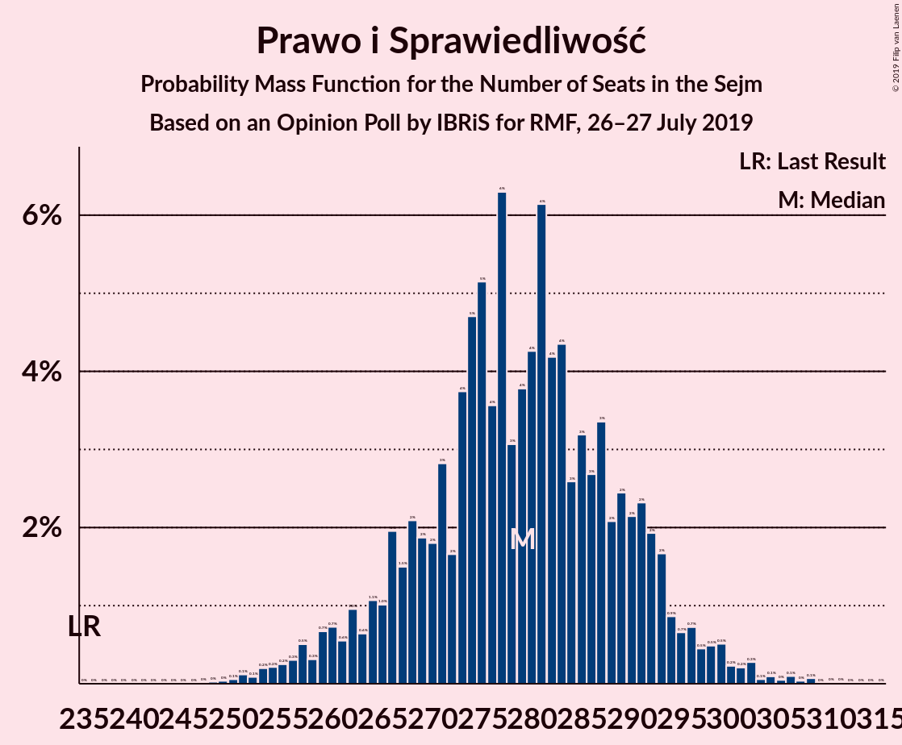
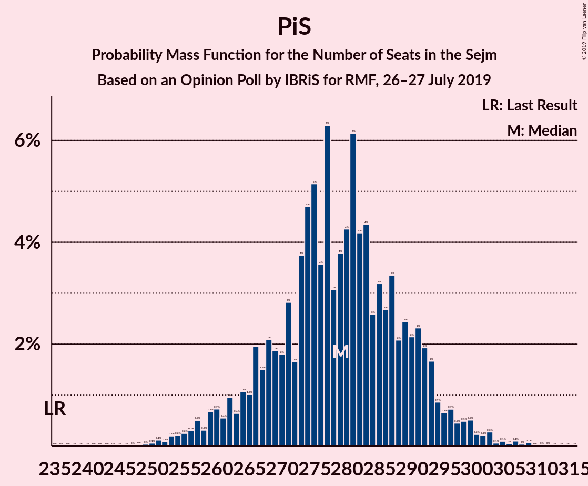

# Opinion Poll by IBRiS for RMF, 26–27 July 2019

<a href="#voting-intentions">Voting Intentions</a> | <a href="#seats">Seats</a> | <a href="#coalitions">Coalitions</a> | <a href="#technical-information">Technical Information</a>

## Voting Intentions

### Confidence Intervals

| Party | Last Result | Poll Result | 80% Confidence Interval | 90% Confidence Interval | 95% Confidence Interval | 99% Confidence Interval |
|:-----:|:-----------:|:-----------:|:-----------------------:|:-----------------------:|:-----------------------:|:-----------------------:|
| Prawo i Sprawiedliwość | 37.6% | 44.5% | 42.6–46.5% |42.1–47.0% |41.6–47.5% |40.7–48.4% |
| Koalicja Obywatelska | 31.7% | 21.7% | 20.2–23.4% |19.8–23.9% |19.4–24.3% |18.7–25.1% |
| Lewica Razem–Sojusz Lewicy Demokratycznej–Wiosna | 11.7% | 11.2% | 10.0–12.5% |9.7–12.9% |9.4–13.2% |8.9–13.8% |
| Kukiz’15 | 8.8% | 4.1% | 3.4–5.0% |3.2–5.2% |3.1–5.4% |2.8–5.9% |
| KORWiN | 4.8% | 2.3% | 1.8–3.0% |1.6–3.2% |1.5–3.3% |1.3–3.7% |
| Polskie Stronnictwo Ludowe | 5.1% | 2.0% | 1.6–2.7% |1.4–2.9% |1.3–3.0% |1.1–3.4% |

*Note:* The poll result column reflects the actual value used in the calculations. Published results may vary slightly, and in addition be rounded to fewer digits.

## Seats

### Confidence Intervals

| Party | Last Result | Median | 80% Confidence Interval | 90% Confidence Interval | 95% Confidence Interval | 99% Confidence Interval |
|:-----:|:-----------:|:------:|:-----------------------:|:-----------------------:|:-----------------------:|:-----------------------:|
| <a href="#prawo-i-sprawiedliwość">Prawo i Sprawiedliwość</a> | 235 | 277 | 266–289 |262–293 |256–297 |252–307 |
| <a href="#koalicja-obywatelska">Koalicja Obywatelska</a> | 166 | 131 | 109–143 |106–143 |104–146 |99–147 |
| <a href="#lewica-razem–sojusz-lewicy-demokratycznej–wiosna">Lewica Razem–Sojusz Lewicy Demokratycznej–Wiosna</a> | 0 | 52 | 43–66 |43–68 |42–71 |37–76 |
| <a href="#kukiz’15">Kukiz’15</a> | 42 | 0 | 0 |0–9 |0–11 |0–16 |
| <a href="#korwin">KORWiN</a> | 0 | 0 | 0 |0 |0 |0 |
| <a href="#polskie-stronnictwo-ludowe">Polskie Stronnictwo Ludowe</a> | 16 | 0 | 0 |0 |0 |0 |

### Prawo i Sprawiedliwość

*For a full overview of the results for this party, see the [Prawo i Sprawiedliwość](party-prawoisprawiedliwość.html) page.*

| Number of Seats | Probability | Accumulated | Special Marks |
|:---------------:|:-----------:|:-----------:|:-------------:|
| 235 | 0% | 100% | Last Result |
| 236 | 0% | 100% |  |
| 237 | 0% | 100% |  |
| 238 | 0% | 100% |  |
| 239 | 0% | 100% |  |
| 240 | 0% | 100% |  |
| 241 | 0% | 100% |  |
| 242 | 0% | 100% |  |
| 243 | 0% | 100% |  |
| 244 | 0% | 100% |  |
| 245 | 0% | 100% |  |
| 246 | 0% | 100% |  |
| 247 | 0% | 100% |  |
| 248 | 0% | 100% |  |
| 249 | 0.1% | 99.9% |  |
| 250 | 0.1% | 99.8% |  |
| 251 | 0.1% | 99.7% |  |
| 252 | 0.2% | 99.6% |  |
| 253 | 0.6% | 99.4% |  |
| 254 | 0.3% | 98.8% |  |
| 255 | 0.9% | 98.5% |  |
| 256 | 0.7% | 98% |  |
| 257 | 0.5% | 97% |  |
| 258 | 0.3% | 96% |  |
| 259 | 0.4% | 96% |  |
| 260 | 0.2% | 96% |  |
| 261 | 0.1% | 96% |  |
| 262 | 0.7% | 95% |  |
| 263 | 0.8% | 95% |  |
| 264 | 1.3% | 94% |  |
| 265 | 2% | 93% |  |
| 266 | 3% | 91% |  |
| 267 | 3% | 87% |  |
| 268 | 3% | 84% |  |
| 269 | 2% | 81% |  |
| 270 | 2% | 79% |  |
| 271 | 4% | 77% |  |
| 272 | 2% | 73% |  |
| 273 | 3% | 70% |  |
| 274 | 4% | 67% |  |
| 275 | 5% | 63% |  |
| 276 | 5% | 58% |  |
| 277 | 4% | 53% | Median |
| 278 | 2% | 49% |  |
| 279 | 2% | 48% |  |
| 280 | 2% | 46% |  |
| 281 | 8% | 44% |  |
| 282 | 5% | 36% |  |
| 283 | 3% | 31% |  |
| 284 | 2% | 28% |  |
| 285 | 3% | 25% |  |
| 286 | 2% | 22% |  |
| 287 | 4% | 20% |  |
| 288 | 4% | 16% |  |
| 289 | 4% | 13% |  |
| 290 | 1.3% | 9% |  |
| 291 | 1.0% | 7% |  |
| 292 | 1.3% | 6% |  |
| 293 | 1.0% | 5% |  |
| 294 | 0.4% | 4% |  |
| 295 | 0.2% | 4% |  |
| 296 | 0.8% | 3% |  |
| 297 | 0.4% | 3% |  |
| 298 | 0.6% | 2% |  |
| 299 | 0.4% | 2% |  |
| 300 | 0.2% | 1.3% |  |
| 301 | 0.1% | 1.1% |  |
| 302 | 0.1% | 1.0% |  |
| 303 | 0% | 0.9% |  |
| 304 | 0.1% | 0.8% |  |
| 305 | 0.1% | 0.7% |  |
| 306 | 0.2% | 0.7% |  |
| 307 | 0% | 0.5% |  |
| 308 | 0.3% | 0.5% |  |
| 309 | 0% | 0.2% |  |
| 310 | 0.1% | 0.2% |  |
| 311 | 0.1% | 0.1% |  |
| 312 | 0% | 0% |  |

### Koalicja Obywatelska

*For a full overview of the results for this party, see the [Koalicja Obywatelska](party-koalicjaobywatelska.html) page.*

| Number of Seats | Probability | Accumulated | Special Marks |
|:---------------:|:-----------:|:-----------:|:-------------:|
| 97 | 0.1% | 100% |  |
| 98 | 0.2% | 99.9% |  |
| 99 | 0.3% | 99.8% |  |
| 100 | 0.2% | 99.5% |  |
| 101 | 0.6% | 99.3% |  |
| 102 | 0.5% | 98.7% |  |
| 103 | 0.6% | 98% |  |
| 104 | 0.6% | 98% |  |
| 105 | 2% | 97% |  |
| 106 | 0.7% | 95% |  |
| 107 | 2% | 94% |  |
| 108 | 2% | 93% |  |
| 109 | 2% | 91% |  |
| 110 | 2% | 89% |  |
| 111 | 1.4% | 86% |  |
| 112 | 2% | 85% |  |
| 113 | 5% | 83% |  |
| 114 | 2% | 78% |  |
| 115 | 1.4% | 76% |  |
| 116 | 2% | 74% |  |
| 117 | 2% | 73% |  |
| 118 | 0.8% | 71% |  |
| 119 | 0.8% | 70% |  |
| 120 | 1.1% | 69% |  |
| 121 | 0.4% | 68% |  |
| 122 | 0.5% | 68% |  |
| 123 | 0.6% | 67% |  |
| 124 | 2% | 67% |  |
| 125 | 0.9% | 65% |  |
| 126 | 1.1% | 64% |  |
| 127 | 0.7% | 63% |  |
| 128 | 2% | 62% |  |
| 129 | 2% | 60% |  |
| 130 | 6% | 58% |  |
| 131 | 4% | 52% | Median |
| 132 | 3% | 48% |  |
| 133 | 4% | 45% |  |
| 134 | 6% | 41% |  |
| 135 | 4% | 35% |  |
| 136 | 3% | 31% |  |
| 137 | 2% | 28% |  |
| 138 | 3% | 26% |  |
| 139 | 4% | 23% |  |
| 140 | 2% | 19% |  |
| 141 | 2% | 17% |  |
| 142 | 5% | 15% |  |
| 143 | 5% | 10% |  |
| 144 | 0.6% | 5% |  |
| 145 | 1.5% | 4% |  |
| 146 | 2% | 3% |  |
| 147 | 0.6% | 0.9% |  |
| 148 | 0.2% | 0.3% |  |
| 149 | 0.1% | 0.1% |  |
| 150 | 0% | 0.1% |  |
| 151 | 0% | 0% |  |
| 152 | 0% | 0% |  |
| 153 | 0% | 0% |  |
| 154 | 0% | 0% |  |
| 155 | 0% | 0% |  |
| 156 | 0% | 0% |  |
| 157 | 0% | 0% |  |
| 158 | 0% | 0% |  |
| 159 | 0% | 0% |  |
| 160 | 0% | 0% |  |
| 161 | 0% | 0% |  |
| 162 | 0% | 0% |  |
| 163 | 0% | 0% |  |
| 164 | 0% | 0% |  |
| 165 | 0% | 0% |  |
| 166 | 0% | 0% | Last Result |

### Lewica Razem–Sojusz Lewicy Demokratycznej–Wiosna

*For a full overview of the results for this party, see the [Lewica Razem–Sojusz Lewicy Demokratycznej–Wiosna](party-lewicarazem–sojuszlewicydemokratycznej–wiosna.html) page.*

| Number of Seats | Probability | Accumulated | Special Marks |
|:---------------:|:-----------:|:-----------:|:-------------:|
| 0 | 0% | 100% | Last Result |
| 1 | 0% | 100% |  |
| 2 | 0% | 100% |  |
| 3 | 0% | 100% |  |
| 4 | 0% | 100% |  |
| 5 | 0% | 100% |  |
| 6 | 0% | 100% |  |
| 7 | 0% | 100% |  |
| 8 | 0% | 100% |  |
| 9 | 0% | 100% |  |
| 10 | 0% | 100% |  |
| 11 | 0% | 100% |  |
| 12 | 0% | 100% |  |
| 13 | 0% | 100% |  |
| 14 | 0% | 100% |  |
| 15 | 0% | 100% |  |
| 16 | 0% | 100% |  |
| 17 | 0% | 100% |  |
| 18 | 0% | 100% |  |
| 19 | 0% | 100% |  |
| 20 | 0% | 100% |  |
| 21 | 0% | 100% |  |
| 22 | 0% | 100% |  |
| 23 | 0% | 100% |  |
| 24 | 0% | 100% |  |
| 25 | 0% | 100% |  |
| 26 | 0% | 100% |  |
| 27 | 0% | 100% |  |
| 28 | 0% | 100% |  |
| 29 | 0% | 100% |  |
| 30 | 0% | 100% |  |
| 31 | 0% | 100% |  |
| 32 | 0% | 100% |  |
| 33 | 0% | 100% |  |
| 34 | 0.1% | 100% |  |
| 35 | 0.3% | 99.9% |  |
| 36 | 0.1% | 99.6% |  |
| 37 | 0.2% | 99.6% |  |
| 38 | 0.2% | 99.4% |  |
| 39 | 0.2% | 99.2% |  |
| 40 | 0.3% | 99.0% |  |
| 41 | 0.8% | 98.7% |  |
| 42 | 2% | 98% |  |
| 43 | 8% | 96% |  |
| 44 | 7% | 88% |  |
| 45 | 1.3% | 81% |  |
| 46 | 3% | 80% |  |
| 47 | 1.0% | 77% |  |
| 48 | 8% | 76% |  |
| 49 | 4% | 68% |  |
| 50 | 7% | 64% |  |
| 51 | 5% | 57% |  |
| 52 | 6% | 52% | Median |
| 53 | 2% | 47% |  |
| 54 | 4% | 45% |  |
| 55 | 3% | 40% |  |
| 56 | 4% | 38% |  |
| 57 | 0.9% | 33% |  |
| 58 | 1.0% | 32% |  |
| 59 | 0.6% | 31% |  |
| 60 | 2% | 31% |  |
| 61 | 3% | 29% |  |
| 62 | 1.5% | 26% |  |
| 63 | 4% | 25% |  |
| 64 | 2% | 20% |  |
| 65 | 3% | 18% |  |
| 66 | 9% | 15% |  |
| 67 | 0.5% | 6% |  |
| 68 | 0.9% | 5% |  |
| 69 | 2% | 5% |  |
| 70 | 0.3% | 3% |  |
| 71 | 0.2% | 3% |  |
| 72 | 1.0% | 2% |  |
| 73 | 0.3% | 1.5% |  |
| 74 | 0.2% | 1.1% |  |
| 75 | 0.1% | 0.9% |  |
| 76 | 0.3% | 0.8% |  |
| 77 | 0.3% | 0.5% |  |
| 78 | 0.1% | 0.1% |  |
| 79 | 0.1% | 0.1% |  |
| 80 | 0% | 0% |  |

### Kukiz’15

*For a full overview of the results for this party, see the [Kukiz’15](party-kukiz’15.html) page.*

| Number of Seats | Probability | Accumulated | Special Marks |
|:---------------:|:-----------:|:-----------:|:-------------:|
| 0 | 92% | 100% | Median |
| 1 | 0% | 8% |  |
| 2 | 0% | 8% |  |
| 3 | 0% | 8% |  |
| 4 | 0% | 8% |  |
| 5 | 0.4% | 8% |  |
| 6 | 0.3% | 8% |  |
| 7 | 0.4% | 8% |  |
| 8 | 0.8% | 7% |  |
| 9 | 2% | 6% |  |
| 10 | 2% | 4% |  |
| 11 | 0.7% | 3% |  |
| 12 | 0.5% | 2% |  |
| 13 | 0.3% | 1.3% |  |
| 14 | 0.3% | 1.0% |  |
| 15 | 0.2% | 0.7% |  |
| 16 | 0.1% | 0.5% |  |
| 17 | 0.1% | 0.4% |  |
| 18 | 0.1% | 0.3% |  |
| 19 | 0.1% | 0.2% |  |
| 20 | 0.1% | 0.2% |  |
| 21 | 0% | 0.1% |  |
| 22 | 0% | 0.1% |  |
| 23 | 0% | 0% |  |
| 24 | 0% | 0% |  |
| 25 | 0% | 0% |  |
| 26 | 0% | 0% |  |
| 27 | 0% | 0% |  |
| 28 | 0% | 0% |  |
| 29 | 0% | 0% |  |
| 30 | 0% | 0% |  |
| 31 | 0% | 0% |  |
| 32 | 0% | 0% |  |
| 33 | 0% | 0% |  |
| 34 | 0% | 0% |  |
| 35 | 0% | 0% |  |
| 36 | 0% | 0% |  |
| 37 | 0% | 0% |  |
| 38 | 0% | 0% |  |
| 39 | 0% | 0% |  |
| 40 | 0% | 0% |  |
| 41 | 0% | 0% |  |
| 42 | 0% | 0% | Last Result |

### KORWiN

*For a full overview of the results for this party, see the [KORWiN](party-korwin.html) page.*

| Number of Seats | Probability | Accumulated | Special Marks |
|:---------------:|:-----------:|:-----------:|:-------------:|
| 0 | 100% | 100% | Last Result, Median |

### Polskie Stronnictwo Ludowe

*For a full overview of the results for this party, see the [Polskie Stronnictwo Ludowe](party-polskiestronnictwoludowe.html) page.*

| Number of Seats | Probability | Accumulated | Special Marks |
|:---------------:|:-----------:|:-----------:|:-------------:|
| 0 | 100% | 100% | Median |
| 1 | 0% | 0% |  |
| 2 | 0% | 0% |  |
| 3 | 0% | 0% |  |
| 4 | 0% | 0% |  |
| 5 | 0% | 0% |  |
| 6 | 0% | 0% |  |
| 7 | 0% | 0% |  |
| 8 | 0% | 0% |  |
| 9 | 0% | 0% |  |
| 10 | 0% | 0% |  |
| 11 | 0% | 0% |  |
| 12 | 0% | 0% |  |
| 13 | 0% | 0% |  |
| 14 | 0% | 0% |  |
| 15 | 0% | 0% |  |
| 16 | 0% | 0% | Last Result |

## Coalitions

### Confidence Intervals

| Coalition | Last Result | Median | Majority? | 80% Confidence Interval | 90% Confidence Interval | 95% Confidence Interval | 99% Confidence Interval |
|:---------:|:-----------:|:------:|:---------:|:-----------------------:|:-----------------------:|:-----------------------:|:-----------------------:|
| Prawo i Sprawiedliwość | 235 | 277 | 100% | 266–289 | 262–293 | 256–297 | 252–307 |
| Koalicja Obywatelska – Lewica Razem–Sojusz Lewicy Demokratycznej–Wiosna | 166 | 181 | 0% | 170–194 | 166–196 | 162–203 | 152–208 |
| Koalicja Obywatelska – Lewica Razem–Sojusz Lewicy Demokratycznej–Wiosna – Polskie Stronnictwo Ludowe | 182 | 181 | 0% | 170–194 | 166–196 | 162–203 | 152–208 |
| Koalicja Obywatelska | 166 | 131 | 0% | 109–143 | 106–143 | 104–146 | 99–147 |
| Koalicja Obywatelska – Polskie Stronnictwo Ludowe | 182 | 131 | 0% | 109–143 | 106–143 | 104–146 | 99–147 |

### Prawo i Sprawiedliwość

| Number of Seats | Probability | Accumulated | Special Marks |
|:---------------:|:-----------:|:-----------:|:-------------:|
| 235 | 0% | 100% | Last Result |
| 236 | 0% | 100% |  |
| 237 | 0% | 100% |  |
| 238 | 0% | 100% |  |
| 239 | 0% | 100% |  |
| 240 | 0% | 100% |  |
| 241 | 0% | 100% |  |
| 242 | 0% | 100% |  |
| 243 | 0% | 100% |  |
| 244 | 0% | 100% |  |
| 245 | 0% | 100% |  |
| 246 | 0% | 100% |  |
| 247 | 0% | 100% |  |
| 248 | 0% | 100% |  |
| 249 | 0.1% | 99.9% |  |
| 250 | 0.1% | 99.8% |  |
| 251 | 0.1% | 99.7% |  |
| 252 | 0.2% | 99.6% |  |
| 253 | 0.6% | 99.4% |  |
| 254 | 0.3% | 98.8% |  |
| 255 | 0.9% | 98.5% |  |
| 256 | 0.7% | 98% |  |
| 257 | 0.5% | 97% |  |
| 258 | 0.3% | 96% |  |
| 259 | 0.4% | 96% |  |
| 260 | 0.2% | 96% |  |
| 261 | 0.1% | 96% |  |
| 262 | 0.7% | 95% |  |
| 263 | 0.8% | 95% |  |
| 264 | 1.3% | 94% |  |
| 265 | 2% | 93% |  |
| 266 | 3% | 91% |  |
| 267 | 3% | 87% |  |
| 268 | 3% | 84% |  |
| 269 | 2% | 81% |  |
| 270 | 2% | 79% |  |
| 271 | 4% | 77% |  |
| 272 | 2% | 73% |  |
| 273 | 3% | 70% |  |
| 274 | 4% | 67% |  |
| 275 | 5% | 63% |  |
| 276 | 5% | 58% |  |
| 277 | 4% | 53% | Median |
| 278 | 2% | 49% |  |
| 279 | 2% | 48% |  |
| 280 | 2% | 46% |  |
| 281 | 8% | 44% |  |
| 282 | 5% | 36% |  |
| 283 | 3% | 31% |  |
| 284 | 2% | 28% |  |
| 285 | 3% | 25% |  |
| 286 | 2% | 22% |  |
| 287 | 4% | 20% |  |
| 288 | 4% | 16% |  |
| 289 | 4% | 13% |  |
| 290 | 1.3% | 9% |  |
| 291 | 1.0% | 7% |  |
| 292 | 1.3% | 6% |  |
| 293 | 1.0% | 5% |  |
| 294 | 0.4% | 4% |  |
| 295 | 0.2% | 4% |  |
| 296 | 0.8% | 3% |  |
| 297 | 0.4% | 3% |  |
| 298 | 0.6% | 2% |  |
| 299 | 0.4% | 2% |  |
| 300 | 0.2% | 1.3% |  |
| 301 | 0.1% | 1.1% |  |
| 302 | 0.1% | 1.0% |  |
| 303 | 0% | 0.9% |  |
| 304 | 0.1% | 0.8% |  |
| 305 | 0.1% | 0.7% |  |
| 306 | 0.2% | 0.7% |  |
| 307 | 0% | 0.5% |  |
| 308 | 0.3% | 0.5% |  |
| 309 | 0% | 0.2% |  |
| 310 | 0.1% | 0.2% |  |
| 311 | 0.1% | 0.1% |  |
| 312 | 0% | 0% |  |

### Koalicja Obywatelska – Lewica Razem–Sojusz Lewicy Demokratycznej–Wiosna

| Number of Seats | Probability | Accumulated | Special Marks |
|:---------------:|:-----------:|:-----------:|:-------------:|
| 148 | 0% | 100% |  |
| 149 | 0.1% | 99.9% |  |
| 150 | 0.1% | 99.9% |  |
| 151 | 0% | 99.8% |  |
| 152 | 0.3% | 99.8% |  |
| 153 | 0% | 99.5% |  |
| 154 | 0.2% | 99.4% |  |
| 155 | 0.1% | 99.2% |  |
| 156 | 0.1% | 99.2% |  |
| 157 | 0% | 99.1% |  |
| 158 | 0.1% | 99.0% |  |
| 159 | 0.1% | 98.9% |  |
| 160 | 0.2% | 98.8% |  |
| 161 | 0.6% | 98.5% |  |
| 162 | 0.7% | 98% |  |
| 163 | 0.6% | 97% |  |
| 164 | 0.9% | 97% |  |
| 165 | 0.3% | 96% |  |
| 166 | 0.6% | 96% | Last Result |
| 167 | 1.4% | 95% |  |
| 168 | 1.4% | 94% |  |
| 169 | 1.3% | 92% |  |
| 170 | 2% | 91% |  |
| 171 | 4% | 89% |  |
| 172 | 4% | 85% |  |
| 173 | 4% | 81% |  |
| 174 | 3% | 77% |  |
| 175 | 3% | 74% |  |
| 176 | 3% | 71% |  |
| 177 | 3% | 69% |  |
| 178 | 5% | 66% |  |
| 179 | 8% | 60% |  |
| 180 | 2% | 53% |  |
| 181 | 1.3% | 51% |  |
| 182 | 2% | 50% |  |
| 183 | 3% | 48% | Median |
| 184 | 5% | 45% |  |
| 185 | 5% | 40% |  |
| 186 | 4% | 35% |  |
| 187 | 3% | 30% |  |
| 188 | 3% | 27% |  |
| 189 | 4% | 25% |  |
| 190 | 2% | 21% |  |
| 191 | 2% | 18% |  |
| 192 | 3% | 16% |  |
| 193 | 2% | 13% |  |
| 194 | 3% | 11% |  |
| 195 | 2% | 8% |  |
| 196 | 1.3% | 6% |  |
| 197 | 0.4% | 5% |  |
| 198 | 0.6% | 4% |  |
| 199 | 0% | 4% |  |
| 200 | 0.2% | 4% |  |
| 201 | 0.2% | 3% |  |
| 202 | 0.2% | 3% |  |
| 203 | 0.5% | 3% |  |
| 204 | 0.3% | 2% |  |
| 205 | 0.7% | 2% |  |
| 206 | 0.2% | 1.3% |  |
| 207 | 0.6% | 1.1% |  |
| 208 | 0.2% | 0.5% |  |
| 209 | 0.1% | 0.3% |  |
| 210 | 0% | 0.2% |  |
| 211 | 0.1% | 0.2% |  |
| 212 | 0% | 0% |  |

### Koalicja Obywatelska – Lewica Razem–Sojusz Lewicy Demokratycznej–Wiosna – Polskie Stronnictwo Ludowe

| Number of Seats | Probability | Accumulated | Special Marks |
|:---------------:|:-----------:|:-----------:|:-------------:|
| 148 | 0% | 100% |  |
| 149 | 0.1% | 99.9% |  |
| 150 | 0.1% | 99.9% |  |
| 151 | 0% | 99.8% |  |
| 152 | 0.3% | 99.8% |  |
| 153 | 0% | 99.5% |  |
| 154 | 0.2% | 99.4% |  |
| 155 | 0.1% | 99.2% |  |
| 156 | 0.1% | 99.2% |  |
| 157 | 0% | 99.1% |  |
| 158 | 0.1% | 99.0% |  |
| 159 | 0.1% | 98.9% |  |
| 160 | 0.2% | 98.8% |  |
| 161 | 0.6% | 98.5% |  |
| 162 | 0.7% | 98% |  |
| 163 | 0.6% | 97% |  |
| 164 | 0.9% | 97% |  |
| 165 | 0.3% | 96% |  |
| 166 | 0.6% | 96% |  |
| 167 | 1.4% | 95% |  |
| 168 | 1.4% | 94% |  |
| 169 | 1.3% | 92% |  |
| 170 | 2% | 91% |  |
| 171 | 4% | 89% |  |
| 172 | 4% | 85% |  |
| 173 | 4% | 81% |  |
| 174 | 3% | 77% |  |
| 175 | 3% | 74% |  |
| 176 | 3% | 71% |  |
| 177 | 3% | 69% |  |
| 178 | 5% | 66% |  |
| 179 | 8% | 60% |  |
| 180 | 2% | 53% |  |
| 181 | 1.3% | 51% |  |
| 182 | 2% | 50% | Last Result |
| 183 | 3% | 48% | Median |
| 184 | 5% | 45% |  |
| 185 | 5% | 40% |  |
| 186 | 4% | 35% |  |
| 187 | 3% | 30% |  |
| 188 | 3% | 27% |  |
| 189 | 4% | 25% |  |
| 190 | 2% | 21% |  |
| 191 | 2% | 18% |  |
| 192 | 3% | 16% |  |
| 193 | 2% | 13% |  |
| 194 | 3% | 11% |  |
| 195 | 2% | 8% |  |
| 196 | 1.3% | 6% |  |
| 197 | 0.4% | 5% |  |
| 198 | 0.6% | 4% |  |
| 199 | 0% | 4% |  |
| 200 | 0.2% | 4% |  |
| 201 | 0.2% | 3% |  |
| 202 | 0.2% | 3% |  |
| 203 | 0.5% | 3% |  |
| 204 | 0.3% | 2% |  |
| 205 | 0.7% | 2% |  |
| 206 | 0.2% | 1.3% |  |
| 207 | 0.6% | 1.1% |  |
| 208 | 0.2% | 0.5% |  |
| 209 | 0.1% | 0.3% |  |
| 210 | 0% | 0.2% |  |
| 211 | 0.1% | 0.2% |  |
| 212 | 0% | 0% |  |

### Koalicja Obywatelska

| Number of Seats | Probability | Accumulated | Special Marks |
|:---------------:|:-----------:|:-----------:|:-------------:|
| 97 | 0.1% | 100% |  |
| 98 | 0.2% | 99.9% |  |
| 99 | 0.3% | 99.8% |  |
| 100 | 0.2% | 99.5% |  |
| 101 | 0.6% | 99.3% |  |
| 102 | 0.5% | 98.7% |  |
| 103 | 0.6% | 98% |  |
| 104 | 0.6% | 98% |  |
| 105 | 2% | 97% |  |
| 106 | 0.7% | 95% |  |
| 107 | 2% | 94% |  |
| 108 | 2% | 93% |  |
| 109 | 2% | 91% |  |
| 110 | 2% | 89% |  |
| 111 | 1.4% | 86% |  |
| 112 | 2% | 85% |  |
| 113 | 5% | 83% |  |
| 114 | 2% | 78% |  |
| 115 | 1.4% | 76% |  |
| 116 | 2% | 74% |  |
| 117 | 2% | 73% |  |
| 118 | 0.8% | 71% |  |
| 119 | 0.8% | 70% |  |
| 120 | 1.1% | 69% |  |
| 121 | 0.4% | 68% |  |
| 122 | 0.5% | 68% |  |
| 123 | 0.6% | 67% |  |
| 124 | 2% | 67% |  |
| 125 | 0.9% | 65% |  |
| 126 | 1.1% | 64% |  |
| 127 | 0.7% | 63% |  |
| 128 | 2% | 62% |  |
| 129 | 2% | 60% |  |
| 130 | 6% | 58% |  |
| 131 | 4% | 52% | Median |
| 132 | 3% | 48% |  |
| 133 | 4% | 45% |  |
| 134 | 6% | 41% |  |
| 135 | 4% | 35% |  |
| 136 | 3% | 31% |  |
| 137 | 2% | 28% |  |
| 138 | 3% | 26% |  |
| 139 | 4% | 23% |  |
| 140 | 2% | 19% |  |
| 141 | 2% | 17% |  |
| 142 | 5% | 15% |  |
| 143 | 5% | 10% |  |
| 144 | 0.6% | 5% |  |
| 145 | 1.5% | 4% |  |
| 146 | 2% | 3% |  |
| 147 | 0.6% | 0.9% |  |
| 148 | 0.2% | 0.3% |  |
| 149 | 0.1% | 0.1% |  |
| 150 | 0% | 0.1% |  |
| 151 | 0% | 0% |  |
| 152 | 0% | 0% |  |
| 153 | 0% | 0% |  |
| 154 | 0% | 0% |  |
| 155 | 0% | 0% |  |
| 156 | 0% | 0% |  |
| 157 | 0% | 0% |  |
| 158 | 0% | 0% |  |
| 159 | 0% | 0% |  |
| 160 | 0% | 0% |  |
| 161 | 0% | 0% |  |
| 162 | 0% | 0% |  |
| 163 | 0% | 0% |  |
| 164 | 0% | 0% |  |
| 165 | 0% | 0% |  |
| 166 | 0% | 0% | Last Result |

### Koalicja Obywatelska – Polskie Stronnictwo Ludowe

| Number of Seats | Probability | Accumulated | Special Marks |
|:---------------:|:-----------:|:-----------:|:-------------:|
| 97 | 0.1% | 100% |  |
| 98 | 0.2% | 99.9% |  |
| 99 | 0.3% | 99.8% |  |
| 100 | 0.2% | 99.5% |  |
| 101 | 0.6% | 99.3% |  |
| 102 | 0.5% | 98.7% |  |
| 103 | 0.6% | 98% |  |
| 104 | 0.6% | 98% |  |
| 105 | 2% | 97% |  |
| 106 | 0.7% | 95% |  |
| 107 | 2% | 94% |  |
| 108 | 2% | 93% |  |
| 109 | 2% | 91% |  |
| 110 | 2% | 89% |  |
| 111 | 1.4% | 86% |  |
| 112 | 2% | 85% |  |
| 113 | 5% | 83% |  |
| 114 | 2% | 78% |  |
| 115 | 1.4% | 76% |  |
| 116 | 2% | 74% |  |
| 117 | 2% | 73% |  |
| 118 | 0.8% | 71% |  |
| 119 | 0.8% | 70% |  |
| 120 | 1.1% | 69% |  |
| 121 | 0.4% | 68% |  |
| 122 | 0.5% | 68% |  |
| 123 | 0.6% | 67% |  |
| 124 | 2% | 67% |  |
| 125 | 0.9% | 65% |  |
| 126 | 1.1% | 64% |  |
| 127 | 0.7% | 63% |  |
| 128 | 2% | 62% |  |
| 129 | 2% | 60% |  |
| 130 | 6% | 58% |  |
| 131 | 4% | 52% | Median |
| 132 | 3% | 48% |  |
| 133 | 4% | 45% |  |
| 134 | 6% | 41% |  |
| 135 | 4% | 35% |  |
| 136 | 3% | 31% |  |
| 137 | 2% | 28% |  |
| 138 | 3% | 26% |  |
| 139 | 4% | 23% |  |
| 140 | 2% | 19% |  |
| 141 | 2% | 17% |  |
| 142 | 5% | 15% |  |
| 143 | 5% | 10% |  |
| 144 | 0.6% | 5% |  |
| 145 | 1.5% | 4% |  |
| 146 | 2% | 3% |  |
| 147 | 0.6% | 0.9% |  |
| 148 | 0.2% | 0.3% |  |
| 149 | 0.1% | 0.1% |  |
| 150 | 0% | 0.1% |  |
| 151 | 0% | 0% |  |
| 152 | 0% | 0% |  |
| 153 | 0% | 0% |  |
| 154 | 0% | 0% |  |
| 155 | 0% | 0% |  |
| 156 | 0% | 0% |  |
| 157 | 0% | 0% |  |
| 158 | 0% | 0% |  |
| 159 | 0% | 0% |  |
| 160 | 0% | 0% |  |
| 161 | 0% | 0% |  |
| 162 | 0% | 0% |  |
| 163 | 0% | 0% |  |
| 164 | 0% | 0% |  |
| 165 | 0% | 0% |  |
| 166 | 0% | 0% |  |
| 167 | 0% | 0% |  |
| 168 | 0% | 0% |  |
| 169 | 0% | 0% |  |
| 170 | 0% | 0% |  |
| 171 | 0% | 0% |  |
| 172 | 0% | 0% |  |
| 173 | 0% | 0% |  |
| 174 | 0% | 0% |  |
| 175 | 0% | 0% |  |
| 176 | 0% | 0% |  |
| 177 | 0% | 0% |  |
| 178 | 0% | 0% |  |
| 179 | 0% | 0% |  |
| 180 | 0% | 0% |  |
| 181 | 0% | 0% |  |
| 182 | 0% | 0% | Last Result |

## Technical Information

### Opinion Poll

+ **Polling firm:** IBRiS
+ **Commissioner(s):** RMF
+ **Fieldwork period:** 26–27 July 2019

### Calculations

+ **Sample size:** 1100
+ **Simulations done:** 131,072
+ **Error estimate:** 3.14%

