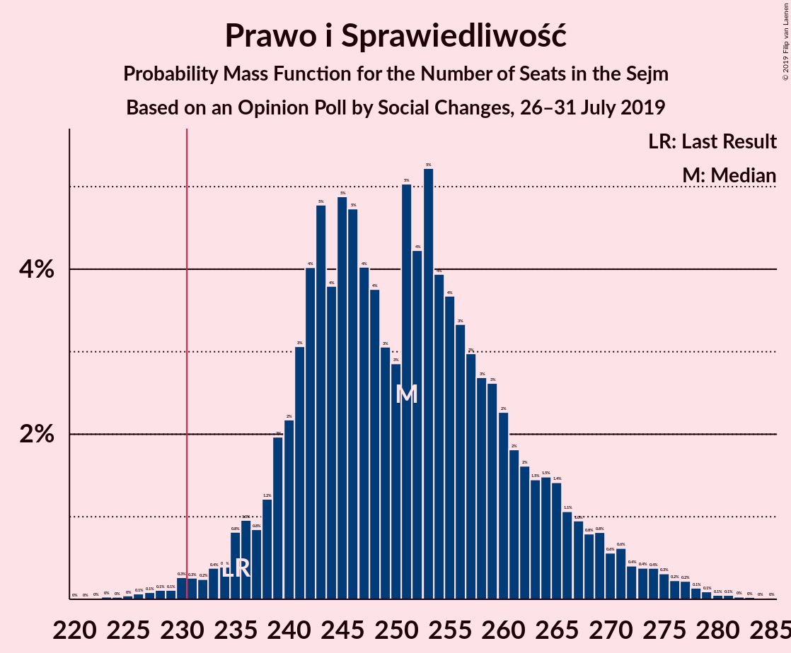

# Opinion Poll by Social Changes, 26–31 July 2019

<a href="#voting-intentions">Voting Intentions</a> | <a href="#seats">Seats</a> | <a href="#coalitions">Coalitions</a> | <a href="#technical-information">Technical Information</a>

## Voting Intentions

### Confidence Intervals

| Party | Last Result | Poll Result | 80% Confidence Interval | 90% Confidence Interval | 95% Confidence Interval | 99% Confidence Interval |
|:-----:|:-----------:|:-----------:|:-----------------------:|:-----------------------:|:-----------------------:|:-----------------------:|
| Prawo i Sprawiedliwość | 37.6% | 46.7% | 44.7–48.8% |44.2–49.3% |43.7–49.8% |42.7–50.8% |
| Koalicja Obywatelska | 31.7% | 26.9% | 25.1–28.7% |24.6–29.2% |24.2–29.7% |23.4–30.6% |
| Lewica Razem–Sojusz Lewicy Demokratycznej–Wiosna | 11.7% | 13.2% | 11.9–14.7% |11.6–15.1% |11.3–15.5% |10.7–16.2% |
| Polskie Stronnictwo Ludowe | 5.1% | 5.9% | 5.1–7.0% |4.8–7.3% |4.6–7.6% |4.3–8.1% |
| Kukiz’15 | 8.8% | 3.2% | 2.6–4.0% |2.4–4.2% |2.2–4.4% |2.0–4.9% |
| KORWiN | 4.8% | 2.2% | 1.7–2.9% |1.6–3.1% |1.4–3.3% |1.2–3.7% |

*Note:* The poll result column reflects the actual value used in the calculations. Published results may vary slightly, and in addition be rounded to fewer digits.

## Seats

### Confidence Intervals

| Party | Last Result | Median | 80% Confidence Interval | 90% Confidence Interval | 95% Confidence Interval | 99% Confidence Interval |
|:-----:|:-----------:|:------:|:-----------------------:|:-----------------------:|:-----------------------:|:-----------------------:|
| <a href="#prawo-i-sprawiedliwość">Prawo i Sprawiedliwość</a> | 235 | 251 | 241–264 |238–267 |235–271 |229–277 |
| <a href="#koalicja-obywatelska">Koalicja Obywatelska</a> | 166 | 137 | 123–146 |120–148 |118–151 |114–155 |
| <a href="#lewica-razem–sojusz-lewicy-demokratycznej–wiosna">Lewica Razem–Sojusz Lewicy Demokratycznej–Wiosna</a> | 0 | 58 | 48–65 |46–67 |44–68 |41–73 |
| <a href="#polskie-stronnictwo-ludowe">Polskie Stronnictwo Ludowe</a> | 16 | 16 | 11–22 |0–23 |0–24 |0–27 |
| <a href="#kukiz’15">Kukiz’15</a> | 42 | 0 | 0 |0 |0 |0 |
| <a href="#korwin">KORWiN</a> | 0 | 0 | 0 |0 |0 |0 |

### Prawo i Sprawiedliwość

*For a full overview of the results for this party, see the [Prawo i Sprawiedliwość](party-prawoisprawiedliwość.html) page.*

| Number of Seats | Probability | Accumulated | Special Marks |
|:---------------:|:-----------:|:-----------:|:-------------:|
| 223 | 0% | 100% |  |
| 224 | 0% | 99.9% |  |
| 225 | 0% | 99.9% |  |
| 226 | 0.1% | 99.8% |  |
| 227 | 0.1% | 99.8% |  |
| 228 | 0.1% | 99.7% |  |
| 229 | 0.1% | 99.6% |  |
| 230 | 0.3% | 99.4% |  |
| 231 | 0.2% | 99.1% | Majority |
| 232 | 0.3% | 98.9% |  |
| 233 | 0.4% | 98.7% |  |
| 234 | 0.4% | 98% |  |
| 235 | 0.8% | 98% | Last Result |
| 236 | 0.8% | 97% |  |
| 237 | 0.7% | 96% |  |
| 238 | 1.3% | 96% |  |
| 239 | 2% | 94% |  |
| 240 | 2% | 92% |  |
| 241 | 3% | 90% |  |
| 242 | 4% | 87% |  |
| 243 | 5% | 83% |  |
| 244 | 3% | 79% |  |
| 245 | 6% | 75% |  |
| 246 | 3% | 69% |  |
| 247 | 5% | 66% |  |
| 248 | 4% | 61% |  |
| 249 | 4% | 56% |  |
| 250 | 2% | 53% |  |
| 251 | 5% | 50% | Median |
| 252 | 4% | 45% |  |
| 253 | 4% | 42% |  |
| 254 | 4% | 37% |  |
| 255 | 4% | 34% |  |
| 256 | 4% | 29% |  |
| 257 | 3% | 26% |  |
| 258 | 3% | 23% |  |
| 259 | 3% | 20% |  |
| 260 | 2% | 17% |  |
| 261 | 1.3% | 15% |  |
| 262 | 2% | 13% |  |
| 263 | 1.3% | 12% |  |
| 264 | 1.5% | 10% |  |
| 265 | 1.5% | 9% |  |
| 266 | 1.2% | 7% |  |
| 267 | 1.3% | 6% |  |
| 268 | 0.5% | 5% |  |
| 269 | 1.0% | 4% |  |
| 270 | 0.4% | 3% |  |
| 271 | 0.7% | 3% |  |
| 272 | 0.4% | 2% |  |
| 273 | 0.5% | 2% |  |
| 274 | 0.3% | 1.4% |  |
| 275 | 0.3% | 1.1% |  |
| 276 | 0.2% | 0.9% |  |
| 277 | 0.2% | 0.6% |  |
| 278 | 0.1% | 0.5% |  |
| 279 | 0.1% | 0.3% |  |
| 280 | 0% | 0.2% |  |
| 281 | 0.1% | 0.2% |  |
| 282 | 0% | 0.1% |  |
| 283 | 0% | 0.1% |  |
| 284 | 0% | 0.1% |  |
| 285 | 0% | 0% |  |

### Koalicja Obywatelska

*For a full overview of the results for this party, see the [Koalicja Obywatelska](party-koalicjaobywatelska.html) page.*

| Number of Seats | Probability | Accumulated | Special Marks |
|:---------------:|:-----------:|:-----------:|:-------------:|
| 109 | 0% | 100% |  |
| 110 | 0.1% | 99.9% |  |
| 111 | 0.1% | 99.9% |  |
| 112 | 0.1% | 99.8% |  |
| 113 | 0.1% | 99.7% |  |
| 114 | 0.2% | 99.6% |  |
| 115 | 0.5% | 99.4% |  |
| 116 | 0.7% | 98.8% |  |
| 117 | 0.5% | 98% |  |
| 118 | 0.6% | 98% |  |
| 119 | 1.2% | 97% |  |
| 120 | 2% | 96% |  |
| 121 | 1.0% | 94% |  |
| 122 | 1.0% | 93% |  |
| 123 | 2% | 91% |  |
| 124 | 1.1% | 90% |  |
| 125 | 1.1% | 89% |  |
| 126 | 2% | 88% |  |
| 127 | 3% | 86% |  |
| 128 | 2% | 83% |  |
| 129 | 1.5% | 81% |  |
| 130 | 2% | 79% |  |
| 131 | 3% | 78% |  |
| 132 | 4% | 75% |  |
| 133 | 5% | 71% |  |
| 134 | 2% | 67% |  |
| 135 | 5% | 64% |  |
| 136 | 5% | 59% |  |
| 137 | 7% | 54% | Median |
| 138 | 4% | 47% |  |
| 139 | 5% | 42% |  |
| 140 | 6% | 38% |  |
| 141 | 4% | 32% |  |
| 142 | 5% | 27% |  |
| 143 | 4% | 23% |  |
| 144 | 3% | 18% |  |
| 145 | 2% | 16% |  |
| 146 | 3% | 13% |  |
| 147 | 3% | 10% |  |
| 148 | 2% | 7% |  |
| 149 | 1.1% | 4% |  |
| 150 | 0.6% | 3% |  |
| 151 | 0.8% | 3% |  |
| 152 | 0.7% | 2% |  |
| 153 | 0.3% | 1.1% |  |
| 154 | 0.2% | 0.8% |  |
| 155 | 0.2% | 0.6% |  |
| 156 | 0.1% | 0.4% |  |
| 157 | 0.1% | 0.3% |  |
| 158 | 0.1% | 0.2% |  |
| 159 | 0% | 0.1% |  |
| 160 | 0% | 0.1% |  |
| 161 | 0% | 0.1% |  |
| 162 | 0% | 0% |  |
| 163 | 0% | 0% |  |
| 164 | 0% | 0% |  |
| 165 | 0% | 0% |  |
| 166 | 0% | 0% | Last Result |

### Lewica Razem–Sojusz Lewicy Demokratycznej–Wiosna

*For a full overview of the results for this party, see the [Lewica Razem–Sojusz Lewicy Demokratycznej–Wiosna](party-lewicarazem–sojuszlewicydemokratycznej–wiosna.html) page.*

| Number of Seats | Probability | Accumulated | Special Marks |
|:---------------:|:-----------:|:-----------:|:-------------:|
| 0 | 0% | 100% | Last Result |
| 1 | 0% | 100% |  |
| 2 | 0% | 100% |  |
| 3 | 0% | 100% |  |
| 4 | 0% | 100% |  |
| 5 | 0% | 100% |  |
| 6 | 0% | 100% |  |
| 7 | 0% | 100% |  |
| 8 | 0% | 100% |  |
| 9 | 0% | 100% |  |
| 10 | 0% | 100% |  |
| 11 | 0% | 100% |  |
| 12 | 0% | 100% |  |
| 13 | 0% | 100% |  |
| 14 | 0% | 100% |  |
| 15 | 0% | 100% |  |
| 16 | 0% | 100% |  |
| 17 | 0% | 100% |  |
| 18 | 0% | 100% |  |
| 19 | 0% | 100% |  |
| 20 | 0% | 100% |  |
| 21 | 0% | 100% |  |
| 22 | 0% | 100% |  |
| 23 | 0% | 100% |  |
| 24 | 0% | 100% |  |
| 25 | 0% | 100% |  |
| 26 | 0% | 100% |  |
| 27 | 0% | 100% |  |
| 28 | 0% | 100% |  |
| 29 | 0% | 100% |  |
| 30 | 0% | 100% |  |
| 31 | 0% | 100% |  |
| 32 | 0% | 100% |  |
| 33 | 0% | 100% |  |
| 34 | 0% | 100% |  |
| 35 | 0% | 100% |  |
| 36 | 0% | 100% |  |
| 37 | 0% | 100% |  |
| 38 | 0% | 100% |  |
| 39 | 0.1% | 99.9% |  |
| 40 | 0.1% | 99.9% |  |
| 41 | 0.3% | 99.8% |  |
| 42 | 0.6% | 99.5% |  |
| 43 | 1.1% | 98.9% |  |
| 44 | 0.8% | 98% |  |
| 45 | 0.7% | 97% |  |
| 46 | 2% | 96% |  |
| 47 | 3% | 94% |  |
| 48 | 5% | 91% |  |
| 49 | 4% | 86% |  |
| 50 | 4% | 82% |  |
| 51 | 6% | 78% |  |
| 52 | 4% | 72% |  |
| 53 | 3% | 68% |  |
| 54 | 6% | 65% |  |
| 55 | 2% | 60% |  |
| 56 | 4% | 58% |  |
| 57 | 3% | 54% |  |
| 58 | 3% | 51% | Median |
| 59 | 4% | 48% |  |
| 60 | 3% | 44% |  |
| 61 | 7% | 41% |  |
| 62 | 7% | 34% |  |
| 63 | 8% | 27% |  |
| 64 | 7% | 20% |  |
| 65 | 5% | 13% |  |
| 66 | 3% | 8% |  |
| 67 | 2% | 5% |  |
| 68 | 1.1% | 3% |  |
| 69 | 0.7% | 2% |  |
| 70 | 0.4% | 2% |  |
| 71 | 0.3% | 1.2% |  |
| 72 | 0.2% | 0.9% |  |
| 73 | 0.2% | 0.7% |  |
| 74 | 0.1% | 0.5% |  |
| 75 | 0.1% | 0.3% |  |
| 76 | 0.1% | 0.2% |  |
| 77 | 0% | 0.1% |  |
| 78 | 0% | 0.1% |  |
| 79 | 0% | 0.1% |  |
| 80 | 0% | 0% |  |

### Polskie Stronnictwo Ludowe

*For a full overview of the results for this party, see the [Polskie Stronnictwo Ludowe](party-polskiestronnictwoludowe.html) page.*

| Number of Seats | Probability | Accumulated | Special Marks |
|:---------------:|:-----------:|:-----------:|:-------------:|
| 0 | 9% | 100% |  |
| 1 | 0% | 91% |  |
| 2 | 0% | 91% |  |
| 3 | 0% | 91% |  |
| 4 | 0% | 91% |  |
| 5 | 0% | 91% |  |
| 6 | 0% | 91% |  |
| 7 | 0% | 91% |  |
| 8 | 0% | 91% |  |
| 9 | 0% | 91% |  |
| 10 | 0.3% | 91% |  |
| 11 | 9% | 91% |  |
| 12 | 4% | 82% |  |
| 13 | 2% | 78% |  |
| 14 | 6% | 76% |  |
| 15 | 10% | 70% |  |
| 16 | 12% | 60% | Last Result, Median |
| 17 | 9% | 48% |  |
| 18 | 4% | 39% |  |
| 19 | 4% | 36% |  |
| 20 | 6% | 32% |  |
| 21 | 10% | 25% |  |
| 22 | 10% | 16% |  |
| 23 | 3% | 6% |  |
| 24 | 1.1% | 3% |  |
| 25 | 0.6% | 2% |  |
| 26 | 0.4% | 2% |  |
| 27 | 0.8% | 1.2% |  |
| 28 | 0.2% | 0.3% |  |
| 29 | 0% | 0.1% |  |
| 30 | 0% | 0.1% |  |
| 31 | 0% | 0% |  |

### Kukiz’15

*For a full overview of the results for this party, see the [Kukiz’15](party-kukiz’15.html) page.*

| Number of Seats | Probability | Accumulated | Special Marks |
|:---------------:|:-----------:|:-----------:|:-------------:|
| 0 | 99.7% | 100% | Median |
| 1 | 0% | 0.3% |  |
| 2 | 0.1% | 0.3% |  |
| 3 | 0.1% | 0.2% |  |
| 4 | 0% | 0.1% |  |
| 5 | 0% | 0% |  |
| 6 | 0% | 0% |  |
| 7 | 0% | 0% |  |
| 8 | 0% | 0% |  |
| 9 | 0% | 0% |  |
| 10 | 0% | 0% |  |
| 11 | 0% | 0% |  |
| 12 | 0% | 0% |  |
| 13 | 0% | 0% |  |
| 14 | 0% | 0% |  |
| 15 | 0% | 0% |  |
| 16 | 0% | 0% |  |
| 17 | 0% | 0% |  |
| 18 | 0% | 0% |  |
| 19 | 0% | 0% |  |
| 20 | 0% | 0% |  |
| 21 | 0% | 0% |  |
| 22 | 0% | 0% |  |
| 23 | 0% | 0% |  |
| 24 | 0% | 0% |  |
| 25 | 0% | 0% |  |
| 26 | 0% | 0% |  |
| 27 | 0% | 0% |  |
| 28 | 0% | 0% |  |
| 29 | 0% | 0% |  |
| 30 | 0% | 0% |  |
| 31 | 0% | 0% |  |
| 32 | 0% | 0% |  |
| 33 | 0% | 0% |  |
| 34 | 0% | 0% |  |
| 35 | 0% | 0% |  |
| 36 | 0% | 0% |  |
| 37 | 0% | 0% |  |
| 38 | 0% | 0% |  |
| 39 | 0% | 0% |  |
| 40 | 0% | 0% |  |
| 41 | 0% | 0% |  |
| 42 | 0% | 0% | Last Result |

### KORWiN

*For a full overview of the results for this party, see the [KORWiN](party-korwin.html) page.*

| Number of Seats | Probability | Accumulated | Special Marks |
|:---------------:|:-----------:|:-----------:|:-------------:|
| 0 | 100% | 100% | Last Result, Median |

## Coalitions

### Confidence Intervals

| Coalition | Last Result | Median | Majority? | 80% Confidence Interval | 90% Confidence Interval | 95% Confidence Interval | 99% Confidence Interval |
|:---------:|:-----------:|:------:|:---------:|:-----------------------:|:-----------------------:|:-----------------------:|:-----------------------:|
| Prawo i Sprawiedliwość | 235 | 251 | 99.1% | 241–264 | 238–267 | 235–271 | 229–277 |
| Koalicja Obywatelska – Lewica Razem–Sojusz Lewicy Demokratycznej–Wiosna – Polskie Stronnictwo Ludowe | 182 | 209 | 0.6% | 196–219 | 193–222 | 189–225 | 183–231 |
| Koalicja Obywatelska – Lewica Razem–Sojusz Lewicy Demokratycznej–Wiosna | 166 | 194 | 0% | 181–204 | 177–207 | 174–209 | 168–214 |
| Koalicja Obywatelska – Polskie Stronnictwo Ludowe | 182 | 154 | 0% | 139–162 | 135–165 | 132–168 | 126–173 |
| Koalicja Obywatelska | 166 | 137 | 0% | 123–146 | 120–148 | 118–151 | 114–155 |

### Prawo i Sprawiedliwość

| Number of Seats | Probability | Accumulated | Special Marks |
|:---------------:|:-----------:|:-----------:|:-------------:|
| 223 | 0% | 100% |  |
| 224 | 0% | 99.9% |  |
| 225 | 0% | 99.9% |  |
| 226 | 0.1% | 99.8% |  |
| 227 | 0.1% | 99.8% |  |
| 228 | 0.1% | 99.7% |  |
| 229 | 0.1% | 99.6% |  |
| 230 | 0.3% | 99.4% |  |
| 231 | 0.2% | 99.1% | Majority |
| 232 | 0.3% | 98.9% |  |
| 233 | 0.4% | 98.7% |  |
| 234 | 0.4% | 98% |  |
| 235 | 0.8% | 98% | Last Result |
| 236 | 0.8% | 97% |  |
| 237 | 0.7% | 96% |  |
| 238 | 1.3% | 96% |  |
| 239 | 2% | 94% |  |
| 240 | 2% | 92% |  |
| 241 | 3% | 90% |  |
| 242 | 4% | 87% |  |
| 243 | 5% | 83% |  |
| 244 | 3% | 79% |  |
| 245 | 6% | 75% |  |
| 246 | 3% | 69% |  |
| 247 | 5% | 66% |  |
| 248 | 4% | 61% |  |
| 249 | 4% | 56% |  |
| 250 | 2% | 53% |  |
| 251 | 5% | 50% | Median |
| 252 | 4% | 45% |  |
| 253 | 4% | 42% |  |
| 254 | 4% | 37% |  |
| 255 | 4% | 34% |  |
| 256 | 4% | 29% |  |
| 257 | 3% | 26% |  |
| 258 | 3% | 23% |  |
| 259 | 3% | 20% |  |
| 260 | 2% | 17% |  |
| 261 | 1.3% | 15% |  |
| 262 | 2% | 13% |  |
| 263 | 1.3% | 12% |  |
| 264 | 1.5% | 10% |  |
| 265 | 1.5% | 9% |  |
| 266 | 1.2% | 7% |  |
| 267 | 1.3% | 6% |  |
| 268 | 0.5% | 5% |  |
| 269 | 1.0% | 4% |  |
| 270 | 0.4% | 3% |  |
| 271 | 0.7% | 3% |  |
| 272 | 0.4% | 2% |  |
| 273 | 0.5% | 2% |  |
| 274 | 0.3% | 1.4% |  |
| 275 | 0.3% | 1.1% |  |
| 276 | 0.2% | 0.9% |  |
| 277 | 0.2% | 0.6% |  |
| 278 | 0.1% | 0.5% |  |
| 279 | 0.1% | 0.3% |  |
| 280 | 0% | 0.2% |  |
| 281 | 0.1% | 0.2% |  |
| 282 | 0% | 0.1% |  |
| 283 | 0% | 0.1% |  |
| 284 | 0% | 0.1% |  |
| 285 | 0% | 0% |  |

### Koalicja Obywatelska – Lewica Razem–Sojusz Lewicy Demokratycznej–Wiosna – Polskie Stronnictwo Ludowe

| Number of Seats | Probability | Accumulated | Special Marks |
|:---------------:|:-----------:|:-----------:|:-------------:|
| 175 | 0% | 100% |  |
| 176 | 0% | 99.9% |  |
| 177 | 0% | 99.9% |  |
| 178 | 0% | 99.9% |  |
| 179 | 0.1% | 99.9% |  |
| 180 | 0% | 99.8% |  |
| 181 | 0.1% | 99.8% |  |
| 182 | 0.1% | 99.7% | Last Result |
| 183 | 0.2% | 99.5% |  |
| 184 | 0.2% | 99.4% |  |
| 185 | 0.3% | 99.1% |  |
| 186 | 0.3% | 98.9% |  |
| 187 | 0.5% | 98.5% |  |
| 188 | 0.4% | 98% |  |
| 189 | 0.7% | 98% |  |
| 190 | 0.4% | 97% |  |
| 191 | 1.0% | 97% |  |
| 192 | 0.5% | 96% |  |
| 193 | 1.3% | 95% |  |
| 194 | 1.2% | 94% |  |
| 195 | 1.5% | 93% |  |
| 196 | 1.5% | 91% |  |
| 197 | 1.3% | 90% |  |
| 198 | 2% | 88% |  |
| 199 | 1.3% | 87% |  |
| 200 | 2% | 85% |  |
| 201 | 3% | 83% |  |
| 202 | 3% | 80% |  |
| 203 | 3% | 77% |  |
| 204 | 4% | 74% |  |
| 205 | 4% | 71% |  |
| 206 | 4% | 66% |  |
| 207 | 4% | 63% |  |
| 208 | 4% | 58% |  |
| 209 | 5% | 55% |  |
| 210 | 2% | 50% |  |
| 211 | 4% | 47% | Median |
| 212 | 4% | 44% |  |
| 213 | 5% | 39% |  |
| 214 | 3% | 34% |  |
| 215 | 6% | 31% |  |
| 216 | 3% | 24% |  |
| 217 | 5% | 21% |  |
| 218 | 4% | 17% |  |
| 219 | 3% | 13% |  |
| 220 | 2% | 10% |  |
| 221 | 2% | 8% |  |
| 222 | 1.3% | 6% |  |
| 223 | 0.7% | 4% |  |
| 224 | 0.8% | 4% |  |
| 225 | 0.8% | 3% |  |
| 226 | 0.4% | 2% |  |
| 227 | 0.4% | 2% |  |
| 228 | 0.3% | 1.3% |  |
| 229 | 0.2% | 1.1% |  |
| 230 | 0.3% | 0.9% |  |
| 231 | 0.1% | 0.6% | Majority |
| 232 | 0.1% | 0.4% |  |
| 233 | 0.1% | 0.3% |  |
| 234 | 0.1% | 0.2% |  |
| 235 | 0% | 0.2% |  |
| 236 | 0% | 0.1% |  |
| 237 | 0% | 0.1% |  |
| 238 | 0% | 0% |  |

### Koalicja Obywatelska – Lewica Razem–Sojusz Lewicy Demokratycznej–Wiosna

| Number of Seats | Probability | Accumulated | Special Marks |
|:---------------:|:-----------:|:-----------:|:-------------:|
| 163 | 0% | 100% |  |
| 164 | 0% | 99.9% |  |
| 165 | 0.1% | 99.9% |  |
| 166 | 0.1% | 99.8% | Last Result |
| 167 | 0.1% | 99.7% |  |
| 168 | 0.2% | 99.6% |  |
| 169 | 0.2% | 99.4% |  |
| 170 | 0.2% | 99.2% |  |
| 171 | 0.5% | 99.0% |  |
| 172 | 0.4% | 98% |  |
| 173 | 0.6% | 98% |  |
| 174 | 0.6% | 98% |  |
| 175 | 0.6% | 97% |  |
| 176 | 0.8% | 96% |  |
| 177 | 1.0% | 95% |  |
| 178 | 1.0% | 94% |  |
| 179 | 1.3% | 94% |  |
| 180 | 1.3% | 92% |  |
| 181 | 2% | 91% |  |
| 182 | 2% | 89% |  |
| 183 | 3% | 88% |  |
| 184 | 2% | 85% |  |
| 185 | 3% | 83% |  |
| 186 | 4% | 80% |  |
| 187 | 2% | 76% |  |
| 188 | 4% | 74% |  |
| 189 | 5% | 70% |  |
| 190 | 3% | 66% |  |
| 191 | 3% | 62% |  |
| 192 | 5% | 59% |  |
| 193 | 3% | 54% |  |
| 194 | 5% | 52% |  |
| 195 | 4% | 47% | Median |
| 196 | 4% | 42% |  |
| 197 | 4% | 38% |  |
| 198 | 5% | 34% |  |
| 199 | 3% | 29% |  |
| 200 | 3% | 26% |  |
| 201 | 4% | 23% |  |
| 202 | 3% | 18% |  |
| 203 | 3% | 16% |  |
| 204 | 3% | 12% |  |
| 205 | 2% | 9% |  |
| 206 | 2% | 8% |  |
| 207 | 1.3% | 6% |  |
| 208 | 0.9% | 4% |  |
| 209 | 0.8% | 3% |  |
| 210 | 0.7% | 2% |  |
| 211 | 0.5% | 2% |  |
| 212 | 0.3% | 1.2% |  |
| 213 | 0.3% | 0.9% |  |
| 214 | 0.2% | 0.6% |  |
| 215 | 0.1% | 0.5% |  |
| 216 | 0.1% | 0.3% |  |
| 217 | 0.1% | 0.2% |  |
| 218 | 0% | 0.2% |  |
| 219 | 0% | 0.1% |  |
| 220 | 0% | 0.1% |  |
| 221 | 0% | 0.1% |  |
| 222 | 0% | 0% |  |

### Koalicja Obywatelska – Polskie Stronnictwo Ludowe

| Number of Seats | Probability | Accumulated | Special Marks |
|:---------------:|:-----------:|:-----------:|:-------------:|
| 117 | 0% | 100% |  |
| 118 | 0% | 99.9% |  |
| 119 | 0% | 99.9% |  |
| 120 | 0.1% | 99.9% |  |
| 121 | 0% | 99.8% |  |
| 122 | 0% | 99.8% |  |
| 123 | 0% | 99.8% |  |
| 124 | 0.1% | 99.7% |  |
| 125 | 0.1% | 99.6% |  |
| 126 | 0.1% | 99.6% |  |
| 127 | 0.1% | 99.4% |  |
| 128 | 0.2% | 99.3% |  |
| 129 | 0.3% | 99.1% |  |
| 130 | 0.5% | 98.8% |  |
| 131 | 0.7% | 98% |  |
| 132 | 0.8% | 98% |  |
| 133 | 0.8% | 97% |  |
| 134 | 0.8% | 96% |  |
| 135 | 0.8% | 95% |  |
| 136 | 0.8% | 94% |  |
| 137 | 2% | 94% |  |
| 138 | 2% | 92% |  |
| 139 | 2% | 90% |  |
| 140 | 2% | 88% |  |
| 141 | 2% | 86% |  |
| 142 | 2% | 85% |  |
| 143 | 2% | 83% |  |
| 144 | 2% | 81% |  |
| 145 | 2% | 79% |  |
| 146 | 3% | 78% |  |
| 147 | 2% | 75% |  |
| 148 | 2% | 73% |  |
| 149 | 3% | 71% |  |
| 150 | 4% | 68% |  |
| 151 | 3% | 64% |  |
| 152 | 3% | 61% |  |
| 153 | 6% | 58% | Median |
| 154 | 7% | 52% |  |
| 155 | 6% | 45% |  |
| 156 | 7% | 39% |  |
| 157 | 6% | 32% |  |
| 158 | 5% | 26% |  |
| 159 | 4% | 21% |  |
| 160 | 3% | 17% |  |
| 161 | 3% | 14% |  |
| 162 | 2% | 11% |  |
| 163 | 2% | 9% |  |
| 164 | 2% | 7% |  |
| 165 | 1.1% | 5% |  |
| 166 | 0.7% | 4% |  |
| 167 | 0.6% | 3% |  |
| 168 | 0.6% | 3% |  |
| 169 | 0.5% | 2% |  |
| 170 | 0.3% | 2% |  |
| 171 | 0.3% | 1.2% |  |
| 172 | 0.2% | 0.9% |  |
| 173 | 0.2% | 0.7% |  |
| 174 | 0.1% | 0.5% |  |
| 175 | 0.1% | 0.4% |  |
| 176 | 0.1% | 0.3% |  |
| 177 | 0% | 0.2% |  |
| 178 | 0.1% | 0.2% |  |
| 179 | 0% | 0.1% |  |
| 180 | 0% | 0.1% |  |
| 181 | 0% | 0% |  |
| 182 | 0% | 0% | Last Result |

### Koalicja Obywatelska

| Number of Seats | Probability | Accumulated | Special Marks |
|:---------------:|:-----------:|:-----------:|:-------------:|
| 109 | 0% | 100% |  |
| 110 | 0.1% | 99.9% |  |
| 111 | 0.1% | 99.9% |  |
| 112 | 0.1% | 99.8% |  |
| 113 | 0.1% | 99.7% |  |
| 114 | 0.2% | 99.6% |  |
| 115 | 0.5% | 99.4% |  |
| 116 | 0.7% | 98.8% |  |
| 117 | 0.5% | 98% |  |
| 118 | 0.6% | 98% |  |
| 119 | 1.2% | 97% |  |
| 120 | 2% | 96% |  |
| 121 | 1.0% | 94% |  |
| 122 | 1.0% | 93% |  |
| 123 | 2% | 91% |  |
| 124 | 1.1% | 90% |  |
| 125 | 1.1% | 89% |  |
| 126 | 2% | 88% |  |
| 127 | 3% | 86% |  |
| 128 | 2% | 83% |  |
| 129 | 1.5% | 81% |  |
| 130 | 2% | 79% |  |
| 131 | 3% | 78% |  |
| 132 | 4% | 75% |  |
| 133 | 5% | 71% |  |
| 134 | 2% | 67% |  |
| 135 | 5% | 64% |  |
| 136 | 5% | 59% |  |
| 137 | 7% | 54% | Median |
| 138 | 4% | 47% |  |
| 139 | 5% | 42% |  |
| 140 | 6% | 38% |  |
| 141 | 4% | 32% |  |
| 142 | 5% | 27% |  |
| 143 | 4% | 23% |  |
| 144 | 3% | 18% |  |
| 145 | 2% | 16% |  |
| 146 | 3% | 13% |  |
| 147 | 3% | 10% |  |
| 148 | 2% | 7% |  |
| 149 | 1.1% | 4% |  |
| 150 | 0.6% | 3% |  |
| 151 | 0.8% | 3% |  |
| 152 | 0.7% | 2% |  |
| 153 | 0.3% | 1.1% |  |
| 154 | 0.2% | 0.8% |  |
| 155 | 0.2% | 0.6% |  |
| 156 | 0.1% | 0.4% |  |
| 157 | 0.1% | 0.3% |  |
| 158 | 0.1% | 0.2% |  |
| 159 | 0% | 0.1% |  |
| 160 | 0% | 0.1% |  |
| 161 | 0% | 0.1% |  |
| 162 | 0% | 0% |  |
| 163 | 0% | 0% |  |
| 164 | 0% | 0% |  |
| 165 | 0% | 0% |  |
| 166 | 0% | 0% | Last Result |

## Technical Information

### Opinion Poll

+ **Polling firm:** Social Changes
+ **Commissioner(s):** —
+ **Fieldwork period:** 26–31 July 2019

### Calculations

+ **Sample size:** 1012
+ **Simulations done:** 524,288
+ **Error estimate:** 0.32%

