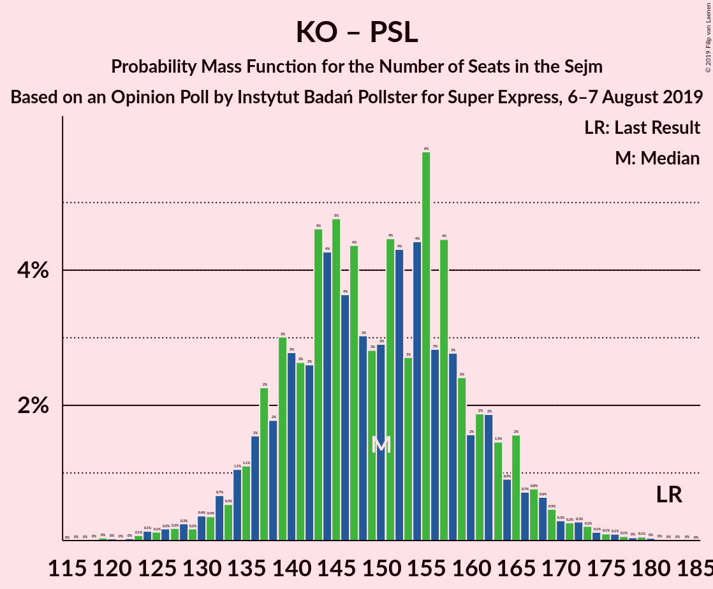

# Opinion Poll by Instytut Badań Pollster for Super Express, 6–7 August 2019

<a href="#voting-intentions">Voting Intentions</a> | <a href="#seats">Seats</a> | <a href="#coalitions">Coalitions</a> | <a href="#technical-information">Technical Information</a>

## Voting Intentions

### Confidence Intervals

| Party | Last Result | Poll Result | 80% Confidence Interval | 90% Confidence Interval | 95% Confidence Interval | 99% Confidence Interval |
|:-----:|:-----------:|:-----------:|:-----------------------:|:-----------------------:|:-----------------------:|:-----------------------:|
| Prawo i Sprawiedliwość | 37.6% | 43.0% | 41.1–45.0% |40.5–45.5% |40.0–46.0% |39.1–46.9% |
| Koalicja Obywatelska | 31.7% | 27.0% | 25.3–28.8% |24.8–29.3% |24.4–29.8% |23.6–30.6% |
| Lewica Razem–Sojusz Lewicy Demokratycznej–Wiosna | 11.7% | 14.0% | 12.7–15.5% |12.4–15.9% |12.1–16.2% |11.5–17.0% |
| Kukiz’15 | 8.8% | 5.0% | 4.2–6.0% |4.0–6.2% |3.8–6.5% |3.5–7.0% |
| Polskie Stronnictwo Ludowe | 5.1% | 5.0% | 4.2–6.0% |4.0–6.2% |3.8–6.5% |3.5–7.0% |
| KORWiN | 4.8% | 4.0% | 3.4–4.9% |3.2–5.2% |3.0–5.4% |2.7–5.9% |

*Note:* The poll result column reflects the actual value used in the calculations. Published results may vary slightly, and in addition be rounded to fewer digits.

## Seats

### Confidence Intervals

| Party | Last Result | Median | 80% Confidence Interval | 90% Confidence Interval | 95% Confidence Interval | 99% Confidence Interval |
|:-----:|:-----------:|:------:|:-----------------------:|:-----------------------:|:-----------------------:|:-----------------------:|
| <a href="#prawo-i-sprawiedliwość">Prawo i Sprawiedliwość</a> | 235 | 239 | 237–244 |237–247 |236–250 |228–253 |
| <a href="#koalicja-obywatelska">Koalicja Obywatelska</a> | 166 | 135 | 133–139 |133–145 |133–146 |126–149 |
| <a href="#lewica-razem–sojusz-lewicy-demokratycznej–wiosna">Lewica Razem–Sojusz Lewicy Demokratycznej–Wiosna</a> | 0 | 65 | 61–68 |61–68 |61–68 |51–73 |
| <a href="#kukiz’15">Kukiz’15</a> | 42 | 5 | 3–15 |0–15 |0–15 |0–16 |
| <a href="#polskie-stronnictwo-ludowe">Polskie Stronnictwo Ludowe</a> | 16 | 16 | 0–22 |0–22 |0–22 |0–22 |
| <a href="#korwin">KORWiN</a> | 0 | 0 | 0 |0 |0–2 |0–7 |

### Prawo i Sprawiedliwość

*For a full overview of the results for this party, see the [Prawo i Sprawiedliwość](party-prawoisprawiedliwość.html) page.*

| Number of Seats | Probability | Accumulated | Special Marks |
|:---------------:|:-----------:|:-----------:|:-------------:|
| 226 | 0% | 100% |  |
| 227 | 0% | 99.9% |  |
| 228 | 1.3% | 99.9% |  |
| 229 | 0% | 98.6% |  |
| 230 | 0% | 98.6% |  |
| 231 | 0.1% | 98.6% | Majority |
| 232 | 0.9% | 98.5% |  |
| 233 | 0% | 98% |  |
| 234 | 0.1% | 98% |  |
| 235 | 0% | 98% | Last Result |
| 236 | 0.1% | 98% |  |
| 237 | 11% | 97% |  |
| 238 | 0.4% | 86% |  |
| 239 | 42% | 86% | Median |
| 240 | 0% | 43% |  |
| 241 | 0.1% | 43% |  |
| 242 | 32% | 43% |  |
| 243 | 0.1% | 12% |  |
| 244 | 6% | 12% |  |
| 245 | 0.1% | 5% |  |
| 246 | 0% | 5% |  |
| 247 | 2% | 5% |  |
| 248 | 0% | 3% |  |
| 249 | 0% | 3% |  |
| 250 | 2% | 3% |  |
| 251 | 0% | 1.2% |  |
| 252 | 0.2% | 1.2% |  |
| 253 | 0.9% | 1.0% |  |
| 254 | 0% | 0.1% |  |
| 255 | 0% | 0.1% |  |
| 256 | 0% | 0.1% |  |
| 257 | 0% | 0.1% |  |
| 258 | 0% | 0% |  |

### Koalicja Obywatelska

*For a full overview of the results for this party, see the [Koalicja Obywatelska](party-koalicjaobywatelska.html) page.*

| Number of Seats | Probability | Accumulated | Special Marks |
|:---------------:|:-----------:|:-----------:|:-------------:|
| 126 | 1.4% | 100% |  |
| 127 | 0.7% | 98.6% |  |
| 128 | 0% | 98% |  |
| 129 | 0.1% | 98% |  |
| 130 | 0.2% | 98% |  |
| 131 | 0% | 98% |  |
| 132 | 0% | 98% |  |
| 133 | 11% | 98% |  |
| 134 | 6% | 86% |  |
| 135 | 32% | 80% | Median |
| 136 | 0.1% | 48% |  |
| 137 | 36% | 48% |  |
| 138 | 0.1% | 12% |  |
| 139 | 6% | 12% |  |
| 140 | 0.1% | 6% |  |
| 141 | 0.3% | 6% |  |
| 142 | 0% | 5% |  |
| 143 | 0% | 5% |  |
| 144 | 0.1% | 5% |  |
| 145 | 2% | 5% |  |
| 146 | 2% | 3% |  |
| 147 | 0% | 1.2% |  |
| 148 | 0% | 1.2% |  |
| 149 | 0.9% | 1.1% |  |
| 150 | 0.2% | 0.2% |  |
| 151 | 0% | 0.1% |  |
| 152 | 0% | 0.1% |  |
| 153 | 0% | 0.1% |  |
| 154 | 0% | 0.1% |  |
| 155 | 0% | 0% |  |
| 156 | 0% | 0% |  |
| 157 | 0% | 0% |  |
| 158 | 0% | 0% |  |
| 159 | 0% | 0% |  |
| 160 | 0% | 0% |  |
| 161 | 0% | 0% |  |
| 162 | 0% | 0% |  |
| 163 | 0% | 0% |  |
| 164 | 0% | 0% |  |
| 165 | 0% | 0% |  |
| 166 | 0% | 0% | Last Result |

### Lewica Razem–Sojusz Lewicy Demokratycznej–Wiosna

*For a full overview of the results for this party, see the [Lewica Razem–Sojusz Lewicy Demokratycznej–Wiosna](party-lewicarazem–sojuszlewicydemokratycznej–wiosna.html) page.*

| Number of Seats | Probability | Accumulated | Special Marks |
|:---------------:|:-----------:|:-----------:|:-------------:|
| 0 | 0% | 100% | Last Result |
| 1 | 0% | 100% |  |
| 2 | 0% | 100% |  |
| 3 | 0% | 100% |  |
| 4 | 0% | 100% |  |
| 5 | 0% | 100% |  |
| 6 | 0% | 100% |  |
| 7 | 0% | 100% |  |
| 8 | 0% | 100% |  |
| 9 | 0% | 100% |  |
| 10 | 0% | 100% |  |
| 11 | 0% | 100% |  |
| 12 | 0% | 100% |  |
| 13 | 0% | 100% |  |
| 14 | 0% | 100% |  |
| 15 | 0% | 100% |  |
| 16 | 0% | 100% |  |
| 17 | 0% | 100% |  |
| 18 | 0% | 100% |  |
| 19 | 0% | 100% |  |
| 20 | 0% | 100% |  |
| 21 | 0% | 100% |  |
| 22 | 0% | 100% |  |
| 23 | 0% | 100% |  |
| 24 | 0% | 100% |  |
| 25 | 0% | 100% |  |
| 26 | 0% | 100% |  |
| 27 | 0% | 100% |  |
| 28 | 0% | 100% |  |
| 29 | 0% | 100% |  |
| 30 | 0% | 100% |  |
| 31 | 0% | 100% |  |
| 32 | 0% | 100% |  |
| 33 | 0% | 100% |  |
| 34 | 0% | 100% |  |
| 35 | 0% | 100% |  |
| 36 | 0% | 100% |  |
| 37 | 0% | 100% |  |
| 38 | 0% | 100% |  |
| 39 | 0% | 100% |  |
| 40 | 0% | 100% |  |
| 41 | 0% | 100% |  |
| 42 | 0% | 100% |  |
| 43 | 0% | 100% |  |
| 44 | 0% | 100% |  |
| 45 | 0.3% | 100% |  |
| 46 | 0% | 99.7% |  |
| 47 | 0% | 99.7% |  |
| 48 | 0% | 99.7% |  |
| 49 | 0% | 99.7% |  |
| 50 | 0% | 99.6% |  |
| 51 | 1.1% | 99.6% |  |
| 52 | 0% | 98.6% |  |
| 53 | 0.1% | 98.6% |  |
| 54 | 0.1% | 98% |  |
| 55 | 0% | 98% |  |
| 56 | 0.2% | 98% |  |
| 57 | 0% | 98% |  |
| 58 | 0% | 98% |  |
| 59 | 0% | 98% |  |
| 60 | 0% | 98% |  |
| 61 | 42% | 98% |  |
| 62 | 0% | 56% |  |
| 63 | 0% | 56% |  |
| 64 | 0.4% | 56% |  |
| 65 | 14% | 55% | Median |
| 66 | 0% | 42% |  |
| 67 | 2% | 42% |  |
| 68 | 38% | 40% |  |
| 69 | 0.1% | 2% |  |
| 70 | 0% | 2% |  |
| 71 | 0.6% | 2% |  |
| 72 | 0% | 1.4% |  |
| 73 | 1.3% | 1.4% |  |
| 74 | 0% | 0.1% |  |
| 75 | 0% | 0.1% |  |
| 76 | 0% | 0.1% |  |
| 77 | 0% | 0.1% |  |
| 78 | 0% | 0.1% |  |
| 79 | 0% | 0.1% |  |
| 80 | 0% | 0% |  |

### Kukiz’15

*For a full overview of the results for this party, see the [Kukiz’15](party-kukiz’15.html) page.*

| Number of Seats | Probability | Accumulated | Special Marks |
|:---------------:|:-----------:|:-----------:|:-------------:|
| 0 | 6% | 100% |  |
| 1 | 0% | 94% |  |
| 2 | 0% | 94% |  |
| 3 | 11% | 94% |  |
| 4 | 0% | 83% |  |
| 5 | 42% | 83% | Median |
| 6 | 0% | 41% |  |
| 7 | 0% | 41% |  |
| 8 | 0% | 41% |  |
| 9 | 0% | 41% |  |
| 10 | 0% | 41% |  |
| 11 | 0% | 41% |  |
| 12 | 0% | 41% |  |
| 13 | 0.7% | 41% |  |
| 14 | 7% | 40% |  |
| 15 | 32% | 33% |  |
| 16 | 0.2% | 0.5% |  |
| 17 | 0% | 0.3% |  |
| 18 | 0% | 0.3% |  |
| 19 | 0% | 0.3% |  |
| 20 | 0% | 0.3% |  |
| 21 | 0% | 0.3% |  |
| 22 | 0% | 0.3% |  |
| 23 | 0% | 0.3% |  |
| 24 | 0% | 0.3% |  |
| 25 | 0% | 0.3% |  |
| 26 | 0% | 0.3% |  |
| 27 | 0% | 0.3% |  |
| 28 | 0% | 0.3% |  |
| 29 | 0% | 0.3% |  |
| 30 | 0% | 0.3% |  |
| 31 | 0.2% | 0.3% |  |
| 32 | 0% | 0% |  |
| 33 | 0% | 0% |  |
| 34 | 0% | 0% |  |
| 35 | 0% | 0% |  |
| 36 | 0% | 0% |  |
| 37 | 0% | 0% |  |
| 38 | 0% | 0% |  |
| 39 | 0% | 0% |  |
| 40 | 0% | 0% |  |
| 41 | 0% | 0% |  |
| 42 | 0% | 0% | Last Result |

### Polskie Stronnictwo Ludowe

*For a full overview of the results for this party, see the [Polskie Stronnictwo Ludowe](party-polskiestronnictwoludowe.html) page.*

| Number of Seats | Probability | Accumulated | Special Marks |
|:---------------:|:-----------:|:-----------:|:-------------:|
| 0 | 43% | 100% |  |
| 1 | 0% | 57% |  |
| 2 | 0% | 57% |  |
| 3 | 0% | 57% |  |
| 4 | 0% | 57% |  |
| 5 | 0% | 57% |  |
| 6 | 0% | 57% |  |
| 7 | 0% | 57% |  |
| 8 | 0% | 57% |  |
| 9 | 0% | 57% |  |
| 10 | 0% | 57% |  |
| 11 | 0.2% | 57% |  |
| 12 | 0% | 56% |  |
| 13 | 0.1% | 56% |  |
| 14 | 0% | 56% |  |
| 15 | 0.7% | 56% |  |
| 16 | 6% | 56% | Last Result, Median |
| 17 | 1.3% | 49% |  |
| 18 | 36% | 48% |  |
| 19 | 0.1% | 12% |  |
| 20 | 0.2% | 12% |  |
| 21 | 0% | 12% |  |
| 22 | 12% | 12% |  |
| 23 | 0.1% | 0.2% |  |
| 24 | 0% | 0.1% |  |
| 25 | 0% | 0.1% |  |
| 26 | 0% | 0.1% |  |
| 27 | 0.1% | 0.1% |  |
| 28 | 0% | 0% |  |

### KORWiN

*For a full overview of the results for this party, see the [KORWiN](party-korwin.html) page.*

| Number of Seats | Probability | Accumulated | Special Marks |
|:---------------:|:-----------:|:-----------:|:-------------:|
| 0 | 97% | 100% | Last Result, Median |
| 1 | 0% | 3% |  |
| 2 | 2% | 3% |  |
| 3 | 0% | 1.4% |  |
| 4 | 0.1% | 1.4% |  |
| 5 | 0.1% | 1.4% |  |
| 6 | 0% | 1.3% |  |
| 7 | 1.1% | 1.3% |  |
| 8 | 0% | 0.2% |  |
| 9 | 0% | 0.2% |  |
| 10 | 0.1% | 0.2% |  |
| 11 | 0% | 0.1% |  |
| 12 | 0% | 0.1% |  |
| 13 | 0% | 0.1% |  |
| 14 | 0% | 0.1% |  |
| 15 | 0% | 0.1% |  |
| 16 | 0% | 0.1% |  |
| 17 | 0% | 0.1% |  |
| 18 | 0% | 0.1% |  |
| 19 | 0% | 0.1% |  |
| 20 | 0.1% | 0.1% |  |
| 21 | 0% | 0% |  |

## Coalitions

### Confidence Intervals

| Coalition | Last Result | Median | Majority? | 80% Confidence Interval | 90% Confidence Interval | 95% Confidence Interval | 99% Confidence Interval |
|:---------:|:-----------:|:------:|:---------:|:-----------------------:|:-----------------------:|:-----------------------:|:-----------------------:|
| Prawo i Sprawiedliwość | 235 | 239 | 98.6% | 237–244 | 237–247 | 236–250 | 228–253 |
| Koalicja Obywatelska – Lewica Razem–Sojusz Lewicy Demokratycznej–Wiosna – Polskie Stronnictwo Ludowe | 182 | 216 | 0% | 203–220 | 202–220 | 202–220 | 200–220 |
| Koalicja Obywatelska – Lewica Razem–Sojusz Lewicy Demokratycznej–Wiosna | 166 | 199 | 0% | 198–203 | 198–203 | 198–210 | 187–213 |
| Koalicja Obywatelska – Polskie Stronnictwo Ludowe | 182 | 155 | 0% | 135–155 | 134–155 | 134–155 | 134–157 |
| Koalicja Obywatelska | 166 | 135 | 0% | 133–139 | 133–145 | 133–146 | 126–149 |

### Prawo i Sprawiedliwość

| Number of Seats | Probability | Accumulated | Special Marks |
|:---------------:|:-----------:|:-----------:|:-------------:|
| 226 | 0% | 100% |  |
| 227 | 0% | 99.9% |  |
| 228 | 1.3% | 99.9% |  |
| 229 | 0% | 98.6% |  |
| 230 | 0% | 98.6% |  |
| 231 | 0.1% | 98.6% | Majority |
| 232 | 0.9% | 98.5% |  |
| 233 | 0% | 98% |  |
| 234 | 0.1% | 98% |  |
| 235 | 0% | 98% | Last Result |
| 236 | 0.1% | 98% |  |
| 237 | 11% | 97% |  |
| 238 | 0.4% | 86% |  |
| 239 | 42% | 86% | Median |
| 240 | 0% | 43% |  |
| 241 | 0.1% | 43% |  |
| 242 | 32% | 43% |  |
| 243 | 0.1% | 12% |  |
| 244 | 6% | 12% |  |
| 245 | 0.1% | 5% |  |
| 246 | 0% | 5% |  |
| 247 | 2% | 5% |  |
| 248 | 0% | 3% |  |
| 249 | 0% | 3% |  |
| 250 | 2% | 3% |  |
| 251 | 0% | 1.2% |  |
| 252 | 0.2% | 1.2% |  |
| 253 | 0.9% | 1.0% |  |
| 254 | 0% | 0.1% |  |
| 255 | 0% | 0.1% |  |
| 256 | 0% | 0.1% |  |
| 257 | 0% | 0.1% |  |
| 258 | 0% | 0% |  |

### Koalicja Obywatelska – Lewica Razem–Sojusz Lewicy Demokratycznej–Wiosna – Polskie Stronnictwo Ludowe

| Number of Seats | Probability | Accumulated | Special Marks |
|:---------------:|:-----------:|:-----------:|:-------------:|
| 182 | 0% | 100% | Last Result |
| 183 | 0% | 100% |  |
| 184 | 0% | 100% |  |
| 185 | 0% | 100% |  |
| 186 | 0% | 100% |  |
| 187 | 0% | 100% |  |
| 188 | 0% | 100% |  |
| 189 | 0% | 100% |  |
| 190 | 0% | 100% |  |
| 191 | 0% | 100% |  |
| 192 | 0% | 100% |  |
| 193 | 0% | 100% |  |
| 194 | 0% | 100% |  |
| 195 | 0% | 100% |  |
| 196 | 0% | 100% |  |
| 197 | 0.2% | 100% |  |
| 198 | 0.1% | 99.8% |  |
| 199 | 0.1% | 99.7% |  |
| 200 | 1.0% | 99.6% |  |
| 201 | 0.6% | 98.6% |  |
| 202 | 6% | 98% |  |
| 203 | 32% | 92% |  |
| 204 | 0% | 60% |  |
| 205 | 0% | 60% |  |
| 206 | 0.2% | 60% |  |
| 207 | 0.1% | 60% |  |
| 208 | 0% | 60% |  |
| 209 | 0% | 60% |  |
| 210 | 2% | 60% |  |
| 211 | 0% | 58% |  |
| 212 | 0% | 58% |  |
| 213 | 2% | 58% |  |
| 214 | 0.1% | 55% |  |
| 215 | 0% | 55% |  |
| 216 | 43% | 55% | Median |
| 217 | 0% | 12% |  |
| 218 | 0% | 12% |  |
| 219 | 0% | 12% |  |
| 220 | 11% | 12% |  |
| 221 | 0% | 0.3% |  |
| 222 | 0.2% | 0.3% |  |
| 223 | 0% | 0.1% |  |
| 224 | 0% | 0.1% |  |
| 225 | 0% | 0.1% |  |
| 226 | 0% | 0.1% |  |
| 227 | 0% | 0.1% |  |
| 228 | 0% | 0.1% |  |
| 229 | 0% | 0% |  |

### Koalicja Obywatelska – Lewica Razem–Sojusz Lewicy Demokratycznej–Wiosna

| Number of Seats | Probability | Accumulated | Special Marks |
|:---------------:|:-----------:|:-----------:|:-------------:|
| 166 | 0% | 100% | Last Result |
| 167 | 0% | 100% |  |
| 168 | 0% | 100% |  |
| 169 | 0% | 100% |  |
| 170 | 0% | 100% |  |
| 171 | 0% | 100% |  |
| 172 | 0% | 100% |  |
| 173 | 0% | 100% |  |
| 174 | 0% | 100% |  |
| 175 | 0% | 100% |  |
| 176 | 0% | 100% |  |
| 177 | 0% | 100% |  |
| 178 | 0% | 100% |  |
| 179 | 0% | 100% |  |
| 180 | 0% | 100% |  |
| 181 | 0% | 100% |  |
| 182 | 0% | 100% |  |
| 183 | 0% | 100% |  |
| 184 | 0% | 100% |  |
| 185 | 0% | 100% |  |
| 186 | 0.5% | 100% |  |
| 187 | 0.1% | 99.5% |  |
| 188 | 0% | 99.5% |  |
| 189 | 0% | 99.4% |  |
| 190 | 0% | 99.4% |  |
| 191 | 0% | 99.4% |  |
| 192 | 0% | 99.4% |  |
| 193 | 0% | 99.4% |  |
| 194 | 0% | 99.4% |  |
| 195 | 0.1% | 99.4% |  |
| 196 | 0% | 99.3% |  |
| 197 | 0.2% | 99.3% |  |
| 198 | 48% | 99.1% |  |
| 199 | 1.5% | 51% |  |
| 200 | 7% | 50% | Median |
| 201 | 0.6% | 42% |  |
| 202 | 6% | 42% |  |
| 203 | 32% | 36% |  |
| 204 | 0% | 4% |  |
| 205 | 0% | 4% |  |
| 206 | 0% | 4% |  |
| 207 | 0.1% | 4% |  |
| 208 | 0% | 4% |  |
| 209 | 0% | 4% |  |
| 210 | 2% | 4% |  |
| 211 | 0% | 2% |  |
| 212 | 0% | 2% |  |
| 213 | 2% | 2% |  |
| 214 | 0% | 0.1% |  |
| 215 | 0% | 0% |  |

### Koalicja Obywatelska – Polskie Stronnictwo Ludowe

| Number of Seats | Probability | Accumulated | Special Marks |
|:---------------:|:-----------:|:-----------:|:-------------:|
| 134 | 6% | 100% |  |
| 135 | 32% | 94% |  |
| 136 | 0% | 62% |  |
| 137 | 0.4% | 62% |  |
| 138 | 0% | 62% |  |
| 139 | 0% | 62% |  |
| 140 | 0.1% | 62% |  |
| 141 | 0.3% | 62% |  |
| 142 | 0.8% | 62% |  |
| 143 | 1.3% | 61% |  |
| 144 | 0.1% | 60% |  |
| 145 | 2% | 59% |  |
| 146 | 2% | 57% |  |
| 147 | 0% | 55% |  |
| 148 | 0% | 55% |  |
| 149 | 0.9% | 55% |  |
| 150 | 0.2% | 55% |  |
| 151 | 0% | 54% | Median |
| 152 | 0% | 54% |  |
| 153 | 0.1% | 54% |  |
| 154 | 0% | 54% |  |
| 155 | 54% | 54% |  |
| 156 | 0% | 0.6% |  |
| 157 | 0.1% | 0.6% |  |
| 158 | 0% | 0.4% |  |
| 159 | 0% | 0.4% |  |
| 160 | 0% | 0.4% |  |
| 161 | 0.4% | 0.4% |  |
| 162 | 0% | 0% |  |
| 163 | 0% | 0% |  |
| 164 | 0% | 0% |  |
| 165 | 0% | 0% |  |
| 166 | 0% | 0% |  |
| 167 | 0% | 0% |  |
| 168 | 0% | 0% |  |
| 169 | 0% | 0% |  |
| 170 | 0% | 0% |  |
| 171 | 0% | 0% |  |
| 172 | 0% | 0% |  |
| 173 | 0% | 0% |  |
| 174 | 0% | 0% |  |
| 175 | 0% | 0% |  |
| 176 | 0% | 0% |  |
| 177 | 0% | 0% |  |
| 178 | 0% | 0% |  |
| 179 | 0% | 0% |  |
| 180 | 0% | 0% |  |
| 181 | 0% | 0% |  |
| 182 | 0% | 0% | Last Result |

### Koalicja Obywatelska

| Number of Seats | Probability | Accumulated | Special Marks |
|:---------------:|:-----------:|:-----------:|:-------------:|
| 126 | 1.4% | 100% |  |
| 127 | 0.7% | 98.6% |  |
| 128 | 0% | 98% |  |
| 129 | 0.1% | 98% |  |
| 130 | 0.2% | 98% |  |
| 131 | 0% | 98% |  |
| 132 | 0% | 98% |  |
| 133 | 11% | 98% |  |
| 134 | 6% | 86% |  |
| 135 | 32% | 80% | Median |
| 136 | 0.1% | 48% |  |
| 137 | 36% | 48% |  |
| 138 | 0.1% | 12% |  |
| 139 | 6% | 12% |  |
| 140 | 0.1% | 6% |  |
| 141 | 0.3% | 6% |  |
| 142 | 0% | 5% |  |
| 143 | 0% | 5% |  |
| 144 | 0.1% | 5% |  |
| 145 | 2% | 5% |  |
| 146 | 2% | 3% |  |
| 147 | 0% | 1.2% |  |
| 148 | 0% | 1.2% |  |
| 149 | 0.9% | 1.1% |  |
| 150 | 0.2% | 0.2% |  |
| 151 | 0% | 0.1% |  |
| 152 | 0% | 0.1% |  |
| 153 | 0% | 0.1% |  |
| 154 | 0% | 0.1% |  |
| 155 | 0% | 0% |  |
| 156 | 0% | 0% |  |
| 157 | 0% | 0% |  |
| 158 | 0% | 0% |  |
| 159 | 0% | 0% |  |
| 160 | 0% | 0% |  |
| 161 | 0% | 0% |  |
| 162 | 0% | 0% |  |
| 163 | 0% | 0% |  |
| 164 | 0% | 0% |  |
| 165 | 0% | 0% |  |
| 166 | 0% | 0% | Last Result |

## Technical Information

### Opinion Poll

+ **Polling firm:** Instytut Badań Pollster
+ **Commissioner(s):** Super Express
+ **Fieldwork period:** 6–7 August 2019

### Calculations

+ **Sample size:** 1063
+ **Simulations done:** 1,024
+ **Error estimate:** 2.18%

