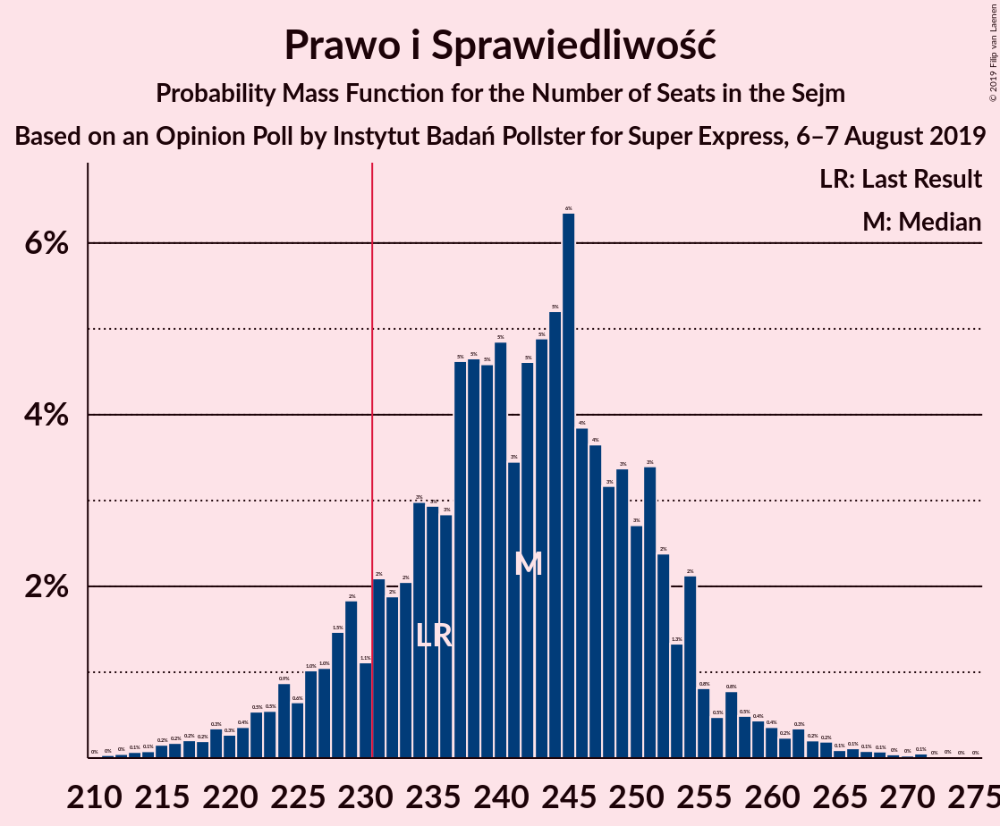
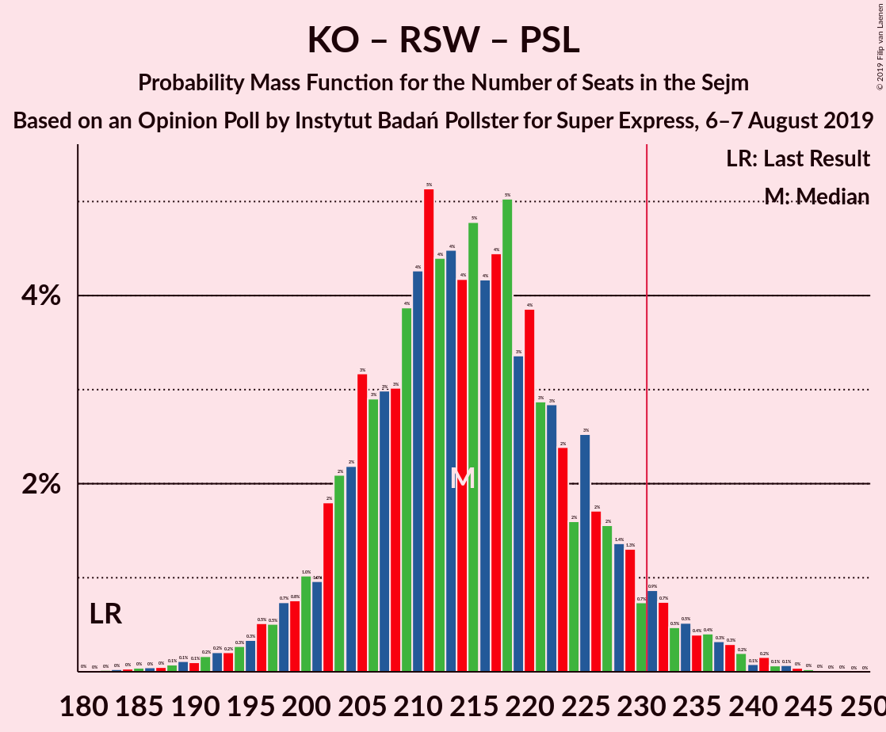
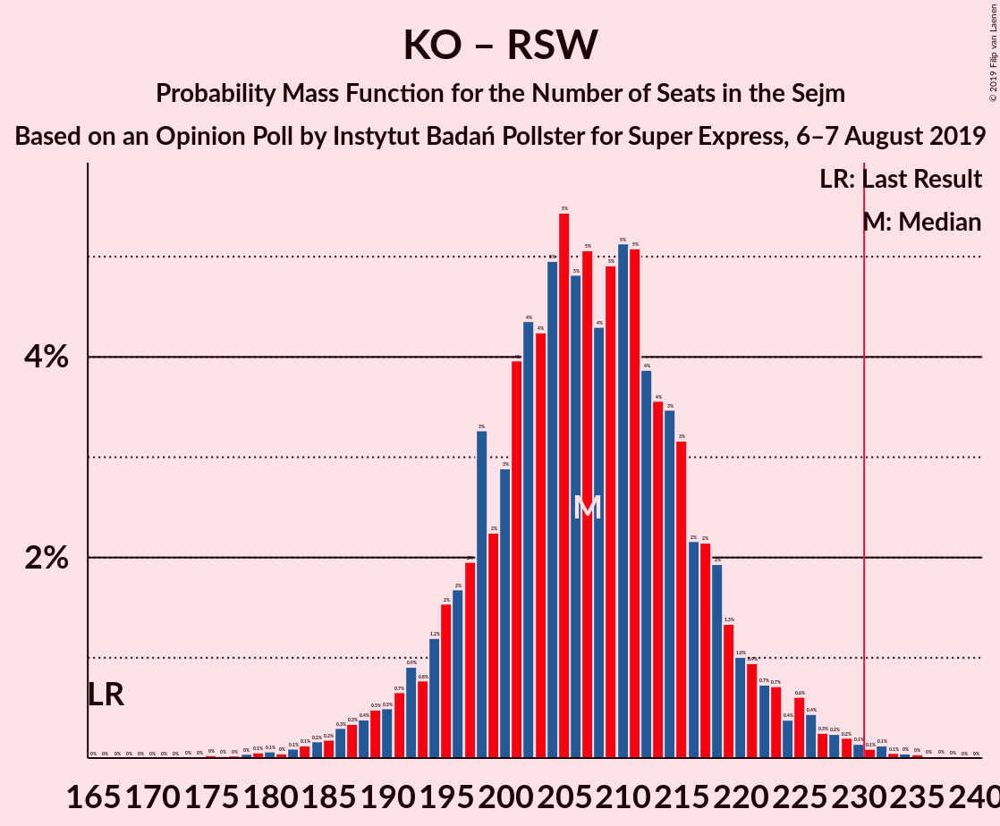

# Opinion Poll by Instytut Badań Pollster for Super Express, 6–7 August 2019

<a href="#voting-intentions">Voting Intentions</a> | <a href="#seats">Seats</a> | <a href="#coalitions">Coalitions</a> | <a href="#technical-information">Technical Information</a>

## Voting Intentions

### Confidence Intervals

| Party | Last Result | Poll Result | 80% Confidence Interval | 90% Confidence Interval | 95% Confidence Interval | 99% Confidence Interval |
|:-----:|:-----------:|:-----------:|:-----------------------:|:-----------------------:|:-----------------------:|:-----------------------:|
| Prawo i Sprawiedliwość | 37.6% | 43.0% | 41.1–45.0% |40.5–45.5% |40.0–46.0% |39.1–46.9% |
| Koalicja Obywatelska | 31.7% | 27.0% | 25.3–28.8% |24.8–29.3% |24.4–29.8% |23.6–30.6% |
| Lewica Razem–Sojusz Lewicy Demokratycznej–Wiosna | 11.7% | 14.0% | 12.7–15.5% |12.4–15.9% |12.1–16.2% |11.5–17.0% |
| Kukiz’15 | 8.8% | 5.0% | 4.2–6.0% |4.0–6.2% |3.8–6.5% |3.5–7.0% |
| Polskie Stronnictwo Ludowe | 5.1% | 5.0% | 4.2–6.0% |4.0–6.2% |3.8–6.5% |3.5–7.0% |
| KORWiN | 4.8% | 4.0% | 3.4–4.9% |3.2–5.2% |3.0–5.4% |2.7–5.9% |

*Note:* The poll result column reflects the actual value used in the calculations. Published results may vary slightly, and in addition be rounded to fewer digits.

## Seats

### Confidence Intervals

| Party | Last Result | Median | 80% Confidence Interval | 90% Confidence Interval | 95% Confidence Interval | 99% Confidence Interval |
|:-----:|:-----------:|:------:|:-----------------------:|:-----------------------:|:-----------------------:|:-----------------------:|
| <a href="#prawo-i-sprawiedliwość">Prawo i Sprawiedliwość</a> | 235 | 242 | 229–252 |226–254 |223–258 |216–265 |
| <a href="#koalicja-obywatelska">Koalicja Obywatelska</a> | 166 | 143 | 133–151 |129–153 |125–156 |120–162 |
| <a href="#lewica-razem–sojusz-lewicy-demokratycznej–wiosna">Lewica Razem–Sojusz Lewicy Demokratycznej–Wiosna</a> | 0 | 65 | 57–73 |54–76 |51–78 |48–81 |
| <a href="#kukiz’15">Kukiz’15</a> | 42 | 3 | 0–10 |0–12 |0–14 |0–19 |
| <a href="#polskie-stronnictwo-ludowe">Polskie Stronnictwo Ludowe</a> | 16 | 0 | 0–17 |0–20 |0–22 |0–23 |
| <a href="#korwin">KORWiN</a> | 0 | 0 | 0 |0–3 |0–5 |0–9 |

### Prawo i Sprawiedliwość

*For a full overview of the results for this party, see the [Prawo i Sprawiedliwość](party-prawoisprawiedliwość.html) page.*

| Number of Seats | Probability | Accumulated | Special Marks |
|:---------------:|:-----------:|:-----------:|:-------------:|
| 210 | 0% | 100% |  |
| 211 | 0% | 99.9% |  |
| 212 | 0% | 99.9% |  |
| 213 | 0.1% | 99.9% |  |
| 214 | 0.1% | 99.8% |  |
| 215 | 0.1% | 99.7% |  |
| 216 | 0.2% | 99.6% |  |
| 217 | 0.2% | 99.4% |  |
| 218 | 0.2% | 99.2% |  |
| 219 | 0.4% | 99.0% |  |
| 220 | 0.3% | 98.6% |  |
| 221 | 0.4% | 98% |  |
| 222 | 0.4% | 98% |  |
| 223 | 0.5% | 98% |  |
| 224 | 1.0% | 97% |  |
| 225 | 0.6% | 96% |  |
| 226 | 0.6% | 95% |  |
| 227 | 1.3% | 95% |  |
| 228 | 2% | 93% |  |
| 229 | 2% | 91% |  |
| 230 | 1.1% | 90% |  |
| 231 | 2% | 89% | Majority |
| 232 | 2% | 86% |  |
| 233 | 2% | 84% |  |
| 234 | 3% | 82% |  |
| 235 | 3% | 80% | Last Result |
| 236 | 2% | 77% |  |
| 237 | 5% | 75% |  |
| 238 | 5% | 70% |  |
| 239 | 5% | 65% |  |
| 240 | 5% | 60% |  |
| 241 | 4% | 55% |  |
| 242 | 5% | 51% | Median |
| 243 | 3% | 46% |  |
| 244 | 6% | 44% |  |
| 245 | 7% | 38% |  |
| 246 | 5% | 31% |  |
| 247 | 3% | 26% |  |
| 248 | 3% | 23% |  |
| 249 | 3% | 20% |  |
| 250 | 3% | 16% |  |
| 251 | 4% | 14% |  |
| 252 | 2% | 10% |  |
| 253 | 1.4% | 9% |  |
| 254 | 2% | 7% |  |
| 255 | 0.9% | 5% |  |
| 256 | 0.5% | 4% |  |
| 257 | 0.7% | 3% |  |
| 258 | 0.3% | 3% |  |
| 259 | 0.6% | 2% |  |
| 260 | 0.3% | 2% |  |
| 261 | 0.2% | 2% |  |
| 262 | 0.4% | 1.4% |  |
| 263 | 0.2% | 0.9% |  |
| 264 | 0.2% | 0.7% |  |
| 265 | 0.1% | 0.5% |  |
| 266 | 0.1% | 0.5% |  |
| 267 | 0.1% | 0.4% |  |
| 268 | 0.1% | 0.3% |  |
| 269 | 0% | 0.2% |  |
| 270 | 0% | 0.2% |  |
| 271 | 0.1% | 0.1% |  |
| 272 | 0% | 0.1% |  |
| 273 | 0% | 0.1% |  |
| 274 | 0% | 0.1% |  |
| 275 | 0% | 0% |  |

### Koalicja Obywatelska

*For a full overview of the results for this party, see the [Koalicja Obywatelska](party-koalicjaobywatelska.html) page.*

| Number of Seats | Probability | Accumulated | Special Marks |
|:---------------:|:-----------:|:-----------:|:-------------:|
| 114 | 0% | 100% |  |
| 115 | 0% | 99.9% |  |
| 116 | 0.1% | 99.9% |  |
| 117 | 0% | 99.8% |  |
| 118 | 0.1% | 99.8% |  |
| 119 | 0.2% | 99.7% |  |
| 120 | 0.2% | 99.5% |  |
| 121 | 0.2% | 99.3% |  |
| 122 | 0.2% | 99.1% |  |
| 123 | 0.5% | 99.0% |  |
| 124 | 0.5% | 98.5% |  |
| 125 | 0.5% | 98% |  |
| 126 | 0.6% | 97% |  |
| 127 | 0.6% | 97% |  |
| 128 | 0.7% | 96% |  |
| 129 | 0.6% | 96% |  |
| 130 | 1.0% | 95% |  |
| 131 | 1.0% | 94% |  |
| 132 | 2% | 93% |  |
| 133 | 2% | 91% |  |
| 134 | 2% | 89% |  |
| 135 | 2% | 88% |  |
| 136 | 3% | 86% |  |
| 137 | 5% | 82% |  |
| 138 | 4% | 77% |  |
| 139 | 7% | 73% |  |
| 140 | 5% | 66% |  |
| 141 | 6% | 61% |  |
| 142 | 5% | 55% |  |
| 143 | 7% | 50% | Median |
| 144 | 7% | 43% |  |
| 145 | 6% | 36% |  |
| 146 | 6% | 30% |  |
| 147 | 6% | 24% |  |
| 148 | 3% | 18% |  |
| 149 | 3% | 15% |  |
| 150 | 2% | 12% |  |
| 151 | 2% | 10% |  |
| 152 | 2% | 8% |  |
| 153 | 2% | 6% |  |
| 154 | 0.8% | 5% |  |
| 155 | 1.0% | 4% |  |
| 156 | 0.5% | 3% |  |
| 157 | 0.7% | 2% |  |
| 158 | 0.3% | 2% |  |
| 159 | 0.3% | 1.4% |  |
| 160 | 0.3% | 1.1% |  |
| 161 | 0.1% | 0.8% |  |
| 162 | 0.2% | 0.6% |  |
| 163 | 0.1% | 0.5% |  |
| 164 | 0.1% | 0.3% |  |
| 165 | 0.1% | 0.2% |  |
| 166 | 0% | 0.1% | Last Result |
| 167 | 0% | 0.1% |  |
| 168 | 0% | 0.1% |  |
| 169 | 0% | 0% |  |

### Lewica Razem–Sojusz Lewicy Demokratycznej–Wiosna

*For a full overview of the results for this party, see the [Lewica Razem–Sojusz Lewicy Demokratycznej–Wiosna](party-lewicarazem–sojuszlewicydemokratycznej–wiosna.html) page.*

| Number of Seats | Probability | Accumulated | Special Marks |
|:---------------:|:-----------:|:-----------:|:-------------:|
| 0 | 0% | 100% | Last Result |
| 1 | 0% | 100% |  |
| 2 | 0% | 100% |  |
| 3 | 0% | 100% |  |
| 4 | 0% | 100% |  |
| 5 | 0% | 100% |  |
| 6 | 0% | 100% |  |
| 7 | 0% | 100% |  |
| 8 | 0% | 100% |  |
| 9 | 0% | 100% |  |
| 10 | 0% | 100% |  |
| 11 | 0% | 100% |  |
| 12 | 0% | 100% |  |
| 13 | 0% | 100% |  |
| 14 | 0% | 100% |  |
| 15 | 0% | 100% |  |
| 16 | 0% | 100% |  |
| 17 | 0% | 100% |  |
| 18 | 0% | 100% |  |
| 19 | 0% | 100% |  |
| 20 | 0% | 100% |  |
| 21 | 0% | 100% |  |
| 22 | 0% | 100% |  |
| 23 | 0% | 100% |  |
| 24 | 0% | 100% |  |
| 25 | 0% | 100% |  |
| 26 | 0% | 100% |  |
| 27 | 0% | 100% |  |
| 28 | 0% | 100% |  |
| 29 | 0% | 100% |  |
| 30 | 0% | 100% |  |
| 31 | 0% | 100% |  |
| 32 | 0% | 100% |  |
| 33 | 0% | 100% |  |
| 34 | 0% | 100% |  |
| 35 | 0% | 100% |  |
| 36 | 0% | 100% |  |
| 37 | 0% | 100% |  |
| 38 | 0% | 100% |  |
| 39 | 0% | 100% |  |
| 40 | 0% | 100% |  |
| 41 | 0% | 100% |  |
| 42 | 0% | 100% |  |
| 43 | 0% | 100% |  |
| 44 | 0% | 100% |  |
| 45 | 0% | 99.9% |  |
| 46 | 0.2% | 99.9% |  |
| 47 | 0.2% | 99.7% |  |
| 48 | 0.4% | 99.5% |  |
| 49 | 0.5% | 99.2% |  |
| 50 | 0.8% | 98.7% |  |
| 51 | 0.8% | 98% |  |
| 52 | 0.9% | 97% |  |
| 53 | 1.0% | 96% |  |
| 54 | 1.1% | 95% |  |
| 55 | 2% | 94% |  |
| 56 | 2% | 92% |  |
| 57 | 2% | 91% |  |
| 58 | 3% | 88% |  |
| 59 | 2% | 86% |  |
| 60 | 2% | 83% |  |
| 61 | 4% | 81% |  |
| 62 | 5% | 78% |  |
| 63 | 8% | 73% |  |
| 64 | 9% | 65% |  |
| 65 | 10% | 56% | Median |
| 66 | 8% | 45% |  |
| 67 | 9% | 38% |  |
| 68 | 6% | 28% |  |
| 69 | 2% | 22% |  |
| 70 | 5% | 20% |  |
| 71 | 2% | 15% |  |
| 72 | 2% | 13% |  |
| 73 | 2% | 11% |  |
| 74 | 2% | 9% |  |
| 75 | 1.1% | 7% |  |
| 76 | 1.1% | 6% |  |
| 77 | 2% | 5% |  |
| 78 | 1.2% | 3% |  |
| 79 | 0.6% | 2% |  |
| 80 | 0.4% | 1.1% |  |
| 81 | 0.2% | 0.6% |  |
| 82 | 0.2% | 0.4% |  |
| 83 | 0.1% | 0.2% |  |
| 84 | 0% | 0.2% |  |
| 85 | 0% | 0.1% |  |
| 86 | 0% | 0.1% |  |
| 87 | 0% | 0.1% |  |
| 88 | 0% | 0% |  |

### Kukiz’15

*For a full overview of the results for this party, see the [Kukiz’15](party-kukiz’15.html) page.*

| Number of Seats | Probability | Accumulated | Special Marks |
|:---------------:|:-----------:|:-----------:|:-------------:|
| 0 | 48% | 100% |  |
| 1 | 0% | 52% |  |
| 2 | 0.1% | 52% |  |
| 3 | 3% | 51% | Median |
| 4 | 7% | 48% |  |
| 5 | 10% | 41% |  |
| 6 | 7% | 31% |  |
| 7 | 4% | 24% |  |
| 8 | 4% | 20% |  |
| 9 | 3% | 16% |  |
| 10 | 5% | 12% |  |
| 11 | 3% | 8% |  |
| 12 | 1.0% | 5% |  |
| 13 | 1.0% | 4% |  |
| 14 | 1.0% | 3% |  |
| 15 | 0.8% | 2% |  |
| 16 | 0.3% | 1.4% |  |
| 17 | 0.3% | 1.1% |  |
| 18 | 0.2% | 0.9% |  |
| 19 | 0.2% | 0.7% |  |
| 20 | 0.1% | 0.5% |  |
| 21 | 0.1% | 0.4% |  |
| 22 | 0.1% | 0.2% |  |
| 23 | 0.1% | 0.2% |  |
| 24 | 0% | 0.1% |  |
| 25 | 0% | 0.1% |  |
| 26 | 0% | 0.1% |  |
| 27 | 0% | 0.1% |  |
| 28 | 0% | 0% |  |
| 29 | 0% | 0% |  |
| 30 | 0% | 0% |  |
| 31 | 0% | 0% |  |
| 32 | 0% | 0% |  |
| 33 | 0% | 0% |  |
| 34 | 0% | 0% |  |
| 35 | 0% | 0% |  |
| 36 | 0% | 0% |  |
| 37 | 0% | 0% |  |
| 38 | 0% | 0% |  |
| 39 | 0% | 0% |  |
| 40 | 0% | 0% |  |
| 41 | 0% | 0% |  |
| 42 | 0% | 0% | Last Result |

### Polskie Stronnictwo Ludowe

*For a full overview of the results for this party, see the [Polskie Stronnictwo Ludowe](party-polskiestronnictwoludowe.html) page.*

| Number of Seats | Probability | Accumulated | Special Marks |
|:---------------:|:-----------:|:-----------:|:-------------:|
| 0 | 51% | 100% | Median |
| 1 | 0% | 49% |  |
| 2 | 0% | 49% |  |
| 3 | 0% | 49% |  |
| 4 | 0% | 49% |  |
| 5 | 0% | 49% |  |
| 6 | 0% | 49% |  |
| 7 | 0% | 49% |  |
| 8 | 0% | 49% |  |
| 9 | 0% | 49% |  |
| 10 | 0% | 49% |  |
| 11 | 6% | 49% |  |
| 12 | 3% | 43% |  |
| 13 | 4% | 40% |  |
| 14 | 5% | 36% |  |
| 15 | 10% | 31% |  |
| 16 | 9% | 21% | Last Result |
| 17 | 2% | 12% |  |
| 18 | 2% | 9% |  |
| 19 | 2% | 8% |  |
| 20 | 2% | 6% |  |
| 21 | 1.3% | 4% |  |
| 22 | 2% | 3% |  |
| 23 | 0.7% | 1.1% |  |
| 24 | 0.2% | 0.4% |  |
| 25 | 0.1% | 0.1% |  |
| 26 | 0% | 0.1% |  |
| 27 | 0% | 0% |  |

### KORWiN

*For a full overview of the results for this party, see the [KORWiN](party-korwin.html) page.*

| Number of Seats | Probability | Accumulated | Special Marks |
|:---------------:|:-----------:|:-----------:|:-------------:|
| 0 | 92% | 100% | Last Result, Median |
| 1 | 0% | 8% |  |
| 2 | 1.3% | 8% |  |
| 3 | 2% | 7% |  |
| 4 | 1.3% | 4% |  |
| 5 | 0.9% | 3% |  |
| 6 | 1.1% | 2% |  |
| 7 | 0.5% | 1.2% |  |
| 8 | 0.2% | 0.7% |  |
| 9 | 0.2% | 0.5% |  |
| 10 | 0.1% | 0.4% |  |
| 11 | 0.1% | 0.2% |  |
| 12 | 0% | 0.1% |  |
| 13 | 0% | 0.1% |  |
| 14 | 0% | 0% |  |

## Coalitions

### Confidence Intervals

| Coalition | Last Result | Median | Majority? | 80% Confidence Interval | 90% Confidence Interval | 95% Confidence Interval | 99% Confidence Interval |
|:---------:|:-----------:|:------:|:---------:|:-----------------------:|:-----------------------:|:-----------------------:|:-----------------------:|
| Prawo i Sprawiedliwość | 235 | 242 | 89% | 229–252 | 226–254 | 223–258 | 216–265 |
| Koalicja Obywatelska – Lewica Razem–Sojusz Lewicy Demokratycznej–Wiosna – Polskie Stronnictwo Ludowe | 182 | 214 | 5% | 203–226 | 200–230 | 197–233 | 190–239 |
| Koalicja Obywatelska – Lewica Razem–Sojusz Lewicy Demokratycznej–Wiosna | 166 | 207 | 0.4% | 197–217 | 193–221 | 189–224 | 183–230 |
| Koalicja Obywatelska – Polskie Stronnictwo Ludowe | 182 | 150 | 0% | 138–161 | 136–165 | 132–168 | 125–174 |
| Koalicja Obywatelska | 166 | 143 | 0% | 133–151 | 129–153 | 125–156 | 120–162 |

### Prawo i Sprawiedliwość

| Number of Seats | Probability | Accumulated | Special Marks |
|:---------------:|:-----------:|:-----------:|:-------------:|
| 210 | 0% | 100% |  |
| 211 | 0% | 99.9% |  |
| 212 | 0% | 99.9% |  |
| 213 | 0.1% | 99.9% |  |
| 214 | 0.1% | 99.8% |  |
| 215 | 0.1% | 99.7% |  |
| 216 | 0.2% | 99.6% |  |
| 217 | 0.2% | 99.4% |  |
| 218 | 0.2% | 99.2% |  |
| 219 | 0.4% | 99.0% |  |
| 220 | 0.3% | 98.6% |  |
| 221 | 0.4% | 98% |  |
| 222 | 0.4% | 98% |  |
| 223 | 0.5% | 98% |  |
| 224 | 1.0% | 97% |  |
| 225 | 0.6% | 96% |  |
| 226 | 0.6% | 95% |  |
| 227 | 1.3% | 95% |  |
| 228 | 2% | 93% |  |
| 229 | 2% | 91% |  |
| 230 | 1.1% | 90% |  |
| 231 | 2% | 89% | Majority |
| 232 | 2% | 86% |  |
| 233 | 2% | 84% |  |
| 234 | 3% | 82% |  |
| 235 | 3% | 80% | Last Result |
| 236 | 2% | 77% |  |
| 237 | 5% | 75% |  |
| 238 | 5% | 70% |  |
| 239 | 5% | 65% |  |
| 240 | 5% | 60% |  |
| 241 | 4% | 55% |  |
| 242 | 5% | 51% | Median |
| 243 | 3% | 46% |  |
| 244 | 6% | 44% |  |
| 245 | 7% | 38% |  |
| 246 | 5% | 31% |  |
| 247 | 3% | 26% |  |
| 248 | 3% | 23% |  |
| 249 | 3% | 20% |  |
| 250 | 3% | 16% |  |
| 251 | 4% | 14% |  |
| 252 | 2% | 10% |  |
| 253 | 1.4% | 9% |  |
| 254 | 2% | 7% |  |
| 255 | 0.9% | 5% |  |
| 256 | 0.5% | 4% |  |
| 257 | 0.7% | 3% |  |
| 258 | 0.3% | 3% |  |
| 259 | 0.6% | 2% |  |
| 260 | 0.3% | 2% |  |
| 261 | 0.2% | 2% |  |
| 262 | 0.4% | 1.4% |  |
| 263 | 0.2% | 0.9% |  |
| 264 | 0.2% | 0.7% |  |
| 265 | 0.1% | 0.5% |  |
| 266 | 0.1% | 0.5% |  |
| 267 | 0.1% | 0.4% |  |
| 268 | 0.1% | 0.3% |  |
| 269 | 0% | 0.2% |  |
| 270 | 0% | 0.2% |  |
| 271 | 0.1% | 0.1% |  |
| 272 | 0% | 0.1% |  |
| 273 | 0% | 0.1% |  |
| 274 | 0% | 0.1% |  |
| 275 | 0% | 0% |  |

### Koalicja Obywatelska – Lewica Razem–Sojusz Lewicy Demokratycznej–Wiosna – Polskie Stronnictwo Ludowe

| Number of Seats | Probability | Accumulated | Special Marks |
|:---------------:|:-----------:|:-----------:|:-------------:|
| 182 | 0% | 100% | Last Result |
| 183 | 0% | 99.9% |  |
| 184 | 0% | 99.9% |  |
| 185 | 0.1% | 99.9% |  |
| 186 | 0% | 99.8% |  |
| 187 | 0.1% | 99.8% |  |
| 188 | 0% | 99.7% |  |
| 189 | 0.1% | 99.7% |  |
| 190 | 0.1% | 99.6% |  |
| 191 | 0.2% | 99.4% |  |
| 192 | 0.2% | 99.3% |  |
| 193 | 0.2% | 99.1% |  |
| 194 | 0.2% | 98.8% |  |
| 195 | 0.3% | 98.6% |  |
| 196 | 0.5% | 98% |  |
| 197 | 0.6% | 98% |  |
| 198 | 0.6% | 97% |  |
| 199 | 1.0% | 97% |  |
| 200 | 0.8% | 96% |  |
| 201 | 1.1% | 95% |  |
| 202 | 2% | 94% |  |
| 203 | 2% | 92% |  |
| 204 | 3% | 90% |  |
| 205 | 3% | 87% |  |
| 206 | 3% | 84% |  |
| 207 | 3% | 81% |  |
| 208 | 3% | 78% | Median |
| 209 | 4% | 76% |  |
| 210 | 5% | 72% |  |
| 211 | 5% | 67% |  |
| 212 | 3% | 62% |  |
| 213 | 4% | 59% |  |
| 214 | 5% | 55% |  |
| 215 | 5% | 50% |  |
| 216 | 5% | 45% |  |
| 217 | 4% | 40% |  |
| 218 | 4% | 36% |  |
| 219 | 2% | 31% |  |
| 220 | 4% | 29% |  |
| 221 | 3% | 25% |  |
| 222 | 3% | 21% |  |
| 223 | 3% | 18% |  |
| 224 | 2% | 15% |  |
| 225 | 2% | 13% |  |
| 226 | 1.5% | 11% |  |
| 227 | 1.1% | 10% |  |
| 228 | 2% | 9% |  |
| 229 | 1.5% | 7% |  |
| 230 | 0.9% | 6% |  |
| 231 | 1.1% | 5% | Majority |
| 232 | 0.7% | 4% |  |
| 233 | 0.6% | 3% |  |
| 234 | 0.4% | 2% |  |
| 235 | 0.3% | 2% |  |
| 236 | 0.3% | 2% |  |
| 237 | 0.2% | 1.2% |  |
| 238 | 0.2% | 0.9% |  |
| 239 | 0.2% | 0.7% |  |
| 240 | 0.1% | 0.5% |  |
| 241 | 0.2% | 0.4% |  |
| 242 | 0% | 0.2% |  |
| 243 | 0.1% | 0.2% |  |
| 244 | 0% | 0.1% |  |
| 245 | 0% | 0.1% |  |
| 246 | 0% | 0% |  |

### Koalicja Obywatelska – Lewica Razem–Sojusz Lewicy Demokratycznej–Wiosna

| Number of Seats | Probability | Accumulated | Special Marks |
|:---------------:|:-----------:|:-----------:|:-------------:|
| 166 | 0% | 100% | Last Result |
| 167 | 0% | 100% |  |
| 168 | 0% | 100% |  |
| 169 | 0% | 100% |  |
| 170 | 0% | 100% |  |
| 171 | 0% | 100% |  |
| 172 | 0% | 100% |  |
| 173 | 0% | 100% |  |
| 174 | 0% | 100% |  |
| 175 | 0% | 100% |  |
| 176 | 0% | 99.9% |  |
| 177 | 0% | 99.9% |  |
| 178 | 0% | 99.9% |  |
| 179 | 0% | 99.8% |  |
| 180 | 0.1% | 99.8% |  |
| 181 | 0.1% | 99.7% |  |
| 182 | 0.1% | 99.7% |  |
| 183 | 0.1% | 99.5% |  |
| 184 | 0.1% | 99.4% |  |
| 185 | 0.2% | 99.3% |  |
| 186 | 0.3% | 99.1% |  |
| 187 | 0.4% | 98.8% |  |
| 188 | 0.4% | 98% |  |
| 189 | 0.5% | 98% |  |
| 190 | 0.4% | 97% |  |
| 191 | 0.6% | 97% |  |
| 192 | 1.0% | 96% |  |
| 193 | 0.7% | 95% |  |
| 194 | 1.2% | 95% |  |
| 195 | 1.1% | 93% |  |
| 196 | 2% | 92% |  |
| 197 | 2% | 91% |  |
| 198 | 3% | 89% |  |
| 199 | 3% | 86% |  |
| 200 | 2% | 83% |  |
| 201 | 4% | 81% |  |
| 202 | 6% | 77% |  |
| 203 | 3% | 72% |  |
| 204 | 6% | 69% |  |
| 205 | 6% | 63% |  |
| 206 | 5% | 58% |  |
| 207 | 5% | 53% |  |
| 208 | 4% | 48% | Median |
| 209 | 6% | 44% |  |
| 210 | 7% | 38% |  |
| 211 | 5% | 32% |  |
| 212 | 3% | 27% |  |
| 213 | 3% | 24% |  |
| 214 | 4% | 21% |  |
| 215 | 4% | 17% |  |
| 216 | 3% | 13% |  |
| 217 | 2% | 11% |  |
| 218 | 2% | 9% |  |
| 219 | 1.2% | 7% |  |
| 220 | 0.7% | 6% |  |
| 221 | 0.9% | 5% |  |
| 222 | 1.0% | 4% |  |
| 223 | 0.8% | 3% |  |
| 224 | 0.3% | 3% |  |
| 225 | 0.7% | 2% |  |
| 226 | 0.2% | 1.5% |  |
| 227 | 0.2% | 1.3% |  |
| 228 | 0.3% | 1.1% |  |
| 229 | 0.3% | 0.9% |  |
| 230 | 0.2% | 0.6% |  |
| 231 | 0.1% | 0.4% | Majority |
| 232 | 0.1% | 0.3% |  |
| 233 | 0% | 0.2% |  |
| 234 | 0% | 0.1% |  |
| 235 | 0% | 0.1% |  |
| 236 | 0% | 0.1% |  |
| 237 | 0% | 0% |  |

### Koalicja Obywatelska – Polskie Stronnictwo Ludowe

| Number of Seats | Probability | Accumulated | Special Marks |
|:---------------:|:-----------:|:-----------:|:-------------:|
| 118 | 0% | 100% |  |
| 119 | 0% | 99.9% |  |
| 120 | 0% | 99.9% |  |
| 121 | 0% | 99.9% |  |
| 122 | 0% | 99.9% |  |
| 123 | 0.1% | 99.8% |  |
| 124 | 0.2% | 99.8% |  |
| 125 | 0.1% | 99.6% |  |
| 126 | 0.2% | 99.5% |  |
| 127 | 0.2% | 99.3% |  |
| 128 | 0.3% | 99.1% |  |
| 129 | 0.2% | 98.8% |  |
| 130 | 0.4% | 98.6% |  |
| 131 | 0.4% | 98% |  |
| 132 | 0.6% | 98% |  |
| 133 | 0.5% | 97% |  |
| 134 | 0.9% | 97% |  |
| 135 | 0.8% | 96% |  |
| 136 | 2% | 95% |  |
| 137 | 2% | 93% |  |
| 138 | 2% | 91% |  |
| 139 | 3% | 89% |  |
| 140 | 2% | 86% |  |
| 141 | 3% | 84% |  |
| 142 | 4% | 81% |  |
| 143 | 4% | 78% | Median |
| 144 | 4% | 73% |  |
| 145 | 5% | 69% |  |
| 146 | 4% | 64% |  |
| 147 | 5% | 60% |  |
| 148 | 2% | 55% |  |
| 149 | 3% | 53% |  |
| 150 | 3% | 50% |  |
| 151 | 4% | 47% |  |
| 152 | 4% | 44% |  |
| 153 | 2% | 39% |  |
| 154 | 5% | 37% |  |
| 155 | 6% | 32% |  |
| 156 | 3% | 26% |  |
| 157 | 5% | 23% |  |
| 158 | 2% | 18% |  |
| 159 | 3% | 16% |  |
| 160 | 2% | 13% |  |
| 161 | 2% | 12% |  |
| 162 | 2% | 10% |  |
| 163 | 1.1% | 8% |  |
| 164 | 0.7% | 7% |  |
| 165 | 2% | 6% |  |
| 166 | 0.6% | 4% |  |
| 167 | 0.7% | 3% |  |
| 168 | 0.7% | 3% |  |
| 169 | 0.4% | 2% |  |
| 170 | 0.3% | 2% |  |
| 171 | 0.2% | 1.3% |  |
| 172 | 0.3% | 1.0% |  |
| 173 | 0.2% | 0.8% |  |
| 174 | 0.1% | 0.6% |  |
| 175 | 0.1% | 0.4% |  |
| 176 | 0.1% | 0.3% |  |
| 177 | 0.1% | 0.2% |  |
| 178 | 0% | 0.2% |  |
| 179 | 0% | 0.1% |  |
| 180 | 0% | 0.1% |  |
| 181 | 0% | 0.1% |  |
| 182 | 0% | 0% | Last Result |

### Koalicja Obywatelska

| Number of Seats | Probability | Accumulated | Special Marks |
|:---------------:|:-----------:|:-----------:|:-------------:|
| 114 | 0% | 100% |  |
| 115 | 0% | 99.9% |  |
| 116 | 0.1% | 99.9% |  |
| 117 | 0% | 99.8% |  |
| 118 | 0.1% | 99.8% |  |
| 119 | 0.2% | 99.7% |  |
| 120 | 0.2% | 99.5% |  |
| 121 | 0.2% | 99.3% |  |
| 122 | 0.2% | 99.1% |  |
| 123 | 0.5% | 99.0% |  |
| 124 | 0.5% | 98.5% |  |
| 125 | 0.5% | 98% |  |
| 126 | 0.6% | 97% |  |
| 127 | 0.6% | 97% |  |
| 128 | 0.7% | 96% |  |
| 129 | 0.6% | 96% |  |
| 130 | 1.0% | 95% |  |
| 131 | 1.0% | 94% |  |
| 132 | 2% | 93% |  |
| 133 | 2% | 91% |  |
| 134 | 2% | 89% |  |
| 135 | 2% | 88% |  |
| 136 | 3% | 86% |  |
| 137 | 5% | 82% |  |
| 138 | 4% | 77% |  |
| 139 | 7% | 73% |  |
| 140 | 5% | 66% |  |
| 141 | 6% | 61% |  |
| 142 | 5% | 55% |  |
| 143 | 7% | 50% | Median |
| 144 | 7% | 43% |  |
| 145 | 6% | 36% |  |
| 146 | 6% | 30% |  |
| 147 | 6% | 24% |  |
| 148 | 3% | 18% |  |
| 149 | 3% | 15% |  |
| 150 | 2% | 12% |  |
| 151 | 2% | 10% |  |
| 152 | 2% | 8% |  |
| 153 | 2% | 6% |  |
| 154 | 0.8% | 5% |  |
| 155 | 1.0% | 4% |  |
| 156 | 0.5% | 3% |  |
| 157 | 0.7% | 2% |  |
| 158 | 0.3% | 2% |  |
| 159 | 0.3% | 1.4% |  |
| 160 | 0.3% | 1.1% |  |
| 161 | 0.1% | 0.8% |  |
| 162 | 0.2% | 0.6% |  |
| 163 | 0.1% | 0.5% |  |
| 164 | 0.1% | 0.3% |  |
| 165 | 0.1% | 0.2% |  |
| 166 | 0% | 0.1% | Last Result |
| 167 | 0% | 0.1% |  |
| 168 | 0% | 0.1% |  |
| 169 | 0% | 0% |  |

## Technical Information

### Opinion Poll

+ **Polling firm:** Instytut Badań Pollster
+ **Commissioner(s):** Super Express
+ **Fieldwork period:** 6–7 August 2019

### Calculations

+ **Sample size:** 1063
+ **Simulations done:** 524,288
+ **Error estimate:** 1.05%

