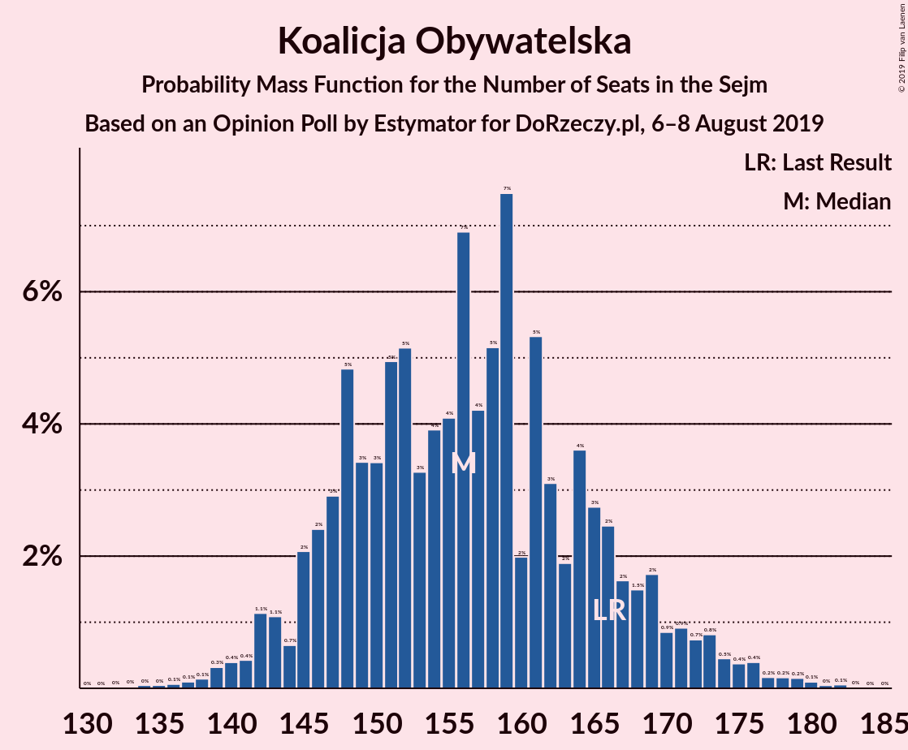
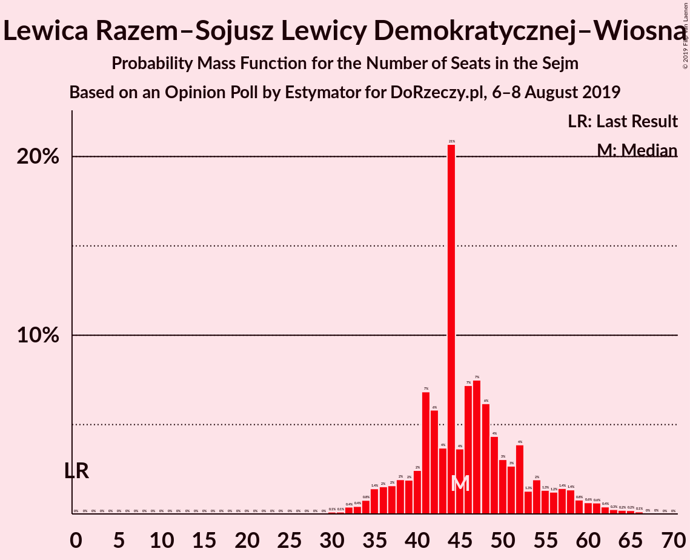
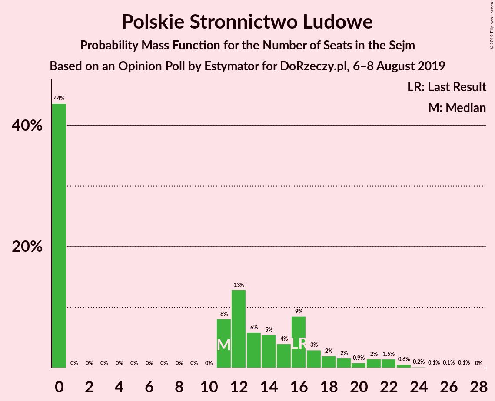

# Opinion Poll by Estymator for DoRzeczy.pl, 6–8 August 2019

<a href="#voting-intentions">Voting Intentions</a> | <a href="#seats">Seats</a> | <a href="#coalitions">Coalitions</a> | <a href="#technical-information">Technical Information</a>

## Voting Intentions

### Confidence Intervals

| Party | Last Result | Poll Result | 80% Confidence Interval | 90% Confidence Interval | 95% Confidence Interval | 99% Confidence Interval |
|:-----:|:-----------:|:-----------:|:-----------------------:|:-----------------------:|:-----------------------:|:-----------------------:|
| Prawo i Sprawiedliwość | 37.6% | 45.4% | 43.4–47.4% |42.8–48.0% |42.4–48.5% |41.4–49.4% |
| Koalicja Obywatelska | 31.7% | 30.3% | 28.5–32.2% |28.0–32.7% |27.5–33.2% |26.7–34.1% |
| Lewica Razem–Sojusz Lewicy Demokratycznej–Wiosna | 11.7% | 11.3% | 10.1–12.7% |9.8–13.0% |9.5–13.4% |8.9–14.1% |
| Polskie Stronnictwo Ludowe | 5.1% | 5.1% | 4.3–6.1% |4.1–6.4% |3.9–6.6% |3.6–7.1% |
| Kukiz’15 | 8.8% | 2.8% | 2.3–3.6% |2.1–3.9% |2.0–4.1% |1.7–4.5% |
| KORWiN | 4.8% | 2.6% | 2.1–3.4% |2.0–3.6% |1.8–3.8% |1.6–4.2% |

*Note:* The poll result column reflects the actual value used in the calculations. Published results may vary slightly, and in addition be rounded to fewer digits.

## Seats

### Confidence Intervals

| Party | Last Result | Median | 80% Confidence Interval | 90% Confidence Interval | 95% Confidence Interval | 99% Confidence Interval |
|:-----:|:-----------:|:------:|:-----------------------:|:-----------------------:|:-----------------------:|:-----------------------:|
| <a href="#prawo-i-sprawiedliwość">Prawo i Sprawiedliwość</a> | 235 | 250 | 239–260 |235–264 |232–268 |226–273 |
| <a href="#koalicja-obywatelska">Koalicja Obywatelska</a> | 166 | 156 | 147–167 |145–170 |142–172 |139–178 |
| <a href="#lewica-razem–sojusz-lewicy-demokratycznej–wiosna">Lewica Razem–Sojusz Lewicy Demokratycznej–Wiosna</a> | 0 | 45 | 39–54 |37–58 |35–60 |32–64 |
| <a href="#polskie-stronnictwo-ludowe">Polskie Stronnictwo Ludowe</a> | 16 | 11 | 0–16 |0–19 |0–21 |0–23 |
| <a href="#kukiz’15">Kukiz’15</a> | 42 | 0 | 0 |0 |0 |0 |
| <a href="#korwin">KORWiN</a> | 0 | 0 | 0 |0 |0 |0 |

### Prawo i Sprawiedliwość

*For a full overview of the results for this party, see the [Prawo i Sprawiedliwość](party-prawoisprawiedliwość.html) page.*

| Number of Seats | Probability | Accumulated | Special Marks |
|:---------------:|:-----------:|:-----------:|:-------------:|
| 218 | 0% | 100% |  |
| 219 | 0% | 99.9% |  |
| 220 | 0% | 99.9% |  |
| 221 | 0% | 99.9% |  |
| 222 | 0.1% | 99.9% |  |
| 223 | 0.1% | 99.8% |  |
| 224 | 0.1% | 99.7% |  |
| 225 | 0.1% | 99.6% |  |
| 226 | 0.1% | 99.5% |  |
| 227 | 0.4% | 99.4% |  |
| 228 | 0.3% | 99.0% |  |
| 229 | 0.2% | 98.7% |  |
| 230 | 0.2% | 98% |  |
| 231 | 0.6% | 98% | Majority |
| 232 | 0.4% | 98% |  |
| 233 | 0.3% | 97% |  |
| 234 | 1.1% | 97% |  |
| 235 | 1.3% | 96% | Last Result |
| 236 | 1.1% | 94% |  |
| 237 | 0.9% | 93% |  |
| 238 | 1.5% | 92% |  |
| 239 | 1.3% | 91% |  |
| 240 | 1.0% | 90% |  |
| 241 | 3% | 89% |  |
| 242 | 4% | 85% |  |
| 243 | 3% | 81% |  |
| 244 | 2% | 78% |  |
| 245 | 2% | 75% |  |
| 246 | 9% | 73% |  |
| 247 | 7% | 64% |  |
| 248 | 3% | 57% |  |
| 249 | 2% | 53% |  |
| 250 | 4% | 51% | Median |
| 251 | 5% | 47% |  |
| 252 | 5% | 42% |  |
| 253 | 2% | 37% |  |
| 254 | 4% | 35% |  |
| 255 | 7% | 32% |  |
| 256 | 1.4% | 24% |  |
| 257 | 5% | 23% |  |
| 258 | 2% | 18% |  |
| 259 | 6% | 16% |  |
| 260 | 2% | 10% |  |
| 261 | 0.8% | 8% |  |
| 262 | 0.7% | 7% |  |
| 263 | 1.4% | 7% |  |
| 264 | 2% | 5% |  |
| 265 | 0.6% | 4% |  |
| 266 | 0.2% | 3% |  |
| 267 | 0.2% | 3% |  |
| 268 | 0.7% | 3% |  |
| 269 | 0.4% | 2% |  |
| 270 | 0.3% | 1.5% |  |
| 271 | 0.1% | 1.2% |  |
| 272 | 0.2% | 1.1% |  |
| 273 | 0.5% | 0.8% |  |
| 274 | 0.1% | 0.3% |  |
| 275 | 0.1% | 0.2% |  |
| 276 | 0% | 0.2% |  |
| 277 | 0% | 0.1% |  |
| 278 | 0% | 0.1% |  |
| 279 | 0% | 0.1% |  |
| 280 | 0% | 0% |  |

### Koalicja Obywatelska

*For a full overview of the results for this party, see the [Koalicja Obywatelska](party-koalicjaobywatelska.html) page.*

| Number of Seats | Probability | Accumulated | Special Marks |
|:---------------:|:-----------:|:-----------:|:-------------:|
| 131 | 0% | 100% |  |
| 132 | 0% | 99.9% |  |
| 133 | 0% | 99.9% |  |
| 134 | 0.1% | 99.9% |  |
| 135 | 0% | 99.8% |  |
| 136 | 0.1% | 99.8% |  |
| 137 | 0.1% | 99.7% |  |
| 138 | 0.2% | 99.7% |  |
| 139 | 0.4% | 99.5% |  |
| 140 | 0.4% | 99.1% |  |
| 141 | 0.3% | 98.8% |  |
| 142 | 1.1% | 98.5% |  |
| 143 | 1.0% | 97% |  |
| 144 | 0.8% | 97% |  |
| 145 | 1.4% | 96% |  |
| 146 | 4% | 94% |  |
| 147 | 3% | 91% |  |
| 148 | 5% | 88% |  |
| 149 | 3% | 83% |  |
| 150 | 2% | 80% |  |
| 151 | 5% | 78% |  |
| 152 | 9% | 72% |  |
| 153 | 3% | 64% |  |
| 154 | 4% | 61% |  |
| 155 | 3% | 57% |  |
| 156 | 7% | 54% | Median |
| 157 | 3% | 47% |  |
| 158 | 8% | 43% |  |
| 159 | 3% | 35% |  |
| 160 | 3% | 32% |  |
| 161 | 6% | 29% |  |
| 162 | 1.1% | 24% |  |
| 163 | 0.7% | 23% |  |
| 164 | 6% | 22% |  |
| 165 | 3% | 16% |  |
| 166 | 3% | 13% | Last Result |
| 167 | 0.8% | 10% |  |
| 168 | 3% | 9% |  |
| 169 | 2% | 7% |  |
| 170 | 0.9% | 5% |  |
| 171 | 1.3% | 4% |  |
| 172 | 0.7% | 3% |  |
| 173 | 0.5% | 2% |  |
| 174 | 0.3% | 2% |  |
| 175 | 0.2% | 1.4% |  |
| 176 | 0.4% | 1.2% |  |
| 177 | 0.1% | 0.8% |  |
| 178 | 0.4% | 0.7% |  |
| 179 | 0.1% | 0.3% |  |
| 180 | 0.1% | 0.2% |  |
| 181 | 0% | 0.1% |  |
| 182 | 0% | 0.1% |  |
| 183 | 0% | 0.1% |  |
| 184 | 0% | 0% |  |

### Lewica Razem–Sojusz Lewicy Demokratycznej–Wiosna

*For a full overview of the results for this party, see the [Lewica Razem–Sojusz Lewicy Demokratycznej–Wiosna](party-lewicarazem–sojuszlewicydemokratycznej–wiosna.html) page.*

| Number of Seats | Probability | Accumulated | Special Marks |
|:---------------:|:-----------:|:-----------:|:-------------:|
| 0 | 0% | 100% | Last Result |
| 1 | 0% | 100% |  |
| 2 | 0% | 100% |  |
| 3 | 0% | 100% |  |
| 4 | 0% | 100% |  |
| 5 | 0% | 100% |  |
| 6 | 0% | 100% |  |
| 7 | 0% | 100% |  |
| 8 | 0% | 100% |  |
| 9 | 0% | 100% |  |
| 10 | 0% | 100% |  |
| 11 | 0% | 100% |  |
| 12 | 0% | 100% |  |
| 13 | 0% | 100% |  |
| 14 | 0% | 100% |  |
| 15 | 0% | 100% |  |
| 16 | 0% | 100% |  |
| 17 | 0% | 100% |  |
| 18 | 0% | 100% |  |
| 19 | 0% | 100% |  |
| 20 | 0% | 100% |  |
| 21 | 0% | 100% |  |
| 22 | 0% | 100% |  |
| 23 | 0% | 100% |  |
| 24 | 0% | 100% |  |
| 25 | 0% | 100% |  |
| 26 | 0% | 100% |  |
| 27 | 0% | 100% |  |
| 28 | 0% | 100% |  |
| 29 | 0% | 100% |  |
| 30 | 0.1% | 100% |  |
| 31 | 0.1% | 99.9% |  |
| 32 | 0.5% | 99.8% |  |
| 33 | 0.3% | 99.3% |  |
| 34 | 0.5% | 99.0% |  |
| 35 | 1.4% | 98% |  |
| 36 | 2% | 97% |  |
| 37 | 3% | 95% |  |
| 38 | 1.0% | 93% |  |
| 39 | 3% | 92% |  |
| 40 | 2% | 89% |  |
| 41 | 7% | 87% |  |
| 42 | 4% | 81% |  |
| 43 | 4% | 77% |  |
| 44 | 21% | 73% |  |
| 45 | 4% | 52% | Median |
| 46 | 8% | 48% |  |
| 47 | 6% | 40% |  |
| 48 | 3% | 34% |  |
| 49 | 8% | 31% |  |
| 50 | 3% | 23% |  |
| 51 | 2% | 20% |  |
| 52 | 4% | 17% |  |
| 53 | 1.1% | 13% |  |
| 54 | 3% | 12% |  |
| 55 | 1.0% | 9% |  |
| 56 | 2% | 8% |  |
| 57 | 0.9% | 6% |  |
| 58 | 2% | 5% |  |
| 59 | 1.0% | 4% |  |
| 60 | 0.4% | 3% |  |
| 61 | 0.9% | 2% |  |
| 62 | 0.4% | 1.3% |  |
| 63 | 0.3% | 0.8% |  |
| 64 | 0.2% | 0.6% |  |
| 65 | 0.1% | 0.4% |  |
| 66 | 0.2% | 0.2% |  |
| 67 | 0% | 0.1% |  |
| 68 | 0% | 0% |  |

### Polskie Stronnictwo Ludowe

*For a full overview of the results for this party, see the [Polskie Stronnictwo Ludowe](party-polskiestronnictwoludowe.html) page.*

| Number of Seats | Probability | Accumulated | Special Marks |
|:---------------:|:-----------:|:-----------:|:-------------:|
| 0 | 45% | 100% |  |
| 1 | 0% | 55% |  |
| 2 | 0% | 55% |  |
| 3 | 0% | 55% |  |
| 4 | 0% | 55% |  |
| 5 | 0% | 55% |  |
| 6 | 0% | 55% |  |
| 7 | 0% | 55% |  |
| 8 | 0% | 55% |  |
| 9 | 0% | 55% |  |
| 10 | 0% | 55% |  |
| 11 | 8% | 55% | Median |
| 12 | 16% | 47% |  |
| 13 | 4% | 31% |  |
| 14 | 6% | 27% |  |
| 15 | 4% | 21% |  |
| 16 | 8% | 18% | Last Result |
| 17 | 3% | 9% |  |
| 18 | 1.0% | 6% |  |
| 19 | 1.0% | 5% |  |
| 20 | 1.1% | 4% |  |
| 21 | 1.2% | 3% |  |
| 22 | 1.2% | 2% |  |
| 23 | 0.4% | 0.8% |  |
| 24 | 0.2% | 0.4% |  |
| 25 | 0.1% | 0.2% |  |
| 26 | 0% | 0.1% |  |
| 27 | 0.1% | 0.1% |  |
| 28 | 0% | 0% |  |

### Kukiz’15

*For a full overview of the results for this party, see the [Kukiz’15](party-kukiz’15.html) page.*

| Number of Seats | Probability | Accumulated | Special Marks |
|:---------------:|:-----------:|:-----------:|:-------------:|
| 0 | 100% | 100% | Median |
| 1 | 0% | 0% |  |
| 2 | 0% | 0% |  |
| 3 | 0% | 0% |  |
| 4 | 0% | 0% |  |
| 5 | 0% | 0% |  |
| 6 | 0% | 0% |  |
| 7 | 0% | 0% |  |
| 8 | 0% | 0% |  |
| 9 | 0% | 0% |  |
| 10 | 0% | 0% |  |
| 11 | 0% | 0% |  |
| 12 | 0% | 0% |  |
| 13 | 0% | 0% |  |
| 14 | 0% | 0% |  |
| 15 | 0% | 0% |  |
| 16 | 0% | 0% |  |
| 17 | 0% | 0% |  |
| 18 | 0% | 0% |  |
| 19 | 0% | 0% |  |
| 20 | 0% | 0% |  |
| 21 | 0% | 0% |  |
| 22 | 0% | 0% |  |
| 23 | 0% | 0% |  |
| 24 | 0% | 0% |  |
| 25 | 0% | 0% |  |
| 26 | 0% | 0% |  |
| 27 | 0% | 0% |  |
| 28 | 0% | 0% |  |
| 29 | 0% | 0% |  |
| 30 | 0% | 0% |  |
| 31 | 0% | 0% |  |
| 32 | 0% | 0% |  |
| 33 | 0% | 0% |  |
| 34 | 0% | 0% |  |
| 35 | 0% | 0% |  |
| 36 | 0% | 0% |  |
| 37 | 0% | 0% |  |
| 38 | 0% | 0% |  |
| 39 | 0% | 0% |  |
| 40 | 0% | 0% |  |
| 41 | 0% | 0% |  |
| 42 | 0% | 0% | Last Result |

### KORWiN

*For a full overview of the results for this party, see the [KORWiN](party-korwin.html) page.*

| Number of Seats | Probability | Accumulated | Special Marks |
|:---------------:|:-----------:|:-----------:|:-------------:|
| 0 | 100% | 100% | Last Result, Median |

## Coalitions

### Confidence Intervals

| Coalition | Last Result | Median | Majority? | 80% Confidence Interval | 90% Confidence Interval | 95% Confidence Interval | 99% Confidence Interval |
|:---------:|:-----------:|:------:|:---------:|:-----------------------:|:-----------------------:|:-----------------------:|:-----------------------:|
| Prawo i Sprawiedliwość | 235 | 250 | 98% | 239–260 | 235–264 | 232–268 | 226–273 |
| Koalicja Obywatelska – Lewica Razem–Sojusz Lewicy Demokratycznej–Wiosna – Polskie Stronnictwo Ludowe | 182 | 210 | 2% | 200–221 | 196–225 | 192–228 | 187–234 |
| Koalicja Obywatelska – Lewica Razem–Sojusz Lewicy Demokratycznej–Wiosna | 166 | 202 | 0.1% | 191–213 | 190–216 | 187–219 | 181–225 |
| Koalicja Obywatelska – Polskie Stronnictwo Ludowe | 182 | 164 | 0% | 151–177 | 148–181 | 147–183 | 143–189 |
| Koalicja Obywatelska | 166 | 156 | 0% | 147–167 | 145–170 | 142–172 | 139–178 |

### Prawo i Sprawiedliwość

| Number of Seats | Probability | Accumulated | Special Marks |
|:---------------:|:-----------:|:-----------:|:-------------:|
| 218 | 0% | 100% |  |
| 219 | 0% | 99.9% |  |
| 220 | 0% | 99.9% |  |
| 221 | 0% | 99.9% |  |
| 222 | 0.1% | 99.9% |  |
| 223 | 0.1% | 99.8% |  |
| 224 | 0.1% | 99.7% |  |
| 225 | 0.1% | 99.6% |  |
| 226 | 0.1% | 99.5% |  |
| 227 | 0.4% | 99.4% |  |
| 228 | 0.3% | 99.0% |  |
| 229 | 0.2% | 98.7% |  |
| 230 | 0.2% | 98% |  |
| 231 | 0.6% | 98% | Majority |
| 232 | 0.4% | 98% |  |
| 233 | 0.3% | 97% |  |
| 234 | 1.1% | 97% |  |
| 235 | 1.3% | 96% | Last Result |
| 236 | 1.1% | 94% |  |
| 237 | 0.9% | 93% |  |
| 238 | 1.5% | 92% |  |
| 239 | 1.3% | 91% |  |
| 240 | 1.0% | 90% |  |
| 241 | 3% | 89% |  |
| 242 | 4% | 85% |  |
| 243 | 3% | 81% |  |
| 244 | 2% | 78% |  |
| 245 | 2% | 75% |  |
| 246 | 9% | 73% |  |
| 247 | 7% | 64% |  |
| 248 | 3% | 57% |  |
| 249 | 2% | 53% |  |
| 250 | 4% | 51% | Median |
| 251 | 5% | 47% |  |
| 252 | 5% | 42% |  |
| 253 | 2% | 37% |  |
| 254 | 4% | 35% |  |
| 255 | 7% | 32% |  |
| 256 | 1.4% | 24% |  |
| 257 | 5% | 23% |  |
| 258 | 2% | 18% |  |
| 259 | 6% | 16% |  |
| 260 | 2% | 10% |  |
| 261 | 0.8% | 8% |  |
| 262 | 0.7% | 7% |  |
| 263 | 1.4% | 7% |  |
| 264 | 2% | 5% |  |
| 265 | 0.6% | 4% |  |
| 266 | 0.2% | 3% |  |
| 267 | 0.2% | 3% |  |
| 268 | 0.7% | 3% |  |
| 269 | 0.4% | 2% |  |
| 270 | 0.3% | 1.5% |  |
| 271 | 0.1% | 1.2% |  |
| 272 | 0.2% | 1.1% |  |
| 273 | 0.5% | 0.8% |  |
| 274 | 0.1% | 0.3% |  |
| 275 | 0.1% | 0.2% |  |
| 276 | 0% | 0.2% |  |
| 277 | 0% | 0.1% |  |
| 278 | 0% | 0.1% |  |
| 279 | 0% | 0.1% |  |
| 280 | 0% | 0% |  |

### Koalicja Obywatelska – Lewica Razem–Sojusz Lewicy Demokratycznej–Wiosna – Polskie Stronnictwo Ludowe

| Number of Seats | Probability | Accumulated | Special Marks |
|:---------------:|:-----------:|:-----------:|:-------------:|
| 181 | 0% | 100% |  |
| 182 | 0% | 99.9% | Last Result |
| 183 | 0% | 99.9% |  |
| 184 | 0% | 99.9% |  |
| 185 | 0.1% | 99.8% |  |
| 186 | 0.1% | 99.8% |  |
| 187 | 0.5% | 99.7% |  |
| 188 | 0.2% | 99.2% |  |
| 189 | 0.1% | 98.9% |  |
| 190 | 0.3% | 98.8% |  |
| 191 | 0.4% | 98.5% |  |
| 192 | 0.7% | 98% |  |
| 193 | 0.2% | 97% |  |
| 194 | 0.2% | 97% |  |
| 195 | 0.6% | 97% |  |
| 196 | 2% | 96% |  |
| 197 | 1.4% | 95% |  |
| 198 | 0.7% | 93% |  |
| 199 | 0.8% | 93% |  |
| 200 | 2% | 92% |  |
| 201 | 6% | 90% |  |
| 202 | 2% | 84% |  |
| 203 | 5% | 82% |  |
| 204 | 1.4% | 77% |  |
| 205 | 7% | 75% |  |
| 206 | 4% | 68% |  |
| 207 | 2% | 65% |  |
| 208 | 5% | 63% |  |
| 209 | 5% | 58% |  |
| 210 | 4% | 53% |  |
| 211 | 2% | 49% |  |
| 212 | 3% | 47% | Median |
| 213 | 7% | 43% |  |
| 214 | 9% | 36% |  |
| 215 | 2% | 27% |  |
| 216 | 2% | 25% |  |
| 217 | 3% | 22% |  |
| 218 | 4% | 19% |  |
| 219 | 3% | 15% |  |
| 220 | 1.0% | 11% |  |
| 221 | 1.3% | 10% |  |
| 222 | 1.5% | 9% |  |
| 223 | 0.9% | 8% |  |
| 224 | 1.1% | 7% |  |
| 225 | 1.3% | 5% |  |
| 226 | 1.1% | 4% |  |
| 227 | 0.3% | 3% |  |
| 228 | 0.4% | 3% |  |
| 229 | 0.6% | 2% |  |
| 230 | 0.2% | 2% |  |
| 231 | 0.2% | 2% | Majority |
| 232 | 0.3% | 1.3% |  |
| 233 | 0.4% | 1.0% |  |
| 234 | 0.1% | 0.6% |  |
| 235 | 0.1% | 0.5% |  |
| 236 | 0.1% | 0.4% |  |
| 237 | 0.1% | 0.3% |  |
| 238 | 0.1% | 0.2% |  |
| 239 | 0% | 0.1% |  |
| 240 | 0% | 0.1% |  |
| 241 | 0% | 0.1% |  |
| 242 | 0% | 0.1% |  |
| 243 | 0% | 0% |  |

### Koalicja Obywatelska – Lewica Razem–Sojusz Lewicy Demokratycznej–Wiosna

| Number of Seats | Probability | Accumulated | Special Marks |
|:---------------:|:-----------:|:-----------:|:-------------:|
| 166 | 0% | 100% | Last Result |
| 167 | 0% | 100% |  |
| 168 | 0% | 100% |  |
| 169 | 0% | 100% |  |
| 170 | 0% | 100% |  |
| 171 | 0% | 100% |  |
| 172 | 0% | 100% |  |
| 173 | 0% | 100% |  |
| 174 | 0% | 100% |  |
| 175 | 0% | 99.9% |  |
| 176 | 0.1% | 99.9% |  |
| 177 | 0% | 99.8% |  |
| 178 | 0.1% | 99.8% |  |
| 179 | 0.1% | 99.8% |  |
| 180 | 0.1% | 99.7% |  |
| 181 | 0.3% | 99.6% |  |
| 182 | 0.2% | 99.3% |  |
| 183 | 0.2% | 99.1% |  |
| 184 | 0.2% | 98.9% |  |
| 185 | 0.5% | 98.6% |  |
| 186 | 0.2% | 98% |  |
| 187 | 1.2% | 98% |  |
| 188 | 0.8% | 97% |  |
| 189 | 0.9% | 96% |  |
| 190 | 3% | 95% |  |
| 191 | 4% | 92% |  |
| 192 | 2% | 89% |  |
| 193 | 1.3% | 87% |  |
| 194 | 1.4% | 86% |  |
| 195 | 2% | 84% |  |
| 196 | 3% | 82% |  |
| 197 | 6% | 79% |  |
| 198 | 2% | 73% |  |
| 199 | 3% | 71% |  |
| 200 | 4% | 69% |  |
| 201 | 7% | 65% | Median |
| 202 | 9% | 58% |  |
| 203 | 7% | 49% |  |
| 204 | 4% | 42% |  |
| 205 | 9% | 38% |  |
| 206 | 2% | 30% |  |
| 207 | 2% | 28% |  |
| 208 | 5% | 26% |  |
| 209 | 4% | 21% |  |
| 210 | 2% | 17% |  |
| 211 | 2% | 15% |  |
| 212 | 1.3% | 13% |  |
| 213 | 4% | 12% |  |
| 214 | 1.2% | 7% |  |
| 215 | 0.7% | 6% |  |
| 216 | 2% | 6% |  |
| 217 | 0.7% | 4% |  |
| 218 | 0.3% | 3% |  |
| 219 | 1.0% | 3% |  |
| 220 | 0.1% | 2% |  |
| 221 | 0.2% | 2% |  |
| 222 | 0.5% | 2% |  |
| 223 | 0.3% | 1.0% |  |
| 224 | 0.1% | 0.8% |  |
| 225 | 0.2% | 0.7% |  |
| 226 | 0.1% | 0.4% |  |
| 227 | 0.1% | 0.4% |  |
| 228 | 0.1% | 0.3% |  |
| 229 | 0% | 0.2% |  |
| 230 | 0.1% | 0.2% |  |
| 231 | 0% | 0.1% | Majority |
| 232 | 0% | 0.1% |  |
| 233 | 0% | 0.1% |  |
| 234 | 0% | 0% |  |

### Koalicja Obywatelska – Polskie Stronnictwo Ludowe

| Number of Seats | Probability | Accumulated | Special Marks |
|:---------------:|:-----------:|:-----------:|:-------------:|
| 137 | 0% | 100% |  |
| 138 | 0.1% | 99.9% |  |
| 139 | 0.1% | 99.9% |  |
| 140 | 0% | 99.8% |  |
| 141 | 0.1% | 99.8% |  |
| 142 | 0% | 99.7% |  |
| 143 | 0.6% | 99.7% |  |
| 144 | 0% | 99.1% |  |
| 145 | 0.3% | 99.0% |  |
| 146 | 0.3% | 98.7% |  |
| 147 | 1.3% | 98% |  |
| 148 | 3% | 97% |  |
| 149 | 1.3% | 95% |  |
| 150 | 0.7% | 93% |  |
| 151 | 4% | 93% |  |
| 152 | 4% | 89% |  |
| 153 | 1.0% | 84% |  |
| 154 | 3% | 83% |  |
| 155 | 3% | 81% |  |
| 156 | 2% | 78% |  |
| 157 | 2% | 76% |  |
| 158 | 5% | 75% |  |
| 159 | 2% | 70% |  |
| 160 | 2% | 68% |  |
| 161 | 5% | 66% |  |
| 162 | 2% | 61% |  |
| 163 | 5% | 59% |  |
| 164 | 8% | 54% |  |
| 165 | 5% | 47% |  |
| 166 | 3% | 42% |  |
| 167 | 2% | 39% | Median |
| 168 | 4% | 38% |  |
| 169 | 3% | 33% |  |
| 170 | 6% | 30% |  |
| 171 | 3% | 25% |  |
| 172 | 2% | 22% |  |
| 173 | 3% | 19% |  |
| 174 | 2% | 16% |  |
| 175 | 2% | 14% |  |
| 176 | 2% | 13% |  |
| 177 | 2% | 11% |  |
| 178 | 1.4% | 10% |  |
| 179 | 0.5% | 8% |  |
| 180 | 2% | 8% |  |
| 181 | 2% | 5% |  |
| 182 | 1.1% | 4% | Last Result |
| 183 | 0.3% | 3% |  |
| 184 | 0.4% | 2% |  |
| 185 | 0.1% | 2% |  |
| 186 | 0.3% | 2% |  |
| 187 | 0.3% | 1.4% |  |
| 188 | 0.4% | 1.1% |  |
| 189 | 0.3% | 0.7% |  |
| 190 | 0.1% | 0.5% |  |
| 191 | 0.1% | 0.3% |  |
| 192 | 0.1% | 0.2% |  |
| 193 | 0% | 0.1% |  |
| 194 | 0% | 0.1% |  |
| 195 | 0% | 0% |  |

### Koalicja Obywatelska

| Number of Seats | Probability | Accumulated | Special Marks |
|:---------------:|:-----------:|:-----------:|:-------------:|
| 131 | 0% | 100% |  |
| 132 | 0% | 99.9% |  |
| 133 | 0% | 99.9% |  |
| 134 | 0.1% | 99.9% |  |
| 135 | 0% | 99.8% |  |
| 136 | 0.1% | 99.8% |  |
| 137 | 0.1% | 99.7% |  |
| 138 | 0.2% | 99.7% |  |
| 139 | 0.4% | 99.5% |  |
| 140 | 0.4% | 99.1% |  |
| 141 | 0.3% | 98.8% |  |
| 142 | 1.1% | 98.5% |  |
| 143 | 1.0% | 97% |  |
| 144 | 0.8% | 97% |  |
| 145 | 1.4% | 96% |  |
| 146 | 4% | 94% |  |
| 147 | 3% | 91% |  |
| 148 | 5% | 88% |  |
| 149 | 3% | 83% |  |
| 150 | 2% | 80% |  |
| 151 | 5% | 78% |  |
| 152 | 9% | 72% |  |
| 153 | 3% | 64% |  |
| 154 | 4% | 61% |  |
| 155 | 3% | 57% |  |
| 156 | 7% | 54% | Median |
| 157 | 3% | 47% |  |
| 158 | 8% | 43% |  |
| 159 | 3% | 35% |  |
| 160 | 3% | 32% |  |
| 161 | 6% | 29% |  |
| 162 | 1.1% | 24% |  |
| 163 | 0.7% | 23% |  |
| 164 | 6% | 22% |  |
| 165 | 3% | 16% |  |
| 166 | 3% | 13% | Last Result |
| 167 | 0.8% | 10% |  |
| 168 | 3% | 9% |  |
| 169 | 2% | 7% |  |
| 170 | 0.9% | 5% |  |
| 171 | 1.3% | 4% |  |
| 172 | 0.7% | 3% |  |
| 173 | 0.5% | 2% |  |
| 174 | 0.3% | 2% |  |
| 175 | 0.2% | 1.4% |  |
| 176 | 0.4% | 1.2% |  |
| 177 | 0.1% | 0.8% |  |
| 178 | 0.4% | 0.7% |  |
| 179 | 0.1% | 0.3% |  |
| 180 | 0.1% | 0.2% |  |
| 181 | 0% | 0.1% |  |
| 182 | 0% | 0.1% |  |
| 183 | 0% | 0.1% |  |
| 184 | 0% | 0% |  |

## Technical Information

### Opinion Poll

+ **Polling firm:** Estymator
+ **Commissioner(s):** DoRzeczy.pl
+ **Fieldwork period:** 6–8 August 2019

### Calculations

+ **Sample size:** 1020
+ **Simulations done:** 131,072
+ **Error estimate:** 0.99%

