# Opinion Poll by Kantar Public for TVN, 22 August 2019

<a href="#voting-intentions">Voting Intentions</a> | <a href="#seats">Seats</a> | <a href="#coalitions">Coalitions</a> | <a href="#technical-information">Technical Information</a>

## Voting Intentions

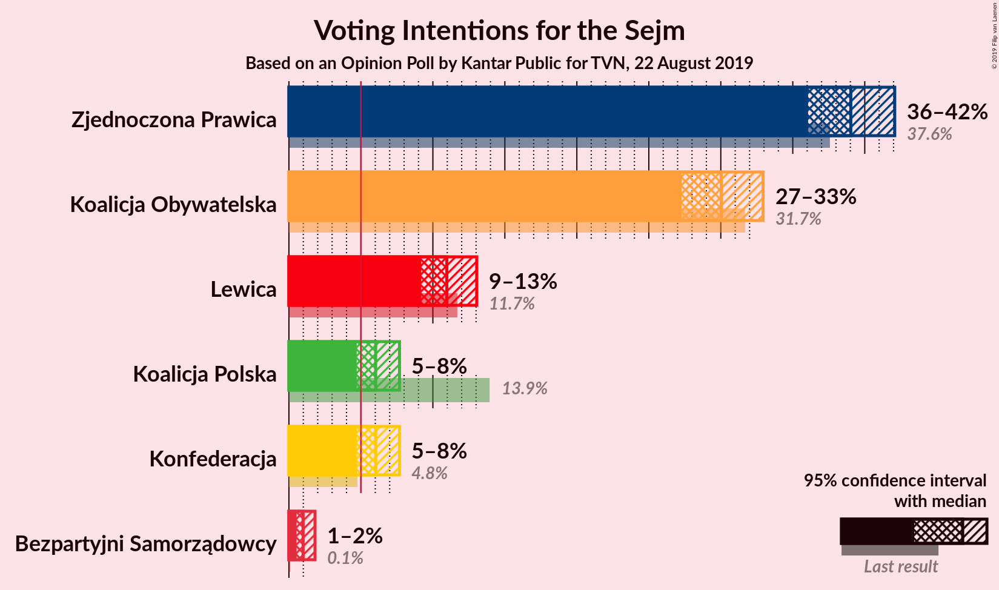

### Confidence Intervals

| Party | Last Result | Poll Result | 80% Confidence Interval | 90% Confidence Interval | 95% Confidence Interval | 99% Confidence Interval |
|:-----:|:-----------:|:-----------:|:-----------------------:|:-----------------------:|:-----------------------:|:-----------------------:|
| Zjednoczona Prawica | 37.6% | 39.0% | 37.1–41.0% |36.5–41.6% |36.1–42.1% |35.1–43.0% |
| Koalicja Obywatelska | 31.7% | 30.0% | 28.2–31.9% |27.7–32.5% |27.3–32.9% |26.4–33.9% |
| Lewica | 11.7% | 11.0% | 9.8–12.3% |9.5–12.7% |9.2–13.0% |8.7–13.7% |
| Koalicja Polska | 13.9% | 6.0% | 5.2–7.1% |4.9–7.4% |4.7–7.7% |4.3–8.2% |
| Konfederacja | 4.8% | 6.0% | 5.2–7.1% |4.9–7.4% |4.7–7.7% |4.3–8.2% |
| Bezpartyjni Samorządowcy | 0.1% | 1.0% | 0.7–1.5% |0.6–1.7% |0.5–1.8% |0.4–2.1% |

*Note:* The poll result column reflects the actual value used in the calculations. Published results may vary slightly, and in addition be rounded to fewer digits.

## Seats

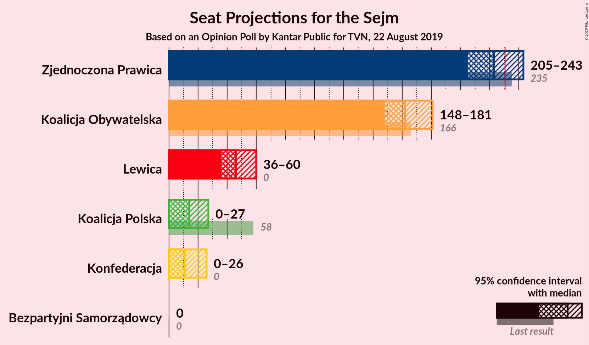

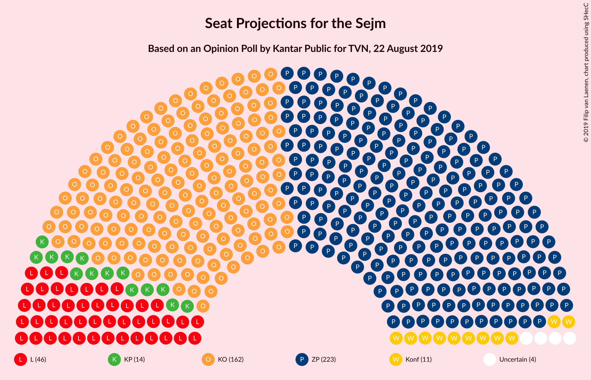

### Confidence Intervals

| Party | Last Result | Median | 80% Confidence Interval | 90% Confidence Interval | 95% Confidence Interval | 99% Confidence Interval |
|:-----:|:-----------:|:------:|:-----------------------:|:-----------------------:|:-----------------------:|:-----------------------:|
| <a href="#zjednoczona-prawica">Zjednoczona Prawica</a> | 235 | 223 | 212–236 |208–240 |205–243 |199–248 |
| <a href="#koalicja-obywatelska">Koalicja Obywatelska</a> | 166 | 162 | 152–174 |150–178 |148–181 |143–186 |
| <a href="#lewica">Lewica</a> | 0 | 46 | 39–55 |37–58 |36–60 |34–66 |
| <a href="#koalicja-polska">Koalicja Polska</a> | 58 | 14 | 9–24 |0–26 |0–27 |0–33 |
| <a href="#konfederacja">Konfederacja</a> | 0 | 11 | 4–21 |0–24 |0–26 |0–30 |
| <a href="#bezpartyjni-samorządowcy">Bezpartyjni Samorządowcy</a> | 0 | 0 | 0 |0 |0 |0 |

### Zjednoczona Prawica

*For a full overview of the results for this party, see the [Zjednoczona Prawica](party-zjednoczonaprawica.html) page.*

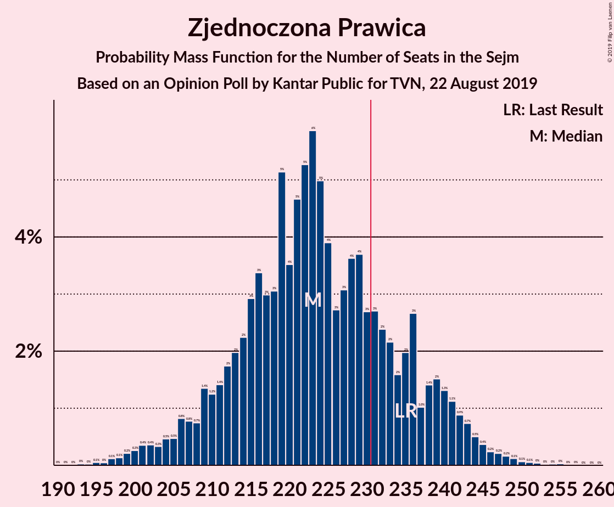

| Number of Seats | Probability | Accumulated | Special Marks |
|:---------------:|:-----------:|:-----------:|:-------------:|
| 193 | 0% | 100% |  |
| 194 | 0% | 99.9% |  |
| 195 | 0.1% | 99.9% |  |
| 196 | 0% | 99.9% |  |
| 197 | 0.1% | 99.8% |  |
| 198 | 0.1% | 99.7% |  |
| 199 | 0.2% | 99.6% |  |
| 200 | 0.3% | 99.4% |  |
| 201 | 0.4% | 99.1% |  |
| 202 | 0.4% | 98.7% |  |
| 203 | 0.3% | 98% |  |
| 204 | 0.5% | 98% |  |
| 205 | 0.5% | 98% |  |
| 206 | 0.8% | 97% |  |
| 207 | 0.8% | 96% |  |
| 208 | 0.7% | 96% |  |
| 209 | 1.4% | 95% |  |
| 210 | 1.2% | 93% |  |
| 211 | 1.4% | 92% |  |
| 212 | 2% | 91% |  |
| 213 | 2% | 89% |  |
| 214 | 2% | 87% |  |
| 215 | 3% | 85% |  |
| 216 | 3% | 82% |  |
| 217 | 3% | 79% |  |
| 218 | 3% | 76% |  |
| 219 | 5% | 72% |  |
| 220 | 4% | 67% |  |
| 221 | 5% | 64% |  |
| 222 | 5% | 59% |  |
| 223 | 6% | 54% | Median |
| 224 | 5% | 48% |  |
| 225 | 4% | 43% |  |
| 226 | 3% | 39% |  |
| 227 | 3% | 36% |  |
| 228 | 4% | 33% |  |
| 229 | 4% | 30% |  |
| 230 | 3% | 26% |  |
| 231 | 3% | 23% | Majority |
| 232 | 2% | 21% |  |
| 233 | 2% | 18% |  |
| 234 | 2% | 16% |  |
| 235 | 2% | 14% | Last Result |
| 236 | 3% | 13% |  |
| 237 | 1.0% | 10% |  |
| 238 | 1.4% | 9% |  |
| 239 | 2% | 7% |  |
| 240 | 1.3% | 6% |  |
| 241 | 1.1% | 5% |  |
| 242 | 0.9% | 3% |  |
| 243 | 0.7% | 3% |  |
| 244 | 0.5% | 2% |  |
| 245 | 0.4% | 1.4% |  |
| 246 | 0.2% | 1.0% |  |
| 247 | 0.2% | 0.7% |  |
| 248 | 0.2% | 0.5% |  |
| 249 | 0.1% | 0.4% |  |
| 250 | 0.1% | 0.3% |  |
| 251 | 0.1% | 0.2% |  |
| 252 | 0% | 0.1% |  |
| 253 | 0% | 0.1% |  |
| 254 | 0% | 0.1% |  |
| 255 | 0% | 0.1% |  |
| 256 | 0% | 0% |  |

### Koalicja Obywatelska

*For a full overview of the results for this party, see the [Koalicja Obywatelska](party-koalicjaobywatelska.html) page.*

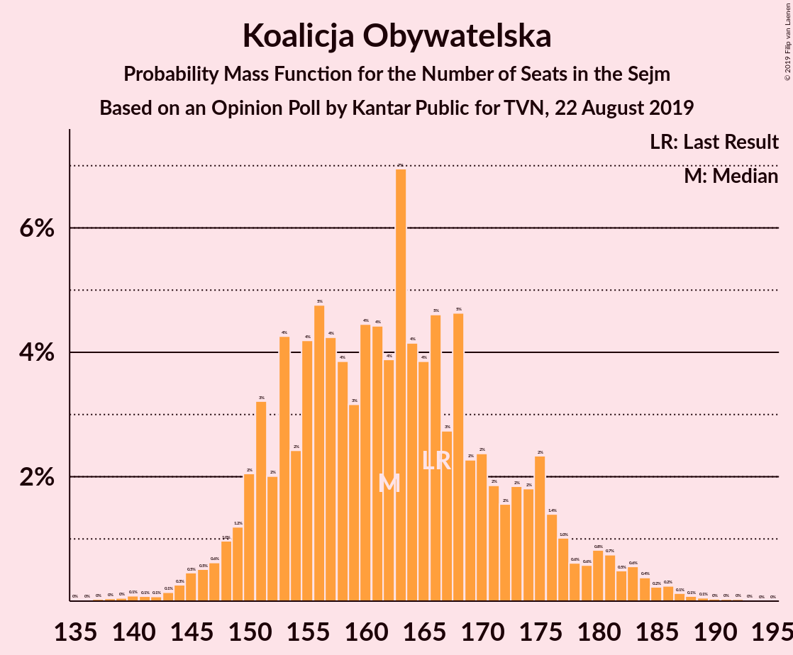

| Number of Seats | Probability | Accumulated | Special Marks |
|:---------------:|:-----------:|:-----------:|:-------------:|
| 135 | 0% | 100% |  |
| 136 | 0% | 99.9% |  |
| 137 | 0% | 99.9% |  |
| 138 | 0% | 99.9% |  |
| 139 | 0% | 99.9% |  |
| 140 | 0.1% | 99.8% |  |
| 141 | 0.1% | 99.7% |  |
| 142 | 0.1% | 99.6% |  |
| 143 | 0.1% | 99.6% |  |
| 144 | 0.3% | 99.4% |  |
| 145 | 0.5% | 99.2% |  |
| 146 | 0.5% | 98.7% |  |
| 147 | 0.6% | 98% |  |
| 148 | 1.0% | 98% |  |
| 149 | 1.2% | 97% |  |
| 150 | 2% | 95% |  |
| 151 | 3% | 93% |  |
| 152 | 2% | 90% |  |
| 153 | 4% | 88% |  |
| 154 | 2% | 84% |  |
| 155 | 4% | 81% |  |
| 156 | 5% | 77% |  |
| 157 | 4% | 72% |  |
| 158 | 4% | 68% |  |
| 159 | 3% | 64% |  |
| 160 | 4% | 61% |  |
| 161 | 4% | 57% |  |
| 162 | 4% | 52% | Median |
| 163 | 7% | 48% |  |
| 164 | 4% | 42% |  |
| 165 | 4% | 37% |  |
| 166 | 5% | 34% | Last Result |
| 167 | 3% | 29% |  |
| 168 | 5% | 26% |  |
| 169 | 2% | 22% |  |
| 170 | 2% | 19% |  |
| 171 | 2% | 17% |  |
| 172 | 2% | 15% |  |
| 173 | 2% | 13% |  |
| 174 | 2% | 12% |  |
| 175 | 2% | 10% |  |
| 176 | 1.4% | 7% |  |
| 177 | 1.0% | 6% |  |
| 178 | 0.6% | 5% |  |
| 179 | 0.6% | 4% |  |
| 180 | 0.8% | 4% |  |
| 181 | 0.7% | 3% |  |
| 182 | 0.5% | 2% |  |
| 183 | 0.6% | 2% |  |
| 184 | 0.4% | 1.3% |  |
| 185 | 0.2% | 0.9% |  |
| 186 | 0.2% | 0.7% |  |
| 187 | 0.1% | 0.4% |  |
| 188 | 0.1% | 0.3% |  |
| 189 | 0.1% | 0.2% |  |
| 190 | 0% | 0.2% |  |
| 191 | 0% | 0.1% |  |
| 192 | 0% | 0.1% |  |
| 193 | 0% | 0.1% |  |
| 194 | 0% | 0% |  |

### Lewica

*For a full overview of the results for this party, see the [Lewica](party-lewica.html) page.*

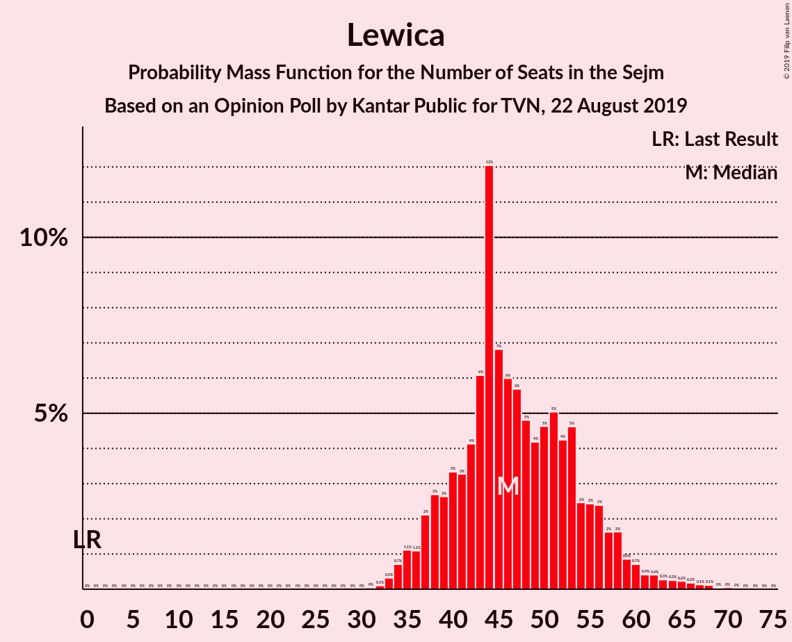

| Number of Seats | Probability | Accumulated | Special Marks |
|:---------------:|:-----------:|:-----------:|:-------------:|
| 0 | 0% | 100% | Last Result |
| 1 | 0% | 100% |  |
| 2 | 0% | 100% |  |
| 3 | 0% | 100% |  |
| 4 | 0% | 100% |  |
| 5 | 0% | 100% |  |
| 6 | 0% | 100% |  |
| 7 | 0% | 100% |  |
| 8 | 0% | 100% |  |
| 9 | 0% | 100% |  |
| 10 | 0% | 100% |  |
| 11 | 0% | 100% |  |
| 12 | 0% | 100% |  |
| 13 | 0% | 100% |  |
| 14 | 0% | 100% |  |
| 15 | 0% | 100% |  |
| 16 | 0% | 100% |  |
| 17 | 0% | 100% |  |
| 18 | 0% | 100% |  |
| 19 | 0% | 100% |  |
| 20 | 0% | 100% |  |
| 21 | 0% | 100% |  |
| 22 | 0% | 100% |  |
| 23 | 0% | 100% |  |
| 24 | 0% | 100% |  |
| 25 | 0% | 100% |  |
| 26 | 0% | 100% |  |
| 27 | 0% | 100% |  |
| 28 | 0% | 100% |  |
| 29 | 0% | 100% |  |
| 30 | 0% | 100% |  |
| 31 | 0% | 100% |  |
| 32 | 0.1% | 99.9% |  |
| 33 | 0.3% | 99.8% |  |
| 34 | 0.7% | 99.5% |  |
| 35 | 1.1% | 98.8% |  |
| 36 | 1.1% | 98% |  |
| 37 | 2% | 97% |  |
| 38 | 3% | 94% |  |
| 39 | 3% | 92% |  |
| 40 | 3% | 89% |  |
| 41 | 3% | 86% |  |
| 42 | 4% | 83% |  |
| 43 | 6% | 78% |  |
| 44 | 12% | 72% |  |
| 45 | 7% | 60% |  |
| 46 | 6% | 53% | Median |
| 47 | 6% | 47% |  |
| 48 | 5% | 42% |  |
| 49 | 4% | 37% |  |
| 50 | 5% | 33% |  |
| 51 | 5% | 28% |  |
| 52 | 4% | 23% |  |
| 53 | 5% | 19% |  |
| 54 | 2% | 14% |  |
| 55 | 2% | 12% |  |
| 56 | 2% | 9% |  |
| 57 | 2% | 7% |  |
| 58 | 2% | 5% |  |
| 59 | 0.9% | 4% |  |
| 60 | 0.7% | 3% |  |
| 61 | 0.4% | 2% |  |
| 62 | 0.4% | 2% |  |
| 63 | 0.3% | 1.3% |  |
| 64 | 0.3% | 1.1% |  |
| 65 | 0.2% | 0.8% |  |
| 66 | 0.2% | 0.6% |  |
| 67 | 0.1% | 0.4% |  |
| 68 | 0.1% | 0.3% |  |
| 69 | 0% | 0.1% |  |
| 70 | 0% | 0.1% |  |
| 71 | 0% | 0.1% |  |
| 72 | 0% | 0% |  |

### Koalicja Polska

*For a full overview of the results for this party, see the [Koalicja Polska](party-koalicjapolska.html) page.*

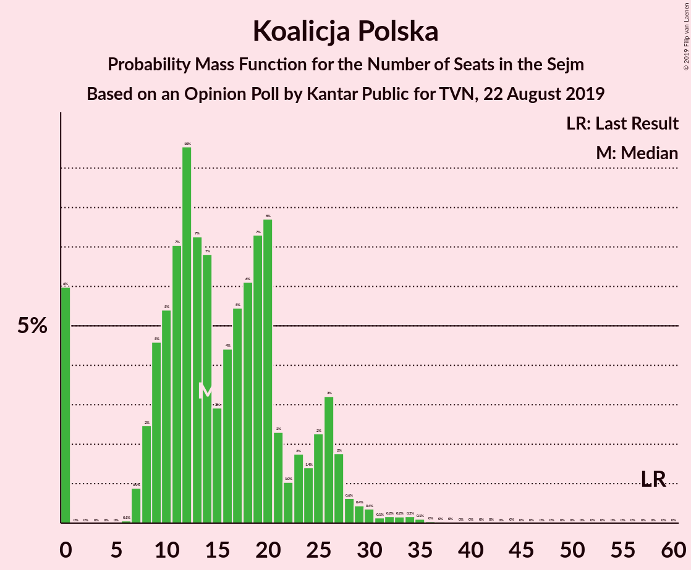

| Number of Seats | Probability | Accumulated | Special Marks |
|:---------------:|:-----------:|:-----------:|:-------------:|
| 0 | 6% | 100% |  |
| 1 | 0% | 94% |  |
| 2 | 0% | 94% |  |
| 3 | 0% | 94% |  |
| 4 | 0% | 94% |  |
| 5 | 0% | 94% |  |
| 6 | 0.1% | 94% |  |
| 7 | 0.9% | 94% |  |
| 8 | 2% | 93% |  |
| 9 | 5% | 91% |  |
| 10 | 5% | 86% |  |
| 11 | 7% | 81% |  |
| 12 | 10% | 74% |  |
| 13 | 7% | 64% |  |
| 14 | 7% | 57% | Median |
| 15 | 3% | 50% |  |
| 16 | 4% | 47% |  |
| 17 | 5% | 43% |  |
| 18 | 6% | 37% |  |
| 19 | 7% | 31% |  |
| 20 | 8% | 24% |  |
| 21 | 2% | 16% |  |
| 22 | 1.0% | 14% |  |
| 23 | 2% | 13% |  |
| 24 | 1.4% | 11% |  |
| 25 | 2% | 10% |  |
| 26 | 3% | 7% |  |
| 27 | 2% | 4% |  |
| 28 | 0.6% | 2% |  |
| 29 | 0.4% | 2% |  |
| 30 | 0.4% | 1.2% |  |
| 31 | 0.1% | 0.9% |  |
| 32 | 0.2% | 0.7% |  |
| 33 | 0.2% | 0.6% |  |
| 34 | 0.2% | 0.4% |  |
| 35 | 0.1% | 0.2% |  |
| 36 | 0% | 0.1% |  |
| 37 | 0% | 0.1% |  |
| 38 | 0% | 0.1% |  |
| 39 | 0% | 0% |  |
| 40 | 0% | 0% |  |
| 41 | 0% | 0% |  |
| 42 | 0% | 0% |  |
| 43 | 0% | 0% |  |
| 44 | 0% | 0% |  |
| 45 | 0% | 0% |  |
| 46 | 0% | 0% |  |
| 47 | 0% | 0% |  |
| 48 | 0% | 0% |  |
| 49 | 0% | 0% |  |
| 50 | 0% | 0% |  |
| 51 | 0% | 0% |  |
| 52 | 0% | 0% |  |
| 53 | 0% | 0% |  |
| 54 | 0% | 0% |  |
| 55 | 0% | 0% |  |
| 56 | 0% | 0% |  |
| 57 | 0% | 0% |  |
| 58 | 0% | 0% | Last Result |

### Konfederacja

*For a full overview of the results for this party, see the [Konfederacja](party-konfederacja.html) page.*

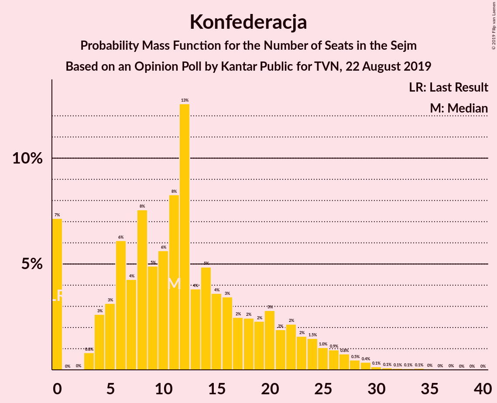

| Number of Seats | Probability | Accumulated | Special Marks |
|:---------------:|:-----------:|:-----------:|:-------------:|
| 0 | 7% | 100% | Last Result |
| 1 | 0% | 93% |  |
| 2 | 0% | 93% |  |
| 3 | 0.8% | 93% |  |
| 4 | 3% | 92% |  |
| 5 | 3% | 89% |  |
| 6 | 6% | 86% |  |
| 7 | 4% | 80% |  |
| 8 | 8% | 76% |  |
| 9 | 5% | 68% |  |
| 10 | 6% | 63% |  |
| 11 | 8% | 58% | Median |
| 12 | 13% | 50% |  |
| 13 | 4% | 37% |  |
| 14 | 5% | 33% |  |
| 15 | 4% | 28% |  |
| 16 | 3% | 25% |  |
| 17 | 2% | 21% |  |
| 18 | 2% | 19% |  |
| 19 | 2% | 16% |  |
| 20 | 3% | 14% |  |
| 21 | 2% | 11% |  |
| 22 | 2% | 9% |  |
| 23 | 2% | 7% |  |
| 24 | 1.5% | 6% |  |
| 25 | 1.0% | 4% |  |
| 26 | 0.9% | 3% |  |
| 27 | 0.8% | 2% |  |
| 28 | 0.5% | 1.4% |  |
| 29 | 0.4% | 0.9% |  |
| 30 | 0.1% | 0.5% |  |
| 31 | 0.1% | 0.4% |  |
| 32 | 0.1% | 0.3% |  |
| 33 | 0.1% | 0.2% |  |
| 34 | 0.1% | 0.2% |  |
| 35 | 0% | 0.1% |  |
| 36 | 0% | 0.1% |  |
| 37 | 0% | 0% |  |

### Bezpartyjni Samorządowcy

*For a full overview of the results for this party, see the [Bezpartyjni Samorządowcy](party-bezpartyjnisamorządowcy.html) page.*

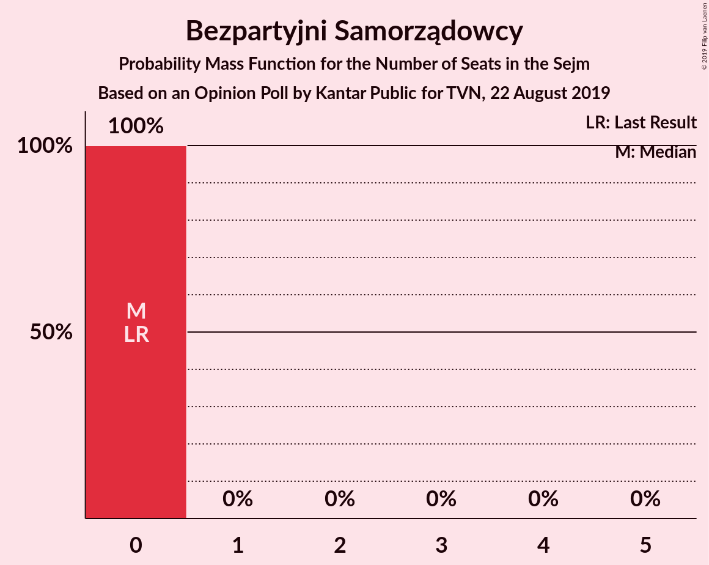

| Number of Seats | Probability | Accumulated | Special Marks |
|:---------------:|:-----------:|:-----------:|:-------------:|
| 0 | 100% | 100% | Last Result, Median |

## Coalitions

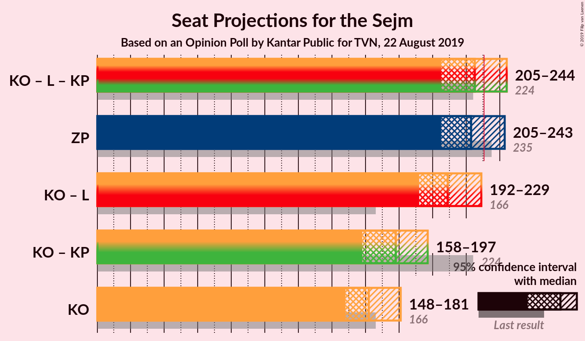

### Confidence Intervals

| Coalition | Last Result | Median | Majority? | 80% Confidence Interval | 90% Confidence Interval | 95% Confidence Interval | 99% Confidence Interval |
|:---------:|:-----------:|:------:|:---------:|:-----------------------:|:-----------------------:|:-----------------------:|:-----------------------:|
| Koalicja Obywatelska – Lewica – Koalicja Polska | 224 | 225 | 26% | 212–237 | 208–241 | 205–244 | 198–250 |
| Zjednoczona Prawica | 235 | 223 | 23% | 212–236 | 208–240 | 205–243 | 199–248 |
| Koalicja Obywatelska – Lewica | 166 | 209 | 2% | 197–222 | 194–226 | 192–229 | 187–235 |
| Koalicja Obywatelska – Koalicja Polska | 224 | 178 | 0% | 164–190 | 162–194 | 158–197 | 152–203 |
| Koalicja Obywatelska | 166 | 162 | 0% | 152–174 | 150–178 | 148–181 | 143–186 |

### Koalicja Obywatelska – Lewica – Koalicja Polska

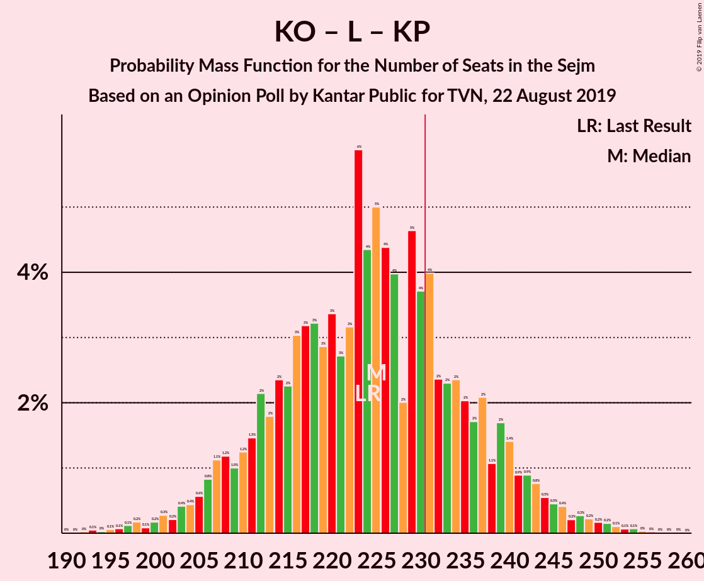

| Number of Seats | Probability | Accumulated | Special Marks |
|:---------------:|:-----------:|:-----------:|:-------------:|
| 192 | 0% | 100% |  |
| 193 | 0.1% | 99.9% |  |
| 194 | 0% | 99.9% |  |
| 195 | 0.1% | 99.9% |  |
| 196 | 0.1% | 99.8% |  |
| 197 | 0.1% | 99.7% |  |
| 198 | 0.2% | 99.6% |  |
| 199 | 0.1% | 99.4% |  |
| 200 | 0.2% | 99.3% |  |
| 201 | 0.3% | 99.2% |  |
| 202 | 0.2% | 98.9% |  |
| 203 | 0.4% | 98.7% |  |
| 204 | 0.4% | 98% |  |
| 205 | 0.6% | 98% |  |
| 206 | 0.8% | 97% |  |
| 207 | 1.1% | 96% |  |
| 208 | 1.2% | 95% |  |
| 209 | 1.0% | 94% |  |
| 210 | 1.2% | 93% |  |
| 211 | 1.5% | 92% |  |
| 212 | 2% | 90% |  |
| 213 | 2% | 88% |  |
| 214 | 2% | 86% |  |
| 215 | 2% | 84% |  |
| 216 | 3% | 82% |  |
| 217 | 3% | 79% |  |
| 218 | 3% | 76% |  |
| 219 | 3% | 72% |  |
| 220 | 3% | 70% |  |
| 221 | 3% | 66% |  |
| 222 | 3% | 63% | Median |
| 223 | 6% | 60% |  |
| 224 | 4% | 54% | Last Result |
| 225 | 5% | 50% |  |
| 226 | 4% | 45% |  |
| 227 | 4% | 41% |  |
| 228 | 2% | 37% |  |
| 229 | 5% | 35% |  |
| 230 | 4% | 30% |  |
| 231 | 4% | 26% | Majority |
| 232 | 2% | 22% |  |
| 233 | 2% | 20% |  |
| 234 | 2% | 18% |  |
| 235 | 2% | 15% |  |
| 236 | 2% | 13% |  |
| 237 | 2% | 12% |  |
| 238 | 1.1% | 10% |  |
| 239 | 2% | 8% |  |
| 240 | 1.4% | 7% |  |
| 241 | 0.9% | 5% |  |
| 242 | 0.9% | 4% |  |
| 243 | 0.8% | 4% |  |
| 244 | 0.5% | 3% |  |
| 245 | 0.5% | 2% |  |
| 246 | 0.4% | 2% |  |
| 247 | 0.2% | 1.4% |  |
| 248 | 0.3% | 1.2% |  |
| 249 | 0.2% | 0.9% |  |
| 250 | 0.2% | 0.7% |  |
| 251 | 0.2% | 0.5% |  |
| 252 | 0.1% | 0.3% |  |
| 253 | 0.1% | 0.2% |  |
| 254 | 0.1% | 0.2% |  |
| 255 | 0% | 0.1% |  |
| 256 | 0% | 0.1% |  |
| 257 | 0% | 0.1% |  |
| 258 | 0% | 0% |  |

### Zjednoczona Prawica

| Number of Seats | Probability | Accumulated | Special Marks |
|:---------------:|:-----------:|:-----------:|:-------------:|
| 193 | 0% | 100% |  |
| 194 | 0% | 99.9% |  |
| 195 | 0.1% | 99.9% |  |
| 196 | 0% | 99.9% |  |
| 197 | 0.1% | 99.8% |  |
| 198 | 0.1% | 99.7% |  |
| 199 | 0.2% | 99.6% |  |
| 200 | 0.3% | 99.4% |  |
| 201 | 0.4% | 99.1% |  |
| 202 | 0.4% | 98.7% |  |
| 203 | 0.3% | 98% |  |
| 204 | 0.5% | 98% |  |
| 205 | 0.5% | 98% |  |
| 206 | 0.8% | 97% |  |
| 207 | 0.8% | 96% |  |
| 208 | 0.7% | 96% |  |
| 209 | 1.4% | 95% |  |
| 210 | 1.2% | 93% |  |
| 211 | 1.4% | 92% |  |
| 212 | 2% | 91% |  |
| 213 | 2% | 89% |  |
| 214 | 2% | 87% |  |
| 215 | 3% | 85% |  |
| 216 | 3% | 82% |  |
| 217 | 3% | 79% |  |
| 218 | 3% | 76% |  |
| 219 | 5% | 72% |  |
| 220 | 4% | 67% |  |
| 221 | 5% | 64% |  |
| 222 | 5% | 59% |  |
| 223 | 6% | 54% | Median |
| 224 | 5% | 48% |  |
| 225 | 4% | 43% |  |
| 226 | 3% | 39% |  |
| 227 | 3% | 36% |  |
| 228 | 4% | 33% |  |
| 229 | 4% | 30% |  |
| 230 | 3% | 26% |  |
| 231 | 3% | 23% | Majority |
| 232 | 2% | 21% |  |
| 233 | 2% | 18% |  |
| 234 | 2% | 16% |  |
| 235 | 2% | 14% | Last Result |
| 236 | 3% | 13% |  |
| 237 | 1.0% | 10% |  |
| 238 | 1.4% | 9% |  |
| 239 | 2% | 7% |  |
| 240 | 1.3% | 6% |  |
| 241 | 1.1% | 5% |  |
| 242 | 0.9% | 3% |  |
| 243 | 0.7% | 3% |  |
| 244 | 0.5% | 2% |  |
| 245 | 0.4% | 1.4% |  |
| 246 | 0.2% | 1.0% |  |
| 247 | 0.2% | 0.7% |  |
| 248 | 0.2% | 0.5% |  |
| 249 | 0.1% | 0.4% |  |
| 250 | 0.1% | 0.3% |  |
| 251 | 0.1% | 0.2% |  |
| 252 | 0% | 0.1% |  |
| 253 | 0% | 0.1% |  |
| 254 | 0% | 0.1% |  |
| 255 | 0% | 0.1% |  |
| 256 | 0% | 0% |  |

### Koalicja Obywatelska – Lewica

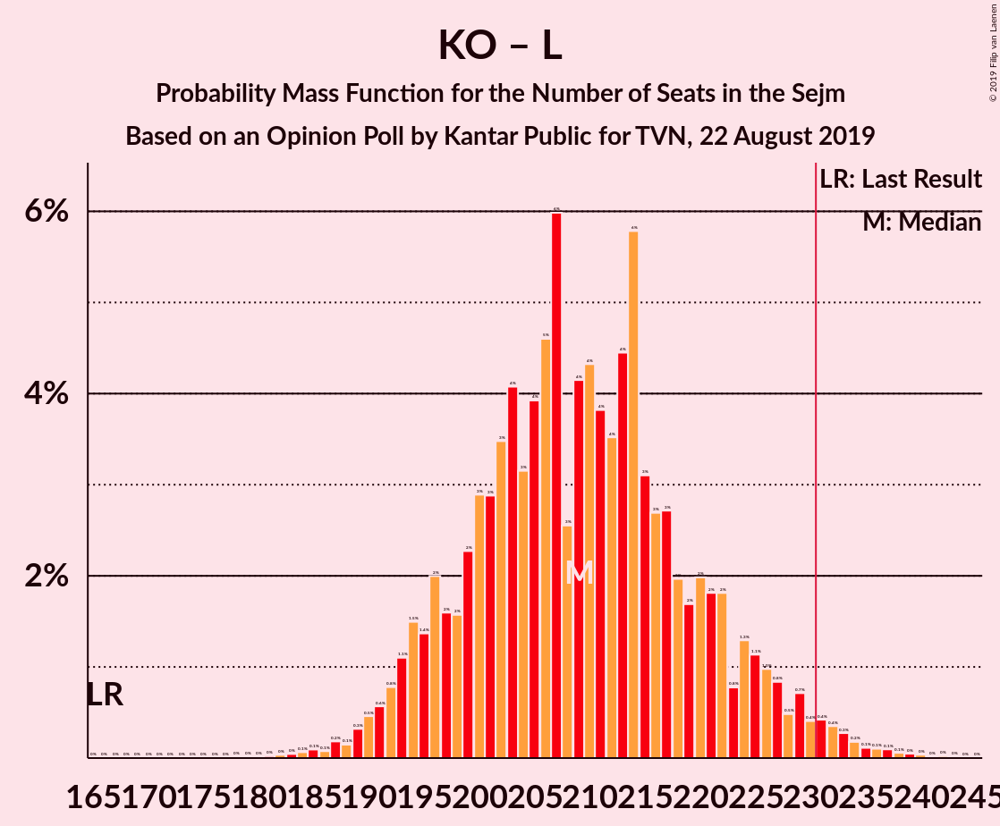

| Number of Seats | Probability | Accumulated | Special Marks |
|:---------------:|:-----------:|:-----------:|:-------------:|
| 166 | 0% | 100% | Last Result |
| 167 | 0% | 100% |  |
| 168 | 0% | 100% |  |
| 169 | 0% | 100% |  |
| 170 | 0% | 100% |  |
| 171 | 0% | 100% |  |
| 172 | 0% | 100% |  |
| 173 | 0% | 100% |  |
| 174 | 0% | 100% |  |
| 175 | 0% | 100% |  |
| 176 | 0% | 100% |  |
| 177 | 0% | 100% |  |
| 178 | 0% | 100% |  |
| 179 | 0% | 100% |  |
| 180 | 0% | 100% |  |
| 181 | 0% | 99.9% |  |
| 182 | 0% | 99.9% |  |
| 183 | 0% | 99.9% |  |
| 184 | 0.1% | 99.8% |  |
| 185 | 0.1% | 99.8% |  |
| 186 | 0.1% | 99.7% |  |
| 187 | 0.2% | 99.6% |  |
| 188 | 0.1% | 99.4% |  |
| 189 | 0.3% | 99.3% |  |
| 190 | 0.5% | 98.9% |  |
| 191 | 0.6% | 98% |  |
| 192 | 0.8% | 98% |  |
| 193 | 1.1% | 97% |  |
| 194 | 1.5% | 96% |  |
| 195 | 1.4% | 95% |  |
| 196 | 2% | 93% |  |
| 197 | 2% | 91% |  |
| 198 | 2% | 90% |  |
| 199 | 2% | 88% |  |
| 200 | 3% | 86% |  |
| 201 | 3% | 83% |  |
| 202 | 3% | 80% |  |
| 203 | 4% | 76% |  |
| 204 | 3% | 72% |  |
| 205 | 4% | 69% |  |
| 206 | 5% | 65% |  |
| 207 | 6% | 61% |  |
| 208 | 3% | 55% | Median |
| 209 | 4% | 52% |  |
| 210 | 4% | 48% |  |
| 211 | 4% | 44% |  |
| 212 | 4% | 40% |  |
| 213 | 4% | 36% |  |
| 214 | 6% | 32% |  |
| 215 | 3% | 26% |  |
| 216 | 3% | 23% |  |
| 217 | 3% | 20% |  |
| 218 | 2% | 18% |  |
| 219 | 2% | 16% |  |
| 220 | 2% | 14% |  |
| 221 | 2% | 12% |  |
| 222 | 2% | 10% |  |
| 223 | 0.8% | 8% |  |
| 224 | 1.3% | 8% |  |
| 225 | 1.1% | 6% |  |
| 226 | 1.0% | 5% |  |
| 227 | 0.8% | 4% |  |
| 228 | 0.5% | 3% |  |
| 229 | 0.7% | 3% |  |
| 230 | 0.4% | 2% |  |
| 231 | 0.4% | 2% | Majority |
| 232 | 0.4% | 1.3% |  |
| 233 | 0.3% | 1.0% |  |
| 234 | 0.2% | 0.7% |  |
| 235 | 0.1% | 0.5% |  |
| 236 | 0.1% | 0.4% |  |
| 237 | 0.1% | 0.3% |  |
| 238 | 0.1% | 0.2% |  |
| 239 | 0% | 0.2% |  |
| 240 | 0% | 0.1% |  |
| 241 | 0% | 0.1% |  |
| 242 | 0% | 0.1% |  |
| 243 | 0% | 0% |  |

### Koalicja Obywatelska – Koalicja Polska

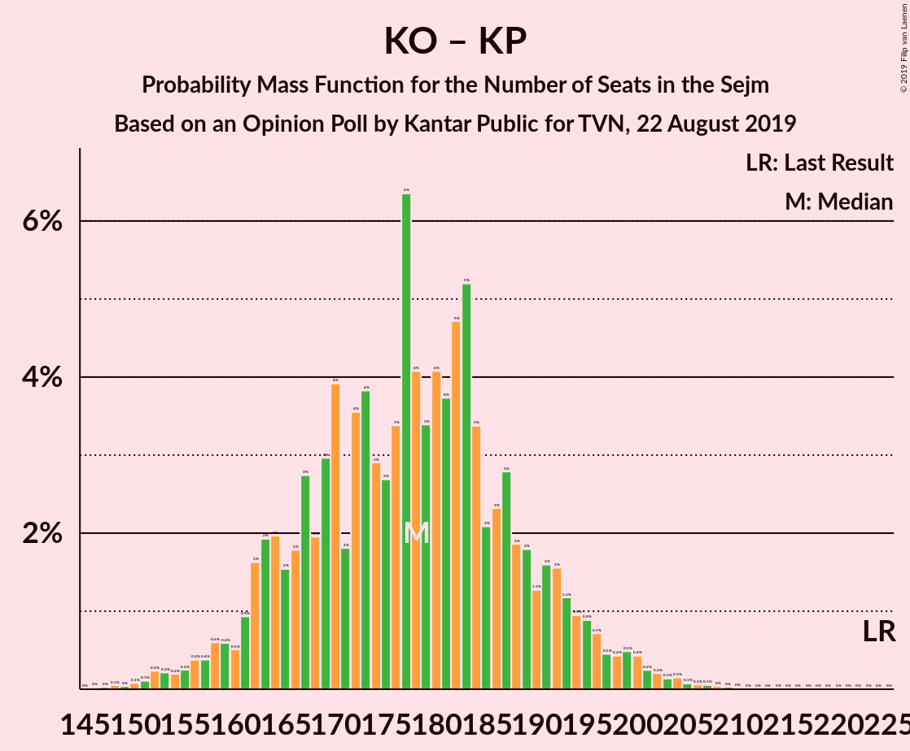

| Number of Seats | Probability | Accumulated | Special Marks |
|:---------------:|:-----------:|:-----------:|:-------------:|
| 146 | 0% | 100% |  |
| 147 | 0% | 99.9% |  |
| 148 | 0.1% | 99.9% |  |
| 149 | 0% | 99.9% |  |
| 150 | 0.1% | 99.8% |  |
| 151 | 0.1% | 99.7% |  |
| 152 | 0.2% | 99.6% |  |
| 153 | 0.2% | 99.4% |  |
| 154 | 0.2% | 99.2% |  |
| 155 | 0.2% | 99.0% |  |
| 156 | 0.4% | 98.7% |  |
| 157 | 0.4% | 98% |  |
| 158 | 0.6% | 98% |  |
| 159 | 0.6% | 97% |  |
| 160 | 0.5% | 97% |  |
| 161 | 0.9% | 96% |  |
| 162 | 2% | 95% |  |
| 163 | 2% | 94% |  |
| 164 | 2% | 92% |  |
| 165 | 2% | 90% |  |
| 166 | 2% | 88% |  |
| 167 | 3% | 87% |  |
| 168 | 2% | 84% |  |
| 169 | 3% | 82% |  |
| 170 | 4% | 79% |  |
| 171 | 2% | 75% |  |
| 172 | 4% | 73% |  |
| 173 | 4% | 70% |  |
| 174 | 3% | 66% |  |
| 175 | 3% | 63% |  |
| 176 | 3% | 60% | Median |
| 177 | 6% | 57% |  |
| 178 | 4% | 50% |  |
| 179 | 3% | 46% |  |
| 180 | 4% | 43% |  |
| 181 | 4% | 39% |  |
| 182 | 5% | 35% |  |
| 183 | 5% | 30% |  |
| 184 | 3% | 25% |  |
| 185 | 2% | 22% |  |
| 186 | 2% | 20% |  |
| 187 | 3% | 17% |  |
| 188 | 2% | 15% |  |
| 189 | 2% | 13% |  |
| 190 | 1.3% | 11% |  |
| 191 | 2% | 10% |  |
| 192 | 2% | 8% |  |
| 193 | 1.2% | 7% |  |
| 194 | 0.9% | 5% |  |
| 195 | 0.9% | 4% |  |
| 196 | 0.7% | 4% |  |
| 197 | 0.5% | 3% |  |
| 198 | 0.4% | 2% |  |
| 199 | 0.5% | 2% |  |
| 200 | 0.4% | 1.5% |  |
| 201 | 0.2% | 1.0% |  |
| 202 | 0.2% | 0.8% |  |
| 203 | 0.1% | 0.6% |  |
| 204 | 0.1% | 0.5% |  |
| 205 | 0.1% | 0.3% |  |
| 206 | 0.1% | 0.2% |  |
| 207 | 0.1% | 0.2% |  |
| 208 | 0% | 0.1% |  |
| 209 | 0% | 0.1% |  |
| 210 | 0% | 0% |  |
| 211 | 0% | 0% |  |
| 212 | 0% | 0% |  |
| 213 | 0% | 0% |  |
| 214 | 0% | 0% |  |
| 215 | 0% | 0% |  |
| 216 | 0% | 0% |  |
| 217 | 0% | 0% |  |
| 218 | 0% | 0% |  |
| 219 | 0% | 0% |  |
| 220 | 0% | 0% |  |
| 221 | 0% | 0% |  |
| 222 | 0% | 0% |  |
| 223 | 0% | 0% |  |
| 224 | 0% | 0% | Last Result |

### Koalicja Obywatelska

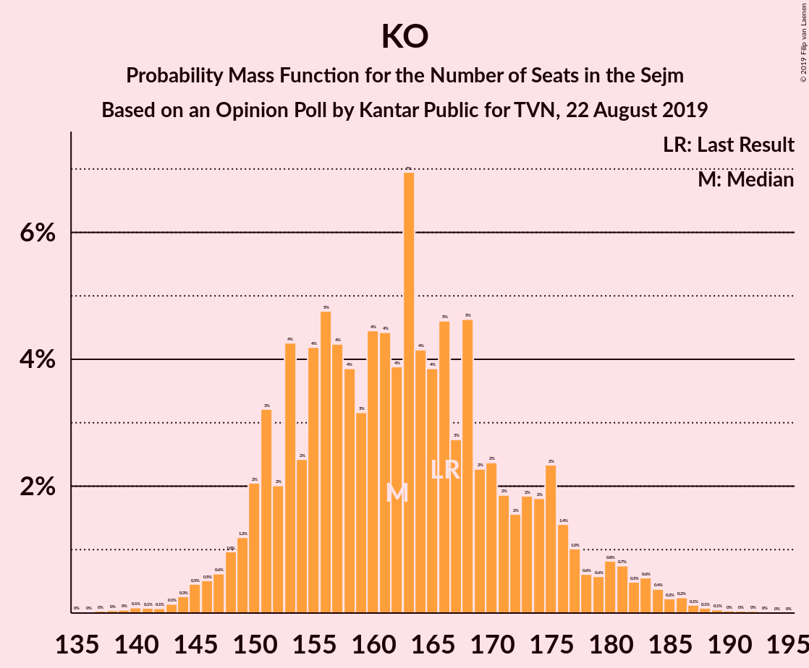

| Number of Seats | Probability | Accumulated | Special Marks |
|:---------------:|:-----------:|:-----------:|:-------------:|
| 135 | 0% | 100% |  |
| 136 | 0% | 99.9% |  |
| 137 | 0% | 99.9% |  |
| 138 | 0% | 99.9% |  |
| 139 | 0% | 99.9% |  |
| 140 | 0.1% | 99.8% |  |
| 141 | 0.1% | 99.7% |  |
| 142 | 0.1% | 99.6% |  |
| 143 | 0.1% | 99.6% |  |
| 144 | 0.3% | 99.4% |  |
| 145 | 0.5% | 99.2% |  |
| 146 | 0.5% | 98.7% |  |
| 147 | 0.6% | 98% |  |
| 148 | 1.0% | 98% |  |
| 149 | 1.2% | 97% |  |
| 150 | 2% | 95% |  |
| 151 | 3% | 93% |  |
| 152 | 2% | 90% |  |
| 153 | 4% | 88% |  |
| 154 | 2% | 84% |  |
| 155 | 4% | 81% |  |
| 156 | 5% | 77% |  |
| 157 | 4% | 72% |  |
| 158 | 4% | 68% |  |
| 159 | 3% | 64% |  |
| 160 | 4% | 61% |  |
| 161 | 4% | 57% |  |
| 162 | 4% | 52% | Median |
| 163 | 7% | 48% |  |
| 164 | 4% | 42% |  |
| 165 | 4% | 37% |  |
| 166 | 5% | 34% | Last Result |
| 167 | 3% | 29% |  |
| 168 | 5% | 26% |  |
| 169 | 2% | 22% |  |
| 170 | 2% | 19% |  |
| 171 | 2% | 17% |  |
| 172 | 2% | 15% |  |
| 173 | 2% | 13% |  |
| 174 | 2% | 12% |  |
| 175 | 2% | 10% |  |
| 176 | 1.4% | 7% |  |
| 177 | 1.0% | 6% |  |
| 178 | 0.6% | 5% |  |
| 179 | 0.6% | 4% |  |
| 180 | 0.8% | 4% |  |
| 181 | 0.7% | 3% |  |
| 182 | 0.5% | 2% |  |
| 183 | 0.6% | 2% |  |
| 184 | 0.4% | 1.3% |  |
| 185 | 0.2% | 0.9% |  |
| 186 | 0.2% | 0.7% |  |
| 187 | 0.1% | 0.4% |  |
| 188 | 0.1% | 0.3% |  |
| 189 | 0.1% | 0.2% |  |
| 190 | 0% | 0.2% |  |
| 191 | 0% | 0.1% |  |
| 192 | 0% | 0.1% |  |
| 193 | 0% | 0.1% |  |
| 194 | 0% | 0% |  |

## Technical Information

### Opinion Poll

+ **Polling firm:** Kantar Public
+ **Commissioner(s):** TVN
+ **Fieldwork period:** 22 August 2019

### Calculations

+ **Sample size:** 1012
+ **Simulations done:** 1,048,576
+ **Error estimate:** 0.88%

