# Opinion Poll by CBOS, 22–29 August 2019

<a href="#voting-intentions">Voting Intentions</a> | <a href="#seats">Seats</a> | <a href="#coalitions">Coalitions</a> | <a href="#technical-information">Technical Information</a>

## Voting Intentions

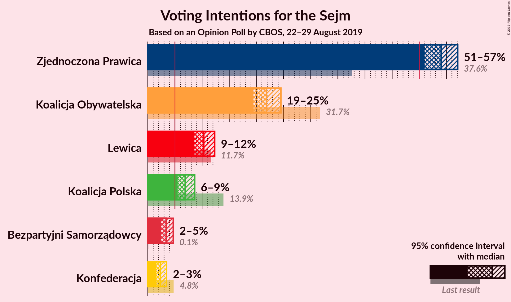

### Confidence Intervals

| Party | Last Result | Poll Result | 80% Confidence Interval | 90% Confidence Interval | 95% Confidence Interval | 99% Confidence Interval |
|:-----:|:-----------:|:-----------:|:-----------------------:|:-----------------------:|:-----------------------:|:-----------------------:|
| Zjednoczona Prawica | 37.6% | 54.0% | 52.0–56.0% |51.5–56.6% |51.0–57.1% |50.0–58.0% |
| Koalicja Obywatelska | 31.7% | 21.9% | 20.3–23.6% |19.8–24.1% |19.4–24.5% |18.7–25.3% |
| Lewica | 11.7% | 10.3% | 9.2–11.6% |8.9–12.0% |8.6–12.3% |8.1–13.0% |
| Koalicja Polska | 13.9% | 6.9% | 6.0–8.0% |5.7–8.3% |5.5–8.6% |5.1–9.2% |
| Bezpartyjni Samorządowcy | 0.1% | 3.4% | 2.8–4.3% |2.6–4.5% |2.5–4.7% |2.2–5.1% |
| Konfederacja | 4.8% | 2.3% | 1.8–3.1% |1.7–3.3% |1.6–3.5% |1.4–3.8% |

*Note:* The poll result column reflects the actual value used in the calculations. Published results may vary slightly, and in addition be rounded to fewer digits.

## Seats

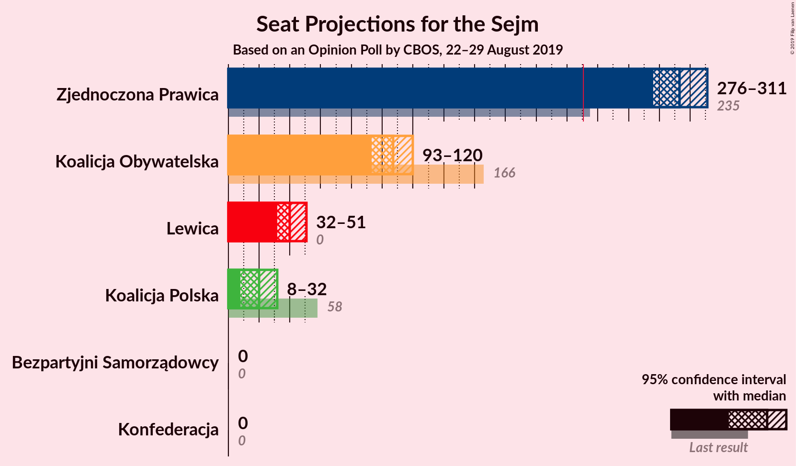

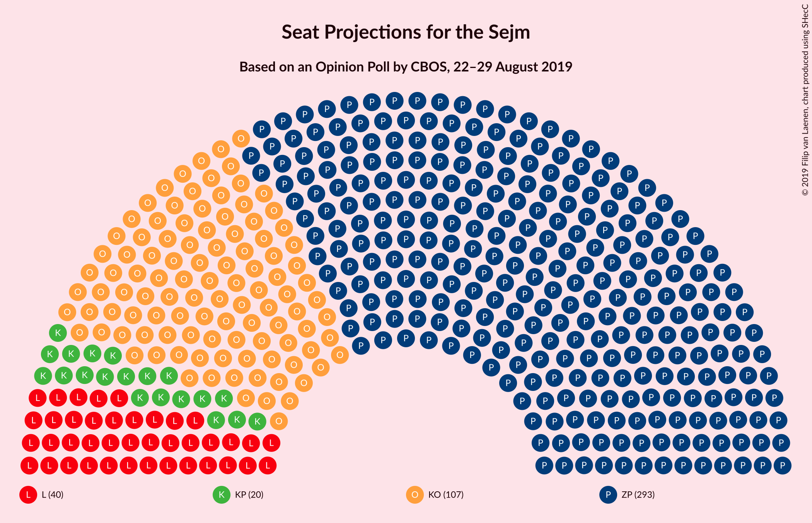

### Confidence Intervals

| Party | Last Result | Median | 80% Confidence Interval | 90% Confidence Interval | 95% Confidence Interval | 99% Confidence Interval |
|:-----:|:-----------:|:------:|:-----------------------:|:-----------------------:|:-----------------------:|:-----------------------:|
| <a href="#zjednoczona-prawica">Zjednoczona Prawica</a> | 235 | 293 | 282–306 |279–309 |276–311 |271–316 |
| <a href="#koalicja-obywatelska">Koalicja Obywatelska</a> | 166 | 107 | 97–116 |95–118 |93–120 |91–127 |
| <a href="#lewica">Lewica</a> | 0 | 40 | 33–46 |32–48 |32–51 |29–57 |
| <a href="#koalicja-polska">Koalicja Polska</a> | 58 | 20 | 11–27 |9–30 |8–32 |6–36 |
| <a href="#bezpartyjni-samorządowcy">Bezpartyjni Samorządowcy</a> | 0 | 0 | 0 |0 |0 |0–23 |
| <a href="#konfederacja">Konfederacja</a> | 0 | 0 | 0 |0 |0 |0 |

### Zjednoczona Prawica

*For a full overview of the results for this party, see the [Zjednoczona Prawica](party-zjednoczonaprawica.html) page.*

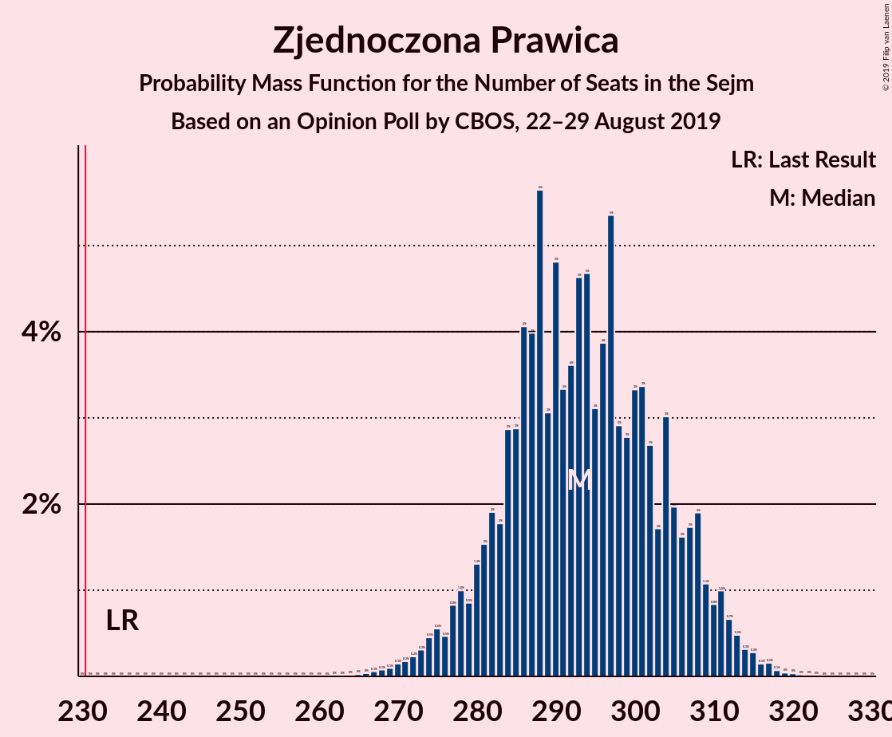

| Number of Seats | Probability | Accumulated | Special Marks |
|:---------------:|:-----------:|:-----------:|:-------------:|
| 235 | 0% | 100% | Last Result |
| 236 | 0% | 100% |  |
| 237 | 0% | 100% |  |
| 238 | 0% | 100% |  |
| 239 | 0% | 100% |  |
| 240 | 0% | 100% |  |
| 241 | 0% | 100% |  |
| 242 | 0% | 100% |  |
| 243 | 0% | 100% |  |
| 244 | 0% | 100% |  |
| 245 | 0% | 100% |  |
| 246 | 0% | 100% |  |
| 247 | 0% | 100% |  |
| 248 | 0% | 100% |  |
| 249 | 0% | 100% |  |
| 250 | 0% | 100% |  |
| 251 | 0% | 100% |  |
| 252 | 0% | 100% |  |
| 253 | 0% | 100% |  |
| 254 | 0% | 100% |  |
| 255 | 0% | 100% |  |
| 256 | 0% | 100% |  |
| 257 | 0% | 100% |  |
| 258 | 0% | 100% |  |
| 259 | 0% | 100% |  |
| 260 | 0% | 100% |  |
| 261 | 0% | 100% |  |
| 262 | 0% | 100% |  |
| 263 | 0% | 100% |  |
| 264 | 0% | 100% |  |
| 265 | 0% | 99.9% |  |
| 266 | 0% | 99.9% |  |
| 267 | 0.1% | 99.9% |  |
| 268 | 0.1% | 99.8% |  |
| 269 | 0.1% | 99.7% |  |
| 270 | 0.1% | 99.6% |  |
| 271 | 0.2% | 99.5% |  |
| 272 | 0.2% | 99.3% |  |
| 273 | 0.3% | 99.1% |  |
| 274 | 0.5% | 98.8% |  |
| 275 | 0.6% | 98% |  |
| 276 | 0.5% | 98% |  |
| 277 | 0.8% | 97% |  |
| 278 | 1.0% | 96% |  |
| 279 | 0.9% | 95% |  |
| 280 | 1.3% | 95% |  |
| 281 | 2% | 93% |  |
| 282 | 2% | 92% |  |
| 283 | 2% | 90% |  |
| 284 | 3% | 88% |  |
| 285 | 3% | 85% |  |
| 286 | 4% | 82% |  |
| 287 | 4% | 78% |  |
| 288 | 6% | 74% |  |
| 289 | 3% | 69% |  |
| 290 | 5% | 66% |  |
| 291 | 3% | 61% |  |
| 292 | 4% | 57% |  |
| 293 | 5% | 54% | Median |
| 294 | 5% | 49% |  |
| 295 | 3% | 45% |  |
| 296 | 4% | 41% |  |
| 297 | 5% | 38% |  |
| 298 | 3% | 32% |  |
| 299 | 3% | 29% |  |
| 300 | 3% | 27% |  |
| 301 | 3% | 23% |  |
| 302 | 3% | 20% |  |
| 303 | 2% | 17% |  |
| 304 | 3% | 15% |  |
| 305 | 2% | 12% |  |
| 306 | 2% | 10% |  |
| 307 | 2% | 9% |  |
| 308 | 2% | 7% |  |
| 309 | 1.1% | 5% |  |
| 310 | 0.8% | 4% |  |
| 311 | 1.0% | 3% |  |
| 312 | 0.7% | 2% |  |
| 313 | 0.5% | 2% |  |
| 314 | 0.3% | 1.1% |  |
| 315 | 0.3% | 0.8% |  |
| 316 | 0.1% | 0.5% |  |
| 317 | 0.2% | 0.4% |  |
| 318 | 0.1% | 0.2% |  |
| 319 | 0% | 0.1% |  |
| 320 | 0% | 0.1% |  |
| 321 | 0% | 0.1% |  |
| 322 | 0% | 0% |  |

### Koalicja Obywatelska

*For a full overview of the results for this party, see the [Koalicja Obywatelska](party-koalicjaobywatelska.html) page.*

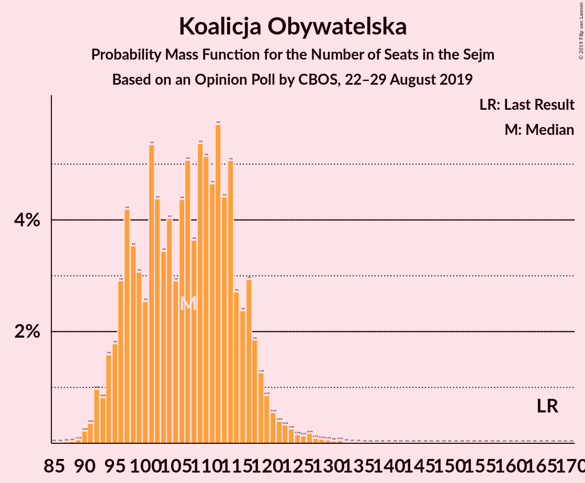

| Number of Seats | Probability | Accumulated | Special Marks |
|:---------------:|:-----------:|:-----------:|:-------------:|
| 86 | 0% | 100% |  |
| 87 | 0% | 99.9% |  |
| 88 | 0% | 99.9% |  |
| 89 | 0.1% | 99.9% |  |
| 90 | 0.2% | 99.8% |  |
| 91 | 0.4% | 99.6% |  |
| 92 | 1.0% | 99.2% |  |
| 93 | 0.8% | 98% |  |
| 94 | 2% | 97% |  |
| 95 | 2% | 96% |  |
| 96 | 3% | 94% |  |
| 97 | 4% | 91% |  |
| 98 | 4% | 87% |  |
| 99 | 3% | 83% |  |
| 100 | 3% | 80% |  |
| 101 | 5% | 78% |  |
| 102 | 4% | 73% |  |
| 103 | 3% | 68% |  |
| 104 | 4% | 65% |  |
| 105 | 3% | 61% |  |
| 106 | 4% | 58% |  |
| 107 | 5% | 53% | Median |
| 108 | 4% | 48% |  |
| 109 | 5% | 45% |  |
| 110 | 5% | 39% |  |
| 111 | 5% | 34% |  |
| 112 | 6% | 30% |  |
| 113 | 4% | 24% |  |
| 114 | 5% | 19% |  |
| 115 | 3% | 14% |  |
| 116 | 2% | 12% |  |
| 117 | 3% | 9% |  |
| 118 | 2% | 6% |  |
| 119 | 1.3% | 4% |  |
| 120 | 0.9% | 3% |  |
| 121 | 0.5% | 2% |  |
| 122 | 0.4% | 2% |  |
| 123 | 0.3% | 1.4% |  |
| 124 | 0.3% | 1.1% |  |
| 125 | 0.2% | 0.8% |  |
| 126 | 0.1% | 0.7% |  |
| 127 | 0.2% | 0.6% |  |
| 128 | 0.1% | 0.4% |  |
| 129 | 0.1% | 0.3% |  |
| 130 | 0.1% | 0.2% |  |
| 131 | 0% | 0.2% |  |
| 132 | 0.1% | 0.1% |  |
| 133 | 0% | 0.1% |  |
| 134 | 0% | 0% |  |
| 135 | 0% | 0% |  |
| 136 | 0% | 0% |  |
| 137 | 0% | 0% |  |
| 138 | 0% | 0% |  |
| 139 | 0% | 0% |  |
| 140 | 0% | 0% |  |
| 141 | 0% | 0% |  |
| 142 | 0% | 0% |  |
| 143 | 0% | 0% |  |
| 144 | 0% | 0% |  |
| 145 | 0% | 0% |  |
| 146 | 0% | 0% |  |
| 147 | 0% | 0% |  |
| 148 | 0% | 0% |  |
| 149 | 0% | 0% |  |
| 150 | 0% | 0% |  |
| 151 | 0% | 0% |  |
| 152 | 0% | 0% |  |
| 153 | 0% | 0% |  |
| 154 | 0% | 0% |  |
| 155 | 0% | 0% |  |
| 156 | 0% | 0% |  |
| 157 | 0% | 0% |  |
| 158 | 0% | 0% |  |
| 159 | 0% | 0% |  |
| 160 | 0% | 0% |  |
| 161 | 0% | 0% |  |
| 162 | 0% | 0% |  |
| 163 | 0% | 0% |  |
| 164 | 0% | 0% |  |
| 165 | 0% | 0% |  |
| 166 | 0% | 0% | Last Result |

### Lewica

*For a full overview of the results for this party, see the [Lewica](party-lewica.html) page.*

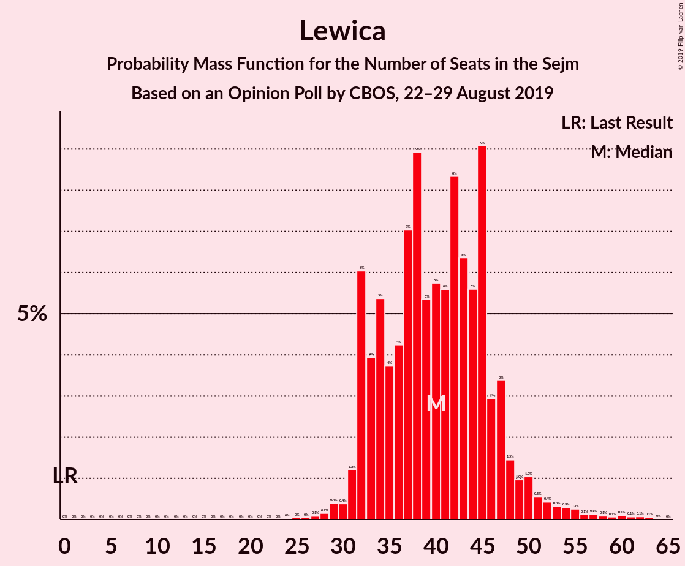

| Number of Seats | Probability | Accumulated | Special Marks |
|:---------------:|:-----------:|:-----------:|:-------------:|
| 0 | 0% | 100% | Last Result |
| 1 | 0% | 100% |  |
| 2 | 0% | 100% |  |
| 3 | 0% | 100% |  |
| 4 | 0% | 100% |  |
| 5 | 0% | 100% |  |
| 6 | 0% | 100% |  |
| 7 | 0% | 100% |  |
| 8 | 0% | 100% |  |
| 9 | 0% | 100% |  |
| 10 | 0% | 100% |  |
| 11 | 0% | 100% |  |
| 12 | 0% | 100% |  |
| 13 | 0% | 100% |  |
| 14 | 0% | 100% |  |
| 15 | 0% | 100% |  |
| 16 | 0% | 100% |  |
| 17 | 0% | 100% |  |
| 18 | 0% | 100% |  |
| 19 | 0% | 100% |  |
| 20 | 0% | 100% |  |
| 21 | 0% | 100% |  |
| 22 | 0% | 100% |  |
| 23 | 0% | 100% |  |
| 24 | 0% | 100% |  |
| 25 | 0% | 100% |  |
| 26 | 0% | 99.9% |  |
| 27 | 0.1% | 99.9% |  |
| 28 | 0.2% | 99.8% |  |
| 29 | 0.4% | 99.6% |  |
| 30 | 0.4% | 99.3% |  |
| 31 | 1.2% | 98.9% |  |
| 32 | 6% | 98% |  |
| 33 | 4% | 92% |  |
| 34 | 5% | 88% |  |
| 35 | 4% | 82% |  |
| 36 | 4% | 79% |  |
| 37 | 7% | 74% |  |
| 38 | 9% | 67% |  |
| 39 | 5% | 58% |  |
| 40 | 6% | 53% | Median |
| 41 | 6% | 47% |  |
| 42 | 8% | 42% |  |
| 43 | 6% | 33% |  |
| 44 | 6% | 27% |  |
| 45 | 9% | 21% |  |
| 46 | 3% | 12% |  |
| 47 | 3% | 9% |  |
| 48 | 1.5% | 6% |  |
| 49 | 1.0% | 5% |  |
| 50 | 1.0% | 4% |  |
| 51 | 0.5% | 3% |  |
| 52 | 0.4% | 2% |  |
| 53 | 0.3% | 2% |  |
| 54 | 0.3% | 1.3% |  |
| 55 | 0.3% | 1.0% |  |
| 56 | 0.1% | 0.7% |  |
| 57 | 0.1% | 0.6% |  |
| 58 | 0.1% | 0.5% |  |
| 59 | 0.1% | 0.4% |  |
| 60 | 0.1% | 0.3% |  |
| 61 | 0.1% | 0.2% |  |
| 62 | 0.1% | 0.1% |  |
| 63 | 0.1% | 0.1% |  |
| 64 | 0% | 0% |  |

### Koalicja Polska

*For a full overview of the results for this party, see the [Koalicja Polska](party-koalicjapolska.html) page.*

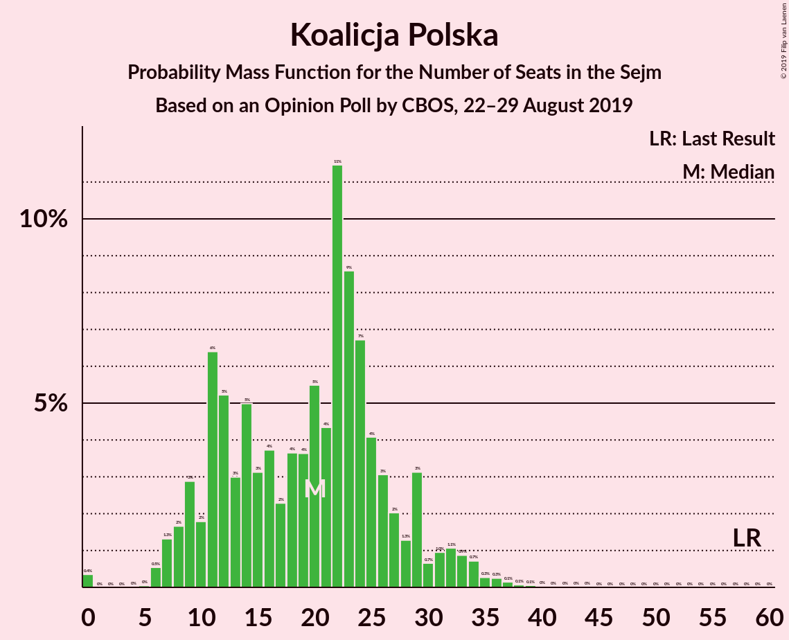

| Number of Seats | Probability | Accumulated | Special Marks |
|:---------------:|:-----------:|:-----------:|:-------------:|
| 0 | 0.4% | 100% |  |
| 1 | 0% | 99.6% |  |
| 2 | 0% | 99.6% |  |
| 3 | 0% | 99.6% |  |
| 4 | 0% | 99.6% |  |
| 5 | 0% | 99.6% |  |
| 6 | 0.5% | 99.6% |  |
| 7 | 1.3% | 99.0% |  |
| 8 | 2% | 98% |  |
| 9 | 3% | 96% |  |
| 10 | 2% | 93% |  |
| 11 | 6% | 91% |  |
| 12 | 5% | 85% |  |
| 13 | 3% | 80% |  |
| 14 | 5% | 77% |  |
| 15 | 3% | 72% |  |
| 16 | 4% | 69% |  |
| 17 | 2% | 65% |  |
| 18 | 4% | 63% |  |
| 19 | 4% | 59% |  |
| 20 | 5% | 55% | Median |
| 21 | 4% | 50% |  |
| 22 | 11% | 46% |  |
| 23 | 9% | 34% |  |
| 24 | 7% | 25% |  |
| 25 | 4% | 19% |  |
| 26 | 3% | 15% |  |
| 27 | 2% | 12% |  |
| 28 | 1.3% | 10% |  |
| 29 | 3% | 8% |  |
| 30 | 0.7% | 5% |  |
| 31 | 1.0% | 4% |  |
| 32 | 1.1% | 4% |  |
| 33 | 0.9% | 2% |  |
| 34 | 0.7% | 2% |  |
| 35 | 0.3% | 0.9% |  |
| 36 | 0.3% | 0.6% |  |
| 37 | 0.1% | 0.3% |  |
| 38 | 0.1% | 0.2% |  |
| 39 | 0.1% | 0.1% |  |
| 40 | 0% | 0.1% |  |
| 41 | 0% | 0% |  |
| 42 | 0% | 0% |  |
| 43 | 0% | 0% |  |
| 44 | 0% | 0% |  |
| 45 | 0% | 0% |  |
| 46 | 0% | 0% |  |
| 47 | 0% | 0% |  |
| 48 | 0% | 0% |  |
| 49 | 0% | 0% |  |
| 50 | 0% | 0% |  |
| 51 | 0% | 0% |  |
| 52 | 0% | 0% |  |
| 53 | 0% | 0% |  |
| 54 | 0% | 0% |  |
| 55 | 0% | 0% |  |
| 56 | 0% | 0% |  |
| 57 | 0% | 0% |  |
| 58 | 0% | 0% | Last Result |

### Bezpartyjni Samorządowcy

*For a full overview of the results for this party, see the [Bezpartyjni Samorządowcy](party-bezpartyjnisamorządowcy.html) page.*

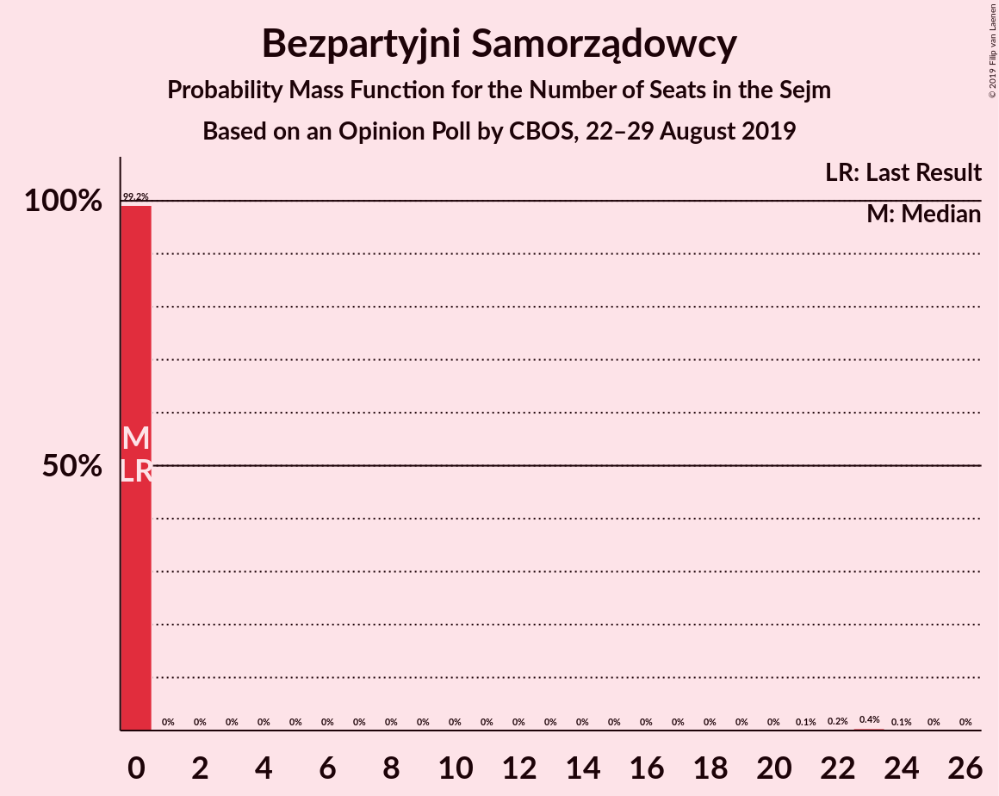

| Number of Seats | Probability | Accumulated | Special Marks |
|:---------------:|:-----------:|:-----------:|:-------------:|
| 0 | 99.2% | 100% | Last Result, Median |
| 1 | 0% | 0.8% |  |
| 2 | 0% | 0.8% |  |
| 3 | 0% | 0.8% |  |
| 4 | 0% | 0.8% |  |
| 5 | 0% | 0.8% |  |
| 6 | 0% | 0.8% |  |
| 7 | 0% | 0.8% |  |
| 8 | 0% | 0.8% |  |
| 9 | 0% | 0.8% |  |
| 10 | 0% | 0.8% |  |
| 11 | 0% | 0.8% |  |
| 12 | 0% | 0.8% |  |
| 13 | 0% | 0.8% |  |
| 14 | 0% | 0.8% |  |
| 15 | 0% | 0.8% |  |
| 16 | 0% | 0.8% |  |
| 17 | 0% | 0.8% |  |
| 18 | 0% | 0.8% |  |
| 19 | 0% | 0.8% |  |
| 20 | 0% | 0.8% |  |
| 21 | 0.1% | 0.8% |  |
| 22 | 0.2% | 0.7% |  |
| 23 | 0.4% | 0.5% |  |
| 24 | 0.1% | 0.1% |  |
| 25 | 0% | 0% |  |

### Konfederacja

*For a full overview of the results for this party, see the [Konfederacja](party-konfederacja.html) page.*

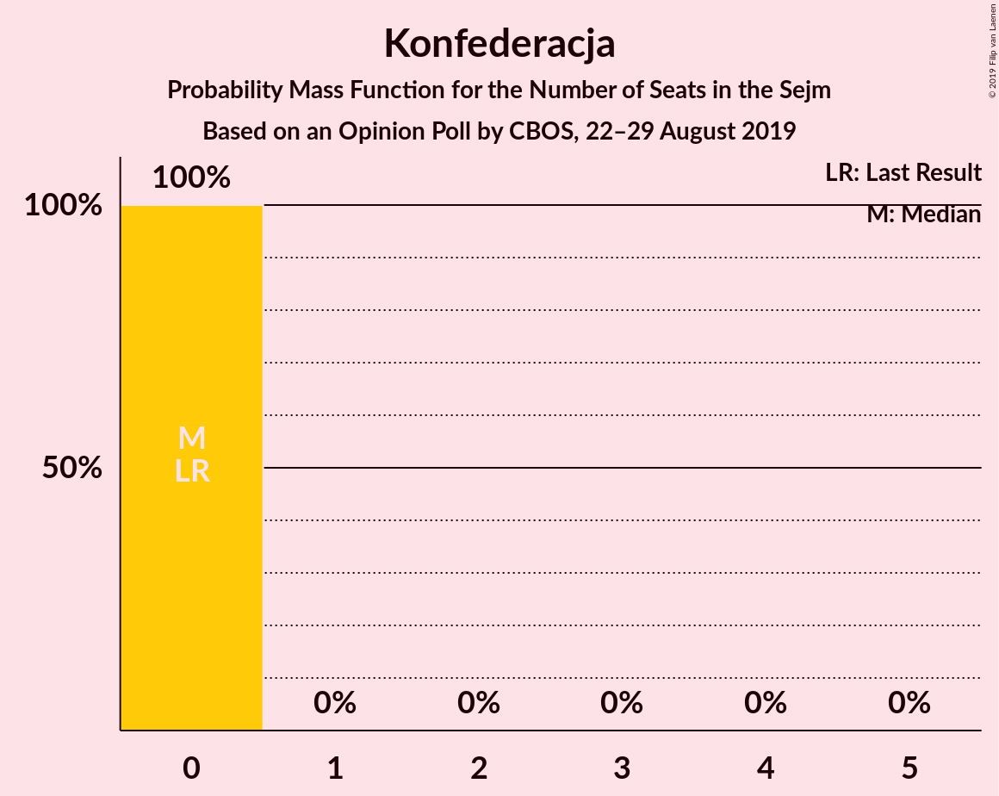

| Number of Seats | Probability | Accumulated | Special Marks |
|:---------------:|:-----------:|:-----------:|:-------------:|
| 0 | 100% | 100% | Last Result, Median |

## Coalitions

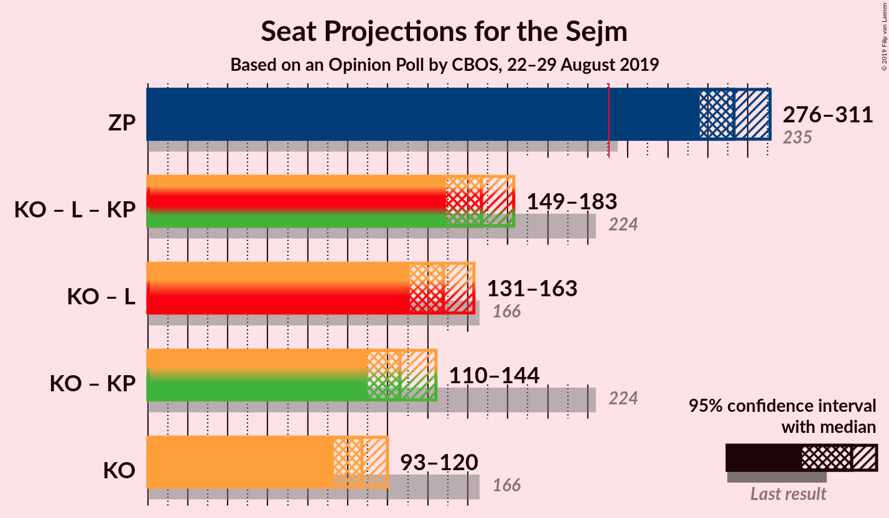

### Confidence Intervals

| Coalition | Last Result | Median | Majority? | 80% Confidence Interval | 90% Confidence Interval | 95% Confidence Interval | 99% Confidence Interval |
|:---------:|:-----------:|:------:|:---------:|:-----------------------:|:-----------------------:|:-----------------------:|:-----------------------:|
| Zjednoczona Prawica | 235 | 293 | 100% | 282–306 | 279–309 | 276–311 | 271–316 |
| Koalicja Obywatelska – Lewica – Koalicja Polska | 224 | 167 | 0% | 154–177 | 151–180 | 149–183 | 144–189 |
| Koalicja Obywatelska – Lewica | 166 | 148 | 0% | 136–157 | 133–160 | 131–163 | 126–168 |
| Koalicja Obywatelska – Koalicja Polska | 224 | 126 | 0% | 115–138 | 112–141 | 110–144 | 105–148 |
| Koalicja Obywatelska | 166 | 107 | 0% | 97–116 | 95–118 | 93–120 | 91–127 |

### Zjednoczona Prawica

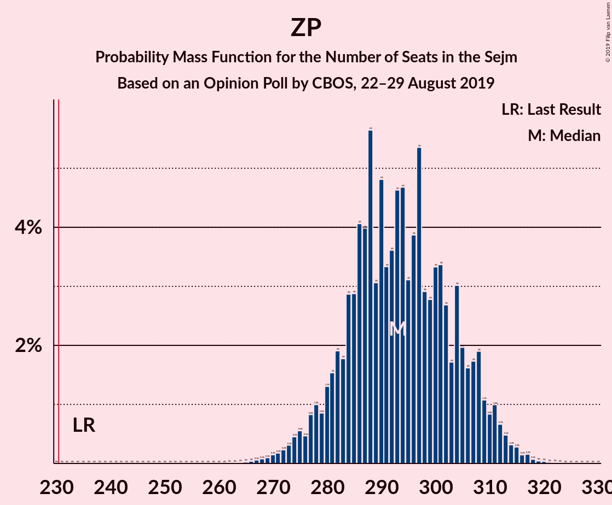

| Number of Seats | Probability | Accumulated | Special Marks |
|:---------------:|:-----------:|:-----------:|:-------------:|
| 235 | 0% | 100% | Last Result |
| 236 | 0% | 100% |  |
| 237 | 0% | 100% |  |
| 238 | 0% | 100% |  |
| 239 | 0% | 100% |  |
| 240 | 0% | 100% |  |
| 241 | 0% | 100% |  |
| 242 | 0% | 100% |  |
| 243 | 0% | 100% |  |
| 244 | 0% | 100% |  |
| 245 | 0% | 100% |  |
| 246 | 0% | 100% |  |
| 247 | 0% | 100% |  |
| 248 | 0% | 100% |  |
| 249 | 0% | 100% |  |
| 250 | 0% | 100% |  |
| 251 | 0% | 100% |  |
| 252 | 0% | 100% |  |
| 253 | 0% | 100% |  |
| 254 | 0% | 100% |  |
| 255 | 0% | 100% |  |
| 256 | 0% | 100% |  |
| 257 | 0% | 100% |  |
| 258 | 0% | 100% |  |
| 259 | 0% | 100% |  |
| 260 | 0% | 100% |  |
| 261 | 0% | 100% |  |
| 262 | 0% | 100% |  |
| 263 | 0% | 100% |  |
| 264 | 0% | 100% |  |
| 265 | 0% | 99.9% |  |
| 266 | 0% | 99.9% |  |
| 267 | 0.1% | 99.9% |  |
| 268 | 0.1% | 99.8% |  |
| 269 | 0.1% | 99.7% |  |
| 270 | 0.1% | 99.6% |  |
| 271 | 0.2% | 99.5% |  |
| 272 | 0.2% | 99.3% |  |
| 273 | 0.3% | 99.1% |  |
| 274 | 0.5% | 98.8% |  |
| 275 | 0.6% | 98% |  |
| 276 | 0.5% | 98% |  |
| 277 | 0.8% | 97% |  |
| 278 | 1.0% | 96% |  |
| 279 | 0.9% | 95% |  |
| 280 | 1.3% | 95% |  |
| 281 | 2% | 93% |  |
| 282 | 2% | 92% |  |
| 283 | 2% | 90% |  |
| 284 | 3% | 88% |  |
| 285 | 3% | 85% |  |
| 286 | 4% | 82% |  |
| 287 | 4% | 78% |  |
| 288 | 6% | 74% |  |
| 289 | 3% | 69% |  |
| 290 | 5% | 66% |  |
| 291 | 3% | 61% |  |
| 292 | 4% | 57% |  |
| 293 | 5% | 54% | Median |
| 294 | 5% | 49% |  |
| 295 | 3% | 45% |  |
| 296 | 4% | 41% |  |
| 297 | 5% | 38% |  |
| 298 | 3% | 32% |  |
| 299 | 3% | 29% |  |
| 300 | 3% | 27% |  |
| 301 | 3% | 23% |  |
| 302 | 3% | 20% |  |
| 303 | 2% | 17% |  |
| 304 | 3% | 15% |  |
| 305 | 2% | 12% |  |
| 306 | 2% | 10% |  |
| 307 | 2% | 9% |  |
| 308 | 2% | 7% |  |
| 309 | 1.1% | 5% |  |
| 310 | 0.8% | 4% |  |
| 311 | 1.0% | 3% |  |
| 312 | 0.7% | 2% |  |
| 313 | 0.5% | 2% |  |
| 314 | 0.3% | 1.1% |  |
| 315 | 0.3% | 0.8% |  |
| 316 | 0.1% | 0.5% |  |
| 317 | 0.2% | 0.4% |  |
| 318 | 0.1% | 0.2% |  |
| 319 | 0% | 0.1% |  |
| 320 | 0% | 0.1% |  |
| 321 | 0% | 0.1% |  |
| 322 | 0% | 0% |  |

### Koalicja Obywatelska – Lewica – Koalicja Polska

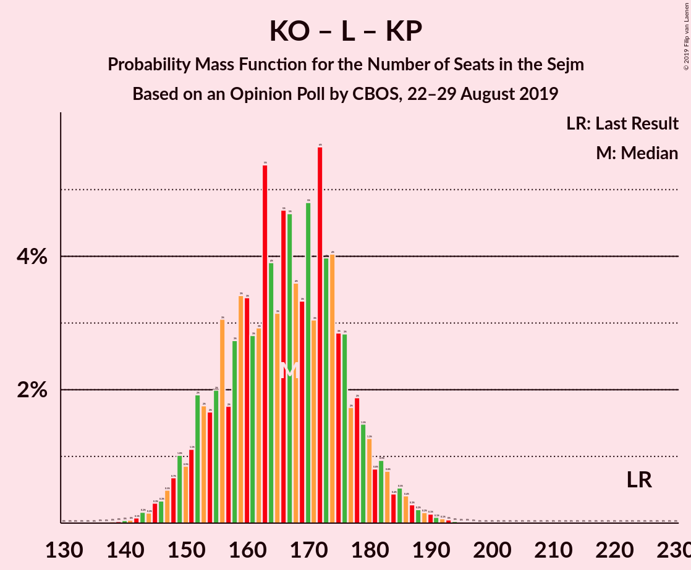

| Number of Seats | Probability | Accumulated | Special Marks |
|:---------------:|:-----------:|:-----------:|:-------------:|
| 138 | 0% | 100% |  |
| 139 | 0% | 99.9% |  |
| 140 | 0% | 99.9% |  |
| 141 | 0% | 99.9% |  |
| 142 | 0.1% | 99.8% |  |
| 143 | 0.2% | 99.8% |  |
| 144 | 0.2% | 99.6% |  |
| 145 | 0.3% | 99.4% |  |
| 146 | 0.3% | 99.1% |  |
| 147 | 0.5% | 98.8% |  |
| 148 | 0.7% | 98% |  |
| 149 | 1.0% | 98% |  |
| 150 | 0.9% | 97% |  |
| 151 | 1.1% | 96% |  |
| 152 | 2% | 95% |  |
| 153 | 2% | 93% |  |
| 154 | 2% | 91% |  |
| 155 | 2% | 89% |  |
| 156 | 3% | 87% |  |
| 157 | 2% | 84% |  |
| 158 | 3% | 82% |  |
| 159 | 3% | 80% |  |
| 160 | 3% | 76% |  |
| 161 | 3% | 73% |  |
| 162 | 3% | 70% |  |
| 163 | 5% | 67% |  |
| 164 | 4% | 62% |  |
| 165 | 3% | 58% |  |
| 166 | 5% | 55% |  |
| 167 | 5% | 50% | Median |
| 168 | 4% | 45% |  |
| 169 | 3% | 42% |  |
| 170 | 5% | 39% |  |
| 171 | 3% | 34% |  |
| 172 | 6% | 31% |  |
| 173 | 4% | 25% |  |
| 174 | 4% | 21% |  |
| 175 | 3% | 17% |  |
| 176 | 3% | 14% |  |
| 177 | 2% | 11% |  |
| 178 | 2% | 10% |  |
| 179 | 1.5% | 8% |  |
| 180 | 1.3% | 6% |  |
| 181 | 0.8% | 5% |  |
| 182 | 0.9% | 4% |  |
| 183 | 0.8% | 3% |  |
| 184 | 0.4% | 2% |  |
| 185 | 0.5% | 2% |  |
| 186 | 0.4% | 1.5% |  |
| 187 | 0.3% | 1.1% |  |
| 188 | 0.2% | 0.8% |  |
| 189 | 0.2% | 0.6% |  |
| 190 | 0.1% | 0.4% |  |
| 191 | 0.1% | 0.3% |  |
| 192 | 0.1% | 0.2% |  |
| 193 | 0% | 0.1% |  |
| 194 | 0% | 0.1% |  |
| 195 | 0% | 0.1% |  |
| 196 | 0% | 0% |  |
| 197 | 0% | 0% |  |
| 198 | 0% | 0% |  |
| 199 | 0% | 0% |  |
| 200 | 0% | 0% |  |
| 201 | 0% | 0% |  |
| 202 | 0% | 0% |  |
| 203 | 0% | 0% |  |
| 204 | 0% | 0% |  |
| 205 | 0% | 0% |  |
| 206 | 0% | 0% |  |
| 207 | 0% | 0% |  |
| 208 | 0% | 0% |  |
| 209 | 0% | 0% |  |
| 210 | 0% | 0% |  |
| 211 | 0% | 0% |  |
| 212 | 0% | 0% |  |
| 213 | 0% | 0% |  |
| 214 | 0% | 0% |  |
| 215 | 0% | 0% |  |
| 216 | 0% | 0% |  |
| 217 | 0% | 0% |  |
| 218 | 0% | 0% |  |
| 219 | 0% | 0% |  |
| 220 | 0% | 0% |  |
| 221 | 0% | 0% |  |
| 222 | 0% | 0% |  |
| 223 | 0% | 0% |  |
| 224 | 0% | 0% | Last Result |

### Koalicja Obywatelska – Lewica

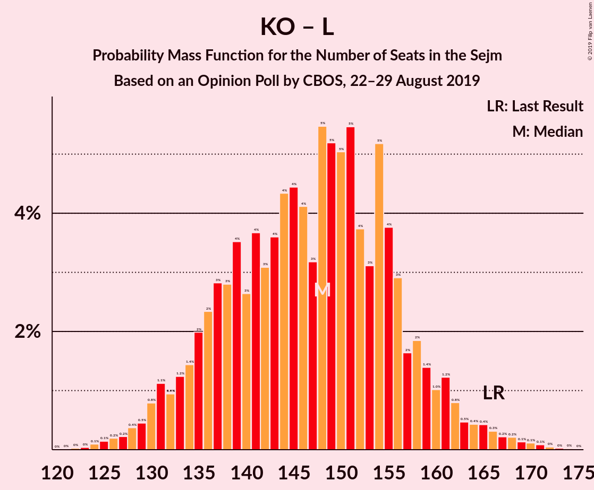

| Number of Seats | Probability | Accumulated | Special Marks |
|:---------------:|:-----------:|:-----------:|:-------------:|
| 122 | 0% | 100% |  |
| 123 | 0% | 99.9% |  |
| 124 | 0.1% | 99.9% |  |
| 125 | 0.1% | 99.8% |  |
| 126 | 0.2% | 99.7% |  |
| 127 | 0.2% | 99.5% |  |
| 128 | 0.4% | 99.2% |  |
| 129 | 0.5% | 98.9% |  |
| 130 | 0.8% | 98% |  |
| 131 | 1.1% | 98% |  |
| 132 | 0.9% | 97% |  |
| 133 | 1.2% | 96% |  |
| 134 | 1.4% | 94% |  |
| 135 | 2% | 93% |  |
| 136 | 2% | 91% |  |
| 137 | 3% | 89% |  |
| 138 | 3% | 86% |  |
| 139 | 4% | 83% |  |
| 140 | 3% | 79% |  |
| 141 | 4% | 77% |  |
| 142 | 3% | 73% |  |
| 143 | 4% | 70% |  |
| 144 | 4% | 66% |  |
| 145 | 4% | 62% |  |
| 146 | 4% | 58% |  |
| 147 | 3% | 54% | Median |
| 148 | 5% | 50% |  |
| 149 | 5% | 45% |  |
| 150 | 5% | 40% |  |
| 151 | 5% | 35% |  |
| 152 | 4% | 29% |  |
| 153 | 3% | 25% |  |
| 154 | 5% | 22% |  |
| 155 | 4% | 17% |  |
| 156 | 3% | 13% |  |
| 157 | 2% | 10% |  |
| 158 | 2% | 9% |  |
| 159 | 1.4% | 7% |  |
| 160 | 1.0% | 6% |  |
| 161 | 1.2% | 5% |  |
| 162 | 0.8% | 3% |  |
| 163 | 0.5% | 3% |  |
| 164 | 0.4% | 2% |  |
| 165 | 0.4% | 2% |  |
| 166 | 0.3% | 1.2% | Last Result |
| 167 | 0.2% | 0.9% |  |
| 168 | 0.2% | 0.7% |  |
| 169 | 0.1% | 0.5% |  |
| 170 | 0.1% | 0.3% |  |
| 171 | 0.1% | 0.2% |  |
| 172 | 0% | 0.1% |  |
| 173 | 0% | 0.1% |  |
| 174 | 0% | 0.1% |  |
| 175 | 0% | 0% |  |

### Koalicja Obywatelska – Koalicja Polska

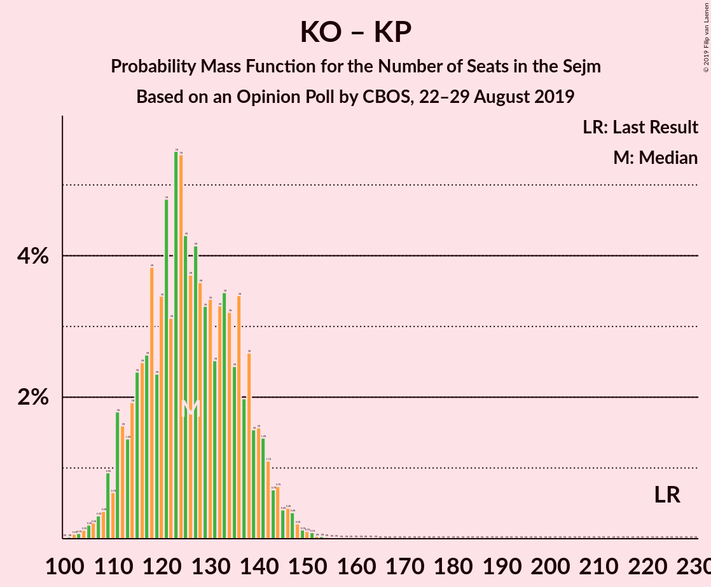

| Number of Seats | Probability | Accumulated | Special Marks |
|:---------------:|:-----------:|:-----------:|:-------------:|
| 100 | 0% | 100% |  |
| 101 | 0% | 99.9% |  |
| 102 | 0.1% | 99.9% |  |
| 103 | 0.1% | 99.8% |  |
| 104 | 0.1% | 99.8% |  |
| 105 | 0.2% | 99.6% |  |
| 106 | 0.2% | 99.5% |  |
| 107 | 0.3% | 99.2% |  |
| 108 | 0.4% | 98.9% |  |
| 109 | 0.9% | 98.5% |  |
| 110 | 0.7% | 98% |  |
| 111 | 2% | 97% |  |
| 112 | 2% | 95% |  |
| 113 | 1.4% | 94% |  |
| 114 | 2% | 92% |  |
| 115 | 2% | 90% |  |
| 116 | 2% | 88% |  |
| 117 | 3% | 85% |  |
| 118 | 4% | 83% |  |
| 119 | 2% | 79% |  |
| 120 | 3% | 77% |  |
| 121 | 5% | 73% |  |
| 122 | 3% | 68% |  |
| 123 | 5% | 65% |  |
| 124 | 5% | 60% |  |
| 125 | 4% | 54% |  |
| 126 | 4% | 50% |  |
| 127 | 4% | 46% | Median |
| 128 | 4% | 42% |  |
| 129 | 3% | 39% |  |
| 130 | 3% | 35% |  |
| 131 | 3% | 32% |  |
| 132 | 3% | 29% |  |
| 133 | 3% | 26% |  |
| 134 | 3% | 23% |  |
| 135 | 2% | 19% |  |
| 136 | 3% | 17% |  |
| 137 | 2% | 14% |  |
| 138 | 3% | 12% |  |
| 139 | 2% | 9% |  |
| 140 | 2% | 7% |  |
| 141 | 1.4% | 6% |  |
| 142 | 1.1% | 4% |  |
| 143 | 0.7% | 3% |  |
| 144 | 0.7% | 3% |  |
| 145 | 0.4% | 2% |  |
| 146 | 0.4% | 1.5% |  |
| 147 | 0.4% | 1.0% |  |
| 148 | 0.2% | 0.7% |  |
| 149 | 0.1% | 0.4% |  |
| 150 | 0.1% | 0.3% |  |
| 151 | 0.1% | 0.2% |  |
| 152 | 0% | 0.1% |  |
| 153 | 0% | 0.1% |  |
| 154 | 0% | 0.1% |  |
| 155 | 0% | 0% |  |
| 156 | 0% | 0% |  |
| 157 | 0% | 0% |  |
| 158 | 0% | 0% |  |
| 159 | 0% | 0% |  |
| 160 | 0% | 0% |  |
| 161 | 0% | 0% |  |
| 162 | 0% | 0% |  |
| 163 | 0% | 0% |  |
| 164 | 0% | 0% |  |
| 165 | 0% | 0% |  |
| 166 | 0% | 0% |  |
| 167 | 0% | 0% |  |
| 168 | 0% | 0% |  |
| 169 | 0% | 0% |  |
| 170 | 0% | 0% |  |
| 171 | 0% | 0% |  |
| 172 | 0% | 0% |  |
| 173 | 0% | 0% |  |
| 174 | 0% | 0% |  |
| 175 | 0% | 0% |  |
| 176 | 0% | 0% |  |
| 177 | 0% | 0% |  |
| 178 | 0% | 0% |  |
| 179 | 0% | 0% |  |
| 180 | 0% | 0% |  |
| 181 | 0% | 0% |  |
| 182 | 0% | 0% |  |
| 183 | 0% | 0% |  |
| 184 | 0% | 0% |  |
| 185 | 0% | 0% |  |
| 186 | 0% | 0% |  |
| 187 | 0% | 0% |  |
| 188 | 0% | 0% |  |
| 189 | 0% | 0% |  |
| 190 | 0% | 0% |  |
| 191 | 0% | 0% |  |
| 192 | 0% | 0% |  |
| 193 | 0% | 0% |  |
| 194 | 0% | 0% |  |
| 195 | 0% | 0% |  |
| 196 | 0% | 0% |  |
| 197 | 0% | 0% |  |
| 198 | 0% | 0% |  |
| 199 | 0% | 0% |  |
| 200 | 0% | 0% |  |
| 201 | 0% | 0% |  |
| 202 | 0% | 0% |  |
| 203 | 0% | 0% |  |
| 204 | 0% | 0% |  |
| 205 | 0% | 0% |  |
| 206 | 0% | 0% |  |
| 207 | 0% | 0% |  |
| 208 | 0% | 0% |  |
| 209 | 0% | 0% |  |
| 210 | 0% | 0% |  |
| 211 | 0% | 0% |  |
| 212 | 0% | 0% |  |
| 213 | 0% | 0% |  |
| 214 | 0% | 0% |  |
| 215 | 0% | 0% |  |
| 216 | 0% | 0% |  |
| 217 | 0% | 0% |  |
| 218 | 0% | 0% |  |
| 219 | 0% | 0% |  |
| 220 | 0% | 0% |  |
| 221 | 0% | 0% |  |
| 222 | 0% | 0% |  |
| 223 | 0% | 0% |  |
| 224 | 0% | 0% | Last Result |

### Koalicja Obywatelska

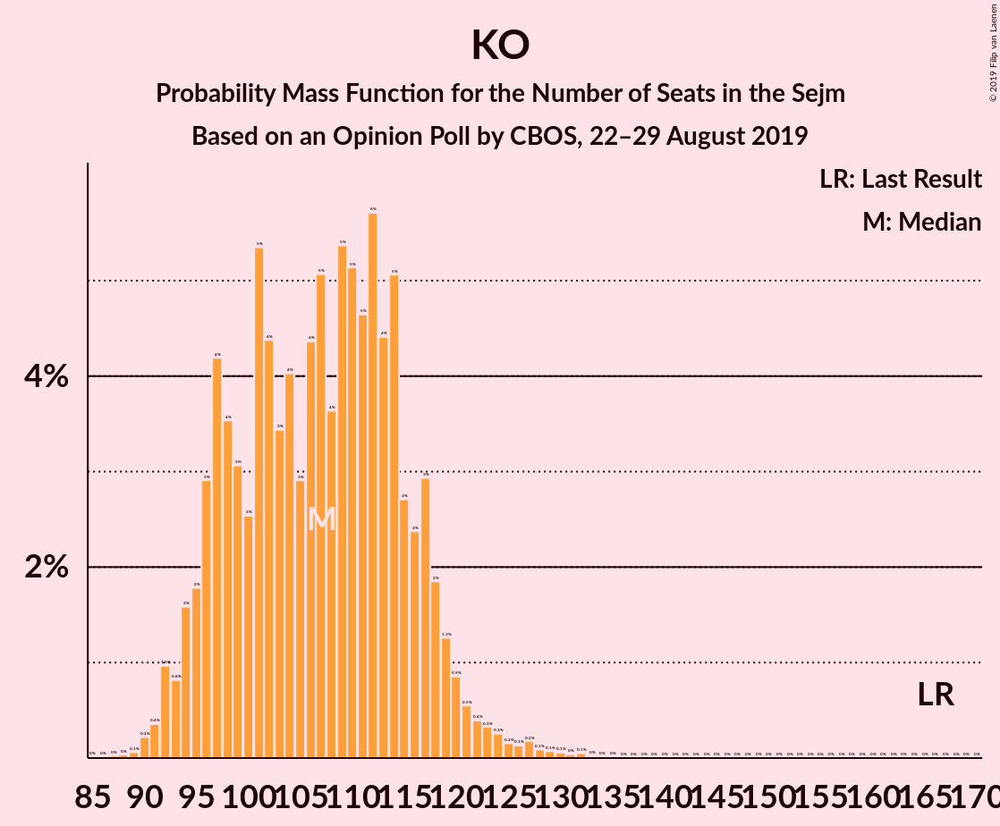

| Number of Seats | Probability | Accumulated | Special Marks |
|:---------------:|:-----------:|:-----------:|:-------------:|
| 86 | 0% | 100% |  |
| 87 | 0% | 99.9% |  |
| 88 | 0% | 99.9% |  |
| 89 | 0.1% | 99.9% |  |
| 90 | 0.2% | 99.8% |  |
| 91 | 0.4% | 99.6% |  |
| 92 | 1.0% | 99.2% |  |
| 93 | 0.8% | 98% |  |
| 94 | 2% | 97% |  |
| 95 | 2% | 96% |  |
| 96 | 3% | 94% |  |
| 97 | 4% | 91% |  |
| 98 | 4% | 87% |  |
| 99 | 3% | 83% |  |
| 100 | 3% | 80% |  |
| 101 | 5% | 78% |  |
| 102 | 4% | 73% |  |
| 103 | 3% | 68% |  |
| 104 | 4% | 65% |  |
| 105 | 3% | 61% |  |
| 106 | 4% | 58% |  |
| 107 | 5% | 53% | Median |
| 108 | 4% | 48% |  |
| 109 | 5% | 45% |  |
| 110 | 5% | 39% |  |
| 111 | 5% | 34% |  |
| 112 | 6% | 30% |  |
| 113 | 4% | 24% |  |
| 114 | 5% | 19% |  |
| 115 | 3% | 14% |  |
| 116 | 2% | 12% |  |
| 117 | 3% | 9% |  |
| 118 | 2% | 6% |  |
| 119 | 1.3% | 4% |  |
| 120 | 0.9% | 3% |  |
| 121 | 0.5% | 2% |  |
| 122 | 0.4% | 2% |  |
| 123 | 0.3% | 1.4% |  |
| 124 | 0.3% | 1.1% |  |
| 125 | 0.2% | 0.8% |  |
| 126 | 0.1% | 0.7% |  |
| 127 | 0.2% | 0.6% |  |
| 128 | 0.1% | 0.4% |  |
| 129 | 0.1% | 0.3% |  |
| 130 | 0.1% | 0.2% |  |
| 131 | 0% | 0.2% |  |
| 132 | 0.1% | 0.1% |  |
| 133 | 0% | 0.1% |  |
| 134 | 0% | 0% |  |
| 135 | 0% | 0% |  |
| 136 | 0% | 0% |  |
| 137 | 0% | 0% |  |
| 138 | 0% | 0% |  |
| 139 | 0% | 0% |  |
| 140 | 0% | 0% |  |
| 141 | 0% | 0% |  |
| 142 | 0% | 0% |  |
| 143 | 0% | 0% |  |
| 144 | 0% | 0% |  |
| 145 | 0% | 0% |  |
| 146 | 0% | 0% |  |
| 147 | 0% | 0% |  |
| 148 | 0% | 0% |  |
| 149 | 0% | 0% |  |
| 150 | 0% | 0% |  |
| 151 | 0% | 0% |  |
| 152 | 0% | 0% |  |
| 153 | 0% | 0% |  |
| 154 | 0% | 0% |  |
| 155 | 0% | 0% |  |
| 156 | 0% | 0% |  |
| 157 | 0% | 0% |  |
| 158 | 0% | 0% |  |
| 159 | 0% | 0% |  |
| 160 | 0% | 0% |  |
| 161 | 0% | 0% |  |
| 162 | 0% | 0% |  |
| 163 | 0% | 0% |  |
| 164 | 0% | 0% |  |
| 165 | 0% | 0% |  |
| 166 | 0% | 0% | Last Result |

## Technical Information

### Opinion Poll

+ **Polling firm:** CBOS
+ **Commissioner(s):** —
+ **Fieldwork period:** 22–29 August 2019

### Calculations

+ **Sample size:** 1029
+ **Simulations done:** 1,048,576
+ **Error estimate:** 1.33%

