# Opinion Poll by Dobra Opinia for PPG, 23–29 August 2019

<a href="#voting-intentions">Voting Intentions</a> | <a href="#seats">Seats</a> | <a href="#coalitions">Coalitions</a> | <a href="#technical-information">Technical Information</a>

## Voting Intentions

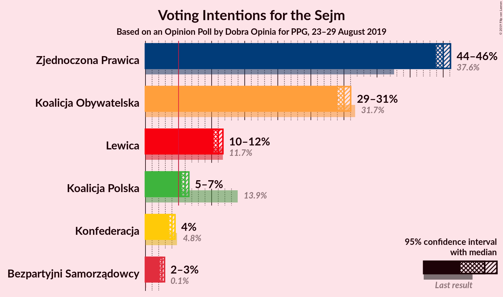

### Confidence Intervals

| Party | Last Result | Poll Result | 80% Confidence Interval | 90% Confidence Interval | 95% Confidence Interval | 99% Confidence Interval |
|:-----:|:-----------:|:-----------:|:-----------------------:|:-----------------------:|:-----------------------:|:-----------------------:|
| Zjednoczona Prawica | 37.6% | 45.0% | 44.3–45.7% |44.1–45.9% |43.9–46.1% |43.6–46.4% |
| Koalicja Obywatelska | 31.7% | 30.0% | 29.3–30.7% |29.2–30.9% |29.0–31.0% |28.7–31.3% |
| Lewica | 11.7% | 11.0% | 10.6–11.5% |10.4–11.6% |10.3–11.7% |10.1–11.9% |
| Koalicja Polska | 13.9% | 6.0% | 5.7–6.4% |5.6–6.5% |5.5–6.6% |5.3–6.7% |
| Konfederacja | 4.8% | 4.0% | 3.7–4.3% |3.6–4.4% |3.6–4.5% |3.5–4.6% |
| Bezpartyjni Samorządowcy | 0.1% | 2.5% | 2.3–2.7% |2.2–2.8% |2.2–2.9% |2.1–3.0% |

*Note:* The poll result column reflects the actual value used in the calculations. Published results may vary slightly, and in addition be rounded to fewer digits.

## Seats

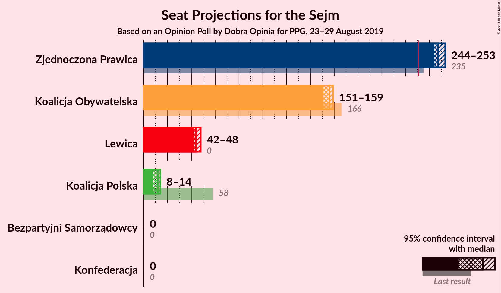

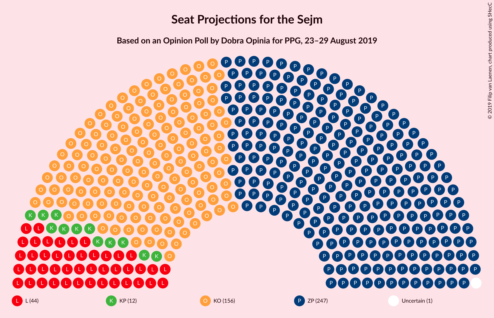

### Confidence Intervals

| Party | Last Result | Median | 80% Confidence Interval | 90% Confidence Interval | 95% Confidence Interval | 99% Confidence Interval |
|:-----:|:-----------:|:------:|:-----------------------:|:-----------------------:|:-----------------------:|:-----------------------:|
| <a href="#zjednoczona-prawica">Zjednoczona Prawica</a> | 235 | 247 | 245–251 |244–252 |244–253 |242–255 |
| <a href="#koalicja-obywatelska">Koalicja Obywatelska</a> | 166 | 156 | 153–158 |152–159 |151–159 |149–161 |
| <a href="#lewica">Lewica</a> | 0 | 44 | 42–46 |42–47 |42–48 |40–50 |
| <a href="#koalicja-polska">Koalicja Polska</a> | 58 | 12 | 10–14 |9–14 |8–14 |8–16 |
| <a href="#konfederacja">Konfederacja</a> | 0 | 0 | 0 |0 |0 |0 |
| <a href="#bezpartyjni-samorządowcy">Bezpartyjni Samorządowcy</a> | 0 | 0 | 0 |0 |0 |0 |

### Zjednoczona Prawica

*For a full overview of the results for this party, see the [Zjednoczona Prawica](party-zjednoczonaprawica.html) page.*

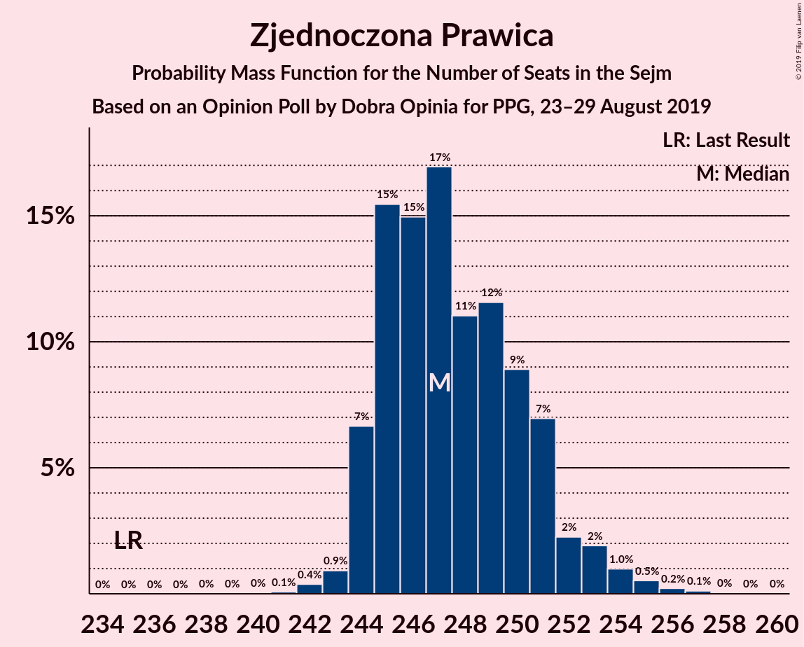

| Number of Seats | Probability | Accumulated | Special Marks |
|:---------------:|:-----------:|:-----------:|:-------------:|
| 235 | 0% | 100% | Last Result |
| 236 | 0% | 100% |  |
| 237 | 0% | 100% |  |
| 238 | 0% | 100% |  |
| 239 | 0% | 100% |  |
| 240 | 0% | 100% |  |
| 241 | 0.1% | 100% |  |
| 242 | 0.4% | 99.9% |  |
| 243 | 0.9% | 99.5% |  |
| 244 | 7% | 98.6% |  |
| 245 | 15% | 92% |  |
| 246 | 15% | 76% |  |
| 247 | 17% | 61% | Median |
| 248 | 11% | 45% |  |
| 249 | 12% | 34% |  |
| 250 | 9% | 22% |  |
| 251 | 7% | 13% |  |
| 252 | 2% | 6% |  |
| 253 | 2% | 4% |  |
| 254 | 1.0% | 2% |  |
| 255 | 0.5% | 0.9% |  |
| 256 | 0.2% | 0.4% |  |
| 257 | 0.1% | 0.2% |  |
| 258 | 0% | 0.1% |  |
| 259 | 0% | 0% |  |

### Koalicja Obywatelska

*For a full overview of the results for this party, see the [Koalicja Obywatelska](party-koalicjaobywatelska.html) page.*

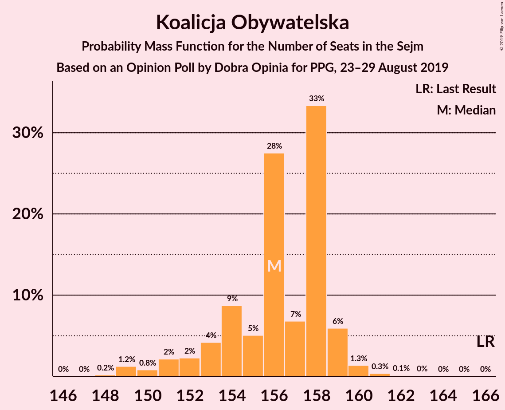

| Number of Seats | Probability | Accumulated | Special Marks |
|:---------------:|:-----------:|:-----------:|:-------------:|
| 148 | 0.2% | 100% |  |
| 149 | 1.2% | 99.8% |  |
| 150 | 0.8% | 98.6% |  |
| 151 | 2% | 98% |  |
| 152 | 2% | 96% |  |
| 153 | 4% | 93% |  |
| 154 | 9% | 89% |  |
| 155 | 5% | 80% |  |
| 156 | 28% | 75% | Median |
| 157 | 7% | 48% |  |
| 158 | 33% | 41% |  |
| 159 | 6% | 8% |  |
| 160 | 1.3% | 2% |  |
| 161 | 0.3% | 0.5% |  |
| 162 | 0.1% | 0.2% |  |
| 163 | 0% | 0.1% |  |
| 164 | 0% | 0% |  |
| 165 | 0% | 0% |  |
| 166 | 0% | 0% | Last Result |

### Lewica

*For a full overview of the results for this party, see the [Lewica](party-lewica.html) page.*

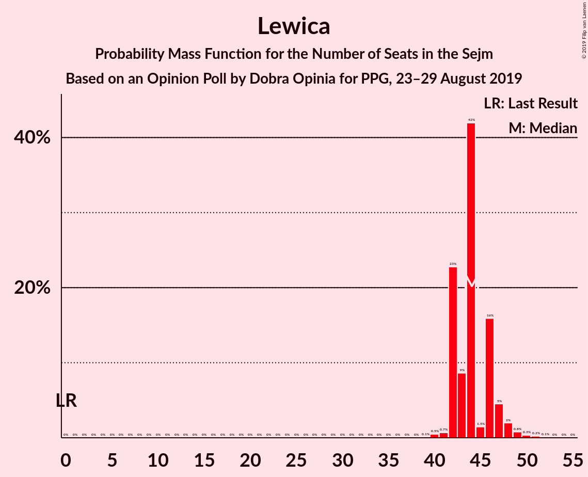

| Number of Seats | Probability | Accumulated | Special Marks |
|:---------------:|:-----------:|:-----------:|:-------------:|
| 0 | 0% | 100% | Last Result |
| 1 | 0% | 100% |  |
| 2 | 0% | 100% |  |
| 3 | 0% | 100% |  |
| 4 | 0% | 100% |  |
| 5 | 0% | 100% |  |
| 6 | 0% | 100% |  |
| 7 | 0% | 100% |  |
| 8 | 0% | 100% |  |
| 9 | 0% | 100% |  |
| 10 | 0% | 100% |  |
| 11 | 0% | 100% |  |
| 12 | 0% | 100% |  |
| 13 | 0% | 100% |  |
| 14 | 0% | 100% |  |
| 15 | 0% | 100% |  |
| 16 | 0% | 100% |  |
| 17 | 0% | 100% |  |
| 18 | 0% | 100% |  |
| 19 | 0% | 100% |  |
| 20 | 0% | 100% |  |
| 21 | 0% | 100% |  |
| 22 | 0% | 100% |  |
| 23 | 0% | 100% |  |
| 24 | 0% | 100% |  |
| 25 | 0% | 100% |  |
| 26 | 0% | 100% |  |
| 27 | 0% | 100% |  |
| 28 | 0% | 100% |  |
| 29 | 0% | 100% |  |
| 30 | 0% | 100% |  |
| 31 | 0% | 100% |  |
| 32 | 0% | 100% |  |
| 33 | 0% | 100% |  |
| 34 | 0% | 100% |  |
| 35 | 0% | 100% |  |
| 36 | 0% | 100% |  |
| 37 | 0% | 100% |  |
| 38 | 0% | 100% |  |
| 39 | 0.1% | 100% |  |
| 40 | 0.5% | 99.9% |  |
| 41 | 0.7% | 99.4% |  |
| 42 | 23% | 98.7% |  |
| 43 | 9% | 76% |  |
| 44 | 42% | 67% | Median |
| 45 | 1.5% | 25% |  |
| 46 | 16% | 24% |  |
| 47 | 5% | 8% |  |
| 48 | 2% | 3% |  |
| 49 | 0.8% | 1.4% |  |
| 50 | 0.3% | 0.6% |  |
| 51 | 0.2% | 0.3% |  |
| 52 | 0.1% | 0.1% |  |
| 53 | 0% | 0% |  |

### Koalicja Polska

*For a full overview of the results for this party, see the [Koalicja Polska](party-koalicjapolska.html) page.*

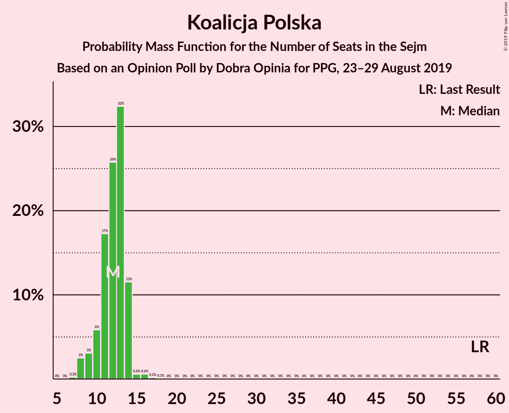

| Number of Seats | Probability | Accumulated | Special Marks |
|:---------------:|:-----------:|:-----------:|:-------------:|
| 7 | 0.2% | 100% |  |
| 8 | 2% | 99.8% |  |
| 9 | 3% | 97% |  |
| 10 | 6% | 94% |  |
| 11 | 17% | 88% |  |
| 12 | 26% | 71% | Median |
| 13 | 32% | 45% |  |
| 14 | 12% | 13% |  |
| 15 | 0.6% | 1.4% |  |
| 16 | 0.6% | 0.9% |  |
| 17 | 0.2% | 0.3% |  |
| 18 | 0.1% | 0.1% |  |
| 19 | 0% | 0.1% |  |
| 20 | 0% | 0% |  |
| 21 | 0% | 0% |  |
| 22 | 0% | 0% |  |
| 23 | 0% | 0% |  |
| 24 | 0% | 0% |  |
| 25 | 0% | 0% |  |
| 26 | 0% | 0% |  |
| 27 | 0% | 0% |  |
| 28 | 0% | 0% |  |
| 29 | 0% | 0% |  |
| 30 | 0% | 0% |  |
| 31 | 0% | 0% |  |
| 32 | 0% | 0% |  |
| 33 | 0% | 0% |  |
| 34 | 0% | 0% |  |
| 35 | 0% | 0% |  |
| 36 | 0% | 0% |  |
| 37 | 0% | 0% |  |
| 38 | 0% | 0% |  |
| 39 | 0% | 0% |  |
| 40 | 0% | 0% |  |
| 41 | 0% | 0% |  |
| 42 | 0% | 0% |  |
| 43 | 0% | 0% |  |
| 44 | 0% | 0% |  |
| 45 | 0% | 0% |  |
| 46 | 0% | 0% |  |
| 47 | 0% | 0% |  |
| 48 | 0% | 0% |  |
| 49 | 0% | 0% |  |
| 50 | 0% | 0% |  |
| 51 | 0% | 0% |  |
| 52 | 0% | 0% |  |
| 53 | 0% | 0% |  |
| 54 | 0% | 0% |  |
| 55 | 0% | 0% |  |
| 56 | 0% | 0% |  |
| 57 | 0% | 0% |  |
| 58 | 0% | 0% | Last Result |

### Konfederacja

*For a full overview of the results for this party, see the [Konfederacja](party-konfederacja.html) page.*

| Number of Seats | Probability | Accumulated | Special Marks |
|:---------------:|:-----------:|:-----------:|:-------------:|
| 0 | 100% | 100% | Last Result, Median |

### Bezpartyjni Samorządowcy

*For a full overview of the results for this party, see the [Bezpartyjni Samorządowcy](party-bezpartyjnisamorządowcy.html) page.*

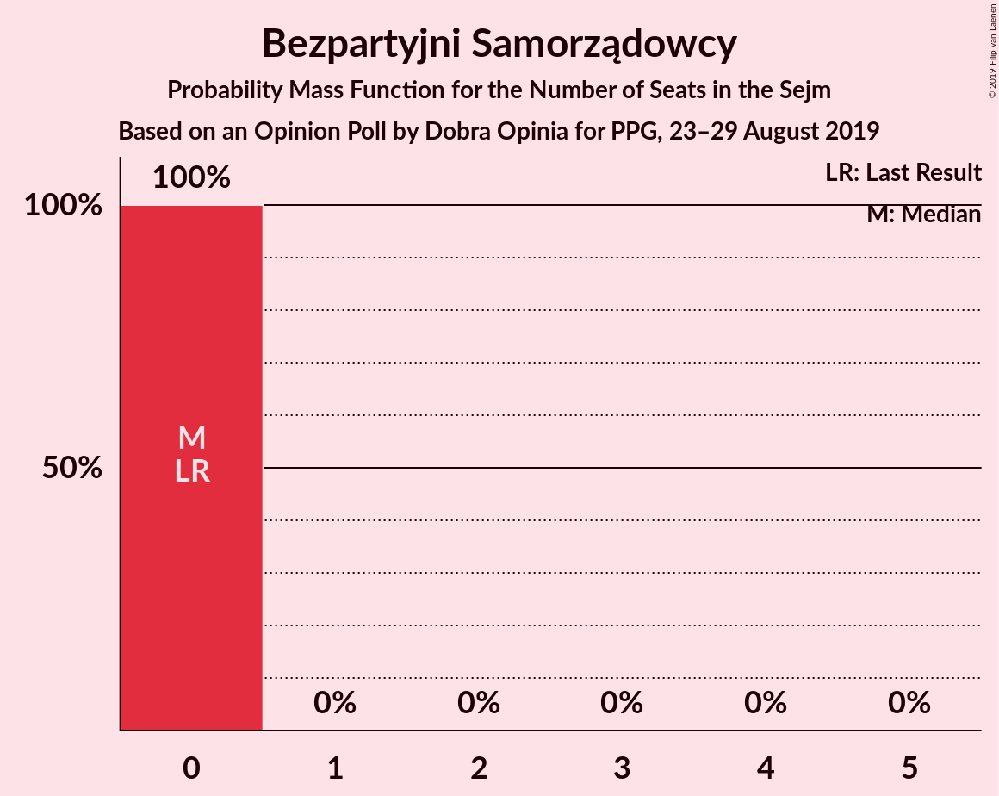

| Number of Seats | Probability | Accumulated | Special Marks |
|:---------------:|:-----------:|:-----------:|:-------------:|
| 0 | 100% | 100% | Last Result, Median |

## Coalitions

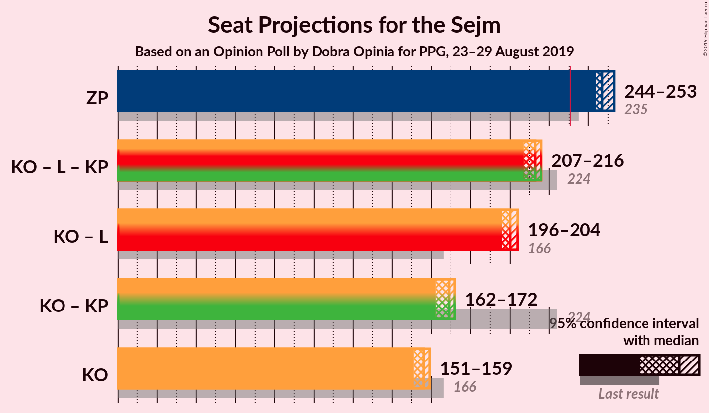

### Confidence Intervals

| Coalition | Last Result | Median | Majority? | 80% Confidence Interval | 90% Confidence Interval | 95% Confidence Interval | 99% Confidence Interval |
|:---------:|:-----------:|:------:|:---------:|:-----------------------:|:-----------------------:|:-----------------------:|:-----------------------:|
| Zjednoczona Prawica | 235 | 247 | 100% | 245–251 | 244–252 | 244–253 | 242–255 |
| Koalicja Obywatelska – Lewica – Koalicja Polska | 224 | 213 | 0% | 209–215 | 208–216 | 207–216 | 205–218 |
| Koalicja Obywatelska – Lewica | 166 | 200 | 0% | 198–202 | 197–203 | 196–204 | 194–205 |
| Koalicja Obywatelska – Koalicja Polska | 224 | 169 | 0% | 165–171 | 163–172 | 162–172 | 160–174 |
| Koalicja Obywatelska | 166 | 156 | 0% | 153–158 | 152–159 | 151–159 | 149–161 |

### Zjednoczona Prawica

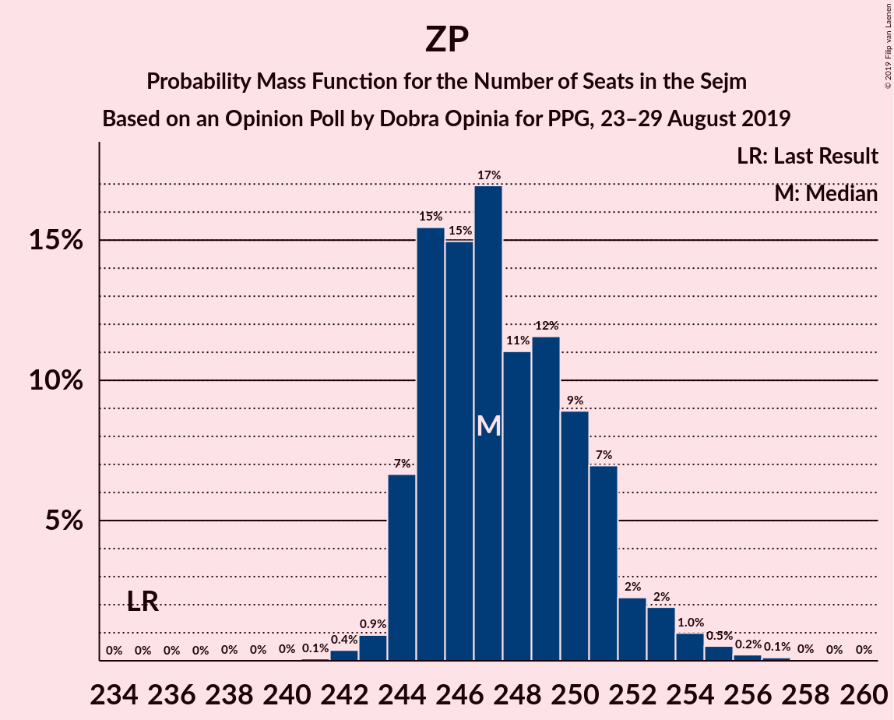

| Number of Seats | Probability | Accumulated | Special Marks |
|:---------------:|:-----------:|:-----------:|:-------------:|
| 235 | 0% | 100% | Last Result |
| 236 | 0% | 100% |  |
| 237 | 0% | 100% |  |
| 238 | 0% | 100% |  |
| 239 | 0% | 100% |  |
| 240 | 0% | 100% |  |
| 241 | 0.1% | 100% |  |
| 242 | 0.4% | 99.9% |  |
| 243 | 0.9% | 99.5% |  |
| 244 | 7% | 98.6% |  |
| 245 | 15% | 92% |  |
| 246 | 15% | 76% |  |
| 247 | 17% | 61% | Median |
| 248 | 11% | 45% |  |
| 249 | 12% | 34% |  |
| 250 | 9% | 22% |  |
| 251 | 7% | 13% |  |
| 252 | 2% | 6% |  |
| 253 | 2% | 4% |  |
| 254 | 1.0% | 2% |  |
| 255 | 0.5% | 0.9% |  |
| 256 | 0.2% | 0.4% |  |
| 257 | 0.1% | 0.2% |  |
| 258 | 0% | 0.1% |  |
| 259 | 0% | 0% |  |

### Koalicja Obywatelska – Lewica – Koalicja Polska

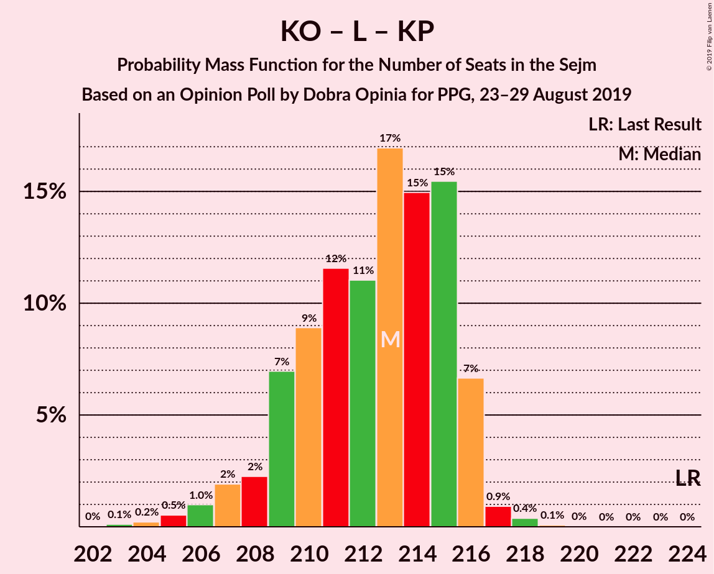

| Number of Seats | Probability | Accumulated | Special Marks |
|:---------------:|:-----------:|:-----------:|:-------------:|
| 202 | 0% | 100% |  |
| 203 | 0.1% | 99.9% |  |
| 204 | 0.2% | 99.8% |  |
| 205 | 0.5% | 99.6% |  |
| 206 | 1.0% | 99.1% |  |
| 207 | 2% | 98% |  |
| 208 | 2% | 96% |  |
| 209 | 7% | 94% |  |
| 210 | 9% | 87% |  |
| 211 | 12% | 78% |  |
| 212 | 11% | 66% | Median |
| 213 | 17% | 55% |  |
| 214 | 15% | 39% |  |
| 215 | 15% | 24% |  |
| 216 | 7% | 8% |  |
| 217 | 0.9% | 1.4% |  |
| 218 | 0.4% | 0.5% |  |
| 219 | 0.1% | 0.1% |  |
| 220 | 0% | 0% |  |
| 221 | 0% | 0% |  |
| 222 | 0% | 0% |  |
| 223 | 0% | 0% |  |
| 224 | 0% | 0% | Last Result |

### Koalicja Obywatelska – Lewica

| Number of Seats | Probability | Accumulated | Special Marks |
|:---------------:|:-----------:|:-----------:|:-------------:|
| 166 | 0% | 100% | Last Result |
| 167 | 0% | 100% |  |
| 168 | 0% | 100% |  |
| 169 | 0% | 100% |  |
| 170 | 0% | 100% |  |
| 171 | 0% | 100% |  |
| 172 | 0% | 100% |  |
| 173 | 0% | 100% |  |
| 174 | 0% | 100% |  |
| 175 | 0% | 100% |  |
| 176 | 0% | 100% |  |
| 177 | 0% | 100% |  |
| 178 | 0% | 100% |  |
| 179 | 0% | 100% |  |
| 180 | 0% | 100% |  |
| 181 | 0% | 100% |  |
| 182 | 0% | 100% |  |
| 183 | 0% | 100% |  |
| 184 | 0% | 100% |  |
| 185 | 0% | 100% |  |
| 186 | 0% | 100% |  |
| 187 | 0% | 100% |  |
| 188 | 0% | 100% |  |
| 189 | 0% | 100% |  |
| 190 | 0% | 100% |  |
| 191 | 0% | 100% |  |
| 192 | 0.1% | 100% |  |
| 193 | 0.3% | 99.9% |  |
| 194 | 0.9% | 99.6% |  |
| 195 | 0.7% | 98.7% |  |
| 196 | 2% | 98% |  |
| 197 | 3% | 96% |  |
| 198 | 13% | 92% |  |
| 199 | 8% | 79% |  |
| 200 | 22% | 71% | Median |
| 201 | 11% | 49% |  |
| 202 | 28% | 38% |  |
| 203 | 6% | 10% |  |
| 204 | 2% | 3% |  |
| 205 | 0.7% | 0.9% |  |
| 206 | 0.2% | 0.3% |  |
| 207 | 0.1% | 0.1% |  |
| 208 | 0% | 0% |  |

### Koalicja Obywatelska – Koalicja Polska

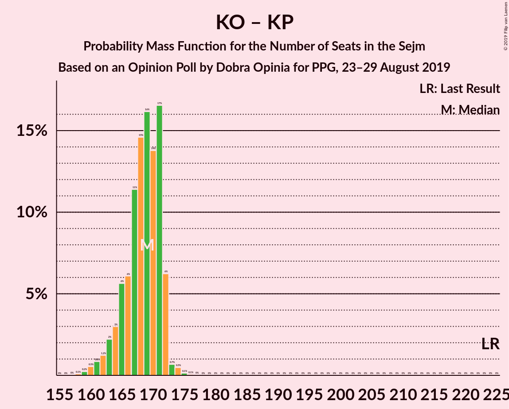

| Number of Seats | Probability | Accumulated | Special Marks |
|:---------------:|:-----------:|:-----------:|:-------------:|
| 158 | 0.1% | 100% |  |
| 159 | 0.2% | 99.9% |  |
| 160 | 0.5% | 99.6% |  |
| 161 | 0.8% | 99.1% |  |
| 162 | 1.2% | 98% |  |
| 163 | 2% | 97% |  |
| 164 | 3% | 95% |  |
| 165 | 6% | 92% |  |
| 166 | 6% | 86% |  |
| 167 | 11% | 80% |  |
| 168 | 15% | 69% | Median |
| 169 | 16% | 54% |  |
| 170 | 14% | 38% |  |
| 171 | 17% | 24% |  |
| 172 | 6% | 8% |  |
| 173 | 0.7% | 1.4% |  |
| 174 | 0.5% | 0.7% |  |
| 175 | 0.1% | 0.2% |  |
| 176 | 0.1% | 0.1% |  |
| 177 | 0% | 0% |  |
| 178 | 0% | 0% |  |
| 179 | 0% | 0% |  |
| 180 | 0% | 0% |  |
| 181 | 0% | 0% |  |
| 182 | 0% | 0% |  |
| 183 | 0% | 0% |  |
| 184 | 0% | 0% |  |
| 185 | 0% | 0% |  |
| 186 | 0% | 0% |  |
| 187 | 0% | 0% |  |
| 188 | 0% | 0% |  |
| 189 | 0% | 0% |  |
| 190 | 0% | 0% |  |
| 191 | 0% | 0% |  |
| 192 | 0% | 0% |  |
| 193 | 0% | 0% |  |
| 194 | 0% | 0% |  |
| 195 | 0% | 0% |  |
| 196 | 0% | 0% |  |
| 197 | 0% | 0% |  |
| 198 | 0% | 0% |  |
| 199 | 0% | 0% |  |
| 200 | 0% | 0% |  |
| 201 | 0% | 0% |  |
| 202 | 0% | 0% |  |
| 203 | 0% | 0% |  |
| 204 | 0% | 0% |  |
| 205 | 0% | 0% |  |
| 206 | 0% | 0% |  |
| 207 | 0% | 0% |  |
| 208 | 0% | 0% |  |
| 209 | 0% | 0% |  |
| 210 | 0% | 0% |  |
| 211 | 0% | 0% |  |
| 212 | 0% | 0% |  |
| 213 | 0% | 0% |  |
| 214 | 0% | 0% |  |
| 215 | 0% | 0% |  |
| 216 | 0% | 0% |  |
| 217 | 0% | 0% |  |
| 218 | 0% | 0% |  |
| 219 | 0% | 0% |  |
| 220 | 0% | 0% |  |
| 221 | 0% | 0% |  |
| 222 | 0% | 0% |  |
| 223 | 0% | 0% |  |
| 224 | 0% | 0% | Last Result |

### Koalicja Obywatelska

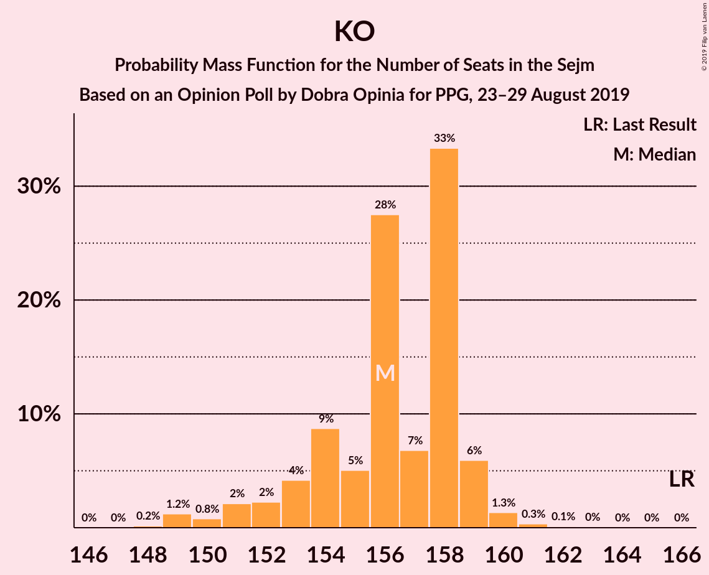

| Number of Seats | Probability | Accumulated | Special Marks |
|:---------------:|:-----------:|:-----------:|:-------------:|
| 148 | 0.2% | 100% |  |
| 149 | 1.2% | 99.8% |  |
| 150 | 0.8% | 98.6% |  |
| 151 | 2% | 98% |  |
| 152 | 2% | 96% |  |
| 153 | 4% | 93% |  |
| 154 | 9% | 89% |  |
| 155 | 5% | 80% |  |
| 156 | 28% | 75% | Median |
| 157 | 7% | 48% |  |
| 158 | 33% | 41% |  |
| 159 | 6% | 8% |  |
| 160 | 1.3% | 2% |  |
| 161 | 0.3% | 0.5% |  |
| 162 | 0.1% | 0.2% |  |
| 163 | 0% | 0.1% |  |
| 164 | 0% | 0% |  |
| 165 | 0% | 0% |  |
| 166 | 0% | 0% | Last Result |

## Technical Information

### Opinion Poll

+ **Polling firm:** Dobra Opinia
+ **Commissioner(s):** PPG
+ **Fieldwork period:** 23–29 August 2019

### Calculations

+ **Sample size:** 8000
+ **Simulations done:** 1,048,576
+ **Error estimate:** 0.44%

