# Opinion Poll by IBRiS for Rzeczpospolita, 6–7 September 2019

<a href="#voting-intentions">Voting Intentions</a> | <a href="#seats">Seats</a> | <a href="#coalitions">Coalitions</a> | <a href="#technical-information">Technical Information</a>

## Voting Intentions

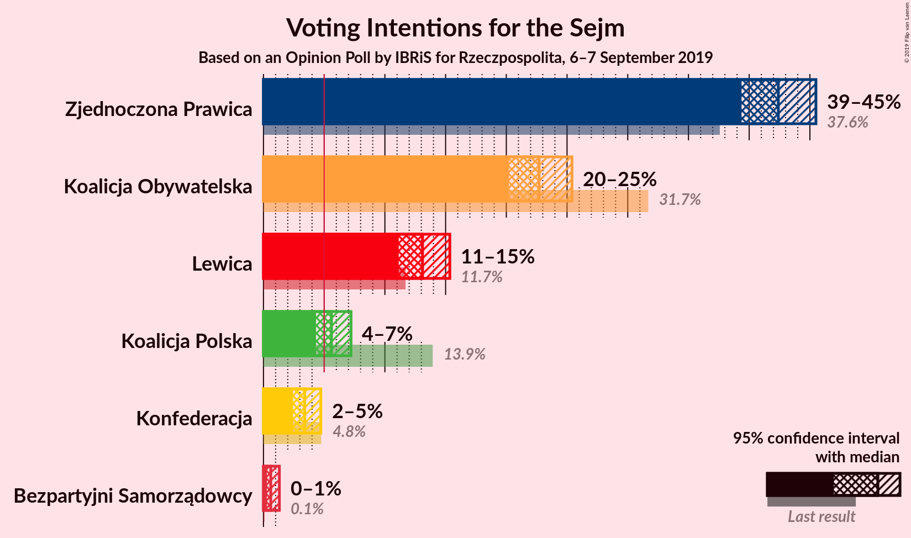

### Confidence Intervals

| Party | Last Result | Poll Result | 80% Confidence Interval | 90% Confidence Interval | 95% Confidence Interval | 99% Confidence Interval |
|:-----:|:-----------:|:-----------:|:-----------------------:|:-----------------------:|:-----------------------:|:-----------------------:|
| Zjednoczona Prawica | 37.6% | 42.4% | 40.4–44.4% |39.9–45.0% |39.4–45.5% |38.4–46.5% |
| Koalicja Obywatelska | 31.7% | 22.7% | 21.1–24.5% |20.6–25.0% |20.2–25.4% |19.4–26.3% |
| Lewica | 11.7% | 13.1% | 11.8–14.6% |11.4–15.0% |11.1–15.3% |10.6–16.1% |
| Koalicja Polska | 13.9% | 5.6% | 4.8–6.6% |4.5–7.0% |4.3–7.2% |4.0–7.7% |
| Konfederacja | 4.8% | 3.4% | 2.8–4.3% |2.6–4.5% |2.4–4.7% |2.2–5.2% |
| Bezpartyjni Samorządowcy | 0.1% | 0.6% | 0.4–1.1% |0.3–1.2% |0.3–1.3% |0.2–1.6% |

*Note:* The poll result column reflects the actual value used in the calculations. Published results may vary slightly, and in addition be rounded to fewer digits.

## Seats

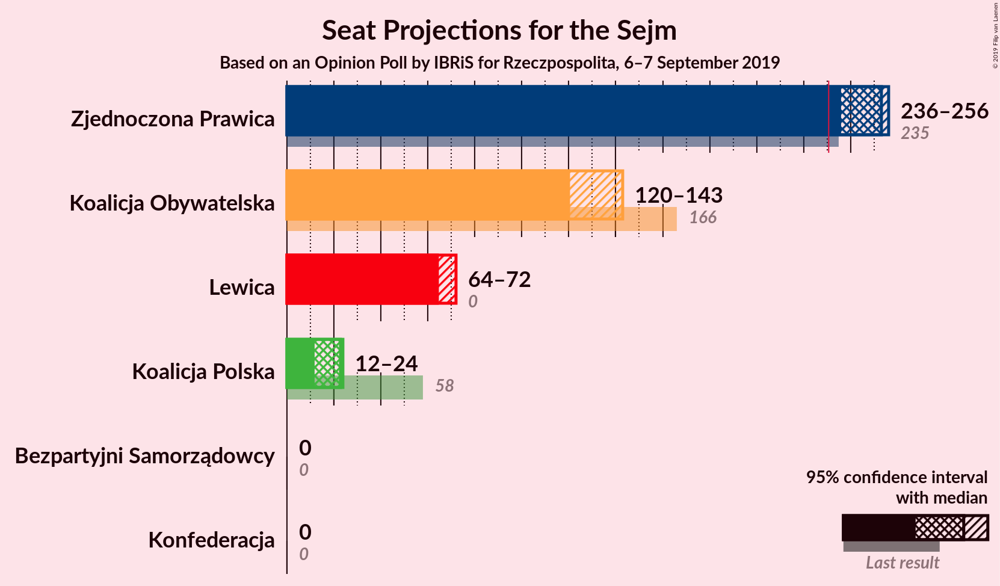

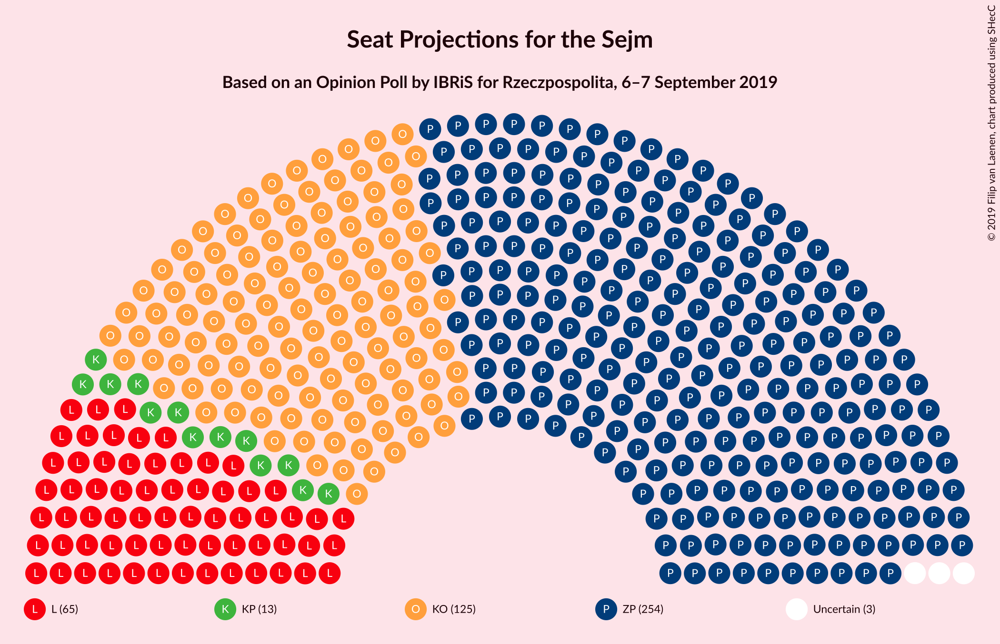

### Confidence Intervals

| Party | Last Result | Median | 80% Confidence Interval | 90% Confidence Interval | 95% Confidence Interval | 99% Confidence Interval |
|:-----:|:-----------:|:------:|:-----------------------:|:-----------------------:|:-----------------------:|:-----------------------:|
| <a href="#zjednoczona-prawica">Zjednoczona Prawica</a> | 235 | 254 | 242–271 |240–274 |237–276 |231–281 |
| <a href="#koalicja-obywatelska">Koalicja Obywatelska</a> | 166 | 125 | 114–140 |111–143 |109–145 |103–148 |
| <a href="#lewica">Lewica</a> | 0 | 65 | 56–75 |53–78 |51–79 |47–84 |
| <a href="#koalicja-polska">Koalicja Polska</a> | 58 | 13 | 0–24 |0–25 |0–26 |0–32 |
| <a href="#konfederacja">Konfederacja</a> | 0 | 0 | 0 |0 |0 |0–6 |
| <a href="#bezpartyjni-samorządowcy">Bezpartyjni Samorządowcy</a> | 0 | 0 | 0 |0 |0 |0 |

### Zjednoczona Prawica

*For a full overview of the results for this party, see the [Zjednoczona Prawica](party-zjednoczonaprawica.html) page.*

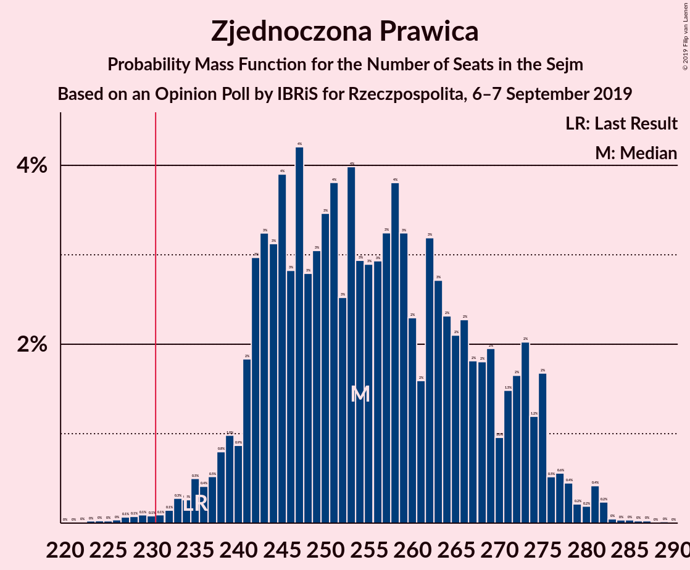

| Number of Seats | Probability | Accumulated | Special Marks |
|:---------------:|:-----------:|:-----------:|:-------------:|
| 223 | 0% | 100% |  |
| 224 | 0% | 99.9% |  |
| 225 | 0% | 99.9% |  |
| 226 | 0% | 99.9% |  |
| 227 | 0.1% | 99.8% |  |
| 228 | 0.1% | 99.8% |  |
| 229 | 0.1% | 99.7% |  |
| 230 | 0.1% | 99.6% |  |
| 231 | 0.1% | 99.5% | Majority |
| 232 | 0.1% | 99.4% |  |
| 233 | 0.3% | 99.3% |  |
| 234 | 0.3% | 99.0% |  |
| 235 | 0.5% | 98.7% | Last Result |
| 236 | 0.4% | 98% |  |
| 237 | 0.5% | 98% |  |
| 238 | 0.8% | 97% |  |
| 239 | 1.0% | 97% |  |
| 240 | 0.9% | 96% |  |
| 241 | 2% | 95% |  |
| 242 | 3% | 93% |  |
| 243 | 3% | 90% |  |
| 244 | 3% | 87% |  |
| 245 | 4% | 83% |  |
| 246 | 3% | 80% |  |
| 247 | 4% | 77% |  |
| 248 | 3% | 73% |  |
| 249 | 3% | 70% |  |
| 250 | 3% | 67% |  |
| 251 | 4% | 63% |  |
| 252 | 3% | 59% |  |
| 253 | 4% | 57% |  |
| 254 | 3% | 53% | Median |
| 255 | 3% | 50% |  |
| 256 | 3% | 47% |  |
| 257 | 3% | 44% |  |
| 258 | 4% | 41% |  |
| 259 | 3% | 37% |  |
| 260 | 2% | 34% |  |
| 261 | 2% | 32% |  |
| 262 | 3% | 30% |  |
| 263 | 3% | 27% |  |
| 264 | 2% | 24% |  |
| 265 | 2% | 22% |  |
| 266 | 2% | 20% |  |
| 267 | 2% | 17% |  |
| 268 | 2% | 16% |  |
| 269 | 2% | 14% |  |
| 270 | 1.0% | 12% |  |
| 271 | 1.5% | 11% |  |
| 272 | 2% | 9% |  |
| 273 | 2% | 8% |  |
| 274 | 1.2% | 6% |  |
| 275 | 2% | 4% |  |
| 276 | 0.5% | 3% |  |
| 277 | 0.6% | 2% |  |
| 278 | 0.4% | 2% |  |
| 279 | 0.2% | 1.3% |  |
| 280 | 0.2% | 1.1% |  |
| 281 | 0.4% | 0.9% |  |
| 282 | 0.2% | 0.5% |  |
| 283 | 0% | 0.2% |  |
| 284 | 0% | 0.2% |  |
| 285 | 0% | 0.1% |  |
| 286 | 0% | 0.1% |  |
| 287 | 0% | 0.1% |  |
| 288 | 0% | 0.1% |  |
| 289 | 0% | 0% |  |

### Koalicja Obywatelska

*For a full overview of the results for this party, see the [Koalicja Obywatelska](party-koalicjaobywatelska.html) page.*

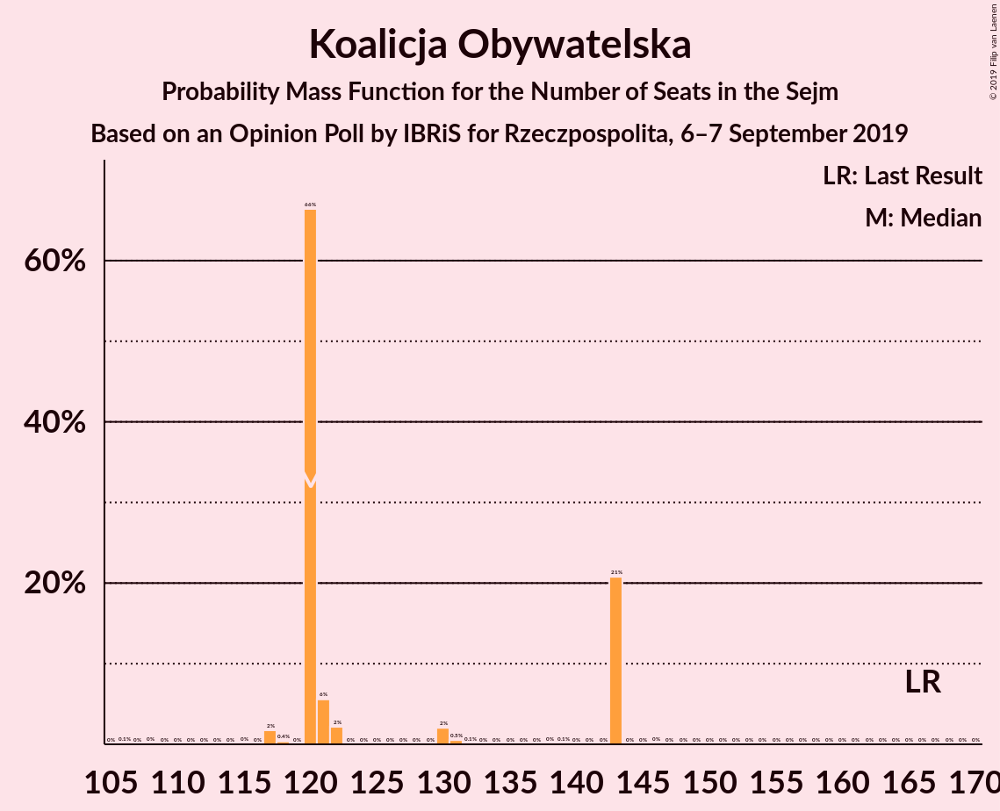

| Number of Seats | Probability | Accumulated | Special Marks |
|:---------------:|:-----------:|:-----------:|:-------------:|
| 97 | 0% | 100% |  |
| 98 | 0% | 99.9% |  |
| 99 | 0.1% | 99.9% |  |
| 100 | 0.1% | 99.8% |  |
| 101 | 0.1% | 99.8% |  |
| 102 | 0.1% | 99.7% |  |
| 103 | 0.2% | 99.5% |  |
| 104 | 0.3% | 99.3% |  |
| 105 | 0.2% | 99.1% |  |
| 106 | 0.3% | 98.8% |  |
| 107 | 0.3% | 98.5% |  |
| 108 | 0.6% | 98% |  |
| 109 | 0.9% | 98% |  |
| 110 | 0.9% | 97% |  |
| 111 | 1.1% | 96% |  |
| 112 | 3% | 95% |  |
| 113 | 2% | 92% |  |
| 114 | 2% | 91% |  |
| 115 | 4% | 89% |  |
| 116 | 5% | 85% |  |
| 117 | 2% | 80% |  |
| 118 | 3% | 78% |  |
| 119 | 4% | 75% |  |
| 120 | 5% | 71% |  |
| 121 | 4% | 66% |  |
| 122 | 3% | 62% |  |
| 123 | 4% | 58% |  |
| 124 | 3% | 54% |  |
| 125 | 4% | 52% | Median |
| 126 | 3% | 48% |  |
| 127 | 3% | 45% |  |
| 128 | 3% | 42% |  |
| 129 | 2% | 39% |  |
| 130 | 3% | 38% |  |
| 131 | 4% | 34% |  |
| 132 | 2% | 30% |  |
| 133 | 2% | 28% |  |
| 134 | 3% | 26% |  |
| 135 | 2% | 23% |  |
| 136 | 3% | 21% |  |
| 137 | 3% | 17% |  |
| 138 | 2% | 15% |  |
| 139 | 1.2% | 12% |  |
| 140 | 2% | 11% |  |
| 141 | 2% | 9% |  |
| 142 | 1.5% | 7% |  |
| 143 | 2% | 5% |  |
| 144 | 0.7% | 3% |  |
| 145 | 0.9% | 3% |  |
| 146 | 0.6% | 2% |  |
| 147 | 0.6% | 1.3% |  |
| 148 | 0.2% | 0.6% |  |
| 149 | 0.1% | 0.4% |  |
| 150 | 0.1% | 0.3% |  |
| 151 | 0.1% | 0.2% |  |
| 152 | 0% | 0.1% |  |
| 153 | 0% | 0.1% |  |
| 154 | 0% | 0% |  |
| 155 | 0% | 0% |  |
| 156 | 0% | 0% |  |
| 157 | 0% | 0% |  |
| 158 | 0% | 0% |  |
| 159 | 0% | 0% |  |
| 160 | 0% | 0% |  |
| 161 | 0% | 0% |  |
| 162 | 0% | 0% |  |
| 163 | 0% | 0% |  |
| 164 | 0% | 0% |  |
| 165 | 0% | 0% |  |
| 166 | 0% | 0% | Last Result |

### Lewica

*For a full overview of the results for this party, see the [Lewica](party-lewica.html) page.*

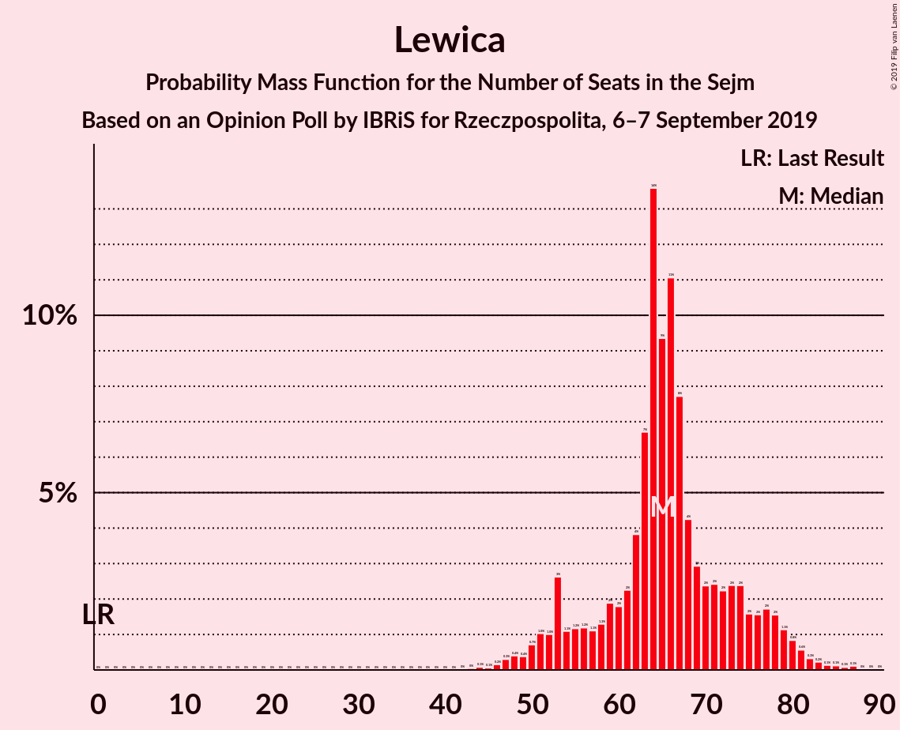

| Number of Seats | Probability | Accumulated | Special Marks |
|:---------------:|:-----------:|:-----------:|:-------------:|
| 0 | 0% | 100% | Last Result |
| 1 | 0% | 100% |  |
| 2 | 0% | 100% |  |
| 3 | 0% | 100% |  |
| 4 | 0% | 100% |  |
| 5 | 0% | 100% |  |
| 6 | 0% | 100% |  |
| 7 | 0% | 100% |  |
| 8 | 0% | 100% |  |
| 9 | 0% | 100% |  |
| 10 | 0% | 100% |  |
| 11 | 0% | 100% |  |
| 12 | 0% | 100% |  |
| 13 | 0% | 100% |  |
| 14 | 0% | 100% |  |
| 15 | 0% | 100% |  |
| 16 | 0% | 100% |  |
| 17 | 0% | 100% |  |
| 18 | 0% | 100% |  |
| 19 | 0% | 100% |  |
| 20 | 0% | 100% |  |
| 21 | 0% | 100% |  |
| 22 | 0% | 100% |  |
| 23 | 0% | 100% |  |
| 24 | 0% | 100% |  |
| 25 | 0% | 100% |  |
| 26 | 0% | 100% |  |
| 27 | 0% | 100% |  |
| 28 | 0% | 100% |  |
| 29 | 0% | 100% |  |
| 30 | 0% | 100% |  |
| 31 | 0% | 100% |  |
| 32 | 0% | 100% |  |
| 33 | 0% | 100% |  |
| 34 | 0% | 100% |  |
| 35 | 0% | 100% |  |
| 36 | 0% | 100% |  |
| 37 | 0% | 100% |  |
| 38 | 0% | 100% |  |
| 39 | 0% | 100% |  |
| 40 | 0% | 100% |  |
| 41 | 0% | 100% |  |
| 42 | 0% | 100% |  |
| 43 | 0% | 100% |  |
| 44 | 0.1% | 99.9% |  |
| 45 | 0.1% | 99.8% |  |
| 46 | 0.2% | 99.8% |  |
| 47 | 0.3% | 99.6% |  |
| 48 | 0.4% | 99.3% |  |
| 49 | 0.4% | 98.9% |  |
| 50 | 0.7% | 98.5% |  |
| 51 | 1.0% | 98% |  |
| 52 | 1.0% | 97% |  |
| 53 | 3% | 96% |  |
| 54 | 1.1% | 93% |  |
| 55 | 1.2% | 92% |  |
| 56 | 1.2% | 91% |  |
| 57 | 1.1% | 90% |  |
| 58 | 1.3% | 89% |  |
| 59 | 2% | 87% |  |
| 60 | 2% | 85% |  |
| 61 | 2% | 84% |  |
| 62 | 4% | 81% |  |
| 63 | 7% | 77% |  |
| 64 | 14% | 71% |  |
| 65 | 9% | 57% | Median |
| 66 | 11% | 48% |  |
| 67 | 8% | 37% |  |
| 68 | 4% | 29% |  |
| 69 | 3% | 25% |  |
| 70 | 2% | 22% |  |
| 71 | 2% | 19% |  |
| 72 | 2% | 17% |  |
| 73 | 2% | 15% |  |
| 74 | 2% | 12% |  |
| 75 | 2% | 10% |  |
| 76 | 2% | 8% |  |
| 77 | 2% | 7% |  |
| 78 | 2% | 5% |  |
| 79 | 1.1% | 4% |  |
| 80 | 0.8% | 2% |  |
| 81 | 0.6% | 2% |  |
| 82 | 0.3% | 1.1% |  |
| 83 | 0.2% | 0.8% |  |
| 84 | 0.1% | 0.5% |  |
| 85 | 0.1% | 0.4% |  |
| 86 | 0.1% | 0.3% |  |
| 87 | 0.1% | 0.2% |  |
| 88 | 0% | 0.1% |  |
| 89 | 0% | 0.1% |  |
| 90 | 0% | 0% |  |

### Koalicja Polska

*For a full overview of the results for this party, see the [Koalicja Polska](party-koalicjapolska.html) page.*

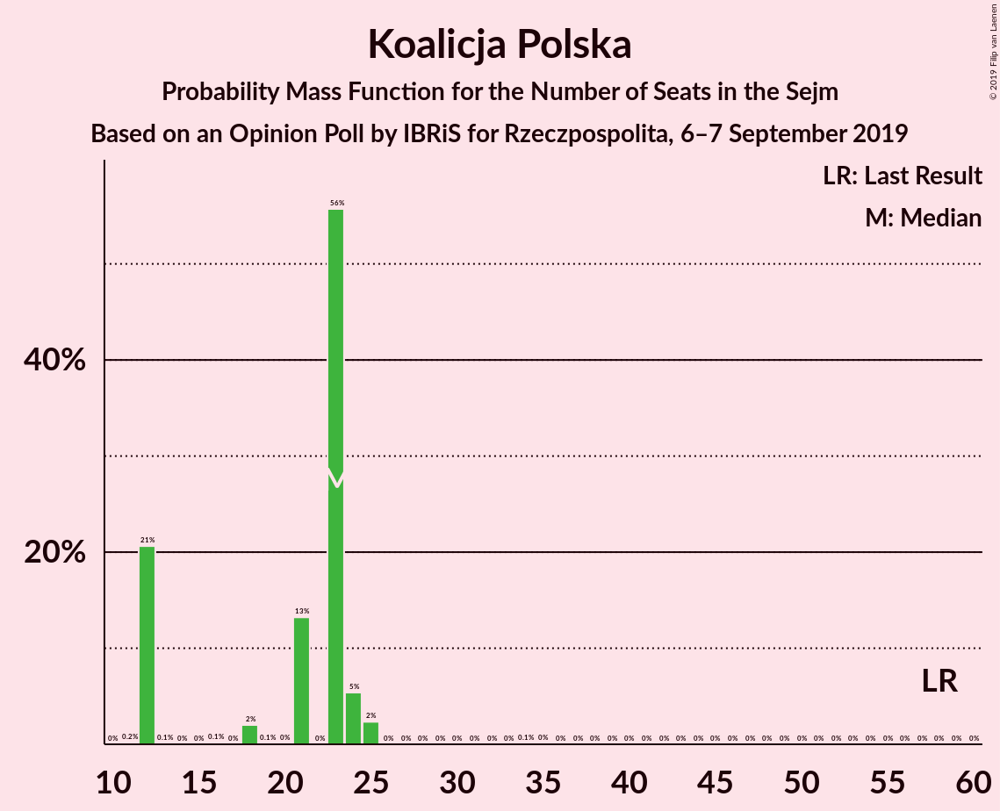

| Number of Seats | Probability | Accumulated | Special Marks |
|:---------------:|:-----------:|:-----------:|:-------------:|
| 0 | 18% | 100% |  |
| 1 | 0% | 82% |  |
| 2 | 0% | 82% |  |
| 3 | 0% | 82% |  |
| 4 | 0% | 82% |  |
| 5 | 0% | 82% |  |
| 6 | 0% | 82% |  |
| 7 | 2% | 82% |  |
| 8 | 4% | 80% |  |
| 9 | 5% | 77% |  |
| 10 | 6% | 72% |  |
| 11 | 6% | 66% |  |
| 12 | 8% | 60% |  |
| 13 | 7% | 52% | Median |
| 14 | 2% | 45% |  |
| 15 | 3% | 43% |  |
| 16 | 9% | 40% |  |
| 17 | 3% | 31% |  |
| 18 | 2% | 28% |  |
| 19 | 2% | 26% |  |
| 20 | 1.2% | 24% |  |
| 21 | 3% | 23% |  |
| 22 | 2% | 20% |  |
| 23 | 5% | 18% |  |
| 24 | 5% | 13% |  |
| 25 | 4% | 8% |  |
| 26 | 2% | 4% |  |
| 27 | 0.6% | 2% |  |
| 28 | 0.4% | 2% |  |
| 29 | 0.4% | 1.4% |  |
| 30 | 0.2% | 0.9% |  |
| 31 | 0.2% | 0.7% |  |
| 32 | 0.1% | 0.5% |  |
| 33 | 0.1% | 0.4% |  |
| 34 | 0.1% | 0.2% |  |
| 35 | 0.1% | 0.2% |  |
| 36 | 0% | 0.1% |  |
| 37 | 0% | 0.1% |  |
| 38 | 0% | 0% |  |
| 39 | 0% | 0% |  |
| 40 | 0% | 0% |  |
| 41 | 0% | 0% |  |
| 42 | 0% | 0% |  |
| 43 | 0% | 0% |  |
| 44 | 0% | 0% |  |
| 45 | 0% | 0% |  |
| 46 | 0% | 0% |  |
| 47 | 0% | 0% |  |
| 48 | 0% | 0% |  |
| 49 | 0% | 0% |  |
| 50 | 0% | 0% |  |
| 51 | 0% | 0% |  |
| 52 | 0% | 0% |  |
| 53 | 0% | 0% |  |
| 54 | 0% | 0% |  |
| 55 | 0% | 0% |  |
| 56 | 0% | 0% |  |
| 57 | 0% | 0% |  |
| 58 | 0% | 0% | Last Result |

### Konfederacja

*For a full overview of the results for this party, see the [Konfederacja](party-konfederacja.html) page.*

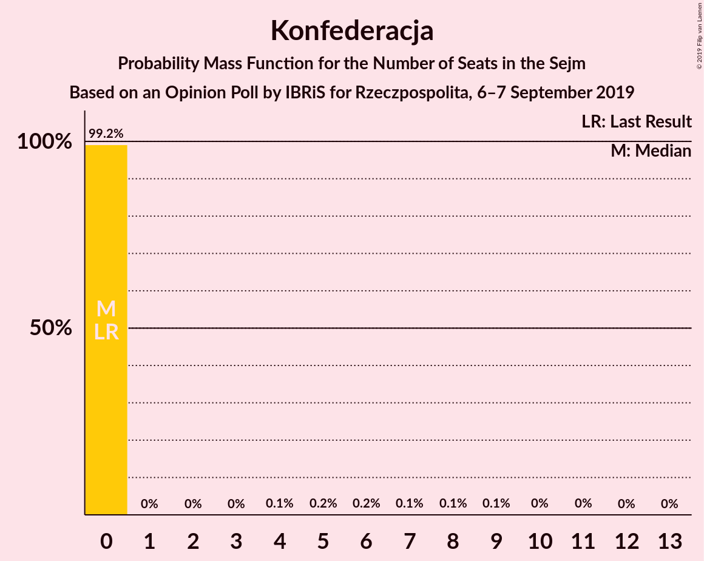

| Number of Seats | Probability | Accumulated | Special Marks |
|:---------------:|:-----------:|:-----------:|:-------------:|
| 0 | 99.2% | 100% | Last Result, Median |
| 1 | 0% | 0.8% |  |
| 2 | 0% | 0.8% |  |
| 3 | 0% | 0.8% |  |
| 4 | 0.1% | 0.8% |  |
| 5 | 0.2% | 0.7% |  |
| 6 | 0.2% | 0.5% |  |
| 7 | 0.1% | 0.4% |  |
| 8 | 0.1% | 0.3% |  |
| 9 | 0.1% | 0.2% |  |
| 10 | 0% | 0.1% |  |
| 11 | 0% | 0.1% |  |
| 12 | 0% | 0.1% |  |
| 13 | 0% | 0% |  |

### Bezpartyjni Samorządowcy

*For a full overview of the results for this party, see the [Bezpartyjni Samorządowcy](party-bezpartyjnisamorządowcy.html) page.*

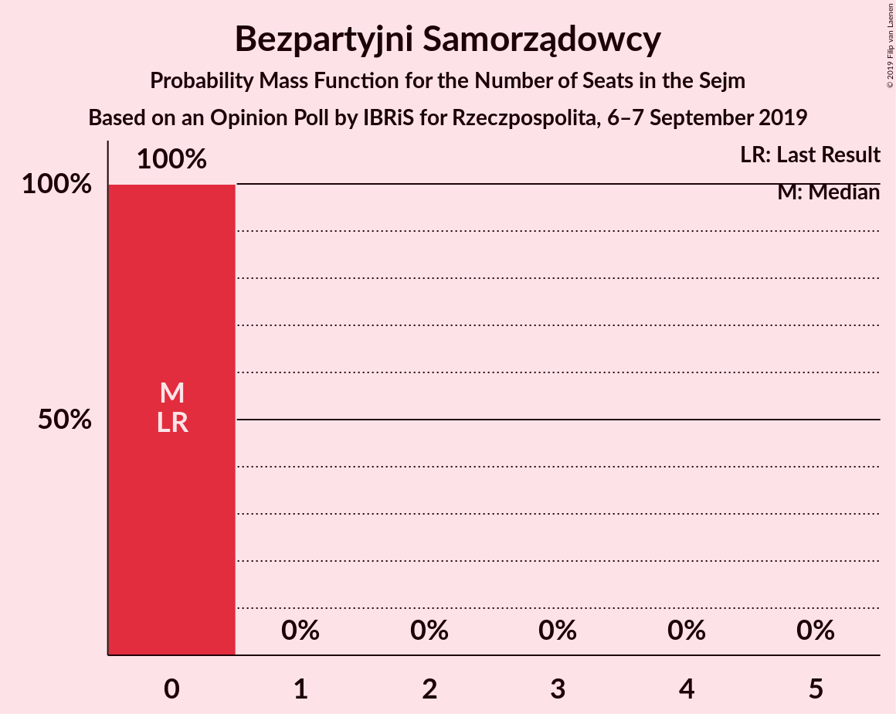

| Number of Seats | Probability | Accumulated | Special Marks |
|:---------------:|:-----------:|:-----------:|:-------------:|
| 0 | 100% | 100% | Last Result, Median |

## Coalitions

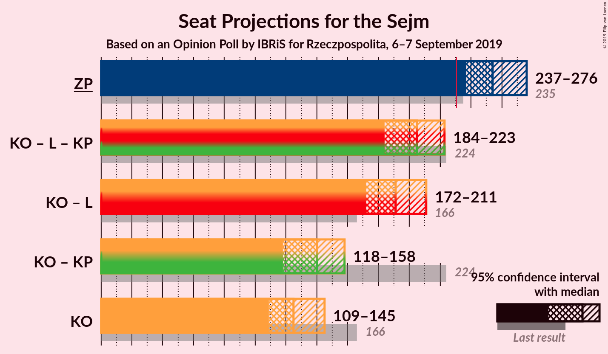

### Confidence Intervals

| Coalition | Last Result | Median | Majority? | 80% Confidence Interval | 90% Confidence Interval | 95% Confidence Interval | 99% Confidence Interval |
|:---------:|:-----------:|:------:|:---------:|:-----------------------:|:-----------------------:|:-----------------------:|:-----------------------:|
| Zjednoczona Prawica | 235 | 254 | 99.5% | 242–271 | 240–274 | 237–276 | 231–281 |
| Koalicja Obywatelska – Lewica – Koalicja Polska | 224 | 205 | 0.4% | 189–218 | 186–220 | 184–223 | 179–229 |
| Koalicja Obywatelska – Lewica | 166 | 191 | 0% | 178–206 | 174–209 | 172–211 | 166–216 |
| Koalicja Obywatelska – Koalicja Polska | 224 | 140 | 0% | 124–153 | 121–155 | 118–158 | 110–163 |
| Koalicja Obywatelska | 166 | 125 | 0% | 114–140 | 111–143 | 109–145 | 103–148 |

### Zjednoczona Prawica

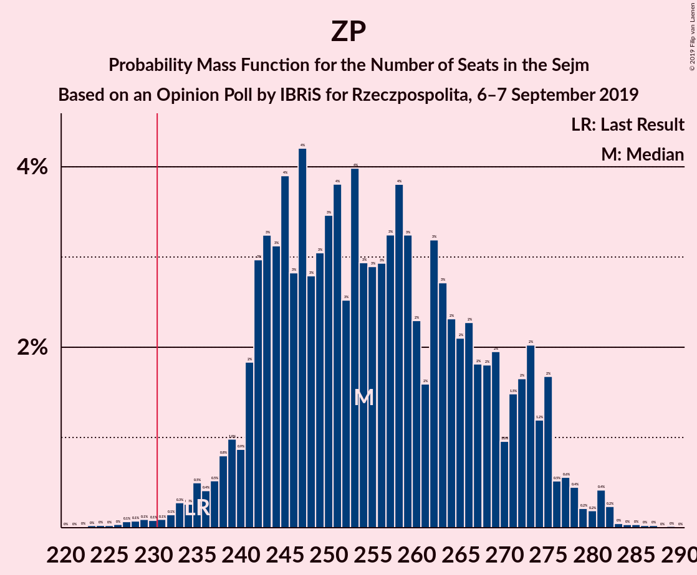

| Number of Seats | Probability | Accumulated | Special Marks |
|:---------------:|:-----------:|:-----------:|:-------------:|
| 223 | 0% | 100% |  |
| 224 | 0% | 99.9% |  |
| 225 | 0% | 99.9% |  |
| 226 | 0% | 99.9% |  |
| 227 | 0.1% | 99.8% |  |
| 228 | 0.1% | 99.8% |  |
| 229 | 0.1% | 99.7% |  |
| 230 | 0.1% | 99.6% |  |
| 231 | 0.1% | 99.5% | Majority |
| 232 | 0.1% | 99.4% |  |
| 233 | 0.3% | 99.3% |  |
| 234 | 0.3% | 99.0% |  |
| 235 | 0.5% | 98.7% | Last Result |
| 236 | 0.4% | 98% |  |
| 237 | 0.5% | 98% |  |
| 238 | 0.8% | 97% |  |
| 239 | 1.0% | 97% |  |
| 240 | 0.9% | 96% |  |
| 241 | 2% | 95% |  |
| 242 | 3% | 93% |  |
| 243 | 3% | 90% |  |
| 244 | 3% | 87% |  |
| 245 | 4% | 83% |  |
| 246 | 3% | 80% |  |
| 247 | 4% | 77% |  |
| 248 | 3% | 73% |  |
| 249 | 3% | 70% |  |
| 250 | 3% | 67% |  |
| 251 | 4% | 63% |  |
| 252 | 3% | 59% |  |
| 253 | 4% | 57% |  |
| 254 | 3% | 53% | Median |
| 255 | 3% | 50% |  |
| 256 | 3% | 47% |  |
| 257 | 3% | 44% |  |
| 258 | 4% | 41% |  |
| 259 | 3% | 37% |  |
| 260 | 2% | 34% |  |
| 261 | 2% | 32% |  |
| 262 | 3% | 30% |  |
| 263 | 3% | 27% |  |
| 264 | 2% | 24% |  |
| 265 | 2% | 22% |  |
| 266 | 2% | 20% |  |
| 267 | 2% | 17% |  |
| 268 | 2% | 16% |  |
| 269 | 2% | 14% |  |
| 270 | 1.0% | 12% |  |
| 271 | 1.5% | 11% |  |
| 272 | 2% | 9% |  |
| 273 | 2% | 8% |  |
| 274 | 1.2% | 6% |  |
| 275 | 2% | 4% |  |
| 276 | 0.5% | 3% |  |
| 277 | 0.6% | 2% |  |
| 278 | 0.4% | 2% |  |
| 279 | 0.2% | 1.3% |  |
| 280 | 0.2% | 1.1% |  |
| 281 | 0.4% | 0.9% |  |
| 282 | 0.2% | 0.5% |  |
| 283 | 0% | 0.2% |  |
| 284 | 0% | 0.2% |  |
| 285 | 0% | 0.1% |  |
| 286 | 0% | 0.1% |  |
| 287 | 0% | 0.1% |  |
| 288 | 0% | 0.1% |  |
| 289 | 0% | 0% |  |

### Koalicja Obywatelska – Lewica – Koalicja Polska

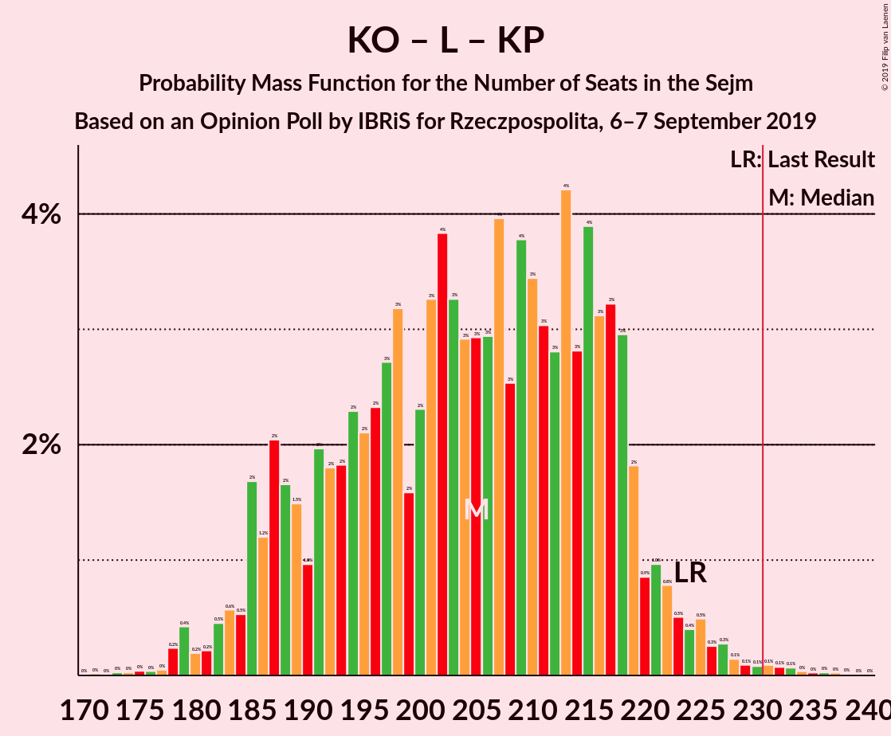

| Number of Seats | Probability | Accumulated | Special Marks |
|:---------------:|:-----------:|:-----------:|:-------------:|
| 171 | 0% | 100% |  |
| 172 | 0% | 99.9% |  |
| 173 | 0% | 99.9% |  |
| 174 | 0% | 99.9% |  |
| 175 | 0% | 99.9% |  |
| 176 | 0% | 99.8% |  |
| 177 | 0% | 99.8% |  |
| 178 | 0.2% | 99.8% |  |
| 179 | 0.4% | 99.5% |  |
| 180 | 0.2% | 99.1% |  |
| 181 | 0.2% | 98.9% |  |
| 182 | 0.5% | 98.7% |  |
| 183 | 0.6% | 98% |  |
| 184 | 0.5% | 98% |  |
| 185 | 2% | 97% |  |
| 186 | 1.2% | 95% |  |
| 187 | 2% | 94% |  |
| 188 | 2% | 92% |  |
| 189 | 1.5% | 91% |  |
| 190 | 1.0% | 89% |  |
| 191 | 2% | 88% |  |
| 192 | 2% | 86% |  |
| 193 | 2% | 84% |  |
| 194 | 2% | 83% |  |
| 195 | 2% | 80% |  |
| 196 | 2% | 78% |  |
| 197 | 3% | 76% |  |
| 198 | 3% | 73% |  |
| 199 | 2% | 70% |  |
| 200 | 2% | 68% |  |
| 201 | 3% | 66% |  |
| 202 | 4% | 63% |  |
| 203 | 3% | 59% | Median |
| 204 | 3% | 56% |  |
| 205 | 3% | 53% |  |
| 206 | 3% | 50% |  |
| 207 | 4% | 47% |  |
| 208 | 3% | 43% |  |
| 209 | 4% | 40% |  |
| 210 | 3% | 37% |  |
| 211 | 3% | 33% |  |
| 212 | 3% | 30% |  |
| 213 | 4% | 27% |  |
| 214 | 3% | 23% |  |
| 215 | 4% | 20% |  |
| 216 | 3% | 16% |  |
| 217 | 3% | 13% |  |
| 218 | 3% | 10% |  |
| 219 | 2% | 7% |  |
| 220 | 0.9% | 5% |  |
| 221 | 1.0% | 4% |  |
| 222 | 0.8% | 3% |  |
| 223 | 0.5% | 3% |  |
| 224 | 0.4% | 2% | Last Result |
| 225 | 0.5% | 2% |  |
| 226 | 0.3% | 1.2% |  |
| 227 | 0.3% | 1.0% |  |
| 228 | 0.1% | 0.7% |  |
| 229 | 0.1% | 0.6% |  |
| 230 | 0.1% | 0.5% |  |
| 231 | 0.1% | 0.4% | Majority |
| 232 | 0.1% | 0.3% |  |
| 233 | 0.1% | 0.2% |  |
| 234 | 0% | 0.2% |  |
| 235 | 0% | 0.1% |  |
| 236 | 0% | 0.1% |  |
| 237 | 0% | 0.1% |  |
| 238 | 0% | 0% |  |

### Koalicja Obywatelska – Lewica

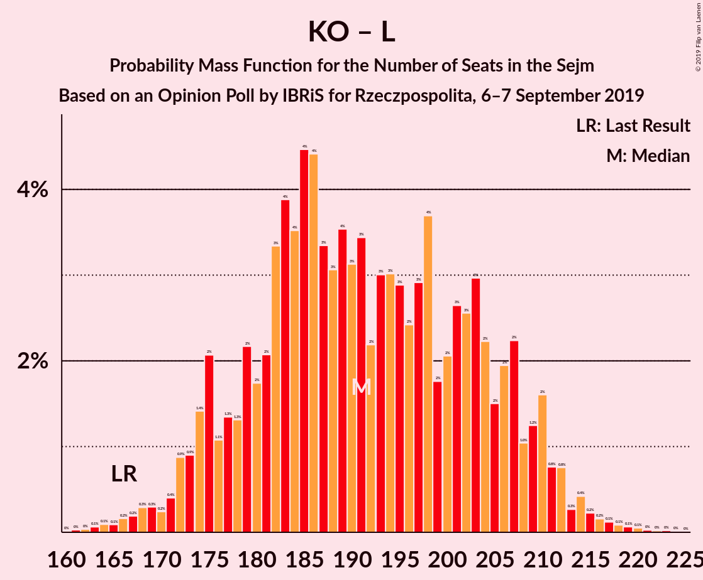

| Number of Seats | Probability | Accumulated | Special Marks |
|:---------------:|:-----------:|:-----------:|:-------------:|
| 160 | 0% | 100% |  |
| 161 | 0% | 99.9% |  |
| 162 | 0% | 99.9% |  |
| 163 | 0.1% | 99.9% |  |
| 164 | 0.1% | 99.8% |  |
| 165 | 0.1% | 99.7% |  |
| 166 | 0.2% | 99.6% | Last Result |
| 167 | 0.2% | 99.5% |  |
| 168 | 0.3% | 99.3% |  |
| 169 | 0.3% | 99.0% |  |
| 170 | 0.2% | 98.7% |  |
| 171 | 0.4% | 98% |  |
| 172 | 0.9% | 98% |  |
| 173 | 0.9% | 97% |  |
| 174 | 1.4% | 96% |  |
| 175 | 2% | 95% |  |
| 176 | 1.1% | 93% |  |
| 177 | 1.3% | 92% |  |
| 178 | 1.3% | 90% |  |
| 179 | 2% | 89% |  |
| 180 | 2% | 87% |  |
| 181 | 2% | 85% |  |
| 182 | 3% | 83% |  |
| 183 | 4% | 80% |  |
| 184 | 4% | 76% |  |
| 185 | 4% | 72% |  |
| 186 | 4% | 68% |  |
| 187 | 3% | 63% |  |
| 188 | 3% | 60% |  |
| 189 | 4% | 57% |  |
| 190 | 3% | 54% | Median |
| 191 | 3% | 50% |  |
| 192 | 2% | 47% |  |
| 193 | 3% | 45% |  |
| 194 | 3% | 42% |  |
| 195 | 3% | 39% |  |
| 196 | 2% | 36% |  |
| 197 | 3% | 33% |  |
| 198 | 4% | 31% |  |
| 199 | 2% | 27% |  |
| 200 | 2% | 25% |  |
| 201 | 3% | 23% |  |
| 202 | 3% | 20% |  |
| 203 | 3% | 18% |  |
| 204 | 2% | 15% |  |
| 205 | 2% | 13% |  |
| 206 | 2% | 11% |  |
| 207 | 2% | 9% |  |
| 208 | 1.0% | 7% |  |
| 209 | 1.2% | 6% |  |
| 210 | 2% | 5% |  |
| 211 | 0.8% | 3% |  |
| 212 | 0.8% | 2% |  |
| 213 | 0.3% | 1.5% |  |
| 214 | 0.4% | 1.2% |  |
| 215 | 0.2% | 0.8% |  |
| 216 | 0.2% | 0.6% |  |
| 217 | 0.1% | 0.4% |  |
| 218 | 0.1% | 0.3% |  |
| 219 | 0.1% | 0.2% |  |
| 220 | 0.1% | 0.2% |  |
| 221 | 0% | 0.1% |  |
| 222 | 0% | 0.1% |  |
| 223 | 0% | 0.1% |  |
| 224 | 0% | 0% |  |

### Koalicja Obywatelska – Koalicja Polska

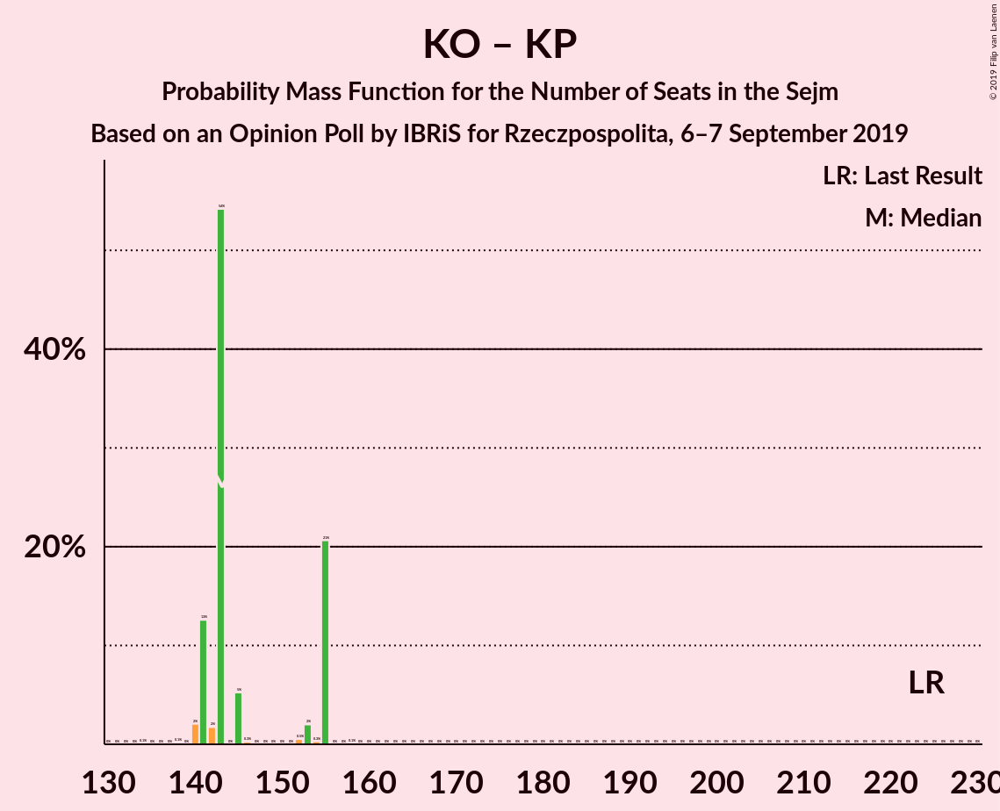

| Number of Seats | Probability | Accumulated | Special Marks |
|:---------------:|:-----------:|:-----------:|:-------------:|
| 105 | 0% | 100% |  |
| 106 | 0% | 99.9% |  |
| 107 | 0.1% | 99.9% |  |
| 108 | 0% | 99.9% |  |
| 109 | 0.1% | 99.8% |  |
| 110 | 0.3% | 99.7% |  |
| 111 | 0% | 99.5% |  |
| 112 | 0.1% | 99.4% |  |
| 113 | 0.4% | 99.3% |  |
| 114 | 0.5% | 99.0% |  |
| 115 | 0.2% | 98.5% |  |
| 116 | 0.3% | 98% |  |
| 117 | 0.4% | 98% |  |
| 118 | 0.4% | 98% |  |
| 119 | 1.2% | 97% |  |
| 120 | 0.8% | 96% |  |
| 121 | 1.1% | 95% |  |
| 122 | 0.9% | 94% |  |
| 123 | 2% | 93% |  |
| 124 | 2% | 91% |  |
| 125 | 2% | 90% |  |
| 126 | 2% | 88% |  |
| 127 | 2% | 85% |  |
| 128 | 3% | 83% |  |
| 129 | 2% | 80% |  |
| 130 | 2% | 78% |  |
| 131 | 3% | 76% |  |
| 132 | 3% | 72% |  |
| 133 | 3% | 70% |  |
| 134 | 3% | 67% |  |
| 135 | 2% | 64% |  |
| 136 | 2% | 62% |  |
| 137 | 3% | 59% |  |
| 138 | 4% | 56% | Median |
| 139 | 2% | 52% |  |
| 140 | 3% | 50% |  |
| 141 | 3% | 47% |  |
| 142 | 3% | 44% |  |
| 143 | 3% | 41% |  |
| 144 | 3% | 38% |  |
| 145 | 2% | 36% |  |
| 146 | 3% | 33% |  |
| 147 | 4% | 30% |  |
| 148 | 3% | 26% |  |
| 149 | 2% | 22% |  |
| 150 | 3% | 21% |  |
| 151 | 3% | 18% |  |
| 152 | 3% | 15% |  |
| 153 | 3% | 12% |  |
| 154 | 3% | 9% |  |
| 155 | 2% | 6% |  |
| 156 | 1.0% | 4% |  |
| 157 | 0.9% | 3% |  |
| 158 | 0.5% | 3% |  |
| 159 | 0.7% | 2% |  |
| 160 | 0.2% | 1.3% |  |
| 161 | 0.2% | 1.1% |  |
| 162 | 0.3% | 0.9% |  |
| 163 | 0.2% | 0.6% |  |
| 164 | 0.1% | 0.5% |  |
| 165 | 0.1% | 0.4% |  |
| 166 | 0.1% | 0.3% |  |
| 167 | 0.1% | 0.2% |  |
| 168 | 0% | 0.2% |  |
| 169 | 0% | 0.1% |  |
| 170 | 0% | 0.1% |  |
| 171 | 0% | 0.1% |  |
| 172 | 0% | 0.1% |  |
| 173 | 0% | 0% |  |
| 174 | 0% | 0% |  |
| 175 | 0% | 0% |  |
| 176 | 0% | 0% |  |
| 177 | 0% | 0% |  |
| 178 | 0% | 0% |  |
| 179 | 0% | 0% |  |
| 180 | 0% | 0% |  |
| 181 | 0% | 0% |  |
| 182 | 0% | 0% |  |
| 183 | 0% | 0% |  |
| 184 | 0% | 0% |  |
| 185 | 0% | 0% |  |
| 186 | 0% | 0% |  |
| 187 | 0% | 0% |  |
| 188 | 0% | 0% |  |
| 189 | 0% | 0% |  |
| 190 | 0% | 0% |  |
| 191 | 0% | 0% |  |
| 192 | 0% | 0% |  |
| 193 | 0% | 0% |  |
| 194 | 0% | 0% |  |
| 195 | 0% | 0% |  |
| 196 | 0% | 0% |  |
| 197 | 0% | 0% |  |
| 198 | 0% | 0% |  |
| 199 | 0% | 0% |  |
| 200 | 0% | 0% |  |
| 201 | 0% | 0% |  |
| 202 | 0% | 0% |  |
| 203 | 0% | 0% |  |
| 204 | 0% | 0% |  |
| 205 | 0% | 0% |  |
| 206 | 0% | 0% |  |
| 207 | 0% | 0% |  |
| 208 | 0% | 0% |  |
| 209 | 0% | 0% |  |
| 210 | 0% | 0% |  |
| 211 | 0% | 0% |  |
| 212 | 0% | 0% |  |
| 213 | 0% | 0% |  |
| 214 | 0% | 0% |  |
| 215 | 0% | 0% |  |
| 216 | 0% | 0% |  |
| 217 | 0% | 0% |  |
| 218 | 0% | 0% |  |
| 219 | 0% | 0% |  |
| 220 | 0% | 0% |  |
| 221 | 0% | 0% |  |
| 222 | 0% | 0% |  |
| 223 | 0% | 0% |  |
| 224 | 0% | 0% | Last Result |

### Koalicja Obywatelska

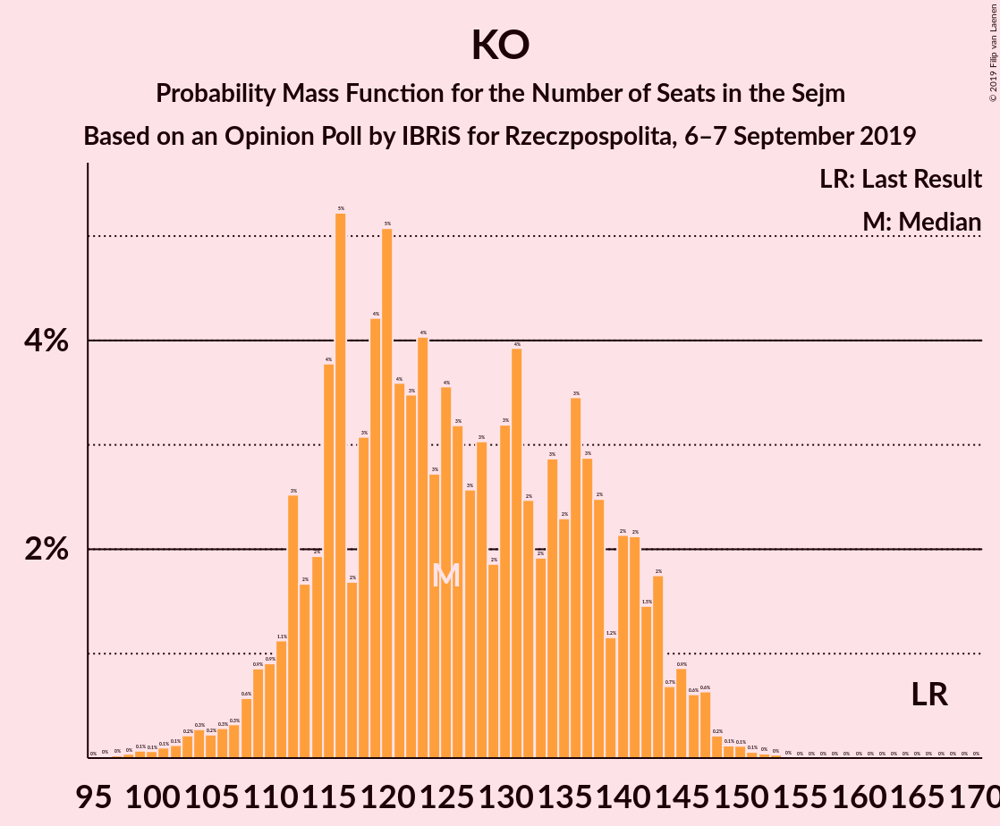

| Number of Seats | Probability | Accumulated | Special Marks |
|:---------------:|:-----------:|:-----------:|:-------------:|
| 97 | 0% | 100% |  |
| 98 | 0% | 99.9% |  |
| 99 | 0.1% | 99.9% |  |
| 100 | 0.1% | 99.8% |  |
| 101 | 0.1% | 99.8% |  |
| 102 | 0.1% | 99.7% |  |
| 103 | 0.2% | 99.5% |  |
| 104 | 0.3% | 99.3% |  |
| 105 | 0.2% | 99.1% |  |
| 106 | 0.3% | 98.8% |  |
| 107 | 0.3% | 98.5% |  |
| 108 | 0.6% | 98% |  |
| 109 | 0.9% | 98% |  |
| 110 | 0.9% | 97% |  |
| 111 | 1.1% | 96% |  |
| 112 | 3% | 95% |  |
| 113 | 2% | 92% |  |
| 114 | 2% | 91% |  |
| 115 | 4% | 89% |  |
| 116 | 5% | 85% |  |
| 117 | 2% | 80% |  |
| 118 | 3% | 78% |  |
| 119 | 4% | 75% |  |
| 120 | 5% | 71% |  |
| 121 | 4% | 66% |  |
| 122 | 3% | 62% |  |
| 123 | 4% | 58% |  |
| 124 | 3% | 54% |  |
| 125 | 4% | 52% | Median |
| 126 | 3% | 48% |  |
| 127 | 3% | 45% |  |
| 128 | 3% | 42% |  |
| 129 | 2% | 39% |  |
| 130 | 3% | 38% |  |
| 131 | 4% | 34% |  |
| 132 | 2% | 30% |  |
| 133 | 2% | 28% |  |
| 134 | 3% | 26% |  |
| 135 | 2% | 23% |  |
| 136 | 3% | 21% |  |
| 137 | 3% | 17% |  |
| 138 | 2% | 15% |  |
| 139 | 1.2% | 12% |  |
| 140 | 2% | 11% |  |
| 141 | 2% | 9% |  |
| 142 | 1.5% | 7% |  |
| 143 | 2% | 5% |  |
| 144 | 0.7% | 3% |  |
| 145 | 0.9% | 3% |  |
| 146 | 0.6% | 2% |  |
| 147 | 0.6% | 1.3% |  |
| 148 | 0.2% | 0.6% |  |
| 149 | 0.1% | 0.4% |  |
| 150 | 0.1% | 0.3% |  |
| 151 | 0.1% | 0.2% |  |
| 152 | 0% | 0.1% |  |
| 153 | 0% | 0.1% |  |
| 154 | 0% | 0% |  |
| 155 | 0% | 0% |  |
| 156 | 0% | 0% |  |
| 157 | 0% | 0% |  |
| 158 | 0% | 0% |  |
| 159 | 0% | 0% |  |
| 160 | 0% | 0% |  |
| 161 | 0% | 0% |  |
| 162 | 0% | 0% |  |
| 163 | 0% | 0% |  |
| 164 | 0% | 0% |  |
| 165 | 0% | 0% |  |
| 166 | 0% | 0% | Last Result |

## Technical Information

### Opinion Poll

+ **Polling firm:** IBRiS
+ **Commissioner(s):** Rzeczpospolita
+ **Fieldwork period:** 6–7 September 2019

### Calculations

+ **Sample size:** 1000
+ **Simulations done:** 1,048,576
+ **Error estimate:** 0.98%

