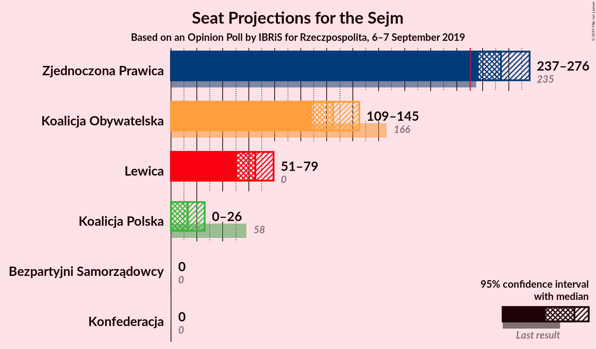
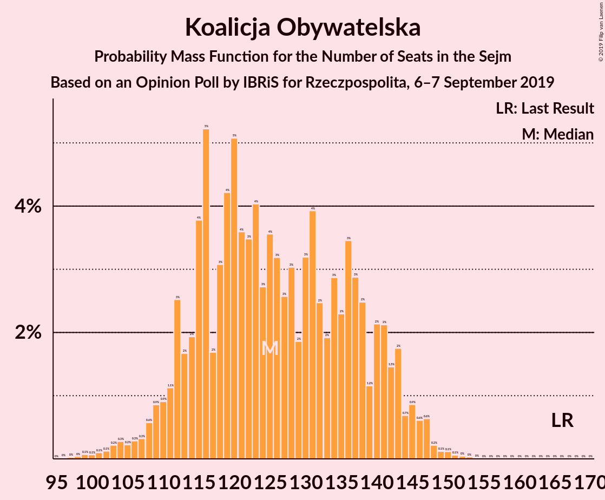
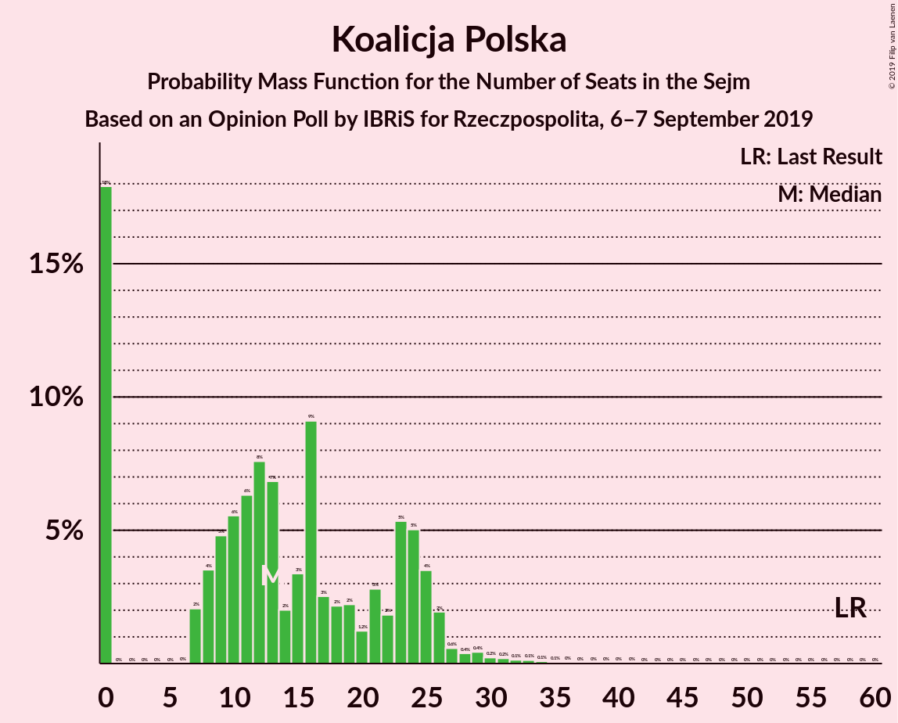

# Opinion Poll by IBRiS for Rzeczpospolita, 6–7 September 2019

<a href="#voting-intentions">Voting Intentions</a> | <a href="#seats">Seats</a> | <a href="#coalitions">Coalitions</a> | <a href="#technical-information">Technical Information</a>

## Voting Intentions

### Confidence Intervals

| Party | Last Result | Poll Result | 80% Confidence Interval | 90% Confidence Interval | 95% Confidence Interval | 99% Confidence Interval |
|:-----:|:-----------:|:-----------:|:-----------------------:|:-----------------------:|:-----------------------:|:-----------------------:|
| Zjednoczona Prawica | 37.6% | 42.4% | 40.4–44.4% |39.9–45.0% |39.4–45.5% |38.4–46.5% |
| Koalicja Obywatelska | 31.7% | 22.7% | 21.1–24.5% |20.6–25.0% |20.2–25.4% |19.4–26.3% |
| Lewica | 11.7% | 13.1% | 11.8–14.6% |11.4–15.0% |11.1–15.3% |10.6–16.1% |
| Koalicja Polska | 13.9% | 5.6% | 4.8–6.6% |4.5–7.0% |4.3–7.2% |4.0–7.7% |
| Konfederacja | 4.8% | 3.4% | 2.8–4.3% |2.6–4.5% |2.4–4.7% |2.2–5.2% |
| Bezpartyjni Samorządowcy | 0.1% | 0.6% | 0.4–1.1% |0.3–1.2% |0.3–1.3% |0.2–1.6% |

*Note:* The poll result column reflects the actual value used in the calculations. Published results may vary slightly, and in addition be rounded to fewer digits.

## Seats

### Confidence Intervals

| Party | Last Result | Median | 80% Confidence Interval | 90% Confidence Interval | 95% Confidence Interval | 99% Confidence Interval |
|:-----:|:-----------:|:------:|:-----------------------:|:-----------------------:|:-----------------------:|:-----------------------:|
| <a href="#zjednoczona-prawica">Zjednoczona Prawica</a> | 235 | 253 | 241–255 |241–255 |236–256 |234–263 |
| <a href="#koalicja-obywatelska">Koalicja Obywatelska</a> | 166 | 120 | 120–143 |120–143 |120–143 |117–143 |
| <a href="#lewica">Lewica</a> | 0 | 64 | 64 |64 |64–72 |55–73 |
| <a href="#koalicja-polska">Koalicja Polska</a> | 58 | 23 | 12–23 |12–24 |12–24 |12–25 |
| <a href="#konfederacja">Konfederacja</a> | 0 | 0 | 0 |0 |0 |0 |
| <a href="#bezpartyjni-samorządowcy">Bezpartyjni Samorządowcy</a> | 0 | 0 | 0 |0 |0 |0 |

### Zjednoczona Prawica

*For a full overview of the results for this party, see the [Zjednoczona Prawica](party-zjednoczonaprawica.html) page.*

| Number of Seats | Probability | Accumulated | Special Marks |
|:---------------:|:-----------:|:-----------:|:-------------:|
| 234 | 2% | 100% |  |
| 235 | 0% | 98% | Last Result |
| 236 | 0.5% | 98% |  |
| 237 | 0% | 97% |  |
| 238 | 0.1% | 97% |  |
| 239 | 0.1% | 97% |  |
| 240 | 0% | 97% |  |
| 241 | 21% | 97% |  |
| 242 | 0.2% | 77% |  |
| 243 | 0% | 76% |  |
| 244 | 0% | 76% |  |
| 245 | 0% | 76% |  |
| 246 | 0% | 76% |  |
| 247 | 0% | 76% |  |
| 248 | 0% | 76% |  |
| 249 | 0% | 76% |  |
| 250 | 0.3% | 76% |  |
| 251 | 5% | 76% |  |
| 252 | 0% | 71% |  |
| 253 | 54% | 71% | Median |
| 254 | 0% | 17% |  |
| 255 | 13% | 17% |  |
| 256 | 2% | 4% |  |
| 257 | 0% | 2% |  |
| 258 | 0.1% | 2% |  |
| 259 | 0% | 2% |  |
| 260 | 0% | 2% |  |
| 261 | 0% | 2% |  |
| 262 | 0% | 2% |  |
| 263 | 2% | 2% |  |
| 264 | 0.1% | 0.1% |  |
| 265 | 0% | 0% |  |

### Koalicja Obywatelska

*For a full overview of the results for this party, see the [Koalicja Obywatelska](party-koalicjaobywatelska.html) page.*

| Number of Seats | Probability | Accumulated | Special Marks |
|:---------------:|:-----------:|:-----------:|:-------------:|
| 106 | 0.1% | 100% |  |
| 107 | 0% | 99.9% |  |
| 108 | 0% | 99.9% |  |
| 109 | 0% | 99.9% |  |
| 110 | 0% | 99.9% |  |
| 111 | 0% | 99.9% |  |
| 112 | 0% | 99.9% |  |
| 113 | 0% | 99.9% |  |
| 114 | 0% | 99.9% |  |
| 115 | 0% | 99.9% |  |
| 116 | 0% | 99.9% |  |
| 117 | 2% | 99.9% |  |
| 118 | 0.4% | 98% |  |
| 119 | 0% | 98% |  |
| 120 | 66% | 98% | Median |
| 121 | 6% | 31% |  |
| 122 | 2% | 26% |  |
| 123 | 0% | 24% |  |
| 124 | 0% | 24% |  |
| 125 | 0% | 24% |  |
| 126 | 0% | 24% |  |
| 127 | 0% | 24% |  |
| 128 | 0% | 24% |  |
| 129 | 0% | 24% |  |
| 130 | 2% | 24% |  |
| 131 | 0.5% | 22% |  |
| 132 | 0.1% | 21% |  |
| 133 | 0% | 21% |  |
| 134 | 0% | 21% |  |
| 135 | 0% | 21% |  |
| 136 | 0% | 21% |  |
| 137 | 0% | 21% |  |
| 138 | 0% | 21% |  |
| 139 | 0.1% | 21% |  |
| 140 | 0% | 21% |  |
| 141 | 0% | 21% |  |
| 142 | 0% | 21% |  |
| 143 | 21% | 21% |  |
| 144 | 0% | 0% |  |
| 145 | 0% | 0% |  |
| 146 | 0% | 0% |  |
| 147 | 0% | 0% |  |
| 148 | 0% | 0% |  |
| 149 | 0% | 0% |  |
| 150 | 0% | 0% |  |
| 151 | 0% | 0% |  |
| 152 | 0% | 0% |  |
| 153 | 0% | 0% |  |
| 154 | 0% | 0% |  |
| 155 | 0% | 0% |  |
| 156 | 0% | 0% |  |
| 157 | 0% | 0% |  |
| 158 | 0% | 0% |  |
| 159 | 0% | 0% |  |
| 160 | 0% | 0% |  |
| 161 | 0% | 0% |  |
| 162 | 0% | 0% |  |
| 163 | 0% | 0% |  |
| 164 | 0% | 0% |  |
| 165 | 0% | 0% |  |
| 166 | 0% | 0% | Last Result |

### Lewica

*For a full overview of the results for this party, see the [Lewica](party-lewica.html) page.*

| Number of Seats | Probability | Accumulated | Special Marks |
|:---------------:|:-----------:|:-----------:|:-------------:|
| 0 | 0% | 100% | Last Result |
| 1 | 0% | 100% |  |
| 2 | 0% | 100% |  |
| 3 | 0% | 100% |  |
| 4 | 0% | 100% |  |
| 5 | 0% | 100% |  |
| 6 | 0% | 100% |  |
| 7 | 0% | 100% |  |
| 8 | 0% | 100% |  |
| 9 | 0% | 100% |  |
| 10 | 0% | 100% |  |
| 11 | 0% | 100% |  |
| 12 | 0% | 100% |  |
| 13 | 0% | 100% |  |
| 14 | 0% | 100% |  |
| 15 | 0% | 100% |  |
| 16 | 0% | 100% |  |
| 17 | 0% | 100% |  |
| 18 | 0% | 100% |  |
| 19 | 0% | 100% |  |
| 20 | 0% | 100% |  |
| 21 | 0% | 100% |  |
| 22 | 0% | 100% |  |
| 23 | 0% | 100% |  |
| 24 | 0% | 100% |  |
| 25 | 0% | 100% |  |
| 26 | 0% | 100% |  |
| 27 | 0% | 100% |  |
| 28 | 0% | 100% |  |
| 29 | 0% | 100% |  |
| 30 | 0% | 100% |  |
| 31 | 0% | 100% |  |
| 32 | 0% | 100% |  |
| 33 | 0% | 100% |  |
| 34 | 0% | 100% |  |
| 35 | 0% | 100% |  |
| 36 | 0% | 100% |  |
| 37 | 0% | 100% |  |
| 38 | 0% | 100% |  |
| 39 | 0% | 100% |  |
| 40 | 0% | 100% |  |
| 41 | 0% | 100% |  |
| 42 | 0% | 100% |  |
| 43 | 0% | 100% |  |
| 44 | 0% | 100% |  |
| 45 | 0% | 100% |  |
| 46 | 0% | 100% |  |
| 47 | 0% | 100% |  |
| 48 | 0% | 100% |  |
| 49 | 0% | 100% |  |
| 50 | 0% | 100% |  |
| 51 | 0% | 100% |  |
| 52 | 0% | 100% |  |
| 53 | 0% | 100% |  |
| 54 | 0.5% | 100% |  |
| 55 | 2% | 99.5% |  |
| 56 | 0% | 98% |  |
| 57 | 0% | 98% |  |
| 58 | 0% | 98% |  |
| 59 | 0% | 98% |  |
| 60 | 0% | 98% |  |
| 61 | 0% | 98% |  |
| 62 | 0% | 98% |  |
| 63 | 0% | 98% |  |
| 64 | 95% | 98% | Median |
| 65 | 0.1% | 3% |  |
| 66 | 0% | 3% |  |
| 67 | 0% | 3% |  |
| 68 | 0% | 3% |  |
| 69 | 0.1% | 3% |  |
| 70 | 0% | 3% |  |
| 71 | 0% | 3% |  |
| 72 | 0.7% | 3% |  |
| 73 | 2% | 2% |  |
| 74 | 0% | 0.1% |  |
| 75 | 0% | 0.1% |  |
| 76 | 0% | 0.1% |  |
| 77 | 0% | 0.1% |  |
| 78 | 0% | 0.1% |  |
| 79 | 0% | 0.1% |  |
| 80 | 0% | 0.1% |  |
| 81 | 0% | 0.1% |  |
| 82 | 0% | 0.1% |  |
| 83 | 0% | 0.1% |  |
| 84 | 0% | 0.1% |  |
| 85 | 0% | 0.1% |  |
| 86 | 0% | 0.1% |  |
| 87 | 0.1% | 0.1% |  |
| 88 | 0% | 0% |  |

### Koalicja Polska

*For a full overview of the results for this party, see the [Koalicja Polska](party-koalicjapolska.html) page.*

| Number of Seats | Probability | Accumulated | Special Marks |
|:---------------:|:-----------:|:-----------:|:-------------:|
| 11 | 0.2% | 100% |  |
| 12 | 21% | 99.8% |  |
| 13 | 0.1% | 79% |  |
| 14 | 0% | 79% |  |
| 15 | 0% | 79% |  |
| 16 | 0.1% | 79% |  |
| 17 | 0% | 79% |  |
| 18 | 2% | 79% |  |
| 19 | 0.1% | 77% |  |
| 20 | 0% | 77% |  |
| 21 | 13% | 77% |  |
| 22 | 0% | 64% |  |
| 23 | 56% | 64% | Median |
| 24 | 5% | 8% |  |
| 25 | 2% | 2% |  |
| 26 | 0% | 0.1% |  |
| 27 | 0% | 0.1% |  |
| 28 | 0% | 0.1% |  |
| 29 | 0% | 0.1% |  |
| 30 | 0% | 0.1% |  |
| 31 | 0% | 0.1% |  |
| 32 | 0% | 0.1% |  |
| 33 | 0% | 0.1% |  |
| 34 | 0.1% | 0.1% |  |
| 35 | 0% | 0% |  |
| 36 | 0% | 0% |  |
| 37 | 0% | 0% |  |
| 38 | 0% | 0% |  |
| 39 | 0% | 0% |  |
| 40 | 0% | 0% |  |
| 41 | 0% | 0% |  |
| 42 | 0% | 0% |  |
| 43 | 0% | 0% |  |
| 44 | 0% | 0% |  |
| 45 | 0% | 0% |  |
| 46 | 0% | 0% |  |
| 47 | 0% | 0% |  |
| 48 | 0% | 0% |  |
| 49 | 0% | 0% |  |
| 50 | 0% | 0% |  |
| 51 | 0% | 0% |  |
| 52 | 0% | 0% |  |
| 53 | 0% | 0% |  |
| 54 | 0% | 0% |  |
| 55 | 0% | 0% |  |
| 56 | 0% | 0% |  |
| 57 | 0% | 0% |  |
| 58 | 0% | 0% | Last Result |

### Konfederacja

*For a full overview of the results for this party, see the [Konfederacja](party-konfederacja.html) page.*

| Number of Seats | Probability | Accumulated | Special Marks |
|:---------------:|:-----------:|:-----------:|:-------------:|
| 0 | 100% | 100% | Last Result, Median |

### Bezpartyjni Samorządowcy

*For a full overview of the results for this party, see the [Bezpartyjni Samorządowcy](party-bezpartyjnisamorządowcy.html) page.*

| Number of Seats | Probability | Accumulated | Special Marks |
|:---------------:|:-----------:|:-----------:|:-------------:|
| 0 | 100% | 100% | Last Result, Median |

## Coalitions

### Confidence Intervals

| Coalition | Last Result | Median | Majority? | 80% Confidence Interval | 90% Confidence Interval | 95% Confidence Interval | 99% Confidence Interval |
|:---------:|:-----------:|:------:|:---------:|:-----------------------:|:-----------------------:|:-----------------------:|:-----------------------:|
| Zjednoczona Prawica | 235 | 253 | 100% | 241–255 | 241–255 | 236–256 | 234–263 |
| Koalicja Obywatelska – Lewica – Koalicja Polska | 224 | 207 | 0% | 205–219 | 205–219 | 204–224 | 197–226 |
| Koalicja Obywatelska – Lewica | 166 | 184 | 0% | 184–207 | 184–207 | 184–207 | 172–207 |
| Koalicja Obywatelska – Koalicja Polska | 224 | 143 | 0% | 141–155 | 141–155 | 141–155 | 140–155 |
| Koalicja Obywatelska | 166 | 120 | 0% | 120–143 | 120–143 | 120–143 | 117–143 |

### Zjednoczona Prawica

| Number of Seats | Probability | Accumulated | Special Marks |
|:---------------:|:-----------:|:-----------:|:-------------:|
| 234 | 2% | 100% |  |
| 235 | 0% | 98% | Last Result |
| 236 | 0.5% | 98% |  |
| 237 | 0% | 97% |  |
| 238 | 0.1% | 97% |  |
| 239 | 0.1% | 97% |  |
| 240 | 0% | 97% |  |
| 241 | 21% | 97% |  |
| 242 | 0.2% | 77% |  |
| 243 | 0% | 76% |  |
| 244 | 0% | 76% |  |
| 245 | 0% | 76% |  |
| 246 | 0% | 76% |  |
| 247 | 0% | 76% |  |
| 248 | 0% | 76% |  |
| 249 | 0% | 76% |  |
| 250 | 0.3% | 76% |  |
| 251 | 5% | 76% |  |
| 252 | 0% | 71% |  |
| 253 | 54% | 71% | Median |
| 254 | 0% | 17% |  |
| 255 | 13% | 17% |  |
| 256 | 2% | 4% |  |
| 257 | 0% | 2% |  |
| 258 | 0.1% | 2% |  |
| 259 | 0% | 2% |  |
| 260 | 0% | 2% |  |
| 261 | 0% | 2% |  |
| 262 | 0% | 2% |  |
| 263 | 2% | 2% |  |
| 264 | 0.1% | 0.1% |  |
| 265 | 0% | 0% |  |

### Koalicja Obywatelska – Lewica – Koalicja Polska

| Number of Seats | Probability | Accumulated | Special Marks |
|:---------------:|:-----------:|:-----------:|:-------------:|
| 196 | 0.1% | 100% |  |
| 197 | 2% | 99.9% |  |
| 198 | 0% | 98% |  |
| 199 | 0% | 98% |  |
| 200 | 0% | 98% |  |
| 201 | 0% | 98% |  |
| 202 | 0.1% | 98% |  |
| 203 | 0% | 98% |  |
| 204 | 2% | 98% |  |
| 205 | 13% | 96% |  |
| 206 | 0% | 83% |  |
| 207 | 54% | 83% | Median |
| 208 | 0% | 29% |  |
| 209 | 5% | 29% |  |
| 210 | 0.3% | 24% |  |
| 211 | 0% | 24% |  |
| 212 | 0% | 24% |  |
| 213 | 0% | 24% |  |
| 214 | 0% | 24% |  |
| 215 | 0% | 24% |  |
| 216 | 0% | 24% |  |
| 217 | 0% | 24% |  |
| 218 | 0.2% | 24% |  |
| 219 | 21% | 23% |  |
| 220 | 0% | 3% |  |
| 221 | 0.1% | 3% |  |
| 222 | 0.1% | 3% |  |
| 223 | 0% | 3% |  |
| 224 | 0.5% | 3% | Last Result |
| 225 | 0% | 2% |  |
| 226 | 2% | 2% |  |
| 227 | 0% | 0% |  |

### Koalicja Obywatelska – Lewica

| Number of Seats | Probability | Accumulated | Special Marks |
|:---------------:|:-----------:|:-----------:|:-------------:|
| 166 | 0% | 100% | Last Result |
| 167 | 0% | 100% |  |
| 168 | 0% | 100% |  |
| 169 | 0% | 100% |  |
| 170 | 0% | 100% |  |
| 171 | 0.1% | 100% |  |
| 172 | 2% | 99.9% |  |
| 173 | 0% | 98% |  |
| 174 | 0% | 98% |  |
| 175 | 0% | 98% |  |
| 176 | 0% | 98% |  |
| 177 | 0% | 98% |  |
| 178 | 0% | 98% |  |
| 179 | 0% | 98% |  |
| 180 | 0% | 98% |  |
| 181 | 0% | 98% |  |
| 182 | 0% | 98% |  |
| 183 | 0% | 98% |  |
| 184 | 66% | 98% | Median |
| 185 | 6% | 31% |  |
| 186 | 2% | 26% |  |
| 187 | 0% | 24% |  |
| 188 | 0% | 24% |  |
| 189 | 0% | 24% |  |
| 190 | 0% | 24% |  |
| 191 | 0% | 24% |  |
| 192 | 0% | 24% |  |
| 193 | 0.1% | 24% |  |
| 194 | 0% | 24% |  |
| 195 | 0% | 24% |  |
| 196 | 0% | 24% |  |
| 197 | 0% | 24% |  |
| 198 | 0% | 24% |  |
| 199 | 0% | 24% |  |
| 200 | 0% | 24% |  |
| 201 | 0.1% | 24% |  |
| 202 | 0.1% | 23% |  |
| 203 | 2% | 23% |  |
| 204 | 0% | 21% |  |
| 205 | 0% | 21% |  |
| 206 | 0% | 21% |  |
| 207 | 21% | 21% |  |
| 208 | 0% | 0.1% |  |
| 209 | 0.1% | 0.1% |  |
| 210 | 0% | 0% |  |

### Koalicja Obywatelska – Koalicja Polska

| Number of Seats | Probability | Accumulated | Special Marks |
|:---------------:|:-----------:|:-----------:|:-------------:|
| 134 | 0.1% | 100% |  |
| 135 | 0% | 99.9% |  |
| 136 | 0% | 99.9% |  |
| 137 | 0% | 99.9% |  |
| 138 | 0.1% | 99.8% |  |
| 139 | 0% | 99.7% |  |
| 140 | 2% | 99.7% |  |
| 141 | 13% | 98% |  |
| 142 | 2% | 85% |  |
| 143 | 54% | 83% | Median |
| 144 | 0% | 29% |  |
| 145 | 5% | 29% |  |
| 146 | 0.3% | 24% |  |
| 147 | 0% | 24% |  |
| 148 | 0% | 24% |  |
| 149 | 0% | 24% |  |
| 150 | 0% | 24% |  |
| 151 | 0% | 24% |  |
| 152 | 0.5% | 24% |  |
| 153 | 2% | 23% |  |
| 154 | 0.3% | 21% |  |
| 155 | 21% | 21% |  |
| 156 | 0% | 0.1% |  |
| 157 | 0% | 0.1% |  |
| 158 | 0.1% | 0.1% |  |
| 159 | 0% | 0% |  |
| 160 | 0% | 0% |  |
| 161 | 0% | 0% |  |
| 162 | 0% | 0% |  |
| 163 | 0% | 0% |  |
| 164 | 0% | 0% |  |
| 165 | 0% | 0% |  |
| 166 | 0% | 0% |  |
| 167 | 0% | 0% |  |
| 168 | 0% | 0% |  |
| 169 | 0% | 0% |  |
| 170 | 0% | 0% |  |
| 171 | 0% | 0% |  |
| 172 | 0% | 0% |  |
| 173 | 0% | 0% |  |
| 174 | 0% | 0% |  |
| 175 | 0% | 0% |  |
| 176 | 0% | 0% |  |
| 177 | 0% | 0% |  |
| 178 | 0% | 0% |  |
| 179 | 0% | 0% |  |
| 180 | 0% | 0% |  |
| 181 | 0% | 0% |  |
| 182 | 0% | 0% |  |
| 183 | 0% | 0% |  |
| 184 | 0% | 0% |  |
| 185 | 0% | 0% |  |
| 186 | 0% | 0% |  |
| 187 | 0% | 0% |  |
| 188 | 0% | 0% |  |
| 189 | 0% | 0% |  |
| 190 | 0% | 0% |  |
| 191 | 0% | 0% |  |
| 192 | 0% | 0% |  |
| 193 | 0% | 0% |  |
| 194 | 0% | 0% |  |
| 195 | 0% | 0% |  |
| 196 | 0% | 0% |  |
| 197 | 0% | 0% |  |
| 198 | 0% | 0% |  |
| 199 | 0% | 0% |  |
| 200 | 0% | 0% |  |
| 201 | 0% | 0% |  |
| 202 | 0% | 0% |  |
| 203 | 0% | 0% |  |
| 204 | 0% | 0% |  |
| 205 | 0% | 0% |  |
| 206 | 0% | 0% |  |
| 207 | 0% | 0% |  |
| 208 | 0% | 0% |  |
| 209 | 0% | 0% |  |
| 210 | 0% | 0% |  |
| 211 | 0% | 0% |  |
| 212 | 0% | 0% |  |
| 213 | 0% | 0% |  |
| 214 | 0% | 0% |  |
| 215 | 0% | 0% |  |
| 216 | 0% | 0% |  |
| 217 | 0% | 0% |  |
| 218 | 0% | 0% |  |
| 219 | 0% | 0% |  |
| 220 | 0% | 0% |  |
| 221 | 0% | 0% |  |
| 222 | 0% | 0% |  |
| 223 | 0% | 0% |  |
| 224 | 0% | 0% | Last Result |

### Koalicja Obywatelska

| Number of Seats | Probability | Accumulated | Special Marks |
|:---------------:|:-----------:|:-----------:|:-------------:|
| 106 | 0.1% | 100% |  |
| 107 | 0% | 99.9% |  |
| 108 | 0% | 99.9% |  |
| 109 | 0% | 99.9% |  |
| 110 | 0% | 99.9% |  |
| 111 | 0% | 99.9% |  |
| 112 | 0% | 99.9% |  |
| 113 | 0% | 99.9% |  |
| 114 | 0% | 99.9% |  |
| 115 | 0% | 99.9% |  |
| 116 | 0% | 99.9% |  |
| 117 | 2% | 99.9% |  |
| 118 | 0.4% | 98% |  |
| 119 | 0% | 98% |  |
| 120 | 66% | 98% | Median |
| 121 | 6% | 31% |  |
| 122 | 2% | 26% |  |
| 123 | 0% | 24% |  |
| 124 | 0% | 24% |  |
| 125 | 0% | 24% |  |
| 126 | 0% | 24% |  |
| 127 | 0% | 24% |  |
| 128 | 0% | 24% |  |
| 129 | 0% | 24% |  |
| 130 | 2% | 24% |  |
| 131 | 0.5% | 22% |  |
| 132 | 0.1% | 21% |  |
| 133 | 0% | 21% |  |
| 134 | 0% | 21% |  |
| 135 | 0% | 21% |  |
| 136 | 0% | 21% |  |
| 137 | 0% | 21% |  |
| 138 | 0% | 21% |  |
| 139 | 0.1% | 21% |  |
| 140 | 0% | 21% |  |
| 141 | 0% | 21% |  |
| 142 | 0% | 21% |  |
| 143 | 21% | 21% |  |
| 144 | 0% | 0% |  |
| 145 | 0% | 0% |  |
| 146 | 0% | 0% |  |
| 147 | 0% | 0% |  |
| 148 | 0% | 0% |  |
| 149 | 0% | 0% |  |
| 150 | 0% | 0% |  |
| 151 | 0% | 0% |  |
| 152 | 0% | 0% |  |
| 153 | 0% | 0% |  |
| 154 | 0% | 0% |  |
| 155 | 0% | 0% |  |
| 156 | 0% | 0% |  |
| 157 | 0% | 0% |  |
| 158 | 0% | 0% |  |
| 159 | 0% | 0% |  |
| 160 | 0% | 0% |  |
| 161 | 0% | 0% |  |
| 162 | 0% | 0% |  |
| 163 | 0% | 0% |  |
| 164 | 0% | 0% |  |
| 165 | 0% | 0% |  |
| 166 | 0% | 0% | Last Result |

## Technical Information

### Opinion Poll

+ **Polling firm:** IBRiS
+ **Commissioner(s):** Rzeczpospolita
+ **Fieldwork period:** 6–7 September 2019

### Calculations

+ **Sample size:** 1000
+ **Simulations done:** 1,024
+ **Error estimate:** 2.56%

