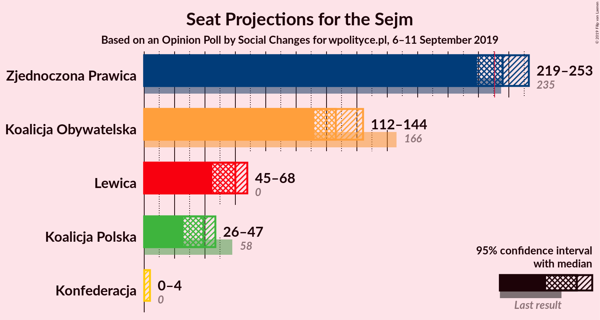

# Opinion Poll by Social Changes for wpolityce.pl, 6–11 September 2019

<a href="#voting-intentions">Voting Intentions</a> | <a href="#seats">Seats</a> | <a href="#coalitions">Coalitions</a> | <a href="#technical-information">Technical Information</a>

## Voting Intentions

### Confidence Intervals

| Party | Last Result | Poll Result | 80% Confidence Interval | 90% Confidence Interval | 95% Confidence Interval | 99% Confidence Interval |
|:-----:|:-----------:|:-----------:|:-----------------------:|:-----------------------:|:-----------------------:|:-----------------------:|
| Zjednoczona Prawica | 37.6% | 45.6% | 43.6–47.6% |43.0–48.2% |42.6–48.7% |41.6–49.6% |
| Koalicja Obywatelska | 31.7% | 26.5% | 24.8–28.3% |24.3–28.9% |23.9–29.3% |23.1–30.2% |
| Lewica | 11.7% | 13.9% | 12.6–15.4% |12.2–15.8% |11.9–16.2% |11.3–16.9% |
| Koalicja Polska | 13.9% | 9.8% | 8.7–11.1% |8.4–11.4% |8.1–11.8% |7.6–12.4% |
| Konfederacja | 4.8% | 4.2% | 3.5–5.1% |3.3–5.4% |3.1–5.6% |2.8–6.1% |

*Note:* The poll result column reflects the actual value used in the calculations. Published results may vary slightly, and in addition be rounded to fewer digits.

## Seats

### Confidence Intervals

| Party | Last Result | Median | 80% Confidence Interval | 90% Confidence Interval | 95% Confidence Interval | 99% Confidence Interval |
|:-----:|:-----------:|:------:|:-----------------------:|:-----------------------:|:-----------------------:|:-----------------------:|
| <a href="#zjednoczona-prawica">Zjednoczona Prawica</a> | 235 | 242 | 214–242 |214–242 |214–242 |211–242 |
| <a href="#koalicja-obywatelska">Koalicja Obywatelska</a> | 166 | 123 | 123–145 |123–145 |123–145 |123–147 |
| <a href="#lewica">Lewica</a> | 0 | 50 | 50–55 |50–55 |50–60 |43–63 |
| <a href="#koalicja-polska">Koalicja Polska</a> | 58 | 45 | 45–51 |45–51 |45–51 |45–51 |
| <a href="#konfederacja">Konfederacja</a> | 0 | 0 | 0 |0 |0 |0–4 |

### Zjednoczona Prawica

*For a full overview of the results for this party, see the [Zjednoczona Prawica](party-zjednoczonaprawica.html) page.*

| Number of Seats | Probability | Accumulated | Special Marks |
|:---------------:|:-----------:|:-----------:|:-------------:|
| 207 | 0.5% | 100% |  |
| 208 | 0% | 99.5% |  |
| 209 | 0% | 99.5% |  |
| 210 | 0% | 99.5% |  |
| 211 | 0.1% | 99.5% |  |
| 212 | 0% | 99.4% |  |
| 213 | 0% | 99.4% |  |
| 214 | 10% | 99.4% |  |
| 215 | 0.1% | 90% |  |
| 216 | 0% | 90% |  |
| 217 | 0% | 90% |  |
| 218 | 0% | 90% |  |
| 219 | 0% | 90% |  |
| 220 | 0% | 90% |  |
| 221 | 0% | 90% |  |
| 222 | 1.2% | 90% |  |
| 223 | 0% | 88% |  |
| 224 | 0% | 88% |  |
| 225 | 3% | 88% |  |
| 226 | 0% | 86% |  |
| 227 | 0% | 86% |  |
| 228 | 0.1% | 86% |  |
| 229 | 0% | 86% |  |
| 230 | 0% | 86% |  |
| 231 | 0% | 86% | Majority |
| 232 | 0% | 86% |  |
| 233 | 0% | 86% |  |
| 234 | 23% | 86% |  |
| 235 | 0% | 62% | Last Result |
| 236 | 0% | 62% |  |
| 237 | 0% | 62% |  |
| 238 | 0% | 62% |  |
| 239 | 0% | 62% |  |
| 240 | 0% | 62% |  |
| 241 | 0% | 62% |  |
| 242 | 62% | 62% | Median |
| 243 | 0.3% | 0.4% |  |
| 244 | 0% | 0.2% |  |
| 245 | 0% | 0.2% |  |
| 246 | 0% | 0.2% |  |
| 247 | 0% | 0.2% |  |
| 248 | 0% | 0.1% |  |
| 249 | 0% | 0.1% |  |
| 250 | 0% | 0.1% |  |
| 251 | 0.1% | 0.1% |  |
| 252 | 0% | 0% |  |

### Koalicja Obywatelska

*For a full overview of the results for this party, see the [Koalicja Obywatelska](party-koalicjaobywatelska.html) page.*

| Number of Seats | Probability | Accumulated | Special Marks |
|:---------------:|:-----------:|:-----------:|:-------------:|
| 111 | 0.2% | 100% |  |
| 112 | 0% | 99.7% |  |
| 113 | 0% | 99.7% |  |
| 114 | 0% | 99.7% |  |
| 115 | 0% | 99.7% |  |
| 116 | 0% | 99.7% |  |
| 117 | 0.1% | 99.7% |  |
| 118 | 0% | 99.7% |  |
| 119 | 0% | 99.7% |  |
| 120 | 0.1% | 99.7% |  |
| 121 | 0% | 99.6% |  |
| 122 | 0% | 99.6% |  |
| 123 | 62% | 99.6% | Median |
| 124 | 0% | 38% |  |
| 125 | 23% | 38% |  |
| 126 | 0% | 14% |  |
| 127 | 3% | 14% |  |
| 128 | 0% | 12% |  |
| 129 | 0% | 12% |  |
| 130 | 0% | 12% |  |
| 131 | 0% | 12% |  |
| 132 | 0% | 12% |  |
| 133 | 0% | 12% |  |
| 134 | 0% | 12% |  |
| 135 | 0% | 12% |  |
| 136 | 0.1% | 12% |  |
| 137 | 0% | 12% |  |
| 138 | 0.1% | 12% |  |
| 139 | 0% | 11% |  |
| 140 | 0% | 11% |  |
| 141 | 0% | 11% |  |
| 142 | 0% | 11% |  |
| 143 | 0% | 11% |  |
| 144 | 1.2% | 11% |  |
| 145 | 10% | 10% |  |
| 146 | 0% | 0.6% |  |
| 147 | 0.5% | 0.6% |  |
| 148 | 0% | 0.1% |  |
| 149 | 0% | 0.1% |  |
| 150 | 0% | 0.1% |  |
| 151 | 0% | 0.1% |  |
| 152 | 0% | 0.1% |  |
| 153 | 0% | 0.1% |  |
| 154 | 0.1% | 0.1% |  |
| 155 | 0% | 0% |  |
| 156 | 0% | 0% |  |
| 157 | 0% | 0% |  |
| 158 | 0% | 0% |  |
| 159 | 0% | 0% |  |
| 160 | 0% | 0% |  |
| 161 | 0% | 0% |  |
| 162 | 0% | 0% |  |
| 163 | 0% | 0% |  |
| 164 | 0% | 0% |  |
| 165 | 0% | 0% |  |
| 166 | 0% | 0% | Last Result |

### Lewica

*For a full overview of the results for this party, see the [Lewica](party-lewica.html) page.*

| Number of Seats | Probability | Accumulated | Special Marks |
|:---------------:|:-----------:|:-----------:|:-------------:|
| 0 | 0% | 100% | Last Result |
| 1 | 0% | 100% |  |
| 2 | 0% | 100% |  |
| 3 | 0% | 100% |  |
| 4 | 0% | 100% |  |
| 5 | 0% | 100% |  |
| 6 | 0% | 100% |  |
| 7 | 0% | 100% |  |
| 8 | 0% | 100% |  |
| 9 | 0% | 100% |  |
| 10 | 0% | 100% |  |
| 11 | 0% | 100% |  |
| 12 | 0% | 100% |  |
| 13 | 0% | 100% |  |
| 14 | 0% | 100% |  |
| 15 | 0% | 100% |  |
| 16 | 0% | 100% |  |
| 17 | 0% | 100% |  |
| 18 | 0% | 100% |  |
| 19 | 0% | 100% |  |
| 20 | 0% | 100% |  |
| 21 | 0% | 100% |  |
| 22 | 0% | 100% |  |
| 23 | 0% | 100% |  |
| 24 | 0% | 100% |  |
| 25 | 0% | 100% |  |
| 26 | 0% | 100% |  |
| 27 | 0% | 100% |  |
| 28 | 0% | 100% |  |
| 29 | 0% | 100% |  |
| 30 | 0% | 100% |  |
| 31 | 0% | 100% |  |
| 32 | 0% | 100% |  |
| 33 | 0% | 100% |  |
| 34 | 0% | 100% |  |
| 35 | 0% | 100% |  |
| 36 | 0% | 100% |  |
| 37 | 0% | 100% |  |
| 38 | 0% | 100% |  |
| 39 | 0% | 100% |  |
| 40 | 0% | 100% |  |
| 41 | 0% | 100% |  |
| 42 | 0% | 100% |  |
| 43 | 1.2% | 100% |  |
| 44 | 0.1% | 98.8% |  |
| 45 | 0% | 98.7% |  |
| 46 | 0% | 98.7% |  |
| 47 | 0% | 98.7% |  |
| 48 | 0% | 98.7% |  |
| 49 | 0% | 98.7% |  |
| 50 | 71% | 98.7% | Median |
| 51 | 0% | 27% |  |
| 52 | 0% | 27% |  |
| 53 | 0% | 27% |  |
| 54 | 0% | 27% |  |
| 55 | 24% | 27% |  |
| 56 | 0% | 3% |  |
| 57 | 0% | 3% |  |
| 58 | 0% | 3% |  |
| 59 | 0% | 3% |  |
| 60 | 3% | 3% |  |
| 61 | 0% | 0.6% |  |
| 62 | 0% | 0.6% |  |
| 63 | 0.1% | 0.5% |  |
| 64 | 0% | 0.4% |  |
| 65 | 0% | 0.4% |  |
| 66 | 0.1% | 0.4% |  |
| 67 | 0% | 0.4% |  |
| 68 | 0% | 0.4% |  |
| 69 | 0.1% | 0.4% |  |
| 70 | 0.3% | 0.3% |  |
| 71 | 0% | 0.1% |  |
| 72 | 0% | 0.1% |  |
| 73 | 0% | 0.1% |  |
| 74 | 0% | 0.1% |  |
| 75 | 0.1% | 0.1% |  |
| 76 | 0% | 0% |  |

### Koalicja Polska

*For a full overview of the results for this party, see the [Koalicja Polska](party-koalicjapolska.html) page.*

| Number of Seats | Probability | Accumulated | Special Marks |
|:---------------:|:-----------:|:-----------:|:-------------:|
| 25 | 0.1% | 100% |  |
| 26 | 0% | 99.9% |  |
| 27 | 0% | 99.9% |  |
| 28 | 0.1% | 99.9% |  |
| 29 | 0% | 99.8% |  |
| 30 | 0% | 99.8% |  |
| 31 | 0% | 99.8% |  |
| 32 | 0.3% | 99.8% |  |
| 33 | 0% | 99.6% |  |
| 34 | 0% | 99.6% |  |
| 35 | 0.1% | 99.6% |  |
| 36 | 0% | 99.5% |  |
| 37 | 0% | 99.5% |  |
| 38 | 0% | 99.5% |  |
| 39 | 0% | 99.5% |  |
| 40 | 0% | 99.5% |  |
| 41 | 0% | 99.5% |  |
| 42 | 0% | 99.5% |  |
| 43 | 0% | 99.5% |  |
| 44 | 0% | 99.5% |  |
| 45 | 62% | 99.5% | Median |
| 46 | 23% | 38% |  |
| 47 | 1.2% | 14% |  |
| 48 | 3% | 13% |  |
| 49 | 0% | 10% |  |
| 50 | 0.1% | 10% |  |
| 51 | 10% | 10% |  |
| 52 | 0% | 0% |  |
| 53 | 0% | 0% |  |
| 54 | 0% | 0% |  |
| 55 | 0% | 0% |  |
| 56 | 0% | 0% |  |
| 57 | 0% | 0% |  |
| 58 | 0% | 0% | Last Result |

### Konfederacja

*For a full overview of the results for this party, see the [Konfederacja](party-konfederacja.html) page.*

| Number of Seats | Probability | Accumulated | Special Marks |
|:---------------:|:-----------:|:-----------:|:-------------:|
| 0 | 98% | 100% | Last Result, Median |
| 1 | 0% | 2% |  |
| 2 | 0% | 2% |  |
| 3 | 0% | 1.5% |  |
| 4 | 1.4% | 1.5% |  |
| 5 | 0.1% | 0.1% |  |
| 6 | 0% | 0% |  |

## Coalitions

### Confidence Intervals

| Coalition | Last Result | Median | Majority? | 80% Confidence Interval | 90% Confidence Interval | 95% Confidence Interval | 99% Confidence Interval |
|:---------:|:-----------:|:------:|:---------:|:-----------------------:|:-----------------------:|:-----------------------:|:-----------------------:|
| Koalicja Obywatelska – Lewica – Koalicja Polska | 224 | 218 | 14% | 218–246 | 218–246 | 218–246 | 218–249 |
| Zjednoczona Prawica | 235 | 242 | 86% | 214–242 | 214–242 | 214–242 | 211–242 |
| Koalicja Obywatelska – Koalicja Polska | 224 | 168 | 0% | 168–196 | 168–196 | 168–196 | 166–197 |
| Koalicja Obywatelska – Lewica | 166 | 173 | 0% | 173–195 | 173–195 | 173–195 | 173–202 |
| Koalicja Obywatelska | 166 | 123 | 0% | 123–145 | 123–145 | 123–145 | 123–147 |

### Koalicja Obywatelska – Lewica – Koalicja Polska

| Number of Seats | Probability | Accumulated | Special Marks |
|:---------------:|:-----------:|:-----------:|:-------------:|
| 209 | 0.1% | 100% |  |
| 210 | 0% | 99.9% |  |
| 211 | 0% | 99.9% |  |
| 212 | 0% | 99.8% |  |
| 213 | 0.2% | 99.8% |  |
| 214 | 0% | 99.6% |  |
| 215 | 0% | 99.6% |  |
| 216 | 0% | 99.6% |  |
| 217 | 0% | 99.6% |  |
| 218 | 62% | 99.6% | Median |
| 219 | 0% | 38% |  |
| 220 | 0% | 38% |  |
| 221 | 0% | 38% |  |
| 222 | 0% | 38% |  |
| 223 | 0% | 38% |  |
| 224 | 0% | 38% | Last Result |
| 225 | 0% | 38% |  |
| 226 | 23% | 38% |  |
| 227 | 0.1% | 14% |  |
| 228 | 0% | 14% |  |
| 229 | 0% | 14% |  |
| 230 | 0% | 14% |  |
| 231 | 0% | 14% | Majority |
| 232 | 0% | 14% |  |
| 233 | 0% | 14% |  |
| 234 | 1.2% | 14% |  |
| 235 | 3% | 13% |  |
| 236 | 0% | 10% |  |
| 237 | 0% | 10% |  |
| 238 | 0% | 10% |  |
| 239 | 0% | 10% |  |
| 240 | 0% | 10% |  |
| 241 | 0% | 10% |  |
| 242 | 0% | 10% |  |
| 243 | 0% | 10% |  |
| 244 | 0% | 10% |  |
| 245 | 0.1% | 10% |  |
| 246 | 10% | 10% |  |
| 247 | 0% | 0.6% |  |
| 248 | 0% | 0.6% |  |
| 249 | 0.1% | 0.6% |  |
| 250 | 0% | 0.5% |  |
| 251 | 0% | 0.5% |  |
| 252 | 0% | 0.5% |  |
| 253 | 0.5% | 0.5% |  |
| 254 | 0% | 0% |  |

### Zjednoczona Prawica

| Number of Seats | Probability | Accumulated | Special Marks |
|:---------------:|:-----------:|:-----------:|:-------------:|
| 207 | 0.5% | 100% |  |
| 208 | 0% | 99.5% |  |
| 209 | 0% | 99.5% |  |
| 210 | 0% | 99.5% |  |
| 211 | 0.1% | 99.5% |  |
| 212 | 0% | 99.4% |  |
| 213 | 0% | 99.4% |  |
| 214 | 10% | 99.4% |  |
| 215 | 0.1% | 90% |  |
| 216 | 0% | 90% |  |
| 217 | 0% | 90% |  |
| 218 | 0% | 90% |  |
| 219 | 0% | 90% |  |
| 220 | 0% | 90% |  |
| 221 | 0% | 90% |  |
| 222 | 1.2% | 90% |  |
| 223 | 0% | 88% |  |
| 224 | 0% | 88% |  |
| 225 | 3% | 88% |  |
| 226 | 0% | 86% |  |
| 227 | 0% | 86% |  |
| 228 | 0.1% | 86% |  |
| 229 | 0% | 86% |  |
| 230 | 0% | 86% |  |
| 231 | 0% | 86% | Majority |
| 232 | 0% | 86% |  |
| 233 | 0% | 86% |  |
| 234 | 23% | 86% |  |
| 235 | 0% | 62% | Last Result |
| 236 | 0% | 62% |  |
| 237 | 0% | 62% |  |
| 238 | 0% | 62% |  |
| 239 | 0% | 62% |  |
| 240 | 0% | 62% |  |
| 241 | 0% | 62% |  |
| 242 | 62% | 62% | Median |
| 243 | 0.3% | 0.4% |  |
| 244 | 0% | 0.2% |  |
| 245 | 0% | 0.2% |  |
| 246 | 0% | 0.2% |  |
| 247 | 0% | 0.2% |  |
| 248 | 0% | 0.1% |  |
| 249 | 0% | 0.1% |  |
| 250 | 0% | 0.1% |  |
| 251 | 0.1% | 0.1% |  |
| 252 | 0% | 0% |  |

### Koalicja Obywatelska – Koalicja Polska

| Number of Seats | Probability | Accumulated | Special Marks |
|:---------------:|:-----------:|:-----------:|:-------------:|
| 143 | 0.2% | 100% |  |
| 144 | 0% | 99.7% |  |
| 145 | 0% | 99.7% |  |
| 146 | 0% | 99.7% |  |
| 147 | 0% | 99.7% |  |
| 148 | 0% | 99.7% |  |
| 149 | 0% | 99.7% |  |
| 150 | 0% | 99.7% |  |
| 151 | 0% | 99.7% |  |
| 152 | 0.1% | 99.7% |  |
| 153 | 0% | 99.7% |  |
| 154 | 0% | 99.7% |  |
| 155 | 0% | 99.7% |  |
| 156 | 0% | 99.7% |  |
| 157 | 0% | 99.7% |  |
| 158 | 0% | 99.7% |  |
| 159 | 0% | 99.7% |  |
| 160 | 0% | 99.7% |  |
| 161 | 0% | 99.7% |  |
| 162 | 0% | 99.7% |  |
| 163 | 0% | 99.7% |  |
| 164 | 0% | 99.7% |  |
| 165 | 0.1% | 99.6% |  |
| 166 | 0.1% | 99.5% |  |
| 167 | 0% | 99.5% |  |
| 168 | 62% | 99.5% | Median |
| 169 | 0% | 38% |  |
| 170 | 0% | 38% |  |
| 171 | 23% | 38% |  |
| 172 | 0% | 14% |  |
| 173 | 0% | 14% |  |
| 174 | 0% | 14% |  |
| 175 | 3% | 14% |  |
| 176 | 0% | 12% |  |
| 177 | 0% | 12% |  |
| 178 | 0% | 12% |  |
| 179 | 0.1% | 12% |  |
| 180 | 0% | 11% |  |
| 181 | 0% | 11% |  |
| 182 | 0% | 11% |  |
| 183 | 0% | 11% |  |
| 184 | 0% | 11% |  |
| 185 | 0% | 11% |  |
| 186 | 0.1% | 11% |  |
| 187 | 0% | 11% |  |
| 188 | 0% | 11% |  |
| 189 | 0% | 11% |  |
| 190 | 0% | 11% |  |
| 191 | 1.2% | 11% |  |
| 192 | 0% | 10% |  |
| 193 | 0% | 10% |  |
| 194 | 0% | 10% |  |
| 195 | 0% | 10% |  |
| 196 | 10% | 10% |  |
| 197 | 0% | 0.5% |  |
| 198 | 0.5% | 0.5% |  |
| 199 | 0% | 0% |  |
| 200 | 0% | 0% |  |
| 201 | 0% | 0% |  |
| 202 | 0% | 0% |  |
| 203 | 0% | 0% |  |
| 204 | 0% | 0% |  |
| 205 | 0% | 0% |  |
| 206 | 0% | 0% |  |
| 207 | 0% | 0% |  |
| 208 | 0% | 0% |  |
| 209 | 0% | 0% |  |
| 210 | 0% | 0% |  |
| 211 | 0% | 0% |  |
| 212 | 0% | 0% |  |
| 213 | 0% | 0% |  |
| 214 | 0% | 0% |  |
| 215 | 0% | 0% |  |
| 216 | 0% | 0% |  |
| 217 | 0% | 0% |  |
| 218 | 0% | 0% |  |
| 219 | 0% | 0% |  |
| 220 | 0% | 0% |  |
| 221 | 0% | 0% |  |
| 222 | 0% | 0% |  |
| 223 | 0% | 0% |  |
| 224 | 0% | 0% | Last Result |

### Koalicja Obywatelska – Lewica

| Number of Seats | Probability | Accumulated | Special Marks |
|:---------------:|:-----------:|:-----------:|:-------------:|
| 164 | 0.1% | 100% |  |
| 165 | 0% | 99.9% |  |
| 166 | 0% | 99.9% | Last Result |
| 167 | 0% | 99.9% |  |
| 168 | 0% | 99.9% |  |
| 169 | 0% | 99.9% |  |
| 170 | 0% | 99.9% |  |
| 171 | 0% | 99.9% |  |
| 172 | 0% | 99.9% |  |
| 173 | 62% | 99.9% | Median |
| 174 | 0% | 38% |  |
| 175 | 0% | 38% |  |
| 176 | 0% | 38% |  |
| 177 | 0% | 38% |  |
| 178 | 0% | 38% |  |
| 179 | 0% | 38% |  |
| 180 | 23% | 38% |  |
| 181 | 0.3% | 15% |  |
| 182 | 0% | 14% |  |
| 183 | 0% | 14% |  |
| 184 | 0% | 14% |  |
| 185 | 0% | 14% |  |
| 186 | 0% | 14% |  |
| 187 | 4% | 14% |  |
| 188 | 0% | 11% |  |
| 189 | 0% | 11% |  |
| 190 | 0% | 11% |  |
| 191 | 0% | 11% |  |
| 192 | 0.1% | 10% |  |
| 193 | 0% | 10% |  |
| 194 | 0% | 10% |  |
| 195 | 10% | 10% |  |
| 196 | 0% | 0.8% |  |
| 197 | 0% | 0.7% |  |
| 198 | 0% | 0.7% |  |
| 199 | 0.1% | 0.7% |  |
| 200 | 0% | 0.6% |  |
| 201 | 0% | 0.6% |  |
| 202 | 0.5% | 0.6% |  |
| 203 | 0% | 0.1% |  |
| 204 | 0% | 0.1% |  |
| 205 | 0% | 0.1% |  |
| 206 | 0% | 0.1% |  |
| 207 | 0.1% | 0.1% |  |
| 208 | 0% | 0.1% |  |
| 209 | 0% | 0.1% |  |
| 210 | 0% | 0.1% |  |
| 211 | 0% | 0.1% |  |
| 212 | 0% | 0.1% |  |
| 213 | 0% | 0.1% |  |
| 214 | 0% | 0.1% |  |
| 215 | 0% | 0.1% |  |
| 216 | 0% | 0.1% |  |
| 217 | 0% | 0.1% |  |
| 218 | 0% | 0.1% |  |
| 219 | 0% | 0.1% |  |
| 220 | 0.1% | 0.1% |  |
| 221 | 0% | 0% |  |

### Koalicja Obywatelska

| Number of Seats | Probability | Accumulated | Special Marks |
|:---------------:|:-----------:|:-----------:|:-------------:|
| 111 | 0.2% | 100% |  |
| 112 | 0% | 99.7% |  |
| 113 | 0% | 99.7% |  |
| 114 | 0% | 99.7% |  |
| 115 | 0% | 99.7% |  |
| 116 | 0% | 99.7% |  |
| 117 | 0.1% | 99.7% |  |
| 118 | 0% | 99.7% |  |
| 119 | 0% | 99.7% |  |
| 120 | 0.1% | 99.7% |  |
| 121 | 0% | 99.6% |  |
| 122 | 0% | 99.6% |  |
| 123 | 62% | 99.6% | Median |
| 124 | 0% | 38% |  |
| 125 | 23% | 38% |  |
| 126 | 0% | 14% |  |
| 127 | 3% | 14% |  |
| 128 | 0% | 12% |  |
| 129 | 0% | 12% |  |
| 130 | 0% | 12% |  |
| 131 | 0% | 12% |  |
| 132 | 0% | 12% |  |
| 133 | 0% | 12% |  |
| 134 | 0% | 12% |  |
| 135 | 0% | 12% |  |
| 136 | 0.1% | 12% |  |
| 137 | 0% | 12% |  |
| 138 | 0.1% | 12% |  |
| 139 | 0% | 11% |  |
| 140 | 0% | 11% |  |
| 141 | 0% | 11% |  |
| 142 | 0% | 11% |  |
| 143 | 0% | 11% |  |
| 144 | 1.2% | 11% |  |
| 145 | 10% | 10% |  |
| 146 | 0% | 0.6% |  |
| 147 | 0.5% | 0.6% |  |
| 148 | 0% | 0.1% |  |
| 149 | 0% | 0.1% |  |
| 150 | 0% | 0.1% |  |
| 151 | 0% | 0.1% |  |
| 152 | 0% | 0.1% |  |
| 153 | 0% | 0.1% |  |
| 154 | 0.1% | 0.1% |  |
| 155 | 0% | 0% |  |
| 156 | 0% | 0% |  |
| 157 | 0% | 0% |  |
| 158 | 0% | 0% |  |
| 159 | 0% | 0% |  |
| 160 | 0% | 0% |  |
| 161 | 0% | 0% |  |
| 162 | 0% | 0% |  |
| 163 | 0% | 0% |  |
| 164 | 0% | 0% |  |
| 165 | 0% | 0% |  |
| 166 | 0% | 0% | Last Result |

## Technical Information

### Opinion Poll

+ **Polling firm:** Social Changes
+ **Commissioner(s):** wpolityce.pl
+ **Fieldwork period:** 6–11 September 2019

### Calculations

+ **Sample size:** 1022
+ **Simulations done:** 1,024
+ **Error estimate:** 4.25%

