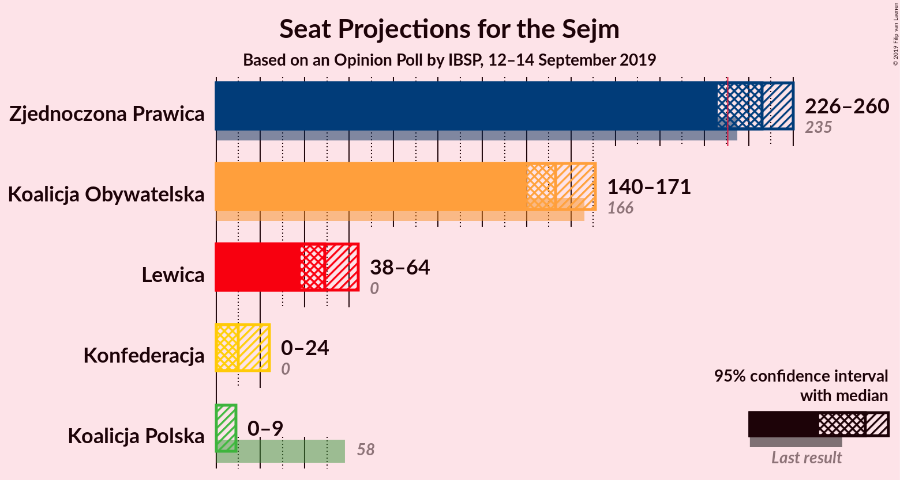
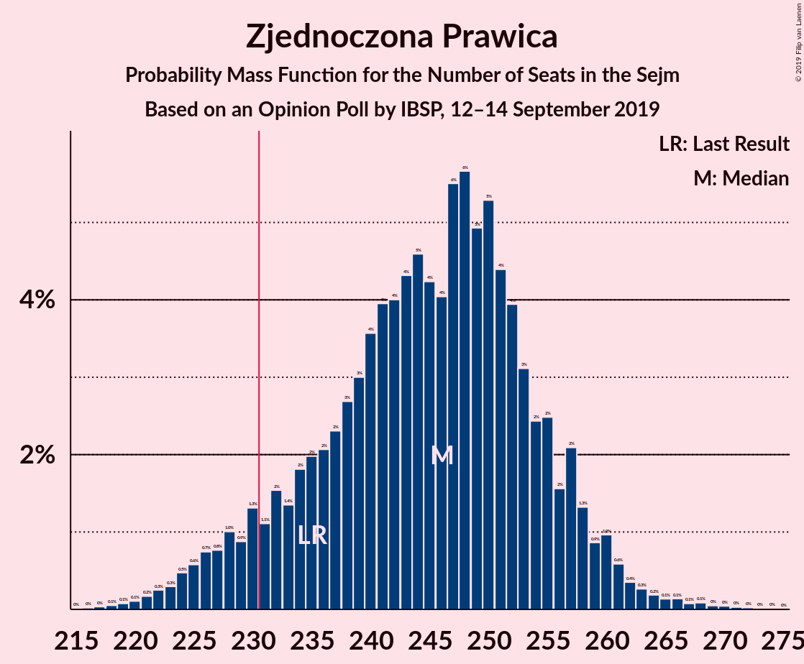
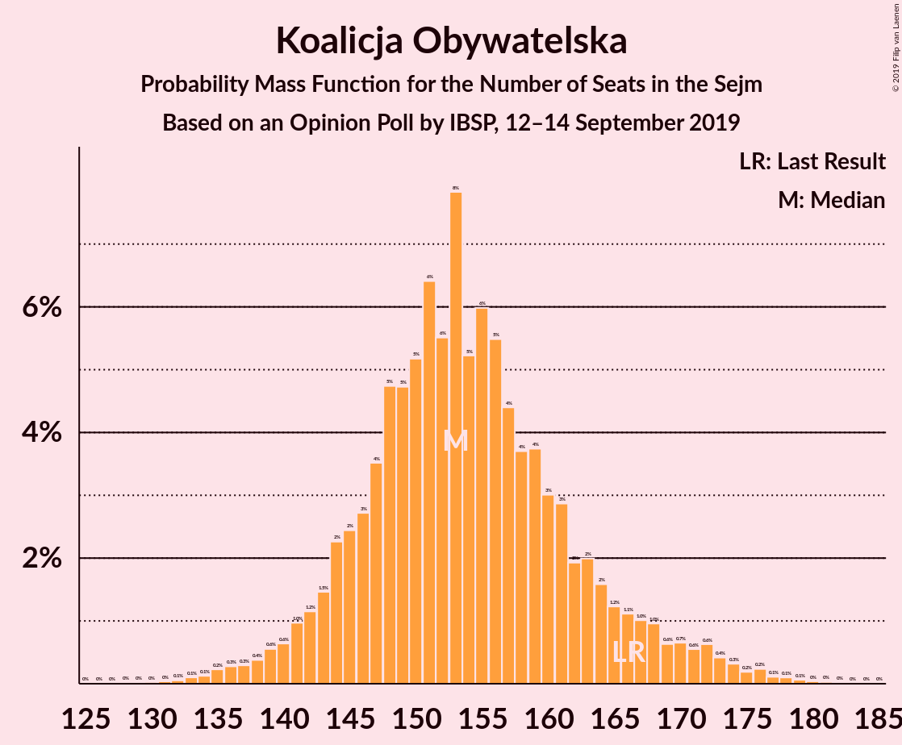
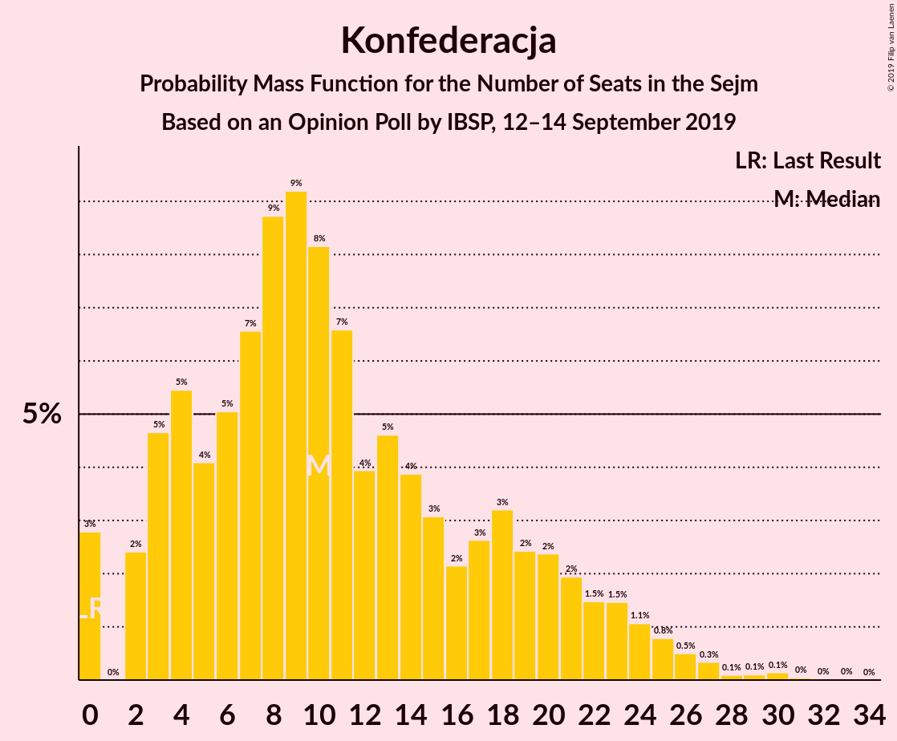
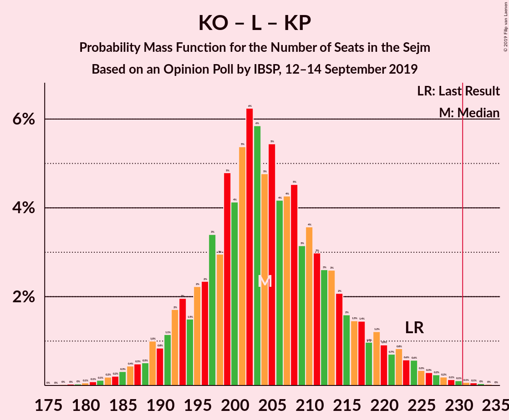

# Opinion Poll by IBSP, 12–14 September 2019

<a href="#voting-intentions">Voting Intentions</a> | <a href="#seats">Seats</a> | <a href="#coalitions">Coalitions</a> | <a href="#technical-information">Technical Information</a>

## Voting Intentions

### Confidence Intervals

| Party | Last Result | Poll Result | 80% Confidence Interval | 90% Confidence Interval | 95% Confidence Interval | 99% Confidence Interval |
|:-----:|:-----------:|:-----------:|:-----------------------:|:-----------------------:|:-----------------------:|:-----------------------:|
| Zjednoczona Prawica | 37.6% | 45.6% | 43.6–47.6% |43.0–48.2% |42.5–48.7% |41.6–49.7% |
| Koalicja Obywatelska | 31.7% | 30.9% | 29.0–32.8% |28.5–33.3% |28.1–33.8% |27.2–34.7% |
| Lewica | 11.7% | 12.3% | 11.0–13.7% |10.7–14.1% |10.4–14.4% |9.8–15.2% |
| Konfederacja | 4.8% | 6.3% | 5.4–7.4% |5.2–7.7% |5.0–8.0% |4.6–8.6% |
| Koalicja Polska | 13.9% | 4.2% | 3.4–5.1% |3.2–5.3% |3.1–5.6% |2.8–6.1% |

*Note:* The poll result column reflects the actual value used in the calculations. Published results may vary slightly, and in addition be rounded to fewer digits.

## Seats

### Confidence Intervals

| Party | Last Result | Median | 80% Confidence Interval | 90% Confidence Interval | 95% Confidence Interval | 99% Confidence Interval |
|:-----:|:-----------:|:------:|:-----------------------:|:-----------------------:|:-----------------------:|:-----------------------:|
| <a href="#zjednoczona-prawica">Zjednoczona Prawica</a> | 235 | 242 | 240–244 |240–245 |224–249 |217–271 |
| <a href="#koalicja-obywatelska">Koalicja Obywatelska</a> | 166 | 154 | 143–155 |141–165 |141–169 |132–176 |
| <a href="#lewica">Lewica</a> | 0 | 46 | 44–56 |42–64 |42–64 |42–65 |
| <a href="#konfederacja">Konfederacja</a> | 0 | 11 | 8–21 |6–26 |2–26 |0–26 |
| <a href="#koalicja-polska">Koalicja Polska</a> | 58 | 7 | 0–7 |0–7 |0–7 |0–12 |

### Zjednoczona Prawica

*For a full overview of the results for this party, see the [Zjednoczona Prawica](party-zjednoczonaprawica.html) page.*

| Number of Seats | Probability | Accumulated | Special Marks |
|:---------------:|:-----------:|:-----------:|:-------------:|
| 215 | 0.2% | 100% |  |
| 216 | 0% | 99.8% |  |
| 217 | 0.6% | 99.8% |  |
| 218 | 0% | 99.2% |  |
| 219 | 0.5% | 99.2% |  |
| 220 | 0% | 98.7% |  |
| 221 | 0% | 98.7% |  |
| 222 | 0% | 98.7% |  |
| 223 | 0.6% | 98.7% |  |
| 224 | 3% | 98% |  |
| 225 | 0% | 96% |  |
| 226 | 0% | 96% |  |
| 227 | 0% | 96% |  |
| 228 | 0% | 96% |  |
| 229 | 0% | 96% |  |
| 230 | 0% | 96% |  |
| 231 | 0% | 96% | Majority |
| 232 | 0% | 96% |  |
| 233 | 0% | 96% |  |
| 234 | 0.4% | 96% |  |
| 235 | 0% | 95% | Last Result |
| 236 | 0% | 95% |  |
| 237 | 0% | 95% |  |
| 238 | 0.1% | 95% |  |
| 239 | 0% | 95% |  |
| 240 | 18% | 95% |  |
| 241 | 6% | 78% |  |
| 242 | 33% | 71% | Median |
| 243 | 0.7% | 38% |  |
| 244 | 32% | 37% |  |
| 245 | 1.2% | 5% |  |
| 246 | 0.5% | 4% |  |
| 247 | 0.1% | 3% |  |
| 248 | 0% | 3% |  |
| 249 | 3% | 3% |  |
| 250 | 0% | 0.6% |  |
| 251 | 0% | 0.6% |  |
| 252 | 0% | 0.6% |  |
| 253 | 0% | 0.6% |  |
| 254 | 0% | 0.6% |  |
| 255 | 0% | 0.6% |  |
| 256 | 0% | 0.6% |  |
| 257 | 0% | 0.6% |  |
| 258 | 0% | 0.6% |  |
| 259 | 0% | 0.6% |  |
| 260 | 0% | 0.6% |  |
| 261 | 0% | 0.6% |  |
| 262 | 0% | 0.6% |  |
| 263 | 0% | 0.6% |  |
| 264 | 0% | 0.6% |  |
| 265 | 0% | 0.6% |  |
| 266 | 0% | 0.6% |  |
| 267 | 0% | 0.6% |  |
| 268 | 0% | 0.6% |  |
| 269 | 0% | 0.5% |  |
| 270 | 0% | 0.5% |  |
| 271 | 0.1% | 0.5% |  |
| 272 | 0% | 0.4% |  |
| 273 | 0% | 0.4% |  |
| 274 | 0.2% | 0.4% |  |
| 275 | 0.2% | 0.3% |  |
| 276 | 0% | 0% |  |

### Koalicja Obywatelska

*For a full overview of the results for this party, see the [Koalicja Obywatelska](party-koalicjaobywatelska.html) page.*

| Number of Seats | Probability | Accumulated | Special Marks |
|:---------------:|:-----------:|:-----------:|:-------------:|
| 131 | 0% | 100% |  |
| 132 | 1.0% | 99.9% |  |
| 133 | 0.2% | 99.0% |  |
| 134 | 0.1% | 98.7% |  |
| 135 | 0% | 98.7% |  |
| 136 | 0.7% | 98.7% |  |
| 137 | 0% | 98% |  |
| 138 | 0% | 98% |  |
| 139 | 0% | 98% |  |
| 140 | 0% | 98% |  |
| 141 | 3% | 98% |  |
| 142 | 0.5% | 95% |  |
| 143 | 17% | 94% |  |
| 144 | 0.4% | 77% |  |
| 145 | 0.4% | 76% |  |
| 146 | 0% | 76% |  |
| 147 | 0.4% | 76% |  |
| 148 | 0% | 76% |  |
| 149 | 0% | 76% |  |
| 150 | 0% | 76% |  |
| 151 | 6% | 76% |  |
| 152 | 0% | 69% |  |
| 153 | 1.0% | 69% |  |
| 154 | 30% | 68% | Median |
| 155 | 32% | 38% |  |
| 156 | 0% | 6% |  |
| 157 | 0% | 6% |  |
| 158 | 0% | 6% |  |
| 159 | 0% | 6% |  |
| 160 | 0% | 6% |  |
| 161 | 0% | 6% |  |
| 162 | 0% | 6% |  |
| 163 | 0% | 6% |  |
| 164 | 0% | 6% |  |
| 165 | 2% | 6% |  |
| 166 | 0% | 4% | Last Result |
| 167 | 0% | 4% |  |
| 168 | 0.4% | 4% |  |
| 169 | 3% | 4% |  |
| 170 | 0% | 0.7% |  |
| 171 | 0% | 0.7% |  |
| 172 | 0% | 0.7% |  |
| 173 | 0% | 0.7% |  |
| 174 | 0.2% | 0.7% |  |
| 175 | 0% | 0.5% |  |
| 176 | 0% | 0.5% |  |
| 177 | 0% | 0.5% |  |
| 178 | 0% | 0.5% |  |
| 179 | 0% | 0.5% |  |
| 180 | 0% | 0.5% |  |
| 181 | 0.3% | 0.5% |  |
| 182 | 0.2% | 0.2% |  |
| 183 | 0% | 0% |  |

### Lewica

*For a full overview of the results for this party, see the [Lewica](party-lewica.html) page.*

| Number of Seats | Probability | Accumulated | Special Marks |
|:---------------:|:-----------:|:-----------:|:-------------:|
| 0 | 0% | 100% | Last Result |
| 1 | 0% | 100% |  |
| 2 | 0% | 100% |  |
| 3 | 0% | 100% |  |
| 4 | 0% | 100% |  |
| 5 | 0% | 100% |  |
| 6 | 0% | 100% |  |
| 7 | 0% | 100% |  |
| 8 | 0% | 100% |  |
| 9 | 0% | 100% |  |
| 10 | 0% | 100% |  |
| 11 | 0% | 100% |  |
| 12 | 0% | 100% |  |
| 13 | 0% | 100% |  |
| 14 | 0% | 100% |  |
| 15 | 0% | 100% |  |
| 16 | 0% | 100% |  |
| 17 | 0% | 100% |  |
| 18 | 0% | 100% |  |
| 19 | 0% | 100% |  |
| 20 | 0% | 100% |  |
| 21 | 0% | 100% |  |
| 22 | 0% | 100% |  |
| 23 | 0% | 100% |  |
| 24 | 0% | 100% |  |
| 25 | 0% | 100% |  |
| 26 | 0% | 100% |  |
| 27 | 0% | 100% |  |
| 28 | 0% | 100% |  |
| 29 | 0% | 100% |  |
| 30 | 0% | 100% |  |
| 31 | 0% | 100% |  |
| 32 | 0.1% | 100% |  |
| 33 | 0% | 99.9% |  |
| 34 | 0.2% | 99.9% |  |
| 35 | 0% | 99.7% |  |
| 36 | 0% | 99.7% |  |
| 37 | 0% | 99.7% |  |
| 38 | 0% | 99.7% |  |
| 39 | 0% | 99.7% |  |
| 40 | 0% | 99.7% |  |
| 41 | 0.1% | 99.7% |  |
| 42 | 6% | 99.6% |  |
| 43 | 0% | 93% |  |
| 44 | 34% | 93% |  |
| 45 | 0% | 59% |  |
| 46 | 29% | 59% | Median |
| 47 | 0% | 30% |  |
| 48 | 0.1% | 30% |  |
| 49 | 1.3% | 30% |  |
| 50 | 0% | 29% |  |
| 51 | 0.2% | 29% |  |
| 52 | 0.4% | 29% |  |
| 53 | 0.4% | 29% |  |
| 54 | 0.5% | 28% |  |
| 55 | 0.5% | 28% |  |
| 56 | 17% | 27% |  |
| 57 | 0% | 10% |  |
| 58 | 0.1% | 10% |  |
| 59 | 2% | 10% |  |
| 60 | 0.7% | 7% |  |
| 61 | 1.4% | 7% |  |
| 62 | 0% | 5% |  |
| 63 | 0.1% | 5% |  |
| 64 | 4% | 5% |  |
| 65 | 0.7% | 0.9% |  |
| 66 | 0% | 0.2% |  |
| 67 | 0% | 0.2% |  |
| 68 | 0% | 0.2% |  |
| 69 | 0% | 0.2% |  |
| 70 | 0% | 0.2% |  |
| 71 | 0% | 0.2% |  |
| 72 | 0.2% | 0.2% |  |
| 73 | 0% | 0% |  |

### Konfederacja

*For a full overview of the results for this party, see the [Konfederacja](party-konfederacja.html) page.*

| Number of Seats | Probability | Accumulated | Special Marks |
|:---------------:|:-----------:|:-----------:|:-------------:|
| 0 | 2% | 100% | Last Result |
| 1 | 0% | 98% |  |
| 2 | 2% | 98% |  |
| 3 | 0.2% | 96% |  |
| 4 | 0.1% | 95% |  |
| 5 | 0.2% | 95% |  |
| 6 | 4% | 95% |  |
| 7 | 0% | 91% |  |
| 8 | 3% | 91% |  |
| 9 | 0.9% | 88% |  |
| 10 | 32% | 87% |  |
| 11 | 29% | 55% | Median |
| 12 | 0% | 26% |  |
| 13 | 0% | 26% |  |
| 14 | 0% | 26% |  |
| 15 | 0% | 26% |  |
| 16 | 0% | 26% |  |
| 17 | 0% | 26% |  |
| 18 | 0.2% | 26% |  |
| 19 | 0% | 26% |  |
| 20 | 0.2% | 26% |  |
| 21 | 18% | 26% |  |
| 22 | 0% | 8% |  |
| 23 | 0.4% | 8% |  |
| 24 | 0% | 8% |  |
| 25 | 1.0% | 8% |  |
| 26 | 6% | 7% |  |
| 27 | 0% | 0.4% |  |
| 28 | 0% | 0.4% |  |
| 29 | 0% | 0.4% |  |
| 30 | 0% | 0.4% |  |
| 31 | 0.4% | 0.4% |  |
| 32 | 0% | 0% |  |

### Koalicja Polska

*For a full overview of the results for this party, see the [Koalicja Polska](party-koalicjapolska.html) page.*

| Number of Seats | Probability | Accumulated | Special Marks |
|:---------------:|:-----------:|:-----------:|:-------------:|
| 0 | 34% | 100% |  |
| 1 | 0% | 66% |  |
| 2 | 0% | 66% |  |
| 3 | 0% | 66% |  |
| 4 | 0% | 66% |  |
| 5 | 0% | 66% |  |
| 6 | 0% | 66% |  |
| 7 | 65% | 66% | Median |
| 8 | 0% | 1.2% |  |
| 9 | 0% | 1.2% |  |
| 10 | 0% | 1.1% |  |
| 11 | 0% | 1.1% |  |
| 12 | 1.1% | 1.1% |  |
| 13 | 0% | 0% |  |
| 14 | 0% | 0% |  |
| 15 | 0% | 0% |  |
| 16 | 0% | 0% |  |
| 17 | 0% | 0% |  |
| 18 | 0% | 0% |  |
| 19 | 0% | 0% |  |
| 20 | 0% | 0% |  |
| 21 | 0% | 0% |  |
| 22 | 0% | 0% |  |
| 23 | 0% | 0% |  |
| 24 | 0% | 0% |  |
| 25 | 0% | 0% |  |
| 26 | 0% | 0% |  |
| 27 | 0% | 0% |  |
| 28 | 0% | 0% |  |
| 29 | 0% | 0% |  |
| 30 | 0% | 0% |  |
| 31 | 0% | 0% |  |
| 32 | 0% | 0% |  |
| 33 | 0% | 0% |  |
| 34 | 0% | 0% |  |
| 35 | 0% | 0% |  |
| 36 | 0% | 0% |  |
| 37 | 0% | 0% |  |
| 38 | 0% | 0% |  |
| 39 | 0% | 0% |  |
| 40 | 0% | 0% |  |
| 41 | 0% | 0% |  |
| 42 | 0% | 0% |  |
| 43 | 0% | 0% |  |
| 44 | 0% | 0% |  |
| 45 | 0% | 0% |  |
| 46 | 0% | 0% |  |
| 47 | 0% | 0% |  |
| 48 | 0% | 0% |  |
| 49 | 0% | 0% |  |
| 50 | 0% | 0% |  |
| 51 | 0% | 0% |  |
| 52 | 0% | 0% |  |
| 53 | 0% | 0% |  |
| 54 | 0% | 0% |  |
| 55 | 0% | 0% |  |
| 56 | 0% | 0% |  |
| 57 | 0% | 0% |  |
| 58 | 0% | 0% | Last Result |

## Coalitions

### Confidence Intervals

| Coalition | Last Result | Median | Majority? | 80% Confidence Interval | 90% Confidence Interval | 95% Confidence Interval | 99% Confidence Interval |
|:---------:|:-----------:|:------:|:---------:|:-----------------------:|:-----------------------:|:-----------------------:|:-----------------------:|
| Zjednoczona Prawica | 235 | 242 | 96% | 240–244 | 240–245 | 224–249 | 217–271 |
| Koalicja Obywatelska – Lewica – Koalicja Polska | 224 | 206 | 0.6% | 199–209 | 193–215 | 193–228 | 185–233 |
| Koalicja Obywatelska – Lewica | 166 | 199 | 0.5% | 199–205 | 193–211 | 193–228 | 184–233 |
| Koalicja Obywatelska – Koalicja Polska | 224 | 161 | 0% | 143–162 | 143–166 | 143–169 | 132–181 |
| Koalicja Obywatelska | 166 | 154 | 0% | 143–155 | 141–165 | 141–169 | 132–176 |

### Zjednoczona Prawica

| Number of Seats | Probability | Accumulated | Special Marks |
|:---------------:|:-----------:|:-----------:|:-------------:|
| 215 | 0.2% | 100% |  |
| 216 | 0% | 99.8% |  |
| 217 | 0.6% | 99.8% |  |
| 218 | 0% | 99.2% |  |
| 219 | 0.5% | 99.2% |  |
| 220 | 0% | 98.7% |  |
| 221 | 0% | 98.7% |  |
| 222 | 0% | 98.7% |  |
| 223 | 0.6% | 98.7% |  |
| 224 | 3% | 98% |  |
| 225 | 0% | 96% |  |
| 226 | 0% | 96% |  |
| 227 | 0% | 96% |  |
| 228 | 0% | 96% |  |
| 229 | 0% | 96% |  |
| 230 | 0% | 96% |  |
| 231 | 0% | 96% | Majority |
| 232 | 0% | 96% |  |
| 233 | 0% | 96% |  |
| 234 | 0.4% | 96% |  |
| 235 | 0% | 95% | Last Result |
| 236 | 0% | 95% |  |
| 237 | 0% | 95% |  |
| 238 | 0.1% | 95% |  |
| 239 | 0% | 95% |  |
| 240 | 18% | 95% |  |
| 241 | 6% | 78% |  |
| 242 | 33% | 71% | Median |
| 243 | 0.7% | 38% |  |
| 244 | 32% | 37% |  |
| 245 | 1.2% | 5% |  |
| 246 | 0.5% | 4% |  |
| 247 | 0.1% | 3% |  |
| 248 | 0% | 3% |  |
| 249 | 3% | 3% |  |
| 250 | 0% | 0.6% |  |
| 251 | 0% | 0.6% |  |
| 252 | 0% | 0.6% |  |
| 253 | 0% | 0.6% |  |
| 254 | 0% | 0.6% |  |
| 255 | 0% | 0.6% |  |
| 256 | 0% | 0.6% |  |
| 257 | 0% | 0.6% |  |
| 258 | 0% | 0.6% |  |
| 259 | 0% | 0.6% |  |
| 260 | 0% | 0.6% |  |
| 261 | 0% | 0.6% |  |
| 262 | 0% | 0.6% |  |
| 263 | 0% | 0.6% |  |
| 264 | 0% | 0.6% |  |
| 265 | 0% | 0.6% |  |
| 266 | 0% | 0.6% |  |
| 267 | 0% | 0.6% |  |
| 268 | 0% | 0.6% |  |
| 269 | 0% | 0.5% |  |
| 270 | 0% | 0.5% |  |
| 271 | 0.1% | 0.5% |  |
| 272 | 0% | 0.4% |  |
| 273 | 0% | 0.4% |  |
| 274 | 0.2% | 0.4% |  |
| 275 | 0.2% | 0.3% |  |
| 276 | 0% | 0% |  |

### Koalicja Obywatelska – Lewica – Koalicja Polska

| Number of Seats | Probability | Accumulated | Special Marks |
|:---------------:|:-----------:|:-----------:|:-------------:|
| 175 | 0.1% | 100% |  |
| 176 | 0% | 99.9% |  |
| 177 | 0.2% | 99.9% |  |
| 178 | 0% | 99.8% |  |
| 179 | 0% | 99.8% |  |
| 180 | 0% | 99.8% |  |
| 181 | 0% | 99.8% |  |
| 182 | 0.2% | 99.8% |  |
| 183 | 0% | 99.5% |  |
| 184 | 0% | 99.5% |  |
| 185 | 0.1% | 99.5% |  |
| 186 | 0% | 99.4% |  |
| 187 | 0% | 99.4% |  |
| 188 | 0% | 99.4% |  |
| 189 | 0% | 99.4% |  |
| 190 | 0% | 99.4% |  |
| 191 | 0% | 99.4% |  |
| 192 | 0.1% | 99.4% |  |
| 193 | 7% | 99.3% |  |
| 194 | 0% | 92% |  |
| 195 | 0.4% | 92% |  |
| 196 | 0% | 92% |  |
| 197 | 0% | 92% |  |
| 198 | 0% | 92% |  |
| 199 | 17% | 92% |  |
| 200 | 0% | 74% |  |
| 201 | 0.1% | 74% |  |
| 202 | 0% | 74% |  |
| 203 | 0% | 74% |  |
| 204 | 0% | 74% |  |
| 205 | 0% | 74% |  |
| 206 | 32% | 74% |  |
| 207 | 29% | 42% | Median |
| 208 | 0.9% | 13% |  |
| 209 | 2% | 12% |  |
| 210 | 0% | 10% |  |
| 211 | 0.4% | 10% |  |
| 212 | 3% | 10% |  |
| 213 | 0.1% | 6% |  |
| 214 | 0.5% | 6% |  |
| 215 | 1.1% | 6% |  |
| 216 | 0% | 4% |  |
| 217 | 0% | 4% |  |
| 218 | 0% | 4% |  |
| 219 | 0% | 4% |  |
| 220 | 0.4% | 4% |  |
| 221 | 0% | 4% |  |
| 222 | 0% | 4% |  |
| 223 | 0% | 4% |  |
| 224 | 0% | 4% | Last Result |
| 225 | 0.4% | 4% |  |
| 226 | 0% | 4% |  |
| 227 | 0% | 4% |  |
| 228 | 2% | 4% |  |
| 229 | 0.6% | 1.1% |  |
| 230 | 0% | 0.6% |  |
| 231 | 0% | 0.6% | Majority |
| 232 | 0% | 0.6% |  |
| 233 | 0.1% | 0.6% |  |
| 234 | 0% | 0.5% |  |
| 235 | 0.3% | 0.5% |  |
| 236 | 0.2% | 0.2% |  |
| 237 | 0% | 0% |  |

### Koalicja Obywatelska – Lewica

| Number of Seats | Probability | Accumulated | Special Marks |
|:---------------:|:-----------:|:-----------:|:-------------:|
| 166 | 0% | 100% | Last Result |
| 167 | 0% | 100% |  |
| 168 | 0% | 100% |  |
| 169 | 0% | 100% |  |
| 170 | 0% | 100% |  |
| 171 | 0% | 100% |  |
| 172 | 0% | 100% |  |
| 173 | 0% | 100% |  |
| 174 | 0% | 100% |  |
| 175 | 0.1% | 100% |  |
| 176 | 0% | 99.9% |  |
| 177 | 0.2% | 99.9% |  |
| 178 | 0% | 99.8% |  |
| 179 | 0% | 99.8% |  |
| 180 | 0% | 99.8% |  |
| 181 | 0% | 99.8% |  |
| 182 | 0.2% | 99.8% |  |
| 183 | 0% | 99.5% |  |
| 184 | 0% | 99.5% |  |
| 185 | 0.1% | 99.5% |  |
| 186 | 0% | 99.4% |  |
| 187 | 0% | 99.4% |  |
| 188 | 0% | 99.4% |  |
| 189 | 0% | 99.4% |  |
| 190 | 0% | 99.4% |  |
| 191 | 0% | 99.4% |  |
| 192 | 0.1% | 99.4% |  |
| 193 | 7% | 99.3% |  |
| 194 | 0% | 92% |  |
| 195 | 0.4% | 92% |  |
| 196 | 0% | 92% |  |
| 197 | 0% | 92% |  |
| 198 | 0% | 92% |  |
| 199 | 49% | 92% |  |
| 200 | 29% | 42% | Median |
| 201 | 0.8% | 13% |  |
| 202 | 0% | 13% |  |
| 203 | 1.2% | 13% |  |
| 204 | 0% | 11% |  |
| 205 | 3% | 11% |  |
| 206 | 0% | 8% |  |
| 207 | 0.1% | 8% |  |
| 208 | 0.2% | 8% |  |
| 209 | 2% | 8% |  |
| 210 | 0% | 5% |  |
| 211 | 0.4% | 5% |  |
| 212 | 0% | 5% |  |
| 213 | 0.1% | 5% |  |
| 214 | 0.5% | 5% |  |
| 215 | 0% | 4% |  |
| 216 | 0% | 4% |  |
| 217 | 0% | 4% |  |
| 218 | 0% | 4% |  |
| 219 | 0% | 4% |  |
| 220 | 0.4% | 4% |  |
| 221 | 0% | 4% |  |
| 222 | 0% | 4% |  |
| 223 | 0% | 4% |  |
| 224 | 0% | 4% |  |
| 225 | 0.4% | 4% |  |
| 226 | 0% | 4% |  |
| 227 | 0% | 4% |  |
| 228 | 2% | 4% |  |
| 229 | 0.6% | 1.1% |  |
| 230 | 0% | 0.5% |  |
| 231 | 0% | 0.5% | Majority |
| 232 | 0% | 0.5% |  |
| 233 | 0.1% | 0.5% |  |
| 234 | 0% | 0.5% |  |
| 235 | 0.3% | 0.5% |  |
| 236 | 0.2% | 0.2% |  |
| 237 | 0% | 0% |  |

### Koalicja Obywatelska – Koalicja Polska

| Number of Seats | Probability | Accumulated | Special Marks |
|:---------------:|:-----------:|:-----------:|:-------------:|
| 131 | 0% | 100% |  |
| 132 | 1.0% | 99.9% |  |
| 133 | 0.2% | 99.0% |  |
| 134 | 0.1% | 98.7% |  |
| 135 | 0% | 98.7% |  |
| 136 | 0% | 98.7% |  |
| 137 | 0% | 98.7% |  |
| 138 | 0% | 98.7% |  |
| 139 | 0% | 98.7% |  |
| 140 | 0% | 98.7% |  |
| 141 | 0% | 98.7% |  |
| 142 | 0.4% | 98.7% |  |
| 143 | 18% | 98% |  |
| 144 | 0.4% | 80% |  |
| 145 | 0.4% | 80% |  |
| 146 | 0% | 79% |  |
| 147 | 0.4% | 79% |  |
| 148 | 3% | 79% |  |
| 149 | 0% | 76% |  |
| 150 | 0% | 76% |  |
| 151 | 6% | 76% |  |
| 152 | 0% | 69% |  |
| 153 | 1.0% | 69% |  |
| 154 | 0% | 68% |  |
| 155 | 0% | 68% |  |
| 156 | 0% | 68% |  |
| 157 | 0% | 68% |  |
| 158 | 0% | 68% |  |
| 159 | 0% | 68% |  |
| 160 | 0% | 68% |  |
| 161 | 29% | 68% | Median |
| 162 | 32% | 39% |  |
| 163 | 0% | 7% |  |
| 164 | 0% | 7% |  |
| 165 | 2% | 7% |  |
| 166 | 1.1% | 5% |  |
| 167 | 0% | 4% |  |
| 168 | 0.4% | 4% |  |
| 169 | 3% | 4% |  |
| 170 | 0% | 0.7% |  |
| 171 | 0% | 0.7% |  |
| 172 | 0% | 0.7% |  |
| 173 | 0% | 0.7% |  |
| 174 | 0.2% | 0.7% |  |
| 175 | 0% | 0.5% |  |
| 176 | 0% | 0.5% |  |
| 177 | 0% | 0.5% |  |
| 178 | 0% | 0.5% |  |
| 179 | 0% | 0.5% |  |
| 180 | 0% | 0.5% |  |
| 181 | 0.3% | 0.5% |  |
| 182 | 0.2% | 0.2% |  |
| 183 | 0% | 0% |  |
| 184 | 0% | 0% |  |
| 185 | 0% | 0% |  |
| 186 | 0% | 0% |  |
| 187 | 0% | 0% |  |
| 188 | 0% | 0% |  |
| 189 | 0% | 0% |  |
| 190 | 0% | 0% |  |
| 191 | 0% | 0% |  |
| 192 | 0% | 0% |  |
| 193 | 0% | 0% |  |
| 194 | 0% | 0% |  |
| 195 | 0% | 0% |  |
| 196 | 0% | 0% |  |
| 197 | 0% | 0% |  |
| 198 | 0% | 0% |  |
| 199 | 0% | 0% |  |
| 200 | 0% | 0% |  |
| 201 | 0% | 0% |  |
| 202 | 0% | 0% |  |
| 203 | 0% | 0% |  |
| 204 | 0% | 0% |  |
| 205 | 0% | 0% |  |
| 206 | 0% | 0% |  |
| 207 | 0% | 0% |  |
| 208 | 0% | 0% |  |
| 209 | 0% | 0% |  |
| 210 | 0% | 0% |  |
| 211 | 0% | 0% |  |
| 212 | 0% | 0% |  |
| 213 | 0% | 0% |  |
| 214 | 0% | 0% |  |
| 215 | 0% | 0% |  |
| 216 | 0% | 0% |  |
| 217 | 0% | 0% |  |
| 218 | 0% | 0% |  |
| 219 | 0% | 0% |  |
| 220 | 0% | 0% |  |
| 221 | 0% | 0% |  |
| 222 | 0% | 0% |  |
| 223 | 0% | 0% |  |
| 224 | 0% | 0% | Last Result |

### Koalicja Obywatelska

| Number of Seats | Probability | Accumulated | Special Marks |
|:---------------:|:-----------:|:-----------:|:-------------:|
| 131 | 0% | 100% |  |
| 132 | 1.0% | 99.9% |  |
| 133 | 0.2% | 99.0% |  |
| 134 | 0.1% | 98.7% |  |
| 135 | 0% | 98.7% |  |
| 136 | 0.7% | 98.7% |  |
| 137 | 0% | 98% |  |
| 138 | 0% | 98% |  |
| 139 | 0% | 98% |  |
| 140 | 0% | 98% |  |
| 141 | 3% | 98% |  |
| 142 | 0.5% | 95% |  |
| 143 | 17% | 94% |  |
| 144 | 0.4% | 77% |  |
| 145 | 0.4% | 76% |  |
| 146 | 0% | 76% |  |
| 147 | 0.4% | 76% |  |
| 148 | 0% | 76% |  |
| 149 | 0% | 76% |  |
| 150 | 0% | 76% |  |
| 151 | 6% | 76% |  |
| 152 | 0% | 69% |  |
| 153 | 1.0% | 69% |  |
| 154 | 30% | 68% | Median |
| 155 | 32% | 38% |  |
| 156 | 0% | 6% |  |
| 157 | 0% | 6% |  |
| 158 | 0% | 6% |  |
| 159 | 0% | 6% |  |
| 160 | 0% | 6% |  |
| 161 | 0% | 6% |  |
| 162 | 0% | 6% |  |
| 163 | 0% | 6% |  |
| 164 | 0% | 6% |  |
| 165 | 2% | 6% |  |
| 166 | 0% | 4% | Last Result |
| 167 | 0% | 4% |  |
| 168 | 0.4% | 4% |  |
| 169 | 3% | 4% |  |
| 170 | 0% | 0.7% |  |
| 171 | 0% | 0.7% |  |
| 172 | 0% | 0.7% |  |
| 173 | 0% | 0.7% |  |
| 174 | 0.2% | 0.7% |  |
| 175 | 0% | 0.5% |  |
| 176 | 0% | 0.5% |  |
| 177 | 0% | 0.5% |  |
| 178 | 0% | 0.5% |  |
| 179 | 0% | 0.5% |  |
| 180 | 0% | 0.5% |  |
| 181 | 0.3% | 0.5% |  |
| 182 | 0.2% | 0.2% |  |
| 183 | 0% | 0% |  |

## Technical Information

### Opinion Poll

+ **Polling firm:** IBSP
+ **Commissioner(s):** —
+ **Fieldwork period:** 12–14 September 2019

### Calculations

+ **Sample size:** 1011
+ **Simulations done:** 1,024
+ **Error estimate:** 2.00%

