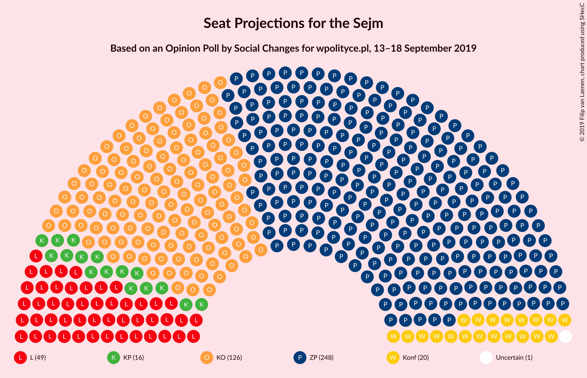

# Opinion Poll by Social Changes for wpolityce.pl, 13–18 September 2019

<a href="#voting-intentions">Voting Intentions</a> | <a href="#seats">Seats</a> | <a href="#coalitions">Coalitions</a> | <a href="#technical-information">Technical Information</a>

## Voting Intentions

### Confidence Intervals

| Party | Last Result | Poll Result | 80% Confidence Interval | 90% Confidence Interval | 95% Confidence Interval | 99% Confidence Interval |
|:-----:|:-----------:|:-----------:|:-----------------------:|:-----------------------:|:-----------------------:|:-----------------------:|
| Zjednoczona Prawica | 37.6% | 47.2% | 45.1–49.2% |44.6–49.8% |44.1–50.3% |43.1–51.2% |
| Koalicja Obywatelska | 31.7% | 26.1% | 24.3–27.9% |23.9–28.4% |23.4–28.9% |22.6–29.8% |
| Lewica | 11.7% | 12.4% | 11.1–13.8% |10.8–14.2% |10.5–14.6% |9.9–15.3% |
| Konfederacja | 4.8% | 7.5% | 6.5–8.7% |6.2–9.0% |6.0–9.3% |5.6–9.9% |
| Koalicja Polska | 13.9% | 6.8% | 5.9–7.9% |5.6–8.2% |5.4–8.5% |5.0–9.1% |

*Note:* The poll result column reflects the actual value used in the calculations. Published results may vary slightly, and in addition be rounded to fewer digits.

## Seats

### Confidence Intervals

| Party | Last Result | Median | 80% Confidence Interval | 90% Confidence Interval | 95% Confidence Interval | 99% Confidence Interval |
|:-----:|:-----------:|:------:|:-----------------------:|:-----------------------:|:-----------------------:|:-----------------------:|
| <a href="#zjednoczona-prawica">Zjednoczona Prawica</a> | 235 | 248 | 238–260 |232–265 |230–267 |223–273 |
| <a href="#koalicja-obywatelska">Koalicja Obywatelska</a> | 166 | 127 | 116–137 |114–143 |111–145 |104–148 |
| <a href="#lewica">Lewica</a> | 0 | 48 | 41–59 |40–62 |37–63 |35–66 |
| <a href="#konfederacja">Konfederacja</a> | 0 | 20 | 11–28 |9–31 |6–33 |4–37 |
| <a href="#koalicja-polska">Koalicja Polska</a> | 58 | 17 | 9–25 |7–27 |6–28 |0–34 |

### Zjednoczona Prawica

*For a full overview of the results for this party, see the [Zjednoczona Prawica](party-zjednoczonaprawica.html) page.*

| Number of Seats | Probability | Accumulated | Special Marks |
|:---------------:|:-----------:|:-----------:|:-------------:|
| 217 | 0% | 100% |  |
| 218 | 0% | 99.9% |  |
| 219 | 0.1% | 99.9% |  |
| 220 | 0% | 99.8% |  |
| 221 | 0% | 99.7% |  |
| 222 | 0.1% | 99.7% |  |
| 223 | 0.1% | 99.6% |  |
| 224 | 0.2% | 99.5% |  |
| 225 | 0.1% | 99.3% |  |
| 226 | 0.1% | 99.2% |  |
| 227 | 0.1% | 99.0% |  |
| 228 | 0.3% | 98.9% |  |
| 229 | 0.6% | 98.7% |  |
| 230 | 1.2% | 98% |  |
| 231 | 0.9% | 97% | Majority |
| 232 | 1.0% | 96% |  |
| 233 | 0.9% | 95% |  |
| 234 | 0.8% | 94% |  |
| 235 | 0.9% | 93% | Last Result |
| 236 | 1.2% | 92% |  |
| 237 | 1.2% | 91% |  |
| 238 | 3% | 90% |  |
| 239 | 3% | 88% |  |
| 240 | 4% | 84% |  |
| 241 | 6% | 80% |  |
| 242 | 5% | 74% |  |
| 243 | 4% | 69% |  |
| 244 | 5% | 65% |  |
| 245 | 2% | 60% |  |
| 246 | 4% | 58% |  |
| 247 | 2% | 54% |  |
| 248 | 5% | 52% | Median |
| 249 | 3% | 46% |  |
| 250 | 7% | 43% |  |
| 251 | 6% | 36% |  |
| 252 | 2% | 30% |  |
| 253 | 5% | 28% |  |
| 254 | 2% | 23% |  |
| 255 | 1.5% | 21% |  |
| 256 | 2% | 19% |  |
| 257 | 2% | 18% |  |
| 258 | 2% | 16% |  |
| 259 | 2% | 14% |  |
| 260 | 2% | 12% |  |
| 261 | 1.3% | 10% |  |
| 262 | 2% | 9% |  |
| 263 | 0.9% | 7% |  |
| 264 | 0.8% | 6% |  |
| 265 | 0.7% | 5% |  |
| 266 | 1.3% | 5% |  |
| 267 | 1.0% | 3% |  |
| 268 | 0.6% | 2% |  |
| 269 | 0.3% | 2% |  |
| 270 | 0.3% | 1.4% |  |
| 271 | 0.3% | 1.1% |  |
| 272 | 0.3% | 0.8% |  |
| 273 | 0.2% | 0.5% |  |
| 274 | 0.1% | 0.3% |  |
| 275 | 0.1% | 0.2% |  |
| 276 | 0.1% | 0.2% |  |
| 277 | 0% | 0.1% |  |
| 278 | 0% | 0.1% |  |
| 279 | 0% | 0.1% |  |
| 280 | 0% | 0% |  |

### Koalicja Obywatelska

*For a full overview of the results for this party, see the [Koalicja Obywatelska](party-koalicjaobywatelska.html) page.*

| Number of Seats | Probability | Accumulated | Special Marks |
|:---------------:|:-----------:|:-----------:|:-------------:|
| 98 | 0% | 100% |  |
| 99 | 0.1% | 99.9% |  |
| 100 | 0% | 99.9% |  |
| 101 | 0% | 99.8% |  |
| 102 | 0.1% | 99.8% |  |
| 103 | 0.1% | 99.7% |  |
| 104 | 0.1% | 99.6% |  |
| 105 | 0.2% | 99.5% |  |
| 106 | 0.1% | 99.3% |  |
| 107 | 0.2% | 99.1% |  |
| 108 | 0.3% | 99.0% |  |
| 109 | 0.2% | 98.7% |  |
| 110 | 0.6% | 98% |  |
| 111 | 0.9% | 98% |  |
| 112 | 1.1% | 97% |  |
| 113 | 0.6% | 96% |  |
| 114 | 1.4% | 95% |  |
| 115 | 3% | 94% |  |
| 116 | 3% | 91% |  |
| 117 | 2% | 88% |  |
| 118 | 7% | 86% |  |
| 119 | 1.2% | 79% |  |
| 120 | 4% | 78% |  |
| 121 | 3% | 74% |  |
| 122 | 2% | 71% |  |
| 123 | 3% | 69% |  |
| 124 | 5% | 66% |  |
| 125 | 5% | 60% |  |
| 126 | 4% | 55% |  |
| 127 | 6% | 51% | Median |
| 128 | 8% | 45% |  |
| 129 | 3% | 37% |  |
| 130 | 7% | 34% |  |
| 131 | 2% | 27% |  |
| 132 | 2% | 25% |  |
| 133 | 2% | 24% |  |
| 134 | 7% | 22% |  |
| 135 | 3% | 15% |  |
| 136 | 1.1% | 12% |  |
| 137 | 1.2% | 11% |  |
| 138 | 2% | 10% |  |
| 139 | 0.8% | 8% |  |
| 140 | 0.2% | 7% |  |
| 141 | 0.4% | 7% |  |
| 142 | 1.4% | 6% |  |
| 143 | 1.1% | 5% |  |
| 144 | 1.1% | 4% |  |
| 145 | 1.0% | 3% |  |
| 146 | 0.7% | 2% |  |
| 147 | 0.5% | 1.2% |  |
| 148 | 0.3% | 0.7% |  |
| 149 | 0.2% | 0.4% |  |
| 150 | 0.1% | 0.2% |  |
| 151 | 0% | 0.1% |  |
| 152 | 0% | 0.1% |  |
| 153 | 0% | 0.1% |  |
| 154 | 0% | 0% |  |
| 155 | 0% | 0% |  |
| 156 | 0% | 0% |  |
| 157 | 0% | 0% |  |
| 158 | 0% | 0% |  |
| 159 | 0% | 0% |  |
| 160 | 0% | 0% |  |
| 161 | 0% | 0% |  |
| 162 | 0% | 0% |  |
| 163 | 0% | 0% |  |
| 164 | 0% | 0% |  |
| 165 | 0% | 0% |  |
| 166 | 0% | 0% | Last Result |

### Lewica

*For a full overview of the results for this party, see the [Lewica](party-lewica.html) page.*

| Number of Seats | Probability | Accumulated | Special Marks |
|:---------------:|:-----------:|:-----------:|:-------------:|
| 0 | 0% | 100% | Last Result |
| 1 | 0% | 100% |  |
| 2 | 0% | 100% |  |
| 3 | 0% | 100% |  |
| 4 | 0% | 100% |  |
| 5 | 0% | 100% |  |
| 6 | 0% | 100% |  |
| 7 | 0% | 100% |  |
| 8 | 0% | 100% |  |
| 9 | 0% | 100% |  |
| 10 | 0% | 100% |  |
| 11 | 0% | 100% |  |
| 12 | 0% | 100% |  |
| 13 | 0% | 100% |  |
| 14 | 0% | 100% |  |
| 15 | 0% | 100% |  |
| 16 | 0% | 100% |  |
| 17 | 0% | 100% |  |
| 18 | 0% | 100% |  |
| 19 | 0% | 100% |  |
| 20 | 0% | 100% |  |
| 21 | 0% | 100% |  |
| 22 | 0% | 100% |  |
| 23 | 0% | 100% |  |
| 24 | 0% | 100% |  |
| 25 | 0% | 100% |  |
| 26 | 0% | 100% |  |
| 27 | 0% | 100% |  |
| 28 | 0% | 100% |  |
| 29 | 0% | 100% |  |
| 30 | 0% | 100% |  |
| 31 | 0% | 100% |  |
| 32 | 0.1% | 100% |  |
| 33 | 0.1% | 99.9% |  |
| 34 | 0.2% | 99.9% |  |
| 35 | 0.3% | 99.6% |  |
| 36 | 0.6% | 99.3% |  |
| 37 | 2% | 98.7% |  |
| 38 | 1.2% | 97% |  |
| 39 | 0.9% | 96% |  |
| 40 | 3% | 95% |  |
| 41 | 5% | 92% |  |
| 42 | 3% | 87% |  |
| 43 | 2% | 84% |  |
| 44 | 6% | 82% |  |
| 45 | 3% | 76% |  |
| 46 | 8% | 72% |  |
| 47 | 7% | 64% |  |
| 48 | 7% | 57% | Median |
| 49 | 4% | 50% |  |
| 50 | 4% | 46% |  |
| 51 | 11% | 42% |  |
| 52 | 3% | 31% |  |
| 53 | 4% | 28% |  |
| 54 | 2% | 24% |  |
| 55 | 2% | 22% |  |
| 56 | 4% | 20% |  |
| 57 | 4% | 16% |  |
| 58 | 1.2% | 12% |  |
| 59 | 2% | 11% |  |
| 60 | 2% | 9% |  |
| 61 | 1.2% | 7% |  |
| 62 | 1.2% | 6% |  |
| 63 | 2% | 4% |  |
| 64 | 0.5% | 2% |  |
| 65 | 1.2% | 2% |  |
| 66 | 0.3% | 0.7% |  |
| 67 | 0.2% | 0.4% |  |
| 68 | 0% | 0.2% |  |
| 69 | 0.1% | 0.2% |  |
| 70 | 0.1% | 0.1% |  |
| 71 | 0% | 0.1% |  |
| 72 | 0% | 0% |  |

### Konfederacja

*For a full overview of the results for this party, see the [Konfederacja](party-konfederacja.html) page.*

| Number of Seats | Probability | Accumulated | Special Marks |
|:---------------:|:-----------:|:-----------:|:-------------:|
| 0 | 0% | 100% | Last Result |
| 1 | 0% | 100% |  |
| 2 | 0.1% | 100% |  |
| 3 | 0.2% | 99.8% |  |
| 4 | 0.3% | 99.6% |  |
| 5 | 1.4% | 99.3% |  |
| 6 | 0.9% | 98% |  |
| 7 | 0.5% | 97% |  |
| 8 | 1.2% | 97% |  |
| 9 | 1.3% | 95% |  |
| 10 | 1.4% | 94% |  |
| 11 | 4% | 93% |  |
| 12 | 5% | 89% |  |
| 13 | 6% | 84% |  |
| 14 | 5% | 78% |  |
| 15 | 5% | 73% |  |
| 16 | 4% | 69% |  |
| 17 | 8% | 65% |  |
| 18 | 1.1% | 57% |  |
| 19 | 4% | 56% |  |
| 20 | 4% | 52% | Median |
| 21 | 3% | 47% |  |
| 22 | 8% | 45% |  |
| 23 | 3% | 36% |  |
| 24 | 4% | 33% |  |
| 25 | 5% | 29% |  |
| 26 | 8% | 24% |  |
| 27 | 4% | 16% |  |
| 28 | 4% | 12% |  |
| 29 | 2% | 9% |  |
| 30 | 1.3% | 6% |  |
| 31 | 1.4% | 5% |  |
| 32 | 0.6% | 4% |  |
| 33 | 1.1% | 3% |  |
| 34 | 0.6% | 2% |  |
| 35 | 0.6% | 2% |  |
| 36 | 0.3% | 1.0% |  |
| 37 | 0.3% | 0.6% |  |
| 38 | 0.2% | 0.3% |  |
| 39 | 0% | 0.1% |  |
| 40 | 0% | 0.1% |  |
| 41 | 0% | 0.1% |  |
| 42 | 0% | 0% |  |

### Koalicja Polska

*For a full overview of the results for this party, see the [Koalicja Polska](party-koalicjapolska.html) page.*

| Number of Seats | Probability | Accumulated | Special Marks |
|:---------------:|:-----------:|:-----------:|:-------------:|
| 0 | 0.6% | 100% |  |
| 1 | 0% | 99.4% |  |
| 2 | 0% | 99.4% |  |
| 3 | 0% | 99.4% |  |
| 4 | 0.1% | 99.4% |  |
| 5 | 0.5% | 99.3% |  |
| 6 | 2% | 98.9% |  |
| 7 | 3% | 97% |  |
| 8 | 2% | 94% |  |
| 9 | 4% | 92% |  |
| 10 | 7% | 88% |  |
| 11 | 6% | 81% |  |
| 12 | 6% | 76% |  |
| 13 | 4% | 70% |  |
| 14 | 7% | 66% |  |
| 15 | 4% | 59% |  |
| 16 | 5% | 55% |  |
| 17 | 6% | 50% | Median |
| 18 | 9% | 44% |  |
| 19 | 2% | 35% |  |
| 20 | 2% | 32% |  |
| 21 | 4% | 31% |  |
| 22 | 2% | 27% |  |
| 23 | 7% | 24% |  |
| 24 | 4% | 17% |  |
| 25 | 5% | 14% |  |
| 26 | 3% | 9% |  |
| 27 | 2% | 5% |  |
| 28 | 1.2% | 3% |  |
| 29 | 0.6% | 2% |  |
| 30 | 0.1% | 2% |  |
| 31 | 0.2% | 1.4% |  |
| 32 | 0.5% | 1.1% |  |
| 33 | 0.1% | 0.7% |  |
| 34 | 0.2% | 0.6% |  |
| 35 | 0.1% | 0.4% |  |
| 36 | 0.1% | 0.3% |  |
| 37 | 0.1% | 0.2% |  |
| 38 | 0% | 0.1% |  |
| 39 | 0.1% | 0.1% |  |
| 40 | 0% | 0.1% |  |
| 41 | 0% | 0% |  |
| 42 | 0% | 0% |  |
| 43 | 0% | 0% |  |
| 44 | 0% | 0% |  |
| 45 | 0% | 0% |  |
| 46 | 0% | 0% |  |
| 47 | 0% | 0% |  |
| 48 | 0% | 0% |  |
| 49 | 0% | 0% |  |
| 50 | 0% | 0% |  |
| 51 | 0% | 0% |  |
| 52 | 0% | 0% |  |
| 53 | 0% | 0% |  |
| 54 | 0% | 0% |  |
| 55 | 0% | 0% |  |
| 56 | 0% | 0% |  |
| 57 | 0% | 0% |  |
| 58 | 0% | 0% | Last Result |

## Coalitions

### Confidence Intervals

| Coalition | Last Result | Median | Majority? | 80% Confidence Interval | 90% Confidence Interval | 95% Confidence Interval | 99% Confidence Interval |
|:---------:|:-----------:|:------:|:---------:|:-----------------------:|:-----------------------:|:-----------------------:|:-----------------------:|
| Zjednoczona Prawica | 235 | 248 | 97% | 238–260 | 232–265 | 230–267 | 223–273 |
| Koalicja Obywatelska – Lewica – Koalicja Polska | 224 | 193 | 0% | 180–206 | 176–209 | 174–212 | 168–218 |
| Koalicja Obywatelska – Lewica | 166 | 176 | 0% | 164–189 | 160–193 | 157–195 | 153–201 |
| Koalicja Obywatelska – Koalicja Polska | 224 | 144 | 0% | 131–155 | 127–159 | 125–161 | 119–167 |
| Koalicja Obywatelska | 166 | 127 | 0% | 116–137 | 114–143 | 111–145 | 104–148 |

### Zjednoczona Prawica

| Number of Seats | Probability | Accumulated | Special Marks |
|:---------------:|:-----------:|:-----------:|:-------------:|
| 217 | 0% | 100% |  |
| 218 | 0% | 99.9% |  |
| 219 | 0.1% | 99.9% |  |
| 220 | 0% | 99.8% |  |
| 221 | 0% | 99.7% |  |
| 222 | 0.1% | 99.7% |  |
| 223 | 0.1% | 99.6% |  |
| 224 | 0.2% | 99.5% |  |
| 225 | 0.1% | 99.3% |  |
| 226 | 0.1% | 99.2% |  |
| 227 | 0.1% | 99.0% |  |
| 228 | 0.3% | 98.9% |  |
| 229 | 0.6% | 98.7% |  |
| 230 | 1.2% | 98% |  |
| 231 | 0.9% | 97% | Majority |
| 232 | 1.0% | 96% |  |
| 233 | 0.9% | 95% |  |
| 234 | 0.8% | 94% |  |
| 235 | 0.9% | 93% | Last Result |
| 236 | 1.2% | 92% |  |
| 237 | 1.2% | 91% |  |
| 238 | 3% | 90% |  |
| 239 | 3% | 88% |  |
| 240 | 4% | 84% |  |
| 241 | 6% | 80% |  |
| 242 | 5% | 74% |  |
| 243 | 4% | 69% |  |
| 244 | 5% | 65% |  |
| 245 | 2% | 60% |  |
| 246 | 4% | 58% |  |
| 247 | 2% | 54% |  |
| 248 | 5% | 52% | Median |
| 249 | 3% | 46% |  |
| 250 | 7% | 43% |  |
| 251 | 6% | 36% |  |
| 252 | 2% | 30% |  |
| 253 | 5% | 28% |  |
| 254 | 2% | 23% |  |
| 255 | 1.5% | 21% |  |
| 256 | 2% | 19% |  |
| 257 | 2% | 18% |  |
| 258 | 2% | 16% |  |
| 259 | 2% | 14% |  |
| 260 | 2% | 12% |  |
| 261 | 1.3% | 10% |  |
| 262 | 2% | 9% |  |
| 263 | 0.9% | 7% |  |
| 264 | 0.8% | 6% |  |
| 265 | 0.7% | 5% |  |
| 266 | 1.3% | 5% |  |
| 267 | 1.0% | 3% |  |
| 268 | 0.6% | 2% |  |
| 269 | 0.3% | 2% |  |
| 270 | 0.3% | 1.4% |  |
| 271 | 0.3% | 1.1% |  |
| 272 | 0.3% | 0.8% |  |
| 273 | 0.2% | 0.5% |  |
| 274 | 0.1% | 0.3% |  |
| 275 | 0.1% | 0.2% |  |
| 276 | 0.1% | 0.2% |  |
| 277 | 0% | 0.1% |  |
| 278 | 0% | 0.1% |  |
| 279 | 0% | 0.1% |  |
| 280 | 0% | 0% |  |

### Koalicja Obywatelska – Lewica – Koalicja Polska

| Number of Seats | Probability | Accumulated | Special Marks |
|:---------------:|:-----------:|:-----------:|:-------------:|
| 161 | 0% | 100% |  |
| 162 | 0% | 99.9% |  |
| 163 | 0% | 99.9% |  |
| 164 | 0% | 99.9% |  |
| 165 | 0% | 99.8% |  |
| 166 | 0.2% | 99.8% |  |
| 167 | 0.1% | 99.7% |  |
| 168 | 0.1% | 99.6% |  |
| 169 | 0.1% | 99.5% |  |
| 170 | 0.2% | 99.4% |  |
| 171 | 0.3% | 99.2% |  |
| 172 | 0.6% | 98.9% |  |
| 173 | 0.7% | 98% |  |
| 174 | 0.8% | 98% |  |
| 175 | 0.4% | 97% |  |
| 176 | 2% | 96% |  |
| 177 | 0.5% | 95% |  |
| 178 | 3% | 94% |  |
| 179 | 0.8% | 91% |  |
| 180 | 1.4% | 90% |  |
| 181 | 0.9% | 89% |  |
| 182 | 2% | 88% |  |
| 183 | 2% | 85% |  |
| 184 | 5% | 83% |  |
| 185 | 2% | 78% |  |
| 186 | 3% | 76% |  |
| 187 | 5% | 73% |  |
| 188 | 4% | 68% |  |
| 189 | 3% | 64% |  |
| 190 | 4% | 61% |  |
| 191 | 3% | 57% |  |
| 192 | 4% | 54% | Median |
| 193 | 5% | 50% |  |
| 194 | 4% | 45% |  |
| 195 | 2% | 41% |  |
| 196 | 5% | 39% |  |
| 197 | 3% | 34% |  |
| 198 | 6% | 31% |  |
| 199 | 2% | 25% |  |
| 200 | 2% | 23% |  |
| 201 | 2% | 21% |  |
| 202 | 4% | 19% |  |
| 203 | 2% | 15% |  |
| 204 | 1.3% | 13% |  |
| 205 | 2% | 12% |  |
| 206 | 2% | 10% |  |
| 207 | 2% | 8% |  |
| 208 | 0.8% | 7% |  |
| 209 | 2% | 6% |  |
| 210 | 0.7% | 4% |  |
| 211 | 1.0% | 4% |  |
| 212 | 0.2% | 3% |  |
| 213 | 0.2% | 2% |  |
| 214 | 0.5% | 2% |  |
| 215 | 0.3% | 2% |  |
| 216 | 0.4% | 1.2% |  |
| 217 | 0.2% | 0.8% |  |
| 218 | 0.3% | 0.7% |  |
| 219 | 0.1% | 0.4% |  |
| 220 | 0.1% | 0.3% |  |
| 221 | 0.1% | 0.2% |  |
| 222 | 0% | 0.1% |  |
| 223 | 0% | 0.1% |  |
| 224 | 0% | 0.1% | Last Result |
| 225 | 0% | 0.1% |  |
| 226 | 0% | 0.1% |  |
| 227 | 0% | 0% |  |

### Koalicja Obywatelska – Lewica

| Number of Seats | Probability | Accumulated | Special Marks |
|:---------------:|:-----------:|:-----------:|:-------------:|
| 146 | 0% | 100% |  |
| 147 | 0% | 99.9% |  |
| 148 | 0% | 99.9% |  |
| 149 | 0.1% | 99.9% |  |
| 150 | 0.1% | 99.8% |  |
| 151 | 0.2% | 99.8% |  |
| 152 | 0.1% | 99.6% |  |
| 153 | 0.4% | 99.5% |  |
| 154 | 0.3% | 99.1% |  |
| 155 | 0.6% | 98.8% |  |
| 156 | 0.5% | 98% |  |
| 157 | 0.6% | 98% |  |
| 158 | 0.3% | 97% |  |
| 159 | 1.0% | 97% |  |
| 160 | 1.1% | 96% |  |
| 161 | 0.7% | 95% |  |
| 162 | 2% | 94% |  |
| 163 | 0.7% | 92% |  |
| 164 | 4% | 91% |  |
| 165 | 2% | 87% |  |
| 166 | 4% | 85% | Last Result |
| 167 | 2% | 81% |  |
| 168 | 2% | 79% |  |
| 169 | 5% | 77% |  |
| 170 | 2% | 72% |  |
| 171 | 3% | 70% |  |
| 172 | 3% | 66% |  |
| 173 | 4% | 63% |  |
| 174 | 6% | 59% |  |
| 175 | 3% | 53% | Median |
| 176 | 3% | 50% |  |
| 177 | 3% | 47% |  |
| 178 | 6% | 44% |  |
| 179 | 5% | 38% |  |
| 180 | 3% | 33% |  |
| 181 | 3% | 30% |  |
| 182 | 1.4% | 26% |  |
| 183 | 3% | 25% |  |
| 184 | 5% | 22% |  |
| 185 | 2% | 18% |  |
| 186 | 2% | 16% |  |
| 187 | 0.8% | 14% |  |
| 188 | 3% | 13% |  |
| 189 | 1.2% | 10% |  |
| 190 | 2% | 9% |  |
| 191 | 0.7% | 7% |  |
| 192 | 0.7% | 6% |  |
| 193 | 1.5% | 5% |  |
| 194 | 1.0% | 4% |  |
| 195 | 0.6% | 3% |  |
| 196 | 0.4% | 2% |  |
| 197 | 0.2% | 2% |  |
| 198 | 0.4% | 2% |  |
| 199 | 0.3% | 1.3% |  |
| 200 | 0.4% | 1.0% |  |
| 201 | 0.2% | 0.6% |  |
| 202 | 0.2% | 0.4% |  |
| 203 | 0.1% | 0.3% |  |
| 204 | 0% | 0.1% |  |
| 205 | 0% | 0.1% |  |
| 206 | 0% | 0.1% |  |
| 207 | 0% | 0% |  |

### Koalicja Obywatelska – Koalicja Polska

| Number of Seats | Probability | Accumulated | Special Marks |
|:---------------:|:-----------:|:-----------:|:-------------:|
| 112 | 0% | 100% |  |
| 113 | 0% | 99.9% |  |
| 114 | 0.1% | 99.9% |  |
| 115 | 0% | 99.9% |  |
| 116 | 0.1% | 99.8% |  |
| 117 | 0% | 99.8% |  |
| 118 | 0.1% | 99.7% |  |
| 119 | 0.2% | 99.6% |  |
| 120 | 0.2% | 99.5% |  |
| 121 | 0.2% | 99.3% |  |
| 122 | 0.4% | 99.2% |  |
| 123 | 0.3% | 98.8% |  |
| 124 | 0.2% | 98.5% |  |
| 125 | 1.2% | 98% |  |
| 126 | 1.0% | 97% |  |
| 127 | 2% | 96% |  |
| 128 | 2% | 94% |  |
| 129 | 0.7% | 93% |  |
| 130 | 1.4% | 92% |  |
| 131 | 1.5% | 91% |  |
| 132 | 3% | 89% |  |
| 133 | 3% | 86% |  |
| 134 | 2% | 83% |  |
| 135 | 1.5% | 81% |  |
| 136 | 4% | 79% |  |
| 137 | 4% | 75% |  |
| 138 | 5% | 72% |  |
| 139 | 2% | 66% |  |
| 140 | 4% | 64% |  |
| 141 | 2% | 60% |  |
| 142 | 4% | 58% |  |
| 143 | 4% | 55% |  |
| 144 | 4% | 51% | Median |
| 145 | 4% | 47% |  |
| 146 | 3% | 43% |  |
| 147 | 6% | 40% |  |
| 148 | 5% | 35% |  |
| 149 | 4% | 29% |  |
| 150 | 4% | 26% |  |
| 151 | 5% | 22% |  |
| 152 | 3% | 17% |  |
| 153 | 3% | 15% |  |
| 154 | 1.4% | 12% |  |
| 155 | 2% | 10% |  |
| 156 | 1.2% | 9% |  |
| 157 | 1.2% | 7% |  |
| 158 | 0.6% | 6% |  |
| 159 | 0.7% | 6% |  |
| 160 | 2% | 5% |  |
| 161 | 0.8% | 3% |  |
| 162 | 0.6% | 2% |  |
| 163 | 0.3% | 2% |  |
| 164 | 0.3% | 2% |  |
| 165 | 0.2% | 1.2% |  |
| 166 | 0.3% | 1.1% |  |
| 167 | 0.3% | 0.7% |  |
| 168 | 0% | 0.4% |  |
| 169 | 0% | 0.4% |  |
| 170 | 0.1% | 0.4% |  |
| 171 | 0.1% | 0.2% |  |
| 172 | 0% | 0.2% |  |
| 173 | 0.1% | 0.1% |  |
| 174 | 0% | 0.1% |  |
| 175 | 0% | 0% |  |
| 176 | 0% | 0% |  |
| 177 | 0% | 0% |  |
| 178 | 0% | 0% |  |
| 179 | 0% | 0% |  |
| 180 | 0% | 0% |  |
| 181 | 0% | 0% |  |
| 182 | 0% | 0% |  |
| 183 | 0% | 0% |  |
| 184 | 0% | 0% |  |
| 185 | 0% | 0% |  |
| 186 | 0% | 0% |  |
| 187 | 0% | 0% |  |
| 188 | 0% | 0% |  |
| 189 | 0% | 0% |  |
| 190 | 0% | 0% |  |
| 191 | 0% | 0% |  |
| 192 | 0% | 0% |  |
| 193 | 0% | 0% |  |
| 194 | 0% | 0% |  |
| 195 | 0% | 0% |  |
| 196 | 0% | 0% |  |
| 197 | 0% | 0% |  |
| 198 | 0% | 0% |  |
| 199 | 0% | 0% |  |
| 200 | 0% | 0% |  |
| 201 | 0% | 0% |  |
| 202 | 0% | 0% |  |
| 203 | 0% | 0% |  |
| 204 | 0% | 0% |  |
| 205 | 0% | 0% |  |
| 206 | 0% | 0% |  |
| 207 | 0% | 0% |  |
| 208 | 0% | 0% |  |
| 209 | 0% | 0% |  |
| 210 | 0% | 0% |  |
| 211 | 0% | 0% |  |
| 212 | 0% | 0% |  |
| 213 | 0% | 0% |  |
| 214 | 0% | 0% |  |
| 215 | 0% | 0% |  |
| 216 | 0% | 0% |  |
| 217 | 0% | 0% |  |
| 218 | 0% | 0% |  |
| 219 | 0% | 0% |  |
| 220 | 0% | 0% |  |
| 221 | 0% | 0% |  |
| 222 | 0% | 0% |  |
| 223 | 0% | 0% |  |
| 224 | 0% | 0% | Last Result |

### Koalicja Obywatelska

| Number of Seats | Probability | Accumulated | Special Marks |
|:---------------:|:-----------:|:-----------:|:-------------:|
| 98 | 0% | 100% |  |
| 99 | 0.1% | 99.9% |  |
| 100 | 0% | 99.9% |  |
| 101 | 0% | 99.8% |  |
| 102 | 0.1% | 99.8% |  |
| 103 | 0.1% | 99.7% |  |
| 104 | 0.1% | 99.6% |  |
| 105 | 0.2% | 99.5% |  |
| 106 | 0.1% | 99.3% |  |
| 107 | 0.2% | 99.1% |  |
| 108 | 0.3% | 99.0% |  |
| 109 | 0.2% | 98.7% |  |
| 110 | 0.6% | 98% |  |
| 111 | 0.9% | 98% |  |
| 112 | 1.1% | 97% |  |
| 113 | 0.6% | 96% |  |
| 114 | 1.4% | 95% |  |
| 115 | 3% | 94% |  |
| 116 | 3% | 91% |  |
| 117 | 2% | 88% |  |
| 118 | 7% | 86% |  |
| 119 | 1.2% | 79% |  |
| 120 | 4% | 78% |  |
| 121 | 3% | 74% |  |
| 122 | 2% | 71% |  |
| 123 | 3% | 69% |  |
| 124 | 5% | 66% |  |
| 125 | 5% | 60% |  |
| 126 | 4% | 55% |  |
| 127 | 6% | 51% | Median |
| 128 | 8% | 45% |  |
| 129 | 3% | 37% |  |
| 130 | 7% | 34% |  |
| 131 | 2% | 27% |  |
| 132 | 2% | 25% |  |
| 133 | 2% | 24% |  |
| 134 | 7% | 22% |  |
| 135 | 3% | 15% |  |
| 136 | 1.1% | 12% |  |
| 137 | 1.2% | 11% |  |
| 138 | 2% | 10% |  |
| 139 | 0.8% | 8% |  |
| 140 | 0.2% | 7% |  |
| 141 | 0.4% | 7% |  |
| 142 | 1.4% | 6% |  |
| 143 | 1.1% | 5% |  |
| 144 | 1.1% | 4% |  |
| 145 | 1.0% | 3% |  |
| 146 | 0.7% | 2% |  |
| 147 | 0.5% | 1.2% |  |
| 148 | 0.3% | 0.7% |  |
| 149 | 0.2% | 0.4% |  |
| 150 | 0.1% | 0.2% |  |
| 151 | 0% | 0.1% |  |
| 152 | 0% | 0.1% |  |
| 153 | 0% | 0.1% |  |
| 154 | 0% | 0% |  |
| 155 | 0% | 0% |  |
| 156 | 0% | 0% |  |
| 157 | 0% | 0% |  |
| 158 | 0% | 0% |  |
| 159 | 0% | 0% |  |
| 160 | 0% | 0% |  |
| 161 | 0% | 0% |  |
| 162 | 0% | 0% |  |
| 163 | 0% | 0% |  |
| 164 | 0% | 0% |  |
| 165 | 0% | 0% |  |
| 166 | 0% | 0% | Last Result |

## Technical Information

### Opinion Poll

+ **Polling firm:** Social Changes
+ **Commissioner(s):** wpolityce.pl
+ **Fieldwork period:** 13–18 September 2019

### Calculations

+ **Sample size:** 1001
+ **Simulations done:** 131,072
+ **Error estimate:** 0.98%

