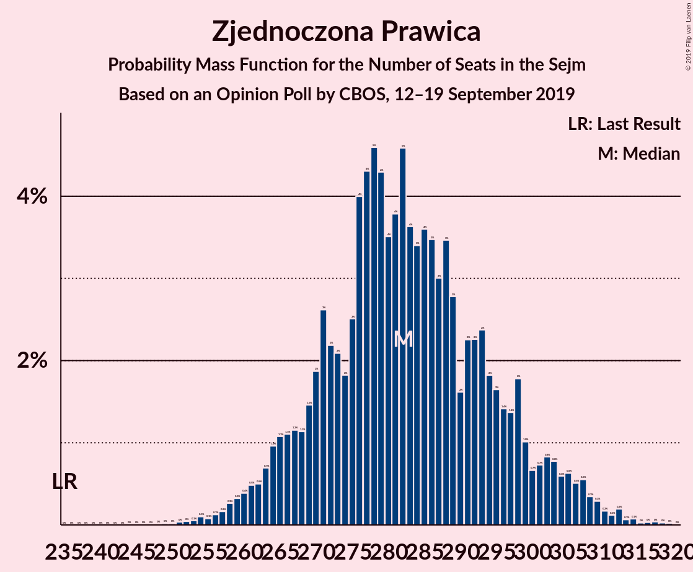
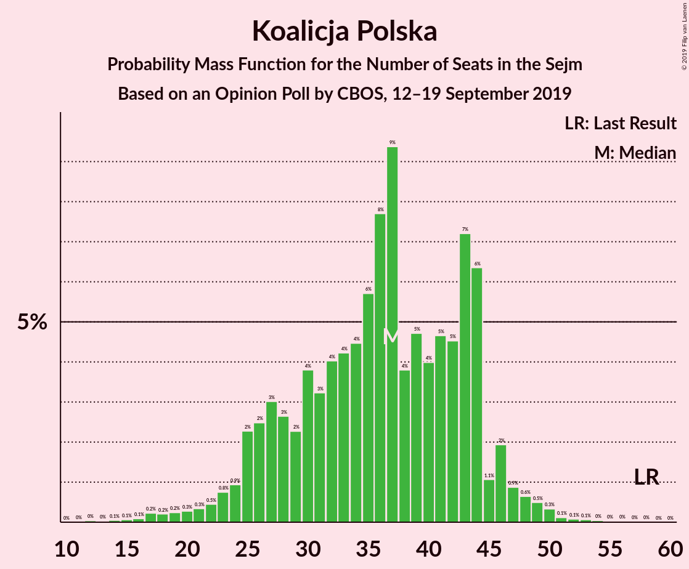
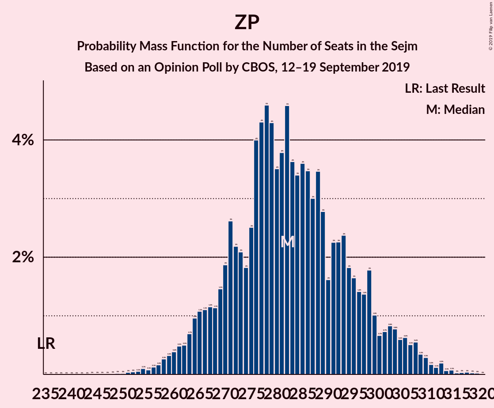
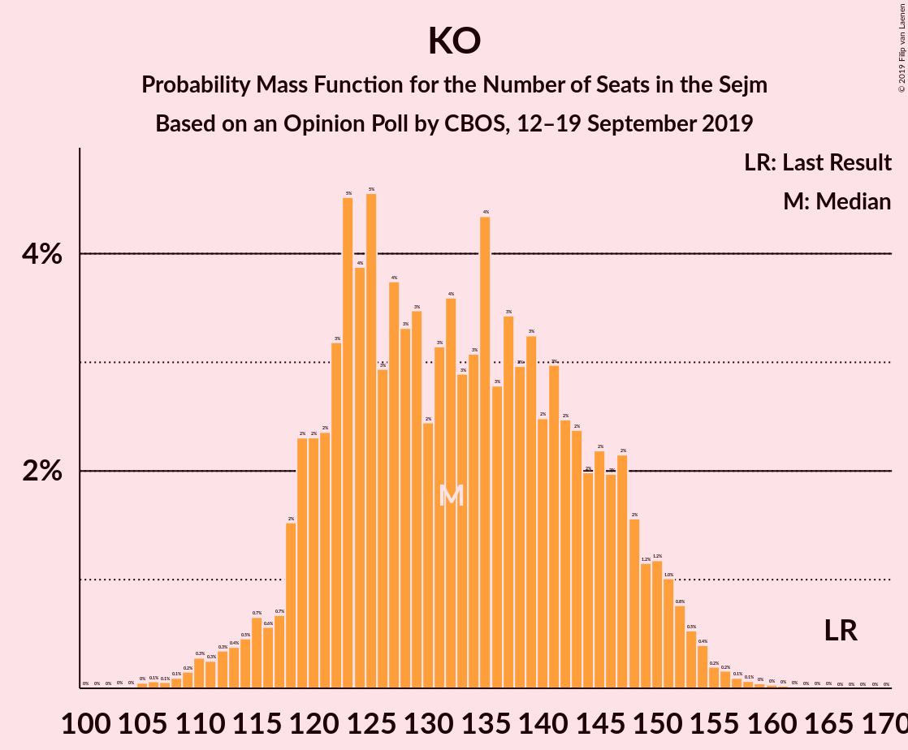

# Opinion Poll by CBOS, 12–19 September 2019

<a href="#voting-intentions">Voting Intentions</a> | <a href="#seats">Seats</a> | <a href="#coalitions">Coalitions</a> | <a href="#technical-information">Technical Information</a>

## Voting Intentions

### Confidence Intervals

| Party | Last Result | Poll Result | 80% Confidence Interval | 90% Confidence Interval | 95% Confidence Interval | 99% Confidence Interval |
|:-----:|:-----------:|:-----------:|:-----------------------:|:-----------------------:|:-----------------------:|:-----------------------:|
| Zjednoczona Prawica | 37.6% | 46.0% | 43.9–48.0% |43.4–48.6% |42.9–49.1% |41.9–50.1% |
| Koalicja Obywatelska | 31.7% | 23.0% | 21.4–24.8% |20.9–25.3% |20.5–25.8% |19.7–26.6% |
| Koalicja Polska | 13.9% | 8.0% | 7.0–9.2% |6.7–9.5% |6.4–9.8% |6.0–10.5% |
| Lewica | 11.7% | 5.1% | 4.3–6.1% |4.0–6.4% |3.8–6.6% |3.5–7.1% |
| Konfederacja | 4.8% | 3.0% | 2.4–3.9% |2.3–4.1% |2.1–4.3% |1.9–4.7% |

*Note:* The poll result column reflects the actual value used in the calculations. Published results may vary slightly, and in addition be rounded to fewer digits.

## Seats

### Confidence Intervals

| Party | Last Result | Median | 80% Confidence Interval | 90% Confidence Interval | 95% Confidence Interval | 99% Confidence Interval |
|:-----:|:-----------:|:------:|:-----------------------:|:-----------------------:|:-----------------------:|:-----------------------:|
| <a href="#zjednoczona-prawica">Zjednoczona Prawica</a> | 235 | 282 | 269–297 |265–302 |262–305 |257–311 |
| <a href="#koalicja-obywatelska">Koalicja Obywatelska</a> | 166 | 132 | 120–146 |118–149 |115–151 |110–155 |
| <a href="#koalicja-polska">Koalicja Polska</a> | 58 | 37 | 27–44 |25–45 |23–47 |17–50 |
| <a href="#lewica">Lewica</a> | 0 | 10 | 0–23 |0–24 |0–25 |0–29 |
| <a href="#konfederacja">Konfederacja</a> | 0 | 0 | 0 |0 |0 |0 |

### Zjednoczona Prawica

*For a full overview of the results for this party, see the [Zjednoczona Prawica](party-zjednoczonaprawica.html) page.*

| Number of Seats | Probability | Accumulated | Special Marks |
|:---------------:|:-----------:|:-----------:|:-------------:|
| 235 | 0% | 100% | Last Result |
| 236 | 0% | 100% |  |
| 237 | 0% | 100% |  |
| 238 | 0% | 100% |  |
| 239 | 0% | 100% |  |
| 240 | 0% | 100% |  |
| 241 | 0% | 100% |  |
| 242 | 0% | 100% |  |
| 243 | 0% | 100% |  |
| 244 | 0% | 100% |  |
| 245 | 0% | 100% |  |
| 246 | 0% | 100% |  |
| 247 | 0% | 100% |  |
| 248 | 0% | 100% |  |
| 249 | 0% | 100% |  |
| 250 | 0% | 100% |  |
| 251 | 0% | 99.9% |  |
| 252 | 0% | 99.9% |  |
| 253 | 0.1% | 99.9% |  |
| 254 | 0.1% | 99.8% |  |
| 255 | 0.1% | 99.7% |  |
| 256 | 0.1% | 99.7% |  |
| 257 | 0.2% | 99.5% |  |
| 258 | 0.3% | 99.3% |  |
| 259 | 0.3% | 99.0% |  |
| 260 | 0.4% | 98.7% |  |
| 261 | 0.4% | 98% |  |
| 262 | 0.6% | 98% |  |
| 263 | 0.8% | 97% |  |
| 264 | 1.1% | 97% |  |
| 265 | 1.0% | 95% |  |
| 266 | 0.9% | 95% |  |
| 267 | 1.1% | 94% |  |
| 268 | 1.3% | 92% |  |
| 269 | 2% | 91% |  |
| 270 | 2% | 90% |  |
| 271 | 3% | 88% |  |
| 272 | 2% | 85% |  |
| 273 | 2% | 83% |  |
| 274 | 2% | 81% |  |
| 275 | 3% | 79% |  |
| 276 | 4% | 76% |  |
| 277 | 5% | 72% |  |
| 278 | 4% | 68% |  |
| 279 | 4% | 64% |  |
| 280 | 4% | 60% |  |
| 281 | 4% | 56% |  |
| 282 | 5% | 52% | Median |
| 283 | 3% | 47% |  |
| 284 | 3% | 44% |  |
| 285 | 5% | 41% |  |
| 286 | 3% | 36% |  |
| 287 | 3% | 33% |  |
| 288 | 3% | 30% |  |
| 289 | 3% | 27% |  |
| 290 | 2% | 24% |  |
| 291 | 3% | 23% |  |
| 292 | 2% | 20% |  |
| 293 | 2% | 18% |  |
| 294 | 1.5% | 16% |  |
| 295 | 2% | 14% |  |
| 296 | 2% | 13% |  |
| 297 | 2% | 11% |  |
| 298 | 2% | 9% |  |
| 299 | 0.8% | 8% |  |
| 300 | 0.8% | 7% |  |
| 301 | 0.7% | 6% |  |
| 302 | 1.1% | 5% |  |
| 303 | 0.6% | 4% |  |
| 304 | 0.5% | 4% |  |
| 305 | 0.6% | 3% |  |
| 306 | 0.6% | 2% |  |
| 307 | 0.5% | 2% |  |
| 308 | 0.3% | 1.4% |  |
| 309 | 0.3% | 1.1% |  |
| 310 | 0.1% | 0.7% |  |
| 311 | 0.1% | 0.6% |  |
| 312 | 0.2% | 0.5% |  |
| 313 | 0.1% | 0.3% |  |
| 314 | 0.1% | 0.3% |  |
| 315 | 0% | 0.2% |  |
| 316 | 0% | 0.2% |  |
| 317 | 0% | 0.1% |  |
| 318 | 0% | 0.1% |  |
| 319 | 0% | 0% |  |

### Koalicja Obywatelska

*For a full overview of the results for this party, see the [Koalicja Obywatelska](party-koalicjaobywatelska.html) page.*

| Number of Seats | Probability | Accumulated | Special Marks |
|:---------------:|:-----------:|:-----------:|:-------------:|
| 103 | 0% | 100% |  |
| 104 | 0% | 99.9% |  |
| 105 | 0% | 99.9% |  |
| 106 | 0.1% | 99.9% |  |
| 107 | 0.1% | 99.8% |  |
| 108 | 0.1% | 99.8% |  |
| 109 | 0.1% | 99.7% |  |
| 110 | 0.3% | 99.5% |  |
| 111 | 0.3% | 99.3% |  |
| 112 | 0.3% | 99.0% |  |
| 113 | 0.4% | 98.7% |  |
| 114 | 0.5% | 98% |  |
| 115 | 0.6% | 98% |  |
| 116 | 0.5% | 97% |  |
| 117 | 0.7% | 97% |  |
| 118 | 2% | 96% |  |
| 119 | 2% | 94% |  |
| 120 | 2% | 92% |  |
| 121 | 2% | 90% |  |
| 122 | 3% | 87% |  |
| 123 | 5% | 85% |  |
| 124 | 5% | 80% |  |
| 125 | 5% | 75% |  |
| 126 | 3% | 71% |  |
| 127 | 4% | 68% |  |
| 128 | 3% | 64% |  |
| 129 | 4% | 61% |  |
| 130 | 2% | 57% |  |
| 131 | 3% | 55% |  |
| 132 | 3% | 51% | Median |
| 133 | 2% | 48% |  |
| 134 | 3% | 46% |  |
| 135 | 4% | 42% |  |
| 136 | 3% | 38% |  |
| 137 | 3% | 35% |  |
| 138 | 3% | 32% |  |
| 139 | 3% | 29% |  |
| 140 | 2% | 26% |  |
| 141 | 3% | 24% |  |
| 142 | 3% | 21% |  |
| 143 | 2% | 18% |  |
| 144 | 2% | 16% |  |
| 145 | 2% | 14% |  |
| 146 | 2% | 11% |  |
| 147 | 2% | 10% |  |
| 148 | 2% | 8% |  |
| 149 | 1.2% | 6% |  |
| 150 | 1.3% | 5% |  |
| 151 | 1.1% | 3% |  |
| 152 | 0.8% | 2% |  |
| 153 | 0.7% | 2% |  |
| 154 | 0.3% | 1.0% |  |
| 155 | 0.2% | 0.7% |  |
| 156 | 0.2% | 0.5% |  |
| 157 | 0.1% | 0.3% |  |
| 158 | 0.1% | 0.2% |  |
| 159 | 0% | 0.1% |  |
| 160 | 0% | 0.1% |  |
| 161 | 0% | 0.1% |  |
| 162 | 0% | 0% |  |
| 163 | 0% | 0% |  |
| 164 | 0% | 0% |  |
| 165 | 0% | 0% |  |
| 166 | 0% | 0% | Last Result |

### Koalicja Polska

*For a full overview of the results for this party, see the [Koalicja Polska](party-koalicjapolska.html) page.*

| Number of Seats | Probability | Accumulated | Special Marks |
|:---------------:|:-----------:|:-----------:|:-------------:|
| 12 | 0% | 100% |  |
| 13 | 0% | 99.9% |  |
| 14 | 0.1% | 99.9% |  |
| 15 | 0.1% | 99.9% |  |
| 16 | 0.1% | 99.8% |  |
| 17 | 0.2% | 99.7% |  |
| 18 | 0.2% | 99.5% |  |
| 19 | 0.2% | 99.3% |  |
| 20 | 0.3% | 99.0% |  |
| 21 | 0.3% | 98.7% |  |
| 22 | 0.5% | 98% |  |
| 23 | 0.7% | 98% |  |
| 24 | 0.8% | 97% |  |
| 25 | 2% | 96% |  |
| 26 | 3% | 94% |  |
| 27 | 3% | 91% |  |
| 28 | 3% | 89% |  |
| 29 | 2% | 86% |  |
| 30 | 4% | 83% |  |
| 31 | 3% | 80% |  |
| 32 | 4% | 76% |  |
| 33 | 4% | 72% |  |
| 34 | 5% | 68% |  |
| 35 | 5% | 63% |  |
| 36 | 8% | 58% |  |
| 37 | 10% | 51% | Median |
| 38 | 4% | 41% |  |
| 39 | 5% | 37% |  |
| 40 | 4% | 32% |  |
| 41 | 5% | 29% |  |
| 42 | 5% | 24% |  |
| 43 | 7% | 19% |  |
| 44 | 6% | 12% |  |
| 45 | 1.1% | 6% |  |
| 46 | 2% | 5% |  |
| 47 | 0.9% | 3% |  |
| 48 | 0.7% | 2% |  |
| 49 | 0.5% | 1.2% |  |
| 50 | 0.3% | 0.7% |  |
| 51 | 0.1% | 0.4% |  |
| 52 | 0.1% | 0.3% |  |
| 53 | 0.1% | 0.2% |  |
| 54 | 0% | 0.1% |  |
| 55 | 0% | 0.1% |  |
| 56 | 0% | 0.1% |  |
| 57 | 0% | 0% |  |
| 58 | 0% | 0% | Last Result |

### Lewica

*For a full overview of the results for this party, see the [Lewica](party-lewica.html) page.*

| Number of Seats | Probability | Accumulated | Special Marks |
|:---------------:|:-----------:|:-----------:|:-------------:|
| 0 | 44% | 100% | Last Result |
| 1 | 0% | 56% |  |
| 2 | 0% | 56% |  |
| 3 | 0% | 56% |  |
| 4 | 0% | 56% |  |
| 5 | 0% | 56% |  |
| 6 | 0% | 56% |  |
| 7 | 0.1% | 56% |  |
| 8 | 2% | 56% |  |
| 9 | 3% | 54% |  |
| 10 | 9% | 51% | Median |
| 11 | 4% | 42% |  |
| 12 | 2% | 38% |  |
| 13 | 3% | 36% |  |
| 14 | 5% | 34% |  |
| 15 | 5% | 28% |  |
| 16 | 3% | 24% |  |
| 17 | 2% | 20% |  |
| 18 | 2% | 18% |  |
| 19 | 2% | 16% |  |
| 20 | 1.2% | 14% |  |
| 21 | 0.8% | 12% |  |
| 22 | 1.2% | 12% |  |
| 23 | 2% | 10% |  |
| 24 | 5% | 9% |  |
| 25 | 2% | 3% |  |
| 26 | 0.2% | 1.0% |  |
| 27 | 0.2% | 0.9% |  |
| 28 | 0.1% | 0.7% |  |
| 29 | 0.1% | 0.5% |  |
| 30 | 0.1% | 0.4% |  |
| 31 | 0.2% | 0.3% |  |
| 32 | 0% | 0.1% |  |
| 33 | 0% | 0% |  |

### Konfederacja

*For a full overview of the results for this party, see the [Konfederacja](party-konfederacja.html) page.*

| Number of Seats | Probability | Accumulated | Special Marks |
|:---------------:|:-----------:|:-----------:|:-------------:|
| 0 | 99.9% | 100% | Last Result, Median |
| 1 | 0% | 0.1% |  |
| 2 | 0% | 0.1% |  |
| 3 | 0% | 0.1% |  |
| 4 | 0% | 0.1% |  |
| 5 | 0% | 0.1% |  |
| 6 | 0% | 0.1% |  |
| 7 | 0% | 0.1% |  |
| 8 | 0% | 0.1% |  |
| 9 | 0% | 0% |  |

## Coalitions

### Confidence Intervals

| Coalition | Last Result | Median | Majority? | 80% Confidence Interval | 90% Confidence Interval | 95% Confidence Interval | 99% Confidence Interval |
|:---------:|:-----------:|:------:|:---------:|:-----------------------:|:-----------------------:|:-----------------------:|:-----------------------:|
| Zjednoczona Prawica | 235 | 282 | 100% | 269–297 | 265–302 | 262–305 | 257–311 |
| Koalicja Obywatelska – Koalicja Polska – Lewica | 224 | 178 | 0% | 163–191 | 158–195 | 154–198 | 149–203 |
| Koalicja Obywatelska – Koalicja Polska | 224 | 168 | 0% | 155–182 | 151–186 | 147–189 | 142–194 |
| Koalicja Obywatelska – Lewica | 166 | 141 | 0% | 125–155 | 123–158 | 120–163 | 115–167 |
| Koalicja Obywatelska | 166 | 132 | 0% | 120–146 | 118–149 | 115–151 | 110–155 |

### Zjednoczona Prawica

| Number of Seats | Probability | Accumulated | Special Marks |
|:---------------:|:-----------:|:-----------:|:-------------:|
| 235 | 0% | 100% | Last Result |
| 236 | 0% | 100% |  |
| 237 | 0% | 100% |  |
| 238 | 0% | 100% |  |
| 239 | 0% | 100% |  |
| 240 | 0% | 100% |  |
| 241 | 0% | 100% |  |
| 242 | 0% | 100% |  |
| 243 | 0% | 100% |  |
| 244 | 0% | 100% |  |
| 245 | 0% | 100% |  |
| 246 | 0% | 100% |  |
| 247 | 0% | 100% |  |
| 248 | 0% | 100% |  |
| 249 | 0% | 100% |  |
| 250 | 0% | 100% |  |
| 251 | 0% | 99.9% |  |
| 252 | 0% | 99.9% |  |
| 253 | 0.1% | 99.9% |  |
| 254 | 0.1% | 99.8% |  |
| 255 | 0.1% | 99.7% |  |
| 256 | 0.1% | 99.7% |  |
| 257 | 0.2% | 99.5% |  |
| 258 | 0.3% | 99.3% |  |
| 259 | 0.3% | 99.0% |  |
| 260 | 0.4% | 98.7% |  |
| 261 | 0.4% | 98% |  |
| 262 | 0.6% | 98% |  |
| 263 | 0.8% | 97% |  |
| 264 | 1.1% | 97% |  |
| 265 | 1.0% | 95% |  |
| 266 | 0.9% | 95% |  |
| 267 | 1.1% | 94% |  |
| 268 | 1.3% | 92% |  |
| 269 | 2% | 91% |  |
| 270 | 2% | 90% |  |
| 271 | 3% | 88% |  |
| 272 | 2% | 85% |  |
| 273 | 2% | 83% |  |
| 274 | 2% | 81% |  |
| 275 | 3% | 79% |  |
| 276 | 4% | 76% |  |
| 277 | 5% | 72% |  |
| 278 | 4% | 68% |  |
| 279 | 4% | 64% |  |
| 280 | 4% | 60% |  |
| 281 | 4% | 56% |  |
| 282 | 5% | 52% | Median |
| 283 | 3% | 47% |  |
| 284 | 3% | 44% |  |
| 285 | 5% | 41% |  |
| 286 | 3% | 36% |  |
| 287 | 3% | 33% |  |
| 288 | 3% | 30% |  |
| 289 | 3% | 27% |  |
| 290 | 2% | 24% |  |
| 291 | 3% | 23% |  |
| 292 | 2% | 20% |  |
| 293 | 2% | 18% |  |
| 294 | 1.5% | 16% |  |
| 295 | 2% | 14% |  |
| 296 | 2% | 13% |  |
| 297 | 2% | 11% |  |
| 298 | 2% | 9% |  |
| 299 | 0.8% | 8% |  |
| 300 | 0.8% | 7% |  |
| 301 | 0.7% | 6% |  |
| 302 | 1.1% | 5% |  |
| 303 | 0.6% | 4% |  |
| 304 | 0.5% | 4% |  |
| 305 | 0.6% | 3% |  |
| 306 | 0.6% | 2% |  |
| 307 | 0.5% | 2% |  |
| 308 | 0.3% | 1.4% |  |
| 309 | 0.3% | 1.1% |  |
| 310 | 0.1% | 0.7% |  |
| 311 | 0.1% | 0.6% |  |
| 312 | 0.2% | 0.5% |  |
| 313 | 0.1% | 0.3% |  |
| 314 | 0.1% | 0.3% |  |
| 315 | 0% | 0.2% |  |
| 316 | 0% | 0.2% |  |
| 317 | 0% | 0.1% |  |
| 318 | 0% | 0.1% |  |
| 319 | 0% | 0% |  |

### Koalicja Obywatelska – Koalicja Polska – Lewica

| Number of Seats | Probability | Accumulated | Special Marks |
|:---------------:|:-----------:|:-----------:|:-------------:|
| 142 | 0% | 100% |  |
| 143 | 0% | 99.9% |  |
| 144 | 0% | 99.9% |  |
| 145 | 0% | 99.8% |  |
| 146 | 0.1% | 99.8% |  |
| 147 | 0.1% | 99.7% |  |
| 148 | 0.2% | 99.7% |  |
| 149 | 0.1% | 99.5% |  |
| 150 | 0.1% | 99.4% |  |
| 151 | 0.3% | 99.3% |  |
| 152 | 0.3% | 98.9% |  |
| 153 | 0.5% | 98.6% |  |
| 154 | 0.6% | 98% |  |
| 155 | 0.6% | 97% |  |
| 156 | 0.5% | 97% |  |
| 157 | 0.6% | 96% |  |
| 158 | 1.1% | 96% |  |
| 159 | 0.7% | 95% |  |
| 160 | 0.8% | 94% |  |
| 161 | 0.8% | 93% |  |
| 162 | 2% | 92% |  |
| 163 | 2% | 91% |  |
| 164 | 2% | 89% |  |
| 165 | 2% | 87% |  |
| 166 | 1.5% | 86% |  |
| 167 | 2% | 84% |  |
| 168 | 2% | 82% |  |
| 169 | 3% | 80% |  |
| 170 | 2% | 77% |  |
| 171 | 3% | 76% |  |
| 172 | 3% | 73% |  |
| 173 | 3% | 70% |  |
| 174 | 3% | 67% |  |
| 175 | 5% | 63% |  |
| 176 | 3% | 59% |  |
| 177 | 3% | 56% |  |
| 178 | 5% | 53% |  |
| 179 | 4% | 48% | Median |
| 180 | 4% | 43% |  |
| 181 | 4% | 40% |  |
| 182 | 4% | 36% |  |
| 183 | 5% | 32% |  |
| 184 | 4% | 28% |  |
| 185 | 3% | 24% |  |
| 186 | 2% | 21% |  |
| 187 | 2% | 19% |  |
| 188 | 2% | 17% |  |
| 189 | 3% | 15% |  |
| 190 | 2% | 12% |  |
| 191 | 2% | 10% |  |
| 192 | 1.3% | 9% |  |
| 193 | 1.1% | 8% |  |
| 194 | 0.9% | 6% |  |
| 195 | 1.0% | 5% |  |
| 196 | 1.1% | 5% |  |
| 197 | 0.8% | 3% |  |
| 198 | 0.6% | 3% |  |
| 199 | 0.4% | 2% |  |
| 200 | 0.4% | 2% |  |
| 201 | 0.3% | 1.3% |  |
| 202 | 0.3% | 1.0% |  |
| 203 | 0.2% | 0.7% |  |
| 204 | 0.1% | 0.5% |  |
| 205 | 0.1% | 0.3% |  |
| 206 | 0.1% | 0.3% |  |
| 207 | 0.1% | 0.2% |  |
| 208 | 0% | 0.1% |  |
| 209 | 0% | 0.1% |  |
| 210 | 0% | 0.1% |  |
| 211 | 0% | 0% |  |
| 212 | 0% | 0% |  |
| 213 | 0% | 0% |  |
| 214 | 0% | 0% |  |
| 215 | 0% | 0% |  |
| 216 | 0% | 0% |  |
| 217 | 0% | 0% |  |
| 218 | 0% | 0% |  |
| 219 | 0% | 0% |  |
| 220 | 0% | 0% |  |
| 221 | 0% | 0% |  |
| 222 | 0% | 0% |  |
| 223 | 0% | 0% |  |
| 224 | 0% | 0% | Last Result |

### Koalicja Obywatelska – Koalicja Polska

| Number of Seats | Probability | Accumulated | Special Marks |
|:---------------:|:-----------:|:-----------:|:-------------:|
| 135 | 0% | 100% |  |
| 136 | 0% | 99.9% |  |
| 137 | 0% | 99.9% |  |
| 138 | 0% | 99.9% |  |
| 139 | 0.1% | 99.9% |  |
| 140 | 0.1% | 99.8% |  |
| 141 | 0.1% | 99.8% |  |
| 142 | 0.2% | 99.6% |  |
| 143 | 0.3% | 99.5% |  |
| 144 | 0.4% | 99.2% |  |
| 145 | 0.4% | 98.9% |  |
| 146 | 0.5% | 98.5% |  |
| 147 | 0.6% | 98% |  |
| 148 | 0.7% | 97% |  |
| 149 | 0.6% | 97% |  |
| 150 | 0.9% | 96% |  |
| 151 | 1.1% | 95% |  |
| 152 | 1.0% | 94% |  |
| 153 | 1.4% | 93% |  |
| 154 | 1.4% | 92% |  |
| 155 | 2% | 90% |  |
| 156 | 2% | 89% |  |
| 157 | 2% | 87% |  |
| 158 | 3% | 85% |  |
| 159 | 2% | 83% |  |
| 160 | 2% | 81% |  |
| 161 | 2% | 78% |  |
| 162 | 4% | 76% |  |
| 163 | 3% | 72% |  |
| 164 | 4% | 69% |  |
| 165 | 3% | 65% |  |
| 166 | 4% | 62% |  |
| 167 | 4% | 58% |  |
| 168 | 4% | 54% |  |
| 169 | 4% | 50% | Median |
| 170 | 2% | 45% |  |
| 171 | 3% | 43% |  |
| 172 | 3% | 40% |  |
| 173 | 3% | 37% |  |
| 174 | 4% | 34% |  |
| 175 | 4% | 30% |  |
| 176 | 2% | 26% |  |
| 177 | 3% | 24% |  |
| 178 | 4% | 21% |  |
| 179 | 3% | 18% |  |
| 180 | 2% | 15% |  |
| 181 | 1.4% | 13% |  |
| 182 | 2% | 11% |  |
| 183 | 2% | 10% |  |
| 184 | 1.4% | 8% |  |
| 185 | 1.0% | 6% |  |
| 186 | 1.0% | 5% |  |
| 187 | 0.7% | 4% |  |
| 188 | 0.8% | 4% |  |
| 189 | 0.8% | 3% |  |
| 190 | 0.5% | 2% |  |
| 191 | 0.2% | 1.5% |  |
| 192 | 0.4% | 1.2% |  |
| 193 | 0.3% | 0.9% |  |
| 194 | 0.2% | 0.6% |  |
| 195 | 0.1% | 0.4% |  |
| 196 | 0.1% | 0.3% |  |
| 197 | 0.1% | 0.2% |  |
| 198 | 0% | 0.1% |  |
| 199 | 0% | 0.1% |  |
| 200 | 0% | 0.1% |  |
| 201 | 0% | 0.1% |  |
| 202 | 0% | 0% |  |
| 203 | 0% | 0% |  |
| 204 | 0% | 0% |  |
| 205 | 0% | 0% |  |
| 206 | 0% | 0% |  |
| 207 | 0% | 0% |  |
| 208 | 0% | 0% |  |
| 209 | 0% | 0% |  |
| 210 | 0% | 0% |  |
| 211 | 0% | 0% |  |
| 212 | 0% | 0% |  |
| 213 | 0% | 0% |  |
| 214 | 0% | 0% |  |
| 215 | 0% | 0% |  |
| 216 | 0% | 0% |  |
| 217 | 0% | 0% |  |
| 218 | 0% | 0% |  |
| 219 | 0% | 0% |  |
| 220 | 0% | 0% |  |
| 221 | 0% | 0% |  |
| 222 | 0% | 0% |  |
| 223 | 0% | 0% |  |
| 224 | 0% | 0% | Last Result |

### Koalicja Obywatelska – Lewica

| Number of Seats | Probability | Accumulated | Special Marks |
|:---------------:|:-----------:|:-----------:|:-------------:|
| 111 | 0% | 100% |  |
| 112 | 0.1% | 99.9% |  |
| 113 | 0.1% | 99.9% |  |
| 114 | 0.1% | 99.8% |  |
| 115 | 0.3% | 99.7% |  |
| 116 | 0.2% | 99.4% |  |
| 117 | 0.3% | 99.2% |  |
| 118 | 0.3% | 98.9% |  |
| 119 | 0.6% | 98.6% |  |
| 120 | 1.0% | 98% |  |
| 121 | 0.6% | 97% |  |
| 122 | 1.0% | 96% |  |
| 123 | 3% | 95% |  |
| 124 | 1.1% | 92% |  |
| 125 | 2% | 91% |  |
| 126 | 1.1% | 89% |  |
| 127 | 2% | 88% |  |
| 128 | 1.3% | 86% |  |
| 129 | 0.9% | 85% |  |
| 130 | 0.7% | 84% |  |
| 131 | 2% | 83% |  |
| 132 | 2% | 81% |  |
| 133 | 1.4% | 79% |  |
| 134 | 3% | 77% |  |
| 135 | 3% | 75% |  |
| 136 | 2% | 72% |  |
| 137 | 3% | 70% |  |
| 138 | 4% | 67% |  |
| 139 | 6% | 63% |  |
| 140 | 4% | 57% |  |
| 141 | 4% | 54% |  |
| 142 | 4% | 50% | Median |
| 143 | 3% | 46% |  |
| 144 | 3% | 43% |  |
| 145 | 3% | 40% |  |
| 146 | 3% | 37% |  |
| 147 | 4% | 33% |  |
| 148 | 2% | 30% |  |
| 149 | 3% | 27% |  |
| 150 | 3% | 24% |  |
| 151 | 3% | 21% |  |
| 152 | 3% | 18% |  |
| 153 | 3% | 16% |  |
| 154 | 2% | 13% |  |
| 155 | 2% | 11% |  |
| 156 | 2% | 9% |  |
| 157 | 1.3% | 7% |  |
| 158 | 1.0% | 6% |  |
| 159 | 0.6% | 5% |  |
| 160 | 0.4% | 4% |  |
| 161 | 0.7% | 4% |  |
| 162 | 0.6% | 3% |  |
| 163 | 0.9% | 3% |  |
| 164 | 0.6% | 2% |  |
| 165 | 0.3% | 1.1% |  |
| 166 | 0.3% | 0.8% | Last Result |
| 167 | 0.2% | 0.5% |  |
| 168 | 0.1% | 0.3% |  |
| 169 | 0.1% | 0.2% |  |
| 170 | 0% | 0.2% |  |
| 171 | 0% | 0.1% |  |
| 172 | 0% | 0.1% |  |
| 173 | 0% | 0.1% |  |
| 174 | 0% | 0% |  |

### Koalicja Obywatelska

| Number of Seats | Probability | Accumulated | Special Marks |
|:---------------:|:-----------:|:-----------:|:-------------:|
| 103 | 0% | 100% |  |
| 104 | 0% | 99.9% |  |
| 105 | 0% | 99.9% |  |
| 106 | 0.1% | 99.9% |  |
| 107 | 0.1% | 99.8% |  |
| 108 | 0.1% | 99.8% |  |
| 109 | 0.1% | 99.7% |  |
| 110 | 0.3% | 99.5% |  |
| 111 | 0.3% | 99.3% |  |
| 112 | 0.3% | 99.0% |  |
| 113 | 0.4% | 98.7% |  |
| 114 | 0.5% | 98% |  |
| 115 | 0.6% | 98% |  |
| 116 | 0.5% | 97% |  |
| 117 | 0.7% | 97% |  |
| 118 | 2% | 96% |  |
| 119 | 2% | 94% |  |
| 120 | 2% | 92% |  |
| 121 | 2% | 90% |  |
| 122 | 3% | 87% |  |
| 123 | 5% | 85% |  |
| 124 | 5% | 80% |  |
| 125 | 5% | 75% |  |
| 126 | 3% | 71% |  |
| 127 | 4% | 68% |  |
| 128 | 3% | 64% |  |
| 129 | 4% | 61% |  |
| 130 | 2% | 57% |  |
| 131 | 3% | 55% |  |
| 132 | 3% | 51% | Median |
| 133 | 2% | 48% |  |
| 134 | 3% | 46% |  |
| 135 | 4% | 42% |  |
| 136 | 3% | 38% |  |
| 137 | 3% | 35% |  |
| 138 | 3% | 32% |  |
| 139 | 3% | 29% |  |
| 140 | 2% | 26% |  |
| 141 | 3% | 24% |  |
| 142 | 3% | 21% |  |
| 143 | 2% | 18% |  |
| 144 | 2% | 16% |  |
| 145 | 2% | 14% |  |
| 146 | 2% | 11% |  |
| 147 | 2% | 10% |  |
| 148 | 2% | 8% |  |
| 149 | 1.2% | 6% |  |
| 150 | 1.3% | 5% |  |
| 151 | 1.1% | 3% |  |
| 152 | 0.8% | 2% |  |
| 153 | 0.7% | 2% |  |
| 154 | 0.3% | 1.0% |  |
| 155 | 0.2% | 0.7% |  |
| 156 | 0.2% | 0.5% |  |
| 157 | 0.1% | 0.3% |  |
| 158 | 0.1% | 0.2% |  |
| 159 | 0% | 0.1% |  |
| 160 | 0% | 0.1% |  |
| 161 | 0% | 0.1% |  |
| 162 | 0% | 0% |  |
| 163 | 0% | 0% |  |
| 164 | 0% | 0% |  |
| 165 | 0% | 0% |  |
| 166 | 0% | 0% | Last Result |

## Technical Information

### Opinion Poll

+ **Polling firm:** CBOS
+ **Commissioner(s):** —
+ **Fieldwork period:** 12–19 September 2019

### Calculations

+ **Sample size:** 990
+ **Simulations done:** 524,288
+ **Error estimate:** 0.66%

