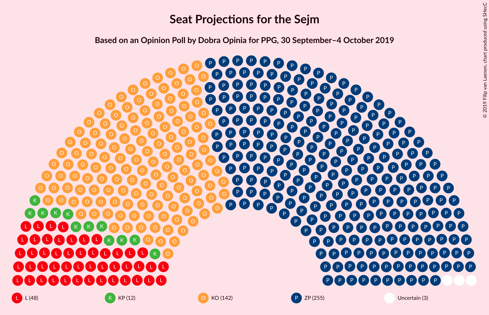
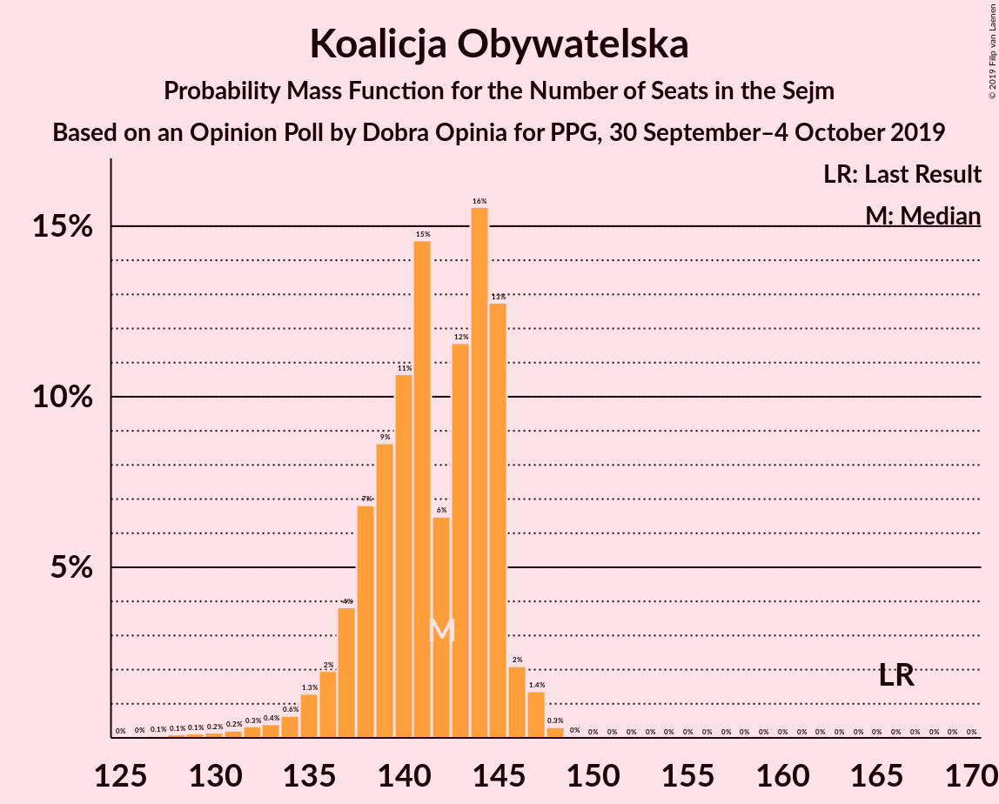
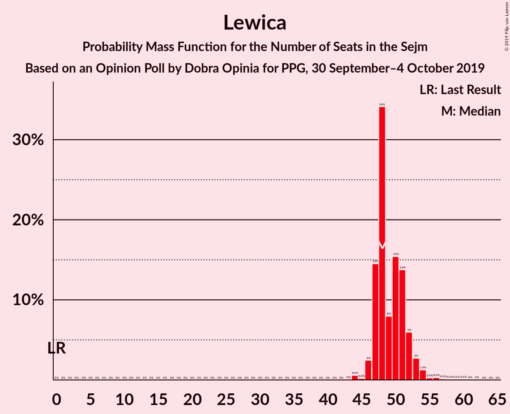
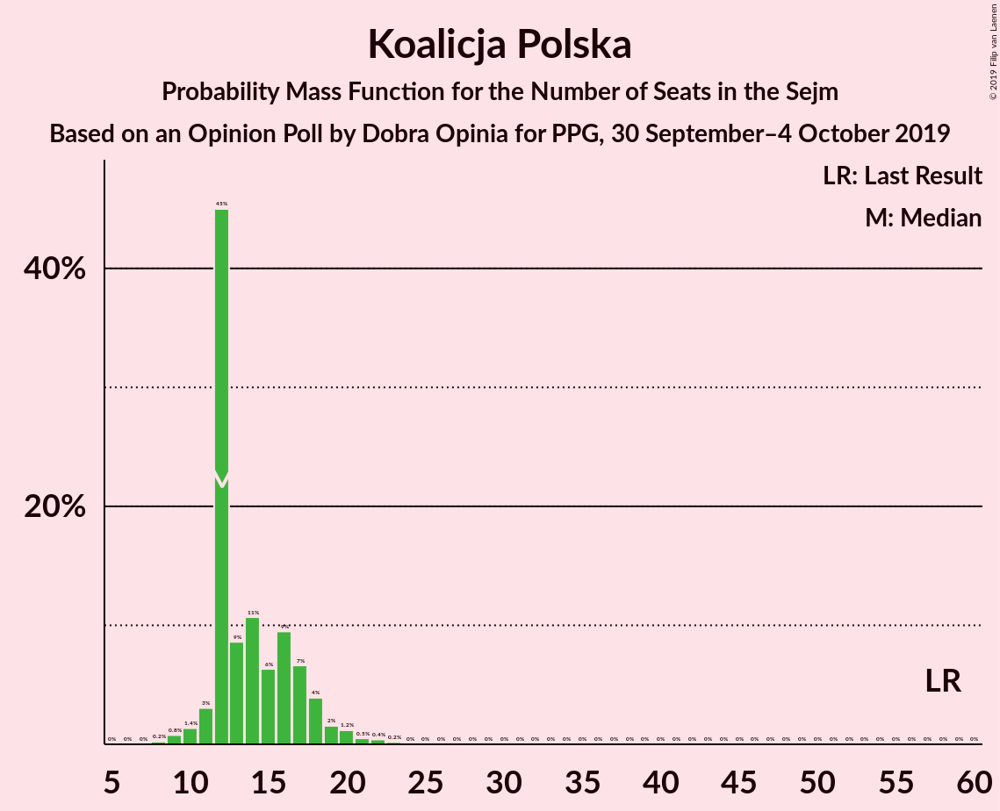
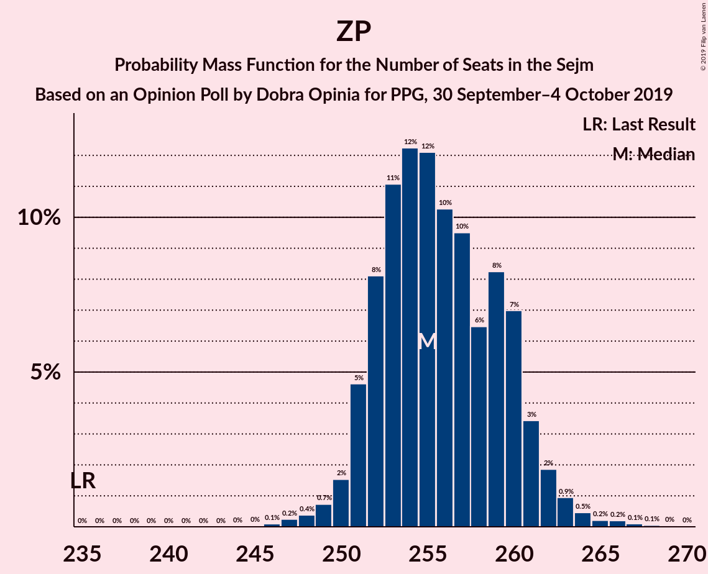

# Opinion Poll by Dobra Opinia for PPG, 30 September–4 October 2019

<a href="#voting-intentions">Voting Intentions</a> | <a href="#seats">Seats</a> | <a href="#coalitions">Coalitions</a> | <a href="#technical-information">Technical Information</a>

## Voting Intentions

### Confidence Intervals

| Party | Last Result | Poll Result | 80% Confidence Interval | 90% Confidence Interval | 95% Confidence Interval | 99% Confidence Interval |
|:-----:|:-----------:|:-----------:|:-----------------------:|:-----------------------:|:-----------------------:|:-----------------------:|
| Zjednoczona Prawica | 37.6% | 48.3% | 47.6–49.0% |47.4–49.2% |47.2–49.4% |46.9–49.7% |
| Koalicja Obywatelska | 31.7% | 27.7% | 27.1–28.3% |26.9–28.5% |26.7–28.7% |26.4–29.0% |
| Lewica | 11.7% | 12.4% | 11.9–12.9% |11.8–13.0% |11.7–13.2% |11.5–13.4% |
| Koalicja Polska | 13.9% | 6.5% | 6.2–6.9% |6.1–7.0% |6.0–7.1% |5.8–7.3% |
| Konfederacja | 4.8% | 4.2% | 3.9–4.5% |3.8–4.6% |3.8–4.7% |3.6–4.8% |

*Note:* The poll result column reflects the actual value used in the calculations. Published results may vary slightly, and in addition be rounded to fewer digits.

## Seats

### Confidence Intervals

| Party | Last Result | Median | 80% Confidence Interval | 90% Confidence Interval | 95% Confidence Interval | 99% Confidence Interval |
|:-----:|:-----------:|:------:|:-----------------------:|:-----------------------:|:-----------------------:|:-----------------------:|
| <a href="#zjednoczona-prawica">Zjednoczona Prawica</a> | 235 | 255 | 252–260 |251–261 |250–262 |248–265 |
| <a href="#koalicja-obywatelska">Koalicja Obywatelska</a> | 166 | 142 | 138–145 |136–145 |135–146 |131–147 |
| <a href="#lewica">Lewica</a> | 0 | 48 | 47–52 |47–52 |46–53 |44–56 |
| <a href="#koalicja-polska">Koalicja Polska</a> | 58 | 12 | 12–17 |11–18 |11–19 |9–22 |
| <a href="#konfederacja">Konfederacja</a> | 0 | 0 | 0 |0 |0 |0 |

### Zjednoczona Prawica

*For a full overview of the results for this party, see the [Zjednoczona Prawica](party-zjednoczonaprawica.html) page.*

| Number of Seats | Probability | Accumulated | Special Marks |
|:---------------:|:-----------:|:-----------:|:-------------:|
| 235 | 0% | 100% | Last Result |
| 236 | 0% | 100% |  |
| 237 | 0% | 100% |  |
| 238 | 0% | 100% |  |
| 239 | 0% | 100% |  |
| 240 | 0% | 100% |  |
| 241 | 0% | 100% |  |
| 242 | 0% | 100% |  |
| 243 | 0% | 100% |  |
| 244 | 0% | 100% |  |
| 245 | 0% | 100% |  |
| 246 | 0.1% | 100% |  |
| 247 | 0.2% | 99.9% |  |
| 248 | 0.4% | 99.6% |  |
| 249 | 0.7% | 99.2% |  |
| 250 | 2% | 98% |  |
| 251 | 5% | 97% |  |
| 252 | 8% | 92% |  |
| 253 | 11% | 84% |  |
| 254 | 12% | 73% |  |
| 255 | 12% | 61% | Median |
| 256 | 10% | 49% |  |
| 257 | 10% | 39% |  |
| 258 | 6% | 29% |  |
| 259 | 8% | 23% |  |
| 260 | 7% | 14% |  |
| 261 | 3% | 7% |  |
| 262 | 2% | 4% |  |
| 263 | 0.9% | 2% |  |
| 264 | 0.5% | 1.1% |  |
| 265 | 0.2% | 0.6% |  |
| 266 | 0.2% | 0.4% |  |
| 267 | 0.1% | 0.2% |  |
| 268 | 0.1% | 0.1% |  |
| 269 | 0% | 0.1% |  |
| 270 | 0% | 0% |  |

### Koalicja Obywatelska

*For a full overview of the results for this party, see the [Koalicja Obywatelska](party-koalicjaobywatelska.html) page.*

| Number of Seats | Probability | Accumulated | Special Marks |
|:---------------:|:-----------:|:-----------:|:-------------:|
| 127 | 0.1% | 100% |  |
| 128 | 0.1% | 99.9% |  |
| 129 | 0.1% | 99.8% |  |
| 130 | 0.2% | 99.7% |  |
| 131 | 0.2% | 99.5% |  |
| 132 | 0.3% | 99.3% |  |
| 133 | 0.4% | 99.0% |  |
| 134 | 0.6% | 98.6% |  |
| 135 | 1.3% | 98% |  |
| 136 | 2% | 97% |  |
| 137 | 4% | 95% |  |
| 138 | 7% | 91% |  |
| 139 | 9% | 84% |  |
| 140 | 11% | 75% |  |
| 141 | 15% | 65% |  |
| 142 | 6% | 50% | Median |
| 143 | 12% | 44% |  |
| 144 | 16% | 32% |  |
| 145 | 13% | 17% |  |
| 146 | 2% | 4% |  |
| 147 | 1.4% | 2% |  |
| 148 | 0.3% | 0.3% |  |
| 149 | 0% | 0% |  |
| 150 | 0% | 0% |  |
| 151 | 0% | 0% |  |
| 152 | 0% | 0% |  |
| 153 | 0% | 0% |  |
| 154 | 0% | 0% |  |
| 155 | 0% | 0% |  |
| 156 | 0% | 0% |  |
| 157 | 0% | 0% |  |
| 158 | 0% | 0% |  |
| 159 | 0% | 0% |  |
| 160 | 0% | 0% |  |
| 161 | 0% | 0% |  |
| 162 | 0% | 0% |  |
| 163 | 0% | 0% |  |
| 164 | 0% | 0% |  |
| 165 | 0% | 0% |  |
| 166 | 0% | 0% | Last Result |

### Lewica

*For a full overview of the results for this party, see the [Lewica](party-lewica.html) page.*

| Number of Seats | Probability | Accumulated | Special Marks |
|:---------------:|:-----------:|:-----------:|:-------------:|
| 0 | 0% | 100% | Last Result |
| 1 | 0% | 100% |  |
| 2 | 0% | 100% |  |
| 3 | 0% | 100% |  |
| 4 | 0% | 100% |  |
| 5 | 0% | 100% |  |
| 6 | 0% | 100% |  |
| 7 | 0% | 100% |  |
| 8 | 0% | 100% |  |
| 9 | 0% | 100% |  |
| 10 | 0% | 100% |  |
| 11 | 0% | 100% |  |
| 12 | 0% | 100% |  |
| 13 | 0% | 100% |  |
| 14 | 0% | 100% |  |
| 15 | 0% | 100% |  |
| 16 | 0% | 100% |  |
| 17 | 0% | 100% |  |
| 18 | 0% | 100% |  |
| 19 | 0% | 100% |  |
| 20 | 0% | 100% |  |
| 21 | 0% | 100% |  |
| 22 | 0% | 100% |  |
| 23 | 0% | 100% |  |
| 24 | 0% | 100% |  |
| 25 | 0% | 100% |  |
| 26 | 0% | 100% |  |
| 27 | 0% | 100% |  |
| 28 | 0% | 100% |  |
| 29 | 0% | 100% |  |
| 30 | 0% | 100% |  |
| 31 | 0% | 100% |  |
| 32 | 0% | 100% |  |
| 33 | 0% | 100% |  |
| 34 | 0% | 100% |  |
| 35 | 0% | 100% |  |
| 36 | 0% | 100% |  |
| 37 | 0% | 100% |  |
| 38 | 0% | 100% |  |
| 39 | 0% | 100% |  |
| 40 | 0% | 100% |  |
| 41 | 0% | 100% |  |
| 42 | 0% | 100% |  |
| 43 | 0% | 100% |  |
| 44 | 0.6% | 100% |  |
| 45 | 0.2% | 99.4% |  |
| 46 | 2% | 99.2% |  |
| 47 | 15% | 97% |  |
| 48 | 34% | 82% | Median |
| 49 | 8% | 48% |  |
| 50 | 15% | 40% |  |
| 51 | 14% | 25% |  |
| 52 | 6% | 11% |  |
| 53 | 3% | 5% |  |
| 54 | 1.3% | 2% |  |
| 55 | 0.3% | 1.0% |  |
| 56 | 0.3% | 0.8% |  |
| 57 | 0.1% | 0.5% |  |
| 58 | 0.1% | 0.4% |  |
| 59 | 0.1% | 0.2% |  |
| 60 | 0.1% | 0.1% |  |
| 61 | 0% | 0% |  |

### Koalicja Polska

*For a full overview of the results for this party, see the [Koalicja Polska](party-koalicjapolska.html) page.*

| Number of Seats | Probability | Accumulated | Special Marks |
|:---------------:|:-----------:|:-----------:|:-------------:|
| 8 | 0.2% | 100% |  |
| 9 | 0.8% | 99.7% |  |
| 10 | 1.4% | 99.0% |  |
| 11 | 3% | 98% |  |
| 12 | 45% | 95% | Median |
| 13 | 9% | 50% |  |
| 14 | 11% | 41% |  |
| 15 | 6% | 30% |  |
| 16 | 9% | 24% |  |
| 17 | 7% | 14% |  |
| 18 | 4% | 8% |  |
| 19 | 2% | 4% |  |
| 20 | 1.2% | 2% |  |
| 21 | 0.5% | 1.1% |  |
| 22 | 0.4% | 0.6% |  |
| 23 | 0.2% | 0.2% |  |
| 24 | 0% | 0% |  |
| 25 | 0% | 0% |  |
| 26 | 0% | 0% |  |
| 27 | 0% | 0% |  |
| 28 | 0% | 0% |  |
| 29 | 0% | 0% |  |
| 30 | 0% | 0% |  |
| 31 | 0% | 0% |  |
| 32 | 0% | 0% |  |
| 33 | 0% | 0% |  |
| 34 | 0% | 0% |  |
| 35 | 0% | 0% |  |
| 36 | 0% | 0% |  |
| 37 | 0% | 0% |  |
| 38 | 0% | 0% |  |
| 39 | 0% | 0% |  |
| 40 | 0% | 0% |  |
| 41 | 0% | 0% |  |
| 42 | 0% | 0% |  |
| 43 | 0% | 0% |  |
| 44 | 0% | 0% |  |
| 45 | 0% | 0% |  |
| 46 | 0% | 0% |  |
| 47 | 0% | 0% |  |
| 48 | 0% | 0% |  |
| 49 | 0% | 0% |  |
| 50 | 0% | 0% |  |
| 51 | 0% | 0% |  |
| 52 | 0% | 0% |  |
| 53 | 0% | 0% |  |
| 54 | 0% | 0% |  |
| 55 | 0% | 0% |  |
| 56 | 0% | 0% |  |
| 57 | 0% | 0% |  |
| 58 | 0% | 0% | Last Result |

### Konfederacja

*For a full overview of the results for this party, see the [Konfederacja](party-konfederacja.html) page.*

| Number of Seats | Probability | Accumulated | Special Marks |
|:---------------:|:-----------:|:-----------:|:-------------:|
| 0 | 100% | 100% | Last Result, Median |

## Coalitions

### Confidence Intervals

| Coalition | Last Result | Median | Majority? | 80% Confidence Interval | 90% Confidence Interval | 95% Confidence Interval | 99% Confidence Interval |
|:---------:|:-----------:|:------:|:---------:|:-----------------------:|:-----------------------:|:-----------------------:|:-----------------------:|
| Zjednoczona Prawica | 235 | 255 | 100% | 252–260 | 251–261 | 250–262 | 248–265 |
| Koalicja Obywatelska – Lewica – Koalicja Polska | 224 | 205 | 0% | 200–208 | 199–209 | 198–210 | 195–212 |
| Koalicja Obywatelska – Lewica | 166 | 191 | 0% | 186–195 | 185–196 | 184–197 | 181–199 |
| Koalicja Obywatelska – Koalicja Polska | 224 | 156 | 0% | 151–158 | 150–159 | 149–160 | 145–162 |
| Koalicja Obywatelska | 166 | 142 | 0% | 138–145 | 136–145 | 135–146 | 131–147 |

### Zjednoczona Prawica

| Number of Seats | Probability | Accumulated | Special Marks |
|:---------------:|:-----------:|:-----------:|:-------------:|
| 235 | 0% | 100% | Last Result |
| 236 | 0% | 100% |  |
| 237 | 0% | 100% |  |
| 238 | 0% | 100% |  |
| 239 | 0% | 100% |  |
| 240 | 0% | 100% |  |
| 241 | 0% | 100% |  |
| 242 | 0% | 100% |  |
| 243 | 0% | 100% |  |
| 244 | 0% | 100% |  |
| 245 | 0% | 100% |  |
| 246 | 0.1% | 100% |  |
| 247 | 0.2% | 99.9% |  |
| 248 | 0.4% | 99.6% |  |
| 249 | 0.7% | 99.2% |  |
| 250 | 2% | 98% |  |
| 251 | 5% | 97% |  |
| 252 | 8% | 92% |  |
| 253 | 11% | 84% |  |
| 254 | 12% | 73% |  |
| 255 | 12% | 61% | Median |
| 256 | 10% | 49% |  |
| 257 | 10% | 39% |  |
| 258 | 6% | 29% |  |
| 259 | 8% | 23% |  |
| 260 | 7% | 14% |  |
| 261 | 3% | 7% |  |
| 262 | 2% | 4% |  |
| 263 | 0.9% | 2% |  |
| 264 | 0.5% | 1.1% |  |
| 265 | 0.2% | 0.6% |  |
| 266 | 0.2% | 0.4% |  |
| 267 | 0.1% | 0.2% |  |
| 268 | 0.1% | 0.1% |  |
| 269 | 0% | 0.1% |  |
| 270 | 0% | 0% |  |

### Koalicja Obywatelska – Lewica – Koalicja Polska

| Number of Seats | Probability | Accumulated | Special Marks |
|:---------------:|:-----------:|:-----------:|:-------------:|
| 191 | 0% | 100% |  |
| 192 | 0.1% | 99.9% |  |
| 193 | 0.1% | 99.9% |  |
| 194 | 0.2% | 99.8% |  |
| 195 | 0.2% | 99.6% |  |
| 196 | 0.5% | 99.4% |  |
| 197 | 0.9% | 98.9% |  |
| 198 | 2% | 98% |  |
| 199 | 3% | 96% |  |
| 200 | 7% | 93% |  |
| 201 | 8% | 86% |  |
| 202 | 6% | 77% | Median |
| 203 | 10% | 71% |  |
| 204 | 10% | 61% |  |
| 205 | 12% | 51% |  |
| 206 | 12% | 39% |  |
| 207 | 11% | 27% |  |
| 208 | 8% | 16% |  |
| 209 | 5% | 8% |  |
| 210 | 2% | 3% |  |
| 211 | 0.7% | 2% |  |
| 212 | 0.4% | 0.8% |  |
| 213 | 0.2% | 0.4% |  |
| 214 | 0.1% | 0.1% |  |
| 215 | 0% | 0% |  |
| 216 | 0% | 0% |  |
| 217 | 0% | 0% |  |
| 218 | 0% | 0% |  |
| 219 | 0% | 0% |  |
| 220 | 0% | 0% |  |
| 221 | 0% | 0% |  |
| 222 | 0% | 0% |  |
| 223 | 0% | 0% |  |
| 224 | 0% | 0% | Last Result |

### Koalicja Obywatelska – Lewica

| Number of Seats | Probability | Accumulated | Special Marks |
|:---------------:|:-----------:|:-----------:|:-------------:|
| 166 | 0% | 100% | Last Result |
| 167 | 0% | 100% |  |
| 168 | 0% | 100% |  |
| 169 | 0% | 100% |  |
| 170 | 0% | 100% |  |
| 171 | 0% | 100% |  |
| 172 | 0% | 100% |  |
| 173 | 0% | 100% |  |
| 174 | 0% | 100% |  |
| 175 | 0% | 100% |  |
| 176 | 0% | 100% |  |
| 177 | 0% | 100% |  |
| 178 | 0.1% | 99.9% |  |
| 179 | 0.2% | 99.8% |  |
| 180 | 0.1% | 99.7% |  |
| 181 | 0.2% | 99.6% |  |
| 182 | 0.5% | 99.4% |  |
| 183 | 0.7% | 98.9% |  |
| 184 | 1.3% | 98% |  |
| 185 | 3% | 97% |  |
| 186 | 4% | 94% |  |
| 187 | 7% | 89% |  |
| 188 | 9% | 82% |  |
| 189 | 12% | 74% |  |
| 190 | 10% | 62% | Median |
| 191 | 12% | 51% |  |
| 192 | 11% | 39% |  |
| 193 | 7% | 28% |  |
| 194 | 7% | 21% |  |
| 195 | 6% | 14% |  |
| 196 | 4% | 8% |  |
| 197 | 2% | 4% |  |
| 198 | 0.7% | 2% |  |
| 199 | 0.4% | 0.8% |  |
| 200 | 0.2% | 0.4% |  |
| 201 | 0.1% | 0.2% |  |
| 202 | 0.1% | 0.1% |  |
| 203 | 0% | 0% |  |

### Koalicja Obywatelska – Koalicja Polska

| Number of Seats | Probability | Accumulated | Special Marks |
|:---------------:|:-----------:|:-----------:|:-------------:|
| 141 | 0% | 100% |  |
| 142 | 0.1% | 99.9% |  |
| 143 | 0.1% | 99.8% |  |
| 144 | 0.2% | 99.7% |  |
| 145 | 0.2% | 99.5% |  |
| 146 | 0.3% | 99.3% |  |
| 147 | 0.5% | 99.0% |  |
| 148 | 0.9% | 98% |  |
| 149 | 2% | 98% |  |
| 150 | 2% | 96% |  |
| 151 | 4% | 94% |  |
| 152 | 8% | 89% |  |
| 153 | 9% | 82% |  |
| 154 | 7% | 73% | Median |
| 155 | 12% | 66% |  |
| 156 | 17% | 54% |  |
| 157 | 19% | 37% |  |
| 158 | 11% | 18% |  |
| 159 | 4% | 7% |  |
| 160 | 2% | 3% |  |
| 161 | 1.1% | 2% |  |
| 162 | 0.4% | 0.6% |  |
| 163 | 0.1% | 0.1% |  |
| 164 | 0% | 0% |  |
| 165 | 0% | 0% |  |
| 166 | 0% | 0% |  |
| 167 | 0% | 0% |  |
| 168 | 0% | 0% |  |
| 169 | 0% | 0% |  |
| 170 | 0% | 0% |  |
| 171 | 0% | 0% |  |
| 172 | 0% | 0% |  |
| 173 | 0% | 0% |  |
| 174 | 0% | 0% |  |
| 175 | 0% | 0% |  |
| 176 | 0% | 0% |  |
| 177 | 0% | 0% |  |
| 178 | 0% | 0% |  |
| 179 | 0% | 0% |  |
| 180 | 0% | 0% |  |
| 181 | 0% | 0% |  |
| 182 | 0% | 0% |  |
| 183 | 0% | 0% |  |
| 184 | 0% | 0% |  |
| 185 | 0% | 0% |  |
| 186 | 0% | 0% |  |
| 187 | 0% | 0% |  |
| 188 | 0% | 0% |  |
| 189 | 0% | 0% |  |
| 190 | 0% | 0% |  |
| 191 | 0% | 0% |  |
| 192 | 0% | 0% |  |
| 193 | 0% | 0% |  |
| 194 | 0% | 0% |  |
| 195 | 0% | 0% |  |
| 196 | 0% | 0% |  |
| 197 | 0% | 0% |  |
| 198 | 0% | 0% |  |
| 199 | 0% | 0% |  |
| 200 | 0% | 0% |  |
| 201 | 0% | 0% |  |
| 202 | 0% | 0% |  |
| 203 | 0% | 0% |  |
| 204 | 0% | 0% |  |
| 205 | 0% | 0% |  |
| 206 | 0% | 0% |  |
| 207 | 0% | 0% |  |
| 208 | 0% | 0% |  |
| 209 | 0% | 0% |  |
| 210 | 0% | 0% |  |
| 211 | 0% | 0% |  |
| 212 | 0% | 0% |  |
| 213 | 0% | 0% |  |
| 214 | 0% | 0% |  |
| 215 | 0% | 0% |  |
| 216 | 0% | 0% |  |
| 217 | 0% | 0% |  |
| 218 | 0% | 0% |  |
| 219 | 0% | 0% |  |
| 220 | 0% | 0% |  |
| 221 | 0% | 0% |  |
| 222 | 0% | 0% |  |
| 223 | 0% | 0% |  |
| 224 | 0% | 0% | Last Result |

### Koalicja Obywatelska

| Number of Seats | Probability | Accumulated | Special Marks |
|:---------------:|:-----------:|:-----------:|:-------------:|
| 127 | 0.1% | 100% |  |
| 128 | 0.1% | 99.9% |  |
| 129 | 0.1% | 99.8% |  |
| 130 | 0.2% | 99.7% |  |
| 131 | 0.2% | 99.5% |  |
| 132 | 0.3% | 99.3% |  |
| 133 | 0.4% | 99.0% |  |
| 134 | 0.6% | 98.6% |  |
| 135 | 1.3% | 98% |  |
| 136 | 2% | 97% |  |
| 137 | 4% | 95% |  |
| 138 | 7% | 91% |  |
| 139 | 9% | 84% |  |
| 140 | 11% | 75% |  |
| 141 | 15% | 65% |  |
| 142 | 6% | 50% | Median |
| 143 | 12% | 44% |  |
| 144 | 16% | 32% |  |
| 145 | 13% | 17% |  |
| 146 | 2% | 4% |  |
| 147 | 1.4% | 2% |  |
| 148 | 0.3% | 0.3% |  |
| 149 | 0% | 0% |  |
| 150 | 0% | 0% |  |
| 151 | 0% | 0% |  |
| 152 | 0% | 0% |  |
| 153 | 0% | 0% |  |
| 154 | 0% | 0% |  |
| 155 | 0% | 0% |  |
| 156 | 0% | 0% |  |
| 157 | 0% | 0% |  |
| 158 | 0% | 0% |  |
| 159 | 0% | 0% |  |
| 160 | 0% | 0% |  |
| 161 | 0% | 0% |  |
| 162 | 0% | 0% |  |
| 163 | 0% | 0% |  |
| 164 | 0% | 0% |  |
| 165 | 0% | 0% |  |
| 166 | 0% | 0% | Last Result |

## Technical Information

### Opinion Poll

+ **Polling firm:** Dobra Opinia
+ **Commissioner(s):** PPG
+ **Fieldwork period:** 30 September–4 October 2019

### Calculations

+ **Sample size:** 8000
+ **Simulations done:** 1,048,576
+ **Error estimate:** 0.12%

